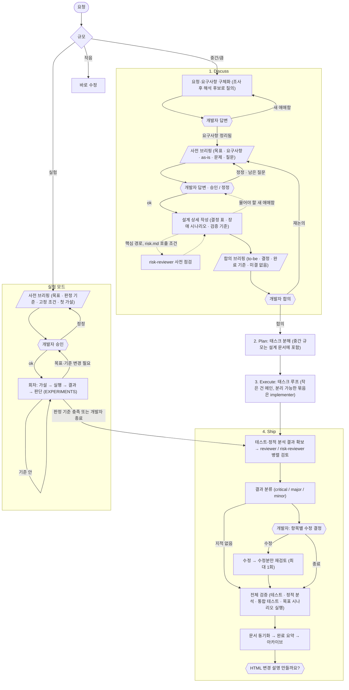

```mermaid
flowchart TB
    START([요청]) --> SIZE{규모}
    SIZE -->|작음| DIRECT[바로 수정]
    SIZE -->|중간/큼| B0
    SIZE -->|실험| X1

    subgraph DISCUSS ["1. Discuss"]
        B0["요청·요구사항 구체화 (조사 후 해석 후보로 질의)"] --> UQ{{개발자 답변}}
        UQ -->|새 애매함| B0
        UQ -->|요구사항 정리됨| B1
        B1[/"사전 브리핑 (목표 · 요구사항 · as-is · 문제 · 질문)"/] --> U1{{개발자 답변 · 승인 / 정정}}
        U1 -->|정정 · 남은 질문| B1
        U1 -->|ok| D["설계 상세 작성 (결정 표 · 장애 시나리오 · 검증 기준)"]
        D -.->|물어야 할 새 애매함| U1
        D -.->|핵심 경로, risk.md 호출 조건| RR["risk-reviewer 사전 점검"]
        RR -.-> D
        D --> B2[/"합의 브리핑 (to-be · 결정 · 완료 기준 · 미결 없음)"/] --> U2{{개발자 합의}}
        U2 -->|재논의| B1
    end

    U2 -->|합의| PLAN["2. Plan: 태스크 분해 (중간 규모는 설계 문서에 포함)"]
    PLAN --> EXEC["3. Execute: 태스크 루프 (작은 건 메인, 분리 가능한 묶음은 implementer)"]

    subgraph SHIP ["4. Ship"]
        R["테스트·정적 분석 결과 확보 → reviewer / risk-reviewer 병렬 검토"] --> F["결과 분류 (critical / major / minor)"]
        F --> U3{{개발자: 항목별 수정 결정}}
        F -->|지적 없음| V
        U3 -->|수정| FIX["수정 → 수정분만 재검토 (최대 1회)"] --> V
        U3 -->|종료| V["전체 검증 (테스트 · 정적 분석 · 통합 테스트 · 목표 시나리오 실행)"]
        V --> DOCS["문서 동기화 → 완료 요약 → 아카이브"]
        DOCS --> Q{{"HTML 변경 설명 만들까요?"}}
    end

    EXEC --> R

    subgraph EXPERIMENT ["실험 모드"]
        X1[/"사전 브리핑 (목표 · 판정 기준 · 고정 조건 · 첫 가설)"/] --> XU{{개발자 승인}}
        XU -->|정정| X1
        XU -->|ok| XR["회차: 가설 → 실행 → 결과 → 판단 (EXPERIMENTS)"]
        XR -->|기준 안| XR
        XR -->|목표·기준 변경 필요| XU
    end

    XR -->|판정 기준 충족 또는 개발자 종료| R
```

합의 뒤 변경 요청의 분기는 [change-request.md](change-request.md)에 있다.
