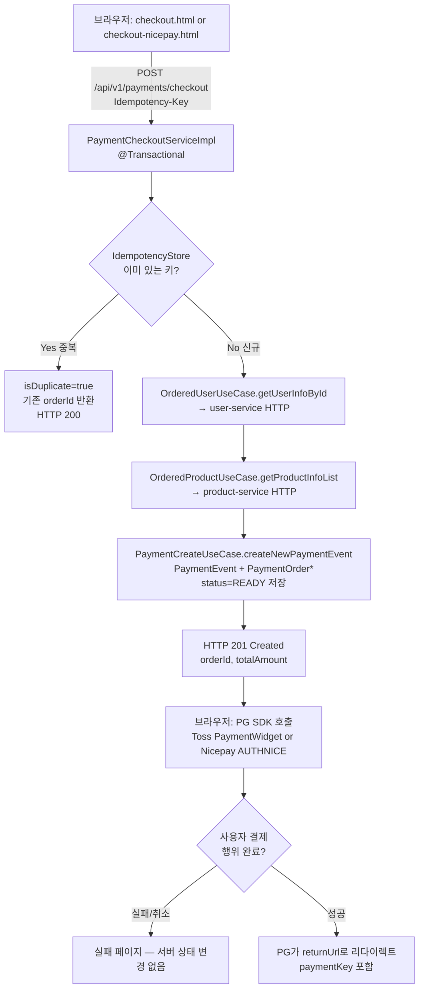
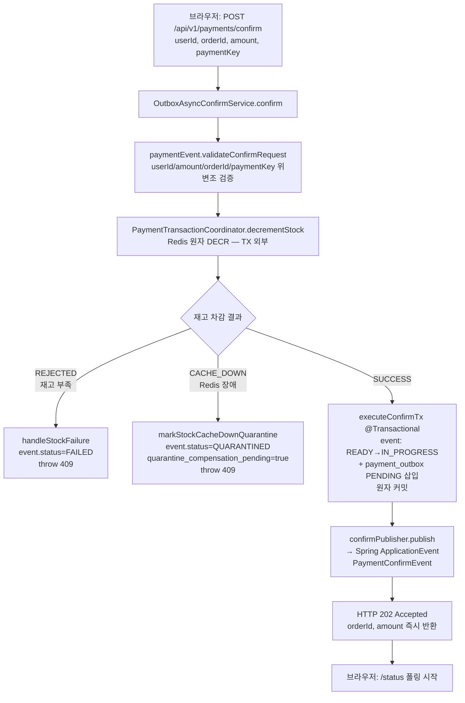
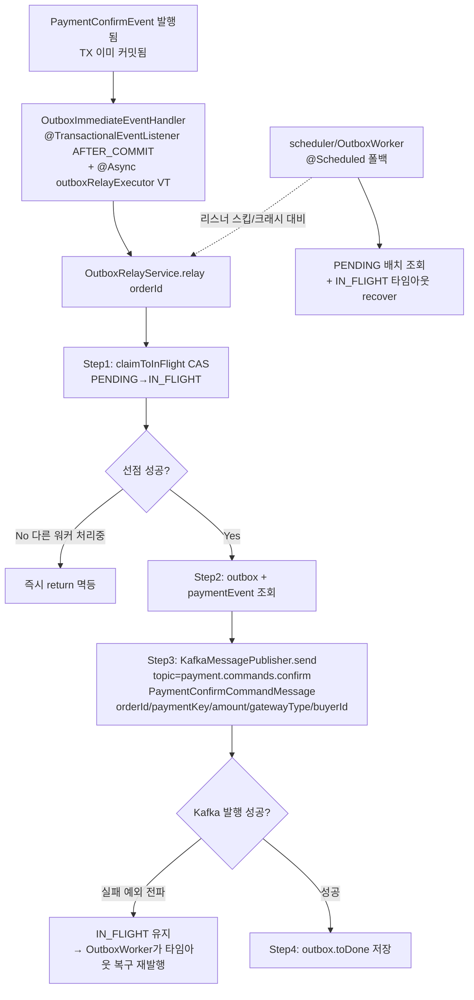
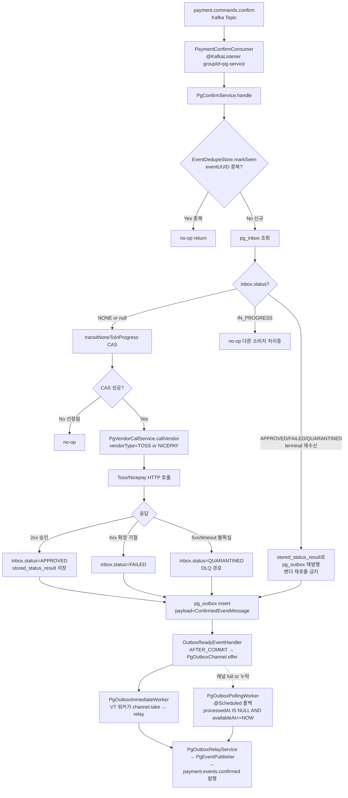
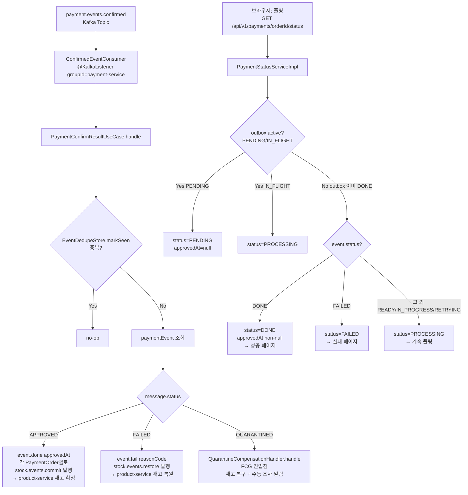

# Payment Flow 브리핑 — 웹에서 결제 요청 시 end-to-end 처리

현재 `main` (MSA 전환 중, pg-service 분리 완료 후 기준) 코드를 기준으로, 브라우저가
결제를 시작해서 최종 DONE/FAILED까지 도달하는 전 과정을 정리한다.

---

## 한 줄 요약

브라우저 → **checkout (결제 이벤트 생성)** → **PG SDK 창** → **confirm (Redis 재고 DECR
→ outbox PENDING 커밋 → Kafka `payment.commands.confirm` 발행)** → pg-service가
소비해 **실제 Toss/Nicepay 호출** → 결과를 `payment.events.confirmed`로 되쏨 →
payment-service가 **DONE/FAILED/QUARANTINED** 전이 + **재고 commit/restore** 이벤트
발행 → 브라우저는 **GET /status 폴링**으로 최종 상태 확인.

---

## 전체 플로우차트 (분기 포함)

### Phase 1 — 주문 생성 + PG SDK 진입

### Phase 2 — confirm 비동기 진입 (핵심)

### Phase 3 — outbox relay → Kafka (payment-service)

### Phase 4 — pg-service 소비 + 실제 PG 호출 + outbox relay

### Phase 5 — payment-service 수신 + 최종 상태 + 재고 정산

---

## Outbox Relay 워커 대응 관계 (Phase 3 vs Phase 4 말미)

두 서비스 모두 Transactional Outbox 패턴을 쓰지만 **다른 인스턴스 / 다른 빈 / 다른 스레드**다. ADR-04 대칭 설계.

| 역할 | payment-service (Phase 3) | pg-service (Phase 4 말미) |
|---|---|---|
| AFTER_COMMIT 리스너 | `OutboxImmediateEventHandler` | `OutboxReadyEventHandler` |
| 즉시 릴레이 엔진 | `@Async("outboxRelayExecutor")` — Spring 관리 VT 풀 | `PgOutboxChannel` (in-memory BlockingQueue) + `PgOutboxImmediateWorker` (SmartLifecycle VT 워커 N개) |
| 폴링 폴백 | `OutboxWorker` (@Scheduled, PENDING 배치) | `PgOutboxPollingWorker` (@Scheduled, `processedAt IS NULL AND availableAt <= NOW`) |
| 실제 Kafka 발행 | `OutboxRelayService` → `KafkaMessagePublisher` | `PgOutboxRelayService` → `PgEventPublisher` |
| 발행 토픽 | `payment.commands.confirm` | `payment.events.confirmed` |

pg-service는 채널(`PgOutboxChannel`, BlockingQueue)을 **명시적으로** 두고 `PgOutboxImmediateWorker`가 `channel.take()` 블로킹 수신 → VT executor 위임. payment-service는 Spring `@Async`가 큐/워커를 캡슐화. ADR-30 available_at 기반 지연 발행은 pg 쪽에만 적용.

---

## 시계열 요약

| # | 주체 | 동작 | 결과물 |
|---|---|---|---|
| 1 | 브라우저 | `POST /checkout` | payment_event(READY) + payment_order INSERT, 201 |
| 2 | 브라우저 | PG SDK 열림 → 결제 승인 | `paymentKey` 획득, returnUrl 리다이렉트 |
| 3 | 브라우저 | `POST /confirm` | — |
| 4 | payment | Redis stock DECR | SUCCESS / REJECTED / CACHE_DOWN |
| 5 | payment | TX 커밋: event IN_PROGRESS + outbox PENDING | — |
| 6 | payment | `confirmPublisher.publish` (ApplicationEvent) | 호출자에게 **즉시 HTTP 202 반환** |
| 7 | payment | AFTER_COMMIT + @Async VT 리스너 | outbox IN_FLIGHT 선점 → **Kafka `payment.commands.confirm` 발행** → outbox DONE |
| 8 | pg | Kafka consume | pg_inbox NONE→IN_PROGRESS CAS |
| 9 | pg | Toss/Nicepay HTTP 호출 | APPROVED / FAILED / QUARANTINED |
| 10 | pg | pg_outbox 저장 → PgOutboxImmediateWorker relay | **Kafka `payment.events.confirmed` 발행** |
| 11 | payment | Kafka consume | event DONE/FAILED, 재고 commit/restore 발행 |
| 12 | 브라우저 | `GET /status` 폴링 | PENDING → PROCESSING → DONE/FAILED |

---

## 장애 복원 포인트

- **리스너 스킵/크래시**: payment쪽은 `OutboxWorker`, pg쪽은 `PgOutboxPollingWorker`가 PENDING/타임아웃 IN_FLIGHT를 재픽업
- **PG 5xx/timeout**: pg_inbox=QUARANTINED, payment 측 `QuarantineCompensationHandler`에서 FCG 경로 실행
- **재고 캐시 장애**: confirm 단계에서 CACHE_DOWN → event QUARANTINED + 보상 펜딩, `QuarantineCompensationScheduler`가 재시도
- **드리프트 체크**: `PaymentReconciler` (@Scheduled 2분) — pg/payment 상태 불일치 스캔
- **중복 메시지**: `EventDedupeStore`(Redis eventUUID) — pg/payment 양쪽에서 1단 dedupe, inbox/outbox 상태 CAS가 2단 멱등성

---

## 로컬 구동 시 주의사항

- `OutboxImmediateEventHandler`는 `payment.monolith.confirm.enabled=true`일 때만 등록됨 — 현재 MSA 전환 진행형 플래그.
  - `application-benchmark.yml`에 설정이 없으면 **payment 측 outbox relay는 OutboxWorker 폴백 (2초 주기)에만 의존**하므로 HTTP 202 이후 `/status=DONE`까지 2~4초 추가 지연 가능.
- `ConfirmedEventConsumer` / `PaymentConfirmConsumer`는 `spring.kafka.bootstrap-servers` 조건.
  - Kafka 미기동 상태로 띄우면 outbox는 IN_FLIGHT→DONE까지 가지만 `payment.events.confirmed` 소비자가 없어 **event.status는 영영 PROCESSING**에 멈춤.
- user-service / product-service가 안 떠 있으면 Phase 1의 HTTP 호출에서 503 (`USER_SERVICE_UNAVAILABLE` / `PRODUCT_SERVICE_UNAVAILABLE`) 반환 — checkout 자체가 안 뜸.
- Redis가 안 떠 있으면 `IdempotencyStoreRedisAdapter` 장애로 checkout 자체 실패. confirm 단계에서는 재고 DECR 실패 → `CACHE_DOWN` → QUARANTINED 전이 경로.
