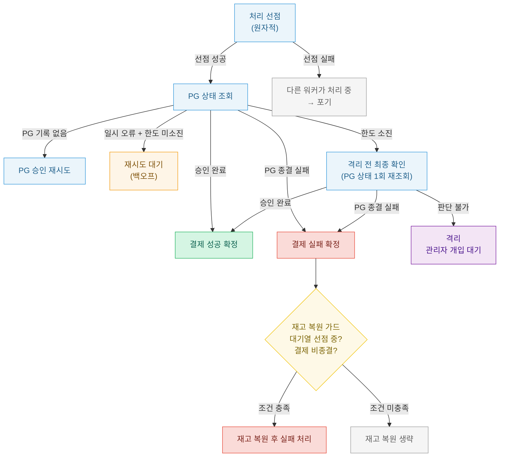
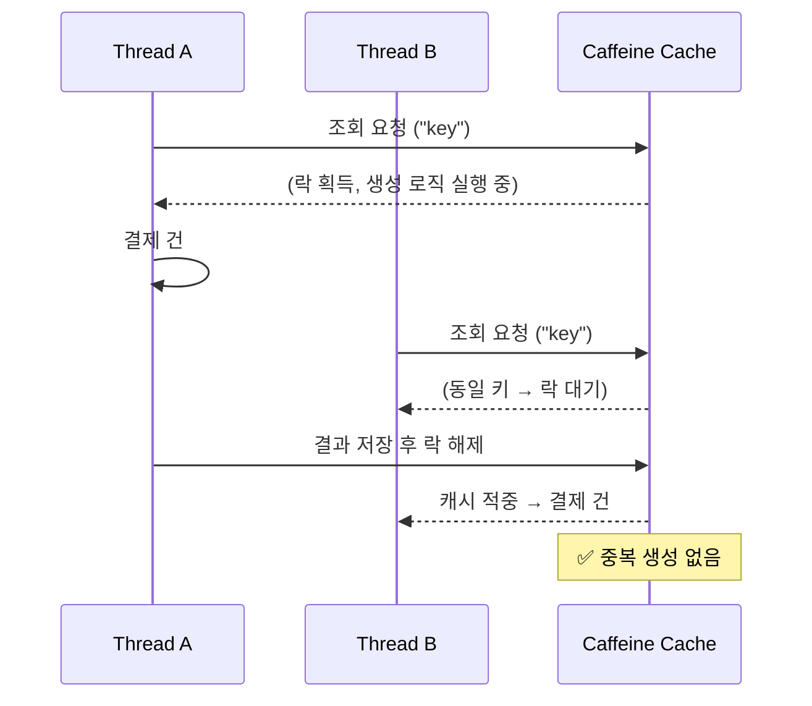
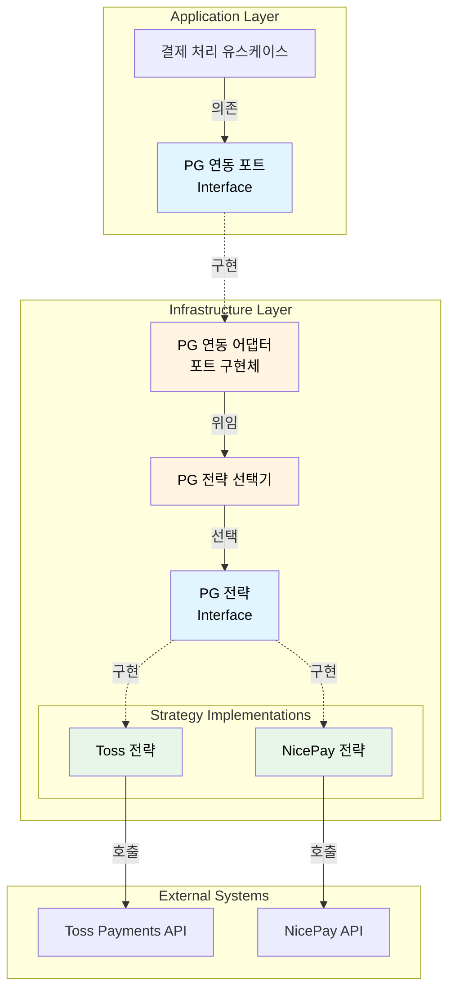
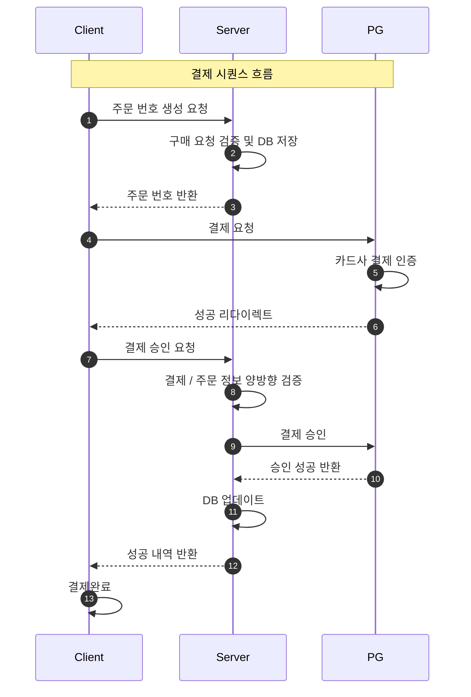

# Payments Platform

결제 연동 환경에서 발생하는 문제들(위변조 방지, 멱등성 보장, 비동기 결제 처리, 자동 복구, 분산 트랜잭션 등)을 직접 설계하고 구현한 프로젝트입니다.

> **현재 상태** (2026-04-27): MSA 4서비스(payment / pg / product / user) + Eureka + Gateway 분리 완료. Kafka 양방향 비동기 confirm. 다음 단계는 운영 회복성 검증 (Toxiproxy 장애 주입 + k6 재설계 + 로컬 오토스케일러).

<br>

## 🚀 주요 해결 과제

- **동기 → 비동기 아키텍처 전환 및 성능 측정**: Toss API 지연이 HTTP 스레드를 직접 블로킹하는 동기 구조에서 비동기 + Outbox 채널 전략으로 전환
- **정합성 오류 및 위변조 요청 방지**: 클라이언트·서버·PG 응답값을 교차 검증하고 Checkout 멱등성(Caffeine 캐시 + TOCTOU 해결)을 보장하여 중복 주문 및 금액 위변조를 차단
- **장애 내성 복구 체계 설계**: 복구 판정 객체로 결정을 집중하고, 스케줄링·재고 복원 가드·격리 전 최종 확인으로 외부 장애 시에도 재고·결제 상태의 일관성 유지
- **모놀리스 → MSA 분리**: 단일 모놀리스를 4 비즈니스 서비스(payment / pg / product / user) + Eureka + Gateway 로 분해. payment ↔ pg 는 Kafka 양방향 메시지로만 통신하여 PG 호출을 격리하고, AMOUNT_MISMATCH 양방향 방어·dedupe two-phase lease·다중 홉 traceparent 전파를 보강

<br>

## 🗺️ 개발 과정

|  Phase  | 목표                 | 구현 내용                                                                                                                                                                                                                                     |
|:-------:|:-------------------|:------------------------------------------------------------------------------------------------------------------------------------------------------------------------------------------------------------------------------------------|
| Phase 1 | 데이터 정합성 확립         | [교차 검증 연동](https://github.com/hyoguoo/payment-platform/wiki/cross-validation)                                                                                                                                                             |
| Phase 2 | 결합도 해소 및 자가 복구력    | [트랜잭션 범위 최소화](https://github.com/hyoguoo/payment-platform/wiki/tx-scope) · [상태 기반 복구 모델 및 재시도 로직](https://github.com/hyoguoo/payment-platform/wiki/retry-recovery)                                                                        |
| Phase 3 | 운영 가시성 및 안정성       | [시나리오 테스트](https://github.com/hyoguoo/payment-platform/wiki/scenario-test) · [구조화된 로깅](https://github.com/hyoguoo/payment-platform/wiki/structured-logging) · [결제 이력 추적 및 모니터링](https://github.com/hyoguoo/payment-platform/wiki/metrics) |
| Phase 4 | 데이터 정합성 심화 및 중복 제어 | [보상 TX 실패 대응](https://github.com/hyoguoo/payment-platform/wiki/compensation-tx) · [Checkout 멱등성 보장](https://github.com/hyoguoo/payment-platform/wiki/idempotency)                                                                         |
| Phase 5 | 비동기 결제 아키텍처 전환     | [비동기 가상 스레드 기반 결제 플로우](https://github.com/hyoguoo/payment-platform/wiki/async-outbox) · [도메인 상태 머신과 장애 내성 복구 체계](https://github.com/hyoguoo/payment-platform/wiki/state-management)                                                       |
| Phase 6 | MSA 분리 + Kafka 양방향   | 모놀리스 → 4서비스 + Eureka + Gateway 분해, payment ↔ pg Kafka 양방향 confirm 왕복, DB per service 분리, AMOUNT_MISMATCH 양방향 방어 (PRE-PHASE-4-HARDENING 포함)                                                                                                  |
|   ETC   | 설계 유연성             | [전략 패턴 기반 멀티 PG 연동](https://github.com/hyoguoo/payment-platform/wiki/pg-strategy)                                                                                                                                                         |
|   ETC   | AI 기반 개발 워크플로우     | [서브에이전트 기반 6단계 워크플로우](https://github.com/hyoguoo/payment-platform/wiki/ai-workflow)                                                                                                                                                       |

<br>

## 🔑 핵심 구현 및 주요 기능

> 각 항목 제목을 클릭하면 상세 설계 내용이 담긴 Wiki 페이지로 이동합니다.

### [비동기 결제 확인 플로우 — Outbox 채널 기반 비동기 아키텍처 전환 및 벤치마크](https://github.com/hyoguoo/payment-platform/wiki/async-outbox)

- 동기(Sync) 전략에서 Toss API 지연이 HTTP 스레드를 직접 블로킹해 고부하 시 TPS 급락·스레드 고갈 문제가 발생
- 내부 큐 + 가상 스레드 워커 구조로 PG 요청을 비동기로 처리하여 네트워크 지연 병목 해결
- 포스팅: [비동기 결제 처리 플로우 구현 — Outbox 패턴부터 LinkedBlockingQueue Worker까지](https://hyoguoo.github.io/blog/async-payment-flow)


#### k6 부하 테스트 결과 (Round 9 — 최종):

|     네트워크 지연 환경     |    전략     |       TPS       | Confirm 응답 (med) | E2E Latency (med) |     요청 유실     |
|:------------------:|:---------:|:---------------:|:----------------:|:-----------------:|:-------------:|
| **고지연** (2.0~3.5s) |   Sync    |      54.1       |     6,157ms      |      3,190ms      |     1,945     |
| **고지연** (2.0~3.5s) | **Async** | **79.8 (+47%)** |    **5.3ms**     |    **2,820ms**    | **0 (-100%)** |
| **저지연** (0.1~0.3s) | **Sync**  |      106.4      |      210ms       |       211ms       |       0       |
| **저지연** (0.1~0.3s) |   Async   |      93.5       |      6.3ms       |       305ms       |       0       |

- 고지연 환경에서 Outbox 전략이 TPS 47% 상승, 요청 유실 100% 감소 기록
- **이상적 자원 할당(Sweet Spot)**: 무작정 커넥션 풀을 늘리기보다 시스템 한계에 맞는 최적의 수치(HikariCP 30 등)를 도출하여 안정성과 성능의 균형 확보
- 상세 보고서: [Benchmark-Report](https://github.com/hyoguoo/payment-platform/wiki/Benchmark-Report)

### [결제 상태 관리 — 도메인 상태 머신과 장애 내성 복구 체계](https://github.com/hyoguoo/payment-platform/wiki/state-management)

- PG 상태 조회 후 복구 판정 객체가 종결/재시도/격리를 결정
- 재시도 한도 소진 시 격리 전 최종 확인(PG 상태 1회 재조회)으로 성공 건의 오격리 방지, 격리 상태로 관리자 개입 유도
- 보상 트랜잭션 실행 전 이중 조건 가드(대기열 선점 중 + 결제 비종결)로 동시성 경합 시 재고 이중 복원 차단
- 포스팅: [결제 복구 상태 전이 설계](https://hyoguoo.github.io/blog/payment-recovery-state-design)



### [Checkout API 멱등성 보장 — TOCTOU 경쟁 조건 해결](https://github.com/hyoguoo/payment-platform/wiki/idempotency)

- UI 중복 클릭, 네트워크 재시도 등으로 결제 건이 복수 생성되어 DB에 유효하지 않은 주문이 누적되는 문제 존재
- 초기 조회 후 생성 방식에서 코드 리뷰 중 TOCTOU 경쟁 조건 발견, 단일 원자적 조회·생성 메서드로 포트 계약 재설계
- 포스팅: [Checkout API 멱등성 보장 — Caffeine 캐시와 TOCTOU 경쟁 조건 해결](https://hyoguoo.github.io/blog/checkout-idempotency)



### [전략 패턴 기반 멀티 PG 연동](https://github.com/hyoguoo/payment-platform/wiki/pg-strategy)

- Application 계층은 `PaymentGatewayPort` 인터페이스에만 의존하여 PG 독립성을 확보
- 전략 패턴으로 Toss/NicePay 두 PG사를 동시 지원하며, 결제건마다 `gatewayType`으로 올바른 PG를 라우팅
- NicePay의 멱등성 키 부재를 중복 승인 에러(2201) 감지 + 조회 API 보상 패턴으로 해결
- 포스팅: [전략 패턴을 통한 결제 게이트웨이 추상화 및 확장성 확보](https://hyoguoo.github.io/blog/payment-gateway-strategy-pattern)



### [결제 흐름 추적 및 핵심 지표 모니터링 시스템 구현](https://github.com/hyoguoo/payment-platform/wiki/metrics)

- 승인 지연, 재시도 등 복잡한 결제 흐름 추적의 어려움 및 실시간 성능/이상 징후를 파악할 핵심 지표 부재
- 구조화된 로깅 적용 / 결제 정보 변동 저장 및 어드민 페이지 구현 / 커스텀 메트릭 수집을 통한 핵심 지표 모니터링 체계 구축


### [결제 데이터 검증을 통한 데이터 정합성 보장](https://github.com/hyoguoo/payment-platform/wiki/cross-validation)

- 클라이언트가 주문 생성부터 승인까지 처리하는 방식으로, 중간 값 조작 같은 위변조 가능성 존재
- 서버 주도의 흐름으로 전환하고, 클라이언트·서버·PG 응답값을 교차 검증하여 불일치 시 결제를 거부하도록 설계



### [트랜잭션 범위 최소화를 통한 성능 및 응답 시간 최적화](https://github.com/hyoguoo/payment-platform/wiki/tx-scope)

- 외부 API 호출이 포함된 단일 트랜잭션 구조로 인해 커넥션 점유와 응답 지연 문제가 발생
- 외부 호출을 트랜잭션 외부로 분리하고 보상 트랜잭션을 적용해 안정성과 성능을 함께 확보
- 포스팅: [트랜잭션 범위 최소화를 통한 성능 및 안정성 향상](https://hyoguoo.github.io/blog/minimize-transaction-scope)


### [외부 의존성을 제어한 테스트 환경에서의 시나리오 검증](https://github.com/hyoguoo/payment-platform/wiki/scenario-test)

- 외부 API에 의존하는 구조로 인해 다양한 예외 상황에 대한 테스트가 어려움 존재
- Fake 객체 기반의 테스트 환경을 구성하여 승인 실패, 지연, 중복 요청 등 다양한 시나리오를 유연하게 검증
- 포스팅: [외부 의존성 제어를 통한 결제 프로세스 다양한 시나리오 검증](https://hyoguoo.github.io/blog/payment-system-test)


<br>

### 🛠 사용 기술 스택

- Java 21
- Spring Boot 3.4.4
- MySQL 8.0.33
- JUnit 5

<br>

## 🏗 [프로젝트 구조](https://github.com/hyoguoo/payment-platform/wiki/architecture)

헥사고날 아키텍처(포트/어댑터) 기반으로 도메인을 분리하고, 도메인 간 협력은 Internal Receiver 패턴을 통해 결합도를 낮췄습니다.


<br>

## ▶️ Quick Start

### 서비스 구성

|  포트  |        서비스        |      설명      |
|:----:|:-----------------:|:------------:|
| 8090 |      Gateway      |   API 게이트웨이   |
| 8761 |      Eureka       |   서비스 디스커버리   |
| 8081 |  payment-service  |    결제 서비스    |
| 8082 |    pg-service     | PG 승인/중계 서비스  |
| 8083 |  product-service  |    상품 서비스    |
| 8084 |   user-service    |    회원 서비스    |
| 3306 | mysql-payment     | payment DB |
| 3308 |   mysql-pg        |    pg DB     |
| 3309 | mysql-product     |  product DB  |
| 3310 |   mysql-user      |   user DB    |
| 9092 |       Kafka       |   이벤트 브로커    |
| 6379 |  redis-dedupe     |  dedupe 캐시   |
| 6380 |   redis-stock     |   재고 캐시    |

> 관측성(Prometheus·Grafana·Tempo·Loki)은 `docker/docker-compose.observability.yml`에서 기동한다.

#### 시크릿 설정

```bash
cp .env.secret.example .env.secret
# TOSS_SECRET_KEY, NICEPAY_CLIENT_KEY, NICEPAY_SECRET_KEY 입력
```

### 실행 방법

#### 애플리케이션 실행

```bash
bash scripts/compose-up.sh
```

기동 후 인프라 + 4서비스 헬스 검증:

```bash
bash scripts/smoke/infra-healthcheck.sh
```

실행 후 http://localhost:8081 (payment-service) 에서 전체 페이지를 탐색할 수 있습니다.

| URL                                                 | 설명                                     |
|:----------------------------------------------------|:---------------------------------------|
| http://localhost:8081                               | 홈 — 결제 흐름 · 어드민 · 모니터링 링크 모음           |
| http://localhost:8081/payment/checkout.html         | 결제하기 — 토스페이먼츠 결제창 호출                   |
| http://localhost:8081/payment/checkout-nicepay.html | 결제하기 — 나이스페이먼츠 결제창 호출                  |
| http://localhost:8081/admin/payments/events         | 결제 이벤트 목록 조회 / 검색                      |
| http://localhost:8081/admin/payments/history        | 결제 히스토리 — 상태 변경 이력 조회                  |
