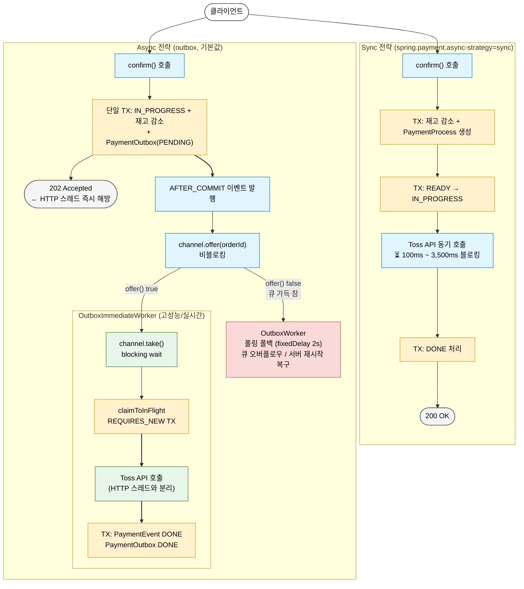
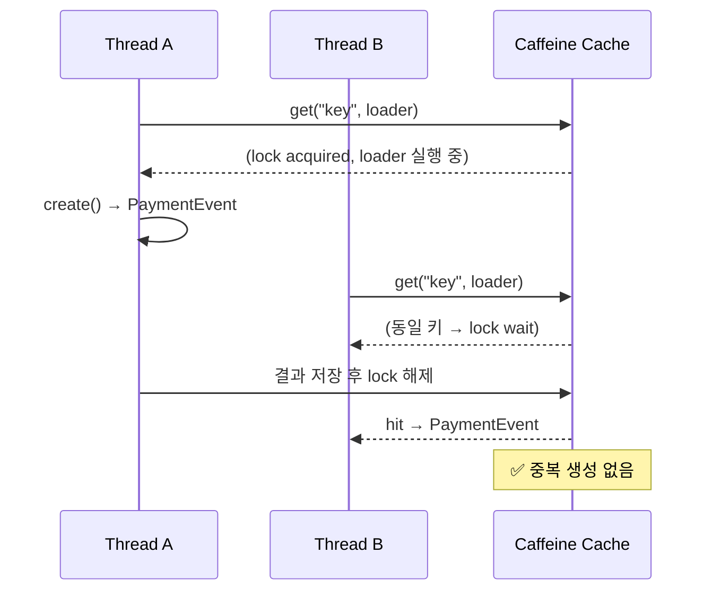
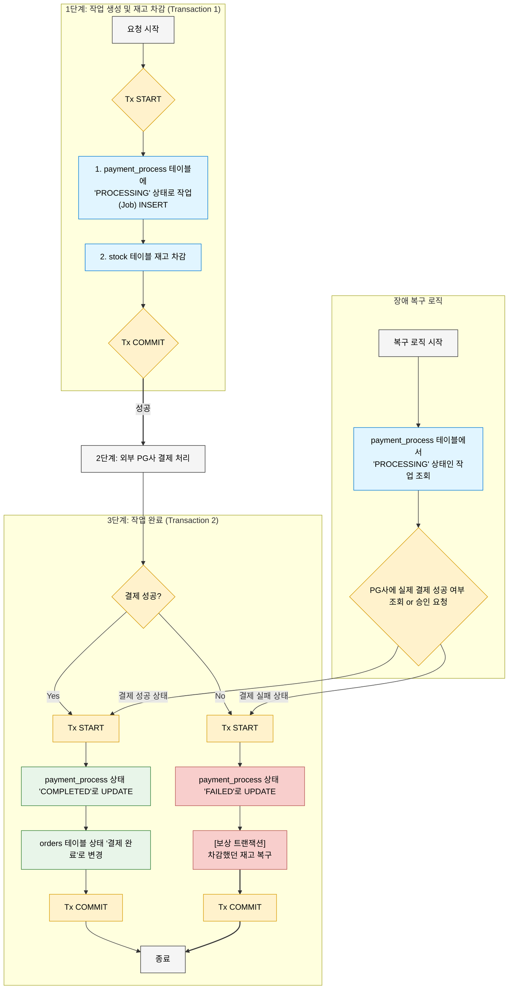
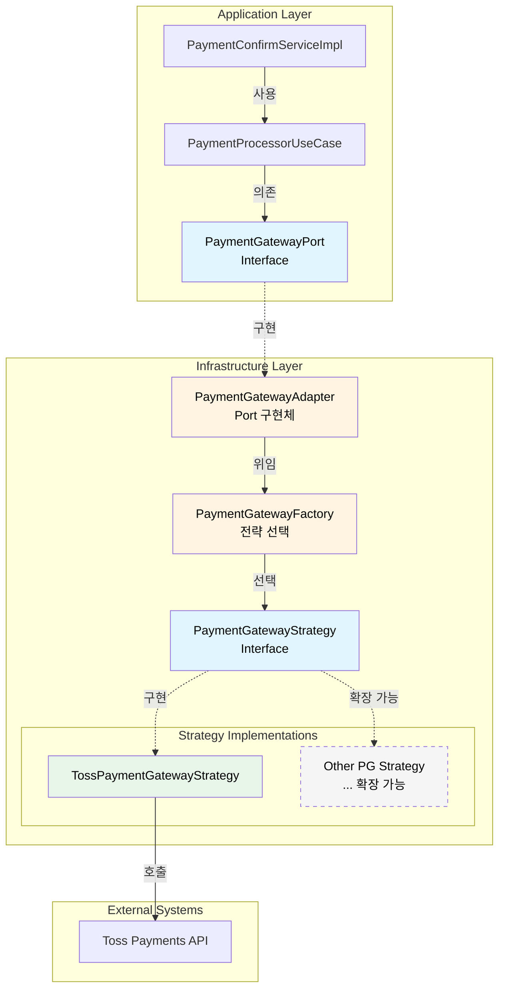
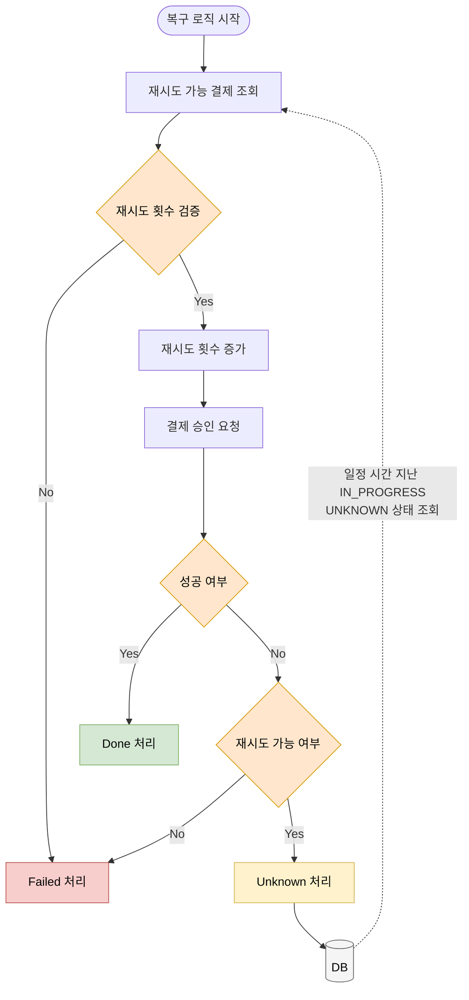
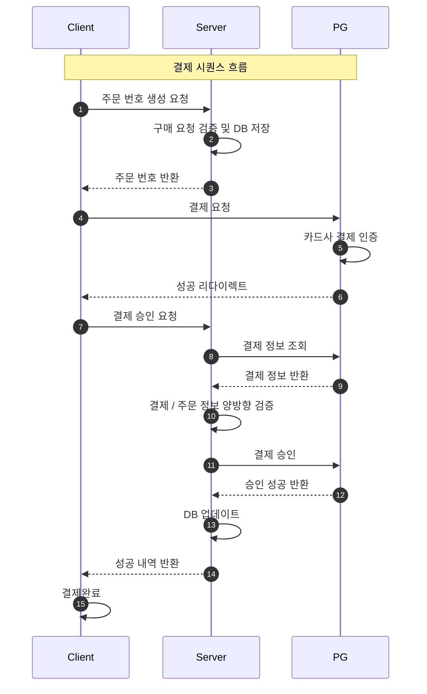

# Payments Platform

이 프로젝트는 토스페이먼츠를 통해 결제 연동을 처리하고, 다양한 결제 시나리오에서 발생할 수 있는 문제들을 해결하기 위한 시스템을 구축하는 것을 목표로 합니다.  
위변조 방지, 멱등성 보장, 비동기 결제 처리, 자동 복구 등 실결제 환경에서 발생하는 다양한 문제를 직접 설계하고 구현하는 것을 목표로 합니다.

<br>

## 🚀 주요 해결 과제

- **동기 → 비동기 아키텍처 전환 및 성능 측정**: Toss API 지연이 HTTP 스레드를 직접 블로킹하는 동기 구조에서 비동기 + Outbox 채널 전략으로 전환
- **정합성 오류 및 위변조 요청 방지**: 클라이언트·서버·PG 응답값을 교차 검증하고 Checkout 멱등성(Caffeine 캐시 + TOCTOU 해결)을 보장하여 중복 주문 및 금액 위변조를 차단
- **재시도 가능 실패에 대한 자동 복구 및 최종 일관성 확보**: 재시도 한계(5회) 기반 복구 루프, 보상 트랜잭션 자동 재시도로 외부 장애 시에도 재고·결제 상태의 일관성 유지

<br>

## 🔑 핵심 구현 및 주요 기능

결제 핵심 로직 및 연동 과정 중 발생할 수 있는 문제점을 파악하고 해결하는 것을 목표로 하였습니다.

### 비동기 결제 확인 플로우 — Outbox 채널 기반 비동기 아키텍처 전환 및 벤치마크

- 동기(Sync) 전략에서 Toss API 지연이 HTTP 스레드를 직접 블로킹해 고부하 시 TPS 급락·스레드 고갈 문제가 발생
- `LinkedBlockingQueue` + VT 워커 구조(채널 기반)로 PG 요청을 비동기로 처리하여 네트워크 지연 병목 해결
- 링크: [비동기 결제 처리 플로우 구현 — Outbox 패턴부터 LinkedBlockingQueue Worker까지](https://hyoguoo.github.io/blog/async-payment-flow)



#### k6 부하 테스트 결과 (Round 9 — 최종):

|     네트워크 지연 환경     |    전략     |       TPS       | Confirm 응답 (med) | E2E Latency (med) |     요청 유실     |
|:------------------:|:---------:|:---------------:|:----------------:|:-----------------:|:-------------:|
| **고지연** (2.0~3.5s) |   Sync    |      54.1       |     6,157ms      |      3,190ms      |     1,945     |
| **고지연** (2.0~3.5s) | **Async** | **79.8 (+47%)** |    **5.3ms**     |    **2,820ms**    | **0 (-100%)** |
| **저지연** (0.1~0.3s) | **Sync**  |      106.4      |      210ms       |       211ms       |       0       |
| **저지연** (0.1~0.3s) |   Async   |      93.5       |      6.3ms       |       305ms       |       0       |

- 고지연 환경에서 Outbox 전략이 TPS 47% 상승, 요청 유실 100% 감소 기록
- **이상적 자원 할당(Sweet Spot)**: 무작정 커넥션 풀을 늘리기보다 시스템 한계에 맞는 최적의 수치(HikariCP 30 등)를 도출하여 안정성과 성능의 균형 확보
- 상세 보고서: [BENCHMARK-REPORT.md](https://github.com/hyoguoo/payment-platform/wiki/Benchmark-Report)

### Checkout API 멱등성 보장 — TOCTOU 경쟁 조건 해결

- UI 중복 클릭, 네트워크 재시도 등으로 `PaymentEvent`가 복수 생성되어 DB에 유효하지 않은 주문이 누적되는 문제 존재
- 초기 `getIfPresent + put` 구현에서 코드 리뷰 중 TOCTOU 경쟁 조건 발견, `getOrCreate` 단일 원자적 메서드로 포트 계약 재설계
- 링크: [Checkout API 멱등성 보장 — Caffeine 캐시와 TOCTOU 경쟁 조건 해결](https://hyoguoo.github.io/blog/checkout-idempotency)



### 보상 트랜잭션 실패 케이스 대응 및 최종 일관성 확보

- 재고를 복구하는 보상 트랜잭션 처리 중 DB 데드락, 서버 다운 등으로 실패 시(이중 장애), 유령 재고 문제가 발생하는 엣지 케이스 존재
- 작업 테이블을 도입하여, PROCESSING 상태의 작업을 재조회하고 PG사 상태를 재검증하여, 실패가 확정된 건의 보상 트랜잭션(재고 복구)을 자동 재시도
- 링크: [보상 트랜잭션 실패 상황 극복 가능한 결제 플로우 설계](https://hyoguoo.github.io/blog/payment-compensation-transaction)



### 전략 패턴을 통한 PG 독립성 확보 및 확장 가능한 구조

- Application 계층은 특정 PG 구현체에 의존하지 않아 PG 독립성을 확보
- 전략 패턴을 통해 PG사 구현체를 추상화하여 새로운 PG 추가 시 최소한의 변경으로 확장 가능
- 링크: [전략 패턴을 통한 결제 게이트웨이 추상화 및 확장성 확보](https://hyoguoo.github.io/blog/payment-gateway-strategy-pattern)



### 결제 흐름 추적 및 핵심 지표 모니터링 시스템 구현

- 승인 지연, 재시도 등 복잡한 결제 흐름 추적의 어려움 및 실시간 성능/이상 징후를 파악할 핵심 지표 부재
- 구조화된 로깅 적용 / 결제 정보 변동 저장 및 어드민 페이지 구현 / 커스텀 메트릭 수집을 통한 핵심 지표 모니터링 체계 구축
- 링크:
  [결제 이력 추적 및 모니터링 시스템 구현](https://hyoguoo.github.io/blog/payment-history-and-metrics) / [Logger 성능 저하 방지와 구조화된 로깅 설계](https://hyoguoo.github.io/blog/log-structure-and-performance)


### 재시도 가능한 에러 처리 및 복구 로직 적용

- API 지연, 서버 중단 등 외부 오류 발생 시 결제가 실패로 종료되어 복구할 수 없는 문제가 존재
- 상태 기반 전환 모델을 정의하고, 재시도 가능한 오류에 대해 자동 복구 흐름 적용
- 링크: [결제 상태 전환 관리와 재시도 로직을 통한 결제 복구 시스템 구축](https://hyoguoo.github.io/blog/payment-status-with-retry)



### 결제 데이터 검증을 통한 데이터 정합성 보장

- 클라이언트가 주문 생성부터 승인까지 처리하는 방식르로, 중간 값 조작 같은 위변조 가능성 존재
- 서버 주도의 흐름으로 전환하고, 클라이언트·서버·PG 응답값을 교차 검증하여 불일치 시 결제를 거부하도록 설계
- 링크: [토스 페이먼츠를 통한 결제 연동 시스템 구현](https://hyoguoo.github.io/blog/payment-system-with-toss/)



### 트랜잭션 범위 최소화를 통한 성능 및 응답 시간 최적화

- 외부 API 호출이 포함된 단일 트랜잭션 구조로 인해 커넥션 점유와 응답 지연 문제가 발생
- 외부 호출을 트랜잭션 외부로 분리하고 보상 트랜잭션을 적용해 안정성과 성능을 함께 확보
- 링크: [트랜잭션 범위 최소화를 통한 성능 및 안정성 향상](https://hyoguoo.github.io/blog/minimize-transaction-scope)


### 외부 의존성을 제어한 테스트 환경에서의 시나리오 검증

- 외부 API에 의존하는 구조로 인해 다양한 예외 상황에 대한 테스트가 어려움 존재
- Fake 객체 기반의 테스트 환경을 구성하여 승인 실패, 지연, 중복 요청 등 다양한 시나리오를 유연하게 검증
- 링크: [외부 의존성 제어를 통한 결제 프로세스 다양한 시나리오 검증](https://hyoguoo.github.io/blog/payment-system-test)


<br>

### 🛠 사용 기술 스택

- Java 21
- Spring Boot 3.4.4
- MySQL 8.0.33
- JUnit 5
- k6 (부하 테스트)

<br>

## 🧩 기능 목록

- POST /api/v1/payments/checkout - 주문 요청
    - 주문 요청을 처리하며, 상품 및 사용자 정보를 받아 결제 준비
- POST /api/v1/payments/confirm - 주문 승인
    - 결제 승인을 처리하며, 결제 상태를 업데이트하고 승인 결과 반환

<br>

## 🏗 프로젝트 패키지 구조 및 의존성 관리

테스트 용이성과 도메인 독립성을 중심으로 포트/어댑터 구조 기반으로 설계하였습니다.

- 테스트 용이성: 각 계층에서 의존성 역전을 적용하여, 이를 통해 테스트 더블을 쉽게 사용할 수 있도록 설계
- 도메인 독립성: 도메인 간 협력은 인터페이스와 Receiver 구현체를 통해 결합도를 낮추어, 도메인의 독립성을 유지
- PG 독립성: 전략 패턴을 통해 PG사 구현체를 추상화하여, 새로운 PG사 추가 시 최소한의 변경만으로 확장 가능


```text
├── application
│   ├── PaymentConfirmServiceImpl.java
│   ├── port
│   │   ├── PaymentEventRepository.java
│   │   ├── PaymentGatewayPort.java (PG 독립 인터페이스)
│   │   └── ProductPort.java
│   └── usecase
│       └── PaymentProcessorUseCase.java
├── domain
│   ├── PaymentEvent.java
│   └── dto (범용 PG 모델)
│       ├── PaymentConfirmRequest.java
│       └── PaymentConfirmResult.java
├── infrastructure
│   ├── entity
│   │   └── PaymentEventEntity.java
│   ├── gateway (PG 추상화 레이어)
│   │   ├── PaymentGatewayAdapter.java (Port 구현체)
│   │   ├── PaymentGatewayFactory.java (전략 선택)
│   │   ├── PaymentGatewayStrategy.java (전략 인터페이스)
│   │   └── toss
│   │       └── TossPaymentGatewayStrategy.java (Toss 구현체)
│   ├── internal
│   │   └── InternalProductAdapter.java
│   └── repository
│       ├── JpaPaymentEventRepository.java
│       └── PaymentEventRepositoryImpl.java
└── presentation
    └── PaymentController.java
```

|        영역        | 설명                                                                   |
|:----------------:|:---------------------------------------------------------------------|
|  `application`   | 주요 비즈니스 로직을 구현하는 계층                                                  |
|  `ServiceImpl`   | 유즈케이스 단위를 조합하거나 흐름에 따라 실행 순서를 제어하는 서비스 구현체로, 유즈케이스를 오케스트레이션하여 서비스 제공 |
|      `port`      | 도메인 외부와의 의존성을 인터페이스로 추상화한 계층                                         |
|    `usecase`     | 하나의 기능 단위를 책임지는 유즈케이스 로직을 정의하여, 도메인 로직을 조합하고 실행                      |
|     `domain`     | 핵심 비즈니스 규칙과 엔터티를 정의하며, 외부 기술에 독립적인 순수한 로직을 수행                        |
| `infrastructure` | 실제 외부 시스템 또는 DB와 연동 계층                                               |
|     `entity`     | 데이터베이스 테이블과 매핑되는 JPA 엔터티 클래스                                         |
|    `internal`    | 외부 도메인과의 협력이 필요한 경우, 해당 요청을 전달하고 실행하는 계층 (예: 결제 도메인에서 상품 정보 조회)      |
|   `repository`   | 영속성 처리 로직을 담당하는 실제 JPA Repository 구현체                                |
|  `presentation`  | 외부 요청을 처리하고 응답을 반환하는 컨트롤러 계층                                         |

<br>

## ▶️ Quick Start

### 서비스 구성

|  포트  |      서비스      |    설명     |
|:----:|:-------------:|:---------:|
| 8080 |  Spring App   | 애플리케이션 서버 |
| 3306 |     MySQL     |  데이터베이스   |
| 9200 | Elasticsearch |  로그 저장소   |
| 5050 |   Logstash    |   로그 수집   |
| 5601 |    Kibana     |  로그 시각화   |
| 9090 |  Prometheus   |  메트릭 수집   |
| 3000 |    Grafana    |  메트릭 시각화  |

#### 시크릿 설정

```bash
cp .env.secret.example .env.secret # 루트 디렉토리
cd docker/compose
cp .env.secret.example .env.secret # docker/compose 디렉토리
# TOSS_SECRET_KEY 입력
```

### 실행 방법

#### 애플리케이션 실행

```bash
./scripts/run.sh
```

- **Application**: http://localhost:8080/admin/payments/events
- **Kibana**: http://localhost:5601
- **Grafana**: http://localhost:3000 (admin/admin123!)
- **Prometheus**: http://localhost:9090

<br>

## Other Repositories

- [Client Repository](https://github.com/hyoguoo/payment-client)
