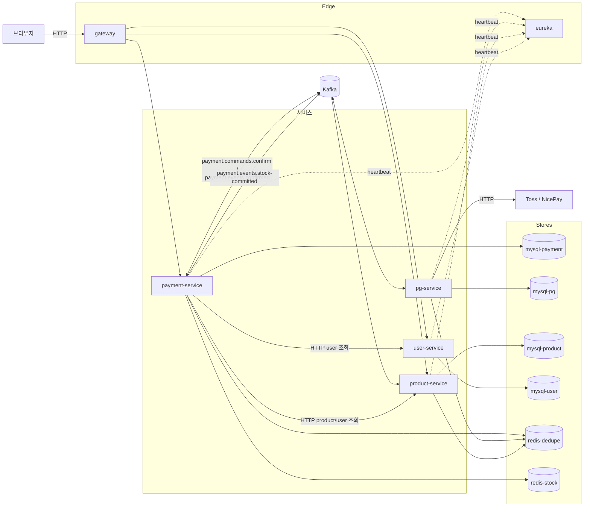
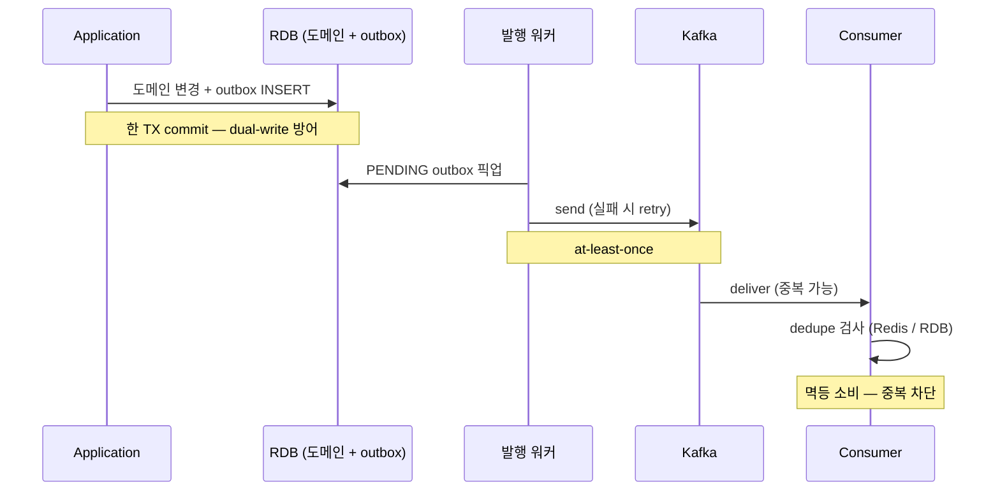
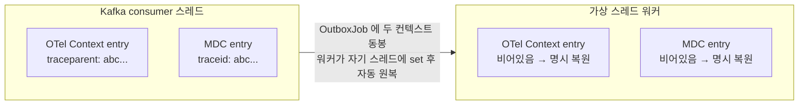
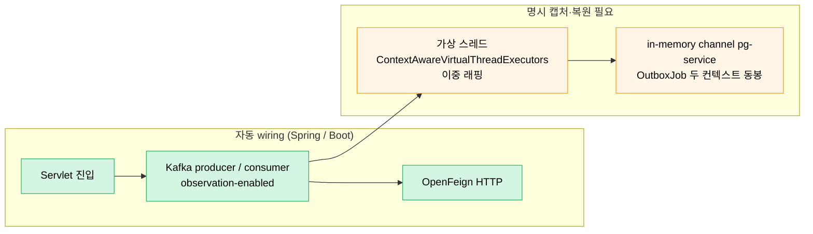
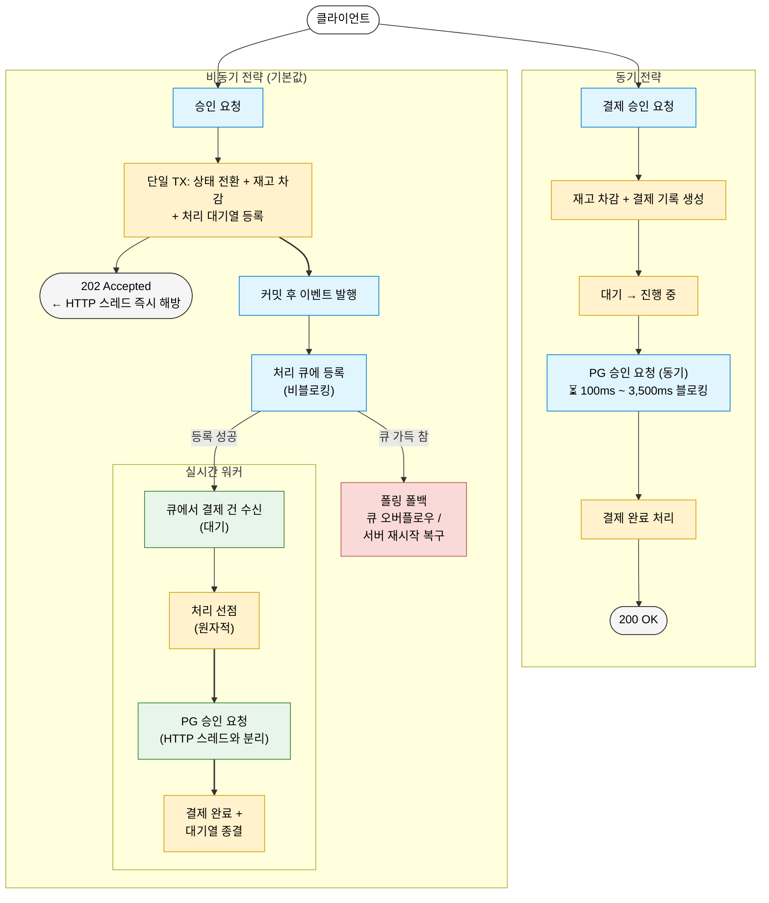
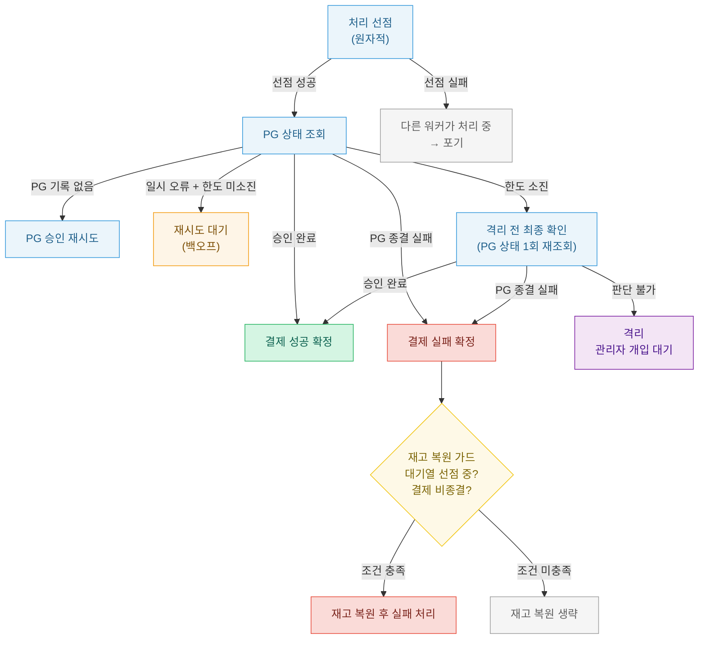
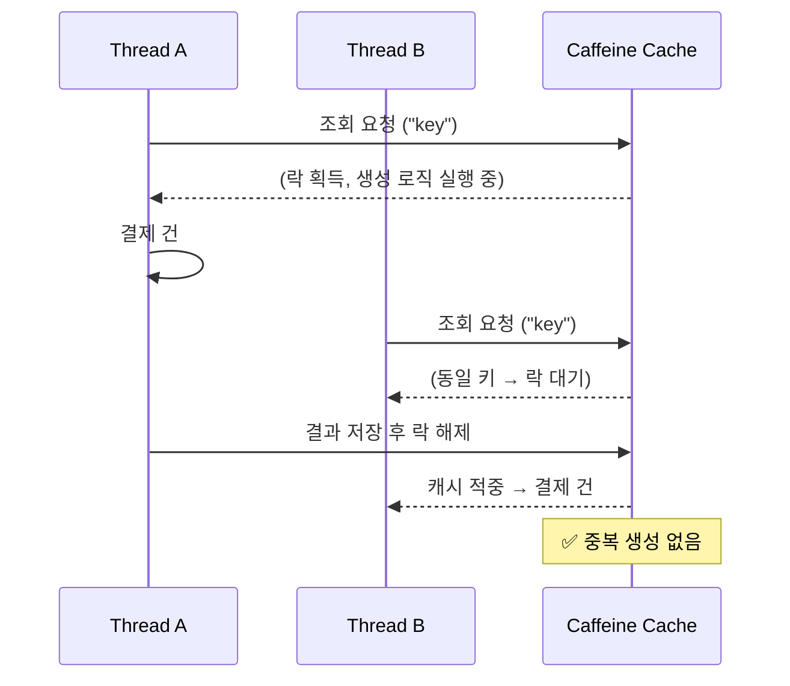
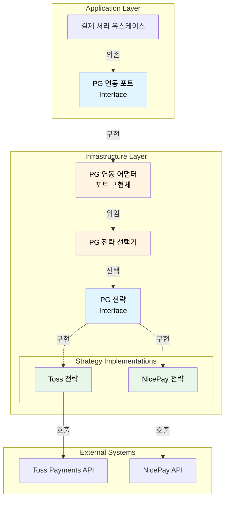
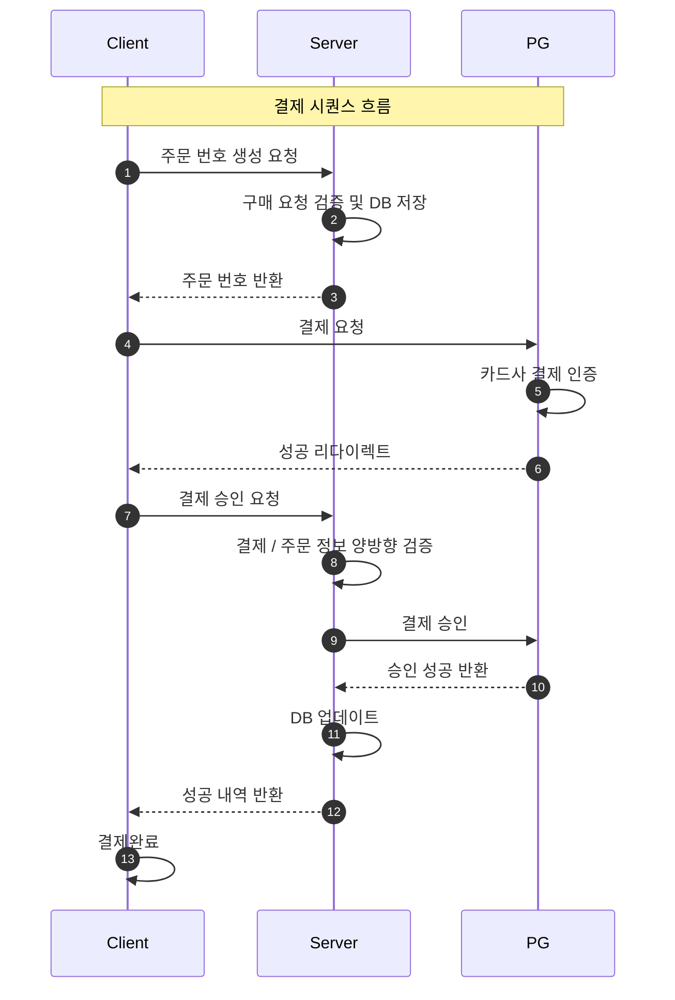

# Payments Platform

결제 연동 환경에서 발생하는 문제들 — 위변조 방지 · 멱등성 보장 · 비동기 결제 처리 · 자동 복구 · 분산 트랜잭션 — 을 단계별로 직접 설계하고 구현한 프로젝트이다.

[](https://github.com/hyoguoo/payment-platform/actions/workflows/ci.yml)

> ✅ **현재** (2026-04-27) · Phase 6   
> MSA 서비스 + Eureka + Gateway · Kafka 양방향 코레오그래피 + Outbox 3 모델 + 분산 트레이싱 운영 · 589 PASS  
> 🔜 **다음** · Phase 7  
> 회복성 검증 (장애 주입 + k6 시나리오 재설계 + 로컬 오토스케일러 + 서킷브레이커)

> 작성자: **hyoguoo** · [Wiki](https://github.com/hyoguoo/payment-platform/wiki) · [Blog](https://hyoguoo.github.io)

---

## 🚀 주요 해결 과제

|       해결 영역        | 핵심                                                                           |                      결과 / 검증                      |
|:------------------:|:-----------------------------------------------------------------------------|:-------------------------------------------------:|
|    동기 → 비동기 전환     | Toss API 지연이 HTTP 스레드를 블로킹하던 동기 구조 → Outbox + 가상 스레드 워커 비동기 전환               | **TPS +47% / 요청 유실 -100%** (k6 Round 9 · 모놀리스 시점) |
|    정합성 / 멱등성 보장    | 클라이언트·서버·PG 교차 검증 + Checkout 멱등성 (TOCTOU 해결)                                 |                  중복 주문 / 위변조 차단                   |
|    장애 내성 복구 체계     | 복구 판정 객체 + 스케줄링 + 재고 복원 가드 + 격리 직전 vendor 재조회                                |       **6 분기** 복구 결정 + 격리 전 최종 확인 + 동시성 가드        |
| MSA 분리 + Kafka 양방향 | 모놀리스 → 4 비즈니스 서비스 + Eureka + Gateway / payment ↔ pg Kafka 양방향 confirm        | **5 토픽** (운영 3 + DLQ 2) + AMOUNT_MISMATCH 양방향 방어  |
| Outbox 모델 + 멱등 소비  | payment / pg / stock 세 outbox 정밀도 분기 + dedupe 결정 룰 (Redis / RDB inbox / RDB) |        **at-least-once + 멱등** (3 저장소 결정 룰)        |
|      분산 트레이싱       | OTel Context + MDC 두 ThreadLocal 을 가상 스레드 / in-memory channel 경계에서 명시 캡처·복원  |           5 서비스 + Kafka traceId 연속성 검증            |

---

## 🗺️ 개발 과정

|    Phase    | 목표                               | 구현 내용                                                                                                                                                                                                                                                                                                                                                                                                                                        |
|:-----------:|:---------------------------------|:---------------------------------------------------------------------------------------------------------------------------------------------------------------------------------------------------------------------------------------------------------------------------------------------------------------------------------------------------------------------------------------------------------------------------------------------|
|   Phase 1   | 데이터 정합성 확립                       | [교차 검증 연동](https://github.com/hyoguoo/payment-platform/wiki/cross-validation)                                                                                                                                                                                                                                                                                                                                                                |
|   Phase 2   | 결합도 해소 및 자가 복구력                  | [트랜잭션 범위 최소화](https://github.com/hyoguoo/payment-platform/wiki/tx-scope) · [상태 기반 복구 모델 및 재시도 로직](https://github.com/hyoguoo/payment-platform/wiki/retry-recovery)                                                                                                                                                                                                                                                                           |
|   Phase 3   | 운영 가시성 및 안정성                     | [시나리오 테스트](https://github.com/hyoguoo/payment-platform/wiki/scenario-test) · [구조화된 로깅](https://github.com/hyoguoo/payment-platform/wiki/structured-logging) · [결제 이력 추적 및 모니터링](https://github.com/hyoguoo/payment-platform/wiki/metrics)                                                                                                                                                                                                    |
|   Phase 4   | 데이터 정합성 심화 및 중복 제어               | [보상 TX 실패 대응](https://github.com/hyoguoo/payment-platform/wiki/compensation-tx) · [Checkout 멱등성 보장](https://github.com/hyoguoo/payment-platform/wiki/idempotency)                                                                                                                                                                                                                                                                            |
|   Phase 5   | 비동기 결제 아키텍처 전환                   | [비동기 Outbox · 가상 스레드 기반 결제 플로우](https://github.com/hyoguoo/payment-platform/wiki/async-outbox) · [도메인 상태 머신과 장애 내성 복구 체계](https://github.com/hyoguoo/payment-platform/wiki/state-management)                                                                                                                                                                                                                                                 |
| **Phase 6** | **MSA 분리 + Kafka 양방향 + 분산 트레이싱** | [MSA 전환](https://github.com/hyoguoo/payment-platform/wiki/msa-transition) · [이벤트 드리븐 코레오그래피](https://github.com/hyoguoo/payment-platform/wiki/event-driven-choreography) · [Outbox 패턴](https://github.com/hyoguoo/payment-platform/wiki/outbox-pattern) · [메시지 전달 보장 + dedupe](https://github.com/hyoguoo/payment-platform/wiki/message-delivery-and-dedupe) · [분산 트레이싱](https://github.com/hyoguoo/payment-platform/wiki/trace-propagation) |
|     ETC     | 설계 유연성                           | [전략 패턴 기반 멀티 PG 연동](https://github.com/hyoguoo/payment-platform/wiki/pg-strategy)                                                                                                                                                                                                                                                                                                                                                            |
|     ETC     | AI 기반 개발 워크플로우                   | [서브에이전트 기반 6단계 워크플로우](https://github.com/hyoguoo/payment-platform/wiki/ai-workflow)                                                                                                                                                                                                                                                                                                                                                          |

---

## 🌐 현재 시스템 (Phase 6)

> 4 서비스 + Kafka 양방향 코레오그래피 + Outbox 모델 + 분산 트레이싱 위에서 처리  
> 각 항목 제목을 클릭하면 상세 설계가 담긴 Wiki 로 이동

### [MSA 분리 + Kafka 양방향 코레오그래피](https://github.com/hyoguoo/payment-platform/wiki/msa-transition)

- 단일 모놀리스 -> 4 서비스(payment / pg / product / user) + Eureka + Gateway 로 분해 + DB per service
- Redis 두 인스턴스(dedupe / stock) 용도별 분리
- payment ↔ pg 는 Kafka 양방향 메시지로만 통신 — payment-service(결제 상태 관리), pg-service(PG 호출 담당)



#### **Kafka 토픽 카탈로그** (운영 3 + DLQ 2)

|                토픽                |              발행자               |    소비자     |                     의미                     |
|:--------------------------------:|:------------------------------:|:----------:|:------------------------------------------:|
|    `payment.commands.confirm`    | payment (최초) + pg (self-retry) |     pg     |                  결제 확정 명령                  |
|    `payment.events.confirmed`    |               pg               |  payment   | PG 결과 회신 (APPROVED / FAILED / QUARANTINED) |
| `payment.events.stock-committed` |      payment (APPROVED 시)      |  product   |                  재고 확정 통지                  |
|  `payment.commands.confirm.dlq`  |       pg (attempt 4 격리)        | pg DLQ 컨슈머 |           self-loop retry 한도 초과            |
|  `payment.events.confirmed.dlq`  |   payment (lease remove 실패)    |    (수동)    |               결과 처리 영구 실패 격리               |

### [Outbox 패턴 + 메시지 전달 보장 + 멱등 소비](https://github.com/hyoguoo/payment-platform/wiki/outbox-pattern)

RDB 변경과 Kafka 발행은 한 트랜잭션으로 묶을 수 없는 dual-write 위험이 있어, 이를 다음 두 단계로 차단했다.

- 도메인 변경과 같은 TX 에서 outbox row 를 INSERT 하고, 별도 발행 워커가 PENDING 행을 픽업해 Kafka 로 send — 저장과 발행 분리
- 발행 측 retry(at-least-once) + 소비 측 dedupe(멱등) 조합으로 비즈니스 관점의 exactly-once 효과 확보



#### Outbox 모델

|        모델        |       위치        |                          특징                          |
|:----------------:|:---------------:|:----------------------------------------------------:|
| `payment_outbox` | payment-service | 4상태 머신 (PENDING / IN_FLIGHT / DONE / FAILED) + 선점 방식 |
|   `pg_outbox`    |   pg-service    |     processedAt + availableAt + self-loop retry      |
|  `stock_outbox`  | payment-service |                 pg_outbox 컬럼 + 단순 사용                 |

#### 멱등 소비 — 서비스 dedupe

후속 작업이 같은 RDB 자원을 변경하면 RDB, 그 외엔 Redis 방식으로 처리헀다.

|   서비스   |             저장소             |                    패턴                     |
|:-------:|:---------------------------:|:-----------------------------------------:|
| payment |   Redis (`redis-dedupe`)    | two-phase lease (5분 lease → 8일 dedupe 보존) |
|   pg    | Redis 1차 필터 + RDB atomic 필터 |            도메인 작업과 한 TX commit            |
| product |  RDB `stock_commit_dedupe`  |            재고 차감과 한 TX commit             |

각 모델의 상태 머신·선점 메커니즘·TTL 근거 같은 디테일은 다음 글에 정리하였다.

- [outbox-pattern](https://github.com/hyoguoo/payment-platform/wiki/outbox-pattern)
- [message-delivery-and-dedupe](https://github.com/hyoguoo/payment-platform/wiki/message-delivery-and-dedupe)

### [분산 트레이싱 — OTel + Kafka 헤더 + VT 컨텍스트 전파](https://github.com/hyoguoo/payment-platform/wiki/trace-propagation)

결제 한 건이 5 서비스 + Kafka + 외부 PG 호출을 거치는 동안 같은 traceId 가 메시지 / 로그 / HTTP 헤더에 같이 따라간다.

- 한 스레드 안에 OTel(트레이스용) 과 MDC(로그용) 가 각자 자기 traceId 를 따로 들고 있음
- 두 곳 다 챙겨야 Tempo 트레이스와 Loki 로그를 같은 traceId 로 묶어볼 수 있음



1. 정상적으로 수행 중이던 스레드는 ThreadLocal 안에 OTel entry / MDC entry 가 별개 키로 존재
2. 해당 스레드에서 생성 된 새 가상 스레드는 빈 ThreadLocal 로 시작
3. 두 traceId 를 작업 객체에 같이 실어 보내고 워커가 받아 복원하면 연속성 유지



Spring Boot에서 자동으로 챙겨주지 않는 경로(Kafka producer, 직접 만든 큐, 직접 띄운 가상 스레드)에서는 코드로 직접 캡처 · 복원하여 traceId 가 끊기지 않도록 아래와 같이 대응했다.

|        끊길 수 있는 지점         |                                      프로젝트 대응                                      |
|:-------------------------:|:---------------------------------------------------------------------------------:|
|         HTTP 어댑터          |                    OpenFeign + Spring Cloud auto-config 자동 적용                     |
| Kafka producer / consumer |                  `observation-enabled: true` 한 줄로 헤더 자동 주입 / 추출                   |
|          가상 스레드           |         `ContextAwareVirtualThreadExecutors` 가 OTel / MDC 둘 다 자동 캡처 · 복원          |
|     in-memory channel     | `OutboxJob` 레코드에 OTel / MDC 둘 다 실어 보내고, 워커가 작업 시작 시 둘 다 자기 스레드에 set 하고 종료 시 자동 원복 |

---

## 📜 이전 단계 작업

> Phase 1~5 시점에 풀었던 문제들. 일부는 Phase 6 에서 형태가 바뀌어 지금 코드나 처리방식이 다를 수 있음

### [비동기 결제 확인 플로우 — Outbox 채널 기반 비동기 아키텍처 전환 및 벤치마크](https://github.com/hyoguoo/payment-platform/wiki/async-outbox)

> Phase 5 — 모놀리스 단일 JVM 시점 측정 (현재 시스템의 메시지 흐름은 위 "MSA + Kafka 양방향" 항목 참고)

- 동기(Sync) 전략에서 Toss API 지연이 HTTP 스레드를 직접 블로킹해 고부하 시 TPS 급락·스레드 고갈 문제가 발생
- 내부 큐 + 가상 스레드 워커 구조로 PG 요청을 비동기로 처리하여 네트워크 지연 병목 해결
- 포스팅: [비동기 결제 처리 플로우 구현 — Outbox 패턴부터 LinkedBlockingQueue Worker까지](https://hyoguoo.github.io/blog/async-payment-flow)



##### k6 부하 테스트 결과 (모놀리스 시점 측정)

|     네트워크 지연 환경     |    전략     |       TPS       | Confirm 응답 (med) | E2E Latency (med) |     요청 유실     |
|:------------------:|:---------:|:---------------:|:----------------:|:-----------------:|:-------------:|
| **고지연** (2.0~3.5s) |   Sync    |      54.1       |     6,157ms      |      3,190ms      |     1,945     |
| **고지연** (2.0~3.5s) | **Async** | **79.8 (+47%)** |    **5.3ms**     |    **2,820ms**    | **0 (-100%)** |
| **저지연** (0.1~0.3s) | **Sync**  |      106.4      |      210ms       |       211ms       |       0       |
| **저지연** (0.1~0.3s) |   Async   |      93.5       |      6.3ms       |       305ms       |       0       |

- 고지연 환경에서 Outbox 전략이 TPS 47% 상승, 요청 유실 100% 감소 기록
- **이상적 자원 할당(Sweet Spot)**: 무작정 커넥션 풀을 늘리기보다 시스템 한계에 맞는 최적의 수치(HikariCP 30 등)를 도출하여 안정성과 성능의 균형 확보
- 상세 보고서: [Benchmark-Report](https://github.com/hyoguoo/payment-platform/wiki/Benchmark-Report)

### [결제 상태 관리 — 도메인 상태 머신과 장애 내성 복구 체계](https://github.com/hyoguoo/payment-platform/wiki/state-management)

> Phase 5 — 복구 판정 객체 + 격리 전 최종 확인 + 보상 안전 가드 자체는 유지  
> PG 상태 조회 경계가 Phase 6 에서 같은 인스턴스 안 호출 → pg-service HTTP 호출로 이동

- PG 상태 조회 후 복구 판정 객체가 종결/재시도/격리를 결정
- 재시도 한도 소진 시 격리 전 최종 확인(PG 상태 1회 재조회)으로 성공 건의 오격리 방지, 격리 상태로 관리자 개입 유도
- 보상 트랜잭션 실행 직전 이중 조건 가드(대기열 선점 중 + 결제 비종결)로 동시성 경합 시 재고 이중 복원 차단
- 포스팅: [결제 복구 상태 전이 설계](https://hyoguoo.github.io/blog/payment-recovery-state-design)



### [Checkout API 멱등성 보장 — TOCTOU 경쟁 조건 해결](https://github.com/hyoguoo/payment-platform/wiki/idempotency)

> Phase 4 — 본문은 Caffeine 로컬 캐시 시점  
> Phase 6 에서 Redis 분산 store(`IdempotencyStoreRedisAdapter`) 로 어댑터 교체

- UI 중복 클릭, 네트워크 재시도 등으로 결제 건이 복수 생성되어 DB에 유효하지 않은 주문이 누적되는 문제 존재
- 초기 조회 후 생성 방식에서 코드 리뷰 중 TOCTOU 경쟁 조건 발견, 단일 원자적 조회·생성 메서드로 포트 계약 재설계
- 모놀리스 → MSA 분리 시점에 Caffeine 로컬 캐시 → Redis 분산 store(`IdempotencyStoreRedisAdapter`) 로 어댑터 교체 — 단일 인스턴스 → 다중 인스턴스 멱등 보장
- 포스팅: [Checkout API 멱등성 보장 — Caffeine 캐시와 TOCTOU 경쟁 조건 해결](https://hyoguoo.github.io/blog/checkout-idempotency)



### [전략 패턴 기반 멀티 PG 연동](https://github.com/hyoguoo/payment-platform/wiki/pg-strategy)

> 모놀리스 시점 — `PaymentGatewayFactory` / `InternalReceiver` 도식  
> Phase 6에서는 PG-Service에서 사용 중

- Application 계층은 `PaymentGatewayPort` 인터페이스에만 의존하여 PG 독립성 확보
- 전략 패턴으로 Toss/NicePay 두 PG사를 동시 지원하며, 결제건마다 `gatewayType`으로 올바른 PG 라우팅
- NicePay의 멱등성 키 부재를 중복 승인 에러(2201) 감지 + 조회 API 보상 패턴으로 해결
- 포스팅: [전략 패턴을 통한 결제 게이트웨이 추상화 및 확장성 확보](https://hyoguoo.github.io/blog/payment-gateway-strategy-pattern)



### [결제 흐름 추적 및 핵심 지표 모니터링 시스템 구현](https://github.com/hyoguoo/payment-platform/wiki/metrics)

> Phase 3 — Micrometer 패턴은 유지  
> Phase 6 에서 패키지가 모놀리스 `core.common.metrics` → 서비스별 분산

- 승인 지연, 재시도 등 복잡한 결제 흐름 추적의 어려움 및 실시간 성능/이상 징후를 파악할 핵심 지표 부재
- 구조화된 로깅 적용 / 결제 정보 변동 저장 및 어드민 페이지 구현 / 커스텀 메트릭 수집을 통한 핵심 지표 모니터링 체계 구축


### [결제 데이터 검증을 통한 데이터 정합성 보장](https://github.com/hyoguoo/payment-platform/wiki/cross-validation)

> Phase 1 — 흐름 자체는 유지  
> Phase 6 에서 호출 경계가 같은 인스턴스 안 호출 → HTTP / Kafka 로 이동

- 클라이언트가 주문 생성부터 승인까지 처리하는 방식으로, 중간 값 조작 같은 위변조 가능성 존재
- 서버 주도의 흐름으로 전환하고, 클라이언트·서버·PG 응답값을 교차 검증하여 불일치 시 결제를 거부하도록 설계



### [트랜잭션 범위 최소화를 통한 성능 및 응답 시간 최적화](https://github.com/hyoguoo/payment-platform/wiki/tx-scope)

> Phase 2 — TX 분리 + 보상 패턴은 유지
> Phase 6 에서 외부 호출 경계가 payment-service ↔ pg-service Kafka 양방향으로 이동하여 트랜잭션 없음

- 외부 API 호출이 포함된 단일 트랜잭션 구조로 인해 커넥션 점유와 응답 지연 문제가 발생
- 외부 호출을 트랜잭션 외부로 분리하고 보상 트랜잭션을 적용해 안정성과 성능을 함께 확보
- 포스팅: [트랜잭션 범위 최소화를 통한 성능 및 안정성 향상](https://hyoguoo.github.io/blog/minimize-transaction-scope)


### [외부 의존성을 제어한 테스트 환경에서의 시나리오 검증](https://github.com/hyoguoo/payment-platform/wiki/scenario-test)

> Phase 3 — Fake 패턴은 유지
> 위키 본문 클래스명(`FakeTossHttpOperator` 등)은 모놀리스 시점이며 현재는 pg-service `FakePgGatewayStrategy` 등으로 재구성

- 외부 API에 의존하는 구조로 인해 다양한 예외 상황에 대한 테스트가 어려움 존재
- Fake 객체 기반의 테스트 환경을 구성하여 승인 실패, 지연, 중복 요청 등 다양한 시나리오를 유연하게 검증
- 포스팅: [외부 의존성 제어를 통한 결제 프로세스 다양한 시나리오 검증](https://hyoguoo.github.io/blog/payment-system-test)


---

## 🛠 사용 기술 스택

- **Language / Runtime**: Java 21 (Virtual Threads), Spring Boot 3.4.4, Spring Cloud 2024.0.0
- **Persistence**: MySQL 8.0 × 4 (DB per service), Flyway, JPA + QueryDSL
- **Messaging / Cache**: Kafka (KRaft, broker 1대), Redis × 2 (dedupe + redis-stock 분리)
- **Service Discovery / Routing**: Eureka, Spring Cloud Gateway, OpenFeign + Spring Cloud LoadBalancer
- **Observability**: Micrometer + Prometheus + Grafana + Tempo + Loki, OpenTelemetry traceparent
- **Test**: JUnit 5, AssertJ, Mockito, Testcontainers (MySQL / Redis), MockWebServer

---

## 🏗 [프로젝트 구조](https://github.com/hyoguoo/payment-platform/wiki/architecture)

각 서비스는 동일한 hexagonal 패키지 구조(`domain` / `application` / `presentation` / `infrastructure` / `core` / `exception`) 사용한다.

- 도메인의 외부 인프라로부터 격리
- HTTP(OpenFeign + LB) 또는 Kafka 메시지를 통해 서비스 간 통신

---

## ▶️ Quick Start

### 서비스 구성

|  포트  |       서비스       |      설명      |
|:----:|:---------------:|:------------:|
| 8090 |     Gateway     |  API 게이트웨이   |
| 8761 |     Eureka      |  서비스 디스커버리   |
| 8081 | payment-service |    결제 서비스    |
| 8082 |   pg-service    | PG 승인/중계 서비스 |
| 8083 | product-service |    상품 서비스    |
| 8084 |  user-service   |    회원 서비스    |
| 3306 |  mysql-payment  |  payment DB  |
| 3308 |    mysql-pg     |    pg DB     |
| 3309 |  mysql-product  |  product DB  |
| 3310 |   mysql-user    |   user DB    |
| 9092 |      Kafka      |   이벤트 브로커    |
| 6379 |  redis-dedupe   |  dedupe 캐시   |
| 6380 |   redis-stock   |    재고 캐시     |

#### 시크릿 설정

```bash
cp .env.secret.example .env.secret
# TOSS_SECRET_KEY, NICEPAY_CLIENT_KEY, NICEPAY_SECRET_KEY 입력
```

### 실행 방법

#### 애플리케이션 실행

```bash
bash scripts/compose-up.sh
```

```bash
# 기동 후 smoke 검증
bash scripts/smoke-all.sh                  # 인프라 헬스 + Kafka 토픽 정책
bash scripts/smoke-all.sh --with-trace     # + 트레이스(결제 1건 발생 후)
# 또는 stack up 과 동시에:
bash scripts/compose-up.sh --with-smoke    # 기동 직후 자동 실행
```

#### Smoke 스크립트 구성

| 스크립트                                      | 검증 항목                                                        | 결제 1건 선행 필요 |
|:------------------------------------------|:-------------------------------------------------------------|:-----------:|
| `scripts/smoke/infra-healthcheck.sh`      | 13 컨테이너 health + 9 호스트 포트 + 5 Eureka 등록 (총 27 항목)            |      X      |
| `scripts/smoke/kafka-topic-config.sh`     | 토픽 partition 동일성 / replication-factor 정책 / retry 토픽 미존재      |      X      |
| `scripts/smoke/trace-header-check.sh`     | `payment.commands.confirm` Kafka record header 의 traceparent |      O      |
| `scripts/smoke/trace-continuity-check.sh` | gateway → payment → pg → product/user 다중 홉 traceId 연속성       |      O      |

> **결제 1건 선행 필요 = O** 인 스크립트는 토픽에 메시지가 / 서비스 로그에 traceId 가 박혀 있어야 검증 대상 존재

실행 후 http://localhost:8090 에서 전체 페이지를 탐색 가능

| URL                            | 설명                           |
|:-------------------------------|:-----------------------------|
| /                              | 홈 — 결제 흐름 · 어드민 · 모니터링 링크 모음 |
| /payment/checkout.html         | 결제하기 — 토스페이먼츠 결제창 호출         |
| /payment/checkout-nicepay.html | 결제하기 — 나이스페이먼츠 결제창 호출        |
| /admin/payments/events         | 결제 이벤트 목록 조회 / 검색            |
| /admin/payments/history        | 결제 히스토리 — 상태 변경 이력 조회        |
