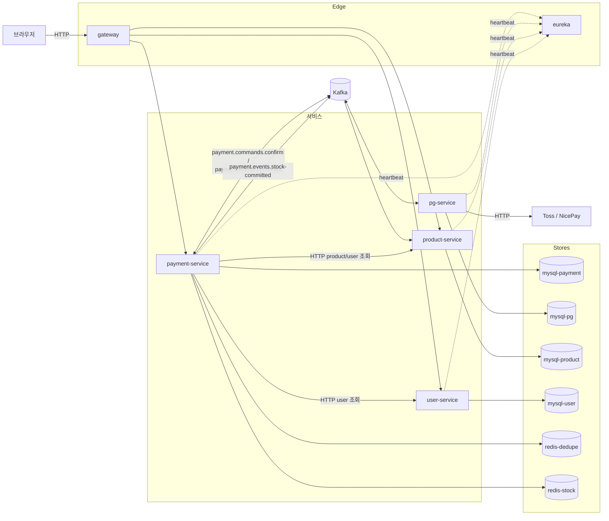
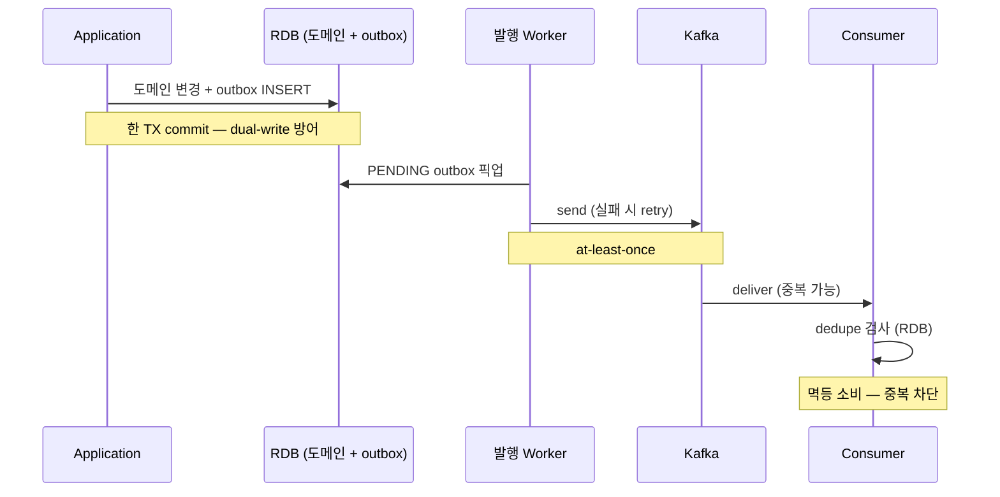
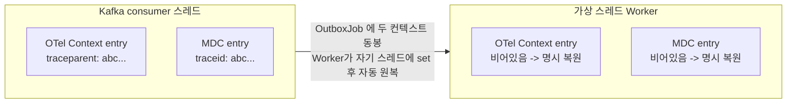
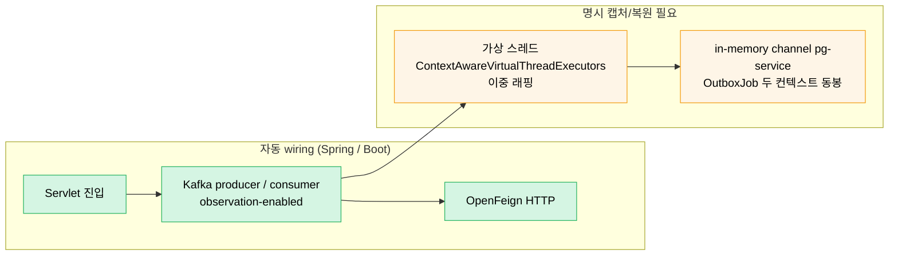
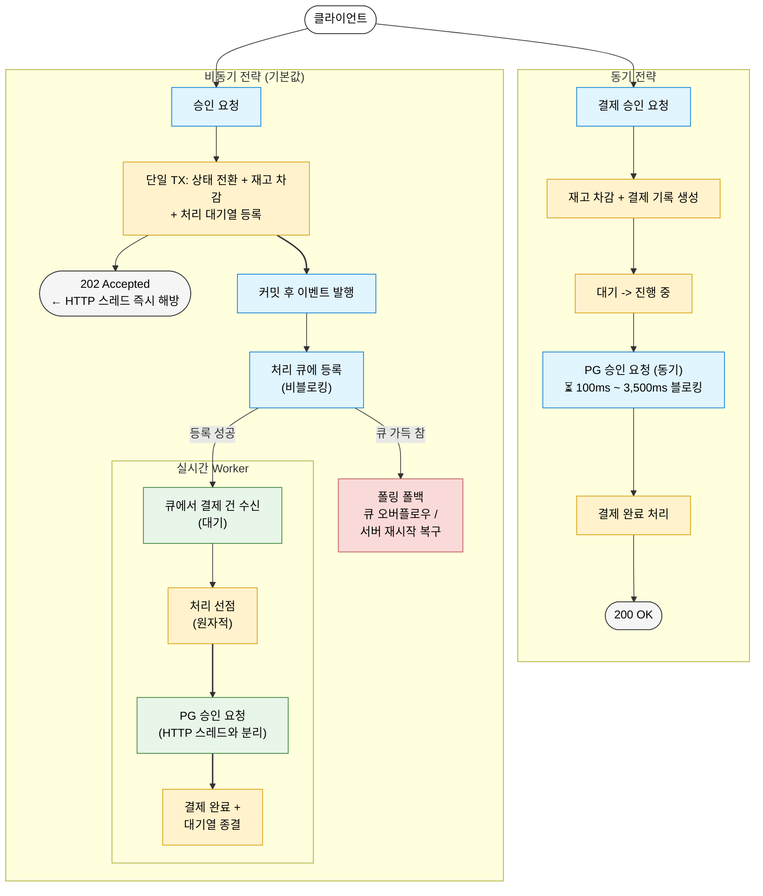
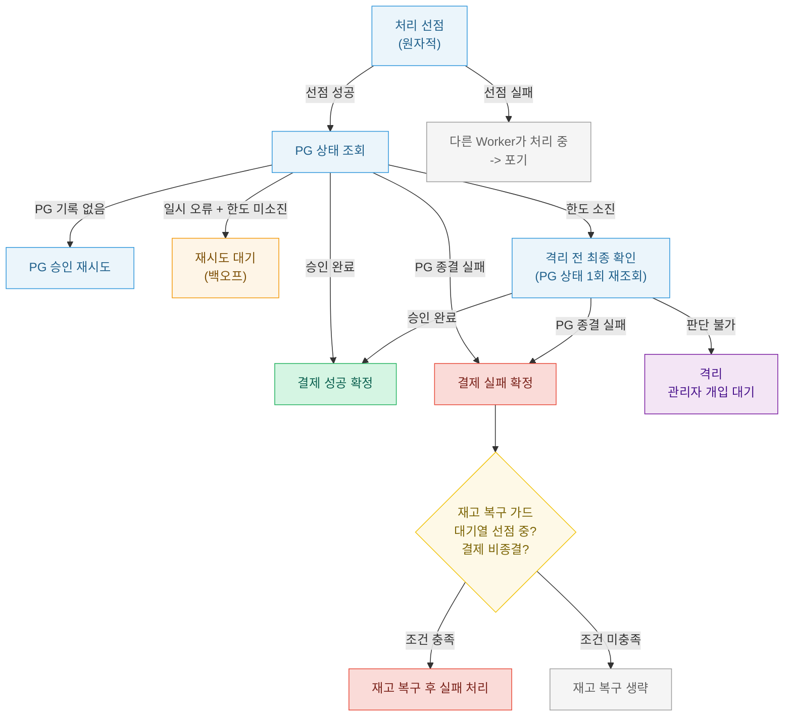
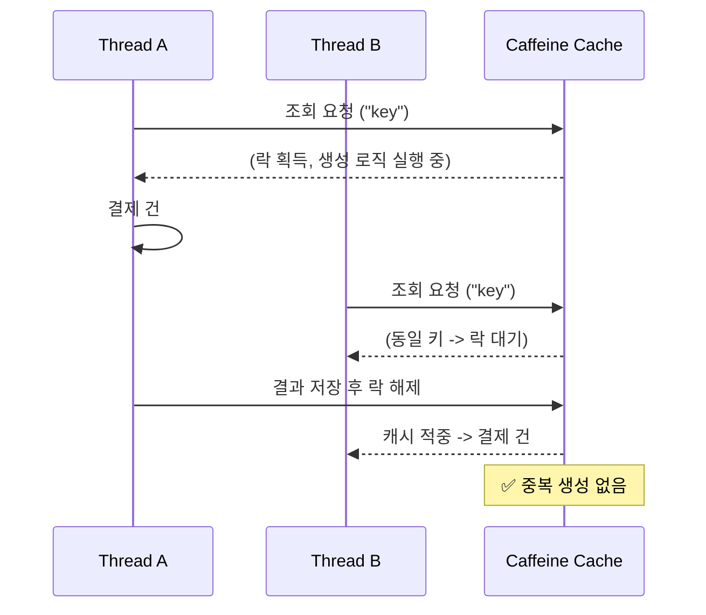
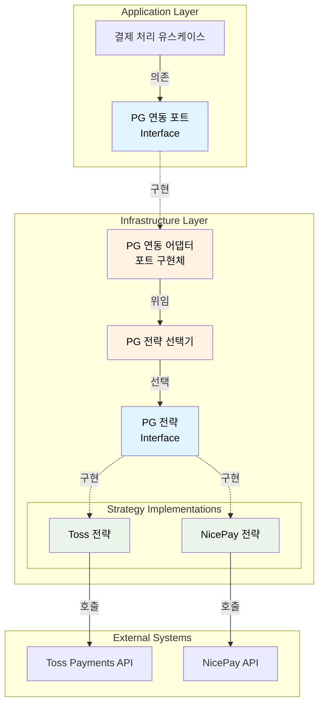
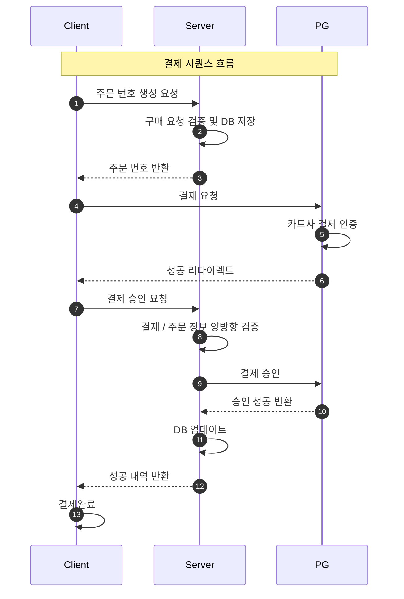

# Payments Platform

결제 연동 환경에서 발생하는 문제들 — 위변조 방지 · 멱등성 보장 · 비동기 결제 처리 · 자동 복구 · 분산 트랜잭션 — 을 단계별로 직접 설계하고 구현한 프로젝트이다.

[](https://github.com/hyoguoo/payment-platform/actions/workflows/ci.yml)

> ✅ **Phase 6 완료**  
> MSA 서비스 + Eureka + Gateway · Kafka 양방향 코레오그래피 + Outbox 모델 + 분산 트레이싱 운영 · 단위 861 / 통합 59 PASS  
> 🔜 **다음** · Phase 7  
> 회복성 검증 (장애 주입 + k6 시나리오 재설계 + 로컬 오토스케일러 + 서킷브레이커) — 알람 규칙 + Toxiproxy 장애 드릴 인프라는 선행 구축 완료

> 작성자: **hyoguoo** · [Wiki](https://github.com/hyoguoo/payment-platform/wiki) · [Blog](https://hyoguoo.github.io)

---

## 🚀 주요 해결 과제

|       해결 영역        | 주요 해결 방법                                                                                                                                                  |                                      개선 결과                                      |
|:----------------------:|:----------------------------------------------------------------------------------------------------------------------------------------------------------------|:-----------------------------------------------------------------------------------:|
|   동기 → 비동기 전환   | Toss API 지연이 HTTP 스레드를 블로킹하던 동기 구조를 Outbox와 가상 스레드 Worker를 활용해 비동기로 전환                                                         |               **TPS 47% 향상 / 요청 유실 없음** (k6 부하테스트 기준)                |
|  정합성 / 멱등성 보장  | 클라이언트·서버·PG사 간 결제 데이터 교차 검증 및 Checkout API 멱등성 보장 (TOCTOU 동시성 문제 해결)                                                             |                         중복 결제 및 금액 위변조 원천 차단                          |
|    장애 복구 자동화    | 백오프(Backoff) 기반 재시도, 실패 건 DLQ 자동 격리, 스케줄러를 통한 상태 복구 및 Redis Lua 스크립트를 활용한 원자적 재고 보상                                   |       **DLQ 격리로 수동 개입 최소화** + 이중 복구를 방지하는 안전한 재고 보상       |
| MSA 전환 및 Kafka 도입 | 모놀리스 아키텍처를 4개의 마이크로서비스로 분리(Eureka, Gateway 포함)하고 결제와 PG 서비스 간 통신을 Kafka를 통한 비동기 이벤트로 전환                          |           **결합도 감소** 및 AMOUNT_MISMATCH 검증을 통한 상태 불일치 방어           |
| Outbox 패턴 및 멱등성  | 시스템 특성에 맞춰 결제/PG 서비스의 Outbox 정책을 분리하고, 메시지 중복 소비를 막기 위한 서비스별 멱등성 검증 룰(Kafka EOS, RDB 멱등 INSERT, inbox UNIQUE) 적용 |                    **At-least-once 전달 보장** 및 중복 처리 방지                    |
|  외부 연동 흐름 격리   | 수신(Inbox 저장) → 벤더 API 호출 및 처리(Virtual Thread) → 완료 이벤트 발행(Kafka) 단계를 분리하고 각 구간에 채널과 폴백을 둬 장애 격리                         | **외부 연동 지연이 내부 시스템에 미치는 영향 차단** 및 프로세스 중단 시 안전한 회수 |
|     분산 환경 추적     | MSA 간 흐름을 추적하기 위해 OTel 컨텍스트와 MDC 로그 식별자를 가상 스레드 및 메모리 채널 경계에서 직접 캡처하고 복원하도록 구현                                 |                 5개 서비스와 Kafka 전반에 걸친 traceId 연속성 확보                  |

> TOCTOU: Time-Of-Check-Time-Of-Use 경쟁 조건 · DLQ: Dead Letter Queue · EOS: Exactly-Once Semantics  
> · VT: Virtual Thread (가상 스레드) · OTel: OpenTelemetry · MDC: Mapped Diagnostic Context (로그 컨텍스트) · TX: Transaction

---

## 🗺️ 개발 과정

|    Phase    |               목표               | 구현 내용                                                                                                                                                                                                                                                                                                                                                                                                                                                                                                                                                                                                                                                                     |
|:-----------:|:--------------------------------:|:------------------------------------------------------------------------------------------------------------------------------------------------------------------------------------------------------------------------------------------------------------------------------------------------------------------------------------------------------------------------------------------------------------------------------------------------------------------------------------------------------------------------------------------------------------------------------------------------------------------------------------------------------------------------------|
|   Phase 1   |     결제 데이터 위변조 방어      | [교차 검증 연동](https://github.com/hyoguoo/payment-platform/wiki/cross-validation)                                                                                                                                                                                                                                                                                                                                                                                                                                                                                                                                                                                           |
|   Phase 2   |     결합도 해소 및 자동 복구     | [트랜잭션 범위 최소화](https://github.com/hyoguoo/payment-platform/wiki/tx-scope) · [상태 기반 복구 모델 및 재시도 로직](https://github.com/hyoguoo/payment-platform/wiki/retry-recovery)                                                                                                                                                                                                                                                                                                                                                                                                                                                                                     |
|   Phase 3   |  시스템 모니터링 및 운영 안정화  | [시나리오 테스트](https://github.com/hyoguoo/payment-platform/wiki/scenario-test) · [구조화된 로깅](https://github.com/hyoguoo/payment-platform/wiki/structured-logging) · [결제 이력 추적 및 모니터링](https://github.com/hyoguoo/payment-platform/wiki/metrics)                                                                                                                                                                                                                                                                                                                                                                                                             |
|   Phase 4   |  정합성 강화 및 중복 요청 방지   | [보상 TX 실패 대응](https://github.com/hyoguoo/payment-platform/wiki/compensation-tx) · [Checkout 멱등성 보장](https://github.com/hyoguoo/payment-platform/wiki/idempotency)                                                                                                                                                                                                                                                                                                                                                                                                                                                                                                  |
|   Phase 5   |    비동기 결제 아키텍처 도입     | [비동기 Outbox · 가상 스레드 기반 결제 플로우](https://github.com/hyoguoo/payment-platform/wiki/async-outbox) · [도메인 상태 머신과 장애 내성 복구 체계](https://github.com/hyoguoo/payment-platform/wiki/state-management)                                                                                                                                                                                                                                                                                                                                                                                                                                                   |
| **Phase 6** | **MSA 전환 및 분산 환경 고도화** | [MSA 전환](https://github.com/hyoguoo/payment-platform/wiki/msa-transition) · [이벤트 드리븐 코레오그래피](https://github.com/hyoguoo/payment-platform/wiki/event-driven-choreography) · [재고 캐시 보상 회복 — Lua atomic](https://github.com/hyoguoo/payment-platform/wiki/stock-cache-recovery) · [Outbox 패턴](https://github.com/hyoguoo/payment-platform/wiki/outbox-pattern) · [메시지 전달 보장 + dedupe](https://github.com/hyoguoo/payment-platform/wiki/message-delivery-and-dedupe) · [PG 결제 확인 흐름](https://github.com/hyoguoo/payment-platform/wiki/pg-confirm-flow) · [분산 트레이싱](https://github.com/hyoguoo/payment-platform/wiki/trace-propagation) |
|     ETC     |       확장성을 고려한 설계       | [전략 패턴 기반 멀티 PG 연동](https://github.com/hyoguoo/payment-platform/wiki/pg-strategy)                                                                                                                                                                                                                                                                                                                                                                                                                                                                                                                                                                                   |
|     ETC     |  AI 페어 프로그래밍 워크플로우   | [서브에이전트 기반 워크플로우](https://github.com/hyoguoo/payment-platform/wiki/ai-workflow)                                                                                                                                                                                                                                                                                                                                                                                                                                                                                                                                                                                  |

---

## 🌐 현재 시스템 (Phase 6)

> 4 서비스 + Kafka 양방향 코레오그래피 + Outbox 모델 + 분산 트레이싱 위에서 처리  
> 각 항목 제목을 클릭하면 상세 설계가 담긴 Wiki 로 이동

### [MSA 분리 + Kafka 양방향 코레오그래피](https://github.com/hyoguoo/payment-platform/wiki/msa-transition)

- 단일 모놀리스 -> 4 서비스 (payment / pg / product / user) + Eureka + Gateway 로 분해 + DB per service
- Redis 두 인스턴스 (dedupe / stock) 용도별 분리
- payment ↔ pg 는 Kafka 양방향 메시지로만 통신 — payment-service (결제 상태 관리), pg-service (PG 호출 담당)


```mermaid
flowchart LR
    Browser["브라우저"]

    subgraph Edge
        GW["gateway"]
        E["eureka"]
    end

    subgraph Apps["서비스"]
        Pay["payment-service"]
        Pg["pg-service"]
        Prod["product-service"]
        Usr["user-service"]
    end

    subgraph Stores
        MyP[("mysql-payment")]
        MyG[("mysql-pg")]
        MyPr[("mysql-product")]
        MyU[("mysql-user")]
        RedD[("redis-dedupe")]
        RedS[("redis-stock")]
    end

    K[("Kafka")]
    Browser -->|HTTP| GW
    GW --> Pay & Prod & Usr
    Pay & Pg & Prod & Usr -. heartbeat .-> E
    Pay --> MyP
    Pg --> MyG
    Prod --> MyPr
    Usr --> MyU
    Pay --> RedD
    Pay --> RedS
    Pay <-->|" payment.commands.confirm /\npayment.events.confirmed "| K
    K <--> Pg
    Pay -->|" payment.events.stock-committed "| K
    K --> Prod
    Pg -->|HTTP| Vendor["Toss / NicePay"]
    Pay -->|HTTP product/user 조회| Prod
    Pay -->|HTTP user 조회| Usr
```

#### **Kafka 토픽 카탈로그** (운영 3 + DLQ 2)

|               토픽               |                    발행자                     |    소비자     |                      의미                      |
|:--------------------------------:|:---------------------------------------------:|:-------------:|:----------------------------------------------:|
|    `payment.commands.confirm`    |       payment (최초) + pg (self-retry)        |      pg       |                 결제 확정 명령                 |
|    `payment.events.confirmed`    |                      pg                       |    payment    | PG 결과 회신 (APPROVED / FAILED / QUARANTINED) |
| `payment.events.stock-committed` |             payment (APPROVED 시)             |    product    |                 재고 확정 통지                 |
|  `payment.commands.confirm.dlq`  |              pg (attempt 4 격리)              | pg DLQ 컨슈머 |           self-loop retry 한도 초과            |
|  `payment.events.confirmed.dlq`  | payment (DefaultErrorHandler retry 한도 초과) |    (수동)     |            결과 처리 영구 실패 격리            |

### [Outbox 패턴 + 메시지 전달 보장 + 멱등 소비](https://github.com/hyoguoo/payment-platform/wiki/outbox-pattern)

데이터베이스 상태 변경과 Kafka 메시지 발행을 하나의 트랜잭션으로 묶을 수 없어 발생하는 이중 쓰기 (Dual-write) 문제를 방지하기 위해 다음 방식으로 구현했다.

- 비즈니스 로직과 동일한 트랜잭션 내에서 Outbox 테이블에 메시지를 PENDING 상태로 저장
    - 이후 별도의 Worker가 PENDING 데이터를 주기적으로 읽어 Kafka로 발행하여 데이터 저장과 메시지 전송 구간을 분리
- 메시지 발행 실패 시 재시도하는 로직 (At-least-once)과 수신 측에서 중복 메시지를 걸러내는 로직 (멱등성 보장)을 조합
    - 결과적으로 비즈니스 로직이 단 한 번만 실행되도록 (Exactly-once) 구성


```mermaid
sequenceDiagram
    participant App as Application
    participant DB as RDB (도메인 + outbox)
    participant W as 발행 Worker
    participant K as Kafka
    participant Sub as Consumer
    App ->> DB: 도메인 변경 + outbox INSERT
    Note over App,DB: 한 TX commit — dual-write 방어
    W ->> DB: PENDING outbox 픽업
    W ->> K: send (실패 시 retry)
    Note over W,K: at-least-once
    K ->> Sub: deliver (중복 가능)
    Sub ->> Sub: dedupe 검사 (RDB)
    Note over Sub: 멱등 소비 — 중복 차단
```

#### Outbox 모델

|       모델       |      위치       |                                       특징                                        |
|:----------------:|:---------------:|:---------------------------------------------------------------------------------:|
| `payment_outbox` | payment-service | 4상태 (PENDING / IN_FLIGHT / DONE / FAILED, FAILED 는 현재 도달 불가) + 선점 방식 |
|   `pg_outbox`    |   pg-service    |                    processedAt + availableAt + self-loop retry                    |

#### 멱등 소비 — 서비스 dedupe

각 마이크로서비스의 도메인 특성에 맞춰 서로 다른 멱등성 보장 방식을 적용했다.

| 서비스  |           저장소           |                패턴                |
|:-------:|:--------------------------:|:----------------------------------:|
| payment | RDB `payment_event_dedupe` |    Kafka EOS + RDB 멱등 INSERT     |
|   pg    |       RDB `pg_inbox`       | order_id UNIQUE + 상태 조건부 선점 |
| product | RDB `stock_commit_dedupe`  |      재고 차감과 한 TX commit      |

상태 머신 흐름, 동시성 제어를 위한 데이터 선점 방식, 캐시 TTL 설정 기준 등 상세한 구현 과정은 아래 문서에 정리했다.

- [outbox-pattern](https://github.com/hyoguoo/payment-platform/wiki/outbox-pattern)
- [message-delivery-and-dedupe](https://github.com/hyoguoo/payment-platform/wiki/message-delivery-and-dedupe)

### [분산 트레이싱 — OTel + Kafka 헤더 + VT 컨텍스트 전파](https://github.com/hyoguoo/payment-platform/wiki/trace-propagation)


결제 요청 한 건이 여러 마이크로서비스와 Kafka, 외부 PG사를 거치는 동안 전체 흐름을 파악할 수 있도록 단일 traceId를 전파한다.

- 단일 스레드 내에서 분산 추적 (OTel)과 로그 (MDC) 시스템이 각각의 traceId를 별도로 관리
- Tempo (트레이스)와 Loki (로그) 인프라에서 동일한 traceId로 전체 흐름을 연결하여 추적 가능


```mermaid
flowchart LR
    subgraph Th1["Kafka consumer 스레드"]
        OT1[OTel Context entry<br/>traceparent: abc...]
        MD1[MDC entry<br/>traceid: abc...]
    end

    subgraph Th2["가상 스레드 Worker"]
        OT2["OTel Context entry<br/>비어있음 -> 명시 복원"]
        MD2["MDC entry<br/>비어있음 -> 명시 복원"]
    end

    Th1 -->|OutboxJob 에 두 컨텍스트 동봉<br/>Worker가 자기 스레드에 set 후 자동 원복| Th2
```

1. 기존 스레드의 ThreadLocal에는 OTel과 MDC 컨텍스트가 존재
2. 비동기 처리를 위해 새로운 가상 스레드 (Virtual Thread)를 생성하면 ThreadLocal이 비어있는 상태로 실행되어 추적 흐름이 끊김
3. 이를 방지하기 위해 비동기 작업 객체 (`OutboxJob`)에 기존 컨텍스트를 담아 전달하고, Worker 스레드가 실행될 때 이를 다시 복원하는 방식으로 연속성을 유지


```mermaid
flowchart LR
    classDef auto fill: #D5F5E3,stroke: #28B463,color: #000
    classDef explicit fill: #FEF5E7,stroke: #F39C12,color: #000

    subgraph Auto["자동 wiring (Spring / Boot)"]
        A1[Servlet 진입]:::auto
        A2[Kafka producer / consumer<br/>observation-enabled]:::auto
        A3[OpenFeign HTTP]:::auto
    end

    subgraph Manual["명시 캡처/복원 필요"]
        M1[가상 스레드<br/>ContextAwareVirtualThreadExecutors<br/>이중 래핑]:::explicit
        M2[in-memory channel pg-service<br/>OutboxJob 두 컨텍스트 동봉]:::explicit
    end

    A1 --> A2 --> M1
    M1 --> M2
    A2 --> A3
```

Spring Boot가 기본적으로 컨텍스트를 전파해주지 않는 구간 (Kafka 프로듀서, 커스텀 인메모리 큐, 가상 스레드 등)에서는 직접 코드를 작성해 traceId 유실을 방지했다.

| 추적이 끊길 수 있는 지점 |                                                               해결 방법                                                                |
|:------------------------:|:--------------------------------------------------------------------------------------------------------------------------------------:|
|      HTTP 통신 구간      |                                          OpenFeign과 Spring Cloud 자동 설정을 통해 헤더 전파                                           |
| Kafka 메시지 발행 / 소비 |                               `observation-enabled: true` 설정을 추가해 Kafka 헤더에 추적 정보 자동 주입                               |
|     가상 스레드 전환     |                        스레드 전환 시 `ContextAwareVirtualThreadExecutors`를 통해 OTel / MDC 컨텍스트 자동 복원                        |
|    인메모리 큐 (채널)    | 비동기 메시지(`OutboxJob`) 내부에 추적 컨텍스트를 동봉하고, Worker가 작업을 꺼낼 때 스레드에 세팅한 뒤 작업이 끝나면 초기화하도록 구현 |

---

## 📜 이전 단계 작업

> 프로젝트 초기 (Phase 1~5) 모놀리식 환경에서 직면하고 해결했던 문제들로, Phase 6에서 MSA로 전환됨에 따라 현재 코드의 구현 형태와는 다소 차이가 있을 수 있음

### [비동기 결제 확인 플로우 — Outbox 채널 기반 비동기 아키텍처 전환 및 벤치마크](https://github.com/hyoguoo/payment-platform/wiki/async-outbox)

> Phase 5 — 모놀리스 단일 JVM 시점 측정 (현재 시스템의 메시지 흐름은 위 "MSA + Kafka 양방향" 항목 참고)

- 기존 동기 처리 방식에서는 PG사 (Toss) 결제 API 응답이 지연될 경우, HTTP 스레드가 블로킹해 TPS가 급락하고 스레드 풀이 고갈되는 문제 발생
- 외부 API 호출을 내부 메모리 큐와 가상 스레드 (Virtual Thread)를 활용한 비동기 Worker 구조로 분리하여 네트워크 지연으로 인한 병목 해소
- 포스팅: [비동기 결제 처리 플로우 구현 — Outbox 패턴부터 LinkedBlockingQueue Worker까지](https://hyoguoo.github.io/blog/async-payment-flow)


```mermaid
flowchart TD
    classDef client fill: #FFFFFF,stroke: #333,color: #000
    classDef process fill: #E1F5FF,stroke: #0078D4,color: #000
    classDef tx fill: #FFF2CC,stroke: #D79B00,color: #000
    classDef worker fill: #E8F5E9,stroke: #2E7D32,color: #000
    classDef fallback fill: #FADAD8,stroke: #B85450,color: #000
    classDef response fill: #F5F5F5,stroke: #333,color: #000
    Client(["클라이언트"]):::client

    subgraph Sync["동기 전략"]
        S1["결제 승인 요청"]:::process
        S2["재고 차감 + 결제 기록 생성"]:::tx
        S3["대기 -> 진행 중"]:::tx
        S4["PG 승인 요청 (동기)\n⏳ 100ms ~ 3,500ms 블로킹"]:::process
        S5["결제 완료 처리"]:::tx
        S6(["200 OK"]):::response
        S1 --> S2 --> S3 --> S4 --> S5 --> S6
    end

    subgraph Outbox["비동기 전략 (기본값)"]
        O1["승인 요청"]:::process
        O2["단일 TX: 상태 전환 + 재고 차감\n+ 처리 대기열 등록"]:::tx
        O3(["202 Accepted\n← HTTP 스레드 즉시 해방"]):::response
        O4["커밋 후 이벤트 발행"]:::process
        O5["처리 큐에 등록\n(비블로킹)"]:::process

        subgraph Workers["실시간 Worker"]
            W1["큐에서 결제 건 수신\n(대기)"]:::worker
            W2["처리 선점\n(원자적)"]:::tx
            W3["PG 승인 요청\n(HTTP 스레드와 분리)"]:::worker
            W4["결제 완료 +\n대기열 종결"]:::tx
        end

        OFB["폴링 폴백\n큐 오버플로우 /\n서버 재시작 복구"]:::fallback
        O1 --> O2 --> O3
        O2 --> O4 --> O5
        O5 -->|" 등록 성공 "| W1
        O5 -->|" 큐 가득 참 "| OFB
        W1 --> W2 --> W3 --> W4
    end

    Client --> S1
    Client --> O1
    linkStyle 7,12,13 stroke: #333,stroke-width: 2px,color: #000
```

##### k6 부하 테스트 결과 (모놀리스 시점 측정)

|  네트워크 지연 환경   |   전략    |       TPS       | Confirm 응답 (med) | E2E Latency (med) |   요청 유실   |
|:---------------------:|:---------:|:---------------:|:------------------:|:-----------------:|:-------------:|
| **고지연** (2.0~3.5s) |   Sync    |      54.1       |      6,157ms       |      3,190ms      |     1,945     |
| **고지연** (2.0~3.5s) | **Async** | **79.8 (+47%)** |     **5.3ms**      |    **2,820ms**    | **0 (-100%)** |
| **저지연** (0.1~0.3s) | **Sync**  |      106.4      |       210ms        |       211ms       |       0       |
| **저지연** (0.1~0.3s) |   Async   |      93.5       |       6.3ms        |       305ms       |       0       |

- 네트워크 지연이 심한 환경에서 비동기 처리 전략을 적용한 결과 TPS가 47% 향상 / 요청 유실 0%로 개선
- **자원 최적화**: 트래픽을 처리하기 위해 데이터베이스 커넥션 풀을 무작정 늘리지 않고, 시스템이 감당할 수 있는 최적의 수치 (예: HikariCP 30)를 찾아 안정적인 처리량 확보
- 상세 보고서: [Benchmark-Report](https://github.com/hyoguoo/payment-platform/wiki/Benchmark-Report)

### [결제 상태 관리 — 도메인 상태 머신과 장애 내성 복구 체계](https://github.com/hyoguoo/payment-platform/wiki/state-management)

> Phase 5 — 본문과 다이어그램은 복구 판정 객체 + 격리 전 최종 확인 + 이중 조건 보상 가드가 있던 시점의 스냅샷  
> Phase 6 에서 PG 상태 조회 경계가 pg-service HTTP 호출로 이동 + 복구 판정 객체·이중 조건 보상 가드는 삭제되고 별도 핸들러의 단일 종결 체크로 대체

- PG 상태 조회 후 복구 판정 객체가 종결/재시도/격리를 결정
- 재시도 한도 소진 시 격리 전 최종 확인 (PG 상태 1회 재조회)으로 성공 건의 오격리 방지, 격리 상태로 관리자 개입 유도
- 보상 TX 실행 직전 이중 조건 가드 (대기열 선점 중 + 결제 비종결)로 동시성 경합 시 재고 이중 복구 차단
- 포스팅: [결제 복구 상태 전이 설계](https://hyoguoo.github.io/blog/payment-recovery-state-design)


```mermaid
flowchart TD
    classDef success fill: #D5F5E3,color: #0E6251,stroke: #28B463
    classDef retryable fill: #FEF5E7,color: #7E5109,stroke: #F39C12
    classDef failure fill: #FADBD8,color: #7B241C,stroke: #E74C3C
    classDef action fill: #EBF5FB,color: #21618C,stroke: #3498DB
    classDef quarantine fill: #F3E5F5,color: #4A148C,stroke: #7B1FA2
    classDef check fill: #FEF9E7,color: #7D6608,stroke: #F1C40F
    classDef skip fill: #F5F5F5,color: #616161,stroke: #9E9E9E
    CL["처리 선점\n(원자적)"]:::action
    CL -->|" 선점 성공 "| GS["PG 상태 조회"]:::action
    CL -->|" 선점 실패 "| SKIP["다른 Worker가 처리 중\n-> 포기"]:::skip
    GS -->|" 승인 완료 "| SUCCESS["결제 성공 확정"]:::success
    GS -->|" PG 종결 실패 "| FAILURE["결제 실패 확정"]:::failure
    GS -->|" PG 기록 없음 "| CONFIRM["PG 승인 재시도"]:::action
    GS -->|" 일시 오류 + 한도 미소진 "| RETRY["재시도 대기\n(백오프)"]:::retryable
    GS -->|" 한도 소진 "| FINAL["격리 전 최종 확인\n(PG 상태 1회 재조회)"]:::action
    FINAL -->|" 승인 완료 "| SUCCESS
    FINAL -->|" PG 종결 실패 "| FAILURE
    FINAL -->|" 판단 불가 "| QU["격리\n관리자 개입 대기"]:::quarantine
    FAILURE --> GUARD{"재고 복구 가드\n대기열 선점 중?\n결제 비종결?"}:::check
    GUARD -->|" 조건 충족 "| COMP["재고 복구 후 실패 처리"]:::failure
    GUARD -->|" 조건 미충족 "| GSKIP["재고 복구 생략"]:::skip
```

### [Checkout API 멱등성 보장 — TOCTOU 경쟁 조건 해결](https://github.com/hyoguoo/payment-platform/wiki/idempotency)

> Phase 4 — 본문은 Caffeine 로컬 캐시 시점  
> Phase 6 에서 Redis 분산 store (`IdempotencyStoreRedisAdapter`) 로 어댑터 교체

- UI 중복 클릭, 네트워크 재시도 등으로 결제 건이 복수 생성되어 DB에 유효하지 않은 주문이 누적되는 문제 존재
- 초기 조회 후 생성 방식에서 코드 리뷰 중 TOCTOU 경쟁 조건 발견
    - 단일 원자적 조회·생성 메서드로 포트 계약 재설계
- 모놀리스 → MSA 분리 시점에 Caffeine 로컬 캐시 → Redis 분산 저장소 로 어댑터 교체 — 단일 인스턴스 → 다중 인스턴스 멱등 보장
- 포스팅: [Checkout API 멱등성 보장 — Caffeine 캐시와 TOCTOU 경쟁 조건 해결](https://hyoguoo.github.io/blog/checkout-idempotency)


```mermaid
sequenceDiagram
    participant A as Thread A
    participant B as Thread B
    participant Cache as Caffeine Cache
    A ->> Cache: 조회 요청 ("key")
    Cache -->> A: (락 획득, 생성 로직 실행 중)
    A ->> A: 결제 건#1 생성
    B ->> Cache: 조회 요청 ("key")
    Cache -->> B: (동일 키 -> 락 대기)
    A ->> Cache: 결과 저장 후 락 해제
    Cache -->> B: 캐시 적중 -> 결제 건#1 반환 (생성 로직 미실행)
    Note over Cache: ✅ 중복 생성 없음
```

### [전략 패턴 기반 멀티 PG 연동](https://github.com/hyoguoo/payment-platform/wiki/pg-strategy)

> 모놀리스 시점 — `PaymentGatewayFactory` / `InternalReceiver` 도식  
> Phase 6에서는 PG-Service에서 사용 중

- Application 계층은 `PaymentGatewayPort` 인터페이스에만 의존하여 PG 독립성 확보
- 전략 패턴으로 Toss/NicePay 두 PG사를 동시 지원하며, 결제건마다 `gatewayType`으로 올바른 PG 라우팅
- 멱등성 키를 기본으로 지원하는 토스와 달리 나이스페이먼츠는 해당 기능이 없어, 중복 결제 시 발생하는 에러 직접 감지 및 보상 패턴을 구현
- 포스팅: [전략 패턴을 통한 결제 게이트웨이 추상화 및 확장성 확보](https://hyoguoo.github.io/blog/payment-gateway-strategy-pattern)


```mermaid
graph TB
    subgraph "Application Layer"
        UseCase[결제 처리 유스케이스]
        Port[PG 연동 포트<br/>Interface]
    end

    subgraph "Infrastructure Layer"
        Adapter[PG 연동 어댑터<br/>포트 구현체]
        Factory[PG 전략 선택기]
        Strategy[PG 전략<br/>Interface]

        subgraph "Strategy Implementations"
            Toss[Toss 전략]
            Nicepay[NicePay 전략]
        end
    end

    subgraph "External Systems"
        TossAPI[Toss Payments API]
        NicepayAPI[NicePay API]
    end

    UseCase -->|의존| Port
    Port -.->|구현| Adapter
    Adapter -->|위임| Factory
    Factory -->|선택| Strategy
    Strategy -.->|구현| Toss
    Strategy -.->|구현| Nicepay
    Toss -->|호출| TossAPI
    Nicepay -->|호출| NicepayAPI
    style Port fill: #e1f5ff,color: #000
    style Strategy fill: #e1f5ff,color: #000
    style Adapter fill: #fff4e1,color: #000
    style Factory fill: #fff4e1,color: #000
    style Toss fill: #e8f5e9,color: #000
    style Nicepay fill: #e8f5e9,color: #000
```

### [결제 흐름 추적 및 핵심 지표 모니터링 시스템 구현](https://github.com/hyoguoo/payment-platform/wiki/metrics)

> Phase 3 — Micrometer 패턴은 유지  
> Phase 6 에서 패키지가 모놀리스 `core.common.metrics` → 서비스별 분산

- 승인 지연, 재시도 등 복잡한 결제 흐름 추적의 어려움 및 실시간 성능/이상 징후를 파악할 핵심 지표 부재
- 구조화된 로깅 적용 / 결제 정보 변동 저장 및 어드민 페이지 구현 / 커스텀 메트릭 수집을 통한 핵심 지표 모니터링 체계 구축


### [결제 데이터 검증을 통한 데이터 정합성 보장](https://github.com/hyoguoo/payment-platform/wiki/cross-validation)

> Phase 1 — 흐름 자체는 유지  
> Phase 6 에서 호출 경계가 같은 인스턴스 안 호출 → HTTP / Kafka 로 이동

- 클라이언트가 주문 생성부터 승인까지 처리하는 방식으로, 중간 값 조작 같은 위변조 가능성 존재
- 서버 주도의 흐름으로 전환하고, 클라이언트·서버·PG 응답값을 교차 검증하여 불일치 시 결제를 거부하도록 설계


```mermaid
sequenceDiagram
    autonumber
    participant C as Client
    participant S as Server
    participant T as PG
    Note over C,T: 결제 시퀀스 흐름
    C ->> S: 주문 번호 생성 요청
    S ->> S: 구매 요청 검증 및 DB 저장
    S -->> C: 주문 번호 반환
    C ->> T: 결제 요청
    T ->> T: 카드사 결제 인증
    T -->> C: 성공 리다이렉트
    C ->> S: 결제 승인 요청
    S ->> S: 결제 / 주문 정보 양방향 검증
    S ->> T: 결제 승인
    T -->> S: 승인 성공 반환
    S ->> S: DB 업데이트
    S -->> C: 성공 내역 반환
    C ->> C: 결제완료
```

### [트랜잭션 범위 최소화를 통한 성능 및 응답 시간 최적화](https://github.com/hyoguoo/payment-platform/wiki/tx-scope)

> Phase 2 — TX 분리 + 보상 패턴은 유지
> Phase 6 에서 외부 호출 경계가 payment-service ↔ pg-service Kafka 양방향으로 이동하여 트랜잭션 없음

- 외부 API 호출이 포함된 단일 트랜잭션 구조로 인해 커넥션 점유와 응답 지연 문제가 발생
- 외부 호출을 트랜잭션 외부로 분리하고 보상 TX 를 적용해 데이터 불일치 문제 및 성능 문제 해결
- 포스팅: [트랜잭션 범위 최소화를 통한 성능 및 안정성 향상](https://hyoguoo.github.io/blog/minimize-transaction-scope)


### [외부 의존성을 제어한 테스트 환경에서의 시나리오 검증](https://github.com/hyoguoo/payment-platform/wiki/scenario-test)

> Phase 3 — Fake 패턴은 유지
> 위키 본문 클래스명 (`FakeTossHttpOperator` 등)은 모놀리스 시점이며 현재는 pg-service `FakePgGatewayStrategy` 등으로 재구성

- 결제 로직이 외부 PG사 시스템에 강하게 결합되어 있어 타임아웃, 500 내부 에러 등 다양한 장애 상황에 대한 테스트 어려움 존재
- 실제 네트워크 통신 대신 동작을 제어할 수 있는 Fake 객체를 구현하여 테스트 환경 구성
    - 결과적으로 응답 지연, 승인 거절, 중복 결제 시도와 같은 다양한 엣지 케이스 검증
- 포스팅: [외부 의존성 제어를 통한 결제 프로세스 다양한 시나리오 검증](https://hyoguoo.github.io/blog/payment-system-test)


---

## 🛠 사용 기술 스택

- **Language / Runtime**: Java 21 (Virtual Threads), Spring Boot 3.4.4, Spring Cloud 2024.0.0
- **Persistence**: MySQL 8.0 × 4 (DB per service), Flyway, JPA + QueryDSL
- **Messaging / Cache**: Kafka (KRaft, broker 1대), Redis × 2 (dedupe + redis-stock 분리)
- **Service Discovery / Routing**: Eureka, Spring Cloud Gateway, OpenFeign + Spring Cloud LoadBalancer
- **Observability**: Micrometer + Prometheus + Grafana + Tempo + Loki, OpenTelemetry traceparent
- **Test**: JUnit 5, AssertJ, Mockito, Testcontainers (MySQL / Redis), MockWebServer

---

## 🏗 [프로젝트 구조](https://github.com/hyoguoo/payment-platform/wiki/architecture)

각 서비스는 동일한 hexagonal 패키지 구조 (`domain` / `application` / `presentation` / `infrastructure` / `core` / `exception`) 사용한다.

- 도메인의 외부 인프라로부터 격리
- HTTP (OpenFeign + LB) 또는 Kafka 메시지로 서비스 간 통신

---

## ▶️ Quick Start

### 서비스 구성

| 포트 |     서비스      |        설명         |
|:----:|:---------------:|:-------------------:|
| 8090 |     Gateway     |   API 게이트웨이    |
| 8761 |     Eureka      |  서비스 디스커버리  |
| 8081 | payment-service |     결제 서비스     |
| 8082 |   pg-service    | PG 승인/중계 서비스 |
| 8083 | product-service |     상품 서비스     |
| 8084 |  user-service   |     회원 서비스     |
| 3306 |  mysql-payment  |     payment DB      |
| 3308 |    mysql-pg     |        pg DB        |
| 3309 |  mysql-product  |     product DB      |
| 3310 |   mysql-user    |       user DB       |
| 9092 |      Kafka      |    이벤트 브로커    |
| 6379 |  redis-dedupe   |     dedupe 캐시     |
| 6380 |   redis-stock   |      재고 캐시      |

#### 시크릿 설정

```bash
cp .env.secret.example .env.secret
# TOSS_TEST_SECRET_KEY 입력 (예시 파일에 포함) — NICEPAY_CLIENT_KEY, NICEPAY_SECRET_KEY 는 예시 파일에 없어 직접 추가 필요
```

### 실행 방법

#### 애플리케이션 실행

```bash
bash scripts/compose-up.sh
```

```bash
# 기동 후 smoke 검증
bash scripts/smoke-all.sh                  # 인프라 헬스 + Kafka 토픽 정책
bash scripts/smoke-all.sh --with-trace     # + 트레이스(결제 1건 발생 후)
# 또는 stack up 과 동시에:
bash scripts/compose-up.sh --with-smoke    # 기동 직후 자동 실행
```

#### Smoke 스크립트 구성

| 스크립트                                  | 검증 항목                                                           | 결제 1건 선행 필요 |
|:------------------------------------------|:--------------------------------------------------------------------|:------------------:|
| `scripts/smoke/infra-healthcheck.sh`      | 13 컨테이너 health + 9 호스트 포트 + 5 Eureka 등록 (총 27 항목)     |         X          |
| `scripts/smoke/kafka-topic-config.sh`     | 토픽 partition 동일성 / replication-factor 정책 / retry 토픽 미존재 |         X          |
| `scripts/smoke/trace-header-check.sh`     | `payment.commands.confirm` Kafka record header 의 traceparent       |         O          |
| `scripts/smoke/trace-continuity-check.sh` | gateway → payment → pg → product/user 다중 홉 traceId 연속성        |         O          |

> **결제 1건 선행 필요 = O** 인 스크립트는 토픽에 메시지가 / 서비스 로그에 traceId 가 박혀 있어야 검증 대상 존재

실행 후 http://localhost:8090 에서 전체 페이지를 탐색 가능

| URL                            | 설명                                         |
|:-------------------------------|:---------------------------------------------|
| /                              | 홈 — 결제 흐름 · 어드민 · 모니터링 링크 모음 |
| /payment/checkout.html         | 결제하기 — 토스페이먼츠 결제창 호출          |
| /payment/checkout-nicepay.html | 결제하기 — 나이스페이먼츠 결제창 호출        |
| /admin/payments/events         | 결제 이벤트 목록 조회 / 검색                 |
| /admin/payments/history        | 결제 히스토리 — 상태 변경 이력 조회          |
