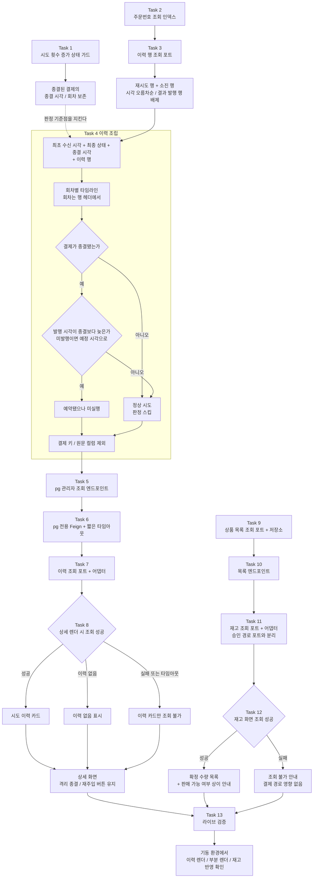

# 관리자 화면 가시성 확충 구현 플랜

> 작성일: 2026-07-27

## 요약 브리핑

### Task 목록

pg-service 가 이력을 내주고, payment-service 가 받아 그리고, product-service 가 재고 목록을 내주는 순서다.

| # | 태스크 | 한 줄 |
|---|---|---|
| 1 | 시도 횟수 증가에 진행 중 상태 가드 | 종결된 결제의 종결 시각이 뒤로 밀리지 않게 못을 박는다. 승인 경로를 건드리는 유일한 태스크 |
| 2 | `pg_outbox` 주문번호 조회 인덱스 | 주문번호로 이력을 찾을 때 전체 스캔이 되지 않게 |
| 3 | outbox 주문번호별 이력 행 조회 포트 | 재시도 행과 소진 행만 시각 순서로 뽑는다. 결과 발행 행은 섞이지 않는다 |
| 4 | 시도 이력 조립 서비스 | 이 플랜의 핵심. 회차별 타임라인을 만들고 유령 행을 갈라낸다 |
| 5 | pg 관리자 이력 조회 엔드포인트 | pg-service 최초의 HTTP 진입점 |
| 6 | pg 전용 Feign client + 짧은 타임아웃 | 관리자 조회는 빨리 실패하는 편이 낫다 |
| 7 | 시도 이력 조회 포트 + HTTP 어댑터 | payment 쪽 수신 경로 |
| 8 | 결제 상세에 시도 이력 카드 + 부분 렌더 | pg 가 죽어도 격리 종결·재주입 버튼은 살아 있어야 한다 |
| 9 | 상품 목록 페이징 조회 포트 + 저장소 | 상품과 확정 재고를 조인해 페이지로 |
| 10 | 상품 목록 조회 엔드포인트 | product-service 에 없던 목록 경로 |
| 11 | 재고 목록 조회 포트 + HTTP 어댑터 | 승인 경로 포트와 분리한 관리자 전용 읽기 포트 |
| 12 | 재고 화면 | 확정 수량 목록 + 실시간 판매 가능 여부는 다를 수 있다는 안내 |
| 13 | 라이브 검증 | 기동해봐야 증명되는 것 세 가지 |

### 변경 후 전체 플로우

### 핵심 결정 → Task 매핑 요약

- 시도 이력을 pg 직접 조회로 → 5, 6, 7, 8
- 이력 출처는 기존 outbox 행 → 3, 4 (인덱스는 2)
- 유령 행 갈라내기 + 기준 시각 보호 → 4, 1
- 원문 컬럼·결제 키 비노출 → 4, 5
- pg 장애 시 부분 렌더 → 8
- 재고 조회 전용 별도 화면 → 9, 10, 11, 12
- 라이브 검증 → 13

전체 대조는 하단 "결정 → Task 매핑" 표.

### 트레이드오프 / 후속 작업

- Task 1 은 승인 경로를 건드린다. 정상 재시도 시점에 행이 항상 진행 중 상태라 가드가 무동작임을 게이트에서 코드로 확인했고, 완료 기준에 정상 경로 회귀 확인을 넣었다
- Task 5 와 Task 9~10 은 소비자 없이 먼저 존재하는 구간이 생긴다. 미사용 엔드포인트일 뿐 기존 경로에 영향은 없다
- 좀비 타임아웃과 백오프 겹침 자체는 이 플랜이 고치지 않는다 — 표시만 교정한다
- Task 4 의 미실행 판정은 발행 시각 기준이라 벤더 호출 시각과 여전히 근사값 관계다. 화면 문구로 밝힌다

---

## 목표

운영자가 관리자 화면만 보고 (1) 격리된 결제가 언제 언제 몇 번 시도됐는지, (2) 상품별 확정 재고가 얼마인지 파악할 수 있다.

## 컨텍스트

- 설계 문서: `docs/topics/ADMIN-VISIBILITY.md`
- 이슈 / 브랜치: #126
- 주요 변경 파일
  - pg-service: `JpaPgInboxRepository` · `PgOutboxRepository` + 구현 · 이력 조립 서비스(신규) · 관리자 조회 컨트롤러(신규) · Flyway V6
  - product-service: `ProductRepository` · `ProductQueryUseCase` · `ProductController`
  - payment-service: pg 조회 Feign client + 설정(신규) · 조회 포트 2종(신규) · `PaymentAdminController` · 재고 화면 컨트롤러(신규) · `payment-event-detail.html` · 재고 화면 템플릿(신규)

## 진행 상황

- [x] Task 1: 시도 횟수 증가에 진행 중 상태 가드
- [x] Task 2: `pg_outbox` 주문번호 조회 인덱스
- [x] Task 3: outbox 주문번호별 이력 행 조회 포트
- [x] Task 4: 시도 이력 조립 서비스
- [x] Task 5: pg 관리자 이력 조회 엔드포인트
- [x] Task 6: payment 측 pg 전용 Feign client + 짧은 타임아웃 설정
- [x] Task 7: 시도 이력 조회 포트 + HTTP 어댑터
- [x] Task 8: 결제 상세에 시도 이력 카드 + 부분 렌더
- [x] Task 9: 상품 목록 페이징 조회 포트 + 저장소
- [x] Task 10: 상품 목록 조회 엔드포인트
- [ ] Task 11: 재고 목록 조회 포트 + HTTP 어댑터
- [ ] Task 12: 재고 화면
- [ ] Task 13: 라이브 검증

---

## 태스크

### Task 1: 시도 횟수 증가에 진행 중 상태 가드 [tdd=true] [domain_risk=true]

승인 경로를 건드리는 유일한 태스크다. 이력의 기준 시각이 밀리지 않게 먼저 못을 박는다.

**테스트 (RED)**

`pg-service/src/test/java/.../integration/PgInboxAttemptGuardIntegrationTest.java` (신규, Testcontainers — `@Query` 라 실제 DB 필요. `PgInboxTraceparentIntegrationTest` 의 컨테이너 패턴을 따른다. pg-service 통합 테스트는 컨테이너 재사용을 쓰지 않으므로 기존 DB명을 그대로 공유한다 — payment-service 의 스키마 방식별 DB명 분리 규약은 재사용 컨테이너 전제라 여기엔 해당하지 않는다)

- `incrementAttempt_진행중_행_횟수와_갱신시각_증가`
- `incrementAttempt_종결_행_횟수와_갱신시각_불변` — `@ParameterizedTest @EnumSource` 로 APPROVED / FAILED / QUARANTINED 세 종결 상태 전부. 호출 전후 `attempt` 와 `updated_at` 이 모두 그대로여야 한다
- `incrementAttempt_종결_행_반영행수_0` — 갱신 행 수 반환값으로 무동작을 확인

**구현 (GREEN)**

- `JpaPgInboxRepository.incrementAttempt` 의 `@Query` 에 진행 중 상태 조건 추가. javadoc 의 "호출처가 확장될 경우" 문구를 현재 상태에 맞게 갱신
- `PgInboxRepositoryImpl.incrementAttempt` 가 상태 파라미터를 넘기도록 수정
- `FakePgInboxRepository` 가 같은 가드 행동을 재현하도록 수정 — Fake 가 프로덕션과 다르게 행동하면 상위 테스트가 거짓 GREEN 을 만든다

**완료 기준**

- 위 테스트 pass, `./gradlew :pg-service:test` 회귀 없음
- 정상 재시도 경로 테스트(`PgVendorCallServiceTest`, `PgSelfLoopRetryExhaustionIntegrationTest`)가 그대로 통과 — 가드가 정상 경로를 막지 않음을 확인

**완료 결과**

- `JpaPgInboxRepository.incrementAttempt` 의 `@Query` 에 `AND e.status = :inProgress` 가드 추가. `PgInboxRepositoryImpl.incrementAttempt` 는 항상 `PgInboxStatus.IN_PROGRESS` 를 넘긴다 — 포트 인터페이스(`PgInboxRepository.incrementAttempt(String orderId)`) 시그니처는 변경하지 않았다
- `FakePgInboxRepository.incrementAttempt` 에 동일 가드(현재 상태가 IN_PROGRESS 가 아니면 no-op) 반영
- 신규 통합 테스트 `PgInboxAttemptGuardIntegrationTest` 7건 — IN_PROGRESS 증가 1건 + 종결 3상태(APPROVED/FAILED/QUARANTINED) 불변 3건 + 반영 행 수 0 확인 3건, Testcontainers MySQL(`pg-test` DB 공유)
- `./gradlew :pg-service:test` 331건 전체 pass, `:pg-service:integrationTest` 16건 전체 pass — `PgVendorCallServiceTest`(재시도 attempt 1→2 누적 검증 포함) · `PgSelfLoopRetryExhaustionIntegrationTest`(4회 self-loop 소진→QUARANTINED) 정상 재시도 경로 회귀 없음 확인. 게이트에서 확인된 대로 가드는 정상 경로에서 무동작

---

### Task 2: `pg_outbox` 주문번호 조회 인덱스 [tdd=false] [domain_risk=false]

**구현**

- `pg-service/src/main/resources/db/migration/V6__add_pg_outbox_key_topic_index.sql` 신규
- `key` 는 MySQL 예약어라 백틱이 필요하다 (V1 DDL 과 동일하게 처리)
- 인덱스 컬럼 순서는 조회 조건(주문번호 일치 + 토픽 구분)에 맞춘다
- 주석에 이 인덱스가 발행 큐 폴링용이 아니라 관리자 이력 조회용임을 남긴다

**완료 기준**

- pg-service 통합 테스트가 V1~V6 로 부팅 — 마이그레이션 회귀 게이트 통과
- `./gradlew :pg-service:test` 회귀 없음

**완료 결과**

- `pg-service/src/main/resources/db/migration/V6__add_pg_outbox_key_topic_index.sql` 신규 — `CREATE INDEX idx_pg_outbox_key_topic ON pg_outbox (\`key\`, topic)`. `key` 예약어 백틱 처리는 V1 DDL 방식 그대로 따름
- 컬럼 순서는 조회 조건(주문번호 일치 → 토픽 구분) 순서에 맞췄고, 발행 큐 폴링용 `idx_pg_outbox_processed_available` 과 용도가 다르다는 점을 주석에 남김
- `./gradlew :pg-service:test` 331건 pass, `:pg-service:integrationTest` 16건 pass — Testcontainers 가 V1~V6 로 정상 부팅 확인

---

### Task 3: outbox 주문번호별 이력 행 조회 포트 [tdd=true] [domain_risk=false]

**테스트 (RED)**

`PgOutboxRepositoryImplTest` (신규 또는 기존 저장소 테스트에 추가) + 조회 조건 검증은 통합 테스트로

- `findConfirmAttemptRows_주문번호_일치_행만_반환`
- `findConfirmAttemptRows_확정명령과_소진_토픽만_반환` — 결과 발행 토픽(`payment.events.confirmed`) 행은 섞이지 않아야 한다. 재발행 서비스가 만든 행이 시도로 오독되면 화면이 거짓을 말한다
- `findConfirmAttemptRows_생성시각_오름차순` — 타임라인 순서 고정
- `findConfirmAttemptRows_해당_주문_행_없으면_빈_목록`

**구현 (GREEN)**

- `PgOutboxRepository` 에 주문번호 기준 이력 행 조회 메서드 추가 (application/port/out)
- `JpaPgOutboxRepository` + `PgOutboxRepositoryImpl` 에 구현
- `FakePgOutboxRepository` 에 같은 메서드 추가

**완료 기준**

- 위 테스트 pass, `./gradlew :pg-service:test` 회귀 없음

**완료 결과**

- `PgOutboxRepository` 포트에 `findConfirmAttemptRows(String orderId)` 추가 — 주문번호(key) + 확정 명령/소진 토픽만, created_at 오름차순
- `JpaPgOutboxRepository.findByKeyAndTopicInOrderByCreatedAtAsc(key, topics)` 파생 쿼리로 구현 — V6 인덱스(`key, topic`) 컬럼 순서와 조회 조건 순서를 맞췄다
- `PgOutboxRepositoryImpl` 은 `CONFIRM_ATTEMPT_TOPICS = [COMMANDS_CONFIRM, COMMANDS_CONFIRM_DLQ]` 상수로 결과 발행 토픽(`EVENTS_CONFIRMED`)을 조회 조건에서 배제
- `FakePgOutboxRepository` 에 동일 필터(주문번호 일치 + 확정 시도 토픽) + `createdAt` 정렬 로직 재현
- 신규 통합 테스트 `PgOutboxRepositoryImplTest` 4건 — 주문번호 일치 필터 · 확정명령/소진 토픽만 반환(결과 발행 토픽 배제 확인) · 생성시각 오름차순 · 빈 목록, `@DataJpaTest` + Testcontainers MySQL(`PgInboxRepositoryImplTest` 패턴)
- `./gradlew :pg-service:test` 335건 전체 pass (기존 331 + 신규 4) — 회귀 없음

---

### Task 4: 시도 이력 조립 서비스 [tdd=true] [domain_risk=true]

이 플랜의 핵심 로직이다. 화면이 말하는 사실의 정확성이 전부 여기서 결정된다.

**테스트 (RED)**

`pg-service/src/test/java/.../application/service/PgAttemptHistoryServiceTest.java` (신규, Mockito + Fake 저장소)

- `조립_최초_수신만_있으면_1회차_한_건` — 재시도 행이 없는 진행 초기
- `조립_재시도_진행중_예정_상태_포함` — 발행 시각이 비어 있는 행은 실행 예정으로 분류되고 값이 비어도 깨지지 않는다
- `조립_소진_후_격리_소진_표시` — 격리 토픽 행이 소진으로 표시된다
- `조립_회차_정보_없는_행_미지로_표시` — 헤더에 회차가 없는 옛 행이 섞여도 조회가 실패하지 않고 시각 순서로 남는다
- `조립_이력_없음과_조회실패_구분` — 해당 주문이 pg 에 없을 때는 이력 없음으로 응답한다 (조회 실패와 다른 상태)
- `조립_발행시각이_종결시각보다_늦으면_미실행으로_분류` — 좀비 회수가 앞지른 경우. 정상 시도로 세지 않는다
- `조립_예정은_종결전_발행은_종결후면_미실행으로_분류` — 실행 예정 시각은 종결 전이었으나 발행이 밀려 종결 이후에 나간 행. 발행 시각이 있으면 그것으로 판정해야 이 좁은 창이 막힌다
- `조립_발행시각_없으면_실행예정시각으로_판정` — 아직 미발행 행의 폴백 경로
- `조립_종결시각_이전_행은_정상시도로_분류` — 위 판정이 정상 행을 잡아먹지 않는지 반대 방향
- `조립_진행중_결제는_종결시각_없어_미실행_판정_스킵` — 비종결 결제는 비교 대상이 없다. 기본값을 잘못 잡으면 진행 중인 정상 재시도가 미실행으로 표시된다
- `조립_세_시각_의미_고정` — 예약 시각 = 직전 시도 실패 후 예약 시점, 실행 예정 시각 = 백오프 반영 예정 시점, 발행 시각 = 실제 발행 시점. 회차와의 짝이 어긋나지 않도록 못을 박는다
- `조립_응답에_결제키_미포함` — `payload` 원문과 `payment_key` 가 결과에 담기지 않는다

**구현 (GREEN)**

- `pg/application/dto/PgAttemptHistory.java` + 회차 항목 DTO 신규 — 회차 · 예약 시각 · 실행 예정 시각 · 발행 시각 · 소진 여부 · 정상 시도 여부, 그리고 최종 상태 · 종결 시각 · 사유 코드
- `pg/application/service/PgAttemptHistoryService.java` 신규 — `PgInboxRepository` 로 최초 수신 시각·최종 상태·종결 시각을 읽고, Task 3 조회로 이력 행을 받아 타임라인 조립
- **미실행 판정 기준**: 발행 시각이 있으면 발행 시각을, 없으면 실행 예정 시각을 종결 시각과 비교한다. 발행이 예정보다 밀리면 예정 시각만으로는 유령 행을 놓친다. 결제가 비종결이면 비교 대상이 없으므로 판정을 건너뛴다
- 회차는 행 헤더에서 읽는다. 헤더 파싱 실패·부재는 회차 미지로 처리하고 예외를 던지지 않는다
- `PgInboxRepository` 에 필요한 조회가 없으면 추가 (주문번호로 상태·시각 단건 조회)

**완료 기준**

- 위 테스트 전건 pass, `./gradlew :pg-service:test` 회귀 없음
- 응답 DTO 에 `payload` / `headers_json` / `payment_key` 필드가 존재하지 않음을 코드로 확인
- 이 태스크에서 추가한 로그 문장에 `payload` / `headers_json` / `payment_key` / 엔티티 `toString` 이 없음을 확인 — 결정 사항은 응답뿐 아니라 로그도 비노출을 요구한다

**완료 결과**

- `pg/application/dto/PgAttemptHistoryEntry.java` 신규 — 회차(`Optional<Integer>`, 헤더 파싱 실패·부재 시 empty) · 예약 시각(`reservedAt`, outbox row 의 created_at) · 실행 예정 시각(`scheduledAt`, available_at) · 발행 시각(`publishedAt`, processed_at, nullable) · 소진 여부(`exhausted`) · 정상 시도 여부(`normalAttempt`). 1회차는 `initial(receivedAt)` factory 로 pg_inbox.created_at 을 그대로 담고 예약/발행 시각 없이 항상 정상 시도로 고정
- `pg/application/dto/PgAttemptHistory.java` 신규 — 주문번호 · 이력 존재 여부(`found`) · 최종 상태 · 종결 시각 · 사유 코드 · 회차 목록. 이력 없음은 `notFound(orderId)` factory 로 `found=false` 반환 — 조회 실패(예외)와 다른 상태
- `pg/application/service/PgAttemptHistoryService.java` 신규 — `PgInboxRepository.findByOrderId` 로 최초 수신 시각·최종 상태·종결 시각을 읽고, `PgOutboxRepository.findConfirmAttemptRows` 로 얻은 이력 행을 타임라인으로 조립
- **미실행 판정**: 결제가 비종결이면(`finalizedAt=null`) 판정을 건너뛰고 항상 정상 시도로 취급. 종결된 경우 발행 시각이 있으면 그것을, 없으면 실행 예정 시각을 종결 시각과 비교해 늦으면 미실행으로 분류
- 회차는 `headers_json` 을 Jackson `ObjectMapper` 로 파싱해 읽는다 — `pg_outbox.attempt` 컬럼은 사용하지 않는다. 파싱 실패(`JsonProcessingException`)·헤더 부재·`attempt` 필드가 정수가 아닌 경우 모두 `Optional.empty()` 로 흡수하고 예외를 던지지 않는다
- 응답 DTO 어디에도 `payload` / `headers_json` / `payment_key` 필드가 없다 — record component 구성 자체에서 배제. 로그 문장도 `orderId` 외 값을 찍지 않는다
- 신규 단위 테스트 `PgAttemptHistoryServiceTest` 12건 — 최초 수신 1회차 조립 · 재시도 진행중(미발행) 포함 · 소진 토픽 표시 · 회차 미지 처리 · 이력없음/조회실패 구분(예외 전파 확인) · 미실행 판정 4종(발행 지연 · 예정은 종결전 발행은 종결후 · 발행시각 없으면 예정시각 폴백 · 종결 이전은 정상) · 비종결 결제 판정 스킵 · 세 시각 의미 고정 · 응답에 결제키·원문 미노출(record component 리플렉션 + toString 미포함 확인). Mockito BDD + AssertJ, DB 불필요
- `./gradlew :pg-service:test` 347건 전체 pass (기존 335 + 신규 12) — 회귀 없음

---

### Task 5: pg 관리자 이력 조회 엔드포인트 [tdd=true] [domain_risk=true]

pg-service 최초의 HTTP 진입점이다.

**테스트 (RED)**

`pg-service/src/test/java/.../presentation/PgAttemptHistoryControllerTest.java` (신규, `@WebMvcTest` 슬라이스)

- `조회_정상_응답_형태_고정` — 필드명·구조를 동결한다. payment 측 어댑터가 이 형태에 의존한다
- `조회_이력없는_주문_이력없음_응답` — 404 가 아니라 이력 없음을 담은 정상 응답. 조회 실패와 구분되어야 한다
- `조회_응답에_결제키_미포함`

**구현 (GREEN)**

- `pg/presentation/port/PgAttemptHistoryQueryService.java` 신규 (인바운드 포트, `PgConfirmCommandService` 와 같은 패턴)
- Task 4 의 `PgAttemptHistoryService` 클래스 선언에 이 포트 `implements` 추가 — `PgConfirmService` 가 `PgConfirmCommandService` 를 구현하는 것과 같은 배치
- `pg/presentation/PgAttemptHistoryController.java` 신규 — 관리자 조회 전용 `@RestController`. 경로는 결제 확정 도메인 어휘로 잡고 주문번호를 경로 변수로 받는다
- `pg/presentation/dto/` 응답 DTO 신규 — application DTO 를 그대로 노출하지 않고 presentation 응답으로 변환

**완료 기준**

- 위 테스트 pass, `./gradlew :pg-service:test` 회귀 없음
- 응답 JSON 필드명이 테스트로 고정됨
- 이 태스크에서 추가한 로그 문장에 결제 키·원문 컬럼이 없음을 확인

**완료 결과**

- `pg/presentation/port/PgAttemptHistoryQueryService.java` 신규 (인바운드 포트) — `getAttemptHistory(String orderId)` 반환 타입은 Task 4 의 application DTO `PgAttemptHistory` 그대로(ProductQueryService 가 도메인 엔티티를 그대로 반환하는 것과 같은 배치). `PgAttemptHistoryService` 클래스 선언에 `implements PgAttemptHistoryQueryService` 추가 — `PgConfirmService`/`PgConfirmCommandService` 배치와 동일
- `pg/presentation/PgAttemptHistoryController.java` 신규 — `@RestController`, `GET /api/v1/confirmations/{orderId}/attempts`. pg-service 최초의 `@RestController`
- `pg/presentation/dto/PgAttemptHistoryResponse.java` + `PgAttemptEntryResponse.java` 신규 — application DTO 를 그대로 노출하지 않고 변환. `finalStatus` 는 `PgInboxStatus` enum 을 문자열로 변환해 응답이 pg-service 내부 타입에 결합되지 않게 함. `attemptNo` 는 `Optional<Integer>` → nullable `Integer` 로 변환(payment 측이 jackson-datatype-jdk8 없이도 역직렬화 가능하도록)
- 이력 없는 주문은 `PgAttemptHistory.notFound()` 를 그대로 응답으로 변환해 `found=false` 로 HTTP 200 반환 — 404 아님. 조회 자체의 실패(예외)는 컨트롤러가 흡수하지 않고 그대로 전파(5xx) — pg-service 에 아직 `@RestControllerAdvice` 가 없는 채로 끝나는 것이 이 엔드포인트의 설계 의도(이력 없음이 정상 응답으로 처리되어 흡수할 도메인 예외가 없음)
- 이 태스크에서 추가한 코드에는 로그 문장이 없다(`ProductController` 와 동일하게 단순 위임 컨트롤러라 로깅 없음) — 결제 키·원문 컬럼 비노출 요구는 응답 DTO 구성 자체(필드 미존재)로 충족
- 신규 슬라이스 테스트 `PgAttemptHistoryControllerTest` 3건 — 정상 응답 형태 고정(회차·세 시각·정상시도 여부 전 필드 jsonPath 검증) · 이력 없음 200 정상 응답(404 아님 확인) · 응답에 결제키/원문/헤더 미포함, `@WebMvcTest` + Mockito
- `./gradlew :pg-service:test` 350건 전체 pass (기존 347 + 신규 3) — 회귀 없음

---

### Task 6: payment 측 pg 전용 Feign client + 짧은 타임아웃 설정 [tdd=true] [domain_risk=false]

**테스트 (RED)**

`payment-service/src/test/java/.../infrastructure/adapter/http/feign/PgFeignConfigTest.java` (신규, `ProductFeignConfigTest` 패턴 — Mockito 로 `feign.Response` mock 후 `ErrorDecoder.decode()` 결과 검증)

- 404 → 도메인 예외
- 503 / 429 → 재시도 가능 예외
- 500 → 상태 예외

**구현 (GREEN)**

- `payment/infrastructure/adapter/http/feign/PgFeignClient.java` 신규 — Eureka 논리 이름 `pg-service`, Task 5 엔드포인트 시그니처와 정확히 일치
- `payment/infrastructure/adapter/http/feign/PgFeignConfig.java` 신규 — 관리자 조회 전용 짧은 연결·읽기 타임아웃과 ErrorDecoder. `@FeignClient(configuration = ...)` 로만 한정 등록한다 (전역 `@Configuration` 등록 시 다른 client 에 새어 나간다 — `UserFeignConfig` javadoc 경고)
- `payment/infrastructure/adapter/http/dto/` 에 pg 응답 수신 DTO 신규
- 타임아웃 값은 설정 파일에 노출해 조정 가능하게 둔다

**완료 기준**

- 위 테스트 pass, `./gradlew :payment-service:test` 회귀 없음
- 기존 상품·사용자 Feign 타임아웃이 변하지 않음을 확인

**완료 결과**

- `payment/infrastructure/adapter/http/feign/PgFeignClient.java` 신규 — Eureka 논리 이름 `pg-service`, `GET /api/v1/confirmations/{orderId}/attempts` (Task 5 엔드포인트와 시그니처 일치). `payment-service` 가 `pg-service` 를 HTTP 로 부르는 최초의 경로
- `payment/infrastructure/adapter/http/feign/PgFeignConfig.java` 신규 — `@FeignClient(configuration = ...)` 로만 한정 등록(`@Configuration` 미부착), ErrorDecoder 로 404 → `PgAttemptHistoryNotFoundException`(PG_ATTEMPT_HISTORY_NOT_FOUND), 429/502/503/504 → `PgAttemptHistoryServiceRetryableException`(PG_SERVICE_UNAVAILABLE), 500 및 그 외 → `IllegalStateException` 매핑. `ProductFeignConfig`/`UserFeignConfig` 와 동일한 배치
- `payment/infrastructure/adapter/http/dto/PgAttemptHistoryResponse.java` + `PgAttemptEntryResponse.java` 신규 — pg-service 응답 수신 전용 record, 필드 시그니처를 pg-service `presentation.dto` 와 그대로 맞춤
- `PaymentErrorCode` 에 `PG_ATTEMPT_HISTORY_NOT_FOUND`(E03040) / `PG_SERVICE_UNAVAILABLE`(E03041) 추가, `EventType` 에 `PG_SERVICE_NOT_FOUND`/`PG_SERVICE_RETRYABLE`/`PG_SERVICE_UNEXPECTED` 추가. 로그 도메인은 기존에 있었으나 미사용이던 `LogDomain.PAYMENT_GATEWAY` 재사용(신규 enum 값 추가 없음)
- `application.yml` 에 `spring.cloud.openfeign.client.config.pg-service` 블록 신규 추가 — `connectTimeout`/`readTimeout` 을 `PG_ADMIN_QUERY_CONNECT_TIMEOUT_MS`(기본 1000ms) / `PG_ADMIN_QUERY_READ_TIMEOUT_MS`(기본 2000ms) 환경변수로 노출. 기존 `default` 블록(연결 2000ms/읽기 5000ms)은 손대지 않아 상품·사용자 Feign client 타임아웃 불변
- 신규 단위 테스트 `PgFeignConfigTest` 6건 — 404/429/502/503/504/500 각 상태 코드 → 도메인 예외 매핑 확인, `ProductFeignConfigTest` 패턴
- `./gradlew :payment-service:test` 518건 전체 pass (기존 512 + 신규 6) — `ProductFeignConfigTest`/`UserFeignConfigTest` 포함 회귀 없음, 기존 상품·사용자 Feign 타임아웃 설정(`default` 블록) 변경 없음 확인

---

### Task 7: 시도 이력 조회 포트 + HTTP 어댑터 [tdd=true] [domain_risk=false]

**테스트 (RED)**

`payment-service/src/test/java/.../infrastructure/adapter/http/PgAttemptHistoryHttpAdapterContractTest.java` (신규, `ProductHttpAdapterContractTest` 패턴)

- `도메인_예외_그대로_전파`
- `transport_예외_재시도가능_예외로_변환` — `feign.RetryableException`(타임아웃 등) 변환
- `정상_응답_도메인_DTO_변환` — 회차·시각·정상 시도 여부가 빠지지 않고 옮겨진다

**구현 (GREEN)**

- `payment/application/port/out/PgAttemptHistoryPort.java` 신규 — 결제 승인 경로가 쓰는 포트와 분리한다
- `payment/application/dto/` 에 이력 도메인 DTO 신규
- `payment/infrastructure/adapter/http/PgAttemptHistoryHttpAdapter.java` 신규 — 포트 구현, transport 예외 매핑

**완료 기준**

- 위 테스트 pass, `./gradlew :payment-service:test` 회귀 없음

**완료 결과**

- `payment/application/dto/admin/PgAttemptEntryInfo.java` + `PgAttemptHistoryInfo.java` 신규 — `PaymentEventSearchQuery` 등 기존 admin dto 패키지의 `@Getter @Builder` 관례를 따름. `PgAttemptEntryInfo` 는 회차(`Optional<Integer>`) · 예약/실행예정/발행 세 시각 · 소진 여부 · 정상 시도 여부, `PgAttemptHistoryInfo` 는 주문번호 · 이력 존재 여부 · 최종 상태 · 종결 시각 · 사유 코드 · 회차 목록 — pg-service `PgAttemptHistory`/`PgAttemptHistoryEntry` 의 값 구성을 그대로 옮겼다
- `payment/application/port/out/PgAttemptHistoryPort.java` 신규 — `getAttemptHistory(String orderId)`. 결제 승인 경로가 쓰는 `ProductPort`/`UserPort` 와 별개 인터페이스
- `payment/infrastructure/adapter/http/PgAttemptHistoryHttpAdapter.java` 신규 — `PgAttemptHistoryPort` 구현체, `ProductHttpAdapter` 패턴 그대로: 4xx/5xx 도메인 예외(`PgAttemptHistoryNotFoundException`/`PgAttemptHistoryServiceRetryableException`, Task 6 ErrorDecoder 가 생성)는 그대로 propagate, `feign.RetryableException`(transport-level) 만 `PgAttemptHistoryServiceRetryableException` 으로 변환. `ProductHttpAdapter`/`UserHttpAdapter` 와 달리 Fake 대체 구현이 없어(`@ConditionalOnProperty` 대상 프로파일 미존재) 조건 없이 항상 `@Component` 로 등록
- 응답 → 도메인 DTO 변환에서 `PgAttemptEntryResponse.attemptNo()`(nullable `Integer`) 를 `Optional.ofNullable` 로 감싸 회차 미지 상태를 보존, 세 시각과 정상 시도 여부는 필드 그대로 옮김 — 원문 컬럼·결제 키는 애초 응답 DTO(Task 6)에 없어 변환 과정에 노출 경로가 없음
- 신규 계약 테스트 `PgAttemptHistoryHttpAdapterContractTest` 3건 — 도메인 예외 그대로 전파 · transport 예외(`feign.RetryableException`) 재시도 가능 예외 변환 · 정상 응답의 회차/세 시각/정상 시도 여부 도메인 DTO 변환 확인, `ProductHttpAdapterContractTest` 패턴(Mockito 로 FeignClient mock)
- `./gradlew :payment-service:test` 521건 전체 pass (기존 518 + 신규 3) — 회귀 없음

---

### Task 8: 결제 상세에 시도 이력 카드 + 부분 렌더 [tdd=true] [domain_risk=true]

관측 기능이 대응 기능을 망가뜨리지 않는지가 이 태스크의 핵심이다.

**테스트 (RED)**

`payment-service/src/test/java/.../presentation/PaymentAdminControllerAttemptHistoryTest.java` (신규, `@WebMvcTest` 슬라이스)

- `상세_이력_정상_조회시_모델에_이력_담김`
- `상세_pg_조회_실패시_상세_렌더_유지` — 이력 조회가 예외를 던져도 상태·사유·주문·상태 변경 이력이 모델에 그대로 담기고 200 이 반환된다
- `상세_pg_조회_실패시_이력_조회불가_표시` — 조회 불가 플래그가 모델에 담긴다
- `상세_pg_타임아웃시도_상세_렌더_유지` — 재시도 가능 예외(타임아웃) 경로도 같은 결과
- `상세_이력없음과_조회불가_구분` — 두 상태가 모델에서 다르게 표현된다

**구현 (GREEN)**

- `PaymentAdminController.getPaymentEventDetail` 에 이력 조회 추가. 조회 예외는 여기서 흡수하고 조회 불가 상태를 모델에 담는다 — 예외를 밖으로 던지면 상세 화면이 통째로 깨지고 격리 종결·재주입 버튼이 사라진다
- `payment-event-detail.html` 에 시도 이력 카드 추가 (기존 카드 구성과 동일한 형태). 회차 · 예약 시각 · 실행 예정 시각 · 발행 시각 · 정상 시도 여부 표시
- 발행 시각이 벤더 호출 시각의 근사값이라는 문구, 미실행 행의 의미 설명을 화면에 둔다
- 실행 예정 상태(발행 시각 없음)와 회차 미지가 빈 값으로 깨지지 않게 렌더

**완료 기준**

- 위 테스트 전건 pass, `./gradlew :payment-service:test` 회귀 없음
- 기존 격리 종결 · 유실 메시지 재주입 컨트롤러 테스트가 그대로 통과

**완료 결과**

- `PaymentAdminController` 생성자에 `PgAttemptHistoryPort`(Task 7 아웃바운드 포트) 를 직접 주입 — 관측 전용 단순 조회라 별도 presentation 포트/application 서비스 계층을 추가하지 않고 플랜 명세대로 컨트롤러가 예외 흡수까지 담당한다
- `getPaymentEventDetail` 마지막에 `addAttemptHistory(model, orderId)` 사설 메서드 호출 추가 — `pgAttemptHistoryPort.getAttemptHistory(orderId)` 를 `try/catch (RuntimeException e)` 로 감싼다. 이 catch 는 `PgAttemptHistoryNotFoundException`(기술적 404) · `PgAttemptHistoryServiceRetryableException`(429/502/503/504 및 transport RetryableException) · `IllegalStateException`(500/미매핑) 등 pg 조회가 던질 수 있는 모든 런타임 예외를 한 곳에서 흡수한다 — 개별 타입별 분기 없이 "조회 실패는 전부 조회 불가"로 취급
  - 성공: `model.addAttribute("attemptHistory", PgAttemptHistoryViewResponse.from(info))` + `attemptHistoryUnavailable=false` — `info.found` 가 true/false 어느 쪽이든(이력 있음/이력 없음) 이 경로
  - 실패(예외): `attemptHistoryUnavailable=true` 만 담고 `attemptHistory` 속성 자체를 추가하지 않음 — 템플릿이 `attemptHistory != null` 로 이력 없음과 조회 불가를 구분
  - 예외는 `LogFmt.warn(LogDomain.PAYMENT_GATEWAY, EventType.PG_SERVICE_UNEXPECTED, ...)` 로 로깅 후 흡수(재throw 안 함) — 컨트롤러가 최종 흡수 지점이라 error-logging 컨벤션의 "swallow 금지"는 여기서 명시적 fallback(모델 플래그)으로 충족
- `presentation/dto/response/admin/PgAttemptHistoryViewResponse.java` + `PgAttemptEntryViewResponse.java` 신규 — 기존 `PaymentEventResponse`/`PaymentOrderResponse` 와 동일한 `@Getter @Builder` + static `from(...)` 패턴. `PgAttemptEntryViewResponse.attemptNo` 는 `PgAttemptEntryInfo` 의 `Optional<Integer>` 를 `orElse(null)` 로 nullable `Integer` 변환 — 템플릿이 Optional 을 직접 다루지 않게 함
- `payment-event-detail.html` 에 "PG Confirm Attempt History" 카드 신규 — 기존 "Payment Orders"/"Status History" 카드와 동일한 `detail-card` 구성. 화면 문구로 발행 시각이 벤더 호출 시각의 근사값임과, 미실행 표시 회차의 의미(예약됐으나 좀비 회수가 앞질러 실제 벤더 호출 없음)를 카드 상단에 고정 텍스트로 명시
  - 세 상태 분기: `attemptHistoryUnavailable` → 경고 알림 / `attemptHistory != null and !attemptHistory.found` → 이력 없음 안내 / `attemptHistory != null and attemptHistory.found` → 회차별 테이블(회차·예약 시각·실행 예정 시각·발행 시각·정상 시도 여부)
  - 발행 시각 없음(미발행)과 회차 미지는 각각 `attempt.publishedAt != null ? ... : '미발행(실행 예정)'` / `attempt.attemptNo != null ? ... : '미지'` 삼항식으로 널 가드 — 실제 `@WebMvcTest` 가 Thymeleaf 를 진짜로 렌더링하므로 이 가드가 없었다면 테스트에서 바로 드러났을 것
- 기존 `PaymentAdminControllerTest`(resolve-quarantine/reprocess-dlq POST 테스트 6건) 는 생성자에 추가된 `PgAttemptHistoryPort` 를 위한 `@MockitoBean` 만 추가 — 로직 변경 없이 그대로 통과
- 신규 슬라이스 테스트 `PaymentAdminControllerAttemptHistoryTest` 5건 — 정상 조회 시 모델에 이력 담김 · 조회 예외(`IllegalStateException`) 시에도 event/orders/histories 모델 유지 · 조회 예외 시 조회불가 플래그 표시 · 재시도 가능 예외(`PgAttemptHistoryServiceRetryableException`, 타임아웃 대표) 시에도 상세 렌더 유지+조회불가 표시 · 이력없음(found=false, 정상 응답)과 조회불가(예외)가 모델에서 서로 다르게 표현됨. `@WebMvcTest` 라 실제 템플릿이 렌더링되어 세 상태 모두 500 없이 렌더됨을 함께 검증
- `./gradlew :payment-service:test` 526건 전체 pass (기존 521 + 신규 5) — 기존 격리 종결(`resolveQuarantine`)·DLQ 재주입(`reprocessDlq`) 컨트롤러 테스트 회귀 없음. `checkstyleMain`/`checkstyleTest`/`spotbugsMain`/`spotbugsTest` 모두 통과

---

### Task 9: 상품 목록 페이징 조회 포트 + 저장소 [tdd=true] [domain_risk=false]

**테스트 (RED)**

`product-service/src/test/java/.../infrastructure/repository/ProductRepositoryImplPageTest.java` (신규) — 상품과 재고를 조인해 페이지로 반환하는 조회

- `목록조회_요청한_페이지_크기만큼_반환`
- `목록조회_확정_수량_포함` — 조인이 빠지면 재고가 비어 화면이 무의미해진다
- `목록조회_범위를_넘는_페이지_빈_목록`
- `목록조회_전체_건수_반환` — 페이지 계산 근거

**구현 (GREEN)**

- `ProductRepository` 에 페이지 조회 메서드 추가 (application/port/out)
- `JpaProductRepository` + `ProductRepositoryImpl` 에 구현
- 페이지 결과를 담을 product-service 내부 DTO 신규 — payment-service 의 페이지 DTO 를 공유하지 않는다 (서비스 간 공유 jar 금지 방침)

**완료 기준**

- 위 테스트 pass, `./gradlew :product-service:test` 회귀 없음

**완료 결과**

- `application/dto/ProductPage.java` 신규 — `content`(Product 목록, 확정 재고 포함) · `page`(0부터 시작) · `size` · `totalElements`. payment-service 의 페이지 응답 DTO 를 공유하지 않는다(서비스 간 공유 jar 금지 방침) — product-service 내부 전용 record
- `ProductRepository` 포트에 `findPage(int page, int size)` 추가 — 기존 `findById` 와 함께 product+stock 조인 결과를 반환하는 조회 포트
- `ProductRepositoryImpl.findPage` — `JpaProductRepository.findAll(PageRequest.of(page, size, Sort.by("id").asc))` 로 상품 페이지 + 전체 건수(count 쿼리)를 얻고, 페이지에 담긴 상품 id 목록을 `JpaStockRepository.findAllById`로 한 번에 배치 조회해 `Map<Long, Integer>` 로 합친 뒤 각 상품에 확정 수량을 채운다 — 기존 `findById`의 단건 조인과 같은 방식(quantity 없으면 0)을 페이지 단위로 확장했을 뿐 N+1 조회는 만들지 않는다
- `JpaProductRepository`/`JpaStockRepository` 는 시그니처 변경 없음 — `JpaRepository` 상속이 이미 제공하는 `findAll(Pageable)`/`findAllById`를 그대로 사용
- 신규 통합 테스트 `ProductRepositoryImplPageTest` 4건 — 요청 페이지 크기만큼 반환 · 상품+재고 조인 확정 수량 포함 · 범위 초과 페이지 빈 목록 · 페이지 크기와 무관한 전체 건수, `PgOutboxRepositoryImplTest` 의 `@DataJpaTest` + 정적 Testcontainers MySQL 패턴 그대로(flyway.locations 를 `classpath:db/schema` 로만 한정해 V2 seed 배제)
- `./gradlew :product-service:test` 54건 전체 pass (기존 50 + 신규 4), `checkstyleMain`/`checkstyleTest`/`spotbugsMain`/`spotbugsTest` 모두 통과 — 회귀 없음

---

### Task 10: 상품 목록 조회 엔드포인트 [tdd=true] [domain_risk=false]

**테스트 (RED)**

`product-service/src/test/java/.../presentation/ProductControllerListTest.java` (신규, `@WebMvcTest` 슬라이스)

- `목록조회_응답_형태_고정` — payment 측 어댑터가 이 형태에 의존한다
- `목록조회_페이지_파라미터_기본값_적용`
- `목록조회_크기_상한_적용` — 상한 없이 전량을 긁으면 화면이 무너진다

**구현 (GREEN)**

- `ProductQueryService`(presentation/port) 에 목록 메서드 추가, `ProductQueryUseCase` 에 구현
- `ProductController` 에 목록 엔드포인트 추가 (기존 단건 조회 경로와 충돌하지 않게)
- 페이지 응답 DTO 신규 — 내용 · 현재 페이지 · 크기 · 전체 건수 · 전체 페이지

**완료 기준**

- 위 테스트 pass, `./gradlew :product-service:test` 회귀 없음
- 기존 단건 조회 · 재고 차감 엔드포인트 테스트 회귀 없음

**완료 결과**

- `ProductQueryService`(presentation/port) 에 `ProductPage getPage(int page, int size)` 추가 — Task 5 의 `PgAttemptHistoryQueryService` 와 같은 배치로 application DTO(`ProductPage`)를 그대로 반환한다. javadoc 에 "크기 상한·기본값 적용은 호출측(ProductController)의 책임"임을 명시
- `ProductQueryUseCase.getPage` — `productRepository.findPage(page, size)` 로 단순 위임(트랜잭션 readOnly)
- `ProductController` 에 `GET /api/v1/products` 신규 — 기존 `GET /api/v1/products/{id}` 와 경로가 겹치지 않는다(경로 변수 유무로 스프링이 구분). 페이지 기본값 0, 크기 기본값 20 을 `@RequestParam(defaultValue = "" + DEFAULT_PAGE/DEFAULT_SIZE)` 로 상수와 동기화하고, 컨트롤러에서 `Math.max(page, 0)` + `Math.clamp(size, 1, 100)` 로 클램프 후 위임 — 크기 상한을 넘는 요청도 100건으로 잘린다. payment-service `PageSpec`(상한 100)과 같은 방침이지만 코드는 공유하지 않는다
- `presentation/dto/ProductPageResponse.java` 신규 — `content`(`ProductResponse` 목록) · `page` · `size` · `totalElements` · `totalPages`(size==0 방어 포함 올림 계산). Task 11 의 payment 측 어댑터가 이 필드 시그니처에 의존한다는 점을 javadoc 에 명시
- 신규 슬라이스 테스트 `ProductControllerListTest` 3건 — 응답 형태 고정(모든 필드 jsonPath 검증) · 파라미터 미지정 시 `getPage(0, 20)` 호출 확인 · 크기 1000 요청 시 `getPage(0, 100)` 호출 확인(Mockito verify), `@WebMvcTest` + `PgAttemptHistoryControllerTest` 패턴
- `./gradlew :product-service:test` 57건 전체 pass(기존 54 + 신규 3) — 기존 단건 조회(`ProductQueryUseCaseTest`)·재고 차감 엔드포인트 테스트 회귀 없음. `checkstyleMain`/`checkstyleTest`/`spotbugsMain`/`spotbugsTest` 모두 통과

---

### Task 11: 재고 목록 조회 포트 + HTTP 어댑터 [tdd=true] [domain_risk=false]

**테스트 (RED)**

`payment-service/src/test/java/.../infrastructure/adapter/http/ProductCatalogHttpAdapterContractTest.java` (신규)

- `도메인_예외_그대로_전파`
- `transport_예외_재시도가능_예외로_변환`
- `정상_응답_확정수량_포함_변환`

**구현 (GREEN)**

- `payment/application/port/out/ProductCatalogQueryPort.java` 신규 — 결제 승인 경로가 쓰는 `ProductPort` 와 **분리**한다. 승인 경로 포트에 관리자 용도가 섞이면 나중에 떼어내기 어렵다
- `ProductFeignClient` 에 목록 엔드포인트 메서드 추가 — client 는 공유해 중복을 만들지 않는다
- `payment/infrastructure/adapter/http/ProductCatalogHttpAdapter.java` 신규

**완료 기준**

- 위 테스트 pass, `./gradlew :payment-service:test` 회귀 없음
- `ProductPort` 인터페이스가 변경되지 않음 — 승인 경로 포트 불변 확인

**완료 결과**
> (execute에서 채움)

---

### Task 12: 재고 화면 [tdd=true] [domain_risk=false]

**테스트 (RED)**

`payment-service/src/test/java/.../presentation/StockViewControllerTest.java` (신규, `@WebMvcTest` 슬라이스)

- `재고화면_확정수량_목록_모델에_담김`
- `재고화면_조회_실패시_안내_표시` — 상품 서비스가 죽어도 화면이 500 으로 깨지지 않고 조회 불가 안내를 담는다
- `재고화면_페이지_파라미터_전달`

**구현 (GREEN)**

- `payment/presentation/StockViewController.java` 신규 — `@Controller`. 기존 `StockAdminController` 의 REST 경로(`/admin/stock`)와 겹치지 않게 복수형 경로를 쓴다. 결제 관리자 화면의 복수형 관례와 맞춘다
- `templates/admin/stock.html` 신규 — 상품 단위 확정 수량 목록 + 페이지 이동
- **화면 문구 필수**: 확정 수량만 표시하며 실시간 판매 가능 여부는 다를 수 있다는 안내
- 기존 캐시 재동기화 REST 는 화면에 노출하지 않는다 — 조작 기능은 이번 범위 밖

**완료 기준**

- 위 테스트 pass, `./gradlew :payment-service:test` 회귀 없음
- 기존 `StockAdminController` 경로와 매핑 충돌 없이 기동

**완료 결과**
> (execute에서 채움)

---

### Task 13: 라이브 검증 [tdd=false] [domain_risk=true]

단위·통합 테스트가 전부 통과해도 Eureka 논리 이름 해석과 pg-service 최초 HTTP 진입점 라우팅은 기동해봐야 증명된다.

**구현**

- `:*:bootJar` 선행 후 도커 스택 기동 (선행 없이 올리면 stale jar 가 배포된다)
- 확인 항목
  1. 결제를 재시도가 도는 상태로 만들고 관리자 상세에서 시도 이력이 회차·시각과 함께 그려지는지
  2. pg-service 컨테이너를 내린 상태에서 관리자 상세가 열리고, 이력 카드만 조회 불가로 표시되며 격리 종결·유실 메시지 재주입 버튼이 눌리는지
  3. 재고 화면이 확정 수량을 보여주고, 결제 실패 후 되돌아온 수량이 반영되는지
- 관찰 결과를 이 태스크의 완료 결과에 기록한다 — 화면 캡처 또는 응답 본문

**완료 기준**

- 위 3항목 모두 실제 기동 환경에서 관찰 확인
- 확인 불가 항목이 있으면 사유를 완료 결과에 남긴다 (통과로 적지 않는다)

**완료 결과**
> (execute에서 채움)

---

## 결정 → Task 매핑

| 설계 결정 | Task |
|---|---|
| 시도 이력 전달 — pg 조회 REST 신설 + 렌더 시 직접 조회 | 5, 6, 7, 8 |
| 이력 출처 — 기존 outbox 행 + 최초 수신 시각 | 3, 4 |
| 이력에 담을 값 (회차 · 세 시각 · 정상 시도 여부 · 최종 상태 · 사유) | 4, 5 |
| 회차 값의 출처 — 행 헤더 | 4 |
| 종결 이후 발행 행의 취급 — 미실행 라벨 | 4 |
| 기준 시각의 신뢰성 — 시도 횟수 증가 상태 가드 | 1 |
| 원문 컬럼 비노출 | 4, 5 |
| 조회 인덱스 | 2 |
| pg 조회 실패 시 화면 — 부분 렌더 | 8 |
| pg 조회 타임아웃 — 전용 짧은 값 | 6 |
| 재고 화면 — 별도 목록, 확정 수량만 | 12 |
| 재고 화면 문구 | 12 |
| 재고 목록 조회 — product 페이징 목록 API | 9, 10, 11 |
| 조회 포트 분리 | 11 |
| 화면 경로 — 기존 REST 와 비충돌 | 12 |
| 라이브 검증 | 13 |

제외 결정(재고 조작 · 추적 구간 보강 · 좀비 타임아웃 겹침 · 이력 전용 테이블 · 벤더 호출 시각 정밀 기록 · 관리자 인증)은 태스크를 갖지 않는다.

## 리뷰 처리

> (ship 단계에서 채움 — finding별 채택/스킵 + 사유)
