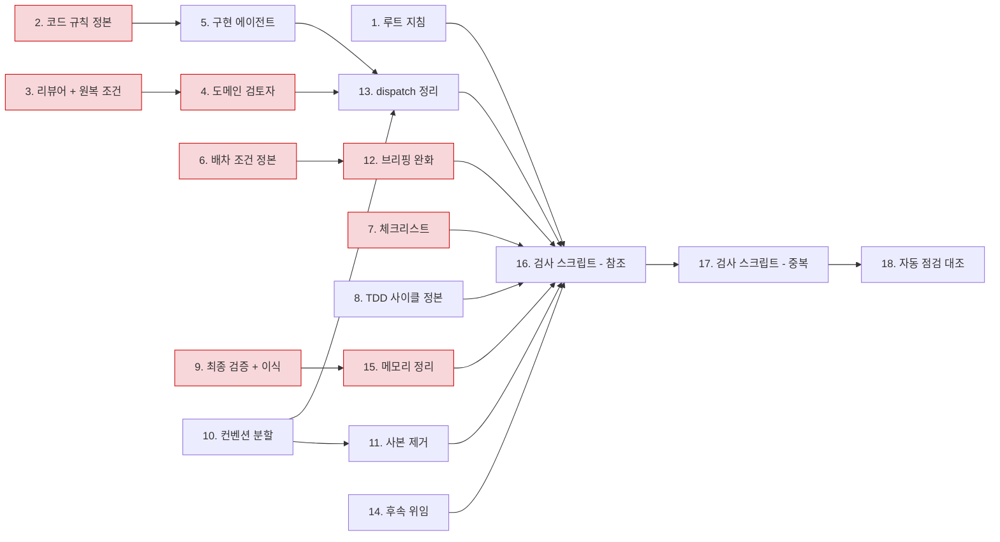

# 에이전트 컨텍스트 정비 구현 플랜

> 작성일: 2026-07-30

## 요약 브리핑

### Task 목록

| 태스크 | 하는 일 |
|:---:|:---:|
| 1 | 루트 지침에 dispatch 우선순위와 산출물 길이 기준 신설 |
| 2 | 코드 규칙 정본에 `@Data` 금지와 null 반환 금지(적용 범위 포함) 이식 |
| 3 | 리뷰어의 억제 지시 제거, effort 하향과 원복 조건을 한 커밋으로 |
| 4 | 도메인 검토자에게 입력 계약과 단계별 체크리스트 매핑 신설 |
| 5 | 구현 에이전트에 입력 계약 신설, 컨벤션 항목은 정본 포인터로 |
| 6 | 도메인 검토자 배차 조건을 체크리스트 정본으로 흡수 |
| 7 | 리뷰 체크리스트에서 린트가 잡는 항목만 제거 |
| 8 | 개발 흐름과 커밋 타입 매핑을 각 정본으로 확정 |
| 9 | 최종 검증 커맨드 존치, 다중 서비스 재실행·라이브 검증 원칙 이식 |
| 10 | 문서 작성 컨벤션을 주제별 세 파일로 분할 |
| 11 | 문체 규칙 사본 제거, 문서 검수 관점·라운드 축소 |
| 12 | 브리핑 플로우차트 규칙 완화와 도메인 예외 명시 |
| 13 | 워크플로우 스킬의 dispatch 예시 제거와 라벨 서술 축약 |
| 14 | 후속 위임 항목 기록 (정적 분석 규칙, 재확인, CI 편입) |
| 15 | 메모리에서 범위까지 동일한 중복 항목만 정리 |
| 16 | 검사 스크립트 — 참조·구조 판정 |
| 17 | 검사 스크립트 — 중복·다이어그램 판정과 최종 스캔 |
| 18 | 자동 점검 결과와 대조 |

### 실행 순서와 의존



붉은 노드는 결제 도메인 방어망을 건드리는 태스크다. 정본 이식이 포인터화보다 먼저 오도록 의존을 걸었고, 이식과 축약이 한 커밋에 묶이는 자리(3·6)는 중간에 멈춰도 절반만 반영되지 않는다.

### 트레이드오프와 후속

- 구현 에이전트가 컨벤션 파일을 한 번 더 열어야 한다 — 시작 시 읽기 단계를 명시해 상쇄
- 정적 분석 규칙 신설과 검사 스크립트의 CI 편입은 이번 범위 밖, 후속 항목으로 기록
- effort 하향의 실제 영향은 첫 도메인 인접 토픽에서 확인하고, 저하가 보이면 원복

---

## 목표

지침 컨텍스트의 상충 지시가 사라지고, 중복 규칙이 정본 한 곳 + 포인터로 수렴하며, 검사 스크립트가 그 상태를 0건으로 판정하면 이 플랜이 끝난다.

## 컨텍스트

- 설계 문서: `docs/topics/AGENT-CONTEXT-OVERHAUL.md`
- 주요 변경 파일: `CLAUDE.md`, `.claude/skills/**`, `.claude/agents/*.md`, `.claude/skills/_shared/{checklists,conventions}/**`, `docs/context/conventions/code-style.md`, `docs/context/{CONCERNS,TODOS,TESTING}.md`, `scripts/check-agent-docs.py`, 메모리 디렉토리

## 진행 상황

- [x] Task 1: 루트 지침 상충 해소와 산출물 길이 기준
- [x] Task 2: 코드 규칙 정본 보강
- [x] Task 3: reviewer 정비와 effort 원복 조건 등재
- [x] Task 4: domain-expert 입력 계약 신설
- [x] Task 5: implementer 입력 계약과 컨벤션 포인터화
- [x] Task 6: 도메인 검토자 배차 조건 정본화
- [x] Task 7: 체크리스트 정리
- [x] Task 8: TDD 사이클 정본 정리
- [x] Task 9: ship 검증 절차 존치와 학습 조건 이식
- [x] Task 10: 문서 작성 컨벤션 분할
- [x] Task 11: 문체 규칙 사본 제거와 검수 축소
- [x] Task 12: 브리핑 원칙 완화
- [x] Task 13: 워크플로우 스킬 dispatch 정리
- [x] Task 14: 후속 위임 항목 기록
- [x] Task 15: 메모리 정리
- [x] Task 16: 검사 스크립트 — 참조·구조 판정
- [x] Task 17: 검사 스크립트 — 중복·다이어그램 판정과 최종 스캔
- [x] Task 18: 자동 점검 대조
- [x] Task 19: 문체 규칙의 적용 경로 확보 (ship 중 추가)

## 태스크

### Task 1: 루트 지침 상충 해소와 산출물 길이 기준 [tdd=false] [domain_risk=false]

**구현**

- `CLAUDE.md`에 dispatch 우선순위 선언 1문장 추가 — 워크플로우 스킬이 규정한 게이트·구현 dispatch는 사용자가 승인한 절차이며, 서브에이전트 호출을 일반적으로 제한하는 지시보다 우선한다
- `CLAUDE.md`에 산출물 길이 기준 1줄 추가 — 문서 분량을 작업에 맞추고 채워넣기용 섹션을 만들지 않는다
- 세션 설정의 호출 제한 문구는 저장소 밖이라 수정 대상이 아니며, 사용자 안내 사항으로 완료 결과에 기록

**완료 기준**

- `CLAUDE.md`에서 dispatch 우선순위와 길이 기준이 각각 1줄로 확인됨
- Workflow 섹션의 "서브에이전트는 독립 시각이 가치 있는 곳에만 쓴다" 문장과 새 선언이 같은 방향임을 두 문장 대조로 확인 — 새 선언은 워크플로우가 규정한 dispatch에 한정되고, 무제한 위임을 허용하지 않는다

**완료 결과**
> `CLAUDE.md` Workflow 절에 두 문장을 신설했다.
>
> - Dispatch 우선순위: "워크플로우 스킬이 규정한 게이트 판정·구현 dispatch는 사용자가 승인한 절차이며, 서브에이전트 호출을 일반적으로 제한하는 지시보다 우선한다." — 바로 위 "서브에이전트는 독립 시각이 가치 있는 곳에만 쓴다 — 게이트 판정·코드 리뷰(reviewer, domain-expert)와 태스크 구현(implementer)" 문장과 대조하면, 새 선언이 가리키는 dispatch 범위(게이트 판정·구현)가 그 문장이 이미 한정한 두 용도와 정확히 일치한다. 무제한 위임을 허용하지 않는다.
> - 산출물 길이: "문서 분량은 작업 내용에 맞추고, 채워넣기용 섹션을 만들지 않는다."
>
> 세션 설정의 호출 제한 문구는 저장소 밖이라 수정 대상이 아니다 — 사용자에게 별도 안내: 세션 지침에 "요청 없으면 서브에이전트를 부르지 마라"류 문구가 있다면, 워크플로우 dispatch(게이트·구현)는 이번에 신설한 예외 선언으로 커버되니 세션 설정 자체를 고칠 필요는 없다.

---

### Task 2: 코드 규칙 정본 보강 [tdd=false] [domain_risk=true]

**구현**

- `docs/context/conventions/code-style.md` 안티패턴 절에 `@Data` 금지 추가
- 같은 절에 null 반환 금지 추가하되 적용 범위를 함께 명시 — 공개 유스케이스·포트의 반환값에 한정하고, 도메인 상태로서의 null(금액 미수신 판정 등) · wire 계약 DTO 필드(비동기 메시지·HTTP 응답) · private 매핑/탐색 헬퍼는 제외
- 제외 대상은 실제 코드 사례로 근거를 남긴다 — 금액 불일치 판정 경로, 메시지 페이로드의 nullable 필드, aspect 내부의 파라미터 탐색 헬퍼

**완료 기준**

- 두 규칙이 `code-style.md`에 존재하고, null 규칙에 적용 범위와 세 갈래 제외 대상이 함께 적혀 있음
- 기존 코드의 정당한 null 사용 3종(금액 판정 가드 · 메시지·응답 DTO 필드 · private 헬퍼)이 새 문구에 걸리지 않음을 사례 대조로 확인

**완료 결과**
> `docs/context/conventions/code-style.md` 안티패턴 회피 절에 두 룰을 추가했다.
>
> - `@Data` 금지 — 뭉치 애너테이션의 setter 노출·연관관계 순환 참조 위험을 이유로, 개별 애너테이션(`@Getter` + 팩토리/`@Builder`, VO 는 `@EqualsAndHashCode`/`@ToString`)으로 대체하도록 명시.
> - null 반환 금지 — 적용 범위를 **공개 유스케이스·포트의 반환값**으로 한정하고, 세 갈래 제외 대상을 실제 코드 사례와 함께 적었다.
>   - 도메인 상태로서의 null: `PaymentConfirmResultUseCase.isAmountMismatch`(수신 금액 null 을 "미수신 → 불일치"로 판정)
>   - wire 계약 DTO 필드: `ConfirmedEventMessage`(payment-service)/`ConfirmedEventPayload`(pg-service) 의 `amount`/`approvedAt`/`reasonCode`, 관리자 조회 응답 `PgAttemptEntryViewResponse` 의 `attemptNo`/`publishedAt`
>   - private 탐색 헬퍼: `DomainEventLoggingAspect.findReasonParameter`(`@Reason` 파라미터 미발견 시 null 반환, 호출부가 즉시 기본값으로 흡수)
>
> **사례 대조 결과** — 세 파일을 직접 열어 확인했다.
> - `isAmountMismatch`(`payment-service/.../PaymentConfirmResultUseCase.java`)는 `private static boolean` 메서드로, null 을 반환하지 않고 nullable 파라미터를 받아 도메인 판정에 쓴다 — 새 룰이 막는 대상(공개 유스케이스·포트의 null 반환)이 아니라 애초에 룰 범위 밖이며, 명시적으로 예외 사례에도 올려 이후 혼동을 막았다.
> - `ConfirmedEventMessage`/`ConfirmedEventPayload`는 record 필드로 `amount`/`approvedAt`/`reasonCode`가 상태별 nullable — 유스케이스·포트 반환값이 아닌 wire DTO 필드라 룰 범위 밖. `PgAttemptEntryViewResponse`도 `@Builder` 로 조립되는 응답 DTO 필드(`attemptNo`/`publishedAt`)라 동일하게 범위 밖.
> - `DomainEventLoggingAspect.findReasonParameter`는 `private String` 헬퍼로 클래스 내부에서만 호출되고 호출부(`processResultAndPublishEvent`)가 `reason != null ? reason : 기본값`으로 즉시 처리 — private 헬퍼 제외 대상에 정확히 부합.
>
> 세 부류 모두 새 문구에 걸리지 않음을 확인했다.

---

### Task 3: reviewer 정비와 effort 원복 조건 등재 [tdd=false] [domain_risk=true]

**구현**

- `.claude/agents/reviewer.md`에서 억제 지시("영향 없는 취향 문제는 침묵이 낫다") 제거
- 대체 지침 추가 — 발견한 것은 모두 올리되 severity로 구분한다(영향 없는 취향 문제는 minor)
- 검토 방법 2항(도메인 리스크 escalation 의무)은 문구 그대로 보존
- frontmatter `effort: xhigh` → `high`
- 같은 커밋에서 `docs/context/CONCERNS.md`에 항목 신설 — 하향 근거, 도메인 인접 diff 오분류 사각, 원복 조건(사후 배석에서 새 critical·major 발생 시 xhigh 복귀)

**완료 기준**

- 억제 문구가 없고 severity 분류 지침이 있음
- 검토 방법 2항이 변경 전 문구와 동일
- frontmatter가 `effort: high`
- `CONCERNS.md`에 원복 조건이 존재하며, effort 하향과 같은 커밋에 포함됨 — 하향만 먼저 반영되는 구간을 만들지 않는다

**완료 결과**
> `.claude/agents/reviewer.md`에서 억제 지시("스타일 트집으로 finding 수를 부풀리지 않는다. 영향 없는 취향 문제는 침묵이 낫다")를 제거하고, 검토 방법 4항을 "발견한 것은 모두 finding으로 올리되 severity로 구분한다 — 영향 없는 취향 문제는 minor로 분류한다"로 대체했다.
>
> **검토 방법 2항 문구 대조** — 편집 전후 동일함을 확인했다: "체크리스트에 없더라도 실질 결함이 보이면 finding으로 올린다 — 단, 결제 도메인 리스크(상태 전이·멱등성·race 등)는 Domain Expert의 영역이므로 명백한 것만 짚고 깊이 파지 않는다. Domain Expert가 이번 라운드에 미배석인데 도메인 리스크 의심이 보이면, 깊이 파는 대신 domain-expert 호출 권고를 finding으로 올린다." — 이 항목은 이번 편집에서 손대지 않았다.
>
> frontmatter `effort`를 `xhigh`에서 `high`로 낮췄다.
>
> 같은 커밋에서 `docs/context/CONCERNS.md` Medium 섹션에 `C-11. Reviewer effort 하향(xhigh → high) — 도메인 인접 diff 오분류 사각`을 신설했다 — 하향 근거(검토 방법 2항의 역할 분리: 도메인 리스크 깊은 판정은 Domain Expert 몫), 사각(Domain Expert 미배석 라운드에서 도메인 인접 diff 오분류 위험 증가), 원복 조건(사후 Domain Expert 배석 라운드에서 Reviewer가 놓쳤던 critical·major 도메인 finding이 새로 발견되면 `effort: high`를 `xhigh`로 즉시 복귀)을 명시했다. 헤더의 최종 갱신 시점을 2026-07-30으로 갱신하고 신규 항목 요약을 이전 이력 위에 이어 붙였다.
>
> effort 하향과 `CONCERNS.md` 원복 조건 등재는 계획대로 같은 커밋에 포함했다 — 하향만 반영된 상태로 중단되는 구간은 없다.

---

### Task 4: domain-expert 입력 계약 신설 [tdd=false] [domain_risk=true]

**선행**: Task 3 (`CONCERNS.md` 항목이 있어야 선행 읽기에 추가 가능)

**구현**

- `.claude/agents/domain-expert.md`에 `reviewer.md`와 동등한 필수 입력 절 신설 — 호출자 제공 항목(stage · topic · 검토 대상 · 체크리스트 경로 · 참고 입력)과 미비 시 거부 규칙
- stage별 체크리스트 매핑을 표로 흡수 — discuss는 `discuss-ready.md` domain risk 섹션, plan은 `plan-ready.md` domain risk 섹션, ship·단독은 `code-ready.md` domain risk 섹션
- 필수 선행 읽기에 `docs/context/CONCERNS.md` 추가 — effort 원복 조건이 매 도메인 판정에서 재확인되도록
- frontmatter `effort: xhigh` 유지

**완료 기준**

- 필수 입력 절과 거부 규칙이 존재
- stage별 매핑 표가 실제 체크리스트 파일·섹션명과 일치
- 필수 선행 읽기에 `CONCERNS.md`가 포함됨
- frontmatter가 `effort: xhigh`

**완료 결과**
> `.claude/agents/domain-expert.md`에 `reviewer.md`와 동등한 "필수 입력 (호출자가 제공)" 절을 신설했다 — `stage`(discuss/plan/ship/standalone) · `topic`(단독 리뷰는 생략 가능) · 검토 대상(문서 경로 또는 diff 범위) · 체크리스트 경로 · 참고 입력. 마지막 줄에 reviewer.md와 동일한 강도의 거부 규칙을 그대로 넣었다: "입력이 빠지면 추측하지 말고 거부하고 무엇이 필요한지 반환한다."
>
> stage별 체크리스트 매핑은 표로 흡수했다 — 세 파일을 직접 열어 실제 섹션 제목과 대조 확인:
> - discuss → `.claude/skills/_shared/checklists/discuss-ready.md` `## domain risk (Domain Expert 전용)`
> - plan → `.claude/skills/_shared/checklists/plan-ready.md` `## domain risk (Domain Expert 전용 — 도메인 리스크 토픽만)`
> - ship / standalone → `.claude/skills/_shared/checklists/code-ready.md` `## domain risk (Domain Expert 전용)`
>
> 필수 선행 읽기 목록에 `docs/context/CONCERNS.md`를 추가했다 — Task 3에서 등재한 C-11(effort 원복 조건)이 매 도메인 판정에서 재확인되도록.
>
> frontmatter `effort: xhigh`는 손대지 않고 그대로 유지했다.

---

### Task 5: implementer 입력 계약과 컨벤션 포인터화 [tdd=false] [domain_risk=false]

**선행**: Task 2 (정본에 규칙이 실재해야 포인터화 가능)

**구현**

- `.claude/agents/implementer.md`에 필수 입력 절 신설 — 호출자 제공 항목(모드 · topic · task_id · tdd 플래그 · 플랜/상태 경로)과 미비 시 거부 규칙
- 코드 패턴 절과 금지 목록에 흩어진 컨벤션 항목(`var` · `catch (Exception)` · null 반환 · `@Data` · try 블록 외부 변수 재할당)을 `code-style.md` 포인터로 축약
- 시작 시 `code-style.md`를 읽는 단계를 명시 — 현재 `commit.md`에만 있는 "시작 시 읽는다" 문장과 동등한 강도로 둔다. 포인터화의 전제가 이 읽기다
- 워크플로우 고유 금지(범위 밖 수정, `git add -A`, amend, 인접 태스크 침범)는 그대로 존치

**완료 기준**

- 필수 입력 절이 존재하고 컨벤션 항목이 포인터 한 줄로 축약됨
- 시작 시 `code-style.md`를 읽는 문장이 `commit.md` 읽기와 같은 위치·강도로 존재
- 워크플로우 고유 금지 항목은 문구 유지
- 포인터가 가리키는 규칙 5종이 `code-style.md`에 모두 실재
- frontmatter가 `effort: high` 유지

**완료 결과**
> `.claude/agents/implementer.md`에 "필수 입력 (호출자가 제공)" 절을 신설했다 — 모드 1(PLAN 태스크 실행)은 `mode`/`topic`/`task_id`/`tdd`/PLAN.md·STATE.md 경로, 모드 2(리뷰 finding 수정)는 `mode`/findings 목록/관련 태스크의 tdd 성격을 열거하고, 마지막 줄에 reviewer.md·domain-expert.md와 동일한 강도의 거부 규칙("입력이 빠지면 추측하지 말고 거부하고 무엇이 필요한지 반환한다")을 넣었다.
>
> 시작 시 읽는 문장은 기존 "커밋 규칙(`.claude/skills/_shared/conventions/commit.md`)을 읽는다" 한 문장에 코드 스타일 컨벤션(`docs/context/conventions/code-style.md`)을 같은 문장 안에 병기해, 같은 위치·같은 강도(동일 동사 "읽는다")로 신설했다.
>
> 포인터화 전 5종이 `code-style.md`에 모두 실재하는지 먼저 확인했다 — 안티패턴 회피 절에 `var` 키워드 금지, `catch (Exception)` swallow 금지(→ error-logging.md), 공개 유스케이스·포트 반환값의 null 반환 금지, `@Data` 금지가 있고, 별도 "Try 블록 패턴" 절에 try 블록 외부 변수 재할당 금지가 있다. 5종 모두 확인 후 축약했다.
>
> - **코드 패턴** 절: Lombok 줄 끝의 "`@Data` 금지" 언급을 제거했다 (이제 금지 절 포인터가 커버).
> - **금지 (타협 불가)** 절: 개별 서술 4줄(`var` · try 재할당 · `catch (Exception e)` · null 반환)을 한 줄 포인터로 합쳤다 — "코드 컨벤션 위반(`var` 키워드 · `catch (Exception e)` swallow · 공개 유스케이스·포트의 null 반환 · `@Data` · try 블록 내 외부 변수 재할당) — 기준은 `docs/context/conventions/code-style.md` 안티패턴 회피 절". 기존 `catch (Exception e)` 항목에 있던 "불가피하면 `handleUnknownFailure` 경유" 세부는 제거했다 — 코드베이스 전체에 `handleUnknownFailure` 메서드가 더 이상 존재하지 않는(과거 리팩터로 삭제된) 낡은 참조였고, `code-style.md`가 가리키는 `error-logging.md`의 현재 규칙("잡으면 LogFmt.error + 재throw 또는 명시적 fallback")으로 대체된다.
> - 워크플로우 고유 금지(테스트 없이 구현, 범위 밖 코드 수정, `git add -A`/`--amend`/`--no-verify`, 인접 태스크 침범)는 문구 그대로 유지했다.
>
> frontmatter `effort: high`는 손대지 않고 그대로 유지했다.

---

### Task 6: 도메인 검토자 배차 조건 정본화 [tdd=false] [domain_risk=true]

**구현**

- `discuss-ready.md`의 생략 조건에 "결제 도메인 동작(상태 전이·멱등성·복구·정산) 서술·정정" 열거를 흡수해 정본 문구 완성
- `workflow-discuss` 5절과 `workflow-ship` A1의 조건 서술을 정본 포인터로 축약 — 2갈래 판단 자체는 정본에서 읽는다
- 생략 시 사전 브리핑·리뷰 보고에 사유를 표기하는 규칙은 각 스킬에 남긴다(실행 시점 지시라 정본 이관 대상이 아님)

**완료 기준**

- `discuss-ready.md`에 2갈래 조건과 열거가 모두 존재
- 현재 `workflow-discuss` 5절의 예시절("문서 정정, 운영 런북, CONCERNS/TODOS 정리 포함")이 정본 문구에 문자 그대로 승계됨 — 이 예시절이 소스 변경 없는 메타 토픽을 포함 대상으로 판정하는 근거다
- 두 스킬에 조건 본문이 중복 서술되지 않고 포인터만 있음
- 생략 사유 표기 규칙은 스킬에 유지됨

**완료 결과**
> `discuss-ready.md` domain risk 섹션 머리말을 `workflow-discuss` 5절의 조건 본문(2갈래 조건 + 예시절)으로 대체해 정본으로 세웠다.
>
> - 소스 코드 **또는 런타임 설정**(알람 규칙·Kafka 설정·스케줄러 등) 변경을 계획 (한 줄이라도)
> - 산출물이 **결제 도메인 동작(상태 전이·멱등성·복구·정산)을 서술·정정** — 문서 정정, 운영 런북, CONCERNS/TODOS 정리 포함
>
> 예시절("문서 정정, 운영 런북, CONCERNS/TODOS 정리 포함")은 원문과 글자 단위로 대조해 그대로 옮겼다 — 이 절이 소스 변경 없는 메타 토픽(문서 정정 등)도 domain-expert 포함 대상으로 판정하는 근거이므로 누락하면 판정 범위가 좁아진다.
>
> `workflow-discuss` 5절은 조건 본문을 지우고 "`discuss-ready.md` domain risk 섹션 참조" 포인터 한 줄 + 생략 시 사전 브리핑 표기 지시(실행 시점 지시라 존치)로 축약했다.
>
> `workflow-ship` A1도 조건 본문을 지우고 같은 정본을 가리키는 포인터로 축약했다 — "`discuss-ready.md` domain risk 섹션의 2갈래 조건을 실제 diff에 적용한다"는 문장으로, discuss의 산출물 판정을 ship의 diff 판정으로 바꿔 적용하는 실행 디테일만 남기고 조건 자체는 재서술하지 않는다. 생략 시 리뷰 완료 보고에 표기하는 지시는 그대로 남겼다.
>
> 세 파일을 다시 읽어 대조한 결과 조건 본문이 `discuss-ready.md` 한 곳에만 있고, 나머지 두 스킬에는 중복 서술 없이 포인터만 남아 있음을 확인했다.

---

### Task 7: 체크리스트 정리 [tdd=false] [domain_risk=true]

**구현**

- `code-ready.md` execution discipline 항목에서 미사용 import를 빼고 "죽은 코드가 새로 생기지 않음"으로 좁힘 — 미사용 import는 린트 게이트가 잡는다
- convention 섹션의 나머지 항목은 존치 — 정적 분석 규칙이 없어 수동 판정이 유일한 수단
- domain risk 섹션 3종(`code-ready` 6항목 · `discuss-ready` 5항목 · `plan-ready` 3항목)은 건드리지 않음, `ship-ready.md`에는 신설하지 않음

**완료 기준**

- execution discipline 항목에서 미사용 import만 빠지고 죽은 코드 판정은 남음
- convention 섹션 항목 수 변화 없음
- `git diff -- .claude/skills/_shared/checklists/` 결과에서 세 파일의 domain risk 섹션 라인 범위에 hunk가 0건 — 자기 판정이 아니라 diff로 확인한다

**완료 결과**
> `code-ready.md` execution discipline 절의 항목을 "죽은 코드/미사용 import가 새로 생기지 않음"에서 "죽은 코드가 새로 생기지 않음"으로 좁혔다 — 미사용 import는 린트 게이트(spotbugs 등)가 잡고, 죽은 코드는 정적 분석이 없어 수동 판정만 남긴다.
>
> convention 섹션(Lombok 패턴 · `@AllArgsConstructor`+`@Builder` · LogFmt · null 반환 금지 · `catch (Exception e)` · `var` 금지, 6항목)은 손대지 않았다 — `var`·`@Data`·`catch (Exception)`·null 반환 모두 checkstyle에 대응 규칙이 없어 수동 판정이 유일한 검증 수단이기 때문이다.
>
> domain risk 섹션 3종은 한 글자도 건드리지 않았다. `ship-ready.md`에도 신설하지 않았다.
>
> **diff 대조 결과** — `git diff -- .claude/skills/_shared/checklists/` 실행 결과 hunk가 정확히 1개, `code-ready.md` execution discipline 절의 해당 한 줄만 잡혔다:
> ```
> - [ ] 죽은 코드/미사용 import가 새로 생기지 않음
> + [ ] 죽은 코드가 새로 생기지 않음
> ```
> `discuss-ready.md`·`plan-ready.md`는 diff 자체가 0건이었고, `code-ready.md`도 domain risk 섹션(37~45행) 및 convention 섹션(23~30행)에는 hunk가 잡히지 않았다.
>
> **Task 5 발견 사항 확인** — `code-ready.md` convention 절의 "`catch (Exception e)` 없음 (있다면 `handleUnknownFailure` 경유)" 항목은 여전히 남아 있다. 코드베이스 전체에 `handleUnknownFailure` 메서드가 존재하지 않는다(과거 리팩터로 삭제됨, Task 5 완료 결과에서도 동일하게 확인). 이번 태스크는 convention 섹션을 존치하기로 범위를 확정했으므로 손대지 않는다 — 정정이 필요하다는 판단만 남긴다. 실제 교체(현재 `error-logging.md` 규칙인 "잡으면 LogFmt.error + 재throw 또는 명시적 fallback"으로)는 이번 범위 밖이다.

---

### Task 8: TDD 사이클 정본 정리 [tdd=false] [domain_risk=false]

**구현**

- 개발 흐름(RED → GREEN → REFACTOR)은 `docs/context/conventions/testing.md`를 정본으로 확정
- 커밋 타입 매핑(`test:` / `feat:` / `refactor:`)은 `_shared/conventions/commit.md`를 정본으로 확정
- `CLAUDE.md` Coding Rules · `docs/context/TESTING.md` TDD 흐름 절 · `implementer.md` 모드 1 서술을 각 정본 포인터로 축약
- `implementer.md`의 실행 순서 지시(커밋 시점, 테스트 실행 시점)는 실행 절차라 존치

**완료 기준**

- 두 정본에 각 축의 규칙이 존재
- 나머지 세 곳에 사이클 본문이 중복 서술되지 않음
- 실행 순서 지시는 `implementer.md`에 유지됨

**완료 결과**
> 두 정본을 확정하고 서로 상호 포인터를 걸었다.
>
> - `docs/context/conventions/testing.md` "TDD 흐름 (정본)" 절 — RED(실패 테스트 먼저, 도메인 entity는 `@ParameterizedTest @EnumSource` 유효/무효 커버·use case는 Mockito 단위 테스트 먼저) → GREEN(최소 구현 + PLAN.md/STATE.md 갱신) → REFACTOR(선택, 변경 없으면 생략) 흐름 본문을 온전히 싣고, 매 태스크 완료 후 `./gradlew test` 확인 원칙도 함께 뒀다. 기존에 없던 use case 서술(`CLAUDE.md`에만 있던 것)을 이 절로 이관해 개발 흐름 축이 한 곳에 완전히 모이도록 보강했다. 마지막 줄에 커밋 타입 매핑은 `commit.md`가 정본이라는 포인터를 걸었다.
> - `.claude/skills/_shared/conventions/commit.md` "TDD 커밋 분리 (정본)" 절 — 기존 `test:`/`feat:`/`refactor:` 매핑은 이미 온전했으므로 그대로 두고, 첫 줄에 개발 흐름은 `testing.md`가 정본이라는 역방향 포인터만 추가했다.
>
> 나머지 세 곳을 포인터로 축약했다.
> - `CLAUDE.md` Coding Rules 1항 — 도메인 entity/use case 커버 서술을 제거하고 "개발 흐름은 testing.md TDD 흐름 절, 커밋 타입 매핑은 commit.md 참고"로 축약. Rule 2(Minimal change)·Rule 3(Verify)는 TDD 사이클 서술이 아니라 손대지 않았다.
> - `docs/context/TESTING.md` "TDD 흐름" 절 — RED/GREEN/REFACTOR 단계 나열과 커밋 타입을 지우고 두 정본을 가리키는 포인터 한 줄로 축약.
> - `.claude/agents/implementer.md` 모드 1 — RED/GREEN/REFACTOR 단계별 서술(`test:`/`feat:`/`refactor:` 커밋 시점, `./gradlew test` 실행 시점, PLAN.md/STATE.md 갱신 시점)은 이 태스크 실행에 한정된 실행 순서 지시이므로 그대로 유지했다. 대신 그 앞에 "TDD 사이클 정의는 testing.md, 커밋 타입 매핑은 commit.md가 정본이고 아래는 실행 절차(정본 이관 대상 아님)" 포인터 한 줄을 신설해, 실행 절차와 정본 정의를 명확히 구분했다.
>
> `grep -rn "RED.*GREEN.*REFACTOR\|REFACTOR.*선택"`로 대조한 결과, 사이클 본문이 남아 있는 곳은 두 정본(`testing.md`/`commit.md`)과 `implementer.md`의 실행 절차 서술뿐이었다 — `CLAUDE.md`·`TESTING.md`에는 포인터만 남았다.

---

### Task 9: ship 검증 절차 존치와 학습 조건 이식 [tdd=false] [domain_risk=true]

**구현**

- `workflow-ship` B1의 통합테스트 `--rerun` 커맨드와 라이브 검증 조건부 판단을 본문 그대로 존치 — 포인터화 대상에서 제외
- B1과 `ship-ready.md` test & build 섹션에 다중 서비스 조건 이식 — 변경이 닿은 모든 서비스의 통합테스트를 재실행한다, 일부만 재실행하면 나머지는 캐시로 조용히 스킵된다
- 같은 두 곳에 라이브 검증 일반 원칙 이식 — 합성 테스트 통과를 검증 완료로 보지 않고, 가능하면 실제 주입으로 신호 경로 끝까지 관측한다
- `workflow-ship` A5에 산출물 역할 경계 1줄 명시 — 마크다운 브리핑은 설계·플랜 판단용, HTML 설명 페이지는 완료 후 변경 이해용

**완료 기준**

- B1에 `--rerun` 커맨드와 라이브 검증 조건이 본문으로 존재
- B1과 `ship-ready.md`에 다중 서비스 재실행 조건과 라이브 검증 일반 원칙이 존재
- `ship-ready.md`에 캐시 함정 경고가 남아 있음
- 두 산출물의 역할 경계가 1줄로 명시됨

**완료 결과**
> `.claude/skills/workflow-ship/SKILL.md` B1과 `.claude/skills/_shared/checklists/ship-ready.md` test & build 섹션 두 곳에 정확히 같은 세 가지를 반영했다 — 이 태스크는 지우는 작업이 아니라 남기고 채우는 작업이라, 기존 본문은 문구 하나 지우지 않고 그대로 두고 새 문장만 끼워 넣었다.
>
> - **존치 확인** — B1의 `./gradlew integrationTest --rerun` 커맨드와 "라이브 검증 (조건부)" 판단 문단은 포인터로 바꾸지 않고 본문 그대로 남겼다. 실행 시점에 커맨드가 눈앞에 없으면 캐시로 통합테스트가 조용히 스킵되는 함정을 그대로 방지한다.
> - **다중 서비스 조건 이식** — B1의 "통합테스트 명시 실행" 불릿과 `ship-ready.md`의 대응 체크박스에 "한 토픽이 여러 서비스를 건드렸으면 일부만 재실행하지 않고 변경이 닿은 모든 서비스의 통합테스트를 재실행한다"를 추가했다. 근거로 "과거 실제로 한 서비스의 통합테스트가 안 돌아 CI에서야 컨텍스트 로드 실패가 드러난 적이 있다"를 두 곳에 동일하게 남겼다.
> - **라이브 검증 일반 원칙 이식** — 두 곳 모두에 기존 "라이브 검증 (조건부)"(알람 규칙·Kafka 설정·스케줄러·관리자 운영 경로에 한정된 조건부 지시) 바로 앞에, 알람 규칙에 국한되지 않는 별도 원칙 줄을 신설했다: "합성 테스트(문법·픽스처 통과)를 검증 완료로 보지 않는다 — 가능하면 실제 장애 주입으로 신호 경로 끝까지 관측한다. 이 원칙은 알람 규칙에 한정되지 않고 검증 요구 전반에 적용된다." 기존 조건부 지시는 이 일반 원칙의 구체 적용 사례로 그 아래 그대로 남았다.
> - **캐시 함정 경고 보존** — `ship-ready.md`의 "암묵 생략 금지" 문구는 손대지 않고 그대로 남겼다.
> - **A5 역할 경계** — `workflow-ship/SKILL.md` A5 설명 페이지 절에 1줄을 신설했다: "마크다운 브리핑(topic.md·PLAN.md·COMPLETION-BRIEFING)은 설계·플랜 판단용이고, HTML 설명 페이지는 완료 후 변경 이해용이다 — 서로 대체하지 않는다."
>
> 코드 비접촉(문서 편집)이라 `./gradlew test`는 생략했다.

---

### Task 10: 문서 작성 컨벤션 분할 [tdd=false] [domain_risk=false]

**구현**

- `_shared/conventions/writing.md` 352줄을 주제별로 분할 — 문체(종결·문장 밀도·목소리) / 용어·식별자(4단계 룰·동의어·약어·즉석 라벨) / 표·다이어그램(정렬·Mermaid 금지 문자)
- 분할 후 원 파일은 세 파일을 가리키는 인덱스로 축약
- 기존 참조(스킬·체크리스트·`CLAUDE.md`)가 가리키는 경로를 새 구조에 맞게 갱신

**완료 기준**

- 세 파일이 존재하고 원 파일이 인덱스로 축약됨
- 분할 전후의 **최상위 불릿 개수와 코드 예시 블록 개수**가 일치 — 규칙 유실을 이 두 수치로 판정한다
- 기존 참조가 모두 유효한 경로를 가리킴

**완료 결과**
> `.claude/skills/_shared/conventions/writing.md`(352줄)를 세 파일로 분할했다.
>
> - `writing-style.md` — 문체(종결 형식·문장 길이와 리스트·평가·번역투 금지·문장 밀도) + 목소리(AI체·번역체 제거) 전체 + 구조 + 팩트 검증
> - `writing-terminology.md` — 용어 선택(식별자 4단계 룰·보존 가능한 메서드명 예외·메서드 호출 narrative 금지·즉석 코드 라벨 금지) + 동의어 통일 + 약어 풀어쓰기
> - `writing-visuals.md` — 표 정렬 규칙 + 시각적 요소 활용(Mermaid & Table) + Mermaid 노드 라벨 금지 문자
>
> 원 파일 지침 중 세 갈래 분류에 명시되지 않았던 "구조"(헤더 중심 구성·서머리·아웃라인은 참고용)와 "팩트 검증"(검증되지 않은 내용 금지) 두 절은 유실 방지를 위해 `writing-style.md`에 실었다 — 둘 다 문체/작성 태도에 관한 규칙이라 세 파일 중 가장 가까운 자리다.
>
> `writing.md`는 세 파일을 가리키는 인덱스로 축약했다. 하단 "기존 문서 수정 시" 체크리스트(14항목)는 세 주제에 걸쳐 있어 항목별로 쪼개지 않고 인덱스에 통째로 남겼다 — 계획에서 허용한 두 선택지(인덱스 존치 / 항목별 배치) 중 인덱스 존치를 택했다.
>
> **유실 방지 대조** — 분할 전 원본에서 최상위 불릿(코드 블록 밖 `- ` 라인) 32개, 코드 예시 블록(``` 쌍) 15개를 세었다. 분할 후 네 파일(인덱스 + 세 분할 파일) 합계도 불릿 32개(인덱스 14 + style 6 + terminology 6 + visuals 6), 코드 블록 15개(style 13 + terminology 2)로 정확히 일치했다 — 스크립트로 재검증.
>
> **기존 참조 갱신** — `grep -rn "writing.md"`로 전체 검색해 스킬 5곳(`README.md`, `doc-review/SKILL.md` 4곳, `workflow/SKILL.md`, `explain-diff-html/SKILL.md` 2곳, `writing/SKILL.md` 2곳)의 경로를 새 구조에 맞게 갱신했다. `CLAUDE.md`는 `writing.md` 자체를 참조하지 않아(스킬 이름만 언급) 갱신 대상이 아니었다. `docs/topics/AGENT-CONTEXT-OVERHAUL.md`는 discuss 시점 설계 기록이라 참조 갱신 대상에서 제외했다(과거 상태를 서술하는 문서). `writing/SKILL.md`의 "컨벤션 요약" 40줄 본문과 `doc-review/SKILL.md`의 관점 1 표 자체는 Task 11 범위라 이번엔 경로 포인터만 고쳤다.

---

### Task 11: 문체 규칙 사본 제거와 검수 축소 [tdd=false] [domain_risk=false]

**선행**: Task 10 (분할된 파일이 있어야 포인터 가능)

**구현**

- `writing/SKILL.md`의 컨벤션 요약 40줄을 제거하고 분할 파일 포인터로 대체 — 작성 절차는 유지
- `doc-review/SKILL.md` 관점 1 표를 분할된 문체·용어 파일 포인터로 대체하고 판정 형식만 남김
- 검수 관점을 문서 유형별 필수만 dispatch하도록 정리, 루프 상한 3 → 2

**완료 기준**

- 두 스킬에 문체 규칙 본문이 없고 포인터만 있음
- 루프 상한이 2로 조정됨
- 문서 유형별 관점 적용 표가 남아 있음

**완료 결과**
> `writing/SKILL.md`의 "컨벤션 요약" 40줄(문체·구조·표·시각적 요소·용어 선택·팩트 검증 6개 소절)을 제거하고, 상단 소개 문단에 이미 있던 세 분할 파일 경로 서술 바로 뒤에 "작성 전 반드시 세 파일을 읽고 전체 규칙을 숙지한다 — 정본은 그 세 파일이고, 여기에는 요약 사본을 두지 않는다"를 붙여 한 문단으로 합쳤다. "작성 절차"(요구 분석 → 아웃라인 작성 → 본문 작성 → 검수 요청) 4단계는 문구 그대로 유지했다.
>
> `doc-review/SKILL.md` 관점 1(규격 준수) 체크 항목 표(11개 행)를 제거하고, "판정 체크 항목은 `writing-style.md`/`writing-terminology.md`/`writing-visuals.md`에서 읽는다 — 정본은 그 세 파일이고, 여기에는 체크 항목 사본을 두지 않는다"로 대체했다. 실행 절차 1단계의 디스패치 지시도 관점별로 갈라 다시 썼다 — 관점 1은 체크 항목 표 대신 세 컨벤션 파일 경로를 전달해 서브에이전트가 직접 읽고 판정 표를 구성하도록 하고, 관점 2·4는 기존 표 그대로, 관점 3은 표 + 소스 코드 대조 지시를 유지했다. 판정 출력 형식(PASS/FAIL 표, 검수 라운드 종합 형식)은 손대지 않았다.
>
> 관점 2(서사 일관성)·3(기술 정확성)·4(독자 친화성) 체크 항목 표는 `writing.md` 계열에 대응 규칙이 없는 고유 기준이라 그대로 뒀다.
>
> 검수 루프 상한을 두 곳(관점 설명 첫 줄의 "최대 3회 루프" · 루프 판정 절의 "3회 루프 소진")에서 모두 2로 낮췄다. "문서 유형별 관점 적용" 표(포스팅/깃헙 위키/리드미 × 4관점 필수·선택)는 문구 그대로 유지했다.
>
> 코드 비접촉(문서 편집)이라 `./gradlew test`는 생략했다.

---

### Task 12: 브리핑 원칙 완화 [tdd=false] [domain_risk=true]

**구현**

- `workflow/SKILL.md` 브리핑 원칙의 "간략화 금지, 전체 경로"를 "이해에 필요한 분기·예외를 빠짐없이"로 완화
- 같은 자리에 도메인 예외를 **두 단계 모두에서 걸리는 형태로** 명시 — 도메인 검토자 포함 대상 토픽(`discuss-ready.md`의 2갈래 조건)이거나 `domain_risk=true` 태스크를 가진 토픽이면, 상태 전이·예외 분기는 전체 경로를 유지한다
- 브리핑 원칙은 4단계 공통이고 discuss 시점에는 아직 PLAN.md가 없어 태스크 플래그가 존재하지 않는다 — 그래서 discuss에서도 판정 가능한 배차 조건을 함께 트리거로 둔다

**완료 기준**

- 완화된 문구와 도메인 예외가 같은 절에 함께 존재
- 예외 트리거가 두 갈래(배차 조건 / 태스크 플래그)로 적혀 있어 discuss 단계에서도 발동함
- 태스크 플래그 쪽 어휘가 `workflow-plan/SKILL.md`의 `domain_risk=true` 판정 기준과 일치

**완료 결과**
> `.claude/skills/workflow/SKILL.md` "사용자 브리핑 원칙" 절에서 플로우차트 규칙 문구를 "간략화 금지, 전체 경로(모든 분기/예외/상태 전이)"에서 "이해에 필요한 분기·예외를 빠짐없이"로 완화했다.
>
> 같은 절, 바로 다음 불릿에 도메인 예외를 신설했다 — 완화 문구와 예외가 같은 절에 붙어 있어 한쪽만 읽힐 위험이 없다. 예외 트리거는 계획대로 두 갈래로 적었다:
> - 도메인 검토자 포함 대상 토픽 — `discuss-ready.md`의 domain risk 섹션 2갈래 조건(소스 코드/런타임 설정 변경 계획, 또는 산출물이 결제 도메인 동작을 서술·정정)으로 판정
> - `domain_risk=true` 태스크를 가진 토픽 — `workflow-plan` 스킬 분해 원칙의 정의(결제 상태 전이·멱등성·정합성/트랜잭션 경계·PII·외부 PG 연동·race window 중 하나라도 해당)로 판정
>
> 두 갈래를 둔 이유도 같은 불릿 안에 명시했다 — 브리핑 원칙은 discuss/plan/execute/ship 4단계 공통인데, discuss 시점에는 아직 PLAN.md가 없어 `domain_risk=true` 같은 태스크 플래그 자체가 존재하지 않는다. 그래서 discuss 단계에서도 판정 가능한 배차 조건(첫 갈래)을 함께 트리거로 둬, plan 이후에는 두 번째 갈래가 추가로 걸린다.
>
> 두 조건 중 하나라도 해당하면 상태 전이·예외 분기는 전체 경로를 유지한다고 명시했다 — 완화가 도메인 인접 토픽까지 적용되지 않도록 막는다. 이유 한 줄("브리핑은 게이트 이전 단계라 체크리스트가 누락을 잡지 못한다")도 함께 남겼다.
>
> **어휘 대조** — 태스크 플래그 쪽 정의 문구는 `workflow-plan/SKILL.md` "분해 원칙"의 `domain_risk=true` 기준 문장을 그대로 옮겨 썼다: "결제 상태 전이 · 멱등성 · 정합성/트랜잭션 경계 · PII · 외부 PG 연동 · race window 중 하나라도 해당" — 원문과 어휘가 정확히 일치함을 재확인했다.
>
> 코드 비접촉(문서 편집)이라 `./gradlew test`는 생략했다.

---

### Task 13: 워크플로우 스킬 dispatch 정리 [tdd=false] [domain_risk=false]

**선행**: Task 4·5 (에이전트 입력 계약), Task 10 (분할 파일)

**구현**

- `workflow-discuss` · `workflow-plan` · `workflow-ship` · `review`의 dispatch 예시 블록 제거 — 에이전트 정의의 필수 입력 계약을 참조하고, 각 스킬에는 무엇을 넘길지만 남긴다
- `workflow-discuss` 4절의 즉석 코드 라벨 서술을 분할된 용어 파일 포인터로 축약

**완료 기준**

- 네 스킬에 `Agent(...)` 예시 블록이 없고 필수 입력 참조로 대체됨
- 각 스킬에 stage별로 넘길 대상·체크리스트가 무엇인지는 남아 있음
- 즉석 코드 라벨 서술이 포인터 한 줄로 축약됨

**완료 결과**
> `workflow-discuss` · `workflow-plan` · `workflow-ship` · `review` 네 스킬에서 `Agent(subagent_type=...)` 예시 블록을 모두 제거했다.
>
> - `workflow-discuss` 5절 — 예시 블록을 "Reviewer와 domain-expert(포함 조건 충족 시)를 단일 메시지에서 병렬 dispatch한다 — 입력 항목의 형식·거부 규칙은 각 에이전트 정의(`reviewer.md`, `domain-expert.md`)의 필수 입력 절을 따른다"는 문장 + 이번 단계에서 채워 넘길 값 목록(stage/topic/검토 대상/체크리스트/참고 입력)으로 대체했다.
> - `workflow-plan` 3절 — reviewer dispatch와 domain_risk=true 조건부 domain-expert 병렬 dispatch를 같은 방식으로 프로즈화했다. "같은 메시지에서 domain-expert도 병렬 dispatch한다"는 실행 규칙 문장은 그대로 남겼다.
> - `workflow-ship` A1·A3 — A1은 reviewer/domain-expert 병렬 dispatch를 값 목록으로, A3은 implementer 위임을 "입력 항목은 `implementer.md` 필수 입력 절을 따른다" + 선택된 findings·스킵 대상 서술로 대체했다.
> - `review` 2절 — standalone 리뷰의 reviewer/domain-expert 병렬 dispatch를 동일 패턴으로 대체했다.
>
> 네 스킬 모두에서 병렬 dispatch 규칙("단일 메시지에서 병렬 dispatch한다")은 예시가 아니라 실행 규칙이므로 문장으로 그대로 남겼다 — `grep -rn "Agent(subagent_type" .claude/skills/{workflow-discuss,workflow-plan,workflow-ship,review}/SKILL.md` 결과 0건으로 확인했다.
>
> `workflow-discuss` 4절의 즉석 코드 라벨 서술(예시·이유·dangling 참조 설명 포함 4줄)을 "각 옵션을 그 내용으로 명명한다 — 이유·예외·예시는 `writing-terminology.md` '즉석 코드 라벨 금지' 절 참조" 한 줄로 축약했다. 설계 옵션을 내용으로 명명하라는 지시 자체는 문장에 그대로 남겼다.
>
> 코드 비접촉(문서 편집)이라 `./gradlew test`는 생략했다.

---

### Task 14: 후속 위임 항목 기록 [tdd=false] [domain_risk=false]

**구현**

- `docs/context/TODOS.md`에 재확인 후속 항목 기록 — 적용 후 첫 도메인 인접 토픽에서 배석 판단 근거 대조, `CONCERNS.md` 항목 연결
- 같은 문서에 정적 분석 규칙 신설 위임 항목 기록 — `var` · `@Data` · null 반환 · `catch (Exception)`을 checkstyle·ArchUnit으로 강제하는 작업
- 검사 스크립트의 CI 편입도 후속 항목으로 기록
- 갱신한 문서의 최종 갱신 시점을 본문과 동기화

**완료 기준**

- `TODOS.md`에 세 항목이 존재하고 각각 근거 문서 경로를 가리킴
- 최종 갱신 시점이 동기화됨

**완료 결과**
> `docs/context/TODOS.md`에 새 섹션 F(`AGENT-CONTEXT-OVERHAUL 후속`)를 신설하고 4건을 등재했다.
>
> - `[REVIEWER-EFFORT-DOWNGRADE-RECHECK]` — reviewer effort 하향(`xhigh`→`high`) 원복 조건 재확인. `docs/context/CONCERNS.md` C-11(근거·사각·원복 조건)로 연결하고, 적용 후 첫 도메인 인접 토픽에서 Domain Expert 사후 배석 라운드의 critical·major 도메인 finding 재발견 여부를 대조하도록 처방을 남겼다.
> - `[AGENT-DOCS-STATIC-ANALYSIS]` — `var`·`@Data`·null 반환·`catch (Exception)`·try 블록 외부 변수 재할당을 checkstyle·ArchUnit으로 강제하는 작업. 다섯 규칙 모두 `code-style.md`에 명문화돼 있으나 자동 강제 수단이 없어 `code-ready.md` convention 섹션의 리뷰어 수동 판정이 유일한 검증 수단이라는 배경을 함께 남겼다.
> - `[AGENT-DOCS-CHECK-SCRIPT-CI]` — Task 16·17에서 신설하는 `scripts/check-agent-docs.py`(현재 종료 코드 0 고정 정보 제공용)를 오탐이 잦아든 뒤 CI 게이트로 편입하는 방안.
> - `[CODE-READY-HANDLEUNKNOWNFAILURE-STALE]` — Task 7 실행 중 발견된 낡은 참조. `grep -rn "handleUnknownFailure"` 로 코드베이스 전체를 확인한 결과 프로덕션 코드 0건(archive 문서에만 잔존, `outbox-only-refactor` 리팩터로 삭제됨)이라 확정 등재했다 — `code-ready.md` convention 섹션의 "`catch (Exception e)` 없음 (있다면 `handleUnknownFailure` 경유)" 항목이 존재하지 않는 메서드를 가리킨다는 사실과, `error-logging.md` 현재 규칙으로 교체가 필요하다는 처방을 남겼다.
>
> 각 항목은 근거 문서 경로(`CONCERNS.md` C-11, `code-style.md` 안티패턴 절, `code-ready.md` convention 섹션)를 가리킨다.
>
> `docs/context/TODOS.md` 헤더의 최종 갱신 시점을 2026-07-31로 갱신하고 신규 항목 요약을 이전 이력 위에 이어 붙였다.
>
> 코드 비접촉(문서 편집)이라 `./gradlew test`는 생략했다.

---

### Task 15: 메모리 정리 [tdd=false] [domain_risk=true]

**선행**: Task 9 (누락 조건이 프로젝트 파일에 이식된 뒤라야 삭제 가능)

**구현**

- 각 메모리 항목을 프로젝트 파일과 대조해 적용 범위까지 동일한 것만 삭제
- Task 9에서 이식한 두 조건(다중 서비스 재실행, 라이브 검증 일반 원칙)은 이식 완료를 확인한 뒤 해당 메모리 항목 정리
- 범위가 더 넓은데 이식되지 않은 항목은 보존
- frontmatter `name`이 비어 있는 파일 보정
- `MEMORY.md` 인덱스를 결과에 맞게 갱신

**완료 기준**

- 삭제한 항목마다 대응하는 프로젝트 파일 경로가 완료 결과에 기록됨
- 이식이 필요했던 조건이 프로젝트 파일에 실재함을 확인한 뒤 삭제됨
- 부분 삭제한 파일은 이식되지 않은 서술(통합테스트 cold-start 재현 경위 등)이 그대로 남아 있음을 대조 확인
- 모든 메모리 파일의 frontmatter에 `name`이 있음

**완료 결과**
> 메모리 30개 항목(Feedback 25 + Project 3 + Reference 2)을 전부 열어 프로젝트 파일과 대조했다.
>
> **전량 삭제 (10건)** — 규칙이 같은 범위로 프로젝트 파일에 실재:
> - `feedback_no_try_block_reassignment.md` → `docs/context/conventions/code-style.md` "Try 블록 패턴" 절
> - `feedback_commit_style.md` → `.claude/skills/_shared/conventions/commit.md` "문서 커밋" 절 (STATE.md 단독 커밋 금지 포함, 옛 "테스트+구현 같은 커밋" 서술은 현재 RED/GREEN 분리 컨벤션과 어긋나 보존 가치 없음)
> - `feedback_substantive_live_verification.md` → 일반 원칙은 Task 9가 이식한 `ship-ready.md`/`workflow-ship SKILL.md` B1, kafka_brokers dead branch 사고 사례는 `docs/context/PITFALLS.md` #24에 이미 등재
> - `feedback_no_adhoc_option_labels.md` → 코드 주석 금지는 `code-style.md` "주석/문서화" 절, docs 표준 ID 허용은 `writing-terminology.md` "즉석 코드 라벨 금지" 절 — 두 갈래 모두 실재
> - `feedback_issue_body_no_next_step.md`, `feedback_pr_convention.md`, `feedback_pr_report_single_comment.md` → `.claude/skills/_shared/conventions/github.md` Step 1/3("다음 단계" 섹션 금지, 한글 제목·명사형 헤더·내부 식별자 비노출·Labels/Assignees, 리포트 단일 코멘트)에 전부 이식
> - `feedback_execute_speed.md`, `feedback_execute_autorun.md` → `.claude/skills/workflow-execute/SKILL.md` (implementer 1회 dispatch, 리뷰는 ship에서 일괄, 연속 dispatch 조건)
> - `feedback_briefing_flowchart.md` → `.claude/skills/workflow/SKILL.md` "사용자 브리핑 원칙 (Non-negotiable)" 절
>
> **부분 삭제 (2건)** — 일반 규칙은 이식 확인 후 제거, 사고 경위·코드 레벨 기법은 프로젝트 문서 어디에도 없어 보존:
> - `feedback_verify_integration_test_cache.md` — "UP-TO-DATE 캐시 시 통합테스트 미실행" · "다중 서비스 전부 재실행" 규칙은 `workflow-ship SKILL.md` B1과 `ship-ready.md` 양쪽에 이식 완료를 확인하고 제거. CLEANUP-BATCH-B cold-start flaky 경위, FAULT-INJECTION-RESILIENCE의 pg Redis `ObjectProvider` 수정 사례, `ContainerTestUtils.waitForAssignment` 코드 레벨 수정 기법은 보존
> - `feedback_ship_lint_include_spotbugstest.md` — "ship B1에 spotbugsTest 포함" 규칙은 `workflow-ship SKILL.md` B1과 `ship-ready.md` 양쪽에 이미 반영됨을 확인하고 제거. DLQ-REACHABILITY #114 사고 경위와 SpotBugs가 `Objects.requireNonNull`을 억제자로 인식하지 못해 `assertThat(x).isNotNull()` 가드가 필요하다는 기법은 보존
>
> **보존 (18건)** — 범위가 프로젝트 파일보다 넓거나, 대응 프로젝트 파일이 아예 없음:
> - `feedback_no_var_keyword.md` — `code-style.md`는 실제 코드만 다루고 위키/문서 코드 블럭까지는 언급 없음, 이 항목이 그 범위를 보존
> - `feedback_no_auto_proceed_on_question_timeout.md` — `workflow/SKILL.md`의 동일 규칙은 워크플로우 승인 지점(단계 전환·findings 채택·게이트)에 한정, 이 항목은 그 밖의 질문에도 일반 적용
> - `feedback_writing_voice_no_ai_tell.md` — `writing-style.md` "목소리" 절은 문서 작성 스킬 범위(포스팅/위키/리드미), 대화 응답까지 확장하는 것은 이 항목만의 서술이라 보존하되 Task 10 분할로 바뀐 파일 경로(`writing.md` → `writing-style.md`)만 정정
> - `feedback_dead_code_requires_user_confirmation.md` — `docs/context/TODOS.md`엔 이 원칙을 적용한 결과(특정 항목의 사용자 확인 필요 기록)만 있고, "참조 그래프 0이어도 기능 단위는 확인 필요"라는 일반 규칙 자체는 없음
> - 포트폴리오/문체 계열(`feedback_no_internal_source_markers`, `feedback_portfolio_verify_claims_plain_terms`, `feedback_portfolio_terminology`, `feedback_wiki_style_sentence_level`, `feedback_vendor_neutral_wording`, `feedback_no_clone_wording`, `feedback_response_brevity`) — 대응 프로젝트 파일 없음(포트폴리오는 별도 blog 저장소, 나머지는 대화 스타일 규칙으로 이 저장소 컨벤션 문서 범위 밖)
> - `feedback_cleanup_scope_and_briefing.md`, `feedback_multi_item_processing_protocol.md` — grep 검색 결과 대응 프로젝트 파일 없음
> - `project_*.md` 3건, `reference_*.md` 2건 — 배경 지식/환경 노트 성격이라 "이식 가능한 규칙"이 아니며, 대응 프로젝트 파일 없음
>
> **frontmatter name 보정**: 30개 파일 전수 확인 결과 `name`이 완전히 비어 있던 파일은 `feedback_substantive_live_verification.md`(`name: ""`) 1건뿐이었고, 이 파일 자체가 전량 삭제 대상이라 별도 보정 불필요. 나머지 29개는 모두 비어 있지 않은 `name` 값을 가짐(파일명과 표기가 다른 것은 있으나 "비어 있거나 없는" 케이스는 아니라 이번 태스크 범위 밖으로 유지).
>
> **부수 발견**: `MEMORY.md` 인덱스가 존재하지 않는 `feedback_archive_location.md`를 참조하고 있었다(파일 자체가 디스크에 없음) — 인덱스 갱신 과정에서 이 dangling 참조도 제거했다.
>
> 최종적으로 `MEMORY.md` 인덱스를 남은 20개 파일과 1:1 매칭되도록 다시 썼다.

---

### Task 16: 검사 스크립트 — 참조·구조 판정 [tdd=false] [domain_risk=false]

**구현**

- `scripts/check-agent-docs.py` 신설, 판정 3종 구현
  - 참조 무결성 — 마크다운 링크와 백틱 경로 중 파일 경로 형태인 것이 실제 파일로 해석되는지, 코드 예시·커맨드 인자는 제외
  - frontmatter 필수 필드 — 스킬은 `name`·`description`, 에이전트는 `name`·`description`·`model`·`tools`
  - 체크리스트 참조 — 스킬이 지정한 체크리스트 파일과 섹션 제목이 실재하는지
- 종료 코드로 작업을 막지 않는 정보 제공용

**완료 기준**

- 스크립트가 현재 저장소에서 실행되고 3종 판정 결과를 출력
- 깨진 참조 0건 — Task 1~15에서 갱신한 경로가 모두 유효
- 종료 코드가 판정 결과와 무관하게 0

**완료 결과**
> `scripts/check-agent-docs.py`를 신설하고 판정 3종을 구현했다 — 기존 `scripts/usl-fit.py`와 같은 스타일(shebang + 모듈 docstring에 실행법 명시, argparse 없이 `main()` → `sys.exit(main())`, 의존성 없음)을 따랐다.
>
> - **참조 무결성** — 마크다운 링크(`[text](path)`)와 백틱 단독 스팬을 펜스(```) 코드 블록을 제외하고 스캔한다. 링크는 참조 파일 기준 상대경로로 바로 검증한다(0건 문제 확인). 백틱 스팬은 공백·URL·`<...>`/`{...}`/`*`/`$`/`:` placeholder·`...` 약어·`./`·`../` 접두(셸 커맨드 예시와 구분 불가)를 제외한 뒤, 레포 루트 → 참조 파일 기준 → 그 상위 → `.claude/skills/_shared/` 앵커(두 경로 접두사 유무 혼용 축약 대응) 순으로 해석을 시도한다. 전부 실패해도 최상위 세그먼트가 레포 최상위 항목이나 공유 앵커(`conventions`/`checklists`/`_shared`)에 없으면 계층 축약 표기(`db/migration/`, `application/port/in/`, `payment-service/.../X.java` 등)로 보고 조용히 건너뛴다 — 실제 결함(임시 파일로 존재하지 않는 링크/백틱 경로 각 1건 주입)은 즉시 검출됨을 확인했다.
> - **frontmatter 필수 필드** — `.claude/skills/*/SKILL.md`(14개) name/description, `.claude/agents/*.md`(3개) name/description/model/tools. 필드 누락 임시 스킬로 검출 동작을 확인했다.
> - **체크리스트 참조** — `domain-expert.md`의 stage 매핑 표(`| stage | \`checklist.md\` | 섹션 |` 3열 행) + 여러 스킬의 프로즈 언급("`code-ready.md`의 domain risk 섹션" 등, "섹션"/"항목" 키워드 앞 영문 구문을 역방향 스캔) 두 형태를 인식해 체크리스트 파일 실재 + 헤딩 존재를 대조한다.
> - 세 판정 모두 `main()`이 무조건 `return 0`(정보 제공용, 작업을 막지 않는다).
>
> **실행 결과** — 검사 대상 문서 51개(CLAUDE.md 1 + `.claude/**/*.md` + `docs/context/**/*.md`)에서 참조 무결성 209건 검사·문제 0건, frontmatter 17건 검사·문제 0건, 체크리스트 참조 17건 검사·문제 0건 — 총 문제 0건. Task 1~15에서 경로가 바뀐 곳(`writing.md` 분할 등)은 이미 정확히 갱신돼 있어 추가로 고칠 참조가 없었다.
>
> 코드가 아닌 Python 스크립트라 `./gradlew test`는 생략하고, 스크립트를 직접 실행해(`python3 scripts/check-agent-docs.py`, 종료 코드 0) 결과를 확인했다.

---

### Task 17: 검사 스크립트 — 중복·다이어그램 판정과 최종 스캔 [tdd=false] [domain_risk=false]

**선행**: Task 16 (같은 스크립트에 판정 추가)

**구현**

- 판정 3종 추가
  - 중복 규칙 — 문구 사전 기반 정확 매칭. 사전 항목은 정본으로 확정한 규칙에서 뽑는다(`var` 금지, `@Data` 금지, null 반환 금지, try 블록 외부 변수 재할당 금지, TDD 사이클, 배차 2갈래 조건, 문체 종결 규칙). 포인터 문장·실행 커맨드·존속 결정된 판정 체크리스트 섹션(`code-ready.md`의 convention · domain risk)은 매칭 제외
  - Mermaid 금지 문자 — 노드·엣지 라벨의 `{`·`}`·중간점·유니코드 화살표
  - 고아 문서 — `.claude/` 마크다운 중 어디서도 참조되지 않는 것. `SKILL.md`와 `agents/*.md`는 frontmatter 자동 탐색 대상이라 제외
- `ship-ready.md`에 스크립트 결과 확인 항목 추가

**완료 기준**

- 샘플 쌍 검증 — (a) 임시 파일에 `code-style.md`의 `var` 금지 문구를 본문으로 복제하면 중복으로 검출됨, (b) 다른 문서가 경로로 참조하는 체크리스트 파일(`_shared/checklists/code-ready.md` 등)은 고아로 검출되지 않음 — 카테고리 배제가 아니라 참조 그래프 판정이 동작하는지를 본다. 확인 후 임시 파일 제거
- 전체 저장소 스캔에서 중복 탐지 0건, 깨진 참조 0건
- `ship-ready.md`에 확인 항목이 추가됨

**완료 결과**
> `scripts/check-agent-docs.py`에 판정 3종을 추가해 총 6종 판정 스크립트로 완성했다.
>
> - **중복 규칙** — 정본 7개 규칙(`var` 키워드 금지 · `@Data` 금지 · 공개 유스케이스·포트 null 반환 금지 · try 블록 외부 변수 재할당 금지 · TDD 사이클 · 도메인 검토자 배차 2갈래 조건(2개 문구) · 문체 종결 규칙)을 문구 사전으로 두고, 각 정본 파일에서 실제로 쓰인 문장을 그대로 뽑아 다른 파일에 정확 매칭한다. 마크다운 강조(백틱·`*`)를 벗겨낸 평문 기준으로 비교해 강조 문법 차이로 놓치지 않게 했다. 제외 규칙 셋: (1) 펜스 코드 블록(기존 `strip_fenced_code` 재사용), (2) 정본 파일 자기 자신, (3) 정본 파일 basename이 같은 줄에 있으면 포인터 문장으로 보고 제외(`CLAUDE.md`가 "실패하는 테스트를 먼저 작성한다"와 함께 `testing.md` 링크를 같은 문장에 두는 경우, `TODOS.md`가 다섯 규칙명을 나열하며 `code-style.md` 경로를 같은 줄에 두는 경우 모두 이 규칙으로 정확히 걸러짐을 실제 grep 대조로 확인), (4) `code-ready.md`의 `## convention`/`## domain risk` 섹션(Task 7에서 존치 결정) 라인 범위.
> - **Mermaid 금지 문자** — ` ```mermaid ` 펜스 안에서 `[...]`/`(...)`/`{...}`/`|...|` 라벨 내용을 추출해 중괄호·가운뎃점(U+00B7)·유니코드 화살표(U+2192)를 검사한다. 정보 제공용으로 0건을 강제하지 않는다.
> - **고아 문서** — 판정 1(참조 무결성)의 링크·백틱 경로 해석 로직을 재사용해 스캔 대상 문서 전체에서 실제로 해석되는 참조 대상 집합을 모으고, `.claude/` 마크다운(`SKILL.md`·`agents/*.md` 제외) 중 이 집합에 없는 파일을 고아로 판정한다.
>
> **샘플 쌍 검증(완료 기준)**
> - (a) `docs/context/TMP-DUP-CHECK-SAMPLE.md`에 "`var` 키워드 금지 — 명시적 타입 선언을 사용한다." 본문을 넣고 실행 → 중복 규칙 판정에서 정확히 검출됨(`정본: docs/context/conventions/code-style.md` 표기 포함). 확인 후 파일 삭제.
> - (b) `code-ready.md`가 고아로 검출되지 않음을 확인했다 — 단순 카테고리 배제가 아니라 참조 그래프가 실제로 동작하는지 보기 위해, `collect_referenced_paths()`가 만든 참조 집합에 `code-ready.md`의 resolved path가 실제로 포함돼 있음을 직접 대조했고(`True`), 대조군으로 `.claude/skills/_shared/conventions/`에 어디서도 참조하지 않는 임시 파일을 만들어 실행하면 정확히 그 파일만 고아로 잡힘을 확인했다(검사 15건→16건, 문제 0건→1건). 확인 후 두 임시 파일 모두 삭제.
>
> **전체 저장소 스캔 결과** — 검사 대상 문서 51개에서 참조 무결성 209건 검사·문제 0건, 중복 규칙 7건 검사·문제 0건 — 완료 기준의 두 필수 지표(중복 탐지 0건, 깨진 참조 0건)를 달성했다. Mermaid 금지 문자는 583건 검사·40건(전부 `docs/context/CONFIRM-FLOW.md`/`PAYMENT-FLOW.md`의 기존 다이어그램에서 `→` 유니코드 화살표를 라벨 내부 서술에 사용한 사례) — 정보 제공용 판정이라 0건을 강제하지 않으며, 기존 문서 대량 수정은 이번 태스크 범위 밖이라 `docs/context/TODOS.md` 후속 항목으로 남긴다(아래 발견 참고). 고아 문서는 15건 검사·문제 0건.
>
> `ship-ready.md` documentation sync 섹션에 확인 항목을 추가했다 — "`CLAUDE.md`/`.claude/**`/`docs/context/**`를 건드린 토픽이면 스크립트 실행 결과 확인, 참조 무결성·중복 규칙은 0건, Mermaid·고아 문서는 발견 시 후속 정리로 기록".
>
> Python 스크립트·체크리스트 문서 편집이라 `./gradlew test`는 생략하고 스크립트 직접 실행(종료 코드 0)으로 검증했다.
>
> **범위 밖 발견**: Mermaid 금지 문자 판정에서 `docs/context/CONFIRM-FLOW.md`(10건)·`docs/context/PAYMENT-FLOW.md`(30건)의 기존 시퀀스/플로우차트 다이어그램이 라벨 내부에 `→` 유니코드 화살표를 상태 전이 서술(`READY → IN_PROGRESS` 등)에 쓰고 있음을 발견했다. `writing-visuals.md` 규칙 위반이지만 이번 태스크는 검사 스크립트 신설이 범위이고 기존 다이어그램 정정은 별도 작업 규모라 손대지 않고, `docs/context/TODOS.md` 섹션 F에 `[CONFIRM-PAYMENT-FLOW-MERMAID-ARROW-CLEANUP]`으로 기록했다.

---

### Task 18: 자동 점검 대조 [tdd=false] [domain_risk=false]

**구현**

- `/doctor` 실행 결과를 이번 정비 결과와 대조
- 채택할 지적만 반영하고, 기각한 지적은 사유와 함께 기록

**완료 기준**

- 대조 결과가 채택·기각 구분으로 정리됨
- 채택분이 반영되거나 후속 항목으로 위임됨

**완료 결과**
> `/doctor` 자동 점검 결과를 이번 정비와 대조해 채택·기각으로 구분했다.
>
> **채택 (반영 완료, 이 커밋에 포함)**
> - `CLAUDE.md` Skills 절에서 워크플로우 스킬 3줄을 제거 — 스킬 목록·설명은 세션이 자동으로 받아 중복이었다. 스킬이 아닌 자원(에이전트 정의, 스킬 인덱스 `.claude/skills/README.md`)만 남겼다.
> - `CLAUDE.md` Commit Style 절에서 3줄을 제거 — `commit.md`가 정본인 내용의 재서술이었다. 특히 "TDD: test:(RED) → feat:(GREEN) → refactor:(선택)" 줄은 Task 8이 커밋 타입 매핑 정본을 `commit.md`로 확정한 결정과 어긋나는 잔재였다. 형식 한 줄과 scope 고정 어휘 한 줄은 커밋마다 즉시 참조가 필요해 남겼다.
> - 편집 직후 검사 스크립트가 잡은 회귀 1건을 수정 — 잘라낸 줄이 `.claude/skills/README.md`를 가리키는 유일한 참조였던 탓에 이 파일이 고아 문서로 검출됐고, 인덱스를 가리키는 포인터 한 줄을 되살려 해소했다.
> - `CLAUDE.md`는 9,333자 → 8,875자로 줄었다.
>
> **기각**
> - "Subagent 작업" 절을 스킬로 이관하는 제안 — 옛 코드로 메인을 덮어쓰는 데이터 손실을 막는 규칙이라, 세션이 항상 로드하는 루트 파일에 그대로 둔다.
> - 기본 권한 모드를 auto로 바꾸는 제안 — 사용자가 현행 유지를 선택했다.
>
> **점검이 확인해 준 것 (변경 불필요)**
> - 설치·설정 건강, 에이전트 정의 3종의 필수 필드·이름 유일성 정상, 훅 속도 정상(중앙값 93ms), 버전 최신(2.1.220).
> - 검사 스크립트(`scripts/check-agent-docs.py`) 재실행 결과: 참조 무결성 211건 문제 0건, frontmatter 17건 문제 0건, 체크리스트 참조 17건 문제 0건, 중복 규칙 7건 문제 0건, 고아 문서 15건 문제 0건 — CLAUDE.md 편집 반영 후에도 회귀 없음을 확인. Mermaid 금지 문자 40건은 Task 17이 이미 `docs/context/TODOS.md`에 `[CONFIRM-PAYMENT-FLOW-MERMAID-ARROW-CLEANUP]`로 등재한 기존 항목과 동일 건수라 새 발견이 아니다.
>
> **정리 대상 밖 조치 (저장소 밖 사용자 설정, 커밋과 무관 — 기록만)**
> - 미사용 스킬 `find-skills`와 미사용 MCP 서버 `context7`을 비활성화했다.
> - 플러그인 `claude-hud`는 끄지 않았다 — 상태줄 설정이 참조하고 있어 끄면 화면이 깨진다.
>
> 이로써 이 플랜의 목표("지침 컨텍스트의 상충 지시가 사라지고, 중복 규칙이 정본 한 곳 + 포인터로 수렴하며, 검사 스크립트가 그 상태를 0건으로 판정")를 자동 점검 대조까지 포함해 확인했다.

---

### Task 19: 문체 규칙의 적용 경로 확보 [tdd=false] [domain_risk=false]

> ship 단계에서 추가됐다. 설명 페이지의 문장이 AI체·번역투라는 지적을 받았는데, 문체 규칙은 이미 `writing-style.md`에 있었고 메모리에도 있었다. 규칙이 없어서가 아니라 그 규칙이 읽히는 경로가 없어서 생긴 문제다.

**구현**

- `CLAUDE.md`에 목소리 원칙을 3~4줄 신설 — 상시 로드되는 자리라 대화 답변과 산출물 양쪽에 걸린다. 규칙 본문을 옮겨 적지 않고 원칙만 짧게 두고 `writing-style.md`를 가리킨다. 정본 문구를 그대로 복사하면 이번 정비가 세운 중복 금지에 스스로 걸린다
- 산출물을 생성하는 스킬(`explain-diff-html` · `writing` · `doc-review`)에 "쓰기 전에 문체 파일을 읽는다"를 명시 — 지금은 "따른다"고만 적혀 있어 실제로 열지 않고 넘어간다. Task 5에서 구현 에이전트에 "시작 시 `code-style.md`를 읽는다"를 넣은 것과 같은 처방이다
- `writing-style.md` 안티패턴 절에 이번에 실제로 지적받은 문장을 예시로 추가 — 추상 규칙보다 실제 문장이 판정 기준을 좁힌다. 아래 넷을 잘못된 예 / 고친 예 쌍으로 넣는다
  - "셋이 같은 말을 하는 동안은 조용하다" → "세 곳 내용이 같을 때는 문제가 드러나지 않는다"
  - "가운데 파일을 어떻게 다루느냐가 검사의 성패를 가른다" → "가운데 파일이 까다롭다"
  - "오탐을 내느니 일부를 놓치는 쪽을 골랐다" → "잘못 잡느니 몇 개 놓치는 편이 낫다고 봤다"
  - "정리 자체가 산출물이 아니라, 정리를 지켜 주는 도구까지가 이번 작업의 산출물이다" → "정리만 해 놓으면 시간이 지나면서 다시 흐트러진다. 그래서 검사 도구까지 같이 만들었다"
- 공통 성격은 영어 문장 구조를 그대로 옮긴 대구와 종속절이다 — 안티패턴 이름을 그 성격으로 짓는다

**완료 기준**

- `CLAUDE.md`에 목소리 원칙과 정본 포인터가 있고, 정본 문구를 복사하지 않았다
- 세 스킬에 문체 파일을 읽는 단계가 명시됐다
- `writing-style.md`에 잘못된 예 / 고친 예 쌍 4건이 추가됐다
- 검사 스크립트 재실행 시 중복 규칙과 참조 무결성이 0건이다

**완료 결과**
> `CLAUDE.md` Conversation Rules 절에 항목 2(문체)를 신설했다 — "대화 답변에도 문서 산출물에도 적용된다"를 헤더로 두고, "AI체·번역투가 드러나지 않게, 짧고 담백한 문장으로 쓴다"는 원칙 한 줄과 "판정 기준과 안티패턴 사례는 `writing-style.md` 목소리 절이 정본이다 — 문구를 그대로 옮기지 않는다"는 포인터만 남겼다. `writing-style.md`의 예시 문장이나 종결 규칙 문구는 옮기지 않아 중복 금지에 걸리지 않는다.
>
> 세 스킬의 문체 참조 문장을 확인·보강했다.
> - `explain-diff-html/SKILL.md` — "문체·목소리 섹션을 따른다"를 "쓰기 전에 ... 문체·목소리 섹션을 읽는다"로 바꿔, `implementer.md`가 `commit.md`·`code-style.md`를 "시작 시 읽는다"고 적은 것과 같은 강도로 맞췄다.
> - `doc-review/SKILL.md` — 컨벤션 목록 나열문("작성 컨벤션: ...")을 "검수 시작 전 작성 컨벤션 세 파일을 읽는다: ..."로 바꿨다.
> - `writing/SKILL.md` — Task 11에서 이미 "작성 전 반드시 세 파일을 읽고 전체 규칙을 숙지한다"로 적혀 있어(같은 강도의 "읽는다" 동사) 추가 수정이 필요 없음을 확인했다.
>
> `writing-style.md` "목소리 — AI체·번역체 제거" 절 끝(번역투 조사 확장 다음, 구조 절 앞)에 새 소절 "영어 구조를 그대로 옮긴 대구·종속절"을 신설하고, 지정된 잘못된 예/올바른 예 4쌍을 기존 소절과 동일한 형식(문단 설명 + 코드 블록)으로 넣었다. 소절 제목은 네 문장의 공통 성격(영어 문장 구조를 그대로 옮긴 대구와 종속절)을 그대로 반영했다.
>
> **검사 스크립트 재실행 결과** — `python3 scripts/check-agent-docs.py`: 참조 무결성 214건 검사·문제 0건, 중복 규칙 8건 검사·문제 0건(CLAUDE.md 신설 문구가 기존 정본 문구 "로 끝내거나 명사형으로 끝낸다"와 겹치지 않음을 확인), frontmatter/체크리스트 참조/고아 문서 모두 기존과 동일하게 문제 0건. Mermaid 금지 문자 40건은 Task 17에서 이미 `docs/context/TODOS.md`에 등재한 기존 항목과 동일 건수로, 이번 태스크가 건드린 파일이 아니라 회귀가 아니다.
>
> 코드 비접촉(문서 편집)이라 `./gradlew test`는 생략했다.

---

## 결정 → 태스크 매핑

| 설계 결정 | 태스크 |
|:---:|:---:|
| 상충 해소 (루트 지침 예외 선언) | Task 1 |
| 산출물 길이 | Task 1 |
| 코드 규칙 정본 | Task 2 · Task 5 |
| 정본의 규칙 공백 | Task 2 |
| null 반환 금지의 적용 범위 | Task 2 |
| reviewer 억제 지시 | Task 3 |
| reviewer 검토 방법 2항 | Task 3 |
| effort | Task 3 · Task 4 · Task 5 |
| effort 원복 조건의 위치 | Task 3 · Task 4 · Task 14 |
| dispatch 예시 블록 | Task 4 · Task 5 · Task 13 |
| domain-expert 포함 조건 | Task 6 |
| 체크리스트 | Task 7 |
| 체크리스트 domain risk 섹션 | Task 7 |
| TDD 사이클 정본 | Task 8 |
| ship 최종 검증 절차 | Task 9 |
| 브리핑 형식 | Task 9 |
| `writing.md` | Task 10 · Task 11 |
| doc-review | Task 11 |
| 브리핑 플로우차트 | Task 12 |
| 즉석 코드 라벨 금지 서술 | Task 13 |
| 메모리 | Task 15 |
| 검증 전략 (검사 스크립트 6종 판정) | Task 16 · Task 17 |
| `/doctor` | Task 18 |

## 수락 조건 → 태스크 매핑

설계 문서 "수락 조건" 15개를 어느 태스크가 확인하는지 대조한다.

| 수락 조건 | 확인 태스크 |
|:---:|:---:|
| 중복 규칙 5종이 정본 1곳 + 포인터로 수렴, 중복 탐지 0건 | Task 17 |
| dispatch 우선순위가 `CLAUDE.md`에 1문장 | Task 1 |
| domain risk 섹션 3종 문구 보존 | Task 7 |
| execution discipline에서 미사용 import만 제거 | Task 7 |
| `workflow-ship` B1에 `--rerun`·라이브 검증 본문 존재 | Task 9 |
| `reviewer.md` 억제 지시 부재, 검토 방법 2항 존재 | Task 3 |
| 검사 스크립트 실행과 샘플 쌍 기대 판정 | Task 17 |
| 깨진 참조 0건 | Task 16 · Task 17 |
| `code-style.md`에 두 규칙 + null 적용 범위, 이후 포인터화 | Task 2 · Task 5 |
| `CONCERNS.md` 원복 트리거 + `TODOS.md` 후속 연결 | Task 3 · Task 14 |
| 에이전트 정의에 필수 입력 계약과 stage 매핑, 이후 예시 제거 | Task 4 · Task 5 · Task 13 |
| `doc-review` 관점 1 표 대체 | Task 11 |
| 에이전트 3종 effort 값 | Task 3 · Task 4 · Task 5 |
| 배차 조건 열거 흡수 후 스킬 포인터화 | Task 6 |
| 즉석 코드 라벨 서술 축약 | Task 13 |

## 리뷰 처리

domain-expert 사후 배석 판정: pass — 이번 라운드에서 결제 도메인 방어망(상태 전이·멱등성·정합성)을 건드리는 코드 변경이 없어 새로 발견된 critical·major 도메인 finding 없음(C-11 원복 조건 미해당).

| Finding | 심각도 | 처리 | 사유 |
|---|:---:|:---:|---|
| `TESTING.md` 헤더가 "TDD 흐름" 절 포인터 축약(Task 8) 이후에도 최종 갱신 2026-07-03 그대로 미동기화 | major | 채택 | `CONCERNS.md`/`TODOS.md` 헤더 관례(신규 이력 항목 + 이전 이력 보존)를 따라 2026-07-31 항목을 추가 |
| `CLAUDE-5-PROMPTING.md`가 루트에 있고 설계 문서 ship 이관 후 유일한 참조가 사라짐 | minor | 채택 | `git mv`로 `docs/context/`로 이동, `CLAUDE.md` Reference Files 진입 표 + 영구 문서 목록에 색인 추가, 설계 문서 내부 참조 경로 갱신 |
| `check-agent-docs.py` `DUPLICATE_RULES`에 `catch (Exception)` swallow 금지 항목 누락 | minor | 채택 | 정본(`code-style.md`) 문구 그대로 사전에 추가, 실행 결과 중복 규칙 8건 검사·문제 0건으로 오탐 없음 확인 |
| 위 `catch (Exception)` 항목의 canonical이 반대로 지정됨(실제 규칙 서술은 `error-logging.md`, `code-style.md`는 포인터일 뿐) — 정본이 검사 대상으로 노출되고 실제 중복 복제가 탐지되지 않음 | major | 채택 | canonical을 `error-logging.md`로 정정, phrase도 정본 실제 문구(`catch (Exception e)` — 변수명 포함)로 교체. 나머지 4개 항목(`var`·`@Data`·null 반환·try 재할당)의 canonical도 같은 기준으로 재확인 — 모두 실제 서술 위치와 일치해 추가 수정 없음. 재실행 결과 중복 규칙 8건 검사·문제 0건 |
| 커밋 20개 중 2개만 `(docs)` scope 부여로 일관성 부재 | minor | 스킵 | amend 금지로 과거 커밋 정정 불가 — 다음 토픽부터 통일 |
