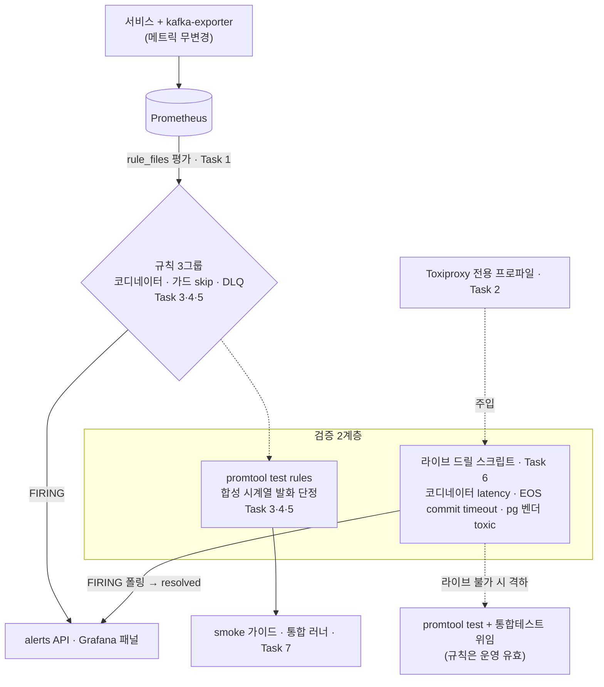

# 알람 규칙 인프라 + 장애 주입 실증 구현 플랜

> 작성일: 2026-06-26

## 요약 브리핑

### Task 목록

1. **Prometheus 규칙 로드 인프라** — `rule_files` + observability compose `rules` 디렉토리 마운트(현재 단일 파일 바인드 보완)
2. **Toxiproxy 전용 프로파일 + Kafka 경유 비대칭 구성 + 비대칭 실현 spike** — 최우선 실증 ①(consumer 경유/producer 직결로 lag 누적 판정)
3. **코디네이터 정체 규칙 + 발화 유닛테스트** — txn abort / consumer lag / broker 가용성 backstop OR, baseline-abort no-alert
4. **종결 가드 skip 규칙 + 발화 유닛테스트** — 위험 status 분자 / IN_PROGRESS→terminal 분모, DONE 재발행 no-alert
5. **DLQ 적체 규칙 + 발화 유닛테스트** — 앱 카운터 · `.dlq` offset 델타 · `commands.confirm.dlq` 정체 backstop(3신호 독립 cross-check)
6. **그룹별 라이브 발화 검증 스크립트** — 코디네이터(latency) / EOS(commit timeout, 최우선 실증 ②) / pg(벤더 toxic), 두 DLQ 경로 대칭 격하 폴백
7. **smoke 가이드 연결 + 통합 러너 등록**

### 변경 후 전체 플로우차트

### 핵심 결정 → Task 매핑

- 알람 토폴로지 · 규칙 로드 경로 → **Task 1**
- 장애 주입 수단 · 코디네이터 비대칭 실현 → **Task 2**
- 코디네이터 정체 신호 · 임계(baseline) → **Task 3**
- 종결 가드 skip 분자 · 발화 조건 → **Task 4**
- DLQ 적체 신호(앱 카운터 · offset · 정체 backstop) → **Task 5**
- 실증 산출물 · 주입 분리 → **Task 6**
- 검증 전략(회귀 가드) → **Task 7**

### 트레이드오프 / 후속 작업

- **임계값 baseline 잠정** — 부하 측정(T4-B) 후 실측 정밀화(규칙 주석 표기).
- **라이브 실증 불가 시 격하** — 코디네이터 lag 비대칭·EOS commit timeout·pg 벤더 sandbox가 환경상 불가하면 `promtool test rules` + 통합테스트 위임으로 격하(규칙 자체는 운영 유효).
- **범위 밖 후속** — 통지 채널(Alertmanager/Slack), 나머지 장애 6종, k6 부하 곡선, 오토스케일러.

## 목표

Prometheus 알람 규칙 평가 인프라 + 운영 위험 3그룹 규칙(코디네이터 정체 / 종결 가드 늦은-결과 무시 / DLQ 적체) + Toxiproxy 장애 주입 전용 프로파일 + 그룹별 발화 검증 스크립트가 모두 갖춰지고, 각 규칙이 `promtool test rules`로 발화 단정되며 라이브 드릴(또는 격하 폴백)로 실증되면 완료.

## 컨텍스트

- 설계 문서: `docs/topics/ALERTING-RULES-AND-FAULT-DRILL.md`
- 주요 변경/신규 파일:
  - `observability/prometheus/prometheus.yml` (`rule_files` 추가)
  - `observability/prometheus/rules/*.yml` (신규 규칙 — coordinator / guard-skip / dlq)
  - `observability/prometheus/rules/tests/*.yml` (신규 `promtool test rules` 픽스처)
  - `docker/docker-compose.observability.yml` (prometheus `rules` 디렉토리 마운트)
  - `docker/docker-compose.*` (신규 Toxiproxy 전용 프로파일/override + Kafka 경유 비대칭 리스너)
  - `scripts/smoke/alert-firing-*.sh` (신규 발화 검증 스크립트), `scripts/smoke-all.sh` 연결
  - `docs/smoke/alert-firing-check.md` (신규 가이드)
- 애플리케이션 코드 무변경 (알람 참조 메트릭 전부 기존 존재) — 인프라/관측/스크립트 레이어 전용

## 진행 상황

- [x] Task 1: Prometheus 규칙 로드 인프라 (rule_files + compose 마운트)
- [ ] Task 2: Toxiproxy 전용 프로파일 + Kafka 경유 비대칭 구성 + 비대칭 실현 spike
- [x] Task 3: 코디네이터 정체 알람 규칙 + 발화 유닛테스트
- [x] Task 4: 종결 가드 skip 알람 규칙 + 발화 유닛테스트
- [x] Task 5: DLQ 적체 알람 규칙 + 발화 유닛테스트
- [ ] Task 6: 그룹별 라이브 발화 검증 스크립트
- [ ] Task 7: smoke 가이드 연결 + 통합 러너 등록

## 태스크

### Task 1: Prometheus 규칙 로드 인프라 (rule_files + compose 마운트) [tdd=false] [domain_risk=false]

**구현 (GREEN)**
- `observability/prometheus/prometheus.yml`에 `rule_files: [ "/etc/prometheus/rules/*.yml" ]` 블록 추가.
- `docker/docker-compose.observability.yml` prometheus 서비스에 `../observability/prometheus/rules:/etc/prometheus/rules:ro` 디렉토리 마운트 추가 (현재 `prometheus.yml` 단일 파일만 바인드 → 마운트 없이는 규칙 미로드).
- `observability/prometheus/rules/.gitkeep` 또는 첫 규칙 파일로 디렉토리 존재 보장.

**완료 기준**
- `promtool check config observability/prometheus/prometheus.yml` 통과 (rule_files 경로 인식).
- prometheus 컨테이너 기동 후 `/api/v1/rules`에 그룹이 로드됨(빈 디렉토리면 0, 규칙 추가 후 노출) 확인.
- 매핑: 결정 "알람 토폴로지", "규칙 로드 경로".

**완료 결과**
- `prometheus.yml`에 `rule_files: ["/etc/prometheus/rules/*.yml"]` 블록 추가.
- `docker-compose.observability.yml` prometheus 서비스에 `../observability/prometheus/rules:/etc/prometheus/rules:ro` 마운트 추가.
- `observability/prometheus/rules/.gitkeep` 으로 디렉토리 존재 보장(실제 규칙은 Task 3~5에서 추가).
- [Rule 1] `promtool`이 로컬에 없어 `promtool check config` 라이브 검증 불가 — YAML 문법·경로 정합성만 확보. 컨테이너 기동 시 `/api/v1/rules` 확인은 Task 3~5 규칙 추가 후 수행 예정.

---

### Task 2: Toxiproxy 전용 프로파일 + Kafka 경유 비대칭 구성 + 비대칭 실현 spike [tdd=false] [domain_risk=true]

**구현 (GREEN)**
- Toxiproxy 컨테이너를 **전용 프로파일/override**(`docker/docker-compose.drill.yml` 등)로 추가 — 평상시 미기동.
- broker `KAFKA_ADVERTISED_LISTENERS`에 프록시 경유 리스너를 추가 광고하고, 서비스별 bootstrap을 분리해 **consumer(payment `events.confirmed`) 경로만 지연 프록시 경유 / producer(pg) 직결**하는 비대칭 구성을 시도.
- **비대칭 실현 spike**: latency toxic 주입 상태에서 (a) produce가 실제 프록시 카운터를 통과하는지(우회 차단), (b) `events.confirmed` consumer lag가 실제로 누적되는지 관측.

**완료 기준**
- 전용 프로파일이 평상시 경로(기본 compose up)에 영향 없음 확인.
- 프록시 경유 사전 확인 스텝이 produce 트래픽의 프록시 통과를 입증.
- **비대칭 판정 기록**: lag 누적 성공 → 코디네이터 1차 신호를 lag로 승격(Task 3 반영). 실패 → txn abort 1차 안전망 유지 + topic.md/PLAN에 격하 근거 명시.
- **태스크 경계**: 커밋 산출물은 Toxiproxy 프로파일·비대칭 리스너 구성. 비대칭 spike는 판정·기록 산출물(코드 비대상) — 단일 broker 서비스별 리스너 광고가 비자명하므로, 구성이 ≤2시간을 넘으면 spike 판정을 별도 후속 태스크로 split.
- 매핑: 결정 "장애 주입 수단", "코디네이터 정체 신호"(비대칭 실현 = plan 최우선 실증 ①).

**완료 결과**

구성 산출물 완료. 비대칭 spike 판정(lag 누적 성공/실패 → 1차 신호 승격/격하)은 메인 라이브 실측 후 추가 기록 예정.

- `docker/docker-compose.drill.yml` 신규 — 인프라 전용 compose override:
  - `kafka` 서비스: PROXY 리스너(9094) 추가 광고 (`KAFKA_LISTENERS`, `KAFKA_ADVERTISED_LISTENERS`, `KAFKA_LISTENER_SECURITY_PROTOCOL_MAP` override — 기존 PLAINTEXT/CONTROLLER/PLAINTEXT_HOST 유지).
  - `toxiproxy` 서비스: `ghcr.io/shopify/toxiproxy:2.9.0`, kafka healthy 후 기동, admin API 포트 8474 + 프록시 포트 9094 호스트 노출.
  - `payment-service` 서비스: `SPRING_KAFKA_BOOTSTRAP_SERVERS: toxiproxy:9094` (apps.yml의 kafka:9092 → toxiproxy:9094 override). toxiproxy healthy 조건 depends_on 추가.
  - pg-service: override 없음 — `KAFKA_BOOTSTRAP_SERVERS: kafka:9092` 직결 유지(producer 비대칭 실현).
- `docker/toxiproxy.json` 신규 — Toxiproxy 초기 프록시 등록 파일 (`kafka-proxy`: listen 0.0.0.0:9094 → upstream kafka:9094, enabled=true). 기동 시 자동 등록.
- `scripts/smoke/drill-toxiproxy.sh` 신규 — admin API 경유 주입/해제/검증 스크립트 골격 (inject/remove/status/verify/reset 명령, 환경변수 오버라이드, 드릴 흐름 주석).
- `docker compose -f docker/docker-compose.infra.yml -f docker/docker-compose.apps.yml -f docker/docker-compose.drill.yml config` 정합성 검증 통과 — kafka PROXY 리스너 merge, payment-service bootstrap override, toxiproxy depends_on 체인 모두 확인.
- **한계 명시**: payment-service는 producer이기도 하므로 `payment.commands.confirm` 발행도 PROXY 경유(지연 포함) — consumer-only 비대칭의 최선 근사, producer 완전 분리 불가.

---

### Task 3: 코디네이터 정체 알람 규칙 + 발화 유닛테스트 [tdd=true] [domain_risk=true]

**테스트 (RED)**
- `observability/prometheus/rules/tests/coordinator_test.yml` — `promtool test rules` 픽스처. 합성 시계열로 (a) txn abort 증가 → FIRING, (b) consumer lag 증가 → FIRING, (c) `up{job="kafka-exporter"}==0` / `kafka_brokers<1` → FIRING, (d) **정상 baseline abort/retry rate(임계 미만, 0 아님) → no alert**(임계가 정상 abort 위에 있음을 회귀 고정 — 알람 피로 방지)를 단정.

**구현 (GREEN)**
- `observability/prometheus/rules/coordinator.yml` — 발화식 **txn abort/producer 에러 OR `events.confirmed` consumer lag OR broker 가용성 backstop**(`up{job="kafka-exporter"}==0` / `kafka_brokers < 1`). `for` 지속절 + baseline 임계(주석에 잠정 표기). Task 2 비대칭 판정에 따라 lag/abort 1차 우선순위 확정.

**완료 기준**
- `promtool test rules observability/prometheus/rules/tests/coordinator_test.yml` 전 케이스 pass.
- `promtool check rules observability/prometheus/rules/coordinator.yml` 통과.
- 매핑: 결정 "코디네이터 정체 신호", "임계값"(baseline).

**완료 결과**
- `observability/prometheus/rules/coordinator.yml` 신규 — 3개 알람 규칙:
  - `KafkaCoordinatorTxnAbortRising`: `rate(kafka_producer_txn_abort_time_ns_total{job="payment-service"}[5m]) > 1000000` (잠정 임계 1ms/s, for:1m)
  - `KafkaCoordinatorLagHigh`: `sum by (topic,consumergroup)(kafka_consumergroup_lag{topic="payment.events.confirmed",consumergroup="payment-service"}) > 1000` (잠정 임계 1000 messages, for:1m)
  - `KafkaBrokerUnavailable`: `up{job="kafka-exporter"}==0 or kafka_brokers<1` (for:1m, severity:critical backstop)
- `observability/prometheus/rules/tests/coordinator_test.yml` 신규 — 5케이스 모두 pass:
  - (a) txn abort 급증 → FIRING, (b) consumer lag 급증 → FIRING, (c1) up==0 → FIRING, (c2) kafka_brokers<1 → FIRING, (d) 정상 baseline → no alert
- `promtool check rules` SUCCESS(3 rules), `promtool test rules` SUCCESS(5 cases)
- Task 2 비대칭 실측 후 lag 1차 승격 여부 재조정 예정 — OR 구조이므로 규칙 변경 없이 coordinator.yml 주석 조정만 필요

---

### Task 4: 종결 가드 skip 알람 규칙 + 발화 유닛테스트 [tdd=true] [domain_risk=true]

**테스트 (RED)**
- `rules/tests/guard_skip_test.yml` — (a) 위험 status(`status=~"QUARANTINED|FAILED|EXPIRED|CANCELED|PARTIAL_CANCELED"`) 비율이 임계 초과 + 분모 트래픽 존재 → FIRING, (b) DONE-only skip(정상 재발행) → no alert, (c) 저트래픽(분모 < floor) → no alert(0-division 흡수)를 단정.

**구현 (GREEN)**
- `rules/guard-skip.yml` — 분자 = 위험 status 필터 `rate(payment_confirm_guard_skip_total{status=~"..."})`, 분모 = confirm 결과 적용 전이(IN_PROGRESS→terminal) `rate(payment_transition_total{...})`, `and rate(분모) > floor` 하한 + `for` 지속절. 라벨이 수신 메시지 status를 못 가르는 한계를 규칙 주석에 적시.

**완료 기준**
- `promtool test rules .../guard_skip_test.yml` 전 케이스 pass (특히 DONE 재발행 no-alert).
- 매핑: 결정 "종결 가드 skip 분자", "가드 skip 발화 조건".

**완료 결과**
- `observability/prometheus/rules/guard-skip.yml` 신규 — 알람 규칙 1개:
  - `GuardSkipDangerousStatusHigh`: 위험 status(QUARANTINED·FAILED·EXPIRED·CANCELED·PARTIAL_CANCELED) skip 비율 > 10% AND IN_PROGRESS 전이 rate > 0.01/s (floor), for:1m, severity:warning
  - 분자: `sum(rate(payment_confirm_guard_skip_total{status=~"QUARANTINED|FAILED|EXPIRED|CANCELED|PARTIAL_CANCELED"}[5m]))`
  - 분모: `sum(rate(payment_transition_total{from_status="IN_PROGRESS"}[5m]))` (confirm 결과 적용 성공 경로)
  - floor 가드: 트래픽 부재 시 0-division +Inf 오탐 방지
  - [한계 주석] status 라벨이 수신 pg 응답 status를 못 가르므로 QUARANTINED+APPROVED(위험) vs QUARANTINED+FAILED(양성) 라벨 분리 불가
- `observability/prometheus/rules/tests/guard_skip_test.yml` 신규 — 3케이스 모두 pass:
  - (a) 위험 status skip 급증(비율 20%) → FIRING
  - (b) DONE-only skip(정상 재발행) → no alert
  - (c) 저트래픽(분모 rate=0, floor 미충족) → no alert (0-division 흡수 회귀 고정)
- `promtool check rules` SUCCESS(1 rule), `promtool test rules` SUCCESS(3 cases)

---

### Task 5: DLQ 적체 알람 규칙 + 발화 유닛테스트 [tdd=true] [domain_risk=true]

**테스트 (RED)**
- `rules/tests/dlq_test.yml` — (a) 앱 카운터(`payment_eos_commit_failure_dlq_total` / `pg_retry_exhausted_quarantine_total`) `increase()` > 0 → FIRING, (b) `.dlq` 토픽 offset `increase()` > 0 → FIRING, (c) 정상(델타 0) → no alert, (d) **앱 카운터만↑(offset 0) → 앱 알람만 FIRING**, (e) **토픽 offset만↑(앱 0) → 토픽 알람만 FIRING**(단일-발화로 두 규칙 독립=합산 아님을 회귀 고정), (f) **`commands.confirm.dlq` 컨슈머 정체(도착 멈춤 + 잔여 backlog) → consumergroup_lag 정체 알람 FIRING**을 단정.

**구현 (GREEN)**
- `rules/dlq.yml` — 앱 도달 카운터 `increase()` alert + `.dlq` 토픽 offset `increase()` alert를 **독립 cross-check(OR), 합산 금지** 주석과 함께 정의. 누적 offset 절대값 미사용(델타화) 명시.
- 소비자 있는 `payment.commands.confirm.dlq`의 **컨슈머 정체 backstop** `kafka_consumergroup_lag{topic="payment.commands.confirm.dlq"} > 0` 추가 — 도착이 멈춰 offset-increase가 0이어도 미배수 적체(미해결 결제)를 포착(도착 onset-only 신호의 사각 메움).

**완료 기준**
- `promtool test rules .../dlq_test.yml` 전 케이스 pass.
- 매핑: 결정 "DLQ 적체 신호".

**완료 결과**
- `observability/prometheus/rules/dlq.yml` 신규 — 3개 알람 규칙:
  - `DlqAppCounterRising`: `increase(payment_eos_commit_failure_dlq_total[5m]) > 0 or increase(pg_retry_exhausted_quarantine_total[5m]) > 0` (for:1m, severity:warning). 두 DLQ 경로(EOS 커밋 실패 / pg retry 소진 격리) 독립 OR cross-check — 합산 금지.
  - `DlqTopicOffsetRising`: `increase(kafka_topic_partition_current_offset{topic=~".*\\.dlq"}[5m]) > 0` (for:1m, severity:warning). kafka-exporter 기반 .dlq 토픽 offset delta 신호 — 앱 카운터와 독립. 누적 offset 절대값 미사용.
  - `DlqCommandsConsumerLag`: `kafka_consumergroup_lag{topic="payment.commands.confirm.dlq",consumergroup="pg-service-dlq"} > 0` (for:1m, severity:warning). 컨슈머 정체 backstop — 도착 멈춤 후 lag 잔존(offset-increase 0인 사각) 포착.
- `observability/prometheus/rules/tests/dlq_test.yml` 신규 — 6케이스 모두 pass:
  - (a) 앱 카운터 increase > 0 → DlqAppCounterRising FIRING
  - (b) .dlq 토픽 offset increase > 0 → DlqTopicOffsetRising FIRING
  - (c) 정상(델타 0) → 3개 알람 모두 미발화
  - (d) 앱 카운터만↑(offset 없음) → DlqAppCounterRising만 FIRING (독립 회귀 고정)
  - (e) 토픽 offset만↑(앱 카운터 없음) → DlqTopicOffsetRising만 FIRING (독립 회귀 고정)
  - (f) commands.confirm.dlq 컨슈머 lag 잔존 → DlqCommandsConsumerLag FIRING (backstop 사각 보완 확인)
- `promtool check rules` SUCCESS (3 rules), `promtool test rules` SUCCESS (6 cases, 특히 d/e 단일-발화 독립 검증)

---

### Task 6: 그룹별 라이브 발화 검증 스크립트 [tdd=false] [domain_risk=true]

**구현 (GREEN)**
- `scripts/smoke/alert-firing-coordinator.sh` — 정상 confirm 트래픽 발생(`scripts/k6/async-payment.js` 재활용/간이 루프) → Toxiproxy latency toxic 주입 → `/api/v1/alerts`에서 코디네이터 알람 `state=firing` 폴링 → 해제 후 `resolved` 확인. 종료 코드 PASS/FAIL.
- `scripts/smoke/alert-firing-dlq.sh` — EOS 경로(broker latency 하 commit timeout→abort→backoff 소진)와 pg 경로(벤더 HTTP toxic, read-timeout→retryable→attempt≥4)로 DLQ 알람 발화 폴링.
- **pg 경로 precondition**: 인증된 실벤더 sandbox(secret 설정)가 전제 — 기본 docker/smoke/benchmark 프로파일은 Fake(self-loop 미진입) 또는 secret 미설정이라 라이브 드릴 불가.
- **plan 최우선 실증 ②**: latency 하 EOS commit timeout의 결정성을 검증(주입 지연 ↔ `transaction.timeout.ms` 대비). 두 경로 모두 라이브 결정적 주입 불가 시 **동일 격하 폴백** 적용 — `promtool test rules` + 해당 통합테스트 위임으로 격하하고 라이브 드릴에서 제외(규칙은 운영 유효) — PLAN/topic.md에 격하 기록.

**완료 기준**
- 코디네이터 스크립트: 주입 시 FIRING, 해제 시 resolved 확인 후 PASS 종료.
- DLQ 스크립트 — **두 경로 대칭 격하 폴백**:
  - EOS 경로: 라이브 commit timeout 결정적 유발 성공 시 PASS, 불가 시 `promtool test rules` + `PaymentEosIntegrationTest` #6/#7 위임 격하.
  - pg 경로: 실벤더 sandbox 가용 시 라이브 PASS, 미충족(기본 환경) 시 `promtool test rules` + `PgSelfLoopRetryExhaustionIntegrationTest` 위임 격하 + 사유 기록.
- 매핑: 결정 "실증 산출물", 장애 시나리오 "주입 분리".

**완료 결과**
> (execute에서 채움)

---

### Task 7: smoke 가이드 연결 + 통합 러너 등록 [tdd=false] [domain_risk=false]

**구현 (GREEN)**
- `docs/smoke/alert-firing-check.md` — 알람 발화 검증 절차 가이드(기존 smoke 가이드 형식 계승).
- `scripts/smoke-all.sh`에 알람 발화 검증 스크립트 연결(선택 실행 — Toxiproxy 프로파일 필요 시점 명시).

**완료 기준**
- 가이드대로 따라 실행 시 발화 검증 재현 가능.
- `scripts/smoke-all.sh` 구조 깨짐 없음 확인.
- 매핑: 결정 "검증 전략"(회귀 가드).

**완료 결과**
> (execute에서 채움)

## 리뷰 처리

> (ship 단계에서 채움 — finding별 채택/스킵 + 사유)
