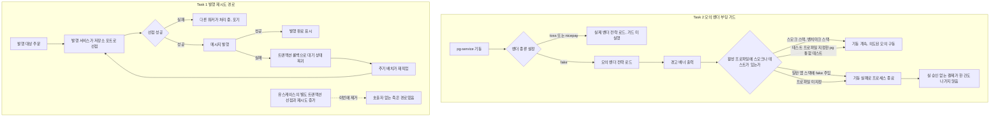

# 미해결 항목 잔여 정리 구현 플랜

> 작성일: 2026-08-04

## 목표

미해결 항목 대장의 현재 과업 여덟 건 중 일곱 건을 닫는다 — 코드를 손대는 셋(미사용 선점 메서드 제거 / 모의 벤더 부팅 가드 / 스타일 억제 해소)을 반영하고, 판단만으로 닫히는 넷을 대장에서 정리한다.

## 컨텍스트

- 설계 문서: `docs/topics/BACKLOG-RESIDUE-CLEANUP.md`
- 주요 변경 파일
  - `payment-service/.../application/usecase/PaymentOutboxUseCase.java` (+ 대응 테스트)
  - `pg-service/.../infrastructure/gateway/fake/FakePgGatewayStrategy.java` (+ 대응 테스트, pg 통합 테스트 4건)
  - `payment-service/.../payment/application/{StockCatalogViewServiceImpl,PgAttemptHistoryViewServiceImpl}.java`
  - `config/checkstyle/checkstyle-suppressions.xml`
  - `docs/context/TODOS.md`, `docs/context/CONCERNS.md`, `docs/context/CONFIRM-FLOW.md`

---

## 요약 브리핑

### Task 목록

1. **미사용 선점 경로 제거** — 발행 유스케이스에서 호출자가 없는 별도 트랜잭션 선점과 재시도 횟수 증가 메서드를 지운다. 재시도 정책이 동작하는 것처럼 읽히던 오해가 사라진다.
2. **모의 벤더 부팅 가드 + pg 통합 테스트 프로파일 명시** — 모의 벤더가 스모크·테스트 프로파일 밖에서 로드되면 기동을 멈춘다. 같은 단위에서 pg 통합 테스트 네 건이 테스트 프로파일을 켜게 고친다.
3. **프로덕션 스타일 위반 두 건 해소** — 조회 실패를 흡수하는 두 서비스에서 try 블록 밖 변수 재할당을 없애고 억제를 걷는다.
4. **테스트 스타일 위반 네 건 해소** — 타입 추론 키워드 두 건, try 밖 재할당 한 건, 빈 예외 블록 한 건을 고치고 억제 목록을 비운다.
5. **대장·우려 문서 정리** — 닫힌 일곱 건을 지우고, 지운 항목을 가리키던 참조를 자립 서술로 바꾼다.

### 변경 후 전체 플로우차트

Task 1은 동작을 바꾸지 않는다 — 이미 아무도 부르지 않던 경로를 지우는 것이라, 발행 재시도의 실제 흐름은 그림 그대로 유지된다. 바뀌는 것은 코드를 읽었을 때의 오해뿐이다.

### 핵심 결정 -> Task 매핑

| 설계 문서의 결정 | Task |
|:---:|:---:|
| 미사용 선점 메서드 두 개와 대응 테스트 제거 | 1 |
| 제거 범위 한정 (저장소 포트·재시도 정책 값 객체는 유지) | 1 |
| 부팅 가드 판정 기준을 활성 프로파일로 | 2 |
| 프로파일 미지정은 허용하지 않음 | 2 |
| 차단 방식은 로드 시점 예외 | 2 |
| 경고 배너 유지 | 2 |
| pg 통합 테스트 네 건에 테스트 프로파일 명시 | 2 |
| 억제 해소, 프로덕션 두 곳 우선 | 3, 4 |
| 소진 판정 메서드는 남기되 사용처 소멸을 대장에 기록 | 5 |
| 코드 무변경 항목 셋을 대장 정리로만 종결 | 5 |
| 중복 등재된 트랜잭션 매니저 체인 항목 삭제 | 5 |

### 트레이드오프 / 후속 작업

- 가드는 프로파일을 직접 조작하면 우회된다. 의도적 조작은 방어 대상이 아니고, 목표는 환경변수가 배포에 남는 사고를 막는 것이다.
- 재시도 정책의 소진 판정은 프로덕션 사용처가 0이 되지만 값 객체에 남긴다. 나중에 발행 실패에 간격을 넣을 때 다시 쓰인다.
- 발행 실패의 재시도 간격은 이번에도 도입하지 않는다. 적정 값을 정하려면 부하 측정이 필요하다.
- 정리 후 대장의 현재 과업은 재시도 창 축소로 커진 격리 복구 압력 한 건만 남는다.

---

## 진행 상황

- [x] Task 1: 미사용 선점 경로 제거
- [x] Task 2: 모의 벤더 부팅 가드 + pg 통합 테스트 프로파일 명시
- [x] Task 3: 프로덕션 스타일 위반 2건 해소
- [x] Task 4: 테스트 스타일 위반 4건 해소
- [x] Task 5: 대장·우려 문서 정리

---

## 태스크

### Task 1: 미사용 선점 경로 제거 [tdd=false] [domain_risk=true]

호출자가 없는 코드를 지우는 작업이라 새로 고정할 동작이 없다. 실패 테스트를 먼저 쓰는 대신, 남는 경로가 그대로 도는지 기존 테스트로 확인한다.

**구현**

- `payment-service/.../application/usecase/PaymentOutboxUseCase.java`
  - `claimToInFlight(String)` (52-60행), `incrementRetryOrFail(String, PaymentOutbox)` (62-71행) 삭제
  - 삭제 후 쓰이지 않게 되는 import 정리 — `org.springframework.transaction.annotation.Propagation`. `Optional`·`Instant`·`RetryPolicy` 는 남는 메서드가 계속 쓰므로 유지
- `payment-service/.../application/usecase/PaymentOutboxUseCaseTest.java`
  - `claimToInFlight` 케이스 2건(93-128행), `incrementRetryOrFail` 케이스 2건(130-170행) 삭제
  - 삭제로 쓰이지 않게 되는 fixture·import 정리

**남기는 것** (건드리지 않는다)

- `PaymentOutboxRepository.claimToInFlight` 포트 선언과 `PaymentOutboxRepositoryImpl` / `JpaPaymentOutboxRepository` 구현 — `OutboxRelayService.relay` 가 실제로 쓴다
- `RetryPolicy` / `RetryPolicyProperties` — `recoverTimedOutInFlightRecords` 가 쓴다
- `RetryPolicy.isExhausted` 와 `RetryPolicyTest` — 프로덕션 호출처는 0이 되지만 값 객체 메서드로 남긴다 (기록은 Task 5)

**완료 기준**

- `grep -rn "claimToInFlight\|incrementRetryOrFail" payment-service/src/main` 결과에 유스케이스 파일이 없다 (포트·구현·`OutboxRelayService` 만 남는다)
- `./gradlew :payment-service:test` 통과, 회귀 없음
- `./gradlew :payment-service:compileJava :payment-service:compileTestJava` 통과

**완료 결과**

- `PaymentOutboxUseCase`에서 `claimToInFlight(String)`, `incrementRetryOrFail(String, PaymentOutbox)` 삭제, 함께 쓰던 `Propagation` import 정리
- `PaymentOutboxUseCaseTest`에서 대응 테스트 4건(`claimToInFlight` 2건, `incrementRetryOrFail` 2건) 삭제 — 남은 케이스가 쓰던 import 는 전부 유지되어 추가 정리 없음
- `PaymentOutboxRepository.claimToInFlight` 포트, `PaymentOutboxRepositoryImpl`/`JpaPaymentOutboxRepository` 구현, `OutboxRelayService.relay` 사용처는 확인 후 그대로 유지
- `grep -rn "claimToInFlight\|incrementRetryOrFail" payment-service/src/main` 결과: 포트 선언·구현·`OutboxRelayService` 3파일만 남음 (유스케이스 파일 없음)
- `./gradlew :payment-service:test :payment-service:compileJava :payment-service:compileTestJava` 전체 통과 (567 tests)

---

### Task 2: 모의 벤더 부팅 가드 + pg 통합 테스트 프로파일 명시 [tdd=true] [domain_risk=true]

가드만 넣고 테스트를 안 고치면 pg 통합 테스트 네 건이 먼저 깨진다. 어느 하나만 반영된 상태를 만들지 않도록 한 태스크로 묶는다.

**테스트 (RED)** — `pg-service/.../infrastructure/gateway/fake/FakePgGatewayStrategyTest.java`

가드는 `@PostConstruct` 메서드에 두므로, 테스트는 그 메서드를 직접 호출해 판정을 고정한다. `MockEnvironment`(`spring-test`)로 활성 프로파일을 위조한다.

| 메서드 | 활성 프로파일 | 기대 |
|:---:|:---:|:---:|
| `warnActivation_스모크_프로파일이면_기동을_막지_않는다` | `docker`, `smoke` | 예외 없음 |
| `warnActivation_테스트_프로파일이면_기동을_막지_않는다` | `test` | 예외 없음 |
| `warnActivation_허용_프로파일이_없으면_기동을_막는다` | `docker` | `IllegalStateException` |
| `warnActivation_프로파일_미지정이면_기동을_막는다` | (없음) | `IllegalStateException` |

**구현 (GREEN)**

- `pg-service/.../infrastructure/gateway/fake/FakePgGatewayStrategy.java`
  - 생성자에 `org.springframework.core.env.Environment` 주입 추가
  - `warnActivation()` — 기존 경고 배너 출력은 그대로 두고, 뒤에 판정을 붙인다. `environment.getActiveProfiles()` 에 `smoke` 도 `test` 도 없으면 `IllegalStateException` throw. 예외 메시지에 활성 프로파일 목록과 허용 목록을 함께 담아 배포 파이프라인 로그만 보고 원인을 알 수 있게 한다
  - 클래스 Javadoc 의 활성화 조건 서술을 가드 반영해 갱신
  - 기존 테스트 헬퍼 `strategy(...)` 가 `MockEnvironment` 를 넘기도록 시그니처 맞춤 — 기존 케이스는 `warnActivation()` 을 호출하지 않으므로 동작에 영향 없다
- pg 통합 테스트 4건에 `@ActiveProfiles("test")` 추가
  - `PgConfirmListenerSplitIntegrationTest`, `PgInboxAttemptGuardIntegrationTest`, `PgSelfLoopRetryExhaustionIntegrationTest`, `PgInboxTraceparentIntegrationTest`
  - pg 설정에는 프로파일 조건부 블록이 없고 `application-test.yml` 도 없어 프로파일만 채워질 뿐 설정은 달라지지 않는다

**허용 조합 근거** (변경 전 확인 완료 — 구현 시 재확인한다)

| 스택 | 활성 프로파일 | 벤더 종류 | 판정 |
|:---:|:---:|:---:|:---:|
| 스모크 (`docker-compose.smoke.yml`) | `docker,smoke` | `fake` 고정 | 통과 |
| 벤치마크 (`docker-compose.benchmark.yml`) | `docker,smoke` | `fake` 고정 | 통과 |
| 일반 앱 (`docker-compose.apps.yml`) | `docker` | 환경변수, 기본 `toss` | `fake` 주입 시 차단 |
| pg 통합 테스트 | `test` (이번에 추가) | 테스트가 `fake` 주입 | 통과 |

**완료 기준**

- 새 테스트 4건 통과, `./gradlew :pg-service:test` 통과
- `./gradlew :pg-service:integrationTest --rerun-tasks` 통과 — 캐시 재사용 없이 실제 재실행으로 확인한다
- `grep -rn "pg.gateway.type" pg-service/src/test` 로 잡히는 스프링 컨텍스트 기동 지점이 모두 `@ActiveProfiles("test")` 를 갖는다 (누락 0)
- `./gradlew test` 전체 통과, 회귀 없음

**완료 결과**

- `FakePgGatewayStrategy` 생성자에 `Environment` 주입 추가, `warnActivation()` 에 활성 프로파일 판정을 붙여 `smoke`·`test` 둘 다 없으면 `IllegalStateException` 으로 기동을 막는다. 예외 메시지에 활성 프로파일과 허용 목록을 함께 담는다
- 클래스 Javadoc 에 가드 조건 서술 추가
- `FakePgGatewayStrategyTest` 에 `warnActivation()` 직접 호출 테스트 4건 추가(`MockEnvironment` 로 프로파일 위조) — 스모크/테스트 프로파일은 통과, `docker` 단독·미지정은 `IllegalStateException`
- 기존 `strategy(...)` 헬퍼가 `MockEnvironment`(빈 프로파일) 를 함께 넘기도록 시그니처를 맞췄다 — 기존 케이스는 `warnActivation()` 을 호출하지 않아 동작 영향 없음
- 구현 전 `docker-compose.{smoke,benchmark,apps}.yml` 을 직접 확인해 허용 조합표를 재검증했다: smoke·benchmark 스택 모두 pg-service 는 `SPRING_PROFILES_ACTIVE: docker,smoke` + `PG_GATEWAY_TYPE: fake` 고정, apps 스택은 `SPRING_PROFILES_ACTIVE: docker` 단독 + `PG_GATEWAY_TYPE` 기본값 `toss`(env 로 override 가능) — 표와 일치
- pg 통합 테스트 4건(`PgConfirmListenerSplitIntegrationTest`, `PgInboxAttemptGuardIntegrationTest`, `PgSelfLoopRetryExhaustionIntegrationTest`, `PgInboxTraceparentIntegrationTest`) 에 `@ActiveProfiles("test")` 추가
- `./gradlew :pg-service:test` 393 tests 전체 통과, `./gradlew :pg-service:integrationTest --rerun-tasks` 16 tests 전체 통과(캐시 미사용 재실행), `./gradlew test` 전체 모듈 회귀 없음
- `grep -rn "pg.gateway.type" pg-service/src/test` 로 잡히는 4개 파일 모두 `@ActiveProfiles("test")` 보유 확인(누락 0)

---

### Task 3: 프로덕션 스타일 위반 2건 해소 [tdd=false] [domain_risk=false]

동작을 바꾸지 않는 형태 정리다. 새 동작이 없으므로 기존 테스트 통과가 회귀 가드다.

**구현**

- `payment-service/.../payment/application/StockCatalogViewServiceImpl.java` (36행) — `ProductCatalogPageInfo` 를 try 밖에 선언하고 try 안에서 재할당하는 형태를 없앤다
- `payment-service/.../payment/application/PgAttemptHistoryViewServiceImpl.java` (36행) — 같은 형태
- 두 파일 모두 동작은 그대로 유지한다: 포트 호출 성공이면 조회 결과를, `RuntimeException` 이면 경고 로그 후 조회 불가 결과를 반환
- 두 클래스의 Javadoc 에 "try 범위를 포트 호출 자체로 좁힌다"는 서술이 있다. 수정 형태가 이 서술과 어긋나면 Javadoc 도 실제에 맞춰 정정한다
- `config/checkstyle/checkstyle-suppressions.xml` 에서 두 파일의 `TryBlockExternalReassignment` 억제 2줄 제거 (49-50행)

**완료 기준**

- `./gradlew checkstyleMain` 실행 결과에 두 파일의 `TryBlockExternalReassignment` 경고 0건
- `./gradlew :payment-service:test` 통과 — 두 클래스의 기존 테스트가 조회 성공/실패 분기를 그대로 지킨다
- 억제 파일에 두 항목이 남아 있지 않다

**완료 결과**

- `StockCatalogViewServiceImpl.getPage`, `PgAttemptHistoryViewServiceImpl.getAttemptHistory` 둘 다 try 밖 변수 선언 후 try 안에서 재할당하던 형태를 없애고, 포트 호출 성공 시 결과를 `try` 블록 안에서 바로 `available(...)` 로 감싸 반환하도록 고쳤다. `catch (RuntimeException e)` 분기(경고 로그 후 `unavailable()` 반환)는 그대로 유지 — 동작 변경 없음
- 재할당 대상이던 지역 변수(`pageInfo`, `info`)가 사라지며 그 타입만 쓰던 import(`ProductCatalogPageInfo`, `PgAttemptHistoryInfo`)도 함께 제거
- try 범위가 포트 호출뿐 아니라 `available(...)` 조립까지 포함하게 되어, 두 클래스 Javadoc의 "try 범위는 포트 호출 자체로 좁힌다" 서술을 "포트 호출과 그 결과를 담는 `available` 조립까지다"로 정정 — 뷰 변환(presentation 계층 책임)과 섞이지 않는다는 핵심 취지는 그대로 유지
- `config/checkstyle/checkstyle-suppressions.xml`에서 `StockCatalogViewServiceImpl`/`PgAttemptHistoryViewServiceImpl`의 `TryBlockExternalReassignment` 억제 2줄 제거, 남은 두 항목(`DuplicateApprovalHandlerListenerTest`, `PgConfirmListenerSplitIntegrationTest` — Task 4 대상) 설명 주석에 해소 사실 반영
- `./gradlew checkstyleMain` 전체 모듈 통과(경고 0건), `./gradlew :payment-service:test` 567 tests 전체 통과, 회귀 없음

---

### Task 4: 테스트 스타일 위반 4건 해소 [tdd=false] [domain_risk=false]

**구현**

| 파일 | 행 | 위반 | 처리 |
|:---:|:---:|:---:|:---:|
| `AsyncConfigContextPropagationTest` | 60 | 타입 추론 키워드 | try-with-resources 변수를 명시 타입(`Scope`)으로 선언 |
| `PaymentTransactionCoordinatorTest` | 191 | 타입 추론 키워드 | `InOrder` 명시 타입으로 선언 |
| `DuplicateApprovalHandlerListenerTest` | 73 | try 밖 재할당 | try 밖 `boolean` 선언 후 try/catch 로 채우는 형태를 없앤다. 검증 의도(진입점 메서드 존재)는 그대로 유지 |
| `PgConfirmListenerSplitIntegrationTest` | 275 | 빈 예외 블록 | 크래시 시뮬레이션 예외를 빈 catch 로 삼키지 않고 예외 발생을 명시적으로 단정하는 형태로 바꾼다. 이후 좀비 잔존 확인 단정은 그대로 |

- `config/checkstyle/checkstyle-suppressions.xml` 에서 남은 억제 4줄 제거 (41-42행, 51-52행). 이로써 기준선 억제 블록 두 개가 주석까지 통째로 사라진다 — 디렉토리 단위 블랑켓 억제와 `PublicUseCasePortNullReturn` 범위 한정 항목만 남는다

**완료 기준**

- `./gradlew checkstyleMain checkstyleTest` 실행 결과에 5규칙 위반 0건
- `config/checkstyle/checkstyle-suppressions.xml` 에 기준선 억제 항목(파일·행 지정) 0건
- `./gradlew test` 전체 통과 + `./gradlew :pg-service:integrationTest --rerun-tasks` 통과 (`PgConfirmListenerSplitIntegrationTest` 가 통합 테스트라 캐시 없이 확인한다)

**완료 결과**

- 행 번호는 플랜 기준으로 낡아 있었다(Task 2 가 `PgConfirmListenerSplitIntegrationTest`에 `@ActiveProfiles("test")`를 추가하며 뒤쪽이 밀림). `./gradlew checkstyleMain checkstyleTest`로 실제 위반 지점을 다시 확인해 고쳤다 — `PgConfirmListenerSplitIntegrationTest`는 275행이 아니라 277행의 빈 catch 블록이었고, 나머지 세 건은 플랜 행 번호와 일치했다(`AsyncConfigContextPropagationTest` 60행, `PaymentTransactionCoordinatorTest` 191행, `DuplicateApprovalHandlerListenerTest` 73행)
- `AsyncConfigContextPropagationTest.outboxRelayExecutor_shouldPropagateOtelContextToVirtualThread` — try-with-resources 변수를 `var ignored`에서 `Scope ignored`로 명시 타입 선언
- `PaymentTransactionCoordinatorTest.executesExecutePaymentThenCreatePendingRecord` — `var inOrder`를 `InOrder inOrder`로 명시 타입 선언(`org.mockito.InOrder` import 추가)
- `DuplicateApprovalHandlerListenerTest.onDuplicateApprovalDetected_메서드_존재해야_한다` — try 밖 `boolean methodExists` 선언 후 try/catch 로 채우던 형태를 없애고 `assertThatCode(() -> ...).doesNotThrowAnyException()`으로 교체. 검증 의도(진입점 메서드 존재)는 그대로 유지
- `PgConfirmListenerSplitIntegrationTest.zombieRecovery_afterWorkerCrash_completesProcessing` — 크래시 시뮬레이션을 빈 `catch (RuntimeException ignored) {}`로 삼키던 형태를 없애고 `assertThatThrownBy(() -> pgInboxProcessUseCase.processPending(inboxId)).isInstanceOf(RuntimeException.class)`로 예외 발생을 명시적으로 단정. 이후 IN_PROGRESS 좀비 잔존 단정(`zombie.isPresent()`, 상태 `IN_PROGRESS`)은 그대로 유지
- `config/checkstyle/checkstyle-suppressions.xml`에서 남은 기준선 억제 4줄(Task 11 var 억제 2건 + Task 12 나머지 2건)과 딸린 설명 주석 블록 두 개를 통째로 제거. 디렉토리 단위 블랑켓 억제와 `PublicUseCasePortNullReturn` 범위 한정 항목만 남았다
- `./gradlew checkstyleMain checkstyleTest --rerun-tasks` 전체 모듈 통과(경고 0건), `./gradlew test` 전 모듈 1033 tests 전체 통과, `./gradlew :pg-service:integrationTest --rerun-tasks` 통과(`PgConfirmListenerSplitIntegrationTest` 4 tests 포함, 캐시 없이 재실행 확인)

---

### Task 5: 대장·우려 문서 정리 [tdd=false] [domain_risk=false]

앞선 네 태스크가 코드에서 닫은 것과, 판단만으로 닫히는 넷을 문서에 반영한다. 지운 항목을 가리키던 참조를 함께 정리해 끊어진 링크를 남기지 않는다.

**구현 — `docs/context/TODOS.md` 현재 과업에서 7건 삭제**

| 삭제 항목 | 종결 사유 |
|:---:|:---:|
| A. 트랜잭션 매니저 체인 검토 (미채택) | 우려 대장 L-1에 같은 보류 결정이 있어 중복 |
| B. 커버리지 집계 범위 잔여 | 현행 측정 대상 정책 유지 결정 |
| C. 선점 경로 프로덕션 미사용 | Task 1로 종결 |
| D. 모의 벤더 부팅 가드 부재 | Task 2로 종결 |
| E1. 정적 검출 게이트 승격 판단 | 운용 관찰 후 판단 |
| E2. 기준선 억제 정리 | Task 3, 4로 종결 |
| F. 종결 이후 발행 행 이력 표시 | 표시 교정으로 충분하다는 판단 |

남는 항목: E3(재시도 창 축소로 커진 격리 복구 압력) 한 건.

**구현 — 빈 껍데기 정리 (항목 삭제로 비는 구조)**

A~F 여섯 섹션 중 A·B·C·D·F 는 각각 항목이 하나뿐이라, 삭제하면 헤더와 안내 blockquote 만 남는다.

- 본문이 비는 섹션 헤더 다섯 개(A `### A. 위키 정합`, B `### B. EOS-FOLLOWUP-CLEANUP 후속 등재`, C `### C. 코드 확인 필요 항목`, D `### D. LIVE-DRILL-FORMALIZATION 후속`, F `### F. ADMIN-VISIBILITY discuss 발견`)를 딸린 안내 blockquote 까지 함께 지운다
- E 섹션 도입부(43-45행)의 "아래 3건은 ... 뺀 잔여다" 는 2건이 빠지면 틀린 문장이 된다. 남는 한 건에 맞춰 고치거나 안내문을 지운다
- 섹션이 하나만 남으면 A~F 문자 라벨 자체가 의미를 잃는다. 남는 한 건을 문자 라벨 없이 현재 과업 아래 바로 두는 편을 택한다

**구현 — 끊어지는 참조 정리**

- `TODOS.md` TC-7 (Phase 5) — 삭제한 C 항목을 두 곳(182행, 185행)에서 참조한다. 항목 참조 없이 자립하도록 다시 쓰고, **재시도 정책의 소진 판정이 프로덕션 사용처를 잃었다는 사실을 여기 기록**한다 (설계 문서의 결정 사항)
- `TODOS.md` 최종 갱신 줄 — 이번 정리 반영
- `docs/context/CONCERNS.md` L-1 (92행) — `후속 과제: TC-13-FOLLOW-6` 의 대장 항목 ID 참조를 제거하고 내용만 남긴다
- `docs/context/CONCERNS.md` L-18 (145-150행) — 가드 도입을 반영한다. "기동을 막는 코드는 없다" 는 서술을 고치고, 후속 줄은 삭제한 대장 항목 대신 남는 한계(프로파일을 조작하면 우회 가능)만 기술한다. 최종 갱신 줄도 함께
- `docs/context/CONFIRM-FLOW.md` 384행·405행 — 발행 실패 종결 상태와 재시도 정책 비교표가 `PaymentOutboxUseCase.incrementRetryOrFail` 을 "정의만 있고 호출처 0" 으로 서술한다. Task 1 이후엔 메서드 자체가 없으므로 "이 방어를 담당하던 메서드는 제거됐다" 로 고친다. 같은 파일의 19·76·92·370·458행은 저장소 포트 쪽 동명 메서드를 가리키므로 그대로 둔다

**완료 기준**

- `TODOS.md` 현재 과업에 재시도 창 축소 1건만 남는다
- `TODOS.md` 에 본문 없는 섹션 헤더가 없고, 남은 항목 건수를 말하는 안내문이 실제 건수와 맞는다
- `grep -rn "PAYMENT-OUTBOX-INFLIGHT-UNUSED\|FAKE-PG-BOOT-ENV-GUARD\|STATIC-CHECK-GATE-PROMOTION\|STYLE-BASELINE-SUPPRESSION-CLEANUP\|PG-ZOMBIE-OUTBOX-PHANTOM-ROW-HISTORY\|TC-13-FOLLOW-6" docs/ .claude/` 결과가 `docs/archive/`, `docs/topics/`, 본 플랜을 제외하고 0건
- `grep -rn "incrementRetryOrFail" docs/context/` 결과 0건
- `CONCERNS.md` L-18이 가드 도입 후 상태를 서술한다
- 지침 문서 검사 스크립트 통과

**완료 결과**

- `TODOS.md` 현재 과업에서 7건 삭제(A 트랜잭션 매니저 체인 검토, B 커버리지 집계 범위 잔여, C 선점 경로 프로덕션 미사용, D 모의 벤더 부팅 가드 부재, E1 정적 검출 게이트 승격 판단, E2 기준선 억제 정리, F 종결 이후 발행 행 이력 표시) — 남는 항목은 재시도 창 축소 압력 한 건
- 빈 껍데기 정리: 본문이 하나만 남은 섹션 라벨(A~F, E) 을 폐지하고, 남는 항목을 문자 라벨 없이 "현재 과업" 아래 바로 배치. E 도입부의 "아래 3건" 안내 blockquote 도 함께 제거
- `TODOS.md` 최종 갱신 줄 정리
- `TODOS.md` TC-7 — 삭제한 C 항목([PAYMENT-OUTBOX-INFLIGHT-UNUSED])을 참조하던 두 곳을 자립 서술로 재작성하고, 재시도 정책의 소진 판정(`RetryPolicy.isExhausted`)이 프로덕션 사용처를 잃었다는 사실을 기록
- `docs/context/CONCERNS.md` L-1 — 후속 과제 줄에서 `TC-13-FOLLOW-6` 대장 항목 ID 참조를 제거하고, 삭제된 TODOS A 항목이 담고 있던 미채택 사유(체인 도입 시 원자성 강화 vs 재검토 조건)를 이 줄에 흡수
- `docs/context/CONCERNS.md` L-18 — 제목과 본문을 가드 도입 후 상태로 다시 썼다. "기동을 막는 코드는 없다"는 서술을 걷어내고 `warnActivation()` 이 활성 프로파일 기준으로 기동을 멈추는 동작을 서술, 후속 줄은 삭제한 TODOS D 항목 참조 대신 잔여 한계(프로파일 직접 조작 시 우회 가능)로 교체
- `docs/context/CONCERNS.md` 최종 갱신 줄 정리
- `docs/context/CONFIRM-FLOW.md` 384행·405행 — `PaymentOutboxUseCase.incrementRetryOrFail` 을 "정의만 있고 호출처 0"으로 서술하던 문장을 "이 방어를 담당하던 메서드는 제거됐다"로 정정(메서드 자체가 없어 이름 재언급 없이). 19·76·92·370·458행의 `claimToInFlight`(저장소 포트 쪽 동명 메서드)는 그대로 유지
- `grep -rn "PAYMENT-OUTBOX-INFLIGHT-UNUSED\|FAKE-PG-BOOT-ENV-GUARD\|STATIC-CHECK-GATE-PROMOTION\|STYLE-BASELINE-SUPPRESSION-CLEANUP\|PG-ZOMBIE-OUTBOX-PHANTOM-ROW-HISTORY\|TC-13-FOLLOW-6" docs/ .claude/` 결과 0건(archive/topics/본 플랜 제외), `grep -rn "incrementRetryOrFail" docs/context/` 결과 0건 — 둘 다 확인
- `python3 scripts/check-agent-docs.py` 전 판정 문제 0건

---

## 리뷰 처리
> (ship 단계에서 채움 — finding별 채택/스킵 + 사유)
