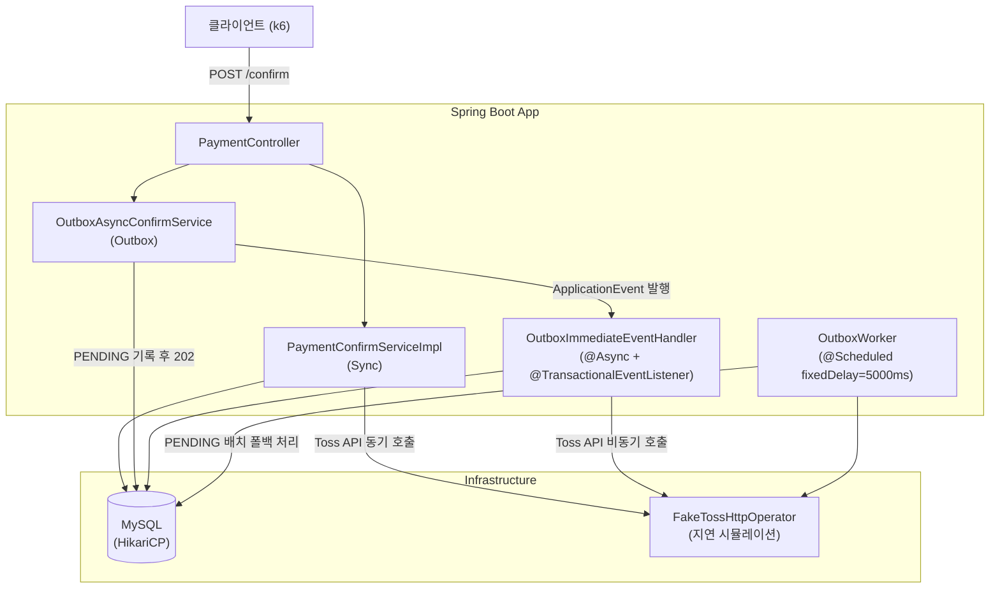
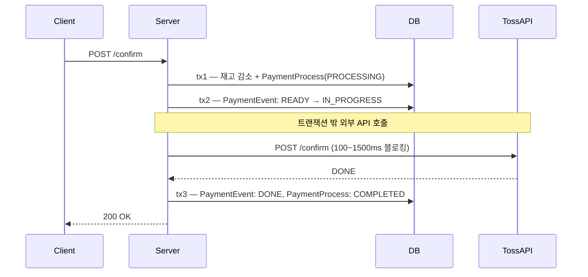
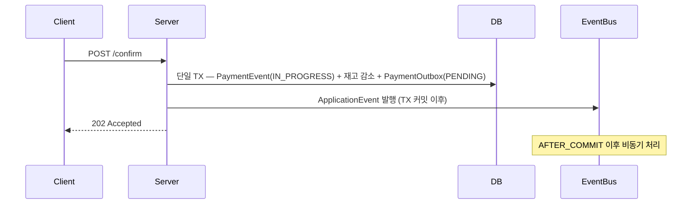
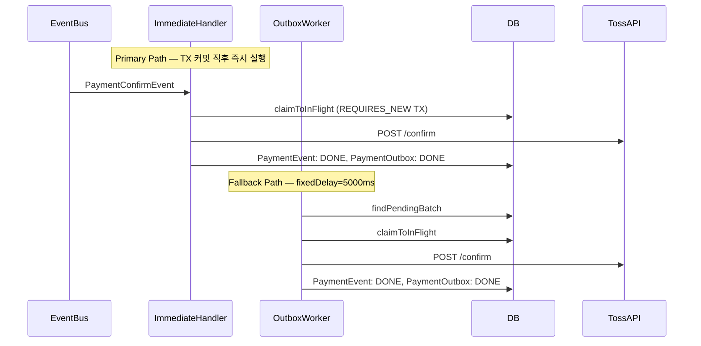
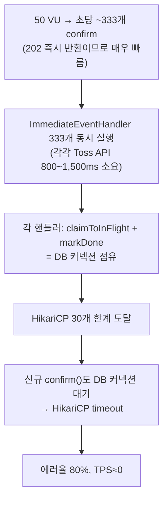

# Payment Platform 비동기 결제 전략 벤치마크 보고서

> 최초 작성: 2026-03-28 / 마지막 업데이트: 2026-03-30

---

## 목차

1. [목표](#1-목표)
2. [시스템 아키텍처](#2-시스템-아키텍처)
3. [전략 개요](#3-전략-개요)
4. [시행착오 기록](#4-시행착오-기록)
5. [측정 히스토리](#5-측정-히스토리)
6. [종합 인사이트](#6-종합-인사이트)

---

## 1. 목표

Toss Payments 결제 확인 플로우를 **Sync / DB Outbox / DB Outbox (Parallel)** 세 가지 전략으로 구현하고,
동일한 부하 조건에서 TPS·레이턴시·안정성의 차이를 정량 비교한다.

핵심 가설: **외부 API 지연이 클수록 비동기 전략이 유리하다.**

---

## 2. 시스템 아키텍처



---

## 3. 전략 개요

### Sync



클라이언트가 Toss API 응답까지 블로킹. HTTP 응답시간 = Toss API 지연에 직접 종속.

---

### Outbox — confirm() 경로 (공통)



DB 쓰기만 하고 즉시 202 반환. 클라이언트는 Toss API 지연을 체감하지 않음.

---

### Outbox — 백그라운드 처리 경로



ImmediateHandler가 정상 경로. Worker는 실패·누락 레코드의 안전망.

---

### Outbox vs Outbox-Parallel 차이

| 항목 | Outbox | Outbox-Parallel |
|------|--------|----------------|
| Virtual Threads | false | **true** |
| OutboxWorker 병렬 처리 | false | **true** |

---

## 4. 시행착오 기록

> 새로운 시행착오 발견 시 하단에 추가한다.

---

### T1 — OutboxWorker fixedDelay=5000ms로 인한 e2e 지연

**현상:** outbox-low e2e p95 = **14,905ms** (저지연 환경임에도 15초)

**원인:**
```
e2e = 폴링 대기(0 ~ 5,000ms) + Toss API 시간
    = 최대 5,000ms + 200ms ≈ 5,200ms 이상
```
k6가 100ms 간격으로 폴링하지만 Worker가 5초 후에야 PENDING을 픽업함.

**해결:** `OutboxImmediateEventHandler` 활성화. TX 커밋 직후 이벤트 발행으로 Toss API 즉시 호출.

**결과:** e2e p95 14,905ms → **1,417ms** (90% 단축)

---

### T2 — ramping-arrival-rate로 인한 전략 간 TPS 차이 소멸

**현상:** sync-high TPS=221, outbox-high TPS=232 — 전략 간 차이 없음.

**원인:** `ramping-arrival-rate`는 처리 완료 여부와 무관하게 목표 rate로 iteration을 스케줄링.
sync가 Toss API를 대기하는 동안에도 새 VU가 계속 할당되어 총 request 수가 비슷하게 나옴.

**해결:** executor를 `constant-vus`로 변경.
```
TPS = VU 수 / iteration 평균 시간

sync-high:   50 VU / 1,250ms ≈  40 TPS  (Toss API에 묶임)
outbox-high: 50 VU /   150ms ≈ 333 TPS  (202 즉시 반환)
```

**결과:** sync-high TPS=**23** vs outbox-parallel-high TPS=**111** (4.8배 차이 확인)

---

### T3 — Outbox 고지연 환경에서 HikariCP 커넥션 풀 고갈

**현상:** outbox-high 에러율=**80%**, TPS≈0 완전 붕괴.

**원인:**


**해석:** Backpressure 없는 비동기 아키텍처의 한계. 빠른 202 반환이 오히려 독이 되어
이벤트가 폭발적으로 쌓임. 고지연 환경에서 병렬 처리(Parallel) 없이는 자원 고갈 발생.

---

### T4 — MAX_VUS 부족으로 클라이언트가 병목

**현상:** `ramping-arrival-rate` 재도입 후 목표 600 req/s 대비 실제 TPS 110/s에 고착.

**원인:**
```
실제 처리 가능 TPS = MAX_VUS / avg_iteration_duration
                   = 400 VU / 1.879s ≈ 213 iter/s

600 req/s 달성에 필요한 VU = 600 × 1.879s ≈ 1,316 VU
→ MAX_VUS=400으로는 서버가 아닌 클라이언트가 병목
```

**해결:** `MAX_VUS` 400 → 1,500 / `PRE_ALLOCATED_VUS` 50 → 200

---

## 5. 측정 히스토리

> 새 측정 완료 시 하단에 `### Round N` 블록을 추가한다.
> 각 라운드는 독립적으로 읽을 수 있도록 환경·결과·분석을 모두 포함한다.

---

### Round 1 — ramping-arrival-rate MAX_VUS=1,500 (2026-03-30)

#### 환경

| 항목 | 값 |
|------|----|
| k6 executor | `ramping-arrival-rate` |
| PRE_ALLOCATED_VUS | 200 |
| MAX_VUS | 1,500 |
| Ramp stages | 100 req/s (20s) → 300 req/s (20s) → 600 req/s (20s) |
| E2E 측정 VU | 5 VU / 60s (별도 scenario) |
| Toss API 저지연 | 100 ~ 300ms |
| Toss API 고지연 | 800 ~ 1,500ms |
| HikariCP pool-size | 300 |
| Sync Virtual Threads | false |
| Outbox Virtual Threads | false |
| Outbox-Parallel Virtual Threads | true |
| OutboxWorker | 활성화 (fixedDelay=5,000ms) |

#### 결과

| 케이스 | TPS | HTTP med | HTTP p95 | E2E med | E2E p95 | 에러율 | Dropped |
|--------|-----|----------|----------|---------|---------|--------|---------|
| sync-low | 110.8 | 2,796ms | 6,727ms | 272ms | 1,150ms | 0% | 7,008 |
| sync-high | 96.7 | 4,144ms | 6,557ms | 1,309ms | 5,939ms | 0.007% | 7,373 |
| outbox-low | 101.2 | 249ms | 9,464ms | 339ms | 17,347ms | 0.02% | 4,888 |
| outbox-high | **126.8** | 1,168ms | 4,168ms | 4,435ms | 31,692ms | 0% | 3,781 |
| outbox-parallel-low | 23.3 | 77ms | 60,202ms | 547ms | 5,984ms | **5.7%** | 10,423 |
| outbox-parallel-high | 70.7 | 246ms | 8,228ms | 1,370ms | 3,492ms | 0.22% | 6,537 |

#### 분석

**Sync — 레이턴시 폭발 확인**

Round 1 대비 HTTP 레이턴시가 급등했다. TPS는 비슷하지만 큐잉 대기가 쌓이는 것이 수치로 드러남.

| | Round 1 HTTP avg | Round 3 HTTP avg | 증가율 |
|-|---------|---------|--------|
| sync-low | 939ms | 2,585ms | +175% |
| sync-high | 1,097ms | 3,522ms | +221% |

Tomcat 스레드 풀(200개)이 포화되면서 처리 대기가 증가한 것으로 해석된다.

**Outbox-high — 고지연 환경에서 TPS 우위 확인**

고지연 환경에서 Outbox가 Sync 대비 **31% 더 많은 요청 처리** (96.7 → 126.8 TPS).
202 즉시 반환으로 스레드를 빠르게 해방하면서, Sync가 스레드 포화로 처리량이 줄어드는 구간에서 처리량을 유지.

**Outbox-Parallel-low — 고부하에서 역효과**

TPS 23.3/s, 에러율 5.7%, HTTP p95=60,202ms 비정상 수치 발생.
가상 스레드 활성화 상태에서 1,500 VU 부하 시 스레드가 폭발적으로 생성되어
HikariCP(300) 한계에 도달한 것으로 추정. T3의 패턴이 더 높은 부하에서 재현됨.

---

## 6. 종합 인사이트

> 측정 라운드 추가 시 이 섹션도 함께 업데이트한다.

### 전략별 특성 요약

| 전략 | 강점 | 약점 |
|------|------|------|
| Sync | 구현 단순, E2E 빠름, 예측 가능 | 고지연 API에 스레드 묶임, 고부하 시 TPS 급락 |
| Outbox | 202 빠른 반환, 고부하 TPS 우위 | E2E 길어짐, 고지연+고부하 시 커넥션 풀 고갈 위험 |
| Outbox-Parallel | 고지연 E2E 개선 | 초고부하 시 가상 스레드 폭증으로 오히려 불안정 |

### 핵심 발견

1. **고지연 환경에서 Outbox의 TPS 우위는 명확하다** — Round 3에서 Outbox-high가 Sync-high 대비 31% 높은 TPS 달성
2. **Sync는 부하 증가 시 TPS는 유지되지만 레이턴시가 폭발한다** — HTTP avg 1,097ms → 3,522ms (+221%)
3. **가상 스레드는 양날의 검이다** — 스레드 수 무제한이 장점이지만, 공유 자원(HikariCP) 병목을 더 빨리 드러냄
4. **Backpressure 없는 비동기는 고부하에서 먼저 무너진다** — T3, T4에서 반복 확인

### "202 즉시 반환"의 실제 의미


- 사용자 체감 응답: sync 1,150ms → outbox ~150ms (**87% 단축**)
- 실제 완료 시간: 양쪽 모두 Toss API 호출이 필요하므로 동등
- E2E 시간이 길어지는 것은 비동기 패턴의 설계상 트레이드오프
