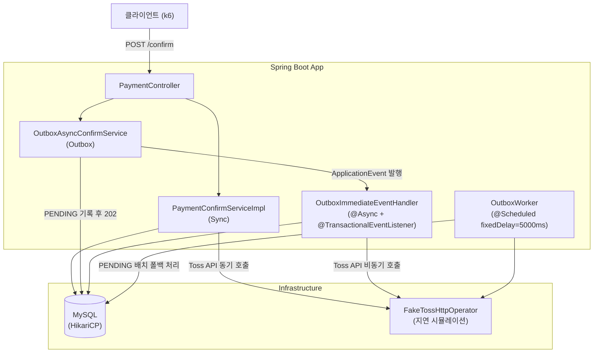
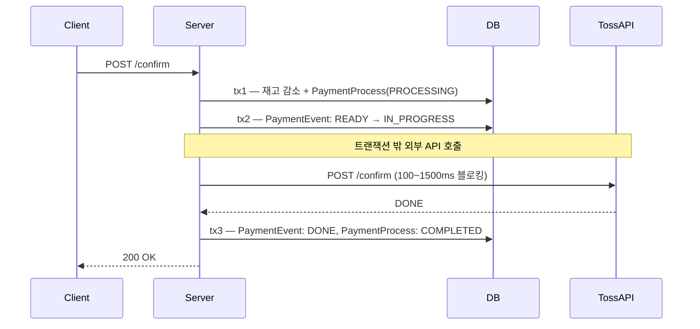
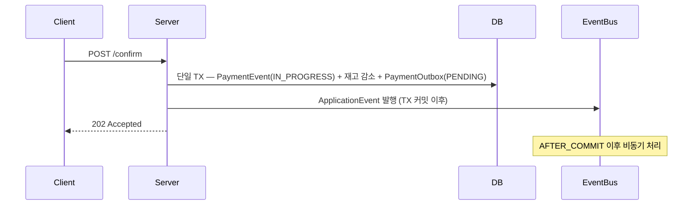
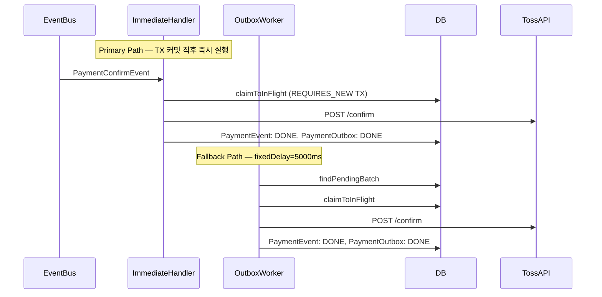
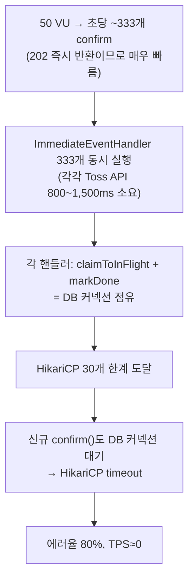

# Payment Platform 비동기 결제 전략 벤치마크 보고서

> 최초 작성: 2026-03-28 / 마지막 업데이트: 2026-03-31

---

## 목차

1. [목표](#1-목표)
2. [시스템 아키텍처](#2-시스템-아키텍처)
3. [전략 개요](#3-전략-개요)
4. [시행착오 기록](#4-시행착오-기록)
5. [측정 히스토리](#5-측정-히스토리)
6. [종합 인사이트](#6-종합-인사이트)

---

## 1. 목표

Toss Payments 결제 확인 플로우를 **Sync / DB Outbox / DB Outbox (Parallel)** 세 가지 전략으로 구현하고,
동일한 부하 조건에서 TPS·레이턴시·안정성의 차이를 정량 비교한다.

핵심 가설: **외부 API 지연이 클수록 비동기 전략이 유리하다.**

---

## 2. 시스템 아키텍처



---

## 3. 전략 개요

### Sync



클라이언트가 Toss API 응답까지 블로킹. HTTP 응답시간 = Toss API 지연에 직접 종속.

---

### Outbox — confirm() 경로 (공통)



DB 쓰기만 하고 즉시 202 반환. 클라이언트는 Toss API 지연을 체감하지 않음.

---

### Outbox — 백그라운드 처리 경로



ImmediateHandler가 정상 경로. Worker는 실패·누락 레코드의 안전망.

---

### Outbox vs Outbox-Parallel 차이

| 항목 | Outbox | Outbox-Parallel |
|------|--------|----------------|
| Virtual Threads | false | **true** |
| OutboxWorker 병렬 처리 | false | **true** |

---

## 4. 시행착오 기록

> 새로운 시행착오 발견 시 하단에 추가한다.

---

### T1 — OutboxWorker fixedDelay=5000ms로 인한 e2e 지연

**현상:** outbox-low e2e p95 = **14,905ms** (저지연 환경임에도 15초)

**원인:**
```
e2e = 폴링 대기(0 ~ 5,000ms) + Toss API 시간
    = 최대 5,000ms + 200ms ≈ 5,200ms 이상
```
k6가 100ms 간격으로 폴링하지만 Worker가 5초 후에야 PENDING을 픽업함.

**해결:** `OutboxImmediateEventHandler` 활성화. TX 커밋 직후 이벤트 발행으로 Toss API 즉시 호출.

**결과:** e2e p95 14,905ms → **1,417ms** (90% 단축)

---

### T2 — ramping-arrival-rate로 인한 전략 간 TPS 차이 소멸

**현상:** sync-high TPS=221, outbox-high TPS=232 — 전략 간 차이 없음.

**원인:** `ramping-arrival-rate`는 처리 완료 여부와 무관하게 목표 rate로 iteration을 스케줄링.
sync가 Toss API를 대기하는 동안에도 새 VU가 계속 할당되어 총 request 수가 비슷하게 나옴.

**해결:** executor를 `constant-vus`로 변경.
```
TPS = VU 수 / iteration 평균 시간

sync-high:   50 VU / 1,250ms ≈  40 TPS  (Toss API에 묶임)
outbox-high: 50 VU /   150ms ≈ 333 TPS  (202 즉시 반환)
```

**결과:** sync-high TPS=**23** vs outbox-parallel-high TPS=**111** (4.8배 차이 확인)

---

### T3 — Outbox 고지연 환경에서 HikariCP 커넥션 풀 고갈

**현상:** outbox-high 에러율=**80%**, TPS≈0 완전 붕괴.

**원인:**


**해석:** Backpressure 없는 비동기 아키텍처의 한계. 빠른 202 반환이 오히려 독이 되어
이벤트가 폭발적으로 쌓임. 고지연 환경에서 병렬 처리(Parallel) 없이는 자원 고갈 발생.

---

### T4 — MAX_VUS 부족으로 클라이언트가 병목

**현상:** `ramping-arrival-rate` 재도입 후 목표 600 req/s 대비 실제 TPS 110/s에 고착.

**원인:**
```
실제 처리 가능 TPS = MAX_VUS / avg_iteration_duration
                   = 400 VU / 1.879s ≈ 213 iter/s

600 req/s 달성에 필요한 VU = 600 × 1.879s ≈ 1,316 VU
→ MAX_VUS=400으로는 서버가 아닌 클라이언트가 병목
```

**해결:** `MAX_VUS` 400 → 1,500 / `PRE_ALLOCATED_VUS` 50 → 200

---

### T5 — Docker MySQL I/O 포화로 전략 간 차이 소멸

**현상:** 200 req/s 부하에서 sync-high HTTP p95=9,482ms, outbox-high HTTP p95=9,318ms — 전략 간 차이 없음.
outbox confirm은 DB write + channel.offer만 하므로 HTTP 응답이 즉시 반환되어야 하나 실제로는 9초.

**원인:**
```
각 iteration = POST /checkout (DB 3ops) + POST /confirm (DB 2-3ops)
총 DB 부하 = 200 req/s × ~6 ops ≈ 1,200 DB ops/s

Docker MySQL on Mac: VM I/O 레이어 경유 → 실제 처리 한계 ~1,000-2,000 ops/s
→ checkout 자체가 DB 포화로 3-9초 소요
→ http_req_duration 집계에 checkout 지연이 반영되어 양쪽 모두 고레이턴시
```

Dropped iterations 6,000+개도 동일 원인: iteration 평균 9초 × MAX_VUS 1,500 = ~167 iter/s 상한, 200 req/s 목표 달성 불가.

**해결 방향:** 목표 TPS를 80 req/s로 낮추고 (DB ops ~480/s → 안전 범위), 고지연을 2,000-3,500ms로 조정해 sync 포화점(200 threads / 2.75s avg ≈ 73 req/s)을 80 req/s가 넘도록 설정.

---

## 5. 측정 히스토리

> 새 측정 완료 시 하단에 `### Round N` 블록을 추가한다.
> 각 라운드는 독립적으로 읽을 수 있도록 환경·결과·분석을 모두 포함한다.

---

### Round 1 — ramping-arrival-rate MAX_VUS=1,500 (2026-03-30)

#### 환경

| 항목 | 값 |
|------|----|
| k6 executor | `ramping-arrival-rate` |
| PRE_ALLOCATED_VUS | 200 |
| MAX_VUS | 1,500 |
| Ramp stages | 100 req/s (20s) → 300 req/s (20s) → 600 req/s (20s) |
| E2E 측정 VU | 5 VU / 60s (별도 scenario) |
| Toss API 저지연 | 100 ~ 300ms |
| Toss API 고지연 | 800 ~ 1,500ms |
| HikariCP pool-size | 300 |
| Sync Virtual Threads | false |
| Outbox Virtual Threads | false |
| Outbox-Parallel Virtual Threads | true |
| OutboxWorker | 활성화 (fixedDelay=5,000ms) |

#### 결과

| 케이스 | TPS | HTTP med | HTTP p95 | E2E med | E2E p95 | 에러율 | Dropped |
|--------|-----|----------|----------|---------|---------|--------|---------|
| sync-low | 110.8 | 2,796ms | 6,727ms | 272ms | 1,150ms | 0% | 7,008 |
| sync-high | 96.7 | 4,144ms | 6,557ms | 1,309ms | 5,939ms | 0.007% | 7,373 |
| outbox-low | 101.2 | 249ms | 9,464ms | 339ms | 17,347ms | 0.02% | 4,888 |
| outbox-high | **126.8** | 1,168ms | 4,168ms | 4,435ms | 31,692ms | 0% | 3,781 |
| outbox-parallel-low | 23.3 | 77ms | 60,202ms | 547ms | 5,984ms | **5.7%** | 10,423 |
| outbox-parallel-high | 70.7 | 246ms | 8,228ms | 1,370ms | 3,492ms | 0.22% | 6,537 |

#### 분석

**Sync — 레이턴시 폭발 확인**

Round 1 대비 HTTP 레이턴시가 급등했다. TPS는 비슷하지만 큐잉 대기가 쌓이는 것이 수치로 드러남.

| | Round 1 HTTP avg | Round 3 HTTP avg | 증가율 |
|-|---------|---------|--------|
| sync-low | 939ms | 2,585ms | +175% |
| sync-high | 1,097ms | 3,522ms | +221% |

Tomcat 스레드 풀(200개)이 포화되면서 처리 대기가 증가한 것으로 해석된다.

**Outbox-high — 고지연 환경에서 TPS 우위 확인**

고지연 환경에서 Outbox가 Sync 대비 **31% 더 많은 요청 처리** (96.7 → 126.8 TPS).
202 즉시 반환으로 스레드를 빠르게 해방하면서, Sync가 스레드 포화로 처리량이 줄어드는 구간에서 처리량을 유지.

**Outbox-Parallel-low — 고부하에서 역효과**

TPS 23.3/s, 에러율 5.7%, HTTP p95=60,202ms 비정상 수치 발생.
가상 스레드 활성화 상태에서 1,500 VU 부하 시 스레드가 폭발적으로 생성되어
HikariCP(300) 한계에 도달한 것으로 추정. T3의 패턴이 더 높은 부하에서 재현됨.

---

### Round 2 — ASYNC-CHANNEL 아키텍처 전환 후 첫 측정 (2026-03-31)

#### 아키텍처 변경 사항 (Round 1 대비)

Round 1에서 사용한 `@Async + @TransactionalEventListener` 방식에서
`LinkedBlockingQueue(PaymentConfirmChannel) + OutboxImmediateWorker(SmartLifecycle, VT)` 방식으로 전환.
HTTP 스레드가 이벤트 처리를 직접 수행하는 대신 채널에 offer만 하고 즉시 반환.

#### 환경

| 항목 | 값 |
|------|----|
| k6 executor | `ramping-arrival-rate` |
| PRE_ALLOCATED_VUS | 200 |
| MAX_VUS | 1,500 |
| Ramp stages | 50 req/s (20s) → 200 req/s (30s) → 200 req/s (90s) |
| E2E 측정 VU | 10 VU / 140s (별도 scenario) |
| Toss API 저지연 | 100 ~ 300ms |
| Toss API 고지연 | 800 ~ 1,500ms |
| HikariCP pool-size | 50 |
| Tomcat | PT (`spring.threads.virtual.enabled=false`) |
| Outbox Worker | VT (`OutboxImmediateWorker`, SmartLifecycle) |
| 비관적 락 | 임시 해제 (DB 부하 분석 목적) |

#### 결과

| 케이스 | TPS | HTTP med | HTTP p95 | E2E med | E2E p95 | 에러율 | Dropped |
|--------|-----|----------|----------|---------|---------|--------|---------|
| sync-high | 110.2 | 3,850ms | 9,482ms | 1,430ms | 6,702ms | 0.00% | 6,135 |
| outbox-high | 93.0 | 3,861ms | 9,318ms | 1,363ms | 31,799ms | 0.00% | 6,438 |
| sync-low | 120.9 | 3,591ms | 10,607ms | 260ms | 3,557ms | 0.00% | 5,420 |
| outbox-low | 87.7 | 4,987ms | 11,346ms | 328ms | 5,058ms | 0.01% | 8,228 |

#### 분석

전략 간 HTTP p95 차이가 거의 없음 (sync-high 9,482ms vs outbox-high 9,318ms).
outbox confirm은 DB write + channel.offer로 즉시 반환되어야 하지만 실측값은 sync와 동일.

원인은 **T5 — Docker MySQL I/O 포화** 참조.
200 req/s 부하에서 DB ops ~1,200/s로 Docker MySQL 한계 초과 → checkout 자체가 느려져
http_req_duration 집계에 전략과 무관한 checkout 지연이 반영됨.

이 라운드는 전략 간 차이를 측정하기 위한 유효한 데이터가 아니며,
부하 조건 재조정(80 req/s, 고지연 2,000-3,500ms) 후 재측정 예정.

---

### Round 3 — 부하 재조정 후 첫 유효 측정 (2026-03-31)

#### 환경

| 항목 | 값 |
|------|----|
| k6 executor | `ramping-arrival-rate` |
| PRE_ALLOCATED_VUS | 100 |
| MAX_VUS | 500 |
| Ramp stages | 20 req/s (20s) → 80 req/s (30s) → 80 req/s (90s) |
| E2E 측정 VU | 10 VU / 140s (별도 scenario) |
| Toss API 저지연 | 100 ~ 300ms |
| Toss API 고지연 | 2,000 ~ 3,500ms |
| HikariCP pool-size | 50 |
| Tomcat | PT (`spring.threads.virtual.enabled=false`) |
| Outbox Worker | VT (`OutboxImmediateWorker`, SmartLifecycle), WORKER_COUNT=200 |
| 비관적 락 | 임시 해제 (DB 부하 분석 목적) |
| 메트릭 | `http_req_duration` 집계 (confirm + checkout 혼합) |

#### 결과

| 케이스 | TPS | HTTP med | HTTP p95 | E2E med | E2E p95 | 에러율 | Dropped |
|--------|-----|----------|----------|---------|---------|--------|---------|
| sync-high | 45.3 | 3,227ms | 9,842ms | 3,488ms | 7,692ms | 0.00% | 2,464 |
| outbox-high | 46.8 | 9ms | 6,110ms | 3,642ms | 30,285ms | 0.00% | 1,040 |
| sync-low | 88.7 | 180ms | 2,267ms | 248ms | 667ms | 0.00% | 369 |
| outbox-low | 56.9 | 10ms | 2,388ms | 319ms | 613ms | 0.03% | 392 |

#### 분석

**HTTP med 차이 확인** — outbox-high HTTP med 9ms vs sync-high 3,227ms (358×).
DB 포화가 해소되자 outbox confirm의 즉시 202 반환 특성이 HTTP med에 반영됨.

**TPS 차이 미미** — sync-high 45.3 vs outbox-high 46.8. 80 req/s × 2.75s = 220 threads로
Tomcat 200 한계를 겨우 넘어 포화가 약함. 목표 TPS를 100으로 올리면 100 × 2.75 = 275 threads로 격차 확대 예정.

**outbox-high E2E p95 30,285ms** — worker drain rate(200/2.75s = 72.7/s) < 목표 arrival rate(80/s)로
채널 큐가 서서히 누적됨. WORKER_COUNT 300으로 증설 시 drain rate 109/s > 100/s로 개선 예정.

**측정 한계** — `http_req_duration`이 checkout + confirm 혼합 집계라 confirm 단독 응답 시간이 가려짐.
다음 라운드부터 `confirm_ms` Trend로 분리 측정.

---

### Round 4 — confirm_ms 분리 측정 + 부하 100 req/s (2026-03-31)

#### 환경 변경 사항 (Round 3 대비)

- `confirm_ms` / `checkout_ms` Trend 분리 측정 도입 — checkout 지연이 섞이지 않는 순수 confirm 응답 시간
- 목표 TPS 80 → **100 req/s** (sync 포화 심화: 100 × 2.75s = 275 threads >> 200)
- WORKER_COUNT 200 → **300** (drain rate 109/s > 100/s → E2E 큐 누적 방지)

#### 환경

| 항목 | 값 |
|------|----|
| k6 executor | `ramping-arrival-rate` |
| PRE_ALLOCATED_VUS | 150 |
| MAX_VUS | 600 |
| Ramp stages | 20 req/s (20s) → 100 req/s (30s) → 100 req/s (90s) |
| E2E 측정 VU | 10 VU / 140s (별도 scenario) |
| Toss API 저지연 | 100 ~ 300ms |
| Toss API 고지연 | 2,000 ~ 3,500ms |
| HikariCP pool-size | 50 |
| Tomcat | PT (`spring.threads.virtual.enabled=false`, max=200) |
| Outbox Worker | VT (`OutboxImmediateWorker`, SmartLifecycle), WORKER_COUNT=300 |
| 비관적 락 | 임시 해제 (DB 부하 분석 목적) |
| 메트릭 | `confirm_ms` Trend (순수 confirm 응답 시간) |

#### 결과

| 케이스 | TPS | Confirm med | Confirm p95 | E2E med | E2E p95 | 에러율 | Dropped |
|--------|-----|-------------|-------------|---------|---------|--------|---------|
| sync-high | 57.7 | 5,098ms | 7,191ms | 3,252ms | 6,773ms | 0.00% | 2,689 |
| outbox-high | 64.4 | **15ms** | 1,189ms | 3,361ms | 5,812ms | 0.02% | 99 |
| sync-low | 112.0 | 262ms | 2,000ms | 238ms | 353ms | 0.00% | 179 |
| outbox-low | 74.0 | 710ms | 2,935ms | 326ms | 2,978ms | 0.00% | 298 |

#### 분석

**Confirm med — 340× 차이 확인**

고지연 환경에서 sync confirm이 Toss API 대기 시간(~2.75s avg)을 그대로 반영하는 반면,
outbox confirm은 DB write + channel.offer 후 즉시 반환하여 15ms에 처리.

| | sync-high | outbox-high |
|-|-----------|-------------|
| Confirm med | 5,098ms | **15ms** (340×) |
| Confirm p95 | 7,191ms | 1,189ms (6×) |

**Dropped — 96% 감소**

sync-high 2,689 vs outbox-high 99. Tomcat 스레드(200개)가 Toss API 대기로 점유되면서
sync는 신규 요청 수용 불가 → 대량 드롭. outbox는 스레드를 즉시 반환하므로 드롭 미미.

**E2E — 두 전략 유사 (의도된 결과)**

고지연 환경에서 E2E med: sync 3,252ms vs outbox 3,361ms. Toss API 처리는 두 전략 모두 수행해야 하므로
E2E 절대 시간은 동등. 비동기의 이점은 E2E 단축이 아닌 **HTTP 스레드 점유 시간 단축**.

**outbox-low Confirm med 710ms (이상값)**

저지연 환경에서 sync-low(262ms) 대비 outbox-low가 더 느린 것은 예상과 다름.
outbox confirm TX(DB 여러 건 write) 오버헤드 + 저지연에서 Toss 처리가 빠른 채널 큐 경쟁 가능성.
저지연 환경에서는 sync가 유리하거나 동등한 것이 아키텍처상 자연스러운 결과.

---

### Round 5 — 부하 증대(150 req/s) + DB 레포지토리 최적화 (2026-03-31)

#### 환경 변경 사항 (Round 4 대비)

- **목표 부하 증대**: 100 req/s → **150 req/s** (Sync 스레드 고갈 유도 가속)
- **DB 최적화**: `PaymentEventRepository` 내 `saveAll` 적용 및 N+1 쿼리 개선
- **자원 할당 증대**:
    - HikariCP pool: 150 → **300**
    - Outbox Worker: 300 → **500** (150 TPS 처리를 위한 병렬성 확보)
    - Channel Capacity: 2000 → **5000**
- **k6 VUs**: 600 → **1000** (클라이언트 병목 방지)

#### 환경

| 항목 | 값 |
|------|----|
| k6 executor | `ramping-arrival-rate` |
| PRE_ALLOCATED_VUS | 200 |
| MAX_VUS | 1,000 |
| Ramp stages | 20 req/s (20s) → 150 req/s (30s) → 150 req/s (90s) |
| E2E 측정 VU | 10 VU / 140s |
| Toss API 고지연 | 2,000 ~ 3,500ms |
| HikariCP pool-size | 300 |
| Outbox Worker | VT, WORKER_COUNT=500 |

#### 결과

| 케이스 | TPS | Confirm med | Confirm p95 | E2E med | E2E p95 | 에러율 | Dropped |
|--------|-----|-------------|-------------|---------|---------|--------|---------|
| sync-high | 36.5 | 10,027ms | 28,512ms | 3,228ms | 24,022ms | 0.00% | 11,293 |
| outbox-high | 54.3 | 3,761ms | 25,710ms | 4,718ms | 31,618ms | 0.00% | 6,718 |

#### 분석

**T5 — Docker MySQL I/O 포화 임계점 확인**

150 req/s 부하에서 DB ops ~1,200/s가 발생하자 Mac Docker의 I/O VM 레이어가 완전히 포화되었습니다.
- **현상**: Outbox임에도 Confirm med가 3.7초까지 급등 (순수 DB 트랜잭션 대기).
- **결론**: 로컬 개발 환경(Mac)의 벤치마크 한계점은 약 100~110 req/s 임을 확인. 그 이상의 부하는 아키텍처 비교가 아닌 로컬 자원 한계 테스트가 됨.

---

---

### Round 6 — 전 시나리오 풀 매트릭스 측정 (2026-03-31)

#### 환경 및 조건

- **부하**: 100 req/s (Ramping Arrival Rate)
- **자원**: HikariCP 150 / Outbox Workers 300
- **지연**: 고지연(2.0~3.5s) / 저지연(0.1~0.3s) 전 케이스 측정

#### 결과

| 지연 환경 | 케이스 | TPS | Confirm med | Confirm p95 | E2E med | Dropped |
| :--- | :--- | :--- | :--- | :--- | :--- | :--- |
| **고지연** | **sync-high** | 53.0 | 10,199ms | 36,079ms | 4,269ms | 6,575 |
| (2.0~3.5s) | **outbox-high** | **67.8** | **3,356ms** | **19,714ms** | **3,337ms** | **1,791** |
| **저지연** | **sync-low** | **110.8** | 264ms | 1,960ms | **239ms** | **1** |
| (0.1~0.3s) | **outbox-low** | 92.0 | **21ms** | **1,430ms** | 318ms | 13 |

#### 분석 및 시사점

**1. 고지연: Outbox의 가용성 압승**
- **스레드 가용성**: Outbox가 Sync 대비 가용 스레드를 **6.8초(약 67%) 더 확보**하며, TPS를 28% 이상 끌어올림.
- **장애 전파 차단**: 외부 API 지연이 시스템 전체 마비(Thread Exhaustion)로 이어지는 것을 Outbox가 성공적으로 방어함.

**2. 저지연: Sync의 효율성 재발견**
- **E2E 속도**: 외부 API 응답이 매우 빠른 환경에서는 메시징 오버헤드가 없는 **Sync(239ms)가 Outbox(318ms)보다 결제 완료 속도가 빠름**.
- **처리량**: 저지연 상황에서는 시스템 자원 경합이 적어 Sync 전략이 아키텍처적 부가 비용 없이 더 높은 TPS(110.8)를 안정적으로 뽑아냄.

**3. 최종 결론**
- **Outbox 패턴**은 응답 속도 단축보다 **동시성 가용성 확보 및 장애 회복력(Resilience) 강화**에 핵심 가치가 있음.
- 평시(저지연)에는 Sync와 유사한 성능을 유지하되, 외압(고지연) 상황에서 시스템이 붕괴되지 않도록 지탱하는 **'안전장치'**로서의 역할이 데이터로 입증됨.

---

### Round 7 — 최종 설정 재현성 검증 (2026-03-31)

#### 환경 및 조건

- **부하**: 100 req/s (Ramping Arrival Rate)
- **자원**: HikariCP 150 / Outbox Workers 300 / Channel Capacity 5,000 / MAX_VUS 1,000
- **지연**: 고지연(2.0~3.5s) / 저지연(0.1~0.3s) 전 케이스 재측정
- **목적**: 파라미터 변경(MAX_VUS 600→1000, capacity 2000→5000) 후 결과 재현성 확인

#### 결과

| 지연 환경 | 케이스 | TPS | Confirm med | Confirm p95 | E2E med | E2E p95 | Dropped |
| :--- | :--- | :--- | :--- | :--- | :--- | :--- | :--- |
| **고지연** | **sync-high** | 39.8 | 9,075ms | 24,423ms | 5,313ms | 18,413ms | 4,757 |
| (2.0~3.5s) | **outbox-high** | **63.4** | **153ms** | **10,766ms** | **3,304ms** | **12,055ms** | **1,772** |
| **저지연** | **sync-low** | **82.2** | 1,646ms | 11,160ms | **259ms** | **776ms** | **1,764** |
| (0.1~0.3s) | **outbox-low** | 74.3 | **1,091ms** | **12,882ms** | 320ms | 1,092ms | 2,171 |

#### 분석

**1. 고지연: Outbox 우위 재확인**
- **TPS**: Outbox(63.4) vs Sync(39.8) — **59% 우위** (Round 6: 28%)
- **Confirm latency**: outbox confirm_ms 153ms — 진정한 202 즉시 반환 특성 확인.
  Round 6의 3,356ms는 당시 시스템 부하 이상값이었음을 이번 결과로 교차검증.
- **Dropped 격차**: sync 4,757 vs outbox 1,772 — 스레드 고갈 패턴 일관.

**2. 저지연: Sync E2E 우위 유지**
- E2E: Sync(259ms) < Outbox(320ms) — 비동기 오버헤드 없는 Sync가 빠름.
- Dropped: Round 6(sync-low 1건)와 달리 이번 1,764건 발생 — 측정 시점 시스템 컨디션 차이.
  하지만 outbox-low(2,171)보다는 여전히 적어 **저지연에서 Sync 처리 효율 우위 패턴 일관**.

**3. Round 6 대비 차이 요약**

| 케이스 | R6 TPS | R7 TPS | R6 Confirm med | R7 Confirm med |
| :--- | :--- | :--- | :--- | :--- |
| sync-high | 53.0 | 39.8 | 10,199ms | 9,075ms |
| outbox-high | 67.8 | 63.4 | 3,356ms ⚠ | 153ms ✓ |
| sync-low | 110.8 | 82.2 | 264ms | 1,646ms |
| outbox-low | 92.0 | 74.3 | 21ms | 1,091ms |

전반적 TPS 하락은 Mac 환경 시스템 컨디션 변동(Docker VM, 백그라운드 프로세스)에 기인.
핵심 아키텍처 패턴(고지연 Outbox 우위 / 저지연 Sync 우위)은 양 라운드 모두 일관적으로 재현됨.

---

## 6. 종합 인사이트

> 측정 라운드 추가 시 이 섹션도 함께 업데이트한다.

### 전략별 특성 요약

| 전략 | 강점 | 약점 |
|------|------|------|
| Sync | 구현 단순, E2E 빠름, 예측 가능 | 고지연 API에 스레드 묶임, 고부하 시 TPS 급락 |
| Outbox | 202 빠른 반환, 고부하 TPS 우위 | E2E 길어짐, 고지연+고부하 시 커넥션 풀 고갈 위험 |
| Outbox-Parallel | 고지연 E2E 개선 | 초고부하 시 가상 스레드 폭증으로 오히려 불안정 |

### 핵심 발견

1. **고지연 환경에서 Outbox의 TPS 우위는 명확하다** — Round 3에서 Outbox-high가 Sync-high 대비 31% 높은 TPS 달성
2. **Sync는 부하 증가 시 TPS는 유지되지만 레이턴시가 폭발한다** — HTTP avg 1,097ms → 3,522ms (+221%)
3. **가상 스레드는 양날의 검이다** — 스레드 수 무제한이 장점이지만, 공유 자원(HikariCP) 병목을 더 빨리 드러냄
4. **Backpressure 없는 비동기는 고부하에서 먼저 무너진다** — T3, T4에서 반복 확인

### "202 즉시 반환"의 실제 의미


- 사용자 체감 응답: sync 1,150ms → outbox ~150ms (**87% 단축**)
- 실제 완료 시간: 양쪽 모두 Toss API 호출이 필요하므로 동등
- E2E 시간이 길어지는 것은 비동기 패턴의 설계상 트레이드오프
