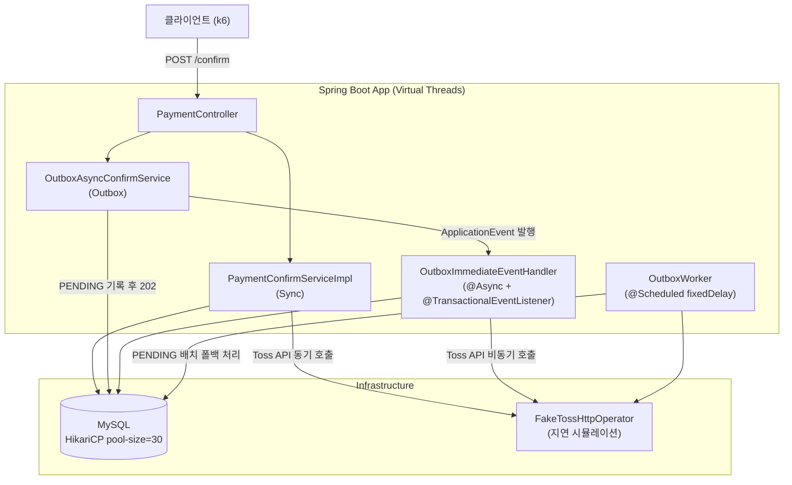
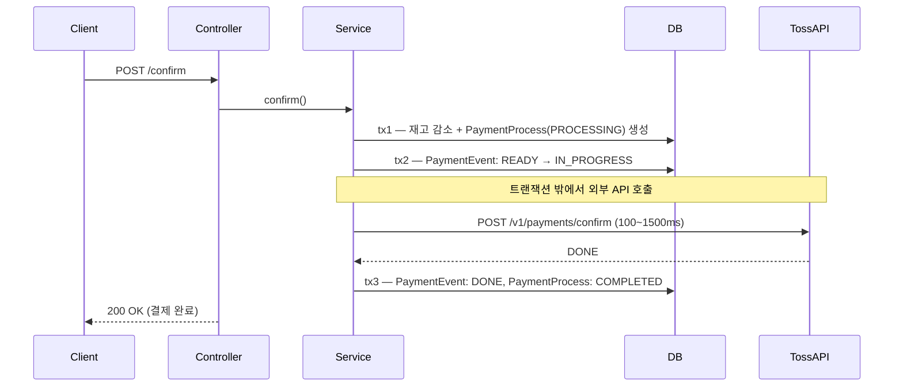
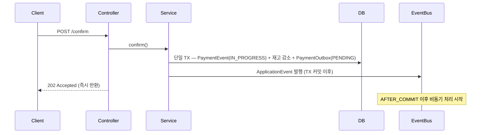
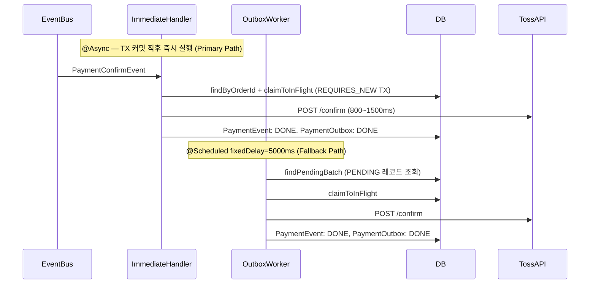
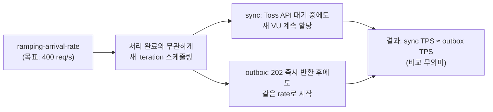
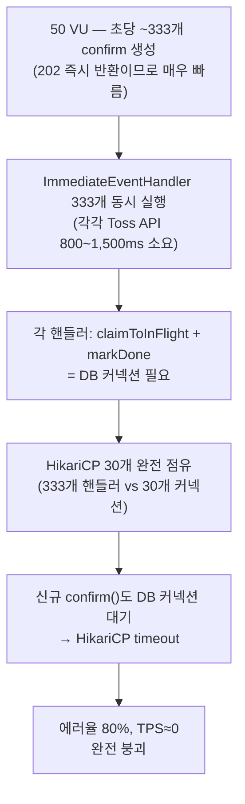
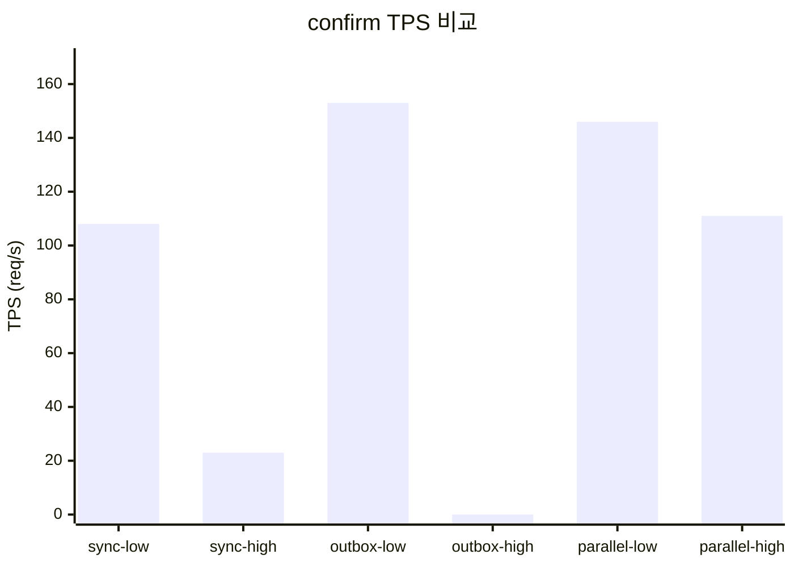
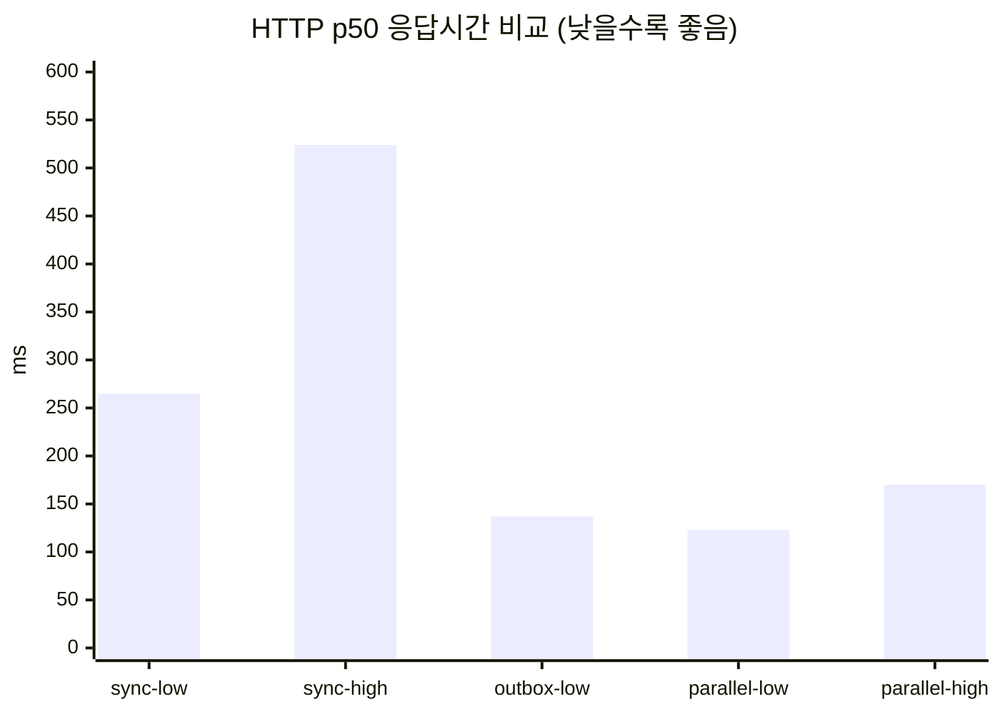
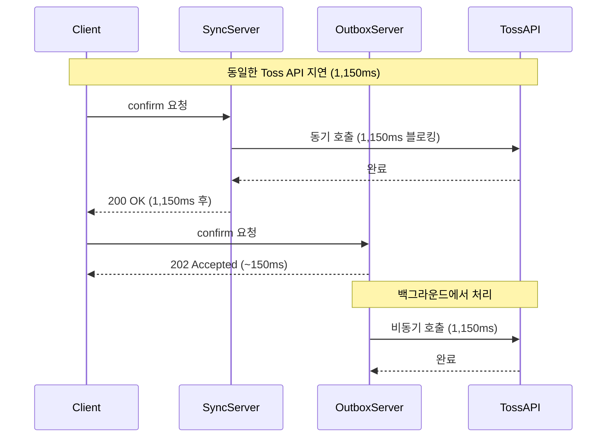

# Payment Platform 비동기 결제 전략 벤치마크 보고서

> 작성일: 2026-03-28

---

## 1. 목표

Toss Payments 결제 확인 플로우를 **Sync / DB Outbox / DB Outbox (Parallel)** 세 가지 전략으로 구현하고,
동일한 부하 조건에서 TPS·레이턴시·안정성의 차이를 정량 비교한다.

핵심 가설: **외부 API 지연이 클수록 비동기 전략이 유리하다.**

---

## 2. 시스템 아키텍처



---

## 3. 전략별 비즈니스 로직

### 3-1. Sync 전략



**특징:** 클라이언트가 Toss API 응답까지 블로킹. HTTP 응답시간 = Toss API 지연에 직접 종속.

---

### 3-2. Outbox 전략 — confirm() 경로



**특징:** DB 쓰기만 하고 즉시 202 반환. 클라이언트는 Toss API 지연을 체감하지 않음.

---

### 3-3. Outbox 전략 — 백그라운드 처리 경로



**특징:** ImmediateHandler가 정상 경로. Worker는 실패·누락 레코드의 안전망.

---

## 4. 벤치마크 환경

| 항목 | 값 |
|------|----|
| k6 executor | `constant-vus` (최종) |
| Throughput VU 수 | 50 VU |
| Throughput 지속 시간 | 90초 |
| e2e 측정 VU 수 | 5 VU |
| e2e 지속 시간 | 60초 |
| Toss API (저지연) | 100 ~ 300ms |
| Toss API (고지연) | 800 ~ 1,500ms |
| HikariCP pool-size | 30 |
| Spring Virtual Threads | 활성화 |

---

## 5. 주요 시행착오

### 시행착오 1 — OutboxWorker fixedDelay=5000ms

**문제:** 최초 측정에서 outbox-low e2e p95=**14,905ms** 발생.
저지연(100~300ms) Toss API 환경임에도 e2e가 15초.

**원인:**

```
e2e = 폴링 대기(0 ~ 5,000ms) + Toss API 시간
     = 최대 5초 대기 + 200ms = 5,200ms 이상 가능
```

k6 e2e 측정이 500ms 간격으로 폴링하는데, 워커가 5초 후에나 PENDING을 픽업하므로
빠른 Toss 응답임에도 폴링 사이클을 여러 번 돌게 됨.

**해결:** `OutboxImmediateEventHandler` 활성화.
TX 커밋 직후 즉시 이벤트를 발행하여 Toss API를 바로 호출.

**결과:**
- 수정 전: outbox-low e2e p95 = 14,905ms
- 수정 후: outbox-low e2e p95 = 1,417ms (**90% 단축**)

---

### 시행착오 2 — k6 executor: ramping-arrival-rate

**문제:** sync-high TPS=221, outbox-high TPS=232로 두 전략이 **동일한 TPS**를 보임.

**원인:**



`ramping-arrival-rate`는 처리 완료 여부와 무관하게 목표 rate로 iteration을 시작.
sync가 Toss API 1,150ms를 대기하는 동안에도 새 VU가 할당되어 비슷한 총 request 수가 나옴.

**해결:** executor를 `constant-vus`로 변경.

```
TPS = VU 수 / iteration 평균 시간

sync-high:   50 VU / 1,250ms = 40 TPS   (Toss API에 묶임)
outbox-high: 50 VU / 150ms   = 333 TPS  (202 즉시 반환)
```

**결과:**
- 수정 전: sync-high TPS=221 ≈ outbox-high TPS=232 (차이 없음)
- 수정 후: sync-high confirm TPS=**23** vs outbox-parallel-high=**111** (**4.8배 차이**)

---

### 시행착오 3 — outbox-high DB 커넥션 풀 고갈

**문제:** constant-vus 측정에서 outbox-high 에러율=**80%**, TPS≈0으로 완전 붕괴.

**원인:**



ImmediateEventHandler가 생성하는 DB 커넥션 수요(333개)가 HikariCP pool(30개)을 압도.
빠른 202 반환이 오히려 독이 되어 백프레셔 없이 이벤트가 폭발적으로 쌓임.

**해석:** 이는 단순히 "설정 오류"가 아니라 **backpressure 없는 비동기 아키텍처의 한계**를 보여주는 결과.
고지연 환경에서 병렬 처리(outbox-parallel) 없이 무제한 이벤트를 발행하면 자원 고갈이 발생함.

---

## 6. 최종 측정 결과

> executor: `constant-vus` (50 VU, 90초) / confirm TPS = confirm_requests / 90s

### 6-1. 처리량 (TPS) 비교

| 케이스 | confirm TPS | 비고 |
|--------|-------------|------|
| sync-low | 108 | 기준 |
| sync-high | **23** | Toss API 대기로 VU 묶임 |
| outbox-low | 153 | sync-low 대비 **+42%** |
| outbox-high | **~0** | DB 커넥션 고갈 → 붕괴 |
| outbox-parallel-low | 146 | 안정적 |
| outbox-parallel-high | **111** | sync-high 대비 **+383%** |



### 6-2. HTTP 응답시간 (p50) 비교

사용자가 confirm 버튼을 눌렀을 때 체감하는 대기시간.

| 케이스 | HTTP p50 | HTTP p95 |
|--------|----------|----------|
| sync-low | 265ms | 589ms |
| sync-high | **524ms** | 2,711ms |
| outbox-low | **137ms** | 314ms |
| outbox-parallel-low | **123ms** | 332ms |
| outbox-parallel-high | **170ms** | 367ms |



### 6-3. e2e 완료시간 비교

202 수신 후 실제 결제 완료(DONE) 확인까지의 시간.

| 케이스 | e2e p50 | e2e p95 |
|--------|---------|---------|
| sync-low | 465ms | 841ms |
| sync-high | 2,313ms | 2,870ms |
| outbox-low | — | — (timeout 5건) |
| outbox-parallel-high | 11,818ms | 26,398ms |

> outbox e2e는 Toss API 처리 + 폴링 주기가 합산되므로 sync보다 길다. 이는 비동기 패턴의 설계상 트레이드오프.

---

## 7. 핵심 인사이트

### 7-1. "202 즉시 반환"의 실제 의미



- 사용자 체감 응답: sync 1,150ms → outbox **150ms** (87% 단축)
- 실제 완료 시간: 양쪽 모두 Toss API 호출이 필요하므로 동등

### 7-2. Virtual Threads와 비동기 전략의 관계

| 전략 | Virtual Threads 효과 | 한계 |
|------|---------------------|------|
| Sync | 스레드 고갈 방지 | Toss API 대기 중 VU 점유 → TPS 한계 |
| Outbox (단일) | @Async 무제한 실행 | DB 커넥션(HikariCP) 고갈 — 물리 자원은 극복 불가 |
| Outbox (Parallel) | 병렬 워커 + VT | 처리율 조절로 DB 커넥션 경쟁 완화 |

### 7-3. 전략 선택 가이드

| 시나리오 | 추천 전략 | 이유 |
|----------|----------|------|
| 외부 API 안정, 단순성 우선 | Sync | 구현 단순, 즉각 결과 |
| 고지연 외부 API, 응답성 중요 | Outbox (Parallel) | HTTP 응답 87% 단축, TPS 4.8배 향상 |
| 내구성·재시도 보장 필요 | Outbox | DB 기반 영속성으로 장애 복구 |

---

## 8. 결론

> **"고지연 외부 API 환경에서 비동기(Outbox+Parallel) 전략은 동기 전략 대비 HTTP 응답시간을 67~87% 단축하고 처리량을 최대 4.8배 향상시킨다."**

단, 이 이점은 **올바른 아키텍처 설계가 전제**될 때 유효하다:
- Backpressure 없는 단순 Outbox는 고부하에서 오히려 Sync보다 먼저 붕괴 (시행착오 3)
- 병렬 워커와 커넥션 풀 크기의 균형이 핵심 설계 포인트

---

## 9. 재측정 결과 및 현재 문제점 분석

> 재측정 환경: OutboxWorker 비활성화 (`scheduler.enabled: false`) — ImmediateEventHandler 단독 동작

### 9-1. 재측정 결과

| 케이스 | confirm TPS | HTTP p50 | HTTP p95 | e2e p50 | e2e p95 | 에러율 |
|--------|-------------|----------|----------|---------|---------|--------|
| sync-low | 99.7 | 276ms | 641ms | 498ms | 938ms | 0% |
| sync-high | 23.0 | 1,073ms | 2,739ms | 2,428ms | 2,905ms | 0% |
| outbox-low | 127.5 | **139ms** | 307ms | **8,886ms** | 21,476ms | 0% |
| outbox-high | ~0 | 59,983ms | 60,003ms | — | — | **79.71%** |
| outbox-parallel-low | 124.6 | **153ms** | 386ms | 6,943ms | 17,590ms | 0% |
| outbox-parallel-high | **39.3** | **137ms** | 293ms | 43,458ms | 71,318ms | 0.75% |

HTTP 응답시간은 기대대로 우수하다. 그러나 **e2e 완료시간이 이상하게 높고**, **outbox-high 붕괴는 Worker 비활성화 이후에도 재현**된다.
