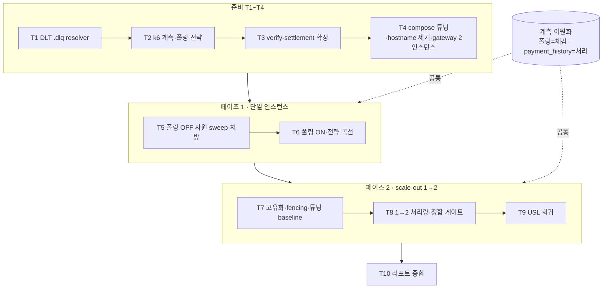

# CAPACITY-AND-SCALEOUT 구현 플랜

> 작성일: 2026-06-17

## 목표

단일 payment 인스턴스의 자원별 병목을 진단·처방(페이즈 1)하고, transactional.id 고유화 후 payment 1→2 scale-out 처리량 선형성을 USL로 분석(페이즈 2)하기까지 — 측정 도구 준비 → 측정 실행 → 분석·리포트가 모두 완료되면 이 플랜이 끝난다.

## 요약 브리핑

### Task 목록

1. **DLT `.dlq` resolver 정합** — 측정 막는 consumer 블로킹 버그 선제거
2. **k6 계측** — confirm·폴링 응답 시각 기록 + 폴링 전략(백오프+지터)
3. **verify-settlement 확장** — settle 자동 추종 + `payment_history` e2e + 재고 정합 교차검증
4. **측정 환경** — compose 튜닝 + reconciler 실제 반영 + hostname 제거(`apps.yml`) + gateway 분산 2 인스턴스
5. **페이즈 1-A** — 폴링 OFF 자원별 병목 sweep + 처방
6. **페이즈 1-B** — 폴링 ON 종합 + 폴링 전략 미니 실험
7. **페이즈 2-0** — transactional.id 고유화 + fencing 실증 + 튜닝 baseline
8. **페이즈 2-A/2-B** — scale-out 1→2 처리량 측정
9. **페이즈 2-C** — USL 회귀 + 피팅 스크립트
10. **리포트 종합** — REPORT 연장 SSOT

### 변경 후 전체 플로우

### 핵심 결정 → Task 매핑

- **D1** 설정 튜닝/갯수 후속 → T4(튜닝)·T5(처방)
- **D2** 로컬 2 인스턴스 → T4
- **D3** hostname 고유화 → T4·T7(fencing 실증)
- **D4** 폴링 ON/OFF·이원 계측·백오프+지터 → T2·T3·T6
- **D5** DLT `.dlq` → T1
- **D6** REPORT 연장 + USL → T9·T10
- **측정 위생**(reconciler↔settle·재고 정합·변수 격리) → T3·T4·T7·T8

### 트레이드오프 / 후속

- N≤2(로컬 메모리), 절대 TPS 무의미·상대 비교만
- transactional.id 고유화는 rebalance 좀비 fencing 미보장(알려진 한계)
- 후속: 조회 전용 인스턴스 분리, Kafka 브로커/Redis 클러스터, push(SSE), 3+ 인스턴스

---

## 컨텍스트

- 설계 문서: `docs/topics/CAPACITY-AND-SCALEOUT.md` (결정 D1~D6 + acceptance + 명시 가정 + 측정 위생)
- 서칭 지식: `docs/topics/CAPACITY-AND-SCALEOUT-RESEARCH.md`
- 측정 SSOT(연장 대상): `docs/topics/K6-ASYNC-BENCHMARK-REPORT.md`
- 주요 변경 파일:
  - 코드: `payment-service/.../KafkaErrorHandlerConfig.java` (DLT resolver)
  - 스크립트: `scripts/k6/{async-payment.js, sweep.sh, run-benchmark.sh, verify-settlement.sh}`, `scripts/bench-seed-stock.sh`, `scripts/` USL 피팅(신규)
  - 인프라: `docker/docker-compose.benchmark.yml` + `docker/docker-compose.apps.yml`(D3 — `hostname` 라인 제거)
  - 리포트: `docs/topics/CAPACITY-AND-SCALEOUT-REPORT.md` (신규, 측정 결과 SSOT)

## 진행 상황

- [ ] Task 1: DLT `.dlq` destination resolver 정합 (측정 막는 버그 선제거)
- [ ] Task 2: k6 계측 — confirm·폴링 응답 시각 기록 + 폴링 전략(백오프+지터)
- [ ] Task 3: verify-settlement 확장 — settle 자동 추종 + payment_history e2e + 재고 정합 교차검증
- [ ] Task 4: 측정 환경 — benchmark compose 튜닝 override + reconciler payment 주입 + hostname 제거 + 2 인스턴스
- [ ] Task 5: 페이즈 1-A — 폴링 OFF 자원별 병목 sweep + 처방
- [ ] Task 6: 페이즈 1-B — 폴링 ON 종합 + 폴링 전략 미니 실험
- [ ] Task 7: 페이즈 2-0 — transactional.id 고유화 + fencing 실증 + 튜닝 baseline
- [ ] Task 8: 페이즈 2-A/2-B — scale-out 1→2 처리량 측정
- [ ] Task 9: 페이즈 2-C — USL 회귀 분석 + 피팅 스크립트
- [ ] Task 10: 측정 리포트 종합 (REPORT 연장 SSOT)

---

## 태스크

### Task 1: DLT `.dlq` destination resolver 정합 [tdd=true] [domain_risk=true]

**근거**: D5 — 현재 `DeadLetterPublishingRecoverer` 단일 인자 생성자가 기본 resolver로 `payment.events.confirmed.DLT`(대문자)에 발행하나 `create-topics.sh`는 `.dlq`만 생성 → 토픽 부재 → consumer 영구 블로킹(측정 오염원). 측정 시작 전 선제거.

**테스트 (RED)**
- `KafkaErrorHandlerConfigTest`(또는 recoverer 단위) — `events.confirmed` 처리 예외 소진 시 발행 목적지가 `payment.events.confirmed.dlq`(상수 `EVENTS_CONFIRMED_DLQ`)임을 검증. 현재 동작(`.DLT`)에서 RED.
- 패턴: Mockito BDD — recoverer가 받는 `TopicPartition` 목적지 캡처 후 AssertJ 단언.

**구현 (GREEN)**
- `KafkaErrorHandlerConfig`의 `DeadLetterPublishingRecoverer`에 `.dlq` 고정 destination resolver(`(record, ex) -> new TopicPartition(EVENTS_CONFIRMED_DLQ, record.partition())`) 주입.

**완료 기준**
- 신규 테스트 pass, 발행 목적지 `.dlq` 확인. `./gradlew test` 회귀 0. (commands.confirm.dlq 경로는 영향 없음 — 범위 외 확인)

**완료 결과**
> (execute에서 채움)

---

### Task 2: k6 계측 — confirm·폴링 응답 시각 기록 + 폴링 전략 [tdd=false]

**근거**: D4 — 체감 latency(폴링 응답 시각) 1급 계측 + 폴링 전략(백오프+지터) ON/OFF 토글.

**구현**
- `scripts/k6/async-payment.js`: ① confirm 202 응답 시각 + 각 폴링 응답 시각을 orderId와 함께 출력(JSON 라인/커스텀 메트릭)으로 사후 조인 가능화. ② 폴링 전략 env(`POLL_STRATEGY=fixed|backoff`) — backoff면 지수 백오프 + 지터 적용. 기존 `SKIP_POLL`(폴링 OFF) 유지.

**완료 기준**
- 폴링 OFF/ON 동작, ON에서 fixed·backoff 전략 토글 동작, confirm·폴링 응답 시각이 orderId로 추출 가능. 정적 검증(k6 run 단발 smoke)으로 파싱 확인.

**완료 결과**
> (execute에서 채움)

---

### Task 3: verify-settlement 확장 — settle 자동 추종 + payment_history e2e + 재고 정합 [tdd=false] [domain_risk=true]

**근거**: 측정 위생(reconciler↔settle 비연동 → silent loss 오판 차단) + D4(payment_history 처리 시각) + scale-out 재고 정합 게이트.

**구현**
- `scripts/k6/verify-settlement.sh`: ① `SETTLE_WAIT_SECONDS` 미지정 시 `RECONCILER_TIMEOUT + RECONCILER_SCAN_MS/1000 + 여유`로 자동 산출(60 고정 상수 제거). ② e2e 처리 시각 = `payment_history` 최초 DONE 전이(`MIN(change_status_at) WHERE current_status='DONE'`) SELECT 사후 산출. ③ 측정 종료 후 redis 잔여재고 vs product RDB 차감 합 교차검증 추가.

**완료 기준**
- `RECONCILER_TIMEOUT=600` 설정 시 settle 대기가 자동 추종(≥612s) 확인. payment_history 기반 e2e 산출 출력. 기존 정합 검증(DONE/미종결) 회귀 없음.
- **재고 교차검증 정합식**: silent-loss 게이트(미종결=0 AND QUARANTINED=0)와 **AND 결합** — 정산 미완(보상 미정산 ≥1건)이면 inconclusive(단독 PASS 금지). 종결 완료 상태에서만 `redis 잔여 == RDB 잔여` 성립 확인 (redis=confirm마다 DECR·FAILED/QUARANTINED 보상 INCR, RDB=APPROVED만 차감 — 의미 차 반영).

**완료 결과**
> (execute에서 채움)

---

### Task 4: 측정 환경 — compose 튜닝 + reconciler 실제 반영 + hostname 제거 + gateway 분산 2 인스턴스 [tdd=false]

**근거**: D1(설정 튜닝)·D2(2 인스턴스)·D3(hostname 제거)·측정 위생(reconciler 600s 실제 반영).

**구현**
- `docker/docker-compose.benchmark.yml`: ① MySQL `max_connections`·Redis(Lettuce) 커넥션 풀 등 튜닝 env 가능화. ② payment 2 인스턴스 scale 대응 + **gateway 복귀** — payment 8080 직노출 제거 → gateway 포트 노출, `run-benchmark.sh` `BASE_URL`을 gateway로 전환(인스턴스 분산).
- `docker/docker-compose.apps.yml`: ③ payment-service **`hostname: payment-service`(:30) 라인 제거**(D3 — `transactional-id-prefix=${app}-${HOSTNAME:local}`가 2 인스턴스에서 동일값 충돌하는 근본 원인). 제거가 smoke/일반 기동 discovery에 주는 부수효과 1줄 확인.
- `scripts/k6/run-benchmark.sh`: reconciler env(`RECONCILER_IN_FLIGHT_TIMEOUT_SECONDS`)는 benchmark compose에 이미 payment-service로 주입돼 있으나, **run-benchmark가 payment-service를 `--force-recreate`하지 않아** host의 `RECONCILER_TIMEOUT=600` export가 기존 컨테이너에 반영 안 됨 → payment-service도 force-recreate(또는 측정 전 사전 기동 시 export)로 600s 실제 반영.

**완료 기준**
- 튜닝 env 적용 확인. payment-service actuator/env 에서 `RECONCILER_IN_FLIGHT_TIMEOUT_SECONDS=600` 실제 반영 검증. hostname 제거 후 2 인스턴스 `transactional-id-prefix` 상이(고유) 확인. gateway 경유 2 인스턴스 분산 기동 + `BASE_URL` gateway 전환.

**완료 결과**
> (execute에서 채움)

---

### Task 5: 페이즈 1-A — 폴링 OFF 자원별 병목 sweep + 처방 [tdd=false]

**근거**: H1 + 페이즈 1 acceptance. 측정 대상 자원 = MySQL 처리력 / Kafka in-flight / 가상 스레드 throttle / outbox relay 배치 / Redis 커넥션 / pg 워커.

**구현**
- `sweep.sh`(`SKIP_POLL=true`)로 자원별 rate sweep → knee + actuator 포화 지표 식별 → 처방 → 재측정. 변수 격리(한 자원씩). 워밍업 구간 폐기.

**완료 기준**
- 자원별 knee가 포화 지표와 함께 식별되고, 처방 후 재측정에서 p95/pending 개선이 정량 기록(acceptance 페이즈 1 충족). 인스턴스당 권장 설정 1세트 도출(페이즈 2 입력).

**완료 결과**
> (execute에서 채움)

---

### Task 6: 페이즈 1-B — 폴링 ON 종합 + 폴링 전략 미니 실험 [tdd=false]

**근거**: D4(폴링 ON 운영 프로파일) + 페이즈 1-B acceptance.

**구현**
- 폴링 ON(백오프+지터) 종합 부하 sweep(처방된 단일 인스턴스). + 폴링 전략 미니 실험: rate·인스턴스 고정, 전략/간격만 sweep → (체감 latency p95, 서버 폴링 부하 req/s) 트레이드오프 곡선 + 권장값.

**완료 기준**
- 운영 종합 capacity 정량 + 폴링 전략 트레이드오프 곡선 + 권장 폴링값 1개(페이즈 2-B 입력). 체감(폴링)·처리(payment_history) 이원 계측으로 폴링 비용 분리 확인.

**완료 결과**
> (execute에서 채움)

---

### Task 7: 페이즈 2-0 — transactional.id 고유화 적용 + fencing 실증 + 튜닝 baseline [tdd=false] [domain_risk=true]

**근거**: D3(고유화) + 명시 가정(fencing trade-off) + 변수 격리(튜닝 baseline 먼저).

**구현**
- hostname 제거 적용 후 2 인스턴스 기동 → fencing 실증: ① 정상 2 인스턴스 중복 events.confirmed 0건 ② rebalance 유발 시 중복 0건 확인(명시 가정 검증). + 변수 격리: 1 인스턴스 + 페이즈 1 처방 튜닝 설정으로 baseline 재측정(튜닝 효과 격리).

**완료 기준**
- 2 인스턴스 transactional.id 고유 + 중복 발행 0(정상·rebalance) 실증. 1 인스턴스 튜닝 baseline 처리율 정량(scale-out 비교 기준점).
- **의도적 id 충돌 실증은 측정 데이터셋과 분리된 run(또는 clean 재시드 상태)에서** 수행하고, 충돌·fence 후 verify-settlement(Task 3 재고 정합 게이트 포함) 재실행으로 silent loss 0 + 재고 정합 유지 확인 — abort→재배달이 데이터를 깨지 않음을 못박는다.

**완료 결과**
> (execute에서 채움)

---

### Task 8: 페이즈 2-A/2-B — scale-out 1→2 처리량 측정 [tdd=false] [domain_risk=true]

**근거**: H2 + 페이즈 2 acceptance + scale-out 재고 정합 게이트.

**구현**
- 2-A 폴링 OFF: 1→2 인스턴스 confirm 처리율 선형성 + 어느 공유 자원이 먼저 병목(Hikari/Kafka lag/Redis). 2-B 폴링 ON(권장 폴링값): 운영 종합 capacity 1→2. 부하 분산 균등성(편차 ≤10%) 검증. 측정 종료 후 redis↔RDB 재고 정합 교차검증.

**완료 기준**
- 처리율비 정량(합격 ≥1.6× & 분산 편차 ≤10% & silent loss 0 & 재고 정합 — Task 3 정합식 AND 결합·종결 완료 선결). 기각 시 병목 공유 자원 귀속 기록. **consumer events.confirmed 파티션 점유(파티션 3 vs 인스턴스 2 = 2:1 편향)를 측정 메타로 기록** — 비선형 귀속 시 gateway HTTP 분산 편차와 consumer 파티션 편향을 구분. (페이즈 3+ 후속 트리거 판정)

**완료 결과**
> (execute에서 채움)

---

### Task 9: 페이즈 2-C — USL 회귀 분석 + 피팅 스크립트 [tdd=false]

**근거**: D6(USL) + 페이즈 2-C.

**구현**
- `scripts/`에 USL 피팅 스크립트 신규(α·β·γ 회귀, `X(N)=γN/(1+α(N−1)+βN(N−1))`). Task 8 측정점(N·동시성별 처리량) 적용 → α(contention)·β(coherency)·Nmax 추정 + 잔차 확인.

**완료 기준**
- α·β·γ 추정값 + Nmax + 피팅 잔차(노이즈 수준일 때만 Nmax 채택, acceptance). 스크립트 재현 가능(입력 CSV → 출력 파라미터).

**완료 결과**
> (execute에서 채움)

---

### Task 10: 측정 리포트 종합 (REPORT 연장 SSOT) [tdd=false]

**근거**: D6(REPORT 형식 연장).

**구현**
- `docs/topics/CAPACITY-AND-SCALEOUT-REPORT.md` 작성 — K6-ASYNC-BENCHMARK-REPORT 형식 연장. 페이즈 1 자원 sweep(사이클 3·4…), 폴링 전략 곡선, scale-out 1→2, USL 분석, 환경 제약. 결론 + 페이즈 3+ 후속 트리거.

**완료 기준**
- 모든 측정(Task 5~9) 결과가 리포트에 정량 기록 + 결론 + 후속. raw `results/*.json`은 gitignore(리포트가 SSOT).

**완료 결과**
> (execute에서 채움)

---

## 리뷰 처리

> (ship 단계에서 채움 — finding별 채택/스킵 + 사유)
