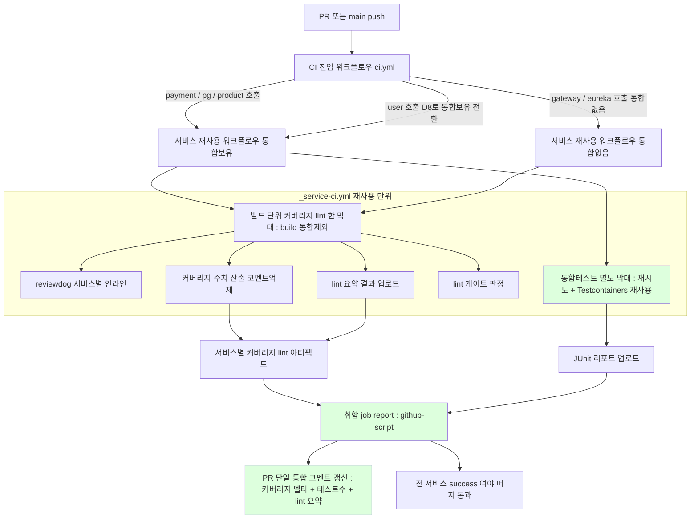

# CI-PIPELINE-REDESIGN — PLAN

> 토픽: [`docs/topics/CI-PIPELINE-REDESIGN.md`](topics/CI-PIPELINE-REDESIGN.md)
> 날짜: 2026-06-08
> 라운드: plan (discuss Round 0 완료 후 최초 plan 초안)

---

## 요약 브리핑

### Task 목록 (7개)

1. **T1 — Groovy 빌드 문법 정정** (tdd=false): 테스트 예외 출력 설정을 옛 공백호출 문법에서 명시 대입 문법으로 정정(루트 + payment/pg/product 통합테스트 블록 4곳). Gradle 9 경고 제거.
2. **T2 — 통합테스트 자동 재시도 도입** (tdd=false): test-retry 플러그인을 통합테스트 보유 서비스(payment/pg/product)에만 적용. 재시도 2회, 같은 묶음 3개 이상 실패 시 재시도 중단(진짜 결함은 안 가림).
3. **T3 — user 사용자조회 유스케이스 단위 테스트** (tdd=true): 현재 0% 커버인 user 조회 유스케이스에 정상조회/미존재예외 단위 테스트 작성. 커버리지 게이트 상향(T5)의 전제.
4. **T4 — user Flyway 운영시드 차단 회귀 가드 + 통합테스트 환경 신설** (tdd=true): docker 프로파일이 운영 seed를 차단함을 검증하는 통합 테스트를 product 동형으로 추가. user에 통합테스트 태스크/Testcontainers 의존이 처음 생기며, 이로써 user가 통합 보유 서비스로 전환.
5. **T5 — 커버리지 게이트 실측 상향** (tdd=false): payment 0.90 / pg 0.93 / product 0.43으로 상향, user는 T3 측정값 기반 상향, gateway/eureka는 측정 라인 0이라 0.0 유지.
6. **T6 — 서비스별 재사용 워크플로우 신설 + lint 신호 재배치** (tdd=false): 서비스 1개 파이프라인(빌드+단위+커버리지+lint 한 막대, 통합만 별도 막대)을 재사용 워크플로우로 추출. 통합 제외 강제, lint 인라인은 서비스별 유지, lint 요약은 취합으로 이관.
7. **T7 — CI 진입 워크플로우 재작성 + 결과 취합 코멘트** (tdd=false): 단일 2막대 CI를 6서비스 독립 파이프라인 fan-out으로 재작성. 결과 취합 job이 6서비스 커버리지/lint를 PR 단일 통합 코멘트로 조립. Discord 알림 제거.

### 변경 후 전체 플로우차트 (CI 동작)



> 통합 보유 = payment / pg / product / user(T4 전환), 통합 없음 = gateway / eureka. 6서비스 호출은 fan-out 병렬 스케줄되어 벽시계 시간은 가장 느린 통합 보유 서비스 수준에 수렴한다. 취합 job은 일부 서비스 실패에도(`always()`) 리포트를 남긴다.

### 핵심 결정 → Task 매핑

| 결정 | 요지 | Task |
|---|---|---|
| D1 | 재사용 워크플로우 fan-out (matrix 기각) | T6, T7 |
| D2 | 서비스당 1막대 + 통합 별도, 통합제외 강제 | T6, T7 |
| D3 | 통합 한정 재시도(2회 / 3실패 중단) + Testcontainers 재사용 | T2, T4 |
| D4 | 커버리지 코멘트 비활성 + 단일 통합 코멘트, lint 요약 취합, Discord 제거 | T6, T7 |
| D5 | 액션 8종 Node 24 최신 상향 | T6, T7 |
| D6 | Groovy 예외포맷 문법 정정 4곳 | T1 |
| D7 | 커버리지 게이트 실측 상향, gateway/eureka 0.0 유지 | T3(전제), T5 |
| D8 | user 운영시드 차단 가드 신설 + 통합보유 전환 | T4, T7 |

### 이연 항목 plan 확정 (5건)

- **P-DEFER-1** 커버리지 코멘트 양립성 → 코멘트 비활성 모드로 수치만 산출, 단일 코멘트는 취합 job 전담 (양립 가능)
- **P-DEFER-2** 재시도 구체값 → maxRetries=2, maxFailures=3
- **P-DEFER-3** 통합제외 강제 → `build -x integrationTest` 명시 + grep 검증
- **P-DEFER-4** lint 스크립트 재배치 → spotbugs 변환 스크립트 경로 유지(호출만 변경), lint 요약은 취합 job 후신으로 이관
- **P-DEFER-5** docker-java.properties → 필요함(product 동형), user에 신규 생성

### 트레이드오프 / 후속

- **매 PR 6서비스 전수 수행** — 변경 감지 미채택. fan-out 병렬로 벽시계는 최저이나 runner 분 사용량 증가(결정성·머지게이트 단순성과 교환).
- **재사용 워크플로우 간접화 1단계** — 디버깅 시 ci.yml + _service-ci.yml 두 파일을 오가야 하나, 서비스 추가/제거가 호출 1줄로 끝나는 이득과 교환.
- **통합 한정 재시도** — 통합 flaky만 흡수, 단위 flaky는 그대로 노출(단위 결정성 우선, 의도).
- **Testcontainers 재사용의 CI 한계** — ephemeral runner라 같은 job 내 다중 클래스 간만 효과. job/서비스 간 재사용 없음.
- **gateway/eureka 0.0 유지** — 측정 대상 클래스 0(라우팅/디스커버리 전용). 향후 로직 추가 시 게이트 재검토.
- **CI 자체 검증은 PR 실증** — 6서비스 독립 막대·단일 코멘트·액션 메이저 bump breaking 부재는 본 작업 PR Actions로 직접 확인. `act` 로컬 실행 미채택.

---

> **[Architect] 경량 검토 총평 (반영 완료)**
> 실행 적신호 1건(T2 플러그인 적용 위치) + 보강 권고 2건(T4 resolutionStrategy, T6 `-x integrationTest` grep-검증) 모두 PLAN.md에 반영됨. lint 스크립트 삭제 중복(T6/T7)도 T6 단독 귀속으로 정리 완료.

---

## 이연 항목 확정 (plan 단계 결론)

discuss 설계 문서가 plan으로 미룬 5개 항목을 아래와 같이 확정한다. 이후 태스크 분해는 이 결론을 기반으로 한다.

### P-DEFER-1 — D4 단일 코멘트 vs jacoco-report 내장 base 비교 양립성

**결론: 양립 가능, 방식 B 채택.**

`_service-ci.yml` 안에서 Madrapps `jacoco-report`를 **코멘트 비활성 모드**로 사용한다. 액션이 산출한 커버리지 수치(changed/total coverage, delta)를 step output 또는 아티팩트로 업로드하고, 단일 코멘트 조립은 취합 job의 `actions/github-script`가 전담한다. 이렇게 하면 서비스별 코멘트 난립(O4 위반)이 구조적으로 불가능하면서 base 델타도 보존된다.

구체적으로: `jacoco-report` 액션의 `update-comment: false`(또는 해당 옵션 미지정 + `pass-emoji`/`fail-emoji` 없이 수치 출력만) + `title: ""` 조합으로 코멘트를 생성하지 않는다. 액션 step output의 `coverage-overall`, `coverage-changed-files` 값을 아티팩트 JSON으로 저장 → 취합 job이 6서비스 JSON을 내려받아 단일 표로 조립.

jacoco-report v1.8 기준으로 `update-comment` 입력이 없으면 코멘트를 달지 않는 것이 기본 동작이므로, 서비스 CI job에서는 `paths` + `token`만 지정해 base 비교 수치를 산출하고 코멘트는 억제한다.

### P-DEFER-2 — D3 maxFailures/maxRetries 구체값

**결론: `maxRetries = 2`, `maxFailures = 3`으로 확정.**

Testcontainers cold-start 타이밍 flaky는 1~2회 재시도로 흡수 가능하다. `maxFailures = 3`은 "같은 suite 안에서 3개 이상의 테스트가 실패하면 재시도 없이 전체 중단"을 의미한다. 3개 초과 실패는 진짜 코드 결함으로 간주해 retry가 결함을 가리지 않도록 한다.

```groovy
// 루트 build.gradle — integrationTest에만 적용
retry {
    maxRetries = 2
    maxFailures = 3
}
```

### P-DEFER-3 — D2 `-x integrationTest` 누락 방지

**결론: build.gradle `check.dependsOn integrationTest` 구조상 `build` 태스크 호출 시 통합테스트까지 끌려온다. CI 워크플로우에서 반드시 `./gradlew :<svc>:build -x integrationTest`로 실행해야 D2 분리가 유지된다.**

`_service-ci.yml`의 `build-test-lint` job 단계에 이 플래그를 명시한다. 완료 기준 체크로 "CI log에서 `integrationTest` task가 실행되지 않았음" 확인을 태스크에 포함한다.

### P-DEFER-4 — lint 스크립트 재배치

**결론:**

- `spotbugs-to-rdjsonl.py`: `.github/scripts/` 경로 유지. `_service-ci.yml` 안의 reviewdog step이 `${{ inputs.service }}`를 인자로 넘겨 서비스별 spotbugs XML을 변환·호출한다. 스크립트 파일 자체 이동은 불필요.
- `lint-summary.js`: 취합 job으로 이관한다. 현행 `ci.yml`의 `Lint summary comment` step에서 이 파일을 `require()`하는 구조를 취합 job의 `actions/github-script` 인라인 스크립트로 대체하거나, 파일을 `.github/scripts/report-comment.js`로 이름을 바꾸고 취합 job에서만 호출한다. 어느 방식이든 서비스별 lint 요약 아티팩트를 내려받아 단일 코멘트로 조립한다.

### P-DEFER-5 — FlywayDockerProfileTest의 `docker-java.properties` 동반 필요 여부

**결론: 필요함. product 동형.**

product `FlywayDockerProfileTest` Javadoc에 명시된 바와 같이 docker-java 기본 API 버전(1.32)이 Docker 최신 버전의 최소 지원(1.40)보다 낮아 `src/test/resources/docker-java.properties`(`api.version=1.44`)가 동반되어야 한다. user-service에도 동일한 파일을 생성한다. `integrationTest` Gradle task에도 `environment 'DOCKER_API_VERSION', '1.44'`를 추가한다(product build.gradle 동형).

---

## 태스크 목록

빌드 인프라 의존 순서: build.gradle 위생 선행 → 테스트/커버리지 기반 마련 → 커버리지 게이트 상향 → 재사용 워크플로우 + 스크립트 재배치 → ci.yml 재작성 + 취합 job.

(반영됨 — Architect 빌드 의존 순서 검토: 전체 순서 정합 확인, T2 플러그인 적용 위치는 T2 본문에 반영 완료)

---

### T1 — Groovy `exceptionFormat` 문법 정정

- **목적**: D6 결정 이행. Gradle setter space-call deprecation 대응. 루트 `build.gradle` test 블록 1곳 + payment/pg/product `build.gradle` `integrationTest` 블록 각 1곳 = 총 4곳을 `exceptionFormat "full"` → `exceptionFormat = 'full'`으로 정정한다.
- `tdd: false`
- `domain_risk: false`
- **산출물**:
  - `build.gradle` (루트) — `test` 블록 1곳
  - `payment-service/build.gradle` — `integrationTest` 블록 1곳
  - `pg-service/build.gradle` — `integrationTest` 블록 1곳
  - `product-service/build.gradle` — `integrationTest` 블록 1곳
- **완료 기준**: `./gradlew test`가 green이고, `grep -r 'exceptionFormat "full"'` 결과가 0건.

---

### T2 — test-retry 플러그인 wiring (통합 한정)

- **목적**: D3 결정 이행. `org.gradle.test-retry` 플러그인을 루트 `build.gradle`에 추가하고, 통합테스트 task(`integrationTest`)를 보유한 서비스(현재 payment/pg/product)의 `integrationTest` 블록에만 retry 설정을 적용한다. P-DEFER-2 확정값(`maxRetries=2`, `maxFailures=3`) 적용.
- `tdd: false`
- `domain_risk: false`
- **플러그인 적용 방식 (실측 기반)**:
  - 루트 `build.gradle` 1~8행의 `plugins {}` 블록에 이미 `java`(apply 없음), `jacoco`, `checkstyle`, `com.github.spotbugs apply false`가 혼재한다. `test-retry`는 **통합테스트 보유 서비스에만 선택적으로 적용**해야 하므로, 루트 `subprojects` 전체 apply는 부적합하다.
  - 채택 방식: **루트 `plugins` 블록에 `id 'org.gradle.test-retry' version '<최신>' apply false`로 버전 잠금**, 실제 apply는 **통합테스트 보유 서비스(payment/pg/product) 각 `build.gradle`의 맨 위 `plugins {}` 블록에 `id 'org.gradle.test-retry'` 한 줄 추가**. 각 서비스의 `integrationTest` task 블록 안에 `retry { maxRetries = 2; maxFailures = 3 }` 배치. user는 T4에서 추가.
- **산출물**:
  - `build.gradle` (루트) — `plugins` 블록에 `id 'org.gradle.test-retry' version '<최신>' apply false` 추가
  - `payment-service/build.gradle` — `plugins {}` 블록에 `id 'org.gradle.test-retry'` 추가 + `integrationTest` 블록에 `retry { maxRetries = 2; maxFailures = 3 }` 추가
  - `pg-service/build.gradle` — 동일
  - `product-service/build.gradle` — 동일
- **완료 기준**:
  - `./gradlew :payment-service:integrationTest`가 green이고 retry extension 설정이 실제로 적용됨(task 실행 로그에서 `test-retry` 플러그인 흔적 확인).
  - 루트 `build.gradle`에 `test-retry` 플러그인 선언이 존재한다.
  - `grep -r 'retry {' payment-service/build.gradle pg-service/build.gradle product-service/build.gradle`가 `integrationTest` 블록 내에만 존재하고 단위 `test` 블록에는 없음을 확인.
  - `grep -r 'retry {' user-service/build.gradle`가 0건(T4 전).
  - **버전 확정 절차**: execute 시작 시 `org.gradle.test-retry` 최신 안정 버전을 Gradle Plugin Portal에서 lookup해 확정하고, 루트 `build.gradle` 선언 옆 주석과 본 PLAN 산출물에 확정 버전을 기록한다. 임의 추정값으로 `<최신>` 플레이스홀더를 치환하지 않는다.
- **주의**: user `integrationTest`는 T4에서 추가하며, retry wiring도 T4에서 함께 수행.

(반영됨 — Architect [실행 적신호] + 경계 검토: 루트 실측으로 subprojects 패턴 확인, 통합 보유 서비스별 plugins {} + integrationTest 블록 apply 방식으로 산출물 명시)

---

### T3 — user-service `UserQueryUseCaseTest` 단위 테스트 작성

- **목적**: D7 결정 이행 전제 조건. 현재 user-service의 유일한 측정 대상 클래스인 `UserQueryUseCase`가 0% 커버 상태다. Mockito 단위 테스트를 test-first로 작성해 커버리지를 확보한다. 이 테스트 통과 후 T5에서 게이트를 상향한다.
- `tdd: true`
- `domain_risk: false`
- **산출물**: `user-service/src/test/java/com/hyoguoo/paymentplatform/user/application/usecase/UserQueryUseCaseTest.java`
- **테스트 클래스 스펙**:
  - 클래스: `UserQueryUseCaseTest`
  - 어노테이션: `@ExtendWith(MockitoExtension.class)`
  - Mock: `UserRepository userRepository` (`@Mock`)
  - SUT: `UserQueryUseCase sut` (`@InjectMocks`)
  - 테스트 메서드:
    - `queryById_whenUserExists_returnsUserQueryResult()` — `userRepository.findById(1L)` stub이 `User` 반환 시 `UserQueryResult`의 필드(id, email, createdAt)가 일치함을 AssertJ로 검증.
    - `queryById_whenUserNotFound_throwsUserNotFoundException()` — `userRepository.findById(1L)` stub이 `Optional.empty()` 반환 시 `UserNotFoundException`이 throw됨을 검증.
- **완료 기준**: `./gradlew :user-service:test`가 green이고 위 2개 테스트 메서드가 PASS. `jacocoTestReport` 후 `UserQueryUseCase` 라인 커버리지가 0% 초과(전체 3라인 커버 목표).

---

### T4 — user-service `FlywayDockerProfileTest` + `integrationTest` 태스크 신규

- **목적**: D8 결정 이행. product `FlywayDockerProfileTest` 동형으로 user-service에 seed 차단 회귀 가드를 추가한다. `@Tag("integration")`이 user-service에 처음 생기므로 `integrationTest` Gradle task + Testcontainers 의존을 함께 추가한다. D1의 `has-integration` 분기에서 user가 `false → true`로 전환된다(ci.yml 재작성 T7에서 반영).
- `tdd: true`
- `domain_risk: false`
- **산출물**:
  - `user-service/src/test/java/com/hyoguoo/paymentplatform/user/infrastructure/FlywayDockerProfileTest.java`
  - `user-service/src/test/resources/docker-java.properties` — `api.version=1.44` (P-DEFER-5 확정)
  - `user-service/build.gradle` — (a) `testcontainersVersion` ext 추가(`1.20.4`, product 동형), (b) Testcontainers BOM + `spring-boot-testcontainers` + `testcontainers:mysql` + `testcontainers:junit-jupiter` + `testcontainers:testcontainers` testImplementation 추가, (c) `configurations.all { resolutionStrategy.eachDependency { ... 'org.testcontainers' → useVersion testcontainersVersion } }` 블록 추가(product 49~56행 동형 — Spring Boot BOM strict 제약 해제, Docker Desktop 호환), (d) `integrationTest` task 신규 (`environment 'DOCKER_API_VERSION', '1.44'` 포함), (e) `check.dependsOn integrationTest` + `integrationTest.mustRunAfter test` 추가, (f) `plugins {}` 블록에 `id 'org.gradle.test-retry'` 추가 + `integrationTest` 블록에 `retry { maxRetries = 2; maxFailures = 3 }` 추가(T2 wiring user 확장).
- **테스트 클래스 스펙**:
  - 클래스: `FlywayDockerProfileTest`
  - 위치: `user-service/src/test/java/com/hyoguoo/paymentplatform/user/infrastructure/`
  - 어노테이션: `@SpringBootTest(webEnvironment = SpringBootTest.WebEnvironment.NONE)`, `@Testcontainers`, `@Tag("integration")`, `@ActiveProfiles("docker")`
  - Container: `static MySQLContainer<?> mysql = new MySQLContainer<>("mysql:8.0").withCommand("--character-set-server=utf8mb4", "--collation-server=utf8mb4_unicode_ci")`
  - `@DynamicPropertySource`: datasource URL/username/password, flyway URL/user/password, `spring.kafka.bootstrap-servers=localhost:9092`, `spring.kafka.listener.auto-startup=false`, `eureka.client.enabled=false`, `eureka.client.register-with-eureka=false`, `eureka.client.fetch-registry=false`
  - `@Autowired DataSource dataSource`
  - 테스트 메서드:
    - `dockerProfile_doesNotApplySeedMigration()` — (1) `flyway_schema_history` row count = 1 (V1 only), (2) `user` 테이블 row count = 0. product 동형.
- **완료 기준**: `./gradlew :user-service:integrationTest`가 green이고 `FlywayDockerProfileTest` 1건 PASS. `./gradlew :user-service:test`도 회귀 없음.

(반영됨 — Architect 모듈 변경 국소성 검토: product 49~56행 resolutionStrategy.eachDependency 블록을 실측 확인, user build.gradle 산출물 (c)로 명시 추가 완료)

---

### T5 — 커버리지 게이트 실측 기반 상향

- **목적**: D7 결정 이행. payment/pg/product는 실측값 기반으로 상향하고, user는 T3 작성 후 `jacocoTestReport` 재측정값 기반으로 상향한다.
- `tdd: false`
- `domain_risk: false`
- **산출물**:
  - `payment-service/build.gradle` — `jacoco.lineCoverageMinimum` `0.89 → 0.90`
  - `pg-service/build.gradle` — `jacoco.lineCoverageMinimum` `0.91 → 0.93`
  - `product-service/build.gradle` — `jacoco.lineCoverageMinimum` `0.40 → 0.43`
  - `user-service/build.gradle` — `jacoco.lineCoverageMinimum` `0.0 → <T3 후 확정값>` (결정 규칙: `floor((T3 후 jacocoTestReport 재측정 LINE 커버리지 - 0.03) * 100) / 100`, 단 측정값이 0.03 미만이면 0.0 유지. payment/pg/product 안전마진 ~3%p 기준 일관)
- **완료 기준**: `./gradlew :payment-service:jacocoTestCoverageVerification :pg-service:jacocoTestCoverageVerification :product-service:jacocoTestCoverageVerification :user-service:jacocoTestCoverageVerification`가 전부 green. gateway/eureka는 변경 없음(`0.0` 유지).
- **실측 확정 주의**: payment 목표값(0.90)은 현행 주석(92.87%)과 PLAN 표기(92.93%) 간 수치 혼선이 있다. execute에서 `./gradlew :payment-service:jacocoTestReport` 재측정으로 실측값을 확정한 뒤 적용한다. 게이트(0.90)는 두 값 모두 충족하므로 목표 수치 자체는 변경 없음.
- **선행 조건**: T3(user 단위 테스트) 완료 필수.

---

### T6 — `_service-ci.yml` 재사용 워크플로우 신규 작성 + lint 스크립트 재배치

- **목적**: D1/D2/D3/D4/D5 결정 이행. `_service-ci.yml`을 신규 생성하고 P-DEFER-1~5 확정 사항을 반영한다. `build-test-lint` job(항상)과 `integration-test` job(`has-integration == true`일 때만)으로 구성한다. lint 스크립트 재배치도 이 태스크에서 수행한다.
- `tdd: false`
- `domain_risk: false`
- **산출물**:
  - `.github/workflows/_service-ci.yml` (신규) — 구조:
    - `on.workflow_call.inputs`: `service` (string, required), `has-integration` (boolean, required)
    - `permissions`: contents: read, pull-requests: write, checks: write
    - job `build-test-lint`: checkout@v6 → setup-java@v5 → setup-gradle@v6 → `./gradlew :<svc>:build -x integrationTest`(P-DEFER-3 강제) → reviewdog/action-setup@v1.5 → Checkstyle reviewdog 인라인 → SpotBugs `spotbugs-to-rdjsonl.py` 호출 + reviewdog 인라인 → jacoco-report@v1.8(코멘트 비활성, P-DEFER-1 방식 B) → JaCoCo 커버리지 수치 아티팩트 업로드(JSON) → lint 요약 결과 아티팩트 업로드 → lint gate
    - job `integration-test` (`if: inputs.has-integration`): checkout@v6 → setup-java@v5 → setup-gradle@v6 → `./gradlew :<svc>:integrationTest`(env: `TESTCONTAINERS_REUSE_ENABLE=true`, `DOCKER_API_VERSION=1.44`) → junit-report@v6 업로드
    - 액션 버전: D5 버전표 전부 적용(checkout v6, setup-java v5, upload-artifact v7, setup-gradle v6, junit-report v6, jacoco-report v1.8, github-script v9, reviewdog-setup v1.5)
  - `.github/scripts/report-comment.js` (신규 또는 `lint-summary.js` 대체) — 취합 job에서 6서비스 커버리지 + lint 요약을 단일 PR 코멘트로 조립하는 스크립트. `lint-summary.js`의 후신.
  - `.github/scripts/lint-summary.js` → 역할 이관 후 삭제(또는 내용 비워 취합 job 참조로 전환)
- **완료 기준**:
  - 파일 `.github/workflows/_service-ci.yml` 존재. `yamllint` 또는 `actionlint` 문법 오류 없음(로컬 lint 도구 있을 경우).
  - `grep '\\-x integrationTest' .github/workflows/_service-ci.yml` 결과가 1건 이상 — `build-test-lint` job에 `-x integrationTest` 플래그가 실제로 존재함을 grep으로 확인(D2 강제 장치 검증).
  - `lint-summary.js`의 역할이 `report-comment.js`로 이관됐고, `lint-summary.js` 파일이 삭제됨(T7에서 중복 선언 제거 — 삭제 책임은 T6 단독).
- **주의**: CI 실제 동작(6서비스 독립 막대, 단일 코멘트 렌더)은 T7 PR Actions 실행으로 실증.

(반영됨 — Architect 재사용 워크플로우 경계 검토, D2 강제 장치 확인, lint 스크립트 재배치 위치 검토: 완료 기준에 grep-검증 항목 추가, lint-summary.js 삭제 책임 T6 단독 귀속 명시)

---

### T7 — `ci.yml` 재작성 + 취합 `report` job

- **목적**: D1/D2/D4/D5 결정 이행. 기존 단일 2-job `ci.yml`을 6서비스 fan-out + 취합 구조로 재작성한다. 취합 job은 6서비스 아티팩트를 수집해 단일 PR 코멘트를 조립한다. D8로 user `has-integration`이 `true`로 전환된다.
- `tdd: false`
- `domain_risk: false`
- **산출물**:
  - `.github/workflows/ci.yml` (재작성) — 구조:
    - 6서비스 job (`payment`, `pg`, `product`, `user`, `gateway`, `eureka`): 각각 `uses: ./.github/workflows/_service-ci.yml` + `with: { service: <모듈명>, has-integration: <bool> }` + `secrets: inherit`. user는 `has-integration: true`(D8).
    - `report` job: `needs: [payment, pg, product, user, gateway, eureka]` + `if: always() && github.event_name == 'pull_request'` → upload-artifact@v7로 업로드된 6서비스 커버리지/lint 아티팩트 다운로드 → github-script@v9로 단일 PR 코멘트 조립/갱신(`update-comment` 패턴으로 중복 코멘트 방지)
    - Discord 알림 step 없음(D4 제거).
  - (lint-summary.js 삭제는 T6에서 수행. T7에서 재작업 불필요)
- **완료 기준**: `.github/workflows/ci.yml` 재작성 완료. `grep -c 'workflow_call\|uses:' .github/workflows/ci.yml`로 6서비스 호출 확인. Discord 관련 step이 ci.yml에 없음.
- **실증**: 이 태스크를 포함한 PR을 GitHub에 올리면 Actions에서 6서비스 독립 막대, `report` job 단일 PR 코멘트, 액션 메이저 bump breaking 부재를 직접 확인한다. `act` 로컬 실행 미채택.
- **선행 조건**: T6(`_service-ci.yml` 신규) 완료 필수.

(반영됨 — Architect 취합 job 경계 검토: service 입력값과 settings.gradle 모듈명 대조 확인을 T7 PR Actions 실증 항목에 포함)

---

## 추적 테이블 — 설계 결정 → 태스크 매핑

| 결정 ID | 내용 요약 | 매핑 태스크 |
|---|---|---|
| D1 | fan-out = `_service-ci.yml` 재사용 워크플로우, matrix 기각 | T6, T7 |
| D2 | 서비스당 1 job(빌드+단위+커버리지+lint) + 통합 별도 job, `-x integrationTest` 강제 | T6, T7 |
| D3 | test-retry 통합 한정 + Testcontainers reuse + setup-gradle 기본 캐싱. maxRetries=2, maxFailures=3 확정 | T2, T4 |
| D4 | jacoco-report 코멘트 비활성 + 단일 통합 코멘트(github-script), lint 요약 취합, reviewdog 인라인 유지, Discord 제거 | T6, T7 |
| D5 | 액션 8종 Node 24 최신 버전 일괄 상향 | T6, T7 |
| D6 | Groovy `exceptionFormat "full"` → `= 'full'` 4곳 | T1 |
| D7 | 커버리지 게이트 실측 기반 상향(payment/pg/product/user), gateway/eureka 0.0 유지 | T3(user 전제), T5 |
| D8 | user `FlywayDockerProfileTest` 신규 + user has-integration false→true 전환 | T4, T7 |

모든 결정 D1~D8이 최소 하나 이상의 태스크에 매핑됨. 고아 결정 없음.

---

## 리스크 → 태스크 교차 참조

discuss Round 0 ledger에서 식별된 항목 중 plan 확인 대상과 해소 태스크를 추적한다.

| 리스크/항목 | 출처 | 해소 태스크 | 해소 방식 |
|---|---|---|---|
| D4 단일 코멘트 vs jacoco-report 내장 base 비교 양립성 | D4, 적신호 | T6 | P-DEFER-1: 코멘트 비활성 모드로 수치 산출만, 취합 job github-script 단일 코멘트 전담 |
| D3 maxFailures/maxRetries 구체값 미확정 | D3 | T2, T4 | P-DEFER-2: maxRetries=2, maxFailures=3 확정 |
| D2 `-x integrationTest` 누락 시 단위 job이 통합 끌어옴 | D2 주의 | T6 | P-DEFER-3: `_service-ci.yml` `build-test-lint` job에 `-x integrationTest` 명시 강제 |
| lint 스크립트 재배치 방향 미확정 | D4 | T6, T7 | P-DEFER-4: `spotbugs-to-rdjsonl.py` 경로 유지(호출 방식만 변경), `lint-summary.js` → `report-comment.js` 취합 job 전담 |
| `docker-java.properties` 동반 필요 여부 | D8 | T4 | P-DEFER-5: 필요함, product 동형. `user-service/src/test/resources/docker-java.properties` 신규 생성 |
| user 커버리지 0% 상태에서 게이트 상향 불가 | D7, 적신호 1 RESOLVED | T3, T5 | T3에서 `UserQueryUseCaseTest` 작성 → T5에서 실측 기반 상향 |
| user has-integration false로 통합 job 미생성 | D8 | T4, T7 | T4에서 `integrationTest` task 추가 → T7에서 has-integration=true 반영 |
| 액션 메이저 bump breaking change 가능성 | D5 | T6, T7 | PR Actions 실행으로 실증. `act` 미채택 명시 |
| Testcontainers reuse CI 한계 | D3 | T6 | 문서화: ephemeral runner에서 job 내 다중 클래스 간만 효과, job 간/서비스 간 재사용 없음 |

---

## 검증 전략

1. **로컬 단위 회귀**: T1~T5 각 태스크 완료 후 `./gradlew test`(단위)로 회귀 없음 확인. T4 완료 후 `./gradlew :user-service:integrationTest`로 FlywayDockerProfileTest 통과 확인.
2. **커버리지 게이트 검증**: T5 완료 후 `./gradlew :payment-service:jacocoTestCoverageVerification :pg-service:jacocoTestCoverageVerification :product-service:jacocoTestCoverageVerification :user-service:jacocoTestCoverageVerification`로 전부 green 확인.
3. **D6 동작 동일성**: T1 완료 후 `./gradlew test` 출력 포맷이 이전과 동일함 확인(Groovy 문법 변경만, 동작 불변).
4. **CI 실증**: T7 포함 PR을 GitHub에 올려 Actions에서 (a) 6서비스 독립 막대, (b) 통합 job 분기(user/gateway/eureka 유무), (c) `report` job 단일 PR 코멘트, (d) 액션 메이저 bump breaking 부재를 직접 확인한다. `act` 로컬 실행 미채택.
5. **비범위 침범 없음**: 변경감지/build cache/전모듈 retry/Discord 관련 변경이 없음을 git diff로 확인.

---

## 반환 요약

- 태스크 총 개수: **7**
- domain_risk=true 태스크 개수: **0** (전 태스크 `domain_risk: false` — 이 토픽은 CI/빌드 인프라 한정, 결제 도메인 리스크 ≈ 0)
- topic.md 결정 중 태스크로 매핑하지 못한 항목: **없음** (D1~D8 전부 매핑 완료)
