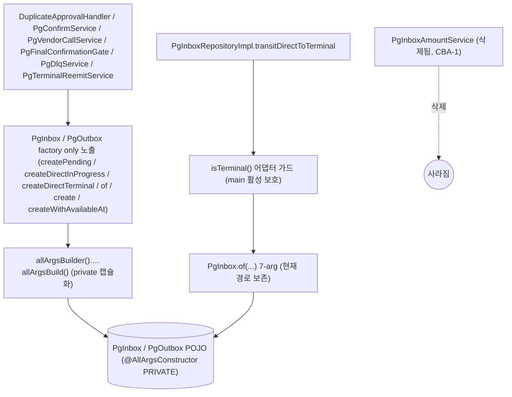
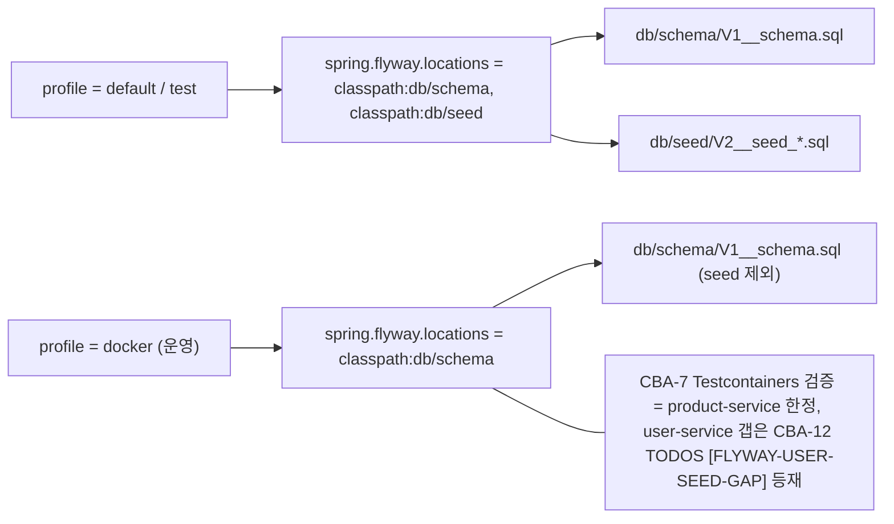
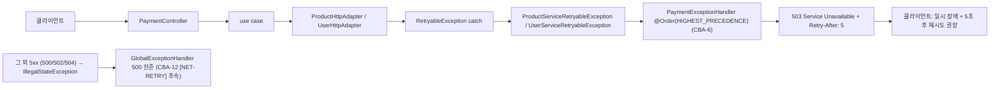

# CLEANUP-BATCH-A — 실행 계획

> 토픽: [docs/topics/CLEANUP-BATCH-A.md](topics/CLEANUP-BATCH-A.md)
> 날짜: 2026-05-11
> 라운드: discuss Round 2 종결 (critic-2 + domain-2 pass) → plan Round 2 (critic-1 + domain-1 흡수)

---

## 요약 브리핑

코드 청소 부채 4건 (TC-16 dead service 제거 / TC-2 Flyway seed 환경 분리 / TC-5 Retryable 예외 503 매핑 / TC-10 builder 패턴 통일) 을 단일 PR 사이클로 처리한다. 4 sub-section 간 cross 의존 0 — 병렬 구현 가능하나 영향 작은 것 먼저 (§1.1 → §1.3 → §1.4 → §1.2) 를 권고 순서로 채택한다.

### plan 단계 사전 확인 결과 (D4 흡수)

- `docker/docker-compose.infra.yml` 의 `mysql-product-data:` / `mysql-user-data:` 볼륨 정의 — `driver: local` 만 명시, `external: true` 없음. `docker-compose down` 만으로 볼륨이 살아남아 **named volume 재사용 시나리오가 실제 발생 가능** → STACK.md 운영 가이드 3-step 가이드 필수 (CBA-10 에서 처리).
- `docker/docker-compose.apps.yml` — 4 비즈니스 서비스 모두 `SPRING_PROFILES_ACTIVE: docker` 명시 → `application-docker.yml` 의 `spring.flyway.locations` override 가 실제 운영에서 활성 확인됨.
- `spring.flyway.ignore-migration-patterns` default: Flyway 기본값은 `*:future` 만 ignore, `*:missing` 은 **fail** → `docker volume prune` 또는 `DELETE FROM flyway_schema_history WHERE version='2'` 선행 없이는 V2 적용 이력 볼륨에서 부팅 실패 확정.
- `§1.3 Testcontainers 검증 방식` — plan 단계 확인으로 Testcontainers 1건 채택 (CBA-7 에서 처리). `@ActiveProfiles("docker")` + `DynamicPropertySource` 패턴으로 docker profile 비용 저비용 검증 가능.

### 태스크 목록 (12개)

| ID | 제목 | sub-section | tdd | domain_risk |
|---|---|---|---|---|
| CBA-1 | PgInboxAmountService + 단독 테스트 2 파일 삭제 | §1.1 | false | false |
| CBA-2 | product-service SQL 파일 이동 (migration → schema/seed) | §1.3 | false | false |
| CBA-3 | user-service SQL 파일 이동 (migration → schema/seed) | §1.3 | false | false |
| CBA-4 | product-service application.yml + application-docker.yml Flyway locations 수정 | §1.3 | false | false |
| CBA-5 | user-service application.yml + application-docker.yml Flyway locations 수정 | §1.3 | false | false |
| CBA-6 | PaymentExceptionHandler 핸들러 2건 추가 (tdd: RED) | §1.4 | true | true |
| CBA-7 | FlywayDockerProfileTest — Testcontainers docker profile seed 차단 검증 | §1.3 | true | false |
| CBA-8 | PgInbox 도메인 builder 전환 + factory 본문 갈아끼움 (tdd: RED) | §1.2 | true | true |
| CBA-9 | PgOutbox 도메인 builder 전환 + id dead parameter 제거 (tdd: RED) | §1.2 | true | true |
| CBA-10 | STACK.md Flyway 운영 가이드 갱신 (D4 흡수) | §1.3 | false | false |
| CBA-11 | CONVENTIONS.md Lombok/Builder 룰 pg-service 정합 표기 | §1.2 | false | false |
| CBA-12 | TODOS.md 갱신 — [PR A] 4항목 제거 + D3 후속 등재 (Feign ErrorDecoder 429/503) | cross | false | false |

### 변경 후 전체 플로우차트 (Mermaid)

#### §1.1 + §1.2 — pg-service 도메인 청소 후



#### §1.3 — Flyway profile 별 location



#### §1.4 — Retryable 예외 응답 흐름



### 핵심 결정 → Task 매핑

| 결정 (topic §) | 대응 Task |
|---|---|
| §1.1 dead service 제거 | CBA-1 (+ context 문서 정정 CONFIRM-FLOW / PAYMENT-FLOW) |
| §1.2 Lombok builder 통일 (factory only) | CBA-8 (PgInbox) + CBA-9 (PgOutbox + dead id 제거) + CBA-11 (CONVENTIONS) |
| §1.3 Flyway db/schema + db/seed 분리 | CBA-2 + CBA-3 (파일 이동) + CBA-4 + CBA-5 (yml override) + CBA-7 (검증) + CBA-10 (운영 가이드) |
| §1.4 503 + Retry-After: 5 일괄 | CBA-6 (핸들러 + 통합 테스트) |
| TODOS 정리 + 후속 등재 | CBA-12 ([PR A] 4건 제거 + [NET-RETRY] + [FLYWAY-USER-SEED-GAP] 등재) |
| discuss D1 (어댑터 가드 surface 정정) | CBA-8 (acceptance 에 `PgInboxRepositoryImplTest` 명시) |
| discuss D2 (PgInbox.create 호출처 0건) | CBA-8 JavaDoc 명시 |
| discuss D3 (429 시그널 손실 후속) | CBA-12 [NET-RETRY] |
| discuss D4 (missing-migration 가시화) | CBA-7 + CBA-10 (STACK.md 3-step) |
| plan D5 (PAYMENT-FLOW.md dangling) | CBA-1 acceptance grep 확장 |

### 트레이드오프 / 후속 작업

- **CBA-2 / CBA-4 commit 묶음** — product (CBA-2+4), user (CBA-3+5) 단일 커밋으로 묶어 중간 빌드 깨짐 회피. 태스크 단위 별도 commit 금지
- **CBA-7 user-service 갭** — Testcontainers 검증은 product-service 1건만. user-service 회귀 보호 없음 → CBA-12 [FLYWAY-USER-SEED-GAP] 등재
- **429 시그널 정보 손실** — 503 일괄로 클라이언트엔 "재시도 가능" 만 전달, 429 분기 복원은 별 토픽
- **`Retry-After` 고정값 5초** — vendor 가 준 값 전파 / jitter 적용은 별 토픽
- **builder 외부 노출 룰 컴파일러 강제 불가** — JavaDoc + code review 만. ArchUnit 룰 별 토픽

---

## 메타

| 항목 | 값 |
|---|---|
| 태스크 총 개수 | 12 |
| domain_risk 태스크 | 3 (CBA-6 / CBA-8 / CBA-9) |
| tdd=true 태스크 | 4 (CBA-6 / CBA-7 / CBA-8 / CBA-9) |
| 권고 구현 순서 | CBA-1 → (CBA-2+CBA-4) → (CBA-3+CBA-5) → CBA-7 → CBA-6 → CBA-8 → CBA-9 → CBA-10 → CBA-11 → CBA-12 |
| cross 의존 | 0 (sub-section 내부만) |
| **commit 묶음 정책** | CBA-2+CBA-4 (product-service SQL 이동+yml 수정) 은 단일 커밋. CBA-3+CBA-5 (user-service SQL 이동+yml 수정) 은 단일 커밋. 이 두 묶음 사이에 git push / CI run 끼지 않음. CBA-2 단독 커밋 금지 — 빈 `db/migration` 을 가리키는 yml 중간 상태에서 product-service 빌드가 깨짐. (F1·F2 흡수) |

---

## 태스크 목록

---

### CBA-1 — PgInboxAmountService + 단독 테스트 2 파일 삭제 ✅

> **완료** (2026-05-11): PgInboxAmountService 본체 + PgInboxAmountStorageTest (4건) 삭제. CONFIRM-FLOW.md §7/§13 + PAYMENT-FLOW.md dangling reference 정정. pg-service 290 PASS / 0 FAIL.

**목적**: §1.1 (TC-16) — main 호출처 0건이 확인된 dead service 본체와 단독 테스트를 컴파일 단위에서 완전 제거한다.

**tdd**: false
**domain_risk**: false
**dependencies**: 없음

**산출물 (삭제)**:
- `pg-service/src/main/java/com/hyoguoo/paymentplatform/pg/application/service/PgInboxAmountService.java`
- `pg-service/src/test/java/com/hyoguoo/paymentplatform/pg/application/service/PgInboxAmountStorageTest.java`

**산출물 (docs 정정 — D1 흡수)**:
- `docs/context/CONFIRM-FLOW.md` §7 (line 254) 및 §13 (line 430) 의 `PgInboxAmountService` 참조를 실제 1단 방어 주체로 교체한다.
  - 정정 전: "pg 측 방어 (1단): `PgInboxAmountService` / `AmountConverter.fromBigDecimalStrict` — scale·음수 검증"
  - 정정 후: "pg 측 방어 (1단): `AmountConverter.fromBigDecimalStrict` — scale·음수 검증 (`PgInboxRepositoryImpl.insertPending` 경로 + `DuplicateApprovalHandler.amountMismatch` 경로). `PgInboxAmountService` 는 TC-16 에서 dead service 로 확인돼 삭제됨."
  - §13 amount_mismatch 행: `PgInboxAmountService (pg)` → `AmountConverter.fromBigDecimalStrict (pg — insertPending 경로)` 로 교체.
- `docs/context/PAYMENT-FLOW.md` 컴포넌트 인벤토리 표의 `PgInboxAmountService` 참조 행을 삭제하거나 실제 방어 주체로 교체한다 (D5 흡수).

**acceptance**: `grep -r "PgInboxAmountService" pg-service/src/main` 결과 0건 + `grep "PgInboxAmountService" docs/context/{CONFIRM-FLOW,PAYMENT-FLOW}.md` 결과 0건 + `./gradlew :pg-service:test` PASS

---

<!-- Round 2 흡수 결정 (F1·F2): CBA-2 + CBA-4 는 단일 커밋으로 묶는다. CBA-2 단독 커밋 금지 — 빈 db/migration 을 가리키는 yml 중간 상태에서 product-service 빌드 깨짐. 메타 commit 묶음 정책 항목에 동일 룰 명시. -->

### CBA-2 — product-service SQL 파일 이동 (db/migration → db/schema + db/seed)

**목적**: §1.3 (TC-2) — product-service 의 Flyway SQL 파일을 `db/migration/` 에서 `db/schema/` 와 `db/seed/` 로 물리 분리한다. 기존 `db/migration/` 디렉토리는 삭제한다.

**tdd**: false
**domain_risk**: false
**dependencies**: 없음

**산출물 (파일 이동)**:
- `product-service/src/main/resources/db/migration/V1__product_schema.sql` → `product-service/src/main/resources/db/schema/V1__product_schema.sql`
- `product-service/src/main/resources/db/migration/V2__seed_product_stock.sql` → `product-service/src/main/resources/db/seed/V2__seed_product_stock.sql`
- `product-service/src/main/resources/db/migration/` 디렉토리 삭제

**acceptance**: `ls product-service/src/main/resources/db/schema/ db/seed/` — 각 1건씩 배치 확인. `:product-service:test` PASS 는 CBA-4 acceptance 에 일임. CBA-2 단독으로 `:product-service:test` 를 실행하지 않는다 — CBA-4 와 단일 커밋으로 묶음 (메타 commit 묶음 정책 참조).

---

### CBA-3 — user-service SQL 파일 이동 (db/migration → db/schema + db/seed)

**목적**: §1.3 (TC-2) — user-service 의 Flyway SQL 파일을 `db/schema/` + `db/seed/` 로 물리 분리한다.

**tdd**: false
**domain_risk**: false
**dependencies**: 없음

**산출물 (파일 이동)**:
- `user-service/src/main/resources/db/migration/V1__user_schema.sql` → `user-service/src/main/resources/db/schema/V1__user_schema.sql`
- `user-service/src/main/resources/db/migration/V2__seed_user.sql` → `user-service/src/main/resources/db/seed/V2__seed_user.sql`
- `user-service/src/main/resources/db/migration/` 디렉토리 삭제

**acceptance**: `ls user-service/src/main/resources/db/schema/ db/seed/` — 각 1건씩 배치 확인. `:user-service:test` PASS 는 CBA-5 acceptance 에 일임. CBA-3 단독으로 `:user-service:test` 를 실행하지 않는다 — CBA-5 와 단일 커밋으로 묶음 (메타 commit 묶음 정책 참조).

---

### CBA-4 — product-service application.yml + application-docker.yml Flyway locations 수정

**목적**: §1.3 (TC-2) — default profile 은 schema + seed 둘 다 적용, docker profile 은 schema 만 적용하도록 `spring.flyway.locations` 를 설정한다.

**tdd**: false
**domain_risk**: false
**dependencies**: CBA-2 (SQL 파일이 새 디렉토리에 있어야 함)

**산출물 (수정)**:
- `product-service/src/main/resources/application.yml` — `spring.flyway.locations` 값을 `classpath:db/migration` 에서 `classpath:db/schema,classpath:db/seed` 로 변경
- `product-service/src/main/resources/application-docker.yml` — `spring.flyway.locations: classpath:db/schema` 추가

**acceptance**: `./gradlew :product-service:test` PASS (기존 테스트가 V2 seed 기반 fixture 포함해 통과)

---

### CBA-5 — user-service application.yml + application-docker.yml Flyway locations 수정

**목적**: §1.3 (TC-2) — user-service 의 Flyway locations 를 product-service 와 동일 패턴으로 설정한다.

**tdd**: false
**domain_risk**: false
**dependencies**: CBA-3 (SQL 파일이 새 디렉토리에 있어야 함)

**산출물 (수정)**:
- `user-service/src/main/resources/application.yml` — `spring.flyway.locations` 값을 `classpath:db/migration` 에서 `classpath:db/schema,classpath:db/seed` 로 변경
- `user-service/src/main/resources/application-docker.yml` — `spring.flyway.locations: classpath:db/schema` 추가

**acceptance**: `./gradlew :user-service:test` PASS

---

### CBA-6 — PaymentExceptionHandler 핸들러 2건 추가

**목적**: §1.4 (TC-5) — `ProductServiceRetryableException` / `UserServiceRetryableException` 두 예외를 `503 Service Unavailable + Retry-After: 5` 로 매핑하는 핸들러를 `PaymentExceptionHandler` 에 추가한다. `GlobalExceptionHandler.catchRuntimeException` fallback 으로 500 을 반환하던 경로를 차단.

**tdd**: true
**domain_risk**: true (503 응답 코드 + `Retry-After` 헤더 — 클라이언트 재시도 정책 직결)
**dependencies**: 없음

**테스트 클래스**: `PaymentExceptionHandlerTest`

| 테스트 메서드 | 검증 내용 |
|---|---|
| `handleProductServiceRetryable_returns503WithRetryAfter` | `ProductServiceRetryableException` throw 시 status 503 + `Retry-After: 5` 헤더 + body `code = E03031` |
| `handleUserServiceRetryable_returns503WithRetryAfter` | `UserServiceRetryableException` throw 시 status 503 + `Retry-After: 5` 헤더 + body `code = E03032` |

**테스트 패턴**: `@WebMvcTest` + `MockMvc` — `@TestController` (테스트 전용 stub) 가 두 예외를 각각 throw, MockMvc 로 status / header / body 검증. 기존 `PaymentControllerMvcTest` 구조 참조.

**산출물 (수정)**:
- `payment-service/src/main/java/com/hyoguoo/paymentplatform/payment/exception/common/PaymentExceptionHandler.java` — 핸들러 2개 추가:

```java
@ExceptionHandler(ProductServiceRetryableException.class)
public ResponseEntity<ErrorResponse> handleProductServiceRetryable(ProductServiceRetryableException e) {
    LogFmt.warn(log, LogDomain.PAYMENT, EventType.EXCEPTION, e::getMessage);
    return ResponseEntity.status(HttpStatus.SERVICE_UNAVAILABLE)
            .header(HttpHeaders.RETRY_AFTER, "5")
            .body(ErrorResponse.of(e.getCode(), e.getMessage()));
}

@ExceptionHandler(UserServiceRetryableException.class)
public ResponseEntity<ErrorResponse> handleUserServiceRetryable(UserServiceRetryableException e) {
    LogFmt.warn(log, LogDomain.PAYMENT, EventType.EXCEPTION, e::getMessage);
    return ResponseEntity.status(HttpStatus.SERVICE_UNAVAILABLE)
            .header(HttpHeaders.RETRY_AFTER, "5")
            .body(ErrorResponse.of(e.getCode(), e.getMessage()));
}
```

- `payment-service/src/test/java/com/hyoguoo/paymentplatform/payment/exception/common/PaymentExceptionHandlerTest.java` (신규)

**acceptance**: 신규 테스트 2건 PASS + `./gradlew :payment-service:test` PASS (기존 358 PASS 회귀 0)

---

### CBA-7 — FlywayDockerProfileTest — Testcontainers docker profile seed 차단 검증

**목적**: §1.3 (TC-2) — `application-docker.yml` 의 `spring.flyway.locations: classpath:db/schema` override 가 실제 docker profile 활성 시 V2 seed 를 차단하는지 Testcontainers 통합 테스트로 검증한다.

**tdd**: true
**domain_risk**: false
**dependencies**: CBA-2, CBA-4 (product-service 기준. user-service 는 CBA-3 + CBA-5)

**테스트 클래스**: `product-service` 의 `FlywayDockerProfileTest` (product-service 1건 한정 — Round 2 흡수 결정 F1·F4 참조)

| 테스트 메서드 | 검증 내용 |
|---|---|
| `dockerProfile_doesNotApplySeedMigration` | `@ActiveProfiles("docker")` + Testcontainers MySQL 부팅 후 `SELECT COUNT(*) FROM product` = 0 (V2 seed row 없음) |

**테스트 패턴**:

```java
@SpringBootTest
@Testcontainers
@Tag("integration")
@ActiveProfiles("docker")
class FlywayDockerProfileTest {

    @Container
    static MySQLContainer<?> mysql = new MySQLContainer<>("mysql:8.0");

    @DynamicPropertySource
    static void registerProps(DynamicPropertyRegistry registry) {
        registry.add("spring.datasource.url", mysql::getJdbcUrl);
        registry.add("spring.datasource.username", mysql::getUsername);
        registry.add("spring.datasource.password", mysql::getPassword);
        registry.add("spring.flyway.url", mysql::getJdbcUrl);
        registry.add("spring.flyway.user", mysql::getUsername);
        registry.add("spring.flyway.password", mysql::getPassword);
    }

    @Autowired
    private DataSource dataSource;

    @Test
    void dockerProfile_doesNotApplySeedMigration() throws Exception {
        // docker profile 에서는 db/schema 만 적용 → product 테이블은 존재하지만 row 가 0
        try (Connection conn = dataSource.getConnection();
             PreparedStatement ps = conn.prepareStatement("SELECT COUNT(*) FROM product")) {
            ResultSet rs = ps.executeQuery();
            rs.next();
            int count = rs.getInt(1);
            assertThat(count).isZero();
        }
    }
}
```

**산출물**:
- `product-service/src/test/java/com/hyoguoo/paymentplatform/product/infrastructure/FlywayDockerProfileTest.java` (신규 — Round 2 흡수 결정 F3: Testcontainers + DataSource 직접 사용은 infrastructure layer 관심사. 기존 product-service test 트리 `application/ infrastructure/ mock/` 레이어 분류와 일관성 유지를 위해 `infrastructure/` 하위 배치)

> **Round 2 흡수 결정 (F1·F4)**: CBA-7 은 product-service 1건 한정. user-service `application-docker.yml` override 가 회귀 무방어인 갭은 본 PR 의도적 허용 — 토픽 §5 acceptance 의 1건 채택 결정과 정합. user-service 동등 테스트는 추가하지 않는다. 대신 이 갭을 CBA-12 TODOS.md 신규 항목에 명시해 시야에서 사라지지 않도록 처리한다.

**acceptance**: `FlywayDockerProfileTest#dockerProfile_doesNotApplySeedMigration` PASS

---

### CBA-8 — PgInbox 도메인 builder 전환 + factory 본문 갈아끼움

**목적**: §1.2 (TC-10) — `PgInbox` 에 `@Builder(builderMethodName="allArgsBuilder", buildMethodName="allArgsBuild") + @AllArgsConstructor(access = AccessLevel.PRIVATE)` 를 적용하고 factory 본문을 builder 호출로 교체한다. `private` 생성자 본체는 Lombok 이 대체. factory 시그니처 / 가드 / 시나리오 의도는 그대로 보존. 어댑터 가드 (`PgInboxRepositoryImpl.transitDirectToTerminal:150`) 는 비범위 — 손대지 않는다.

**tdd**: true
**domain_risk**: true (결제 상태 전이 — `createDirectInProgress` / `of` / `ofWithId` 가 main 활성 보정 경로에서 직접 사용됨. D1 흡수: 도메인 factory 가드 `createDirectTerminal` 의 `isTerminal()` 은 test 픽스처 이중화 목적 — main 보호는 어댑터 가드가 담당)
**dependencies**: 없음

**테스트 클래스**: 기존 `PgInboxTest` (회귀 cover) + 필요 시 가드 메서드 신규 케이스

| 테스트 메서드 | 검증 내용 |
|---|---|
| `create_withPaymentKeyAndVendorType_startsPending` | `PgInbox.create(orderId, amount, paymentKey, vendorType)` → status == PENDING, paymentKey / vendorType 세팅 |
| `create_withoutPaymentKey_startsPending` | `PgInbox.create(orderId, amount)` → status == PENDING, paymentKey / vendorType == null |
| `createDirectInProgress_statusIsInProgress` | `createDirectInProgress(orderId, amount)` → status == IN_PROGRESS, paymentKey / vendorType == null |
| `createDirectTerminal_approvedStatus_succeeds` | `createDirectTerminal(orderId, amount, APPROVED, result)` → status == APPROVED |
| `createDirectTerminal_nonTerminalStatus_throwsIllegalArgument` | `createDirectTerminal(orderId, amount, PENDING, result)` → `IllegalArgumentException` (가드 보존 검증) |
| `of_sevenArg_constructsCorrectly` | `of(orderId, status, amount, result, reasonCode, createdAt, updatedAt)` → 모든 필드 정확 매핑 |
| `ofWithId_includesId` | `ofWithId(id, ...)` → `getId()` == id |

**산출물 (수정)**:
- `pg-service/src/main/java/com/hyoguoo/paymentplatform/pg/domain/PgInbox.java`
  - 클래스 상단: `@Getter @Builder(builderMethodName = "allArgsBuilder", buildMethodName = "allArgsBuild") @AllArgsConstructor(access = AccessLevel.PRIVATE)` 추가
  - 명시 `private PgInbox(...)` 생성자 본체 제거
  - factory 메서드 본문: `new PgInbox(...)` → `allArgsBuilder(). ... .allArgsBuild()` 호출로 교체
  - 클래스 JavaDoc 에 "외부 호출자는 factory method(`create*`, `of`, `ofWithId`) 만 사용. `allArgsBuilder()` 직접 호출 금지" 명시
  - 변수 선언 시 명시 타입 (`Instant now = Instant.now();`) 유지 — `var` 금지

**테스트 산출물**:
- `pg-service/src/test/java/com/hyoguoo/paymentplatform/pg/domain/PgInboxTest.java` (기존 테스트에 위 케이스 추가/갱신)

**acceptance**: 기존 `PgInboxTest` 회귀 0 + 신규 케이스 PASS + `PgInboxRepositoryImplTest` (또는 `transitDirectToTerminal` 통합 테스트) 회귀 PASS — builder 전환 후 `PgInbox.of(...)` 7-arg 호출이 status terminal + amount + reasonCode 보존하는지 확인 + `./gradlew :pg-service:test` PASS

> **Round 2 흡수 결정 (F1·F5·D4)**: `PgInboxRepositoryImpl.transitDirectToTerminal:155` 가 `PgInbox.of(orderId, terminalStatus, amount, storedStatusResult, reasonCode, now, now)` 7-arg 직접 호출. builder 전환 후 `@AllArgsConstructor(PRIVATE)` 10-arg 인자 순서와 `of` 7-arg 매핑이 어긋날 경우 silent corruption 가능. 어댑터 회귀 테스트를 acceptance 에 명시한다. `PgInboxRepositoryImplTest` 가 기존에 없다면 `transitDirectToTerminal` 호출 결과 검증 케이스 1건을 신규 추가한다.

---

### CBA-9 — PgOutbox 도메인 builder 전환 + id dead parameter 제거

**목적**: §1.2 (TC-10) — `PgOutbox` 에 동일 builder 패턴 적용. `create` / `createWithAvailableAt` 의 `Long id` dead parameter (main 호출처 10건 모두 null — Round 2 흡수 D2 정정) 를 제거. 호출처 5 파일 (create ×9 + createWithAvailableAt ×1 = 10건) 의 `null` 인자 제거. test 1건 (`DuplicateApprovalHandlerTest:304`) 의 `PgOutbox.create(99L, ...)` → `PgOutbox.of(99L, ...)` 교체.

**tdd**: true
**domain_risk**: true (outbox INSERT 경로 — `PgFinalConfirmationGate` / `PgVendorCallService` / `PgDlqService` / `PgTerminalReemitService` / `DuplicateApprovalHandler` 등 main 활성 사용처)
**dependencies**: 없음

> **Round 2 흡수 (D2)**: main 호출처 카운트 정정 — `PgVendorCallService.java:164,178,215,230` (create ×3 + createWithAvailableAt ×1 = 4건) / `PgFinalConfirmationGate.java:162,178,194` (3건) / `PgDlqService.java:88` (1건) / `PgTerminalReemitService.java:52` (1건) / `DuplicateApprovalHandler.java:304` (1건) = **합 10건 (5 파일)**. id 인자 제거 시 컴파일 에러로 모두 잡히지만 implementer 가 정확한 위치를 인지하도록 명시.

**테스트 클래스**: 기존 `PgOutboxMetricsTest` (회귀 cover) + `DuplicateApprovalHandlerTest` (호출처 교체)

| 테스트 메서드 | 검증 내용 |
|---|---|
| `create_withoutId_availableAtIsNow` | `PgOutbox.create(topic, key, payload, headersJson)` → `isPending() == true`, `availableAt` 가 now 근방, `attempt == 0` |
| `createWithAvailableAt_delayedAvailableAt` | `PgOutbox.createWithAvailableAt(topic, key, payload, headersJson, futureAt)` → `availableAt == futureAt` |
| `of_fullArgs_constructsCorrectly` | `PgOutbox.of(99L, topic, key, payload, headersJson, availableAt, now, 0, now)` → `getId() == 99L` |

**산출물 (수정)**:
- `pg-service/src/main/java/com/hyoguoo/paymentplatform/pg/domain/PgOutbox.java`
  - 클래스 상단: `@Getter @Builder(builderMethodName = "allArgsBuilder", buildMethodName = "allArgsBuild") @AllArgsConstructor(access = AccessLevel.PRIVATE)` 추가
  - 명시 `private PgOutbox(...)` 생성자 본체 제거
  - `create(Long id, ...)` → `create(String topic, String key, String payload, String headersJson)` (id 인자 제거)
  - `createWithAvailableAt(Long id, ...)` → `createWithAvailableAt(String topic, String key, String payload, String headersJson, Instant availableAt)` (id 인자 제거)
  - factory 본문 `allArgsBuilder(). ... .allArgsBuild()` 호출로 교체
  - 클래스 JavaDoc 에 factory only 호출 룰 명시

- 호출처 main (null id 인자 제거):
  - `pg-service/src/main/java/.../application/service/PgDlqService.java`
  - `pg-service/src/main/java/.../application/service/PgFinalConfirmationGate.java`
  - `pg-service/src/main/java/.../application/service/PgVendorCallService.java`
  - `pg-service/src/main/java/.../application/service/PgTerminalReemitService.java`
  - `pg-service/src/main/java/.../application/service/DuplicateApprovalHandler.java`

- 호출처 test (의미 있는 id 사용 교체):
  - `pg-service/src/test/java/.../application/service/DuplicateApprovalHandlerTest.java` — `PgOutbox.create(99L, ...)` → `PgOutbox.of(99L, ..., now, null, 0, now)` 로 교체

- `pg-service/src/test/java/com/hyoguoo/paymentplatform/pg/domain/PgOutboxTest.java` (신규 또는 기존 갱신)

**acceptance**: 신규 테스트 3건 PASS + `DuplicateApprovalHandlerTest` 회귀 0 + `./gradlew :pg-service:test` PASS (207+ PASS)

---

### CBA-10 — STACK.md Flyway 운영 가이드 갱신 (D4 흡수)

**목적**: §1.3 (TC-2) + D4 — `db/schema` / `db/seed` 디렉토리 분리 룰 + profile override 룰 + **named volume 재사용 시 missing-migration 3-step 대응 가이드** 를 STACK.md 에 추가한다.

**tdd**: false
**domain_risk**: false
**dependencies**: CBA-2, CBA-3, CBA-4, CBA-5 완료 후 작성

**산출물 (수정)**:
- `docs/context/STACK.md` — Flyway 운영 가이드 섹션에 다음 항목 추가:
  1. `db/schema/` / `db/seed/` 분리 룰 — "schema SQL 은 `db/schema/`, seed SQL 은 `db/seed/`에 배치. V3 이후 신규 schema migration 은 `db/schema/` 에 추가"
  2. profile override 룰 — "docker profile 은 `classpath:db/schema` 만. default / test profile 은 `classpath:db/schema,classpath:db/seed`"
  3. named volume 재사용 시 missing-migration 3-step 가이드:
     - "(a) `docker volume prune` 으로 fresh DB 재생성 (권장 — 학습 환경)"
     - "(b) `mysql-product` 컨테이너 안에서 `DELETE FROM flyway_schema_history WHERE version = '2';` 수동 정리 후 재기동"
     - "(c) `spring.flyway.ignore-migration-patterns: '*:missing'` 일시 적용 후 재기동 (운영 누적 DB 대응 옵션)"
  4. "`spring.flyway.ignore-migration-patterns` default 는 `*:future` 만 ignore, `*:missing` 은 fail" 명시

**acceptance**: `docs/context/STACK.md` 에 3-step 가이드 등재 확인

---

### CBA-11 — CONVENTIONS.md Lombok/Builder 룰 pg-service 정합 표기

**목적**: §1.2 (TC-10) — Lombok/Builder 룰 섹션에 pg-service 도메인 POJO (`PgInbox` / `PgOutbox`) 가 payment-service 와 동일한 `@Builder(allArgsBuilder/allArgsBuild) + @AllArgsConstructor(PRIVATE)` + factory only 노출 룰을 따른다는 것을 영구 문서에 명시한다.

**tdd**: false
**domain_risk**: false
**dependencies**: CBA-8, CBA-9 완료 후 작성

**산출물 (수정)**:
- `docs/context/CONVENTIONS.md` — Lombok 섹션에 builder 패턴 적용 서비스 목록 갱신 (pg-service domain POJO 추가) + "factory only 노출 룰: `allArgsBuilder()` 직접 호출 금지, 외부는 factory method 만 허용" 항목 추가

**acceptance**: `docs/context/CONVENTIONS.md` 에 pg-service builder 룰 명시 확인

---

### CBA-12 — TODOS.md 갱신 — [PR A] 4항목 제거 + D3 후속 등재

**목적**: D3 + §1.4 비범위 — `[PR A]` 태그 4항목 (TC-2, TC-5, TC-10, TC-16) 을 TODOS.md 에서 제거하고, `Feign ErrorDecoder 429/503 분기 보존` 후속 토픽을 신규 항목으로 등재한다. 503 일괄 매핑이 코드에 박힌 결정과 묶여 부채가 시야에서 사라지지 않도록 가시화한다.

**tdd**: false
**domain_risk**: false
**dependencies**: CBA-1 ~ CBA-11 완료 후 작성 (본 토픽 처리 완료 확인 전제)

**산출물 (수정)**:
- `docs/context/TODOS.md`
  - **제거**: `[PR A]` 태그 4항목 (TC-2 / TC-5 / TC-10 / TC-16)
  - **신규 등재**: `Feign ErrorDecoder 429/503 분기 보존 + 비-503 5xx 매핑` — "현재 `ProductFeignConfig.ErrorDecoder` / `UserFeignConfig.ErrorDecoder` 가 429/503 두 status code 를 단일 `*ServiceRetryableException` 으로 통합. CLEANUP-BATCH-A 에서 503 일괄 매핑 결정으로 정보 손실 구조가 코드에 확정됨. 추가로 ErrorDecoder 4 분기 중 '그 외 5xx (500/502/504) → `IllegalStateException` → `GlobalExceptionHandler` 500 응답' 경로가 본 토픽으로 변경되지 않아, vendor 게이트웨이 504/502 같은 비-503 5xx 도 500 으로 노출되는 갭 잔존. 후속 토픽에서 (1) ErrorDecoder 단계에 status code 별 분기 예외 타입 도입 + `PaymentExceptionHandler` 의 503/429 분리 매핑 (2) 비-503 5xx 전용 매핑 결정 (예: 502/504 → 503 또는 별도 응답 코드) 이 필요 [NET-RETRY]" (Round 2 흡수 D3)

  - **신규 등재 (Round 2 흡수 F4)**: `user-service FlywayDockerProfile 회귀 보호 부재` — "CBA-7 은 product-service `FlywayDockerProfileTest` 1건만 추가. user-service `application-docker.yml` 의 `spring.flyway.locations` override 가 회귀 무방어 상태. 후속 토픽에서 user-service 동등 Testcontainers 테스트 추가 또는 infra-healthcheck 스크립트에 V2 row count=0 체크 추가 결정 필요 [FLYWAY-USER-SEED-GAP]"

**acceptance**: `grep "\[PR A\]" docs/context/TODOS.md` 결과 0건 + `[NET-RETRY]` 신규 항목 등재 확인 + `[FLYWAY-USER-SEED-GAP]` 신규 항목 등재 확인

---

## 추적 테이블

### discuss finding → 태스크 매핑

| finding ID | 내용 | 대응 태스크 |
|---|---|---|
| D1 (major) | §1.2 `createDirectTerminal` 의 main 활성 가드가 어댑터 가드 (`PgInboxRepositoryImpl:150`) 이고 도메인 factory 가드는 test 픽스처 이중화 — 산출물 기술 정정 | CBA-8 (domain_risk=true, 테스트 케이스에 어댑터 가드 보존 명시) |
| D2 (minor) | §1.2 `PgInbox.create` 4 오버로드 main 호출처 0건 — 사전 브리핑 다이어그램 부정확, builder 전환 main 영향 더 좁음 | CBA-8 (테스트 케이스 + 산출물 JavaDoc 에 "main 호출처 0건, test 픽스처 전용" 명시) |
| D3 (minor) | §1.4 429 시그널 누락 후속 토픽 트리거 TODOS.md 등재 결정 부재 | CBA-12 (TODOS.md 신규 등재) |
| D4 (minor) | §1.3 docker-compose named volume 재사용 시 Flyway missing-migration 시나리오 확인 부재 | CBA-7 (Testcontainers 검증) + CBA-10 (STACK.md 3-step 가이드) |
| Round 0 ledger Path 1 (#2) | TC-16 test 1건 함께 삭제 | CBA-1 |
| Round 0 ledger Path 1 (#3,#4) | TC-10 builder 패턴 + 호출처 시그니처 호환 | CBA-8 + CBA-9 |
| Round 0 ledger Path 1 (#7) | TC-5 `Retry-After: 5` 기본값 | CBA-6 |
| Round 0 ledger Path 2 (#1) | 4항목 단일 토픽 4 sub-section 구조 확정 | 4 sub-section 으로 12 태스크 분해 |
| Round 0 ledger Path 2 (#5) | TC-2 `application-docker.yml` override + `db/seed/` 분리 방식 확정 | CBA-2, CBA-3, CBA-4, CBA-5 |
| Round 0 ledger Path 2 (#6) | TC-5 503 일괄 매핑 확정 | CBA-6 |
| Round 0 ledger Path 2 (#8) | TC-2 Testcontainers 통합 테스트 방식 확정 | CBA-7 |

### plan Round 1 finding → 태스크 매핑

| finding ID | 내용 | 대응 태스크 |
|---|---|---|
| F1 (major) | Architect 인라인 주석 4건 결정/carry-over 미명시 | 메타 commit 묶음 정책 + CBA-2/3 acceptance 수정 + CBA-7 산출물 위치 결정 + CBA-7 user-service 갭 결정 + CBA-8 acceptance 보강 |
| F2 (major) | CBA-2 단독 커밋 시 product-service 중간 회귀 | 메타 commit 묶음 정책 명시 (CBA-2+CBA-4 단일 커밋 / CBA-3+CBA-5 단일 커밋) |
| F3 (minor) | CBA-7 테스트 산출물 경로가 product 패키지 루트 — infrastructure layer 어긋남 | CBA-7 산출물 경로 `infrastructure/FlywayDockerProfileTest.java` 로 변경 |
| F4 (minor) | CBA-7 user-service 동등 검증 부재 결정 미명시 | CBA-7 product 1건 한정 결정 + user-service 갭 CBA-12 TODOS 등재 |
| F5 (minor) | CBA-8 acceptance 에 어댑터 회귀 묵시 cover | CBA-8 acceptance 에 `PgInboxRepositoryImplTest` (또는 `transitDirectToTerminal` 회귀 테스트) 명시 |
| plan-D1 (major) | CBA-1 삭제 시 `CONFIRM-FLOW.md` §7/§13 `PgInboxAmountService` dangling reference | CBA-1 산출물에 `CONFIRM-FLOW.md` §7/§13 정정 추가 |
| plan-D2 (minor) | CBA-9 main 호출처 카운트 plan 8건 vs 실제 10건 불일치 | CBA-9 목적/산출물 표를 10건 (5 파일) 으로 정정 |
| plan-D3 (minor) | CBA-12 [NET-RETRY] 에 비-503 5xx → 500 잔존 갭 미등재 | CBA-12 신규 등재 본문에 "그 외 5xx (502/504) → IllegalStateException → 500 잔존" 추가 |
| plan-D4 (minor) | CBA-8 어댑터 회귀 acceptance 명시화 (F5 와 동일 영역) | CBA-8 acceptance 보강 (F5 에서 처리) |
| D5 (plan-domain-2 carry-over) | `PAYMENT-FLOW.md:402` 의 `PgInboxAmountService` dangling reference — CBA-1 삭제 시 함께 정정 필요 | CBA-1 산출물에 `PAYMENT-FLOW.md` 정정 추가 + acceptance `grep` 대상 확장 |

### 토픽 §1.x 결정 → 태스크 매핑

| 결정 ID | 내용 | 대응 태스크 | 미매핑 |
|---|---|---|---|
| §1.1 | `PgInboxAmountService` dead service + 단독 테스트 2 파일 삭제 | CBA-1 | 없음 |
| §1.2 builder | `PgInbox` / `PgOutbox` `@Builder + @AllArgsConstructor(PRIVATE)` 적용 + factory only 노출 룰 | CBA-8 + CBA-9 | 없음 |
| §1.2 dead param | `PgOutbox.create` / `createWithAvailableAt` 의 `Long id` dead parameter 제거 + 호출처 5 파일 + test 1건 | CBA-9 | 없음 |
| §1.2 가드 보존 | `createDirectTerminal` 의 `isTerminal()` 가드는 factory 앞단에서 유지. 어댑터 가드 (`PgInboxRepositoryImpl:150`) 는 비범위 보존 | CBA-8 (테스트 검증) | 없음 |
| §1.2 문서 | factory only 노출 룰 CONVENTIONS.md 반영 | CBA-11 | 없음 |
| §1.3 디렉토리 | `db/migration/` → `db/schema/` + `db/seed/` 물리 분리 | CBA-2, CBA-3 | 없음 |
| §1.3 profile | default = schema+seed, docker = schema 만 | CBA-4, CBA-5 | 없음 |
| §1.3 검증 | Testcontainers docker profile 통합 테스트 1건 | CBA-7 | 없음 |
| §1.3 STACK.md | named volume 재사용 missing-migration 3-step 가이드 | CBA-10 | 없음 |
| §1.4 핸들러 | `ProductServiceRetryableException` / `UserServiceRetryableException` → 503 + `Retry-After: 5` | CBA-6 | 없음 |
| §3 TODOS 갱신 | [PR A] 4항목 제거 + D3 후속 등재 | CBA-12 | 없음 |

**미매핑 결정**: 0건

---

## 검증 전략 요약

| 단계 | 명령 | 기준 |
|---|---|---|
| §1.1 회귀 | `./gradlew :pg-service:test` | 207+ PASS, `grep PgInboxAmountService pg-service/src/main` = 0건, `grep "PgInboxAmountService" docs/context/CONFIRM-FLOW.md` = 0건 |
| §1.3 default 회귀 | `./gradlew :product-service:test :user-service:test` | 기존 테스트 PASS |
| §1.3 docker 차단 | `CBA-7 FlywayDockerProfileTest` PASS | V2 seed row count = 0 |
| §1.4 신규 | `PaymentExceptionHandlerTest` 2건 PASS | status 503 + `Retry-After: 5` 헤더 + E03031 / E03032 body |
| §1.4 회귀 | `./gradlew :payment-service:test` | 358+ PASS |
| §1.2 회귀 | `./gradlew :pg-service:test` | PgInboxTest / PgOutboxMetricsTest + DuplicateApprovalHandlerTest + PgInboxRepositoryImplTest (transitDirectToTerminal 회귀) 포함 PASS |
| 전체 | `./gradlew check` | 4서비스 PASS + 정적 분석 PASS |
