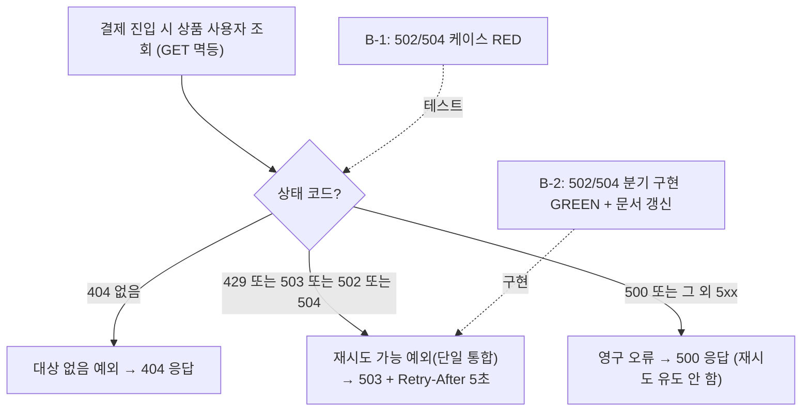
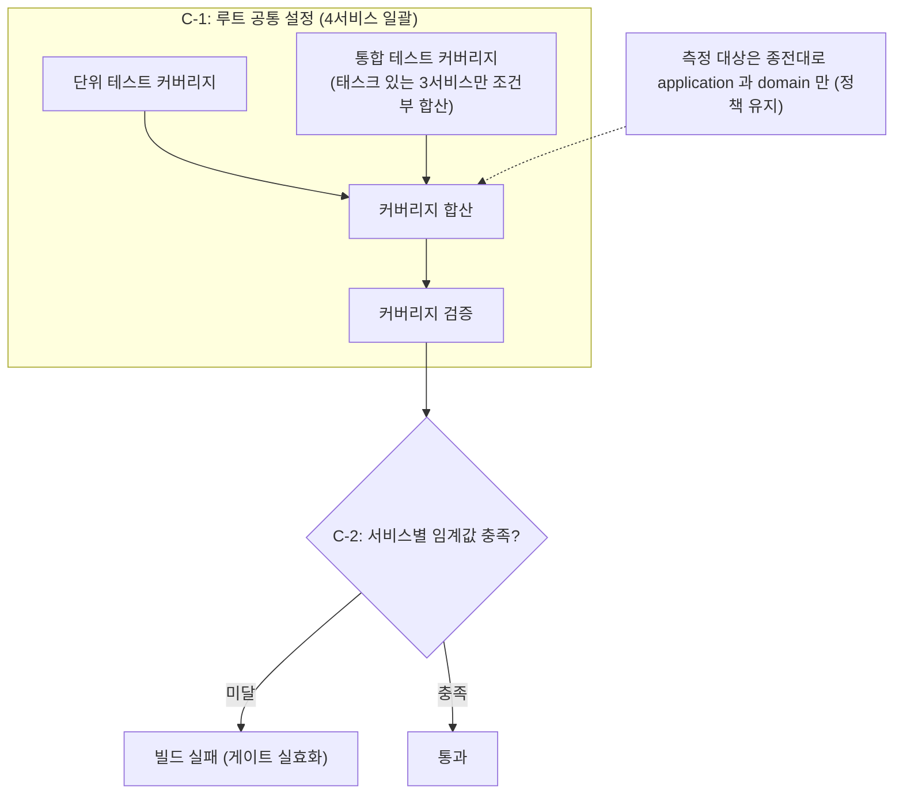

# CLEANUP-BATCH-B PLAN

- **Topic**: [CLEANUP-BATCH-B](topics/CLEANUP-BATCH-B.md)
- **Date**: 2026-05-30
- **Round**: 1 (Critic + Domain Expert pass)

---

## 요약 브리핑

### Task 목록 (6개, 권장 실행 순서 A → B → C)

- **A-1** — 정리 메서드 널 역참조 4건 정정 (연결 팩토리 체인 변수 분해 + 단언). tdd=false
- **A-2** — 가짜 발행기 저장 타입을 가변 예외 객체에서 예외 공급자로 전환 (정적분석 위반 해소). tdd=false
- **B-1** — 서비스 호출 실패 매핑 테스트에 게이트웨이 일시 장애(502/504) 케이스 추가 (RED). tdd=true, domain_risk=true
- **B-2** — 서비스 호출 실패 매핑에 502/504 재시도 가능 승격 구현 + 클래스 문서 갱신 (GREEN). tdd=true, domain_risk=true
- **C-1** — 커버리지 설정을 루트로 공통화 + 통합테스트 커버리지 조건부 합산 (4서비스). tdd=false
- **C-2** — 서비스별 커버리지 임계값 실측 설정 + 게이트 음성 검증. tdd=false

### 변경 후 동작 (to-be)

#### B 그룹 — 서비스 호출 실패 매핑

#### C 그룹 — 커버리지 게이트

spotbugs(A-1/A-2)는 흐름 변화가 아니라 위반 5건 제거 → 전체 빌드 GREEN 회복이라 별도 다이어그램 생략.

### 핵심 결정 → Task 매핑

- D-SB1 → **A-1** / D-SB1-EI → **A-2**
- D-NR1a(502/504 승격) → **B-1, B-2** / D-NR1b(500 유지) → **B-1, B-2** / D-NR1c(429·503 단일) → **B-2**
- D-NR1d(Retry-After vs 멱등 마커 TTL 윈도우 수용) → **없음 (설계 확정 비대상, 코드 변경 불요)**
- D-COV2(통합테스트 합산) + D-COV3(루트 공통화) → **C-1** / D-COV1(LINE 임계) → **C-2**

### 트레이드오프 / 후속 작업

- **baseline 값은 execute 실측 확정** — C-2 의 커버리지 임계값은 통합테스트 합산 후 실측 - 안전마진으로 정한다. 현재 수치를 동결할 뿐 "결제 시나리오 누락을 게이트가 잡는다"는 의미는 아님.
- **(D-NR1d) 첫 권고 재시도 재거절 윈도우** — 금전 무해라 수용, Retry-After/TTL 정렬은 Phase 4/TODOS 후속.
- **(F2) 504 재시도 폭주** — 고정 Retry-After 만 완화, jitter/CircuitBreaker 는 Phase 4(T4-D).
- **(G1) 측정 대상 정책 유지** — 커버리지 수치 협소 / PR 코멘트 가시성은 이번 토픽 비대상.

---

## 태스크 목록

세 항목(A. spotbugs / B. NET-RETRY / C. JaCoCo)은 코드 거주지가 갈리고 상호 결합이 없다. 단, 모든 항목의 완료 기준이 `./gradlew build` GREEN 에 수렴하므로, execute 순서는 A(빌드 복구 우선) → B(독립 TDD) → C(빌드 스크립트)를 권장한다.

---

### 그룹 A — spotbugs 코드 정정 (D-SB1, D-SB1-EI)

#### A-1 tearDown NPE 4건 정정

- [x] **A-1 완료**

| 필드 | 내용 |
|---|---|
| **ID** | A-1 |
| **제목** | tearDown redis flushAll 체인 NPE 정정 |
| **목적** | `getConnectionFactory()` 반환값 null 미검사 4건을 중간 변수 분해 + `Objects.requireNonNull` 단언으로 정정해 `spotbugsTest` NP_NULL 위반 4건 제거. D-SB1 |
| **tdd** | false |
| **domain_risk** | false |
| **대상 파일** | `payment-service/src/test/java/.../infrastructure/cache/StockCacheRedisAdapterTest.java:62` `StockCompensationAtomicLuaTest.java:57` `StockDecrementAtomicLuaTest.java:57` `payment-service/src/test/java/.../integration/StockCompensationRecoveryIntegrationTest.java:177` |
| **변경 패턴** | `redisTemplate.getConnectionFactory().getConnection()...` 체인 → 중간 변수 분해 + 명시적 `if (x == null) throw new IllegalStateException(...)` null 가드. (`Objects.requireNonNull` 은 SpotBugs 6.0.9 가 null-억제자로 인식 못 해 NP_NULL 잔존 → 명시 if-throw 로 채택. 억제 필터 미사용, D-SB1 준수) |
| **완료 기준** | `./gradlew :payment-service:spotbugsTest` 에서 NP_NULL 위반 4건 사라짐. `./gradlew :payment-service:test` 회귀 0. |
| **매핑 결정** | D-SB1 |
| **선행 태스크** | 없음 |

**완료 결과**: 4개 tearDown 메서드에서 체인을 `RedisConnectionFactory factory` + `RedisConnection connection` 두 단계로 분해하고, 각 단계에 명시적 `if (x == null) throw new IllegalStateException(...)` null 가드 삽입(없으면 셋업 결함 fail-fast). `Objects.requireNonNull` 은 SpotBugs 6.0.9 가 null-억제자로 인식하지 못해 NP_NULL 이 잔존(실측 확인)하므로, SpotBugs 데이터플로우가 인식하는 명시 if-throw 패턴으로 채택. `Objects` import 제거. **억제 필터(spotbugs-exclude-test.xml) 미사용 — D-SB1(억제 금지) 준수.** NP_NULL 4건 제거 확인(EI_EXPOSE_REP2 1건은 A-2 대상으로 남음).

---

#### A-2 FakeMessagePublisher Supplier 전환 (EI_EXPOSE_REP2 정정)

- [x] **A-2 완료**

| 필드 | 내용 |
|---|---|
| **ID** | A-2 |
| **제목** | FakeMessagePublisher 저장 타입 Throwable → Supplier 전환 |
| **목적** | `nextFailure(AtomicReference<Throwable>)` 와 `permanentFailure(volatile Throwable)` 를 각각 `AtomicReference<Supplier<? extends Throwable>>` / `volatile Supplier<? extends Throwable>` 로 전환. `send()` 내부에서 `supplier.get()` 으로 매번 새 인스턴스 생성. EI_EXPOSE_REP2 위반 1건 제거. D-SB1-EI |
| **tdd** | false |
| **domain_risk** | false |
| **대상 파일 (주)** | `payment-service/src/test/java/.../mock/FakeMessagePublisher.java` |
| **호출부 일괄 수정** | `payment-service/src/test/java/.../application/service/OutboxRelayServiceTest.java:120` (`fakeMessagePublisher.failNext()` — `failNext()` 내부 구현을 lambda `() -> new RuntimeException(...)` 로 교체. 외부 호출부 시그니처 변화 없음) |
| **변경 상세** | `setFailure(Throwable)` → `setFailure(Supplier<? extends Throwable>)`. `setPermanentFailure(Throwable)` → `setPermanentFailure(Supplier<? extends Throwable>)`. `failNext()` 내부 `nextFailure.set(new RuntimeException(...))` → `nextFailure.set(() -> new RuntimeException(...))`. `send()` 내 `throwUnchecked(failure)` → `throwUnchecked(failure.get())`. |

<!-- architect: layer/경계 OK. FakeMessagePublisher 는 application.port.out.MessagePublisherPort 를 구현하지만, 바뀌는 것은 @Override 대상이 아닌 test fixture 전용 헬퍼(setFailure/setPermanentFailure/failNext)뿐이다. 포트 인터페이스의 유일한 계약 메서드 send(String,String,Object) 시그니처는 불변 → main 출력 포트 계약 무손상 확인. §3-1 결정과 정합. -->
<!-- architect: throwUnchecked 가 매번 supplier.get() 으로 새 인스턴스를 만들면, 동일 fake 를 재사용하는 테스트에서 직전과 다른 예외 인스턴스가 던져진다. 기존 호출부가 던져진 예외의 '인스턴스 동일성'(==)이 아니라 '타입/메시지'로 단언하는지 implementer 가 확인 필요. (경계 문제 아님, 회귀 방지용 메모) -->

| **완료 기준** | `./gradlew :payment-service:spotbugsTest` 에서 EI_EXPOSE_REP2 위반 1건 사라짐(위반 총 0건). `./gradlew :payment-service:test` 회귀 0. |
| **매핑 결정** | D-SB1-EI |
| **선행 태스크** | A-1 (같은 spotbugsTest GREEN 확인을 공유, 순서 무관하지만 한 커밋씩 분리) |

**완료 결과**: `FakeMessagePublisher` 의 `nextFailure(AtomicReference<Throwable>)` → `AtomicReference<Supplier<? extends Throwable>>`, `permanentFailure(volatile Throwable)` → `volatile Supplier<? extends Throwable>` 로 전환. `send()` 내부에서 `failureSupplier.get()` / `permanentFailure.get()` 으로 매번 새 인스턴스 생성. `failNext()` 내부는 `() -> new RuntimeException(...)` lambda 로 교체(외부 시그니처 불변). `setFailure` / `setPermanentFailure` 시그니처를 `Supplier<? extends Throwable>` 로 변경(기존 `Throwable` 직접 전달 호출부 grep 0건 확인). `java.util.function.Supplier` import 추가. **억제 필터(spotbugs-exclude-test.xml), `@SuppressFBWarnings` 미사용 — D-SB1-EI(억제 금지) 준수.** `spotbugsTest` EI_EXPOSE_REP2 1건 제거 확인(위반 총 0건), `test` 412 PASS 회귀 0.

---

### 그룹 B — NET-RETRY 502/504 retryable 승격 (D-NR1a/b/c)

#### B-1 ProductFeignConfigTest / UserFeignConfigTest 에 502/504 케이스 추가 (RED)

- [x] **B-1 완료**

| 필드 | 내용 |
|---|---|
| **ID** | B-1 |
| **제목** | ErrorDecoder 502/504 retryable 케이스 테스트 추가 (RED) |
| **목적** | `ProductFeignConfigTest` / `UserFeignConfigTest` 에 502/504 → `*ServiceRetryableException` 케이스를 추가해 RED 상태 확인. 기존 404/429/503/500 4분기 회귀는 유지. D-NR1a/D-NR1b |
| **tdd** | true |
| **domain_risk** | true |
| **대상 파일** | `payment-service/src/test/java/.../infrastructure/adapter/http/feign/ProductFeignConfigTest.java` `UserFeignConfigTest.java` |
| **테스트 클래스** | `ProductFeignConfigTest` / `UserFeignConfigTest` (기존 파일 확장) |
| **추가 테스트 메서드 (각 파일 동일 패턴)** | `decode_BadGateway_ShouldReturnRetryable()` — 502 입력 → `*ServiceRetryableException` 검증 `decode_GatewayTimeout_ShouldReturnRetryable()` — 504 입력 → `*ServiceRetryableException` 검증 |
| **회귀 케이스 (변경 없음, RED 에서 여전히 PASS)** | `decode_NotFound_ShouldReturnProductNotFoundException` (404) `decode_ServiceUnavailable_ShouldReturnRetryable` (503) `decode_TooManyRequests_ShouldReturnRetryable` (429) `decode_InternalServerError_ShouldReturnIllegalState` (500) |
| **완료 기준** | B-1 커밋 시점에서 신규 502/504 테스트 2건 × 2파일 = 4건이 RED (구현 전). 기존 4분기 케이스 8건은 PASS 유지. |
| **매핑 결정** | D-NR1a, D-NR1b |
| **선행 태스크** | 없음 |

**완료 결과**: `ProductFeignConfigTest` / `UserFeignConfigTest` 에 `decode_BadGateway_ShouldReturnRetryable()`(502) / `decode_GatewayTimeout_ShouldReturnRetryable()`(504) 메서드 각 2건 추가(총 4건). 현재 구현(429/503만 retryable, 502/504는 `IllegalStateException`)에서 신규 4건 RED 확인. 기존 404/429/503/500 케이스 8건 PASS 유지.

---

#### B-2 ProductFeignConfig / UserFeignConfig ErrorDecoder 502/504 분기 추가 (GREEN)

- [x] **B-2 완료**

| 필드 | 내용 |
|---|---|
| **ID** | B-2 |
| **제목** | ErrorDecoder 502/504 retryable 매핑 구현 (GREEN) |
| **목적** | `ProductFeignConfig` / `UserFeignConfig` 의 `ErrorDecoder` 에 `case 502, 504` 분기를 추가해 `*ServiceRetryableException` 을 throw. 500 및 그 외 5xx 는 `IllegalStateException` 유지(D-NR1b). 예외 클래스 신설 없음(D-NR1c). D-NR1a |
| **tdd** | true |
| **domain_risk** | true |
| **대상 파일** | `payment-service/src/main/java/.../infrastructure/adapter/http/feign/ProductFeignConfig.java` `UserFeignConfig.java` |
| **변경 패턴** | 기존 `case 429, 503 -> ...ServiceRetryableException(...)` 분기에 `502` / `504` 추가. `PaymentExceptionHandler` 는 변경 없음(기존 `*ServiceRetryableException` → 503 + Retry-After:5 매핑 그대로). |

<!-- architect: 의존 방향 OK — ErrorDecoder(infrastructure/adapter/http/feign) → exception 패키지 도메인 예외 throw, presentation @RestControllerAdvice 가 매핑. 포트 신설/이동 없음. §3-2 layer 배치를 그대로 따른다. 실제 코드(ProductFeignConfig)는 현재 if 체인(switch case 아님)이라 변경 패턴 표현은 "429/503 OR 분기에 502/504 추가"로 읽으면 됨. -->
<!-- architect: 정합 메모(경계 아님) — ProductFeignConfig/UserFeignConfig 클래스 Javadoc 의 매핑 목록(예: ProductFeignConfig.java:25-29 의 "429/503 → Retryable, 그 외 5xx → IllegalState")이 502/504 승격 후 코드와 어긋난다. B-2 에서 분기와 함께 Javadoc 도 갱신해야 문서-코드 정합 유지(CONVENTIONS 문서화 규칙). -->

| **완료 기준** | B-1 에서 RED 였던 4건 모두 GREEN. `./gradlew :payment-service:test` 전체 회귀 0. `./gradlew :payment-service:spotbugsTest` GREEN (기존 위반 없는 main 코드). |
| **매핑 결정** | D-NR1a, D-NR1b, D-NR1c |
| **선행 태스크** | B-1 |

**완료 결과**: `ProductFeignConfig` / `UserFeignConfig` 의 `mapToException` retryable 분기에 `HttpStatus.BAD_GATEWAY.value()`(502) / `HttpStatus.GATEWAY_TIMEOUT.value()`(504) 를 추가. 기존 `429 || 503` 조건을 `429 || 502 || 503 || 504` 로 확장해 `*ServiceRetryableException` 을 반환. **500 및 그 외 5xx 는 `IllegalStateException` 유지** (D-NR1b). **예외 클래스 신설 없음** (D-NR1c). 클래스 Javadoc 의 매핑 목록을 "429 / 502 / 503 / 504 → *ServiceRetryableException, 500 및 그 외 5xx → IllegalStateException" 으로 갱신해 문서-코드 정합 유지. B-1 RED 4건(502/504 × 2파일) 전부 GREEN 전환 확인. 기존 404/429/503/500 케이스 8건 회귀 없음. `./gradlew :payment-service:test` 416 PASS (0 FAIL). `./gradlew :payment-service:spotbugsTest` GREEN (위반 0건).

---

### 그룹 C — JaCoCo 게이트 실효화 + 4서비스 공통화 (D-COV1/D-COV2/D-COV3)

#### C-1 루트 build.gradle 에 integrationTest exec 합산 + 공통 jacoco 블록 이전 (D-COV2/D-COV3)

| 필드 | 내용 |
|---|---|
| **ID** | C-1 |
| **제목** | 루트 subprojects 에 jacoco 공통 설정 이전 + integrationTest exec 합산 |
| **목적** | `jacocoTestReport` 에 `integrationTest` exec data 를 조건부 합산(`tasks.findByName('integrationTest')` 가드)하고, 제외 목록(`classDirectories` filter) + verification 규칙 전체를 루트 `build.gradle` `subprojects` 블록으로 이전. payment-service `build.gradle` 의 개별 jacoco 블록(L121~192) 삭제. D-COV2/D-COV3 |
| **tdd** | false |
| **domain_risk** | false |
| **대상 파일** | `/build.gradle` (루트, `subprojects` 블록 확장) `payment-service/build.gradle` (L121~192 jacoco 블록 제거) |
| **조건부 wiring 패턴** | `afterEvaluate { if (tasks.findByName('integrationTest') != null) { jacocoTestReport.dependsOn integrationTest; jacocoTestReport.executionData += files("${buildDir}/jacoco/integrationTest.exec") } }` |
| **integrationTest 보유 서비스** | payment-service / product-service / pg-service (3개) — 이 3개는 합산 대상. user-service / gateway / eureka-server 는 integrationTest 태스크 부재 → 가드가 false 라 자연 스킵 |
| **제외 목록 이전** | 기존 payment-service 의 excludes 패턴(QueryDSL Q*, dto/entity/enums/event/exception/infrastructure/presentation/publisher/mock/aspect/metrics/log/filter/util/config/response, *Application.class)을 루트 공통으로 이전. 4서비스 동일 hexagonal 컨벤션이라 그대로 적용 가능. |
| **완료 기준** | `./gradlew :payment-service:jacocoTestReport` 실행 시 `integrationTest.exec` 가 합산되어 application 패키지 LINE 커버리지가 합산 전 대비 상승 확인. 4서비스(payment/pg/product/user) 각각에서 `jacocoTestReport` 태스크가 오류 없이 실행됨. payment-service 의 중복 jacoco 블록 부재 확인. |
| **매핑 결정** | D-COV2, D-COV3 |
| **선행 태스크** | 없음 (그룹 A/B와 독립) |

<!-- architect: layer 무영향(build.gradle 한정) OK. 단 기존 체인 충돌 1건 주의 — 루트 subprojects 의 test 블록에 이미 `finalizedBy jacocoTestReport`(build.gradle:86) 가 있고, payment-service 개별 블록은 `jacocoTestReport.dependsOn test` + `finalizedBy jacocoTestCoverageVerification`(payment-service/build.gradle:121-163)을 추가로 건다. 공통화 시 이 두 체인(루트 finalizedBy + 개별 dependsOn/finalizedBy)이 한 곳으로 합쳐져야 하며, payment 블록 제거 후 `finalizedBy jacocoTestCoverageVerification` 연결이 루트로 이전됐는지 execute 에서 확인. C-2 완료 기준의 'finalizedBy 연결 확인'과 동일 지점. -->
<!-- architect: integrationTest 가 payment 에서 `check.dependsOn integrationTest` + `integrationTest.mustRunAfter test`(payment-service/build.gradle:118-119)로 wiring 돼 있다. C-1 이 jacoco 블록만 루트로 옮기고 integrationTest 태스크 정의·이 wiring 은 각 서비스에 남긴다는 전제가 맞는지(= 태스크 정의 이전이 아니라 jacoco exec 합산만 조건부로 거는 것) 확인. afterEvaluate + tasks.findByName 가드 자체는 평가 시점 안전 — 경계 문제 없음. -->
<!-- architect: 제외 목록 루트 이전은 4서비스 동일 hexagonal 패키지 컨벤션(domain/application/infrastructure/presentation/core/exception)을 전제한다(§3-3, ARCHITECTURE Layer 룰과 정합). 단 payment 개별 목록에는 publisher/mock/aspect/metrics/log/filter/util 등 payment 특화 경로가 섞여 있다 — 다른 서비스에 그 패키지가 없으면 무해(매칭 0건)하나, 공통 목록이 특정 서비스 구조에 의존하지 않는지 가볍게 확인. -->

---

#### C-2 서비스별 LINE minimum 실측 및 게이트 임계값 설정 (D-COV1)

| 필드 | 내용 |
|---|---|
| **ID** | C-2 |
| **제목** | 서비스별 LINE coverage minimum 실측 후 jacocoTestCoverageVerification 임계값 설정 |
| **목적** | C-1 적용 상태(integrationTest 합산)에서 서비스별 LINE COVEREDRATIO 실측 → `floor(실측 - 안전마진)` 으로 `minimum` 설정 → `jacocoTestCoverageVerification` 게이트 실효화. 음성 검증(임계 과대 설정 → fail 확인 → 원복) 으로 게이트 동작 확인. D-COV1 |
| **tdd** | false |
| **domain_risk** | false |
| **대상 파일** | `/build.gradle` (루트, `jacocoTestCoverageVerification` 의 `violationRules` 에 `limit { counter='LINE'; value='COVEREDRATIO'; minimum=<실측값> }` 추가) |
| **baseline 산정 절차** | (1) `./gradlew :<svc>:jacocoTestReport` 로 서비스별 LINE COVEREDRATIO 실측. (2) `minimum = floor(실측 - 안전마진)` (마진폭은 실측 분포 보고 execute 에서 확정). (3) 서비스별 편차 수용 — 서비스별 `minimum` 값을 ext 속성 또는 per-project override 로 주입 가능하게 구성. gateway/eureka 처럼 측정 대상 클래스 0인 서비스는 `minimum=0.0` 또는 자연 통과. |
| **음성 검증 절차** | `minimum` 을 일시 `1.0` 으로 설정 → `./gradlew :payment-service:jacocoTestCoverageVerification` fail 확인 → 실측 기반 값으로 원복 |
| **완료 기준** | `./gradlew :payment-service:jacocoTestCoverageVerification` 이 `minimum` 미달 시 빌드 fail (음성 검증). 실측 기반 `minimum` 복원 후 4서비스 모두 통과. `finalizedBy jacocoTestCoverageVerification` 연결 확인 (`jacocoTestReport` 후 자동 실행). integrationTest 합산 전후 application 패키지 LINE % 비교 로그 기록. |
| **매핑 결정** | D-COV1 |
| **선행 태스크** | C-1 (integrationTest 합산이 먼저 적용돼야 실측 수치가 정확함) |

---

## 추적 테이블: discuss 리스크 → 태스크 매핑

| discuss 식별 리스크 / 결정 | 심각도 | 대응 태스크 | 비고 |
|---|---|---|---|
| F1 (discuss-domain-1): 502/504 승격 ↔ checkout IN_PROGRESS 마커 TTL 어긋남 윈도우 | major | **B-1, B-2** | B-1/B-2 테스트 케이스에서 `*ServiceRetryableException` 반환 검증. D-NR1d(윈도우 수용)은 설계 확정 — execute 에서 별도 보상 로직 없음. Phase 4 후속 연결은 TODOS 확인. |
| D-NR1a: 502/504 retryable 승격 | — | B-1 (RED), B-2 (GREEN) | TDD 2커밋 분리. |
| D-NR1b: 500 비-retryable 유지 | — | B-1 (500 → IllegalStateException 회귀 케이스 유지), B-2 | 기존 500 케이스 회귀로 검증. |
| D-NR1c: 429/503 단일 예외 유지 | — | B-2 (예외 클래스 신설 없음) | 분기 조건만 추가, 예외 증식 없음. |
| D-NR1d: Retry-After(5s) vs TTL(10s) 정렬 비대상 | — | 없음 (비대상) | 윈도우 수용 확정. 코드 변경 불요. Phase 4/TODOS 위임. |
| D-SB1: NP_NULL 4건 정정 | — | A-1 | tdd=false, 정정 후 spotbugsTest GREEN. |
| D-SB1-EI: EI_EXPOSE_REP2 1건 정정 | — | A-2 | tdd=false, Supplier 전환. |
| D-COV1: LINE minimum 게이트 도입 | — | C-2 | C-1 선행 필수. |
| D-COV2: integrationTest exec 합산 | — | C-1 | 조건부 wiring. |
| D-COV3: 루트 공통화 | — | C-1 | payment-service 개별 블록 제거. |
| F2 (discuss-domain-1/2): 504 thundering herd jitter 부재 | minor | 없음 (비대상) | Phase 4(T4-D). 정보성. |

---

## self-check

### 태스크 수 / domain_risk 수

- 총 태스크 수: **6개** (A-1, A-2, B-1, B-2, C-1, C-2)
- `domain_risk=true` 태스크 수: **2개** (B-1, B-2 — 재시도 정책·멱등성에 닿음)
- `domain_risk=false` 태스크 수: **4개** (A-1, A-2, C-1, C-2 — 빌드/테스트 위생, 빌드 스크립트)

### 결정 ID → 태스크 매핑 점검

| 결정 ID | 매핑 태스크 | 매핑됨? |
|---|---|---|
| D-SB1 | A-1 | yes |
| D-SB1-EI | A-2 | yes |
| D-NR1a | B-1, B-2 | yes |
| D-NR1b | B-1, B-2 | yes |
| D-NR1c | B-2 | yes |
| D-NR1d | 없음 (비대상 — 설계에서 execute 작업 없음으로 명시) | yes (비대상) |
| D-COV1 | C-2 | yes |
| D-COV2 | C-1 | yes |
| D-COV3 | C-1 | yes |

미매핑 결정 ID: **없음** (pass 조건 충족).

### 의존 순서 점검

- A-1 → A-2: 같은 spotbugsTest 범위, 순서 무관하나 A-1 먼저 처리해 빌드 복구 확인.
- B-1 → B-2: TDD RED → GREEN 순서 강제.
- C-1 → C-2: integrationTest 합산 후 실측이 정확하므로 C-1 필수 선행.
- A/B/C 그룹 간: 상호 독립 (코드 거주지 분리). execute 권장 순서: A → B → C.

### 태스크 크기 점검

- A-1: tearDown 4 파일 동일 패턴 수정, `requireNonNull` 삽입 — ≤30분.
- A-2: FakeMessagePublisher 필드 타입 교체 + 1개 호출부 수정 — ≤30분.
- B-1: 기존 테스트 파일 2개에 메서드 2건씩 추가 — ≤20분.
- B-2: ErrorDecoder 분기 조건 2개 파일 수정 — ≤20분.
- C-1: 루트 `build.gradle` 확장 + payment-service jacoco 블록 제거 — ≤60분.
- C-2: 실측 → minimum 값 입력 + 음성 검증 절차 — ≤60분.

모든 태스크 ≤2시간 기준 충족.
