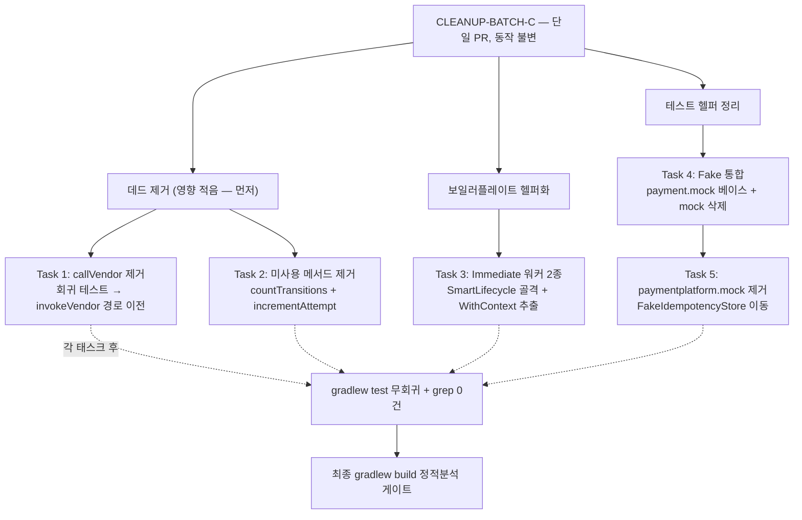

# CLEANUP-BATCH-C 구현 플랜

> 작성일: 2026-06-13

## 요약 브리핑

### Task 목록

1. **pg 벤더 호출 폐기 메서드 제거** — `PgVendorCallService.callVendor`(deprecated, main 호출 0) 본체 + 회귀 테스트 정리, vendorType 선택 검증은 `invokeVendor` 경로로 이전
2. **미사용 메서드 제거** — payment 이력 집계용 `countTransitionsByStatusWithinWindow`(호출 0) + pg `PgOutbox.incrementAttempt`(전수 스캔 발굴, 호출 0)
3. **pg Immediate 워커 2종 보일러플레이트 헬퍼화** — `PgInboxImmediateWorker`/`PgOutboxImmediateWorker`의 SmartLifecycle 골격 + 컨텍스트 복원 이중 scope를 공통 base/헬퍼로 추출(골격 유지, Polling 2종 별종)
4. **두 이질 Fake 통합** — `FakePaymentEventRepository`를 `payment.mock` 베이스로 1벌화, `mock` 변종 삭제 + import 교체
5. **테스트 헬퍼 위치 정리** — `paymentplatform.mock`(bounded 밖) 제거, `FakeIdempotencyStore` 이동 + `FakeStockCachePortAtomicTest` 위치 교정

### 변경 후 태스크 흐름 (동작 불변)

### 핵심 결정 → Task 매핑

| 결정(topic.md) | Task |
|---|---|
| A1 callVendor 데드 제거 | Task 1 |
| A2 countTransitions 데드 제거 + plan 발굴 incrementAttempt | Task 2 |
| B1 워커 헬퍼 추출 (Immediate 2종) | Task 3 |
| C1 두 이질 Fake 통합 (payment.mock 베이스) | Task 4 |
| C2 paymentplatform.mock 위치 통일 | Task 5 |
| B2 벤더 헬퍼 / A3 미사용 포트 / D 정합성 로직 | (제외·보존 — 태스크 없음) |

### 트레이드오프 / 후속 작업

- 전 태스크 `tdd=false` — 동작 불변 리팩토링이라 신규 테스트보다 기존 테스트 GREEN 유지 + grep 0건 + characterization(Task 3 getPhase)이 검증 축.
- Task 4는 mock 변종의 `findById`/auto-id/order 재조립 의미론을 폐기(사용처 0). 후속에 그 의미론이 필요하면 복원 비용 발생 — 완료 결과에 기록.
- B1은 Immediate 2종만 통합 — Polling 2종과 벤더 전략(B2)의 잔여 유사 코드는 의도적으로 남긴다(독립성·메커니즘 차이 우선).

## 목표

전면 스캔으로 발굴한 미사용 코드 제거 + pg Immediate 워커 보일러플레이트 헬퍼화 + 테스트 헬퍼 위치/중복 정리를 동작 불변(behavior-preserving)으로 완료한다. 모든 태스크는 `./gradlew test` 무회귀 + 결제 정합성 동작 불변이 기준.

## 컨텍스트

- 설계 문서: `docs/topics/CLEANUP-BATCH-C.md`
- 주요 변경 파일:
  - `PgVendorCallService` (+ `PgVendorCallServiceTest`, `PgVendorCallServiceVendorTypeTest`, `PgConfirmServiceTest`)
  - `PaymentHistoryRepository`(포트) · `PaymentHistoryRepositoryImpl`, `PgOutbox`(domain)
  - `PgInboxImmediateWorker` · `PgOutboxImmediateWorker` (+ 신규 공통 헬퍼/base)
  - 두 `FakePaymentEventRepository`, `FakeIdempotencyStore`, `FakeStockCachePortAtomicTest`
- **B2(벤더 전략 헬퍼 추출)는 제외** — 조사 결과 진짜 벤더 비종속이 상수 4개뿐이라 추출 가치 없음(사용자 확정).

## 진행 상황

- [x] Task 1: pg 벤더 호출 폐기 메서드(callVendor) 제거
- [x] Task 2: 미사용 메서드 제거 (payment 이력 집계 + pg outbox attempt)
- [x] Task 3: pg Immediate 워커 2종 생명주기/컨텍스트 복원 헬퍼 추출
- [ ] Task 4: 두 이질 FakePaymentEventRepository 통합
- [ ] Task 5: paymentplatform.mock 디렉토리 위치 정리

## 태스크

### Task 1: pg 벤더 호출 폐기 메서드(callVendor) 제거 [tdd=false] [domain_risk=true]

**구현 (GREEN)**
- `PgVendorCallService.callVendor` 제거 — 메서드 Javadoc(현 line 111-119) + 애너테이션(`@Deprecated(forRemoval)`/`@Transactional`, 120-121) + 본체(122-125) + 클래스 Javadoc의 `@deprecated callVendor` 줄(57) 모두 정리
- `PgVendorCallServiceTest`: `callVendor` 회귀 테스트(현 line 255-342 구간) 삭제. 삭제 전 `invokeVendor` + `applyOutcome` 분리 경로 테스트가 5분기(success / retryable 잔여 / retryable 소진→DLQ / nonRetryable / duplicate)를 모두 커버하는지 확인 — 미커버 분기가 있으면 분리 경로 테스트로 먼저 보강 후 회귀 테스트 삭제
- `PgVendorCallServiceVendorTypeTest`: `callVendor` 기반 vendorType→strategy 선택 검증 2건을 `invokeVendor`(invokeConfirm) 경로 기반으로 이전 — vendorType 선택 동작 보존
- `PgConfirmServiceTest`: `verify(...never()).callVendor(...)` 단언을 `invokeVendor`/`applyOutcome` 기준으로 정정(호출 안 됨 검증 의미 보존)

**완료 기준**
- `callVendor` grep 0건(main + test), `./gradlew :pg-service:test` GREEN
- vendorType→strategy 선택 검증 + 5분기 결과 분기 검증이 분리 경로 테스트로 동등 보존

**완료 결과**
- `callVendor` grep 0건(main+test) 확인
- `applyOutcome` 5분기(success/retryable잔여/retryable소진→DLQ/nonRetryable/duplicate) 기존 커버 완비 확인 → 회귀 테스트 5건 삭제
- `PgVendorCallServiceVendorTypeTest` 2건을 `callVendor` → `invokeVendor` 경로로 이전
- `PgConfirmServiceTest`의 `never().callVendor(...)` 단언 2건을 `never().invokeVendor(...)` 단독으로 정정
- `./gradlew :pg-service:test` 308 passed, 0 failed

---

### Task 2: 미사용 메서드 제거 (payment 이력 집계 + pg outbox attempt) [tdd=false] [domain_risk=false]

**구현 (GREEN)**
- `PaymentHistoryRepository.countTransitionsByStatusWithinWindow`(포트 선언, 현 line 12) + `PaymentHistoryRepositoryImpl`의 구현(현 line 33~)을 제거 — 전체 호출 0건 확인됨
- `PgOutbox.incrementAttempt`(현 line 142) 제거 — 정의만 있고 호출 0건(전수 데드 스캔 발굴)

**완료 기준**
- `countTransitionsByStatusWithinWindow` / `incrementAttempt` grep 0건, `./gradlew test` GREEN

**완료 결과**
- `countTransitionsByStatusWithinWindow` grep 0건(포트 선언 + 구현 모두 제거) 확인
- `incrementAttempt` grep 0건(PgOutbox 메서드 제거) 확인
- `PaymentHistoryRepositoryImpl`에서 QueryDSL 관련 불필요 import(JPAQueryFactory, QPaymentHistoryEntity, Tuple, Collectors, List, Map) 전량 정리
- `PaymentHistoryRepository` 포트에서 미사용 import(PaymentEventStatus, LocalDateTime, Map) 전량 정리
- `./gradlew test` BUILD SUCCESSFUL (308 passed, 0 failed)

---

### Task 3: pg Immediate 워커 2종 생명주기/컨텍스트 복원 헬퍼 추출 [tdd=false] [domain_risk=true]

**구현 (GREEN)**
- `PgInboxImmediateWorker` + `PgOutboxImmediateWorker`의 공통 SmartLifecycle 보일러플레이트를 공통 추상 base(또는 헬퍼)로 추출:
  - `start()` VT 워커 N개 생성 루프, `stop()`/`stop(Runnable)`, `isRunning()`, `getPhase()`(`Integer.MAX_VALUE - 100`), `shutdown*Executor()`, `workerLoop()` + `*WithContext()`(`job.snapshot().setThreadLocals()` + `job.otelContext().makeCurrent()` 이중 scope 복원)
  - **실행자 생성(`ContextAwareVirtualThreadExecutors.newWrappedVirtualThreadExecutor()`)은 이미 공통 헬퍼화돼 있으므로 추출 대상에서 제외**(reviewer finding) — 남은 실제 중복인 SmartLifecycle 골격 + `*WithContext` 이중 scope 블록만 추출
- 워커별 차이(채널 타입·Job 타입·위임 대상·실패 카운터·로그 도메인/이벤트·worker name prefix)는 각 워커에 유지 — 추상 메서드/생성자 인자로 주입
- **Polling 2종(`PgInboxPollingWorker`/`PgOutboxPollingWorker`)은 비대상** — `@Scheduled` 별종 + DB-기반 traceparent 복원(`TraceparentExtractor`)이라 헬퍼 공유 금지(R5)
- 추출 전 `PgInboxImmediateWorkerTest`/`PgOutboxImmediateWorkerTest`에 `getPhase()` 반환값 단언 1줄 추가(현재 미커버 — characterization)

**완료 기준**
- 두 Immediate 워커의 생명주기/컨텍스트 보일러플레이트가 공통 base/헬퍼로 통합, 각 워커 골격은 유지
- `PgInboxImmediateWorkerTest`·`PgOutboxImmediateWorkerTest`(+ getPhase 단언) · `PgOutboxImmediateWorkerMdcPropagationTest` GREEN — start/stop/isRunning/phase/traceparent 전파 동작 불변
- `./gradlew :pg-service:test` GREEN

**완료 결과**
- `ImmediateJob` 인터페이스를 `pg.infrastructure.channel` 패키지에 신설 — `otelContext()`, `snapshot()` 공통 접근자 선언
- `InboxJob` / `OutboxJob` record가 `ImmediateJob`을 implements
- `AbstractImmediateWorker<J extends ImmediateJob>` 추상 클래스를 `pg.infrastructure.scheduler` 패키지에 신설:
  - SmartLifecycle 골격 (`start`, `stop`, `stop(Runnable)`, `isRunning`, `getPhase = Integer.MAX_VALUE - 100`)
  - workerLoop + `runWithContext(J job)` 이중 scope 복원 (MDC snapshot → OTel Context)
  - `awaitShutdown(ExecutorService)` static 유틸 (graceful shutdown 공통화)
  - 워커별 차이 10종은 추상 메서드로 위임 (initExecutor/executor/shutdownExecutor/workerNamePrefix/workerCount/takeJob/handle/logStarted/logStopped/logLoopError)
- `PgInboxImmediateWorker` / `PgOutboxImmediateWorker` 각각 `AbstractImmediateWorker`를 extends — 보일러플레이트 제거, 워커별 차이만 유지
- `PgInboxImmediateWorkerTest` / `PgOutboxImmediateWorkerTest`에 `getPhase()` 반환값 단언 1줄 추가 (characterization)
- `./gradlew :pg-service:test` GREEN (310 passed, 0 failed, JaCoCo 통과)

---

### Task 4: 두 이질 FakePaymentEventRepository 통합 [tdd=false] [domain_risk=true]

**구현 (GREEN)** — *게이트 1R 반영: 통합 방향 전환(mock 베이스 → payment.mock 베이스)*
- 통합 기준: **`payment.mock` 버전을 베이스**로 둔다 — orderId(String) 키 + 검증 헬퍼(`save(PaymentEvent)`, `saveOrUpdateCallCount()`) + thread-safe `ConcurrentHashMap`. 정합성 가드 8개가 이 변종에 의존하므로 RED 탐지력 보존에 가장 안전(reviewer/domain-expert 수렴)
- `mock.FakePaymentEventRepository` 삭제 후 그 유일 사용처 `PaymentLoadUseCaseTest`의 import를 `payment.mock`으로 교체. `PaymentLoadUseCaseTest`가 쓰는 의미론(`saveOrUpdate` → `findByOrderId`, `findReadyPaymentsOlderThan`)은 `payment.mock`에 이미 존재 → **우선 import 교체만으로 GREEN인지 확인**. mock-특수 의미론(`findById`/auto-id/PaymentOrder 재조립)은 `PaymentLoadUseCaseTest`가 사용하지 않음(게이트 확인)
- 부족분이 실제로 드러날 때만 `payment.mock`에 해당 조회 동작을 보강하되: `save()`는 키 맵에만 put(`paymentOrderDatabase` 채우지 않음), `findByOrderId` 재조립은 order 저장소가 빈 경우 no-op 유지 — multi-product `findByOrderId` 시 order 중복 append로 stock-committed 이중 발행 단언이 깨지는 함정 회피(domain-expert finding)
- **검증 절차**: 통합 전 9개 의존 테스트(정합성 가드 8 = `PaymentConfirmResultUseCase*` 7 + `ConfirmedEventConsumerTest`, + `PaymentLoadUseCaseTest` 1) GREEN 베이스라인 확인 → 통합 → 9개 전수 GREEN 재확인. 정합성 가드는 실패 케이스 단언(D7 record 1회/never, 보상 미호출, EOS amount 불일치 시 IN_PROGRESS 유지 + send never)이 통합 후에도 RED 탐지하는지 확인
- **fallback(R3)**: `payment.mock` 베이스로 `PaymentLoadUseCaseTest`를 GREEN 만들 수 없는 의미론 충돌이 드러나면, 통합을 강행하지 말고 의미론 유지 + 위치/네이밍만 정리하는 방향으로 전환(execute에서 메인에 보고)

**완료 기준**
- `FakePaymentEventRepository` 1벌(`payment.mock`), `mock` 버전 삭제, 9개 의존 테스트 GREEN
- 정합성 가드 8개의 실패 케이스 단언 보존(RED 탐지력 불변), `findByOrderId` order 중복 append 없음
- 완료 결과에 "mock 변종의 `findById`/auto-id/PaymentOrder 재조립 의미론은 의도적 폐기(현재 사용처 0)"를 1줄 기록 — 후속자 인지용(domain-expert 2R 메모)

**완료 결과**
> (execute에서 채움)

---

### Task 5: paymentplatform.mock 디렉토리 위치 정리 [tdd=false] [domain_risk=false]

**구현 (GREEN)**
- `FakeIdempotencyStore`: `paymentplatform.mock` → `payment.mock` 이동, 의존 테스트 import 교체
- Task 4에서 `mock.FakePaymentEventRepository` 삭제 후 빈 `paymentplatform.mock` 디렉토리 제거
- `FakeStockCachePortAtomicTest`(현재 `payment.mock` 디렉토리에 혼재한 테스트 클래스)를 적절한 test 패키지로 이동 — mock 디렉토리에는 Fake만 두는 규칙

**완료 기준**
- `paymentplatform.mock` 디렉토리 제거, 모든 Fake가 `<bounded>.mock` 규칙 준수
- `FakeStockCachePortAtomicTest` 정상 위치, `./gradlew test` GREEN

**완료 결과**
> (execute에서 채움)

## plan 게이트 처리

### 1라운드 (reviewer revise / domain-expert pass)

| # | finding | 심각도 | 반영 |
|---|---|---|---|
| 1 | Task 4 통합 방향(`mock` superset 베이스)이 코드와 어긋남 — 가드 8개는 `payment.mock` 의존, `mock` 유일 사용처(PaymentLoadUseCaseTest)는 mock-특수 의미론 미사용 | major | Task 4를 **payment.mock 베이스**로 전환, import 교체 우선 + 부족분만 보강 + order 중복 append 회피 명시 |
| 2 | Task 4 통합본 `save()`가 paymentOrderDatabase 채우면 multi-product `findByOrderId` order 중복 append → stock-committed 이중 발행 단언 깨짐 | minor (domain) | payment.mock 베이스 전환으로 자연 해소 + `save` 키맵 only/재조립 no-op 명시 |
| 3 | B2 결정이 plan에서 제외로 뒤집혔으나 topic.md 결정 테이블/요약 브리핑 미갱신 — SSOT 모순 | minor | topic.md 결정 사항·요약 브리핑 B2 행을 "제외 확정"으로 정정 |
| 4 | Task 1 callVendor 삭제 범위 라인 부정확(메서드 Javadoc/애너테이션 누락) | minor | 삭제 범위를 Javadoc 111-119 + 애너테이션 120-121 + 본체 122-125 + 클래스 Javadoc 57로 정정 |
| 5 | Task 3 실행자 생성은 이미 `ContextAwareVirtualThreadExecutors`로 헬퍼화 — 추출 대상 과다 | minor | 추출 범위를 SmartLifecycle 골격 + `*WithContext` 이중 scope로 축소, 실행자 생성 제외 명시 |

domain-expert는 R1~R5가 완료 기준/검증 절차로 빠짐없이 매핑됨을 확인하고 pass. Task 1(callVendor 5분기 동등 커버)·Task 3(graceful shutdown/traceparent race 없음, Polling 별종 R5)도 소스 교차검증으로 안전 확인.

### 2라운드 (reviewer + domain-expert 둘 다 pass)

- reviewer: pass (yes 13 / no 0). 1라운드 no 항목(B2 SSOT 역방향 누락)이 to-be/결정/요약/제외 범위 4개 위치에서 "제외 확정"으로 일관 해소 확인. Task 4 방향 전환에 신규 결함 없음.
- domain-expert: pass. payment.mock 베이스 전환이 정합성 가드 8개 RED 탐지력 보존 + order 중복 append 함정 구조적 해소(save=키맵 put, findByOrderId=단순 조회) 확인. Task 1/3 신규 도메인 리스크 없음.
- 잔여 minor(공통): topic.md 검증 전략의 B2 fallback 문구 잔재 → 정정 완료. Task 4 auto-id/findById 의미론 폐기 메모 → 완료 기준에 반영.

## 리뷰 처리

> (ship 단계에서 채움 — finding별 채택/스킵 + 사유)
