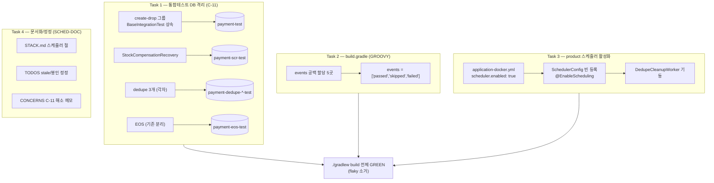

# CLEANUP-BATCH-D 구현 플랜

> 작성일: 2026-06-14

## 요약 브리핑

### Task 목록

1. **통합테스트 Flyway 그룹 전용 DB명 분리** — 마이그레이션 기반 통합테스트 4개에 create-drop 그룹(`payment-test`)과 다른 전용 DB명을 부여해 재사용 컨테이너 내 스키마 관리 방식 경합 제거 (C-11)
2. **빌드 스크립트 deprecated 공백 할당 정리** — `build.gradle` 5곳의 테스트 로깅 `events` 공백 할당을 리스트 할당으로 전환 (GROOVY)
3. **상품 서비스 청소 스케줄러 운영 활성화** — product `application-docker.yml` 에 `scheduler.enabled: true` 추가해 운영 docker 에서 만료행 청소 정상 기동 (운영 누락 복구)
4. **스케줄러 활성화 정책 문서화 + 문서 정정** — STACK.md 에 활성 게이트/서비스 매트릭스 추가, TODOS·CONCERNS 의 stale·봉인 오류 정정 (SCHED-DOC)

### 변경 후 전체 플로우차트

### 핵심 결정 → Task 매핑

| 설계 결정 (topic.md) | Task |
|---|---|
| C-11 = DB명 분리 (flyway-on 그룹 전용 DB명) | Task 1 |
| dedupe 3개 = 각자 전용 DB명 | Task 1 |
| GROOVY = events 5곳 리스트 할당 | Task 2 |
| product `scheduler.enabled: true` 추가 | Task 3 |
| SCHED-DOC = STACK.md 게이트/매트릭스 | Task 4 |
| CI Node20 stale 정정 / product 청소 봉인 정정 | Task 4 |

### 트레이드오프 / 후속 작업

- Task 1 검증은 flaky 특성상 단일 모듈 격리 실행으로는 회귀를 못 잡는다 → **전체 빌드 반복 실행**이 기준 (캐시 UP-TO-DATE 회피 위해 `--rerun-tasks`/clean).
- product 활성화는 단일 인스턴스 전제. scale-out 분산 락은 후속(멀티 인스턴스 묶음).
- 운영 코드(도메인/상태전이/멱등성/PG) 변경 0 — product yml 1줄(설정)이 유일한 운영 변경.

---

## 목표

빌드·테스트 위생 잔여 3건(통합테스트 Flyway 경합 flaky / Gradle deprecated 문법 / 스케줄러 활성화 문서 부재) 해소 + 게이트에서 발견한 상품 서비스 청소 스케줄러 운영 미작동 누락 복구. `./gradlew build` 전체(통합 포함)가 flaky 없이 GREEN 이면 완료.

## 컨텍스트

- 설계 문서: `docs/topics/CLEANUP-BATCH-D.md`
- 주요 변경 파일:
  - 테스트: `payment-service/src/test/.../integration/StockCompensationRecoveryIntegrationTest.java`, `.../infrastructure/dedupe/JdbcPaymentEventDedupeStore{,RoundTrip,Cleanup}Test.java`
  - 빌드: `build.gradle` (root + payment/pg/product/user)
  - 설정: `product-service/src/main/resources/application-docker.yml`
  - 문서: `docs/context/STACK.md`, `docs/context/TODOS.md`, `docs/context/CONCERNS.md`

## 진행 상황

- [x] Task 1: 통합테스트 Flyway 그룹 전용 DB명 분리
- [ ] Task 2: 빌드 스크립트 deprecated 공백 할당 정리
- [ ] Task 3: 상품 서비스 청소 스케줄러 운영 활성화
- [ ] Task 4: 스케줄러 활성화 정책 문서화 + 문서 정정

---

## 태스크

### Task 1: 통합테스트 Flyway 그룹 전용 DB명 분리 [tdd=false] [domain_risk=false]

**배경**: flyway-on 통합테스트가 create-drop 그룹과 같은 `payment-test` DB 를 공유 → 재사용 컨테이너에서 스키마 관리 방식(JPA create-drop vs Flyway) 경합 → 전체 빌드 시 `Found non-empty schema but no history` 로 ApplicationContext 로드 실패. `PaymentEosIntegrationTest`(`payment-eos-test`) 가 동일 처방의 선례.

**구현 (GREEN)**
- 아래 4개 통합테스트의 `withDatabaseName("payment-test")` 를 각자 전용 DB명으로 변경:
  - `StockCompensationRecoveryIntegrationTest.java:87` → `payment-scr-test`
  - `JdbcPaymentEventDedupeStoreTest.java:39` → `payment-dedupe-test`
  - `JdbcPaymentEventDedupeStoreRoundTripTest.java:63` → `payment-dedupe-roundtrip-test`
  - `JdbcPaymentEventDedupeStoreCleanupTest.java:34` → `payment-dedupe-cleanup-test`
- **무변경**: `BaseIntegrationTest.java`(create-drop, `payment-test` 점유 SoT), `PaymentEosIntegrationTest`(이미 `payment-eos-test`)
- (선택) DB명 분리 규칙을 짧은 주석으로 각 컨테이너 정의에 명시 — "flyway-on: create-drop `payment-test` 와 분리"

**완료 기준**
- `./gradlew :payment-service:test :payment-service:integrationTest` 단독 전건 GREEN (회귀 없음)
- `./gradlew build --rerun-tasks`(또는 clean build) 전체 모듈 통합테스트 동시 기동에서 C-11 ApplicationContext 로드 실패 **재현 안 됨** — 캐시 UP-TO-DATE 시 통합테스트 미실행이므로 반드시 `--rerun-tasks`/clean 으로 실제 실행 확인 (수회 반복)

**완료 결과**
- `StockCompensationRecoveryIntegrationTest` → `payment-scr-test`
- `JdbcPaymentEventDedupeStoreTest` → `payment-dedupe-test`
- `JdbcPaymentEventDedupeStoreRoundTripTest` → `payment-dedupe-roundtrip-test`
- `JdbcPaymentEventDedupeStoreCleanupTest` → `payment-dedupe-cleanup-test`
- 각 컨테이너 정의에 `// flyway-on: create-drop 그룹(payment-test)과 분리된 전용 DB명` 주석 추가
- `./gradlew :payment-service:test --rerun-tasks` → 512 passed / 0 failed
- `./gradlew :payment-service:integrationTest` → 34 passed / 0 failed
- `./gradlew build --rerun-tasks` (87 tasks) → BUILD SUCCESSFUL, C-11 ApplicationContext 로드 실패 재현 없음

---

### Task 2: 빌드 스크립트 deprecated 공백 할당 정리 [tdd=false] [domain_risk=false]

**배경**: Gradle 8.x deprecated 공백 할당(`propName value`). Gradle 10 에서 제거 예정. 전수 스캔 결과 `testLogging { events ... }` 5곳만 잔여 (`exceptionFormat` 등은 이미 `=` 할당).

**구현 (GREEN)**
- 아래 5곳 `events "passed", "skipped", "failed"` → `events = ['passed', 'skipped', 'failed']`:
  - `build.gradle:73`
  - `payment-service/build.gradle:108`
  - `pg-service/build.gradle:95`
  - `product-service/build.gradle:73`
  - `user-service/build.gradle:80`

**완료 기준**
- `./gradlew help --warning-mode=all` 또는 빌드 출력에서 `events` 관련 space-assignment deprecation 경고 소거
- `./gradlew test` 회귀 없음 (testLogging 동작 동일)

**완료 결과**
> (execute에서 채움)

---

### Task 3: 상품 서비스 청소 스케줄러 운영 활성화 [tdd=false] [domain_risk=false]

**배경**: product `SchedulerConfig` 는 `@ConditionalOnProperty(scheduler.enabled=true)` 게이트. 그러나 product 의 `application.yml`·`application-docker.yml`·compose env 어디에도 `scheduler.enabled=true` 가 없어 운영 docker 포함 어떤 표준 배포에서도 `DedupeCleanupWorker` 미기동 → `stock_commit_dedupe` 만료행 무한 누적. payment 는 `application-docker.yml`/`application-benchmark.yml` 에 이미 활성. (cleanup 은 `expires_at < now` 멱등 DELETE — 결제 도메인 무관, domain-expert 무해 확인)

**구현 (GREEN)**
- `product-service/src/main/resources/application-docker.yml` 에 최상위 `scheduler.enabled: true` 추가 (payment `application-docker.yml` 패턴과 정합)

**완료 기준**
- product docker 프로파일에서 `SchedulerConfig` 빈 등록 + `@EnableScheduling` 활성 → `DedupeCleanupWorker` 기동 (기동 로그 또는 기존 product 통합테스트 컨텍스트에서 확인)
- `./gradlew :product-service:test` 회귀 없음

**완료 결과**
> (execute에서 채움)

---

### Task 4: 스케줄러 활성화 정책 문서화 + 문서 정정 [tdd=false] [domain_risk=false]

**배경**: 스케줄러 활성화 정책이 코드에만 존재. 게이트 검수에서 (a) 활성 게이트가 worker 가 아닌 `SchedulerConfig` 임, (b) product 운영 미작동, (c) TODOS 의 "product 청소 ✅완료" 봉인이 실제 동작과 괴리, (d) CI Node20 항목 stale 임이 드러남.

**구현 (GREEN)**
- `docs/context/STACK.md`: 스케줄러 활성화 절 신설 (Flyway 절 인근). 내용 = 게이트 메커니즘(`SchedulerConfig` = `@EnableScheduling` + `@ConditionalOnProperty scheduler.enabled`, matchIfMissing false) + 서비스별 활성 매트릭스(payment: docker/benchmark 활성·로컬 비활성 / product: docker 활성[본 작업]).
- `docs/context/TODOS.md`: [SCHEDULER-ENABLED-GATE] 해소 반영, [CLEANUP-BATCH-B 후속] 의 Groovy 공백 할당·GitHub Actions Node20 항목 stale 정정(이미 해소), TC-11/TC-13-FOLLOW-2 product 청소 봉인을 "worker/게이트는 구현됐으나 활성화 플래그 누락 → 본 작업에서 정상화" 로 정정.
- `docs/context/CONCERNS.md`: C-11 해소 메모(상세 archive 이동은 ship 단계 context-update 에서).

**완료 기준**
- STACK.md 서술이 코드 실측과 일치(게이트 = SchedulerConfig, 매트릭스 정확)
- TODOS/CONCERNS 의 stale·봉인 오류 정정 완료 (남은 거짓 서술 없음)

**완료 결과**
> (execute에서 채움)

---

## 리뷰 처리

> (ship 단계에서 채움 — finding별 채택/스킵 + 사유)
