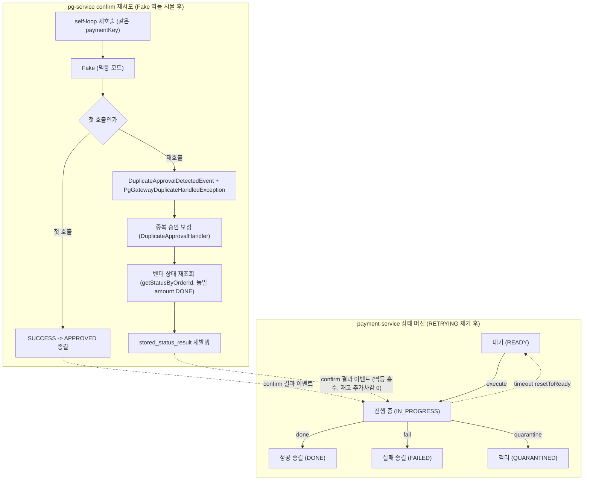

# CLEANUP-BATCH-E 구현 플랜

> 작성일: 2026-06-21

## 요약 브리핑

### Task 목록

1. **Task 1 — RETRYING 상태 전이 死 코드 제거** [domain_risk]: `RETRYING` enum 케이스 + `done`/`fail`/`canApplyConfirmResult`/`isTerminal` 의 RETRYING 절 + `toRetrying`/`markPaymentAsRetrying` + RETRYING 참조 테스트 전수 정리.
2. **Task 2 — RETRY_ATTEMPT 이벤트 체인 제거**: `action="retry"` 미사용 체인(aspect 브랜치 + `publishRetryAttempt` + `PaymentRetryAttemptedEvent` + enum) 독립 死 제거.
3. **Task 3 — outbox 실패 종결 + 재고 단건 API 제거**: `PaymentOutbox.toFailed` + `StockCachePort` 단건 5종 + 어댑터 구현 제거 (atomic 2종 잔존).
4. **Task 4 — main smoke 빈 Fake PG 멱등 시뮬** [domain_risk]: `FakePgGatewayStrategy` 가 동일 paymentKey 재호출 시 중복 승인 응답 모사.
5. **Task 5 — test mock 멱등 모드 + 흡수 통합 테스트** [domain_risk]: `FakePgGatewayAdapter` 멱등 모드 + self-loop -> duplicate 흡수 통합 테스트.

### 변경 후 전체 플로우차트

### 핵심 결정 -> Task 매핑

| topic.md 결정 | Task |
|:---:|:---:|
| RETRYING enum + 가드 브랜치 제거 | Task 1 |
| RETRY_ATTEMPT 체인 동반 제거 | Task 2 |
| `PaymentOutbox.toFailed` 메서드만 제거 / 재고 단건 5종 제거 | Task 3 |
| TC-9 대상 둘 다 (main + test mock) | Task 4 (main) + Task 5 (test mock) |
| TC-9 통합 테스트로 흡수 경로 검증 | Task 5 |

### 트레이드오프 / 후속 작업

- `retryCount` 필드는 증가 경로 소멸로 항상 0 고정 — 死 metric. 필드/컬럼 제거는 후속 TODO (admin/메트릭 다수 의존).
- enum 제거는 DB RETRYING row 0 전제 — Task 1 선행 확인(호출처 0 + Flyway 시드/제약 0)으로 갈음.
- TC-9 통합 테스트 단언은 payment DONE + 재고 1회분, pg_outbox row 카운트 비의존.

## 목표

비동기 confirm 死 코드(payment-service RETRYING 상태 전이 + RETRY_ATTEMPT 이벤트 체인 + outbox 실패 종결 + 재고 캐시 단건 API)를 제거하고, pg-service Fake PG 양쪽에 vendor 멱등성 시뮬을 추가해 재시도 자기루프의 중복 승인 흡수 경로를 통합 테스트로 검증 가능하게 한다. 전체 회귀 0.

## 컨텍스트

- 설계 문서: docs/topics/CLEANUP-BATCH-E.md
- 주요 변경 파일:
  - (제거) `PaymentEventStatus`, `PaymentEvent`, `PaymentCommandUseCase`, `DomainEventLoggingAspect`, `PaymentEventPublisher`, `PaymentRetryAttemptedEvent`, `PaymentHistoryEventType`, `PaymentOutbox`, `StockCachePort`, `StockCacheRedisAdapter` + 각 테스트
  - (변경/신규) `FakePgGatewayStrategy`(main), `FakePgGatewayAdapter`(test mock), pg 통합 테스트

## 진행 상황

- [x] Task 1: RETRYING 상태 전이 死 코드 제거
- [x] Task 2: RETRY_ATTEMPT 이벤트 체인 제거
- [ ] Task 3: outbox 실패 종결 + 재고 캐시 단건 API 死 메서드 제거
- [ ] Task 4: main smoke 빈 Fake PG 멱등 시뮬 추가
- [ ] Task 5: test mock Fake PG 멱등 모드 + 중복 흡수 통합 테스트

## 태스크

### Task 1: RETRYING 상태 전이 死 코드 제거 [tdd=false] [domain_risk=true]

RETRYING 상태로 진입하는 운영 경로가 호출처 0 으로 소멸했으므로 enum 케이스·도메인 전이·상태 머신 가드 분기를 일괄 제거한다. behavior-preserving (도달 불가 코드 제거).

**선행 확인**
- enum 제거 직전 `SELECT count(*) FROM payment_event WHERE status='RETRYING'` 0건 확인. DB row 0 보증 근거 두 축: (1) 코드상 RETRYING 진입 유일 경로(`markPaymentAsRetrying`) 운영 호출처 0, (2) Flyway 마이그레이션에 RETRYING 시드/CHECK 제약 0(status 는 VARCHAR(50)). docker DB 미기동 시 이 두 축으로 갈음.

**구현 (제거)**
- `domain/enums/PaymentEventStatus.java`: `RETRYING` enum 케이스 제거. `isTerminal()` 의 `case READY, IN_PROGRESS, RETRYING, QUARANTINED` 에서 RETRYING 제거, `canApplyConfirmResult()` 의 `case READY, IN_PROGRESS, RETRYING -> true` 에서 RETRYING 제거 (exhaustive switch 정합).
- `domain/PaymentEvent.java`: `toRetrying()` 메서드 삭제. `done()` 의 허용 집합에서 `RETRYING` 제거(IN_PROGRESS 만), `fail()` 의 허용 집합에서 `RETRYING` 제거(READY, IN_PROGRESS 만). `done()` 의 READY-거부 동작은 보존.
- `application/usecase/PaymentCommandUseCase.java`: `markPaymentAsRetrying()` 메서드 + 그에 달린 두 annotation(`@PublishDomainEvent(action="changed")` / `@PaymentStatusChange(toStatus="RETRYING", trigger="auto")`) 일괄 삭제.

**테스트 (동반 수정/삭제)** — RETRYING 참조 테스트 전수. `@EnumSource(names=...)` 의 존재하지 않는 enum 이름은 런타임 실패, 직접 상수 참조는 컴파일 실패 → 전부 손봐야 회귀 0.
- `PaymentEventTest`: `toRetrying_*` 테스트(약 604-668) 삭제. `done`/`fail`/`quarantine` 등의 `@EnumSource(names={...,"RETRYING",...})` 에서 RETRYING 파라미터 제거(유효 source 219/235/253/312/331/431/692/762/840/959/1026 등 전수). null approvedAt 케이스(278)의 RETRYING source 정리.
- `PaymentCommandUseCaseTest`: `markPaymentAsRetrying_*` 테스트(99-110) 삭제.
- `domain/enums/PaymentEventStatusSplitMethodTest`: `canApplyConfirmResult` 진입 가능 source(16)에서 RETRYING 제거.
- `application/usecase/PaymentConfirmResultUseCaseGuardSkipTest`: `@EnumSource(names={"READY","IN_PROGRESS","RETRYING"})`(104) 에서 RETRYING 제거.
- `application/usecase/QuarantineCompensationHandlerTest`: 직접 참조 `buildPaymentEvent(PaymentEventStatus.RETRYING)`(50) 를 `IN_PROGRESS` 등 잔존 비종결 상태로 교체. `@EnumSource(names={"IN_PROGRESS","RETRYING"})`(123) 에서 RETRYING 제거.
- `infrastructure/aspect/PaymentStatusMetricsAspectTerminalTest`: `@EnumSource(names={...,"RETRYING",...})`(78) 에서 RETRYING 제거.

**완료 기준**
- `RETRYING` 심볼이 main + test 코드에서 0건 (grep 확인). `INVALID_STATUS_TO_RETRY` 에러코드는 보존(PaymentOutbox 가 사용).
- `./gradlew :payment-service:test` 회귀 0 (RETRYING 참조 테스트 전수 정리로 컴파일/런타임 실패 없음).

**완료 결과**
- `PaymentEventStatus`: `RETRYING` enum 케이스 제거. `isTerminal()`/`canApplyConfirmResult()` switch 양쪽에서 RETRYING 절 삭제(exhaustive 유지).
- `PaymentEvent`: `toRetrying()` 삭제. `done()` 허용 집합 IN_PROGRESS 단독, `fail()` 허용 집합 READY/IN_PROGRESS 로 축소.
- `PaymentCommandUseCase`: `markPaymentAsRetrying()` + 부착 annotation 2종 삭제.
- 테스트 정리: `PaymentEventTest`(toRetrying_* 4종 삭제 + EnumSource 9곳 RETRYING 제거 + null approvedAt 케이스 source 정리), `PaymentCommandUseCaseTest`(markPaymentAsRetrying_* 삭제), `PaymentEventStatusSplitMethodTest`, `PaymentConfirmResultUseCaseGuardSkipTest`, `QuarantineCompensationHandlerTest`(직접 참조 IN_PROGRESS로 교체 + EnumSource 정리), `PaymentStatusMetricsAspectTerminalTest`.
- `INVALID_STATUS_TO_RETRY` 에러코드 + `retryCount` 필드 보존(PaymentOutbox.incrementRetryCount 사용 확인).
- `RETRYING` 심볼 main+test 0건 grep 확인. `./gradlew :payment-service:test` 459 tests, 459 passed, 0 failed.

### Task 2: RETRY_ATTEMPT 이벤트 체인 제거 [tdd=false] [domain_risk=false]

`@PublishDomainEvent(action="retry")` 사용처가 0 이라 retry 이벤트 발행 체인이 도달 불가. RETRYING 전이와 독립적으로 死.

**구현 (제거)**
- `infrastructure/aspect/DomainEventLoggingAspect.java`: `processResultAndPublishEvent` 의 `case "retry"` 브랜치 제거.
- `application/publisher/PaymentEventPublisher.java`: `publishRetryAttempt()` 메서드 + 관련 import 제거.
- `domain/event/PaymentRetryAttemptedEvent.java`: 파일 삭제.
- `domain/event/PaymentHistoryEventType.java`: `RETRY_ATTEMPT` enum 케이스 제거 (다른 참조처 0 확인 후).

**테스트 (동반 수정/삭제)**
- `PaymentEventPublisherTest`(존재 시): `publishRetryAttempt` 테스트 삭제.
- `DomainEventLoggingAspectTest`(존재 시): `action="retry"` 케이스 단언 삭제.

**완료 기준**
- `RETRY_ATTEMPT` / `publishRetryAttempt` / `PaymentRetryAttemptedEvent` 심볼 main 0건.
- `PaymentHistoryEventType` 잔존 케이스가 실제 사용처와 정합.
- `./gradlew :payment-service:test` 회귀 0.

**완료 결과**
- `DomainEventLoggingAspect.processResultAndPublishEvent`: `case "retry"` 브랜치 제거 (`changed`/`created`/`default` 잔존).
- `PaymentEventPublisher`: `publishRetryAttempt()` 메서드 + `PaymentRetryAttemptedEvent` import 제거.
- `PaymentRetryAttemptedEvent.java` 파일 삭제.
- `PaymentHistoryEventType`: `RETRY_ATTEMPT` 케이스 제거 (`PAYMENT_CREATED`/`STATUS_CHANGE` 잔존, 다른 참조처 grep 0건 확인 후 제거).
- `[Rule 1]` `EventType.DOMAIN_EVENT_RETRY_PUBLISHED` 동반 제거 — `publishRetryAttempt()` 제거로 유일 사용처가 사라져 도달 불가 enum 케이스가 됨. PLAN 명시 대상은 아니었으나 동일 체인의 직접 동반 死 코드로 판단해 같이 제거.
- `PaymentEventPublisherTest`/`DomainEventLoggingAspectTest` 파일 자체가 부재해 동반 정리 대상 없음.
- `RETRY_ATTEMPT`/`publishRetryAttempt`/`PaymentRetryAttemptedEvent`/`DOMAIN_EVENT_RETRY_PUBLISHED` 심볼 main+test 0건 grep 확인. `./gradlew :payment-service:test` 459 tests, 459 passed, 0 failed.

### Task 3: outbox 실패 종결 + 재고 캐시 단건 API 死 메서드 제거 [tdd=false] [domain_risk=false]

호출처 0 인 outbox 실패 종결 메서드와 Lua atomic 경로로 대체된 재고 캐시 단건 API 5종을 제거한다.

**선행 확인**
- `decrement`/`rollback`/`findCurrent`/`set`/`current` 단건 메서드 운영 호출처 0 을 grep 으로 최종 재확인 (`decrementAtomic`/`compensateAtomic` 와 혼동 주의).

**구현 (제거)**
- `domain/PaymentOutbox.java`: `toFailed()` 메서드 삭제. `PaymentOutboxStatus.FAILED` enum 은 보존(`isTerminal()` 참조).
- `application/port/out/StockCachePort.java`: `decrement`/`rollback`/`findCurrent`/`set`/`current` 5종 메서드 시그니처 + javadoc 제거. `decrementAtomic`/`compensateAtomic` 잔존.
- `infrastructure/cache/StockCacheRedisAdapter.java`: 위 5종 구현 메서드 + 보조 코드 제거.

**테스트 (동반 수정/삭제)**
- `PaymentOutboxTest`: `toFailed_*` 테스트 삭제.
- `StockCacheRedisAdapterTest`: 단건 5종 관련 테스트 삭제. atomic 메서드 테스트 보존.
- `StockRetentionIntegrationTest`: `verify(stockCachePort, never()).rollback(...)` 등 제거된 메서드 참조 정리.

**완료 기준**
- `StockCachePort` 에 atomic 2종 + 제거 대상 외 메서드만 잔존, 단건 5종 0건.
- `PaymentOutbox.toFailed` 0건, `FAILED` enum 보존.
- `./gradlew :payment-service:test` 회귀 0.

**완료 결과**
> (execute에서 채움)

### Task 4: main smoke 빈 Fake PG 멱등 시뮬 추가 [tdd=true] [domain_risk=true]

`FakePgGatewayStrategy`(`@ConditionalOnProperty pg.gateway.type=fake`) 가 동일 paymentKey 재호출 시 실 벤더의 중복 승인 응답을 모사하도록 한다. docker 5-service chain smoke 의 retry 시나리오 정합.

**테스트 (RED)**
- `FakePgGatewayStrategyTest`:
  - `confirm_첫호출_SUCCESS_반환` — 신규 paymentKey 는 기존과 동일 SUCCESS.
  - `confirm_동일paymentKey_재호출_DuplicateHandledException_및_이벤트발행` — 재호출 시 `PgGatewayDuplicateHandledException` throw + `DuplicateApprovalDetectedEvent` 발행 (Mockito `ApplicationEventPublisher` verify).
  - `getStatusByOrderId_처리된orderId_happy응답` — 처리된 orderId 는 DONE 상태 `PgStatusResult` 반환 (기존 `UnsupportedOperationException` 대체).
  - `getStatusByOrderId_미처리orderId_예외` — 처리 기록 없는 orderId 는 기존 계약대로 예외(선택).

**구현 (GREEN)**
- `infrastructure/gateway/fake/FakePgGatewayStrategy.java`:
  - `ConcurrentHashMap<String, ...>` 처리 기록 필드 추가 (key=paymentKey 또는 orderId). 첫 호출 판정은 `putIfAbsent`/`computeIfAbsent` 로 atomic.
  - `confirm()`: 첫 호출 SUCCESS + 기록, 재호출 시 `DuplicateApprovalDetectedEvent` 발행 + `PgGatewayDuplicateHandledException` throw.
  - `getStatusByOrderId()`: 처리된 orderId 는 happy-path(DONE) `PgStatusResult` 반환. **`amount` 는 최초 confirm 의 amount 를 그대로 반환** — `DuplicateApprovalHandler.handleDbExists` 가 inbox.amount != vendor.amount 면 QUARANTINED(AMOUNT_MISMATCH) 로 분기하므로, amount 정합이 깨지면 최종 상태가 DONE 이 아닌 QUARANTINED 가 된다.
  - 생성자에 `ApplicationEventPublisher` 주입.

**완료 기준**
- 위 테스트 pass. 첫 호출 happy-path 무변경(기존 smoke 무영향).
- `./gradlew :pg-service:test` 회귀 0.

**완료 결과**
> (execute에서 채움)

### Task 5: test mock Fake PG 멱등 모드 + 중복 흡수 통합 테스트 [tdd=true] [domain_risk=true]

통합 테스트가 주입하는 test mock `FakePgGatewayAdapter` 에 상태 기반 멱등 모드를 추가하고, 재시도 자기루프 -> 벤더 재호출 -> 중복 승인 흡수(DuplicateApprovalHandler) -> 최종 결제 종결 경로를 통합 테스트로 검증한다.

**테스트 (RED) — 통합 테스트가 RED**
- `pg/integration/...IntegrationTest` (기존 `PgConfirmListenerSplitIntegrationTest` 패턴 재사용 또는 신규):
  - `재시도_자기루프_중복승인_흡수_최종종결` — 첫 confirm SUCCESS 후 동일 paymentKey self-loop 재호출 시 duplicate 흡수 경로 진입, 최종 결제 상태 DONE + 재고 정합 단언.
  - 단언 기준값: **payment 종결 상태 = DONE**, **재고 차감량 = 1회분(중복 흡수로 추가 차감 0 — payment_event_dedupe + product dedupe 가 이중 차감 흡수)**. pg_outbox row 카운트에 의존하지 않음 (흡수 핸들러 이벤트+예외 이중 경로로 2건 INSERT 가능).

**구현 (GREEN)**
- `pg/mock/FakePgGatewayAdapter.java`: 상태 기반 멱등 모드 추가 — "이미 SUCCESS 처리된 paymentKey 재호출 시 `PgGatewayDuplicateHandledException` + `DuplicateApprovalDetectedEvent`". 기존 `throwOnConfirm` 일회성 주입과 공존하도록 모드 플래그/설정 메서드(예: `enableIdempotentDuplicate()`). `getStatusByOrderId` 는 처리된 orderId 에 대해 **최초 confirm 과 동일 amount** 의 DONE 응답 (amount 정합 깨지면 흡수 핸들러가 QUARANTINED 분기).
- 필요 시 `FakePgGatewayAdapterToss`/`Nicepay` 변형에도 동일 반영.

**완료 기준**
- 통합 테스트 pass — self-loop 재호출이 duplicate 흡수 경로를 타고 최종 DONE + 재고 1회분 차감.
- 기존 mock 사용 테스트 회귀 0.
- `./gradlew :pg-service:test` 회귀 0.

**완료 결과**
> (execute에서 채움)

## 리뷰 처리

> (ship 단계에서 채움 — finding별 채택/스킵 + 사유)
