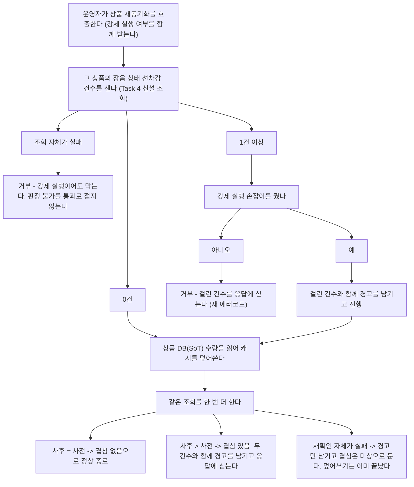

# 가벼운 후속 정리 6건 구현 플랜

> 작성일: 2026-09-10

## 요약 브리핑

### Task 목록

1. **멱등키 산출 규칙을 고정 기대값으로 잠근다** — 고정 입력에 대한 리터럴 해시 1건을 박아, 산출식이 바뀌면 그 테스트만 깨지게 한다
2. **테스트용 결제 저장소의 조회를 방어적 복사로 통일한다** — 조회가 저장소 참조를 그대로 돌려줘 조건부 갱신이 정상 케이스를 충돌로 오판하던 것을 없앤다
3. **관리자 벤더 조회가 부분 취소를 실패로 묶던 것을 푼다** — 실패 목록에서 빼 확인 불가로 떨어뜨린다
4. **선차감 기록의 상품별 미종결 건수 조회를 추가한다** — 5번 가드가 쓸 조회를 포트·JPA·Fake 세 곳에 먼저 만든다
5. **재동기화에 진행 중 선차감 가드와 강제 실행 손잡이를 넣는다** — 사전 조회로 막고, 강제 실행을 허용하되, 덮어쓴 뒤 재확인해 겹침을 알린다
6. **벤치 결과에 파티션과 PG 컨슈머 동시성을 기록한다** — 파티션은 브로커에서 되읽은 실제 값으로 남긴다
7. **가드레일 훅 자체를 검증하는 셸 테스트와 CI 관문을 붙인다** — 픽스처에 가짜 빌드를 심어 판정 로직을 종료 코드로 확인한다

### 변경 후 재동기화 경로 (Task 4~5 합류 지점)

### 핵심 결정 -> Task 매핑

| 설계 결정 | Task |
|:---:|:---:|
| 부분 취소를 실패 목록에서 빼 확인 불가로 떨어뜨린다 | 3 |
| 부분 취소 종결을 차단하지 않는다 / 계약 테스트를 추가하지 않는다 | 3 (변경 없음으로 이행) |
| 가드 판정 기준은 그 상품의 잡음 상태 기록 존재 여부 | 4, 5 |
| 가드는 기본 거부 + 강제 실행 손잡이 | 5 |
| 확인~덮어쓰기 사이의 창은 막지 않고 재확인으로 드러낸다 | 5 |
| 가드 조회가 실패하면 거부한다 | 5 |
| 포트 메서드는 기존 잔량 조회 옆에, 어댑터는 infrastructure 에 | 4 |
| 거부는 기존 상태 예외 재사용 + 새 에러코드 | 5 |
| 멱등키 산출 규칙을 고정값으로 잠근다 | 1 |
| 테스트용 저장소 조회도 방어적 복사 + 자식 주문 깊은 복사 | 2 |
| 벤치 파티션은 브로커에서 되읽은 실제 값 | 6 |
| 훅 검증은 셸 스크립트 + 실패시키는 CI job | 7 |
| 훅 검증은 픽스처 + 가짜 빌드로 실제 실행을 대체한다 | 7 |
| 항목별 커밋, PR 하나 | 전체 |

### 트레이드오프 / 후속 작업

- 겹침 판정은 건수 비교라 "어떤 기록이 새로 열렸는지"까지는 모른다. 사전 대비 증가만 본다
- 강제 실행은 위험을 알고 넘기는 손잡이다. 사용 사실과 걸린 건수만 남고 결과를 막지는 않는다
- 상품 + 상태 조합 인덱스는 두지 않는다. 운영자가 직접 부르는 단발 조회라 지금은 필요 없다
- 부분 취소여도 격리 종결은 계속 허용된다 — 표시와 기록이 정확해질 뿐이다
- 후속: 선차감 흔적 만료 임박 알람, 파티션·컨슈머 동시성 기본값 승격 판단, 위키의 끊긴 참조 2곳

---

## 목표

후속 목록의 소규모 항목 6건이 각각 코드로 해소되고, 전 모듈 테스트에 회귀가 없다.

## 컨텍스트

- 설계 문서: `docs/topics/CLEANUP-BATCH-F.md`
- 이슈: #155
- 주요 변경 파일
  - `payment-service/.../application/IdempotencyKeyHasher.java` (테스트만)
  - `payment-service/.../mock/FakePaymentEventRepository.java`
  - `pg-service/.../application/service/PgVendorStatusQueryServiceImpl.java`
  - `payment-service/.../application/port/out/StockHoldRecordRepository.java` + JPA 어댑터 + Fake
  - `payment-service/.../application/usecase/StockResyncUseCase.java` + `presentation/StockAdminController.java`
  - `scripts/bench-scaleout-cycle.sh`
  - `scripts/test-hooks.sh` (신설) + `.github/workflows/ci.yml`

## 진행 상황

- [ ] Task 1: 멱등키 산출 규칙을 고정 기대값으로 잠근다
- [ ] Task 2: 테스트용 결제 저장소의 조회를 방어적 복사로 통일한다
- [ ] Task 3: 관리자 벤더 조회가 부분 취소를 실패로 묶던 것을 푼다
- [ ] Task 4: 선차감 기록의 상품별 미종결 건수 조회를 추가한다
- [ ] Task 5: 재동기화에 진행 중 선차감 가드와 강제 실행 손잡이를 넣는다
- [ ] Task 6: 벤치 결과에 파티션과 PG 컨슈머 동시성을 기록한다
- [ ] Task 7: 가드레일 훅 자체를 검증하는 셸 테스트와 CI 관문을 붙인다

## 태스크

### Task 1: 멱등키 산출 규칙을 고정 기대값으로 잠근다 [tdd=false] [domain_risk=true]

프로덕션 코드 변경이 없는 테스트 단독 추가라 RED / GREEN 이 갈리지 않는다. 커밋 타입은 `test:`.

**산출물**
- `payment-service/src/test/.../application/IdempotencyKeyHasherTest.java` 에 케이스 1건 추가
  - `hash_고정입력_기대해시와_일치한다` — 사용자 1번 + 상품 2건(정렬 전 순서로 넣는다)에 대해 리터럴 64자 16진수 기대값과 `isEqualTo` 비교
  - 기대값은 지어내지 않는다 — 현재 구현으로 실제 산출한 값을 박고, 그 값을 뽑은 방법을 테스트 주석에 남긴다
  - 주석에 이 테스트가 깨지는 의미를 적는다: 산출식을 의도적으로 바꾼 경우에만 값을 함께 고친다

**완료 기준**
- 추가한 테스트가 pass 하고, 산출식의 어느 한 요소(사용자 식별자 / 상품 번호 / 수량 / 구분자)를 일부러 바꾸면 그 테스트만 실패한다 (수동 확인 후 원복)
- `./gradlew :payment-service:test` 회귀 없음

**완료 결과**
> (execute에서 채움)

---

### Task 2: 테스트용 결제 저장소의 조회를 방어적 복사로 통일한다 [tdd=true] [domain_risk=false]

**테스트 (RED)**
- `payment-service/src/test/.../mock/FakePaymentEventRepositoryTest.java` (신설)
  - `findByOrderId_반환객체를_변경해도_저장소_상태가_유지된다` — 조회 결과에 도메인 전이를 적용한 뒤 다시 조회해 상태가 그대로인지 확인
  - `findById_반환객체의_자식주문_리스트가_저장소와_분리된다` — 반환된 자식 주문 목록을 건드려도 저장소 쪽이 안 바뀌는지 확인
- `payment-service/src/test/.../application/service/PaymentReconcilerFakeRepositoryTest.java` (신설)
  - `실제_리컨실러와_실제_위임메서드_조립시_결과대기_전이가_성공한다` — 진행 중 상태로 임계를 넘긴 결제를 넣고 실제 `PaymentReconciler` + 실제 `PaymentCommandUseCase` + 이 Fake 를 조립해 결과 대기로 전이되는지 확인. 지금은 조회가 저장소 참조를 그대로 돌려줘 조건부 갱신이 항상 충돌로 판정하므로 실패한다
  - AOP 가 걸린 위임 메서드를 프록시 없이 직접 조립하는 형태라, 반환값 계약(전이 성공 시 객체 / 충돌 시 null)만 단정한다

**구현 (GREEN)**
- `FakePaymentEventRepository` 의 `findById` / `findByOrderId` / `findByOrderIdForUpdate` / `findReadyPaymentsOlderThan` / `findInProgressOlderThan` / `findAllByStatus` / `findAwaitingResultOlderThan` 이 모두 `copyOf` 를 거치게 한다
- `copyOf` 가 자식 주문 목록을 깊게 복사하도록 고친다 (현재는 리스트 참조를 그대로 넘긴다)
- 조건부 갱신 계열(`resolve*`)은 저장소 안의 객체를 직접 다뤄야 하므로 **자기 자신은** 복사하지 않는다 — 그 이유를 주석에 남긴다
- 다만 `resolve*` 3종은 내부에서 `findById` 를 거친다. 그 조회가 복사본을 돌려주게 되므로, 전이를 적용한 뒤 `store.put` 으로 되쓰는 경로가 그대로 살아 있는지 구현 중 확인한다 — 되쓰기가 빠지면 조건부 갱신이 조용히 무효가 된다

**완료 기준**
- 신설 테스트 3건 pass
- `./gradlew :payment-service:test` 회귀 없음 — 조회 객체를 고쳐 저장소 반영을 기대하던 기존 테스트가 있으면 저장을 명시하도록 고친다

**완료 결과**
> (execute에서 채움)

---

### Task 3: 관리자 벤더 조회가 부분 취소를 실패로 묶던 것을 푼다 [tdd=true] [domain_risk=true]

**테스트 (RED)**
- `pg-service/src/test/.../application/service/PgVendorStatusQueryServiceTest.java` 에 케이스 추가
  - `getVendorStatus_부분취소는_확인불가로_판정한다` — 벤더 조회가 부분 취소를 돌려줄 때 판정이 확인 불가이고, 세부 상태 문자열에는 `PARTIAL_CANCELED` 가 그대로 실리는지 확인
  - `getVendorStatus_나머지_실패상태는_실패로_유지된다` — 중단 / 전체 취소 / 만료 3종을 `@ParameterizedTest @EnumSource` 로 돌려 실패 판정이 유지되는지 확인 (부분 취소만 빠졌음을 고정)

**구현 (GREEN)**
- `PgVendorStatusQueryServiceImpl.FAILED_STATUSES` 에서 `PgPaymentStatus.PARTIAL_CANCELED` 제거
- **기존 `실패_상태면_실패됨을_반환한다` 의 `@EnumSource` 목록에서 `PARTIAL_CANCELED` 를 뺀다** — 그 케이스가 지금은 부분 취소도 실패로 기대하고 있어, 빼지 않으면 GREEN 직후 레드가 된다
- 그 집합의 Javadoc 에 부분 취소를 뺀 이유를 적는다 — 자동 확정 관문이 이 상태를 전용 사유로 격리시키는 것과 방향을 맞추고, 실패로 표시해 운영자가 안전 종결을 누르는 것을 막기 위함

**완료 기준**
- 추가한 테스트 pass. 기존 `실패_상태면_실패됨을_반환한다` 는 목록에서 부분 취소를 뺀 상태로 pass — "회귀 없음"이 "손대지 않는다"는 뜻이 아니다
- `./gradlew :pg-service:test` 회귀 없음

**완료 결과**
> (execute에서 채움)

---

### Task 4: 선차감 기록의 상품별 미종결 건수 조회를 추가한다 [tdd=true] [domain_risk=false]

Task 5 의 가드가 쓰는 조회다. 포트와 두 구현(JPA / Fake)을 소비처보다 먼저 만든다.

**테스트 (RED)**
- `payment-service/src/test/.../infrastructure/repository/StockHoldRecordRepositoryImplTest.java` 에 케이스 추가 (기존 `@DataJpaTest` + MySQL Testcontainers 형식 그대로)
  - `countNoiseByProductId_그_상품의_잡음_기록만_센다` — 같은 상품의 잡음 2건 + 확정 1건 + 되돌림 1건 + 다른 상품 잡음 1건을 넣고 2가 나오는지 확인
  - `countNoiseByProductId_기록이_없으면_0을_반환한다`
- `payment-service/src/test/.../mock/FakeStockHoldRecordRepositoryTest.java` (없으면 신설)
  - Fake 가 같은 시맨틱을 내는지 같은 구성으로 확인

**구현 (GREEN)**
- `application/port/out/StockHoldRecordRepository` 에 `long countNoiseByProductId(Long productId)` 추가 — 기존 미회수 잔량 조회(`countNoise`) 바로 아래에 둔다
- `infrastructure/repository/JpaStockHoldRecordRepository` 에 파생 쿼리 `countByProductIdAndStatus` 추가
- `StockHoldRecordRepositoryImpl` 에 위임 구현
- `mock/FakeStockHoldRecordRepository` 에 같은 시맨틱 구현
- 상품 + 상태 조합 인덱스가 없어 상품 수가 커지면 스캔 범위가 넓어진다는 점을 포트 Javadoc 에 한 줄로 남긴다 — 운영자가 직접 부르는 단발 조회라 이번엔 인덱스를 추가하지 않는다

**완료 기준**
- 추가한 테스트 pass
- `./gradlew :payment-service:test` 회귀 없음

**완료 결과**
> (execute에서 채움)

---

### Task 5: 재동기화에 진행 중 선차감 가드와 강제 실행 손잡이를 넣는다 [tdd=true] [domain_risk=true]

**테스트 (RED)**
- `payment-service/src/test/.../application/usecase/StockResyncUseCaseTest.java` 에 케이스 추가
  - `resyncStockCache_미종결_선차감이_있으면_거부한다` — 사전 건수가 1 이상이고 강제 실행이 아니면 상태 예외가 나고 캐시 덮어쓰기가 호출되지 않는지 확인
  - `resyncStockCache_강제실행이면_미종결_선차감이_있어도_덮어쓴다` — 예외 없이 진행하고 덮어쓰기가 호출되는지 확인
  - `resyncStockCache_사전조회가_실패하면_강제실행이어도_거부한다` — 건수 조회가 예외를 던질 때 강제 실행 참 / 거짓 **두 경우 모두** 캐시 덮어쓰기가 호출되지 않는지 `@ParameterizedTest` 로 확인. 판정 불가를 통과로 접지 않는다는 원칙이 강제 실행 경로에서도 지켜지는지 고정한다
  - `resyncStockCache_사후_건수가_늘면_겹침을_알린다` — 사전 0건 / 사후 1건일 때 결과에 겹침 표시가 실리는지 확인
  - `resyncStockCache_강제실행_경로에서_사후_건수가_늘면_겹침을_알린다` — 사전 2건 / 사후 3건일 때도 겹침 표시가 실리는지 확인. 강제 실행은 사전 건수가 이미 1 이상인 경우라, 판정이 "사전 0건"에 묶여 있으면 이 경로에서 재확인이 영영 안 걸린다
  - `resyncStockCache_사후_건수가_그대로면_겹침없음으로_끝난다` — 사전과 사후가 같으면(0건이든 2건이든) 겹침 표시가 꺼져 있는지 확인
  - `resyncStockCache_사후조회가_실패해도_정상_종료한다` — 재확인이 예외를 던져도 밖으로 전파되지 않고 겹침 표시만 미상으로 남는지 확인
- 컨트롤러 계층은 별도 테스트를 만들지 않는다 — 손잡이 전달과 응답 필드는 use-case 테스트가 이미 고정한다

**구현 (GREEN)**
- `exception/common/PaymentErrorCode` 에 새 코드 1건 추가 (다음 번호는 `E03047`) — 진행 중 선차감이 있어 재동기화를 거부한다는 메시지
- `StockResyncUseCase.resyncStockCache` 를 상품 번호 + 강제 실행 여부를 받도록 바꾼다
  - **사전 조회는 강제 실행 여부와 무관하게 항상 먼저 실행한다.** 강제 실행이 우회하는 것은 건수 판정뿐이고 조회 자체가 아니다 — 조회를 건너뛰면 사후 재확인의 기준값조차 없이 덮어쓰게 된다
  - 사전 조회가 실패하면 강제 실행 여부와 상관없이 거부한다. 판정 불가를 통과로 접지 않는다
  - 사전 건수가 0이 아니고 강제 실행이 아니면 `PaymentStatusException` 으로 거부한다 (기존 상태 예외 재사용, 400 매핑도 그대로)
  - 강제 실행으로 통과한 경우 걸린 건수와 함께 경고를 남긴다
  - 덮어쓴 뒤 같은 조회를 한 번 더 한다. 겹침 판정은 **사후 건수가 사전 건수보다 크면** 이다 — "사전 0건" 기준으로 짜면 강제 실행 경로에서 절대 성립하지 않는다
  - 겹쳤으면 사전·사후 건수와 함께 경고를 남기고 결과에 겹침을 싣는다
  - 사후 재확인 자체가 실패하면 예외를 밖으로 내보내지 않는다 — 덮어쓰기는 이미 끝난 뒤라 실패로 보고하면 운영자가 덮어쓰기가 안 됐다고 오인한다. 경고를 남기고 겹침 표시는 미상으로 둔다
- `presentation/port/StockAdminService` 시그니처와 `presentation/StockAdminController.resync` 에 강제 실행 파라미터(기본 거짓)를 추가하고, `StockResyncResponse` 에 겹침 필드를 더한다 — 값은 **겹침 있음 / 없음 / 미상 세 가지**다(재확인 실패가 미상). 참·거짓 두 값으로 접으면 재확인이 실패한 경우가 '겹침 없음'으로 보고돼 없는 안전을 보고하게 된다
- use-case 반환 타입을 수량 하나에서 결과 값 객체로 바꾼다 — 겹침 여부를 실어 나르기 위함
- **기존 `resyncStockCache_setsRedisToRdbStock` 를 새 시그니처(강제 실행 거짓)와 새 반환 타입(수량 필드 단언)에 맞춰 고친다** — 그대로 두면 테스트 컴파일이 깨진다

**완료 기준**
- 추가한 테스트 7건 pass, 기존 케이스는 새 시그니처로 고쳐진 채 pass
- `./gradlew :payment-service:test` 회귀 없음
- 관리자 REST 가 손잡이 없이 호출되면 기존과 같은 동작을 유지한다 (응답에 겹침 필드만 추가)

**완료 결과**
> (execute에서 채움)

---

### Task 6: 벤치 결과에 파티션과 PG 컨슈머 동시성을 기록한다 [tdd=false] [domain_risk=false]

**산출물**
- `scripts/bench-scaleout-cycle.sh`
  - 결과 JSON 조립부의 `conditions` 블록에 `kafka_topic_partitions` 와 `pg_consumer_concurrency` 추가
  - 파티션은 환경변수가 아니라 결과를 쓰는 시점에 브로커에서 되읽는다 — 되읽기에 실패하면 값을 지어내지 않고 미상으로 남긴다
  - `PG_CONSUMER_CONCURRENCY` 는 이 스크립트가 참조한 적이 없으므로 기본값 처리를 `docker-compose.benchmark.yml` 과 같은 값으로 맞춘다
  - 스크립트 상단 환경변수 주석에 두 손잡이를 추가한다

**완료 기준**
- 결과 조립 구간을 실제 사이클 없이 돌려 두 키가 JSON 에 들어가는지 확인 (파티션 되읽기 성공 / 실패 두 경우 모두)
- `bash -n scripts/bench-scaleout-cycle.sh` 통과, shellcheck 경고 없음(기존 수준 유지)

**완료 결과**
> (execute에서 채움)

---

### Task 7: 가드레일 훅 자체를 검증하는 셸 테스트와 CI 관문을 붙인다 [tdd=false] [domain_risk=false]

**산출물**
- `scripts/test-hooks.sh` (신설) — 픽스처마다 훅 스크립트의 종료 코드를 확인한다
  - 턴 종료 훅: 임시 git 저장소를 만들고 가짜 `gradlew` 를 심어 통과·실패를 지시한다. 확인 대상 판정
    - 읽기 전용 에이전트 종류면 건너뛴다 (종료 0)
    - 종류가 비어 있는 종료 이벤트면 건너뛴다 (종료 0)
    - 변경이 없으면 건너뛴다 (종료 0)
    - 문서만 바뀌면 건너뛴다 (종료 0)
    - 코드가 바뀌고 가짜 빌드가 실패하면 막는다 (종료 2)
    - 같은 변경 상태로 다시 부르면 재판정하지 않는다 (종료 0)
    - 세션 차단 한도를 넘으면 더 막지 않는다 (종료 0)
  - 편집 시점 훅: 대상이 아닌 파일(비 `.java`, 저장소 밖 경로)은 건너뛰고(종료 0), 위반이 있는 `.java` 픽스처에는 종료 2 를 낸다
  - 위반 케이스를 돌리기 전에 **테스트 쪽이** 검사기 실행 준비 상태를 먼저 확인하고, 준비되지 않았으면 그 케이스를 건너뛰지 않고 테스트를 실패로 끝낸다 — 훅은 준비 실패 시 조용히 넘기도록 의도적으로 짜여 있어(작업을 막지 않기 위함), 테스트까지 같이 넘어가면 검사기가 꺼진 채로도 초록불이 뜬다. **훅의 그 동작 자체는 이번에 바꾸지 않는다** — 준비가 안 된 상태에서 종료 0 을 내는 것도 기대 동작으로 함께 고정한다
  - 테스트 실행에 필요한 도구(`jq` / `python3` / `git`)가 없으면 통과가 아니라 실패로 끝낸다
  - 픽스처와 임시 저장소는 스크립트가 만들고 끝나면 지운다. 저장소에 픽스처 디렉토리를 남기지 않는다
- `.github/workflows/ci.yml` 에 job 1개 추가 — 지침 문서 검사 job 과 같은 자리(서비스 fan-out 과 독립)에 두되, 그쪽과 달리 **실패시킨다**. 편집 시점 훅 검증에 검사기 실행이 필요하므로 Java 준비와 분류기 classpath 생성 단계를 포함한다

**완료 기준**
- 로컬에서 `bash scripts/test-hooks.sh` 가 종료 0 으로 끝나고, 각 픽스처의 기대·실제 종료 코드를 출력한다
- 훅 스크립트의 판정 한 줄을 일부러 무력화하면 해당 케이스가 실패로 잡힌다 (수동 확인 후 원복)
- `bash -n scripts/test-hooks.sh` 통과
- 저장소 작업 트리가 스크립트 실행 전후로 동일하다

**완료 결과**
> (execute에서 채움)

## 리뷰 처리

> (ship 단계에서 채움 — finding별 채택/스킵 + 사유)
