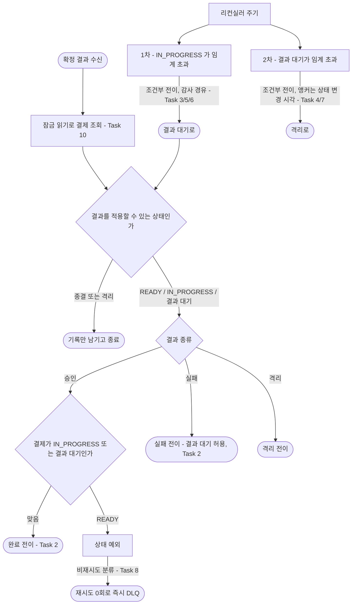

# 적용 불가 상태의 확정 결과 처리 구현 플랜

> 작성일: 2026-09-05

## 목표

되돌아간 결제가 늦게 온 확정 결과를 받아들이고, 남는 거부는 재시도 없이 격리 큐로 가며, 리컨실러가 확정된 결제를 덮어쓰지 않는 상태로 만든다.

## 컨텍스트

- 설계 문서: `docs/topics/CONFIRM-RESULT-NONRETRYABLE-STATUS.md`
- 이슈/브랜치: #150
- 주요 변경 파일: `PaymentEventStatus` / `PaymentEvent` / `PaymentEventRepository` + 구현 / `PaymentCommandUseCase` / `PaymentReconciler` / `KafkaErrorHandlerConfig` / `PaymentHealthMetrics`

**분해 전 확인한 것** — 설계의 영향 범위에서 "관리자 조회 / 상태 지표"를 변경으로 적었으나 코드를 열어 보니 대부분 자동으로 따라온다. 관리자 화면은 `PaymentEventStatus.values()` 를 그대로 넘겨 필터를 만들고(`PaymentAdminController:64,215`), 상태별 게이지도 `values()` 를 순회해 등록한다(`PaymentStateMetrics:34`). 클라이언트 조회의 상태 매핑은 `default -> PROCESSING` 이라(`PaymentStatusServiceImpl:51-56`) 결과 대기가 처리 중으로 보인다 — 의도한 동작이다. 따로 손봐야 하는 것은 임계가 하드코딩된 `PaymentHealthMetrics` 뿐이라 Task 9 하나로 남겼다.

## 요약 브리핑

### Task 목록

1. 결과 대기 상태를 상태 열거와 판별 메서드에 추가
2. 결과 대기에서의 도메인 전이 허용과 되돌리기 도착 상태 변경
3. 결제 상태 조건부 전이 포트와 구현 (두 전이 각각 4종 테스트)
4. 결과 대기 2차 임계 초과 조회 포트와 구현 (앵커는 상태 변경 시각)
5. 리컨실러 전이용 위임 메서드와 감사 발행 계약
6. 리컨실러 1차 스캔을 조건부 전이와 항목별 격리로 전환
7. 리컨실러 2차 임계 스캔 신설
8. 상태 예외 비재시도 분류와 도달 범위 고정
9. 결과 대기 적체 게이지
10. 확정 결과 소비 경로의 조회를 잠금 읽기로 전환
11. 경합과 배치 격리 통합 검증

### 변경 후 전체 플로우

### 핵심 결정에서 Task 로

|              설계 결정              | Task |
|:-----------------------------------:|:---:|
| 되돌리기 도착 상태를 결과 대기로 | 1, 2 |
| 결과 대기에서 완료/실패 전이 허용 | 2 |
| 리컨실러의 상태 쓰기를 조건부 전이로 | 3, 6, 7 |
| 새 포트는 주문 테이블에 쓰지 않음 | 3 |
| 2차 임계 대상 조회와 설정 키 | 4, 7 |
| 리컨실러 전이를 감사 경로로 | 5, 6, 7 |
| 위임 메서드의 반환 계약 | 5 |
| 배치 루프의 예외 처리 | 6, 7 |
| 비재시도 분류와 도달 범위 고정 | 8 |
| 멈춘 결제 게이지 | 9 |
| 소비 경로의 결제 조회를 잠금 읽기로 | 10 |

### 트레이드오프와 후속

- 태스크 6과 7은 함께 배포해야 한다. 6만 나가면 결과 대기에 들어간 결제를 꺼낼 경로가 없다
- 확정 경로에 행 잠금이 생긴다. 잠그는 대상은 그 주문 한 행이고, 경합 상대는 리컨실러뿐이다
- 라이브 검증은 ship 단계 1회다. 판정선은 설계 문서의 검증 전략 표를 쓴다
- 게이트에서 드러난 기존 결함 둘(리컨실러의 덮어쓰기, 소비 경로의 덮어쓰기)이 범위에 들어와 태스크가 9개에서 11개가 됐다

## 모든 태스크에 적용되는 완료 기준

태스크마다 반복하지 않고 여기서 한 번 잠근다. 게이트에서 같은 종류의 누락(시그니처를 바꿔 다른 파일이 깨지는 것)이 두 라운드 연속 나왔다.

- `./gradlew :payment-service:test` 가 **컴파일 포함** 통과한다. 테스트 통과만으로는 이 파손이 안 잡힌다
- **포트에 메서드를 추가하는 태스크**는 같은 태스크에서 `FakePaymentEventRepository` 를 갱신한다. 추상 메서드가 늘면 이 Fake 를 쓰는 테스트 11개가 통째로 컴파일되지 않는다
- **생성자나 메서드 시그니처를 바꾸는 태스크**는 그것을 직접 참조하는 기존 테스트를 같은 태스크에서 갱신한다. 현재 알려진 참조처는 `PaymentReconcilerTest`, `PaymentReconcilerClockTest`(3인자 생성자 직접 호출)다
- 태스크 6과 7은 **함께 배포한다.** 6만 적용되면 결과 대기에 들어간 결제를 꺼낼 경로가 없다

## 진행 상황

- [x] Task 1: 결과 대기 상태를 상태 열거와 판별 메서드에 추가
- [ ] Task 2: 결과 대기에서의 도메인 전이 허용과 되돌리기 도착 상태 변경
- [ ] Task 3: 결제 상태 조건부 전이 포트와 구현
- [ ] Task 4: 결과 대기 2차 임계 초과 조회 포트와 구현
- [ ] Task 5: 리컨실러 전이용 위임 메서드와 감사 발행 계약
- [ ] Task 6: 리컨실러 1차 스캔을 조건부 전이와 항목별 격리로 전환
- [ ] Task 7: 리컨실러 2차 임계 스캔 신설
- [ ] Task 8: 상태 예외 비재시도 분류와 도달 범위 고정
- [ ] Task 9: 결과 대기 적체 게이지
- [ ] Task 10: 확정 결과 소비 경로의 조회를 잠금 읽기로 전환
- [ ] Task 11: 경합과 배치 격리 통합 검증

## 태스크

### Task 1: 결과 대기 상태를 상태 열거와 판별 메서드에 추가 [tdd=true] [domain_risk=true]

설계 결정 매핑: "되돌리기 도착 상태". ("결과 대기의 만료 제외"는 만료 배치가 READY 전용 쿼리라 새 값 추가만으로 자동 충족된다 — 검증 케이스를 두지 않는다)

**테스트 (RED)**
- `PaymentEventStatusSplitMethodTest` 확장
  - `canApplyConfirmResult_결과_대기는_true` — 새 값이 확정 결과 적용 가능으로 분류되는지
  - `isTerminal_결과_대기는_false` — 비종결로 분류돼 회수·발행 가드가 종결로 오인하지 않는지
  - 기존 두 `@ParameterizedTest @EnumSource` 에 새 값이 포함되는지

**구현 (GREEN)**
- `payment-service/.../domain/enums/PaymentEventStatus.java` — `AWAITING_RESULT` 추가, `isTerminal()` false 분기와 `canApplyConfirmResult()` true 분기에 배치
- `PaymentEventStatusSplitMethodTest` 의 두 `@EnumSource` 는 `names` 화이트리스트라 자동 확장되지 않는다. 새 값을 해당 분류의 `names` 배열에 직접 넣어야 하며, 넣지 않으면 검증에서 조용히 빠진다

**완료 기준**
- 위 테스트 pass, `./gradlew :payment-service:test` 회귀 없음
- 스키마 변경 없음을 확인 (VARCHAR + EnumType.STRING)

**완료 결과**
> `PaymentEventStatus` 에 `AWAITING_RESULT` 추가, `isTerminal()` false 분기 / `canApplyConfirmResult()` true 분기에 배치. `PaymentEventStatusSplitMethodTest` 의 기존 두 `@EnumSource`(`canApplyConfirmResult` 진입 가능/불가) 중 진입 가능 목록에 새 값을 추가하고, 단일 값 전용 테스트(`canApplyConfirmResult_결과_대기는_true`, `isTerminal_결과_대기는_false`)를 신설했다. `PaymentEventEntity.status` 가 `@Enumerated(EnumType.STRING)` 이라 스키마 변경 없음을 확인. `./gradlew :payment-service:test` 689개 전체 통과.

### Task 2: 결과 대기에서의 도메인 전이 허용과 되돌리기 도착 상태 변경 [tdd=true] [domain_risk=true]

설계 결정 매핑: "결과 대기에서의 완료 전이", "결과 대기에서의 실패 전이", "결과 대기에서의 격리 전이", "되돌리기 도착 상태"

**테스트 (RED)**
- `PaymentEventTest` 확장
  - `done_결과_대기에서_완료로_전이한다` — 주문도 함께 성공 처리되는지
  - `done_READY_에서는_여전히_거부한다` — 확정에 진입한 적 없는 결제가 승인 메시지로 완료되지 않는지 (이 설계의 핵심 가드)
  - `fail_결과_대기에서_실패로_전이한다`
  - `quarantine_결과_대기에서_격리로_전이한다` — 코드 변경 없이 이미 성립함을 고정
  - `되돌리기_IN_PROGRESS_를_결과_대기로_옮긴다` — 주문 상태는 그대로임을 함께 단정
  - `되돌리기_IN_PROGRESS_가_아니면_거부한다`

**구현 (GREEN)**
- `payment-service/.../domain/PaymentEvent.java` — `done` / `fail` 의 허용 상태에 결과 대기 추가, `resetToReady` 를 도착 상태에 맞게 개명하고 전이 대상 변경
- **개명은 호출부까지 같은 태스크에서 끝낸다.** 프로덕션 호출부는 `PaymentReconciler` 하나뿐이지만 `PaymentReconcilerTest` 가 이 메서드명을 직접 검증하고 있어, 이름만 바꾸고 미루면 모듈이 컴파일되지 않는다. 여기서는 호출부와 기존 테스트의 참조를 새 이름으로 치환만 하고, 리컨실러의 동작 변경(조건부 전이, 항목별 격리)은 Task 6 에서 한다

**완료 기준**
- 위 테스트 pass
- `./gradlew :payment-service:test` 가 **컴파일 포함** 통과 — 개명 누락으로 깨지는 참조가 없는지 여기서 확인한다

**완료 결과**
> (execute에서 채움)

### Task 3: 결제 상태 조건부 전이 포트와 구현 [tdd=true] [domain_risk=true]

설계 결정 매핑: "리컨실러의 상태 쓰기", "새 포트가 건드리는 테이블"

**테스트 (RED)**
- `PaymentEventRepositoryImplTest` 또는 Testcontainers 리포지토리 테스트 신설
  - **아래 4종을 두 전이(진행 중 -> 결과 대기, 결과 대기 -> 격리) 각각에 대해 만든다. 주문 미터치도 두 전이 모두에 필요하다.** 기존 `resolveQuarantineToFailed` 의 세 케이스 관례를 따르되, 그 메서드는 설계상 주문까지 동조 갱신하므로 주문 미터치 케이스가 없다 — 이번 두 전이는 주문에 쓰지 않는 것이 결정이라 그 케이스를 더한다. 특히 격리 전이는 잘못 들어가면 되돌릴 길이 없으므로 실제 DB 로 SQL 을 잠가야 한다
  - `기대_상태와_같으면_1건을_갱신한다`
  - `기대_상태와_다르면_0건으로_끝난다` — 그 사이 완료된 결제를 덮어쓰거나 격리하지 않는지
  - `동시에_두_번_호출하면_하나만_성공한다`
  - `주문_행은_건드리지_않는다` — 전이 전후로 `payment_order` 상태가 그대로인지 (설계가 명시한 금지 사항의 고정)
  - `성공하면_상태_변경_시각을_갱신한다` — 2차 임계가 재는 앵커가 이 값이다. SET 절에서 빠뜨리면 막 옮긴 건이 옛 시각을 들고 다음 스캔에 즉시 걸려, Task 4 가 막은 조기 격리가 쓰기 쪽에서 재발한다

**구현 (GREEN)**
- `payment-service/.../application/port/out/PaymentEventRepository.java` — 조건부 전이 메서드 2종 선언 (진행 중 → 결과 대기, 결과 대기 → 격리)
- `payment-service/.../infrastructure/repository/JpaPaymentEventRepository.java` + `PaymentEventRepositoryImpl.java` — `WHERE id = ? AND status = ?` 조건부 UPDATE. 기존 `resolveQuarantineToFailed` 는 조건절 형태만 참고하고 주문 동조 갱신 스텝은 가져오지 않는다

**완료 기준**
- 위 테스트 pass. 주문 미터치 테스트가 실제로 실패에서 통과로 바뀌는 것을 확인

**완료 결과**
> (execute에서 채움)

### Task 4: 결과 대기 2차 임계 초과 조회 포트와 구현 [tdd=true] [domain_risk=true]

설계 결정 매핑: "2차 임계 대상 조회"

**테스트 (RED)**
- Task 3 과 같은 리포지토리 테스트에 추가
  - `결과_대기이고_기준시각보다_오래된_건만_반환한다`
  - `다른_상태는_반환하지_않는다`
  - `확정_시작은_오래됐어도_결과_대기_진입이_최근이면_반환하지_않는다` — 아래 앵커 컬럼 선택을 고정하는 케이스

**구현 (GREEN)**
- `PaymentEventRepository` 에 조회 메서드 선언, JPA 쿼리와 구현 추가
- **앵커 컬럼은 `lastStatusChangedAt` 이다. `executedAt` 을 쓰면 안 된다.** 기존 `findInProgressOlderThan` 이 `executedAt` 을 쓰지만 그 값은 확정 진입 때 한 번 세팅되고 이후 갱신되지 않는다. 2차 임계가 재려는 것은 "결과 대기에 머문 시간"이고 그건 `lastStatusChangedAt` 에만 반영된다. `executedAt` 을 쓰면 방금 결과 대기로 옮긴 건이 같은 주기에 곧바로 격리로 넘어가, 뒤늦게 도착할 정상 승인이 적용 불가 상태를 만나 이 설계가 없애려던 수동 대사가 이름만 바꿔 되살아난다

**완료 기준**
- 위 테스트 pass. 특히 세 번째 케이스가 앵커를 바꾸면 실패하는지 확인

**완료 결과**
> (execute에서 채움)

### Task 5: 리컨실러 전이용 위임 메서드와 감사 발행 계약 [tdd=true] [domain_risk=true]

설계 결정 매핑: "리컨실러의 전이 경로", "위임 메서드의 반환 계약"

**테스트 (RED)**
- `PaymentCommandUseCaseTest` 확장
  - `되돌리기_성공하면_결제를_반환한다`
  - `되돌리기_조건부_갱신이_0건이면_null_을_반환한다`
  - `자동_격리_성공하면_결제를_반환한다`
  - `자동_격리_조건부_갱신이_0건이면_null_을_반환한다`
  - `조건부_갱신_0건에도_예외를_던지지_않는다` — 배치 루프가 예외로 끊기면 안 된다
- **AOP 경로를 실제로 태우는 테스트** — 같은 파일의 `TriggerLabelRecordingTest` 가 `AspectJProxyFactory` 로 실제 아스펙트를 씌우는 선례를 이미 갖고 있으므로 그 패턴을 재사용한다
  - `성공하면_감사_이벤트가_한_번_발행된다`
  - `0건이면_감사_이벤트가_발행되지_않는다`
  - `0건이면_전이_지표도_기록되지_않는다`

**구현 (GREEN)**
- `payment-service/.../application/usecase/PaymentCommandUseCase.java` — 두 위임 메서드 추가. 기존 전이 메서드와 같은 감사 애노테이션을 붙인다
- 리컨실러발 전이를 가리키는 trigger 상수를 `PaymentStatusChangeTrigger` 에 추가한다. 기존 5종에 리컨실러용이 없어 그냥 두면 지표·감사 라벨이 빈 값으로 남아, 사고를 재구성할 때 자동 처리였는지 구분할 수 없다
- **반환 타입은 nullable `PaymentEvent` 다. `Optional` 로 감싸면 안 된다.** 두 아스펙트가 반환값을 `instanceof PaymentEvent` 로 판별하는데, `Optional` 로 감싸면 성공한 전이까지 그 검사에 걸려 감사 이력이 통째로 사라진다 — 이 태스크가 없애려는 감사 우회가 형태만 바꿔 재발한다
- `payment-service/.../infrastructure/aspect/PaymentStatusMetricsAspect.java` — 반환값이 결제가 아닐 때 전이 기록을 건너뛰도록 가드를 넣는다. 지금은 `toStatus` 를 애노테이션 고정값으로 대체해 무조건 기록하므로, 건너뛴 건까지 되돌리기 전이로 집계된다. 하필 그 지표가 라이브 판정선의 관측 대상이라 판정 근거가 오염된다

**완료 기준**
- 위 테스트 pass. 특히 AOP 경로 테스트 셋이 반환 타입을 `Optional` 로 바꾸면 실패하는지 확인
- 기존 전이 메서드의 지표 기록 동작에 회귀가 없는지 확인 (가드가 정상 경로를 막지 않는지)

**완료 결과**
> (execute에서 채움)

### Task 6: 리컨실러 1차 스캔을 조건부 전이와 항목별 격리로 전환 [tdd=true] [domain_risk=true]

설계 결정 매핑: "리컨실러의 상태 쓰기", "리컨실러의 전이 경로", "배치 루프의 예외 처리"

**테스트 (RED)**
- `PaymentReconcilerTest` 확장
  - `1차_임계를_넘긴_진행_중_결제를_결과_대기로_옮긴다`
  - `그사이_확정된_건은_건너뛴다` — 조건부 전이가 0건을 돌려줄 때 아무 것도 하지 않는지
  - `한_건이_실패해도_나머지를_계속_처리한다` — `PaymentExpirationServiceImplTest` 의 같은 성격 테스트를 본으로 삼는다
  - `정상_경합_스킵과_예외_실패를_따로_센다` — 경합 스킵은 부하 구간의 정상 동작이라 경고로 남기면 로그가 폭주하고 지표가 오염된다. 예외 실패만 만료 배치와 같은 경고 + 카운터로 남긴다

**구현 (GREEN)**
- `payment-service/.../application/service/PaymentReconciler.java` — 1차 스캔의 전이를 Task 5 위임 메서드 경유로 바꾸고, 항목별로 감싸 실패를 격리하며 건너뛴 수를 집계

**완료 기준**
- 위 테스트 pass, `./gradlew :payment-service:test` 회귀 없음

**완료 결과**
> (execute에서 채움)

### Task 7: 리컨실러 2차 임계 스캔 신설 [tdd=true] [domain_risk=true]

설계 결정 매핑: "결과가 끝내 오지 않을 때", "2차 임계 대상 조회", "2차 임계 설정 키", "리컨실러의 상태 쓰기", "리컨실러의 전이 경로"

**테스트 (RED)**
- `PaymentReconcilerTest` 확장
  - `2차_임계를_넘긴_결과_대기_결제를_격리로_옮긴다`
  - `두_스캔이_한_주기에서_1차_다음_2차_순서로_돈다`
  - `방금_결과_대기로_옮긴_건은_같은_주기에_격리되지_않는다` — 확정 시작 시각은 2차 임계를 이미 넘겼지만 결과 대기 진입은 방금인 fixture 로 고정한다. Task 4 의 앵커 컬럼 선택이 여기서 다시 걸린다
  - `그사이_확정된_건은_격리하지_않는다` — Task 6 의 같은 케이스와 대칭. 이 전이는 잘못 들어가면 되돌릴 길이 없어 특히 중요하다
  - `2차_스캔도_항목별로_실패를_격리한다`
  - `2차_스캔도_정상_경합_스킵과_예외_실패를_따로_센다` — 1차와 같은 형태를 재사용하더라도, 재사용이 깨지는 것을 잡으려면 여기서도 고정해야 한다

**구현 (GREEN)**
- `PaymentReconciler.scan()` 에 2차 스캔을 1차 다음 순서로 추가. 전이는 Task 5 위임 메서드 경유, 항목별 격리는 1차와 같은 형태
- `reconciler.awaiting-result-timeout-seconds` 설정 키 추가 (기본값은 1차보다 크게)

**완료 기준**
- 위 테스트 pass, `./gradlew :payment-service:test` 회귀 없음

**완료 결과**
> (execute에서 채움)

### Task 8: 상태 예외 비재시도 분류와 도달 범위 고정 [tdd=true]

설계 결정 매핑: "비재시도 분류 단위", "분류의 안전장치"

**테스트 (RED)**
- `KafkaErrorHandlerConfigTest` 확장
  - `상태_예외는_재시도하지_않는다` — 에러 핸들러가 이 타입을 비재시도로 분류하는지
- 도달 범위 고정은 `KafkaErrorHandlerConfigTest` 로는 못 한다 — 그 클래스는 에러 핸들러 빈 설정만 보고, 호출 그래프를 볼 정적 도구는 이 프로젝트에 없다. 대신 `PaymentConfirmResultUseCase` 쪽 테스트에 둔다
  - `확정_결과_경로는_관리자_격리_종결을_호출하지_않는다` — `PaymentCommandUseCase` 를 mock 으로 두고 승인/실패/격리 세 갈래를 모두 태운 뒤, 관리자 격리 종결 메서드가 한 번도 호출되지 않음을 단정한다
  - **주입 타입을 훑는 방식은 쓰지 않는다.** 관리자 격리 종결은 별도 타입이 아니라 `PaymentCommandUseCase` 의 메서드이고, 확정 결과 유스케이스는 완료·실패 전이를 부르려고 그 클래스를 이미 정당하게 주입받는다. 타입 존재만 보면 테스트가 영원히 통과해 아무것도 잠그지 못한다

**구현 (GREEN)**
- `payment-service/.../infrastructure/config/KafkaErrorHandlerConfig.java` — `addNotRetryableExceptions` 에 `PaymentStatusException` 추가, 클래스 주석의 비재시도 목록 설명도 갱신

**완료 기준**
- 위 테스트 pass

**완료 결과**
> (execute에서 채움)

### Task 9: 결과 대기 적체 게이지 [tdd=true]

설계 결정 매핑: "멈춘 결제 게이지"

**테스트 (RED)**
- `PaymentHealthMetrics` 테스트 (없으면 신설)
  - `결과_대기_적체를_센다` — 임계를 넘긴 결과 대기 건수가 게이지에 반영되는지

**구현 (GREEN)**
- `payment-service/.../core/common/metrics/PaymentHealthMetrics.java` — 결과 대기용 게이지와 임계 설정 추가. 기존 멈춘 결제 게이지는 그대로 둔다
- **앵커는 Task 4 와 같이 `lastStatusChangedAt` 이다.** 같은 파일의 기존 게이지가 `executedAt` 기준 집계를 쓰지만 그대로 베끼면 방금 결과 대기로 옮긴 건이 즉시 적체로 잡힌다 — Task 4 가 막은 것과 같은 실수다

**완료 기준**
- 위 테스트 pass, 게이지가 등록되는 것을 확인

**완료 결과**
> (execute에서 채움)

### Task 10: 확정 결과 소비 경로의 조회를 잠금 읽기로 전환 [tdd=true] [domain_risk=true]

설계 결정 매핑: "리컨실러의 상태 쓰기"(반대 방향 보완), "결과가 끝내 오지 않을 때"

이번 설계가 만든 자동 격리를, 그 설계를 모르는 소비 경로가 지워버리는 구멍을 막는다. 소비 경로는 잠금 없이 읽고 `saveOrUpdate` 로 전체를 덮어쓰며 엔티티에 버전 컬럼도 없다. 격리 직후 도착한 확정 결과가 옛 스냅샷으로 커밋되면 격리 판정이 사라지고, 승인이면 재고 확정까지 발행돼 되돌릴 수 없다.

**테스트 (RED)**
- 리포지토리 테스트
  - `잠금_읽기가_기존_행을_반환한다` — 아웃박스가 쓰는 잠금 읽기와 같은 형태
- `PaymentConfirmResultUseCase` 테스트
  - `소비_경로는_잠금_읽기로_결제를_읽는다` — 잠금 없는 조회로 되돌아가면 실패하도록 고정

**구현 (GREEN)**
- `PaymentEventRepository` 에 주문 번호 기준 잠금 읽기 포트를 추가하고 구현. `payment_outbox` 가 이미 쓰는 형태를 따른다
- `PaymentConfirmResultUseCase.handle` 의 첫 조회를 그 포트로 바꾼다. 종결 가드 판정이 잠금 아래에서 이뤄지므로, 어느 순서로 겹쳐도 결과가 맞다 — 컨슈머가 먼저 잠그면 리컨실러의 조건부 갱신이 0건으로 끝나고, 리컨실러가 먼저면 컨슈머가 격리를 보고 가드에서 물러난다

**완료 기준**
- 위 테스트 pass. Task 11 의 반대 방향 경합 테스트가 이 태스크 적용 후 통과하는지 확인

**완료 결과**
> (execute에서 채움)

### Task 11: 경합과 배치 격리 통합 검증 [tdd=true] [domain_risk=true]

설계 결정 매핑: "리컨실러의 상태 쓰기", "위임 메서드의 반환 계약", "결과 대기에서의 완료 전이"

앞선 태스크가 각자 단위로 고정한 것을, 실제 DB 와 컨슈머 경로를 통해 함께 확인한다. 구현 변경이 필요 없어야 정상이며, 실패하면 그 태스크로 돌아간다.

**테스트 (RED)**
- 통합 테스트 신설 (Testcontainers, 기존 `integration` 패키지 규약)
  - `리컨실러가_읽은_뒤_확정되면_되돌리지_않는다` — 조회 후 쓰기 전에 완료로 만들고, 상태와 주문이 그대로이며 감사 이력도 남지 않는지. 읽기-쓰기 창은 `PaymentEventRepositoryImplTest` 가 이미 쓰는 기법(원시 SQL 로 먼저 다른 상태를 만든 뒤 조건부 전이 호출)으로 결정적으로 재현한다
  - `결과_대기_결제에_승인_결과가_도착하면_완료된다` — 이 토픽이 없애려는 거부가 실제로 사라졌는지
  - `리컨실러가_격리하려는_사이_확정되면_격리하지_않는다` — 되돌리기 쪽과 같은 기법으로 격리 CAS 의 읽기-쓰기 창도 재현한다. 잘못 격리되면 되돌릴 경로가 없어 이 케이스가 가장 무겁다
  - `격리_이후_도착한_확정_결과가_그_격리를_덮어쓰지_않는다` — 반대 방향 경합. **이 케이스만 다른 기법을 쓴다.** 위 세 케이스는 리컨실러 쪽이 쓰는 시점에 상태를 재확인하는 조건부 전이라 순차 기법으로 충분하지만, 여기서 검증할 성질은 읽기부터 쓰기까지 잠금을 계속 들고 있는 것이라 순차로는 구분되지 않는다. 순차로 만들면 격리가 호출 이전에 이미 커밋된 상황만 생기는데 그건 기존 종결 가드가 이미 거르는 경우라, Task 10 을 되돌려도 통과한다
    - 기존 `ConcurrentActionRunner.race` 로 한 스레드는 승인 확정 메시지를 처리하고 다른 스레드는 같은 주문에 격리 전이를 시도하게 해 실제로 겹친다. 아웃박스 선점 경합 통합 테스트가 같은 이유로 쓰는 패턴이다
    - 먼저 잠근 쪽이 이기고 진 쪽은 0건이나 가드 스킵으로 끝나는지 본다. 특히 컨슈머가 먼저 잠근 경우 최종 상태가 완료로 남고 격리 전이가 0건인지를 반복 실행으로 확인한다 — Task 10 을 되돌리면 간헐적으로 깨지는 형태라 한 번만 돌려서는 못 잡는다
  - `배치_중_한_건이_경합해도_나머지가_처리된다`

**구현 (GREEN)**
- 없음이 기대값. 필요하면 해당 태스크로 회귀해 수정

**완료 기준**
- 위 테스트 pass, `./gradlew test` 전체 회귀 없음

**완료 결과**
> (execute에서 채움)

## 리뷰 처리
> (ship 단계에서 채움 — finding별 채택/스킵 + 사유)
