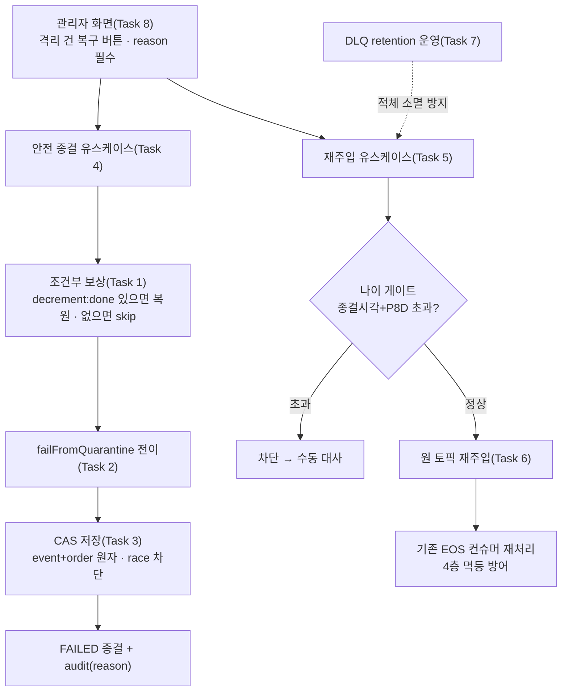

# 격리 결제·유실 메시지 수동 복구 도구 구현 플랜

> 작성일: 2026-07-10

## 요약 브리핑

### Task 목록

1. **복구 전용 조건부 보상** — `decrement:done` 토큰이 있을 때만 재고 복원(유령 재고 방지), 없으면 skip
2. **격리 복구 도메인 전이** `failFromQuarantine` — QUARANTINED → FAILED (정상 `fail`과 분리)
3. **CAS 조건부 저장** — event + order 행 원자 전이, 동시 복구 race 차단
4. **격리 안전 종결 유스케이스** — 보상 먼저 → 전이 → 저장(단일 TX), audit reason 필수
5. **DLQ 재주입 포트 + 유스케이스** — 종결시각+P8D 나이 게이트 + 재주입 이력
6. **DLQ 읽기·재발행 어댑터** — `events.confirmed` 원 토픽 재주입(기존 EOS 컨슈머 재사용)
7. **DLQ retention 운영 적용** — `create-topics.sh` + 브로커 실측
8. **관리자 복구 API + 화면 버튼** — 안전 종결/재주입 POST(reason 필수) + 격리 건 버튼

### 변경 후 전체 플로우차트

### 핵심 결정 → Task 매핑

| 설계 결정 | Task |
|---|---|
| 격리 출구 FAILED 단일 + 도메인 전이 신설 | 2 |
| `decrement:done` 조건부 보상(유령 재고 방지) | 1 |
| 보상 먼저 순서 + audit reason 필수 | 4 |
| 동시성 CAS + event·order 동조 | 3 |
| DLQ 원 토픽 재주입 + 4층 멱등 | 5, 6 |
| 재주입 나이 게이트 + 이력 | 5 |
| DLQ retention 운영 | 7 |
| 관리자 API / 버튼 | 8 |

### 트레이드오프 / 후속 작업

- **DONE 복구(정상 살리기)** — PG 상태 조회 포트 + 재고 write-back 선결, 별도 후속 토픽.
- **벤더 환불 실행** — TQ-6(Cancel/Refund) 위임.
- **CONCERNS 등재 2건**(보수적 언더셀) — ship context-update 에서 `CONCERNS.md` 반영.
- **조건부 자동 재시도** — 후속 토픽.

## 목표

격리(QUARANTINED) 결제를 관리자가 **안전 실패 종결**(재고 정리 포함)로 되돌리고, `events.confirmed.dlq` 유실 메시지를 **원 토픽으로 재주입**하는 수동 복구 경로가 API + 관리자 화면 버튼으로 동작하면 완료.

## 컨텍스트

- 설계 문서: `docs/topics/DLQ-QUARANTINE-RECOVERY.md`
- 주요 변경 파일:
  - `payment/domain/PaymentEvent.java` (복구 전이)
  - `payment/application/port/out/StockCachePort.java` + `infrastructure/cache/StockCacheRedisAdapter.java` + 신규 `lua/stock_compensation_if_decremented.lua` (조건부 보상)
  - `payment/application/port/out/PaymentEventRepository.java` + `infrastructure/repository/*` (CAS 조건부 저장)
  - `payment/application/usecase/PaymentCommandUseCase.java` + 신규 안전 종결 유스케이스 (AOP audit)
  - 신규 `DlqReprocessPort` + 재주입 유스케이스 + `infrastructure` 어댑터
  - `infrastructure/config/KafkaTopicConfig.java` (DLQ retention)
  - `presentation/PaymentAdminController.java` + `templates/admin/payment-event-detail` (액션·버튼)
- **CONCERNS 등재(코드 태스크 아님)**: 설계의 수용 한계 2건(`decrement:done` P8D 만료 미복원 / 복구 종결 결제에 늦은 confirm 재차감)은 ship 단계 context-update 에서 `docs/context/CONCERNS.md` 에 등재한다.

## 진행 상황

- [ ] Task 1: 복구 전용 조건부 보상 (포트 + Lua + 어댑터)
- [ ] Task 2: 격리 복구 도메인 전이 `failFromQuarantine`
- [ ] Task 3: CAS 조건부 저장 (event + order 행)
- [ ] Task 4: 격리 안전 종결 유스케이스 (AOP audit + 보상·전이 순서)
- [ ] Task 5: DLQ 재주입 포트 + 유스케이스 (사전검사 + 이력)
- [ ] Task 6: DLQ 읽기·재발행 어댑터
- [ ] Task 7: `events.confirmed.dlq` retention 운영 적용
- [ ] Task 8: 관리자 복구 API + Thymeleaf 버튼

## 태스크

### Task 1: 복구 전용 조건부 보상 (포트 + Lua + 어댑터) [tdd=true] [domain_risk=true]

**테스트 (RED)**
- Testcontainers Redis 통합 테스트 (`StockCacheRedisAdapterRecoveryTest` 또는 기존 어댑터 통합 테스트 확장):
  - `decrement:done` 부재 → `NO_DECREMENT` 반환 + `stock:{productId}` 불변 + `compensation:done` 미생성
  - `decrement:done` 존재 + `compensation:done` 부재 → `OK` + 재고 +N 복원 + `compensation:done` 생성
  - `decrement:done` 존재 + `compensation:done` 존재 → `ALREADY_DONE` + 재고 불변
  - `decrement:done` 부재 + `compensation:done` 존재(보상이 차감보다 늦은 P8D 창 끄트머리) → `NO_DECREMENT` + 재고 불변 (EXISTS 검사 순서 회귀 고정)

**구현 (GREEN)**
- 신규 결과 enum `StockRecoveryCompensationResult { OK, ALREADY_DONE, NO_DECREMENT }` (application/port/out)
- `StockCachePort.compensateIfDecremented(String orderId, List<PaymentOrder>)` 선언
- 신규 `lua/stock_compensation_if_decremented.lua`: `EXISTS decrement:done` → 없으면 `NO_DECREMENT`(INCR·compensation 토큰 생략) / 있으면 `SETNX compensation:done`(0이면 `ALREADY_DONE`) → INCRBY + TTL → `OK`
- `StockCacheRedisAdapter`에 static script 로드 + 메서드 구현 (기존 `compensateAtomic` 패턴 준용)
- **`FakeStockCachePort.compensateIfDecremented` 구현** — 기존 `decrement:done` 토큰 Set 을 SoT 로 재사용(부재 시 `NO_DECREMENT`). 포트 새 추상 메서드라 Fake 미구현 시 컴파일 깨짐.

**완료 기준**
- 위 4 케이스 통합 테스트 pass, `./gradlew :payment-service:test` 회귀 없음

**완료 결과**
> (execute에서 채움)

---

### Task 2: 격리 복구 도메인 전이 `failFromQuarantine` [tdd=true] [domain_risk=true]

**테스트 (RED)**
- `PaymentEventTest` — `@ParameterizedTest @EnumSource(PaymentEventStatus.class)`:
  - QUARANTINED → `failFromQuarantine` 호출 시 FAILED 전이 + `statusReason` 갱신 + `PaymentOrder` 전부 fail
  - QUARANTINED 외 전 상태 → `PaymentStatusException`(신규 `INVALID_STATUS_TO_FAIL_FROM_QUARANTINE` 또는 기존 코드 재사용)

**구현 (GREEN)**
- `PaymentEvent.failFromQuarantine(String reason, Instant lastStatusChangedAt)` — `status != QUARANTINED` 가드, FAILED 전이, `paymentOrderList.forEach(PaymentOrder::fail)`
- 정상 `fail()`과 물리적으로 분리 (재사용 금지)

**완료 기준**
- 파라미터라이즈드 테스트 pass, 회귀 없음

**완료 결과**
> (execute에서 채움)

---

### Task 3: CAS 조건부 저장 (event + order 행) [tdd=true] [domain_risk=true]

**테스트 (RED)**
- `PaymentEventRepositoryImpl` 통합 테스트 (또는 JPA slice):
  - QUARANTINED 레코드에 조건부 전이 저장 → 1건 반영 + **`payment_order` 자식 행 상태 = FAIL**
  - 이미 FAILED로 바뀐 레코드에 조건부 전이 저장 → 0건(충돌) → 명확한 예외/결과, order 행 불변
  - 동시 2회 호출 시 1건만 성공

**구현 (GREEN)**
- `PaymentEventRepository.resolveQuarantineToFailed(...)` — 조건부 게이트(`@Modifying @Query("UPDATE payment_event SET status=FAILED, ... WHERE id=:id AND status='QUARANTINED'")`, affected rows 반환) → **affected=1 일 때만 같은 TX 에서 `payment_order` 자식 행 상태 반영**. 기존 `saveOrUpdate`(`PaymentEventRepositoryImpl.java:57-69`)가 event·order 를 **별도 두 단계**로 save 하므로(cascade 아님), event 만 갱신하면 `payment_event=FAILED` + `payment_order=EXECUTING/NOT_STARTED` 불일치가 영구 잔존 → 후속 취소/환불(TQ-6) 오판.
- 0건이면 상위(유스케이스)가 충돌 예외 던지도록 계약 명시
- **`FakePaymentEventRepository.resolveQuarantineToFailed` 구현** — 포트 새 추상 메서드라 미구현 시 컴파일 깨짐(다수 기존 테스트가 이 Fake 소비).

**완료 기준**
- 조건부 저장 통합 테스트 pass (event=FAILED **+ order=FAIL** + 충돌 시 0건·불변), 회귀 없음

**완료 결과**
> (execute에서 채움)

---

### Task 4: 격리 안전 종결 유스케이스 (AOP audit + 보상·전이 순서) [tdd=true] [domain_risk=true]

**테스트 (RED)**
- Mockito 단위 (`QuarantineResolveUseCaseTest`):
  - load → `compensateIfDecremented` **먼저** 호출 → 도메인 전이 → CAS 저장 순서 검증 (SCR-6)
  - 보상 결과 3종(OK/ALREADY_DONE/NO_DECREMENT) 모두 전이 진행
  - CAS 0건(충돌) → 전이 실패 예외 + 로그
  - `reason` 누락 시 거부 (필수)
- `PaymentCommandUseCase.markPaymentAsFailFromQuarantine` audit 기록 검증 (AOP 경유 — `@PublishDomainEvent`/`@PaymentStatusChange` 부착)

**구현 (GREEN)**
- `PaymentCommandUseCase.markPaymentAsFailFromQuarantine(PaymentEvent, @Reason String)` — 도메인 `failFromQuarantine` 위임 + 애노테이션(audit)
- 신규 유스케이스 (안전 종결 오케스트레이션): 보상 먼저 → command 전이 → CAS 저장
- **TX 경계**: redis 보상은 `@Transactional` **밖** 선행(외부 호출 커넥션 점유 회피, PITFALLS §3) → 전이 + CAS 저장 + AOP history INSERT 는 **단일 `@Transactional`**(CAS 0건 충돌 시 history 동일 TX 롤백 보장)
- `reason` 필수 파라미터 계약

**완료 기준**
- 단위 테스트 pass (순서·조건·audit), 회귀 없음

**완료 결과**
> (execute에서 채움)

---

### Task 5: DLQ 재주입 포트 + 유스케이스 (사전검사 + 이력) [tdd=true] [domain_risk=true]

**테스트 (RED)**
- Mockito 단위 (`DlqReprocessUseCaseTest`):
  - 종결 시각(DONE `lastStatusChangedAt`) + P8D 초과 건 → 재주입 차단 + 수동 대사 안내
  - **미종결 건 → 나이 무관 통과**(원 토픽 발행 포트 호출)
  - **DONE + P8D 이내 → 통과**(재발행은 product 결정적 키가 흡수)
  - 재주입 이력(횟수·결과) 기록 검증

**구현 (GREEN)**
- `DlqReprocessPort` (application/port/out) — DLQ 읽기 + 원 토픽 발행 경계
- 재주입 유스케이스: 사전검사(나이·상태) → `DlqReprocessPort` 발행 → 이력 로그+메트릭

**완료 기준**
- 단위 테스트 pass (사전검사 차단/통과·이력), 회귀 없음

**완료 결과**
> (execute에서 채움)

---

### Task 6: DLQ 읽기·재발행 어댑터 [tdd=true] [domain_risk=true]

**테스트 (RED)**
- `@EmbeddedKafka` 통합 테스트:
  - `events.confirmed.dlq` 적재 → 재주입 → `events.confirmed` 원 토픽 EOS 컨슈머 재처리 → 미종결 정상 재확정
  - DONE 건 재주입 → `stock-committed` 재발행이 product 결정적 키로 1회만 반영(멱등)

**구현 (GREEN)**
- `DlqReprocessPort` 구현 (infrastructure) — on-demand DLQ 읽기 + `events.confirmed` 발행 KafkaTemplate (기존 EOS producer와 분리된 non-tx 템플릿 재사용/신설)
- **읽기 커서 전략**: offset commit 없이 지정 범위 조회(반복 노출은 멱등 체인 + 재주입 이력이 흡수, 재주입 판단은 관리자가 쥔다) — 조회 범위·커밋 여부를 구현 명세에 확정.

**완료 기준**
- 통합 테스트 pass, 회귀 없음

**완료 결과**
> (execute에서 채움)

---

### Task 7: `events.confirmed.dlq` retention 운영 적용 [tdd=false] [domain_risk=true]

**구현 (GREEN)**
- `KafkaTopicConfig.paymentEventsConfirmedDlq()` 에 `retention.ms` config 명시 (선언 SoT — 테스트/임베디드용)
- **`scripts/smoke/create-topics.sh` 에 `--config retention.ms=...` 추가** (실제 토픽 생성 SoT — `auto.create.topics.enable=false` 환경) + 이미 존재하는 토픽용 `kafka-configs --alter` 절차 문서화
- retention 값과 재주입 나이 게이트 P8D 부등식 관계 주석

**완료 기준**
- 브로커 `topic describe` 로 실제 `payment.events.confirmed.dlq` retention 값 확인(선언 Bean 존재만으로는 불충분), 회귀 없음

**완료 결과**
> (execute에서 채움)

---

### Task 8: 관리자 복구 API + Thymeleaf 버튼 [tdd=false] [domain_risk=false]

**테스트 (RED, 최소)**
- 컨트롤러 슬라이스/통합: 안전 종결 POST·재주입 POST 가 유스케이스 호출 + `reason` 필수 검증

**구현 (GREEN)**
- `PaymentAdminController` POST 2종 (`/admin/payments/events/{eventId}/resolve-quarantine`, `.../reprocess-dlq`) — `reason` 필수 파라미터
- `AdminPaymentService`(presentation port) 또는 유스케이스 연결 (`StockAdminController` 패턴 준용)
- `admin/payment-event-detail` 뷰: 격리 건에 한해 복구 버튼 렌더링

**완료 기준**
- 컨트롤러 테스트 pass, 관리자 화면에서 격리 건 버튼 노출, 회귀 없음

**완료 결과**
> (execute에서 채움)

## 리뷰 처리
> (ship 단계에서 채움 — finding별 채택/스킵 + 사유)
