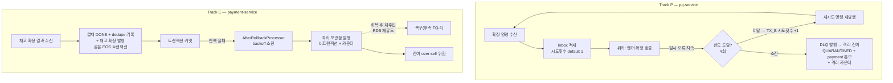

# DLQ 도달 보장 구현 플랜

> 작성일: 2026-06-24

## 요약 브리핑

### 1. Task 목록

1. **Task 1** — pg 시도횟수 영속 기반: `pg_inbox.attempt` 컬럼(Flyway V5) + 도메인/엔티티 매핑 + 증가 리포지토리 메서드·Fake(attempt 보존).
2. **Task 2** — 시도횟수 누적 + 한도 도달 격리: 워커가 inbox 시도횟수를 읽고 재시도마다 증가, 한도(4회) 소진 시 격리 보관함 진입 + 격리 도달 카운터(격리 전이 지점).
3. **Task 3** — Track P 통합: 벤더 지속 실패 시 self-loop가 무한 반복하지 않고 한도 도달로 격리(QUARANTINED) 종결 (Testcontainers).
4. **Task 4** — payment 커밋 실패 격리: 컨테이너 리스너에 롤백 처리기 명시 연결로 EOS 커밋 반복 실패 메시지를 격리 보관함으로 발행 + 격리 카운터 + 기존 갭 테스트를 수정-검증으로 전환.

### 2. 변경 후 전체 플로우 (to-be)

### 3. 핵심 결정 → Task 매핑

- 한도 도달 격리(PG) → Task 2·3 / Option B 시도횟수 SoT → Task 1·2 / Flyway V5 → Task 1
- payment AfterRollbackProcessor + 비트랜잭션 DLQ 템플릿 → Task 4 / 격리 가시화 metric → Task 2(pg)·Task 4(payment)
- (무변경 결정: 재고 확정 자동 복구·RetryPolicy/backoff baseline)

### 4. 트레이드오프 / 후속 작업

- **수용 한계(PG)**: 동시 진입 시 시도횟수 over-count 가능 → 조기 격리(안전 방향, 무한 루프·금전 손실 없음).
- **잔여 위험(payment)**: 코디네이터 지속 장애 시 결제 DONE + 재고 확정 영구 유실(over-sell). 가시화까지만, 자동 복구는 후속(TQ-1).
- **후속**: DLQ 재주입 복구 도구(TQ-1), 격리 metric 알람 rule(TC-13-FOLLOW-3/4), backoff·한도 값 측정 튜닝(Phase 5).

## 목표

장애 지속 시 두 트랙이 격리 보관함(DLQ)에 도달하도록 한다 — pg-service는 시도횟수를 `pg_inbox.attempt`에 영속해 한도(4회) 소진 시 기존 DLQ 격리 체인에 진입하고, payment-service는 컨테이너 리스너에 AfterRollbackProcessor를 명시 연결해 EOS 커밋 반복 실패 메시지를 DLQ로 발행한다. 두 경로 격리 도달을 메트릭으로 가시화한다.

## 컨텍스트

- 설계 문서: `docs/topics/DLQ-REACHABILITY.md`
- 주요 변경 파일:
  - Track P: `db/migration/V5__add_pg_inbox_attempt.sql`, `domain/PgInbox.java`, `infrastructure/entity/PgInboxEntity.java`, `application/port/out/PgInboxRepository.java`, `infrastructure/repository/PgInboxRepositoryImpl.java`, `application/service/PgInboxProcessor.java`, `application/service/PgVendorCallService.java`, `application/service/PgDlqService.java`(metric), `core/common/metrics/PgDlqReachMetrics.java`(신규)
  - Track E: `payment/infrastructure/config/KafkaConsumerConfig.java`, `payment/infrastructure/config/KafkaErrorHandlerConfig.java`, `payment/core/common/metrics/PaymentEosCommitFailureMetrics.java`(신규)

## 진행 상황

- [x] Task 1: pg_inbox.attempt 영속 기반 (Flyway V5 + 도메인/엔티티 + incrementAttempt 포트·구현·Fake)
- [ ] Task 2: 시도횟수 증가 + 한도 도달 DLQ 분기 + pg 격리 도달 metric
- [ ] Task 3: Track P 통합 — self-loop 한도 소진 → QUARANTINED 종단 (Testcontainers)
- [ ] Task 4: payment AfterRollbackProcessor 명시 연결 + EOS 커밋 실패 격리 metric + 통합 테스트 전환

## 결정 노트 (plan 단계 확정)

- **metric 배치 layer**: pg는 `pg.core.common.metrics`(application `PgDlqService` 주입 — 격리 도달 카운트가 QUARANTINED 전이 지점이므로, `pg.core.common.log` 사용 선례와 동일 layer), payment는 `payment.core.common.metrics`(기존 `PaymentConfirmTerminalResendMetrics` 동형).
- **consumer 시도횟수 파라미터**: `PaymentConfirmConsumer` 헤더 파싱 + `PgConfirmService.handle(command, attempt, ...)` 파라미터는 **현행 유지**(제거하지 않음). Option B에서 로직 미사용이나 기존 시그니처라 minimal-change. 실제 attempt는 `pg_inbox` + 워커 로그로 가시화. 릴레이 헤더 전파는 복원하지 않는다(Option B는 헤더 불필요).
- **attempt 증가 시점/원자성**: 벤더 호출 1회당 1 증가. retry 분기(`handleRetry`→재시도 outbox INSERT 경로)에서만 `incrementAttempt`를 같은 결과 반영 TX_B의 UPDATE로 수행(별도 round-trip 금지). 증가는 `UPDATE pg_inbox SET attempt = attempt + 1`(set-to-value 아님)이라 lost-update는 없다.
- **attempt over-count 수용 (한계)**: self-loop 즉시 워커와 in-progress 좀비 폴링이 같은 IN_PROGRESS row에 동시 진입하면(lock TX는 벤더 HTTP 전 커밋·해제 — 기존 TX-split 아키텍처), 한 논리적 재시도에 attempt가 2 증가할 수 있다. 방향은 **조기 격리(QUARANTINED)** — DLQ를 건너뛰는 일은 없고(무한 루프 위험 없음) 금전/재고 손실도 없다. 완전 제거는 벤더 HTTP를 lock 안으로 넣어야 해 기존 아키텍처와 충돌하므로, **문서화된 한계로 수용**한다(topic §미해결 위험). 따라서 Task 3은 attempt가 정확히 4임을 강제하지 않고 "한도 도달 시 격리 종결(무한 반복 아님)"을 단정한다.
- **격리 도달 metric 위치 (멱등)**: "격리 도달" 카운터는 `PgVendorCallService.insertDlqOutbox`(소진 후 IN_PROGRESS 잔류 window에서 좀비 재진입 시 DLQ outbox 중복 INSERT 가능 → over-count)가 아니라, **`PgDlqService`의 QUARANTINED 전이 성공 지점**(non-terminal CAS true)에서 증가시킨다. terminal CAS가 1회만 통과하므로 멱등 — alert 임계 기준으로 정확. 의미상으로도 "DLQ 도달 = 격리 완료"이므로 격리 시점 카운트가 옳다.
- **소진 시 inbox 전이**: 즉시 QUARANTINED 전이를 추가하지 않고 현행 DLQ 격리 체인(`PgDlqService` non-terminal CAS)에 위임. 그 사이 좀비 재호출은 PG 멱등성(ALREADY_PROCESSED → `DuplicateApprovalHandler`)으로 무해. DLQ outbox 중복 INSERT는 `PgDlqService` terminal/CAS가 흡수(격리 자체 멱등).
- **incrementAttempt와 좀비 임계 상호작용 (execute 확인)**: `incrementAttempt`가 `updated_at`을 함께 갱신하면, in-progress 좀비 폴링 임계(`pg.scheduler` 기본 60s)가 매 재시도마다 리셋된다. attempt=4 backoff(~40.5~67.5s)가 60s에 근접하므로, 정상 self-loop가 좀비로 오인되거나 그 반대가 될 경계 여지가 있다(over-count 빈도에 영향, 손실 경로 아님). Task 2 구현 시 `updated_at` 갱신 의도(매 재시도마다 좀비 타이머 리셋이 맞는지)를 1줄 확인하고 결과를 완료 결과에 기록한다.

## 태스크

### Task 1: pg_inbox.attempt 영속 기반 [tdd=false] [domain_risk=false]

**구현 (GREEN)**
- `pg-service/src/main/resources/db/migration/V5__add_pg_inbox_attempt.sql` — `ALTER TABLE pg_inbox ADD COLUMN attempt INT NOT NULL DEFAULT 1;` (MySQL plain ADD COLUMN, 기존 행은 default 1). `insertPending` native INSERT는 attempt 미지정 → default 1 적용(변경 불요).
- `domain/PgInbox.java` — `private final int attempt;` 필드 + getter. `ofWithId`에 attempt 파라미터 추가(DB 복원값 주입). 나머지 factory(`create`/`createDirectInProgress`/`createDirectTerminal`/`of` 2종)는 `.attempt(1)` 명시(신규 행 기본값).
- `infrastructure/entity/PgInboxEntity.java` — `attempt` 컬럼 매핑 + `toDomain()`이 attempt를 `ofWithId`에 전달.
- `application/port/out/PgInboxRepository.java` — `void incrementAttempt(String orderId);` 추가. (계약: `UPDATE pg_inbox SET attempt = attempt + 1, updated_at = ? WHERE order_id = ?`)
- `infrastructure/repository/PgInboxRepositoryImpl.java` — `incrementAttempt` JPA/native 구현(`@Transactional` propagation REQUIRED로 외부 TX_B 참여).
- `pg-service/src/test/java/com/hyoguoo/paymentplatform/pg/mock/FakePgInboxRepository.java` — `incrementAttempt` Fake 구현 + **attempt 보존 정합**: 현재 `transitPendingToInProgress`/`transitToApproved`/`transitToFailed`/`transitToQuarantined`/`selectInProgressForUpdateSkipLocked` 등이 `PgInbox.of`/`ofWithId`로 row를 재생성하며 attempt를 유실하므로, Fake가 orderId별 attempt를 별도 보유하거나 재생성 시 기존 attempt를 이어받도록 수정한다(self-loop 시뮬 1→2→3→4 성립의 전제). 소비 태스크 Task 2 선행.

**완료 기준**
- 컴파일 + `./gradlew :pg-service:test` 기존 테스트 회귀 없음 (신규 로직 단정은 Task 2에서 소비).

**완료 결과**
- Flyway V5(`ALTER TABLE pg_inbox ADD COLUMN attempt INT NOT NULL DEFAULT 1`) 추가. `PgInbox` 도메인에 `attempt` 필드(`ofWithId` 11-arg로 DB 복원값 주입, 나머지 factory 6종은 `.attempt(1)` 명시). `PgInboxEntity` 컬럼 매핑 + `toDomain()` 전달. `PgInboxRepository.incrementAttempt(orderId)` 포트 추가 + `PgInboxRepositoryImpl`(JPQL `UPDATE e.attempt = e.attempt + 1, e.updatedAt = :now`, `@Transactional(propagation = REQUIRED)`로 외부 TX_B 참여) 구현.
- `FakePgInboxRepository.incrementAttempt` 추가(store의 PgInbox를 attempt+1로 `ofWithId` 재구성해 교체 — relative increment, set-to-value 아님). attempt 보존 점검: `transitToApproved`/`transitToFailed`/`transitToQuarantined`/`selectInProgressForUpdateSkipLocked`는 기존에 `markXxx(...)` mutate 또는 무재생성이라 이미 attempt 보존됨. `transitPendingToInProgress`만 `PgInbox.of(...)` 재생성으로 attempt를 매번 1로 리셋하는 버그였음 — `current.markInProgress(now)` mutate 방식으로 교체해 보존되도록 수정.
- updated_at 갱신 여부: PLAN 계약대로 `incrementAttempt`가 `updated_at`도 함께 갱신하도록 구현(JPQL/Fake 모두) — 좀비 임계 60s와의 상호작용(재시도마다 좀비 타이머 리셋되는 것이 의도인지)은 결정 노트에 따라 Task 2에서 실제 소비 시점에 1줄 재확인한다.
- 컴파일 오류 자동 수정([Rule 1]): `PgInboxRepository` 신규 메서드 추가로 깨진 2개 테스트 보강 — `PgInboxPendingServiceTest.MockPgInboxRepository`에 no-op `incrementAttempt` 추가, `PgInboxTest.ofWithId_includesId`를 11-arg(attempt 포함) 시그니처로 갱신.
- `./gradlew :pg-service:test` 316/316 PASS (JaCoCo coverage verification 포함), 회귀 없음.

---

### Task 2: 시도횟수 증가 + 한도 도달 DLQ 분기 + pg 격리 도달 metric [tdd=true] [domain_risk=true]

**테스트 (RED)**
- `PgInboxProcessorTest` (Fake) — `resolveAttempt`가 `inbox.getAttempt()`를 반환: attempt=2인 inbox 처리 시 `applyOutcome`에 2가 전달됨(`processPending` + `processInProgressZombie` 좀비 경로 각 1건).
- `PgVendorCallServiceTest` (Fake) — Retryable 결과 시:
  - `attempt < MAX(4)` → `incrementAttempt(orderId)` 1회 호출 + 재시도 outbox(`COMMANDS_CONFIRM`) INSERT, DLQ outbox 0건.
  - `attempt == MAX(4)` → `incrementAttempt` 미호출 + DLQ outbox(`COMMANDS_CONFIRM_DLQ`) 1건. (metric은 여기서 단정하지 않음 — 격리 도달 카운트는 PgDlqService로 이동)
- self-loop 누적 시뮬(Fake) — 동일 orderId를 attempt 1→2→3→4로 반복 처리: attempt 1·2·3에서 재시도(누적 증가), 4에서 DLQ 도달. `applyOutcome`에 넘어간 attempt가 `1,2,3,4` 순.
- `PgDlqServiceTest`(또는 `PaymentConfirmDlqConsumerTest`) — QUARANTINED 전이 성공(non-terminal CAS true) 시 `PgDlqReachMetrics` 카운터 1 증가; 이미 terminal이라 CAS false(중복 DLQ 진입)면 metric 미증가(멱등).

**구현 (GREEN)**
- `application/service/PgInboxProcessor.java` — `resolveAttempt(PgInbox inbox)` → `inbox.getAttempt()` (하드코딩 1 제거).
- `application/service/PgVendorCallService.java` — `handleRetry`의 재시도 분기(`insertRetryOutbox` 경로)에서 `pgInboxRepository.incrementAttempt(request.orderId())`를 TX_B 안에서 호출. (DLQ 분기는 outbox INSERT만 — metric 미호출)
- `application/service/PgDlqService.java` — `transitToQuarantined`가 true(격리 성공) 반환 시 `PgDlqReachMetrics.record()` 호출(멱등 — terminal CAS 1회만 통과).
- `core/common/metrics/PgDlqReachMetrics.java`(신규) — Micrometer Counter(`pg_retry_exhausted_quarantine_total`), eager 등록, throw-free `record()` (`PaymentConfirmTerminalResendMetrics` 패턴).

**완료 기준**
- 신규 단위 테스트 pass, `./gradlew :pg-service:test` 회귀 없음.

**완료 결과**
> (execute에서 채움)

---

### Task 3: Track P 통합 — self-loop 한도 소진 → QUARANTINED 종단 [tdd=true] [domain_risk=true]

**테스트 (RED)**
- pg-service Testcontainers 통합 테스트(신규, 예: `PgSelfLoopRetryExhaustionIntegrationTest`) — Fake 벤더가 지속 Retryable(5xx/timeout) 반환하도록 구성:
  - 확정 명령 진입 → self-loop 반복(relay → `payment.commands.confirm` → consumer → inbox → 워커 → 재시도 outbox)로 `pg_inbox.attempt`가 누적 → 4 소진 → `payment.commands.confirm.dlq` 발행 → `PgDlqService` → `pg_inbox` QUARANTINED + `payment.events.confirmed`(QUARANTINED) outbox 발행.
  - 단정: 최종 `pg_inbox.status == QUARANTINED`(reason `RETRY_EXHAUSTED`), 재시도 명령이 **무한 반복하지 않고 한도 도달로 종결**, `PgDlqReachMetrics` 증가. attempt가 정확히 4임은 강제하지 않는다(동시 진입 over-count 수용 — 결정 노트 참조).
  - 좀비 재호출 window 멱등성(DLQ 발행~QUARANTINED 사이 벤더 재호출)은 기존 PG 멱등성(ALREADY_PROCESSED)에 의존하며 이 태스크에서 별도 단정하지 않는다(범위 밖, 결정 노트).

**구현 (GREEN)**
- 운영 코드 변경 없음(Task 1·2로 충족). 테스트 인프라(지속 실패 Fake 벤더 구성/주입)만 작성.

**완료 기준**
- 통합 테스트 GREEN, 전체 회귀 없음.

**완료 결과**
> (execute에서 채움)

---

### Task 4: payment AfterRollbackProcessor 명시 연결 + EOS 커밋 실패 격리 metric [tdd=true] [domain_risk=true]

**채택 backoff (R2 정합)**: AfterRollbackProcessor backoff 를 `payment.kafka.after-rollback.backoff.{interval:1000, max-attempts:5}` 신규 설정 키로 분리(기본값은 리스너 error-handler 와 같은 크기 — 1000ms×5, Phase 5 독립 튜닝 여지). 테스트 프로파일은 interval 을 단축(기존 #7 가 error-handler 를 200ms 로 단축하는 것과 동일 패턴).

**테스트 (RED)**
- `PaymentEosIntegrationTest` #7 전환 — 기존 갭-문서화 테스트(`shouldExhaustAfterRollbackBackoffWithoutDlqAndNoDuplicateStock`)를 갭-수정-검증으로 재작성(메서드명도 의미 반전):
  - `CommitFailureInjectingProducerPostProcessor`로 `commitTransaction()` 을 채택 max-attempts 소진 + 1회 결정적 실패 주입.
  - **await 단정 갱신(R2)**: 현행 `terminalResend == before + 9`(디폴트 AfterRollbackProcessor 9회 기준)를 **채택 max-attempts(5)** 기준으로 변경. terminalResend 증가량과 max-attempts 의 정확한 off-by-one(초기 배달 포함 여부)은 구현 시 실측 확정.
  - 단정: `payment.events.confirmed.dlq` 1건 도달(기존 "DLQ 미진입" 단정 반전) + payment `DONE` 유지 + **`payment_event_dedupe` row 1건 유지**(회복 후 재주입 복구 전제 보존 — D4) + stock-committed 0건(재고 확정 유실은 잔여 위험 그대로) + `PaymentEosCommitFailureMetrics` 카운터 증가.
  - 기존 #2(리스너 RuntimeException → DLQ, FixedBackOff 5회) 시나리오가 회귀 없이 유지되는지 동반 확인.

**구현 (GREEN)**
- `infrastructure/config/KafkaErrorHandlerConfig.java` — `DeadLetterPublishingRecoverer`(현 inline)를 빈으로 추출해 AfterRollbackProcessor 에서 재사용.
- `infrastructure/config/KafkaConsumerConfig.java` — `factory.setAfterRollbackProcessor(...)` 추가: `DefaultAfterRollbackProcessor`에 추출한 DLQ recoverer(비트랜잭션 `confirmedDlqKafkaTemplate` 기반) + 위 채택 backoff 연결. recoverer 발화(격리 보관함 발행) 시 `PaymentEosCommitFailureMetrics` 증가.
- `core/common/metrics/PaymentEosCommitFailureMetrics.java`(신규) — Micrometer Counter(`payment_eos_commit_failure_dlq_total`), eager 등록, throw-free.

**완료 기준**
- #7 GREEN(전환, 갱신된 await 단정 포함), `./gradlew :payment-service:test` 통합 포함 회귀 없음.

**완료 결과**
> (execute에서 채움)

## 핵심 결정 → Task 매핑

| 설계 결정 | Task |
|---|---|
| PG 재시도 정책 (한도 도달 격리) | Task 2, Task 3 |
| PG 시도횟수 전파 기전 (Option B) | Task 1, Task 2 |
| PG 시도횟수 컬럼 (Flyway V5) | Task 1 |
| payment EOS 커밋 실패 처리 (AfterRollbackProcessor) | Task 4 |
| payment DLQ 발행 경로 (비트랜잭션 템플릿 재사용) | Task 4 |
| 가시화 (격리 도달 metric) | Task 2(pg), Task 4(payment) |
| 재고 확정 이벤트 유실 복구 (범위 밖) / RetryPolicy·backoff 유지 | (무변경 — 태스크 없음) |

## 리뷰 처리
> (ship 단계에서 채움 — finding별 채택/스킵 + 사유)
