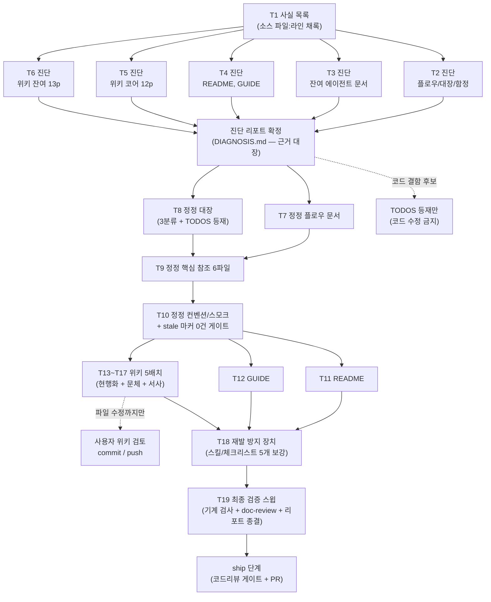

# 문서 전수 정합 개선 (DOCS-CONSISTENCY-OVERHAUL) 구현 플랜

> 작성일: 2026-07-02 (게이트 1R findings 반영 — 진단 5분할·잔여 정정 2분할·위키 배치 재응집·workflow-ship 복원. 2R 양측 pass)

## 요약 브리핑

### Task 목록

| # | 태스크 | 한 줄 |
|---|---|---|
| 1 | 사실 목록 + 리포트 뼈대 | 최근 봉인 토픽의 변경 사실을 소스에서 재확인해 채록, 진단 리포트 형식 확정 |
| 2 | 진단 — 플로우·대장·함정 | 결제 플로우 2문서 + 후속 대장 2문서 + 도메인 함정 문서 판정 |
| 3 | 진단 — 잔여 에이전트 문서 | 아키텍처·구조·스택·통합·테스팅 + 컨벤션 + 스모크 17파일 판정 |
| 4 | 진단 — README·GUIDE | 배너·페이즈·폐기 기능 서술 + 문체 판정, 페이즈 표기 실태 채록 |
| 5 | 진단 — 위키 도메인 코어 12p | outbox·확인 플로우·멱등·보상·상태·복구·PG 전략·TX 경계 판정 + 서사 후보 채록 |
| 6 | 진단 — 위키 잔여 13p | 아키텍처·관측성·검증·인덱스 판정 + 링크-슬러그 정합 |
| 7 | 정정 — 플로우 문서 | outbox 발행 실패 복구 등 S1 최우선 정정 (소스 기준) |
| 8 | 정정 — 대장 문서 | 완료 항목 3분류 정리 + 코드 확인 필요 항목 신규 등재 |
| 9 | 정정 — 핵심 참조 6파일 | 아키텍처·스택·통합·테스팅·함정 리포트 반영 + 중복 SSOT 몰기 |
| 10 | 정정 — 컨벤션·스모크 11파일 | 리포트 반영 + 에이전트 문서 전체 stale 마커 0건 게이트 |
| 11 | 정정 — README | 배너·페이즈 사실화 + 문체 교정 (S1 항목은 ship 대조 입력) |
| 12 | 정정 — 결제 플로우 가이드 | 사람 독자용 walkthrough 현행화 + 문체 교정 |
| 13 | 위키 1차 (5p) | outbox 2 + 확인 플로우 + 비동기 전환 + TX 경계 — 기준 예문 실반영 |
| 14 | 위키 2차 (4p) | 메시지 전달·dedupe + 멱등성 + 보상 TX + 재고 캐시 복구 |
| 15 | 위키 3차 (5p) | 상태 머신 + 복구 + 시나리오·교차 검증 + PG 전략 |
| 16 | 위키 4차 (5p) | 아키텍처 + MSA 전환 + 코레오그래피 + 메트릭 + 구조화 로깅 |
| 17 | 위키 5차 (6p) | 트레이싱 + AI 워크플로우 + 인덱스 3종 + 벤치마크(배너만) |
| 18 | 재발 방지 장치 | ship 체크리스트·context-update·workflow-ship·writing·doc-review 5개 보강 |
| 19 | 최종 검증 스윕 | 링크·stale 마커 0건 + doc-review 4관점 + 리포트 전건 종결 |

### 실행 플로우차트

### 핵심 결정 → Task 매핑

- 사실 판정 근거는 소스만 → T1~6 (진단 전건 파일:라인 채록), T19 (grep 재확인)
- 진단·정정 분리 (오류 주입 차단) → T1~6 vs T7~17
- TODOS/CONCERNS 3분류 삭제 → T2 예비 판정 + T8 적용
- 위키 본문 현행화 + 문체 교정 + 서사 (에이전트 문서 정정 후) → T13~17 (전 배치 "T7~10 완료 후 착수" 명시)
- 페이즈 표기 이원화 해소 → T4 채록 + T8 내부 1줄 + T11 README 확정
- 재발 방지 5개 대상 → T18
- 코드 확인 필요 항목 등재 → T8

### 트레이드오프 / 후속

- 진단 태스크(T3·T5·T6)는 상대적으로 큼 — execute 중 2시간 초과 시 추가 분할 (reviewer 2R 참고 메모)
- doc-review 는 T19 일괄이라 FAIL 루프 재작업이 후반 집중 — 각 정정 태스크의 리포트 근거 대조가 1차 방어
- 위키는 커밋 없이 파일 수정만 — T13~17 완료 후 사용자 검토·커밋 필요, ship 게이트에는 리포트 + 위키 로컬 diff 를 입력으로 전달

## 목표

두 문서 묶음(에이전트 작업용 + 사람 독자용)이 진단 리포트 기준으로 전건 정정되고, 기계 검사(링크·stale 마커 0건)와 doc-review 검수를 통과하며, 재발 방지 규칙이 스킬·체크리스트에 반영되면 종료.

## 컨텍스트

- 설계 문서: `docs/topics/DOCS-CONSISTENCY-OVERHAUL.md`
- 주요 산출물: `docs/DOCS-CONSISTENCY-OVERHAUL-DIAGNOSIS.md` (진단 리포트 — 모든 수정의 근거 대장)
- 주요 변경 파일: `docs/context/**`, `docs/smoke/**`, `README.md`, `docs/context/PAYMENT-FLOW-GUIDE.md`, `../payment-platform.wiki/*.md` (별도 저장소 — 커밋은 사용자), `.claude/skills/{_shared,context-update,workflow-ship,doc-review}/**`
- 전 태스크 tdd=false (문서 작업 — 테스트 대신 진단 리포트 근거·기계 검사가 완료 기준)
- 코드 수정 금지 — 결함 후보는 TODOS 등재만 (topic 결정)
- 구조 원칙: **진단(리포트 근거 확정) 태스크와 정정(반영) 태스크 분리** — 오류 주입 차단. 사실 판정 근거는 소스 파일:라인만.

## 진행 상황

- [x] Task 1: 변경 사실 목록 + 진단 리포트 뼈대
- [ ] Task 2: 진단 — 플로우·대장·함정 5파일
- [ ] Task 3: 진단 — 잔여 에이전트 문서 12파일 + smoke 5파일
- [ ] Task 4: 진단 — README + PAYMENT-FLOW-GUIDE
- [ ] Task 5: 진단 — 위키 도메인 코어 12페이지
- [ ] Task 6: 진단 — 위키 잔여 13페이지
- [ ] Task 7: 정정 — 플로우 문서 (CONFIRM-FLOW·PAYMENT-FLOW)
- [ ] Task 8: 정정 — 대장 문서 (TODOS·CONCERNS 3분류 + 코드 확인 항목 등재)
- [ ] Task 9: 정정 — 핵심 참조 문서 6파일
- [ ] Task 10: 정정 — conventions·smoke 11파일
- [ ] Task 11: 정정 — README
- [ ] Task 12: 정정 — PAYMENT-FLOW-GUIDE
- [ ] Task 13: 위키 1차 — outbox·확인 플로우·TX 경계 5페이지
- [ ] Task 14: 위키 2차 — 멱등·보상·재고 4페이지
- [ ] Task 15: 위키 3차 — 상태 머신·복구·검증·PG 전략 5페이지
- [ ] Task 16: 위키 4차 — 아키텍처·관측성 5페이지
- [ ] Task 17: 위키 5차 — 잔여·인덱스 6페이지
- [ ] Task 18: 재발 방지 장치 (스킬 4종 + doc-review 보강)
- [ ] Task 19: 최종 검증 스윕

## 태스크

### Task 1: 변경 사실 목록 + 진단 리포트 뼈대 [tdd=false] [domain_risk=true]

**구현**
- 최근 ship 토픽(EOS 전환 이후 ~ TC-3 재고 resync)의 archive briefing 에서 "코드에 일어난 변경 사실" 목록 작성 — 각 사실의 참·거짓은 briefing 이 아닌 **소스에서 재확인** (파일:라인 채록)
- `docs/DOCS-CONSISTENCY-OVERHAUL-DIAGNOSIS.md` 생성 — 항목 형식: 문서 위치 / 문제 / 소스 근거(파일:라인) / 수정 방향 / 심각도(S1~S5). **기본값 인용 시 층위(코드 fallback vs 프로파일 yml) 명시** 규칙 포함 (게이트 2R minor)
- topic 사전 진단 표본 12건 + 기준 예문 retry 카운트 불릿(게이트 2R minor) 을 진단 항목으로 수록·재검증

**완료 기준**
- 사실 목록 전 항목에 소스 파일:라인 채록 (문서 인용 근거 0건)
- 표본 12건 리포트 수록·판정 완료

**완료 결과**
> `docs/DOCS-CONSISTENCY-OVERHAUL-DIAGNOSIS.md` 신규 생성. §0 형식 정의(항목 형식 5컬럼 + 심각도 S1~S5 + "기본값 인용 시 층위 명시" 규칙, `scheduler.outbox-worker.parallel-enabled` 실증 사례로 코드 fallback(`OutboxWorker.java:26`, false) vs default profile yml(`application.yml:149`, true) 대조 포함) 확정. §1 사실 목록 28건(F1~F28) — EOS 전환(2026-05-17) ~ TC-3 수동 resync(2026-07-01) 사이 archive 봉인 토픽(EOS-FOLLOWUP-CLEANUP/TIME-MODEL-AND-EXPIRY·FOLLOWUP/CI-PIPELINE-REDESIGN/OBSERVABILITY-COMPLETION/CLEANUP-BATCH-C~E/STOCK-COMPENSATION-OTHER-PATHS/RETRY-METRIC-CLEANUP/CONFIRM-APPROVED-RESEND-GAP/DLQ-REACHABILITY/ALERTING-RULES-AND-FAULT-DRILL/FAULT-INJECTION-RESILIENCE) + 봉인 이후 standalone 커밋(L-14 poison-pill/TC-3 resync) 을 후보로 삼아 전건 소스 재확인(파일:라인) — briefing 인용은 후보 추출에만 사용, 사실 확정은 코드 grep/Read 로 별도 수행. 표본 12건(§2) 전건 판정: #1(CONCERNS.md L-1 qualifier 서술, `PaymentConfirmResultUseCase.java:116` 명시 qualifier 확인 — 문서 내부 L92 vs L97 자기모순 재확인) · #12(CONFIRM-FLOW/PAYMENT-FLOW의 REQUIRES_NEW/IN_FLIGHT 서술, `OutboxRelayService.java:49-59` 단일 TX + `PaymentOutboxUseCase.claimToInFlight`/`incrementRetryOrFail` 프로덕션 호출처 0 재확인, S1 critical) 은 인계받은 근거 보강. 나머지 10건 신규 재검증 — 특히 #7(canCompensateStock 는 STOCK-COMPENSATION-OTHER-PATHS 에서 이미 死 코드 제거돼 CONFIRM-FLOW.md 는 이미 정합, TODOS.md 완료 항목만 3분류 삭제 대상)·#10(`PaymentEventStatus.java` RETRYING enum 완전 부재, 위키 state-management.md 는 여전히 전면 서술) 확정. §3 게이트 2R 잔여 minor 2건 해소: 기본값 층위 규칙은 §0.3 편입, retry 카운트 불릿은 `incrementRetryOrFail` 호출처 0 + `recoverTimedOutInFlightRecords`(IN_FLIGHT 타임아웃 전용) 소스 대조로 "고려 중"이 아닌 "현재 relay 실패 경로 미적용"이 정확한 서술임을 확정(Task 13 반영 문구 초안 포함). §4 는 Task 2~6 플레이스홀더로 남김. 코드 무변경 — `./gradlew test` 대상 아님(문서만 생성).

### Task 2: 진단 — 플로우·대장·함정 5파일 [tdd=false] [domain_risk=true]

**구현**
- 대상: `CONFIRM-FLOW.md` / `PAYMENT-FLOW.md` / `TODOS.md` / `CONCERNS.md` / `PITFALLS.md` — 사실 목록 대조 + 통독 진단, 리포트에 항목 추가
- TODOS/CONCERNS 는 3분류 삭제 판정(전체 삭제 / 문장 제거 / 보존)을 항목별로 예비 기록

**완료 기준**
- 5파일 전부 페이지별 판정 존재, S1/S2 전건 소스 근거 포함

**완료 결과**
> (execute에서 채움)

### Task 3: 진단 — 잔여 에이전트 문서 12파일 + smoke 5파일 [tdd=false] [domain_risk=true]

**구현**
- 대상: `ARCHITECTURE` / `STRUCTURE` / `STACK` / `stack/flyway-operations` / `CONVENTIONS`(인덱스) / `TESTING` / `INTEGRATIONS` + `conventions/` 5파일 + `docs/smoke/` 5파일
- 중복 서술(S4)의 SSOT 지정안(어느 문서로 몰지)도 리포트에 기록

**완료 기준**
- 17파일 전부 페이지별 판정 존재, S1/S2 전건 소스 근거 포함

**완료 결과**
> (execute에서 채움)

### Task 4: 진단 — README + PAYMENT-FLOW-GUIDE [tdd=false] [domain_risk=true]

**구현**
- `README.md`(551줄) + `PAYMENT-FLOW-GUIDE.md`(378줄) 진단 — 배너·페이즈·지표·폐기 기능 서술 + 문체(S5)
- 페이즈 표기 실태(README 1~7 vs 내부 0~5) 전수 채록 → Task 11 결정 입력

**완료 기준**
- 2파일 판정 완료, README 도메인 사실(S1) 항목 별도 표기 (ship 대조 입력용)

**완료 결과**
> (execute에서 채움)

### Task 5: 진단 — 위키 도메인 코어 12페이지 [tdd=false] [domain_risk=true]

**구현**
- 대상: `outbox-pattern` / `outbox-channel-dispatch` / `pg-confirm-flow` / `async-outbox` / `tx-scope` / `message-delivery-and-dedupe` / `idempotency` / `compensation-tx` / `stock-cache-recovery` / `state-management` / `retry-recovery` / `pg-strategy`
- 페이지별 S1~S5 판정 + 서사 섹션 후보(도입/말미)와 근거 이력(PITFALLS·archive 경로) 기록 — 근거 없는 서사 후보 금지

**완료 기준**
- 12페이지 전부 판정 존재, 서사 후보마다 실제 이력 근거 경로 1개 이상

**완료 결과**
> (execute에서 채움)

### Task 6: 진단 — 위키 잔여 13페이지 [tdd=false] [domain_risk=true]

**구현**
- 대상: `architecture` / `msa-transition` / `event-driven-choreography` / `metrics` / `structured-logging` / `scenario-test` / `cross-validation` / `trace-propagation` / `ai-workflow` / `Home` / `_Sidebar` / `_Footer` / `Benchmark-Report`(시점 기록 — 배너·링크만)
- 위키 신규 페이지 필요성 판단만 수록 (작성은 비범위)
- Home·Sidebar 링크-슬러그 정합 검사 포함

**완료 기준**
- 13페이지 전부 판정 존재

**완료 결과**
> (execute에서 채움)

### Task 7: 정정 — 플로우 문서 (CONFIRM-FLOW·PAYMENT-FLOW) [tdd=false] [domain_risk=true]

**구현**
- 표본 #12 (S1 최우선): outbox 발행 실패 복구 서술을 소스 기준(단일 TX 롤백 → PENDING 복귀, 5초 주기 재픽업)으로 정정 — CONFIRM-FLOW §3·§4·§9·§11 + PAYMENT-FLOW Phase 3·장애 복원 포인트
- 표본 #2 + Task 2 리포트의 두 문서 잔여 항목 전건 반영, 헤더 "최종 갱신" 동기화

**완료 기준**
- 리포트의 두 문서 항목 전건 종결, 링크 검사 통과 유지

**완료 결과**
> (execute에서 채움)

### Task 8: 정정 — 대장 문서 (TODOS·CONCERNS) [tdd=false] [domain_risk=true]

**구현**
- Task 2 의 3분류 예비 판정대로 적용: (a) ✅해소+archive 경로 항목 전체 삭제 (b) 혼합 항목(L-1·L-14 등) 해소분 문장만 제거·잔여 한계와 기각 근거 보존 (c) 수용된 한계 L-* 현행분·"회피된 우려" 표 보존. 삭제 전건 리포트에 근거 채록
- topic "코드 확인 필요 항목"(REQUIRES_NEW 선점·`incrementRetryOrFail` 호출처 0, 무백오프 5초 재시도)을 TODOS 신규 등재
- 표본 #1 (CONCERNS L-1 qualifier 모순) 정정, 내부 Phase 번호가 README 개발 과정 Phase 와 별개임을 TODOS 분류 룰에 1줄 명시

**완료 기준**
- ✅ 완료 마킹 잔존 0건 (보존 결정분 제외), 삭제 전건 근거 채록

**완료 결과**
> (execute에서 채움)

### Task 9: 정정 — 핵심 참조 문서 6파일 [tdd=false] [domain_risk=true]

**구현**
- 대상: `ARCHITECTURE` / `STRUCTURE` / `STACK`(+`stack/flyway-operations`) / `INTEGRATIONS` / `TESTING` / `PITFALLS` — Task 3 리포트 항목 전건 반영 (표본 #3 PITFALLS 헤더, #7 TESTING 카운트 포함)
- S4 중복은 리포트의 SSOT 지정안대로 몰고 나머지는 참조로 교체

**완료 기준**
- 리포트의 해당 문서 항목 전건 종결

**완료 결과**
> (execute에서 채움)

### Task 10: 정정 — conventions·smoke 11파일 [tdd=false] [domain_risk=true]

**구현**
- 대상: `CONVENTIONS`(인덱스) + `conventions/` 5파일 (kafka·transactions 의 도메인 정책 서술 포함) + `docs/smoke/` 5파일 — Task 3 리포트 항목 전건 반영

**완료 기준**
- 리포트의 해당 문서 항목 전건 종결, 에이전트 문서 전체 stale 마커 grep 0건 (Task 7~10 완료 시점)

**완료 결과**
> (execute에서 채움)

### Task 11: 정정 — README [tdd=false] [domain_risk=false]

**구현**
- 배너 정정 (표본 #5): 진행 Phase·테스트 수·"정합이 안 맞을 수 있음" 경고·폐기 기능 서술(재고 복원 가드 등) 현행화
- 페이즈 표기 확정: README 는 독자용 개발 과정 Phase 1~7 체계 유지, Task 4 채록 실태 기반으로 완료/진행 상태만 사실화
- 문체 교정: topic "문체 수정 기준" 적용 (구조 불변, 문장·단어 단위)

**완료 기준**
- 리포트의 README 항목 전건 종결. **README diff 중 도메인 사실(S1) 항목은 ship domain-expert 대조 입력에 포함** (게이트 1R minor)

**완료 결과**
> (execute에서 채움)

### Task 12: 정정 — PAYMENT-FLOW-GUIDE [tdd=false] [domain_risk=true]

**구현**
- Task 4 리포트 기준 현행화 (정합 기준은 소스 — 정정된 플로우 문서와 어긋나면 소스 재확인) + 문체 수정 기준 적용

**완료 기준**
- 리포트의 GUIDE 항목 전건 종결

**완료 결과**
> (execute에서 채움)

### Task 13: 위키 1차 — outbox·확인 플로우·TX 경계 5페이지 [tdd=false] [domain_risk=true]

**구현**
- 대상: `outbox-pattern` / `outbox-channel-dispatch` / `pg-confirm-flow` / `async-outbox` / `tx-scope` (TX 경계·EOS TM 분리 — CONCERNS L-1 과 같은 사실 축이라 본 배치로 응집, 게이트 1R major)
- 본문 현행화(소스 근거) + 문체 교정 + 서사 섹션(리포트의 근거 있는 후보만) + 빈 섹션 제거 (표본 #11)
- 기준 예문(topic) 을 outbox-pattern 에 실반영 — retry 카운트 불릿은 Task 1 재검증 결론 반영
- **Task 7~10 (에이전트 문서 정정) 완료 후 착수** — 서사 순서 의존 (topic 결정)

**완료 기준**
- 5페이지 리포트 항목 전건 종결, 위키 로컬 diff 생성 (커밋은 사용자)

**완료 결과**
> (execute에서 채움)

### Task 14: 위키 2차 — 멱등·보상·재고 4페이지 [tdd=false] [domain_risk=true]

**구현**
- 대상: `message-delivery-and-dedupe` / `idempotency` / `compensation-tx` / `stock-cache-recovery`
- Task 13 과 동일 작업 패턴. **Task 7~10 완료 후 착수** (서사 순서 의존)

**완료 기준**
- 4페이지 리포트 항목 전건 종결

**완료 결과**
> (execute에서 채움)

### Task 15: 위키 3차 — 상태 머신·복구·검증·PG 전략 5페이지 [tdd=false] [domain_risk=true]

**구현**
- 대상: `state-management`(표본 #10 RETRYING) / `retry-recovery` / `scenario-test` / `cross-validation` / `pg-strategy` (PG 실패 모드 축 — retry-recovery 와 응집, 게이트 1R major)
- Task 13 과 동일 작업 패턴. **Task 7~10 완료 후 착수** (서사 순서 의존)

**완료 기준**
- 5페이지 리포트 항목 전건 종결

**완료 결과**
> (execute에서 채움)

### Task 16: 위키 4차 — 아키텍처·관측성 5페이지 [tdd=false] [domain_risk=true]

**구현**
- 대상: `architecture` / `msa-transition` / `event-driven-choreography` / `metrics` / `structured-logging`(표본 #9 Elasticsearch→Loki)
- Task 13 과 동일 작업 패턴. **Task 7~10 완료 후 착수** (서사 순서 의존)

**완료 기준**
- 5페이지 리포트 항목 전건 종결

**완료 결과**
> (execute에서 채움)

### Task 17: 위키 5차 — 잔여·인덱스 6페이지 [tdd=false] [domain_risk=false]

**구현**
- 대상: `trace-propagation` / `ai-workflow` / `Home` / `_Sidebar` / `_Footer` / `Benchmark-Report`(배너·링크만)
- Home·Sidebar 링크-슬러그 정합 반영. **Task 7~10 완료 후 착수** (서사 순서 의존)

**완료 기준**
- 6페이지 리포트 항목 전건 종결, 위키 내부 링크 깨짐 0건

**완료 결과**
> (execute에서 채움)

### Task 18: 재발 방지 장치 [tdd=false] [domain_risk=false]

**구현**
- `_shared/checklists/ship-ready.md` + `context-update` 스킬: 완료 항목 3분류 삭제 룰·헤더-본문 동기화·대장 슬림 유지·사실 근거는 소스만 명문화
- `workflow-ship` 스킬: ship 마무리 절차에 위 확인(대장 슬림·헤더 동기화) 트리거 명시 (게이트 1R major — topic 결정표 4개 대상 복원)
- `_shared/conventions/writing.md`: 문체 수정 기준(평가 형용사·번역투·단타 문장·불릿 뎁스) 반영
- `doc-review` 스킬 규격 관점에 문체 기준 항목 추가 — topic 결정표 밖 항목이나 검증 전략 3항(doc-review 에 문체 기준 적용)의 실행 전제라 포함 (사유 명기)

**완료 기준**
- 5개 파일군 diff 에 topic 결정과 1:1 대응하는 규칙 추가 확인

**완료 결과**
> (execute에서 채움)

### Task 19: 최종 검증 스윕 [tdd=false] [domain_risk=false]

**구현**
- 기계 검사: 상대 링크 검사 + stale 마커 grep (RETRYING·StockOutbox·payment 측 EventDedupeStore·Elasticsearch/Logstash·REQUIRES_NEW 선점 서술 등) — 메인 저장소 + 위키 모두 0건
- doc-review 스킬 4관점 검수: README·GUIDE·위키 (문체 기준 포함) — FAIL 시 수정 후 재검수 (최대 3루프)
- 진단 리포트 전 항목 종결 확인 (미종결 항목은 사유와 함께 잔여 기록)

**완료 기준**
- 기계 검사 0건 + doc-review 전 관점 PASS + 리포트 미종결 0건(또는 사유 명기)

**완료 결과**
> (execute에서 채움)

## 리뷰 처리

> (ship 단계에서 채움 — finding별 채택/스킵 + 사유)
