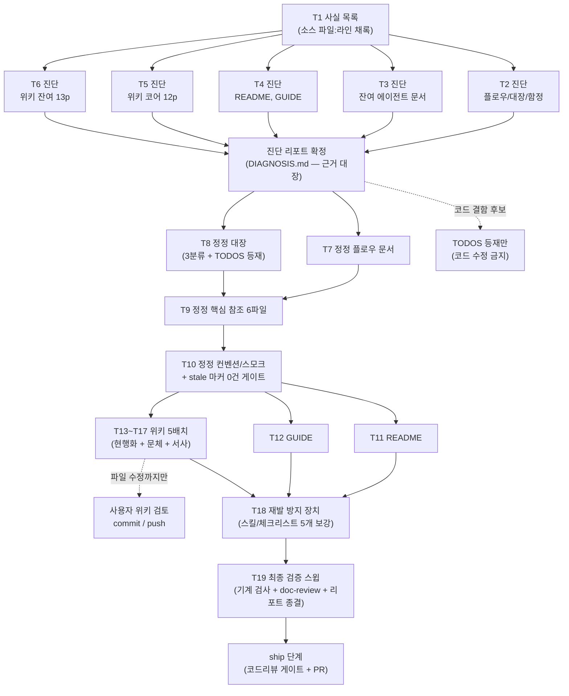

# 문서 전수 정합 개선 (DOCS-CONSISTENCY-OVERHAUL) 구현 플랜

> 작성일: 2026-07-02 (게이트 1R findings 반영 — 진단 5분할·잔여 정정 2분할·위키 배치 재응집·workflow-ship 복원. 2R 양측 pass)

## 요약 브리핑

### Task 목록

| # | 태스크 | 한 줄 |
|---|---|---|
| 1 | 사실 목록 + 리포트 뼈대 | 최근 봉인 토픽의 변경 사실을 소스에서 재확인해 채록, 진단 리포트 형식 확정 |
| 2 | 진단 — 플로우·대장·함정 | 결제 플로우 2문서 + 후속 대장 2문서 + 도메인 함정 문서 판정 |
| 3 | 진단 — 잔여 에이전트 문서 | 아키텍처·구조·스택·통합·테스팅 + 컨벤션 + 스모크 17파일 판정 |
| 4 | 진단 — README·GUIDE | 배너·페이즈·폐기 기능 서술 + 문체 판정, 페이즈 표기 실태 채록 |
| 5 | 진단 — 위키 도메인 코어 12p | outbox·확인 플로우·멱등·보상·상태·복구·PG 전략·TX 경계 판정 + 서사 후보 채록 |
| 6 | 진단 — 위키 잔여 13p | 아키텍처·관측성·검증·인덱스 판정 + 링크-슬러그 정합 |
| 7 | 정정 — 플로우 문서 | outbox 발행 실패 복구 등 S1 최우선 정정 (소스 기준) |
| 8 | 정정 — 대장 문서 | 완료 항목 3분류 정리 + 코드 확인 필요 항목 신규 등재 |
| 9 | 정정 — 핵심 참조 6파일 | 아키텍처·스택·통합·테스팅·함정 리포트 반영 + 중복 SSOT 몰기 |
| 10 | 정정 — 컨벤션·스모크 11파일 | 리포트 반영 + 에이전트 문서 전체 stale 마커 0건 게이트 |
| 11 | 정정 — README | 배너·페이즈 사실화 + 문체 교정 (S1 항목은 ship 대조 입력) |
| 12 | 정정 — 결제 플로우 가이드 | 사람 독자용 walkthrough 현행화 + 문체 교정 |
| 13 | 위키 1차 (5p) | outbox 2 + 확인 플로우 + 비동기 전환 + TX 경계 — 기준 예문 실반영 |
| 14 | 위키 2차 (4p) | 메시지 전달·dedupe + 멱등성 + 보상 TX + 재고 캐시 복구 |
| 15 | 위키 3차 (5p) | 상태 머신 + 복구 + 시나리오·교차 검증 + PG 전략 |
| 16 | 위키 4차 (5p) | 아키텍처 + MSA 전환 + 코레오그래피 + 메트릭 + 구조화 로깅 |
| 17 | 위키 5차 (6p) | 트레이싱 + AI 워크플로우 + 인덱스 3종 + 벤치마크(배너만) |
| 18 | 재발 방지 장치 | ship 체크리스트·context-update·workflow-ship·writing·doc-review 5개 보강 |
| 19 | 최종 검증 스윕 | 링크·stale 마커 0건 + doc-review 4관점 + 리포트 전건 종결 |

### 실행 플로우차트

### 핵심 결정 → Task 매핑

- 사실 판정 근거는 소스만 → T1~6 (진단 전건 파일:라인 채록), T19 (grep 재확인)
- 진단·정정 분리 (오류 주입 차단) → T1~6 vs T7~17
- TODOS/CONCERNS 3분류 삭제 → T2 예비 판정 + T8 적용
- 위키 본문 현행화 + 문체 교정 + 서사 (에이전트 문서 정정 후) → T13~17 (전 배치 "T7~10 완료 후 착수" 명시)
- 페이즈 표기 이원화 해소 → T4 채록 + T8 내부 1줄 + T11 README 확정
- 재발 방지 5개 대상 → T18
- 코드 확인 필요 항목 등재 → T8

### 트레이드오프 / 후속

- 진단 태스크(T3·T5·T6)는 상대적으로 큼 — execute 중 2시간 초과 시 추가 분할 (reviewer 2R 참고 메모)
- doc-review 는 T19 일괄이라 FAIL 루프 재작업이 후반 집중 — 각 정정 태스크의 리포트 근거 대조가 1차 방어
- 위키는 커밋 없이 파일 수정만 — T13~17 완료 후 사용자 검토·커밋 필요, ship 게이트에는 리포트 + 위키 로컬 diff 를 입력으로 전달

## 목표

두 문서 묶음(에이전트 작업용 + 사람 독자용)이 진단 리포트 기준으로 전건 정정되고, 기계 검사(링크·stale 마커 0건)와 doc-review 검수를 통과하며, 재발 방지 규칙이 스킬·체크리스트에 반영되면 종료.

## 컨텍스트

- 설계 문서: `docs/topics/DOCS-CONSISTENCY-OVERHAUL.md`
- 주요 산출물: `docs/DOCS-CONSISTENCY-OVERHAUL-DIAGNOSIS.md` (진단 리포트 — 모든 수정의 근거 대장)
- 주요 변경 파일: `docs/context/**`, `docs/smoke/**`, `README.md`, `docs/context/PAYMENT-FLOW-GUIDE.md`, `../payment-platform.wiki/*.md` (별도 저장소 — 커밋은 사용자), `.claude/skills/{_shared,context-update,workflow-ship,doc-review}/**`
- 전 태스크 tdd=false (문서 작업 — 테스트 대신 진단 리포트 근거·기계 검사가 완료 기준)
- 코드 수정 금지 — 결함 후보는 TODOS 등재만 (topic 결정)
- 구조 원칙: **진단(리포트 근거 확정) 태스크와 정정(반영) 태스크 분리** — 오류 주입 차단. 사실 판정 근거는 소스 파일:라인만.

## 진행 상황

- [x] Task 1: 변경 사실 목록 + 진단 리포트 뼈대
- [x] Task 2: 진단 — 플로우·대장·함정 5파일
- [x] Task 3: 진단 — 잔여 에이전트 문서 12파일 + smoke 5파일
- [x] Task 4: 진단 — README + PAYMENT-FLOW-GUIDE
- [x] Task 5: 진단 — 위키 도메인 코어 12페이지
- [x] Task 6: 진단 — 위키 잔여 13페이지
- [x] Task 7: 정정 — 플로우 문서 (CONFIRM-FLOW·PAYMENT-FLOW)
- [ ] Task 8: 정정 — 대장 문서 (TODOS·CONCERNS 3분류 + 코드 확인 항목 등재)
- [ ] Task 9: 정정 — 핵심 참조 문서 6파일
- [ ] Task 10: 정정 — conventions·smoke 11파일
- [ ] Task 11: 정정 — README
- [ ] Task 12: 정정 — PAYMENT-FLOW-GUIDE
- [ ] Task 13: 위키 1차 — outbox·확인 플로우·TX 경계 5페이지
- [ ] Task 14: 위키 2차 — 멱등·보상·재고 4페이지
- [ ] Task 15: 위키 3차 — 상태 머신·복구·검증·PG 전략 5페이지
- [ ] Task 16: 위키 4차 — 아키텍처·관측성 5페이지
- [ ] Task 17: 위키 5차 — 잔여·인덱스 6페이지
- [ ] Task 18: 재발 방지 장치 (스킬 4종 + doc-review 보강)
- [ ] Task 19: 최종 검증 스윕

## 태스크

### Task 1: 변경 사실 목록 + 진단 리포트 뼈대 [tdd=false] [domain_risk=true]

**구현**
- 최근 ship 토픽(EOS 전환 이후 ~ TC-3 재고 resync)의 archive briefing 에서 "코드에 일어난 변경 사실" 목록 작성 — 각 사실의 참·거짓은 briefing 이 아닌 **소스에서 재확인** (파일:라인 채록)
- `docs/DOCS-CONSISTENCY-OVERHAUL-DIAGNOSIS.md` 생성 — 항목 형식: 문서 위치 / 문제 / 소스 근거(파일:라인) / 수정 방향 / 심각도(S1~S5). **기본값 인용 시 층위(코드 fallback vs 프로파일 yml) 명시** 규칙 포함 (게이트 2R minor)
- topic 사전 진단 표본 12건 + 기준 예문 retry 카운트 불릿(게이트 2R minor) 을 진단 항목으로 수록·재검증

**완료 기준**
- 사실 목록 전 항목에 소스 파일:라인 채록 (문서 인용 근거 0건)
- 표본 12건 리포트 수록·판정 완료

**완료 결과**
> `docs/DOCS-CONSISTENCY-OVERHAUL-DIAGNOSIS.md` 신규 생성. §0 형식 정의(항목 형식 5컬럼 + 심각도 S1~S5 + "기본값 인용 시 층위 명시" 규칙, `scheduler.outbox-worker.parallel-enabled` 실증 사례로 코드 fallback(`OutboxWorker.java:26`, false) vs default profile yml(`application.yml:149`, true) 대조 포함) 확정. §1 사실 목록 28건(F1~F28) — EOS 전환(2026-05-17) ~ TC-3 수동 resync(2026-07-01) 사이 archive 봉인 토픽(EOS-FOLLOWUP-CLEANUP/TIME-MODEL-AND-EXPIRY·FOLLOWUP/CI-PIPELINE-REDESIGN/OBSERVABILITY-COMPLETION/CLEANUP-BATCH-C~E/STOCK-COMPENSATION-OTHER-PATHS/RETRY-METRIC-CLEANUP/CONFIRM-APPROVED-RESEND-GAP/DLQ-REACHABILITY/ALERTING-RULES-AND-FAULT-DRILL/FAULT-INJECTION-RESILIENCE) + 봉인 이후 standalone 커밋(L-14 poison-pill/TC-3 resync) 을 후보로 삼아 전건 소스 재확인(파일:라인) — briefing 인용은 후보 추출에만 사용, 사실 확정은 코드 grep/Read 로 별도 수행. 표본 12건(§2) 전건 판정: #1(CONCERNS.md L-1 qualifier 서술, `PaymentConfirmResultUseCase.java:116` 명시 qualifier 확인 — 문서 내부 L92 vs L97 자기모순 재확인) · #12(CONFIRM-FLOW/PAYMENT-FLOW의 REQUIRES_NEW/IN_FLIGHT 서술, `OutboxRelayService.java:49-59` 단일 TX + `PaymentOutboxUseCase.claimToInFlight`/`incrementRetryOrFail` 프로덕션 호출처 0 재확인, S1 critical) 은 인계받은 근거 보강. 나머지 10건 신규 재검증 — 특히 #7(canCompensateStock 는 STOCK-COMPENSATION-OTHER-PATHS 에서 이미 死 코드 제거돼 CONFIRM-FLOW.md 는 이미 정합, TODOS.md 완료 항목만 3분류 삭제 대상)·#10(`PaymentEventStatus.java` RETRYING enum 완전 부재, 위키 state-management.md 는 여전히 전면 서술) 확정. §3 게이트 2R 잔여 minor 2건 해소: 기본값 층위 규칙은 §0.3 편입, retry 카운트 불릿은 `incrementRetryOrFail` 호출처 0 + `recoverTimedOutInFlightRecords`(IN_FLIGHT 타임아웃 전용) 소스 대조로 "고려 중"이 아닌 "현재 relay 실패 경로 미적용"이 정확한 서술임을 확정(Task 13 반영 문구 초안 포함). §4 는 Task 2~6 플레이스홀더로 남김. 코드 무변경 — `./gradlew test` 대상 아님(문서만 생성).

### Task 2: 진단 — 플로우·대장·함정 5파일 [tdd=false] [domain_risk=true]

**구현**
- 대상: `CONFIRM-FLOW.md` / `PAYMENT-FLOW.md` / `TODOS.md` / `CONCERNS.md` / `PITFALLS.md` — 사실 목록 대조 + 통독 진단, 리포트에 항목 추가
- TODOS/CONCERNS 는 3분류 삭제 판정(전체 삭제 / 문장 제거 / 보존)을 항목별로 예비 기록

**완료 기준**
- 5파일 전부 페이지별 판정 존재, S1/S2 전건 소스 근거 포함

**완료 결과**
> `docs/DOCS-CONSISTENCY-OVERHAUL-DIAGNOSIS.md` §4.1 신규 작성. 5파일 전건 통독 + 사실 목록(F1~F28) 대조, 소스는 grep/Read 로 직접 재확인. **핵심 발견**: (1) CONFIRM-FLOW.md/PAYMENT-FLOW.md 의 outbox "REQUIRES_NEW 선점 → 발행 실패 시 IN_FLIGHT 유지" stale 서술이 표본 #12 가 지목한 곳(§3 mermaid+prose) 외에도 §10 재시도표(`incrementRetryOrFail` 진입점 표기)·§11 회복 시나리오·§13 멱등성표·PAYMENT-FLOW §장애복원포인트 4곳에 추가 잔존함을 소스 대조(`OutboxRelayService.java:49-78` 단일 `@Transactional`)로 확정 — 전부 S1 critical 클러스터로 묶음. (2) **신규 발견**: `PaymentOutboxStatus.FAILED` 로 전이하는 코드 경로가 현재 0건(`PaymentOutbox.toFailed()` 삭제됨 + `incrementRetryOrFail` 미호출) — CONFIRM-FLOW §9/§10 및 TODOS TC-7 이 이를 여전히 살아있는 종결 경로처럼 서술. (3) `parallel-enabled` 기본값이 코드 fallback(false)만 인용하고 실구동 default profile 값(true, `application.yml:149`)을 누락 — §0.3 층위 규칙 위반 실사례로 등재. (4) TODOS.md — "토픽 묶음 계획" 섹션 + "## 완료" 섹션(~20개 항목) 전체가 `docs/archive/README.md` 와 완전 중복돼 (a) 전체 삭제 대상으로 판정, 개별 항목 24건 3분류(a 20건/b 3건/c 다수) 예비 판정 완료 — TC-13-FOLLOW-5 는 지시대로 canCompensateStock/RETRYING/PaymentEventStatusCrossInvariantTest 를 현재형으로 서술하는 S1 오류로 (a) 확정. (5) CONCERNS.md — L-3·L-6 이 CAPACITY-AND-SCALEOUT 의 2-인스턴스 fencing 실측(`docker-compose.apps.yml` payment-service `hostname:` 라인 이미 제거 확인)으로 이미 해소됐음에도 미마킹 상태임을 신규 발견해 (a) 전체 삭제로 판정, L-1 내 ID 오기(TC-13-FOLLOW-1→6) 도 신규 발견. (6) PITFALLS.md — 헤더-본문 시점 불일치(표본 #3) 외에 §18 "L6" 참조가 실제로는 CONCERNS L-12 를 가리켜야 함(CONCERNS 리스트 재편 이력으로 어긋남) + §17 "(L2 알려진 한계)" 가 dangling 참조임을 신규 발견 — 둘 다 S2. 대상 5파일 정정은 수행하지 않음(Task 7/8 범위). `./gradlew test` 대상 아님(문서만).

### Task 3: 진단 — 잔여 에이전트 문서 12파일 + smoke 5파일 [tdd=false] [domain_risk=true]

**구현**
- 대상: `ARCHITECTURE` / `STRUCTURE` / `STACK` / `stack/flyway-operations` / `CONVENTIONS`(인덱스) / `TESTING` / `INTEGRATIONS` + `conventions/` 5파일 + `docs/smoke/` 5파일
- 중복 서술(S4)의 SSOT 지정안(어느 문서로 몰지)도 리포트에 기록

**완료 기준**
- 17파일 전부 페이지별 판정 존재, S1/S2 전건 소스 근거 포함

**완료 결과**
> `docs/DOCS-CONSISTENCY-OVERHAUL-DIAGNOSIS.md` §4.2 신규 작성. 대상 17파일(ARCHITECTURE/STRUCTURE/STACK/stack/flyway-operations/CONVENTIONS/TESTING/INTEGRATIONS + conventions 5파일 + smoke 5파일) 전건 통독 + F1~F28 대조 + Task 2 확정 S1 클러스터 3종(outbox REQUIRES_NEW/IN_FLIGHT stale, `PaymentOutboxStatus.FAILED` dead-terminal, `parallel-enabled` 층위 위반) grep 재확인 — **이 17파일에는 3종 모두 잔존 0건**(REQUIRES_NEW/IN_FLIGHT/toFailed/parallel-enabled 전건 grep 0, 이 레벨 문서들은 outbox 재시도 디테일을 서술하지 않음). 대신 **17파일 간 상호 대조에서 신규 S1 4건 발견**(다른 문서 인용이 아니라 각각 `build.gradle`/소스로 독립 재확인): (1) `STRUCTURE.md` §빌드 트리거의 "`./gradlew test` = 전 모듈 단위+통합"이 `STACK.md` "단위만(`integration` 태그 제외)"과 정면 모순 — `build.gradle:66-67` `excludeTags 'integration'` 확인으로 `STACK.md` 가 정확함 확정. (2) `STRUCTURE.md` §정적 분석의 "JaCoCo 는 모듈별 `build.gradle`"이 `TESTING.md` "루트 `build.gradle` `subprojects` 블록 공통"과 모순 — 루트 `build.gradle:20-178` 대조로 `TESTING.md` 가 정확함 확정. (3) `STACK.md` §스케줄러 활성화 정책의 "서비스별 활성 매트릭스"+"역할별 목록"에서 user-service 전체가 누락돼 있으나 실제로는 user-service 도 `SchedulerConfig`(동일 게이트 패턴) + `DependencyHealthMetrics`(`@Scheduled`)를 보유(FAULT-INJECTION-RESILIENCE 도입, STATE.md 재개 메모의 "user `@EnableScheduling` 누락" 갭과 연결) — payment/pg/product 3서비스 역할 목록에도 동일 컴포넌트 누락 확인. (4) `conventions/transactions.md` 예시 코드가 `@Transactional(timeout = 5)` 만 표기해 실제 코드의 `transactionManager = "transactionManager"` qualifier(F1, CONCERNS L-1 과 같은 사실 축)가 빠짐 — 컨벤션 문서가 정작 그 qualifier 의 존재 이유를 가르치는 자리에서 빠뜨린 역설적 누락. §4.2.18 에 S4 중복 4건 SSOT 지정안(JaCoCo 정책 SSOT=`TESTING.md`, 빌드 명령 SSOT=`STACK.md`, Contract test 상세 SSOT=`TESTING.md`, CircuitBreaker 근거 SSOT=`INTEGRATIONS.md`) 수록. 대상 17파일 정정은 수행하지 않음(Task 9/10 범위). `./gradlew test` 대상 아님(문서만).

### Task 4: 진단 — README + PAYMENT-FLOW-GUIDE [tdd=false] [domain_risk=true]

**구현**
- `README.md`(551줄) + `PAYMENT-FLOW-GUIDE.md`(378줄) 진단 — 배너·페이즈·지표·폐기 기능 서술 + 문체(S5)
- 페이즈 표기 실태(README 1~7 vs 내부 0~5) 전수 채록 → Task 11 결정 입력

**완료 기준**
- 2파일 판정 완료, README 도메인 사실(S1) 항목 별도 표기 (ship 대조 입력용)

**완료 결과**
> `docs/DOCS-CONSISTENCY-OVERHAUL-DIAGNOSIS.md` §4.3 신규 작성. **핵심 발견**: (1) CONFIRM-FLOW/PAYMENT-FLOW 의 outbox 발행 실패 stale 클러스터(표본 #12, 단일 TX 대신 REQUIRES_NEW+IN_FLIGHT 유지로 서술)가 짝 문서 `PAYMENT-FLOW-GUIDE.md` 에도 독립 5곳(§A 단계14/15, §B-2, §C 표, §D 통합 플로우차트) 잔존함을 소스 재확인(`OutboxRelayService.java:49-78`, `OutboxWorker.java:26,38,41`)으로 확정 — S1 critical, Task 12 최우선 대상. GUIDE 나머지는 17개 클래스/메서드명 grep 전건 존재 확인 + 보상 가드 삭제(F7)·EOS DLQ(F12)·종결 가드 재발행(F10) 등 전건 소스 일치, 문체(S5) 도 grep 0건으로 수정 대상 없음(구조화 기술 문서 장르라 AI체 패턴 자체가 없음). (2) **신규 발견(README)**: "주요 해결 과제" 표 "장애 내성 복구 체계" 행이 서술하는 4개념 중 3개가 현재 코드에 없음 — `RecoveryDecision` 클래스 완전 삭제(grep 0), `canCompensateStock` 이중 조건 가드 완전 삭제(F7, `PaymentConfirmResultUseCase.java:280-303` 가드 없는 직접 호출 확인), FCG(`PgFinalConfirmationGate`) 는 클래스만 존재하고 프로덕션 호출처 0건(`PgStatusLookupPort.java` 의존 선언뿐, 실제 호출자 grep 0 — `PAYMENT-FLOW.md:377` 기존 결론과 별도로 직접 재확인). (3) "결제 상태 관리" 섹션 캡션 "보상 안전 가드 자체는 유지"가 (2)와 같은 축에서 코드와 정반대(`QuarantineCompensationHandler.java:56-60` 는 단일 종결 체크만 남고 "대기열 선점 중" 이중 조건 없음) — S1 critical 신규. (4) Outbox 모델 표의 `FAILED` dead-terminal 미표기가 Task 2 CONFIRM-FLOW 클러스터의 README 확장 위치임을 확인(S1 minor). (5) 배너 "589 PASS"·경고문은 표본 #5 그대로(F26/F27), 이번 태스크에서 `@Test` grep 재실행 641(annotation, 근사치, Task 11 실행 시점 `./gradlew test` 재확정 필요)로 스냅샷 노후 추가 확인. (6) 위키 링크 25개 앵커 전건 파일 대조 — 깨진 링크 0건(보존). (7) Phase 표기 3축(README 개발순서/결제처리단계/MSA로드맵) 전수 채록 — 신규 교차 발견으로 README "다음 Phase 7"(장애주입+k6+오토스케일러+서킷브레이커)과 내부 로드맵 "Phase 4"(TODOS T4-A~E)가 **동일 작업 뭉치를 다른 번호로 지칭**함을 확인(`docs/context/TODOS.md:159-196` 대조) — plan 결정상 축 통일은 비범위이나 Task 11에 1줄 disambiguation 권고(선택). README 도메인 사실(S1) 3항목을 §4.3.3 에 ship domain-expert 대조 입력용으로 별도 표기 완료. 대상 2파일 정정은 수행하지 않음(Task 11/12 범위). `./gradlew test` 대상 아님(문서만).

### Task 5: 진단 — 위키 도메인 코어 12페이지 [tdd=false] [domain_risk=true]

**구현**
- 대상: `outbox-pattern` / `outbox-channel-dispatch` / `pg-confirm-flow` / `async-outbox` / `tx-scope` / `message-delivery-and-dedupe` / `idempotency` / `compensation-tx` / `stock-cache-recovery` / `state-management` / `retry-recovery` / `pg-strategy`
- 페이지별 S1~S5 판정 + 서사 섹션 후보(도입/말미)와 근거 이력(PITFALLS·archive 경로) 기록 — 근거 없는 서사 후보 금지

**완료 기준**
- 12페이지 전부 판정 존재, 서사 후보마다 실제 이력 근거 경로 1개 이상

**완료 결과**
> `docs/DOCS-CONSISTENCY-OVERHAUL-DIAGNOSIS.md` §4.4 신규 작성(4.4.1~4.4.12). 대상 12페이지 전건 통독 + F1~F28 대조 + Task 2~4 확정 클러스터(outbox REQUIRES_NEW/IN_FLIGHT stale·`PaymentOutboxStatus.FAILED` dead-terminal·`RETRYING` enum 부재·`RecoveryDecision`/FCG/보상 가드 삭제·payment 측 `EventDedupeStore` 폐기·`parallel-enabled` 층위) grep 재확인. **핵심 발견**: 이 12페이지의 최대 문제는 outbox 클러스터가 아니라 별도의 **RD/RETRYING/FCG 클러스터**(`RecoveryDecision` 값 객체 + `RETRYING` 상태 + FCG 가 지금도 살아있다는 서술)다. `state-management.md` 배너가 "RecoveryDecision + FCG + 격리 사이클은 유지된다"고 명시해 위키 안에서 정본화돼 있으나, 소스 재확인 결과 `RecoveryDecision` 완전 삭제(grep 0), `PaymentEventStatus` 는 8상태뿐(F6, RETRYING 없음, `canApplyConfirmResult()` 가 READY/IN_PROGRESS 만 EOS 진입 허용), `handleFailed`/`handleQuarantined` 는 재고 복구 가드나 PaymentEvent 재조회 없이 `compensateAtomic` 직접 호출(F7 축) — state-management.md 는 "PaymentEvent 상태 머신"·"RecoveryDecision"·"재고 복구 가드"·"복구 사이클 전체 플로우" 4개 섹션이 전면 재작성 대상(S1 critical, Task 15 최우선). **신규 발견**: (1) `compensation-tx.md` 배너 자체가 "재고 복구는 product-service 호출(cross-service Kafka 이벤트)로 진화"라는 새로운 사실 오류를 담고 있음을 확정(S1 critical) — 실제로는 payment-service 내부 Redis Lua `compensateAtomic`(`StockCacheRedisAdapter`)로 완결되며 product 호출도 Kafka 이벤트도 없다(`CONFIRM-FLOW.md:250` "redis 보상만"과 대조). (2) `pg-confirm-flow.md` 의 "결과 메시지 종류" 표(FCG 를 살아있는 발행 트리거로 나열)와 "향후 확장" 절(FCG 를 "검토 중"인 미래 계획으로 서술)이 같은 페이지 안에서 모순 — 실제로는 `PgFinalConfirmationGate`(pg-service 소속)가 `@Service`+전용 테스트까지 완비된 완성 코드이나 프로덕션 호출처 0(반쯤 지어진 미연결 상태, README/PAYMENT-FLOW 의 동일 클래스 판정과 결론 통일, S1+S2). (3) `async-outbox.md`/`stock-cache-recovery.md`(간접) 에서 §0.3 "기본값 층위" 위반 신규 사례 — `scheduler.outbox-worker.batch-size` 를 "application.yml" 기본값처럼 제시한 YAML 블록이 실제로는 benchmark profile 전용 값(100)이고 default profile 은 50(`parallel-enabled` 와 같은 축, S1+S2). (4) `message-delivery-and-dedupe.md`/`stock-cache-recovery.md` 둘 다 DLQ-REACHABILITY(2026-06-25)가 추가한 `AfterRollbackProcessor`(EOS commitTransaction 실패 전용 DLQ 경로) 를 반영하지 못함(S1/S3, 두 페이지가 정확히 그 주제를 다루는 페이지라 완전성 갭 비중 있음). (5) `pg-strategy.md` 배너("호출 경계 이동")가 실제 변화 규모(payment-service 의 `PaymentGatewayFactory`/`InternalPaymentGatewayAdapter`/`PaymentGatewayPort` 등 전 클래스가 pg-service 로 이름까지 바뀌어 재구성됨, grep 으로 payment-service 쪽 0건 확인)를 과소 서술(S1). **양호 판정**: `outbox-pattern.md` 는 핵심 동작 서술 자체는 정확(재확인: `OutboxRelayService` 단일 TX, `incrementRetryCount` 가 실제 backoff 적용) — topic 문체 기준 예문 대상 위치를 정확히 특정(L72/L94-98, Task 13 에서 topic 문서의 계산된 "후" 텍스트 그대로 실반영 가능), FAILED dead-terminal 각주만 필요(S1). `tx-scope.md`/`retry-recovery.md` 는 배너·역사 프레이밍이 12페이지 중 모범 사례(retry-recovery.md 의 "이 모델의 한계 → Phase 5 개선" 패턴을 state-management.md 대수술의 템플릿으로 권고). `idempotency.md`/`outbox-channel-dispatch.md` 는 S1 없음(경미한 누락·모호성만). 서사 후보 9개 페이지에서 실제 archive 경로 채록(payment-retry-state/payment-double-fault-recovery/payment-eos-transition/cleanup-batch-e/stock-compensation-other-paths 5개 토픽이 state-management.md 하나의 후보에 집중) — 3페이지(outbox-pattern/tx-scope/idempotency)는 근거 부족으로 강제하지 않음(창작 방지 원칙 준수). "Phase N 시점" 배너 정합 전수 판정(정확 2건·부분 정확 2건·배너 자체 오류 3건·배너 불필요 5건). 대상 12페이지 정정은 수행하지 않음(Task 13~15 범위). `./gradlew test` 대상 아님(문서만, 위키는 별도 저장소 — 이번 태스크는 위키 파일 수정도 하지 않음, 순수 진단).

### Task 6: 진단 — 위키 잔여 13페이지 [tdd=false] [domain_risk=true]

**구현**
- 대상: `architecture` / `msa-transition` / `event-driven-choreography` / `metrics` / `structured-logging` / `scenario-test` / `cross-validation` / `trace-propagation` / `ai-workflow` / `Home` / `_Sidebar` / `_Footer` / `Benchmark-Report`(시점 기록 — 배너·링크만)
- 위키 신규 페이지 필요성 판단만 수록 (작성은 비범위)
- Home·Sidebar 링크-슬러그 정합 검사 포함

**완료 기준**
- 13페이지 전부 판정 존재

**완료 결과**
> `docs/DOCS-CONSISTENCY-OVERHAUL-DIAGNOSIS.md` §4.5 신규 작성(4.5.1~4.5.11). 대상 13페이지 전건 통독 + F1~F28 대조 + Task 2~5 확정 클러스터(outbox REQUIRES_NEW/IN_FLIGHT stale·`PaymentOutboxStatus.FAILED` dead-terminal·RD/RETRYING/FCG 클러스터·payment 측 `EventDedupeStore` 폐기·Elasticsearch/Logstash→Loki/Promtail(§2 표본 #9)) grep 재확인. **핵심 발견**: 이 배치 최대 오류는 `structured-logging.md`(4.5.5) — 페이지 절반 이상(로깅 파이프라인 다이어그램·민감정보 마스킹 섹션 전체·TraceId 전파 섹션 전체·Logstash 연동 섹션 전체)이 완전히 삭제된 인프라·클래스(`MaskingPatternLayout`/`TraceIdFilter`/`LogstashTcpSocketAppender`/Elasticsearch·Kibana 백엔드, 전건 grep 0, logback-spring.xml 은 Console appender 뿐)를 현재형으로 서술(S1 critical 4건) — 같은 위키의 `trace-propagation.md`(4.5.8)가 정확히 같은 주제(로그↔트레이스 교차 조회)를 Promtail/Loki 기준으로 정확히 서술해 극단적 대조군이 됨. 민감정보 마스킹 메커니즘이 대체 없이 완전히 사라진 것으로 보여(신규 발견) Task 8 TODOS "코드 확인 필요 항목" 후보로 별도 표기. **RD/RETRYING/FCG 클러스터**(Task 5 §4.4.10 도입) 가 이 13페이지에도 3곳 추가 확산 확인 — `architecture.md`(4.5.1, 핵심 설계 결정 표의 FCG 행 + domain 패키지 트리의 `RecoveryDecision.java` + `PaymentEventStatus`/`PaymentOutboxStatus` enum 주석) · `metrics.md`(4.5.4, "비동기 플로우의 관측 맹점" 다이어그램의 RETRYING 분기) · `scenario-test.md`(4.5.6, `OutboxProcessingServiceTest` 섹션 전체가 완전 삭제된 클래스 — 배너가 "클래스명만 다르다"고 고지한 범위를 넘는 신규 발견, 클래스와 테스트 자체가 없어짐). **신규 발견**: (1) `msa-transition.md` 토폴로지 다이어그램이 `redis-stock` 연결을 `Prod --> RedS` 로 서술해 같은 위키의 `architecture.md`(`Pay --> RedS`, 정확)와 정면 모순 — `application.yml:99-101`/`docker-compose.apps.yml:47,57` 재확인 결과 payment-service 만 연결(S1+S2, 4.5.2). (2) `metrics.md` 가 RETRY-METRIC-CLEANUP(F9)로 이미 삭제된 `payment_health_max_retry_reached_total` 게이지를 여전히 표에 나열하면서(코드 재확인: `PaymentHealthMetrics` 는 `stuck_in_progress` 1종만 등록) F14 `dependency_up` 게이지와 알람 규칙 4그룹(F13)은 배너·표 양쪽에서 완전 누락 — 이 페이지가 다루는 정확히 그 주제(운영 지표)의 최근 확장이 빠짐(S1+S3, 4.5.4). (3) `TossApiMetrics` 가 pg-strategy 이관(4.4.12)에 따라 실제로는 pg-service 소속임에도 payment-service `core.common.metrics` 패키지 소속처럼 서술(S1, 신규). (4) `scenario-test.md` 의 `FakeProductRepository`/`ProductRepository` 포트 자체가 배너 고지 범위 밖에서 완전 삭제(HTTP Feign 으로 대체) 확인(S1). **양호 판정**: `event-driven-choreography.md`(4.5.3, 13페이지 중 가장 정합)·`trace-propagation.md`(4.5.8, 최신·최정확, structured-logging 재작성의 기준 문서)·`ai-workflow.md`(4.5.9, 2026-06-12 개편을 정확히 반영 — 파일 자신이 그 개편의 산출물이라 F28 갱신 격차의 유일한 예외)·`cross-validation.md`(4.5.7, 배너-본문 정합 모범 사례) 는 변경 불요. `Home`/`_Sidebar`/`_Footer`(4.5.10) 링크-슬러그 25페이지 전건 대조 완료 — 깨진 링크 0건, 고아 페이지 0건. 알람 규칙+장애 드릴 대응 신규 위키 페이지 필요성은 검토했으나 비강제 판정(별도 서사 독립성 부족, `metrics.md` 확장 흡수를 Task 16 에 권고, 작성은 비범위). `Benchmark-Report.md`(4.5.11) 는 이미 정확한 자기 배너("Phase 5 시점 — 모놀리스 단일 JVM 측정, MSA 이후 재측정 미실시")로 변경 불요, 내부 링크는 전부 문서 내 앵커뿐(외부 슬러그 0건). §5 완료 기준 대조에 Task 5(누락돼 있던 체크박스)·Task 6 항목 보강 포함. 대상 13페이지 정정은 수행하지 않음(Task 16/17 범위). `./gradlew test` 대상 아님(문서만, 위키 파일 수정도 하지 않음 — 순수 진단).

### Task 7: 정정 — 플로우 문서 (CONFIRM-FLOW·PAYMENT-FLOW) [tdd=false] [domain_risk=true]

**구현**
- 표본 #12 (S1 최우선): outbox 발행 실패 복구 서술을 소스 기준(단일 TX 롤백 → PENDING 복귀, 5초 주기 재픽업)으로 정정 — CONFIRM-FLOW §3·§4·§9·§11 + PAYMENT-FLOW Phase 3·장애 복원 포인트
- 표본 #2 + Task 2 리포트의 두 문서 잔여 항목 전건 반영, 헤더 "최종 갱신" 동기화

**완료 기준**
- 리포트의 두 문서 항목 전건 종결, 링크 검사 통과 유지

**완료 결과**
> `docs/DOCS-CONSISTENCY-OVERHAUL-DIAGNOSIS.md` §4.1.1(8건)·§4.1.2(3건) 전건 반영. **S1 최우선 클러스터**: outbox 발행 실패 복구 서술을 소스 기준(`OutboxRelayService.relay` — 단일 `@Transactional` 안에서 claim(Step1)·조회(Step2)·Kafka 발행(Step3)·완료 마킹(Step4) 전부 수행, `claimToInFlight` 는 REQUIRES_NEW 아닌 같은 TX 소속 `@Modifying` UPDATE, 발행 실패 시 TX 전체 롤백 → Step1 갱신도 취소돼 row 는 커밋된 적 없는 PENDING 그대로 → `OutboxWorker` 5초 주기 배치 재픽업이 1차 회복 경로, IN_FLIGHT 5분 타임아웃 회수는 워커 비정상 종료 등 드문 경로의 보조 안전장치)으로 CONFIRM-FLOW.md §3(mermaid+prose 재작성)·§4(우선순위 재정렬)·§10(재시도표 "한도 초과 시"/"코드 진입점" 2행)·§11(회복 시나리오 인덱스)·§13(멱등성표 "outbox claim" 행) + PAYMENT-FLOW.md Phase 3 다이어그램(R5a)·장애 복원 포인트 전면 정정. `PaymentOutboxStatus.FAILED` dead-terminal 각주를 CONFIRM-FLOW §9 상태표 + §10 재시도표에 추가("`PaymentOutbox.toFailed()` 삭제 + `incrementRetryOrFail` 호출처 0" 소스 근거 명시). `parallel-enabled` 기본값을 §0.3 층위 규칙대로 "코드 fallback: false / default 프로파일(로컬·docker 실구동): true" 두 값 병기로 교체(§4). §12 dedup TTL 표의 "TC-13-FOLLOW-2 후속 항목" 서술을 `DedupeCleanupWorker`(`@Scheduled fixedDelayMs=3600000`, `deleteExpired` 배치 삭제) 구현 완료 서술로 교체. §18 관련 문서 목록의 "(verify 완료 후 이동 예정)" 삭제(`docs/archive/pg-confirm-listener-split/COMPLETION-BRIEFING.md` 존재 확인). PAYMENT-FLOW.md 도입부 봉인 시점 앵커를 "Phase 0~3.5 + PRE-PHASE-4-HARDENING"(2026-04-24)에서 "DLQ-REACHABILITY"(2026-06-25, 최신)로 교체. 두 문서 헤더 "최종 갱신"을 2026-07-02(Task 7)로 갱신, 이전 이력 체인 보존. 정정 후 `DOCS-CONSISTENCY-OVERHAUL-DIAGNOSIS.md` §4.1.1·§4.1.2 테이블 하단에 종결 마킹(`[Task 7 종결, 2026-07-02]`) + 리포트 헤더 "최종 갱신"에 Task 7 요약 추가. 상대 링크(CONFIRM-FLOW ↔ PAYMENT-FLOW 상호 참조 3곳) 변경 없음 — grep 재확인 정상. TODOS/CONCERNS/PITFALLS(§4.1.3~4.1.5)는 Task 8 범위라 미착수. `./gradlew test` 대상 아님(문서만).

### Task 8: 정정 — 대장 문서 (TODOS·CONCERNS) [tdd=false] [domain_risk=true]

**구현**
- Task 2 의 3분류 예비 판정대로 적용: (a) ✅해소+archive 경로 항목 전체 삭제 (b) 혼합 항목(L-1·L-14 등) 해소분 문장만 제거·잔여 한계와 기각 근거 보존 (c) 수용된 한계 L-* 현행분·"회피된 우려" 표 보존. 삭제 전건 리포트에 근거 채록
- topic "코드 확인 필요 항목"(REQUIRES_NEW 선점·`incrementRetryOrFail` 호출처 0, 무백오프 5초 재시도)을 TODOS 신규 등재
- 표본 #1 (CONCERNS L-1 qualifier 모순) 정정, 내부 Phase 번호가 README 개발 과정 Phase 와 별개임을 TODOS 분류 룰에 1줄 명시

**완료 기준**
- ✅ 완료 마킹 잔존 0건 (보존 결정분 제외), 삭제 전건 근거 채록

**완료 결과**
> (execute에서 채움)

### Task 9: 정정 — 핵심 참조 문서 6파일 [tdd=false] [domain_risk=true]

**구현**
- 대상: `ARCHITECTURE` / `STRUCTURE` / `STACK`(+`stack/flyway-operations`) / `INTEGRATIONS` / `TESTING` / `PITFALLS` — Task 3 리포트 항목 전건 반영 (표본 #3 PITFALLS 헤더, #7 TESTING 카운트 포함)
- S4 중복은 리포트의 SSOT 지정안대로 몰고 나머지는 참조로 교체

**완료 기준**
- 리포트의 해당 문서 항목 전건 종결

**완료 결과**
> (execute에서 채움)

### Task 10: 정정 — conventions·smoke 11파일 [tdd=false] [domain_risk=true]

**구현**
- 대상: `CONVENTIONS`(인덱스) + `conventions/` 5파일 (kafka·transactions 의 도메인 정책 서술 포함) + `docs/smoke/` 5파일 — Task 3 리포트 항목 전건 반영

**완료 기준**
- 리포트의 해당 문서 항목 전건 종결, 에이전트 문서 전체 stale 마커 grep 0건 (Task 7~10 완료 시점)

**완료 결과**
> (execute에서 채움)

### Task 11: 정정 — README [tdd=false] [domain_risk=false]

**구현**
- 배너 정정 (표본 #5): 진행 Phase·테스트 수·"정합이 안 맞을 수 있음" 경고·폐기 기능 서술(재고 복원 가드 등) 현행화
- 페이즈 표기 확정: README 는 독자용 개발 과정 Phase 1~7 체계 유지, Task 4 채록 실태 기반으로 완료/진행 상태만 사실화
- 문체 교정: topic "문체 수정 기준" 적용 (구조 불변, 문장·단어 단위)

**완료 기준**
- 리포트의 README 항목 전건 종결. **README diff 중 도메인 사실(S1) 항목은 ship domain-expert 대조 입력에 포함** (게이트 1R minor)

**완료 결과**
> (execute에서 채움)

### Task 12: 정정 — PAYMENT-FLOW-GUIDE [tdd=false] [domain_risk=true]

**구현**
- Task 4 리포트 기준 현행화 (정합 기준은 소스 — 정정된 플로우 문서와 어긋나면 소스 재확인) + 문체 수정 기준 적용

**완료 기준**
- 리포트의 GUIDE 항목 전건 종결

**완료 결과**
> (execute에서 채움)

### Task 13: 위키 1차 — outbox·확인 플로우·TX 경계 5페이지 [tdd=false] [domain_risk=true]

**구현**
- 대상: `outbox-pattern` / `outbox-channel-dispatch` / `pg-confirm-flow` / `async-outbox` / `tx-scope` (TX 경계·EOS TM 분리 — CONCERNS L-1 과 같은 사실 축이라 본 배치로 응집, 게이트 1R major)
- 본문 현행화(소스 근거) + 문체 교정 + 서사 섹션(리포트의 근거 있는 후보만) + 빈 섹션 제거 (표본 #11)
- 기준 예문(topic) 을 outbox-pattern 에 실반영 — retry 카운트 불릿은 Task 1 재검증 결론 반영
- **Task 7~10 (에이전트 문서 정정) 완료 후 착수** — 서사 순서 의존 (topic 결정)

**완료 기준**
- 5페이지 리포트 항목 전건 종결, 위키 로컬 diff 생성 (커밋은 사용자)

**완료 결과**
> (execute에서 채움)

### Task 14: 위키 2차 — 멱등·보상·재고 4페이지 [tdd=false] [domain_risk=true]

**구현**
- 대상: `message-delivery-and-dedupe` / `idempotency` / `compensation-tx` / `stock-cache-recovery`
- Task 13 과 동일 작업 패턴. **Task 7~10 완료 후 착수** (서사 순서 의존)

**완료 기준**
- 4페이지 리포트 항목 전건 종결

**완료 결과**
> (execute에서 채움)

### Task 15: 위키 3차 — 상태 머신·복구·검증·PG 전략 5페이지 [tdd=false] [domain_risk=true]

**구현**
- 대상: `state-management`(표본 #10 RETRYING) / `retry-recovery` / `scenario-test` / `cross-validation` / `pg-strategy` (PG 실패 모드 축 — retry-recovery 와 응집, 게이트 1R major)
- Task 13 과 동일 작업 패턴. **Task 7~10 완료 후 착수** (서사 순서 의존)

**완료 기준**
- 5페이지 리포트 항목 전건 종결

**완료 결과**
> (execute에서 채움)

### Task 16: 위키 4차 — 아키텍처·관측성 5페이지 [tdd=false] [domain_risk=true]

**구현**
- 대상: `architecture` / `msa-transition` / `event-driven-choreography` / `metrics` / `structured-logging`(표본 #9 Elasticsearch→Loki)
- Task 13 과 동일 작업 패턴. **Task 7~10 완료 후 착수** (서사 순서 의존)

**완료 기준**
- 5페이지 리포트 항목 전건 종결

**완료 결과**
> (execute에서 채움)

### Task 17: 위키 5차 — 잔여·인덱스 6페이지 [tdd=false] [domain_risk=false]

**구현**
- 대상: `trace-propagation` / `ai-workflow` / `Home` / `_Sidebar` / `_Footer` / `Benchmark-Report`(배너·링크만)
- Home·Sidebar 링크-슬러그 정합 반영. **Task 7~10 완료 후 착수** (서사 순서 의존)

**완료 기준**
- 6페이지 리포트 항목 전건 종결, 위키 내부 링크 깨짐 0건

**완료 결과**
> (execute에서 채움)

### Task 18: 재발 방지 장치 [tdd=false] [domain_risk=false]

**구현**
- `_shared/checklists/ship-ready.md` + `context-update` 스킬: 완료 항목 3분류 삭제 룰·헤더-본문 동기화·대장 슬림 유지·사실 근거는 소스만 명문화
- `workflow-ship` 스킬: ship 마무리 절차에 위 확인(대장 슬림·헤더 동기화) 트리거 명시 (게이트 1R major — topic 결정표 4개 대상 복원)
- `_shared/conventions/writing.md`: 문체 수정 기준(평가 형용사·번역투·단타 문장·불릿 뎁스) 반영
- `doc-review` 스킬 규격 관점에 문체 기준 항목 추가 — topic 결정표 밖 항목이나 검증 전략 3항(doc-review 에 문체 기준 적용)의 실행 전제라 포함 (사유 명기)

**완료 기준**
- 5개 파일군 diff 에 topic 결정과 1:1 대응하는 규칙 추가 확인

**완료 결과**
> (execute에서 채움)

### Task 19: 최종 검증 스윕 [tdd=false] [domain_risk=false]

**구현**
- 기계 검사: 상대 링크 검사 + stale 마커 grep (RETRYING·StockOutbox·payment 측 EventDedupeStore·Elasticsearch/Logstash·REQUIRES_NEW 선점 서술 등) — 메인 저장소 + 위키 모두 0건
- doc-review 스킬 4관점 검수: README·GUIDE·위키 (문체 기준 포함) — FAIL 시 수정 후 재검수 (최대 3루프)
- 진단 리포트 전 항목 종결 확인 (미종결 항목은 사유와 함께 잔여 기록)

**완료 기준**
- 기계 검사 0건 + doc-review 전 관점 PASS + 리포트 미종결 0건(또는 사유 명기)

**완료 결과**
> (execute에서 채움)

## 리뷰 처리

> (ship 단계에서 채움 — finding별 채택/스킵 + 사유)
