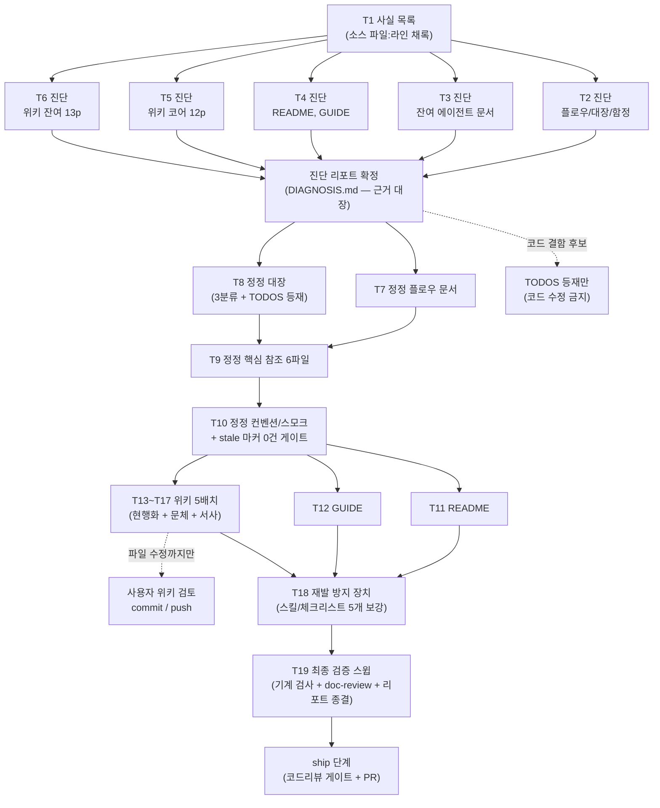

# 문서 전수 정합 개선 (DOCS-CONSISTENCY-OVERHAUL) 구현 플랜

> 작성일: 2026-07-02 (게이트 1R findings 반영 — 진단 5분할·잔여 정정 2분할·위키 배치 재응집·workflow-ship 복원. 2R 양측 pass)

## 요약 브리핑

### Task 목록

| # | 태스크 | 한 줄 |
|---|---|---|
| 1 | 사실 목록 + 리포트 뼈대 | 최근 봉인 토픽의 변경 사실을 소스에서 재확인해 채록, 진단 리포트 형식 확정 |
| 2 | 진단 — 플로우·대장·함정 | 결제 플로우 2문서 + 후속 대장 2문서 + 도메인 함정 문서 판정 |
| 3 | 진단 — 잔여 에이전트 문서 | 아키텍처·구조·스택·통합·테스팅 + 컨벤션 + 스모크 17파일 판정 |
| 4 | 진단 — README·GUIDE | 배너·페이즈·폐기 기능 서술 + 문체 판정, 페이즈 표기 실태 채록 |
| 5 | 진단 — 위키 도메인 코어 12p | outbox·확인 플로우·멱등·보상·상태·복구·PG 전략·TX 경계 판정 + 서사 후보 채록 |
| 6 | 진단 — 위키 잔여 13p | 아키텍처·관측성·검증·인덱스 판정 + 링크-슬러그 정합 |
| 7 | 정정 — 플로우 문서 | outbox 발행 실패 복구 등 S1 최우선 정정 (소스 기준) |
| 8 | 정정 — 대장 문서 | 완료 항목 3분류 정리 + 코드 확인 필요 항목 신규 등재 |
| 9 | 정정 — 핵심 참조 6파일 | 아키텍처·스택·통합·테스팅·함정 리포트 반영 + 중복 SSOT 몰기 |
| 10 | 정정 — 컨벤션·스모크 11파일 | 리포트 반영 + 에이전트 문서 전체 stale 마커 0건 게이트 |
| 11 | 정정 — README | 배너·페이즈 사실화 + 문체 교정 (S1 항목은 ship 대조 입력) |
| 12 | 정정 — 결제 플로우 가이드 | 사람 독자용 walkthrough 현행화 + 문체 교정 |
| 13 | 위키 1차 (5p) | outbox 2 + 확인 플로우 + 비동기 전환 + TX 경계 — 기준 예문 실반영 |
| 14 | 위키 2차 (4p) | 메시지 전달·dedupe + 멱등성 + 보상 TX + 재고 캐시 복구 |
| 15 | 위키 3차 (5p) | 상태 머신 + 복구 + 시나리오·교차 검증 + PG 전략 |
| 16 | 위키 4차 (5p) | 아키텍처 + MSA 전환 + 코레오그래피 + 메트릭 + 구조화 로깅 |
| 17 | 위키 5차 (6p) | 트레이싱 + AI 워크플로우 + 인덱스 3종 + 벤치마크(배너만) |
| 18 | 재발 방지 장치 | ship 체크리스트·context-update·workflow-ship·writing·doc-review 5개 보강 |
| 19 | 최종 검증 스윕 | 링크·stale 마커 0건 + doc-review 4관점 + 리포트 전건 종결 |

### 실행 플로우차트

### 핵심 결정 → Task 매핑

- 사실 판정 근거는 소스만 → T1~6 (진단 전건 파일:라인 채록), T19 (grep 재확인)
- 진단·정정 분리 (오류 주입 차단) → T1~6 vs T7~17
- TODOS/CONCERNS 3분류 삭제 → T2 예비 판정 + T8 적용
- 위키 본문 현행화 + 문체 교정 + 서사 (에이전트 문서 정정 후) → T13~17 (전 배치 "T7~10 완료 후 착수" 명시)
- 페이즈 표기 이원화 해소 → T4 채록 + T8 내부 1줄 + T11 README 확정
- 재발 방지 5개 대상 → T18
- 코드 확인 필요 항목 등재 → T8

### 트레이드오프 / 후속

- 진단 태스크(T3·T5·T6)는 상대적으로 큼 — execute 중 2시간 초과 시 추가 분할 (reviewer 2R 참고 메모)
- doc-review 는 T19 일괄이라 FAIL 루프 재작업이 후반 집중 — 각 정정 태스크의 리포트 근거 대조가 1차 방어
- 위키는 커밋 없이 파일 수정만 — T13~17 완료 후 사용자 검토·커밋 필요, ship 게이트에는 리포트 + 위키 로컬 diff 를 입력으로 전달

## 목표

두 문서 묶음(에이전트 작업용 + 사람 독자용)이 진단 리포트 기준으로 전건 정정되고, 기계 검사(링크·stale 마커 0건)와 doc-review 검수를 통과하며, 재발 방지 규칙이 스킬·체크리스트에 반영되면 종료.

## 컨텍스트

- 설계 문서: `docs/topics/DOCS-CONSISTENCY-OVERHAUL.md`
- 주요 산출물: `docs/DOCS-CONSISTENCY-OVERHAUL-DIAGNOSIS.md` (진단 리포트 — 모든 수정의 근거 대장)
- 주요 변경 파일: `docs/context/**`, `docs/smoke/**`, `README.md`, `docs/context/PAYMENT-FLOW-GUIDE.md`, `../payment-platform.wiki/*.md` (별도 저장소 — 커밋은 사용자), `.claude/skills/{_shared,context-update,workflow-ship,doc-review}/**`
- 전 태스크 tdd=false (문서 작업 — 테스트 대신 진단 리포트 근거·기계 검사가 완료 기준)
- 코드 수정 금지 — 결함 후보는 TODOS 등재만 (topic 결정)
- 구조 원칙: **진단(리포트 근거 확정) 태스크와 정정(반영) 태스크 분리** — 오류 주입 차단. 사실 판정 근거는 소스 파일:라인만.

## 진행 상황

- [x] Task 1: 변경 사실 목록 + 진단 리포트 뼈대
- [x] Task 2: 진단 — 플로우·대장·함정 5파일
- [x] Task 3: 진단 — 잔여 에이전트 문서 12파일 + smoke 5파일
- [x] Task 4: 진단 — README + PAYMENT-FLOW-GUIDE
- [x] Task 5: 진단 — 위키 도메인 코어 12페이지
- [x] Task 6: 진단 — 위키 잔여 13페이지
- [x] Task 7: 정정 — 플로우 문서 (CONFIRM-FLOW·PAYMENT-FLOW)
- [x] Task 8: 정정 — 대장 문서 (TODOS·CONCERNS 3분류 + 코드 확인 항목 등재)
- [x] Task 9: 정정 — 핵심 참조 문서 6파일
- [x] Task 10: 정정 — conventions·smoke 11파일
- [x] Task 11: 정정 — README
- [x] Task 12: 정정 — PAYMENT-FLOW-GUIDE
- [x] Task 13: 위키 1차 — outbox·확인 플로우·TX 경계 5페이지
- [x] Task 14: 위키 2차 — 멱등·보상·재고 4페이지
- [x] Task 15: 위키 3차 — 상태 머신·복구·검증·PG 전략 5페이지
- [x] Task 16: 위키 4차 — 아키텍처·관측성 5페이지
- [ ] Task 17: 위키 5차 — 잔여·인덱스 6페이지
- [ ] Task 18: 재발 방지 장치 (스킬 4종 + doc-review 보강)
- [ ] Task 19: 최종 검증 스윕

## 태스크

### Task 1: 변경 사실 목록 + 진단 리포트 뼈대 [tdd=false] [domain_risk=true]

**구현**
- 최근 ship 토픽(EOS 전환 이후 ~ TC-3 재고 resync)의 archive briefing 에서 "코드에 일어난 변경 사실" 목록 작성 — 각 사실의 참·거짓은 briefing 이 아닌 **소스에서 재확인** (파일:라인 채록)
- `docs/DOCS-CONSISTENCY-OVERHAUL-DIAGNOSIS.md` 생성 — 항목 형식: 문서 위치 / 문제 / 소스 근거(파일:라인) / 수정 방향 / 심각도(S1~S5). **기본값 인용 시 층위(코드 fallback vs 프로파일 yml) 명시** 규칙 포함 (게이트 2R minor)
- topic 사전 진단 표본 12건 + 기준 예문 retry 카운트 불릿(게이트 2R minor) 을 진단 항목으로 수록·재검증

**완료 기준**
- 사실 목록 전 항목에 소스 파일:라인 채록 (문서 인용 근거 0건)
- 표본 12건 리포트 수록·판정 완료

**완료 결과**
> `docs/DOCS-CONSISTENCY-OVERHAUL-DIAGNOSIS.md` 신규 생성. §0 형식 정의(항목 형식 5컬럼 + 심각도 S1~S5 + "기본값 인용 시 층위 명시" 규칙, `scheduler.outbox-worker.parallel-enabled` 실증 사례로 코드 fallback(`OutboxWorker.java:26`, false) vs default profile yml(`application.yml:149`, true) 대조 포함) 확정. §1 사실 목록 28건(F1~F28) — EOS 전환(2026-05-17) ~ TC-3 수동 resync(2026-07-01) 사이 archive 봉인 토픽(EOS-FOLLOWUP-CLEANUP/TIME-MODEL-AND-EXPIRY·FOLLOWUP/CI-PIPELINE-REDESIGN/OBSERVABILITY-COMPLETION/CLEANUP-BATCH-C~E/STOCK-COMPENSATION-OTHER-PATHS/RETRY-METRIC-CLEANUP/CONFIRM-APPROVED-RESEND-GAP/DLQ-REACHABILITY/ALERTING-RULES-AND-FAULT-DRILL/FAULT-INJECTION-RESILIENCE) + 봉인 이후 standalone 커밋(L-14 poison-pill/TC-3 resync) 을 후보로 삼아 전건 소스 재확인(파일:라인) — briefing 인용은 후보 추출에만 사용, 사실 확정은 코드 grep/Read 로 별도 수행. 표본 12건(§2) 전건 판정: #1(CONCERNS.md L-1 qualifier 서술, `PaymentConfirmResultUseCase.java:116` 명시 qualifier 확인 — 문서 내부 L92 vs L97 자기모순 재확인) · #12(CONFIRM-FLOW/PAYMENT-FLOW의 REQUIRES_NEW/IN_FLIGHT 서술, `OutboxRelayService.java:49-59` 단일 TX + `PaymentOutboxUseCase.claimToInFlight`/`incrementRetryOrFail` 프로덕션 호출처 0 재확인, S1 critical) 은 인계받은 근거 보강. 나머지 10건 신규 재검증 — 특히 #7(canCompensateStock 는 STOCK-COMPENSATION-OTHER-PATHS 에서 이미 死 코드 제거돼 CONFIRM-FLOW.md 는 이미 정합, TODOS.md 완료 항목만 3분류 삭제 대상)·#10(`PaymentEventStatus.java` RETRYING enum 완전 부재, 위키 state-management.md 는 여전히 전면 서술) 확정. §3 게이트 2R 잔여 minor 2건 해소: 기본값 층위 규칙은 §0.3 편입, retry 카운트 불릿은 `incrementRetryOrFail` 호출처 0 + `recoverTimedOutInFlightRecords`(IN_FLIGHT 타임아웃 전용) 소스 대조로 "고려 중"이 아닌 "현재 relay 실패 경로 미적용"이 정확한 서술임을 확정(Task 13 반영 문구 초안 포함). §4 는 Task 2~6 플레이스홀더로 남김. 코드 무변경 — `./gradlew test` 대상 아님(문서만 생성).

### Task 2: 진단 — 플로우·대장·함정 5파일 [tdd=false] [domain_risk=true]

**구현**
- 대상: `CONFIRM-FLOW.md` / `PAYMENT-FLOW.md` / `TODOS.md` / `CONCERNS.md` / `PITFALLS.md` — 사실 목록 대조 + 통독 진단, 리포트에 항목 추가
- TODOS/CONCERNS 는 3분류 삭제 판정(전체 삭제 / 문장 제거 / 보존)을 항목별로 예비 기록

**완료 기준**
- 5파일 전부 페이지별 판정 존재, S1/S2 전건 소스 근거 포함

**완료 결과**
> `docs/DOCS-CONSISTENCY-OVERHAUL-DIAGNOSIS.md` §4.1 신규 작성. 5파일 전건 통독 + 사실 목록(F1~F28) 대조, 소스는 grep/Read 로 직접 재확인. **핵심 발견**: (1) CONFIRM-FLOW.md/PAYMENT-FLOW.md 의 outbox "REQUIRES_NEW 선점 → 발행 실패 시 IN_FLIGHT 유지" stale 서술이 표본 #12 가 지목한 곳(§3 mermaid+prose) 외에도 §10 재시도표(`incrementRetryOrFail` 진입점 표기)·§11 회복 시나리오·§13 멱등성표·PAYMENT-FLOW §장애복원포인트 4곳에 추가 잔존함을 소스 대조(`OutboxRelayService.java:49-78` 단일 `@Transactional`)로 확정 — 전부 S1 critical 클러스터로 묶음. (2) **신규 발견**: `PaymentOutboxStatus.FAILED` 로 전이하는 코드 경로가 현재 0건(`PaymentOutbox.toFailed()` 삭제됨 + `incrementRetryOrFail` 미호출) — CONFIRM-FLOW §9/§10 및 TODOS TC-7 이 이를 여전히 살아있는 종결 경로처럼 서술. (3) `parallel-enabled` 기본값이 코드 fallback(false)만 인용하고 실구동 default profile 값(true, `application.yml:149`)을 누락 — §0.3 층위 규칙 위반 실사례로 등재. (4) TODOS.md — "토픽 묶음 계획" 섹션 + "## 완료" 섹션(~20개 항목) 전체가 `docs/archive/README.md` 와 완전 중복돼 (a) 전체 삭제 대상으로 판정, 개별 항목 24건 3분류(a 20건/b 3건/c 다수) 예비 판정 완료 — TC-13-FOLLOW-5 는 지시대로 canCompensateStock/RETRYING/PaymentEventStatusCrossInvariantTest 를 현재형으로 서술하는 S1 오류로 (a) 확정. (5) CONCERNS.md — L-3·L-6 이 CAPACITY-AND-SCALEOUT 의 2-인스턴스 fencing 실측(`docker-compose.apps.yml` payment-service `hostname:` 라인 이미 제거 확인)으로 이미 해소됐음에도 미마킹 상태임을 신규 발견해 (a) 전체 삭제로 판정, L-1 내 ID 오기(TC-13-FOLLOW-1→6) 도 신규 발견. (6) PITFALLS.md — 헤더-본문 시점 불일치(표본 #3) 외에 §18 "L6" 참조가 실제로는 CONCERNS L-12 를 가리켜야 함(CONCERNS 리스트 재편 이력으로 어긋남) + §17 "(L2 알려진 한계)" 가 dangling 참조임을 신규 발견 — 둘 다 S2. 대상 5파일 정정은 수행하지 않음(Task 7/8 범위). `./gradlew test` 대상 아님(문서만).

### Task 3: 진단 — 잔여 에이전트 문서 12파일 + smoke 5파일 [tdd=false] [domain_risk=true]

**구현**
- 대상: `ARCHITECTURE` / `STRUCTURE` / `STACK` / `stack/flyway-operations` / `CONVENTIONS`(인덱스) / `TESTING` / `INTEGRATIONS` + `conventions/` 5파일 + `docs/smoke/` 5파일
- 중복 서술(S4)의 SSOT 지정안(어느 문서로 몰지)도 리포트에 기록

**완료 기준**
- 17파일 전부 페이지별 판정 존재, S1/S2 전건 소스 근거 포함

**완료 결과**
> `docs/DOCS-CONSISTENCY-OVERHAUL-DIAGNOSIS.md` §4.2 신규 작성. 대상 17파일(ARCHITECTURE/STRUCTURE/STACK/stack/flyway-operations/CONVENTIONS/TESTING/INTEGRATIONS + conventions 5파일 + smoke 5파일) 전건 통독 + F1~F28 대조 + Task 2 확정 S1 클러스터 3종(outbox REQUIRES_NEW/IN_FLIGHT stale, `PaymentOutboxStatus.FAILED` dead-terminal, `parallel-enabled` 층위 위반) grep 재확인 — **이 17파일에는 3종 모두 잔존 0건**(REQUIRES_NEW/IN_FLIGHT/toFailed/parallel-enabled 전건 grep 0, 이 레벨 문서들은 outbox 재시도 디테일을 서술하지 않음). 대신 **17파일 간 상호 대조에서 신규 S1 4건 발견**(다른 문서 인용이 아니라 각각 `build.gradle`/소스로 독립 재확인): (1) `STRUCTURE.md` §빌드 트리거의 "`./gradlew test` = 전 모듈 단위+통합"이 `STACK.md` "단위만(`integration` 태그 제외)"과 정면 모순 — `build.gradle:66-67` `excludeTags 'integration'` 확인으로 `STACK.md` 가 정확함 확정. (2) `STRUCTURE.md` §정적 분석의 "JaCoCo 는 모듈별 `build.gradle`"이 `TESTING.md` "루트 `build.gradle` `subprojects` 블록 공통"과 모순 — 루트 `build.gradle:20-178` 대조로 `TESTING.md` 가 정확함 확정. (3) `STACK.md` §스케줄러 활성화 정책의 "서비스별 활성 매트릭스"+"역할별 목록"에서 user-service 전체가 누락돼 있으나 실제로는 user-service 도 `SchedulerConfig`(동일 게이트 패턴) + `DependencyHealthMetrics`(`@Scheduled`)를 보유(FAULT-INJECTION-RESILIENCE 도입, STATE.md 재개 메모의 "user `@EnableScheduling` 누락" 갭과 연결) — payment/pg/product 3서비스 역할 목록에도 동일 컴포넌트 누락 확인. (4) `conventions/transactions.md` 예시 코드가 `@Transactional(timeout = 5)` 만 표기해 실제 코드의 `transactionManager = "transactionManager"` qualifier(F1, CONCERNS L-1 과 같은 사실 축)가 빠짐 — 컨벤션 문서가 정작 그 qualifier 의 존재 이유를 가르치는 자리에서 빠뜨린 역설적 누락. §4.2.18 에 S4 중복 4건 SSOT 지정안(JaCoCo 정책 SSOT=`TESTING.md`, 빌드 명령 SSOT=`STACK.md`, Contract test 상세 SSOT=`TESTING.md`, CircuitBreaker 근거 SSOT=`INTEGRATIONS.md`) 수록. 대상 17파일 정정은 수행하지 않음(Task 9/10 범위). `./gradlew test` 대상 아님(문서만).

### Task 4: 진단 — README + PAYMENT-FLOW-GUIDE [tdd=false] [domain_risk=true]

**구현**
- `README.md`(551줄) + `PAYMENT-FLOW-GUIDE.md`(378줄) 진단 — 배너·페이즈·지표·폐기 기능 서술 + 문체(S5)
- 페이즈 표기 실태(README 1~7 vs 내부 0~5) 전수 채록 → Task 11 결정 입력

**완료 기준**
- 2파일 판정 완료, README 도메인 사실(S1) 항목 별도 표기 (ship 대조 입력용)

**완료 결과**
> `docs/DOCS-CONSISTENCY-OVERHAUL-DIAGNOSIS.md` §4.3 신규 작성. **핵심 발견**: (1) CONFIRM-FLOW/PAYMENT-FLOW 의 outbox 발행 실패 stale 클러스터(표본 #12, 단일 TX 대신 REQUIRES_NEW+IN_FLIGHT 유지로 서술)가 짝 문서 `PAYMENT-FLOW-GUIDE.md` 에도 독립 5곳(§A 단계14/15, §B-2, §C 표, §D 통합 플로우차트) 잔존함을 소스 재확인(`OutboxRelayService.java:49-78`, `OutboxWorker.java:26,38,41`)으로 확정 — S1 critical, Task 12 최우선 대상. GUIDE 나머지는 17개 클래스/메서드명 grep 전건 존재 확인 + 보상 가드 삭제(F7)·EOS DLQ(F12)·종결 가드 재발행(F10) 등 전건 소스 일치, 문체(S5) 도 grep 0건으로 수정 대상 없음(구조화 기술 문서 장르라 AI체 패턴 자체가 없음). (2) **신규 발견(README)**: "주요 해결 과제" 표 "장애 내성 복구 체계" 행이 서술하는 4개념 중 3개가 현재 코드에 없음 — `RecoveryDecision` 클래스 완전 삭제(grep 0), `canCompensateStock` 이중 조건 가드 완전 삭제(F7, `PaymentConfirmResultUseCase.java:280-303` 가드 없는 직접 호출 확인), FCG(`PgFinalConfirmationGate`) 는 클래스만 존재하고 프로덕션 호출처 0건(`PgStatusLookupPort.java` 의존 선언뿐, 실제 호출자 grep 0 — `PAYMENT-FLOW.md:377` 기존 결론과 별도로 직접 재확인). (3) "결제 상태 관리" 섹션 캡션 "보상 안전 가드 자체는 유지"가 (2)와 같은 축에서 코드와 정반대(`QuarantineCompensationHandler.java:56-60` 는 단일 종결 체크만 남고 "대기열 선점 중" 이중 조건 없음) — S1 critical 신규. (4) Outbox 모델 표의 `FAILED` dead-terminal 미표기가 Task 2 CONFIRM-FLOW 클러스터의 README 확장 위치임을 확인(S1 minor). (5) 배너 "589 PASS"·경고문은 표본 #5 그대로(F26/F27), 이번 태스크에서 `@Test` grep 재실행 641(annotation, 근사치, Task 11 실행 시점 `./gradlew test` 재확정 필요)로 스냅샷 노후 추가 확인. (6) 위키 링크 25개 앵커 전건 파일 대조 — 깨진 링크 0건(보존). (7) Phase 표기 3축(README 개발순서/결제처리단계/MSA로드맵) 전수 채록 — 신규 교차 발견으로 README "다음 Phase 7"(장애주입+k6+오토스케일러+서킷브레이커)과 내부 로드맵 "Phase 4"(TODOS T4-A~E)가 **동일 작업 뭉치를 다른 번호로 지칭**함을 확인(`docs/context/TODOS.md:159-196` 대조) — plan 결정상 축 통일은 비범위이나 Task 11에 1줄 disambiguation 권고(선택). README 도메인 사실(S1) 3항목을 §4.3.3 에 ship domain-expert 대조 입력용으로 별도 표기 완료. 대상 2파일 정정은 수행하지 않음(Task 11/12 범위). `./gradlew test` 대상 아님(문서만).

### Task 5: 진단 — 위키 도메인 코어 12페이지 [tdd=false] [domain_risk=true]

**구현**
- 대상: `outbox-pattern` / `outbox-channel-dispatch` / `pg-confirm-flow` / `async-outbox` / `tx-scope` / `message-delivery-and-dedupe` / `idempotency` / `compensation-tx` / `stock-cache-recovery` / `state-management` / `retry-recovery` / `pg-strategy`
- 페이지별 S1~S5 판정 + 서사 섹션 후보(도입/말미)와 근거 이력(PITFALLS·archive 경로) 기록 — 근거 없는 서사 후보 금지

**완료 기준**
- 12페이지 전부 판정 존재, 서사 후보마다 실제 이력 근거 경로 1개 이상

**완료 결과**
> `docs/DOCS-CONSISTENCY-OVERHAUL-DIAGNOSIS.md` §4.4 신규 작성(4.4.1~4.4.12). 대상 12페이지 전건 통독 + F1~F28 대조 + Task 2~4 확정 클러스터(outbox REQUIRES_NEW/IN_FLIGHT stale·`PaymentOutboxStatus.FAILED` dead-terminal·`RETRYING` enum 부재·`RecoveryDecision`/FCG/보상 가드 삭제·payment 측 `EventDedupeStore` 폐기·`parallel-enabled` 층위) grep 재확인. **핵심 발견**: 이 12페이지의 최대 문제는 outbox 클러스터가 아니라 별도의 **RD/RETRYING/FCG 클러스터**(`RecoveryDecision` 값 객체 + `RETRYING` 상태 + FCG 가 지금도 살아있다는 서술)다. `state-management.md` 배너가 "RecoveryDecision + FCG + 격리 사이클은 유지된다"고 명시해 위키 안에서 정본화돼 있으나, 소스 재확인 결과 `RecoveryDecision` 완전 삭제(grep 0), `PaymentEventStatus` 는 8상태뿐(F6, RETRYING 없음, `canApplyConfirmResult()` 가 READY/IN_PROGRESS 만 EOS 진입 허용), `handleFailed`/`handleQuarantined` 는 재고 복구 가드나 PaymentEvent 재조회 없이 `compensateAtomic` 직접 호출(F7 축) — state-management.md 는 "PaymentEvent 상태 머신"·"RecoveryDecision"·"재고 복구 가드"·"복구 사이클 전체 플로우" 4개 섹션이 전면 재작성 대상(S1 critical, Task 15 최우선). **신규 발견**: (1) `compensation-tx.md` 배너 자체가 "재고 복구는 product-service 호출(cross-service Kafka 이벤트)로 진화"라는 새로운 사실 오류를 담고 있음을 확정(S1 critical) — 실제로는 payment-service 내부 Redis Lua `compensateAtomic`(`StockCacheRedisAdapter`)로 완결되며 product 호출도 Kafka 이벤트도 없다(`CONFIRM-FLOW.md:250` "redis 보상만"과 대조). (2) `pg-confirm-flow.md` 의 "결과 메시지 종류" 표(FCG 를 살아있는 발행 트리거로 나열)와 "향후 확장" 절(FCG 를 "검토 중"인 미래 계획으로 서술)이 같은 페이지 안에서 모순 — 실제로는 `PgFinalConfirmationGate`(pg-service 소속)가 `@Service`+전용 테스트까지 완비된 완성 코드이나 프로덕션 호출처 0(반쯤 지어진 미연결 상태, README/PAYMENT-FLOW 의 동일 클래스 판정과 결론 통일, S1+S2). (3) `async-outbox.md`/`stock-cache-recovery.md`(간접) 에서 §0.3 "기본값 층위" 위반 신규 사례 — `scheduler.outbox-worker.batch-size` 를 "application.yml" 기본값처럼 제시한 YAML 블록이 실제로는 benchmark profile 전용 값(100)이고 default profile 은 50(`parallel-enabled` 와 같은 축, S1+S2). (4) `message-delivery-and-dedupe.md`/`stock-cache-recovery.md` 둘 다 DLQ-REACHABILITY(2026-06-25)가 추가한 `AfterRollbackProcessor`(EOS commitTransaction 실패 전용 DLQ 경로) 를 반영하지 못함(S1/S3, 두 페이지가 정확히 그 주제를 다루는 페이지라 완전성 갭 비중 있음). (5) `pg-strategy.md` 배너("호출 경계 이동")가 실제 변화 규모(payment-service 의 `PaymentGatewayFactory`/`InternalPaymentGatewayAdapter`/`PaymentGatewayPort` 등 전 클래스가 pg-service 로 이름까지 바뀌어 재구성됨, grep 으로 payment-service 쪽 0건 확인)를 과소 서술(S1). **양호 판정**: `outbox-pattern.md` 는 핵심 동작 서술 자체는 정확(재확인: `OutboxRelayService` 단일 TX, `incrementRetryCount` 가 실제 backoff 적용) — topic 문체 기준 예문 대상 위치를 정확히 특정(L72/L94-98, Task 13 에서 topic 문서의 계산된 "후" 텍스트 그대로 실반영 가능), FAILED dead-terminal 각주만 필요(S1). `tx-scope.md`/`retry-recovery.md` 는 배너·역사 프레이밍이 12페이지 중 모범 사례(retry-recovery.md 의 "이 모델의 한계 → Phase 5 개선" 패턴을 state-management.md 대수술의 템플릿으로 권고). `idempotency.md`/`outbox-channel-dispatch.md` 는 S1 없음(경미한 누락·모호성만). 서사 후보 9개 페이지에서 실제 archive 경로 채록(payment-retry-state/payment-double-fault-recovery/payment-eos-transition/cleanup-batch-e/stock-compensation-other-paths 5개 토픽이 state-management.md 하나의 후보에 집중) — 3페이지(outbox-pattern/tx-scope/idempotency)는 근거 부족으로 강제하지 않음(창작 방지 원칙 준수). "Phase N 시점" 배너 정합 전수 판정(정확 2건·부분 정확 2건·배너 자체 오류 3건·배너 불필요 5건). 대상 12페이지 정정은 수행하지 않음(Task 13~15 범위). `./gradlew test` 대상 아님(문서만, 위키는 별도 저장소 — 이번 태스크는 위키 파일 수정도 하지 않음, 순수 진단).

### Task 6: 진단 — 위키 잔여 13페이지 [tdd=false] [domain_risk=true]

**구현**
- 대상: `architecture` / `msa-transition` / `event-driven-choreography` / `metrics` / `structured-logging` / `scenario-test` / `cross-validation` / `trace-propagation` / `ai-workflow` / `Home` / `_Sidebar` / `_Footer` / `Benchmark-Report`(시점 기록 — 배너·링크만)
- 위키 신규 페이지 필요성 판단만 수록 (작성은 비범위)
- Home·Sidebar 링크-슬러그 정합 검사 포함

**완료 기준**
- 13페이지 전부 판정 존재

**완료 결과**
> `docs/DOCS-CONSISTENCY-OVERHAUL-DIAGNOSIS.md` §4.5 신규 작성(4.5.1~4.5.11). 대상 13페이지 전건 통독 + F1~F28 대조 + Task 2~5 확정 클러스터(outbox REQUIRES_NEW/IN_FLIGHT stale·`PaymentOutboxStatus.FAILED` dead-terminal·RD/RETRYING/FCG 클러스터·payment 측 `EventDedupeStore` 폐기·Elasticsearch/Logstash→Loki/Promtail(§2 표본 #9)) grep 재확인. **핵심 발견**: 이 배치 최대 오류는 `structured-logging.md`(4.5.5) — 페이지 절반 이상(로깅 파이프라인 다이어그램·민감정보 마스킹 섹션 전체·TraceId 전파 섹션 전체·Logstash 연동 섹션 전체)이 완전히 삭제된 인프라·클래스(`MaskingPatternLayout`/`TraceIdFilter`/`LogstashTcpSocketAppender`/Elasticsearch·Kibana 백엔드, 전건 grep 0, logback-spring.xml 은 Console appender 뿐)를 현재형으로 서술(S1 critical 4건) — 같은 위키의 `trace-propagation.md`(4.5.8)가 정확히 같은 주제(로그↔트레이스 교차 조회)를 Promtail/Loki 기준으로 정확히 서술해 극단적 대조군이 됨. 민감정보 마스킹 메커니즘이 대체 없이 완전히 사라진 것으로 보여(신규 발견) Task 8 TODOS "코드 확인 필요 항목" 후보로 별도 표기. **RD/RETRYING/FCG 클러스터**(Task 5 §4.4.10 도입) 가 이 13페이지에도 3곳 추가 확산 확인 — `architecture.md`(4.5.1, 핵심 설계 결정 표의 FCG 행 + domain 패키지 트리의 `RecoveryDecision.java` + `PaymentEventStatus`/`PaymentOutboxStatus` enum 주석) · `metrics.md`(4.5.4, "비동기 플로우의 관측 맹점" 다이어그램의 RETRYING 분기) · `scenario-test.md`(4.5.6, `OutboxProcessingServiceTest` 섹션 전체가 완전 삭제된 클래스 — 배너가 "클래스명만 다르다"고 고지한 범위를 넘는 신규 발견, 클래스와 테스트 자체가 없어짐). **신규 발견**: (1) `msa-transition.md` 토폴로지 다이어그램이 `redis-stock` 연결을 `Prod --> RedS` 로 서술해 같은 위키의 `architecture.md`(`Pay --> RedS`, 정확)와 정면 모순 — `application.yml:99-101`/`docker-compose.apps.yml:47,57` 재확인 결과 payment-service 만 연결(S1+S2, 4.5.2). (2) `metrics.md` 가 RETRY-METRIC-CLEANUP(F9)로 이미 삭제된 `payment_health_max_retry_reached_total` 게이지를 여전히 표에 나열하면서(코드 재확인: `PaymentHealthMetrics` 는 `stuck_in_progress` 1종만 등록) F14 `dependency_up` 게이지와 알람 규칙 4그룹(F13)은 배너·표 양쪽에서 완전 누락 — 이 페이지가 다루는 정확히 그 주제(운영 지표)의 최근 확장이 빠짐(S1+S3, 4.5.4). (3) `TossApiMetrics` 가 pg-strategy 이관(4.4.12)에 따라 실제로는 pg-service 소속임에도 payment-service `core.common.metrics` 패키지 소속처럼 서술(S1, 신규). (4) `scenario-test.md` 의 `FakeProductRepository`/`ProductRepository` 포트 자체가 배너 고지 범위 밖에서 완전 삭제(HTTP Feign 으로 대체) 확인(S1). **양호 판정**: `event-driven-choreography.md`(4.5.3, 13페이지 중 가장 정합)·`trace-propagation.md`(4.5.8, 최신·최정확, structured-logging 재작성의 기준 문서)·`ai-workflow.md`(4.5.9, 2026-06-12 개편을 정확히 반영 — 파일 자신이 그 개편의 산출물이라 F28 갱신 격차의 유일한 예외)·`cross-validation.md`(4.5.7, 배너-본문 정합 모범 사례) 는 변경 불요. `Home`/`_Sidebar`/`_Footer`(4.5.10) 링크-슬러그 25페이지 전건 대조 완료 — 깨진 링크 0건, 고아 페이지 0건. 알람 규칙+장애 드릴 대응 신규 위키 페이지 필요성은 검토했으나 비강제 판정(별도 서사 독립성 부족, `metrics.md` 확장 흡수를 Task 16 에 권고, 작성은 비범위). `Benchmark-Report.md`(4.5.11) 는 이미 정확한 자기 배너("Phase 5 시점 — 모놀리스 단일 JVM 측정, MSA 이후 재측정 미실시")로 변경 불요, 내부 링크는 전부 문서 내 앵커뿐(외부 슬러그 0건). §5 완료 기준 대조에 Task 5(누락돼 있던 체크박스)·Task 6 항목 보강 포함. 대상 13페이지 정정은 수행하지 않음(Task 16/17 범위). `./gradlew test` 대상 아님(문서만, 위키 파일 수정도 하지 않음 — 순수 진단).

### Task 7: 정정 — 플로우 문서 (CONFIRM-FLOW·PAYMENT-FLOW) [tdd=false] [domain_risk=true]

**구현**
- 표본 #12 (S1 최우선): outbox 발행 실패 복구 서술을 소스 기준(단일 TX 롤백 → PENDING 복귀, 5초 주기 재픽업)으로 정정 — CONFIRM-FLOW §3·§4·§9·§11 + PAYMENT-FLOW Phase 3·장애 복원 포인트
- 표본 #2 + Task 2 리포트의 두 문서 잔여 항목 전건 반영, 헤더 "최종 갱신" 동기화

**완료 기준**
- 리포트의 두 문서 항목 전건 종결, 링크 검사 통과 유지

**완료 결과**
> `docs/DOCS-CONSISTENCY-OVERHAUL-DIAGNOSIS.md` §4.1.1(8건)·§4.1.2(3건) 전건 반영. **S1 최우선 클러스터**: outbox 발행 실패 복구 서술을 소스 기준(`OutboxRelayService.relay` — 단일 `@Transactional` 안에서 claim(Step1)·조회(Step2)·Kafka 발행(Step3)·완료 마킹(Step4) 전부 수행, `claimToInFlight` 는 REQUIRES_NEW 아닌 같은 TX 소속 `@Modifying` UPDATE, 발행 실패 시 TX 전체 롤백 → Step1 갱신도 취소돼 row 는 커밋된 적 없는 PENDING 그대로 → `OutboxWorker` 5초 주기 배치 재픽업이 1차 회복 경로, IN_FLIGHT 5분 타임아웃 회수는 워커 비정상 종료 등 드문 경로의 보조 안전장치)으로 CONFIRM-FLOW.md §3(mermaid+prose 재작성)·§4(우선순위 재정렬)·§10(재시도표 "한도 초과 시"/"코드 진입점" 2행)·§11(회복 시나리오 인덱스)·§13(멱등성표 "outbox claim" 행) + PAYMENT-FLOW.md Phase 3 다이어그램(R5a)·장애 복원 포인트 전면 정정. `PaymentOutboxStatus.FAILED` dead-terminal 각주를 CONFIRM-FLOW §9 상태표 + §10 재시도표에 추가("`PaymentOutbox.toFailed()` 삭제 + `incrementRetryOrFail` 호출처 0" 소스 근거 명시). `parallel-enabled` 기본값을 §0.3 층위 규칙대로 "코드 fallback: false / default 프로파일(로컬·docker 실구동): true" 두 값 병기로 교체(§4). §12 dedup TTL 표의 "TC-13-FOLLOW-2 후속 항목" 서술을 `DedupeCleanupWorker`(`@Scheduled fixedDelayMs=3600000`, `deleteExpired` 배치 삭제) 구현 완료 서술로 교체. §18 관련 문서 목록의 "(verify 완료 후 이동 예정)" 삭제(`docs/archive/pg-confirm-listener-split/COMPLETION-BRIEFING.md` 존재 확인). PAYMENT-FLOW.md 도입부 봉인 시점 앵커를 "Phase 0~3.5 + PRE-PHASE-4-HARDENING"(2026-04-24)에서 "DLQ-REACHABILITY"(2026-06-25, 최신)로 교체. 두 문서 헤더 "최종 갱신"을 2026-07-02(Task 7)로 갱신, 이전 이력 체인 보존. 정정 후 `DOCS-CONSISTENCY-OVERHAUL-DIAGNOSIS.md` §4.1.1·§4.1.2 테이블 하단에 종결 마킹(`[Task 7 종결, 2026-07-02]`) + 리포트 헤더 "최종 갱신"에 Task 7 요약 추가. 상대 링크(CONFIRM-FLOW ↔ PAYMENT-FLOW 상호 참조 3곳) 변경 없음 — grep 재확인 정상. TODOS/CONCERNS/PITFALLS(§4.1.3~4.1.5)는 Task 8 범위라 미착수. `./gradlew test` 대상 아님(문서만).

### Task 8: 정정 — 대장 문서 (TODOS·CONCERNS) [tdd=false] [domain_risk=true]

**구현**
- Task 2 의 3분류 예비 판정대로 적용: (a) ✅해소+archive 경로 항목 전체 삭제 (b) 혼합 항목(L-1·L-14 등) 해소분 문장만 제거·잔여 한계와 기각 근거 보존 (c) 수용된 한계 L-* 현행분·"회피된 우려" 표 보존. 삭제 전건 리포트에 근거 채록
- topic "코드 확인 필요 항목"(REQUIRES_NEW 선점·`incrementRetryOrFail` 호출처 0, 무백오프 5초 재시도)을 TODOS 신규 등재
- 표본 #1 (CONCERNS L-1 qualifier 모순) 정정, 내부 Phase 번호가 README 개발 과정 Phase 와 별개임을 TODOS 분류 룰에 1줄 명시

**완료 기준**
- ✅ 완료 마킹 잔존 0건 (보존 결정분 제외), 삭제 전건 근거 채록

**완료 결과**
> `docs/DOCS-CONSISTENCY-OVERHAUL-DIAGNOSIS.md` §4.1.3(TODOS)·§4.1.4(CONCERNS) 예비 판정대로 적용, §4.1.3/§4.1.4 종결 마킹 완료. **TODOS.md**: 구조적 문제 2건("토픽 묶음 계획"·"## 완료" 섹션, `docs/archive/README.md` 와 완전 중복) 전체 삭제 — "관련" 절에 "완료 이력: `docs/archive/README.md`" 1줄 포인터로 대체. 항목별 3분류 적용: (a) 전체 삭제 24건 — 진단 예비 판정 22건(TC-13/TC-13-FOLLOW-1·2·3·4·5/[PG-SELFLOOP-ATTEMPT-GAP]/TC-4/TC-8/[NET-RETRY]/[FLYWAY-USER-SEED-GAP]/[PRODUCT-TIME-ABSTRACTION]/[TIME-PRODUCT-NOW-UNIFY]/[TZ-UTC-BACKSTOP]/[BASEENTITY-AUDIT-SOURCE]/[SCHEDULER-ENABLED-GATE]/[CLEANUP-FAILURE-COUNTER]/[GUARD-SKIP-EAGER-REGISTER]/[SPOTBUGS-TEST-DEBT]/TQ-7/TQ-8/TC-1) 그대로 적용 + **판정표 누락분 2건을 사유와 함께 동일 판정으로 처리(진단표와 다르게 처리한 항목, plan 지시대로 여기 기록)**: `TC-13-FOLLOW-7`(EOS commitTransaction DLQ 도달, `docs/archive/dlq-reachability/`)·`TC-9`(FakePgGatewayAdapter 벤더 멱등 시뮬, `docs/archive/cleanup-batch-e/`) 둘 다 §4.1.3 표에 행이 없었으나 본문 재확인 결과 다른 22건과 동일하게 ✅완료 마킹 + archive 경로가 실존해 동일 (a) 판정을 적용함(진단 누락 자체가 실수로 판단, 삭제 방향에는 이견 없음). (b) 혼합 3건 — `TC-13-FOLLOW-6`(qualifier 명시 완료 문장 제거, ChainedKafkaTransactionManager 미채택 잔여만 보존 + 제목의 "✅ 완료" 프리픽스 제거로 정합), `[CLEANUP-BATCH-B 후속]`(해소 불릿 3개 제거, "infra 커버리지 집계 제외" 미해소 불릿만 보존), `TC-3`(완료 프로즈 간결화, "한계/잔여" 불릿 그대로 보존, strikethrough 제거해 "부분 완료" 실태와 제목 표기 일치). (c) 보존 항목 중 `TC-7` 은 "현황" 문장이 `incrementRetryOrFail` 프로덕션 호출처 0(F3)·`PaymentOutboxStatus.FAILED` 도달 불가를 반영 못 하던 stale 서술을 정정, "조정 필요 사항"도 이 사실을 반영하도록 갱신. 나머지 보존 항목(TC-6/TC-11/TC-12/TC-15/TQ-1~6/T4-A~E) 은 변경 없음(TQ-7/8 삭제로 "자동 운영 도구" 헤더 카운트 7→6, TC-1/9 삭제로 "측정 의존 코드 청결도" 8→6 로 동반 정정). "분류 룰" 줄에 "내부 Phase 5 번호는 README 개발 과정 Phase 1~7 체계와 별개다" 1줄 추가. TODOS "코드 확인 필요 항목" 신규 섹션에 3건 등재(코드 수정 없음, 등재만) — `[PAYMENT-OUTBOX-INFLIGHT-UNUSED]`(REQUIRES_NEW 선점 경로 프로덕션 호출처 0 + 무백오프 5초 재시도, 의도된 단순화/회귀 여부 확인 필요)·`[STRUCTURED-LOGGING-MASKING-GAP]`(`MaskingPatternLayout` grep 0, 마스킹 메커니즘 대체 없이 소실 추정 — 도메인 리스크로 우선순위 상향)·`[PAYMENT-STATUS-TRIGGER-DETECT-DEAD-BRANCH]`(`detectTriggerFromCallStack()` 이 존재하지 않는 클래스명(`PaymentConfirmService`/`PaymentRecoverService`) 매칭 — 항상 폴백 가능성). 섹션 재번호 A/B/C(위키 정합 1건 → EOS-FOLLOWUP-CLEANUP 후속 1건 → 코드 확인 필요 3건, 원래 B/C 섹션이 완전 삭제돼 발생한 letter gap 해소).
> **CONCERNS.md**: 신규 발견 4건(§4.1.4 표) 반영 — L92 "qualifier 미명시로 선택한다" stale 문장을 "qualifier 를 명시해 고정한다"(F1, `PaymentConfirmResultUseCase.java:116`) 사실로 정정, L97 ID 오기(TC-13-FOLLOW-1→TC-13-FOLLOW-6) 정정 + 이미 완료된 FOLLOW-3/4 를 가리키던 "처방 후속" 문장을 TODOS T4-B `[DE2]`(멀티 broker lag 임계 재교정) 참조로 교체, C-9 "잔여" 불릿을 완료 서술과 분리해 독립 불릿(Alertmanager 미도입)으로 재구성. 3분류 적용: (a) 전체 삭제 8건 — 예비 판정 6건(C-7/C-12/C-11/L-2/L-10/L-13, 이미 스트라이크스루 + archive 경로 확인) + 신규 발견 (a) 판정 2건(L-3/L-6, CAPACITY-AND-SCALEOUT 2-인스턴스 fencing 실측으로 이미 해소됐음에도 미마킹 상태였던 것을 확인해 삭제). (b) C-9 위에서 처리. (c) 보존 — L-1(위 정정 반영), L-4/L-5/L-7/L-8/L-9/L-11/L-12/L-14 변경 없음(L-14 는 진단이 "모범 사례"로 판정해 문장 그대로 유지), C-1/C-2/C-3/C-4/C-5/C-6/C-8/C-10 변경 없음, "회피된 우려" 표 변경 없음. **삭제의 부작용 정정(Rule 1)**: L-6 삭제로 L-5 의 "이전 L-6(보상 끝난 결제 재confirm cascade)" 내부 참조가 dangling 이 돼 실제 대상인 "L-12" 로 교체, L-10 삭제로 L-14 의 "L-10이 명문화한..." 내부 참조가 dangling 이 돼 인용 내용을 직접 서술("만료 정책... TIME-MODEL-AND-EXPIRY 에서 명문화")로 교체. **PITFALLS.md 는 지시대로 범위 밖 — §17/§18 의 L2/L6 dangling ID 참조(§4.1.5 신규 발견)는 미착수, Task 9 로 이월**(이미 §4.1.5 에 항목으로 존재해 별도 인계 불요). 두 파일 헤더 "최종 갱신" 동기화(2026-07-02). `DOCS-CONSISTENCY-OVERHAUL-DIAGNOSIS.md` §4.1.3/§4.1.4 테이블 하단에 종결 마킹(`[Task 8 종결, 2026-07-02]`) + 리포트 헤더에 Task 8 요약 추가. `./gradlew test` 대상 아님(문서만).

### Task 9: 정정 — 핵심 참조 문서 6파일 [tdd=false] [domain_risk=true]

**구현**
- 대상: `ARCHITECTURE` / `STRUCTURE` / `STACK`(+`stack/flyway-operations`) / `INTEGRATIONS` / `TESTING` / `PITFALLS` — Task 3 리포트 항목 전건 반영 (표본 #3 PITFALLS 헤더, #7 TESTING 카운트 포함)
- S4 중복은 리포트의 SSOT 지정안대로 몰고 나머지는 참조로 교체

**완료 기준**
- 리포트의 해당 문서 항목 전건 종결

**완료 결과**
> `docs/DOCS-CONSISTENCY-OVERHAUL-DIAGNOSIS.md` §4.2(4.2.1~4.2.4, 4.2.6~4.2.7, 4.2.18) + §4.1.5 전건 반영·종결. **STRUCTURE.md**: §빌드 트리거 절 전체를 `STACK.md` 참조 1줄로 교체 — "`./gradlew test` = 전 모듈 단위+통합"이 실제로는 단위만(`build.gradle:66-67` `excludeTags 'integration'`)이던 정면 모순을 표 자체 삭제로 해소(S4 SSOT="빌드 명령=STACK.md" 동시 반영). §정적 분석 JaCoCo 문장 "모듈별 `build.gradle`" → "루트 `build.gradle` `subprojects` 블록(4서비스 공통)의"로 정정(`TESTING.md` 와의 모순 해소) + `TESTING.md` 링크 추가. **STACK.md**: §스케줄러 활성화 정책 매트릭스에 누락됐던 user-service 행 추가("`scheduler.enabled=true` 필요" — payment/product 와 동일 패턴, `SchedulerConfig.java` 대조 확인) + payment/pg/product/user 4개 역할별 목록 불릿에 `DependencyHealthMetrics`(의존성 가용성 폴링 게이지, availability 알람 소비) 각각 추가. §정적 분석 도구 JaCoCo 행은 S4 SSOT(`TESTING.md`)대로 1줄 참조로 축소. **TESTING.md**: 테스트 카운트 표를 `./gradlew test --rerun-tasks`(단위) + `./gradlew :<svc>:integrationTest --rerun-tasks`(통합) 재실행 값으로 갱신 — 단위 861(eureka 1/gateway 3/payment 467/pg 331/product 50/user 9), 통합 59(payment 43/pg 9/product 6/user 1). "구조적으로 계속 낙후되는 스냅샷" 1줄 명시 추가. **INTEGRATIONS.md**: Contract test 문단에 `TESTING.md` 링크 추가(S4 SSOT). **ARCHITECTURE.md**: 재검토 결과 불일치 0건(보존) + S4 SSOT 반영으로 "HTTP 어댑터 회복성" 행에 `INTEGRATIONS.md` 링크 추가. **`stack/flyway-operations.md`**: 재검토 결과 불일치 0건(보존) — 헤더에 재검토 완료 각주만 추가. **PITFALLS.md**: 헤더 "최종 갱신"을 본문 최신 항목(§24, 2026-06-27 ALERTING-RULES-AND-FAULT-DRILL) 기준으로 동기화. §18 제목 + 본문의 "L6" → 최신 `CONCERNS.md`(Task 8 정리 후) 기준 실제 대상 "L-12"(보상 끝난 결제의 새 confirm 사이클 cascade)로 정정, "L7" 참조는 현행 CONCERNS.md L-7 과 일치 확인돼 자연어 설명만 병기. §17 의 dangling "(L2 알려진 한계)"는 Task 8 삭제로 CONCERNS.md 에 매칭 항목이 더 이상 없음을 재확인 — CONCERNS.md 는 이 태스크 파일 범위 밖(대상 7파일 목록에 없음)이라 신규 항목 등재 대신 "수용된 한계(CONCERNS.md 별도 미등재)" 자연어 서술로 교체. **S4 중복 4건 전건 SSOT 반영**: JaCoCo=`TESTING.md`, 빌드 명령=`STACK.md`, Contract test=`TESTING.md`, CircuitBreaker=`INTEGRATIONS.md`. `conventions/transactions.md` 의 S1(qualifier 예시 누락)은 지시대로 Task 10 범위 — 미착수. 상대 링크 전건(신규 추가분 포함) 대상 파일 존재 확인. 정정 후 `DOCS-CONSISTENCY-OVERHAUL-DIAGNOSIS.md` 해당 섹션 하단에 종결 마킹(`[Task 9 종결, 2026-07-03]`) + 리포트 헤더에 Task 9 요약 추가. `./gradlew test` 재실행 861 PASS(문서만 변경 — 회귀 없음, 카운트 재실행 겸용).

### Task 10: 정정 — conventions·smoke 11파일 [tdd=false] [domain_risk=true]

**구현**
- 대상: `CONVENTIONS`(인덱스) + `conventions/` 5파일 (kafka·transactions 의 도메인 정책 서술 포함) + `docs/smoke/` 5파일 — Task 3 리포트 항목 전건 반영

**완료 기준**
- 리포트의 해당 문서 항목 전건 종결, 에이전트 문서 전체 stale 마커 grep 0건 (Task 7~10 완료 시점)

**완료 결과**
> `docs/DOCS-CONSISTENCY-OVERHAUL-DIAGNOSIS.md` §4.2.5·4.2.8~4.2.17 전건 반영·종결. **실질 변경 1건**: `conventions/transactions.md` — `PaymentConfirmResultUseCase.handle` 예시 코드에 `@Transactional(transactionManager = "transactionManager", timeout = 5)` qualifier 추가(기존엔 `timeout = 5` 만 표기) + "EOS 환경에서 `KafkaTransactionManager` 빈도 존재해 `@Primary` 만으로는 의도가 드러나지 않아 명시한다" 1줄 근거 보강(`PaymentConfirmResultUseCase.java:116`, F1/CONCERNS L-1 과 같은 축). 나머지 10파일(`CONVENTIONS.md` 인덱스, `conventions/{code-style,error-logging,kafka,testing}.md`, `docs/smoke/{alert-firing-check,infra-healthcheck,observability-load,observability-walkthrough,trace-continuity-check}.md`)은 재검토 결과 불일치 0건 재확인(보존) — 이 11파일은 애초에 다른 agent 문서(ARCHITECTURE/STACK 등)가 쓰는 "최종 갱신" 헤더 패턴을 쓰지 않아(관례 자체가 다름) 헤더 갱신 대상도 없음.
>
> **완료 기준 stale 마커 게이트** (Task 7~10 완료 시점, `docs/context/**` + `docs/smoke/**` 전체 grep) — `RETRYING`(상태로서)/`StockOutbox`/payment 측 `EventDedupeStore`/`RecoveryDecision`/"REQUIRES_NEW 선점" outbox 서술/Elasticsearch·Logstash/`MaskingPatternLayout` 7종 전건 재검사, 역사 서술(폐기 사실 설명)은 잔존 허용 원칙으로 판정. **현행 서술 위반 3건 신규 발견 + 정정**(전부 Task 7/9 정정 대상 파일이라 직접 수정):
> 1. `ARCHITECTURE.md` §핵심 설계 결정 인덱스 — "Final Confirmation Gate (FCG)"/"RecoveryDecision 값 객체" 두 행이 "(현재 운영 중)" 헤더 아래 무표시로 서술(바로 아래 "재고 복구 가드 (폐기)" 행은 이미 정확히 표기돼 있었음에도 Task 9 재검토가 이 두 행을 놓침) — FCG 는 "(미연결)" + `PgFinalConfirmationGate` 프로덕션 호출처 0건 설명으로, RecoveryDecision 은 "(폐기)" + 클래스 완전 삭제(grep 0) + archive 링크로 정정.
> 2. `STACK.md` §비즈니스 서비스 의존 — `spring-boot-starter-data-redis` 주석 "pg/payment-side EventDedupeStore" 가 payment-service 에는 존재하지 않는 클래스명을 현재형으로 서술(`find payment-service -iname "*EventDedupeStore*"` = 0건, `EventDedupeStore`/`EventDedupeStoreRedisAdapter` 는 pg-service 전용) — "pg-side EventDedupeStore" 로 정정(payment 측 Redis dedupe 는 같은 줄의 "StockCachePort (Lua atomic)" 가 전담).
> 3. `CONFIRM-FLOW.md` §14 VT+MDC 전파 — "`OutboxImmediateEventHandler` 와 `StockOutboxImmediateEventHandler` 가 사용"이 EOS 전환에서 완전 삭제된 클래스(`StockOutboxImmediateEventHandler` grep 0)를 현재도 쓰는 것처럼 병기(§3/§4/§10/§11/§13 은 Task 7 이 재작성했으나 §14 는 범위 밖이라 잔존) — `OutboxImmediateEventHandler` 단독 서술 + "과거 StockOutboxImmediateEventHandler 도 같은 executor 를 썼으나 EOS 전환에서 폐기" 각주로 정정.
>
> 3건 모두 `DOCS-CONSISTENCY-OVERHAUL-DIAGNOSIS.md` 해당 섹션(4.1.1/4.2.1/4.2.3)에 "[Task 10 추가 발견 및 정정]" 기록 추가 + 3파일 헤더 "최종 갱신" 갱신. 게이트 재검사 나머지 매치(`RETRYING`/`StockOutbox`/`EventDedupeStore`/`REQUIRES_NEW`/`Elasticsearch`·`Logstash`/`MaskingPatternLayout` 잔여 전건)는 "이전 모델 대비"·"폐기됨"·"grep 0 확인" 같은 명시적 과거/사실 서술이라 위반 아님(잔존 허용). `./gradlew test` 861 PASS 재확인(문서 전용 태스크, 코드 무변경).

### Task 11: 정정 — README [tdd=false] [domain_risk=false]

**구현**
- 배너 정정 (표본 #5): 진행 Phase·테스트 수·"정합이 안 맞을 수 있음" 경고·폐기 기능 서술(재고 복원 가드 등) 현행화
- 페이즈 표기 확정: README 는 독자용 개발 과정 Phase 1~7 체계 유지, Task 4 채록 실태 기반으로 완료/진행 상태만 사실화
- 문체 교정: topic "문체 수정 기준" 적용 (구조 불변, 문장·단어 단위)

**완료 기준**
- 리포트의 README 항목 전건 종결. **README diff 중 도메인 사실(S1) 항목은 ship domain-expert 대조 입력에 포함** (게이트 1R minor)

**완료 결과**
> `DOCS-CONSISTENCY-OVERHAUL-DIAGNOSIS.md` §4.3.1 전건(S1 critical 2건 + S1 minor 1건 + S3 2건 + S5 2건 + S2 1건) `README.md` 반영. 배너 — "🚧 진행 중 · Phase 6"→"✅ Phase 6 완료", "589 PASS"→"단위 861 / 통합 59 PASS"(Task 9 실측값), "⚠️ 정합이 안 맞을 수 있음" 경고 삭제(토픽 정합화 완료 전제), 막연한 "보상 트랜잭션 자동 회복 layer" 예시를 포함한 "아직 작업/점검 중" 줄 삭제, "다음 Phase 7" 예고에 "알람 규칙 + Toxiproxy 장애 드릴 인프라는 선행 구축 완료" 1줄 추가(FAULT-INJECTION-RESILIENCE/ALERTING-RULES-AND-FAULT-DRILL 반영, 도메인 사실 S1). "주요 해결 과제" 표 "장애 내성 복구 체계" 행 — `RecoveryDecision`/`canCompensateStock`/FCG(미연결) 3개념 서술을 삭제하고 현재 유효한 요소(PG self-loop 재시도+백오프, DLQ 자동 격리, `PaymentReconciler` 스케줄 복원, `compensateAtomic` Redis Lua 원자 연산)로 전면 재작성(도메인 사실 S1). "결제 상태 관리" 섹션 캡션 "보상 안전 가드 자체는 유지" 삭제 — 섹션 전체를 "Phase 5 시점 스냅샷"으로 명시하고 Phase 6 에서 가드가 `QuarantineCompensationHandler` 단일 종결 체크로 대체됐음을 병기, mermaid GUARD 노드는 스냅샷 전제가 명확해져 원형 보존(도메인 사실 S1). Outbox 모델 표 `payment_outbox` 행에 `FAILED` dead-terminal 각주 반영(도메인 사실 S1). 문체(S5) — "이상적 자원 할당"·"최적의 수치" 평가 형용사 제거, "Kafka 메시지를 통해" 번역투를 "Kafka 메시지로" 교정. Phase 표기(S2) — plan 결정대로 README 축(Phase 1~7) 유지, 내부 로드맵과의 번호 불일치는 README 에서 설명하지 않음(disambiguation 미반영, 이미 `TODOS.md` 분류 룰에 1줄 명시돼 있어 README 추가 불요). 위키 링크 25개·Kafka 토픽 카탈로그·스택 표는 재확인 결과 그대로 보존. README diff 의 도메인 사실(S1) 4항목(배너 Phase 상태·"장애 내성 복구 체계" 행·"결제 상태 관리" 캡션·Outbox FAILED 각주)은 `DIAGNOSIS.md` §4.3.3 에 반영 내역 병기 완료(ship domain-expert 대조 입력용). `./gradlew test` 재실행 861 PASS(문서 전용 태스크, 코드 무변경). 수정 파일: `README.md` + `DOCS-CONSISTENCY-OVERHAUL-DIAGNOSIS.md` + `DOCS-CONSISTENCY-OVERHAUL-PLAN.md`.

### Task 12: 정정 — PAYMENT-FLOW-GUIDE [tdd=false] [domain_risk=true]

**구현**
- Task 4 리포트 기준 현행화 (정합 기준은 소스 — 정정된 플로우 문서와 어긋나면 소스 재확인) + 문체 수정 기준 적용

**완료 기준**
- 리포트의 GUIDE 항목 전건 종결

**완료 결과**
> `docs/DOCS-CONSISTENCY-OVERHAUL-DIAGNOSIS.md` §4.3.2 S1 클러스터 5건(L105/L107/L214-217/L254-255/L294·L307-308) 전건 `docs/context/PAYMENT-FLOW-GUIDE.md` 반영. 정합 기준은 소스(리포트가 CONFIRM-FLOW.md/PAYMENT-FLOW.md 의 Task 7 정정 근거로 이미 재확인해 둔 `OutboxRelayService.java:49-78` 단일 `@Transactional`, `OutboxWorker.java:26,38,41`)를 그대로 따름 — "Kafka 발행 실패 → `IN_FLIGHT` 유지 → 워커 타임아웃 폴백"이던 서술 전건을 "발행 실패 → 예외가 relay 전체를 감싸는 단일 TX 를 롤백해 선점까지 함께 되돌림 → PENDING 그대로 복귀. 1차 회복 경로는 `OutboxWorker` 5초 주기 배치 재픽업(`findPendingBatch`), `IN_FLIGHT` 5분 타임아웃 회수(`recoverTimedOutInFlightRecords`)는 워커 크래시 등 드문 경로의 보조 안전장치"로 정정. §A 시퀀스 단계14(발행 실패 각주)·단계15(회복 경로 우선순위 각주), §B-2 PUBREC mermaid(`SENDF → ROLLBACK(relay TX 전체 롤백/PENDING 즉시 복귀) → OW(PENDING 배치 재픽업, 1차 경로) → REREL` 순서로 노드·엣지 재작성), §C 회복 경로 색인 표("Kafka 발행 실패" 행), §D 마스터 플로우차트(`OW` 노드를 "PENDING 배치 재픽업(1차)"+"IN_FLIGHT 5분 타임아웃 회수(보조)"로 역할 분리, `REL -. 발행 실패, TX 롤백/PENDING 복귀 .-> OW` 로 엣지 재라벨) 전건 수정. mermaid 노드 라벨 금지 문자(중괄호·중간점·유니코드 화살표·따옴표) 신규 추가분 미사용 확인. 문체(S5)는 Task 4 진단대로 수정 대상 없음(구조화 기술 문서 장르, grep 0건 — 보존). 문서 헤더에 "정정 2026-07-03(outbox 발행 실패 회복 경로 사실 정정, DOCS-CONSISTENCY-OVERHAUL Task 12)" 1줄 추가. `DOCS-CONSISTENCY-OVERHAUL-DIAGNOSIS.md` §4.3.2 테이블 하단에 종결 마킹(`[Task 12 종결, 2026-07-03]`) + 리포트 헤더 "최종 갱신"에 Task 12 요약 추가. 리포트에 없는 추가 수정은 하지 않음(§C "payment 리스너 스킵·크래시" 행 등 나머지 부분은 4.3.2 "전건 검증 결과 정합" 판정 그대로 보존). `./gradlew test` 대상 아님(문서만, 코드 무변경).

### Task 13: 위키 1차 — outbox·확인 플로우·TX 경계 5페이지 [tdd=false] [domain_risk=true]

**구현**
- 대상: `outbox-pattern` / `outbox-channel-dispatch` / `pg-confirm-flow` / `async-outbox` / `tx-scope` (TX 경계·EOS TM 분리 — CONCERNS L-1 과 같은 사실 축이라 본 배치로 응집, 게이트 1R major)
- 본문 현행화(소스 근거) + 문체 교정 + 서사 섹션(리포트의 근거 있는 후보만) + 빈 섹션 제거 (표본 #11)
- 기준 예문(topic) 을 outbox-pattern 에 실반영 — retry 카운트 불릿은 Task 1 재검증 결론 반영
- **Task 7~10 (에이전트 문서 정정) 완료 후 착수** — 서사 순서 의존 (topic 결정)

**완료 기준**
- 5페이지 리포트 항목 전건 종결, 위키 로컬 diff 생성 (커밋은 사용자)

**완료 결과**
> `DOCS-CONSISTENCY-OVERHAUL-DIAGNOSIS.md` §4.4.1~4.4.5 근거로 위키 로컬 저장소(`payment-platform.wiki/`) 5페이지 파일 수정 완료(커밋은 사용자 — 별도 git 저장소). `outbox-pattern.md`: 빈 헤더 "## 표기 규칙" 삭제(표본 #11) + `payment_outbox` state diagram/상태표에 `FAILED` dead-terminal 각주 반영 + topic "문체 수정 기준" 절의 기준 예문("가장 정밀한 모델이다." 도입부 + 핵심 동작 3불릿)을 계산된 "후" 텍스트로 그대로 실반영(retry 카운트 불릿은 Task 1 재검증 결론 문구 사용) + 서사 후보 없음(근거 부족, 미강제). `outbox-channel-dispatch.md`: "관련 설정 → 발행 큐" 표에 누락된 `pg.outbox.channel.worker-count`(값 1) 행 추가 + 도입 배경 서사 섹션 신설(pg-confirm-listener-split, 2026-05-09) — DLQ 임계 모호성(L139, S2 후보)은 소스 재확인 전이라 미해결 보존. `pg-confirm-flow.md`: "결과 메시지 종류" 표의 FCG 관련 3셀 제거 + "향후 확장 — 최종 확정 게이트" 절을 "구현됐으나 미연결 — 최종 확정 게이트(FCG)"로 재작성해 표-본문 모순 해소(`docs/context/PAYMENT-FLOW.md` §4.9 판정과 결론 통일) + 도입 배경 서사 문장 1개 추가. `async-outbox.md`: "채널/Worker 설정 요약" YAML 에 default(50)/benchmark(100) 프로파일 층위 구분 문단·주석 추가(`parallel-enabled` 와 동일 축) + "주요 클래스 역할 정리" 표 + "관련 문서" 링크의 `RecoveryDecision` 전방 참조 2곳을 "(모놀리스 시점, 현재는 EOS 컨슈머 모델로 대체)"로 정정 + 말미 회고형 서사 섹션 "왜 이 구조가 사라졌는가" 신설(msa-transition, 2026-04-24). `tx-scope.md`: 재검증 결과 변경 없음(보존) — 서사 후보도 근거 부족으로 미강제. 세션 시작 시점에 이미 존재하던 uncommitted 변경(`outbox-channel-dispatch.md`/`pg-confirm-flow.md`의 폴링 traceparent 서술 + `trace-propagation.md`의 `stored_traceparent` RDB 복원 절 — 이 태스크가 작성하지 않음, DIAGNOSIS §4.4 항목 밖)은 건드리지 않고 보존. DIAGNOSIS.md §4.4.1~4.4.5 뒤에 종결 노트 + 헤더 최종 갱신 동기화. `./gradlew test` 대상 아님(위키·문서 전용, 코드 무변경).

### Task 14: 위키 2차 — 멱등·보상·재고 4페이지 [tdd=false] [domain_risk=true]

**구현**
- 대상: `message-delivery-and-dedupe` / `idempotency` / `compensation-tx` / `stock-cache-recovery`
- Task 13 과 동일 작업 패턴. **Task 7~10 완료 후 착수** (서사 순서 의존)

**완료 기준**
- 4페이지 리포트 항목 전건 종결

**완료 결과**
> `DOCS-CONSISTENCY-OVERHAUL-DIAGNOSIS.md` §4.4.6~4.4.9 근거로 위키 로컬 저장소(`payment-platform.wiki/`) 4페이지 파일 수정 완료(커밋은 사용자 — 별도 git 저장소). `message-delivery-and-dedupe.md`: "DLQ — 격리된 메시지 처리" 표에 `payment.events.confirmed.dlq` 의 두 번째 격리 경로(EOS `commitTransaction` 반복 실패 → `AfterRollbackProcessor`, 독립 backoff 기본 1000ms×5회 소진 시 같은 recoverer 로 자동 격리) 행 추가(S1 신규 발견) + "왜 EOS 커밋 실패에 별도 경로가 필요했는가" 서사 절 신설(DLQ-REACHABILITY 토픽, 2026-06-25). 나머지는 재검증 결과 전건 정합(보존). `idempotency.md`: 소스 재확인 결과 배너·본문 전건 정합(보존, S1 없음) — "`IdempotencyProperties`를 통해 ~ 주입받는다" 번역투 1건만 "가" 조사로 문체 교정. 서사 후보 없음(근거 부족, 지시대로 미강제). `compensation-tx.md`: 배너의 "MSA 분리 후 재고 복구는 product-service 호출(cross-service Kafka 이벤트)로 진화했다"는 사실 오류(S1 critical, 신규 발견 — `StockCacheRedisAdapter`/`PaymentConfirmResultUseCase.java:280-303`/`CONFIRM-FLOW.md:250` 대조로 확정)를 "본문은 `RecoveryDecision`+FCG 연동으로 재고 복구를 판정하던 Phase 5 모델을 다룬다 — EOS 전환 이후 payment-service 내부 Redis Lua atomic 보상(`compensateAtomic`)으로 완전히 대체"로 정정. RD/RETRYING/FCG 클러스터 본문(설계 변경/보상 TX 실행 흐름/재고 복구 가드/이중 장애 시나리오/FCG 관계 5개 섹션)은 `retry-recovery.md` 모범 사례 템플릿(배너로 시대 규정 + 본문은 그 시대 서술 그대로 보존 + 말미에 "이후 변화" 매핑 절)을 따라 원문 유지하고, FCG 관계 섹션 직후에 새 "## 이 모델의 이후 변화" 절(Phase 5 요소 4가지 → 현재 대체 4행 표 + Redis `SETNX` 원자성 대 RDB 재조회 비교 서사 + Lua 멱등 토큰 전환 2단계 서사, stock-compensation-recovery 토픽 2026-05-08 / stock-compensation-other-paths 토픽 2026-06-21 인용)을 신설해 명확히 역사로 격하(S1 critical). "관련 문서"에 [재고 캐시 보상 회복](stock-cache-recovery) 링크 추가 + `state-management` 링크 설명에 "(Phase 5 모델)" 명시(Task 15 이전 정합 보존). `stock-cache-recovery.md`: "Spring Kafka 에러 핸들러 위임" 절에 `AfterRollbackProcessor` 가 같은 `DeadLetterPublishingRecoverer` 를 재사용해 같은 DLQ 로 수렴한다는 1문단 추가(S3, message-delivery-and-dedupe.md 와 동일 갭) + "설계 의의"에 "원칙의 재적용"(DLQ-REACHABILITY 회고) 항목 5 신설. 나머지는 재검증 결과 12페이지 중 가장 최신 정합 상태 유지(보존). **Task 13 이월 항목 해소**: `outbox-channel-dispatch.md` "장애/폴백 시나리오" 표의 "Kafka publish 실패 → 4회 초과 시 DLQ" 서술을 소스 재확인(`PgOutboxRelayService.relay`/`PgOutboxPollingWorker.poll` 에 attempt 카운터 없음 — outbox 발행 자체는 무한 재폴링, `RetryPolicy.MAX_ATTEMPTS=4` 는 `PgVendorCallService.handleRetry` 의 벤더 confirm self-loop 전용 카운터임을 확정)로 오류 확정(S2 확정) — "Kafka publish 실패" 행을 "무한 재폴링, DLQ 전이 없음"으로 정정 + "PG 5xx self-retry" 행에 attempt 4 도달 시 DLQ 각주 추가 + 두 행 사이 한도 소속 설명 문단 신설. `DIAGNOSIS.md` §4.4.2 해당 행("S2 후보")도 확정 판정으로 갱신 + §4.4.6~4.4.9 뒤에 종결 노트 + 헤더 최종 갱신 동기화. `./gradlew test` 대상 아님(위키·문서 전용, 코드 무변경).

### Task 15: 위키 3차 — 상태 머신·복구·검증·PG 전략 5페이지 [tdd=false] [domain_risk=true]

**구현**
- 대상: `state-management`(표본 #10 RETRYING) / `retry-recovery` / `scenario-test` / `cross-validation` / `pg-strategy` (PG 실패 모드 축 — retry-recovery 와 응집, 게이트 1R major)
- Task 13 과 동일 작업 패턴. **Task 7~10 완료 후 착수** (서사 순서 의존)

**완료 기준**
- 5페이지 리포트 항목 전건 종결

**완료 결과**
> `DOCS-CONSISTENCY-OVERHAUL-DIAGNOSIS.md` §4.4.10~4.4.12 + §4.5.6(scenario-test)·§4.5.7(cross-validation) 근거로 위키 로컬 저장소(`payment-platform.wiki/`) 5페이지 파일 수정 완료(커밋은 사용자 — 별도 git 저장소).
> - `state-management.md` — 12페이지 중 최대 단일 오류였던 배너("RecoveryDecision + FCG + 격리 사이클은 유지된다")를 "EOS(Exactly-Once-Semantics) 컨슈머 모델로 전면 대체됨"으로 재작성(S1 critical). "PaymentEvent 상태 머신" 절을 소스(`PaymentEventStatus.java` 8종, `PaymentEvent.java` 도메인 가드 6종) 기준 8상태(`RETRYING` 제거)로 전면 재작성(상태 정의·전환 다이어그램·가드표). "RecoveryDecision"·"격리 전 최종 확인"·"복구 사이클 전체 플로우" 3섹션을 "Phase 5 모델(폐기)" 단일 섹션으로 병합해 역사 기록으로 명확히 격하(S1 critical, 6분기 값 테이블·플로우차트는 보존). 신규 "현재 모델 — EOS 컨슈머" 절(진입 가드 → APPROVED/FAILED/QUARANTINED 3분기 플로우차트, `PaymentReconciler`, FCG 설계 완료·미연결 명시) + "생성 시점의 동기화, 이후의 독립 진행" 절(Outbox 발행 추적과 PaymentEvent 결과 반영이 완전히 분리된 두 Kafka 흐름임을 명시, 기존 "두 상태의 연동" 표가 전제하던 동일 틱 판정을 대체) 신설. "PaymentOutbox 상태 머신"은 dead-terminal 각주 + 다이어그램에서 도달 불가한 `IN_FLIGHT → FAILED` 전이 제거(Rule 1, `PaymentOutbox.java` 에 `toFailed()` 자체가 없음을 소스로 재확인). "복구 스케줄러 구성" 표에 `PaymentReconciler`(2분 주기) 신규 행 + 존재하지 않는 `OutboxImmediateWorker` → `OutboxImmediateEventHandler` 정정(S2 후보 확정). "RetryPolicy" 절은 outbox-pattern.md 의 `RetryPolicy`(F4)와 동일 설정(`PaymentOutboxUseCase.incrementRetryCount` 배선)임을 확정(S2 후보 확정)하고 프레이밍 문장만 "Outbox 발행 재시도 정책"으로 교체, 수치·공식은 소스와 일치해 보존. "설계 결정 요약"을 현재 모델 기준으로 전면 교체.
> - `retry-recovery.md` — 배너·본문 변경 없음(보존, 진단대로 12페이지 중 모범 사례). "이 모델의 한계" 표 아래 retry-metric-cleanup 후일담 1줄(선택 서사) + "관련 위키" state-management 링크 설명을 현재 모델 기준으로 갱신(S2 파생 해소).
> - `scenario-test.md` — "단위 테스트 — OutboxProcessingServiceTest" 섹션 전체(10개 시나리오 표 포함)를 "(폐기)"로 격하 — `OutboxProcessingService` 클래스·테스트가 통째로 삭제됐음을 명시(S1 critical, 배너 고지 범위를 넘는 신규 발견 확정 반영). "테스트 계층별 Fake 교체 지점" 표의 `FakeProductRepository` 행에 "(MSA 분리 전 — 포트 폐기)" 각주 + `ProductRepository` 포트 자체가 삭제되고 HTTP Feign(`ProductFeignClient`)으로 대체됐음을 설명하는 문단 추가(S1). "Fake 구현체 상세" 절(`FakeTossHttpOperator` 등)은 지시대로 Task 17 범위로 보류(S3, 미착수).
> - `pg-strategy.md` — 배너를 "본문 클래스(`PaymentGatewayFactory`/`InternalPaymentGatewayAdapter`/`PaymentGatewayPort` 등)가 payment-service 에서 완전히 사라지고 pg-service 안에 다른 이름(`PgConfirmStrategySelector`/`PgStatusLookupStrategySelector`/`infrastructure.gateway.{toss,nicepay,fake}`)으로 재구성됨"으로 구체화(S1, "경계 이동" 수준 과소 서술 정정). 본문 상세 표·시퀀스는 지시대로 Task 17 범위로 보류(S2 후보, 미착수).
> - `cross-validation.md` — 재검증 결과 전건 정합(보존, S1 없음) — 진단대로 변경 없음.
> - **부수 정정(Rule 1)**: `compensation-tx.md` 의 state-management 상호 링크 2건("격리 전 최종 확인"/"복구 사이클 전체 플로우" 섹션명 인용, "관련 문서" 페이지 설명)이 위 섹션 재구성으로 dangling 될 상황을 함께 정정(새 섹션명 "Phase 5 모델(폐기)" 반영, 페이지 설명을 현재 모델 기준으로 재작성).
> - mermaid 노드 라벨 금지 문자(유니코드 화살표 `→`) 신규/이관 다이어그램에서 `->` ASCII 로 전건 교체 확인. `DIAGNOSIS.md` §4.4.10~4.4.12 뒤 종결 노트 + 헤더 최종 갱신 동기화. `./gradlew test` 대상 아님(위키·문서 전용, 코드 무변경).

### Task 16: 위키 4차 — 아키텍처·관측성 5페이지 [tdd=false] [domain_risk=true]

**구현**
- 대상: `architecture` / `msa-transition` / `event-driven-choreography` / `metrics` / `structured-logging`(표본 #9 Elasticsearch→Loki)
- Task 13 과 동일 작업 패턴. **Task 7~10 완료 후 착수** (서사 순서 의존)

**완료 기준**
- 5페이지 리포트 항목 전건 종결

**완료 결과**
> `DOCS-CONSISTENCY-OVERHAUL-DIAGNOSIS.md` §4.5.1~4.5.5 근거로 위키 로컬 저장소(`payment-platform.wiki/`) 5페이지 파일 수정 완료(커밋은 사용자 — 별도 git 저장소).
> - `architecture.md` — domain 패키지 트리에서 완전 삭제된 `RecoveryDecision.java` 행 제거 + `PaymentEventStatus` enum 주석을 8종(`RETRYING` 제거)으로 정정 + `PaymentOutboxStatus` 주석에 `FAILED` dead-terminal 각주 추가(RD/RETRYING/FCG 클러스터 확장, S1). 핵심 설계 결정 표의 "Final Confirmation Gate (FCG)" 행을 "설계 완료, 미연결(dead code) — 상세는 [상태 관리](state-management)" 로 정정(S1 critical, 프로젝트 대표 설계 결정 표 위치라 파급력 큼).
> - `msa-transition.md` — 토폴로지 mermaid 의 `redis-stock` 연결을 `Prod --> RedS` → `Pay --> RedS` 로 정정(S1+S2, `architecture.md`(`Pay --> RedS`, 정확)와의 정면 모순 해소 — `application.yml:99-101`/`docker-compose.apps.yml:47,57` 재확인 결과 payment-service 만 연결). "후속 예정" 절을 "Toxiproxy 장애 주입 드릴 + 알람 규칙 4그룹은 이미 구축 완료([metrics](metrics) 링크) / CircuitBreaker·k6 오토스케일러는 아직 미도입"으로 완료분·미착수분 분리(S3).
> - `event-driven-choreography.md` — 재검증 결과 전건 정합(보존, S1 없음) — 진단대로 변경 불요, 13페이지 중 가장 정합된 페이지.
> - `metrics.md` — 배너에 알람 규칙 4그룹(coordinator/guard-skip/dlq/availability) + 4서비스 공통 `DependencyHealthMetrics` 확장 반영(S1+S3, 이 페이지 주제 직결 완전성 갭 해소). "메트릭 목록" 표를 payment-service 결제 도메인 / 의존성 가용성(4서비스 공통) / pg-service PG 벤더 호출 3분할로 재구성 — 코드에서 완전 삭제된 `payment_health_max_retry_reached_total` 게이지 제거(S1, F9 확장) + `dependency_up{component}`/`dependency_health_last_poll_timestamp_seconds` 신규 행 추가(F14) + `TossApiMetrics`를 pg-service 소속으로 명시 분리(S1, pg-strategy 이관(4.4.12)의 메트릭 파생). `PaymentHealthMetrics` 섹션에서 코드에 없는 `max_retry_reached` 항목 삭제. 신규 "DependencyHealthMetrics — 의존성 가용성 감시" 절 + "알람 규칙 — Prometheus rule 평가" 절 신설(`Home.md` 신규 페이지 검토 결과(4.5.10, "신규 페이지 비강제, metrics.md 확장 권고")를 이 태스크에서 흡수). "비동기 플로우의 관측 맹점" mermaid 의 `RETRYING` 분기를 `QUARANTINED` 로 교체(RD/RETRYING/FCG 클러스터 해소). "관련 위키" structured-logging 링크 설명의 "ELK 연동"을 "Promtail/Loki 연동"으로 정정(§2 표본 #9 확장). "콜 스택 기반 trigger 자동 감지" 서술(존재하지 않는 클래스명 매칭)은 코드 쪽 이슈로 문서 수정 범위 아님 — Task 8 TODOS `[PAYMENT-STATUS-TRIGGER-DETECT-DEAD-BRANCH]` 로 이미 등재돼 있어 재등재 없이 보존.
> - `structured-logging.md`(13페이지 중 최대 오류, S1 critical 4건 전건 해소) — 배너에 "ELK→Promtail/Loki 완전 대체" + "마스킹 대체 메커니즘 없음" 고지 각 1줄 추가. "로깅 파이프라인 전체 흐름" 다이어그램을 Console appender → docker 로깅 드라이버(`com.hyoguoo.loki.enable` 라벨) → Promtail → Loki 로 전면 재작성(`logback-spring.xml` Console appender 전용 확인, `docker-compose.apps.yml:35` 라벨 확인). "TraceId 전파" 섹션에서 완전 삭제된 `TraceIdFilter`/`UUIDProvider` 서술을 OTel Micrometer Tracing 자동 MDC 전파(`MdcContextPropagationConfig`)로 교체 + [trace-propagation](trace-propagation) 링크(같은 위키 정확한 대조군 문서, 4.5.8 근거 재사용) — logback 의 traceId 출력 패턴 자체는 현재도 유효해 보존. "민감 정보 마스킹" 섹션은 헤더에 "(과거 구현 — 현재 대응 메커니즘 없음)" 명시 + 본문을 과거형으로 전환해 역사 기록으로 격하(`MaskingPatternLayout`/`maskPattern` 전건 grep 0 재확인) — 대체 여부는 `docs/context/TODOS.md` `[STRUCTURED-LOGGING-MASKING-GAP]` 코드 확인 필요 항목으로 이미 등재돼 있어 문서에는 사실만 반영. "Logstash 연동" 섹션을 "로그 전송 — Promtail 라벨 기반 수집"으로 전면 교체(과거 구현 요약 1문단 보존 + 현재 구현 표 신설). "설계 결정 요약" 표의 Kibana/Elasticsearch/`TraceIdFilter`/`LogstashEncoder` 관련 행을 Grafana(Loki)/OTel MDC/docker 로깅 드라이버 기준으로 정정, `MaskingPatternLayout` 행은 "(과거 구현, 현재 대응 메커니즘 없음)" 각주 추가.
> - mermaid 노드 라벨 금지 문자(신규 다이어그램 `->` ASCII 화살표만 사용) 준수 확인. `DIAGNOSIS.md` §4.5.1~4.5.5 뒤 종결 노트 + 헤더 최종 갱신 동기화. `./gradlew test` 대상 아님(위키·문서 전용, 코드 무변경).

### Task 17: 위키 5차 — 잔여·인덱스 6페이지 [tdd=false] [domain_risk=false]

**구현**
- 대상: `trace-propagation` / `ai-workflow` / `Home` / `_Sidebar` / `_Footer` / `Benchmark-Report`(배너·링크만)
- Home·Sidebar 링크-슬러그 정합 반영. **Task 7~10 완료 후 착수** (서사 순서 의존)

**완료 기준**
- 6페이지 리포트 항목 전건 종결, 위키 내부 링크 깨짐 0건

**완료 결과**
> (execute에서 채움)

### Task 18: 재발 방지 장치 [tdd=false] [domain_risk=false]

**구현**
- `_shared/checklists/ship-ready.md` + `context-update` 스킬: 완료 항목 3분류 삭제 룰·헤더-본문 동기화·대장 슬림 유지·사실 근거는 소스만 명문화
- `workflow-ship` 스킬: ship 마무리 절차에 위 확인(대장 슬림·헤더 동기화) 트리거 명시 (게이트 1R major — topic 결정표 4개 대상 복원)
- `_shared/conventions/writing.md`: 문체 수정 기준(평가 형용사·번역투·단타 문장·불릿 뎁스) 반영
- `doc-review` 스킬 규격 관점에 문체 기준 항목 추가 — topic 결정표 밖 항목이나 검증 전략 3항(doc-review 에 문체 기준 적용)의 실행 전제라 포함 (사유 명기)

**완료 기준**
- 5개 파일군 diff 에 topic 결정과 1:1 대응하는 규칙 추가 확인

**완료 결과**
> (execute에서 채움)

### Task 19: 최종 검증 스윕 [tdd=false] [domain_risk=false]

**구현**
- 기계 검사: 상대 링크 검사 + stale 마커 grep (RETRYING·StockOutbox·payment 측 EventDedupeStore·Elasticsearch/Logstash·REQUIRES_NEW 선점 서술 등) — 메인 저장소 + 위키 모두 0건
- doc-review 스킬 4관점 검수: README·GUIDE·위키 (문체 기준 포함) — FAIL 시 수정 후 재검수 (최대 3루프)
- 진단 리포트 전 항목 종결 확인 (미종결 항목은 사유와 함께 잔여 기록)

**완료 기준**
- 기계 검사 0건 + doc-review 전 관점 PASS + 리포트 미종결 0건(또는 사유 명기)

**완료 결과**
> (execute에서 채움)

## 리뷰 처리

> (ship 단계에서 채움 — finding별 채택/스킵 + 사유)
