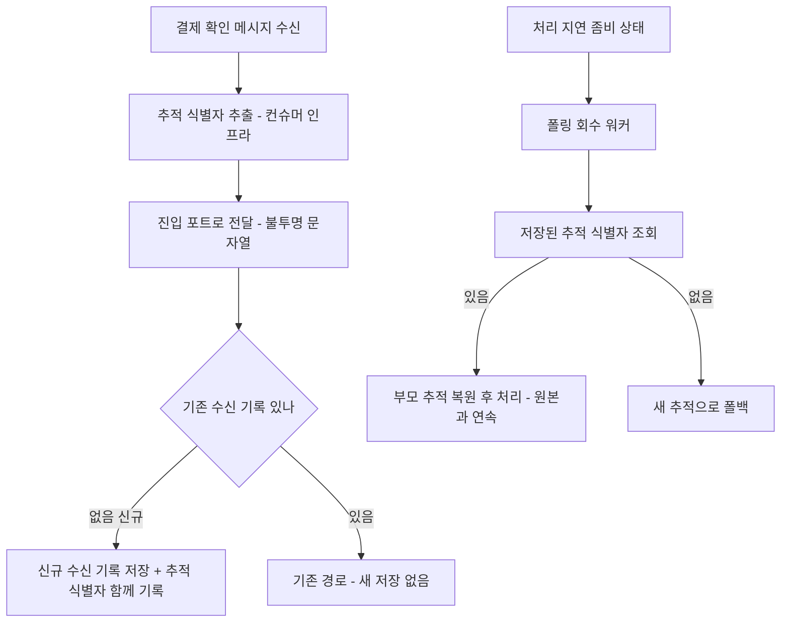

# EOS-FOLLOWUP-CLEANUP — 실행 계획

> 설계 원본: [docs/topics/EOS-FOLLOWUP-CLEANUP.md](topics/EOS-FOLLOWUP-CLEANUP.md)
> 작성일: 2026-05-25
> 라운드: plan-3 (Round 2 Critic major F4 → E-3 traceparent 전달 사슬 중간 계층 산출물·수락 조건 보강)
> discuss 통과: Domain Expert R2 pass / Critic R2 pass

---

## 요약 브리핑

> plan 라운드 통과 (Critic R3 pass / Domain Expert R2 pass). 14개 태스크, 5개 작업군(A~E)은 서로 독립이라 병렬 착수 가능.

### 태스크 목록

**작업군 A — 판별 메서드 분리 (결제, 도메인 리스크 최고)**
- **A-1** 종결 가드·보상 가드용 두 판별 메서드 신설 (기존 겸용 메서드는 유지, RED)
- **A-2** 두 메서드가 완료·격리 상태에서 답이 동조함을 단언하는 교차 불변식 테스트 (한쪽만 바뀌면 빌드 실패)
- **A-3** 두 호출처를 새 메서드로 교체 + 겸용 메서드 제거 (GREEN)

**작업군 B — 트랜잭션 의도 명시 (결제, 동작 변경 0)**
- **B-1** 더는 권장되지 않는 컨슈머 트랜잭션 설정 방식을 현재 방식으로 교체
- **B-2** 결제 결과 컨슈머에 트랜잭션 매니저 명시 + 중첩 트랜잭션 한계 주석화

**작업군 C — 중복 기록 청소 (결제)**
- **C-1** 중복 방지 기록 포트에 만료 행 삭제 메서드 추가
- **C-2** 어댑터 구현 + 만료/미만료 분별 통합 테스트
- **C-3** 주기 청소 스케줄러 신설 (삭제 건수 지표 포함)

**작업군 D — 중복 기록 청소 (상품)** — C와 동형
- **D-1** 포트 삭제 메서드 / **D-2** 어댑터 + 통합 테스트 / **D-3** 청소 스케줄러

**작업군 E — 추적 연속성 복원 (PG)**
- **E-1** 수신 기록 테이블에 추적 식별자 컬럼 추가 (마이그레이션)
- **E-2** 추적 식별자 추출·복원 헬퍼 (추적 인프라 격리)
- **E-3** 컨슈머에서 추출 → 진입 포트 → 신규 수신 기록 저장까지 전달 사슬 (불투명 문자열만 통과)
- **E-4** 폴링 회수 시 저장된 식별자로 부모 추적 복원
- **E-5** 추적 연속성 통합 테스트

### 변경 후 동작

#### 태스크 의존 (작업군 간 의존 없음 — 병렬 가능)

```mermaid
flowchart TD
    subgraph A[작업군 A 판별 메서드 분리]
      A1[A-1 두 판별 메서드 신설] --> A2[A-2 교차 불변식 테스트] --> A3[A-3 호출처 교체 + 겸용 제거]
    end
    subgraph B[작업군 B 트랜잭션 의도 명시]
      B1[B-1 설정 방식 교체] --> B2[B-2 매니저 명시 + 한계 문서화]
    end
    subgraph C[작업군 C 중복기록 청소 결제]
      C1[C-1 포트 삭제 메서드] --> C2[C-2 어댑터 + 통합 테스트] --> C3[C-3 청소 스케줄러]
    end
    subgraph D[작업군 D 중복기록 청소 상품]
      D1[D-1 포트 삭제 메서드] --> D2[D-2 어댑터 + 통합 테스트] --> D3[D-3 청소 스케줄러]
    end
    subgraph E[작업군 E 추적 연속성 복원]
      E1[E-1 컬럼 마이그레이션] --> E2[E-2 추출·복원 헬퍼] --> E3[E-3 전달 사슬 + 저장] --> E4[E-4 회수 시 부모 복원] --> E5[E-5 연속성 통합 테스트]
    end
```



#### 추적 식별자 전달·복원 흐름 (작업군 E)



### 핵심 결정 → 태스크 매핑

- 판별 메서드 분리 + 교차 불변식 보호 → **A-1·A-2·A-3** (도메인 리스크: D7 침묵 DLQ 1차 방어선)
- 트랜잭션 매니저 명시 / 설정 API 교체 / 중첩 트랜잭션 한계 문서화 → **B-1·B-2**
- 중복 기록 만료 행 청소 (결제·상품, 만료 사실 기록만 삭제 — 멱등 진실원 비파괴) → **C-1~C-3 / D-1~D-3**
- 추적 식별자 저장 + 폴링 회수 시 부모 복원 (관측성 전용, 결제 판정 비참여) → **E-1~E-5**

### 트레이드오프 / 후속

- **청소 보존 기간** — 중복 방지 기록은 메시지 보관 기간(7일) 이상(8일) 유지해야 만료 후 삭제가 재배달 멱등에 무해. 단축 금지.
- **단일 인스턴스 가정** — 청소 스케줄러에 분산 락 미도입(만료 조건 삭제는 멱등이라 무해). 다중 인스턴스 전환 시 별도.
- **추적 복원 의도 전환** — 폴링 회수를 "새 추적 분리"에서 "원본과 연속(부모 복원)"으로 바꿈. 폴링 워커 주석 갱신 필수.
- **작업군 병렬성** — 5개 작업군 독립이라 병렬 착수 가능하나, execute는 작업군 내 layer 순서를 지킨다.

---

## 개요

EOS 전환(PAYMENT-EOS-TRANSITION, PR #77) 후속 정합 + 결제 비동기 경로 청소 묶음.
다섯 작업군은 서로 **독립**이라 병렬 착수 가능하다. 각 작업군 내부는 아래 layer 의존 순서를 따른다.

```
domain → application(port) → infrastructure(adapter/scheduler/config) → db/migration
```

---

## 태스크 목록

### 작업군 A — FOLLOW-5 (payment-service): 겸용 판별 메서드 분리

> domain_risk 최고. D7 침묵 DLQ 회귀 1차 방어선.
> 선행 태스크: 없음 (독립 시작).
> 모든 태스크 완료 후 `isCompensatableByFailureHandler` grep 0건 달성.

---

#### A-1. `PaymentEventStatus` — 두 판별 메서드 신설(TDD RED)

<!-- architect: 두 메서드는 PaymentEventStatus enum(domain layer)에만 둔다. 상태 판별은 domain 책임이라는 hexagonal 룰(ARCHITECTURE §Layer 룰: 상태 전이·판별은 domain)을 정확히 따르고 있음. application 서비스로 새지 않음 — OK. -->
- **목적**: D-SPLIT-1. `canApplyConfirmResult()` / `canCompensateStock()` 두 메서드를 `PaymentEventStatus` enum에 추가하되 아직 `isCompensatableByFailureHandler`는 제거하지 않는다(GREEN 태스크는 A-2).
- **tdd**: true
- **domain_risk**: true
- **산출물**:
  - (테스트) `payment-service/src/test/java/com/hyoguoo/paymentplatform/payment/domain/enums/PaymentEventStatusSplitMethodTest.java`
  - (구현) `payment-service/src/main/java/com/hyoguoo/paymentplatform/payment/domain/enums/PaymentEventStatus.java`

**테스트 클래스 및 메서드 스펙**

```
클래스: PaymentEventStatusSplitMethodTest

// --- canApplyConfirmResult ---
@ParameterizedTest @EnumSource(names = {"READY","IN_PROGRESS","RETRYING"})
canApplyConfirmResult_진입가능상태_trueを返す(PaymentEventStatus status)
  단언: status.canApplyConfirmResult() == true

@ParameterizedTest @EnumSource(names = {"DONE","FAILED","CANCELED","PARTIAL_CANCELED","EXPIRED","QUARANTINED"})
canApplyConfirmResult_진입불가상태_false返す(PaymentEventStatus status)
  단언: status.canApplyConfirmResult() == false

// --- canCompensateStock ---
@ParameterizedTest @EnumSource(names = {"READY","IN_PROGRESS","RETRYING"})
canCompensateStock_보상가능상태_true返す(PaymentEventStatus status)
  단언: status.canCompensateStock() == true

@ParameterizedTest @EnumSource(names = {"DONE","FAILED","CANCELED","PARTIAL_CANCELED","EXPIRED","QUARANTINED"})
canCompensateStock_보상불가상태_false返す(PaymentEventStatus status)
  단언: status.canCompensateStock() == false
```

**수락 조건**: 9상태 × 2메서드 = 18케이스 단위 테스트 pass. 기존 `isCompensatableByFailureHandler` 테스트(`PaymentEventStatusEosGuardTest`) 회귀 없음.

---

#### A-2. `PaymentEventStatus` — 교차 불변식 회귀 테스트 신설(TDD RED)

- **목적**: D-SPLIT-3. `canApplyConfirmResult()` / `canCompensateStock()` 두 메서드가 QUARANTINED·EXPIRED·종결 상태에서 "둘 다 false로 동조"함을 명시 단언하는 교차 불변식 테스트. 한쪽만 드리프트 시 빌드 단계에서 RED.
- **tdd**: true
- **domain_risk**: true
- **선행**: A-1 GREEN 이후
- **산출물**:
  - (테스트) `payment-service/src/test/java/com/hyoguoo/paymentplatform/payment/domain/enums/PaymentEventStatusCrossInvariantTest.java`

**테스트 클래스 및 메서드 스펙**

```
클래스: PaymentEventStatusCrossInvariantTest
DisplayName: "두 가드 교차 불변식 — 종결·QUARANTINED·EXPIRED 에서 canApplyConfirmResult / canCompensateStock 둘 다 false 동조"

@ParameterizedTest
@EnumSource(names = {"DONE","FAILED","CANCELED","PARTIAL_CANCELED","EXPIRED","QUARANTINED"})
bothGuards_종결및격리상태_둘다false(PaymentEventStatus status)
  단언:
    assertThat(status.canApplyConfirmResult()).isFalse()
    assertThat(status.canCompensateStock()).isFalse()
    // 관계 불변식 명시 단언 — 한쪽만 true로 드리프트하면 RED
    assertThat(status.canApplyConfirmResult())
        .as("두 가드 QUARANTINED/EXPIRED 답 동조 불변식 — 한쪽 드리프트 시 D7 침묵 DLQ 재현")
        .isEqualTo(status.canCompensateStock())

@Test
quarantined_canApply와canCompensate_동조_명시단언()
  단언:
    assertThat(PaymentEventStatus.QUARANTINED.canApplyConfirmResult()).isFalse()
    assertThat(PaymentEventStatus.QUARANTINED.canCompensateStock()).isFalse()
    assertThat(PaymentEventStatus.QUARANTINED.canApplyConfirmResult())
        .isEqualTo(PaymentEventStatus.QUARANTINED.canCompensateStock())

@Test
expired_canApply와canCompensate_동조_명시단언()
  단언:
    assertThat(PaymentEventStatus.EXPIRED.canApplyConfirmResult()).isFalse()
    assertThat(PaymentEventStatus.EXPIRED.canCompensateStock()).isFalse()
    assertThat(PaymentEventStatus.EXPIRED.canApplyConfirmResult())
        .isEqualTo(PaymentEventStatus.EXPIRED.canCompensateStock())
```

**수락 조건**: 교차 불변식 테스트 pass. 드리프트 시뮬레이션(한쪽 케이스 값 변경)으로 RED 확인 가능한 구조.

---

#### A-3. 두 호출처 동시 갱신 + 기존 메서드 제거(TDD GREEN)

<!-- architect: 두 호출처(PaymentConfirmResultUseCase, PaymentTransactionCoordinator) 모두 application/usecase 계층 → domain enum 메서드 호출. 의존 방향 application → domain 정상. 산출물 경로가 application/usecase로 정확히 명시됨 — OK. -->
- **목적**: D-SPLIT-2. `PaymentConfirmResultUseCase.handle`의 `isCompensatableByFailureHandler()` → `canApplyConfirmResult()` 교체, `PaymentTransactionCoordinator.executePaymentFailureCompensationWithOutbox`의 동명 호출 → `canCompensateStock()` 교체. 이후 `isCompensatableByFailureHandler()` 메서드 본체·Javadoc 삭제. `PaymentEventStatusEosGuardTest`는 `PaymentEventStatusSplitMethodTest`로 역할이 이전됐으므로 삭제하거나 리네임.
- **tdd**: false
- **domain_risk**: true
- **선행**: A-1, A-2
- **산출물**:
  - `payment-service/src/main/java/com/hyoguoo/paymentplatform/payment/domain/enums/PaymentEventStatus.java` — `isCompensatableByFailureHandler` 제거
  - `payment-service/src/main/java/com/hyoguoo/paymentplatform/payment/application/usecase/PaymentConfirmResultUseCase.java` — 호출처 교체
  - `payment-service/src/main/java/com/hyoguoo/paymentplatform/payment/application/usecase/PaymentTransactionCoordinator.java` — 호출처 교체
  - `payment-service/src/test/java/com/hyoguoo/paymentplatform/payment/domain/enums/PaymentEventStatusEosGuardTest.java` — 삭제 또는 리네임 처리

**수락 조건**:
- `grep -r "isCompensatableByFailureHandler" payment-service/src` 결과 0건.
- A-1/A-2 테스트 전부 green, `PaymentEosIntegrationTest` 회귀 없음.
- `./gradlew :payment-service:test` pass.

**완료 결과** (2026-05-29):
- [x] `PaymentEventStatus`에 `canApplyConfirmResult()` / `canCompensateStock()` 추가, `isCompensatableByFailureHandler()` 제거
- [x] `PaymentConfirmResultUseCase.handle` 호출처 → `canApplyConfirmResult()` 교체
- [x] `PaymentTransactionCoordinator.executePaymentFailureCompensationWithOutbox` 호출처 → `canCompensateStock()` 교체
- [x] `PaymentEventStatusEosGuardTest` 삭제 (역할 이전: `PaymentEventStatusSplitMethodTest`)
- [x] `grep -r "isCompensatableByFailureHandler" payment-service/src` 0건 확인
- [x] `./gradlew :payment-service:test` 409/409 PASS

---

### 작업군 B — FOLLOW-6 (payment-service): TM qualifier 명시 + deprecated API 교체 + 1PC 문서화

> 동작 변경 0인 의미 보존 리팩토링.
> 선행 태스크: 없음 (독립 시작, 작업군 A와 병렬 가능).

---

#### B-1. `KafkaConsumerConfig` — deprecated `setTransactionManager` → `setKafkaAwareTransactionManager` 교체

- **목적**: D-TM-3. `factory.getContainerProperties().setTransactionManager(kafkaTransactionManager)` 1줄을 `setKafkaAwareTransactionManager(kafkaTransactionManager)`로 교체. `KafkaTransactionManager<String, String>`은 `KafkaAwareTransactionManager`를 구현하므로 인자 변경 없이 메서드명만 교체.
- **tdd**: false
- **domain_risk**: false
- **산출물**:
  - `payment-service/src/main/java/com/hyoguoo/paymentplatform/payment/infrastructure/config/KafkaConsumerConfig.java`

**수락 조건**: `./gradlew :payment-service:compileJava` deprecated 경고 0건(`setTransactionManager(PlatformTransactionManager)` 경고 제거).

**완료 결과** (2026-05-29):
- [x] `KafkaConsumerConfig.getContainerProperties().setTransactionManager(...)` → `setKafkaAwareTransactionManager(...)` 교체
- [x] 클래스 Javadoc 내 `setTransactionManager` 언급도 동일하게 갱신
- [x] `./gradlew :payment-service:compileJava` — deprecated 경고 0건
- [x] `./gradlew test` 409/409 PASS

---

#### B-2. `PaymentConfirmResultUseCase` — TM qualifier 명시 + 1PC 한계·TM 분리 원칙 Javadoc

<!-- architect: TM 분리 원칙·1PC 한계 Javadoc을 application use-case(PaymentConfirmResultUseCase)에 두는 것은 정당 — 트랜잭션 경계 결정은 application 책임(topic §D-TM-2). qualifier "transactionManager"는 JpaConfig @Primary 빈 이름과 일치해야 함(B-2 수락조건의 상호 참조). 빈 이름 오타 시 런타임 빈 조회 실패이므로 implementer가 JpaConfig 실제 빈 이름 grep 확인 후 박을 것. -->
- **목적**: D-TM-1/2/4. `handle` 메서드의 `@Transactional(timeout = 5)`에 `transactionManager = "transactionManager"` qualifier 추가. 클래스 레벨 Javadoc에 (1) 이 DB tx가 바깥 Kafka tx와 별개의 `@Primary` JPA 매니저로 돈다는 TM 분리 원칙, (2) best-effort 1PC 한계(`dedupe INSERT IGNORE`가 흡수)를 명시. `JpaConfig`의 `transactionManager` 빈 Javadoc과 상호 참조 추가.
- **tdd**: false
- **domain_risk**: false
- **선행**: B-1 (컴파일 경고가 없어야 변경 전후 구분이 명확)
- **산출물**:
  - `payment-service/src/main/java/com/hyoguoo/paymentplatform/payment/application/usecase/PaymentConfirmResultUseCase.java`

**수락 조건**: `@Transactional(transactionManager = "transactionManager", timeout = 5)` 존재. 클래스 Javadoc에 TM 분리 원칙 + 1PC 한계 문구 존재. 기존 EOS 통합 테스트(`PaymentEosIntegrationTest`) 회귀 없음.

**완료 결과** (2026-05-29):
- [x] `handle` 메서드에 `@Transactional(transactionManager = "transactionManager", timeout = 5)` 적용
- [x] 클래스 Javadoc에 TM 분리 원칙 (DB tx vs Kafka tx 별개 범위) 문구 추가
- [x] 클래스 Javadoc에 best-effort 1PC 한계 (`dedupe INSERT IGNORE` 흡수) 문구 추가
- [x] `handle` 메서드 Javadoc에 qualifier 명시 이유 주석 추가
- [x] `JpaConfig#transactionManager` 빈 Javadoc에 `PaymentConfirmResultUseCase` 상호 참조 추가
- [x] `./gradlew test` 409/409 PASS

---

### 작업군 C — FOLLOW-2 (payment-service): `payment_event_dedupe` 만료 행 청소 스케줄러

> Testcontainers 통합 테스트 필수.
> 선행 태스크: 없음 (독립 시작, 작업군 A/B와 병렬 가능).
> 보존 정책: `payment_event_dedupe` cleanup 보존 기간은 Kafka retention(7일) 이상 유지(단축 금지). TTL(8d) > Kafka retention(7d) 불변식 아래에서만 만료 행 삭제가 재배달 멱등에 무해하다. (discuss-domain-2 검토6 근거)

---

#### C-1. `PaymentEventDedupeStore` 포트 — `deleteExpired` 메서드 추가

<!-- architect: D-CLEAN-1 "새 포트 금지, 기존 포트에 메서드 추가" 정확히 준수. 포트가 application/port/out에 위치 — layer 룰 OK. CleanupPort 신설을 피해 같은 테이블 SoT가 둘로 갈라지지 않게 한 점이 떼어내기 쉬운 경계와 정합. -->
<!-- architect (R2 delta): Round 1 F3(포트 시계 타입 정합) 해소 확인. 시그니처가 deleteExpired(Instant now, int batchSize)로 Instant 통일, JDBC DATETIME에 끌려가지 않음. C-1 하단 근거 + Javadoc에 LocalDateTimeProvider.nowInstant():Instant 선례 명시됨 — OK. D-1(product) 포트도 동일하게 Instant로 통일됨(line 327) — 두 서비스 포트 시그니처 일관. -->

- **목적**: D-CLEAN-1. 기존 `PaymentEventDedupeStore` 포트에 만료 행 일괄 삭제 메서드를 추가한다. 새 포트 인터페이스를 만들지 않는다.
- **tdd**: true
- **domain_risk**: false
- **산출물**:
  - `payment-service/src/main/java/com/hyoguoo/paymentplatform/payment/application/port/out/PaymentEventDedupeStore.java`

**테스트 클래스 및 메서드 스펙**

포트 시그니처 결정이 목적이므로 컴파일 수준 테스트(어댑터 테스트 C-2에서 실제 동작 검증):

```
추가할 포트 메서드 시그니처:
  /**
   * 만료된 dedupe 행을 일괄 삭제한다.
   * expires_at < now 조건의 idempotent batch DELETE.
   * 동시 실행 시 이미 삭제된 행은 0 row affected — 무해.
   *
   * @param now       현재 시각 (LocalDateTimeProvider.nowInstant() 기준 — Instant 확정)
   * @param batchSize 최대 삭제 건수
   * @return 실제 삭제된 행 수
   */
  int deleteExpired(Instant now, int batchSize);
```

> 포트 타입 `Instant` 확정: `LocalDateTimeProvider`는 `nowInstant(): Instant`를 노출하며, 기존 `JdbcPaymentEventDedupeStore`가 이미 `nowInstant() → Timestamp.from(Instant)`로 `expires_at`을 기록하는 선례와 일치. C-3 워커는 `localDateTimeProvider.nowInstant()`를 포트에 전달하면 됨. JDBC 타입(DATETIME)에 끌려가지 않는다.

**완료 결과** (2026-05-29):
- [x] `PaymentEventDedupeStore` 포트에 `deleteExpired(Instant now, int batchSize): int` 메서드 추가
- [x] Javadoc에 Instant 타입 확정 근거 + 멱등 시맨틱 명시
- [x] `JdbcPaymentEventDedupeStore`에 컴파일용 stub 추가 (C-2에서 완전 구현 예정)
- [x] `FakePaymentEventDedupeStore`에 기본 구현(0 반환) 추가
- [x] `PaymentEventDedupeStoreContractTest` — 포트 시그니처 컴파일 계약 테스트 추가
- [x] `./gradlew :payment-service:test` 410/410 PASS

---

#### C-2. `JdbcPaymentEventDedupeStore` — `deleteExpired` 구현 + Testcontainers 통합 테스트

- **목적**: D-CLEAN-1/3. `JdbcPaymentEventDedupeStore`에 `DELETE FROM payment_event_dedupe WHERE expires_at < :now LIMIT :batchSize` 구현.
- **tdd**: true
- **domain_risk**: false
- **선행**: C-1
- **산출물**:
  - `payment-service/src/main/java/com/hyoguoo/paymentplatform/payment/infrastructure/dedupe/JdbcPaymentEventDedupeStore.java`
  - `payment-service/src/test/java/com/hyoguoo/paymentplatform/payment/infrastructure/dedupe/JdbcPaymentEventDedupeStoreCleanupTest.java`

**테스트 클래스 및 메서드 스펙**

```
클래스: JdbcPaymentEventDedupeStoreCleanupTest
어노테이션: @SpringBootTest @Testcontainers @Tag("integration")

deleteExpired_만료행만삭제_미만료행잔존()
  준비: 만료 행 3건(expires_at = now - 1day), 미만료 행 2건(expires_at = now + 7day) INSERT
  실행: deleteExpired(Instant.now(), 10)
  단언:
    반환값 == 3
    미만료 2건 잔존 (SELECT count == 2)

deleteExpired_batchSize제한_초과분미삭제()
  준비: 만료 행 5건 INSERT
  실행: deleteExpired(Instant.now(), 3)
  단언:
    반환값 == 3
    잔존 2건 (SELECT count == 2)

deleteExpired_행없음_0반환()
  준비: 테이블 비어 있음
  실행: deleteExpired(Instant.now(), 10)
  단언: 반환값 == 0

deleteExpired_멱등성_이미삭제된행재실행_0반환()
  준비: 만료 행 2건 INSERT → 첫 실행으로 삭제 완료
  실행: deleteExpired(Instant.now(), 10) 재실행
  단언: 두 번째 반환값 == 0
```

**완료 결과** (2026-05-29):
- [x] `JdbcPaymentEventDedupeStore.deleteExpired` — `DELETE FROM payment_event_dedupe WHERE expires_at < :now LIMIT :batchSize` 구현 (UnsupportedOperationException stub 제거)
- [x] `DELETE_EXPIRED_SQL` 상수 추가, `Timestamp.from(now)` 변환 + NamedParameterJdbcTemplate.update 사용
- [x] `JdbcPaymentEventDedupeStoreCleanupTest` 4개 시나리오 모두 PASS (Testcontainers MySQL, @Tag("integration"))
  - 만료 행 3건 삭제·미만료 2건 잔존
  - batchSize 3 제한 시 만료 5건 중 3건만 삭제
  - 빈 테이블 0 반환
  - 멱등성: 이미 삭제된 행 재실행 0 반환
- [x] `./gradlew :payment-service:test :payment-service:integrationTest` 27/27 PASS

---

#### C-3. `DedupeCleanupWorker` (payment-service) — 청소 스케줄러 신설

<!-- architect: 스케줄러를 infrastructure/scheduler에 둔 것은 ARCHITECTURE 비동기 어댑터 표(OutboxWorker/@Scheduled = infrastructure, Spring Scheduler 의존) 룰과 정합 — OK. 워커는 application/port/out 포트만 호출하고 JDBC 어댑터를 직접 만지지 않는지 구현 시 유지할 것(infrastructure → port.out 의존). -->
- **목적**: D-CLEAN-2/4. `infrastructure/scheduler`에 `@Scheduled(fixedDelayString)` 컴포넌트. Micrometer 삭제 행 수 카운터(`payment_event_dedupe.cleanup_deleted_total`) 포함. `LocalDateTimeProvider` 주입 시계 기준.
- **tdd**: true
- **domain_risk**: false
- **선행**: C-2
- **산출물**:
  - `payment-service/src/main/java/com/hyoguoo/paymentplatform/payment/infrastructure/scheduler/DedupeCleanupWorker.java`
  - `payment-service/src/test/java/com/hyoguoo/paymentplatform/payment/infrastructure/scheduler/DedupeCleanupWorkerTest.java`

**테스트 클래스 및 메서드 스펙**

```
클래스: DedupeCleanupWorkerTest
도구: Mockito (단위 테스트)

cleanup_삭제행수_카운터증가()
  준비: PaymentEventDedupeStore mock (deleteExpired → 5 반환)
        LocalDateTimeProvider mock
  실행: worker.cleanup() 1회
  단언:
    deleteExpired 1회 호출 (verify)
    Micrometer counter "payment_event_dedupe.cleanup_deleted_total" +5 증가

cleanup_예외발생시_전파하지않음_다음주기재시도()
  준비: deleteExpired가 RuntimeException throw
  실행: worker.cleanup()
  단언: 예외가 밖으로 전파되지 않음 (no exception thrown)
        ERROR 로그 발생 (LogCaptor 또는 verify log appender)
```

**설정 키 (application.yml에 추가)**:
```
scheduler:
  dedupe-cleanup-worker:
    fixed-delay-ms: 3600000   # 1시간
    batch-size: 1000
```

**수락 조건**: 만료/미만료 행 혼재 시 cleanup 1회 실행 후 만료 행만 삭제·미만료 행 잔존(C-2 통합 테스트). 카운터 `payment_event_dedupe.cleanup_deleted_total` 노출.

**완료 결과** (2026-05-29):
- [x] `DedupeCleanupWorker` 신설 — `infrastructure/scheduler`에 `@Scheduled(fixedDelayString)` 컴포넌트
- [x] `PaymentEventDedupeStore.deleteExpired(localDateTimeProvider.nowInstant(), batchSize)` 호출
- [x] Micrometer 카운터 `payment_event_dedupe.cleanup_deleted_total` — 삭제 행 수 누적 합산
- [x] 예외 발생 시 전파 없이 ERROR 로그 + 다음 주기 재시도 (`executeDeleteExpired` private 메서드로 try/catch 분리)
- [x] `application.yml`에 `scheduler.dedupe-cleanup-worker.fixed-delay-ms: 3600000` / `batch-size: 1000` 설정 키 추가
- [x] 단위 테스트 2개 PASS (counter 증가 / 예외 전파 없음)
- [x] `./gradlew :payment-service:test` 412/412 PASS

---

### 작업군 D — TC-11 (product-service): `stock_commit_dedupe` 만료 행 청소 스케줄러

> Testcontainers 통합 테스트 필수.
> 선행 태스크: 없음 (독립 시작, 작업군 A/B/C와 병렬 가능).
> product-service는 `db/schema` 디렉토리 사용(Flyway 마이그레이션 불요 — `idx_expires_at` 인덱스 이미 존재).
<!-- architect: 동명 포트 혼동 방지가 작업군 헤더 + D-1 산출물 FQCN으로 명시됨 — OK. topic §D-CLEAN-1 주의사항(product의 EventDedupeStore 단독 대상, pg는 Redis 어댑터로 무관)과 정합. 단 ARCHITECTURE §Redis 표상 pg의 EventDedupeStore는 redis-dedupe markSeen 어댑터이고 product는 JdbcEventDedupeStore다 — implementer 디스패치 시 product-service FQCN 고정 유지할 것. -->
> **포트 동명 주의**: 본 작업의 대상은 `product-service`의 `EventDedupeStore`(`com.hyoguoo.paymentplatform.product.application.port.out.EventDedupeStore`)다. `pg-service`의 동명 포트와 무관.

---

#### D-1. product `EventDedupeStore` 포트 — `deleteExpired` 메서드 추가

- **목적**: D-CLEAN-1. `product-service`의 기존 `EventDedupeStore`에 만료 행 일괄 삭제 메서드를 추가한다.
- **tdd**: true
- **domain_risk**: false
- **산출물**:
  - `product-service/src/main/java/com/hyoguoo/paymentplatform/product/application/port/out/EventDedupeStore.java`

**테스트 클래스 및 메서드 스펙**

포트 시그니처 결정이 목적(어댑터 테스트 D-2에서 동작 검증):

```
추가할 포트 메서드 시그니처:
  /**
   * 만료된 dedupe 행을 일괄 삭제한다.
   * expires_at < now 조건의 idempotent batch DELETE.
   *
   * @param now       현재 시각
   * @param batchSize 최대 삭제 건수
   * @return 실제 삭제된 행 수
   */
  int deleteExpired(Instant now, int batchSize);
```

**완료 결과** (2026-05-29):
- [x] `EventDedupeStore` 포트에 `deleteExpired(Instant now, int batchSize): int` 메서드 추가
- [x] Javadoc에 멱등 시맨틱 + D-2 구현 예정 명시
- [x] `JdbcEventDedupeStore`에 컴파일용 stub 추가 (`UnsupportedOperationException` — D-2에서 완전 구현 예정)
- [x] `FakeEventDedupeStore`에 기본 구현(0 반환) 추가
- [x] `EventDedupeStoreContractTest` — 포트 시그니처 컴파일 계약 테스트 추가
- [x] `./gradlew :product-service:test` 20/20 PASS

---

#### D-2. `JdbcEventDedupeStore` — `deleteExpired` 구현 + Testcontainers 통합 테스트

- **목적**: D-CLEAN-1/3. `JdbcEventDedupeStore`에 `DELETE FROM stock_commit_dedupe WHERE expires_at < :now LIMIT :batchSize` 구현.
- **tdd**: true
- **domain_risk**: false
- **선행**: D-1
- **산출물**:
  - `product-service/src/main/java/com/hyoguoo/paymentplatform/product/infrastructure/idempotency/JdbcEventDedupeStore.java`
  - `product-service/src/test/java/com/hyoguoo/paymentplatform/product/infrastructure/idempotency/JdbcEventDedupeStoreCleanupTest.java`

**테스트 클래스 및 메서드 스펙**

```
클래스: JdbcEventDedupeStoreCleanupTest
어노테이션: @SpringBootTest @Testcontainers @Tag("integration")

deleteExpired_만료행만삭제_미만료행잔존()
  준비: 만료 행 3건(expires_at = now - 1day), 미만료 행 2건(expires_at = now + 7day) INSERT
  실행: deleteExpired(Instant.now(), 10)
  단언:
    반환값 == 3
    미만료 2건 잔존

deleteExpired_batchSize제한_초과분미삭제()
  준비: 만료 행 5건 INSERT
  실행: deleteExpired(Instant.now(), 3)
  단언: 반환값 == 3, 잔존 2건

deleteExpired_existsValid미만료행_불영향()
  준비: 미만료 dedupe 행 2건 INSERT (existsValid=true 반환되어야 하는 행)
  실행: deleteExpired(Instant.now(), 10)
  단언:
    반환값 == 0
    두 행 existsValid == true (멱등 가드 유효 보존)
```

---

#### D-3. `DedupeCleanupWorker` (product-service) — 청소 스케줄러 신설

- **목적**: D-CLEAN-2/4. `product-service/infrastructure/scheduler`에 `@Scheduled` 컴포넌트. Micrometer 카운터(`stock_commit_dedupe.cleanup_deleted_total`) 포함.
- **tdd**: true
- **domain_risk**: false
- **선행**: D-2
- **산출물**:
  - `product-service/src/main/java/com/hyoguoo/paymentplatform/product/infrastructure/scheduler/DedupeCleanupWorker.java`
  - `product-service/src/test/java/com/hyoguoo/paymentplatform/product/infrastructure/scheduler/DedupeCleanupWorkerTest.java`

**테스트 클래스 및 메서드 스펙**

```
클래스: DedupeCleanupWorkerTest
도구: Mockito (단위 테스트)

cleanup_삭제행수_카운터증가()
  준비: EventDedupeStore mock (deleteExpired → 4 반환)
  실행: worker.cleanup()
  단언:
    deleteExpired 1회 호출 (verify)
    "stock_commit_dedupe.cleanup_deleted_total" counter +4 증가

cleanup_예외시_전파하지않음()
  준비: deleteExpired → RuntimeException throw
  실행: worker.cleanup()
  단언: 예외 전파 없음, ERROR 로그
```

**설정 키**:
```
scheduler:
  dedupe-cleanup-worker:
    fixed-delay-ms: 3600000
    batch-size: 1000
```

**수락 조건**: `stock_commit_dedupe` 만료 행만 삭제·미만료 잔존(D-2 통합 테스트). 카운터 `stock_commit_dedupe.cleanup_deleted_total` 노출.

---

### 작업군 E — TC-15 항목3 (pg-service): 폴링 회수 시 분산 추적 복원

> Testcontainers 통합 테스트 필수(추적 연속성).
> 선행 태스크: 없음 (독립 시작, 작업군 A/B/C/D와 병렬 가능).
> OTel 추출 방식: `Context.current()` 확정(기존 `PgInboxChannel` / `OutboxJob` / `InboxJob` 패턴과 일관).
> **layer 배치 확정(Round 2 수정)**: traceparent 추출 호출은 `PaymentConfirmConsumer`(infrastructure/messaging/consumer)에서 수행. `PgInboxPendingService`(application/service)와 `insertPendingAndPublish` 포트 시그니처는 `String storedTraceparent` 불투명 문자열만 받는다. OTel API import는 infrastructure 계층에만 존재. 읽기 경로는 `PgInboxRepository.findStoredTraceparent(Long inboxId)` 전용 조회 메서드로 명시. `stored_traceparent`는 `PgInboxEntity`에만 두고 `PgInbox` domain 엔티티에는 추가하지 않는다(관측성 전용, 비즈니스 불참여).
<!-- architect (R2 delta): Round 1 F1(application→infrastructure 역의존)·F2(읽기 경로 누락 + domain 필드 모호) 해소 확인.
     (1) 추출이 PaymentConfirmConsumer(infrastructure, 실재 확인)로 이동, 포트/application 서비스는 String storedTraceparent만 수신 → application→infrastructure 역의존 제거. 현 PgInboxPendingService import 블록에 OTel 의존 없음(repository/log/micrometer/spring tx만)과도 정합.
     (2) 읽기 경로가 findStoredTraceparent(Long): Optional<String> 전용 조회로 확정, 도메인 객체(findById→PgInbox) 경유 회피. stored_traceparent는 PgInboxEntity에만 두고 PgInbox domain 무변경 → domain 오염 차단. 현 PgInbox.java에 traceparent 필드 없음과 정합.
     재배치로 인한 새 layer 위반 없음: consumer가 추출(infra 책임)만 수행하고 INSERT/상태전이 결정은 여전히 application 서비스에 남음 — 책임 침범 아님. 포트 시그니처는 String/Optional<String>만 노출, OTel 타입 누출 없음. -->
<!-- architect: 비-blocking 관찰 — E-4 처리 호출 경로(`PgInboxProcessUseCase#processPending`/`processInProgressZombie`)는 현재 `PgInboxPollingWorker`가 직접 호출 중. restoreContext로 복원한 OTel Context를 어느 지점에서 set/scope하는지는 infrastructure 내부 구현 사항으로, application 포트에는 노출되지 않으므로 layer 영향 없음. implementer가 PgOutboxImmediateWorker의 ContextSnapshot set 선례를 따르면 됨. -->
<!-- architect: 비-blocking 관찰 — E-3에서 `pgConfirmCommandService.handle(command, attempt)` → `insertPendingAndPublish` 경로로 traceparent를 전달한다고 했으므로, 그 사이 중간 계층(PgConfirmCommandService 등)이 application이면 거기도 String 파라미터만 통과해야 한다. 포트/메서드 시그니처가 전부 String이라 OTel 누출 위험은 없으나, implementer가 중간 전달 시그니처도 String으로 일관 유지할 것. 구조 결정 아님 — Planner 재작성 불요. -->


---

#### E-1. Flyway 마이그레이션 — `V4__add_pg_inbox_stored_traceparent.sql`

- **목적**: D-TRACE-1. `pg_inbox` 테이블에 `stored_traceparent VARCHAR(64) NULL` 컬럼 추가. NULL 허용(헤더 부재·구버전 행 호환). 별도 인덱스 불필요(추적 연속성 전용 컬럼, 조회 조건 아님).
- **tdd**: false
- **domain_risk**: false
- **산출물**:
  - `pg-service/src/main/resources/db/migration/V4__add_pg_inbox_stored_traceparent.sql`

```sql
-- V4__add_pg_inbox_stored_traceparent.sql
-- D-TRACE-1: pg_inbox에 W3C traceparent 저장용 컬럼 추가.
-- NULL 허용 — 헤더 부재·구버전 행 호환.
-- VARCHAR(64): W3C traceparent "00-<32hex>-<16hex>-<2hex>" = 55자 + 여유.
ALTER TABLE pg_inbox
    ADD COLUMN stored_traceparent VARCHAR(64) NULL;
```

**수락 조건**: `./gradlew :pg-service:flywayMigrate` (또는 Testcontainers 부팅) 성공. `pg_inbox` 테이블에 `stored_traceparent` 컬럼 존재.

---

#### E-2. traceparent 직렬화 헬퍼 단위 테스트 + `TraceparentExtractor` 신설

- **목적**: D-TRACE-2의 인프라 격리. OTel `Context.current()`에서 W3C traceparent 문자열을 추출하는 헬퍼를 `infrastructure/trace` 패키지에 둔다. `application`은 OTel API에 직접 의존하지 않는다.
- **tdd**: true
- **domain_risk**: false
- **선행**: E-1
- **산출물**:
  - `pg-service/src/main/java/com/hyoguoo/paymentplatform/pg/infrastructure/trace/TraceparentExtractor.java`
  - `pg-service/src/test/java/com/hyoguoo/paymentplatform/pg/infrastructure/trace/TraceparentExtractorTest.java`

**테스트 클래스 및 메서드 스펙**

```
클래스: TraceparentExtractorTest
도구: JUnit5 + AssertJ (OTel SDK 의존)

extract_활성컨텍스트_유효traceparent반환()
  준비: OTel Context에 유효 Span 활성화 (SDK 사용)
  실행: TraceparentExtractor.extractFromCurrentContext()
  단언:
    반환값 != null
    W3C 형식 "00-{32hex}-{16hex}-{2hex}" 정규식 매칭

extract_컨텍스트없음_null반환()
  준비: OTel Context 없음 (기본 INVALID span)
  실행: TraceparentExtractor.extractFromCurrentContext()
  단언: 반환값 null (폴백 가능)

restore_유효traceparent_컨텍스트복원()
  준비: 유효 traceparent 문자열 "00-{traceId}-{spanId}-01"
  실행: Context restoredCtx = TraceparentExtractor.restoreContext(traceparent)
  단언:
    restoredCtx != null
    restoredCtx의 trace-id가 입력 traceId와 일치

restore_null입력_empty컨텍스트반환()
  준비: null 또는 빈 문자열
  실행: TraceparentExtractor.restoreContext(null)
  단언: 예외 없음, Context.root() 또는 empty Context 반환

restore_형식오류_예외없이null반환()
  준비: "invalid-format" 문자열
  실행: TraceparentExtractor.restoreContext("invalid-format")
  단언: 예외 없음 (best-effort — 실패 시 폴백)
```

---

#### E-3. `PgInboxRepository` 포트 + consumer/service — `insertPending` 시그니처에 `storedTraceparent` 추가, 추출은 consumer에서

- **목적**: D-TRACE-2. 포트 `PgInboxRepository.insertPending`에 `String storedTraceparent` 파라미터를 추가한다. traceparent **추출**(`TraceparentExtractor.extractFromCurrentContext()`)은 `PaymentConfirmConsumer`(infrastructure/messaging/consumer)에서 수행하고, `PgInboxPendingService.insertPendingAndPublish`는 그 불투명 문자열을 받아 전달만 한다. `PgInboxEntity`에 `stored_traceparent` 필드를 추가하고 `PgInboxRepositoryImpl` INSERT 쿼리에 컬럼을 기록한다. `PgInbox` domain 엔티티에는 추가하지 않는다(관측성 전용, 비즈니스 불참여). 회수 시 traceparent 조회를 위해 `PgInboxRepository.findStoredTraceparent(Long inboxId)` 전용 조회 메서드를 신설한다.
- **tdd**: false
- **domain_risk**: false
- **선행**: E-1, E-2
- **산출물**:
  - `pg-service/src/main/java/com/hyoguoo/paymentplatform/pg/application/port/out/PgInboxRepository.java`
    - `insertPending` 시그니처에 `String storedTraceparent` 파라미터 추가
    - `findStoredTraceparent(Long inboxId)` 전용 조회 메서드 신설 — `Optional<String>` 반환
  - `pg-service/src/main/java/com/hyoguoo/paymentplatform/pg/infrastructure/repository/PgInboxRepositoryImpl.java`
    - `insertPending`: `stored_traceparent` 컬럼을 INSERT IGNORE 쿼리에 포함
    - `findStoredTraceparent`: `SELECT stored_traceparent FROM pg_inbox WHERE id=:inboxId` 구현
  - `pg-service/src/main/java/com/hyoguoo/paymentplatform/pg/infrastructure/entity/PgInboxEntity.java`
    - `storedTraceparent` 필드 추가(`@Column(name = "stored_traceparent", length = 64)`)
  - `pg-service/src/main/java/com/hyoguoo/paymentplatform/pg/presentation/port/PgConfirmCommandService.java`
    - inbound 포트 `handle(PgConfirmCommand command, int attempt)` 시그니처에 `String storedTraceparent` 파라미터 추가
    - `handle(PgConfirmCommand command)` 기본값 위임도 `null` 전달로 함께 갱신
    - OTel API import 없음 — `String` 불투명 토큰만 통과
  - `pg-service/src/main/java/com/hyoguoo/paymentplatform/pg/application/service/PgConfirmService.java`
    - `handle(PgConfirmCommand command, int attempt, String storedTraceparent)` 구현 메서드 시그니처 변경
    - `handleAbsent(PgConfirmCommand command, String storedTraceparent)` — traceparent를 `insertPendingAndPublish` 호출로 전달
    - `handleActiveInbox`·terminal 분기는 변경 없음 (absent 경로 한정)
    - OTel API import 없음 — `String` 불투명 토큰만 통과
  - `pg-service/src/main/java/com/hyoguoo/paymentplatform/pg/application/service/PgInboxPendingService.java`
    - `insertPendingAndPublish` 시그니처에 `String storedTraceparent` 파라미터 추가
    - OTel API import 추가 없이 전달만 함
  - `pg-service/src/main/java/com/hyoguoo/paymentplatform/pg/infrastructure/messaging/consumer/PaymentConfirmConsumer.java`
    - `TraceparentExtractor.extractFromCurrentContext()` 호출 추가(infrastructure 내부)
    - 추출한 traceparent를 `pgConfirmCommandService.handle(command, attempt, storedTraceparent)` 경로로 전달

**포트 시그니처 확정**:
```
// PgInboxRepository.insertPending — 파라미터 추가
Long insertPending(String orderId, long amount, String eventUuid,
                   String vendorType, String paymentKey, String storedTraceparent);

// PgInboxRepository.findStoredTraceparent — 신설
/**
 * 회수 경로 전용 — stored_traceparent 단일 컬럼 조회.
 * PgInboxPollingWorker가 부모 추적 복원 시 사용한다.
 * traceparent가 없거나(NULL) 행이 없으면 Optional.empty() 반환.
 *
 * @param inboxId pg_inbox PK
 * @return stored_traceparent 문자열 Optional
 */
Optional<String> findStoredTraceparent(Long inboxId);

// PgConfirmCommandService.handle — inbound 포트 시그니처 변경 (String 불투명 토큰 추가)
void handle(PgConfirmCommand command, int attempt, String storedTraceparent);

// PgInboxPendingService.insertPendingAndPublish — String 전달 계층
Long insertPendingAndPublish(String orderId, long amount, String eventUuid,
                             String vendorType, String paymentKey, String storedTraceparent);
```

> **전달 사슬**: `PaymentConfirmConsumer`(추출) → `PgConfirmCommandService.handle(command, attempt, storedTraceparent)` → `PgConfirmService.handleAbsent(command, storedTraceparent)` → `PgInboxPendingService.insertPendingAndPublish(..., storedTraceparent)` → `PgInboxRepository.insertPending(..., storedTraceparent)` → `stored_traceparent` 컬럼 기록.
> 모든 중간 계층은 `String` 불투명 토큰만 통과. **traceparent 기록은 absent(신규 PENDING) 경로 한정** — `handleActiveInbox`(PENDING·IN_PROGRESS 재진입)와 terminal 분기는 INSERT 없으므로 해당 없음.

**수락 조건**:
- absent(신규 PENDING) 경로에서 consumer가 추출한 traceparent가 `PgConfirmCommandService.handle` → `PgConfirmService.handleAbsent` → `PgInboxPendingService.insertPendingAndPublish` → `PgInboxRepository.insertPending` 전달 사슬을 통해 `stored_traceparent` 컬럼에 기록된다 (통합 테스트 E-5 `insertPending_traceparent저장됨()`으로 검증).
- traceparent가 없으면 NULL 저장(폴백). INSERT IGNORE 멱등 보장(기존 행 보존 — traceparent 덮어쓰기 없음).
- `PgConfirmCommandService.java` / `PgConfirmService.java` / `PgInboxPendingService.java` 세 파일 모두 OTel API import 없음.
- `PgInbox` domain 엔티티 무변경.

---

#### E-4. `PgInboxPollingWorker` — 부모 추적 복원 + Javadoc 의도 갱신

- **목적**: D-TRACE-3. 좀비 회수 시 `PgInboxRepository.findStoredTraceparent(inboxId)`로 traceparent를 읽고, 값이 있으면 `TraceparentExtractor.restoreContext()`로 부모 컨텍스트 복원 후 `processor.processPending/processInProgressZombie` 호출. 없으면 기존처럼 새 root span. `PgInboxPollingWorker` Javadoc의 "새 root span: 복구 트레이스를 기존 비즈니스 트레이스와 분리" 의도 설명을 "원본 confirm 추적과 연속(parent 복원)"으로 갱신.
- **tdd**: true
- **domain_risk**: false
- **선행**: E-2, E-3
- **산출물**:
  - `pg-service/src/main/java/com/hyoguoo/paymentplatform/pg/infrastructure/scheduler/PgInboxPollingWorker.java`
  - `pg-service/src/test/java/com/hyoguoo/paymentplatform/pg/infrastructure/scheduler/PgInboxPollingWorkerTraceparentTest.java`

**테스트 클래스 및 메서드 스펙**

```
클래스: PgInboxPollingWorkerTraceparentTest
도구: Mockito + JUnit5

recoverPendingZombies_traceparent있음_부모컨텍스트복원()
  준비:
    inboxRepository.findPendingZombieIds → [1L]
    inboxRepository.findStoredTraceparent(1L) → Optional.of("00-{traceId}-{spanId}-01")
    processor.processPending mock
  실행: worker.poll()
  단언:
    processor.processPending(1L) 1회 호출 (verify)
    // 추적 복원은 infrastructure 내부 동작이므로 호출 성공 자체로 검증

recoverPendingZombies_traceparent없음_새rootSpan폴백()
  준비:
    inboxRepository.findPendingZombieIds → [2L]
    inboxRepository.findStoredTraceparent(2L) → Optional.empty()
    processor.processPending mock
  실행: worker.poll()
  단언:
    processor.processPending(2L) 1회 호출 (예외 없음)

recoverPendingZombies_traceparent형식오류_폴백처리완료()
  준비:
    inboxRepository.findStoredTraceparent(anyLong()) → Optional.of("invalid")
  실행: worker.poll()
  단언: 예외 없음, processor.processPending 호출됨 (best-effort 폴백)
```

---

#### E-5. 추적 연속성 Testcontainers 통합 테스트

- **목적**: D-TRACE-1~3 통합 검증. Flyway 마이그레이션 적용 확인 + 회수된 좀비 span의 trace-id 연속성 + NULL 폴백 정상 완료.
- **tdd**: true
- **domain_risk**: false
- **선행**: E-1, E-2, E-3, E-4
- **산출물**:
  - `pg-service/src/test/java/com/hyoguoo/paymentplatform/pg/integration/PgInboxTraceparentIntegrationTest.java`

**테스트 클래스 및 메서드 스펙**

```
클래스: PgInboxTraceparentIntegrationTest
어노테이션: @SpringBootTest @Testcontainers @Tag("integration")

insertPending_traceparent저장됨()
  준비: 유효 OTel Context 활성화
  실행: pgInboxRepository.insertPending(orderId, amount, eventUuid, vendorType, paymentKey, traceparent)
  단언: SELECT stored_traceparent FROM pg_inbox WHERE order_id=? 결과 == 저장한 traceparent

flywayMigration_V4컬럼존재()
  준비: Testcontainers MySQL 부팅 (Flyway V1~V4 자동 적용)
  단언: INFORMATION_SCHEMA로 stored_traceparent 컬럼 존재 확인

insertPending_traceparentNull_INSERT성공_폴백()
  준비: traceparent=null 인자
  실행: pgInboxRepository.insertPending(..., null)
  단언: INSERT 성공, stored_traceparent IS NULL
```

**수락 조건**: 회수된 좀비 span의 trace-id가 `stored_traceparent`에서 복원한 원본 trace-id와 동일. traceparent NULL/형식 오류 시 폴백으로 회수 정상 완료.

---

## 리스크 → 태스크 교차 참조 테이블

| discuss 리스크 ID | 내용 | 대응 태스크 |
|---|---|---|
| D-SPLIT-1 | 겸용 메서드를 두 목적별 메서드로 분리 | A-1 (테스트), A-3 (구현) |
| D-SPLIT-2 | 두 호출처 동시 갱신 + 기존 메서드 제거 | A-3 |
| D-SPLIT-3 | 교차 불변식 회귀 테스트 — 두 메서드 답 동조 단언, D7 침묵 DLQ 1차 방어선 | A-2 |
| D-TM-1 | `handle`에만 TM qualifier 명시 | B-2 |
| D-TM-2 | TM 분리 원칙 Javadoc | B-2 |
| D-TM-3 | deprecated `setTransactionManager` → `setKafkaAwareTransactionManager` 교체 (plan 진입 전 존재 확인 완료) | B-1 |
| D-TM-4 | 1PC 한계 문서화 | B-2 |
| D-CLEAN-1 | 각 서비스 기존 포트에 `deleteExpired` 추가 | C-1 (payment), D-1 (product) |
| D-CLEAN-2 | `infrastructure/scheduler`에 독립 청소 워커 | C-3 (payment), D-3 (product) |
| D-CLEAN-3 | idempotent batch DELETE 쿼리 | C-2 (payment 어댑터), D-2 (product 어댑터) |
| D-CLEAN-4 | 설정 키 네이밍 (`scheduler.dedupe-cleanup-worker.*`) | C-3, D-3 |
| D-TRACE-1 | `pg_inbox.stored_traceparent` 컬럼 Flyway 마이그레이션 | E-1 |
| D-TRACE-2 | 수신 기록 시 traceparent 저장 (OTel `Context.current()`, infrastructure 격리 — consumer에서 추출, application은 문자열 전달만) | E-2, E-3 |
| D-TRACE-3 | 폴링 회수 시 부모 추적 복원 + Javadoc 의도 갱신 | E-4 |
| discuss-domain-2 검토6 (MINOR) | payment dedupe cleanup 보존 기간 명문화 | C-3 Javadoc + 태스크 보존 정책 근거 |
| L-1 (장애) | cleanup DELETE 도중 DB 장애 → 다음 fixedDelay 재시도 | C-2/C-3/D-2/D-3 (설계) |
| L-2 (장애) | FOLLOW-5 분리 후 두 가드 드리프트 → D7 침묵 DLQ | A-2 (교차 불변식 테스트) |
| L-3 (장애) | traceparent 추출/복원 예외 → best-effort 폴백 | E-2/E-4 |
| L-4 (장애) | cleanup batch가 누적 못 따라잡음 → 카운터로 관측 | C-3/D-3 (Micrometer 카운터) |

---

## 태스크 의존 관계 요약

```
작업군 A (FOLLOW-5, payment domain):
  A-1 → A-2 → A-3

작업군 B (FOLLOW-6, payment infra):
  B-1 → B-2

작업군 C (FOLLOW-2, payment dedupe cleanup):
  C-1 → C-2 → C-3

작업군 D (TC-11, product dedupe cleanup):
  D-1 → D-2 → D-3

작업군 E (TC-15, pg traceparent):
  E-1 → E-2 → E-3 → E-4 → E-5

작업군 간 의존: 없음 (병렬 착수 가능)
```

---

## 반환 요약

| 항목 | 값 |
|---|---|
| 태스크 총 개수 | 14 (A-1~A-3, B-1~B-2, C-1~C-3, D-1~D-3, E-1~E-5) |
| domain_risk=true 태스크 수 | 3 (A-1, A-2, A-3) |
| topic.md 결정 중 태스크로 매핑 못 한 항목 | **없음** (D-TM-1~4 / D-SPLIT-1~3 / D-CLEAN-1~4 / D-TRACE-1~3 전부 매핑 완료) |
