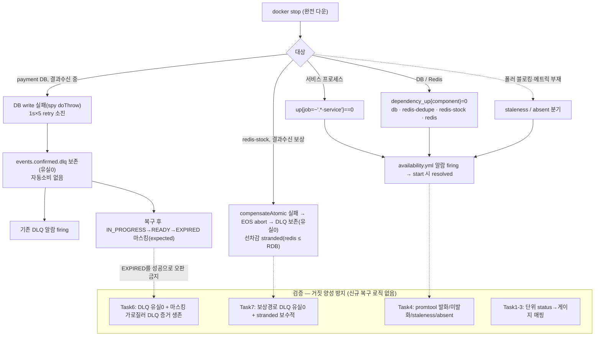

# 장애 주입 회복성 검증 구현 플랜 (FAULT-INJECTION-RESILIENCE)

> 작성일: 2026-06-29

## 요약 브리핑

### Task 목록

1. **payment 의존성 가용성 게이지** — payment의 DB·redis-dedupe(체크아웃 멱등)·redis-stock(선차감) 가용성을 폴링 게이지(`dependency_up{component}`)로 노출. 컴포넌트 분리·타임아웃 가드·last-poll 타임스탬프 메커니즘 SoT. (단위 test-first)
2. **pg 의존성 가용성 게이지** — pg의 DB·redis 동형 노출.
3. **product·user 의존성 가용성 게이지** — 두 서비스 DB 동형 노출(db only).
4. **availability.yml 알람 + promtool 픽스처** — 서비스 프로세스 다운(`up==0`)·의존성 다운(`dependency_up==0 or absent`)·health staleness(+absent) 규칙과 발화/미발화/dead-branch 회귀 고정.
5. **가용성 다운 주입·발화 검증 스크립트 + smoke 런북** — docker stop 다운 주입 → 알람 firing → start → resolved. redis-dedupe 다운 fail-closed 거동 등 런북 정정.
6. **DB 다운 정합 거동 통합테스트** — confirm 결과수신 중 DB write 실패 → `events.confirmed.dlq` 유실0 + EXPIRED 2단 마스킹 전이를 가로질러 DLQ 증거 생존(silent 아님).
7. **redis-stock 보상실패 통합테스트** — 결과수신 보상(`compensateAtomic`) 실패 → EOS abort → DLQ 유실0 + 선차감 stranded(redis ≤ RDB 보수적).

### 변경 후 동작 (to-be)

### 핵심 결정 → Task 매핑

| 설계 결정 (topic.md) | Task |
|---|---|
| 서비스 다운 `up==0` rule-only | 4 |
| 컴포넌트별 health 게이지(payment redis 2분리) | 1·2·3 (노출) → 4 (알람) |
| staleness + absent 분기 (PITFALLS §24) | 1·2·3 (last-poll 게이지) → 4 (규칙·픽스처) |
| 타임아웃 가드(2s, stale-UP false-negative 차단) | 1·2·3 |
| 4서비스 db + payment/pg redis 브리지 범위 | 1·2·3 |
| docker stop 완전 다운 라이브 드릴 | 5 |
| 실제 전이 단정으로 거짓 양성 차단 — DLQ 유실0 (load-bearing) | 6·7 |
| EXPIRED 2단 마스킹 가시화(차단 아님, silent 아님) | 6 |
| no-divergence(over-sell 0) 공허 단정 → 제외 | (제외 — reconcile 기록) |
| 신규 복구 로직 없음 (TQ-1/TC-3 위임) | 6·7 (검증만) |

### 트레이드오프 / 후속 작업

- DB/Redis **지연·부분 장애**는 사각 잔존(docker stop 완전 다운만 — Toxiproxy 확장 별 토픽).
- over-sell 발산 **실제 구동**(§18 전제 시드)은 도메인 정합 별 토픽 위임 — 이 토픽은 no-divergence 단정 제외.
- EXPIRED 2단 마스킹·DLQ-stranded·선차감 stranded는 **가시화까지**, 자동 회복은 TQ-1(DLQ 재주입)/TC-3(재고 재동기) 위임.
- 라이브 드릴 미가능 환경은 절차·기대치 문서화로 격하(직전 토픽 폴백 양식).

## 목표

서비스 프로세스·DB·Redis **가용성 사각을 알람으로 메우고**(서비스 `up==0` + 컴포넌트별 의존성 health 게이지 + staleness), docker stop **완전 다운**에서 백스톱이 정합을 유지하지 못하는 **실제 전이**(DLQ 유실0 · EXPIRED 2단 마스킹 거짓 양성)를 통합테스트 단정으로 고정하면 완료. **신규 복구 로직은 만들지 않는다**(자동 복구는 TQ-1/TC-3 위임).

## 컨텍스트

- 설계 문서: `docs/topics/FAULT-INJECTION-RESILIENCE.md`
- 직전 토픽 자산: `docs/archive/alerting-rules-and-fault-drill/COMPLETION-BRIEFING.md` (알람 3그룹·promtool·드릴 스크립트)
- 계승 메커니즘: `PaymentHealthMetrics`(AtomicLong + `@Scheduled` 폴링 + `Gauge`, `Clock` 주입), `PgOutboxMetrics`(생성자 Gauge 등록, `infrastructure/metrics` 배치)
- 알람/픽스처 패턴: `observability/prometheus/rules/coordinator.yml` + `rules/tests/coordinator_test.yml`(absent 분기·for 트레이드오프)
- 검증 대상(무변경): `KafkaErrorHandlerConfig`(FixedBackOff 1s×5 → `events.confirmed.dlq`), `PaymentReconciler`(IN_PROGRESS→READY 300s), `PaymentExpirationServiceImpl`(READY→EXPIRED)
- 통합테스트 베이스: `BaseIntegrationTest`(Testcontainers MySQL + Redis, `withReuse(true)` static 공유, `TestClock.setFixedInstant`)
- 주요 변경 파일:
  - 신규(앱): `payment/pg/product/user` 각 `infrastructure/metrics/DependencyHealthMetrics.java`
  - 신규(관측): `observability/prometheus/rules/availability.yml` + `rules/tests/availability_test.yml`
  - 신규(드릴): `scripts/smoke/alert-firing-availability.sh` + smoke 가이드
  - 신규(테스트): 각 서비스 `DependencyHealthMetricsTest`, payment 통합테스트 신규 클래스

## 핵심 설계 결정 (plan 확정분)

- **metric 이름**: `dependency_up{component="db|redis-dedupe|redis-stock|redis"}` (1=UP / 0=그외). service 구분은 prometheus `job` 라벨로. 도메인 `payment_health_*` 와 네이밍 분리.
- **staleness 신호**: `dependency_health_last_poll_timestamp_seconds` — 폴러가 한 바퀴 돌 때마다(성공/실패 무관) 갱신. 알람 `time() - <gauge> > N`. **`stale`(폴러 블로킹/스레드 사망 시 게이지 잔존·갱신 정지)와 `absent`(메트릭 미등록·오타로 시리즈 자체 부재 — PITFALLS §24 dead-branch) 둘 다** 커버: staleness·DependencyDown 규칙에 `absent(...)`/`up==0` backstop 분기 병행. DOWN 신호(`dependency_up==0`)와 독립 축.
- **타임아웃 가드**: 각 health 조회를 2s 타임아웃으로 감싸 폴러 직렬화 블로킹(Hikari connectionTimeout 30s) 차단 → 타임아웃 시 해당 컴포넌트 0(DOWN). 1차 방어, staleness는 2차 방어.
- **컴포넌트 분리**: payment redis는 `redis-dedupe`/`redis-stock` 2컴포넌트(composite를 풀어 dead branch 방지 — 직전 `kafka_brokers` dead branch와 동형 회피).
- **no-divergence(redis ≤ RDB) 단정은 통합테스트에서 제외** — `resetToReady` 단독은 §18 발산 3전제 미충족이라 violation 불가능한 공허 단정(plan 게이트 domain-expert 동의). exactly-once 차감은 기존 `PaymentEosIntegrationTest`가 이미 가드. topic.md §98·§171·§184·§193도 "검증 포함→제외"로 reconcile함(SoT 번복 기록). over-sell 실구동 시드는 도메인 정합 별 토픽 위임.
- **통합테스트 DB 다운 재현**: `BaseIntegrationTest`(Kafka 없음) 미확장. DLQ 선례(`PaymentEosIntegrationTest`·`StockCompensationRecoveryIntegrationTest`) 패턴 = **`@EmbeddedKafka` + 전용 MySQL 컨테이너 + `@MockitoSpyBean doThrow`**. 공유 `withReuse(true)` 컨테이너 `stop()` / DataSource 단절은 Hikari connectionTimeout(30s×5)으로 **비결정적(flaky) → 금지**. DB write 실패는 영속 포트/유스케이스 spy `doThrow`로 결정적 유발, scheduler는 명시 호출.

## 진행 상황

- [x] Task 1: payment DependencyHealthMetrics (db + redis-dedupe + redis-stock) — 메커니즘 SoT
- [x] Task 2: pg DependencyHealthMetrics (db + redis)
- [x] Task 3: product + user DependencyHealthMetrics (db only)
- [x] Task 4: availability.yml 알람 그룹 + promtool 픽스처
- [x] Task 5: 가용성 다운 주입·발화 검증 스크립트 + smoke 가이드
- [x] Task 6: confirm 결과수신 DB 다운 통합테스트 (DLQ 유실0 · 마스킹 가로질러 DLQ 증거 생존)
- [ ] Task 7: redis-stock 보상실패 통합테스트 (§183 보상경로 DLQ 유실0)

## 태스크

### Task 1: payment DependencyHealthMetrics [tdd=true] [domain_risk=false]

**테스트 (RED)**
- `payment-service/.../infrastructure/metrics/DependencyHealthMetricsTest.java` (단위, Mockito)
  - `health_UP_상태면_게이지1` — HealthIndicator status=UP → 컴포넌트 게이지 1
  - `health_DOWN_상태면_게이지0` — `@ParameterizedTest @EnumSource`(DOWN/OUT_OF_SERVICE/UNKNOWN) → 0
  - `health조회_타임아웃이면_게이지0` — 조회가 2s 초과 블로킹 → 타임아웃 가드로 0(DOWN) 판정
  - `폴링완료마다_last_poll_timestamp_갱신` — 주입 `Clock` 기준 폴 1회 후 timestamp 게이지 = 현재 instant
  - `redis_dedupe와_redis_stock_컴포넌트_분리` — 2 RedisConnectionFactory composite를 풀어 `redis-dedupe`/`redis-stock` 각각 독립 게이지 노출(한쪽 DOWN이 다른쪽에 안 섞임)

**구현 (GREEN)**
- `DependencyHealthMetrics`: `MeterRegistry` + health 소스(HealthContributorRegistry 또는 db DataSource·각 RedisConnectionFactory 직접 주입) + `Clock` + `@Scheduled` 폴링.
  - 컴포넌트별 `AtomicLong` 게이지 `dependency_up{component=...}` 등록(`registerHealthGauge` 패턴 계승).
  - `dependency_health_last_poll_timestamp_seconds` 게이지 — 폴 종료 시 `clock.instant().getEpochSecond()` 기록.
  - 각 조회를 2s 타임아웃 가드(`ExecutorService`/`Future.get(2,SECONDS)` 또는 동등)로 감싸 1=UP/0=그외 매핑.
  - 폴링 주기·타임아웃 `@Value` 설정값(`metrics.payment.dependency.*`, application.yml 추가).
- 컴포넌트: `db`, `redis-dedupe`, `redis-stock`.

**완료 기준**
- 단위테스트 5종 pass, `./gradlew :payment-service:test` 회귀 없음. spotbugsMain/spotbugsTest 통과.

**완료 결과**
- `payment/infrastructure/metrics/DependencyHealthMetrics.java` 신규 생성.
- 컴포넌트: `db`(DataSource.getConnection().isValid), `redis-dedupe`(dedupeRedisConnectionFactory.ping), `redis-stock`(stockRedisConnectionFactory.ping).
- 생성자 Gauge 등록(PgOutboxMetrics 패턴), ExecutorService(VirtualThread) + `Future.get(timeoutSeconds, SECONDS)` 타임아웃 가드, `@Scheduled` 폴 완료 후 `lastPollTimestamp` 갱신.
- `metrics.payment.dependency.polling-interval-seconds=10`, `timeout-seconds=2` 기본값 application.yml 추가.
- 단위 테스트 7건(5종, DOWN 3시나리오 @EnumSource) ALL PASS. `./gradlew :payment-service:test` 465건 PASS. spotbugsMain/spotbugsTest PASS.

---

### Task 2: pg DependencyHealthMetrics [tdd=true] [domain_risk=false]

**테스트 (RED)**
- `pg-service/.../infrastructure/metrics/DependencyHealthMetricsTest.java` — Task 1 패턴 복제(컴포넌트 `db`, `redis` 단일). status 매핑 + 타임아웃 + last_poll timestamp.

**구현 (GREEN)**
- pg `DependencyHealthMetrics`: 컴포넌트 `db` + `redis`(pg는 redis 단일 factory). 설정 `metrics.pg.dependency.*`.

**완료 기준**
- 단위테스트 pass, `./gradlew :pg-service:test` 회귀 없음, 린트 통과.

**완료 결과**
- `pg/infrastructure/metrics/DependencyHealthMetrics.java` 신규 생성.
- 컴포넌트: `db`(DataSource.getConnection().isValid), `redis`(RedisConnectionFactory.getConnection().ping) — pg는 단일 RedisConnectionFactory.
- 생성자 Gauge 등록(PgOutboxMetrics 패턴), ExecutorService(VirtualThread) + `Future.get(timeoutSeconds, SECONDS)` 타임아웃 가드, `@Scheduled` 폴 완료 후 `lastPollTimestamp` 갱신.
- `metrics.pg.dependency.polling-interval-seconds=10`, `timeout-seconds=2` 기본값 application.yml 추가.
- EventType에 `METRICS_INIT`, `METRICS_GAUGE_UPDATED` 추가 [Rule 1].
- 단위 테스트 6건(4종, DOWN 3시나리오 @EnumSource) ALL PASS. `./gradlew :pg-service:test` 330건 PASS. spotbugsMain/spotbugsTest PASS.

---

### Task 3: product + user DependencyHealthMetrics (db only) [tdd=true] [domain_risk=false]

**테스트 (RED)**
- `product-service`·`user-service` 각 `DependencyHealthMetricsTest` — 컴포넌트 `db` 단일. status 매핑 + 타임아웃 + last_poll.

**구현 (GREEN)**
- 두 서비스에 동형 `DependencyHealthMetrics`(db only). 설정 `metrics.{product,user}.dependency.*`.

**완료 기준**
- 두 서비스 단위테스트 pass, `./gradlew :product-service:test :user-service:test` 회귀 없음, 린트 통과.

**완료 결과**
- `product/infrastructure/metrics/DependencyHealthMetrics.java`, `user/infrastructure/metrics/DependencyHealthMetrics.java` 신규 생성.
- 컴포넌트: `db`(DataSource.getConnection().isValid) 단일. redis 없음.
- 생성자 Gauge 등록(PgOutboxMetrics 패턴), ExecutorService(VirtualThread) + `Future.get(timeoutSeconds, SECONDS)` 타임아웃 가드, `@Scheduled` 폴 완료 후 `lastPollTimestamp` 갱신.
- `metrics.product.dependency.polling-interval-seconds=10`, `timeout-seconds=2` / `metrics.user.dependency.*` 동형 application.yml 추가.
- user-service `ClockConfig` 신규(product 패턴 복제). [Rule 1]
- product·user `EventType`에 `METRICS_INIT`, `METRICS_GAUGE_UPDATED` 추가. [Rule 1]
- `ProductServiceApplicationTest`·`UserServiceApplicationTest`에 `@MockitoBean DataSource` 추가(DataSource autoconfig 제외 컨텍스트 로드 수정). [Rule 1]
- product 단위 테스트 6건(4종, DOWN 3시나리오 @EnumSource) ALL PASS, 전체 50건 PASS. spotbugsMain/spotbugsTest PASS.
- user 단위 테스트 6건(4종, DOWN 3시나리오 @EnumSource) ALL PASS, 전체 9건 PASS. spotbugsMain/spotbugsTest PASS.

---

### Task 4: availability.yml 알람 그룹 + promtool 픽스처 [tdd=true] [domain_risk=false]

**테스트 (RED) — promtool 픽스처 회귀 고정**
- `observability/prometheus/rules/tests/availability_test.yml`:
  - 서비스 프로세스 다운: `up{job="payment-service"}==0` → `ServiceDown` FIRING / 정상(up=1) 미발화
  - 의존성 다운: `dependency_up{component="db"}==0` → `DependencyDown` FIRING (component 라벨 보존)
  - redis-stock 단독 다운: `dependency_up{component="redis-stock"}==0` 발화하되 `redis-dedupe`는 미발화(분리 검증)
  - staleness: `time() - dependency_health_last_poll_timestamp_seconds > 임계` → `DependencyHealthStale` FIRING / 폴러 정상(최근 갱신) 미발화
  - **absent dead-branch**: `dependency_up`·`dependency_health_last_poll_timestamp_seconds` 시리즈 미선언(메트릭 미등록·오타 재현) → `absent()` backstop으로 `DependencyDown`(또는 Stale) FIRING (PITFALLS §24 회귀 고정 — `==0`·`time()-x>N` 단독은 시리즈 부재 시 dead branch)
  - 정상 baseline 전체 미발화

**구현 (GREEN)**
- `observability/prometheus/rules/availability.yml` — `availability` 그룹:
  - `ServiceDown`: `up{job=~".*-service"} == 0` (for: 적정, 콜드스타트 흡수)
  - `DependencyDown`: `dependency_up == 0 or absent(dependency_up)` (시리즈 부재 dead-branch 방지 — PITFALLS §24)
  - `DependencyHealthStale`: `(time() - dependency_health_last_poll_timestamp_seconds > N) or absent(dependency_health_last_poll_timestamp_seconds)`
  - 각 규칙 주석에 신호 의미·임계 근거 + absent 분기 사유(직전 토픽 for 트레이드오프·absent 주석 양식).
- `prometheus.yml` `rule_files`에 availability.yml 포함 확인(기존 글롭이면 무변경).

**완료 기준**
- `scripts/smoke/alert-rules-promtool.sh`(또는 docker promtool) 전 케이스 pass — 발화/미발화/staleness 분기 + 정상 미발화. 기존 16케이스 회귀 없음.

**완료 결과**
- `observability/prometheus/rules/availability.yml` 신규 생성 — `availability` 그룹 3규칙.
  - `ServiceDown`: `up{job=~".*-service"} == 0`, for:1m (콜드스타트 흡수).
  - `DependencyDown`: `dependency_up == 0 or absent(dependency_up)` (for 없음, 즉시 알람). absent() 백스톱으로 PITFALLS §24 dead-branch 방지.
  - `DependencyHealthStale`: `(time() - dependency_health_last_poll_timestamp_seconds > 60) or absent(...)` (임계 60s = 폴링 주기 10s×6회). absent() 백스톱 동형.
  - 각 규칙 주석에 신호 의미·임계 근거·absent 분기 사유·for 트레이드오프 명시.
- `observability/prometheus/rules/tests/availability_test.yml` 신규 생성 — 9케이스:
  - (a1) ServiceDown FIRING (for:1m 충족) / (a2) 정상 미발화
  - (b) DependencyDown db 다운 FIRING (component 라벨 보존)
  - (c) redis-stock 단독 다운 FIRING, redis-dedupe 미발화 (컴포넌트 분리 검증)
  - (d1) DependencyHealthStale staleness FIRING / (d2) 폴러 정상 미발화
  - (e1) dependency_up 시리즈 부재 → absent() 백스톱 FIRING (PITFALLS §24 dead-branch 회귀)
  - (e2) dependency_health_last_poll_timestamp_seconds 부재 → absent() FIRING
  - (f) 정상 baseline 전체 3알람 미발화
- `prometheus.yml` rule_files 글롭(`*.yml`) 기존 — 무변경(availability.yml 자동 포함).
- promtool `prom/prometheus:v2.51.2`: 신규 9케이스 ALL PASS. 기존 16케이스(coordinator/dlq/guard_skip) 회귀 없음.

---

### Task 5: 가용성 다운 주입·발화 검증 스크립트 + smoke 가이드 [tdd=false] [domain_risk=false]

**구현**
- `scripts/smoke/alert-firing-availability.sh` — `alert-firing-coordinator.sh`/`-dlq.sh` 패턴:
  - docker stop으로 (a) 서비스 프로세스 (b) DB (c) redis-dedupe (d) redis-stock 다운 주입
  - `/api/v1/alerts` 폴링으로 해당 가용성 알람 firing 확인 → docker start → resolved 확인
  - DLQ-stranded·EXPIRED 마스킹분은 **자동 회복 안 됨**(가시화 한계) 출력 명시
- smoke 가이드: `docs/smoke/alert-firing-check.md`에 availability 그룹 절 추가(또는 신규 가이드) — 다운 주입 절차·기대 신호·가시화 한계.
- **런북 거동 텍스트 정정**(§172 반영): `redis-dedupe` 다운 = **체크아웃 멱등(`IdempotencyStore`, 6379) 호출 자체가 차단점 → checkout fail-closed(5xx) → 결제 생성 차단 = 가용성 저하(중복 과금 경로 없음 — `IdempotencyStoreRedisAdapter` fail-open 폴백 없음)**(EOS 메시지 멱등은 MySQL `payment_event_dedupe`라 `db` 컴포넌트 귀속). `redis-stock` 다운 = 선차감/보상 경로 실패. 운영자가 outage 중 존재하지 않는 이중 과금을 추적하지 않도록 명시.

**완료 기준**
- 스크립트 shellcheck/실행 가능, 가이드 절차로 로컬 라이브 발화→해소 1회 실측 기록(드릴 컴포즈/기존 스택). 라이브 미가능 시 절차·기대치 문서화로 격하(직전 토픽 폴백 양식).

**완료 결과**
- `scripts/smoke/alert-firing-availability.sh` 신규 생성 — `alert-firing-coordinator.sh`·`-dlq.sh` 패턴 계승.
  - 4시나리오 순차 실행: (a) 서비스 프로세스 다운 → `ServiceDown`(for:1m, 타임아웃 120s) / (b) mysql-payment 다운 → `DependencyDown{component="db"}` / (c) redis-dedupe 다운 → `DependencyDown{component="redis-dedupe"}` / (d) redis-stock 다운 → `DependencyDown{component="redis-stock"}`.
  - 각 시나리오: `docker stop` → 발화 폴링 → `docker start` → 해소 폴링. cleanup trap으로 비정상 종료 시 컨테이너 자동 복구.
  - 라이브 스택 미기동 시 promtool 격하 폴백(`availability_test.yml` 9케이스).
  - 런북 거동 주석: redis-dedupe 다운 = fail-closed(이중 과금 없음), redis-stock 다운 = stranded(과예약·over-sell 아님), DLQ-stranded·EXPIRED 마스킹은 자동 회복 안 됨(가시화 한계) 명시.
- `scripts/smoke/alert-rules-promtool.sh` — `run_test "가용성 (9 케이스)" "availability_test.yml"` 추가. 총 4그룹 25케이스.
- `docs/smoke/alert-firing-check.md` — availability 그룹 9케이스 표·드릴 절차·거동 주석·가시화 한계·실패 해석 추가. 케이스 총계 16→25, 스크립트 목록 3종→4종.
- `bash -n` 문법 검사 통과. 라이브 환경 미기동으로 절차·기대치 문서화 격하(직전 토픽 폴백 양식).

---

### Task 6: confirm 결과수신 DB 다운 정합 거동 통합테스트 [tdd=true] [domain_risk=true]

**테스트 (RED) — 실제 전이 단정, 거짓 양성 차단**
- 신규 통합테스트 클래스 — **베이스: `@EmbeddedKafka` + 전용 MySQL 컨테이너 + `@MockitoSpyBean doThrow`** (DLQ 선례 `PaymentEosIntegrationTest`·`StockCompensationRecoveryIntegrationTest` 패턴, `BaseIntegrationTest` 미확장 — Kafka 없음). `scheduler.enabled=false` 후 reconciler/expiration **명시 호출**.
  - `DB다운_결과수신중_events_confirmed_dlq_유실0` (**load-bearing**) — confirm 결과 수신 시 DB write를 spy `doThrow`로 결정적 실패 → 에러핸들러 1s×5 retry 소진 → `events.confirmed.dlq`에 메시지 **보존(유실 0)**. 시간 무관 단정(메시지 존재).
  - `마스킹전이를_가로질러_DLQ증거_생존` (**load-bearing**) — DLQ 보존 상태에서 `TestClock` advance + reconciler(IN_PROGRESS→READY)·expiration(READY→EXPIRED) **명시 호출**. **EXPIRED 도달은 expected**(현 코드 거동 = 마스킹 그 자체). 단정 = 그 전이를 가로질러 **`events.confirmed.dlq` 메시지 유실0 보존** = silent하지 않음. 비-silence 증거는 **DLQ 메시지 생존 자체(→ 기존 DLQ 알람)**로 못박는다 — **test-only metric 발명 금지**(DB-down DefaultErrorHandler 경로엔 전용 metric 없음; 신규 가시화 계측을 둘 거면 운영 산출물로 별도 명시). **`status != EXPIRED` 단정 아님**(복구 로직 추가 = 스코프 위반이므로 회피 — domain-expert finding 2).
- **제외**: no-divergence(redis ≤ RDB) 단정은 이 클래스에 넣지 않음(`resetToReady` 단독 §18 미구동 → 공허 단정, topic.md reconcile 반영 — 별 토픽 위임).

**구현 (GREEN)**
- 신규 복구 로직 없음. 기존 `KafkaErrorHandlerConfig`/`PaymentReconciler`/`PaymentExpirationServiceImpl` 동작 고정만. 필요 시 테스트 전용 wiring(전용 DB·backoff 단축·가시화 metric 노출)만 추가.

**완료 기준**
- 통합테스트 2종 pass(`@Tag("integration")`), 재실행 결정적(spy `doThrow` + TestClock, 컨테이너 stop 없음 → flaky 아님). 타 통합테스트 회귀 없음. `./gradlew :payment-service:test` 통과.

**완료 결과**
> `ConfirmedDbDownIntegrationTest` — `@EmbeddedKafka` + 전용 MySQL 컨테이너 + `@MockitoSpyBean doThrow(CannotAcquireLockException)`.
> - 시나리오1 `DB다운_결과수신중_events_confirmed_dlq_유실0` PASS: markPaymentAsDone spy → DefaultErrorHandler 200ms×5 retry 소진 → events.confirmed.dlq 1건 보존.
> - 시나리오2 `마스킹전이를_가로질러_DLQ증거_생존` PASS: DLQ 확인 후 TestClock + reconciler.scan()(IN_PROGRESS→READY) + expireOldReadyPayments()(READY→EXPIRED) 명시 호출 → DLQ 유실 0 보존.
> - [Rule 1] 도메인 버그 수정: `PaymentEvent.resetToReady()` 가 PaymentOrder 상태를 EXECUTING→NOT_STARTED 로 복원하지 않아 `PaymentOrder.expire()` 가 INVALID_STATUS_TO_EXPIRE 를 던지는 문제 발견·수정. `PaymentOrder.resetToNotStarted()` 신규 추가, `PaymentEventTest`/`PaymentOrderTest` 도메인 단위 테스트 갱신.
> - 단위 471건 PASS, 통합 2건 PASS, spotbugsMain/Test PASS.

---

### Task 7: redis-stock 보상실패 정합 거동 통합테스트 [tdd=true] [domain_risk=true]

**테스트 (RED) — §183 보상 경로 DLQ 유실0 (양 검수 공통 finding)**
- 신규 통합테스트(Task 6과 동일 `@EmbeddedKafka` + 전용 DB 패턴, redis-stock 전용 격리 또는 stock 포트 spy `doThrow`):
  - `redis_stock다운_결과수신보상실패_DLQ유실0` (**load-bearing**) — FAILED/QUARANTINED 결과 수신 → `compensateAtomic` 실패(인프라 예외 전파) → EOS abort → 1s×5 → `events.confirmed.dlq` 메시지 **보존(유실 0)**. entry 경로(CACHE_DOWN→QUARANTINED 흡수)와 달리 **흡수 안 됨**을 단정.
  - 선차감 stranded는 **보수적 방향(redis ≤ RDB, 과예약 — over-sell 아님)** 확인까지. 자동 보상은 TC-3 위임(가시화 한계 명시).

**구현 (GREEN)**
- 신규 복구 로직 없음. 기존 보상 경로 실패→DLQ 거동 고정만.

**완료 기준**
- 통합테스트 pass(`@Tag("integration")`), 재실행 결정적, 타 통합테스트 회귀 없음. `./gradlew :payment-service:test` 통과.

**완료 결과**
> (execute에서 채움)

## 리뷰 처리
> (ship 단계에서 채움)