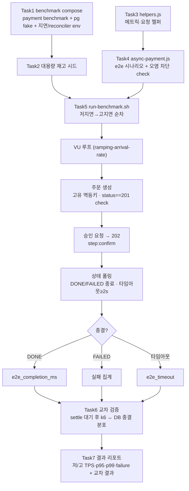

# 비동기 결제 경로 k6 부하 측정 구현 플랜

> 작성일: 2026-06-15

## 요약 브리핑

### 1. Task 목록

1. **docker-compose.benchmark.yml override** — 측정 전용 스택(payment benchmark profile + pg fake gateway + 저/고지연 env + reconciler timeout·scan 단축으로 settle 창 결정론화)
2. **벤치 전용 대용량 재고 시드** — 측정 상품 재고를 부하 총량보다 크게 정렬(redis + RDB), 부하 중 고갈 방지
3. **k6 helpers.js** — 커스텀 메트릭(e2e 완료 시간·타임아웃·처리량) + 요청 헬퍼(고유 멱등키 checkout / 임의 paymentKey confirm / DONE·FAILED 종료 폴링)
4. **k6 async-payment.js** — 단일 e2e 시나리오(주문 생성 → 승인 접수 → 상태 폴링), 단계 태깅 + 오염 차단 check(중복 200 없음·재고부족 400 없음)
5. **run-benchmark.sh** — 저/고지연 2환경 순차 실행(환경별 재시드·헬스체크) + testid 태깅 + 결과 JSON 분리
6. **교차 검증(verify-settlement.sh)** — settle 대기 후 DB 결제 종결 분포 ↔ k6 카운트 교차식(QUARANTINED·지연종결 분해)
7. **측정 실행 + 결과 리포트** — 풀스택 기동·smoke run·본 측정·교차 검증 후 저/고 지표 리포트(환경 의존, 사용자 협조)

### 2. 변경 후 전체 플로우차트

### 3. 핵심 결정 → Task 매핑

| topic 결정 | Task |
|---|---|
| 실행 환경(benchmark compose) / settle 창(reconciler 단축) | T1 |
| 측정 재고(고갈 방지) | T2 |
| 측정 지표 정의 / 멱등키 / paymentKey / 폴링 / 부하 모델 | T3, T4 |
| 측정 단위 / 동기·e2e 지표 / QUARANTINED 처리(baseline) | T4 |
| 벤더 지연 2환경 | T1, T5 |
| 검증(교차식·settle) | T6 |
| 산출물(스크립트·리포트) | T5, T7 |

### 4. 트레이드오프 / 후속 작업

- Task 7 측정 실행은 로컬 풀스택 + k6 설치 필요(환경 의존, 사용자 협조). 스크립트 작성(T1~T6)과 실측(T7) 분리
- 부하 곡선 최종값·폴링 타임아웃·reconciler 단축 구체값은 execute에서 실측 보정
- 재고 정합성 교차·Toxiproxy 장애 주입·자원 정밀화는 본 측정의 후속 토픽

---

## 목표

비동기 단일 결제 경로(checkout→confirm 202→status 폴링 DONE/FAILED)를 저/고지연 2환경에서 측정하는 k6 자산(스크립트·compose override·시드·교차 검증)을 신규 작성하고, baseline 측정 결과 리포트를 산출한다.

## 컨텍스트

- 설계 문서: `docs/topics/K6-ASYNC-BENCHMARK.md`
- 측정 엔드포인트: `PaymentController` — `POST /api/v1/payments/checkout`(Idempotency-Key) / `POST /api/v1/payments/confirm`(202) / `GET /api/v1/payments/{orderId}/status`
- 요청 형식: `CheckoutRequest{userId, orderedProductList[{productId, quantity}], gatewayType}` / `PaymentConfirmRequest{userId, orderId, amount, paymentKey, gatewayType}`
- 응답 형식: `PaymentStatusApiResponse{orderId, status(PENDING|PROCESSING|DONE|FAILED), approvedAt}`
- 주요 신규 파일: `docker/docker-compose.benchmark.yml`, `scripts/k6/{helpers.js, async-payment.js, run-benchmark.sh}`, `scripts/bench-seed-stock.sh`, 결과 리포트(토픽 산출물)
- 기존 패턴 재사용: `docker-compose.smoke.yml`(fake gateway env), `scripts/seed-stock.sh`(RDB→redis SET), `scripts/compose-up.sh`(`--mode fake` override)
- 제약: k6 미설치(측정 실행 전 설치 필요), seed는 user/product 각 1건 + product qty=100(부하에 부족)

## 진행 상황

- [x] Task 1: docker-compose.benchmark.yml override 신설
- [x] Task 2: 벤치 전용 대용량 재고 시드 스크립트
- [x] Task 3: k6 helpers.js (상수·메트릭·요청 헬퍼)
- [x] Task 4: k6 async-payment.js (e2e 시나리오)
- [x] Task 5: run-benchmark.sh (저/고 2환경 오케스트레이션)
- [ ] Task 6: 교차 검증 절차 (DB 종결 카운트 ↔ k6)
- [ ] Task 7: 측정 실행 + 결과 리포트

## 태스크

### Task 1: docker-compose.benchmark.yml override 신설 [tdd=false] [domain_risk=false]

**구현 (GREEN)**
- `docker/docker-compose.benchmark.yml` 신설 (compose 파일은 smoke override와 분리하되, pg는 smoke profile의 fake gateway 설정을 재사용; apps.yml 위에 override):
  - `payment-service.environment`: `SPRING_PROFILES_ACTIVE: docker,benchmark` + settle 창 결정론화 2종 — `RECONCILER_IN_FLIGHT_TIMEOUT_SECONDS: "${RECONCILER_TIMEOUT:-30}"`(IN_PROGRESS cutoff) + `RECONCILER_FIXED_DELAY_MS: "${RECONCILER_SCAN_MS:-15000}"`(scan 주기 — 기본 120s 그대로면 settle 창이 scan 틱에 좌우됨). 두 키 모두 yml 미정의·코드 default(`reconciler.in-flight-timeout-seconds:300` / `reconciler.fixed-delay-ms:120000`)만 존재 → relaxed binding env 주입
  - `pg-service.environment`: `SPRING_PROFILES_ACTIVE: docker,smoke`(fake gateway 활성화 목적 smoke profile 재사용) + `PG_GATEWAY_TYPE: fake` + `PG_GATEWAY_FAKE_LATENCY_MIN_MILLIS: "${FAKE_LATENCY_MIN:-100}"` + `PG_GATEWAY_FAKE_LATENCY_MAX_MILLIS: "${FAKE_LATENCY_MAX:-300}"` + `PG_GATEWAY_FAKE_FAIL_RATE: "${FAKE_FAIL_RATE:-0}"` + Toss/NicePay placeholder 키
- 헤더 주석: 용도(부하 측정 전용) + 실행 예시(infra+apps+observability+benchmark compose 조합) + "compose 파일은 smoke와 분리, pg는 smoke profile fake 설정 재사용" 명시 + prod 금지 경고

**완료 기준**
- `docker compose -f docker/docker-compose.infra.yml -f docker/docker-compose.apps.yml -f docker/docker-compose.benchmark.yml config` 가 에러 없이 렌더되고, payment에 `benchmark` profile + reconciler timeout/scan env, pg에 fake gateway + latency env가 반영됨
- 기동 후 payment 컨테이너에서 reconciler timeout/scan override가 **실제 주입돼 단축 동작**함(키가 코드 default만 존재하므로 env 바인딩 동작 확인 — 로그 또는 actuator env)
- 기존 `docker-compose.smoke.yml` 무변경(분리 확인)

**매핑**: 결정 "실행 환경"(benchmark compose override), "벤더 지연 2환경"(latency env), "QUARANTINED 처리"(failRate=0 기본), settle 창(reconciler timeout+scan 단축)

**완료 결과**
- `docker/docker-compose.benchmark.yml` 신설.
- `docker compose config` 렌더 에러 없음.
- payment: `SPRING_PROFILES_ACTIVE=docker,benchmark`, `RECONCILER_IN_FLIGHT_TIMEOUT_SECONDS=30`(기본), `RECONCILER_FIXED_DELAY_MS=15000`(기본) 반영 확인.
- pg: `SPRING_PROFILES_ACTIVE=docker,smoke`, `PG_GATEWAY_TYPE=fake`, latency 100~300ms(기본), `FAKE_FAIL_RATE=0`(baseline) 반영 확인.
- 기존 `docker-compose.smoke.yml` 무변경.

---

### Task 2: 벤치 전용 대용량 재고 시드 스크립트 [tdd=false] [domain_risk=false]

**구현 (GREEN)**
- `scripts/bench-seed-stock.sh` 신설:
  - 측정 상품(product id=1)의 product RDB `stock.quantity` 를 부하 총량보다 크게 UPDATE(예: `${BENCH_STOCK:-10000000}`)
  - 동일 값으로 redis-stock `stock:{productId}` SET (RDB=SoT 정합 유지, `seed-stock.sh` SET 로직 재사용)
  - 멱등(반복 실행 시 동일 값 덮어쓰기)
- `scripts/common.sh` 헬퍼(색상/print) 재사용

**완료 기준**
- 스크립트 실행 후 `redis-cli GET stock:1` == product RDB `stock.quantity` == 대용량 값
- 부하 총량(RPS × 측정 시간)보다 충분히 큰 기본값

**매핑**: 결정 "측정 재고"(고갈 방지), 장애 "재고 고갈"

**완료 결과**
- `scripts/bench-seed-stock.sh` 신설, 실행 권한 부여(chmod +x).
- `bash -n` 문법 검증 통과.
- product RDB `stock.quantity` UPDATE(`BENCH_STOCK` 기본값 10,000,000) → `ROW_COUNT()` 0이면 exit 1(대상 없음 조기 차단).
- redis-stock `stock:{productId}` SET 후 GET 으로 정합 재확인, 불일치 시 exit 1.
- `BENCH_STOCK` / `PRODUCT_ID` 환경 변수로 덮어쓰기 가능, 반복 실행 멱등.

---

### Task 3: k6 helpers.js (상수·메트릭·요청 헬퍼) [tdd=false] [domain_risk=false]

**구현 (GREEN)**
- `scripts/k6/helpers.js` 신설:
  - 커스텀 메트릭: `Trend e2e_completion_ms`, `Counter e2e_timeout`, `Counter confirm_requests`, `Counter checkout_duplicate`(checkout 응답 **status==200** 카운트 — 중복. 신규는 201. 응답 body에 `isDuplicate` 필드 없음 → status로 판별), `Counter confirm_rejected`(재고 부족 confirm 응답 **status==400** 카운트 — `PaymentOrderedProductStockException`→`PaymentExceptionHandler` BAD_REQUEST)
  - 부하 곡선 상수: `RAMPING_ARRIVAL_RATE_STAGES`(baseline 100→200→400 req/s, 측정하며 조정)
  - 요청 헬퍼: `uniqueIdempotencyKey()`(`${VU}-${ITER}-${uuid}` 형태), `doCheckout()`(고유 Idempotency-Key 헤더 + step:checkout 태깅), `doConfirm()`(임의 paymentKey + step:confirm 태깅), `pollStatus()`(간격·최대 폴링 시간 인자, DONE/FAILED 종료, 타임아웃 하한 ≥ outbox 폴백 2s)
  - BASE_URL/userId/productId/amount 등 env 기반 상수

**완료 기준**
- `k6 run` 시 import 에러 없음(문법 검증). 헬퍼가 위 4 엔드포인트 호출 형태를 정확히 구성(DTO 필드 일치)
- 폴링 종료 조건이 DONE 또는 FAILED, 타임아웃 시 `e2e_timeout` increment

**매핑**: 결정 "측정 지표 정의", "checkout 멱등키", "paymentKey", "status 폴링", "부하 모델"

**완료 결과**
- `scripts/k6/helpers.js` 신설.
- 커스텀 메트릭 5종: `e2e_completion_ms`(Trend), `e2e_timeout`(Counter), `confirm_requests`(Counter), `checkout_duplicate`(Counter), `confirm_rejected`(Counter).
- 환경 상수: `BASE_URL`, `USER_ID`, `PRODUCT_ID`, `QUANTITY`, `AMOUNT`, `GATEWAY_TYPE`, `POLL_INTERVAL_MS`, `POLL_TIMEOUT_MS`(`__ENV` 기반, 기본값 제공).
- 부하 곡선 상수: `RAMPING_ARRIVAL_RATE_STAGES`(baseline 100→200→400 req/s, 쿨다운 포함 4단계).
- 요청 헬퍼 3종: `uniqueIdempotencyKey()`(`${VU}-${ITER}-${uuid}`), `doCheckout()`(고유 Idempotency-Key + step:checkout 태깅 + 중복 200 카운트), `doConfirm()`(임의 paymentKey + step:confirm 태깅 + confirmRequests/confirmRejected 카운트), `pollStatus()`(간격·타임아웃 인자, DONE/FAILED 종료, 하한 2000ms 보장, 타임아웃 시 e2eTimeout inc).
- CheckoutRequest/PaymentConfirmRequest/PaymentStatusApiResponse DTO 필드 정확 일치 확인.
- k6 미설치 환경 — 순수 JS 로직(generateUUID, parseJSON, 상수 검증)은 Node.js v26.3.0으로 정적 검증 통과.

---

### Task 4: k6 async-payment.js (e2e 시나리오) [tdd=false] [domain_risk=true]

**구현 (GREEN)**
- `scripts/k6/async-payment.js` 신설:
  - `options.scenarios`: `ramping-arrival-rate` executor + helpers 의 stages
  - `options.thresholds`: `http_req_duration{step:confirm}` p95/p99, `e2e_completion_ms` p95/p99, `checks` rate, `e2e_timeout` 상한
  - VU 함수: `doCheckout`(고유 멱등키) → 응답 **status==201**(신규, 중복은 200) check → `doConfirm`(202 check, `confirm_requests` inc) → confirm 202 시각 기록 → `pollStatus` → DONE 시 `e2e_completion_ms` 기록 / FAILED 집계 / 타임아웃 `e2e_timeout`
  - checks: checkout status==201(중복 200 아님), confirm 202, 재고 부족 confirm **400** 미발생
  - `handleSummary`: `testid`(env CASE_NAME) 별 결과 JSON

**완료 기준**
- 소규모 smoke run(낮은 RPS, 짧은 시간)에서: 성공률(checks) 100%, checkout status==201 100%(중복 200 없음), confirm_rejected(400) ≈ 0, e2e_completion_ms 정상 수집
- 종결을 DONE/FAILED로 정확히 잡고 무한 폴링 없음

**매핑**: 결정 "측정 단위", "동기 응답 시간", "e2e 완료 시간", "checkout 멱등키", "QUARANTINED 처리"(baseline failRate=0). discuss 리스크: 멱등키 충돌(F1)·재고 고갈(F2)·QUARANTINED 폴링 맹점(F3) 차단을 시나리오·check로 구현

**domain_risk 근거**: 측정이 결제 정합성을 왜곡 없이 반영해야 함 — 멱등키 충돌로 인한 캐시 hit 오염, 재고 고갈로 인한 REJECTED, QUARANTINED의 e2e_timeout 오분류를 check/baseline 설정으로 차단

**완료 결과**
- `scripts/k6/async-payment.js` 신설.
- `options.scenarios`: `ramping-arrival-rate` executor + `RAMPING_ARRIVAL_RATE_STAGES`(helpers 공유 상수) 연결.
- `options.thresholds`: `http_req_duration{step:confirm}` p95<3s/p99<5s, `e2e_completion_ms` p95<15s/p99<30s, `checks` rate>0.99, `e2e_timeout` count<100.
- VU 함수 오염 차단 3종: checkout status==201 check(F1 멱등키 충돌), confirm 400 미발생 check(F2 재고 고갈), 폴링은 DONE/FAILED만 종결(F3 QUARANTINED 맹점).
- helpers export 정확 사용: `doCheckout`(멱등키 자동 생성 + 중복 200 내부 카운트), `doConfirm`(confirmRequests/confirmRejected 내부 카운트), `pollStatus`(e2eTimeout 내부 증가).
- e2e_completion_ms: confirm 202 시각 기록 기준점부터 pollStatus 종결까지 기록.
- `handleSummary`: `CASE_NAME` env 별 `results/{caseName}.json` 출력 + stdout 텍스트 요약.
- Node.js v26.3.0 `--check`로 구문 검증 통과. k6 미설치 환경(Task 7에서 smoke run 검증).

---

### Task 5: run-benchmark.sh (저/고 2환경 오케스트레이션) [tdd=false] [domain_risk=false]

**구현 (GREEN)**
- `scripts/k6/run-benchmark.sh` 신설:
  - 의존 서비스 헬스체크 선행(`docs/smoke/infra-healthcheck.md` 패턴 또는 `smoke-all.sh` Phase 1 재사용)
  - 저지연 환경: `FAKE_LATENCY_MIN=100 FAKE_LATENCY_MAX=300` 으로 pg 재기동 → `bench-seed-stock.sh` → k6 `CASE_NAME=async-low` 실행 → 결과 `results/async-low.json`
  - 고지연 환경: `FAKE_LATENCY_MIN=800 FAKE_LATENCY_MAX=1500` 으로 pg 재기동 → 재시드 → k6 `CASE_NAME=async-high` → `results/async-high.json`
  - `FAKE_FAIL_RATE=0` 고정(baseline)
  - `--tag testid=<case>` 로 Grafana 필터 가능

**완료 기준**
- 스크립트가 저/고 2환경을 순차 실행하고 `results/async-{low,high}.json` 2개 생성
- 각 환경 전 재시드 + 헬스체크가 선행됨(고갈/미기동 방지)

**매핑**: 결정 "벤더 지연 2환경", "측정 재고"(환경별 재시드), "산출물"

**완료 결과**
- `scripts/k6/run-benchmark.sh` 신설, 실행 권한 부여(chmod +x).
- `bash -n` 문법 검증 통과.
- 저지연 환경(100~300ms): pg 재기동 → 재시드 → k6 `CASE_NAME=async-low` → `results/async-low.json`.
- 고지연 환경(800~1500ms): pg 재기동 → 재시드 → k6 `CASE_NAME=async-high` → `results/async-high.json`.
- `FAKE_FAIL_RATE=0` 고정(baseline).
- `--tag testid=<case>` 로 Grafana 필터 가능.
- 사전 확인: k6 미설치 시 설치 가이드(brew/Linux URL) 안내 후 exit 1.
- 의존 서비스 헬스체크: `smoke-all.sh` Phase 1(infra + kafka topic) 선행.
- pg 재기동: benchmark compose 4-파일 조합(`infra+apps+obs+benchmark`) + `--no-build --force-recreate pg-service`.
- pg healthy 대기 후 재시드, 재시드 완료 후 k6 실행 순서 보장.
- k6 실행 CWD: ROOT_DIR(results/ 경로 일치를 위해 `cd ${ROOT_DIR}` 후 실행).
- `common.sh` `print_*` / `check_docker` 헬퍼 재사용.

---

### Task 6: 교차 검증 절차 (DB 종결 카운트 ↔ k6) [tdd=false] [domain_risk=true]

**구현 (GREEN)**
- `scripts/k6/verify-settlement.sh` 신설(또는 run-benchmark.sh 말미 단계):
  - settle 대기 = reconciler in-flight-timeout(단축) + **1 scan 틱 상한(최악 ≈ 단축 scan 주기 — 이벤트가 scan 직후 IN_PROGRESS 진입 시 다음 회수까지 timeout+거의 1주기 소요, Task 1 `RECONCILER_FIXED_DELAY_MS`)** + OutboxWorker(2s) + pg 왕복 여유. scan 주기를 안 줄이면 기본 120s 틱이 settle 창을 좌우하므로 Task 1에서 timeout과 함께 단축한 값을 기준으로 산출. 스냅샷 직전 reconciler 복원 완료 로그 1회 확인(경계 타이밍 오탐 차단 가드)
  - payment DB 집계: `payment_event` status 별 카운트(DONE/FAILED/QUARANTINED/그 외 미종결)
  - k6 결과 JSON에서 DONE/FAILED/e2e_timeout 카운트 추출
  - 교차식 출력: `k6(DONE+FAILED+timeout) == DB(DONE+FAILED+QUARANTINED+미종결)`, `k6(DONE) == DB(DONE)` 정상 여부
  - 불일치 시 지연종결(e2e_timeout 중 settle 후 DONE) vs 진짜 유실(settle 후에도 미종결) 구분 안내
  - QUARANTINED>0이면 baseline(failRate=0)에서 PG 경로 발생 불가이므로 CACHE_DOWN(redis-stock 헬스) 의심 트리아지 안내

**완료 기준**
- 스크립트가 settle 후 DB 종결 분포 + k6 카운트 교차식을 출력하고, baseline에서 `k6(DONE) == DB(DONE)` 및 QUARANTINED=0 확인
- 미종결 잔여분만 유실 후보로 표기

**매핑**: 결정 "검증"(교차식 분해), 장애 "지연 종결"(settle 대기), "QUARANTINED 처리"

**domain_risk 근거**: silent loss(조용한 유실) 탐지 정합성 — 교차식이 QUARANTINED/지연종결을 분해하지 않으면 정상 지연을 유실로 오탐하거나 진짜 유실을 놓침

**완료 결과**
> (execute에서 채움)

---

### Task 7: 측정 실행 + 결과 리포트 [tdd=false] [domain_risk=false]

**구현 (GREEN)** — 환경 의존(로컬 docker compose 풀스택 + k6 설치 필요, 사용자 협조)
- k6 설치 확인 + 풀스택 기동(infra+apps+observability+benchmark compose)
- smoke run으로 스크립트 정합성 선확인(Task 4 완료 기준 항목)
- `run-benchmark.sh` 로 저/고 2환경 본 측정 → `verify-settlement.sh` 교차 검증
- 결과 리포트(토픽 산출물 `docs/topics/` 또는 결과 전용 md) 작성: 저/고 환경별 confirm 응답 p95/p99, e2e_completion_ms p95/p99, TPS, failure rate + 교차 검증 결과 + 해석(비동기 고지연 내성)

**완료 기준**
- 결과 리포트에 저/고 2환경 핵심 지표 + 교차 검증 통과 여부 기록
- baseline 성공률 100% / QUARANTINED 0 / REJECTED ≈ 0 충족(미충족 시 원인 기록)

**매핑**: 결정 "산출물"(결과 리포트), "검증"

**완료 결과**
> (execute에서 채움)

## plan 게이트 처리 (R1)

R1 reviewer + domain-expert 모두 revise. 8 findings 반영(PLAN + topic 동시 정정).

| # | 출처 | 등급 | finding | 반영 |
|---|---|---|---|---|
| 1 | reviewer | major | checkout 중복 판별이 `isDuplicate` body 필드 전제이나 응답 DTO에 부재(실제 HTTP 200 중복/201 신규) | Task 3/4 + topic: status==201(중복 200) 기준으로 재기술 |
| 2 | reviewer | major | 재고 부족 confirm 응답이 409가 아니라 400(`PaymentExceptionHandler` BAD_REQUEST) | Task 3/4 + topic: 400 기준으로 정정 |
| 3 | reviewer | major | confirm "비점유 즉시 반환" 해석 오류(동기 재고차감+TX 후 202) | topic 결정 "동기 응답 시간" 이유 칸 정정 |
| 4 | reviewer | minor | `RECONCILER_IN_FLIGHT_TIMEOUT_SECONDS` 키가 yml 미정의(코드 default만) | Task 1 완료기준에 env 실제 주입 동작 확인 추가 |
| 5 | reviewer | minor | pg `docker,smoke` profile이 "smoke 분리" 의도와 불일치 | Task 1 주석: compose 파일 분리/pg는 smoke fake 설정 재사용 명시 |
| 6 | domain | major | settle 결정론화가 reconciler scan 주기(`fixed-delay-ms` 120s) 누락 → 오탐 잔여 | Task 1 `RECONCILER_FIXED_DELAY_MS` 단축 추가 + Task 6/topic 산출식에 scan 항 명시 |
| 7 | domain | minor | 멱등키 TTL 표기(IN_PROGRESS 마커 vs 결과값 TTL) 뭉뚱그림 | 고유 키 정책으로 충돌 0이라 무해 — 차단책 유지, 표기만 인지 |
| 8 | domain | minor | QUARANTINED>0 시 CACHE_DOWN 트리아지 누락 | Task 6에 "QUARANTINED>0이면 redis-stock 헬스 의심" 트리아지 추가 |

## plan 게이트 처리 (R2)

R2: **reviewer pass + domain-expert pass**. R1 findings 8건 모두 코드 사실 대조로 정확히 반영 확인. domain-expert 잔여 minor 1건(settle 대기값을 "timeout + 1 scan 틱 상한 + OutboxWorker + pg 왕복"으로 확정 + 스냅샷 직전 reconciler 복원 로그 확인)은 게이트 통과를 막지 않는 execute 보강 권고 → Task 6에 선반영.

## 리뷰 처리
> (ship 단계에서 채움 — finding별 채택/스킵 + 사유)
