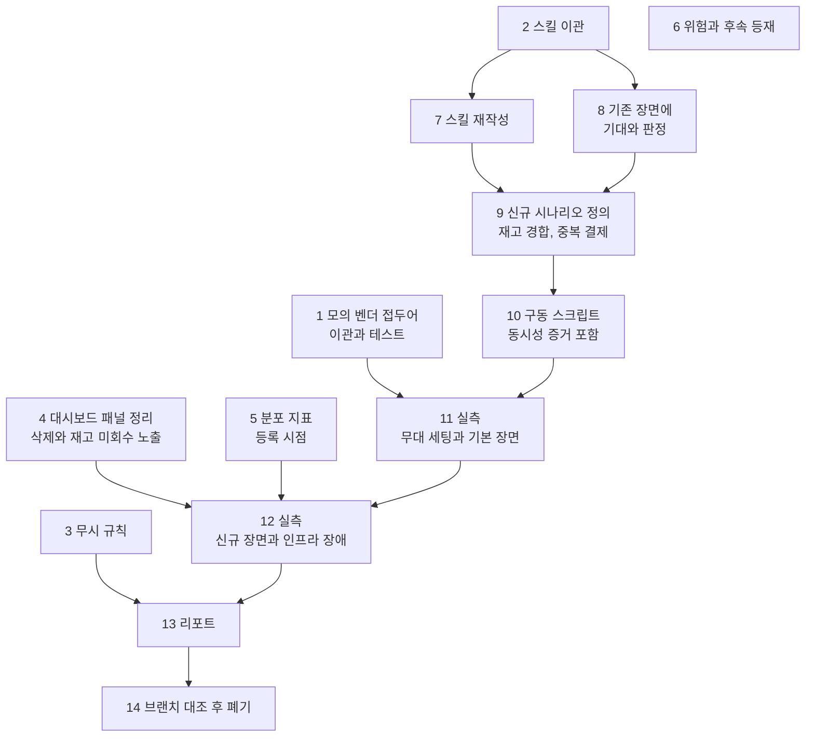

# 라이브 실측 체계 정식화 구현 플랜

> 작성일: 2026-07-28 · 이슈/브랜치 #128

## 요약 브리핑

### Task 목록

**자산을 main 으로 옮긴다** (1~3)
1. 모의 벤더 시나리오 접두어 이관과 단위 테스트 — 실패·재시도·자가 회복을 원하는 대로 일으키는 분기. 라이브로만 검증되면 조용히 깨진다
2. 실측 스킬과 캡처용 관측 설정 이관 — 원본 그대로. 개편은 뒤에서
3. 리포트와 캡처 원본 무시 규칙

**관측을 고친다** (4~5)
4. 대시보드 패널 정리 — 참조 지표가 사라진 패널 삭제, 재고 미회수 지표 패널 추가
5. 발행 대기 분포 지표 등록 시점 수정 — 적체가 없어 빈 것과 계측이 죽어 빈 것을 구분

**위험을 문서에 남긴다** (6)
6. 모의 벤더 오배포 위험과 후속 등재

**스킬을 검증 체계로 바꾼다** (7~10)
7. 스킬 본문 재작성 — 기준 다섯, 화면 판독을 에이전트의 일로
8. 기존 다섯 장면에 기대 결과와 판정 도입 — 재시도 근거를 로그에서 관리자 화면으로
9. 신규 검증 시나리오 두 종 — 재고 경합, 중복 결제 차단
10. 결제 구동 스크립트 — 동시 요청과 발사 시각 증거 포함

**실측하고 남긴다** (11~14)
11. 무대 세팅과 기본 장면
12. 신규 장면과 인프라 장애
13. 리포트 작성
14. 실측 브랜치 대조 후 폐기

### 태스크 의존 순서

### 핵심 결정과 태스크 매핑

| 설계 결정 | 태스크 |
|---|---|
| 실측 자산은 main, 브랜치는 폐기 | 2, 14 |
| 리포트와 캡처는 저장소 밖 로컬 보관 | 3, 13 |
| 1차 산출물 폐기, 새 실측만으로 리포트 구성 | 13, 14 |
| 스킬을 검증 체계로 재작성, 기준 다섯을 싣는다 | 7 |
| 판정은 장면 정의 안에 | 8, 9 |
| 화면 판독은 에이전트가 | 7 |
| 결제 구동은 스크립트, 캡처는 명령 기록 | 10 |
| 모의 벤더 접두어는 테스트와 함께 main 에 | 1 |
| 모의 벤더 오배포 위험은 한계로 등재 | 6 |
| 중복 결제는 주문 생성 멱등키로 | 9 |
| 대시보드 빈 패널 처리 | 4, 5 |

### 트레이드오프와 후속

- **Task 4 가 삭제와 추가를 함께 한다.** 재고 미회수 지표를 볼 화면이 없으면 그 판정이 원본 쿼리나 로그로 밀려나, 스스로 세운 "화면이 말하게 한다"를 계획 단계부터 어기게 된다
- **경합 전용 상품을 쓴다.** 실행 직전 재시드는 사람이 기억해야 하는 단계라, 순서에 관계없이 안전한 쪽을 택했다
- **좀비 회수는 구조적 한계가 있다.** 모의 벤더가 처리 상태를 메모리에만 둬서, "벤더는 승인했는데 우리 쪽만 죽은" 분기는 재현되지 않는다. 넣는다면 한계를 함께 적는다
- 승인 동시 재호출이 남기는 가짜 재고 미회수 신호, 모의 벤더 오배포 부팅 차단 가드는 후속으로 뺀다

---

## 목표

실측 자산이 main 에 상주해 브랜치 이동 없이 발동하고, 장면마다 기대 결과와 판정이 있는 체계로 결제 전 구간을 검증해 리포트를 남긴다.

## 컨텍스트

- 설계 문서: `docs/topics/LIVE-DRILL-FORMALIZATION.md`
- 1차 산출물 보관: `.archive/live-drill-round1/` (저장소 밖)
- 이관 원본: `drill/payment-e2e-live` 브랜치 (main 위로 재배치된 상태, 9커밋)
- 주요 변경 파일
  - `.claude/skills/payment-live-drill/**` (이관 + 재작성 + 신규 스크립트)
  - `pg-service/.../gateway/fake/FakePgGatewayStrategy.java` (+ 테스트)
  - `payment-service/.../metrics/PaymentOutboxMetrics.java` (+ 테스트)
  - `observability/grafana/dashboards/business-dashboard.json`
  - `docker/docker-compose.live-drill.yml`, `.gitignore`
  - `docs/context/CONCERNS.md`, `docs/context/TODOS.md`

**실측 수행 태스크(Task 11~13)의 성격** — 산출물(리포트, 캡처)이 저장소 밖에 남는다. 커밋되는 것은 플랜 진행 상황과, 실측 중 발견해 고친 것뿐이다. 또한 라이브 구동과 화면 판독이 필요해 서브에이전트에 위임하지 않고 메인이 수행한다.

## 진행 상황

- [x] Task 1: 모의 벤더 시나리오 접두어 이관과 단위 테스트
- [x] Task 2: 실측 스킬과 캡처용 관측 설정 이관
- [ ] Task 3: 리포트와 캡처 원본 무시 규칙
- [ ] Task 4: 대시보드 패널 정리 — 죽은 패널 삭제와 재고 미회수 지표 노출
- [ ] Task 5: 발행 대기 분포 지표 등록 시점 수정
- [ ] Task 6: 모의 벤더 오배포 위험과 후속 등재
- [ ] Task 7: 스킬 본문을 검증 체계로 재작성
- [ ] Task 8: 기존 장면에 기대 결과와 판정 도입
- [ ] Task 9: 신규 검증 시나리오 두 종 정의
- [ ] Task 10: 결제 구동 스크립트
- [ ] Task 11: 실측 — 무대 세팅과 기본 장면
- [ ] Task 12: 실측 — 신규 장면과 인프라 장애
- [ ] Task 13: 리포트 작성
- [ ] Task 14: 실측 브랜치 대조 후 폐기

## 태스크

### Task 1: 모의 벤더 시나리오 접두어 이관과 단위 테스트 [tdd=true] [domain_risk=true]

근거 결정 — "모의 벤더 접두어는 main 에 포함하되 단위 테스트를 함께 추가".

접두어 분기가 라이브로만 검증되면 인접 변경에 조용히 깨진 채 실측이 진행되고, 리포트가 틀린 장면을 정상으로 기록한다.

**테스트 (RED)**
- `pg-service/src/test/java/.../gateway/fake/FakePgGatewayStrategyTest` 에 추가
  - `confirm_확정실패_접두어_NonRetryable_예외` — `fake-fail-` 접두어
  - `confirm_재시도_접두어_매호출_Retryable_예외` — `fake-retry-`, 연속 호출에도 계속 재시도 가능 실패
  - `confirm_자가회복_접두어_두번실패후_세번째_성공` — `fake-flaky-`, 회차 경계값
  - `confirm_자가회복_접두어_주문별_카운터_독립` — 서로 다른 주문번호가 카운터를 공유하지 않음
  - `자가회복_실패횟수가_재시도한도보다_작다` — **상수 관계를 못박는다.** 자가 회복 실패 횟수가 `RetryPolicy.MAX_ATTEMPTS` 이상이 되면 "자가 회복" 장면이 조용히 "격리" 장면으로 변질된다. 두 상수는 다른 파일에 있어 관계가 코드로 드러나지 않는다
- 기존 5개 케이스가 그대로 통과하는지 함께 확인 (접두어 분기가 기존 경로를 가로채지 않아야 함)

**구현 (GREEN)**
- `drill/payment-e2e-live` 의 `FakePgGatewayStrategy` 변경분을 적용
- 접두어 분기는 이미 처리된 주문 확인보다 **앞에** 위치 — 재시도 시나리오가 중복 처리로 흡수되지 않도록

**완료 기준**
- 신규 5 + 기존 5 케이스 통과
- `./gradlew :pg-service:test` 회귀 없음

**완료 결과**
> `drill/payment-e2e-live` 의 `FakePgGatewayStrategy` 변경분을 main 에 적용했다. `fake-fail-` / `fake-retry-` / `fake-flaky-` 접두어 분기를 `processedOrders` 중복 확인보다 앞에 배치해, 재시도 자기루프로 같은 주문이 돌아올 때마다 다시 실패하도록 했다. 자가 회복 실패 횟수(`DRILL_FLAKY_FAILURES_BEFORE_SUCCESS=2`)는 `RetryPolicy.MAX_ATTEMPTS`(4) 미만이어야 한다는 관계를 `자가회복_실패횟수가_재시도한도보다_작다` 테스트로 못박았다. 신규 5 + 기존 5 = `FakePgGatewayStrategyTest` 10건과 `:pg-service:test` 전체 356건이 통과한다.

---

### Task 2: 실측 스킬과 캡처용 관측 설정 이관 [tdd=false]

근거 결정 — "실측 자산 위치는 main". 브랜치를 찾아 이동해야 발동하는 절차는 체계가 아니다.

**구현**
- `.claude/skills/payment-live-drill/` 일체 (`SKILL.md`, `references/` 4개, `scripts/capture.sh`)
- `.claude/skills/README.md` 목록에 한 줄
- `docker/docker-compose.live-drill.yml` (캡처용 관측 도구 익명 조회 설정)
- **이 태스크는 원본을 그대로 옮긴다.** 검증 관점 재작성은 Task 7~9 에서 한다 — 이관과 개편을 한 커밋에 섞으면 무엇이 옮겨온 것이고 무엇이 새로 쓴 것인지 구분되지 않는다

**완료 기준**
- 스킬이 main 브랜치에서 목록에 잡힘
- `scripts/capture.sh` 실행 권한 유지

**완료 결과**
> `drill/payment-e2e-live` 에서 `.claude/skills/payment-live-drill/`(`SKILL.md`, `references/` 4개, `scripts/capture.sh`)와 `docker/docker-compose.live-drill.yml`을 원본 그대로 옮겼다. `scripts/capture.sh`의 실행 권한(`rwxr-xr-x`)은 `git checkout`으로 유지됐다. `.claude/skills/README.md`는 drill 브랜치 버전과 diff 대조해 스킬 한 줄만 "단독 호출 스킬" 표에 추가했고, "실측 브랜치 전용" 문구는 이번 이관으로 사실과 어긋나 제외했다(그 외 서술은 원본 그대로).

---

### Task 3: 리포트와 캡처 원본 무시 규칙 [tdd=false]

근거 결정 — "리포트와 캡처 원본은 저장소에서 제외, 로컬 보관".

**구현**
- `.gitignore` 에 실측 산출물 경로 추가 — 리포트와 캡처 원본 디렉토리
- 스킬이 만드는 산출물 위치와 규칙이 일치하는지 확인

**완료 기준**
- 실측 산출물 경로에 파일을 만들어도 `git status` 에 잡히지 않음
- 계획 문서 등 저장소에 남아야 할 것은 무시되지 않음

**완료 결과**
> (execute 에서 채움)

---

### Task 4: 대시보드 패널 정리 — 죽은 패널 삭제와 재고 미회수 지표 노출 [tdd=false] [domain_risk=true]

근거 결정 — "관측 대시보드 빈 패널은 이번 작업에 포함, pg 쪽은 삭제" / 기준 "화면이 말하게 한다, 운영자 화면 우선".

두 가지를 한다.

**삭제** — `pg_outbox.attempt_count 분포` 패널. 쿼리가 찾는 이름이 실제 지표와 어긋나 처음부터 맞은 적이 없고, 그 지표는 2026-07-28 제거됐다. 되살릴 대상이 없다.

**추가** — 재고 미회수 지표(`stock_retention_unrecovered_total`) 패널. 이 지표는 코드에 등록돼 있으나 대시보드에 패널이 하나도 없다. Task 9 의 재고 경합 판정이 이 값을 보는데, 화면이 없으면 실행 중에 원본 쿼리나 로그로 대체하게 되고 그것은 스스로 세운 원칙을 계획 단계에서부터 어기는 것이다.

**구현**
- `observability/grafana/dashboards/business-dashboard.json` — 해당 패널 제거, 재고 미회수 카운터 패널 추가(격리 섹션 근처)
- **누적 원값으로 노출한다.** 이 지표는 초기화 없이 쌓이기만 하는 카운터이고, 판정은 "0 이냐 아니냐"라는 단조 사실을 보는 것이므로 시점에 무관해야 한다. 같은 대시보드에 시간 윈도우 증가율로 그리는 패널들이 있어 그대로 따라 하기 쉬운데, 그러면 실제로 미회수가 있었어도 윈도우를 지나면 0 으로 보여 오판한다
- 제거·추가 후 패널 배치가 깨지지 않는지 확인

**완료 기준**
- 대시보드 JSON 이 유효하고, 삭제된 지표를 참조하는 쿼리가 남아 있지 않음
- 재고 미회수 패널이 **누적 원값**을 보여줌 — 증가율이나 시간 윈도우 함수를 쓰지 않음
- 값이 화면에 표시됨 (0 이든 아니든)

**완료 결과**
> (execute 에서 채움)

---

### Task 5: 발행 대기 분포 지표 등록 시점 수정 [tdd=true] [domain_risk=true]

근거 결정 — "payment 쪽은 계측 등록 시점 수정".

`PaymentOutboxMetrics` 가 대기 중인 발행 행을 순회하며 그 안에서만 분포 지표를 등록한다. 행이 하나도 없으면 등록 자체가 일어나지 않아 시계열이 존재하지 않고, 화면에서 "적체가 없어 비었다"와 "계측이 죽어 비었다"가 구분되지 않는다. 이 패널은 승인 발행이 밀렸을 때 그것을 알려주는 통로다.

**테스트 (RED)**
- `payment-service/src/test/java/.../metrics/PaymentOutboxMetricsTest` 에 추가
  - `refresh_대기행_없어도_분포지표가_등록됨` — 대기 행 0건으로 갱신한 뒤 레지스트리에서 해당 지표를 찾을 수 있어야 함
  - `refresh_대기행_있으면_회차가_기록됨` — 기존 기록 동작과 값의 의미가 그대로인지

**구현 (GREEN)**
- 분포 지표 등록을 생성자로 옮겨 1회 수행하고, 필드로 보관해 순회에서는 기록만
- 대상 클래스는 `PaymentOutboxMetrics` — 같은 패키지의 `OutboxPendingAgeMetrics` 는 별개이며 이번 범위가 아니다

**완료 기준**
- 신규 2 + 기존 케이스 통과
- `./gradlew :payment-service:test` 회귀 없음

**완료 결과**
> (execute 에서 채움)

---

### Task 6: 모의 벤더 오배포 위험과 후속 등재 [tdd=false]

근거 결정 — "모의 벤더 오배포 위험은 수용된 한계로 등재, 부팅 차단은 후속" / "승인 동시 재호출 오탐은 후속 등재".

**구현**
- `docs/context/CONCERNS.md` — 모의 벤더 오배포 위험. 설정값이 환경변수로 덮이는 구조, 이 전략이 벤더 종류를 가리지 않는다는 점, 탐지 수단이 부팅 로그뿐이라는 점. **이 코드가 이번에 만든 것이 아니라 이미 운영 중이라는 사실**을 함께 적어 우선순위 판단을 흐리지 않게 한다
- `docs/context/TODOS.md` — 두 건
  - 부팅 시 환경 조합 검사 가드 (어떤 환경을 정상으로 볼지 정하는 논의가 선행)
  - 승인 동시 재호출이 남기는 가짜 재고 미회수 신호 — 확정 실패와 중복 차단 패배를 같은 신호로 묶어 관측 정확성을 떨어뜨림

**완료 기준**
- 두 문서에 항목이 등재되고, 각 항목이 근거 파일과 줄 번호를 가리킴

**완료 결과**
> (execute 에서 채움)

---

### Task 7: 스킬 본문을 검증 체계로 재작성 [tdd=false]

근거 결정 — "스킬 성격은 검증 체계로 재작성" / "화면 판독은 에이전트가 수행" / "실측 기준 5개는 스킬로 이전" / "1차 계획 문서와 재개 메모는 폐기하고 알맹이를 스킬로 흡수".

**구현**
- `SKILL.md` — 목적을 "기록 남기기"에서 "의도대로 도는지 확인"으로. 기준 다섯을 싣는다(화면이 말하게 한다 / 운영자 화면 우선 / 판단을 남긴다 / 다시 돌릴 수 있다 / 못한 것을 적는다)
- 화면 판독을 에이전트의 일로 명시 — 비어 있는 패널, 앞뒤가 안 맞는 숫자, 예상과 다른 상태를 스스로 짚고 그 자리에서 원인을 추적
- 1차 계획 문서와 재개 메모(`.archive/live-drill-round1/PLAN.md`, `RESUME.md`)에서 재사용할 알맹이를 흡수 — 캡처 방식과 함정, 재개 절차. 문서가 둘이면 어긋난다

**완료 기준**
- 기준 다섯이 스킬 본문에 있음
- 1차 계획 문서를 참조하지 않고도 무대 세팅부터 캡처까지 수행 가능
- 화면 판독과 원인 추적이 에이전트의 일로 적혀 있음

**완료 결과**
> (execute 에서 채움)

---

### Task 8: 기존 장면에 기대 결과와 판정 도입 [tdd=false]

근거 결정 — "판정 위치는 장면 정의 안".

**구현**
- `references/scenarios.md` — 기존 다섯 장면(성공 / 실패와 보상 / 재시도와 격리 / 자가 회복 / 인프라 장애) 각각에 **기대 결과**를 명시하고, 실행 후 대조해 판정하는 흐름 도입
- **재시도와 격리 장면의 근거를 교체한다** — 현재 문서는 "관리자 화면에 시도 횟수가 없으므로 로그 조회가 근거"라고 적혀 있다. 관리자 시도 이력 화면이 생겼으므로 그 문구를 걷어내고 화면을 근거로 삼는다
- 재고 확정·되돌림 근거도 재고 화면으로. 다만 **되돌림은 캐시 안에서만 일어나 재고 화면에 드러나지 않는다** — 이 사실을 장면 정의에 적어 실행 중 혼란이 없게 한다
- `references/report.md` — 리포트에 판정 결과와 한계가 함께 남도록

**완료 기준**
- 다섯 장면 모두 기대 결과를 포함
- 로그·터미널을 근거로 지시하는 문구가 남아 있지 않음 (화면으로 안 되는 것은 그 사실이 명시됨)

**완료 결과**
> (execute 에서 채움)

---

### Task 9: 신규 검증 시나리오 두 종 정의 [tdd=false] [domain_risk=true]

근거 결정 — "검증 시나리오에 재고 경합과 중복 결제 차단을 더한다" / "중복 결제는 주문 생성 멱등키로 검증".

**구현**
- `references/scenarios.md` 에 두 장면 추가

**재고 경합** — 재고 100 에 동시 200 건. 판정 네 가지: 성공 정확히 100 / 성공+거절 합계 200 / 상품 서비스 정본 재고 0 / 재고 미회수 지표 0. 어느 하나라도 어긋나면 그 자체가 발견.

두 가지 전제를 장면 정의에 함께 적는다.

- **동시성 증거** — 판정 네 가지는 순차로 200 건을 넣어도 똑같이 나온다. 요청이 실제로 겹쳐 들어갔다는 근거(발사 시각 분포)를 함께 남기지 않으면 경합을 검증한 것이 아니다
- **재고 격리 — 전용 상품을 쓴다.** 선차감 캐시와 정본 재고는 기동 시 1회만 맞춰지고 이후 동기화가 없다. 기존 장면들은 모두 같은 상품 하나를 쓰고, 그 상품은 기본 장면(Task 11)에서 이미 재고가 소비된 상태다. 그대로 쓰면 "정확히 100" 전제가 깨지고, 판정 실패가 진짜 과매도인지 재고 오염인지 리포트 단계에서야 드러난다.
  **경합 전용 상품을 무대 세팅에서 함께 시드하고, 경합 구동은 그 상품만 쓴다.** "실행 직전에 재시드한다"는 사람이 기억해야 하는 단계라 채택하지 않는다 — 순서에 관계없이 안전한 쪽을 택한다

**중복 결제 차단** — 같은 주문 생성 멱등키로 두 번 요청해 주문이 하나만 생성. 승인 동시 재호출 경로는 쓰지 않으며 그 이유(정상 차단인데도 재고 미회수 신호를 남김)를 함께 적어 나중에 되살리지 않게 한다.

**완료 기준**
- 두 장면이 기대 결과와 판정 기준을 갖춘 형태로 스킬에 있음
- 재고 경합의 판정 네 가지와 전제 두 가지가 모두 명시됨
- 경합 전용 상품의 식별자가 장면 정의에 못박혀 있고, 무대 세팅 절차에 그 시드가 포함됨

**완료 결과**
> (execute 에서 채움)

---

### Task 10: 결제 구동 스크립트 [tdd=false] [domain_risk=true]

근거 결정 — "결제 구동은 스크립트화" / "캡처는 에이전트가 수행하되 실행 명령을 기록".

**구현**
- `.claude/skills/payment-live-drill/scripts/run-scenario.sh` — 시나리오별 결제 구동. 주문 생성, 승인, 최종 상태 확인. 시나리오는 결제 키 접두어로 선택
- `.claude/skills/payment-live-drill/scripts/run-concurrent.sh` — 동시 요청 구동. 재고 경합과 중복 결제용
  - **동시성 증거를 남긴다** — 각 요청의 발사 시각을 기록하고, 전부 몇 밀리초 안에 나갔는지 출력. 이 출력이 재고 경합 판정의 일부가 된다
  - 순차 실행으로 흐르지 않게 요청을 병렬로 띄운다
  - **경합 전용 상품을 기본값으로 박는다** — 사람이 인자로 지정해야 하면 잊었을 때 기본 장면이 쓰던 상품으로 흘러가 전제가 깨진다
  - 성공·거절 건수를 집계해 출력 — 판정 네 가지 중 둘을 스크립트가 바로 답하게
- 캡처 명령을 순서대로 기록할 위치와 형식을 스킬에 정한다

**완료 기준**
- 스크립트 한 번 실행으로 한 시나리오의 결제가 끝까지 진행되고 최종 상태가 출력됨
- 동시 구동 스크립트가 발사 시각 분포를 출력하고, 그 값으로 실제 겹침을 확인할 수 있음
- 동시 구동이 인자 없이 실행돼도 경합 전용 상품을 쓴다

**완료 결과**
> (execute 에서 채움)

---

### Task 11: 실측 — 무대 세팅과 기본 장면 [tdd=false] [domain_risk=true]

메인이 직접 수행한다. 산출물은 저장소 밖에 남는다.

**수행**
- 빌드 후 모의 벤더 모드로 스택 기동, 시드, 시작 상태 캡처. **시드에 경합 전용 상품을 포함한다**(Task 9 전제)
- 기본 장면 — 결제 성공(재고 확정 차감 포함) / 실패와 보상 / 재시도와 격리(알람 통지와 운영자 종결까지) / 재시도 자가 회복
- 각 장면마다 기대 결과와 대조해 판정하고, 어긋나면 원인을 추적

**완료 기준**
- 네 장면의 캡처와 판정이 남음
- 관리자 화면의 시도 이력과 재고 화면이 근거로 쓰임 — 로그나 터미널로 대체하지 않음
- 어긋난 것이 있으면 원인까지 기록

**완료 결과**
> (execute 에서 채움)

---

### Task 12: 실측 — 신규 장면과 인프라 장애 [tdd=false] [domain_risk=true]

**수행**
- 재고 경합 — 판정 네 가지 전부 확인. 경합 전용 상품으로 구동하고, 동시성 증거를 함께 남김. 재고 미회수는 Task 4 에서 붙인 누적 패널로 확인
- 중복 결제 차단
- 관측 연결 — 대시보드 지표에서 그 순간의 분산 추적으로 이동
- 인프라 장애 — 캐시, DB, 서비스, 브로커 중단과 복구. 알람 발화에서 통지, 해소까지
- 발행 적체 상황에서 Task 5 로 고친 패널이 실제로 값을 보이는지 확인
- 처리 중 프로세스 사망 시 회수가 화면에 드러나는지 확인
  - **구조적 한계를 미리 안다** — 모의 벤더는 처리 상태를 프로세스 메모리에만 둔다. 결제대행 서비스를 재기동하면 그 상태가 사라져, "벤더는 이미 승인했는데 우리 쪽만 죽은" 분기는 재현되지 않고 새 승인이 내려온다. 이 장면을 넣는다면 그 한계를 리포트에 함께 적고, 넣지 않는다면 이유를 적는다

**완료 기준**
- 신규 장면 판정 결과가 남음. 재고 경합은 동시성 증거를 포함
- 인프라 장애 각 종류가 맞는 알람으로 잡히고 통지까지 도달한 것이 확인됨
- 고친 패널의 동작 확인 결과가 남음

**완료 결과**
> (execute 에서 채움)

---

### Task 13: 리포트 작성 [tdd=false]

근거 결정 — "1차 산출물은 폐기하고 새 실측만으로 구성".

**구현**
- 장면별 기대와 실제, 판정을 담은 리포트. 1차 리포트를 고치는 것이 아니라 새로 쓴다
- 개선 과정은 서술로 — 각 장면에서 이 근거를 화면으로 볼 수 있게 되기까지 무엇이 있었나
- 확인하지 못한 것과 화면으로 증명할 수 없는 것을 한계로 명시. 선차감과 되돌림이 캐시 안에서만 일어나 재고 화면에 드러나지 않는다는 사실, 좀비 회수의 구조적 한계 포함
- 재현 경로(구동 스크립트, 캡처 명령 기록)를 가리킨다

**완료 기준**
- 모든 장면에 판정이 있음
- 개발자만 볼 수 있는 근거가 없거나, 남았다면 한계로 명시됨
- 리포트와 캡처가 저장소에 잡히지 않음

**완료 결과**
> (execute 에서 채움)

---

### Task 14: 실측 브랜치 대조 후 폐기 [tdd=false]

근거 결정 — "실측 브랜치는 폐기" / "1차 산출물은 폐기".

**구현**
- 삭제 **전에** 브랜치 트리와 (main + 로컬 보관) 을 파일 단위로 대조해 잃는 자산이 없음을 확인
- 확인 후 `drill/payment-e2e-live` 와 백업 브랜치 삭제

**완료 기준**
- 대조 결과가 기록됨 — 어떤 파일이 어디로 갔는지
- 브랜치 삭제 후에도 실측을 처음부터 수행할 수 있음

**완료 결과**
> (execute 에서 채움)

## 리뷰 처리

> (ship 단계에서 채움)
