# MSA-TRANSITION-PLAN

**토픽**: [MSA-TRANSITION](topics/MSA-TRANSITION.md)
**날짜**: 2026-04-20
**라운드**: 6 (전면 재작성 — §2-2b 재설계/ADR-30 outbox+ApplicationEvent+Channel+ImmediateWorker + ADR-05 보강 pg DB 부재 경로 amount 검증 + ADR-21 보강 business inbox amount 컬럼 + Phase 2 4단계 분할 완전 반영)

> **문서 분할 안내 (2026-04-23)**
> Phase 0~3 완료 태스크의 상세 블록과 `**완료 결과 —` 스냅샷은 [docs/archive/msa-transition/MSA-TRANSITION-PLAN-COMPLETED.md](archive/msa-transition/MSA-TRANSITION-PLAN-COMPLETED.md)로 이관됨. 본 문서에는 미착수·스킵·취소 태스크와 Phase 4·Phase 5 계획만 상세 유지. 추적 테이블 · ADR 매핑 · Round 2 변경 로그는 하단에 그대로 보존.

---

<!-- plan-review-4 반영 확인:
  F-01(Phase-5.2 아카이브 경로 docs/archive/msa-transition/ 디렉토리 형식) → Phase-5.2에 반영됨
  이전 plan에서 반영된 8건 minor:
  - M-4(PG DB 무상태 방침) → Phase-0.1 산출물에 유지
  - M-5(토픽 네이밍 규약) → Phase-2.3에 유지
  - C-1(user-service 모듈 신설) → Phase-3.1b에 유지
  - C-2(결제 서비스 측 어댑터 교체) → Phase-2.3b에 유지
  - S-1(재고 캐시 차감) → Phase-1.4d에 유지
  - S-2(StockCommitEvent 발행) → Phase-1.5b에 유지
  - S-3(Reconciler 재고 대조) → Phase-1.9, Phase-1.12에 유지
  - S-4(멱등성 Redis 이관) → Phase-0.1a에 유지
  discuss-domain-5 minor(amount BIGINT vs BigDecimal 변환 규약) → T2b-04 inbox 스키마 태스크에 흡수
-->

## 요약 브리핑

### 1. Task 목록 (Phase별)

**Phase 0 — 인프라 준비** (6개)

- ✅ T0-01 docker-compose 기반 인프라 정의 (Kafka·Redis·Gateway·관측성)
- ✅ T0-02 Idempotency 저장소 Caffeine → Redis 이관
- ✅ T0-03a 루트 멀티모듈 전환 (src → payment-service, subprojects 공통 블록)
- ✅ T0-03b Spring Cloud Gateway 서비스 모듈 신설
- ✅ T0-03c Eureka Server 서비스 모듈 신설 (자체 모듈 + compose 교체)
- ✅ T0-04 W3C Trace Context + LogFmt 공통 기반
- ⊗ ~~T0-05~~ Toxiproxy 장애 주입 도구 구성 — **완료 취소 (2026-04-23)**
- ✅ T0-Gate Phase 0 인프라 smoke 검증

**Phase 1 — 결제 코어 분리** (20개)

- ✅ T1-01 결제 서비스 모듈 경계 정리 (port 선언)
- ✅ T1-02 결제 서비스 모듈 신설 + port 계층 구성
- ✅ T1-03 Fake 구현체 신설 (application 계층 테스트용)
- ✅ T1-04 도메인 이관 (PaymentEvent·PaymentOutbox·RetryPolicy)
- ✅ T1-05 트랜잭션 경계 + 감사 원자성
- ✅ T1-06 AOP 축 결제 서비스 복제 이관
- ✅ T1-07 결제 서비스 Flyway V1 스키마
- ✅ T1-08 StockCachePort Redis 어댑터 (Lua atomic DECR)
- ✅ T1-09 중복 승인 응답 방어선 구현 (payment-service LVAL 한정)
- ✅ T1-10 StockCommitEventPublisher 구현
- ✅ T1-11a KafkaMessagePublisher + OutboxRelayService 구현
- ✅ T1-11b PaymentConfirmChannel + OutboxImmediateEventHandler 구현
- ✅ T1-11c OutboxImmediateWorker + OutboxWorker 구현 (SmartLifecycle)
- ✅ T1-12 QuarantineCompensationHandler + Scheduler
- ⊗ T1-13 FCG 격리 불변 + RecoveryDecision 이관 — **스킵**(T1-11c에서 OutboxProcessingService 삭제됨. FCG 로직은 pg-service로 이관되어 payment-service 내 검증 대상 부재. ADR-30에 따라 T2b-03에서 pg-service 내부 FCG 불변 재검증)
- ✅ T1-14 Reconciliation 루프 + Redis↔RDB 재고 대조
- ✅ T1-15 Graceful Shutdown + Virtual Threads 재검토
- ✅ T1-16 payment.outbox.pending_age_seconds 등 메트릭
- ✅ T1-17 재고 캐시 warmup (consumer와 orchestration 분리)
- ✅ T1-18 Gateway 라우팅: 결제 엔드포인트 교체
- ✅ T1-Gate Phase 1 결제 코어 E2E 검증

**Phase 2.a — pg-service 골격 + Outbox 파이프라인 + consumer 기반** (7개)

- ✅ T2a-01 pg-service 모듈 신설 + port 계층 + 벤더 전략 이관
- ✅ T2a-02 pg-service AOP 축 복제 이관
- ✅ T2a-03 Fake pg-service 구현 (테스트용)
- ✅ T2a-04 pg-service DB 스키마 (pg_inbox + pg_outbox Flyway V1)
- ✅ T2a-05a PgEventPublisher + PgOutboxRelayService 구현
- ✅ T2a-05b PgOutboxChannel + OutboxReadyEventHandler 구현
- ✅ T2a-05c PgOutboxImmediateWorker + PgOutboxPollingWorker 구현
- ✅ T2a-06 PaymentConfirmConsumer + consumer dedupe
- ✅ T2a-Gate Phase 2.a 마이크로 Gate

**Phase 2.b — business inbox 5상태 + amount 컬럼 + 벤더 어댑터 통합** (6개)

- ✅ T2b-01 PG 벤더 호출 + 재시도 루프 + available_at 지연 재발행
- ✅ T2b-02 PaymentConfirmDlqConsumer 구현 (DLQ 전용 consumer)
- ✅ T2b-03 pg-service 내부 FCG 구현
- ✅ T2b-04 business inbox amount 컬럼 저장 규약 구현
- ✅ T2b-05 중복 승인 응답 2자 금액 대조 + pg DB 부재 경로 방어
- ✅ T2b-Gate Phase 2.b 마이크로 Gate

**Phase 2.c — 전환 스위치 + 기존 reconciler 삭제** (3개)

- ✅ T2c-01 pg.retry.mode=outbox 활성화 스위치
- ✅ T2c-02 기존 reconciler · PG 직접 호출 코드 삭제 + 잔존 어댑터 정리
- ✅ T2c-Gate Phase 2.c 마이크로 Gate

**Phase 2.d — 관측 대시보드 활성화 + 결제 서비스 측 이벤트 소비** (4개)

- ✅ T2d-01 결제 서비스 측 Kafka consumer (payment.events.confirmed 소비)
- ✅ T2d-02 토픽 네이밍 규약 확정 + Outbox 관측 지표 + Grafana 대시보드
- ✅ T2d-03 Gateway 라우팅: PG 내부 API 격리
- ✅ T2d-Gate Phase 2.d 마이크로 Gate + Phase 2 통합 Gate

**Phase 3 — 상품·사용자 서비스 분리** (9개)

- ✅ T3-01 상품 서비스 모듈 신설 + 도메인 이관 + stock-snapshot 발행 훅
- ✅ T3-02 사용자 서비스 모듈 신설 + 도메인 이관
- ✅ T3-03 Fake 상품·사용자 서비스 구현
- ✅ T3-04 StockCommitConsumer + payment-service 전용 Redis 직접 SET
- ✅ T3-04b FAILED 결제 stock.events.restore 보상 이벤트 발행 (UUID 멱등)
- ✅ T3-05 보상 이벤트 consumer dedupe 구현
- ✅ T3-06 결제 서비스 ProductPort/UserPort → HTTP 어댑터 교체
- ✅ T3-07 Gateway 라우팅: 상품·사용자 엔드포인트 교체
- ✅ T3-Gate Phase 3 주변 도메인 + 보상 이벤트화 E2E 검증

**Phase 3.5 — 코드 클렌징 · 버그 수정 (Pre-Phase-4 안정화)** (14개, 2026-04-23 신설, 2026-04-24 T3.5-13 추가)

- ✅ T3.5-01 Phase 2 legacy residue 재평가·삭제 (PaymentGateway 참조 13파일, enum 컬럼 바인딩 경계)
- ✅ T3.5-02 @ConditionalOnProperty matchIfMissing 규약 통일 (Kafka 계열 best practice)
- ✅ T3.5-03 eventUUID 표기 통일 (product-service `eventUuid` → `eventUUID` 수렴)
- ✅ T3.5-04 환경변수 네이밍 편차 점검·정렬 (2026-04-22 rename 잔재 전수)
- ✅ T3.5-05 DuplicateApprovalHandler 디커플링 (@Lazy 제거, PgGatewayPort 분해)
- ✅ T3.5-06 LogFmt 4개 서비스 복제 (pg/product/user/gateway, TODO 5건 해소)
- T3.5-13 Kafka trace context 자동 전파 활성화 (producer/consumer observation-enabled, Tempo 5-service chain)
- T3.5-07 PaymentReconciler QUARANTINED 재처리 플래그 (B-1, Scheduler 반복 INCR 방지)
- T3.5-08 KafkaMessagePublisher 동기 발행 회귀 테스트 (B-2, outbox 상태 미갱신 불변식)
- T3.5-09 StockCommit/StockRestore consumer groupId 정책 결정 (B-3)
- T3.5-10 서브도메인 404/5xx 매핑 계약 테스트 (B-4, ProductHttpAdapter·UserHttpAdapter)
- T3.5-11 Phase 3 통합 배선 smoke 자동화 (B-5, compose-up → E2E checkout 201 + Tempo chain 확인)
- T3.5-12 PgOutbox Worker race RepeatedTest 확장 (B-6, Immediate·Polling 멱등)
- T3.5-Gate Pre-Phase-4 안정화 Gate (./gradlew test 전수 + compose-up 5 healthy + E2E smoke)

**Phase 4 — 장애 주입 검증 · 로컬 오토스케일러** (4개)

- T4-01 Toxiproxy 장애 시나리오 스위트 8종
- T4-02 k6 시나리오 재설계
- T4-03 로컬 오토스케일러
- T4-Gate Phase 4 장애 주입 + 부하 검증

**Phase 5 — 잔재 정리** (3개)

- T5-01 메트릭 네이밍 규약 공통화 + Admin UI 처리
- T5-02 LogFmt 공통화 완결 + 최종 문서화 + 아카이브
- T5-Gate Phase 5 최종 회귀 및 아카이브 완결

**합계**: 80 태스크 (domain_risk=true 52건, 의존 엣지 72개). execute 도중 T0-03을 T0-03a/b/c 3분해(멀티모듈 전환 + Gateway + Eureka Server). 2026-04-23 Phase 3.5 신설(클렌징·버그 수정 12 + Gate 1, +13 태스크). 2026-04-24 T3.5-13(Kafka trace 전파) 추가 — Kafka 메시지에 `traceparent` 헤더 박혀 Tempo에서 5-service chain 관측 가능. T0-05는 Phase 4 / chaos 일괄 삭제로 완료 취소, T1-13은 T1-11c 단계에서 검증 대상 소실로 스킵.

> **Phase 0~3 완료 결과 스냅샷** (T2a-Gate·T2b-01~T2b-Gate·T2c-01~T2c-Gate·T2d-01~Phase-2-Gate·T3-01~T3-Gate 전수) 은 [docs/archive/msa-transition/MSA-TRANSITION-PLAN-COMPLETED.md](archive/msa-transition/MSA-TRANSITION-PLAN-COMPLETED.md) "요약 브리핑 — 완료 결과 블록 스냅샷" 섹션에 이관.

---

### 2. Phase 실행 흐름

```mermaid
flowchart TB
    subgraph Phase0["Phase 0 — 인프라 준비"]
        direction TB
        P0a[docker-compose 기반 컨테이너 기동]
        P0b[공유 Idempotency 저장소 Redis 전환]
        P0c[Gateway 모듈 신설]
        P0d[분산 트레이싱 공통 기반]
        P0e[장애 주입 도구 구성]
        P0a --> P0b --> P0c --> P0d --> P0e
        P0e --> P0Gate[Phase 0 Gate]
    end

    subgraph Phase1["Phase 1 — 결제 코어 분리"]
        direction TB
        P1a[결제 서비스 모듈 + port 선언]
        P1b[Fake 구현체]
        P1c[도메인 엔터티 이관]
        P1d[AOP 감사 원자성 복제]
        P1e[Flyway 스키마 V1]
        P1f[Redis 재고 캐시 Lua DECR]
        P1g[중복 승인 응답 방어선 LVAL]
        P1h[Outbox 릴레이 3분해 / Channel / Immediate+Polling Worker]
        P1i[격리 상태 보상 핸들러]
        P1j[FCG 이관 + 격리 불변]
        P1k[재고 대조 Reconciliation]
        P1l[Graceful Shutdown + 관측 지표]
        P1m[재고 캐시 warmup 분리]
        P1n[Gateway 결제 경로 교체]
        P1a --> P1b --> P1c --> P1d --> P1e
        P1e --> P1f --> P1g --> P1h --> P1i --> P1j --> P1k
        P1k --> P1l --> P1m --> P1n --> P1Gate[Phase 1 Gate]
        P0Gate --> P1a
    end

    subgraph Phase2["Phase 2 — PG 서비스 분리"]
        direction TB
        subgraph P2a["2.a 골격 + Outbox + consumer"]
            direction TB
            P2a1[pg-service 모듈 + port + 벤더 전략 이관]
            P2a2[pg-service AOP 복제]
            P2a3[Fake pg-service]
            P2a4[pg_inbox + pg_outbox 스키마]
            P2a5[Outbox 릴레이 3분해 + DLQ consumer 기반]
            P2a6[PaymentConfirmConsumer + dedupe]
            P2a1 --> P2a2 --> P2a3 --> P2a4 --> P2a5 --> P2a6 --> P2aGate[2.a Gate]
        end
        subgraph P2b["2.b business inbox 5상태 + amount"]
            direction TB
            P2b1[PG 벤더 호출 + available_at 지연 재발행]
            P2b2[PaymentConfirmDlqConsumer 전용 클래스]
            P2b3[pg-service 내부 FCG]
            P2b4[business inbox amount 저장 규약]
            P2b5[중복 승인 2자 대조 + 부재 경로 방어]
            P2b1 --> P2b2 --> P2b3 --> P2b4 --> P2b5 --> P2bGate[2.b Gate]
        end
        subgraph P2c["2.c 전환 + 삭제"]
            direction TB
            P2c1[pg.retry.mode=outbox 스위치]
            P2c2[reconciler·PG 직접 호출 코드 삭제]
            P2c1 --> P2c2 --> P2cGate[2.c Gate]
        end
        subgraph P2d["2.d 관측 + 결제 측 소비"]
            direction TB
            P2d1[결제 측 payment.events.confirmed consumer]
            P2d2[토픽 규약 + Grafana 대시보드 + 알림]
            P2d3[Gateway PG 내부 API 격리]
            P2d1 --> P2d2 --> P2d3 --> P2dGate[2.d Gate + Phase 2 통합 Gate]
        end
        P2aGate --> P2b1
        P2bGate --> P2c1
        P2cGate --> P2d1
        P1Gate --> P2a1
    end

    subgraph Phase3["Phase 3 — 상품·사용자 서비스"]
        direction TB
        P3a[상품 서비스 모듈 + stock-snapshot 발행]
        P3b[사용자 서비스 모듈]
        P3c[Fake 상품·사용자]
        P3d[StockCommitConsumer Redis 동기화]
        P3d2[FAILED 결제 stock.events.restore 보상 발행]
        P3e[보상 이벤트 consumer dedupe]
        P3f[결제 측 HTTP 어댑터 교체]
        P3g[Gateway 상품·사용자 경로 교체]
        P3a --> P3b --> P3c --> P3d --> P3d2 --> P3e --> P3f --> P3g --> P3Gate[Phase 3 Gate]
        P2dGate --> P3a
    end

    subgraph Phase3_5["Phase 3.5 — 코드 클렌징 + 버그 수정 + 관측성 완결"]
        direction TB
        P35a[Phase 2 residue 삭제]
        P35b[ConditionalOnProperty 규약 통일]
        P35c[eventUUID 표기 통일]
        P35d[환경변수 네이밍 정렬]
        P35e[DuplicateApprovalHandler 디커플링]
        P35f[LogFmt 4개 서비스 복제]
        P35m[Kafka trace 자동 전파]
        P35g[Reconciler QUARANTINED 재처리 플래그]
        P35h[KafkaMessagePublisher 동기 발행 회귀 테스트]
        P35i[Consumer groupId 정책]
        P35j[서브도메인 404·5xx 계약 테스트]
        P35k[Phase 3 통합 smoke 자동화]
        P35l[PgOutbox Worker race 확장]
        P35a --> P35b --> P35c --> P35d --> P35e
        P35e --> P35f --> P35m --> P35g --> P35h --> P35i
        P35i --> P35j --> P35k --> P35l --> P35Gate[Phase 3.5 Gate]
        P3Gate --> P35a
    end

    subgraph Phase4["Phase 4 — 장애 주입 + 부하"]
        direction TB
        P4a[Toxiproxy 8종 시나리오]
        P4b[k6 재설계]
        P4c[로컬 오토스케일러]
        P4a --> P4b --> P4c --> P4Gate[Phase 4 Gate]
        P35Gate --> P4a
    end

    subgraph Phase5["Phase 5 — 잔재 정리"]
        direction TB
        P5a[메트릭 규약 공통화 + Admin UI]
        P5b[LogFmt 완결 + 문서 아카이브]
        P5a --> P5b --> P5Gate[Phase 5 Gate]
        P4Gate --> P5a
    end
```



---

### 3. 핵심 결정 → Task 매핑 (traceability 요약)

- **ADR-01 서비스 분해 3개** (payment / pg / product + user) → T1-01, T2a-01, T3-01, T3-02
- **ADR-04 Transactional Outbox** → T1-11a/b/c (payment), T2a-05a/b/c (pg)
- **ADR-05 멱등성 + 중복 승인 방어** → T1-09 (LVAL), T2b-05 (pg-service 2자 대조 + 부재 경로 amount 검증)
- **ADR-12 토픽 스키마 + Avro/Protobuf** → T2d-02
- **ADR-13 AOP 감사 원자성** → T1-05, T1-06, T2a-02
- **ADR-15 FCG 격리 불변** → T1-13 (payment), T2b-03 (pg-service 내부 FCG)
- **ADR-16 UUID dedupe + Redis TTL** → T0-02, T2a-06, T3-04b, T3-05
- **ADR-21 pg-service 외부 계약 + business inbox** → T2a-04, T2b-04 (amount 컬럼 저장 규약)
- **ADR-23 DB 컨테이너 분리** → T0-01, T1-07, T2a-04
- **ADR-29 Toxiproxy** → T0-05, T4-01
- **ADR-30 Outbox + available_at + DLQ 전용 consumer** → T2a-05a/b/c, T2b-01 (available_at), T2b-02 (DlqConsumer)
- **ADR-31 관측성 4계층** → T0-01 (컴포넌트), T1-16, T2d-02 (대시보드·알림)
- **§2-2b 보상 경로 (재고 영구 잠금 차단)** → T3-04b (FAILED 결제 stock.events.restore publisher), T3-05 (consumer dedupe)

---

### 4. 트레이드오프 / 후속 작업

- **Phase 2의 4단계 분할**은 "business inbox amount 저장 규약 없이 DLQ 먼저 켜지는" 역순 배포 리스크를 감수하고 얻는 점진 배포 편의. 2.a Gate → 2.b Gate 사이 구간에서 amount 저장 미도입 상태의 재시도가 발생하면 중복 승인 방어선(불변식 4c)이 미활성 — 롤아웃은 2.b Gate 통과 직후까지 운영자 수동 점검.
- **태스크 수 64개**는 한 PR당 평균 2시간 이하 원칙의 결과. T1-11·T2a-05 3분해(Publisher+Relay / Channel+Handler / Immediate+Polling Worker)로 SmartLifecycle과 concurrency 테스트를 각각 독립 커밋으로 검증 가능하게 분해.
- **minor 후속 권고** (Round 2 Critic m-5~m-7, Domain Expert minor 2건): 태스크 본문에 남아있는 구 앵커 이름 참조 정리, `eventUUID` vs `eventUuid` 표기 통일, 같은 TX 원자성 계약 테스트 추가, amount BIGINT vs BigDecimal 변환 규약 한 줄 추가. 전부 돈 경로 차단이 아닌 방어 강화·일관성 차원.
- **재시도 soak 테스트**(장시간 available_at 지연 경로 ≥ 1h)는 Phase 4 T4-01 Toxiproxy 시나리오에 흡수하여 별도 태스크 신설 없이 안전망 확보.
- **Phase 3.5 신설 배경(2026-04-23)**: Phase 3 Integration Closure 2회(3f26b3e8, f3e0334f) + KafkaMessagePublisher fire-and-forget 버그(b0cb6540)에서 확인된 바 — 단위 테스트만으로는 compose-up 시점에 드러나는 배선·계약 갭을 잡지 못한다. Phase 4 장애 주입 검증에 들어가기 전에 잔재 정리와 smoke 자동화 레이어를 확보해 실측 오염을 차단. T3.5-Gate 수락 기준에 compose-up 5개 컨테이너 healthy + E2E checkout 201을 포함.
- **T3.5-13 추가 배경(2026-04-24)**: Phase 3.5의 북극성은 "로깅·트레이스가 결손 없이 깔린 환경 위에서 모든 로직이 동작"이다. HTTP 입구 → DB → Redis 범위는 이미 Micrometer 자동 계측으로 단일 trace에 이어지지만, Kafka 경계(payment↔pg↔product)에서 trace context가 끊겨 Tempo UI에서 비동기 결제 플로우를 추적 불가. Spring Boot 3 옵트인 플래그 2줄(`spring.kafka.template.observation-enabled`, `spring.kafka.listener.observation-enabled`)로 W3C Trace Context가 record header로 자동 왕복하고, Loki MDC traceId와 1:1 연결된다. T3.5-11 smoke와 Phase 4 장애 주입 분석의 기반 인프라이므로 LogFmt 복제(T3.5-06) 직후 실행.

---

## Phase 0 — 인프라 준비

**목적**: 모놀리스가 그대로 떠 있어도 동작하는 런타임 기반 확보. Kafka/Redis/Gateway/Observability docker-compose 기동.

**관련 ADR**: ADR-04, ADR-08, ADR-09, ADR-10, ADR-11, ADR-16, ADR-18, ADR-27, ADR-29, ADR-30, ADR-31

> **Phase 0 완료 태스크(T0-01·T0-02·T0-03a/b/c·T0-04·T0-Gate) 상세 블록**: [docs/archive/msa-transition/MSA-TRANSITION-PLAN-COMPLETED.md](archive/msa-transition/MSA-TRANSITION-PLAN-COMPLETED.md#phase-0--인프라-준비).

---

### ~~T0-05 — Toxiproxy 장애 주입 도구 구성~~ — **완료 취소 (2026-04-23)**

> **취소 사유**: 2026-04-23 레거시 정리 커밋에서 Phase 4 / chaos 일괄 삭제(`chaos/toxiproxy-config.json`, `chaos/README.md`, `docker-compose.chaos.yml`) + infra compose 내 toxiproxy 서비스 블록 제거. 본 태스크 산출물 전부 상실 → 완료 표시를 되돌리고 미착수로 간주. Phase 4 T4-01(Toxiproxy 시나리오)이 어차피 미착수이므로 본 태스크도 동반 무효.

- **제목**: Toxiproxy docker-compose 통합 + 기본 proxy 정의
- **목적**: ADR-29(장애 주입 도구) — Kafka·MySQL proxy 엔드포인트 미리 선언. 실제 시나리오는 Phase 4.
- **tdd**: false
- **domain_risk**: false
- **depends**: [T0-01]
- **산출물** (삭제됨):
  - [ ] ~~`docker-compose.infra.yml` toxiproxy 서비스 추가~~ — 2026-04-23 제거
  - [ ] ~~`chaos/toxiproxy-config.json`~~ — 2026-04-23 제거
  - [ ] ~~`chaos/README.md`~~ — 2026-04-23 제거

---

## Phase 1 — 결제 코어 분리

**목적**: 결제 컨텍스트를 독립 서비스로 분리. Outbox 발행 파이프라인(AFTER_COMMIT 리스너 + 채널 + Immediate 워커 + Polling 안전망) 을 "PG 직접 호출"에서 "Kafka produce"로 대상 교체. `payment_history` 결제 서비스 DB 잔류(ADR-13).

**관련 ADR**: ADR-01~07, ADR-13, ADR-14, ADR-15, ADR-17, ADR-23, ADR-25, ADR-26

**Phase 1 보상 경로 원칙**: Phase 1에서 상품 서비스는 모놀리스 안에 있다. `stock.events.restore` 보상은 결제 서비스 내부 동기 호출 유지(`InternalProductAdapter` 승계). 이벤트화는 Phase 3과 동시.

> **Phase 1 완료 태스크(T1-01~T1-12·T1-14~T1-Gate) 상세 블록**: [docs/archive/msa-transition/MSA-TRANSITION-PLAN-COMPLETED.md](archive/msa-transition/MSA-TRANSITION-PLAN-COMPLETED.md#phase-1--결제-코어-분리).

---

### T1-13 — FCG 격리 불변 + RecoveryDecision 이관 (ADR-15) ⊗ SKIPPED

- **제목**: FCG timeout → 무조건 QUARANTINED 불변 + DECR 상태 유지 명시
- **목적**(원안): ADR-15(FCG 불변) — Phase 2 이전까지 payment-service 내부 `OutboxProcessingService` FCG 경로. timeout·5xx → 재시도 없이 무조건 QUARANTINED. QUARANTINED 전이 시 Redis DECR 상태를 즉시 INCR 복구 금지(Phase-1.14 Reconciler 위임).
- **tdd**: true
- **domain_risk**: true
- **depends**: [T1-12]

#### 스킵 사유 (2026-04-21)

T1-11c에서 `OutboxProcessingService.java` 및 `OutboxProcessingServiceTest.java`가 삭제되었다. 이 클래스의 FCG 경로가 T1-13의 검증 대상이었으나, ADR-30 / Round 2 C-1에 따라 FCG·RetryPolicy 로직은 **pg-service로 이관**되었다. 즉 payment-service 내부에는 더 이상 FCG 경로가 존재하지 않는다.

FCG 격리 불변 검증은 **T2b-03** (pg-service 내부 FCG)에서 동등 케이스로 수행된다. 불변식 7(QUARANTINED 시 즉시 INCR 금지)은 **T1-12에서 이미 검증**되었다(QuarantineCompensationHandlerTest#handle_WhenEntryIsFcg_ShouldNotRollbackStockImmediately).

따라서 본 태스크는 검증 대상 소실로 스킵한다. 후속 태스크(T1-14)의 `depends`에서 T1-13을 제거하고 T1-12만 남긴다.

---

## Phase 2 — PG 서비스 분리 (2.a / 2.b / 2.c / 2.d 전 단계 완료)

**목적**: PG 어댑터를 무상태 외부 서비스(pg-service)로 분리. payment-service는 Kafka를 통해서만 PG 경로와 상호작용. business inbox(pg_inbox) 5상태 + amount 컬럼으로 중복 승인 / FCG / DLQ를 단일 파이프라인으로 통합.

**관련 ADR**: ADR-01, ADR-02, ADR-03, ADR-04, ADR-05(보강), ADR-12, ADR-13, ADR-14, ADR-15, ADR-20, ADR-21(보강), ADR-23, ADR-27, ADR-30

> **Phase 2.a / 2.b / 2.c / 2.d 전 태스크 상세 블록**: [docs/archive/msa-transition/MSA-TRANSITION-PLAN-COMPLETED.md](archive/msa-transition/MSA-TRANSITION-PLAN-COMPLETED.md#phase-2a--pg-service-골격--outbox-파이프라인--consumer-기반). 스킵·취소 태스크 없음.

---

## Phase 3 — 상품·사용자 서비스 분리

**목적**: product-service · user-service 모듈 신설, 재고 commit/restore 보상 이벤트화, 결제 서비스의 Product/User 의존을 HTTP 어댑터로 교체. Gateway 라우팅에 `/api/v1/products`, `/api/v1/users` 추가.

**관련 ADR**: ADR-01, ADR-02, ADR-04, ADR-11, ADR-14, ADR-16, ADR-21, ADR-22, ADR-23

> **Phase 3 전 태스크(T3-01~T3-07·T3-Gate) 상세 블록**: [docs/archive/msa-transition/MSA-TRANSITION-PLAN-COMPLETED.md](archive/msa-transition/MSA-TRANSITION-PLAN-COMPLETED.md#phase-3--상품사용자-서비스-분리). 스킵·취소 태스크 없음.

---

## Phase 3.5 — 코드 클렌징 · 버그 수정 (Pre-Phase-4 안정화)

**목적**: Phase 3 Integration Closure 2회 + KafkaMessagePublisher fire-and-forget 버그 경험을 근거로, Phase 4 장애 주입 검증 이전에 운영 경로에서 드러난 잔재·버그·일관성 갭을 일괄 해소한다. T3.5-Gate는 compose-up 스모크까지 포함하여 배선 회귀를 자동화 레이어로 확보.

**관련 ADR**: ADR-02, ADR-13, ADR-14, ADR-19, ADR-21, ADR-30

**신설 일자**: 2026-04-23

---

### T3.5-01 — Phase 2 legacy residue 재평가·삭제 (C-5)

- **제목**: payment-service 내 `PaymentGateway` 참조 13파일 재평가 — 실사용 없음 삭제, DB 컬럼 바인딩만 유지
- **목적**: ADR-02 보강 — Phase 2 이관 후 payment-service 는 벤더 호출 경로를 모른다. `PaymentGatewayType` enum은 `PaymentEventEntity.gatewayType` 컬럼 바인딩으로 유지, 나머지(DTO·Admin·Message)는 실사용 경로 검증 후 제거.
- **tdd**: false
- **domain_risk**: true
- **depends**: [T3-Gate]
- **산출물**:
  - [x] payment-service 내 `PaymentGateway` 참조 파일 13건 실사용 검증 로그 (Grep + 런타임 참조 그래프)
  - [x] 미사용 DTO/Admin/Message 파일 삭제 (건별 확인)
  - [x] 유지 대상(enum + DB 바인딩) 경계 주석 추가
  - [x] 회귀: `./gradlew :payment-service:test` 통과

**완료 결과 — 2026-04-24**
전수 grep 조사 결과 18개 파일 확인. 삭제 파일 0건 — 모든 참조가 정당한 실사용 경로에 있음.
- `PaymentGatewayType`: DB 컬럼 바인딩(gateway_type) + Kafka wire contract(PaymentConfirmCommandMessage) 이중 역할. 경계 주석 추가.
- `PaymentEventEntity.gatewayType`: JPA `@Enumerated(EnumType.STRING)` 바인딩. 경계 주석 추가.
- presentation/application DTO(`CheckoutRequest`, `PaymentConfirmRequest`, `CheckoutCommand`, `PaymentConfirmCommand`): checkout 요청 흐름 실사용 중.
- admin 계열(`PaymentEventResponse`, `PaymentEventResult`): `PaymentAdminController` 컨트롤러에서 실사용 중 — 데드 코드 아님.
- 테스트 4파일: `PaymentGatewayType.TOSS`를 fixture로 사용하는 정상 테스트.
- `./gradlew :payment-service:test` 273/273 PASS, `./gradlew test` 전체 회귀 없음.

---

### T3.5-02 — @ConditionalOnProperty matchIfMissing 규약 통일 (C-6)

- **제목**: Kafka/Redis 관련 `@ConditionalOnProperty` best-practice 정렬 — 환경변수 부재 시 스킵, 테스트는 `spring.kafka.listener.auto-startup=false`로 제어
- **목적**: Consumer 계열(`matchIfMissing=true`) ↔ Config 계열(미지정=false) 편차로 테스트 컨텍스트 로드 결과가 다른 문제 제거. 기준: **모든 infra 레이어는 환경변수 명시 필수(`matchIfMissing=false`)**, 테스트는 `application-test.yml` 또는 `@MockitoBean` + auto-startup=false로 대응.
- **tdd**: false
- **domain_risk**: false
- **depends**: [T3.5-01]
- **산출물**:
  - [x] `StockCommitConsumer`·`StockRestoreConsumer`·`ConfirmedEventConsumer` `matchIfMissing=true` 제거
  - [x] 테스트 컨텍스트 셋업 업데이트 (`spring.kafka.listener.auto-startup=false` 일괄 추가)
  - [x] `docs/context/CONVENTIONS.md`에 `@ConditionalOnProperty` 규약 1줄 기록

**완료 결과 — 2026-04-24**
- 수정 파일 4개: `StockCommitConsumer.java`·`StockRestoreConsumer.java`(product-service), `ConfirmedEventConsumer.java`(payment-service), `payment-service/src/test/resources/application-test.yml`.
- `matchIfMissing=true` 소스 코드 잔존 2건(`OutboxImmediateEventHandler`·`TossPaymentGatewayStrategy`)은 기본 전략 패턴 의도적 유지 — 인라인 주석 기존 존재, 별도 수정 불필요.
- `ProductServiceApplicationTest`는 기존 `@TestPropertySource(spring.kafka.bootstrap-servers=)` 패턴으로 consumer bean 비등록 처리 — yml 신규 생성 불필요.
- `docs/context/CONVENTIONS.md` `@ConditionalOnProperty` 규약 섹션 추가.
- `./gradlew test` 전체 통과: 514/514 PASS, 회귀 없음.

---

### T3.5-03 — eventUUID 표기 통일 (C-3)

- **제목**: product-service 의 `eventUuid` 전수 치환 → `eventUUID` (payment/pg-service 표기 수렴)
- **목적**: Round 2 minor m-2 후속 — 도메인 용어 일관성. Java 필드·파라미터·메서드는 `eventUUID`, Kafka 헤더/DB 컬럼은 `event_uuid` 스네이크 유지.
- **tdd**: false
- **domain_risk**: false
- **depends**: [T3.5-02]
- **산출물**:
  - product-service 12파일 `eventUuid` → `eventUUID` 전수 교체 (main + test)
  - `EventDedupeStore` 포트·Fake 동기화
  - `./gradlew test` 전체 회귀 통과

**완료 결과 — 2026-04-24**
- 수정 파일 12개: `EventDedupeStore.java`(포트), `StockCommitUseCase.java`, `StockRestoreUseCase.java`, `StockRestoreCommandService.java`(inbound 포트), `JdbcEventDedupeStore.java`, `StockCommitConsumer.java`, `StockRestoreConsumer.java`, `StockRestoreMessage.java`(record 필드명 + `@JsonProperty("eventUUID")` 추가), `FakeEventDedupeStore.java`, `StockCommitUseCaseTest.java`, `StockRestoreUseCaseTest.java`, `StockCommitConsumerTest.java`, `StockRestoreConsumerTest.java`.
- `rg -n "eventUuid" product-service/src/` 잔여 0건 — 의도적 유지 문자열 없음.
- `StockRestoreMessage` record 필드를 `eventUUID`로 변경하면서 `@JsonProperty("eventUUID")` 추가 — payment-service `StockRestoreEvent.eventUUID` 발행 키와 정합.
- `./gradlew :product-service:test` 26/26 PASS, `./gradlew test` 전체 회귀 없음.

---

### T3.5-04 — 환경변수 네이밍 편차 점검·정렬 (C-8)

- **제목**: 2026-04-22 rename(`REDIS_PAYMENT_HOST` → `SPRING_DATA_REDIS_HOST`, `mysql` → `mysql-payment`) 잔재 전수 정리
- **목적**: docker-compose*.yml · application.yml · 스크립트(`scripts/compose-up.sh`, `phase-gate/*.sh`) · Java `@Value` 키의 구버전 환경변수 잔재 제거. 컨벤션 1줄 문서화.
- **tdd**: false
- **domain_risk**: false
- **depends**: [T3.5-03]
- **산출물**:
  - Grep 기반 잔재 목록 → 파일별 패치
  - `docs/context/CONVENTIONS.md` 환경변수 네이밍 규약 섹션

**완료 결과 — 2026-04-24**

전수 Grep 결과 Java 소스·compose·스크립트에는 구버전 환경변수 잔재(`REDIS_PAYMENT_HOST`, `REDIS_PAYMENT_PORT`, `redis-payment`, `mysql:3306`) 0건 확인. 구버전 이름 잔재는 phase-gate 문서에만 존재:

- `docs/phase-gate/phase-0-gate.md` — `redis-payment-proxy` → `redis-stock-proxy`(×2), `redis-payment` → `redis-stock`(×2) 치환
- `docs/phase-gate/phase-1-gate.md` — `payment-redis-payment` → `payment-redis-stock`(×2) 치환
- `product-service/src/main/resources/application.yml` — 주석 정리: `product.cache.stock-redis.host` 비활성화 이유 및 docker 프로필 위임 경로 명시
- `docs/context/CONVENTIONS.md` — 환경변수 네이밍 규약 섹션 신설 (Redis 용도별 분리 + MySQL 서비스별 컨테이너 규약)

검증: `./gradlew test` 전체 통과 (26/26 product + 회귀 없음). compose YAML 파싱 유효 (`docker compose -f infra.yml -f apps.yml config`). 구버전 패턴 잔재 0건(CONVENTIONS.md 금지 설명 인용 제외).

---

### T3.5-05 — DuplicateApprovalHandler 디커플링 (C-7)

- **제목**: `@Lazy PgGatewayPort` 제거 — port 분해(StatusLookupPort + ConfirmPort) 또는 이벤트 기반으로 순환 종결
- **목적**: NicepayPaymentGatewayStrategy ↔ DuplicateApprovalHandler ↔ PgGatewayPort 순환을 근본 해소. 설계 선택지는 discuss가 아닌 코드 리팩터 범위(port 분해가 우선안).
- **tdd**: true
- **domain_risk**: true
- **depends**: [T3.5-04]
- **산출물**:
  - `pg/application/port/out/PgStatusLookupPort.java` 신설 (getStatusByOrderId 전담)
  - `pg/application/port/out/PgConfirmPort.java` 분리 (기존 PgGatewayPort에서 confirm 전담)
  - DuplicateApprovalHandler — PgStatusLookupPort만 의존, `@Lazy` 제거
  - TossPaymentGatewayStrategy / NicepayPaymentGatewayStrategy — 두 포트 모두 구현
  - DuplicateApprovalHandlerTest 기존 6케이스 회귀 + 순환 없는 DI 컨텍스트 스모크
  - `@Lazy` import 부재 검증 계약 테스트

**완료 결과 — 2026-04-24**
- `PgStatusLookupPort.java` 신설: `supports(PgVendorType)` + `getStatusByOrderId(orderId)` 시그니처.
- `PgConfirmPort.java` 신설: `supports(PgVendorType)` + `confirm(PgConfirmRequest)` 시그니처.
- `PgGatewayPort.java` 삭제 — 모든 참조를 신 포트로 완전 이전(병행 기간 없음).
- `TossPaymentGatewayStrategy`: `implements PgStatusLookupPort, PgConfirmPort` 로 교체. 기존 메서드 로직 무변경.
- `NicepayPaymentGatewayStrategy`: 동일 교체.
- `DuplicateApprovalHandler`: `PgGatewayPort` → `PgStatusLookupPort` 의존. `@Lazy` 어노테이션 + import 완전 제거. 순환 경로 단절.
- `PgVendorCallService`: `PgGatewayPort` → `PgConfirmPort` 의존.
- `PgFinalConfirmationGate`: `PgGatewayPort` → `PgStatusLookupPort` 의존.
- `FakePgGatewayAdapter`: `implements PgStatusLookupPort, PgConfirmPort` 로 교체 — 기존 Fake 로직 무변경.
- `DuplicateApprovalHandlerCircularDependencyTest` 신규 4케이스(RED→GREEN): @Lazy 부재·PgStatusLookupPort 필드 존재·PgGatewayPort 필드 부재·생성자 첫 파라미터 검증.
- `rg -n "@Lazy" pg-service/src/main/` — 주석 언급만, import/annotation 사용 0건.
- `./gradlew :pg-service:test` 98/98 PASS (DuplicateApprovalHandler 6케이스 + 순환 의존 4케이스 포함).
- `./gradlew test` 전체 회귀 없음.

---

### T3.5-06 — LogFmt 4개 서비스 복제 (C-2 + C-4 5건 중 4건)

- **제목**: `core/common/log/LogFmt.java` + `LogDomain`, `EventType` 을 pg/product/user/gateway에 복제, 평문 로깅 → LogFmt 호출 전수 교체
- **목적**: ADR-19 LogFmt 복제(b) 방침 완결. pg-service 4개 TODO 주석(Channel·ImmediateWorker·PollingWorker·OutboxReadyEventHandler) + `@Slf4j` 평문 로깅을 공통 LogFmt로 통일.
- **tdd**: false
- **domain_risk**: false
- **depends**: [T3.5-05]
- **산출물**:
  - 각 서비스 `core/common/log/{LogFmt.java, LogDomain.java, EventType.java}` 복제 (4회)
  - 각 서비스 `@Slf4j` 평문 `log.info` → `LogFmt.of(...)` 치환
  - 4개 TODO 주석 제거
  - `logback-spring.xml` MaskingPatternLayout 적용 확인

**완료 결과 — 2026-04-24**
- pg-service: `LogFmt.java`, `LogDomain.java`(GLOBAL/PG/PG_VENDOR/PG_OUTBOX), `EventType.java`(50개) 신설. `pg/core/common/log/` 패키지. `logback-spring.xml` 신설(traceId MDC 패턴).
- product-service: 동일 구조 신설 — `LogDomain`(GLOBAL/PRODUCT/STOCK), `EventType`(11개).
- user-service: 동일 구조 신설 — `LogDomain`(GLOBAL/USER), `EventType`(EXCEPTION).
- gateway: 동일 구조 신설 — `LogDomain`(GLOBAL/GATEWAY), `EventType`(EXCEPTION). 비즈니스 LogFmt 호출 대상 없음(정상).
- `commons-lang3` 비의존: `StringUtils.normalizeSpace` 대신 인라인 구현으로 대체(pg-service/product-service/user-service/gateway 모두).
- pg-service TODO 주석 4건 제거(Channel·ImmediateWorker·PollingWorker·OutboxReadyEventHandler) + 평문 `log.*` 전수 교체(PgConfirmService 6건, PgVendorCallService 5건, PgDlqService 4건, PgFinalConfirmationGate 5건, DuplicateApprovalHandler 9건, PgInboxAmountService 6건, PgOutboxRelayService 1건, OutboxReadyEventHandler 1건, PgOutboxImmediateWorker 4건, PgOutboxPollingWorker 4건, NicepayPaymentGatewayStrategy 6건, TossPaymentGatewayStrategy 6건, PaymentConfirmConsumer 1건, PaymentConfirmDlqConsumer 1건).
- product-service 평문 `log.*` 전수 교체(GlobalExceptionHandler, StockCommitUseCase, StockRestoreUseCase, StockSnapshotPublisher, StockRedisAdapter, StockCommitConsumer, StockRestoreConsumer).
- user-service 평문 `log.*` 전수 교체(GlobalExceptionHandler).
- `./gradlew test` 전체 PASS(회귀 없음).

---

### T3.5-13 — Kafka trace context 자동 전파 활성화 (2026-04-24 신설)

- **제목**: Micrometer Observation 기반 producer/consumer 자동 trace 전파 — `traceparent`/`tracestate` Kafka record header 왕복, Tempo 5-service chain 관측 완결
- **목적**: 현재 Kafka 메시지에 trace context가 주입되지 않아 `payment-service → pg-service`(`payment.commands.confirm`), `pg-service → payment-service`(`payment.events.confirmed`), `payment-service → product-service`(`payment.events.stock-committed` / `stock.events.restore`) 왕복을 **단일 trace로 이어볼 수 없다**. Spring Boot 3 네이티브 배선만으로 해결 가능 — `KafkaTemplate` / `@KafkaListener` observation flag를 켜면 W3C Trace Context를 record header에 자동 주입/추출하고, Loki MDC `traceId` 필드와 Tempo span이 1:1 매칭된다.
- **tdd**: false (설정 변경 + 통합 smoke)
- **domain_risk**: false
- **depends**: [T3.5-06]
- **산출물**:
  - payment-service, pg-service, product-service `application.yml`(+`application-docker.yml`) —
    ```yaml
    spring:
      kafka:
        template:
          observation-enabled: true
        listener:
          observation-enabled: true
    ```
  - (user-service, gateway는 현재 Kafka producer/consumer 미사용 — 대상 제외, 확장 시 동일 규약 적용)
  - `management.tracing.sampling.probability` · `management.otlp.tracing.endpoint`를 각 서비스 `application.yml` 기본값(로컬 dev: `0.0` 또는 `1.0` env 토글)로 이관 — docker env 주입 의존 제거
  - `docs/context/CONVENTIONS.md` 관측성 규약 섹션에 "Kafka observation 필수" 1줄 추가
  - **검증 smoke**:
    - compose-up 후 `POST /api/v1/payments/checkout` 1건 → Tempo UI에서 **payment-service(HTTP) → pg-service(confirm consumer → vendor call → outbox publish) → payment-service(confirmed consumer) → product-service(stock commit consumer)** 단일 trace id로 이어진 span tree 확인
    - `kafka-console-consumer --property print.headers=true` 로 record header에 `traceparent:<hex>` 실제 박혀있음 확인(스크립트: `scripts/smoke/trace-header-check.sh` 신설)
    - Grafana Explore — Loki `{app="payment-service"} |= "<trace_id>"` 로 span 구간 로그 모두 잡힘

---

### T3.5-07 — PaymentReconciler QUARANTINED 재처리 플래그 (B-1 + C-4 PaymentReconciler TODO)

- **제목**: `PaymentReconciler` Scheduler 반복 실행 시 동일 QUARANTINED 레코드 중복 처리 방지 — `reconciled_at` 컬럼 + 조회 쿼리 필터
- **목적**: 현재는 QUARANTINED 레코드를 매 주기 재스캔 → Redis INCR 복원이 중복 호출될 위험. `reconciled_at IS NULL` 조건 필터 + rollback 성공 후 타임스탬프 기록으로 멱등성 보장.
- **tdd**: true
- **domain_risk**: true
- **depends**: [T3.5-13]
- **산출물**:
  - `payment_event` 테이블 Flyway V? `reconciled_at TIMESTAMP NULL` 추가
  - `PaymentEventEntity` + 도메인 엔티티 필드 추가
  - `PaymentReconciler` 조회 쿼리 필터 + rollback 성공 후 `reconciled_at` 기록
  - TODO 주석 제거
  - PaymentReconcilerTest — 2회 연속 스캔 시 2회째 rollback 0회 호출 (멱등성)
  - Flyway rollback 스크립트 or down 설계 검토

---

### T3.5-08 — KafkaMessagePublisher 동기 발행 회귀 테스트 (B-2)

- **제목**: `b0cb6540` fire-and-forget 버그 재발 방지 — 동기 발행 실패 시 outbox row 상태 미갱신 불변식 계약 테스트
- **목적**: KafkaTemplate `.send(...).get()` 호출 경로에서 BrokerException 발생 시 OutboxRelayService가 row 상태를 변경하지 않아야 함(재시도 대상 유지). 동기성 보장 자체는 고친 상태, 회귀 테스트만 보강.
- **tdd**: true
- **domain_risk**: true
- **depends**: [T3.5-07]
- **산출물**:
  - KafkaMessagePublisherTest — 동기 get() 차단 + 실패 예외 전파 케이스
  - OutboxRelayServiceTest — publish 실패 시 outbox row processed_at/attempt 변경 없음 불변식
  - pg-service PgEventPublisher / PgOutboxRelayService 대칭 테스트

---

### T3.5-09 — StockCommit/StockRestore consumer groupId 정책 결정 (B-3)

- **제목**: product-service 두 consumer 공유 groupId(`product-service`) 유지 vs 분리(`product-service-stock-commit` + `product-service-stock-restore`) 결정
- **목적**: 파티션 재할당 시 한 쪽 consumer rebalance가 다른 쪽에 영향을 주는 race 점검. 결정 근거 문서화 + 결정 반영.
- **tdd**: false
- **domain_risk**: true
- **depends**: [T3.5-08]
- **산출물**:
  - 결정안 문서 (`docs/topics/MSA-TRANSITION.md` 부록 또는 `docs/context/ARCHITECTURE.md` 섹션)
  - 반영 패치 (groupId 분리 채택 시)
  - 기존 consumer test 회귀

---

### T3.5-10 — 서브도메인 404/5xx 매핑 계약 테스트 (B-4)

- **제목**: `f3e0334f` 수습분 회귀 방지 — ProductHttpAdapter·UserHttpAdapter의 404/503/429 분기 계약 테스트
- **목적**: 서브도메인 부재(404) → ProductNotFoundException·UserNotFoundException 매핑, 503/429 → Retryable 예외 매핑, 5xx → IllegalStateException 매핑 세 분기를 MockWebServer 기반 계약 테스트로 고정.
- **tdd**: true
- **domain_risk**: false
- **depends**: [T3.5-09]
- **산출물**:
  - `ProductHttpAdapterContractTest` (MockWebServer 404/503/429/500 4케이스)
  - `UserHttpAdapterContractTest` (동일 패턴 4케이스)
  - 기존 ProductHttpAdapterTest 2케이스는 Strangler Vine 유지

---

### T3.5-11 — Phase 3 통합 배선 smoke 자동화 (B-5)

- **제목**: `3f26b3e8` 수습분 회귀 방지 — compose-up 기반 smoke 스크립트 신설, Phase 4 진입 Gate에 포함
- **목적**: 단위 테스트로는 안 잡히는 배선/DI/Flyway/Kafka 토픽 누락 갭을 자동화. 실행 시간 ≤ 90s 목표.
- **tdd**: false
- **domain_risk**: true
- **depends**: [T3.5-10]
- **산출물**:
  - `scripts/phase-gate/phase-3-integration-smoke.sh` — compose-up → 5 컨테이너 healthy 확인 → Eureka 5/5 UP → POST `/api/v1/payments/checkout` 201 → **Tempo에서 단일 trace id로 5-service chain(HTTP→Kafka→DB→Kafka→DB) 조회 통과** → 종료
  - `docs/phase-gate/phase-3-integration-smoke.md` — 체크리스트 + FAIL 원인·조치
  - T3.5-Gate 스크립트에서 위임 호출

---

### T3.5-12 — PgOutbox Worker race RepeatedTest 확장 (B-6)

- **제목**: T2a-05c의 exactly-once 단일 케이스를 RepeatedTest(≥50회)로 확장 — Immediate + Polling 워커 동시 실행 시 동일 row 멱등 publish 보장
- **목적**: 단일 케이스로는 우연한 pass 위험. 50회 반복으로 race window 노출 확률 높임.
- **tdd**: true
- **domain_risk**: true
- **depends**: [T3.5-11]
- **산출물**:
  - `PgOutboxImmediateWorkerTest#outbox_publish_WhenImmediateAndPollingRace_ShouldEmitOnce` `@RepeatedTest(50)` 변환
  - 실패 시 재현 가능한 로그 포맷(seed/timing 기록) 추가

---

### T3.5-Gate — Pre-Phase-4 안정화 Gate

- **제목**: Phase 3.5 Gate — `./gradlew test` 전수 + compose-up 스모크 + Phase 3 Integration smoke 재실행 + Kafka trace header 왕복 smoke
- **목적**: T3.5-01~T3.5-13 완료 후 전체 회귀 + 배선 smoke. 실패 시 Phase 3.5 재수정, Phase 4 진입 차단.
- **tdd**: false
- **domain_risk**: true
- **depends**: [T3.5-12]
- **산출물**:
  - `scripts/phase-gate/phase-3-5-gate.sh` — `./gradlew test` 전수 + T3.5-11 smoke 위임 + LogFmt 치환 grep 검증 + @Lazy 잔재 검증
  - `docs/phase-gate/phase-3-5-gate.md` — 체크리스트, 수락 기준(전체 test 그린 + 5 컨테이너 healthy + E2E 201 + grep 잔재 0건)

---

## Phase 4 — 장애 주입 검증 · 로컬 오토스케일러

**목적**: 전 ADR 교차 검증. 이 Phase 통과가 본 토픽의 최종 성공 조건.

**관련 ADR**: ADR-09, ADR-28, ADR-29

---

### T4-01 — Toxiproxy 장애 시나리오 스위트 8종 (ADR-29)

- **제목**: Kafka 지연·DB 지연·프로세스 kill·보상 중복·FCG PG timeout·Redis down·재고 캐시 발산·DLQ 소진 8종
- **목적**: ADR-29 — Toxiproxy로 장애 주입 후 최종 정합성(재고 일치 + 결제 상태 종결) 복원 검증.
- **tdd**: false
- **domain_risk**: true
- **depends**: [T3-Gate]
- **산출물**:
  - `chaos/scenarios/kafka-latency.sh` — 수락 기준: `payment.outbox.pending_age_seconds` p95 ≥ 10s Prometheus 관측
  - `chaos/scenarios/db-latency.sh` — MySQL proxy latency
  - `chaos/scenarios/process-kill.sh` — 컨테이너 kill + 재시작 + Reconciler 복원
  - `chaos/scenarios/verify-consistency.sh` — 결제·재고 DB + Redis stock cache 교차 검증
  - `chaos/scenarios/stock-restore-duplicate.sh` — UUID 2회 발행 → 재고 1회만 복원(불변식 14)
  - `chaos/scenarios/fcg-pg-timeout.sh` — PG getStatus timeout → QUARANTINED(FAILED/DONE 아님, ADR-15 불변)
  - `chaos/scenarios/redis-down.sh` — Redis 중단 → QUARANTINED → Reconciler 복원 후 정합성
  - `chaos/scenarios/stock-cache-divergence.sh` — Redis 수동 오염 → Reconciler 재설정 + divergence_count 증가

---

### T4-02 — k6 시나리오 재설계 (ADR-28)

- **제목**: Gateway 경유 k6 단일 시나리오 + 비동기 결과 폴링
- **목적**: ADR-28(k6 재설계, 대안 a) — Gateway → 결제 confirm → 상태 폴링 → 최종 상태 확인.
- **tdd**: false
- **domain_risk**: false
- **depends**: [T4-01]
- **산출물**:
  - `k6/msa-payment-scenario.js`
  - `k6/msa-config.json`

---

### T4-03 — 로컬 오토스케일러 (ADR-09)

- **제목**: Prometheus 지표 기반 결제 서비스 레플리카 docker-compose scale 조정
- **목적**: ADR-09(로컬 오토스케일링, 대안 a) — CPU/큐 길이 임계값 기반 scale up/down 루프.
- **tdd**: false
- **domain_risk**: false
- **depends**: [T4-02]
- **산출물**:
  - `autoscaler/autoscaler.py` — Prometheus 조회 → docker-compose scale 조정
  - `autoscaler/README.md`

---

### T4-Gate — Phase 4 장애 주입 + 부하 검증

- **제목**: Phase 4 Gate — Toxiproxy 8종 전수 + k6 + 오토스케일러 실관측
- **목적**: T4-01~T4-03 완료 후 8종 시나리오 전수 통과, k6 목표 달성, scale up/down 실관측. 실패 시 해당 Phase 재수정.
- **tdd**: false
- **domain_risk**: true
- **depends**: [T4-03]
- **산출물**:
  - `scripts/phase-gate/phase-4-gate.sh` — chaos 8종 전수, k6 경로별 TPS/p95, 오토스케일러 scale up/down 확인
  - `docs/phase-gate/phase-4-gate.md`

---

## Phase 5 — 잔재 정리

**목적**: Admin UI 처리, 공통 문서 최종화, 관측성 메트릭 네이밍 정비, 아카이브.

**관련 ADR**: ADR-19, ADR-20, ADR-24

---

### T5-01 — 메트릭 네이밍 규약 공통화 + Admin UI 처리 (ADR-20, ADR-24)

- **제목**: `<service>.<domain>.<event>` 메트릭 컨벤션 전 서비스 적용 + Admin UI 잔재 처리
- **목적**: ADR-20(메트릭 네이밍), ADR-24(Admin UI 기본=모놀리스 잔재) — `infrastructure/metrics/` 배치. Admin은 모놀리스 DB 직접 SELECT 폐기 → Gateway HTTP 위임.
- **tdd**: false
- **domain_risk**: false
- **depends**: [T4-Gate]
- **산출물**:
  - `payment-service/src/main/java/.../payment/infrastructure/metrics/PaymentStateMetrics.java` — 이름·태그 규약 정렬
  - `payment-service/src/main/java/.../payment/infrastructure/metrics/PaymentQuarantineMetrics.java` — 동일
  - `pg-service/src/main/java/.../pg/infrastructure/metrics/PgApiMetrics.java`
  - `product-service/src/main/java/.../product/infrastructure/metrics/StockMetrics.java`
  - Grafana 대시보드 쿼리 예시 업데이트

---

### T5-02 — LogFmt 공통화 완결 + 최종 문서화 + 아카이브

- **제목**: LogFmt/MaskingPatternLayout 복제 방침 전 서비스 확인 + 아카이브 이동
- **목적**: ADR-19(LogFmt 복제(b) 완결) — 각 서비스 `logback-spring.xml` MaskingPatternLayout 적용 확인. `docs/archive/msa-transition/` 디렉토리 신설, topic.md · PLAN.md · rounds 이동.
- **tdd**: false
- **domain_risk**: false
- **depends**: [T5-01]
- **산출물**:
  - 각 서비스 `src/main/resources/logback-spring.xml` — MaskingPatternLayout 확인
  - `docs/archive/msa-transition/` — 아카이브 디렉토리 신설
  - `docs/archive/msa-transition/MSA-TRANSITION.md`
  - `docs/archive/msa-transition/MSA-TRANSITION-PLAN.md`
  - `docs/archive/msa-transition/rounds/`

---

### T5-Gate — Phase 5 최종 회귀 및 아카이브 완결

- **제목**: Phase 5 Gate — 전체 회귀 + dead link 검사 + 아카이브 완결 (MSA-TRANSITION verify 선행 조건)
- **목적**: T5-01~T5-02 완료 후 전체 회귀, Phase 0~4 Gate 재실행, dead link 검사, archive 이동 확인.
- **tdd**: false
- **domain_risk**: true
- **depends**: [T5-02]
- **산출물**:
  - `scripts/phase-gate/phase-5-gate.sh` — `./gradlew test` 전수, Phase 0~4 Gate 재실행, k6 회귀, dead link, `docs/archive/msa-transition/` 존재 확인
  - `docs/phase-gate/phase-5-gate.md`

---

## 추적 테이블: discuss 리스크 → 태스크 매핑

| 리스크 출처 | 리스크 내용 | 대응 태스크 | domain_risk |
|---|---|---|---|
| ADR-05 보강 (pg DB 부재 경로 amount 검증 — Round 5 최종 pass) | pg DB 승인 레코드 부재 시 벤더 재조회 amount == payload amount 검증. 불일치 시 QUARANTINED+AMOUNT_MISMATCH | T2b-05 | true |
| ADR-21 보강 (business inbox amount 컬럼 — Round 5 최종 pass) | `amount BIGINT NOT NULL`, BigDecimal→BIGINT scale=0 변환 규약, 3경로 저장 규약 | T2a-04, T2b-04 | true |
| ADR-30 (outbox+ApplicationEvent+Channel+ImmediateWorker — §2-2b 재설계) | payment.commands.confirm 단일 토픽 재사용, available_at 지연, PaymentConfirmDlqConsumer 전용 consumer, PgOutboxChannel + 워커 4구성 pg-service 독립 복제 | T2a-05, T2b-01, T2b-02 | true |
| ADR-05 Phase 1 LVAL 한정 + ADR-21(v) 불변 | payment-service는 벤더 코드·FCG·2자 금액 대조 존재를 모른다. LVAL은 Phase 1 한정 | T1-09 | true |
| ADR-15 (FCG 격리 불변) | FCG timeout → 무조건 QUARANTINED + QUARANTINED 결제 Redis DECR 상태 유지 + QuarantineCompensationHandler 2단계 복구 | T1-12, T1-13, T4-01(fcg-pg-timeout.sh) | true |
| ADR-13 (감사 원자성) | payment_history BEFORE_COMMIT + AOP 복제 + Flyway V1 | T1-05, T1-06, T1-07 | true |
| ADR-16 (보상 dedupe) | stock.events.restore UUID 키, 상품 서비스 소유, TTL 정량화. publisher: T3-04b, consumer: T3-05 | T3-04b, T3-05, T4-01(stock-restore-duplicate.sh) | true |
| ADR-04 (Outbox 4구성 파이프라인) | payment-service 기존 4구성 "PG 직접 호출"→"Kafka produce" 교체 + pg-service 독립 복제 + FAILED 보상 발행 | T1-11a, T1-11b, T1-11c, T2a-05a, T2a-05b, T2a-05c, T3-04b | true |
| ADR-02 보강 (payment↔pg Kafka only, PgStatusPort 부재) | `GET /internal/pg/status/{orderId}`·`PgStatusPort`·`PgStatusHttpAdapter` 삭제 + 계약 테스트 | T2c-02, T1-Gate | true |
| ADR-30 (DLQ 전용 consumer 분리) | PaymentConfirmDlqConsumer ≠ PaymentConfirmConsumer 물리적 다른 bean | T2b-02 | true |
| ADR-03 + 불변식 6(재시도 정책) | available_at 지수 백오프(base=2s, multiplier=3, attempts=4, jitter=±25%), 4회 소진 시 DLQ row | T2b-01 | true |
| ADR-21 inbox terminal 집합 (APPROVED/FAILED/QUARANTINED) | 3상태 모두 벤더 재호출 금지, DLQ consumer도 terminal 체크 | T2a-06, T2b-02 | true |
| ADR-15 (QUARANTINED 2단계 복구) | TX 내 플래그 set + TX 밖 Redis INCR + Scheduler 재시도 | T1-12 | true |
| S-1 (재고 캐시 차감 전략) | payment 전용 Redis Lua atomic DECR, Overselling 0, Redis down→QUARANTINED | T0-01, T1-01, T1-03, T1-05, T1-08, T1-13 | true |
| S-2 (StockCommitEvent 발행·소비) | payment.events.stock-committed 발행 + product-service 소비 + Redis 직접 SET | T1-02, T1-10, T3-04 | true |
| S-3 (Reconciler 재고 대조 + warmup) | Redis↔RDB 대조, QUARANTINED DECR 복원, TTL 복원, warmup + snapshot 훅 | T1-14, T1-17, T3-01, T4-01 | true |
| S-4 (멱등성 Redis 이관) | Caffeine → Redis SETNX, horizontal stateless | T0-02 | true |
| Strangler Fig 이중 발행 방지 | 모놀리스 confirm 경로 비활성화, migrate-pending-outbox.sh | T1-18 | true |
| ADR-12 (토픽 네이밍 규약 확정) | `<source-service>.<type>.<action>` 규약, 서비스별 Topics 상수 클래스 | T2d-02, T1-10 | false |
| ADR-20 (stock lock-in 감지 메트릭) | payment.outbox.pending_age_seconds histogram + payment.stock_cache.divergence_count counter | T1-16, T4-01 | true |
| Phase Gate 통합 검증 (6개 + 4개 마이크로 Gate) | 각 Phase 완료 후 E2E 통합 검증 | T0-Gate, T1-Gate, T2a-Gate, T2b-Gate, T2c-Gate, Phase-2-Gate, T3-Gate, T4-Gate, T5-Gate | true |
| ADR-23 (DB 분리, container-per-service) | 서비스별 Flyway 마이그레이션 분리 | T1-07, T2a-04, T3-01, T3-02 | false |
| ADR-22 (user-service 신설 — plan-review-4 C-1) | user-service 모듈, 도메인 이관, Flyway V1, ADR-22 순서 완성 | T3-02 | false |
| ADR-31 (Outbox 관측 지표 + 알림 4종) | pending_count, future_pending_count, oldest_pending_age_seconds, attempt_count_histogram + 알림 4종 | T2d-02, T0-01 | false |

---

## ADR → 태스크 커버리지

| ADR | 태스크 |
|---|---|
| ADR-01 | T1-01, T1-02, T1-18, T2a-01, T3-01, T3-07 |
| ADR-02 | T1-01, T1-18, T2c-02, T3-06, T3-07 |
| ADR-03 | T1-04, T2b-01 |
| ADR-04 | T1-04, T1-11a, T1-11b, T1-11c, T2a-05a, T2a-05b, T2a-05c, T2a-06, T2d-01, T3-04b |
| ADR-05 | T1-09, T2b-04, T2b-05 |
| ADR-06 | T1-12, T1-14 |
| ADR-07 | T1-14, T1-17 |
| ADR-08 | T0-04, T5-02 |
| ADR-09 | T4-03 |
| ADR-10 | T0-01 |
| ADR-11 | T0-01, T0-03, T1-02, T2a-01, T3-01 |
| ADR-12 | T2d-02, T1-10 |
| ADR-13 | T1-05, T1-06, T1-07 |
| ADR-14 | T2d-01, T2d-02 |
| ADR-15 | T1-12, T1-13, T2b-03, T4-01 |
| ADR-16 | T0-02, T1-03, T3-03, T3-04, T3-04b, T3-05 |
| ADR-17 | T1-14 |
| ADR-18 | T0-04 |
| ADR-19 | T0-04, T5-02 |
| ADR-20 | T1-16, T4-01, T5-01 |
| ADR-21 | T2a-01, T2a-06, T2b-03, T2b-04, T2b-05, T2c-02, T2d-03 |
| ADR-22 | T3-01, T3-02, T3-06 |
| ADR-23 | T1-07, T2a-04, T3-01, T3-02 |
| ADR-24 | T5-01 |
| ADR-25 | T1-15 |
| ADR-26 | T1-15 |
| ADR-27 | T0-01 |
| ADR-28 | T4-02 |
| ADR-29 | T0-05, T4-01 |
| ADR-30 | T2a-05a, T2a-05b, T2a-05c, T2b-01, T2b-02, T2c-01, T2c-02 |
| ADR-31 | T0-01, T2d-02, T1-16 |
| S-1 재고 캐시 차감 | T0-01, T1-01, T1-03, T1-05, T1-08, T1-13 |
| S-2 StockCommitEvent | T1-02, T1-10, T3-04 |
| S-3 Reconciler 확장 | T1-14, T1-17, T3-01, T4-01 |
| S-4 멱등성 MSA 스케일링 | T0-02 |

---

## 반환 지표

- **태스크 총 개수**: Phase 0(6) + Phase 1(20) + Phase 2.a(9) + Phase 2.b(6) + Phase 2.c(3) + Phase 2.d(4) + Phase 3(9) + Phase 4(4) + Phase 5(3) = **64**
  - Round 2 증가분(Δ+5): T1-11→T1-11a/b/c(+2), T2a-05→T2a-05a/b/c(+2), T3-04b 신설(+1)
- **domain_risk=true 태스크 개수**: T0-02, T0-Gate, T1-04, T1-05, T1-06, T1-07, T1-08, T1-09, T1-10, T1-11a, T1-11b, T1-11c, T1-12, T1-13, T1-14, T1-16, T1-17, T1-18, T1-Gate, T2a-04, T2a-05a, T2a-05b, T2a-05c, T2a-06, T2a-Gate, T2b-01, T2b-02, T2b-03, T2b-04, T2b-05, T2b-Gate, T2c-01, T2c-02, T2c-Gate, T2d-01, Phase-2-Gate, T3-04, T3-04b, T3-05, T3-Gate, T4-01, T4-Gate, T5-Gate = **43**
- **총 의존 엣지 수**: 명시된 depends 관계 총합 = **57**
- **topic.md 결정 중 태스크로 매핑하지 못한 항목**: 없음 (orphan 없음)

---

## Round 2 변경 로그

| Finding ID | 심각도 | 반영 위치 | 변경 요약 |
|---|---|---|---|
| C-1 | critical | T1-11a, T1-11c | Worker → MessagePublisherPort.publish() 경유로 교정, KafkaTemplate 직접 호출 제거. FakeMessagePublisher 검증 케이스 명시. |
| C-2 | critical | T1-11b | PaymentConfirmChannel(LinkedBlockingQueue<Long>, capacity=1024, overflow fallback 명시) 산출물로 추가. |
| C-3 | critical | T2a-05a, T2a-05c | Worker → PgEventPublisherPort.publish(topic, key, payload, headers) 경유로 교정. PgEventPublisher를 port 유일 구현체로 고정. |
| C-4 | critical | T2a-05a | PgOutboxRelayService.java를 T2a-05a 산출물에 추가하여 T1-11a 대칭 복원. |
| M-1 | major | T1-11→T1-11a/b/c, T2a-05→T2a-05a/b/c | 각 2h 초과 태스크를 (a) Publisher+RelayService, (b) EventHandler+Channel, (c) ImmediateWorker+PollingWorker 3개로 분해. 의존 엣지 T1-15/T1-18→T1-11c, T2a-06→T2a-05c, T2b-02→T2a-05c로 갱신. |
| M-2 | major | T1-12 | 테스트명 `handle_ShouldRollbackStockAfterCommit` → `handle_WhenEntryIsDlqConsumer_ShouldRollbackStockAfterCommit`, `handle_WhenQuarantined_ShouldNotRollbackStockCacheImmediately` → `handle_WhenEntryIsFcg_ShouldNotRollbackStockImmediately`로 교정. |
| m-1 | minor | T1-10, T2d-02 | PaymentTopics.java `domain/messaging/` → `infrastructure/messaging/`, PgTopics·ProductTopics 동일 재배치. |
| m-2 | minor | T2a-06 | 목적 문단 "T2a-07로 위임" → "T2b-01로 위임" 수정. |
| m-3 | minor | T1-17 | StockCacheWarmupService 분해: consumer=`StockSnapshotWarmupConsumer`(infrastructure/messaging/consumer/), orchestration=`StockCacheWarmupService`(application/service/). 테스트도 `StockSnapshotWarmupConsumerTest` + `StockCacheWarmupServiceTest`로 분리. |
| m-4 | minor | T3-03, T3-04 | port 이름 `PaymentRedisStockPort` → `PaymentStockCachePort`. adapter `PaymentRedisStockAdapter` 유지. Fake도 `FakePaymentStockCachePort`로 동기화. |
| D-1 | domain major | T3-04b 신설 | payment-service FAILED 전이 시 stock.events.restore outbox row INSERT + UUID 보장 태스크 신설. 테스트: `whenFailed_ShouldEnqueueStockRestoreCompensation` + `whenFailed_IdempotentWhenCalledTwice`. T3-05 depends에 T3-04b 추가. |
| — | — | ARCHITECT-REVIEW | 수정 완료 지점 주석 7건 제거(T1-10 패키지 배치, T1-11 critical×2, T1-17 패키지, T2a-05 critical×2, T2a-06 참조 typo, T2a-06 경계, T2b-04 Amount 값 객체, T3-04 port 명칭). 유지한 주석 없음. |
