# MSA-TRANSITION-PLAN

**토픽**: [MSA-TRANSITION](topics/MSA-TRANSITION.md)
**날짜**: 2026-04-20
**라운드**: 6 (전면 재작성 — §2-2b 재설계/ADR-30 outbox+ApplicationEvent+Channel+ImmediateWorker + ADR-05 보강 pg DB 부재 경로 amount 검증 + ADR-21 보강 business inbox amount 컬럼 + Phase 2 4단계 분할 완전 반영)

---

<!-- plan-review-4 반영 확인:
  F-01(Phase-5.2 아카이브 경로 docs/archive/msa-transition/ 디렉토리 형식) → Phase-5.2에 반영됨
  이전 plan에서 반영된 8건 minor:
  - M-4(PG DB 무상태 방침) → Phase-0.1 산출물에 유지
  - M-5(토픽 네이밍 규약) → Phase-2.3에 유지
  - C-1(user-service 모듈 신설) → Phase-3.1b에 유지
  - C-2(결제 서비스 측 어댑터 교체) → Phase-2.3b에 유지
  - S-1(재고 캐시 차감) → Phase-1.4d에 유지
  - S-2(StockCommitEvent 발행) → Phase-1.5b에 유지
  - S-3(Reconciler 재고 대조) → Phase-1.9, Phase-1.12에 유지
  - S-4(멱등성 Redis 이관) → Phase-0.1a에 유지
  discuss-domain-5 minor(amount BIGINT vs BigDecimal 변환 규약) → T2b-04 inbox 스키마 태스크에 흡수
-->

## 요약 브리핑

### 1. Task 목록 (Phase별)

**Phase 0 — 인프라 준비** (6개)

- ✅ T0-01 docker-compose 기반 인프라 정의 (Kafka·Redis·Gateway·관측성)
- ✅ T0-02 Idempotency 저장소 Caffeine → Redis 이관
- ✅ T0-03a 루트 멀티모듈 전환 (src → payment-service, subprojects 공통 블록)
- ✅ T0-03b Spring Cloud Gateway 서비스 모듈 신설
- T0-03c Eureka Server 서비스 모듈 신설 (자체 모듈 + compose 교체)
- T0-04 W3C Trace Context + LogFmt 공통 기반
- T0-05 Toxiproxy 장애 주입 도구 구성
- T0-Gate Phase 0 인프라 smoke 검증

**Phase 1 — 결제 코어 분리** (20개)

- T1-01 결제 서비스 모듈 경계 정리 (port 선언)
- T1-02 결제 서비스 모듈 신설 + port 계층 구성
- T1-03 Fake 구현체 신설 (application 계층 테스트용)
- T1-04 도메인 이관 (PaymentEvent·PaymentOutbox·RetryPolicy)
- T1-05 트랜잭션 경계 + 감사 원자성
- T1-06 AOP 축 결제 서비스 복제 이관
- T1-07 결제 서비스 Flyway V1 스키마
- T1-08 StockCachePort Redis 어댑터 (Lua atomic DECR)
- T1-09 중복 승인 응답 방어선 구현 (payment-service LVAL 한정)
- T1-10 StockCommitEventPublisher 구현
- T1-11a KafkaMessagePublisher + OutboxRelayService 구현
- T1-11b PaymentConfirmChannel + OutboxImmediateEventHandler 구현
- T1-11c OutboxImmediateWorker + OutboxWorker 구현 (SmartLifecycle)
- T1-12 QuarantineCompensationHandler + Scheduler
- T1-13 FCG 격리 불변 + RecoveryDecision 이관
- T1-14 Reconciliation 루프 + Redis↔RDB 재고 대조
- T1-15 Graceful Shutdown + Virtual Threads 재검토
- T1-16 payment.outbox.pending_age_seconds 등 메트릭
- T1-17 재고 캐시 warmup (consumer와 orchestration 분리)
- T1-18 Gateway 라우팅: 결제 엔드포인트 교체
- T1-Gate Phase 1 결제 코어 E2E 검증

**Phase 2.a — pg-service 골격 + Outbox 파이프라인 + consumer 기반** (7개)

- T2a-01 pg-service 모듈 신설 + port 계층 + 벤더 전략 이관
- T2a-02 pg-service AOP 축 복제 이관
- T2a-03 Fake pg-service 구현 (테스트용)
- T2a-04 pg-service DB 스키마 (pg_inbox + pg_outbox Flyway V1)
- T2a-05a PgEventPublisher + PgOutboxRelayService 구현
- T2a-05b PgOutboxChannel + OutboxReadyEventHandler 구현
- T2a-05c PgOutboxImmediateWorker + PgOutboxPollingWorker 구현
- T2a-06 PaymentConfirmConsumer + consumer dedupe
- T2a-Gate Phase 2.a 마이크로 Gate

**Phase 2.b — business inbox 5상태 + amount 컬럼 + 벤더 어댑터 통합** (6개)

- T2b-01 PG 벤더 호출 + 재시도 루프 + available_at 지연 재발행
- T2b-02 PaymentConfirmDlqConsumer 구현 (DLQ 전용 consumer)
- T2b-03 pg-service 내부 FCG 구현
- T2b-04 business inbox amount 컬럼 저장 규약 구현
- T2b-05 중복 승인 응답 2자 금액 대조 + pg DB 부재 경로 방어
- T2b-Gate Phase 2.b 마이크로 Gate

**Phase 2.c — 전환 스위치 + 기존 reconciler 삭제** (3개)

- T2c-01 pg.retry.mode=outbox 활성화 스위치
- T2c-02 기존 reconciler · PG 직접 호출 코드 삭제 + 잔존 어댑터 정리
- T2c-Gate Phase 2.c 마이크로 Gate

**Phase 2.d — 관측 대시보드 활성화 + 결제 서비스 측 이벤트 소비** (4개)

- T2d-01 결제 서비스 측 Kafka consumer (payment.events.confirmed 소비)
- T2d-02 토픽 네이밍 규약 확정 + Outbox 관측 지표 + Grafana 대시보드
- T2d-03 Gateway 라우팅: PG 내부 API 격리
- T2d-Gate Phase 2.d 마이크로 Gate + Phase 2 통합 Gate

**Phase 3 — 상품·사용자 서비스 분리** (9개)

- T3-01 상품 서비스 모듈 신설 + 도메인 이관 + stock-snapshot 발행 훅
- T3-02 사용자 서비스 모듈 신설 + 도메인 이관
- T3-03 Fake 상품·사용자 서비스 구현
- T3-04 StockCommitConsumer + payment-service 전용 Redis 직접 SET
- T3-04b FAILED 결제 stock.events.restore 보상 이벤트 발행 (UUID 멱등)
- T3-05 보상 이벤트 consumer dedupe 구현
- T3-06 결제 서비스 ProductPort/UserPort → HTTP 어댑터 교체
- T3-07 Gateway 라우팅: 상품·사용자 엔드포인트 교체
- T3-Gate Phase 3 주변 도메인 + 보상 이벤트화 E2E 검증

**Phase 4 — 장애 주입 검증 · 로컬 오토스케일러** (4개)

- T4-01 Toxiproxy 장애 시나리오 스위트 8종
- T4-02 k6 시나리오 재설계
- T4-03 로컬 오토스케일러
- T4-Gate Phase 4 장애 주입 + 부하 검증

**Phase 5 — 잔재 정리** (3개)

- T5-01 메트릭 네이밍 규약 공통화 + Admin UI 처리
- T5-02 LogFmt 공통화 완결 + 최종 문서화 + 아카이브
- T5-Gate Phase 5 최종 회귀 및 아카이브 완결

**합계**: 66 태스크 (domain_risk=true 43건, 의존 엣지 59개). execute 도중 T0-03을 T0-03a/b/c 3분해(멀티모듈 전환 + Gateway + Eureka Server).

---

### 2. Phase 실행 흐름

```mermaid
flowchart TB
    subgraph Phase0["Phase 0 — 인프라 준비"]
        direction TB
        P0a[docker-compose 기반 컨테이너 기동]
        P0b[공유 Idempotency 저장소 Redis 전환]
        P0c[Gateway 모듈 신설]
        P0d[분산 트레이싱 공통 기반]
        P0e[장애 주입 도구 구성]
        P0a --> P0b --> P0c --> P0d --> P0e
        P0e --> P0Gate[Phase 0 Gate]
    end

    subgraph Phase1["Phase 1 — 결제 코어 분리"]
        direction TB
        P1a[결제 서비스 모듈 + port 선언]
        P1b[Fake 구현체]
        P1c[도메인 엔터티 이관]
        P1d[AOP 감사 원자성 복제]
        P1e[Flyway 스키마 V1]
        P1f[Redis 재고 캐시 Lua DECR]
        P1g[중복 승인 응답 방어선 LVAL]
        P1h[Outbox 릴레이 3분해 / Channel / Immediate+Polling Worker]
        P1i[격리 상태 보상 핸들러]
        P1j[FCG 이관 + 격리 불변]
        P1k[재고 대조 Reconciliation]
        P1l[Graceful Shutdown + 관측 지표]
        P1m[재고 캐시 warmup 분리]
        P1n[Gateway 결제 경로 교체]
        P1a --> P1b --> P1c --> P1d --> P1e
        P1e --> P1f --> P1g --> P1h --> P1i --> P1j --> P1k
        P1k --> P1l --> P1m --> P1n --> P1Gate[Phase 1 Gate]
        P0Gate --> P1a
    end

    subgraph Phase2["Phase 2 — PG 서비스 분리"]
        direction TB
        subgraph P2a["2.a 골격 + Outbox + consumer"]
            direction TB
            P2a1[pg-service 모듈 + port + 벤더 전략 이관]
            P2a2[pg-service AOP 복제]
            P2a3[Fake pg-service]
            P2a4[pg_inbox + pg_outbox 스키마]
            P2a5[Outbox 릴레이 3분해 + DLQ consumer 기반]
            P2a6[PaymentConfirmConsumer + dedupe]
            P2a1 --> P2a2 --> P2a3 --> P2a4 --> P2a5 --> P2a6 --> P2aGate[2.a Gate]
        end
        subgraph P2b["2.b business inbox 5상태 + amount"]
            direction TB
            P2b1[PG 벤더 호출 + available_at 지연 재발행]
            P2b2[PaymentConfirmDlqConsumer 전용 클래스]
            P2b3[pg-service 내부 FCG]
            P2b4[business inbox amount 저장 규약]
            P2b5[중복 승인 2자 대조 + 부재 경로 방어]
            P2b1 --> P2b2 --> P2b3 --> P2b4 --> P2b5 --> P2bGate[2.b Gate]
        end
        subgraph P2c["2.c 전환 + 삭제"]
            direction TB
            P2c1[pg.retry.mode=outbox 스위치]
            P2c2[reconciler·PG 직접 호출 코드 삭제]
            P2c1 --> P2c2 --> P2cGate[2.c Gate]
        end
        subgraph P2d["2.d 관측 + 결제 측 소비"]
            direction TB
            P2d1[결제 측 payment.events.confirmed consumer]
            P2d2[토픽 규약 + Grafana 대시보드 + 알림]
            P2d3[Gateway PG 내부 API 격리]
            P2d1 --> P2d2 --> P2d3 --> P2dGate[2.d Gate + Phase 2 통합 Gate]
        end
        P2aGate --> P2b1
        P2bGate --> P2c1
        P2cGate --> P2d1
        P1Gate --> P2a1
    end

    subgraph Phase3["Phase 3 — 상품·사용자 서비스"]
        direction TB
        P3a[상품 서비스 모듈 + stock-snapshot 발행]
        P3b[사용자 서비스 모듈]
        P3c[Fake 상품·사용자]
        P3d[StockCommitConsumer Redis 동기화]
        P3d2[FAILED 결제 stock.events.restore 보상 발행]
        P3e[보상 이벤트 consumer dedupe]
        P3f[결제 측 HTTP 어댑터 교체]
        P3g[Gateway 상품·사용자 경로 교체]
        P3a --> P3b --> P3c --> P3d --> P3d2 --> P3e --> P3f --> P3g --> P3Gate[Phase 3 Gate]
        P2dGate --> P3a
    end

    subgraph Phase4["Phase 4 — 장애 주입 + 부하"]
        direction TB
        P4a[Toxiproxy 8종 시나리오]
        P4b[k6 재설계]
        P4c[로컬 오토스케일러]
        P4a --> P4b --> P4c --> P4Gate[Phase 4 Gate]
        P3Gate --> P4a
    end

    subgraph Phase5["Phase 5 — 잔재 정리"]
        direction TB
        P5a[메트릭 규약 공통화 + Admin UI]
        P5b[LogFmt 완결 + 문서 아카이브]
        P5a --> P5b --> P5Gate[Phase 5 Gate]
        P4Gate --> P5a
    end
```

---

### 3. 핵심 결정 → Task 매핑 (traceability 요약)

- **ADR-01 서비스 분해 3개** (payment / pg / product + user) → T1-01, T2a-01, T3-01, T3-02
- **ADR-04 Transactional Outbox** → T1-11a/b/c (payment), T2a-05a/b/c (pg)
- **ADR-05 멱등성 + 중복 승인 방어** → T1-09 (LVAL), T2b-05 (pg-service 2자 대조 + 부재 경로 amount 검증)
- **ADR-12 토픽 스키마 + Avro/Protobuf** → T2d-02
- **ADR-13 AOP 감사 원자성** → T1-05, T1-06, T2a-02
- **ADR-15 FCG 격리 불변** → T1-13 (payment), T2b-03 (pg-service 내부 FCG)
- **ADR-16 UUID dedupe + Redis TTL** → T0-02, T2a-06, T3-04b, T3-05
- **ADR-21 pg-service 외부 계약 + business inbox** → T2a-04, T2b-04 (amount 컬럼 저장 규약)
- **ADR-23 DB 컨테이너 분리** → T0-01, T1-07, T2a-04
- **ADR-29 Toxiproxy** → T0-05, T4-01
- **ADR-30 Outbox + available_at + DLQ 전용 consumer** → T2a-05a/b/c, T2b-01 (available_at), T2b-02 (DlqConsumer)
- **ADR-31 관측성 4계층** → T0-01 (컴포넌트), T1-16, T2d-02 (대시보드·알림)
- **§2-2b 보상 경로 (재고 영구 잠금 차단)** → T3-04b (FAILED 결제 stock.events.restore publisher), T3-05 (consumer dedupe)

---

### 4. 트레이드오프 / 후속 작업

- **Phase 2의 4단계 분할**은 "business inbox amount 저장 규약 없이 DLQ 먼저 켜지는" 역순 배포 리스크를 감수하고 얻는 점진 배포 편의. 2.a Gate → 2.b Gate 사이 구간에서 amount 저장 미도입 상태의 재시도가 발생하면 중복 승인 방어선(불변식 4c)이 미활성 — 롤아웃은 2.b Gate 통과 직후까지 운영자 수동 점검.
- **태스크 수 64개**는 한 PR당 평균 2시간 이하 원칙의 결과. T1-11·T2a-05 3분해(Publisher+Relay / Channel+Handler / Immediate+Polling Worker)로 SmartLifecycle과 concurrency 테스트를 각각 독립 커밋으로 검증 가능하게 분해.
- **minor 후속 권고** (Round 2 Critic m-5~m-7, Domain Expert minor 2건): 태스크 본문에 남아있는 구 앵커 이름 참조 정리, `eventUUID` vs `eventUuid` 표기 통일, 같은 TX 원자성 계약 테스트 추가, amount BIGINT vs BigDecimal 변환 규약 한 줄 추가. 전부 돈 경로 차단이 아닌 방어 강화·일관성 차원.
- **재시도 soak 테스트**(장시간 available_at 지연 경로 ≥ 1h)는 Phase 4 T4-01 Toxiproxy 시나리오에 흡수하여 별도 태스크 신설 없이 안전망 확보.

---

## Phase 0 — 인프라 준비

**목적**: 모놀리스가 그대로 떠 있어도 동작하는 런타임 기반 확보. Kafka/Redis/Gateway/Observability docker-compose 기동.

**관련 ADR**: ADR-04, ADR-08, ADR-09, ADR-10, ADR-11, ADR-16, ADR-18, ADR-27, ADR-29, ADR-30, ADR-31

---

### T0-01 — docker-compose 기반 인프라 정의 ✅ 완료 (2026-04-21)

<!-- done: 2026-04-21 -->
**완료 결과**: docker-compose.infra.yml(Kafka KRaft·Redis·redis-payment AOF·Eureka·MySQL), docker-compose.observability.yml(Prometheus·Grafana·kafka-exporter·Tempo·Loki), settings.gradle 멀티모듈 플레이스홀더, chaos/grafana/payment-dashboard.json(6패널 스켈레톤), docs/phase-gate/kafka-topic-config.sh(ADR-30 파티션 동일성·retry 토픽 미존재 검증) 생성. `./gradlew test` 회귀 없음.

- **제목**: Kafka + 공유 Redis + payment 전용 Redis + Config Server + Discovery + 관측성 컨테이너 구성
- **목적**: ADR-10(compose 토폴로지), ADR-11(Spring Cloud 매트릭스), ADR-27(로컬 DX), ADR-31(관측성 5개 컴포넌트) — Kafka 브로커(KRaft 또는 ZK), 공유 Redis, payment-service 전용 Redis(`redis-payment`, AOF), Eureka(잠정), Config Server, Prometheus, Grafana(Grafana 결제 대시보드 스켈레톤: `published_total vs terminal_total`, DLQ 유입률, `pg_outbox.future_pending_count`, `oldest_pending_age_seconds`, `attempt_count` 분포, invariant 불일치 위젯 포함), kafka-exporter, Tempo, Loki 컨테이너를 `docker-compose.infra.yml` + `docker-compose.observability.yml`로 분리 정의. 토픽 3개(`payment.commands.confirm`, `payment.commands.confirm.dlq`, `payment.events.confirmed`) 동일 파티션 수, `replication.factor=3`, `min.insync.replicas=2`. retry 전용 토픽 미생성(ADR-30 방침). `settings.gradle` 루트 멀티모듈 구조 준비. 알림 4종(ADR-31) 정의 파일. PG 서비스는 무상태(DB 없음) — pg 전용 MySQL 미포함.
- **tdd**: false
- **domain_risk**: false
- **depends**: []
- **산출물**:
  - `docker-compose.infra.yml` — Kafka(+ZK/KRaft), 공유 Redis, `redis-payment`(AOF, keyspace `stock:{id}/idem:{key}`), Eureka, 네트워크 블록
  - `docker-compose.observability.yml` — Prometheus, Grafana, kafka-exporter, Tempo, Loki
  - `settings.gradle` — 루트 `payment-platform`, 향후 5개 서비스 include 준비
  - `chaos/grafana/payment-dashboard.json` — 결제 전용 대시보드 스켈레톤
  - `docs/phase-gate/kafka-topic-config.sh` — 토픽 설정 검증 스크립트(ADR-30 파티션 수 동일 확인)

---

### T0-02 — IdempotencyStore Caffeine → Redis 이관 (ADR-16)

- **제목**: payment-service 멱등성 저장소 Redis 어댑터 교체 (Caffeine 제거)
- **목적**: ADR-16(Idempotency 분산화) — 현 `IdempotencyStoreImpl`(Caffeine) 은 Phase-4.3 오토스케일러 다중 인스턴스 시 stateful 하여 horizontal stateless 위반. Redis SETNX(Lua) 로 교체. keyspace `idem:{key}`. Phase-0.1 payment 전용 Redis 전제.
- **tdd**: true
- **domain_risk**: true
- **depends**: [T0-01]
- **테스트 클래스**: `IdempotencyStoreRedisAdapterTest`
- **테스트 메서드**:
  - `getOrCreate_WhenKeyAbsent_ShouldInvokeCreatorAndStoreResult` — 첫 요청: creator 1회, Redis 저장, `IdempotencyResult.miss()` 반환
  - `getOrCreate_WhenKeyPresent_ShouldReturnCachedResultWithoutCreator` — 동일 key 2회: creator 0회, `hit()` 반환
  - `getOrCreate_ConcurrentMiss_ShouldInvokeCreatorOnce` — 동시 SETNX 경합: creator 1회만
  - `getOrCreate_ShouldRespectExpireAfterWriteSeconds` — TTL 경과 후 miss 처리
- **산출물**:
  - `payment-service/src/main/java/.../payment/infrastructure/idempotency/IdempotencyStoreRedisAdapter.java`
  - `payment-service/src/main/resources/application.yml` — `spring.data.redis.host: redis-payment`

- **완료 결과** (2026-04-21):
  - `src/main/java/.../payment/infrastructure/idempotency/IdempotencyStoreRedisAdapter.java` 신설 (`@Primary`, Lua script 2단계 원자 연산)
  - `src/main/resources/application.yml` — `spring.data.redis.host/port` 추가 (기본값 localhost)
  - `build.gradle` — `spring-boot-starter-data-redis` 추가 (Caffeine 유지)
  - `src/main/java/.../payment/application/dto/response/CheckoutResult.java` — `@JsonDeserialize/@JsonPOJOBuilder` 추가 (Jackson 역직렬화 지원)
  - 테스트 4개 신설, 전체 372개 PASS

---

### T0-03a — 루트 멀티모듈 전환

- **제목**: 단일 모듈 루트를 subprojects 구조로 재구성 (기존 src → payment-service 이관)
- **목적**: ADR-10 · 후속 Phase 2~3 서비스 분리 전제 — 기존 `src/main/**`를 `payment-service/src/main/**`으로 이관해 PLAN의 `payment-service/...`, `pg-service/...`, `product-service/...`, `user-service/...` 경로 가정과 정합. 루트 `build.gradle`을 subprojects 공통 블록(Java 21, Lombok, Checkstyle, SpotBugs, JaCoCo 기본 규약)으로 재구성하고, 기존 단일 모듈용 의존성은 `payment-service/build.gradle`로 이관. 빌드 회귀 없음.
- **tdd**: false
- **domain_risk**: false
- **depends**: [T0-01]
- **산출물**:
  - `git mv src payment-service/src` (rename 추적 유지)
  - `settings.gradle` — `include 'payment-service'` 추가, 루트 프로젝트명 `payment-platform` 유지
  - `build.gradle` — 루트 parent 공통 설정(subprojects 블록, Java 21, Lombok, Checkstyle, SpotBugs, JaCoCo)
  - `payment-service/build.gradle` — 기존 application 의존성(web, webflux, jpa, redis, caffeine, querydsl, prometheus, logstash, testcontainers)
  - `Dockerfile` — `COPY src/` → `COPY payment-service/src/`, build 경로 `payment-service/build/libs/*.jar`
  - `config/` — checkstyle/spotbugs 공유 디렉토리 유지, 경로 참조만 루트 기준으로 갱신

- **완료 결과** (2026-04-21):
  - `git mv src payment-service/src` — rename 추적 보존, 소스 코드 수정 없음
  - `build.gradle` — 루트 parent 재구성 (subprojects 공통 블록: Java 21, Lombok, Checkstyle, SpotBugs, JaCoCo, Spring BOM)
  - `payment-service/build.gradle` 신설 — application 의존성(web, webflux, jpa, redis, caffeine, querydsl, prometheus, logstash, testcontainers) + integrationTest/jacocoTestReport/spotbugs 태스크
  - `settings.gradle` — `include 'payment-service'` 실제 include로 교체
  - `Dockerfile` — COPY 경로 `payment-service/build/libs/*.jar` 갱신
  - `.gitignore` — QueryDSL generated 경로 `/payment-service/src/main/generated/`로 갱신
  - `./gradlew clean` / `:payment-service:compileJava` / `test` (372 PASS) / `:payment-service:bootJar` 전부 성공

### T0-03b — Spring Cloud Gateway 서비스 모듈 신설

- **제목**: API Gateway 모듈 신설 (Spring Cloud Gateway + WebFlux/Netty)
- **목적**: ADR-11(Gateway만 WebFlux, 내부 서비스는 MVC+VT) — 모놀리스 전체 fallback route. `traceparent` 헤더 주입 기반 설정. Reactor 타입은 이 모듈의 filter 범위에만 한정.
- **tdd**: false
- **domain_risk**: false
- **depends**: [T0-03a]
- **산출물**:
  - `settings.gradle` — `include 'gateway'` 추가
  - `gateway/build.gradle` — `spring-cloud-starter-gateway`, `spring-cloud-starter-netflix-eureka-client`, MVC 미포함
  - `gateway/src/main/java/.../gateway/GatewayApplication.java`
  - `gateway/src/main/resources/application.yml` — 모놀리스 전체 fallback route, Eureka client 설정

#### 완료 결과 (2026-04-21)

- `settings.gradle` — `include 'gateway'` 추가
- `gateway/build.gradle` — Spring Cloud Gateway + Eureka Client + Actuator + Prometheus. MVC/JPA 미포함(WebFlux/Netty only). Spring Cloud BOM 2024.0.0 (Spring Boot 3.4.4 호환)
- `gateway/src/main/java/.../gateway/GatewayApplication.java` — `@EnableDiscoveryClient` 포함
- `gateway/src/main/resources/application.yml` — port 8080, monolith fallback route(→ 8081), Eureka client, Actuator 엔드포인트
- `payment-service/src/main/resources/application.yml` — `server.port: 8081` 추가 (Gateway 8080 충돌 회피)
- `gateway/src/test/.../GatewayApplicationTests.java` — `RANDOM_PORT` + `eureka.client.enabled=false`로 context load 검증
- 검증: `:gateway:compileJava` PASS / `:gateway:test` 1 PASS / `test` 전체 373 PASS / `:gateway:bootJar` PASS

### T0-03c — Eureka Server 서비스 모듈 신설

- **제목**: Service Discovery 자체 모듈 신설 (Spring Cloud Netflix Eureka Server) + docker-compose Eureka 컨테이너 교체
- **목적**: ADR-11(잠정 채택 Eureka) — `springcloud/eureka` public image 대신 자체 Spring 모듈로 관리해 버전/설정 일관성 확보. `@EnableEurekaServer` 단독 application. `docker-compose.infra.yml` 기존 Eureka 서비스는 자체 모듈 빌드 결과(Jib 또는 Spring Boot plugin `bootBuildImage`) 기반으로 교체하거나 로컬에서는 `./gradlew :eureka-server:bootRun`으로 실행.
- **tdd**: false
- **domain_risk**: false
- **depends**: [T0-03a]
- **산출물**:
  - `settings.gradle` — `include 'eureka-server'` 추가
  - `eureka-server/build.gradle` — `spring-cloud-starter-netflix-eureka-server`
  - `eureka-server/src/main/java/.../eurekaserver/EurekaServerApplication.java` — `@EnableEurekaServer`
  - `eureka-server/src/main/resources/application.yml` — `server.port: 8761`, `eureka.client.register-with-eureka: false`, `eureka.client.fetch-registry: false`
  - `docker-compose.infra.yml` — 기존 `springcloud/eureka` 이미지 서비스 블록을 자체 모듈 기반으로 교체(`build:` 또는 Dockerfile 참조) + 컨테이너명·포트·healthcheck 유지

---

### T0-04 — W3C Trace Context + LogFmt 공통 기반

- **제목**: Micrometer Tracing(OTel bridge) + traceparent MDC 주입 + LogFmt 복제 방침 확정
- **목적**: ADR-18(W3C Trace Context), ADR-19(LogFmt 복제(b) 방침) — Gateway WebFlux 필터에서 `traceparent` → MDC 주입. `LogFmt`/`MaskingPatternLayout` 복제(b) 방침 결정을 ADR-19 결론란에 기록. `TraceIdExtractor`는 순수 Java(Reactor 타입 비포함).
- **tdd**: false
- **domain_risk**: false
- **depends**: [T0-03b]
- **산출물**:
  - `gateway/src/main/java/.../gateway/filter/TraceContextPropagationFilter.java`
  - `core/common/tracing/TraceIdExtractor.java`
  - `docs/topics/MSA-TRANSITION.md` ADR-19 결론란에 복제(b) 확정 기록

---

### T0-05 — Toxiproxy 장애 주입 도구 구성

- **제목**: Toxiproxy docker-compose 통합 + 기본 proxy 정의
- **목적**: ADR-29(장애 주입 도구) — Kafka·MySQL proxy 엔드포인트 미리 선언. 실제 시나리오는 Phase 4.
- **tdd**: false
- **domain_risk**: false
- **depends**: [T0-01]
- **산출물**:
  - `docker-compose.infra.yml` toxiproxy 서비스 추가
  - `chaos/toxiproxy-config.json` — kafka-proxy, mysql-proxy 정의
  - `chaos/README.md`

---

### T0-Gate — Phase 0 인프라 smoke 검증

- **제목**: Phase 0 Gate — 인프라 기반 smoke 검증 (다음 Phase 진입 판정)
- **목적**: T0-01~T0-05 완료 후 Kafka/Redis(2개)/Eureka/Config/Gateway/Toxiproxy 전수 healthcheck. Kafka 토픽 3개 설정 검증(동일 파티션 수, `replication.factor=3`). 실패 시 Phase 0 재수정 루프.
- **tdd**: false
- **domain_risk**: true
- **depends**: [T0-01, T0-02, T0-03, T0-04, T0-05]
- **산출물**:
  - `scripts/phase-gate/phase-0-gate.sh` — healthcheck 전수, Redis SETNX 원자성, Kafka 토픽 파티션 수 동일, Toxiproxy `/proxies` 200
  - `docs/phase-gate/phase-0-gate.md`

---

## Phase 1 — 결제 코어 분리

**목적**: 결제 컨텍스트를 독립 서비스로 분리. Outbox 발행 파이프라인(AFTER_COMMIT 리스너 + 채널 + Immediate 워커 + Polling 안전망) 을 "PG 직접 호출"에서 "Kafka produce"로 대상 교체. `payment_history` 결제 서비스 DB 잔류(ADR-13).

**관련 ADR**: ADR-01~07, ADR-13, ADR-14, ADR-15, ADR-17, ADR-23, ADR-25, ADR-26

**Phase 1 보상 경로 원칙**: Phase 1에서 상품 서비스는 모놀리스 안에 있다. `stock.events.restore` 보상은 결제 서비스 내부 동기 호출 유지(`InternalProductAdapter` 승계). 이벤트화는 Phase 3과 동시.

---

### T1-01 — 결제 서비스 모듈 경계 정리 (port 선언)

- **제목**: cross-context port 복제 + InternalAdapter 승계 + StockCachePort 선언
- **목적**: ADR-01, ADR-02 — Phase 1 포트 계층 전 모놀리스 경계 차단. `ProductLookupPort`, `UserLookupPort`, `PaymentGatewayPort`, `StockCachePort`(decrement/rollback/current/set) 선언. `PgStatusPort` 는 존재하지 않는다(ADR-02 보강 — payment↔pg는 Kafka only). "재고 캐시 차감" 기준, "예약/reservation" 용어 금지.
- **tdd**: false
- **domain_risk**: false
- **depends**: [T0-Gate]
- **산출물**:
  - `payment-service/src/main/java/.../payment/application/port/out/ProductLookupPort.java`
  - `payment-service/src/main/java/.../payment/application/port/out/UserLookupPort.java`
  - `payment-service/src/main/java/.../payment/application/port/out/PaymentGatewayPort.java` — confirm/cancel 전담 (getStatus 메서드 없음)
  - `payment-service/src/main/java/.../payment/application/port/out/StockCachePort.java` — `decrement/rollback/current/set`
  - `payment-service/src/main/java/.../payment/infrastructure/adapter/internal/InternalProductAdapter.java`
  - `payment-service/src/main/java/.../payment/infrastructure/adapter/internal/InternalUserAdapter.java`
  - `payment-service/src/main/java/.../payment/infrastructure/adapter/internal/InternalPaymentGatewayAdapter.java`
  - `payment-service/build.gradle` — paymentgateway compile 의존 제거

---

### T1-02 — 결제 서비스 모듈 신설 + port 계층 구성

- **제목**: 결제 서비스 신규 Spring Boot 모듈 + outbound port 일괄 정리 + StockCommitEventPublisherPort 선언
- **목적**: ADR-01, ADR-11 — `application/port/{in,out}` 하위 일괄 정리. `MessagePublisherPort`, `StockCommitEventPublisherPort`(`payment.events.stock-committed` 발행 추상), `IdempotencyStore` 승계. `KafkaTopicConfig.java` 복제 배치(서비스별 NewTopic 빈 — 공통 jar 금지). `PgStatusPort` 선언 금지(ADR-21 보강 — Kafka only).
- **tdd**: false
- **domain_risk**: false
- **depends**: [T1-01]
- **산출물**:
  - `settings.gradle` — `include 'payment-service'`
  - `payment-service/build.gradle` — spring-boot-starter-web, virtual threads, spring-kafka, spring-data-redis
  - `payment-service/src/main/java/.../payment/application/port/out/MessagePublisherPort.java`
  - `payment-service/src/main/java/.../payment/application/port/out/StockCommitEventPublisherPort.java`
  - `payment-service/src/main/java/.../payment/application/port/out/` — 기존 port 일괄 `out/` 이동
  - `payment-service/src/main/java/.../payment/infrastructure/config/KafkaTopicConfig.java` — NewTopic 빈(`payment.events.stock-committed` 포함)

---

### T1-03 — Fake 구현체 신설 (application 계층 테스트용)

- **제목**: MessagePublisherPort + StockCachePort + StockCommitEventPublisherPort Fake 구현
- **목적**: ADR-04, ADR-16 — Kafka/Redis 없이 application 계층 테스트 가능. Fake가 소비자(T1-04 이후) 앞에 배치됨.
- **tdd**: false
- **domain_risk**: false
- **depends**: [T1-02]
- **산출물**:
  - `payment-service/src/test/java/.../mock/FakeMessagePublisher.java`
  - `payment-service/src/test/java/.../mock/FakeStockCachePort.java` — decrement(음수 시 false), rollback, current, set
  - `payment-service/src/test/java/.../mock/FakeStockCommitEventPublisher.java` — 발행 이력 list

---

### T1-04 — 도메인 이관: PaymentEvent·PaymentOutbox·RetryPolicy

- **제목**: 결제 도메인 엔티티 + 릴레이 레코드 이관 (Spring 의존 없음)
- **목적**: ADR-03, ADR-04, ADR-13 — `PaymentEvent`, `PaymentOutbox`, `PaymentOrder`, `PaymentHistory`, `RetryPolicy`, `RecoveryDecision`, `PaymentEventStatus`(isTerminal() SSOT) 결제 서비스 domain 레이어로 이관.
- **tdd**: true
- **domain_risk**: true
- **depends**: [T1-03]
- **테스트 클래스**: `PaymentEventTest`, `PaymentOutboxTest`
- **테스트 메서드**:
  - `PaymentEventTest#execute_Success` — `@ParameterizedTest @EnumSource(READY, IN_PROGRESS)` → IN_PROGRESS 전이 성공
  - `PaymentEventTest#execute_ThrowsException_WhenTerminalStatus` — `@EnumSource(DONE, FAILED, CANCELED, EXPIRED)` → `PaymentStatusException`
  - `PaymentEventTest#quarantine_AlwaysSucceeds_FromAnyNonTerminal` — 비종결 상태에서 QUARANTINED 전이
  - `PaymentOutboxTest#toDone_ChangesStatusToProcessed` — PENDING → 완료 전이
  - `PaymentOutboxTest#nextRetryAt_ComputedCorrectly_ForExponentialBackoff` — RetryPolicy 기반 다음 재시도 시각

---

### T1-05 — 트랜잭션 경계 + 감사 원자성 (ADR-13)

- **제목**: PaymentTransactionCoordinator 이관 + payment_history BEFORE_COMMIT 원자성 보존
- **목적**: ADR-13(감사 원자성, 대안 a) — `payment_history`가 결제 서비스 DB에 잔류해 상태 전이 TX와 같은 TX 안에서 insert. 재고 캐시 차감은 TX 경계 외부(DECR 결과 음수 → FAILED / Redis down 예외 → QUARANTINED 분기). `quarantine_compensation_pending BOOLEAN NOT NULL DEFAULT FALSE` 컬럼(§2-2b-3 2단계 복구 설계).
- **tdd**: true
- **domain_risk**: true
- **depends**: [T1-04]
- **테스트 클래스**: `PaymentTransactionCoordinatorTest`, `PaymentHistoryEventListenerTest`
- **테스트 메서드**:
  - `PaymentTransactionCoordinatorTest#executePaymentConfirm_CommitsPaymentStateAndOutboxInSingleTransaction` — payment_event 전이 + payment_outbox 생성 단일 TX 원자성
  - `PaymentTransactionCoordinatorTest#executePaymentConfirm_WhenStockCacheDecrementRejected_ShouldTransitionToFailed` — DECR false(재고 부족) → FAILED, outbox 미생성
  - `PaymentTransactionCoordinatorTest#executePaymentConfirm_WhenPgTimeout_ShouldTransitionToQuarantineWithoutOutbox` — Redis down 예외 → QUARANTINED, outbox 미생성
  - `PaymentTransactionCoordinatorTest#executePaymentQuarantine_SetsCompensationPendingFlag` — QUARANTINED 전이 + `quarantine_compensation_pending=true` 플래그 set 검증
  - `PaymentHistoryEventListenerTest#onPaymentStatusChange_InsertsHistoryBeforeCommit` — BEFORE_COMMIT 단계 payment_history insert 1회

---

### T1-06 — AOP 축 결제 서비스 복제 이관 (ADR-13, §2-6)

- **제목**: `@PublishDomainEvent`·`@PaymentStatusChange` + Aspect 결제 서비스 복제
- **목적**: ADR-13, §2-6(AOP 복제 원칙) — 각 서비스가 자기 패키지에 AOP 소유. cross-service 공유 금지.
- **tdd**: false
- **domain_risk**: true
- **depends**: [T1-05]
- **산출물**:
  - `payment-service/src/main/java/.../payment/infrastructure/aspect/DomainEventLoggingAspect.java`
  - `payment-service/src/main/java/.../payment/infrastructure/aspect/PaymentStatusMetricsAspect.java`
  - `payment-service/src/main/java/.../payment/infrastructure/aspect/annotation/PublishDomainEvent.java`
  - `payment-service/src/main/java/.../payment/infrastructure/aspect/annotation/PaymentStatusChange.java`

---

### T1-07 — 결제 서비스 Flyway V1 스키마 (ADR-23)

- **제목**: 결제 서비스 DB Flyway V1 마이그레이션 (payment_event, payment_order, payment_outbox, payment_history)
- **목적**: ADR-23(DB 분리) — 결제 전용 DB 빈 상태 시작. `quarantine_compensation_pending` 컬럼 포함. 모놀리스 미종결 레코드는 Phase 전환 전까지 모놀리스에서만 처리. 전환 시 `chaos/scripts/migrate-pending-outbox.sh` 사용.
- **tdd**: false
- **domain_risk**: true
- **depends**: [T1-05]
- **산출물**:
  - `payment-service/src/main/resources/db/migration/V1__payment_schema.sql` — `payment_event`(quarantine_compensation_pending 포함), `payment_order`, `payment_outbox`(available_at 컬럼), `payment_history` DDL
  - `docker-compose.infra.yml` 결제 전용 MySQL 컨테이너 추가

---

### T1-08 — StockCachePort Redis 어댑터 (Lua atomic DECR)

- **제목**: payment-service 재고 캐시 차감 Redis 어댑터 구현
- **목적**: ADR-05(재고 캐시 차감) — Lua atomic DECR, 음수 시 INCR 복구 + false, Redis down 예외 전파. keyspace `stock:{productId}`. AOF 지속성 전제.
- **tdd**: true
- **domain_risk**: true
- **depends**: [T1-03, T0-01]
- **테스트 클래스**: `StockCacheRedisAdapterTest`
- **테스트 메서드**:
  - `decrement_WhenSufficientStock_ShouldDecrementAndReturnTrue` — DECR 후 양수 → true
  - `decrement_WhenStockWouldGoNegative_ShouldRollbackAndReturnFalse` — 음수 → INCR 복구 + false
  - `decrement_Concurrent_ShouldBeAtomicAndNeverGoNegative` — 동시 DECR Lua atomic 검증(Testcontainers Redis)
  - `rollback_ShouldIncrementStock` — rollback() INCR 검증
  - `decrement_WhenRedisDown_ShouldPropagateException` — 예외 전파(QUARANTINED 처리는 상위 계층)
- **산출물**:
  - `payment-service/src/main/java/.../payment/infrastructure/cache/StockCacheRedisAdapter.java`
  - `payment-service/src/main/resources/lua/stock_decrement.lua`

---

### T1-09 — Toss 가면 응답 방어선 구현 (payment-service LVAL 한정)

- **제목**: payment-service LVAL 금액 위변조 선검증 + Toss `ALREADY_PROCESSED_PAYMENT` LVAL 수준 방어
- **목적**: ADR-05(Phase 1 LVAL 한정) — payment-service에서 결제 진입 전 금액 위변조 선검증. `ALREADY_PROCESSED_PAYMENT`의 벤더 재조회 + 2자 금액 대조 + pg DB 부재 경로 방어는 **Phase 2 pg-service 산출물**(ADR-21(v) 불변). Phase 1에서는 `TossPaymentErrorCode.ALREADY_PROCESSED_PAYMENT.isSuccess()` 수정만 수행(가면 응답을 success로 취급 차단).
- **tdd**: true
- **domain_risk**: true
- **depends**: [T1-05]
- **테스트 클래스**: `PaymentLvalValidatorTest`
- **테스트 메서드**:
  - `PaymentLvalValidatorTest#validate_WhenAmountMatches_ShouldPass` — 금액 일치 → 통과
  - `PaymentLvalValidatorTest#validate_WhenAmountMismatches_ShouldReject4xx` — 금액 불일치 → 4xx 거부
  - `PaymentLvalValidatorTest#tossAlreadyProcessed_ShouldNotBeClassifiedAsSuccess` — `TossPaymentErrorCode.ALREADY_PROCESSED_PAYMENT.isSuccess()` = false 검증
- **산출물**:
  - `payment-service/src/main/java/.../payment/application/usecase/PaymentLvalValidator.java`
  - `payment-service/src/main/java/.../payment/infrastructure/gateway/toss/TossPaymentErrorCode.java` — `ALREADY_PROCESSED_PAYMENT.isSuccess()` false

---

### T1-10 — StockCommitEventPublisher 구현 (재고 확정 이벤트 발행)

- **제목**: payment.events.stock-committed Kafka 발행 어댑터 구현
- **목적**: S-2(StockCommitEvent 발행) — 결제 DONE 확정 시 `payment.events.stock-committed` 발행. `StockCommitEventPublisherPort`(T1-02 선언) 구현.
- **tdd**: true
- **domain_risk**: true
- **depends**: [T1-03, T1-02]
- **테스트 클래스**: `StockCommitEventPublisherTest`
- **테스트 메서드**:
  - `publish_WhenPaymentConfirmed_ShouldEmitStockCommittedEvent` — DONE 확정 시 `payment.events.stock-committed` 1회 발행
  - `publish_ShouldIncludeProductIdQtyAndPaymentEventId` — payload 필드 검증
  - `publish_IsIdempotent_WhenCalledTwice` — 동일 paymentEventId 2회 → outbox 멱등성
- **산출물**:
  - `payment-service/src/main/java/.../payment/infrastructure/messaging/publisher/StockCommitEventKafkaPublisher.java`
  - `payment-service/src/main/java/.../payment/infrastructure/messaging/PaymentTopics.java` — `STOCK_COMMITTED = "payment.events.stock-committed"` 상수

---

### T1-11a — KafkaMessagePublisher + OutboxRelayService 구현 (ADR-04)

- **제목**: payment-service MessagePublisherPort 구현체 + OutboxRelayService (Publisher + RelayService)
- **목적**: ADR-04(Transactional Outbox publisher 계층) — `KafkaMessagePublisher`가 `MessagePublisherPort.publish(topic, key, payload)`의 유일한 Kafka 구현체. `infrastructure/messaging/publisher/`에만 존재. `OutboxRelayService`가 port를 경유해 `processed_at=NOW()` 갱신. Worker는 port 인터페이스 의존만 가짐 — KafkaTemplate 직접 호출 금지.
- **tdd**: true
- **domain_risk**: true
- **depends**: [T1-04, T1-02]
- **테스트 클래스**: `OutboxRelayServiceTest`
- **테스트 메서드**:
  - `relay_PublishesAllPendingOutbox_ThenMarksDone` — `FakeMessagePublisher`로 publish 호출 검증 + PENDING → PROCESSED 전이
  - `relay_WhenPublishFails_DoesNotMarkDone_LeavesForRetry` — 발행 실패 시 row 상태 유지
  - `relay_IsIdempotent_WhenCalledTwice` — 동일 outbox 2회 → publish 1회(FakeMessagePublisher 호출 횟수 assert)
- **산출물**:
  - `payment-service/src/main/java/.../payment/infrastructure/messaging/publisher/KafkaMessagePublisher.java`
  - `payment-service/src/main/java/.../payment/application/service/OutboxRelayService.java`

---

### T1-11b — PaymentConfirmChannel + OutboxImmediateEventHandler 구현 (ADR-04)

- **제목**: payment-service PaymentConfirmChannel + AFTER_COMMIT 리스너 (EventHandler + Channel)
- **목적**: ADR-04(Channel + EventHandler) — `PaymentConfirmChannel`(`LinkedBlockingQueue<Long>`, capacity=1024, offer 실패 시 Polling 워커 fallback으로 안전망 처리) 신설. AFTER_COMMIT 리스너 `OutboxImmediateEventHandler`가 `PaymentConfirmChannel.offer(outboxId)` 호출.
- **tdd**: false
- **domain_risk**: true
- **depends**: [T1-11a]
- **산출물**:
  - `payment-service/src/main/java/.../payment/core/channel/PaymentConfirmChannel.java` — `LinkedBlockingQueue<Long>`, capacity=1024, offer 실패 시 로그 + Polling 안전망 위임
  - `payment-service/src/main/java/.../payment/listener/OutboxImmediateEventHandler.java` — AFTER_COMMIT 리스너

---

### T1-11c — OutboxImmediateWorker + OutboxWorker 구현 (ADR-04, SmartLifecycle)

- **제목**: payment-service ImmediateWorker + PollingWorker (SmartLifecycle + VT)
- **목적**: ADR-04(Outbox 4구성 파이프라인 완성) — `OutboxImmediateWorker`(SmartLifecycle + VT 200)가 `channel.take()` → row 로드 → `MessagePublisherPort.publish(topic, key, payload)` → `processed_at=NOW()`. KafkaTemplate 직접 호출 금지. `OutboxWorker`(`@Scheduled fixedDelay`, `SELECT ... FOR UPDATE SKIP LOCKED WHERE processed_at IS NULL AND available_at<=NOW()`)가 Polling 안전망. 중복 발행 방어: `UPDATE ... WHERE processed_at IS NULL` 원자 조건.
- **tdd**: true
- **domain_risk**: true
- **depends**: [T1-11b]
- **테스트 클래스**: `OutboxImmediateWorkerTest`
- **테스트 메서드**:
  - `stop_DrainsInFlightBeforeShutdown` — SmartLifecycle.stop() 시 진행 중 태스크 완료 후 종료
  - `outbox_publish_WhenImmediateAndPollingRace_ShouldEmitOnce` — Immediate+Polling 경쟁 시 produce 1회(불변식 11, FakeMessagePublisher 호출 횟수 assert)
- **산출물**:
  - `payment-service/src/main/java/.../payment/scheduler/OutboxImmediateWorker.java` — SmartLifecycle + VT + MessagePublisherPort 경유
  - `payment-service/src/main/java/.../payment/scheduler/OutboxWorker.java` — Polling 안전망

---

### T1-12 — QuarantineCompensationHandler + Scheduler (ADR-15, §2-2b-3)

- **제목**: QUARANTINED 2단계 복구 핸들러 구현 (TX 내 상태 전이 + TX 밖 Redis INCR)
- **목적**: ADR-15(QUARANTINED 보상 주체 = payment-service), §2-2b-3(2단계 분할 설계) — 진입점 (a) pg-service FCG 결과 status=QUARANTINED, (b) `PaymentConfirmDlqConsumer` 처리 후 status=QUARANTINED,reasonCode=RETRY_EXHAUSTED — 둘 다 `QuarantineCompensationHandler`로 수렴. (1) TX 내: PaymentEvent QUARANTINED 전이 + payment_history insert + `quarantine_compensation_pending=true`. (2) TX 밖: Redis INCR stock 복구. 성공 시 플래그 해제, 실패·크래시 시 플래그 유지 → `QuarantineCompensationScheduler` 주기 스캔 재시도. **QUARANTINED 전이 시 즉시 INCR 금지 — Phase-1.9 Reconciler 위임 불변에 추가로, 이 핸들러가 Phase 2 이후 진입점 a/b 공통 수렴점**.
- **tdd**: true
- **domain_risk**: true
- **depends**: [T1-05, T1-08]
- **테스트 클래스**: `QuarantineCompensationHandlerTest`, `QuarantineCompensationSchedulerTest`
- **테스트 메서드**:
  - `QuarantineCompensationHandlerTest#handle_ShouldTransitionToQuarantinedAndSetPendingFlag` — PaymentEvent QUARANTINED 전이 + 플래그 true + payment_history insert 단일 TX
  - `QuarantineCompensationHandlerTest#handle_WhenEntryIsDlqConsumer_ShouldRollbackStockAfterCommit` — DLQ consumer 진입점: TX 커밋 후 Redis INCR 1회 호출
  - `QuarantineCompensationHandlerTest#handle_WhenRedisIncrFails_PendingFlagShouldRemainTrue` — Redis INCR 실패 시 플래그 유지(불변식 7b)
  - `QuarantineCompensationHandlerTest#handle_WhenEntryIsFcg_ShouldNotRollbackStockImmediately` — FCG QUARANTINED 진입점: 즉시 INCR 금지(Reconciler 경로와 구분)
  - `QuarantineCompensationSchedulerTest#scan_WhenPendingFlagTrue_ShouldRetryRedisIncr` — 플래그 잔존 레코드 스캔 → Redis INCR 재시도
- **산출물**:
  - `payment-service/src/main/java/.../payment/application/usecase/QuarantineCompensationHandler.java`
  - `payment-service/src/main/java/.../payment/scheduler/QuarantineCompensationScheduler.java`

---

### T1-13 — FCG 격리 불변 + RecoveryDecision 이관 (ADR-15)

- **제목**: FCG timeout → 무조건 QUARANTINED 불변 + DECR 상태 유지 명시
- **목적**: ADR-15(FCG 불변) — Phase 2 이전까지 payment-service 내부 `OutboxProcessingService` FCG 경로. timeout·5xx → 재시도 없이 무조건 QUARANTINED. QUARANTINED 전이 시 Redis DECR 상태를 즉시 INCR 복구 금지(Phase-1.14 Reconciler 위임).
- **tdd**: true
- **domain_risk**: true
- **depends**: [T1-12]
- **테스트 클래스**: `OutboxProcessingServiceTest`
- **테스트 메서드**:
  - `process_WhenFcgPgCallTimesOut_ShouldQuarantine` — timeout 예외 → QUARANTINED, 재시도 없음
  - `process_WhenFcgPgReturns5xx_ShouldQuarantine` — 5xx → QUARANTINED
  - `process_WhenFcgSucceeds_ShouldTransitionToDone` — PG DONE → DONE 전이
  - `process_RetryExhausted_CallsFcgOnce` — maxRetries 소진 시 FCG 1회만
  - `process_WhenQuarantined_ShouldNotRollbackStockCacheImmediately` — QUARANTINED 시 FakeStockCachePort.rollback() 미호출(불변식 7)

---

### T1-14 — Reconciliation 루프 + Redis↔RDB 재고 대조 (ADR-07)

- **제목**: 결제 서비스 로컬 Reconciler — 미종결 레코드 스캔 + Redis↔RDB 대조 + QUARANTINED DECR 복원
- **목적**: ADR-07, ADR-17 — FCG=즉시 경로, Reconciler=지연 경로. Redis `stock:{id}` vs (product RDB 재고 − PENDING/QUARANTINED 합계) 대조. 발산 시 RDB를 진실로 Redis 재설정, `divergence_count` +1. QUARANTINED 결제의 DECR 수량 INCR 복원(Reconciler 단독). TTL 만료 miss → RDB 기준 재설정.
- **tdd**: true
- **domain_risk**: true
- **depends**: [T1-08, T1-13]
- **테스트 클래스**: `PaymentReconcilerTest`
- **테스트 메서드**:
  - `scan_FindsStaleInFlightRecords_AndResetsToRetry` — IN_FLIGHT + timeout 초과 → PENDING 복원
  - `scan_DoesNotTouchTerminalRecords` — DONE/FAILED/QUARANTINED 불간섭
  - `scan_WhenStockCacheDivergesFromRdb_ShouldResetCacheToRdbValue` — 발산 감지 → Redis 재설정 + divergence_count +1
  - `scan_WhenQuarantinedPaymentExists_ShouldRollbackDecrForEach` — QUARANTINED → StockCachePort.rollback() 호출
  - `scan_WhenStockCacheKeyMissing_ShouldRestoreFromRdb` — key miss → RDB 기준 SET
- **산출물**:
  - `payment-service/src/main/java/.../payment/application/service/PaymentReconciler.java`

---

### T1-15 — Graceful Shutdown + Virtual Threads 재검토 (ADR-25, ADR-26)

- **제목**: SmartLifecycle drain + VT 설정 결제 서비스 이관
- **목적**: ADR-25, ADR-26 — SIGTERM 시 in-flight outbox 처리 중인 워커를 안전하게 drain.
- **tdd**: true
- **domain_risk**: false
- **depends**: [T1-11c]
- **테스트 클래스**: `OutboxImmediateWorkerTest`
- **테스트 메서드**:
  - `stop_DrainsInFlightBeforeShutdown` — SmartLifecycle.stop() 시 진행 중 태스크 완료 후 종료
  - `start_SpawnsConfiguredNumberOfWorkers` — VT 설정값에 따른 워커 수
- **관련 파일**: `payment/scheduler/OutboxImmediateWorker.java`(T1-11 산출물 보완)

---

### T1-16 — payment.outbox.pending_age_seconds + payment.stock_cache.divergence_count 메트릭 (ADR-20)

- **제목**: PENDING 체류 시간 histogram + 재고 캐시 발산 카운터 메트릭
- **목적**: ADR-20, ADR-31 — `payment.outbox.pending_age_seconds` histogram(PENDING 체류 시간 분포). `payment.stock_cache.divergence_count` counter(Reconciler 발산 감지 연계). `infrastructure/metrics/` 배치.
- **tdd**: true
- **domain_risk**: true
- **depends**: [T1-14]
- **테스트 클래스**: `OutboxPendingAgeMetricsTest`, `StockCacheDivergenceMetricsTest`
- **테스트 메서드**:
  - `OutboxPendingAgeMetricsTest#record_ShouldEmitHistogramForEachPendingRecord` — histogram 기록 검증
  - `OutboxPendingAgeMetricsTest#record_ZeroPendingRecords_ShouldNotRecord` — PENDING 없으면 미기록
  - `StockCacheDivergenceMetricsTest#increment_ShouldIncreaseDivergenceCounter` — counter +1
  - `StockCacheDivergenceMetricsTest#noDivergence_ShouldNotIncrementCounter` — 발산 없음 시 불변
- **산출물**:
  - `payment-service/src/main/java/.../payment/infrastructure/metrics/OutboxPendingAgeMetrics.java`
  - `payment-service/src/main/java/.../payment/infrastructure/metrics/StockCacheDivergenceMetrics.java`

---

### T1-17 — 재고 캐시 warmup (product.events.stock-snapshot 토픽 재생)

- **제목**: payment-service 기동 시 Redis stock cache 초기화
- **목적**: S-3(Reconciler 전제) — `ApplicationReadyEvent` 시 `product.events.stock-snapshot` 토픽 replay → Redis 초기화. warmup 완료 전 결제 차단. product-service Phase-3.1 snapshot 발행 훅과 pair. Kafka consume 관심사는 `StockSnapshotWarmupConsumer`(messaging consumer), "결제 차단 전까지 warmup 오케스트레이션"은 `StockCacheWarmupService`(application service)로 분리.
- **tdd**: true
- **domain_risk**: true
- **depends**: [T1-08]
- **테스트 클래스**: `StockSnapshotWarmupConsumerTest`, `StockCacheWarmupServiceTest`
- **테스트 메서드**:
  - `StockCacheWarmupServiceTest#onApplicationReady_ShouldPopulateCacheFromSnapshotTopic` — snapshot 항목 → StockCachePort SET 검증
  - `StockCacheWarmupServiceTest#warmup_WhenTopicEmpty_ShouldLeaveEmptyCacheAndLog` — 빈 토픽 → 미설정 + 경고 로그
  - `StockCacheWarmupServiceTest#warmup_DuplicateSnapshot_ShouldUseLatestValue` — 동일 productId 복수 → 최신값 덮어쓰기
  - `StockCacheWarmupServiceTest#warmup_AfterCompletion_ShouldAllowDecrementImmediately` — warmup 완료 후 decrement() 즉시 동작
  - `StockSnapshotWarmupConsumerTest#consume_ShouldDelegateToWarmupService` — consumer → WarmupService 1회 위임
- **산출물**:
  - `payment-service/src/main/java/.../payment/infrastructure/messaging/consumer/StockSnapshotWarmupConsumer.java` — snapshot 토픽 consume 어댑터
  - `payment-service/src/main/java/.../payment/application/service/StockCacheWarmupService.java` — warmup 오케스트레이션 + 결제 차단 플래그

---

### T1-18 — Gateway 라우팅: 결제 엔드포인트 교체 + 모놀리스 결제 경로 비활성화

- **제목**: Gateway route — 결제 서비스 라우팅 + 모놀리스 confirm 경로 비활성화
- **목적**: ADR-01, ADR-02 — Strangler Fig. `/api/v1/payments/**` → payment-service. 모놀리스 confirm 경로 `@ConditionalOnProperty` 기본값=비활성화. `migrate-pending-outbox.sh` 제공.
- **tdd**: false
- **domain_risk**: true
- **depends**: [T1-11c, T0-03]
- **산출물**:
  - `gateway/src/main/resources/application.yml` route 추가
  - 모놀리스 `payment/listener/OutboxImmediateEventHandler.java` — `@ConditionalOnProperty("payment.monolith.confirm.enabled", havingValue="true", matchIfMissing=false)`
  - `chaos/scripts/migrate-pending-outbox.sh`

---

### T1-Gate — Phase 1 결제 코어 E2E 검증

- **제목**: Phase 1 Gate — 결제 코어 E2E (다음 Phase 진입 판정)
- **목적**: T1-01~T1-18 완료 후 payment-service 단독 기동 + 결제 성공/실패/QUARANTINED 경로 + Redis 캐시 차감 + Reconciler E2E 검증. `GET /internal/pg/status/{orderId}` 엔드포인트·`PgStatusPort`·`PgStatusHttpAdapter`가 payment-service에 존재하지 않음을 계약 테스트로 확인(불변식 19).
- **tdd**: false
- **domain_risk**: true
- **depends**: [T1-18, T1-17, T1-16, T1-15, T1-14]
- **산출물**:
  - `scripts/phase-gate/phase-1-gate.sh` — healthcheck, Flyway 확인, 결제 성공/실패/QUARANTINED E2E, Redis DECR, Reconciler trigger, 메트릭 scraping, `PgStatusPort` 부재 확인
  - `docs/phase-gate/phase-1-gate.md`

---

## Phase 2 — PG 서비스 분리 (4단계)

**목적**: `paymentgateway` 컨텍스트를 물리 분리(ADR-21). ADR-30의 Outbox + ApplicationEvent + PgOutboxChannel + Immediate/Polling Worker 패턴을 pg-service에 독립 복제 구현. `payment.commands.confirm` 단일 토픽 재사용 + `available_at` 지연 + `PaymentConfirmDlqConsumer` 전용 consumer. 단계별 마이크로 Gate 후 Phase 2 통합 Gate.

**관련 ADR**: ADR-21, ADR-04(재확정), ADR-05(보강), ADR-14, ADR-15, ADR-20, ADR-30, ADR-31

---

## Phase 2.a — pg-service 골격 + Outbox 파이프라인 + consumer 기반

### T2a-01 — pg-service 모듈 신설 + port 계층 + 벤더 전략 이관

- **제목**: PG 서비스 신규 Spring Boot 모듈 + 포트 계층 + Toss/NicePay 전략 이관
- **목적**: ADR-21(PG 물리 분리) — pg-service는 벤더 선택·재시도·상태 조회·FCG·중복 승인 응답 방어를 전부 내부에서 수행. payment-service는 벤더·상태·FCG를 모른다. `PgGatewayPort`(벤더 호출), `PgEventPublisherPort`(이벤트 발행 추상) 선언. inbound: `PgConfirmCommandService`. `KafkaTopicConfig.java` 복제 배치.
- **tdd**: false
- **domain_risk**: false
- **depends**: [T1-Gate]
- **산출물**:
  - `settings.gradle` — `include 'pg-service'`
  - `pg-service/build.gradle` — spring-boot-starter-web, virtual threads, spring-kafka
  - `pg-service/src/main/java/.../pg/application/port/out/PgGatewayPort.java`
  - `pg-service/src/main/java/.../pg/application/port/out/PgEventPublisherPort.java`
  - `pg-service/src/main/java/.../pg/presentation/port/PgConfirmCommandService.java`
  - `pg-service/src/main/java/.../pg/infrastructure/gateway/toss/TossPaymentGatewayStrategy.java`
  - `pg-service/src/main/java/.../pg/infrastructure/gateway/nicepay/NicepayPaymentGatewayStrategy.java`
  - `pg-service/src/main/java/.../pg/infrastructure/config/KafkaTopicConfig.java`

---

### T2a-02 — pg-service AOP 축 복제 이관 (§2-6)

- **제목**: `@TossApiMetric` + `TossApiMetricsAspect` PG 서비스 복제
- **목적**: §2-6(AOP 복제 원칙) — 공통 jar 금지, 서비스 소유.
- **tdd**: false
- **domain_risk**: false
- **depends**: [T2a-01]
- **산출물**:
  - `pg-service/src/main/java/.../pg/infrastructure/aspect/TossApiMetricsAspect.java`
  - `pg-service/src/main/java/.../pg/infrastructure/aspect/annotation/TossApiMetric.java`

---

### T2a-03 — Fake pg-service 구현 (테스트용)

- **제목**: FakePgGatewayAdapter + FakePgInboxRepository + FakePgOutboxRepository
- **목적**: ADR-21 수락 기준 — 실제 Toss/NicePay 없이 pg-service application 계층 테스트 가능. Fake가 소비자(T2a-05 이후) 앞에 배치.
- **tdd**: false
- **domain_risk**: false
- **depends**: [T2a-01]
- **산출물**:
  - `pg-service/src/test/java/.../mock/FakePgGatewayAdapter.java` — 응답 설정 가능, timeout 예외 주입 가능
  - `pg-service/src/test/java/.../mock/FakePgInboxRepository.java`
  - `pg-service/src/test/java/.../mock/FakePgOutboxRepository.java`
  - `pg-service/src/test/java/.../mock/FakePgEventPublisher.java`

---

### T2a-04 — pg-service DB 스키마 (pg_inbox + pg_outbox Flyway V1)

- **제목**: pg-service Flyway V1 — pg_inbox(business inbox 5상태 + amount 컬럼) + pg_outbox(available_at + attempt)
- **목적**: ADR-21 보강(business inbox amount 컬럼), ADR-30(pg_outbox available_at) — `pg_inbox`: `order_id`(UNIQUE), `status` ENUM(NONE/IN_PROGRESS/APPROVED/FAILED/QUARANTINED), `amount BIGINT NOT NULL`(원화 최소 단위 정수, payload BigDecimal → DB BIGINT 변환 규약: scale=0, 음수·소수 거부), `stored_status_result`, `reason_code`, `created_at`, `updated_at`. `pg_outbox`: `id`, `topic`, `key`, `payload`, `headers_json`, `available_at`, `processed_at`, `attempt`, `created_at`. 인덱스 `(processed_at, available_at)`, `UNIQUE(id)`.
- **tdd**: false
- **domain_risk**: true
- **depends**: [T2a-01]
- **산출물**:
  - `pg-service/src/main/resources/db/migration/V1__pg_schema.sql` — pg_inbox + pg_outbox DDL
  - `pg-service/src/main/java/.../pg/domain/model/PgInboxStatus.java` — NONE/IN_PROGRESS/APPROVED/FAILED/QUARANTINED enum(terminal 집합 SSOT)
  - `docker-compose.infra.yml` — pg 전용 MySQL 컨테이너 추가 (Phase-0.1 방침: Phase 2.a 시점에 추가)

---

### T2a-05a — PgEventPublisher + PgOutboxRelayService 구현 (ADR-04)

- **제목**: pg-service PgEventPublisherPort 구현체 + PgOutboxRelayService (Publisher + RelayService)
- **목적**: ADR-04(pg-service publisher 계층 — T1-11a 대칭) — `PgEventPublisher`가 `PgEventPublisherPort.publish(topic, key, payload, headers)`의 유일한 Kafka 구현체. `infrastructure/messaging/publisher/`에만 존재. `PgOutboxRelayService`가 port를 경유해 `processed_at=NOW()` 갱신. Worker는 port 인터페이스 의존만 가짐 — KafkaTemplate 직접 호출 금지. row의 `topic` 필드가 `payment.commands.confirm` / `payment.commands.confirm.dlq` / `payment.events.confirmed`를 자동 분기.
- **tdd**: true
- **domain_risk**: true
- **depends**: [T2a-04, T2a-03]
- **테스트 클래스**: `PgOutboxRelayServiceTest`
- **테스트 메서드**:
  - `relay_PublishesByTopicField_ThenMarksDone` — `FakePgEventPublisher`로 publish 호출 검증 + topic 필드에 따라 올바른 토픽으로 발행
  - `relay_WhenPublishFails_DoesNotMarkDone` — 발행 실패 시 row 유지
  - `relay_WhenAvailableAtFuture_ShouldSkip` — `available_at > NOW()` row skip
- **산출물**:
  - `pg-service/src/main/java/.../pg/infrastructure/messaging/publisher/PgEventPublisher.java`
  - `pg-service/src/main/java/.../pg/application/service/PgOutboxRelayService.java`

---

### T2a-05b — PgOutboxChannel + OutboxReadyEventHandler 구현 (ADR-04)

- **제목**: pg-service PgOutboxChannel + AFTER_COMMIT 리스너 (EventHandler + Channel)
- **목적**: ADR-04(Channel + EventHandler — T1-11b 대칭) — `PgOutboxChannel`(`LinkedBlockingQueue<Long>`, capacity=1024, offer 실패 시 Polling 워커 fallback으로 안전망 처리) 신설. AFTER_COMMIT 리스너 `OutboxReadyEventHandler`가 `PgOutboxChannel.offer(outboxId)` 호출.
- **tdd**: false
- **domain_risk**: true
- **depends**: [T2a-05a]
- **산출물**:
  - `pg-service/src/main/java/.../pg/infrastructure/channel/PgOutboxChannel.java` — `LinkedBlockingQueue<Long>`, capacity=1024
  - `pg-service/src/main/java/.../pg/listener/OutboxReadyEventHandler.java` — AFTER_COMMIT 리스너

---

### T2a-05c — PgOutboxImmediateWorker + PgOutboxPollingWorker 구현 (ADR-04, ADR-30, SmartLifecycle)

- **제목**: pg-service ImmediateWorker + PollingWorker (SmartLifecycle + VT — T1-11c 대칭)
- **목적**: ADR-04(4구성 파이프라인 완성), ADR-30(available_at 지연) — `PgOutboxImmediateWorker`(SmartLifecycle+VT)가 `channel.take()` → row 로드 → `PgEventPublisherPort.publish(topic, key, payload, headers)` → `processed_at=NOW()`. KafkaTemplate 직접 호출 금지. `PgOutboxPollingWorker`(`@Scheduled fixedDelay`, `WHERE processed_at IS NULL AND available_at<=NOW() FOR UPDATE SKIP LOCKED`)가 Polling 안전망.
- **tdd**: true
- **domain_risk**: true
- **depends**: [T2a-05b]
- **테스트 클래스**: `PgOutboxImmediateWorkerTest`
- **테스트 메서드**:
  - `stop_DrainsInFlightBeforeShutdown` — SmartLifecycle drain
  - `outbox_publish_WhenImmediateAndPollingRace_ShouldEmitOnce` — 중복 produce 차단(불변식 11, FakePgEventPublisher 호출 횟수 assert)
- **산출물**:
  - `pg-service/src/main/java/.../pg/scheduler/PgOutboxImmediateWorker.java` — SmartLifecycle + VT + PgEventPublisherPort 경유
  - `pg-service/src/main/java/.../pg/scheduler/PgOutboxPollingWorker.java` — Polling 안전망

---

### T2a-06 — PaymentConfirmConsumer + consumer dedupe (pg-service)

- **제목**: pg-service PaymentConfirmConsumer — `payment.commands.confirm` 소비 + eventUUID dedupe + inbox 상태 분기
- **목적**: ADR-21(inbox 5상태 모델), ADR-04(2단 멱등성 키) — eventUUID dedupe(메시지 레벨) + orderId inbox dedupe(비즈니스 레벨). inbox 상태별 분기: NONE → IN_PROGRESS 원자 전이(UNIQUE + INSERT ON DUPLICATE KEY UPDATE 또는 SELECT FOR UPDATE). IN_PROGRESS → no-op 대기. terminal(APPROVED/FAILED/QUARANTINED) → 저장된 status 재발행(벤더 재호출 금지, 불변식 4/4b). 실제 PG 호출은 T2b-01로 위임. dry_run 모드(`pg.retry.mode=dry_run`) 시 metric만 기록.
- **tdd**: true
- **domain_risk**: true
- **depends**: [T2a-05c, T2a-04]
- **테스트 클래스**: `PaymentConfirmConsumerTest`
- **테스트 메서드**:
  - `consume_WhenInboxNone_ShouldTransitToInProgressAndCallVendor` — NONE → IN_PROGRESS + PG 호출 1회
  - `consume_WhenInboxInProgress_ShouldNoOp` — IN_PROGRESS 재수신 → no-op (불변식 4b)
  - `consume_WhenInboxTerminal_ShouldReemitStoredStatus` — 종결 상태 재수신 → 저장 status 재발행(불변식 4)
  - `consume_DuplicateEventUUID_ShouldNoOp` — 동일 eventUUID 2회 → PG 호출 0회 (불변식 5)
  - `consume_WhenInboxNoneToInProgress_ShouldBeAtomicUnderConcurrency` — 동시 진입 시 중복 IN_PROGRESS 전이 차단 (race 봉쇄, 불변식 4b)
- **산출물**:
  - `pg-service/src/main/java/.../pg/infrastructure/messaging/consumer/PaymentConfirmConsumer.java`
  - `pg-service/src/main/java/.../pg/application/service/PgConfirmService.java` — inbox 상태 분기 orchestration

---

### T2a-Gate — Phase 2.a 마이크로 Gate

- **제목**: Phase 2.a Gate — pg-service 골격 + Outbox 파이프라인 + consumer 기반 검증
- **목적**: T2a-01~T2a-06 완료 후 pg-service 기동, Flyway 스키마 적용, `payment.commands.confirm` 수신 후 inbox NONE→IN_PROGRESS 전이, Outbox 워커 기동, dry_run 메트릭 기록 확인.
- **tdd**: false
- **domain_risk**: true
- **depends**: [T2a-06]
- **산출물**:
  - `scripts/phase-gate/phase-2a-gate.sh` — pg-service healthcheck, Flyway V1 적용, consumer 수신 + inbox 전이, worker 기동, dry_run metric 확인

  - `docs/phase-gate/phase-2a-gate.md`

---

## Phase 2.b — business inbox 5상태 + amount 컬럼 + 벤더 어댑터 통합

### T2b-01 — PG 벤더 호출 + 재시도 루프 + available_at 지연 재발행 (ADR-30)

- **제목**: pg-service 내부 PG 벤더 호출 + 지수 백오프 재시도 + `pg_outbox.available_at` 지연 row INSERT
- **목적**: ADR-30(재시도 = outbox available_at 지연 표현) — 벤더 호출 성공 → pg_outbox(topic=`payment.events.confirmed`, status=APPROVED/FAILED). 재시도 가능 오류 + attempt < MAX(4) → pg_outbox(topic=`payment.commands.confirm`, `available_at=NOW()+backoff(attempt+1)`, header `attempt+1`) INSERT(같은 TX). attempt >= 4 → pg_outbox(topic=`payment.commands.confirm.dlq`, header `attempt=4`) INSERT(같은 TX). TX commit 후 AFTER_COMMIT 이벤트 → PgOutboxChannel. 재시도 상수: base=2s, multiplier=3, attempts=4, jitter=±25% equal jitter.
- **tdd**: true
- **domain_risk**: true
- **depends**: [T2a-06, T2a-03]
- **테스트 클래스**: `PgVendorCallServiceTest`
- **테스트 메서드**:
  - `callVendor_WhenSuccess_ShouldInsertApprovedOutboxRow` — 성공 → pg_outbox(events.confirmed, APPROVED) INSERT
  - `callVendor_WhenRetryableErrorAndAttemptNotExceeded_ShouldInsertRetryOutboxRow` — 재시도 가능 오류 + attempt<4 → pg_outbox(commands.confirm, available_at=future)
  - `callVendor_WhenRetryableErrorAndAttemptExceeded_ShouldInsertDlqOutboxRow` — attempt>=4 → pg_outbox(commands.confirm.dlq)(불변식 6)
  - `callVendor_WhenDefinitiveFailure_ShouldInsertFailedOutboxRow` — 확정 실패 → pg_outbox(events.confirmed, FAILED)
  - `retry_WhenAttemptExceeded_ShouldWriteDlqOutboxRow` — attempt 소진 DLQ row INSERT 원자성
- **산출물**:
  - `pg-service/src/main/java/.../pg/application/service/PgVendorCallService.java`
  - `pg-service/src/main/java/.../pg/domain/RetryPolicy.java` — base=2s, multiplier=3, attempts=4, jitter=25%

---

### T2b-02 — PaymentConfirmDlqConsumer 구현 — DLQ 전용 consumer (ADR-30)

- **제목**: pg-service DLQ 전용 consumer — QUARANTINED 전이 + 격리 이벤트 outbox row INSERT
- **목적**: ADR-30(DLQ 전용 consumer 분리) — `PaymentConfirmDlqConsumer`는 `PaymentConfirmConsumer`와 물리적으로 다른 Spring bean. `payment.commands.confirm.dlq` 구독. inbox FOR UPDATE → terminal이면 no-op(중복 DLQ 흡수, 불변식 6c). 아니면 pg_inbox QUARANTINED 전이 + pg_outbox에 `payment.events.confirmed(status=QUARANTINED, reasonCode=RETRY_EXHAUSTED)` row INSERT(같은 TX). TX commit 후 AFTER_COMMIT 이벤트 → worker 발행. payment-service측 consumer가 `QUARANTINED` 수신 시 `QuarantineCompensationHandler`로 내부 수렴(재고 INCR 보상은 payment-service가 책임, §2-2b-3 2단계 복구 재사용). DLQ consumer 자체 실패 시 offset 미커밋 → 재기동 후 재처리, pg_inbox UNIQUE + terminal 체크로 중복 방어.
- **tdd**: true
- **domain_risk**: true
- **depends**: [T2b-01, T2a-05c]
- **테스트 클래스**: `PaymentConfirmDlqConsumerTest`
- **테스트 메서드**:
  - `dlq_consumer_WhenNormalMessage_ShouldQuarantine` — DLQ 메시지 정상 처리 → pg_inbox QUARANTINED + `payment.events.confirmed(QUARANTINED)` outbox row 1건 (불변식 6)
  - `dlq_consumer_WhenAlreadyTerminal_ShouldBeNoOp` — 이미 terminal → no-op (불변식 6c)
  - `dlq_consumer_WhenQuarantined_ShouldInsertSingleConfirmedRow` — QUARANTINED 전이 시 `payment.events.confirmed` outbox row 1건만 INSERT (격리 보상은 payment-service 내부 수렴)
  - `dlq_consumer_WhenConsumerItself_ShouldBeDifferentBeanFromNormalConsumer` — `PaymentConfirmConsumer`와 다른 bean 검증 (ADR-30 수락 기준)
- **산출물**:
  - `pg-service/src/main/java/.../pg/infrastructure/messaging/consumer/PaymentConfirmDlqConsumer.java`

---

### T2b-03 — pg-service 내부 FCG 구현 (ADR-15, ADR-21)

- **제목**: pg-service Final Confirmation Gate — 재시도 소진 후 1회 최종 확인
- **목적**: ADR-15(FCG 수행 주체=pg-service), ADR-21 — PG 내부 재시도 루프 소진 후 벤더 `getStatus` 1회 최종 확인. APPROVED/FAILED → pg_outbox(events.confirmed). 판정 불가(timeout·5xx·네트워크 에러) → 무조건 QUARANTINED(재시도 래핑 금지, FCG 불변). payment-service는 FCG 존재를 모른다.
- **tdd**: true
- **domain_risk**: true
- **depends**: [T2b-01, T2a-03]
- **테스트 클래스**: `PgFinalConfirmationGateTest`
- **테스트 메서드**:
  - `fcg_WhenVendorReturnsApproved_ShouldInsertApprovedOutboxRow` — 벤더 최종 확인 APPROVED → pg_outbox INSERT
  - `fcg_WhenVendorReturnsFailed_ShouldInsertFailedOutboxRow` — 확정 실패 → FAILED
  - `fcg_WhenVendorTimesOut_ShouldQuarantine_NoRetry` — timeout → QUARANTINED, 재시도 없음(불변식 FCG 불변)
  - `fcg_WhenVendor5xx_ShouldQuarantine` — 5xx → QUARANTINED
- **산출물**:
  - `pg-service/src/main/java/.../pg/application/service/PgFinalConfirmationGate.java`

---

### T2b-04 — pg-service business inbox amount 컬럼 저장 규약 구현 (ADR-21 보강, ADR-05 보강)

- **제목**: pg_inbox.amount 저장 규약 구현 — NONE→IN_PROGRESS payload amount 기록 + APPROVED 시 2자 대조 통과값 기록
- **목적**: ADR-21 보강(business inbox `amount BIGINT NOT NULL` 컬럼 저장 규약), discuss-domain-5 minor(BigDecimal→BIGINT 변환 규약) — (a) NONE→IN_PROGRESS 전이 시 command payload amount를 `BigDecimal.longValueExact()` 변환(scale=0 강제, 음수·소수 거부)하여 pg_inbox.amount에 기록. (b) IN_PROGRESS→APPROVED 전이 시 벤더 2자 재조회 amount == inbox.amount 검증 통과한 값만 저장(불일치 시 QUARANTINED+AMOUNT_MISMATCH). (c) "pg DB 부재 경로"(ADR-05 보강 6번)에서 NONE→APPROVED 직접 전이 시 벤더 재조회 amount == command payload amount 검증 통과값만 기록. 이로써 불변식 4c 좌변 출처 스키마 수준 확정.
- **tdd**: true
- **domain_risk**: true
- **depends**: [T2a-04, T2b-01]
- **테스트 클래스**: `PgInboxAmountStorageTest`
- **테스트 메서드**:
  - `storeInbox_WhenNoneToInProgress_ShouldRecordPayloadAmount` — NONE→IN_PROGRESS 전이 시 command payload amount → `inbox.amount` 기록(BigDecimal scale=0 검증 포함)
  - `storeInbox_WhenApproved_ShouldPassTwoWayAmountCheck` — APPROVED 전이 시 pg DB amount vs 벤더 재조회 amount 일치 → 저장(불변식 4c)
  - `storeInbox_WhenApproved_WhenAmountMismatch_ShouldQuarantine` — 2자 불일치 → QUARANTINED+AMOUNT_MISMATCH(불변식 4c)
  - `storeInbox_WhenBigDecimalScaleNotZero_ShouldReject` — scale>0 BigDecimal → ArithmeticException 거부
- **산출물**:
  - `pg-service/src/main/java/.../pg/application/service/PgInboxAmountService.java` — 저장 규약 (a)(b)(c) 구현
  - `pg-service/src/main/java/.../pg/infrastructure/converter/AmountConverter.java` — `BigDecimal.longValueExact()` 변환 유틸

---

### T2b-05 — 중복 승인 응답 2자 금액 대조 + pg DB 부재 경로 방어 (ADR-05 보강, ADR-21)

- **제목**: Toss `ALREADY_PROCESSED_PAYMENT` / NicePay `2201` 중복 승인 방어 — 2자 금액 대조 + pg DB 부재 경로 amount 검증
- **목적**: ADR-05 보강, ADR-21(캡슐화 대상) — pg-service 내부 방어. (1) pg DB 레코드 존재 시: 벤더 `getStatus` 재조회 → pg DB amount vs 벤더 재조회 amount 2자 대조 → 일치 시 저장 status 재발행, 불일치 시 QUARANTINED+AMOUNT_MISMATCH. (2) pg DB 레코드 부재 시(ADR-05 보강 6번): 벤더 재조회 amount == command payload amount 검증 → 일치 시 APPROVED+운영 알림(관측만), 불일치 시 QUARANTINED+AMOUNT_MISMATCH(불변식 4c). payment-service는 이 로직의 존재를 모른다(ADR-21(v) 불변).
- **tdd**: true
- **domain_risk**: true
- **depends**: [T2b-04, T2a-03]
- **테스트 클래스**: `DuplicateApprovalHandlerTest`
- **테스트 메서드**:
  - `pg_duplicate_approval_WhenPgDbExists_WhenAmountMatch_ShouldReemitStoredStatus` — pg DB 존재 + 2자 일치 → 저장 status 재발행
  - `pg_duplicate_approval_WhenPgDbExists_WhenAmountMismatch_ShouldQuarantine` — 2자 불일치 → QUARANTINED+AMOUNT_MISMATCH (불변식 4c)
  - `pg_duplicate_approval_WhenPgDbAbsent_WhenAmountMatch_ShouldAlertAndApprove` — pg DB 부재 + payload amount 일치 → APPROVED + 운영 알림(불변식 4c)
  - `pg_duplicate_approval_WhenPgDbAbsent_WhenAmountMismatch_ShouldQuarantine` — pg DB 부재 + 불일치 → QUARANTINED+AMOUNT_MISMATCH
  - `pg_duplicate_approval_WhenVendorRetrievalFails_ShouldQuarantine` — 벤더 재조회 실패 → QUARANTINED
  - `NicepayStrategy_WhenCode2201_ShouldDelegateToDuplicateHandler` — NicePay 2201 → DuplicateApprovalHandler 호출 (대칭화 검증)
- **산출물**:
  - `pg-service/src/main/java/.../pg/application/service/DuplicateApprovalHandler.java`
  - `pg-service/src/main/java/.../pg/infrastructure/gateway/toss/TossPaymentGatewayStrategy.java` — `ALREADY_PROCESSED_PAYMENT` 분기 → DuplicateApprovalHandler 위임
  - `pg-service/src/main/java/.../pg/infrastructure/gateway/nicepay/NicepayPaymentGatewayStrategy.java` — `2201` 분기 → DuplicateApprovalHandler 위임(handleDuplicateApprovalCompensation 이관)

---

### T2b-Gate — Phase 2.b 마이크로 Gate

- **제목**: Phase 2.b Gate — business inbox 5상태 + 벤더 어댑터 통합 검증
- **목적**: T2b-01~T2b-05 완료 후 중복 승인 응답 2자 대조(Fake 벤더), pg DB 부재 경로 APPROVED/QUARANTINED 분기, inbox amount 저장 규약 E2E 검증.
- **tdd**: false
- **domain_risk**: true
- **depends**: [T2b-05]
- **산출물**:
  - `scripts/phase-gate/phase-2b-gate.sh` — Fake 벤더로 중복 승인 시나리오, pg DB 부재 경로 시나리오, amount 불일치 QUARANTINED 확인
  - `docs/phase-gate/phase-2b-gate.md`

---

## Phase 2.c — pg.retry.mode 스위치 + 기존 reconciler 코드 삭제

### T2c-01 — pg.retry.mode=outbox 활성화 스위치

- **제목**: feature flag `pg.retry.mode=outbox` 즉시 전환 + 기존 OutboxProcessingService PG 직접 호출 경로 OFF
- **목적**: ADR-30(Phase 2.b 스위치) — `PaymentConfirmConsumer` + `PaymentConfirmDlqConsumer` 실제 경로 활성화. 기존 payment-service의 `OutboxProcessingService` PG 직접 호출 로직 OFF. QUARANTINED 진입점 a(FCG) + b(DlqConsumer) 확정. 롤백: flag 복원 시 `OutboxProcessingService` 재활성.
- **tdd**: false
- **domain_risk**: true
- **depends**: [T2b-Gate]
- **산출물**:
  - `pg-service/src/main/resources/application.yml` — `pg.retry.mode: outbox`
  - `payment-service/src/main/java/.../payment/scheduler/OutboxProcessingService.java` — PG 직접 호출 로직 `@ConditionalOnProperty` 비활성화

---

### T2c-02 — 기존 reconciler·PG 직접 호출 코드 삭제 + payment-service 측 잔존 어댑터 정리

- **제목**: payment-service OutboxProcessingService PG 호출 로직 삭제 + `GET /internal/pg/status/{orderId}` 엔드포인트·`PgStatusPort`·`PgStatusHttpAdapter` 삭제 확인
- **목적**: ADR-30(Phase 2.c 정리), ADR-02/ADR-21(Kafka only 불변) — `OutboxProcessingService`의 `claimToInFlight`/`getStatus`/`applyDecision` 체인 제거. `PgStatusPort`·`PgStatusHttpAdapter`·`GET /internal/pg/status/{orderId}` 엔드포인트 payment-service에 존재하지 않음을 계약 테스트로 고정(불변식 19).
- **tdd**: true
- **domain_risk**: true
- **depends**: [T2c-01]
- **테스트 클래스**: `PgStatusAbsenceContractTest`
- **테스트 메서드**:
  - `pgStatusPort_ShouldNotExistInPaymentService` — Spring context에 `PgStatusPort` bean 없음
  - `pgStatusHttpAdapter_ShouldNotExistInPaymentService` — `PgStatusHttpAdapter` class 없음
  - `executePaymentAndOutbox_ShouldNotWrapPgCall` — payment-service TX 내 PG HTTP 호출 없음 (불변식 12)
- **산출물**:
  - `payment-service/src/main/java/.../payment/scheduler/OutboxProcessingService.java` — PG 호출 로직 삭제
  - `PgStatusPort.java`, `PgStatusHttpAdapter.java`, `GET /internal/pg/status/**` 엔드포인트 삭제

---

### T2c-Gate — Phase 2.c 마이크로 Gate

- **제목**: Phase 2.c Gate — 스위치 전환 + 잔존 코드 삭제 검증
- **목적**: T2c-01~T2c-02 완료 후 payment-service에 `PgStatusPort` 부재, DlqConsumer 정상 동작, Kafka 왕복 E2E 검증.
- **tdd**: false
- **domain_risk**: true
- **depends**: [T2c-02]
- **산출물**:
  - `scripts/phase-gate/phase-2c-gate.sh` — PgStatusPort 부재 계약 확인, Kafka 왕복 E2E, DLQ consumer 시나리오
  - `docs/phase-gate/phase-2c-gate.md`

---

## Phase 2.d — 관측 대시보드 + 알림 활성화 + 결제 서비스 측 이벤트 소비

### T2d-01 — 결제 서비스 측 Kafka consumer (payment.events.confirmed 소비)

- **제목**: payment-service ConfirmedEventConsumer + eventUUID dedupe + QuarantineCompensationHandler 연결
- **목적**: ADR-14, ADR-04 — `payment.events.confirmed` 소비 → eventUUID dedupe → status별 분기: APPROVED → DONE 전이 + StockCommitEvent 발행, FAILED → FAILED + stock.events.restore 보상, QUARANTINED → QuarantineCompensationHandler(진입점 a/b 공통 수렴).
- **tdd**: true
- **domain_risk**: true
- **depends**: [T2c-02, T1-12]
- **테스트 클래스**: `ConfirmedEventConsumerTest`
- **테스트 메서드**:
  - `consume_WhenApproved_ShouldTransitionToDone` — APPROVED → PaymentEvent DONE 전이
  - `consume_WhenFailed_ShouldTransitionToFailed` — FAILED → PaymentEvent FAILED
  - `consume_WhenQuarantined_ShouldDelegateToQuarantineHandler` — QUARANTINED → QuarantineCompensationHandler 1회 호출
  - `consume_DuplicateEvent_ShouldDedupeByEventUUID` — 동일 eventUUID 2회 → 상태 전이 1회 (불변식 5)
  - `consumer_WhenSameEventUUIDReceived_ShouldNoOp` — dedupe no-op 검증(불변식 5)
- **산출물**:
  - `payment-service/src/main/java/.../payment/infrastructure/messaging/consumer/ConfirmedEventConsumer.java`
  - `payment-service/src/main/java/.../payment/application/usecase/PaymentConfirmResultUseCase.java`

---

### T2d-02 — 토픽 네이밍 규약 확정 + Outbox 관측 지표 + Grafana 대시보드 (ADR-12, ADR-31)

- **제목**: 전 서비스 공통 토픽 네이밍 규약 확정 + pg_outbox/payment_outbox 관측 지표 + Grafana 위젯 활성화
- **목적**: ADR-12(토픽 네이밍 `<source-service>.<type>.<action>`), ADR-31(Outbox 관측 지표) — `payment.commands.confirm`, `payment.commands.confirm.dlq`, `payment.events.confirmed` 토픽 목록 ADR-12 결론란 기록. `{payment,pg}_outbox.pending_count`, `future_pending_count`, `oldest_pending_age_seconds`, `attempt_count_histogram` 수집. Grafana 결제 전용 대시보드 위젯 배포. 알림 4종(ADR-31) 활성화: DLQ 유입률>0, future_pending_count>N 지속, oldest_pending_age_seconds>300s, invariant 불일치.
- **tdd**: false
- **domain_risk**: false
- **depends**: [T2d-01]
- **산출물**:
  - `payment-service/src/main/java/.../payment/infrastructure/messaging/PaymentTopics.java` — 상수 최종화
  - `pg-service/src/main/java/.../pg/infrastructure/messaging/PgTopics.java`
  - `product-service/src/main/java/.../product/infrastructure/messaging/ProductTopics.java` (Phase 3 산출물 미리 선언)
  - `docs/topics/MSA-TRANSITION.md` ADR-12 결론란 토픽 목록 표 + 네이밍 규약 기록
  - `chaos/grafana/payment-dashboard.json` — 위젯 활성화 + 알림 4종 설정

---

### T2d-03 — Gateway 라우팅: PG 내부 API 격리

- **제목**: Gateway — PG 서비스 `getStatus` 내부 API 외부 노출 차단
- **목적**: ADR-21, ADR-02 — PG 서비스 `GET /internal/**` 경로를 외부 클라이언트로부터 차단.
- **tdd**: false
- **domain_risk**: false
- **depends**: [T2d-01]
- **산출물**:
  - `gateway/src/main/resources/application.yml` — `path=/internal/**` deny filter
  - `gateway/src/main/java/.../gateway/filter/InternalOnlyGatewayFilter.java`

---

### Phase-2-Gate — Phase 2 통합 E2E 검증

- **제목**: Phase 2 Gate — PG 서비스 분리 E2E + ADR-30 Kafka 왕복 통합 검증 (다음 Phase 진입 판정)
- **목적**: T2a-Gate~T2d-03 완료 후 pg-service 독립 기동, Kafka 왕복(command → confirm → event → payment 상태 전이), dedupe, Fake PG 벤더 격리, DLQ consumer QUARANTINED 전이, 2자 금액 대조, pg DB 부재 경로 E2E 검증.
- **tdd**: false
- **domain_risk**: true
- **depends**: [T2d-03, T2d-02, T2c-Gate]
- **산출물**:
  - `scripts/phase-gate/phase-2-gate.sh` — pg-service healthcheck, Kafka 왕복 E2E, eventUUID dedupe, Fake PG 교체, DLQ QUARANTINED E2E, 2자 금액 대조 시나리오, `topic_config_WhenProvisioned_ShouldShareSamePartitionCount` 토픽 파티션 수 동일 확인(불변식 6b)
  - `docs/phase-gate/phase-2-gate.md`

---

## Phase 3 — 상품·사용자 서비스 분리

**목적**: 주변 도메인 분리. 결제 서비스의 Internal 어댑터 → HTTP/이벤트 기반 교체. `stock.events.restore` 보상 이벤트화(payment-service 측 publisher T3-04b + consumer dedupe T3-05). StockCommitConsumer + product→payment Redis 직접 SET.

**관련 ADR**: ADR-22, ADR-23, ADR-02(재확정), ADR-14, ADR-16

---

### T3-01 — 상품 서비스 모듈 신설 + 도메인 이관 + stock-snapshot 발행 훅

- **제목**: product-service 신규 모듈 + 도메인 이관 + port 계층 + StockSnapshotPublisher
- **목적**: ADR-22(product → user 순서), ADR-23 — MVC + VT. Flyway V1. `product.events.stock-snapshot` 토픽 발행 훅(ApplicationReadyEvent → 전 상품 재고 일괄 발행 → payment-service Phase-1.17 warmup pair).
- **tdd**: false
- **domain_risk**: false
- **depends**: [Phase-2-Gate]
- **산출물**:
  - `settings.gradle` — `include 'product-service'`
  - `product-service/build.gradle` — spring-boot-starter-web, VT, spring-kafka, spring-data-redis
  - `product-service/src/main/java/.../product/domain/Product.java`
  - `product-service/src/main/java/.../product/domain/Stock.java`
  - `product-service/src/main/java/.../product/application/port/out/StockRepository.java`
  - `product-service/src/main/java/.../product/application/port/out/EventDedupeStore.java` — `boolean recordIfAbsent(String eventUuid, Instant expiresAt)`
  - `product-service/src/main/java/.../product/presentation/port/StockRestoreCommandService.java`
  - `product-service/src/main/java/.../product/application/usecase/StockRestoreUseCase.java` — `implements StockRestoreCommandService`
  - `product-service/src/main/resources/db/migration/V1__product_schema.sql`
  - `product-service/src/main/java/.../product/infrastructure/config/KafkaTopicConfig.java` — `product.events.stock-snapshot` 포함
  - `product-service/src/main/java/.../product/infrastructure/event/StockSnapshotPublisher.java` — ApplicationReadyEvent 리스너

---

### T3-02 — 사용자 서비스 모듈 신설 + 도메인 이관 (ADR-22)

- **제목**: user-service 신규 모듈 + 도메인 이관 + port 계층 + Flyway V1
- **목적**: ADR-22(product → user 순서 완성) — MVC + VT. `GET /api/v1/users/{id}` 엔드포인트.
- **tdd**: false
- **domain_risk**: false
- **depends**: [T3-01]
- **산출물**:
  - `settings.gradle` — `include 'user-service'`
  - `user-service/build.gradle`
  - `user-service/src/main/java/.../user/domain/User.java`
  - `user-service/src/main/java/.../user/application/port/out/UserRepository.java`
  - `user-service/src/main/java/.../user/presentation/port/UserQueryService.java`
  - `user-service/src/main/java/.../user/application/usecase/UserQueryUseCase.java` — `implements UserQueryService`
  - `user-service/src/main/java/.../user/presentation/UserController.java`
  - `user-service/src/main/resources/db/migration/V1__user_schema.sql`

---

### T3-03 — Fake 상품·사용자 서비스 구현 (테스트용)

- **제목**: FakeStockRepository + FakeEventDedupeStore + FakePaymentStockCachePort
- **목적**: ADR-16 보상 dedupe 테스트. Fake가 소비자(T3-04 이후) 앞에 배치.
- **tdd**: false
- **domain_risk**: false
- **depends**: [T3-02]
- **산출물**:
  - `product-service/src/test/java/.../mock/FakeStockRepository.java`
  - `product-service/src/test/java/.../mock/FakeEventDedupeStore.java` — TTL 만료 시뮬레이션
  - `product-service/src/test/java/.../mock/FakePaymentStockCachePort.java` — SET 이력 기록

---

### T3-04 — StockCommitConsumer + payment-service 전용 Redis 직접 SET (S-2, S-3)

- **제목**: product-service `payment.events.stock-committed` 소비 → RDB UPDATE + payment Redis 직접 SET
- **목적**: S-2(StockCommitEvent 소비), S-3(Redis 직접 쓰기) — `PaymentStockCachePort`(application/port/out, 기술명 Redis 제외) → `PaymentRedisStockAdapter`(infrastructure/cache, `redis-payment` 연결). eventUUID dedupe. RDB UPDATE 실패 시 Redis SET 미호출. keyspace `stock:{productId}`.
- **tdd**: true
- **domain_risk**: true
- **depends**: [T3-03, T1-10]
- **테스트 클래스**: `StockCommitConsumerTest`, `StockCommitUseCaseTest`
- **테스트 메서드**:
  - `StockCommitUseCaseTest#commit_ShouldUpdateRdbAndSetPaymentRedis` — RDB UPDATE + Redis SET 원자적 호출(FakeStockRepository + FakePaymentStockCachePort)
  - `StockCommitUseCaseTest#commit_DuplicateEventUuid_ShouldNoOp` — dedupe
  - `StockCommitUseCaseTest#commit_WhenRdbUpdateFails_ShouldNotSetRedis` — RDB 실패 시 Redis SET 미호출
  - `StockCommitConsumerTest#consume_ShouldDelegateToStockCommitUseCase` — usecase 1회 호출만
- **산출물**:
  - `product-service/src/main/java/.../product/application/port/out/PaymentStockCachePort.java`
  - `product-service/src/main/java/.../product/infrastructure/cache/PaymentRedisStockAdapter.java`
  - `product-service/src/main/java/.../product/infrastructure/messaging/consumer/StockCommitConsumer.java`
  - `product-service/src/main/java/.../product/application/usecase/StockCommitUseCase.java`
  - `product-service/src/main/resources/application.yml` — `redis-payment` 연결
  - `product-service/src/main/resources/db/migration/V3__add_stock_commit_dedupe.sql`

---

### T3-04b — FAILED 결제 stock.events.restore 보상 이벤트 발행 (ADR-04, ADR-16)

- **제목**: payment-service FAILED 전이 시 stock.events.restore 보상 이벤트 outbox 발행 (UUID 포함)
- **목적**: ADR-04(Transactional Outbox), ADR-16(UUID dedupe) — 결제 FAILED 전이 시 payment-service가 `payment_outbox`에 `topic=stock.events.restore`, `key=orderId`, payload(eventUUID·productId·qty) row를 **같은 TX 내** INSERT하여 보상 이벤트 발행 경로를 보장. eventUUID는 UUID v4 랜덤 생성(ADR-16 수락 기준). 발행 경로는 기존 `MessagePublisherPort` outbox 파이프라인 재사용. T3-05(consumer dedupe)가 소비하는 이벤트의 발행 측 대응 태스크. 관련 ADR: ADR-04, ADR-16, §2-2b 보상 경로.
- **tdd**: true
- **domain_risk**: true
- **depends**: [T2d-01, T1-11c]
- **테스트 클래스**: `FailureCompensationServiceTest`
- **테스트 메서드**:
  - `whenFailed_ShouldEnqueueStockRestoreCompensation` — FAILED 전이 시 payment_outbox에 stock.events.restore row 1건 INSERT(orderId·productId·qty·eventUUID 필드 포함)
  - `whenFailed_IdempotentWhenCalledTwice` — 동일 orderId 2회 → outbox row 1건만 INSERT(멱등 UUID 보장)
- **산출물**:
  - `payment-service/src/main/java/.../payment/application/service/FailureCompensationService.java` — FAILED 전이 후 stock.events.restore outbox row INSERT + UUID 생성
  - `payment-service/src/main/java/.../payment/application/dto/StockRestoreEventPayload.java` — eventUUID, orderId, productId, qty

---

### T3-05 — 보상 이벤트 consumer dedupe 구현 (ADR-16)

- **제목**: `stock.events.restore` consumer + EventDedupeStore port/구현체 분리 (UUID 키, 상품 서비스 소유)
- **목적**: ADR-16(보상 dedupe 소유 = consumer 측) — `StockRestoreConsumer`는 inbound port(`StockRestoreCommandService`) 경유만. consumer 내부에서 dedupe·stock 직접 로직 금지. TTL = Kafka retention + 1일. T3-04b(payment-service 측 발행)가 선행하여 소비할 이벤트가 발행됨을 전제.
- **tdd**: true
- **domain_risk**: true
- **depends**: [T3-03, T3-04b]
- **테스트 클래스**: `StockRestoreConsumerTest`, `StockRestoreUseCaseTest`
- **테스트 메서드**:
  - `StockRestoreUseCaseTest#restore_ShouldIncreaseStock` — 재고 복원 1회
  - `StockRestoreUseCaseTest#restore_DuplicateEventUuid_ShouldNoOp` — 이중 복원 방지(불변식 14)
  - `StockRestoreUseCaseTest#restore_AfterDedupeTtlExpiry_ShouldReprocessOnce` — TTL 만료 → 재처리 1회
  - `StockRestoreUseCaseTest#restore_WhenStockIncreaseFailsMidway_ShouldNotRecordDedupe` — 재고 증가 실패 시 dedupe 미기록
  - `StockRestoreConsumerTest#consume_ShouldDelegateToStockRestoreUseCase` — usecase 1회 호출만
- **산출물**:
  - `product-service/src/main/java/.../product/infrastructure/messaging/consumer/StockRestoreConsumer.java`
  - `product-service/src/main/java/.../product/infrastructure/idempotency/JdbcEventDedupeStore.java`
  - `product-service/src/main/resources/db/migration/V2__add_event_dedupe_table.sql`

---

### T3-06 — 결제 서비스 ProductPort/UserPort → HTTP 어댑터 교체

- **제목**: InternalProductAdapter → ProductHttpAdapter, InternalUserAdapter → UserHttpAdapter 교체
- **목적**: ADR-02, ADR-22 — `@CircuitBreaker`는 adapter 내부 메서드에만(port 인터페이스 오염 금지).
- **tdd**: true
- **domain_risk**: false
- **depends**: [T3-04]
- **테스트 클래스**: `ProductHttpAdapterTest`
- **테스트 메서드**:
  - `getProduct_ShouldCallProductServiceAndReturnDomain` — HTTP 응답 → 도메인 DTO 변환
  - `decreaseStock_WhenServiceUnavailable_ShouldThrowRetryableException` — HTTP 503 → RetryableException
- **산출물**:
  - `payment-service/src/main/java/.../payment/infrastructure/adapter/http/ProductHttpAdapter.java`
  - `payment-service/src/main/java/.../payment/infrastructure/adapter/http/UserHttpAdapter.java`

---

### T3-07 — Gateway 라우팅: 상품·사용자 엔드포인트 교체

- **제목**: Gateway route — 상품·사용자 신규 서비스로 라우팅
- **목적**: ADR-01, ADR-02 — `/api/v1/products/**`, `/api/v1/users/**` → 신규 서비스.
- **tdd**: false
- **domain_risk**: false
- **depends**: [T3-06, T3-02]
- **산출물**:
  - `gateway/src/main/resources/application.yml` route 추가

---

### T3-Gate — Phase 3 주변 도메인 + 보상 이벤트화 E2E 검증

- **제목**: Phase 3 Gate — 주변 도메인 + Saga 보상 왕복 E2E (다음 Phase 진입 판정)
- **목적**: T3-01~T3-07 완료 후 product/user 독립 기동, StockCommit/StockRestore dedupe, product→payment Redis 직접 SET, Saga 보상 왕복 검증. 실패 시 해당 Phase 재수정.
- **tdd**: false
- **domain_risk**: true
- **depends**: [T3-07]
- **산출물**:
  - `scripts/phase-gate/phase-3-gate.sh` — product/user healthcheck, stock-snapshot 발행, StockCommit dedupe, StockRestore dedupe, product→payment Redis SET 확인, Saga 보상 E2E
  - `docs/phase-gate/phase-3-gate.md`

---

## Phase 4 — 장애 주입 검증 · 로컬 오토스케일러

**목적**: 전 ADR 교차 검증. 이 Phase 통과가 본 토픽의 최종 성공 조건.

**관련 ADR**: ADR-09, ADR-28, ADR-29

---

### T4-01 — Toxiproxy 장애 시나리오 스위트 8종 (ADR-29)

- **제목**: Kafka 지연·DB 지연·프로세스 kill·보상 중복·FCG PG timeout·Redis down·재고 캐시 발산·DLQ 소진 8종
- **목적**: ADR-29 — Toxiproxy로 장애 주입 후 최종 정합성(재고 일치 + 결제 상태 종결) 복원 검증.
- **tdd**: false
- **domain_risk**: true
- **depends**: [T3-Gate]
- **산출물**:
  - `chaos/scenarios/kafka-latency.sh` — 수락 기준: `payment.outbox.pending_age_seconds` p95 ≥ 10s Prometheus 관측
  - `chaos/scenarios/db-latency.sh` — MySQL proxy latency
  - `chaos/scenarios/process-kill.sh` — 컨테이너 kill + 재시작 + Reconciler 복원
  - `chaos/scenarios/verify-consistency.sh` — 결제·재고 DB + Redis stock cache 교차 검증
  - `chaos/scenarios/stock-restore-duplicate.sh` — UUID 2회 발행 → 재고 1회만 복원(불변식 14)
  - `chaos/scenarios/fcg-pg-timeout.sh` — PG getStatus timeout → QUARANTINED(FAILED/DONE 아님, ADR-15 불변)
  - `chaos/scenarios/redis-down.sh` — Redis 중단 → QUARANTINED → Reconciler 복원 후 정합성
  - `chaos/scenarios/stock-cache-divergence.sh` — Redis 수동 오염 → Reconciler 재설정 + divergence_count 증가

---

### T4-02 — k6 시나리오 재설계 (ADR-28)

- **제목**: Gateway 경유 k6 단일 시나리오 + 비동기 결과 폴링
- **목적**: ADR-28(k6 재설계, 대안 a) — Gateway → 결제 confirm → 상태 폴링 → 최종 상태 확인.
- **tdd**: false
- **domain_risk**: false
- **depends**: [T4-01]
- **산출물**:
  - `k6/msa-payment-scenario.js`
  - `k6/msa-config.json`

---

### T4-03 — 로컬 오토스케일러 (ADR-09)

- **제목**: Prometheus 지표 기반 결제 서비스 레플리카 docker-compose scale 조정
- **목적**: ADR-09(로컬 오토스케일링, 대안 a) — CPU/큐 길이 임계값 기반 scale up/down 루프.
- **tdd**: false
- **domain_risk**: false
- **depends**: [T4-02]
- **산출물**:
  - `autoscaler/autoscaler.py` — Prometheus 조회 → docker-compose scale 조정
  - `autoscaler/README.md`

---

### T4-Gate — Phase 4 장애 주입 + 부하 검증

- **제목**: Phase 4 Gate — Toxiproxy 8종 전수 + k6 + 오토스케일러 실관측
- **목적**: T4-01~T4-03 완료 후 8종 시나리오 전수 통과, k6 목표 달성, scale up/down 실관측. 실패 시 해당 Phase 재수정.
- **tdd**: false
- **domain_risk**: true
- **depends**: [T4-03]
- **산출물**:
  - `scripts/phase-gate/phase-4-gate.sh` — chaos 8종 전수, k6 경로별 TPS/p95, 오토스케일러 scale up/down 확인
  - `docs/phase-gate/phase-4-gate.md`

---

## Phase 5 — 잔재 정리

**목적**: Admin UI 처리, 공통 문서 최종화, 관측성 메트릭 네이밍 정비, 아카이브.

**관련 ADR**: ADR-19, ADR-20, ADR-24

---

### T5-01 — 메트릭 네이밍 규약 공통화 + Admin UI 처리 (ADR-20, ADR-24)

- **제목**: `<service>.<domain>.<event>` 메트릭 컨벤션 전 서비스 적용 + Admin UI 잔재 처리
- **목적**: ADR-20(메트릭 네이밍), ADR-24(Admin UI 기본=모놀리스 잔재) — `infrastructure/metrics/` 배치. Admin은 모놀리스 DB 직접 SELECT 폐기 → Gateway HTTP 위임.
- **tdd**: false
- **domain_risk**: false
- **depends**: [T4-Gate]
- **산출물**:
  - `payment-service/src/main/java/.../payment/infrastructure/metrics/PaymentStateMetrics.java` — 이름·태그 규약 정렬
  - `payment-service/src/main/java/.../payment/infrastructure/metrics/PaymentQuarantineMetrics.java` — 동일
  - `pg-service/src/main/java/.../pg/infrastructure/metrics/PgApiMetrics.java`
  - `product-service/src/main/java/.../product/infrastructure/metrics/StockMetrics.java`
  - Grafana 대시보드 쿼리 예시 업데이트

---

### T5-02 — LogFmt 공통화 완결 + 최종 문서화 + 아카이브

- **제목**: LogFmt/MaskingPatternLayout 복제 방침 전 서비스 확인 + 아카이브 이동
- **목적**: ADR-19(LogFmt 복제(b) 완결) — 각 서비스 `logback-spring.xml` MaskingPatternLayout 적용 확인. `docs/archive/msa-transition/` 디렉토리 신설, topic.md · PLAN.md · rounds 이동.
- **tdd**: false
- **domain_risk**: false
- **depends**: [T5-01]
- **산출물**:
  - 각 서비스 `src/main/resources/logback-spring.xml` — MaskingPatternLayout 확인
  - `docs/archive/msa-transition/` — 아카이브 디렉토리 신설
  - `docs/archive/msa-transition/MSA-TRANSITION.md`
  - `docs/archive/msa-transition/MSA-TRANSITION-PLAN.md`
  - `docs/archive/msa-transition/rounds/`

---

### T5-Gate — Phase 5 최종 회귀 및 아카이브 완결

- **제목**: Phase 5 Gate — 전체 회귀 + dead link 검사 + 아카이브 완결 (MSA-TRANSITION verify 선행 조건)
- **목적**: T5-01~T5-02 완료 후 전체 회귀, Phase 0~4 Gate 재실행, dead link 검사, archive 이동 확인.
- **tdd**: false
- **domain_risk**: true
- **depends**: [T5-02]
- **산출물**:
  - `scripts/phase-gate/phase-5-gate.sh` — `./gradlew test` 전수, Phase 0~4 Gate 재실행, k6 회귀, dead link, `docs/archive/msa-transition/` 존재 확인
  - `docs/phase-gate/phase-5-gate.md`

---

## 추적 테이블: discuss 리스크 → 태스크 매핑

| 리스크 출처 | 리스크 내용 | 대응 태스크 | domain_risk |
|---|---|---|---|
| ADR-05 보강 (pg DB 부재 경로 amount 검증 — Round 5 최종 pass) | pg DB 승인 레코드 부재 시 벤더 재조회 amount == payload amount 검증. 불일치 시 QUARANTINED+AMOUNT_MISMATCH | T2b-05 | true |
| ADR-21 보강 (business inbox amount 컬럼 — Round 5 최종 pass) | `amount BIGINT NOT NULL`, BigDecimal→BIGINT scale=0 변환 규약, 3경로 저장 규약 | T2a-04, T2b-04 | true |
| ADR-30 (outbox+ApplicationEvent+Channel+ImmediateWorker — §2-2b 재설계) | payment.commands.confirm 단일 토픽 재사용, available_at 지연, PaymentConfirmDlqConsumer 전용 consumer, PgOutboxChannel + 워커 4구성 pg-service 독립 복제 | T2a-05, T2b-01, T2b-02 | true |
| ADR-05 Phase 1 LVAL 한정 + ADR-21(v) 불변 | payment-service는 벤더 코드·FCG·2자 금액 대조 존재를 모른다. LVAL은 Phase 1 한정 | T1-09 | true |
| ADR-15 (FCG 격리 불변) | FCG timeout → 무조건 QUARANTINED + QUARANTINED 결제 Redis DECR 상태 유지 + QuarantineCompensationHandler 2단계 복구 | T1-12, T1-13, T4-01(fcg-pg-timeout.sh) | true |
| ADR-13 (감사 원자성) | payment_history BEFORE_COMMIT + AOP 복제 + Flyway V1 | T1-05, T1-06, T1-07 | true |
| ADR-16 (보상 dedupe) | stock.events.restore UUID 키, 상품 서비스 소유, TTL 정량화. publisher: T3-04b, consumer: T3-05 | T3-04b, T3-05, T4-01(stock-restore-duplicate.sh) | true |
| ADR-04 (Outbox 4구성 파이프라인) | payment-service 기존 4구성 "PG 직접 호출"→"Kafka produce" 교체 + pg-service 독립 복제 + FAILED 보상 발행 | T1-11a, T1-11b, T1-11c, T2a-05a, T2a-05b, T2a-05c, T3-04b | true |
| ADR-02 보강 (payment↔pg Kafka only, PgStatusPort 부재) | `GET /internal/pg/status/{orderId}`·`PgStatusPort`·`PgStatusHttpAdapter` 삭제 + 계약 테스트 | T2c-02, T1-Gate | true |
| ADR-30 (DLQ 전용 consumer 분리) | PaymentConfirmDlqConsumer ≠ PaymentConfirmConsumer 물리적 다른 bean | T2b-02 | true |
| ADR-03 + 불변식 6(재시도 정책) | available_at 지수 백오프(base=2s, multiplier=3, attempts=4, jitter=±25%), 4회 소진 시 DLQ row | T2b-01 | true |
| ADR-21 inbox terminal 집합 (APPROVED/FAILED/QUARANTINED) | 3상태 모두 벤더 재호출 금지, DLQ consumer도 terminal 체크 | T2a-06, T2b-02 | true |
| ADR-15 (QUARANTINED 2단계 복구) | TX 내 플래그 set + TX 밖 Redis INCR + Scheduler 재시도 | T1-12 | true |
| S-1 (재고 캐시 차감 전략) | payment 전용 Redis Lua atomic DECR, Overselling 0, Redis down→QUARANTINED | T0-01, T1-01, T1-03, T1-05, T1-08, T1-13 | true |
| S-2 (StockCommitEvent 발행·소비) | payment.events.stock-committed 발행 + product-service 소비 + Redis 직접 SET | T1-02, T1-10, T3-04 | true |
| S-3 (Reconciler 재고 대조 + warmup) | Redis↔RDB 대조, QUARANTINED DECR 복원, TTL 복원, warmup + snapshot 훅 | T1-14, T1-17, T3-01, T4-01 | true |
| S-4 (멱등성 Redis 이관) | Caffeine → Redis SETNX, horizontal stateless | T0-02 | true |
| Strangler Fig 이중 발행 방지 | 모놀리스 confirm 경로 비활성화, migrate-pending-outbox.sh | T1-18 | true |
| ADR-12 (토픽 네이밍 규약 확정) | `<source-service>.<type>.<action>` 규약, 서비스별 Topics 상수 클래스 | T2d-02, T1-10 | false |
| ADR-20 (stock lock-in 감지 메트릭) | payment.outbox.pending_age_seconds histogram + payment.stock_cache.divergence_count counter | T1-16, T4-01 | true |
| Phase Gate 통합 검증 (6개 + 4개 마이크로 Gate) | 각 Phase 완료 후 E2E 통합 검증 | T0-Gate, T1-Gate, T2a-Gate, T2b-Gate, T2c-Gate, Phase-2-Gate, T3-Gate, T4-Gate, T5-Gate | true |
| ADR-23 (DB 분리, container-per-service) | 서비스별 Flyway 마이그레이션 분리 | T1-07, T2a-04, T3-01, T3-02 | false |
| ADR-22 (user-service 신설 — plan-review-4 C-1) | user-service 모듈, 도메인 이관, Flyway V1, ADR-22 순서 완성 | T3-02 | false |
| ADR-31 (Outbox 관측 지표 + 알림 4종) | pending_count, future_pending_count, oldest_pending_age_seconds, attempt_count_histogram + 알림 4종 | T2d-02, T0-01 | false |

---

## ADR → 태스크 커버리지

| ADR | 태스크 |
|---|---|
| ADR-01 | T1-01, T1-02, T1-18, T2a-01, T3-01, T3-07 |
| ADR-02 | T1-01, T1-18, T2c-02, T3-06, T3-07 |
| ADR-03 | T1-04, T2b-01 |
| ADR-04 | T1-04, T1-11a, T1-11b, T1-11c, T2a-05a, T2a-05b, T2a-05c, T2a-06, T2d-01, T3-04b |
| ADR-05 | T1-09, T2b-04, T2b-05 |
| ADR-06 | T1-12, T1-14 |
| ADR-07 | T1-14, T1-17 |
| ADR-08 | T0-04, T5-02 |
| ADR-09 | T4-03 |
| ADR-10 | T0-01 |
| ADR-11 | T0-01, T0-03, T1-02, T2a-01, T3-01 |
| ADR-12 | T2d-02, T1-10 |
| ADR-13 | T1-05, T1-06, T1-07 |
| ADR-14 | T2d-01, T2d-02 |
| ADR-15 | T1-12, T1-13, T2b-03, T4-01 |
| ADR-16 | T0-02, T1-03, T3-03, T3-04, T3-04b, T3-05 |
| ADR-17 | T1-14 |
| ADR-18 | T0-04 |
| ADR-19 | T0-04, T5-02 |
| ADR-20 | T1-16, T4-01, T5-01 |
| ADR-21 | T2a-01, T2a-06, T2b-03, T2b-04, T2b-05, T2c-02, T2d-03 |
| ADR-22 | T3-01, T3-02, T3-06 |
| ADR-23 | T1-07, T2a-04, T3-01, T3-02 |
| ADR-24 | T5-01 |
| ADR-25 | T1-15 |
| ADR-26 | T1-15 |
| ADR-27 | T0-01 |
| ADR-28 | T4-02 |
| ADR-29 | T0-05, T4-01 |
| ADR-30 | T2a-05a, T2a-05b, T2a-05c, T2b-01, T2b-02, T2c-01, T2c-02 |
| ADR-31 | T0-01, T2d-02, T1-16 |
| S-1 재고 캐시 차감 | T0-01, T1-01, T1-03, T1-05, T1-08, T1-13 |
| S-2 StockCommitEvent | T1-02, T1-10, T3-04 |
| S-3 Reconciler 확장 | T1-14, T1-17, T3-01, T4-01 |
| S-4 멱등성 MSA 스케일링 | T0-02 |

---

## 반환 지표

- **태스크 총 개수**: Phase 0(6) + Phase 1(20) + Phase 2.a(9) + Phase 2.b(6) + Phase 2.c(3) + Phase 2.d(4) + Phase 3(9) + Phase 4(4) + Phase 5(3) = **64**
  - Round 2 증가분(Δ+5): T1-11→T1-11a/b/c(+2), T2a-05→T2a-05a/b/c(+2), T3-04b 신설(+1)
- **domain_risk=true 태스크 개수**: T0-02, T0-Gate, T1-04, T1-05, T1-06, T1-07, T1-08, T1-09, T1-10, T1-11a, T1-11b, T1-11c, T1-12, T1-13, T1-14, T1-16, T1-17, T1-18, T1-Gate, T2a-04, T2a-05a, T2a-05b, T2a-05c, T2a-06, T2a-Gate, T2b-01, T2b-02, T2b-03, T2b-04, T2b-05, T2b-Gate, T2c-01, T2c-02, T2c-Gate, T2d-01, Phase-2-Gate, T3-04, T3-04b, T3-05, T3-Gate, T4-01, T4-Gate, T5-Gate = **43**
- **총 의존 엣지 수**: 명시된 depends 관계 총합 = **57**
- **topic.md 결정 중 태스크로 매핑하지 못한 항목**: 없음 (orphan 없음)

---

## Round 2 변경 로그

| Finding ID | 심각도 | 반영 위치 | 변경 요약 |
|---|---|---|---|
| C-1 | critical | T1-11a, T1-11c | Worker → MessagePublisherPort.publish() 경유로 교정, KafkaTemplate 직접 호출 제거. FakeMessagePublisher 검증 케이스 명시. |
| C-2 | critical | T1-11b | PaymentConfirmChannel(LinkedBlockingQueue<Long>, capacity=1024, overflow fallback 명시) 산출물로 추가. |
| C-3 | critical | T2a-05a, T2a-05c | Worker → PgEventPublisherPort.publish(topic, key, payload, headers) 경유로 교정. PgEventPublisher를 port 유일 구현체로 고정. |
| C-4 | critical | T2a-05a | PgOutboxRelayService.java를 T2a-05a 산출물에 추가하여 T1-11a 대칭 복원. |
| M-1 | major | T1-11→T1-11a/b/c, T2a-05→T2a-05a/b/c | 각 2h 초과 태스크를 (a) Publisher+RelayService, (b) EventHandler+Channel, (c) ImmediateWorker+PollingWorker 3개로 분해. 의존 엣지 T1-15/T1-18→T1-11c, T2a-06→T2a-05c, T2b-02→T2a-05c로 갱신. |
| M-2 | major | T1-12 | 테스트명 `handle_ShouldRollbackStockAfterCommit` → `handle_WhenEntryIsDlqConsumer_ShouldRollbackStockAfterCommit`, `handle_WhenQuarantined_ShouldNotRollbackStockCacheImmediately` → `handle_WhenEntryIsFcg_ShouldNotRollbackStockImmediately`로 교정. |
| m-1 | minor | T1-10, T2d-02 | PaymentTopics.java `domain/messaging/` → `infrastructure/messaging/`, PgTopics·ProductTopics 동일 재배치. |
| m-2 | minor | T2a-06 | 목적 문단 "T2a-07로 위임" → "T2b-01로 위임" 수정. |
| m-3 | minor | T1-17 | StockCacheWarmupService 분해: consumer=`StockSnapshotWarmupConsumer`(infrastructure/messaging/consumer/), orchestration=`StockCacheWarmupService`(application/service/). 테스트도 `StockSnapshotWarmupConsumerTest` + `StockCacheWarmupServiceTest`로 분리. |
| m-4 | minor | T3-03, T3-04 | port 이름 `PaymentRedisStockPort` → `PaymentStockCachePort`. adapter `PaymentRedisStockAdapter` 유지. Fake도 `FakePaymentStockCachePort`로 동기화. |
| D-1 | domain major | T3-04b 신설 | payment-service FAILED 전이 시 stock.events.restore outbox row INSERT + UUID 보장 태스크 신설. 테스트: `whenFailed_ShouldEnqueueStockRestoreCompensation` + `whenFailed_IdempotentWhenCalledTwice`. T3-05 depends에 T3-04b 추가. |
| — | — | ARCHITECT-REVIEW | 수정 완료 지점 주석 7건 제거(T1-10 패키지 배치, T1-11 critical×2, T1-17 패키지, T2a-05 critical×2, T2a-06 참조 typo, T2a-06 경계, T2b-04 Amount 값 객체, T3-04 port 명칭). 유지한 주석 없음. |
