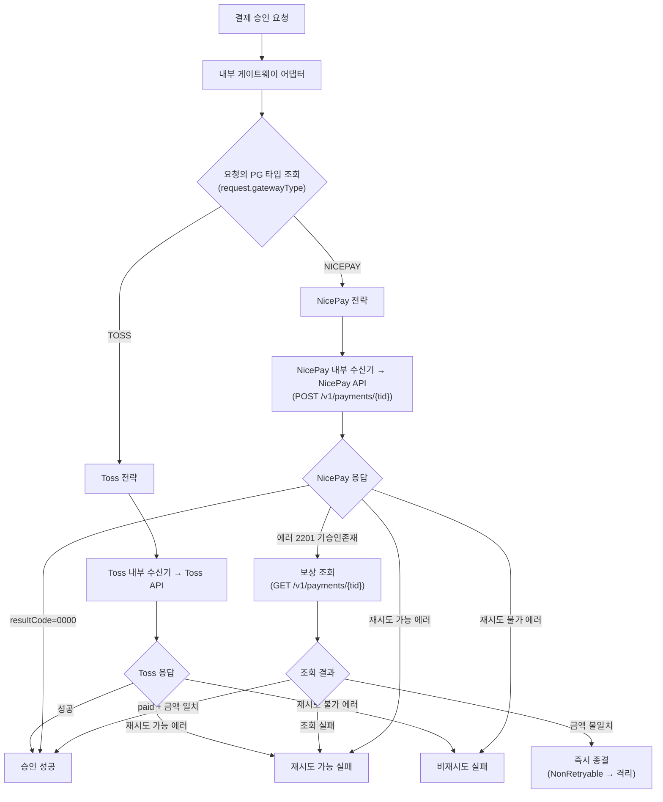
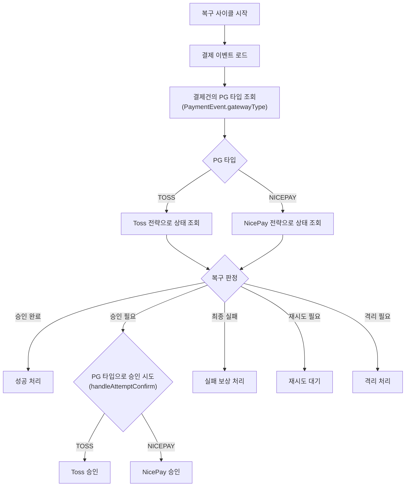

# NICEPAY-PG-STRATEGY — 실행 계획

**토픽**: [docs/topics/NICEPAY-PG-STRATEGY.md](topics/NICEPAY-PG-STRATEGY.md)
**날짜**: 2026-04-13
**라운드**: Plan R1

---

## 요약 브리핑

### Task 목록

1. **T1** — 예외 클래스 범용화 (Retryable/NonRetryable/Confirm rename)
2. **T2** — PG 타입 enum을 도메인 레이어로 이동 + NICEPAY 추가
3. **T3** — 결제 이벤트에 PG 타입 필드 추가 (도메인 엔티티)
4. **T4** — 결제건별 PG 선택 — 요청 DTO에 PG 타입 추가
5. **T5** — 결제 게이트웨이 포트 시그니처 변경 (상태 조회에 PG 타입 파라미터)
6. **T6** — 나이스페이먼츠 도메인/DTO/오퍼레이터 포트 구성
7. **T7** — 나이스페이먼츠 HTTP 오퍼레이터 구현
8. **T8** — 나이스페이먼츠 API 유스케이스 및 내부 수신기
9. **T9** — 나이스페이먼츠 전략 구현 — 정상 승인/취소/조회 + 상태 매핑
10. **T10** — 멱등성 보상 로직 (2201 기승인존재 → 조회 보상 + 금액 교차 검증)
11. **T11** — 에러 코드 분류 (재시도 가능/불가)
12. **T12** — 전략 팩토리에 나이스페이먼츠 등록 확인 테스트
13. **T13** — DB 마이그레이션 (gateway_type 컬럼)
14. **T14** — 어댑터 결제건별 전략 선택 전환 (confirm/cancel)
15. **T15** — 복구 사이클 승인 재시도 경로에 PG 타입 전파
16. **T16** — 나이스페이먼츠 체크아웃 UI
17. **T17** — Toss 기존 흐름 회귀 검증

### 변경 후 전체 플로우차트 — 결제 승인

### 변경 후 전체 플로우차트 — 복구 사이클 PG 라우팅

### 핵심 결정 → Task 매핑

| 결정 | 담당 태스크 |
|---|---|
| D1 (tid→paymentKey) | T6, T9 |
| D2 (returnUrl POST → confirm API) | T16 |
| D3 (2201 보상 + 금액 검증) | T10 |
| D4 (예외 범용화) | T1 |
| D5 (enum 이동, gatewayType 필드, 결제건별 선택) | T2, T3, T4, T13, T14 |
| D6 (포트 시그니처 + 복구 사이클 라우팅) | T5, T15 |

### 트레이드오프 / 후속 작업

- `paymentKey` 필드명 rename은 비범위 — 변경 범위 과도
- NicePay Fake(벤치마크용)는 비범위 — 추후 성능 테스트 시 추가
- NicePay Webhook 수신 엔드포인트는 비범위
- NicePay `cancelled`/`partialCancelled`/`expired` 상태 매핑은 기존 안전망(unmapped → QUARANTINE)으로 처리

---

## 개요

설계 결정 D1~D6 및 In-scope 9개 항목을 실행 가능한 태스크로 분해한다.
layer 의존 순서: domain → application → infrastructure → presentation/UI

<!-- architect: === PLAN R1 검토 요약 ===
  주요 지적 (Critic이 끌어올려야 할 항목):
  1. T1: PaymentTossConfirmException도 벤더 종속 — rename 범위에 포함 여부 결정 필요
  2. T3/T13: PaymentEventEntity 산출물 중복 — T3=도메인만, T13=인프라(Entity+DDL) 일원화 필요
  3. T5: confirm/cancel 전략 선택 변경이 T14와 산출물 겹침 — T5는 getStatus* 시그니처에만 집중
  4. T9: domain_risk가 false이지만 상태 매핑은 돈 관련 — true로 상향 필요
  5. T11: NicepayErrorCode를 paymentgateway 모듈에 두되 payment 모듈에서 직접 참조하면 모듈 경계 흐림 — Toss 패턴처럼 Strategy 내 문자열 상수로 처리 권장
  6. T6 의존 완화: paymentgateway 모듈 파일은 T2(PaymentGatewayType 이동)와 무관 — 병렬화 가능
  7. T12/T14 의존 완화: 각각 T9, T5+T9면 충분 — 크리티컬 패스 단축 가능

  layer 위반: 없음. 의존 방향(domain -> application -> infrastructure -> presentation)은 전 태스크에서 준수.
  AC 매핑: D1~D6 전부 태스크에 매핑됨. AC 1~9 전부 커버됨.
  누락 위험: PaymentTossConfirmException rename 누락 가능성 (T1 주석 참조).
-->

---

## 태스크 목록

### [x] T1. 예외 클래스 범용화 (rename) — D4

<!-- architect: PaymentTossConfirmException도 벤더 종속 예외이다. PaymentExceptionHandler가 이를 catch하고 있으므로 rename 범위에 포함해야 한다. PaymentGatewayConfirmException 등으로 함께 범용화할지 산출물 목록에 명시가 필요하다. -->
- **목적**: `PaymentTossRetryableException` → `PaymentGatewayRetryableException`, `PaymentTossNonRetryableException` → `PaymentGatewayNonRetryableException`, `PaymentTossConfirmException` → `PaymentGatewayConfirmException`으로 rename하여 포트 인터페이스에서 벤더 종속 예외를 제거한다. In-scope 1번.
- **tdd**: false
- **domain_risk**: false
- **산출물**:
  - `src/main/java/com/hyoguoo/paymentplatform/payment/exception/PaymentGatewayRetryableException.java` (신규, `PaymentTossRetryableException` 대체)
  - `src/main/java/com/hyoguoo/paymentplatform/payment/exception/PaymentGatewayNonRetryableException.java` (신규, `PaymentTossNonRetryableException` 대체)
  - `src/main/java/com/hyoguoo/paymentplatform/payment/exception/PaymentGatewayConfirmException.java` (신규, `PaymentTossConfirmException` 대체)
  - 기존 파일 삭제: `PaymentTossRetryableException.java`, `PaymentTossNonRetryableException.java`, `PaymentTossConfirmException.java`
  - 참조 전파: `PaymentGatewayPort`, `PaymentGatewayStrategy`, `TossPaymentGatewayStrategy`, `InternalPaymentGatewayAdapter`, `PaymentCommandUseCase`, `OutboxProcessingService`, `RecoveryDecision`, `PaymentExceptionHandler` — import 경로 일괄 변경
- **완료 조건**: `./gradlew test` 전체 통과. `PaymentTossRetryableException`, `PaymentTossNonRetryableException`, `PaymentTossConfirmException` 참조가 코드베이스에 없음.
- **의존**: 없음
- **완료 결과**: `PaymentGatewayRetryableException`, `PaymentGatewayNonRetryableException`, `PaymentGatewayConfirmException` 신규 생성. 기존 Toss 명 예외 3개 삭제. 참조 파일 8개(포트, 전략, 어댑터, 유스케이스, 스케줄러, 도메인, 핸들러, 테스트) import 일괄 변경. 테스트 324개 전체 통과.

---

### [x] T2. `PaymentGatewayType` enum 위치 이동 및 `NICEPAY` 추가 — D5

- **목적**: `PaymentGatewayType`을 `payment/infrastructure/gateway/` → `payment/domain/enums/`로 이동하고 `NICEPAY` 값을 추가한다. 도메인 엔티티가 이 enum을 참조할 수 있게 한다. In-scope 2번.
- **tdd**: false
- **domain_risk**: false
- **산출물**:
  - `src/main/java/com/hyoguoo/paymentplatform/payment/domain/enums/PaymentGatewayType.java` (신규 위치, `TOSS`, `NICEPAY` 두 값)
  - 기존 파일 삭제: `payment/infrastructure/gateway/PaymentGatewayType.java`
  - 참조 전파: `PaymentGatewayStrategy`, `PaymentGatewayFactory`, `TossPaymentGatewayStrategy`, `InternalPaymentGatewayAdapter`, `PaymentGatewayProperties` — import 경로 변경
- **완료 조건**: 컴파일 성공 + `./gradlew test` 통과. `infrastructure.gateway.PaymentGatewayType` 참조 없음.
- **의존**: T1 (컴파일 순서상 깨끗한 상태에서 시작)
- **완료 결과**: `payment/domain/enums/PaymentGatewayType.java` 신규 생성 (`TOSS`, `NICEPAY`). 기존 `infrastructure/gateway/PaymentGatewayType.java` 삭제. 참조 파일 6개(`PaymentGatewayStrategy`, `PaymentGatewayFactory`, `PaymentGatewayProperties`, `TossPaymentGatewayStrategy`, `UnsupportedPaymentGatewayException`, `PaymentGatewayFactoryTest`) import 경로 변경. 테스트 324개 전체 통과.

---

### T3. `PaymentEvent`에 `gatewayType` 필드 추가 — D5

<!-- architect: PaymentEventEntity 컬럼 매핑은 인프라 레이어 작업이다. T13(DB 마이그레이션)과 산출물이 중복되고 있으므로, 이 태스크에서는 도메인 엔티티(PaymentEvent)만 다루고, PaymentEventEntity의 컬럼 매핑 + from()/toDomain() 변환은 T13에 일원화하는 것이 명확하다. 현재 T3 완료 조건에 "PaymentEventEntity.from() / toDomain() 양방향 변환 정상"이 있는데 이를 T13으로 이동해야 의존 관계가 깨끗해진다. -->
- **목적**: `PaymentEvent` 도메인 엔티티에 `gatewayType: PaymentGatewayType` 필드를 추가하여 결제건별 PG 정보를 기록한다. In-scope 3번 일부.
- **tdd**: true
- **domain_risk**: true
- **산출물**:
  - `src/main/java/com/hyoguoo/paymentplatform/payment/domain/PaymentEvent.java` — `gatewayType` 필드 추가, `create()` 팩토리 메서드에 `gatewayType` 파라미터 추가
- **RED → GREEN → REFACTOR**:
  - RED: `PaymentEventTest`에 `gatewayType` 검증 테스트 추가 → 컴파일 실패
  - GREEN: `PaymentEvent.create()`, `allArgsBuilder`에 `gatewayType` 추가
  - REFACTOR: 없음 (필드 추가만)
- **테스트 클래스**: `src/test/java/com/hyoguoo/paymentplatform/payment/domain/PaymentEventTest.java`
- **테스트 메서드**:
  - `create_WithGatewayType_SetsGatewayType()` — TOSS / NICEPAY enum을 `create()`에 전달하면 `getGatewayType()`이 해당 값을 반환한다 (`@ParameterizedTest @EnumSource(PaymentGatewayType.class)`)
- **완료 조건**: `PaymentEvent.getGatewayType()` 가능. 기존 테스트 전체 통과. (`PaymentEventEntity` 변경은 T13에서 처리)
- **의존**: T2
- **완료 결과**: `PaymentEvent`에 `gatewayType: PaymentGatewayType` 필드 추가, `create()` 팩토리 메서드에 `gatewayType` 파라미터 추가. `PaymentCreateUseCase.saveNewPaymentEvent()`의 호출부에 `PaymentGatewayType.TOSS` 기본값 전달(T4에서 교체 예정). 테스트 326개 전체 통과.

---

### [x] T4. 결제건별 PG 선택 — request DTO에 `gatewayType` 추가 — D5

- **목적**: `PaymentConfirmRequest`(domain dto), `PaymentCancelRequest`(domain dto), `PaymentConfirmCommand`(application dto), `presentation/dto/request/PaymentConfirmRequest`(컨트롤러 입력 DTO)에 `gatewayType` 필드를 추가한다. DE2-1 minor finding(application DTO 전파)도 이 태스크에서 해결한다. In-scope 3번 나머지.
- **tdd**: false
- **domain_risk**: false
- **산출물**:
  - `src/main/java/com/hyoguoo/paymentplatform/payment/domain/dto/PaymentConfirmRequest.java` — `gatewayType` 필드 추가
  - `src/main/java/com/hyoguoo/paymentplatform/payment/domain/dto/PaymentCancelRequest.java` — `gatewayType` 필드 추가 (D5 결정: request 내부에 포함)
  - `src/main/java/com/hyoguoo/paymentplatform/payment/application/dto/request/PaymentConfirmCommand.java` — `gatewayType` 필드 추가 (DE2-1 반영)
  - `src/main/java/com/hyoguoo/paymentplatform/payment/presentation/dto/request/PaymentConfirmRequest.java` — `gatewayType` 필드 추가
  - 호출부 수정: `PaymentCommandUseCase.confirmPaymentWithGateway()` — command → request 변환 시 `gatewayType` 전달; `OutboxProcessingService.handleAttemptConfirm()` — `paymentEvent.getGatewayType()`을 `PaymentConfirmCommand`에 세팅; `PaymentPresentationMapper` / `OutboxAsyncConfirmService` — confirm request 조립 시 `gatewayType` 전달
- **완료 조건**: 컴파일 성공 + 기존 Toss 흐름 테스트 통과 (기존 호출부에서 `TOSS` 명시). `./gradlew test` 통과.
- **의존**: T2, T3
- **완료 결과**: `PaymentConfirmRequest`(domain dto), `PaymentCancelRequest`(domain dto), `PaymentConfirmCommand`(application dto), `presentation/dto/request/PaymentConfirmRequest`에 `gatewayType: PaymentGatewayType` 필드 추가. `CheckoutCommand`, `CheckoutRequest`에도 `gatewayType` 추가하고 `PaymentCreateUseCase.createNewPaymentEvent()`로 전파 (T3 임시 하드코딩 제거). `PaymentCommandUseCase.confirmPaymentWithGateway()`, `PaymentPresentationMapper.toPaymentConfirmCommand()` 및 `toCheckoutCommand()` 호출부에 `gatewayType` 전달. 테스트 326개 전체 통과.

---

### [x] T5. `PaymentGatewayPort` 시그니처 변경 — D6

<!-- architect: layer 의존 방향 주의. PaymentGatewayPort(application/port)는 도메인 타입만 참조할 수 있다. T2에서 PaymentGatewayType을 domain/enums/로 이동한 뒤에야 포트 시그니처에 이 enum을 쓸 수 있으므로 T2 의존은 올바르다. -->
<!-- architect: PaymentGatewayStrategy(infrastructure)의 시그니처도 동시에 변경하는데, confirm()/cancel()의 전략 선택 변경은 T14에서 한다고 되어 있다. 이 태스크의 산출물에 "confirm()도 request.gatewayType()으로 변경"이 적혀 있는데, 그러면 T14와 산출물이 겹친다. T5에서는 getStatusByOrderId/getStatus 시그니처 변경에만 집중하고, confirm/cancel은 T14에 남겨 두어야 명확하다. -->
- **목적**: `getStatusByOrderId(String orderId)` → `getStatusByOrderId(String orderId, PaymentGatewayType gatewayType)`, `getStatus(String paymentKey)` → `getStatus(String paymentKey, PaymentGatewayType gatewayType)`으로 변경. In-scope 9번 일부.
- **tdd**: false
- **domain_risk**: true
- **산출물**:
  - `src/main/java/com/hyoguoo/paymentplatform/payment/application/port/PaymentGatewayPort.java` — 시그니처 변경
  - `src/main/java/com/hyoguoo/paymentplatform/payment/infrastructure/gateway/PaymentGatewayStrategy.java` — 동일 시그니처 변경
  - `src/main/java/com/hyoguoo/paymentplatform/payment/infrastructure/internal/InternalPaymentGatewayAdapter.java` — `getStatusByOrderId`, `getStatus`에서 파라미터 `gatewayType`으로 `factory.getStrategy()` 호출 (`confirm()/cancel()` 전략 선택 변경은 T14에서 처리)
  - `src/main/java/com/hyoguoo/paymentplatform/payment/infrastructure/gateway/toss/TossPaymentGatewayStrategy.java` — 시그니처 변경 (구현 동일)
  - `src/main/java/com/hyoguoo/paymentplatform/payment/application/usecase/PaymentCommandUseCase.java` — `getPaymentStatusByOrderId(String orderId, PaymentGatewayType gatewayType)` 시그니처 변경
  - `src/main/java/com/hyoguoo/paymentplatform/payment/scheduler/OutboxProcessingService.java` — `resolveStatusAndDecision()`, `resolveFcgStatusAndDecision()`에서 `paymentEvent.getGatewayType()` 읽어 전달; catch 절 예외 타입을 T1에서 rename된 범용 예외로 변경
- **완료 조건**: 컴파일 성공 + `./gradlew test` 전체 통과.
- **의존**: T1, T2, T3, T4
- **완료 결과**: `PaymentGatewayPort`, `PaymentGatewayStrategy`, `TossPaymentGatewayStrategy`의 `getStatus`/`getStatusByOrderId` 시그니처에 `PaymentGatewayType gatewayType` 파라미터 추가. `InternalPaymentGatewayAdapter`에서 파라미터 `gatewayType`으로 전략 선택하며, null일 경우 `properties.getType()` 폴백(T13 이전 기존 레코드 대응). `PaymentCommandUseCase.getPaymentStatusByOrderId`에 `gatewayType` 파라미터 추가. `OutboxProcessingService`의 `resolveStatusAndDecision`·`resolveFcgStatusAndDecision`에서 `paymentEvent.getGatewayType()` 읽어 전달. 테스트 326개 전체 통과.

---

### T6. `paymentgateway` 모듈 — NicePay 도메인 / DTO / Operator 포트 — In-scope 4번

<!-- architect: 기존 Toss 구조를 보면 파일이 PG별 하위 패키지 없이 플랫하게 배치되어 있다(TossOperator, TossApiCallUseCase 등). NicePay 파일도 동일 패키지에 플랫하게 두는 것인지, nicepay/ 하위 패키지를 따로 두는 것인지 산출물 경로에서 혼재되어 있다. 현재 산출물 경로는 paymentgateway/application/port/NicepayOperator.java로 Toss와 동일한 플랫 구조이다. 일관성이 있으므로 괜찮다. -->
<!-- architect: NicepayPaymentApiResponse가 infrastructure/dto/response/에 배치되는데, 이 DTO는 HttpNicepayOperator(infrastructure)에서만 역직렬화에 사용되므로 위치가 올바르다. -->
<!-- architect: 의존이 T2로 되어 있는데, T6은 paymentgateway 모듈의 독립적인 도메인/DTO 구성이므로 PaymentGatewayType 이동(T2)과 직접적 의존이 없다. 순수하게 T6은 의존 없이 시작 가능하다. T2 의존을 제거하면 T6~T8을 T1/T2와 병렬로 진행할 수 있어 크리티컬 패스가 단축된다. -->
- **목적**: NicePay API와 통신하는 데 필요한 도메인 객체, request/response DTO, Operator 포트 인터페이스를 `paymentgateway/nicepay` 패키지에 구성한다.
- **tdd**: false
- **domain_risk**: false
- **산출물**:
  - `src/main/java/com/hyoguoo/paymentplatform/paymentgateway/application/port/NicepayOperator.java` — 인터페이스: `confirmPayment(NicepayConfirmCommand)`, `getPaymentInfoByTid(String tid)`, `getPaymentInfoByOrderId(String orderId)`, `cancelPayment(NicepayCancelCommand)`
  - `src/main/java/com/hyoguoo/paymentplatform/paymentgateway/application/dto/request/NicepayConfirmCommand.java`
  - `src/main/java/com/hyoguoo/paymentplatform/paymentgateway/application/dto/request/NicepayCancelCommand.java`
  - `src/main/java/com/hyoguoo/paymentplatform/paymentgateway/domain/NicepayPaymentInfo.java` — `tid`, `orderId`, `amount`, `status`(`String`), `resultCode`, `resultMsg` 포함
  - `src/main/java/com/hyoguoo/paymentplatform/paymentgateway/infrastructure/dto/response/NicepayPaymentApiResponse.java` — NicePay REST API 응답 DTO (`resultCode`, `resultMsg`, `tid`, `orderId`, `amount`, `status`, `paidAt` 등)
  - `src/main/java/com/hyoguoo/paymentplatform/paymentgateway/infrastructure/dto/response/NicepayPaymentApiFailResponse.java`
- **완료 조건**: 컴파일 성공.
- **의존**: 없음 (paymentgateway 모듈 독립 작업, T2와 병렬 가능)
- **완료 결과**: `NicepayOperator` 인터페이스, `NicepayConfirmCommand`/`NicepayCancelCommand` DTO, `NicepayPaymentInfo` 도메인, `NicepayPaymentApiResponse`/`NicepayPaymentApiFailResponse` 인프라 DTO 작성 완료. 테스트 326개 전체 통과.
- [x] T6 완료

---

### [x] T7. `paymentgateway` 모듈 — `HttpNicepayOperator` 구현 — In-scope 4번

- **목적**: `NicepayOperator` 인터페이스를 WebClient 기반으로 구현한다. NicePay API 엔드포인트: 승인 `POST /v1/payments/{tid}`, 조회 `GET /v1/payments/{tid}`, orderId 조회 `GET /v1/payments/find/{orderId}`, 취소 `POST /v1/payments/{tid}/cancel`. 인증: `Basic Base64(clientKey:secretKey)`.
- **tdd**: false
- **domain_risk**: false
- **산출물**:
  - `src/main/java/com/hyoguoo/paymentplatform/paymentgateway/infrastructure/api/HttpNicepayOperator.java`
  - `src/main/resources/application.yml` — `spring.myapp.nicepay.client-key`, `nicepay.secret-key`, `nicepay.api-url` 프로퍼티 추가 (sandbox 기본값)
- **완료 조건**: 컴파일 성공. 단위 테스트 없음(HTTP 클라이언트 통합은 수동 검증).
- **의존**: T6
- **완료 결과**: `HttpNicepayOperator` 구현 (`confirmPayment`, `getPaymentInfoByTid`, `getPaymentInfoByOrderId`, `cancelPayment`). 인증: `Basic Base64(clientKey:secretKey)` (Toss의 `Base64(secretKey:)` 와 다른 NicePay 방식). `application.yml`에 `spring.myapp.nicepay.*` 프로퍼티 추가 (sandbox 기본값 포함). 테스트 326개 전체 통과.

---

### [x] T8. `paymentgateway` 모듈 — `NicepayApiCallUseCase` 및 `NicepayGatewayInternalReceiver` — In-scope 4번

- **목적**: NicePay 전용 UseCase와 내부 수신기(InternalReceiver)를 추가하여 `payment` 모듈의 `NicepayPaymentGatewayStrategy`가 호출할 진입점을 만든다. R2 완화: 기존 `PaymentGatewayInternalReceiver`는 Toss 전용으로 유지.
- **tdd**: false
- **domain_risk**: false
- **산출물**:
  - `src/main/java/com/hyoguoo/paymentplatform/paymentgateway/application/usecase/NicepayApiCallUseCase.java` — `executeConfirmPayment(NicepayConfirmCommand)`, `getPaymentInfoByTid(String)`, `getPaymentInfoByOrderId(String)`, `executeCancelPayment(NicepayCancelCommand)`
  - `src/main/java/com/hyoguoo/paymentplatform/paymentgateway/presentation/NicepayGatewayInternalReceiver.java` — `confirmPayment(NicepayConfirmRequest)`, `getPaymentInfoByTid(String)`, `getPaymentInfoByOrderId(String)`, `cancelPayment(NicepayCancelRequest)`
  - `src/main/java/com/hyoguoo/paymentplatform/paymentgateway/presentation/dto/request/NicepayConfirmRequest.java`
  - `src/main/java/com/hyoguoo/paymentplatform/paymentgateway/presentation/dto/request/NicepayCancelRequest.java`
  - `src/main/java/com/hyoguoo/paymentplatform/paymentgateway/presentation/dto/response/NicepayPaymentResponse.java`
- **완료 조건**: 컴파일 성공.
- **의존**: T6, T7
- **완료 결과**: `NicepayApiCallUseCase` (`NicepayOperator` 직접 위임), `NicepayGatewayInternalReceiver` (presentation → usecase 위임), `NicepayGatewayPresentationMapper`, request/response DTO 5종 작성 완료. 컴파일 성공.

---

### [x] T9. `NicepayPaymentGatewayStrategy` 구현 — 정상 승인/취소/조회 — In-scope 5번

<!-- architect: 이 클래스는 payment/infrastructure/gateway/nicepay/ 패키지에 위치한다. TossPaymentGatewayStrategy가 payment/infrastructure/gateway/toss/에 있는 것과 대칭이므로 배치가 올바르다. NicepayGatewayInternalReceiver(paymentgateway/presentation)를 주입받아 호출하는 구조도 기존 Toss 패턴(PaymentGatewayInternalReceiver 주입)과 동일한 cross-context 패턴이다. -->
<!-- architect: domain_risk가 false로 되어 있으나, 상태 매핑(paid->DONE, failed->ABORTED)은 돈 관련 로직이다. 잘못 매핑하면 복구 사이클에서 COMPLETE_FAILURE 대신 COMPLETE_SUCCESS를 타거나 그 반대가 된다. domain_risk: true로 상향해야 한다. -->
- **목적**: `PaymentGatewayStrategy` 인터페이스를 NicePay로 구현한다. 성공 케이스: `resultCode=0000` → `PaymentConfirmResult(SUCCESS)`, `status=paid` → `PaymentStatus.DONE`, `status=failed` → `PaymentStatus.ABORTED`. In-scope 5번.
- **tdd**: true
- **domain_risk**: true
- **산출물**:
  - `src/main/java/com/hyoguoo/paymentplatform/payment/infrastructure/gateway/nicepay/NicepayPaymentGatewayStrategy.java`
- **RED → GREEN → REFACTOR**:
  - RED: 아래 테스트 클래스를 먼저 작성 → `NicepayPaymentGatewayStrategy`가 없어 컴파일 실패
  - GREEN: `NicepayPaymentGatewayStrategy` 구현
  - REFACTOR: 상태 매핑 private 메서드 추출 (필요 시)
- **테스트 클래스**: `src/test/java/com/hyoguoo/paymentplatform/payment/infrastructure/gateway/nicepay/NicepayPaymentGatewayStrategyTest.java`
- **테스트 메서드**:
  - `supports_NicepayType_ReturnsTrue()` — `supports(NICEPAY)` → `true`
  - `supports_TossType_ReturnsFalse()` — `supports(TOSS)` → `false`
  - `confirm_Success_ReturnsDoneStatus()` — `resultCode=0000` → `PaymentConfirmResult.status=SUCCESS`, `approvedAt` 존재
  - `getStatus_PaidStatus_ReturnsDone()` — NicePay `status=paid` → `PaymentStatus.DONE`
  - `getStatus_FailedStatus_ReturnsAborted()` — NicePay `status=failed` → `PaymentStatus.ABORTED`
  - `getStatusByOrderId_Success_ReturnsMapped()` — 정상 조회 성공
  - `cancel_Success_ReturnsCancelResult()` — 취소 정상 흐름
- **완료 조건**: 위 테스트 통과 + `./gradlew test` 전체 통과.
- **의존**: T5, T8
- **완료 결과**: `NicepayPaymentGatewayStrategy` 구현 완료. supports/confirm/cancel/getStatus/getStatusByOrderId 전 메서드 구현. NicePay 상태 매핑(paid→DONE, failed→ABORTED 등), resultCode=0000 기반 성공 판정, paidAt 파싱(OffsetDateTime) 구현. 7개 테스트 포함 전체 333개 테스트 통과.

---

### T10. `NicepayPaymentGatewayStrategy` — 멱등성 보상 로직 (2201) — D3

- **목적**: NicePay 에러 코드 2201("기승인존재") 감지 후 조회 API로 보상하고, 금액 교차 검증(불일치 시 `QUARANTINE`)을 구현한다. D3 결정 완전 구현. In-scope 6번.
- **tdd**: true
- **domain_risk**: true
- **산출물**:
  - `src/main/java/com/hyoguoo/paymentplatform/payment/infrastructure/gateway/nicepay/NicepayPaymentGatewayStrategy.java` — T9에서 만든 파일에 보상 로직 추가
- **RED → GREEN → REFACTOR**:
  - RED: 아래 테스트 메서드 추가 → 실패
  - GREEN: `handleDuplicateApproval()` 보상 메서드 구현
  - REFACTOR: 없음
- **테스트 클래스**: `NicepayPaymentGatewayStrategyTest.java` (T9 이어서)
- **테스트 메서드**:
  - `confirm_Error2201_CallsCompensationQuery()` — 2201 에러 시 조회 API가 1회 호출된다
  - `confirm_Error2201_PaidWithMatchingAmount_ReturnsSuccess()` — 조회 결과 `status=paid` + 금액 일치 → `SUCCESS`
  - `confirm_Error2201_PaidWithMismatchedAmount_ThrowsNonRetryable()` — 금액 불일치 → `PaymentGatewayNonRetryableException` (금액 불일치는 재시도해도 바뀌지 않으므로 즉시 종결하여 QUARANTINE 경로 진입)
  - `confirm_Error2201_GetStatusFails_ThrowsRetryable()` — 보상 조회 자체 실패 → `PaymentGatewayRetryableException`
- **완료 조건**: 위 테스트 통과 + `./gradlew test` 통과.
- **의존**: T9

---

### T11. `NicepayPaymentGatewayStrategy` — 에러 코드 분류 (재시도/비재시도) — D3

<!-- architect: NicepayErrorCode를 paymentgateway/exception/common/에 두는데, 이것을 참조하는 NicepayPaymentGatewayStrategy는 payment/infrastructure/에 있다. payment 모듈이 paymentgateway 모듈의 예외 코드를 직접 참조하게 된다. 이는 기존 Toss 패턴에서 TossPaymentErrorCode가 paymentgateway 모듈에 있고, TossPaymentGatewayStrategy가 payment 모듈에서 직접 참조하지 않는 구조와 다르다. 기존 Toss 전략은 에러 코드를 문자열 상수로 직접 갖고 있다. NicePay도 동일하게 NicepayPaymentGatewayStrategy 내부에 에러 코드 상수를 두고, paymentgateway 모듈의 NicepayErrorCode는 paymentgateway 모듈 내부(NicepayApiCallUseCase 등)에서만 사용하도록 분리해야 한다. -->
- **목적**: NicePay 에러 코드를 `PaymentGatewayRetryableException` / `PaymentGatewayNonRetryableException`으로 분류한다. 재시도 가능: 2159, A246, A299; 재시도 불가: 3011-3014, 2152, 2156. In-scope 5/6번.
- **tdd**: true
- **domain_risk**: true
- **산출물**:
  - `src/main/java/com/hyoguoo/paymentplatform/payment/infrastructure/gateway/nicepay/NicepayPaymentGatewayStrategy.java` — 에러 코드 분류 로직 추가
  - 에러 코드 상수는 `NicepayPaymentGatewayStrategy` 내부에 `private static final String`으로 정의 (기존 Toss 패턴과 동일, paymentgateway 모듈 크로스 참조 방지)
- **RED → GREEN → REFACTOR**:
  - RED: 에러코드 분류 테스트 추가
  - GREEN: 분류 로직 구현
  - REFACTOR: 없음
- **테스트 클래스**: `NicepayPaymentGatewayStrategyTest.java` (T9/T10 이어서)
- **테스트 메서드**:
  - `getStatusByOrderId_RetryableErrorCode_ThrowsRetryableException()` — `@ParameterizedTest @ValueSource(strings = {"2159", "A246", "A299"})` → `PaymentGatewayRetryableException`
  - `getStatusByOrderId_NonRetryableErrorCode_ThrowsNonRetryableException()` — `@ParameterizedTest @ValueSource(strings = {"3011", "3012", "3013", "3014", "2152", "2156"})` → `PaymentGatewayNonRetryableException`
  - `confirm_RetryableError_ThrowsRetryableException()`
  - `confirm_NonRetryableError_ThrowsNonRetryableException()`
- **완료 조건**: 위 테스트 통과 + `./gradlew test` 통과.
- **의존**: T10

---

### T12. `PaymentGatewayFactory` — NICEPAY 전략 등록 확인 테스트 — D5

<!-- architect: 의존이 T11로 되어 있지만, Factory 테스트에 필요한 것은 NicepayPaymentGatewayStrategy 빈의 존재뿐이다. T9에서 이미 기본 구현이 완성되므로 T9 의존이면 충분하다. T10/T11(보상 로직, 에러 분류)은 Factory 테스트와 무관하다. 의존을 T9로 완화하면 T12를 T10/T11과 병렬로 실행 가능하다. -->
- **목적**: `PaymentGatewayFactory.getStrategy(NICEPAY)`가 `NicepayPaymentGatewayStrategy`를 반환하고, 미지원 타입에 예외를 던지는 것을 테스트한다.
- **tdd**: true
- **domain_risk**: false
- **산출물**: 기존 `PaymentGatewayFactory`는 변경 없음 (Spring DI로 자동 등록)
- **RED → GREEN → REFACTOR**:
  - RED: `PaymentGatewayFactoryTest`에 NICEPAY 케이스 추가
  - GREEN: `NicepayPaymentGatewayStrategy`가 이미 빈으로 등록되어 있으므로 공장 코드 변경 없이 통과
  - REFACTOR: 없음
- **테스트 클래스**: `src/test/java/com/hyoguoo/paymentplatform/payment/infrastructure/gateway/PaymentGatewayFactoryTest.java`
- **테스트 메서드**:
  - `getStrategy_NicepayType_ReturnsNicepayStrategy()` — `getStrategy(NICEPAY)` → `NicepayPaymentGatewayStrategy` 인스턴스
  - `getStrategy_TossType_ReturnsTossStrategy()` — 기존 Toss 케이스 유지
  - `getStrategy_UnsupportedType_ThrowsException()` — 미지원 타입 예외
- **완료 조건**: 테스트 통과.
- **의존**: T9 (Factory 테스트에 필요한 것은 NicepayPaymentGatewayStrategy 빈 존재뿐)

---

### T13. DB 마이그레이션 — `payment_event.gateway_type` 컬럼 — D5

<!-- architect: T3 산출물에 PaymentEventEntity 컬럼 매핑이 이미 포함되어 있어 T13과 중복된다. T3에서는 도메인 엔티티만 다루고, PaymentEventEntity의 컬럼 매핑 + from()/toDomain() + 참고용 DDL은 이 태스크(T13)에 일원화하는 것을 권장한다(T3 주석 참조). -->
- **목적**: `payment_event` 테이블에 `gateway_type VARCHAR(20) NOT NULL DEFAULT 'TOSS'` 컬럼을 추가한다. In-scope 8번.
- **tdd**: false
- **domain_risk**: true
- **산출물**:
  - `src/main/resources/db/migration/` 또는 — 현재 프로젝트가 `ddl-auto: update` 방식이면 `PaymentEventEntity`에 컬럼 어노테이션 추가만으로 처리. 운영 환경 스크립트: `docs/migration/V{N}__add_gateway_type_to_payment_event.sql` (참고용 DDL 스크립트)
  - `src/main/java/com/hyoguoo/paymentplatform/payment/infrastructure/entity/PaymentEventEntity.java` — `@Column(name = "gateway_type", nullable = false)` + `@Enumerated(EnumType.STRING)` `PaymentGatewayType gatewayType` 필드, `DEFAULT 'TOSS'` 처리 (기존 레코드 자동 채워짐)
  - `PaymentEventEntity.from()` / `toDomain()` 양방향 변환에 `gatewayType` 추가
- **완료 조건**: 앱 기동 시 컬럼 생성 확인(docker 프로파일). 기존 데이터 default 'TOSS' 처리. T3 테스트 통과.
- **의존**: T3

---

### T14. `InternalPaymentGatewayAdapter` — 결제건별 전략 선택 전환 — D5/D6

<!-- architect: 의존에 T12가 있지만, T14는 어댑터의 라우팅 로직 변경이므로 NicepayPaymentGatewayStrategy의 Factory 등록 테스트(T12)와 직접적 의존은 없다. T5(포트 시그니처 변경) + T9(NicepayPaymentGatewayStrategy 기본 구현 존재)면 충분하다. T11/T12 완료를 기다릴 필요가 없다. -->
- **목적**: `confirm()`, `cancel()` 메서드에서 `properties.getType()` 대신 `request.gatewayType()`으로 전략을 선택한다. D5 결정: checkout 기본값은 `PaymentGatewayProperties.type` 유지, 결제건 실행 이후에는 request의 `gatewayType` 우선. In-scope 3번/9번.
- **tdd**: true
- **domain_risk**: true
- **산출물**:
  - `src/main/java/com/hyoguoo/paymentplatform/payment/infrastructure/internal/InternalPaymentGatewayAdapter.java` — 이미 T5에서 `getStatusByOrderId`, `getStatus` 변경됨. 이 태스크에서 `confirm()`, `cancel()`도 `request.gatewayType()` 기반으로 변경
- **RED → GREEN → REFACTOR**:
  - RED: `InternalPaymentGatewayAdapterTest`에 NICEPAY 타입 confirm 라우팅 테스트 추가
  - GREEN: `confirm()`, `cancel()` 에서 `factory.getStrategy(request.gatewayType())` 호출
  - REFACTOR: 없음
- **테스트 클래스**: `src/test/java/com/hyoguoo/paymentplatform/payment/infrastructure/internal/InternalPaymentGatewayAdapterTest.java` (신규)
- **테스트 메서드**:
  - `confirm_TossGatewayType_CallsTossStrategy()` — TOSS gatewayType → TossPaymentGatewayStrategy.confirm() 호출
  - `confirm_NicepayGatewayType_CallsNicepayStrategy()` — NICEPAY gatewayType → NicepayPaymentGatewayStrategy.confirm() 호출
  - `getStatusByOrderId_NicepayGatewayType_CallsNicepayStrategy()`
- **완료 조건**: 위 테스트 통과 + `./gradlew test` 전체 통과.
- **의존**: T5, T9 (confirm/cancel 라우팅 변경에 NicePay 전략 기본 구현이 필요)

---

### T15. `OutboxProcessingService` — `handleAttemptConfirm` gatewayType 전파 — DE2-1

- **목적**: `handleAttemptConfirm()`에서 `PaymentConfirmCommand`를 조립할 때 `paymentEvent.getGatewayType()`을 세팅한다. DE2-1 minor finding 최종 완결. In-scope 9번.
- **tdd**: true
- **domain_risk**: true
- **산출물**:
  - `src/main/java/com/hyoguoo/paymentplatform/payment/scheduler/OutboxProcessingService.java` — `handleAttemptConfirm()` 내 `PaymentConfirmCommand.builder().gatewayType(paymentEvent.getGatewayType())` 추가 (T4에서 필드가 이미 추가됨)
- **RED → GREEN → REFACTOR**:
  - RED: `OutboxProcessingServiceTest`에 ATTEMPT_CONFIRM 경로에서 command에 gatewayType이 전달되는지 검증 테스트 추가
  - GREEN: `handleAttemptConfirm()`에 `gatewayType` 세팅
  - REFACTOR: 없음
- **테스트 클래스**: `src/test/java/com/hyoguoo/paymentplatform/payment/scheduler/OutboxProcessingServiceTest.java`
- **테스트 메서드**:
  - `handleAttemptConfirm_PropagatesGatewayType_ToConfirmCommand()` — NICEPAY gatewayType을 가진 paymentEvent가 ATTEMPT_CONFIRM 결정을 받으면, `confirmPaymentWithGateway()` 호출 시 command에 `NICEPAY` gatewayType이 전달된다 (Mockito `ArgumentCaptor` 사용)
- **완료 조건**: 테스트 통과 + `./gradlew test` 통과.
- **의존**: T4, T14

---

### T16. Checkout UI — `checkout-nicepay.html` 신규 생성 — D2

- **목적**: NicePay JS SDK(`AUTHNICE.requestPay`)를 사용하는 체크아웃 페이지를 만든다. returnUrl POST 응답에서 tid, orderId, amount를 파싱하여 기존 confirm API를 호출한다. In-scope 7번.
- **tdd**: false
- **domain_risk**: false
- **산출물**:
  - `src/main/resources/static/payment/checkout-nicepay.html` (신규)
    - NicePay JS SDK 로드 (`https://pay.nicepay.co.kr/v1/js/`)
    - `AUTHNICE.requestPay()` 호출 (clientId, method, orderId, amount, goodsName, returnUrl)
    - returnUrl = `POST /payment/nicepay-return` — 또는 D2 결정에 따라 동일 페이지가 POST 데이터를 읽어 confirm API 호출
    - form POST 수신 후 `POST /api/v1/payments/confirm` 호출 (`gatewayType: "NICEPAY"` 포함)
  - `src/main/resources/static/payment/success.html` — 기존 Toss 전용 이미지/텍스트를 PG 중립으로 분기 (필요 시 minor 수정)
  - `src/main/resources/static/index.html` — NicePay 결제 링크 추가
- **완료 조건**: 브라우저에서 NicePay 체크아웃 페이지 열림 확인 (정적 파일 제공).
- **의존**: T14, T15

---

### T17. 회귀 검증 — Toss 기존 흐름 전체 통과 확인

- **목적**: D4(예외 rename), D5(gatewayType 추가), D6(포트 시그니처 변경)으로 인한 기존 Toss 흐름 회귀를 최종 확인한다. In-scope 1~9번 전체 통합 검증.
- **tdd**: false
- **domain_risk**: false
- **산출물**: 없음 (검증만)
- **완료 조건**:
  - `./gradlew test` 전체 통과 (기존 Toss 테스트 포함)
  - `OutboxProcessingServiceTest`, `TossPaymentGatewayStrategyTest`, `PaymentGatewayFactoryTest` 모두 GREEN
  - AC 3번 (`PaymentGatewayType.TOSS` 흐름 동일), AC 4번 (포트 throws 절 벤더 종속 예외 없음), AC 5번 (enum 위치), AC 6번 (DB 컬럼) 체크리스트 확인
- **의존**: T1~T16 전체

---

## 리스크 → 태스크 추적 테이블

| Discuss 리스크 ID | 설명 | 담당 태스크 |
|---|---|---|
| R1: NicePay 멱등성 부재 이중 결제 | 2201 감지 → 조회 보상 + 금액 교차 검증 | T10 |
| R2: Receiver 비대화 | 별도 `NicepayGatewayInternalReceiver` 분리 | T8 |
| R3: 예외 rename 기존 테스트 깨짐 | 범용 예외 rename + 전체 참조 전파 | T1 |
| R4: 복구 사이클 NicePay 조회 실패 | 실패 시 RETRYABLE 분류 → 기존 FCG 경로 | T11 |
| R5: 복구 사이클 잘못된 PG로 API 호출 | 포트 시그니처에 gatewayType 파라미터 추가 | T5, T15 |
| R6: Checkout UI tid 조작 | 기존 `validateConfirmRequest()` 가드 유지 (코드 변경 없음) | T16 |
| DE2-1: ATTEMPT_CONFIRM gatewayType 전파 미명시 | `handleAttemptConfirm()` command에 gatewayType 세팅 | T4, T15 |

---

## 설계 결정 → 태스크 추적 테이블

| 결정 ID | 설명 | 담당 태스크 |
|---|---|---|
| D1 | NicePay `tid` → `paymentKey` 필드 매핑 | T6, T9 (Operator DTO 설계 시 반영) |
| D2 | returnUrl POST → 클라이언트 파싱 → confirm API 재사용 | T16 |
| D3 | 2201 보상 로직 + 금액 교차 검증 | T10 |
| D4 | 예외 범용화 rename | T1 |
| D5 | `PaymentGatewayType` 도메인 이동, `PaymentEvent.gatewayType`, request DTO 추가 | T2, T3, T4, T13, T14 |
| D6 | 포트 시그니처 gatewayType 파라미터 추가, 복구 사이클 결제건별 PG 라우팅 | T5, T15 |

---

## 반환 요약

- **태스크 총 개수**: 17
- **domain_risk 태스크**: T3, T5, T9, T10, T11, T13, T14, T15 = **8개**
- **topic.md 결정 중 태스크로 매핑하지 못한 항목**: **없음** (D1~D6 전부 1개 이상 태스크에 매핑됨)
