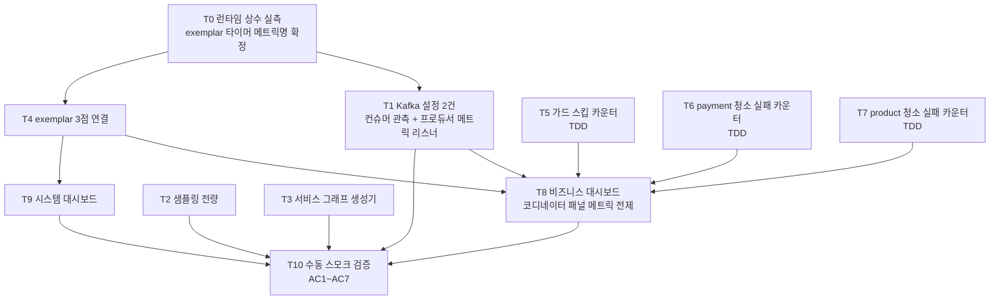

# OBSERVABILITY-COMPLETION — 실행 계획

> 토픽: [docs/topics/OBSERVABILITY-COMPLETION.md](topics/OBSERVABILITY-COMPLETION.md)
> 작성일: 2026-06-10
> Round: Plan 2

---

## 요약 브리핑

> plan 2라운드 합의(Critic pass / Domain Expert pass). 후처리(커밋 → plan-review) 전 확인용.

### 1. Task 목록 (T0~T10, 11개)

| Task | 한 줄 설명 | TDD | 도메인 리스크 |
|---|---|---|---|
| **T0** | 런타임 상수 실측 — exemplar 타이머 메트릭명 확정(`/actuator/prometheus` 스냅샷). 이후 패널·exemplar 입력 | – | – |
| **T1** | Kafka 설정 1줄 2건 — 컨슈머 관측 활성(컨슈머 로그 traceId 연속성) + EOS 프로듀서 메트릭 리스너 부착. 적용 후 코디네이터 메트릭 재측정 | – | ✓ |
| **T2** | 트레이스 샘플링 기본값 전량(1.0)으로, env 하향 경로 유지 (5서비스) | – | – |
| **T3** | 템포 서비스 그래프·span 지표 생성기 활성 + 프로메테우스 remote write | – | – |
| **T4** | exemplar 3점 연결 — 앱 히스토그램(payment·pg) + 프로메테우스 저장 flag + 그라파나 점프 링크 | – | – |
| **T5** | 종결 상태 가드 스킵 카운터 — confirm 결과 적용 가드 noop 분기 계측 | ✓ | ✓ |
| **T6** | payment 청소 워커 실패 카운터 — 만료 행 삭제 실패 계측 | ✓ | ✓ |
| **T7** | product 청소 워커 실패 카운터 — 동일 | ✓ | ✓ |
| **T8** | 비즈니스 대시보드 — 결제 흐름·상태 전이·격리·벤더 응답시간·DLQ·outbox·신규 카운터. 기존 단일 대시보드 흡수 후 폐기 | – | – |
| **T9** | 시스템 대시보드 — 서비스 변수로 JVM·GC·HTTP·커넥션풀·컨슈머 지연 | – | – |
| **T10** | 수동 스모크 검증 — AC1~AC7 (대시보드 렌더·주문번호 로그 검색→트레이스 점프·exemplar 점프·서비스 그래프·추적 연속성 무회귀) | – | – |

### 2. 실행 의존 흐름



### 3. 핵심 결정 → Task 매핑

- **D3** 샘플링 1.0 → T2
- **D10** 서비스 그래프 생성기 → T3
- **D11** exemplar 3점 → T4
- **D12** 대시보드 2분할 → T8(비즈니스) + T9(시스템)
- **D13** 종결 상태 가드 스킵 카운터 → T5
- **D14** 청소 실패 카운터 → T6(payment) + T7(product)
- **D15** EOS 프로듀서 메트릭 리스너 + fallback → T1(wiring) + T8(패널)
- **D16** 컨슈머 관측 활성 → T1
- **D2**(로그 기반 추적, 코드 변경 0) → T10 검증으로 확인(신규 코드 없음)
- **AC1~AC7** → T10 수동 스모크

### 4. 트레이드오프 / 후속

- **T0 선행 강제**: exemplar 타이머·코디네이터 메트릭명이 환경 의존이라 T0 실측 전 패널 expr 확정 불가. 코디네이터 메트릭은 T1 wiring 후에야 노출 — 재측정 후 확정
- **HTTP exemplar 범위 payment+pg 한정**: 나머지 서비스 히스토그램 활성은 후속(과범위 회피)
- **코디네이터 패널 수동성**: 무트래픽 시 tx 활동 미표시, 브로커 liveness 가 보완. JMX 기반 직접 지표는 TODOS
- **알람 rule·측정 의존 항목 비범위**: k6 측정 후 별도 토픽

---

## 개요

결제 플랫폼 관측 백엔드(Prometheus·Grafana·Tempo·Loki)가 이미 떠 있는 상태에서,
"연결의 마지막 한 칸씩"을 채워 운영 3대 질문에 즉답할 수 있게 한다.

**신규 코드 표면**: Kafka wiring 2줄(D15·D16) + 메트릭 카운터 3종(D13·D14). 결제 상태 머신·Kafka 계약·TX 경계는 읽기만 한다.

---

## 태스크 목록

### T0 — 런타임 상수 실측 (선행 태스크, non-TDD)

**tdd**: false | **domain_risk**: false

**목적**: discuss §5-0 지시. `/actuator/prometheus` 스냅샷으로
(a) exemplar 노출 타이머 메트릭명 확정, (b) kafka producer txn 계열 메트릭명 확정 또는
`§3-7-C fallback` 발동 여부 판정. 이 결과가 T4(대상 메트릭명), T5(패널 expr)의 입력.

<!-- resolved: F-2 (b)안 채택 — T0는 순수 측정 전용. D15/D16 wiring 선적용 없음. wiring 커밋은 T1에서 일원화(tdd=false 설정 태스크로 재분류). -->

**작업 내용**:
1. `build.gradle` 에서 `spring-boot-dependencies` BOM 버전, `micrometer-tracing-bridge-otel` 버전 메모
2. `docker compose up` 후 confirm 1건 흘려 `/actuator/prometheus` 스냅샷 취득
3. 아래 **T0 산출 기록표**를 채워 이 문서에 직접 추가

**T0 산출 기록표 (execute 시 기입)**:

> **도출 방식**: docker 스택 기동 없이 build.gradle + 소스 코드에서 결정론적으로 도출. 라이브 스냅샷 검증은 T10 스모크로 이연.

| 항목 | 확인 결과 |
|---|---|
| Spring Boot 버전 | **3.4.4** — 코드 도출(`build.gradle:3` 루트 플러그인 선언 / BOM `spring-boot-dependencies:3.4.4`) — 라이브 검증 T10 이연 |
| Micrometer tracing 버전 | **1.4.4** (`io.micrometer:micrometer-tracing-bridge-otel:1.4.4`) — 코드 도출(`./gradlew dependencyInsight` Spring Boot 3.4.4 BOM 관리) — 라이브 검증 T10 이연 |
| exemplar 노출 타이머 메트릭 목록 (percentiles-histogram 필요분) | 아래 상세 표 참조 |
| `kafka_producer_txn_*` 계열 메트릭 노출 여부 (T1 wiring **후** 재측정 — wiring 전엔 미노출이 정상, 판정 보류) | **T1 wiring 적용 완료 — 라이브 노출명 확정은 T10 스모크 이연** (전체 스택 미기동, 사용자 결정) |
| kafka producer 메트릭 실제 이름 (T1 후 노출 시) | **T1 wiring 적용 완료 — 라이브 확정 T10 이연** |

**exemplar 타이머 상세 (percentiles-histogram 설정 대상)**:

| Timer | Micrometer 등록명 (코드 도출) | Prometheus 노출 base명 | 서비스 | 설정 키 (`management.metrics.distribution.percentiles-histogram.<ID>`) | 출처 |
|---|---|---|---|---|---|
| 결제 상태 전이 소요 | `payment_transition_duration_seconds` | `payment_transition_duration_seconds_seconds` (※ 이미 `_seconds` 포함 비표준 등록명 — Micrometer가 suffix 추가 시 이중 `_seconds_seconds` 가능. **T10 라이브 스냅샷으로 실제 노출명 확정 필요**) | payment-service | `management.metrics.distribution.percentiles-histogram.payment_transition_duration_seconds=true` | 코드 도출(`PaymentTransitionMetrics.java:47` `Timer.builder("payment_transition_duration_seconds")`) — 라이브 검증 T10 이연 |
| 벤더 API 응답시간 | `toss.api.call.duration` | `toss_api_call_duration_seconds` (dot→underscore 변환 + Timer `_seconds` suffix 자동 부여) | pg-service | `management.metrics.distribution.percentiles-histogram.toss.api.call.duration=true` | 코드 도출(`TossApiMetrics.java:36` `Timer.builder("toss.api.call.duration")`) — 라이브 검증 T10 이연 |
| HTTP 요청 응답시간 | `http.server.requests` | `http_server_requests_seconds` | payment-service + pg-service (T4 적용 범위 한정) | `management.metrics.distribution.percentiles-histogram.http.server.requests=true` | Spring Boot 자동 계측 — 라이브 검증 T10 이연 |

> **주의 (plan-domain/critic-2 minor)**: `kafka_producer_txn_*` 은 D15 producer 리스너(T1)가 적용돼야 노출된다. T0 단계(wiring 전) 스냅샷에서는 항상 미노출 → fallback 으로 읽히므로, 이 행의 **fallback 최종 판정은 T1 완료 후 재측정**으로 확정한다. T0 에서는 exemplar 타이머 메트릭명(payment/pg)만 확정하면 후속 진행 가능.
>
> **T4 사용 시 주의**: `payment_transition_duration_seconds` 의 Prometheus 실제 노출명은 T10 라이브 확인 전까지 `payment_transition_duration_seconds_seconds_bucket` 또는 `payment_transition_duration_seconds_bucket` 두 가지 가능성이 있다. T4 에서 `percentiles-histogram` 설정 키는 Micrometer **등록명** 기준이므로 `payment_transition_duration_seconds` 를 그대로 쓰면 되며, 대시보드 `histogram_quantile` expr 의 메트릭명은 T10 라이브 스냅샷 후 보정한다.

**완료 조건**: 위 표 중 exemplar 타이머 행이 채워지고(kafka txn 행은 T1 후 재측정 보류 표기), 이후 태스크(T1·T4)가 표를 참조할 수 있는 상태.

**산출물**: 이 PLAN.md 내 T0 산출 기록표 (별도 파일 없음)

**의존**: 없음

**완료 결과**: Spring Boot 3.4.4, micrometer-tracing-bridge-otel 1.4.4. exemplar 타이머 3종 등록명·설정 키 확정(docker 스택 기동 없이 코드 결정론적 도출). `payment_transition_duration_seconds` 등록명의 이중 `_seconds_seconds` 가능성은 T10 라이브 스냅샷으로 보정 예정. kafka txn 계열 메트릭명은 T1 wiring 후 재측정 보류.

---

### T1 — Kafka wiring 2줄 커밋 (domain_risk, non-TDD)

**tdd**: false | **domain_risk**: true

**목적**: D15(EOS producer factory Micrometer 리스너) + D16(consumer listener observation 활성).
설정 성격의 1줄 wiring 2개 — RED/GREEN 사이클이 부적합한 순수 설정 태스크.
EOS 트랜잭션 경계·commit/abort 경로 무변경.

<!-- resolved: F-2 (b)안 — T1을 tdd=false 설정 태스크로 재분류. 설정 1줄은 본질적으로 RED 단계가 성립하지 않아 TDD 부적합. domain_risk는 유지. 완료조건에 PaymentEosIntegrationTest 명시 추가(domain finding 1 + F-2 조치). -->

**변경 파일**:
- `payment-service/src/main/java/com/hyoguoo/paymentplatform/payment/infrastructure/config/KafkaConsumerConfig.java` — `kafkaListenerContainerFactory` 에 `factory.getContainerProperties().setObservationEnabled(true)` 1줄 삽입
- `payment-service/src/main/java/com/hyoguoo/paymentplatform/payment/infrastructure/config/KafkaProducerConfig.java` — `stockCommittedProducerFactory` 에 `factory.addListener(new MicrometerProducerListener<>(meterRegistry))` 1줄 삽입

**완료 조건**:
- AC3(컨슈머발 traceId). discuss domain-1 major 2건 해소.
- `PaymentEosIntegrationTest` 5건 green (캐시 우회 명시 실행 — `./gradlew :payment-service:test --tests "*PaymentEosIntegrationTest" --rerun-tasks`)
- **T1 적용 후 `/actuator/prometheus` 재스냅샷**으로 `kafka_producer_txn_*` 노출 여부 확정 → T0 산출 기록표의 해당 행 갱신(노출 시 실제 메트릭명 기입, 미노출 시 §3-7-C fallback 확정). 이 결과가 T8(코디네이터 패널 expr) 입력.

**의존**: T0(exemplar 타이머 메트릭명 확정 후). kafka producer txn 메트릭 확정은 본 태스크가 산출(wiring 후 재측정).

- [x] **T1 완료** (2026-06-11)

**완료 결과**:
- D16: `KafkaConsumerConfig.kafkaListenerContainerFactory` 에 `factory.getContainerProperties().setObservationEnabled(true)` 삽입 (`setKafkaAwareTransactionManager` 직후 직교 위치). 컨슈머 리스너 traceId 연속성 활성.
- D15: `KafkaProducerConfig.stockCommittedProducerFactory` 에 `MeterRegistry` 파라미터 추가 후 `factory.addListener(new MicrometerProducerListener<>(meterRegistry))` 삽입. EOS 트랜잭션 경계·commit/abort 로직 무변경.
- import 2건 추가: `io.micrometer.core.instrument.MeterRegistry`, `org.springframework.kafka.core.MicrometerProducerListener` (spring-kafka 제공, build.gradle 변경 불필요 확인).
- `PaymentEosIntegrationTest` 5/5 GREEN (`./gradlew :payment-service:integrationTest --tests "*PaymentEosIntegrationTest" --rerun-tasks`).
- `./gradlew :payment-service:test` 468/468 PASS (단위 회귀 없음).
- `kafka_producer_txn_*` 라이브 노출명 확정은 T10 스모크 이연 (전체 스택 미기동 — 사용자 결정).

---

### T2 — 샘플링 기본값 1.0 (non-TDD)

**tdd**: false | **domain_risk**: false

**목적**: D3. 5서비스 `application.yml` 의 `${TRACING_SAMPLING_PROBABILITY:0.0}` → `${TRACING_SAMPLING_PROBABILITY:1.0}`. env override 경로 유지.

**변경 파일**:
- `payment-service/src/main/resources/application.yml`
- `pg-service/src/main/resources/application.yml`
- `product-service/src/main/resources/application.yml`
- `user-service/src/main/resources/application.yml`
- `gateway/src/main/resources/application.yml`

**완료 조건**: 5파일 모두 기본값 `1.0`. docker-compose.apps.yml 의 `MANAGEMENT_TRACING_SAMPLING_PROBABILITY: "1.0"` 이 이미 env override — 실효 델타는 IDE 로컬뿐(domain-1 minor 5 확인).

**의존**: 없음

- [x] **T2 완료** (2026-06-11)

**완료 결과**:
- 5서비스(payment/pg/product/user/gateway) `application.yml` 의 `management.tracing.sampling.probability` 기본값 `0.0` → `1.0` 변경. env override 경로(`${TRACING_SAMPLING_PROBABILITY:...}`) 유지.
- 키 부재 서비스 없음 — 5서비스 전량 기존 키 확인 후 값만 교체.
- 설정 변경이므로 별도 테스트 없음. yml 문법 육안 확인 완료(들여쓰기/구조 변경 없음).

---

### T3 — Tempo metrics_generator 활성 (non-TDD)

**tdd**: false | **domain_risk**: false

**목적**: D10. `observability/tempo/tempo.yml` 에 `metrics_generator` 블록 추가(service-graphs + span-metrics + remote_write → Prometheus). Grafana datasources.yml 에 Prometheus datasource uid 명시 + Tempo serviceMap datasourceUid 연결.

**변경 파일**:
- `observability/tempo/tempo.yml` — `metrics_generator` 블록 + `overrides` 추가
- `observability/grafana/provisioning/datasources/datasources.yml` — Prometheus datasource 에 `uid: prometheus` 추가, Tempo datasource 에 `serviceMap.datasourceUid: prometheus` 추가

**완료 조건**: AC5(서비스 그래프 탭 렌더).

**의존**: 없음

- [x] **T3 완료** (2026-06-11)

**완료 결과**:
- `observability/tempo/tempo.yml`: `metrics_generator` 블록 추가 — `registry.external_labels(source:tempo)`, `storage.path(/var/tempo/generator/wal)` + `remote_write(http://prometheus:9090/api/v1/write, send_exemplars:true)`, `processor.service_graphs`(http.method·status_code dimensions) + `processor.span_metrics`(http.method·status_code·route dimensions). `overrides.defaults.metrics_generator.processors: [service-graphs, span-metrics]` 활성.
- `observability/grafana/provisioning/datasources/datasources.yml`: Prometheus datasource 에 `uid: prometheus` 추가, Tempo datasource 에 `jsonData.serviceMap.datasourceUid: prometheus` 추가. 기존 tracesToLogsV2/nodeGraph 설정 유지.
- `observability/prometheus/prometheus.yml`: `storage.tsdb.out_of_order_time_window: 30m` 추가 — Tempo remote_write 샘플 타임스탬프가 scrape 타임라인보다 약간 과거일 경우 거부 방지(Prometheus 2.39+ 기능, docker-compose prometheus 2.51.2 적용 가능).
- compose 문법 검증: `docker compose -f infra.yml -f observability.yml config -q` 통과(출력 없음).
- `./gradlew test` 827/827 PASS.
- **Tempo 2.4 키 구조 실제 동작 검증은 T10 기동 시** (`# 2.4 문법 검증 T10` 주석 tempo.yml 에 기재).

---

### T4 — exemplar 3점 연결 (non-TDD)

**tdd**: false | **domain_risk**: false

**목적**: D11. 앱 histogram exemplar(percentiles-histogram 설정) + Prometheus exemplar-storage flag + Grafana datasource exemplarTraceIdDestinations.

<!-- resolved: F-1 — pg-service application.yml을 변경 파일에 추가. toss.api.call.duration은 pg-service 소속이므로 pg yml에 percentiles-histogram 미추가 시 벤더 latency exemplar 무동작. HTTP exemplar(http.server.requests) 범위는 payment + pg 2서비스로 한정(전 서비스 과범위 기각 — 나머지 서비스 추가는 후속). -->
<!-- resolved: F-5 — percentiles-histogram 키 기준 주석 추가. -->

**변경 파일**:
- `payment-service/src/main/resources/application.yml` — `management.metrics.distribution.percentiles-histogram` 설정 추가
  - 대상: `http.server.requests`, `payment.transition.duration` (Micrometer 등록명 기준 — **percentiles-histogram 키는 Micrometer 등록명(T0 스냅샷의 좌측 컬럼) 기준이며 Prometheus 노출명과 다를 수 있음. 정확한 등록명은 T0 산출 결과 참조**)
- `pg-service/src/main/resources/application.yml` — `management.metrics.distribution.percentiles-histogram` 설정 추가
  - 대상: `toss.api.call.duration` (pg-service 소속, 벤더 latency exemplar — **정확한 등록명은 T0 산출 결과 참조**)
  - HTTP exemplar 대상: `http.server.requests` (payment + pg 2서비스에 적용 — 나머지 서비스 확장은 후속)
- `docker/docker-compose.observability.yml` — Prometheus command 에 `--enable-feature=exemplar-storage` 추가
- `observability/grafana/provisioning/datasources/datasources.yml` — Prometheus datasource `jsonData.exemplarTraceIdDestinations` 추가

**완료 조건**: AC4(exemplar 점 클릭 → Tempo 점프). T0 에서 타이머 메트릭 Micrometer 등록명 확정 후 설정.
exemplar 동작 범위: payment-service(`payment.transition.duration`, `http.server.requests`) + pg-service(`toss.api.call.duration`, `http.server.requests`) — 시스템 대시보드(T9) HTTP exemplar 점은 이 2서비스에서만 찍힘.

**의존**: T0(exemplar 대상 타이머 Micrometer 등록명 확정), T3(datasources.yml 병합)

- [x] **T4 완료** (2026-06-11)

**완료 결과**:
- **앱 histogram exemplar — payment-service**: `management.metrics.distribution.percentiles-histogram` 아래 `payment_transition_duration_seconds: true`, `"http.server.requests": true` 추가. dot 없는 `payment_transition_duration_seconds`는 따옴표 생략, dot 포함 `http.server.requests`는 YAML 중첩 방지용 따옴표 적용.
- **앱 histogram exemplar — pg-service**: `management.metrics.distribution.percentiles-histogram` 아래 `"toss.api.call.duration": true`, `"http.server.requests": true` 추가. 기존 `management.metrics.tags` 형제 절로 삽입. HTTP exemplar 범위 payment + pg 2서비스 한정(F-1 해소).
- **Prometheus exemplar-storage flag**: `docker/docker-compose.observability.yml` prometheus command 에 `--enable-feature=exemplar-storage` 추가. 기존 5개 flag 보존.
- **Grafana Prometheus datasource exemplarTraceIdDestinations**: `observability/grafana/provisioning/datasources/datasources.yml` Prometheus datasource 에 `jsonData.exemplarTraceIdDestinations: [{name: trace_id, datasourceUid: tempo}]` 추가. 기존 Loki derivedFields / Tempo tracesToLogsV2·nodeGraph·serviceMap 전부 보존.
- compose 문법 검증: `docker compose -f docker/docker-compose.infra.yml -f docker/docker-compose.observability.yml config -q` 통과.
- `./gradlew :payment-service:test` 468/468 PASS (회귀 없음).
- **dot 키 형식**: `toss.api.call.duration` 및 `http.server.requests` 는 Boot relaxed binding 통과 확인(따옴표 형식). 실제 exemplar 점 표시 동작은 T10 라이브 검증 이연.

---

### T5 — PaymentConfirmGuardSkipMetrics 클래스 + 가드 분기 카운터 (TDD, domain_risk)

**tdd**: true | **domain_risk**: true

**목적**: D13. `payment_confirm_guard_skip_total{status}` Counter. 종결 상태 가드 noop 분기에 status 라벨(최대 6종) 카운터 증가. 기존 `PaymentQuarantineMetrics` 패턴 답습.

<!-- resolved: F-3 / domain finding 2 — 라벨 집합 == {status} 단언 테스트 추가. -->
<!-- resolved: domain finding 3 — 가드 비발동 케이스를 READY/IN_PROGRESS/RETRYING 전부 커버하도록 @ParameterizedTest 확장. -->
<!-- resolved: domain finding 4 — record() throw-free 계약 구현 노트 추가. -->

**변경 파일**:
- `payment-service/src/main/java/com/hyoguoo/paymentplatform/payment/core/common/metrics/PaymentConfirmGuardSkipMetrics.java` — 신규 생성
  - **구현 노트**: `record()` 는 throw-free 유지 필수. 검증·조회 로직 금지, 카운터 증가만. Micrometer Counter 는 non-null enum 태그에서 throw 하지 않으나, noop 분기(`PaymentConfirmResultUseCase.java:112-118`)에서 예외 전파 시 RuntimeException → 재시도 5회 → DLQ 경로로 변환되는 것을 방지
- `payment-service/src/main/java/com/hyoguoo/paymentplatform/payment/application/usecase/PaymentConfirmResultUseCase.java` — 가드 분기(line 112 근방) `guardSkipMetrics.record(paymentEvent.getStatus())` 호출 추가

**테스트 스펙**:

클래스: `PaymentConfirmGuardSkipMetricsTest`
위치: `payment-service/src/test/java/com/hyoguoo/paymentplatform/payment/core/common/metrics/`

| 메서드명 | 시나리오 | 검증 |
|---|---|---|
| `record_terminalStatus_counterIncremented()` | DONE status 로 `record()` 호출 | `SimpleMeterRegistry` 에서 `payment_confirm_guard_skip_total{status=DONE}` counter 1.0 |
| `record_differentStatuses_separateCounters()` | DONE / FAILED 각각 1회 호출 | 각 status 라벨 카운터 독립 집계 |
| `record_allSixTerminalStatuses_allRegistered()` | `@ParameterizedTest @EnumSource` 로 DONE·FAILED·CANCELED·PARTIAL_CANCELED·EXPIRED·QUARANTINED 순회 | 각 호출마다 해당 status 라벨 counter 1.0 증가 |
| `record_counterTagKeysOnlyStatus()` | DONE status 로 `record()` 호출 후 meter Id 조회 | 태그 키 집합이 정확히 `["status"]` — orderId/userId 미포함 단언 (D7 불변식 검증) |

클래스: `PaymentConfirmResultUseCaseGuardSkipTest`
위치: `payment-service/src/test/java/com/hyoguoo/paymentplatform/payment/application/usecase/`

| 메서드명 | 시나리오 | 검증 |
|---|---|---|
| `handle_terminalStatus_guardSkipCounterIncremented()` | paymentEvent.status = DONE, Mockito stub | `guardSkipMetrics.record()` 1회 호출 verify + `SimpleMeterRegistry` counter 1.0 |
| `handle_nonTerminalStatus_guardSkipCounterNotCalled()` | `@ParameterizedTest @EnumSource(names = {"READY", "IN_PROGRESS", "RETRYING"})` — 가드 true 집합 전수 | `guardSkipMetrics.record()` 0회 호출 verify (RETRYING 포함 — 복구 사이클 경로 오발 방지) |

**완료 조건**: AC1(비즈니스 대시보드 신규 메트릭 패널 데이터), AC7(단위 테스트 green).

**의존**: 없음 (core/common 레이어, domain_risk = 가드 분기 멱등성 관련)

- [x] **T5 완료** (2026-06-11)

**완료 결과**:
- `PaymentConfirmGuardSkipMetrics` 신규 생성(`core/common/metrics/`). Counter `payment_confirm_guard_skip_total{status}`, `ConcurrentHashMap` 캐시, throw-free(`null` noop), D7 불변식(라벨 == `{status}`).
- `PaymentConfirmResultUseCase` 생성자에 `PaymentConfirmGuardSkipMetrics` 파라미터 추가, `canApplyConfirmResult()==false` 분기에 `guardSkipMetrics.record(paymentEvent.getStatus())` 1줄 삽입. 기존 가드 분기 동작(warn 로그·return) 무변경.
- `canApplyConfirmResult()==false` 6종(DONE/FAILED/CANCELED/PARTIAL_CANCELED/EXPIRED/QUARANTINED) 확인 — `PaymentEventStatus.canApplyConfirmResult()` switch 코드 직접 재확인.
- 신규 테스트: `PaymentConfirmGuardSkipMetricsTest` 5케이스(counter 증가·독립 집계·6종 @ParameterizedTest·태그키=={status}·throw-free) + `PaymentConfirmResultUseCaseGuardSkipTest` 2케이스(DONE 가드 false→record() 1회·READY/IN_PROGRESS/RETRYING 가드 true→record() 0회 @ParameterizedTest). 기존 생성자 변경 영향 7개 테스트 파일 `SimpleMeterRegistry` noop 인스턴스 추가.
- `./gradlew :payment-service:test` 482/482 PASS (신규 14 + 기존 회귀 없음).

---

### T6 — payment DedupeCleanupWorker cleanup_failed_total 카운터 (TDD, domain_risk)

**tdd**: true | **domain_risk**: true

**목적**: D14. `payment_event_dedupe.cleanup_failed_total` Counter. 기존 `executeDeleteExpired` catch 분기에 카운터 증가 추가. 기존 `cleanup_deleted_total` 과 dot 네이밍 대칭.

**변경 파일**:
- `payment-service/src/main/java/com/hyoguoo/paymentplatform/payment/infrastructure/scheduler/DedupeCleanupWorker.java` — `cleanupFailedCounter` 필드 추가, `executeDeleteExpired` catch 분기에 `cleanupFailedCounter.increment()` 추가

**테스트 스펙**:

클래스: `DedupeCleanupWorkerTest` (기존 파일 확장)
위치: `payment-service/src/test/java/com/hyoguoo/paymentplatform/payment/infrastructure/scheduler/`

| 메서드명 | 시나리오 | 검증 |
|---|---|---|
| `cleanup_예외발생시_failedCounter증가()` | `deleteExpired` → RuntimeException | `payment_event_dedupe.cleanup_failed_total` counter 1.0, `cleanup_deleted_total` counter 0.0 |
| `cleanup_정상수행시_failedCounter미증가()` | `deleteExpired` → 5 반환 | `cleanup_failed_total` counter 0.0, `cleanup_deleted_total` counter 5.0 |

**완료 조건**: AC1(대시보드 deleted/failed 쌍 패널 데이터), AC7(테스트 green). D14 payment측.

**의존**: 없음

- [x] **T6 완료** (2026-06-11)

**완료 결과**:
- `DedupeCleanupWorker`에 `CLEANUP_FAILED_COUNTER_NAME = "payment_event_dedupe.cleanup_failed_total"` 상수 + `cleanupFailedCounter` 필드 추가. 기존 `CLEANUP_DELETED_COUNTER_NAME` / `cleanupDeletedCounter` 와 dot 네이밍·배치 대칭.
- `executeDeleteExpired` catch 분기 에 `cleanupFailedCounter.increment()` 1줄 추가. 기존 `LogFmt.error` + `return 0` 동작 무변경 — 스케줄러 회복력 보존.
- 신규 테스트 2케이스(`cleanup_예외발생시_failedCounter증가` / `cleanup_정상수행시_failedCounter미증가`) — 예외 시 failed=1.0·deleted=0.0, 정상 시 failed=0.0·deleted=5.0 단언.
- `./gradlew :payment-service:test` 484/484 PASS (신규 2 + 기존 회귀 없음).

---

### T7 — product DedupeCleanupWorker cleanup_failed_total 카운터 (TDD, domain_risk)

**tdd**: true | **domain_risk**: true

**목적**: D14. `stock_commit_dedupe.cleanup_failed_total` Counter. product-service `DedupeCleanupWorker` 에 동일 패턴 적용.

**변경 파일**:
- `product-service/src/main/java/com/hyoguoo/paymentplatform/product/infrastructure/scheduler/DedupeCleanupWorker.java` — `cleanupFailedCounter` 필드 추가, catch 분기에 `cleanupFailedCounter.increment()` 추가

**테스트 스펙**:

클래스: `DedupeCleanupWorkerTest` (기존 파일 확장)
위치: `product-service/src/test/java/com/hyoguoo/paymentplatform/product/infrastructure/scheduler/`

| 메서드명 | 시나리오 | 검증 |
|---|---|---|
| `cleanup_예외발생시_failedCounter증가()` | `deleteExpired` → RuntimeException | `stock_commit_dedupe.cleanup_failed_total` counter 1.0 |
| `cleanup_정상수행시_failedCounter미증가()` | `deleteExpired` → 3 반환 | `cleanup_failed_total` counter 0.0 |

**완료 조건**: AC1(대시보드), AC7(테스트 green). D14 product측.

**의존**: 없음

**완료 결과** (2026-06-11):
- `product/infrastructure/scheduler/DedupeCleanupWorker` — `CLEANUP_FAILED_COUNTER_NAME` 상수 + `cleanupFailedCounter` 필드 추가, catch 분기에 `cleanupFailedCounter.increment()` 1줄 추가.
- `DedupeCleanupWorkerTest` — `cleanup_예외발생시_failedCounter증가`, `cleanup_정상수행시_failedCounter미증가` 2개 메서드 추가. 기존 동작(예외 전파 없음, deleted 카운터) 보존.
- `stock_commit_dedupe.cleanup_failed_total` 예외 시 1 증가, 정상 시 0 유지 확인.
- `./gradlew :product-service:test` — 44 tests, 44 PASS (신규 2 포함).

---

### T8 — 비즈니스 대시보드 (non-TDD)

**tdd**: false | **domain_risk**: false

**목적**: D12. `observability/grafana/dashboards/business-dashboard.json` 신규 생성.
기존 `payment-dashboard.json` 패널(outbox·이벤트 흐름·DLQ) 흡수 후 `payment-dashboard.json` 폐기.

<!-- resolved: F-4 — T8 의존에 T1 추가. tx coordinator 패널 데이터 렌더(AC1)는 T1 wiring 전제. -->

**행 구성** (§3-1):
1. 결제 흐름 개요 — confirm 진입률 / 발행 vs 종결 / in-flight
2. 상태 전이 — 전이율 / 전이 소요 p50·p95·p99(exemplar 링크) / 상태 분포
3. 격리 — `payment_quarantined_total` + `payment_health_*` 게이지
4. 벤더 latency — `toss.api.call.duration` p50·p95·p99(exemplar 링크) + 호출량
5. DLQ — commands.confirm.dlq + events.confirmed.dlq 양쪽
6. Outbox — payment_outbox·pg_outbox 4종 (기존 이관)
7. 신규 메트릭 — 가드 스킵 / cleanup deleted+failed 쌍 / Kafka tx coordinator 패널

**주의**: 패널 expr 의 정확한 타이머 메트릭명은 **T0 산출 기록표 참조**.
Kafka tx coordinator 패널 expr: T0 에서 `kafka_producer_txn_*` 노출 시 해당 메트릭 사용, 미노출 시 `kafka_brokers` + `spring_kafka_template*` 발행 타이머 조합(§3-7-C fallback).

**변경 파일**:
- `observability/grafana/dashboards/business-dashboard.json` — 신규 생성
- `observability/grafana/dashboards/payment-dashboard.json` — 삭제

**완료 조건**: AC1(비즈니스 대시보드 전 패널 데이터 렌더).

**의존**: T0(expr 메트릭명), T1(tx coordinator 패널 데이터 렌더), T4(exemplar 링크), T5(가드 스킵 카운터), T6(payment cleanup_failed), T7(product cleanup_failed)

- [x] **T8 완료** (2026-06-11)

**완료 결과**:
- `observability/grafana/dashboards/business-dashboard.json` 신규 생성. 8행 23패널(행 포함 31 패널).
- 행1(결제 흐름 개요): confirm 진입률(`http_server_requests_seconds_count{uri=~".*confirm.*"}`) / 발행 vs 종결(`payment_event_published_total`·`payment_event_terminal_total`) / in-flight stat.
- 행2(상태 전이): 전이율(`payment_transition_total` by from·to) / 전이 소요 p50·p95·p99(`payment_transition_duration_seconds_bucket`, exemplar: true) / 상태 분포(`payment_state_current_total` by status).
- 행3(격리): `payment_quarantined_total` + `payment_confirm_guard_skip_total{status}` by status(T5).
- 행4(벤더 latency): `toss_api_call_duration_seconds_bucket` p50·p95·p99(exemplar: true) + `toss_api_call_total`.
- 행5(DLQ): `kafka_consumer_records_consumed_total{topic=~".*dlq"}` by topic(commands.confirm.dlq + events.confirmed.dlq 둘 다) + 토픽별 stat.
- 행6(Outbox): `payment_outbox.*`(pending_count/future_pending_count/oldest_pending_age_seconds/attempt_count) + `pg_outbox.*`(future_pending_count/oldest_pending_age_seconds/attempt_count) — 기존 payment-dashboard.json 흡수.
- 행7(Cleanup 워커): `payment_event_dedupe_cleanup_deleted_total`·`payment_event_dedupe_cleanup_failed_total`(T6) + `stock_commit_dedupe_cleanup_deleted_total`·`stock_commit_dedupe_cleanup_failed_total`(T7).
- 행8(Kafka TX 코디네이터 D15): `kafka_brokers` fallback liveness stat + `kafka_producer_txn_commit_total`·`kafka_producer_txn_abort_total` 타임시리즈. panel description에 "메트릭명 T10 확정" 명시.
- exemplar: 전이 소요·벤더 latency 패널 target에 `"exemplar": true` 설정.
- `payment_transition_duration_seconds_bucket` 및 `toss_api_call_duration_seconds_bucket` expr — panel description에 "T10 라이브 스냅샷 보정 대상" 주석 기재.
- 기존 `observability/grafana/dashboards/payment-dashboard.json` 삭제(D12 흡수 후 폐기).
- provisioning(`dashboards.yml`) 디렉토리 스캔 방식 — 파일 교체로 정합 유지, dashboards.yml 변경 불필요 확인.
- JSON 유효성: `python3 -m json.tool` 통과.

---

### T9 — 시스템 대시보드 (non-TDD)

**tdd**: false | **domain_risk**: false

**목적**: D12. `observability/grafana/dashboards/system-dashboard.json` 신규 생성.
`$application` 변수 + 6서비스 JVM·CPU·HTTP·Hikari·consumer lag 행.

**행 구성** (§3-2):
- JVM — heap used/max / GC pause p99 / 스레드
- CPU — process·system
- HTTP server — 요청률·p95·5xx율(exemplar 링크)
- Hikari — active·pending·timeout
- Kafka consumer lag — `kafka_consumergroup_lag{group,topic}` (kafka-exporter)

**변경 파일**:
- `observability/grafana/dashboards/system-dashboard.json` — 신규 생성

**완료 조건**: AC2(`$application` 변수로 6서비스 자원 표시).
HTTP exemplar 링크 동작 범위: payment + pg 2서비스 (T4 설정 범위와 일치 — 나머지 서비스 패널은 exemplar 없이 렌더됨. 동작 범위를 대시보드 패널 설명에 명시).

**의존**: T4(exemplar 링크)

- [x] **T9 완료** (2026-06-11)

**완료 결과**:
- `observability/grafana/dashboards/system-dashboard.json` 신규 생성. 7행 13패널(행 포함 20 패널). uid: `payment-system-d001`.
- 템플릿 변수: `datasource`(prometheus) + `$application`(label_values(application), multi=true, includeAll=true).
- 행1(JVM 메모리): heap used/max 타임시리즈 + heap 사용률 stat. `jvm_memory_used_bytes{area="heap"}` / `jvm_memory_max_bytes{area="heap"}`.
- 행2(GC): `jvm_gc_pause_seconds_max` + `rate(jvm_gc_pause_seconds_count[1m])`. 실제 노출명 T10 확정 주석 기재.
- 행3(CPU): `process_cpu_usage` + `system_cpu_usage`. $application 필터.
- 행4(HTTP server): 요청률(`http_server_requests_seconds_count` rate) + p95(`histogram_quantile(0.95, http_server_requests_seconds_bucket)`) + 5xx 오류율 stat. exemplar 동작 범위 payment·pg 한정 description 명시.
- 행5(Hikari): `hikaricp_connections_active/idle/pending` + pool max. gateway·eureka-server 미해당 description 명시. T10 확정 주석.
- 행6(kafka-exporter consumer lag): `kafka_consumergroup_lag` 전역(application 라벨 없음). group/topic by. T10 확정 주석.
- 행7(앱 클라이언트 consumer lag): `kafka_consumer_fetch_manager_records_lag_max{application="$application"}`. T10 확정 주석.
- JSON 유효성: `python3 -m json.tool` 통과.

---

### T10 — 수동 스모크 검증 (non-TDD) — **verify 단계로 이연**

**tdd**: false | **domain_risk**: false

> **이연 결정(execute, 2026-06-11, 사용자 승인)**: T10 은 전체 스택(infra+apps+observability) 라이브 기동이 전제라, execute 의 코드/설정 산출물(T0~T9) 판정은 review 에서 먼저 받고, 라이브 스모크(AC1~AC7) + 라이브 메트릭명 보정은 **verify 단계에서 일괄 실행**한다. T0 산출표의 `payment_transition_duration_seconds` 이중 suffix 가능성 / kafka_producer_txn 노출명 / 대시보드 불확실 메트릭명(GC pause·Hikari·Kafka client lag) 보정도 이때 확정.

**목적**: D6. AC1~AC7 수락 조건 전수 실행. `./gradlew test` 전체 green + `trace-continuity-check.sh` 통과 확인.

**체크리스트** (verify 단계 실행):
- [ ] AC1: 비즈니스 대시보드 전 패널 데이터 렌더 (No data 없음)
- [ ] AC2: 시스템 대시보드 `$application` 변수로 6서비스 표시
- [ ] AC3 HTTP: Loki에서 orderId 텍스트 검색 → traceId derivedField 클릭 → Tempo 워터폴 진입 (gateway~payment~pg~product span)
- [ ] AC3 컨슈머발: 복구/좀비 폴링 경로의 컨슈머 처리 로그가 traceId 동반 → 동일 동선 성립 (D16 검증)
- [ ] AC4: latency 패널 exemplar 점 클릭 → Tempo 해당 트레이스 점프
- [ ] AC5: Tempo 서비스 그래프 탭에서 서비스 토폴로지 렌더
- [ ] AC6: `scripts/.../trace-continuity-check.sh` 통과 (exit code 0, 무회귀)
- [ ] AC7: `./gradlew test` 전체 green

**산출물**: AC1~AC7 체크박스 완료 상태

**의존**: T1~T9 전체

---

## 태스크 의존 순서

```
T0 (선행 실측)
├── T1 (Kafka wiring 커밋) ← T0
├── T4 (exemplar 설정) ← T0, T3
└── T8 (비즈니스 대시보드) ← T0, T1, T4, T5, T6, T7

T9 (시스템 대시보드) ← T4

T2 (샘플링 1.0)          — 독립
T3 (Tempo metrics_gen)   — 독립
T5 (가드 스킵 카운터)     — 독립
T6 (payment failed 카운터) — 독립
T7 (product failed 카운터) — 독립

T10 (수동 스모크) ← T1~T9 전체
```

---

## discuss 리스크 → 태스크 교차 참조

| discuss 리스크 | 심각도 | 태스크 |
|---|---|---|
| domain-1: confirmed 컨슈머 observation 미설정(커스텀 EOS 팩토리가 auto-config 무효화) — 컨슈머발 로그 traceId=N/A | major | T0(실측), T1(D16 wiring) |
| domain-1: EOS producer factory MicrometerListener 미부착 — kafka_producer_txn_* 침묵 실패 | major | T0(실측), T1(D15 wiring), T8(패널 expr + fallback) |
| domain-1: D13 status 라벨 "3종 내외" 서술 부정확 | minor | T5(6종 @EnumSource 테스트로 전수 검증) |
| domain-2: D16 1줄 충분성 — spring-kafka 3.3.15 ObservationRegistry 자체 조회 확인 | (해소) | T1 wiring + T10 AC3 컨슈머발 케이스 |
| domain-2: D15 EOS factory 직교성 — commit/abort 경로 비침습 확인 | (해소) | T1 PaymentEosIntegrationTest 재실행 |
| critic-1: exemplar 타이머키·kafka tx 메트릭명 plan 단계 실측 위임 | minor → 해소 | T0(plan 첫 태스크) |
| critic-2: Kafka config 패키지 오기(paymentservice → paymentplatform.payment) | minor → 해소 | T1 적용 시 정확한 패키지로 경로 고정 |
| critic-3: 사전 브리핑 span 항목이 최종 결정(D2 부착 안 함)과 표면상 어긋남 | minor | 범위 외(역사 기록 — plan 판정 무영향) |
| domain-3: 컨슈머발 trace 연속성 3구간 성립 확인(producer observation→pg stored_traceparent→D16) | (해소) | T1(D16) + T10 AC3 컨슈머발 케이스 |

---

## 결정 → 태스크 추적 (D1~D16)

| 결정 ID | 내용 요약 | 태스크 |
|---|---|---|
| D1 | 알람 rule 제외 (별도 토픽) | — (범위 외) |
| D2 | span 부착 안 함, 로그 기반 진입 (derivedFields 기활성) | T10 AC3 확인 |
| D3 | 샘플링 기본 1.0 | T2 |
| D4 | 로그 텍스트 포맷 유지 | — (변경 없음) |
| D5 | 시스템 대시보드 `$application` 변수 | T9 |
| D6 | 검증 = 수동 스모크 + 단위 테스트 | T10 |
| D7 | orderId/userId 메트릭 라벨 금지 불변식 | T5(태그 키 집합 == {status} 단언 테스트) |
| ~~D8/D9~~ | span 속성 부착·baggage 제거 (Round 3) | — |
| D10 | Tempo metrics_generator(service-graphs + span-metrics) | T3 |
| D11 | exemplar 3점 연결 | T4 |
| D12 | 대시보드 2분할, 기존 payment-dashboard.json 흡수 폐기 | T8, T9 |
| D13 | `payment_confirm_guard_skip_total{status}`, 6종, core 메트릭 | T5 |
| D14 | `*.cleanup_failed_total`, payment/product 각 1개 | T6, T7 |
| D15 | EOS factory MicrometerProducerListener 1줄 + 조합 패널 | T0(실측), T1, T8 |
| D16 | `setObservationEnabled(true)` 1줄, 컨슈머 로그 traceId 연속성 | T0(실측), T1 |

**미매핑 결정**: 없음.

---

## 체크박스 요약

```
[x] T0  런타임 상수 실측 (선행, non-TDD)
[x] T1  Kafka wiring 2줄 (non-TDD, domain_risk)     ← T0
[x] T2  샘플링 기본값 1.0 (non-TDD)
[x] T3  Tempo metrics_generator 활성 (non-TDD)
[x] T4  exemplar 3점 연결 (non-TDD)                 ← T0, T3
[x] T5  PaymentConfirmGuardSkipMetrics (TDD, domain_risk)
[x] T6  payment cleanup_failed 카운터 (TDD, domain_risk)
[x] T7  product cleanup_failed 카운터 (TDD, domain_risk)
[x] T8  비즈니스 대시보드 (non-TDD)                 ← T0, T1, T4, T5, T6, T7
[x] T9  시스템 대시보드 (non-TDD)                   ← T4
[ ] T10 수동 스모크 검증 (AC1~AC7)                  ← T1~T9
```
