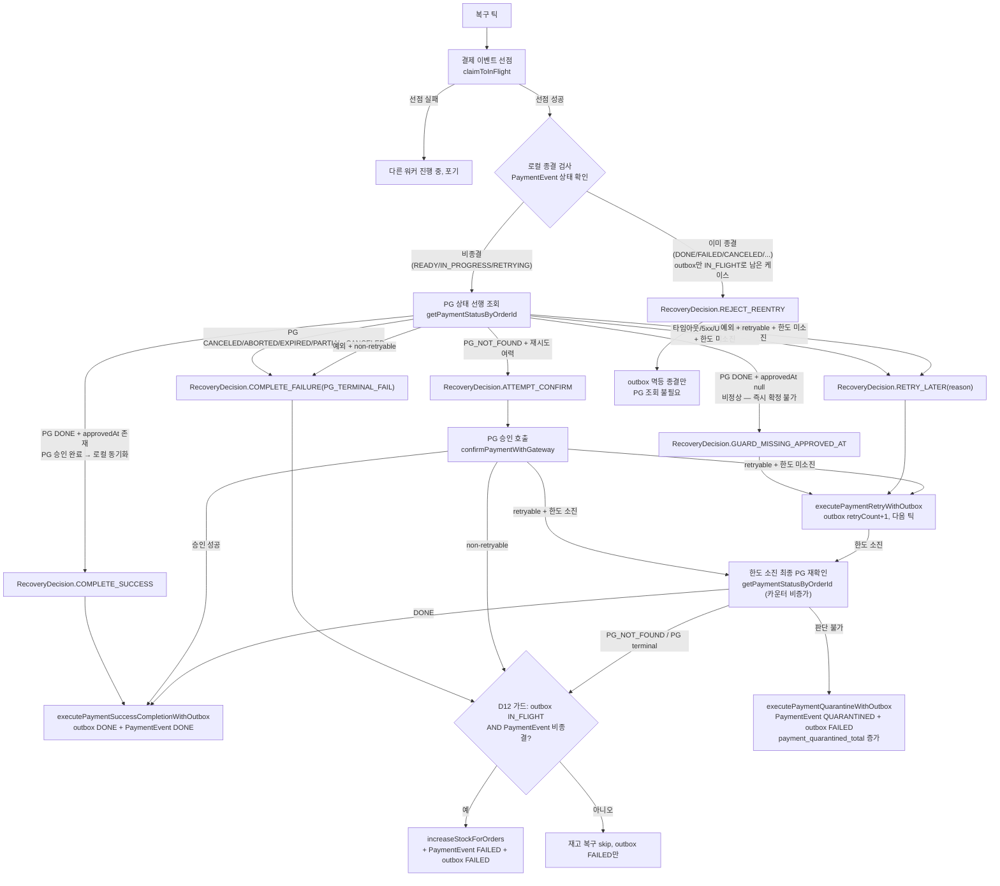
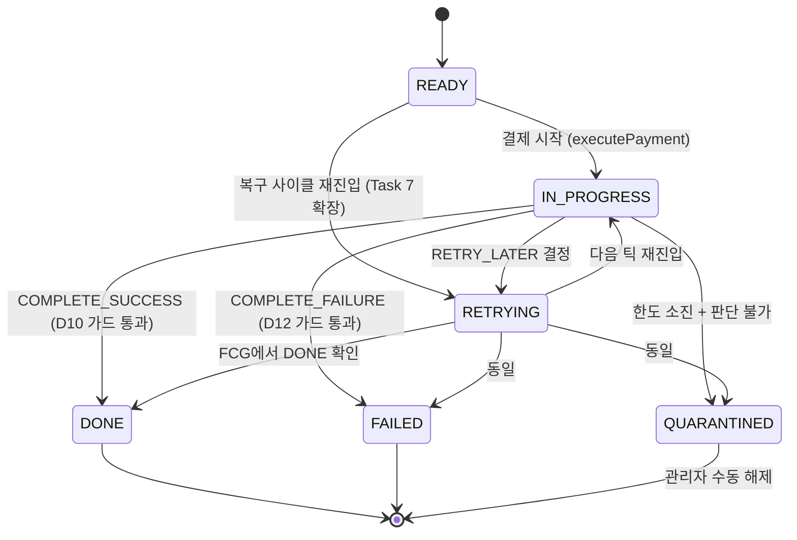

# PAYMENT-DOUBLE-FAULT-RECOVERY — 실행 계획

> 출처: [docs/topics/PAYMENT-DOUBLE-FAULT-RECOVERY.md](topics/PAYMENT-DOUBLE-FAULT-RECOVERY.md)
> 날짜: 2026-04-09 / Round 2 (plan)

---

## 요약 브리핑

### Task 목록 (11개, layer 의존 순서)

| # | 계층 | 태스크 | tdd | domain_risk | 핵심 결정 |
|---|---|---|---|---|---|
| 1 | domain | QUARANTINED 상태 + quarantine() 가드 | O | O | D4, D5 |
| 2 | domain | done() approvedAt null 가드 + fail() no-op | O | O | D10, minor3 |
| 3 | domain | UNKNOWN 제거 + 매핑 실패 예외 신설 | O | O | D3 |
| 4 | domain | RecoveryDecision 값 객체 + RecoveryReason | O | O | D1,D2,D4,D7 |
| 5 | application | quarantineWithOutbox TX 메서드 | O | O | D4,D5,D6 |
| 6 | application | D12 재고 복구 가드 (TX 내 재조회) | O | O | D12, minor1 |
| 7 | domain | toRetrying() READY 허용 확장 | O | O | D11 |
| 8 | infra | getStatusByOrderId 예외 매핑 정비 | X | O | D1,D3 |
| 9 | scheduler | OutboxProcessingService 재작성 (핵심) | O | O | D1,D2,D7,D9,minor2 |
| 10 | infra | DB 스키마 QUARANTINED 마이그레이션 | X | X | D5 |
| 11 | application | Micrometer 카운터 추가 | X | X | §1.2 |

### 변경 후 전체 플로우차트

#### 복구 사이클 (OutboxProcessingService.process 재작성)



#### PaymentEventStatus 상태 머신



### 핵심 결정 → Task 매핑

| 결정 | Task |
|---|---|
| D1 getStatus 선행 | 4, 8, 9 |
| D2 재시도 N=3 | 4, 9 |
| D3 UNKNOWN 제거 | 3, 8 |
| D4/D5 QUARANTINED | 1, 5, 10 |
| D6 outbox=FAILED | 5 |
| D7 한도 소진 분기 | 4, 9 |
| D8 Idempotency-Key | 9 (기존 유지) |
| D9 claimToInFlight | 9 (기존 유지) |
| D10 done() 가드 | 2 |
| D11 계층 배치 | 4, 5, 6, 9 |
| D12 재고 가드 | 6 |
| minor1 TX 내 재조회 | 6 |
| minor2 FCG 카운터 비증가 | 9 |
| minor3 fail() no-op | 2 |

### 트레이드오프 / 후속 작업

- 복구 틱당 PG 호출 1회 추가 (getStatus 선행) — 돈 정확성과 교환
- D6 관측 한계: outbox만으로 실패/격리 구분 불가 — 메트릭 보완
- QUARANTINED 수동 해제 UI/운영 절차는 본 작업 범위 밖
- Task 8과 10은 병렬 실행 가능

---

## 개요

이중장애(로컬 DB ↔ PG 상태 불일치) 16개 케이스를 전수 방어한다.
핵심 변경은 `OutboxProcessingService.process`를 "getStatus 선행 → RecoveryDecision → apply" 단일 진입점으로 재작성하는 것이며,
이를 위한 선행 작업(도메인 모델 변경, 예외 신설, 격리 TX 추가)을 layer 의존 순서로 분해한다.

layer 의존 순서: domain → application(port/usecase) → infrastructure(gateway) → scheduler

---

## 태스크 목록

---

### Task 1: `PaymentEventStatus.QUARANTINED` 추가 + `PaymentEvent.quarantine()` 가드

**설명**
`PaymentEventStatus` enum에 `QUARANTINED` 값을 추가하고, 도메인 엔티티에 `quarantine(String reason, LocalDateTime)` 진입 메서드를 작성한다.
허용 source 상태: `READY` / `IN_PROGRESS` / `RETRYING`. 그 외는 `PaymentStatusException`.

**결정 ID 참조**: D4, D5

**변경 파일**
- `payment/domain/enums/PaymentEventStatus.java` — `QUARANTINED` 값 추가
- `payment/domain/PaymentEvent.java` — `quarantine(String reason, LocalDateTime)` 메서드 추가
- `payment/exception/common/PaymentErrorCode.java` — `INVALID_STATUS_TO_QUARANTINE` 에러코드 추가

**tdd**: true
**domain_risk**: true

**테스트 클래스**: `src/test/java/.../payment/domain/PaymentEventTest.java` (기존 파일에 추가)

**테스트 메서드 스펙**
```
quarantine_Success(PaymentEventStatus)
  @ParameterizedTest @EnumSource(names = {"READY","IN_PROGRESS","RETRYING"})
  → status == QUARANTINED, statusReason == reason

quarantine_InvalidStatus(PaymentEventStatus)
  @ParameterizedTest @EnumSource(names = {"DONE","FAILED","CANCELED","PARTIAL_CANCELED","EXPIRED","QUARANTINED"})
  → throws PaymentStatusException
```

**완료 조건**
- [x] `PaymentEventStatus.QUARANTINED` enum 값 존재
- [x] `quarantine()` 비허용 source에서 `PaymentStatusException` throw
- [x] `quarantine()` 허용 source에서 status/statusReason 정상 전이
- [x] `./gradlew test` 통과

**완료 결과**: 256개 테스트 전체 pass. `QUARANTINED` enum 추가, `quarantine()` 메서드 추가(허용: READY/IN_PROGRESS/RETRYING, 그 외 PaymentStatusException), `INVALID_STATUS_TO_QUARANTINE` 에러코드 추가.

---

### Task 2: `PaymentEvent.done()` approvedAt null 가드 + `markPaymentAsFail()` 종결 재호출 no-op 전환

**설명**
두 domain invariant를 한 커밋에 완결한다.
(1) `PaymentEvent.done(approvedAt, ...)`: `approvedAt == null`이면 `PaymentStatusException` throw (D10).
(2) `PaymentEvent.fail(reason, ...)`: 이미 종결(`FAILED`/`DONE`/`CANCELED`/`PARTIAL_CANCELED`/`EXPIRED`/`QUARANTINED`) 상태이면 예외 대신 **no-op** 처리 — discuss-domain-2 minor 3번 반영.
현재 `fail()` 은 종결 source에서 `PaymentStatusException`을 던지는데, D12 가드(TX2N 경로)는 이미 종결 상태라면 재고 복구는 건너뛰고 `markPaymentAsFail`만 호출한다. 이 경로에서 예외 전파를 피하기 위해 no-op으로 변경한다.

**결정 ID 참조**: D10, discuss-domain-2 minor 3

**변경 파일**
- `payment/domain/PaymentEvent.java` — `done()` null 가드, `fail()` 종결 재호출 no-op 분기
- `payment/exception/common/PaymentErrorCode.java` — `MISSING_APPROVED_AT` 에러코드 추가

**tdd**: true
**domain_risk**: true

**테스트 클래스**: `src/test/java/.../payment/domain/PaymentEventTest.java`

**테스트 메서드 스펙**
```
<!-- ARCHITECT: approvedAt null 가드는 status 가드보다 먼저 실행되어야 한다. 즉 done()에서 if (approvedAt == null) throw를 상태 검사 이전에 배치할 것. 그래야 어떤 source 상태에서든 null approvedAt이 거부된다. 테스트에서 DONE source + null approvedAt 조합은 allArgsBuilder로만 생성 가능하므로 현실에선 불가능한 시나리오지만, domain invariant 검증 목적으로 유효하다. -->
done_NullApprovedAt_ThrowsPaymentStatusException()
  → 허용 source(IN_PROGRESS/RETRYING/DONE), approvedAt=null → throws PaymentStatusException(MISSING_APPROVED_AT)

done_WithApprovedAt_Success(PaymentEventStatus)
  @EnumSource(names = {"IN_PROGRESS","RETRYING","DONE"})
  → approvedAt non-null → status == DONE, approvedAt 저장됨

fail_AlreadyTerminalStatus_NoOp(PaymentEventStatus)
  @EnumSource(names = {"FAILED","DONE","CANCELED","PARTIAL_CANCELED","EXPIRED","QUARANTINED"})
  → status 변경 없음, 예외 없음

fail_ValidSource_Success(PaymentEventStatus)
  @EnumSource(names = {"READY","IN_PROGRESS","RETRYING"})
  → status == FAILED, statusReason 저장됨
```

**완료 조건**
- [x] `done(null, ...)` 호출 시 `PaymentStatusException` throw
- [x] `fail()` 종결 source에서 no-op (예외 없음, status 불변)
- [x] 기존 `done()`/`fail()` 정상 경로 회귀 없음
- [x] `./gradlew test` 통과

**완료 결과** (2026-04-10)
- `PaymentEvent.done()`: approvedAt null 가드를 상태 검사 이전에 배치 — null 시 MISSING_APPROVED_AT(E03027) 코드로 PaymentStatusException throw
- `PaymentEvent.fail()`: `isTerminalStatus()` private 메서드로 종결 상태 판별 후 early return (no-op) — FAILED/DONE/CANCELED/PARTIAL_CANCELED/EXPIRED/QUARANTINED 대상
- `PaymentErrorCode.MISSING_APPROVED_AT` 에러코드 추가
- 전체 264개 테스트 통과

---

### Task 3: `PaymentStatus.UNKNOWN` 제거 + `PaymentGatewayStatusUnmappedException` 신설

<!-- ARCHITECT: PaymentGatewayStatusUnmappedException은 PaymentStatus.of()에서 throw된다. PaymentStatus는 payment/domain/dto/enums/ 패키지에 위치하므로, 이 예외가 payment/exception/에 놓이면 domain → exception 방향의 의존이 생긴다. 현재 코드베이스에서 PaymentStatusException 등도 동일 패턴(domain/에서 payment/exception/의 에러코드 참조)이므로 기존 관례와 일관되지만, 이 의존 방향이 확대되지 않도록 유의할 것. -->

**설명**
`PaymentStatus` enum에서 `UNKNOWN` 값을 제거하고, `of()` fallback 로직을 삭제한다.
매핑 실패 시 `PaymentGatewayStatusUnmappedException`(unchecked, domain 예외)을 throw하도록 교체한다.
`PaymentStatus.of()`를 사용하는 기존 코드(infra mapper)도 함께 수정한다.

**결정 ID 참조**: D3

**변경 파일**
- `payment/domain/dto/enums/PaymentStatus.java` — `UNKNOWN` 제거, `of()` orElseThrow 방식으로 변경
- `payment/exception/PaymentGatewayStatusUnmappedException.java` — 신규 (unchecked)
- `payment/exception/common/PaymentErrorCode.java` — `UNMAPPED_GATEWAY_STATUS` 에러코드 추가
- `payment/infrastructure/gateway/toss/TossPaymentGatewayStrategy.java` — `getStatusByOrderId` 매핑 경로 수정 (존재하면)
- 기존 `PaymentStatus.of()` 호출 사이트 전수 확인 후 수정

**tdd**: true
**domain_risk**: true

**테스트 클래스**: `src/test/java/.../payment/domain/PaymentStatusTest.java` (신규)

**테스트 메서드 스펙**
```
of_UnknownValue_ThrowsPaymentGatewayStatusUnmappedException()
  → PaymentStatus.of("SOME_UNKNOWN_VALUE") → throws PaymentGatewayStatusUnmappedException

of_KnownValues_ReturnsCorrectStatus(String, PaymentStatus)
  @CsvSource({"DONE,DONE","CANCELED,CANCELED","ABORTED,ABORTED","EXPIRED,EXPIRED",
              "PARTIAL_CANCELED,PARTIAL_CANCELED","IN_PROGRESS,IN_PROGRESS",
              "WAITING_FOR_DEPOSIT,WAITING_FOR_DEPOSIT"})
  → 정상 매핑 확인
```

**완료 조건**
- [x] `PaymentStatus.UNKNOWN` enum 값 미존재
- [x] 알 수 없는 값 → `PaymentGatewayStatusUnmappedException` throw
- [x] 기존 mapper 컴파일 에러 없음
- [x] `./gradlew test` 통과

**완료 결과** (2026-04-10)
- `PaymentStatus.UNKNOWN` 제거, `of()` fallback `orElse(UNKNOWN)` → `orElseThrow(PaymentGatewayStatusUnmappedException::of)` 로 교체
- `PaymentGatewayStatusUnmappedException` 신규 unchecked 예외 추가 (`UNMAPPED_GATEWAY_STATUS` E03028)
- `TossPaymentGatewayStrategy.mapToPaymentStatus()` default 분기를 `PaymentStatus.of(tossStatus)` 위임으로 교체 — 알 수 없는 Toss 상태는 예외로 전파
- 전체 272개 테스트 통과

---

### Task 4: `RecoveryDecision` 도메인 값 객체 + `RecoveryReason` enum 신설

**설명**
`payment/domain/` 하위에 순수 도메인 값 객체 `RecoveryDecision`과 `RecoveryReason` enum을 작성한다.
Spring 의존 없음. <!-- ARCHITECT: from() 시그니처 불일치 — 설명에는 from(PaymentEvent, PaymentStatusResult)로 되어 있지만, 테스트 스펙은 retryable 예외/unmapped 예외/retryCount 조건을 포함한다. 실제 팩토리는 (1) 정상 응답 경로: from(PaymentEvent, PaymentStatusResult, int retryCount, int maxAttempts), (2) 예외 경로: fromException(PaymentEvent, ExceptionType, int retryCount, int maxAttempts) 또는 오버로드가 필요하다. 구현 시점에 시그니처를 확정할 것. Spring 의존 없이 RetryPolicy record를 직접 받는 것도 가능. -->
<!-- PLANNER Round 2: 안 A 선택 — 정적 팩토리 2개로 확정. (1) 정상 응답 경로: from(PaymentEvent, PaymentStatusResult, int retryCount, int maxRetries), (2) 예외 경로: fromException(PaymentEvent, Exception, int retryCount, int maxRetries). PaymentCommandUseCase 호출 사이트가 두 경로를 분기해 각 팩토리를 호출한다. 통합 파라미터 객체(안 B)는 도입 비용 대비 이점이 적어 기각. -->
정적 팩토리 시그니처 확정:
- `RecoveryDecision.from(PaymentEvent event, PaymentStatusResult result, int retryCount, int maxRetries)` — 정상 응답 경로
- `RecoveryDecision.fromException(PaymentEvent event, Exception exception, int retryCount, int maxRetries)` — 예외 경로 (retryable/non-retryable/unmapped 예외 타입을 instanceof 분기로 구분)

| Decision | 조건 | 설명 |
|---|---|---|
| `REJECT_REENTRY` | event.status ∈ {DONE,FAILED,CANCELED,PARTIAL_CANCELED,EXPIRED,QUARANTINED} | **로컬 종결 재진입 차단** — PaymentEvent는 이미 종결됐지만 outbox가 IN_FLIGHT로 남아 스케줄러가 재픽업한 케이스. PG 조회 없이 outbox만 종결 처리한다. |
| `COMPLETE_SUCCESS` | pgStatus == DONE && approvedAt != null | **PG 응답 기반 성공 복구** — PG 조회 결과 승인 완료이므로 로컬 PaymentEvent를 DONE으로 동기화한다. |
| `GUARD_MISSING_APPROVED_AT` | pgStatus == DONE && approvedAt == null | PG는 DONE이지만 approvedAt이 없는 비정상 상태. 즉시 확정할 수 없어 재시도로 전환한다. |
| `COMPLETE_FAILURE(reason)` | pgStatus ∈ {CANCELED,ABORTED,EXPIRED,PARTIAL_CANCELED} | PG가 최종 실패 상태이므로 로컬도 실패 처리 + 재고 복구를 진행한다. |
| `ATTEMPT_CONFIRM` | pgStatus == NOT_FOUND (PG_NOT_FOUND non-retryable 예외로 전달) | PG에 결제 기록이 없으므로 승인 요청을 새로 시도한다. |
| `RETRY_LATER(reason)` | pgStatus ∈ {IN_PROGRESS,WAITING_FOR_DEPOSIT} 또는 조회 예외(retryable) — retryCount < N | PG가 아직 처리 중이거나 일시적 오류. 다음 틱에서 재시도한다. |
| `QUARANTINE(reason)` | retryCount >= N 이후 판단 불가 | 재시도 한도를 소진했지만 성공/실패 판단이 불가. 수동 개입을 위해 격리한다. |

`RecoveryReason`: `PG_TERMINAL_FAIL`, `PG_NOT_FOUND`, `PG_IN_PROGRESS`, `GATEWAY_STATUS_UNKNOWN`, `UNMAPPED`, `CONFIRM_RETRYABLE_FAILURE`, `CONFIRM_EXHAUSTED`

`PaymentStatusResult`는 이미 존재하는 record를 재사용한다. "PG 없는 주문"은 `PaymentGatewayPort.getStatusByOrderId`가 non-retryable 예외를 던지면 호출자가 `ATTEMPT_CONFIRM`으로 환원하는 방식으로 처리한다.

**결정 ID 참조**: D1, D2, D3, D4, D7, D11

**변경 파일**
- `payment/domain/RecoveryDecision.java` — 신규
- `payment/domain/enums/RecoveryReason.java` — 신규

**tdd**: true
**domain_risk**: true

**테스트 클래스**: `src/test/java/.../payment/domain/RecoveryDecisionTest.java` (신규)

**테스트 메서드 스펙**
```
// --- from(PaymentEvent, PaymentStatusResult, int retryCount, int maxRetries) ---

from_LocalTerminal_RejectsReentry(PaymentEventStatus)
  @EnumSource(names = {"DONE","FAILED","CANCELED","PARTIAL_CANCELED","EXPIRED","QUARANTINED"})
  from(terminalEvent, anyResult, retryCount=0, maxRetries=3)
  → REJECT_REENTRY

from_PgDoneWithApprovedAt_CompleteSuccess()
  from(inProgressEvent, result(DONE, approvedAt=non-null), retryCount=0, maxRetries=3)
  → COMPLETE_SUCCESS

from_PgDoneWithNullApprovedAt_GuardMissingApprovedAt()
  from(inProgressEvent, result(DONE, approvedAt=null), retryCount=0, maxRetries=3)
  → GUARD_MISSING_APPROVED_AT

from_PgTerminalFail_CompleteFailure(PaymentStatus)
  @EnumSource(names = {"CANCELED","ABORTED","EXPIRED","PARTIAL_CANCELED"})
  from(inProgressEvent, result(terminalStatus), retryCount=0, maxRetries=3)
  → COMPLETE_FAILURE, reason == PG_TERMINAL_FAIL

from_PgInProgress_UnderLimit_RetryLater()
  from(inProgressEvent, result(IN_PROGRESS), retryCount=1, maxRetries=3)
  → RETRY_LATER, reason == PG_IN_PROGRESS

from_PgInProgress_AtLimit_Quarantine()
  from(inProgressEvent, result(IN_PROGRESS), retryCount=3, maxRetries=3)
  → QUARANTINE, reason == PG_IN_PROGRESS

// --- fromException(PaymentEvent, Exception, int retryCount, int maxRetries) ---

fromException_RetryableException_UnderLimit_RetryLater()
  fromException(inProgressEvent, PaymentTossRetryableException, retryCount=1, maxRetries=3)
  → RETRY_LATER, reason == GATEWAY_STATUS_UNKNOWN

fromException_RetryableException_AtLimit_Quarantine()
  fromException(inProgressEvent, PaymentTossRetryableException, retryCount=3, maxRetries=3)
  → QUARANTINE, reason == GATEWAY_STATUS_UNKNOWN

fromException_UnmappedException_UnderLimit_RetryLater()
  fromException(inProgressEvent, PaymentGatewayStatusUnmappedException, retryCount=1, maxRetries=3)
  → RETRY_LATER, reason == UNMAPPED

fromException_UnmappedException_AtLimit_Quarantine()
  fromException(inProgressEvent, PaymentGatewayStatusUnmappedException, retryCount=3, maxRetries=3)
  → QUARANTINE, reason == UNMAPPED

fromException_NonRetryableException_AttemptConfirm()
  fromException(inProgressEvent, PaymentTossNonRetryableException, retryCount=0, maxRetries=3)
  → ATTEMPT_CONFIRM
```

**완료 조건**
- [x] `RecoveryDecision.from()` 전 분기 구현
- [x] `REJECT_REENTRY` / `COMPLETE_SUCCESS` / `COMPLETE_FAILURE` / `ATTEMPT_CONFIRM` / `RETRY_LATER` / `QUARANTINE` / `GUARD_MISSING_APPROVED_AT` 모두 테스트 커버
- [x] Spring 의존 없음 (순수 Java)
- [x] `./gradlew test` 통과

**완료 결과** (2026-04-10)
- `RecoveryDecision` record 신규: `from()` / `fromException()` 정적 팩토리 구현
  - `from()`: 로컬 종결 → REJECT_REENTRY, PG DONE+approvedAt → COMPLETE_SUCCESS, PG DONE+null → GUARD_MISSING_APPROVED_AT, PG 종결 실패 → COMPLETE_FAILURE(PG_TERMINAL_FAIL), PG 진행 중 → RETRY_LATER/QUARANTINE(PG_IN_PROGRESS)
  - `fromException()`: PaymentTossNonRetryableException → ATTEMPT_CONFIRM, PaymentGatewayStatusUnmappedException → RETRY_LATER/QUARANTINE(UNMAPPED), PaymentTossRetryableException → RETRY_LATER/QUARANTINE(GATEWAY_STATUS_UNKNOWN)
- `RecoveryReason` enum 신규: 7개 사유 정의
- `PaymentTossRetryableException` / `PaymentTossNonRetryableException` checked 예외 신규
- 전체 291개 테스트 통과

---

### Task 5: `PaymentTransactionCoordinator.executePaymentQuarantineWithOutbox` 추가

<!-- ARCHITECT: markPaymentAsQuarantined(PaymentEvent, String)는 내부에서 paymentEvent.quarantine(reason, localDateTimeProvider.now())를 호출해야 한다. PaymentCommandUseCase가 이미 LocalDateTimeProvider를 주입받고 있는지 확인할 것 — markPaymentAsDone/markPaymentAsFail 패턴과 동일하게 처리. 변경 파일 목록에 LocalDateTimeProvider 관련 수정은 불필요할 가능성이 높으나(이미 주입됨), 확인 필수. -->

**설명**
격리 전이 TX 메서드를 추가한다. `outbox.toFailed()` + `paymentCommandUseCase.markPaymentAsQuarantined(paymentEvent, reason)` 순으로 단일 TX 내 실행.
`markPaymentAsQuarantined`는 `PaymentCommandUseCase`에 추가한다 (`quarantine()` 도메인 메서드 위임).
재고 복구 없음 — `QUARANTINED`는 "PG 상태 미확정"이므로 자동 재고 복구 금지.

**결정 ID 참조**: D4, D5, D6, D11

**변경 파일**
- `payment/application/usecase/PaymentCommandUseCase.java` — `markPaymentAsQuarantined(PaymentEvent, String)` 추가
- `payment/application/usecase/PaymentTransactionCoordinator.java` — `executePaymentQuarantineWithOutbox(PaymentEvent, PaymentOutbox, String)` 추가

**tdd**: true
**domain_risk**: true

**테스트 클래스**: `src/test/java/.../payment/application/usecase/PaymentTransactionCoordinatorTest.java` (기존 파일에 추가)

**테스트 메서드 스펙**
```
executePaymentQuarantineWithOutbox_MarksEventQuarantinedAndOutboxFailed()
  given: IN_PROGRESS event + IN_FLIGHT outbox
  when: executePaymentQuarantineWithOutbox(event, outbox, "GATEWAY_STATUS_UNKNOWN")
  then: outbox.status == FAILED, event.status == QUARANTINED, increaseStockForOrders 미호출

executePaymentQuarantineWithOutbox_DoesNotRestoreStock()
  verify(orderedProductUseCase, never()).increaseStockForOrders(any())
```

**완료 조건**
- [x] `executePaymentQuarantineWithOutbox` 단일 `@Transactional` 내 실행
- [x] 재고 복구 호출 없음 검증
- [x] `./gradlew test` 통과

**완료 결과** (2026-04-10)
- `PaymentCommandUseCase.markPaymentAsQuarantined(PaymentEvent, String)` 추가: `quarantine(reason, now)` 도메인 메서드 위임, `@Transactional` + `@PublishDomainEvent` + `@PaymentStatusChange(toStatus="QUARANTINED")` 적용
- `PaymentTransactionCoordinator.executePaymentQuarantineWithOutbox(PaymentEvent, PaymentOutbox, String)` 추가: `outbox.toFailed()` → `paymentOutboxUseCase.save()` → `markPaymentAsQuarantined()` 순 단일 TX, 재고 복구 없음
- 전체 293개 테스트 통과

---

### Task 6: `executePaymentFailureCompensationWithOutbox` D12 가드 추가

<!-- ARCHITECT: 신규 의존성 추가 필요 — 현재 PaymentTransactionCoordinator는 PaymentLoadUseCase를 주입받지 않는다. TX 내 event 재조회를 위해 PaymentLoadUseCase(또는 PaymentEventRepository 직접)를 의존에 추가해야 한다. PaymentOutboxUseCase는 이미 주입되어 있으므로 outbox 재조회는 가능. 변경 파일 목록에 PaymentTransactionCoordinator의 생성자 파라미터 변경을 명시할 것. 또한 기존 테스트(PaymentTransactionCoordinatorTest)가 @InjectMocks 패턴이므로 mock 추가도 필요. -->

**설명**
현재 무방어인 `executePaymentFailureCompensationWithOutbox`에 D12 가드를 추가한다.
TX 내부에서 `outbox` 및 `paymentEvent`를 **재조회(fresh load)**하여 조건을 검증한다 — discuss-domain-2 minor 1번 반영.
조건: `outbox.status == IN_FLIGHT` AND `event.status ∈ {READY,IN_PROGRESS,RETRYING}` 양쪽 참일 때만 `increaseStockForOrders` 호출.
어느 하나라도 거짓이면 재고 복구 건너뜀, `markPaymentAsFail`만 수행 (fail no-op이므로 이미 종결이면 상태 불변).

**결정 ID 참조**: D12, discuss-domain-2 minor 1

**변경 파일**
- `payment/application/usecase/PaymentTransactionCoordinator.java` — `executePaymentFailureCompensationWithOutbox` 가드 추가, 생성자에 `PaymentLoadUseCase` 의존 추가 <!-- PLANNER Round 2: Critic F1/Domain minor 2 반영 — PaymentTransactionCoordinator는 현재 PaymentLoadUseCase를 주입받지 않음(생성자에 OrderedProductUseCase, PaymentCommandUseCase, PaymentOutboxUseCase만 존재). TX 내 event 재조회를 위해 PaymentLoadUseCase 의존을 생성자에 추가. 기존 테스트의 @InjectMocks 에 PaymentLoadUseCase mock도 추가 필요. -->
- `payment/application/usecase/PaymentOutboxUseCase.java` — `getByOrderId(String orderId)` 조회 메서드 확인/추가 (재조회용)

**tdd**: true
**domain_risk**: true

**테스트 클래스**: `src/test/java/.../payment/application/usecase/PaymentTransactionCoordinatorTest.java`

**테스트 메서드 스펙**
```
executePaymentFailureCompensation_OutboxInFlight_EventNonTerminal_RestoresStock()
  given: outbox.status=IN_FLIGHT, event.status=RETRYING (재조회 결과)
  then: increaseStockForOrders 1회 호출, markPaymentAsFail 호출

executePaymentFailureCompensation_OutboxAlreadyFailed_SkipsStock()
  given: outbox.status=FAILED (재조회 결과)
  then: increaseStockForOrders 미호출, markPaymentAsFail 호출 (no-op 가능)

executePaymentFailureCompensation_EventAlreadyTerminal_SkipsStock(PaymentEventStatus)
  @EnumSource(names = {"DONE","FAILED","QUARANTINED"})
  given: outbox.status=IN_FLIGHT, event.status=terminal (재조회 결과)
  then: increaseStockForOrders 미호출
```

**완료 조건**
- [x] TX 내 재조회 방식으로 가드 구현
- [x] 이중 재고 복구 경로 차단 테스트 통과
- [x] 기존 보상 정상 경로 회귀 없음
- [x] `./gradlew test` 통과

**완료 결과** (2026-04-10)
- `PaymentTransactionCoordinator`에 `PaymentLoadUseCase` 의존 추가 (생성자 파라미터 4개로 확장)
- `executePaymentFailureCompensationWithOutbox` 시그니처 변경: `(PaymentEvent, List, String, PaymentOutbox)` → `(String orderId, List, String failureReason)` — TX 내 재조회 기반으로 전환
- D12 가드: `outbox.status == IN_FLIGHT AND event.status ∈ {READY, IN_PROGRESS, RETRYING}` 양쪽 참일 때만 `increaseStockForOrders` 호출. outbox가 FAILED면 `toFailed()` 호출도 건너뜀(이미 종결)
- `OutboxProcessingService` 호출 사이트 2곳 새 시그니처로 변경
- `OutboxProcessingServiceTest` 검증 구문 새 시그니처로 수정
- 전체 297개 테스트 통과

---

### Task 7: `PaymentEvent.toRetrying()` source 상태 가드 확장 (READY 허용 추가)

**설명**
현재 `toRetrying()`은 `IN_PROGRESS` / `RETRYING` source만 허용한다. §6 `markPaymentAsRetrying` source 매트릭스에 따라 `READY`도 허용 source로 추가한다. 종결 상태(`DONE`/`FAILED`/`CANCELED`/`PARTIAL_CANCELED`/`EXPIRED`/`QUARANTINED`)에서의 호출은 `PaymentStatusException` throw를 유지한다.

**결정 ID 참조**: D11 (§6 상태 매트릭스)

**변경 파일**
- `payment/domain/PaymentEvent.java` — `toRetrying()` 허용 source에 `READY` 추가

**tdd**: true
**domain_risk**: true

**테스트 클래스**: `src/test/java/.../payment/domain/PaymentEventTest.java`

**테스트 메서드 스펙**
```
toRetrying_FromReady_Success()
  given: event.status = READY
  when: toRetrying(now)
  then: status == RETRYING, retryCount == 1

toRetrying_TerminalSource_Throws(PaymentEventStatus)
  @EnumSource(names = {"DONE","FAILED","CANCELED","PARTIAL_CANCELED","EXPIRED","QUARANTINED"})
  → throws PaymentStatusException
```

**완료 조건**
- [x] READY → RETRYING 전이 허용
- [x] 종결 source → 예외 유지
- [x] `./gradlew test` 통과

**완료 결과**
- `PaymentEvent.toRetrying()` 허용 source에 `READY` 추가 (IN_PROGRESS/RETRYING/READY → RETRYING)
- 종결 6종(DONE/FAILED/CANCELED/PARTIAL_CANCELED/EXPIRED/QUARANTINED) PaymentStatusException 유지
- 303개 테스트 전체 통과

---

### Task 8: `TossPaymentGatewayStrategy.getStatusByOrderId` 활성화 + 예외 매핑 정비

<!-- ARCHITECT: tdd: false로 되어 있지만, 이 경로는 전체 복구 사이클의 진입점이다. 예외 분류가 잘못되면 RecoveryDecision이 오판한다. FakeTossOperator에 getStatusByOrderId 시나리오(정상/404/5xx/타임아웃)를 추가하거나, 최소한 Task 9 통합 테스트에서 해당 경로가 커버되는지 확인할 것. 또한 PaymentGatewayPort.java의 주석 갱신만이 아니라, InternalPaymentGatewayAdapter가 getStatusByOrderId를 올바르게 위임하는지도 확인 필요 — 현재 이 어댑터가 해당 메서드를 구현하고 있는지 검증할 것. -->

**설명**
현재 "미사용" 주석이 달린 `getStatusByOrderId`를 복구 사이클에서 실제로 사용할 수 있도록 만든다.
Toss API 응답 → `PaymentStatusResult` 매핑 시 `PaymentStatus.of()` 예외 전파가 `PaymentGatewayStatusUnmappedException`으로 올라오는지 확인한다.
타임아웃/5xx → `PaymentTossRetryableException`, 404(없는 주문) → `PaymentTossNonRetryableException` 분류가 이 경로에도 동일하게 적용되는지 확인하고 누락 시 추가한다 (Task 3에서 `UNKNOWN` 제거에 따른 후속 정비).

**결정 ID 참조**: D1, D3, §3.4

**변경 파일**
- `payment/application/port/PaymentGatewayPort.java` — 주석 업데이트 (미사용 → 복구 경로 사용)
- `payment/infrastructure/gateway/toss/TossPaymentGatewayStrategy.java` — `getStatusByOrderId` 예외 분류 검증/수정

**tdd**: false
**domain_risk**: true <!-- PLANNER Round 2: Domain Expert minor 4 반영 — getStatusByOrderId 예외 분류가 RecoveryDecision 입력을 결정한다. 오분류(5xx를 non-retryable로 매핑 등) 시 ATTEMPT_CONFIRM이 잘못 발행되어 PG에 중복 승인 시도가 나갈 수 있으므로 domain_risk=true로 상향. tdd=false는 유지(infrastructure 정비 성격). Task 9 통합 테스트에서 예외 분류 경로가 커버되는지 확인 필요. -->

**산출물 위치**
- `TossPaymentGatewayStrategy.java` — `getStatusByOrderId` 메서드에 retryable/non-retryable 예외 분기 완비 (기존 `confirm` 경로와 동일 패턴)
- `PaymentGatewayPort.java` — 주석 갱신

**완료 조건**
- [x] `getStatusByOrderId` 미사용 주석 제거
- [x] 타임아웃/5xx → `PaymentTossRetryableException`, 404 → `PaymentTossNonRetryableException` 분류 확인
- [x] 매핑 실패 → `PaymentGatewayStatusUnmappedException` 전파 경로 확인
- [x] `./gradlew test` 통과

**완료 결과** (2026-04-10)
- `PaymentGatewayPort.getStatusByOrderId`: 주석 "미사용" → "복구 사이클 경로", `throws PaymentTossRetryableException, PaymentTossNonRetryableException` 선언 추가
- `PaymentGatewayStrategy.getStatusByOrderId`: 동일 주석/throws 갱신
- `InternalPaymentGatewayAdapter.getStatusByOrderId`: throws 전파 추가
- `TossPaymentGatewayStrategy.getStatusByOrderId`: WebClientResponseException(404 → NonRetryable, 5xx → Retryable, 그 외 → NonRetryable), WebClientRequestException(타임아웃 포함 → Retryable) 예외 분류 구현. 매핑 실패(알 수 없는 status값)는 `PaymentStatus.of()` → `PaymentGatewayStatusUnmappedException`이 try 블록 외부로 전파됨.
- 303개 테스트 전체 통과

---

### Task 9: `OutboxProcessingService.process` — getStatus 선행 단일 진입점으로 재작성

<!-- ARCHITECT: 핵심 layer 이슈 — OutboxProcessingService(scheduler 계층)가 getStatusByOrderId를 호출하려면, 현재처럼 PaymentCommandUseCase(application)를 경유하는 경로가 필요하다. 직접 PaymentGatewayPort를 scheduler에 주입하면 scheduler → application/port 의존이 생겨 hexagonal 규칙(scheduler는 application use-case만 의존)을 위반한다. PaymentCommandUseCase 또는 PaymentLoadUseCase에 getStatusByOrderId 위임 메서드를 추가하는 것이 올바른 배치다. 변경 파일 목록에 PaymentCommandUseCase(또는 별도 use case)의 getStatusByOrderId 위임 메서드 추가를 명시할 것. -->

**설명**
`process(orderId)` 메서드를 §3.1 구조로 재작성한다.
`getStatusByOrderId` 선행 호출 → `RecoveryDecision.from()` → decision switch → 각 TX 메서드로 위임.
`ATTEMPT_CONFIRM` 결정 시에는 기존 `confirmPaymentWithGateway` 호출 후 `PaymentConfirmResultStatus`로 2차 분기.
D7 FCG 경로(한도 소진 시 getStatus 최종 1회 재호출): 소진 감지 시 `getStatusByOrderId`를 **카운터 비증가** 방식으로 1회 추가 호출 → 결과를 동일 `RecoveryDecision.from()` 논리로 재평가 — discuss-domain-2 minor 2번 반영.

```
process(orderId):
  claim = claimToInFlight(orderId)   → empty: return
  event = loadPaymentEvent(orderId)  → 실패: incrementRetryOrFail → return
  if event.status is terminal → REJECT_REENTRY → outbox 멱등 종결 → return
  snapshot = getStatusByOrderId(orderId)  (retryable/non-retryable/unmapped 예외 처리)
  decision = RecoveryDecision.from(event, snapshot, exception_type, retryCount)
  apply(decision, event, outbox)
```

FCG(Final Confirmation Gate): `policy.isExhausted(outbox.retryCount)` 감지 시, 마지막 결정이 QUARANTINE 분기에 앞서 getStatus 1회 재호출 (retryCount 증가 없음), 그 결과로 COMPLETE_SUCCESS / COMPLETE_FAILURE / QUARANTINE 최종 확정.

**결정 ID 참조**: D1, D2, D7, D8, D9, D11, discuss-domain-2 minor 2

<!-- ARCHITECT: 변경 파일 누락 — PaymentCommandUseCase.java(또는 새 use case)에 getStatusByOrderId 위임 메서드 추가가 필요하다. 또한 PaymentFailureUseCase와의 상호작용(현재 OutboxProcessingService에서 미사용이지만 기존 실패 라우팅 로직이 있다면)을 확인할 것. -->
<!-- PLANNER Round 2: Critic F1/F2 반영 — scheduler(OutboxProcessingService)는 application use-case만 의존해야 하므로 PaymentGatewayPort를 직접 주입할 수 없다. PaymentCommandUseCase가 이미 PaymentGatewayPort를 보유하고 있으므로, 위임 메서드 getPaymentStatusByOrderId(String orderId): PaymentStatusResult를 여기에 추가하는 것이 가장 자연스럽다. OutboxProcessingService는 PaymentCommandUseCase.getPaymentStatusByOrderId 를 통해 간접 호출하며, 예외(retryable/non-retryable/unmapped)는 그대로 위로 전파된다. -->
**변경 파일**
- `payment/application/usecase/PaymentCommandUseCase.java` — `getPaymentStatusByOrderId(String orderId): PaymentStatusResult` 위임 메서드 추가 (`paymentGatewayPort.getStatusByOrderId(orderId)` 단순 위임, 예외 변환 없음)
- `payment/scheduler/OutboxProcessingService.java` — `process()` 전면 재작성

**tdd**: true
**domain_risk**: true

**테스트 클래스**: `src/test/java/.../payment/scheduler/OutboxProcessingServiceTest.java` (기존 파일 확장)

**테스트 메서드 스펙**
```
process_PgDone_ApprovedAt_CompletesSuccess()
  getStatusByOrderId → DONE + approvedAt → executePaymentSuccessCompletionWithOutbox 1회

process_PgTerminalFail_CompensatesFailure()
  getStatusByOrderId → CANCELED → executePaymentFailureCompensationWithOutbox 1회

process_PgNotFound_AttemptsConfirm_ThenSuccess()
  getStatusByOrderId → PaymentTossNonRetryableException(PG_NOT_FOUND)
  confirmPaymentWithGateway → SUCCESS → executePaymentSuccessCompletionWithOutbox 1회

process_PgNotFound_AttemptsConfirm_ThenRetryable()
  confirmPaymentWithGateway → RETRYABLE_FAILURE, retryCount < N → executePaymentRetryWithOutbox

process_RetryableException_UnderLimit_RetriesLater()
  getStatusByOrderId → PaymentTossRetryableException → executePaymentRetryWithOutbox

process_RetryableException_Exhausted_FcgCallsGetStatus_ThenQuarantines()
  retryCount == N-1 (will exhaust) + FCG getStatus → retryable again → executePaymentQuarantineWithOutbox
  verify: getStatusByOrderId called twice (main + FCG), retryCount not incremented in FCG call

process_RetryableException_Exhausted_FcgCallsGetStatus_ThenDone()
  FCG getStatus → DONE + approvedAt → executePaymentSuccessCompletionWithOutbox

process_LocalTerminal_RejectsReentry()
  event.status = DONE → outbox 멱등 종결, confirmPaymentWithGateway 미호출

process_UnmappedStatus_UnderLimit_RetriesLater()
  getStatusByOrderId → PaymentGatewayStatusUnmappedException → executePaymentRetryWithOutbox

process_UnmappedStatus_Exhausted_Quarantines()
  → executePaymentQuarantineWithOutbox

process_ClaimFails_Returns()
  claimToInFlight → empty → 아무 downstream 호출 없음
```

**완료 조건**
- [x] 기존 테스트(재시도 소진→보상, NON_RETRYABLE 즉시 보상, IN_FLIGHT 타임아웃 복구) 회귀 없음
- [x] 16개 케이스 방어선 메서드 커버
- [x] FCG 경로: retryCount 미증가, getStatusByOrderId 2회 호출 검증
- [x] `./gradlew test` 통과

**완료 결과** (2026-04-10)
- `PaymentCommandUseCase.getPaymentStatusByOrderId(String orderId)` 위임 메서드 추가: `paymentGatewayPort.getStatusByOrderId(orderId)` 단순 위임, 예외 변환 없음 (`throws PaymentTossRetryableException, PaymentTossNonRetryableException`)
- `OutboxProcessingService.process()` 전면 재작성:
  - `claimToInFlight` → empty: return
  - `loadPaymentEvent` 실패: `incrementRetryOrFail` → return
  - 로컬 종결 상태 → `REJECT_REENTRY`: `outbox.toDone()` + `save()` → return
  - `getPaymentStatusByOrderId` 선행 조회 → `RecoveryDecision.from()/fromException()` 수립
  - `applyDecision()` switch: COMPLETE_SUCCESS/FAILURE/ATTEMPT_CONFIRM/RETRY_LATER/QUARANTINE/GUARD_MISSING_APPROVED_AT/REJECT_REENTRY
- D7 FCG(Final Confirmation Gate): RETRY_LATER(이번 retry 후 소진) 또는 QUARANTINE 시 getStatus 1회 재호출(retryCount 미증가), COMPLETE_SUCCESS/FAILURE → 해당 TX, 그 외 → quarantine
- `StatusResolution` 내부 레코드 도입: snapshot(approvedAt 포함)과 decision을 함께 전달하여 try 블록 외부 변수 재할당 없이 checked 예외 처리
- 14개 테스트 추가(기존 5개 교체 포함), 전체 311개 테스트 통과

---

### Task 10: DB 스키마 — `payment_event.status` `QUARANTINED` 값 추가 마이그레이션

**설명**
`payment_event` 테이블의 `status` 컬럼(VARCHAR/ENUM)에 `QUARANTINED` 값을 허용 추가하는 Flyway 마이그레이션을 작성한다.
컬럼 타입이 VARCHAR이면 constraint 없어 자동 허용되나, CHECK constraint / JPA `@Enumerated(STRING)` 사용 현황을 확인하고 필요 시 마이그레이션 파일 추가.

**결정 ID 참조**: D5

**변경 파일**
- `src/main/resources/db/migration/V{N}__add_quarantined_status.sql` — 신규 (필요 시)
- `payment/infrastructure/entity/PaymentEventEntity.java` — status 컬럼 확인

**tdd**: false
**domain_risk**: false

**산출물 위치**
- `src/main/resources/db/migration/` — 마이그레이션 파일 (없으면 생략 사유 주석)
- `PaymentEventEntity.java` — status 필드 확인 완료 주석

**완료 조건**
- [x] `QUARANTINED` 상태 DB 저장/조회 정상 동작 확인
- [x] 기존 status 값 영향 없음
- [x] `./gradlew test` 통과

**완료 결과** (2026-04-10)
- `PaymentEventEntity.status` 필드는 `@Enumerated(EnumType.STRING)` + VARCHAR 컬럼으로 매핑 — CHECK constraint 없음
- Flyway 미사용 (`ddl-auto: create-drop` 테스트 / `ddl-auto: update` 운영), 별도 마이그레이션 파일 불필요
- `PaymentEventStatus.QUARANTINED`는 Task 1에서 이미 도메인 enum에 추가됨 — JPA가 자동 수용
- 별도 신규 파일 없음, 311개 테스트 전체 통과

---

### Task 11: Micrometer `payment_quarantined_total` 카운터 추가

<!-- ARCHITECT: 기존 @PaymentStatusChange AOP는 PaymentCommandUseCase 메서드에 걸려 있고, PaymentStatusMetricsAspect가 상태 전이를 카운트한다. QUARANTINED도 동일하게 markPaymentAsQuarantined에 @PaymentStatusChange를 붙이면 기존 aspect가 자동으로 잡을 수 있다. 별도 카운터(payment_quarantined_total)를 원하면 aspect 확장이 맞고, reason tag는 @PaymentStatusChange 어노테이션에 없는 정보이므로 (a) 어노테이션 파라미터 확장, (b) 별도 직접 카운터 기록 중 선택해야 한다. reason은 RecoveryReason(domain enum)이므로 aspect에서 접근하려면 메서드 파라미터나 반환값에서 추출해야 하는데, 이는 AOP 결합도를 높인다. 직접 PaymentCommandUseCase.markPaymentAsQuarantined 내부에서 MeterRegistry를 사용하는 것이 더 단순할 수 있으나, application use-case에 Micrometer 의존이 생긴다. 트레이드오프를 구현 시점에 판단할 것. -->

**설명**
`executePaymentQuarantineWithOutbox` 호출 또는 `markPaymentAsQuarantined` 완료 시 `payment_quarantined_total` 카운터를 1 증가시킨다.
tag: `reason` (RecoveryReason 문자열). 기존 `@PaymentStatusChange` AOP 패턴을 따라 새 annotation 또는 기존 aspect 확장으로 구현한다.

**결정 ID 참조**: §1.2 in-scope (QUARANTINED 관측 최저선), D4

**변경 파일**
- `core/common/metrics/` 또는 `payment/application/usecase/PaymentCommandUseCase.java` — 카운터 추가

**tdd**: false
**domain_risk**: false

**산출물 위치**
- `PaymentCommandUseCase.java` — `markPaymentAsQuarantined` 메서드에 카운터 기록
- 또는 기존 `PaymentStatusMetricsAspect` 확장

**완료 조건**
- [x] `payment_quarantined_total` Micrometer counter 등록
- [x] reason tag 포함
- [x] `./gradlew test` 통과

**완료 결과** (2026-04-10)
- `PaymentQuarantineMetrics` 신규 컴포넌트 추가 (`core/common/metrics/`): `payment_quarantined_total` Counter를 reason tag와 함께 `ConcurrentHashMap`으로 캐싱, `recordQuarantine(String reason)` 메서드
- `PaymentCommandUseCase.markPaymentAsQuarantined()`: `paymentEventRepository.saveOrUpdate()` 완료 후 `paymentQuarantineMetrics.recordQuarantine(reason)` 호출 — reason은 RecoveryReason 문자열 그대로 전달
- `PaymentCommandUseCaseTest`: `markPaymentAsQuarantined_RecordsQuarantineMetric` 테스트 추가 — `recordQuarantine(reason)` 1회 호출 검증
- 전체 312개 테스트 통과

---

## 의존 관계

```
Task 1 (QUARANTINED enum + quarantine())
  └─ Task 2 (done() null guard + fail() no-op)        [독립 — 같은 파일, 분리 커밋]
  └─ Task 7 (toRetrying READY 허용)                   [독립]
  └─ Task 5 (quarantineWithOutbox TX)  ← Task 1 선행 필수
  └─ Task 10 (DB migration)            ← Task 1 선행 필수

Task 3 (UNKNOWN 제거 + Unmapped예외)
  └─ Task 8 (TossStrategy getStatusByOrderId 정비)    ← Task 3 선행 필수
  └─ Task 4 (RecoveryDecision)                        ← Task 3 선행 필수

Task 4 (RecoveryDecision)
  ← Task 1, Task 3 선행 필수
  └─ Task 9 (OutboxProcessingService 재작성)          ← Task 4 선행 필수

Task 6 (D12 가드)
  ← Task 2 (fail no-op) 선행 필수 (종결 상태 재호출 안전)
  └─ Task 9 참조 (재진입 시 가드가 실제 동작)

Task 9 (OutboxProcessingService 재작성)
  ← Task 1, 2, 3, 4, 5, 6, 7, 8 모두 선행 완료 후

Task 11 (메트릭)
  ← Task 5 선행 필수
```

<!-- ARCHITECT: 실행 순서 검증 — hexagonal layer 순서(domain → application → infrastructure → scheduler) 관점에서 적절하다. Task 1,2,3,7(domain) → Task 4(domain) → Task 5,6(application) → Task 8(infrastructure) → Task 10(infrastructure/migration) → Task 9(scheduler) → Task 11(cross-cutting). 순환 의존 없음 확인. 단, Task 8과 Task 10은 독립적이므로 병렬 실행 가능. -->
**직렬 실행 권장 순서**: 1 → 2 → 3 → 7 → 4 → 5 → 6 → 8 → 10 → 9 → 11

---

## discuss 이월 minor 반영

| minor 번호 | 내용 | 반영 태스크 | 반영 내용 |
|---|---|---|---|
| minor 1 | D12 가드의 "event 비종결" 판정은 TX 내부 재조회인지 파라미터 snapshot인지 미명시 | Task 6 | TX 내 `paymentOutboxUseCase`/`paymentLoadUseCase` 재조회로 명시. 파라미터 snapshot 사용 금지. |
| minor 2 | FCG 단발 호출은 카운터 비증가, 실패 시 QUARANTINE 즉시 환원 | Task 9 | FCG getStatus 호출 시 `outbox.retryCount` 증가 없음. FCG 호출 자체 실패(retryable) → `QUARANTINE(GATEWAY_STATUS_UNKNOWN)` 즉시 확정. 테스트로 retryCount 미증가 검증. |
| minor 3 | 종결된 `PaymentEvent`에 `markPaymentAsFail` 호출 시 no-op vs 예외 | Task 2 | 현재 코드 확인 결과 `fail()`은 종결 source에서 `PaymentStatusException` throw. D12 가드(TX 내 재조회)가 재고 복구를 건너뛰더라도 `markPaymentAsFail`는 여전히 호출되므로, 예외 전파를 피하기 위해 **no-op**으로 변경. |

---

## 변경 후 전체 플로우차트

(후처리에서 추가 — §7 Mermaid 기반)

---

## 리스크 → 태스크 교차 참조

| discuss 리스크 / 결정 | 태스크 |
|---|---|
| D1 — getStatus 선행 단일 진입점 | Task 9 |
| D2 — 재시도 한도 N=3, 공유 카운터 | Task 9 |
| D3 — UNKNOWN 완전 제거 | Task 3 |
| D4 — QUARANTINED 격리 상태 도입 | Task 1, Task 5 |
| D5 — QUARANTINED는 PaymentEventStatus | Task 1, Task 10 |
| D6 — 격리 시 outbox=FAILED + event=QUARANTINED | Task 5 |
| D7 — 한도 소진 시 FCG getStatus 최종 재확인 | Task 9 |
| D8 — Idempotency-Key orderId pass-through | Task 9 (기존 구조 유지 확인) |
| D9 — claimToInFlight 유지 + DB 원자 연산 | Task 9 (기존 구조 유지) |
| D10 — done() approvedAt null 가드 | Task 2 |
| D11 — 계층 배치(RecoveryDecision → domain 등) | Task 4, Task 5, Task 9 |
| D12 — 재고 복구 재진입 방지 가드 | Task 6 |
| discuss-domain-2 minor 1 — D12 가드 TX 내 재조회 | Task 6 |
| discuss-domain-2 minor 2 — FCG 카운터 비증가 | Task 9 |
| discuss-domain-2 minor 3 — markPaymentAsFail no-op | Task 2 |

---

## 검증 요약

- **태스크 총 개수**: 11
- **domain_risk 태스크 개수**: 9 (Task 1, 2, 3, 4, 5, 6, 7, 8, 9) <!-- Round 2: Task 8 domain_risk false→true 상향 (Domain Expert minor 4) -->
- **topic.md 결정 중 태스크로 매핑하지 못한 항목**: 없음 (D1~D12 전수 매핑 완료)

---

## 코드 리뷰 피드백 반영 (2026-04-10)

### 수정 항목

- [x] **F-01/DE-2**: `RecoveryDecision.from()` — PG DONE + approvedAt=null + 소진 시 `QUARANTINE(GUARD_MISSING_APPROVED_AT)` 반환
  - `RecoveryReason.GUARD_MISSING_APPROVED_AT` 신규 추가
  - `OutboxProcessingService.applyDecision()` GUARD_MISSING_APPROVED_AT 분기: 소진 시 FCG 위임, 미소진 시 retry (RETRY_LATER와 동일 패턴)
  - `RecoveryDecisionTest`: 미소진/소진 분기 분리 테스트 + isTerminal() 테스트 추가
  - `OutboxProcessingServiceTest`: GUARD_MISSING_APPROVED_AT 미소진→retry, 소진→FCG→quarantine 테스트 추가

- [x] **F-02**: `PaymentEventStatus.isTerminal()` SSOT 도입
  - `PaymentEventStatus` enum에 `isTerminal()` 인스턴스 메서드 추가
  - `RecoveryDecision.LOCAL_TERMINAL_STATUSES` Set 제거 → `event.getStatus().isTerminal()` 사용
  - `OutboxProcessingService.LOCAL_TERMINAL_STATUSES` Set 제거 → `paymentEvent.getStatus().isTerminal()` 사용
  - `PaymentTransactionCoordinator.NON_TERMINAL_STATUSES` Set 제거 → `!freshEvent.getStatus().isTerminal()` 사용

- [x] **DE-1**: FCG 진입 시 stale paymentEvent 재조회
  - `handleFinalConfirmationGate` 시그니처에서 `paymentEvent` 파라미터 제거
  - 메서드 내부에서 `paymentLoadUseCase.getPaymentEventByOrderId(orderId)` fresh 재조회 후 사용

- [x] **F-04**: 미사용 `RecoveryReason` 값 제거
  - `PG_NOT_FOUND`, `CONFIRM_RETRYABLE_FAILURE` 제거

- [x] **F-03**: `catch(Exception e)` 의도 명시
  - `loadPaymentEvent` 메서드의 catch 블록은 의도적(어떤 예외든 outbox retry 메커니즘으로 처리)
  - 기존 주석(`// intentionally broad`) 유지

- [x] **F-05**: NonRetryable ATTEMPT_CONFIRM 근거 주석 — Javadoc으로 보강 (REFACTOR 커밋에서 처리)
- [x] **DE-3**: DE-1 수정으로 자동 해소
- [x] **DE-4**: rejectReentry TX 경계 밖 의도 주석 — REFACTOR 커밋에서 처리
- [x] **DE-5**: fromException 계약 Javadoc — REFACTOR 커밋에서 처리

**완료 결과** (2026-04-10)
- 전체 324개 테스트 통과
