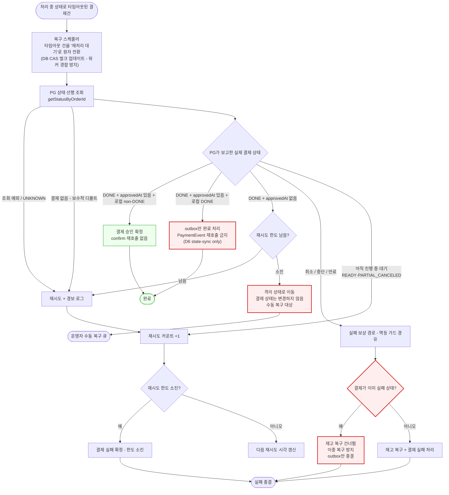
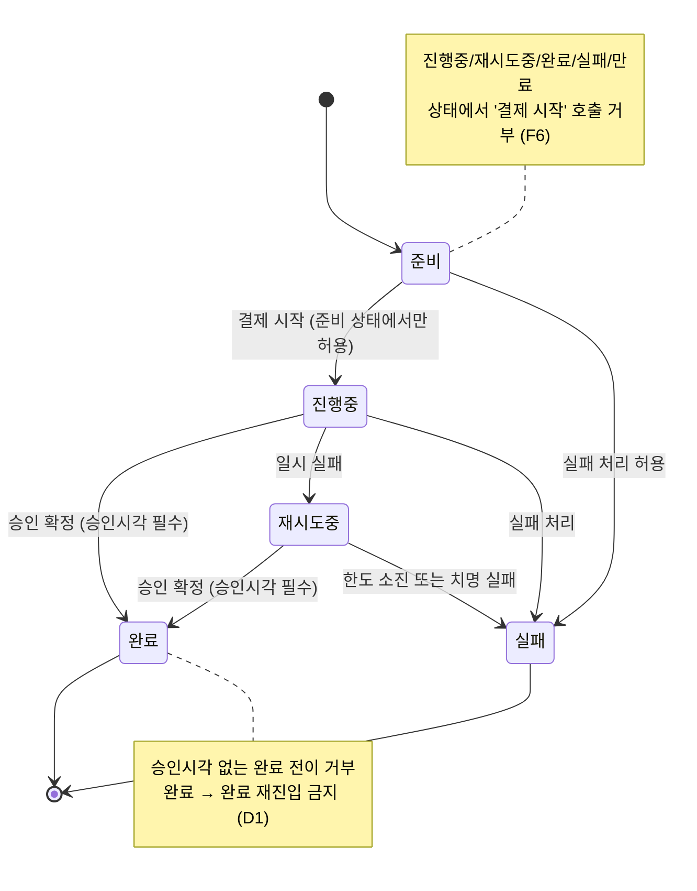

# PAYMENT-DOUBLE-FAULT-RECOVERY — 실행 계획

> Topic: [docs/topics/PAYMENT-DOUBLE-FAULT-RECOVERY.md](topics/PAYMENT-DOUBLE-FAULT-RECOVERY.md)
> 작성일: 2026-04-09
> Plan Round: 3 (대안 C 기반 전면 재작성)

---

## 개요

F1~F7 이중 장애(Double Fault) 복구 경로의 critical 체인을 단일 라운드에 해소한다.

**핵심 변경 (Round 2 대비)**:
- `OutboxProcessingService.process`의 복구 진입점을 `confirmPaymentWithGateway` → `paymentGatewayPort.getStatusByOrderId(orderId)` 선행으로 전환(대안 C Primary).
- `confirm()` 호출은 "PG에 결제 없음(1차 장애)" 분기에 한해서만 수행.
- Task 3(PaymentConfirmResultStatus.ALREADY_PROCESSED), Task 4(isAlreadyProcessed 플래그), Task 4.5(gateway→domain 매핑 어댑터) 삭제 — ALREADY_PROCESSED 분기가 복구 핫패스에서 제거됨. 매핑 버그(F5) 수정 자체는 Task 6에서 유지(진입 경로 최소화).
- Task 8a: getStatus 응답 기반 분류 헬퍼(`PaymentStatusResult` + `PaymentOutboxStatus.SUSPENDED`)로 재작성.
- Task 8b: getStatus 선행 플로우 + `PaymentStatus` 전 값 exhaustive 분기로 재작성.
- Task 11: 통합 테스트 시나리오 재작성 — 대안 C 기준 end-to-end 복구 경로.
- D6 대응: `getStatus=DONE` + 로컬 `PaymentEvent.status==DONE` → state-sync only(`PaymentOutbox.toDone`만 수행, `markPaymentAsDone` 재호출 금지).
- D9 대응: "결제 없음" 응답 포맷 실험 완료 전까지 보수적 디폴트(skip+retry+alert, confirm 금지) 적용.

레이어 의존 순서: port → domain → application → infrastructure → scheduler → test

---

## 태스크 목록

---

### Task 1 — PaymentOutboxRepository 포트에 CAS 복구 메서드 추가

- **목적**: `PaymentOutboxRepository` 포트에 `recoverTimedOutInFlight` 시그니처 추가. infrastructure 구현보다 포트를 선행 배치하여 소비자(use-case)가 의존 방향을 올바르게 유지하게 한다.
- **결정 ID**: §4-3, §4-2 (F4 CAS 전환), §8 트랜잭션 경계
- `tdd: false`
- `domain_risk: false`

**산출물**

- `src/main/java/com/hyoguoo/paymentplatform/payment/application/port/PaymentOutboxRepository.java`
  - 신규 메서드 시그니처:
    ```
    int recoverTimedOutInFlight(LocalDateTime cutoff, LocalDateTime now, Duration nextDelay);
    ```

---

### Task 2 — PaymentErrorCode 에러코드 추가 (DONE_REQUIRES_APPROVED_AT)

- **목적**: `PaymentEvent.done(approvedAt)` 불변식 강화 시 던질 신규 에러코드 도입. 도메인 계층 의존 항목이므로 선행 배치.
- **결정 ID**: §4-1 (F1)
- `tdd: false`
- `domain_risk: false`

**산출물**

- `src/main/java/com/hyoguoo/paymentplatform/payment/exception/common/PaymentErrorCode.java`
  - 신규 에러코드: `DONE_REQUIRES_APPROVED_AT`

---

### Task 3 — PaymentStatusResult 분류 헬퍼 추가 (getStatus 응답 기반)

- **목적**: §4-2 매핑표 — `PaymentStatus` 전 값 exhaustive 분기를 scheduler가 직접 소유하지 않도록 `PaymentStatusResult`에 분류 헬퍼를 추가한다. `isDone()` 단일 판정 금지(§4-3), 4분류 헬퍼로 응집도 확보. D6 state-sync only 분기를 위한 `isAlreadyDoneLocally` 판별은 application에서 수행하므로 헬퍼는 PG 응답 기반 4가지만 제공한다.
- **결정 ID**: §4-2 (D4, F-D-1), §4-3
- `tdd: true`
- `domain_risk: true` — 결제 상태 전이 분기 기반, money-leak 방지 분류 로직

**헬퍼 정의**

`PaymentStatusResult`에 추가할 메서드:
- `isSuccessfullyDone()`: `status == PaymentStatus.DONE && approvedAt != null`
- `isDoneWithNullApprovedAt()`: `status == PaymentStatus.DONE && approvedAt == null`
- `isTerminalFailure()`: `status == CANCELED || status == ABORTED || status == EXPIRED`
- `isStillPending()`: `status == IN_PROGRESS || status == WAITING_FOR_DEPOSIT || status == READY || status == PARTIAL_CANCELED`

**테스트 스펙**

- 파일: `src/test/java/com/hyoguoo/paymentplatform/payment/domain/PaymentStatusResultTest.java` (신규)
- 테스트 메서드:
  - `isSuccessfullyDone_doneWithNonNullApprovedAt_returnsTrue`
  - `isSuccessfullyDone_doneWithNullApprovedAt_returnsFalse`
  - `isSuccessfullyDone_nonDoneStatus_returnsFalse`: `@ParameterizedTest @EnumSource`(mode=EXCLUDE, DONE)
  - `isDoneWithNullApprovedAt_doneNullApprovedAt_returnsTrue`
  - `isDoneWithNullApprovedAt_doneWithApprovedAt_returnsFalse`
  - `isTerminalFailure_canceledAbortedExpired_returnsTrue`: `@ParameterizedTest @EnumSource`(CANCELED, ABORTED, EXPIRED)
  - `isTerminalFailure_otherStatuses_returnsFalse`: `@ParameterizedTest @EnumSource`(mode=EXCLUDE, CANCELED/ABORTED/EXPIRED)
  - `isStillPending_pendingStatuses_returnsTrue`: `@ParameterizedTest @EnumSource`(IN_PROGRESS, WAITING_FOR_DEPOSIT, READY, PARTIAL_CANCELED)
  - `isStillPending_doneStatus_returnsFalse`

**산출물**

- `src/main/java/com/hyoguoo/paymentplatform/payment/domain/dto/PaymentStatusResult.java` (헬퍼 추가)

---

### Task 4 — PaymentOutbox에 SUSPENDED 상태 추가 (F-D-1 money-leak 방지)

- **목적**: F-D-1 money-leak 방지 — `DONE+approvedAt=null` 레코드가 retry budget 소진 시 일반 실패 보상 경로로 흘러 실제 승인된 결제를 FAILED+재고복구하는 money-leak 차단. `PaymentOutboxStatus.SUSPENDED` 신규 상태로 격리하여 보상 경로 진입을 원천 차단. SUSPENDED 레코드는 운영 수동 복구 대상.
- **결정 ID**: §4-2 (F-D-1, D4), §6 장애 시나리오 3번
- `tdd: true`
- `domain_risk: true` — money-leak, 결제 상태 전이, 멱등성

**설계 결정: DONE+approvedAt=null budget 소진 처리**

- `DONE+approvedAt=null` 분기에서 budget 소진 시 `PaymentOutbox.toSuspended(reason=DONE_NULL_APPROVED_AT)` 전환. `PaymentEvent` 상태는 변경하지 않는다(IN_PROGRESS/RETRYING 유지). 보상 경로(`executePaymentFailureCompletionWithOutbox`)는 절대 호출하지 않는다.
- 일반 budget 소진(`RETRYABLE` 축적)은 기존대로 `PaymentEvent.fail` + `PaymentOutbox.toFailed(RETRY_BUDGET_EXHAUSTED)`.

**테스트 스펙**

- 파일: `src/test/java/com/hyoguoo/paymentplatform/payment/domain/PaymentOutboxTest.java` (기존 확장)
- 테스트 메서드:
  - `toSuspended_fromInFlight_setsSuspendedStatus`: IN_FLIGHT 상태 outbox → `toSuspended(DONE_NULL_APPROVED_AT)` 호출 → `status == SUSPENDED` 확인
  - `toSuspended_reason_isPreserved`: reason 필드 보존 확인
  - `toSuspended_fromNonInFlight_throwsException`: PENDING/DONE/FAILED → 예외 발생 (IN_FLIGHT에서만 전환 허용)

**산출물**

- `src/main/java/com/hyoguoo/paymentplatform/payment/domain/enums/PaymentOutboxStatus.java` (`SUSPENDED` 추가)
- `src/main/java/com/hyoguoo/paymentplatform/payment/domain/PaymentOutbox.java` (`toSuspended` 메서드 추가)

---

### Task 5 — PaymentEvent.done() 불변식 강화 + fail() source state 정책 명시 (F1, D1, D3, F-D-3)

- **목적**: §4-1 결정 — `done(approvedAt)` 호출 시 `approvedAt == null` 거부 + DONE→DONE 자기루프 금지. READY-only execute 가드(F6)도 동시 적용. `fail()` 허용 source state(READY/IN_PROGRESS/RETRYING)를 테스트로 명시하여 보상 경로 일관성 확보(F-D-3).
- **결정 ID**: §4-1 (F1, F6, D1), §5-1 상태 다이어그램, F-D-3
- `tdd: true`
- `domain_risk: true` — 결제 상태 전이, 도메인 불변식

**테스트 스펙**

- 파일: `src/test/java/com/hyoguoo/paymentplatform/payment/domain/PaymentEventTest.java` (기존 파일 확장)
- 테스트 메서드:
  - `done_nullApprovedAt_throwsPaymentStatusException`: `approvedAt=null` 전달 → `PaymentStatusException` (`DONE_REQUIRES_APPROVED_AT`)
  - `done_nonNullApprovedAt_fromInProgress_succeeds`: IN_PROGRESS + non-null → DONE 전환 성공
  - `done_nonNullApprovedAt_fromRetrying_succeeds`: RETRYING + non-null → DONE 전환 성공
  - `done_reentryFromDone_throwsPaymentStatusException`: DONE→DONE 재진입 → `PaymentStatusException` (D1)
  - `done_invalidSourceStates_throwsPaymentStatusException`: `@ParameterizedTest @EnumSource`(READY, FAILED, EXPIRED) → `PaymentStatusException`
  - `execute_readyOnly_succeeds`: READY → IN_PROGRESS 성공 (F6)
  - `execute_nonReadyStates_throwsPaymentStatusException`: `@ParameterizedTest @EnumSource`(IN_PROGRESS, RETRYING, DONE, FAILED, EXPIRED) → `PaymentStatusException` (F6)
  - `fail_allowedSourceStates_succeeds`: `@ParameterizedTest @EnumSource`(READY, IN_PROGRESS, RETRYING) → FAILED 전환 성공 (F-D-3)
  - `fail_invalidSourceStates_throwsPaymentStatusException`: `@ParameterizedTest @EnumSource`(DONE, FAILED, EXPIRED) → `PaymentStatusException` (F-D-3 경계)

**산출물**

- `src/main/java/com/hyoguoo/paymentplatform/payment/domain/PaymentEvent.java`

---

### Task 6 — PaymentCommandUseCase.confirmPaymentWithGateway 실패 응답 정정 (F2)

- **목적**: §4-2 결정 — `SUCCESS`가 아닌 결과 status에서 `PaymentDetails` null 조립. "유령 DONE" DTO 상류 전파 제거(F2). 대안 C에서 `ALREADY_PROCESSED` 응답 자체는 복구 핫패스에서 거의 발생하지 않으나, confirm 경로는 여전히 존재(1차 장애 분기)하므로 방어적 정정 유지.
- **결정 ID**: §4-2 (F2, F5)
- `tdd: true`
- `domain_risk: true` — 결제 상태 전이 근거 DTO 조립, 외부 PG 연동 결과 처리

**테스트 스펙**

- 파일: `src/test/java/com/hyoguoo/paymentplatform/payment/application/usecase/PaymentCommandUseCaseTest.java` (기존 파일 확장)
- 테스트 메서드:
  - `confirmPaymentWithGateway_failureResponse_paymentDetailsIsNull`: `RETRYABLE_FAILURE` 응답 → `PaymentDetails == null` 검증
  - `confirmPaymentWithGateway_nonRetryableFailure_paymentDetailsIsNull`: `NON_RETRYABLE_FAILURE` 응답 → `PaymentDetails == null`
  - `confirmPaymentWithGateway_success_paymentDetailsPresent`: `SUCCESS` + non-null approvedAt → `PaymentDetails` 정상 조립

**산출물**

- `src/main/java/com/hyoguoo/paymentplatform/payment/application/usecase/PaymentCommandUseCase.java`

---

### Task 7 — PaymentOutboxUseCase.recoverTimedOutInFlightRecords CAS 전환 (F4)

- **목적**: §4-2 결정 — read-then-save 제거, 신규 포트 메서드 `recoverTimedOutInFlight` 위임. bulk CAS UPDATE를 통해 다중 워커 경합 해소.
- **결정 ID**: §4-2 (F4), §4-3, §8 트랜잭션 경계
- `tdd: true`
- `domain_risk: true` — race window, 멱등성 보장

**테스트 스펙**

- 파일: `src/test/java/com/hyoguoo/paymentplatform/payment/application/usecase/PaymentOutboxUseCaseTest.java` (기존 파일 확장)
- 테스트 메서드:
  - `recoverTimedOutInFlightRecords_delegatesToCasPort_returnsUpdatedCount`: Mock 포트 호출 검증 — `recoverTimedOutInFlight(cutoff, now, nextDelay)` 1회 호출, 반환값 로그
  - `recoverTimedOutInFlightRecords_zeroUpdated_logsInfo`: `updatedRows=0` → 로그 확인 (alert 없음)
  - `recoverTimedOutInFlightRecords_positiveUpdated_logsRecovery`: `updatedRows=3` → `cas_recovered=3` LogFmt 키 확인

**산출물**

- `src/main/java/com/hyoguoo/paymentplatform/payment/application/usecase/PaymentOutboxUseCase.java`

---

### Task 8 — OutboxProcessingService getStatus 선행 플로우 재작성 (F3, F5, F7, D4, D6, D9)

- **목적**: §4-2 결정 Round 3 재구성 — `process(orderId)` 진입 시 `paymentGatewayPort.getStatusByOrderId(orderId)` 선행 호출. `PaymentStatus` 전 값 exhaustive switch로 처리 경로 결정. D6 state-sync only 분기 구현. "결제 없음" 분기는 §11-7 실험 완료 전 보수적 디폴트(skip+retry+alert, confirm 금지) 적용. Task 3의 분류 헬퍼를 사용하여 응집도 확보.
- **결정 ID**: §4-2 (F3, F7, D4, D6, D9), §5-3 시퀀스, §6 장애 시나리오, §7 검증 전략, §8 TX 경계
- `tdd: true`
- `domain_risk: true` — 외부 PG 연동, 결제 상태 전이, 멱등성, 정합성, race window, money-leak

**getStatus 선행 플로우 요약**

```
process(orderId):
  1. claimToInFlight(orderId) [CAS]
  2. paymentGatewayPort.getStatusByOrderId(orderId) [TX 밖]
  3. switch(statusResult):
     - isSuccessfullyDone() + 로컬 DONE:    PaymentOutbox.toDone only (D6 state-sync)
     - isSuccessfullyDone() + 로컬 non-DONE: executePaymentSuccessCompletionWithOutbox(evt, approvedAt, outbox)
     - isDoneWithNullApprovedAt():            skip + incrementRetryOrFail + alert(pg_status=DONE approved_at=null)
                                              budget 소진 시 → toSuspended(DONE_NULL_APPROVED_AT) [F-D-1]
     - isTerminalFailure():                  executePaymentFailureCompletionWithOutbox + 재고 복구 멱등
     - isStillPending():                     skip + incrementRetryOrFail
     - "결제 없음"(보수적 디폴트):            skip + incrementRetryOrFail + alert [§11-7 실험 전 confirm 금지]
     - 예외(timeout/5xx):                    skip + incrementRetryOrFail
     - UNKNOWN/null:                         skip + incrementRetryOrFail + alert
```

**테스트 스펙**

- 파일: `src/test/java/com/hyoguoo/paymentplatform/payment/scheduler/OutboxProcessingServiceTest.java` (기존 파일 확장)
- 테스트 메서드:
  - `process_pgDone_localNonDone_executesSuccessCompletion`: `getStatus` → `DONE+approvedAt`, 로컬 non-DONE → `executePaymentSuccessCompletionWithOutbox` 1회 호출 (F7 차단 핵심)
  - `process_pgDone_localAlreadyDone_stateSyncOnly_noMarkPaymentAsDone`: `getStatus` → `DONE+approvedAt`, 로컬 DONE → `markPaymentAsDone` 미호출 + `PaymentOutbox.toDone`만 수행 (D6)
  - `process_pgDone_nullApprovedAt_incrementsRetryAndAlerts`: `isDoneWithNullApprovedAt()=true` → skip + `incrementRetry` + LogFmt `alert=true` (§4-2 DONE/null 행, F3)
  - `process_pgDone_nullApprovedAt_budgetExhausted_suspends`: `isDoneWithNullApprovedAt()=true` + budget 소진 → `PaymentOutbox.toSuspended(DONE_NULL_APPROVED_AT)` + `PaymentEvent` 상태 불변 (F-D-1)
  - `process_pgTerminalFailure_executesFailureCompletion`: `isTerminalFailure()=true` → `executePaymentFailureCompletionWithOutbox` (D4) `@ParameterizedTest`(CANCELED, ABORTED, EXPIRED)
  - `process_pgStillPending_skipAndIncrementRetry`: `isStillPending()=true` → skip + incrementRetry, `PaymentEvent` 상태 불변 (D2) `@ParameterizedTest`(IN_PROGRESS, WAITING_FOR_DEPOSIT, READY, PARTIAL_CANCELED)
  - `process_pgStillPending_ready_alertLogged`: `READY` 분기 → skip + incrementRetry + alert LogFmt 포함
  - `process_pgStillPending_partialCanceled_alertLogged`: `PARTIAL_CANCELED` 분기 → skip + incrementRetry + alert LogFmt 포함
  - `process_getStatusThrows_retryableFallback`: `getStatusByOrderId` 예외 → skip + RETRYABLE 폴백 (§6 장애 2번)
  - `process_pgUnknown_retryableAlertFallback`: `UNKNOWN` 응답 → skip + incrementRetry + alert
  - `process_notFoundDefault_skipRetryAlert_noConfirm`: "결제 없음" 보수적 디폴트 — skip + incrementRetry + alert, `confirm` 미호출 (D9/§11-7)
  - `process_retryBudgetExhausted_marksOutboxAndEventFailed`: 일반 RETRYABLE budget 소진 → `PaymentOutbox.toFailed(RETRY_BUDGET_EXHAUSTED)` + `PaymentEvent.fail` (C1)
  - `process_pgSuccess_nullApprovedAt_domainExceptionPropagates`: confirm 경로(결제 없음 분기의 SUCCESS 응답) + approvedAt null → `PaymentStatusException` 전파 (F1 safety net 연동)
  - `process_canceledSingleCycle_restoreForOrdersCalledOnce_d8`: `CANCELED` 분기 → `StockService.restoreForOrders` 1회 호출 검증 (D8 회귀)

**산출물**

- `src/main/java/com/hyoguoo/paymentplatform/payment/scheduler/OutboxProcessingService.java`

---

### Task 9 — JpaPaymentOutboxRepository CAS 쿼리 구현 (F4)

- **목적**: §4-3 결정 — `@Modifying @Query` bulk UPDATE 쿼리 구현. `PaymentOutboxRepositoryImpl`에서 포트 메서드 위임.
  - 책임 분할: 포트 시그니처(`Duration nextDelay`)와 Jpa 쿼리 파라미터(`LocalDateTime nextRetryAt`)를 분리한다. `PaymentOutboxRepositoryImpl`이 `now.plus(nextDelay)` 계산을 수행하고 Jpa 메서드에 `LocalDateTime`으로 전달한다.
- **결정 ID**: §4-3 (F4), §8 트랜잭션 경계
- `tdd: false`
- `domain_risk: false`

**산출물**

- `src/main/java/com/hyoguoo/paymentplatform/payment/infrastructure/repository/JpaPaymentOutboxRepository.java`
  - 신규 `@Modifying @Query` bulk UPDATE 메서드 (`LocalDateTime nextRetryAt` 파라미터):
    ```sql
    UPDATE payment_outbox
       SET status = 'PENDING', retry_count = retry_count + 1,
           next_retry_at = :nextRetryAt, in_flight_at = NULL, updated_at = :now
     WHERE status = 'IN_FLIGHT' AND in_flight_at <= :cutoff
    ```
- `src/main/java/com/hyoguoo/paymentplatform/payment/infrastructure/repository/PaymentOutboxRepositoryImpl.java`
  - 포트 `recoverTimedOutInFlight(cutoff, now, nextDelay)` 구현: `now.plus(nextDelay)` 계산 후 Jpa 메서드에 `nextRetryAt`으로 위임

---

### Task 10 — PaymentOutboxUseCaseConcurrentRecoverIT 통합 테스트 (F4 CAS 동시성)

- **목적**: §7 검증 전략 — 2개 스레드가 동일 `recoverTimedOutInFlight`를 동시 호출할 때 CAS로 정확히 1회만 PENDING 전환됨을 실제 DB로 검증. F4 회귀 방지.
- **결정 ID**: §7 통합 테스트, §6 장애 시나리오 4번
- `tdd: true`
- `domain_risk: true` — race window, 멱등성

**테스트 스펙**

- 파일: `src/test/java/com/hyoguoo/paymentplatform/payment/application/usecase/PaymentOutboxUseCaseConcurrentRecoverIT.java` (신규, `BaseIntegrationTest` 상속)
- 테스트 메서드:
  - `recoverTimedOutInFlight_concurrentWorkers_onlyOneSucceeds`: 2개 스레드 동시 호출 → 총 `updatedRows` 합 = IN_FLIGHT 레코드 수 (중복 없음)

**산출물**

- `src/test/java/com/hyoguoo/paymentplatform/payment/application/usecase/PaymentOutboxUseCaseConcurrentRecoverIT.java`

---

### Task 11 — OutboxDoubleFaultRecoveryIT 통합 테스트 (전체 복구 경로, 대안 C 기준)

- **목적**: §7 검증 전략 — getStatus 선행 복구 경로(대안 C) end-to-end 검증. Fake PG를 사용하여 `getStatusByOrderId` 응답별 완전한 상태 전이 결과를 실제 DB로 확인. D6 state-sync only, D8 CANCELED 멱등 회귀도 통합 검증.
- **결정 ID**: §7 통합 테스트, §5-3 시퀀스, §6 장애 시나리오 1~14번
- `tdd: true`
- `domain_risk: true` — 결제 상태 전이, 멱등성, 외부 PG 연동, 정합성, money-leak

**테스트 스펙**

- 파일: `src/test/java/com/hyoguoo/paymentplatform/payment/scheduler/OutboxDoubleFaultRecoveryIT.java` (신규, `BaseIntegrationTest` 상속)
- 테스트 메서드:
  - `doubleFaultRecovery_pgDone_nonNullApprovedAt_completesWithApprovedAt`: IN_FLIGHT 레코드 주입 → recover → `getStatusByOrderId` 반환 `DONE+approvedAt` → `PaymentEvent.status=DONE`, `PaymentEvent.approvedAt != null`, `PaymentOutbox.status=DONE` 검증 (F7 완전 차단, §6-7)
  - `doubleFaultRecovery_pgDone_localAlreadyDone_stateSyncOnly`: 이전 사이클 `PaymentEvent.done` 커밋 직후 워커 사망 시뮬레이션 → 로컬 `PaymentEvent.status=DONE` 상태에서 recover → `getStatus=DONE+approvedAt` → `PaymentOutbox.toDone`만 수행, `markPaymentAsDone` 미호출 (D6/§6-13)
  - `doubleFaultRecovery_pgCanceled_completesWithFailed`: `getStatus` → `CANCELED` → `PaymentEvent.status=FAILED` + 재고 복구 1회
  - `doubleFaultRecovery_pgCanceled_idempotentSecondCycle_noDoubleRestore`: 동일 레코드 두 번째 사이클 `CANCELED` → 재고 복구 중복 없음 (D8 멱등 회귀, `ABORTED`/`EXPIRED`도 적용)
  - `doubleFaultRecovery_pgDoneNullApprovedAt_remainsPending`: `DONE+approvedAt null` → 레코드 PENDING 유지, DONE 미전환, alert 로그 (§4-2 DONE/null 행)
  - `doubleFaultRecovery_getStatusThrows_remainsPending_noConfirm`: `getStatusByOrderId` 예외 → 레코드 PENDING 재예약, confirm 미호출 (§6-2)

**산출물**

- `src/test/java/com/hyoguoo/paymentplatform/payment/scheduler/OutboxDoubleFaultRecoveryIT.java`

---

### Task 12 — PaymentTransactionCoordinator Guard-at-caller 보상 멱등 가드 (F-C-1, F-D-2, §6-9)

- **목적**: F-D-2 — CANCELED/ABORTED/EXPIRED 분기(Task 8)에서 `executePaymentFailureCompletionWithOutbox` 중복 호출 시 재고 이중 복구 차단. Guard-at-caller 전략: 진입 시 `PaymentEvent.status == FAILED`이면 `ProductPort` 호출 자체를 skip. product 컨텍스트는 수정하지 않으며, payment 컨텍스트 단일 파일만 수정한다.
- **결정 ID**: §6 장애 시나리오 9번, §11-4 plan 이월 항목, F-C-1, F-D-2
- `tdd: true`
- `domain_risk: true` — 멱등성, 정합성, 재고 데이터 일관성

**Guard 설계**

- `executePaymentFailureCompletionWithOutbox(PaymentEvent event, PaymentOutbox outbox, ...)` 내부에서 `event.getStatus() == PaymentEventStatus.FAILED`이면 `ProductPort.increaseStockForOrders` 및 `PaymentEvent.fail` 재호출을 skip하고 `PaymentOutbox.toFailed`만 수행.

**테스트 스펙**

- 파일: `src/test/java/com/hyoguoo/paymentplatform/payment/application/usecase/PaymentTransactionCoordinatorTest.java` (기존 파일 확장)
- 테스트 메서드:
  - `executePaymentFailureCompensation_alreadyFailed_skipsStockRestore`: `PaymentEvent.status=FAILED` 레코드 → `ProductPort.increaseStockForOrders` 0회 호출 검증
  - `executePaymentFailureCompensation_alreadyFailed_closesOutbox`: `PaymentEvent.status=FAILED` → `PaymentOutbox.toFailed` 1회 호출 확인
  - `executePaymentFailureCompensation_inProgress_executesFullCompensation`: `PaymentEvent.status=IN_PROGRESS` → 정상 보상 경로 수행 (회귀 방지)

**산출물**

- `src/main/java/com/hyoguoo/paymentplatform/payment/application/usecase/PaymentTransactionCoordinator.java`

---

## discuss 리스크 → 태스크 교차 참조 테이블

| 리스크 ID | 심각도 | 내용 요약 | 대응 태스크 |
|-----------|--------|-----------|-------------|
| F1 | Critical | `PaymentEvent.done()` approvedAt=null 무조건 수용 | Task 5 |
| F2 | Moderate | 실패/재시도 응답에서 `PaymentDetails` DONE 하드코딩 | Task 6 |
| F3 | Critical | `OutboxProcessingService` null 가드 없이 approvedAt 전달 | Task 8 |
| F4 | Major | `recoverTimedOutInFlightRecords` read-then-save, 다중 워커 경합 | Task 7, Task 9, Task 10 |
| F5 | Critical | `ALREADY_PROCESSED_PAYMENT.isSuccess()=true` → approvedAt=null DONE 확정 | Task 6 (confirm 경로 방어), Task 8 (진입 경로 최소화) |
| F6 | Moderate | `execute()` READY/IN_PROGRESS 모두 허용, 재진입 방어 없음 | Task 5 |
| F7 | Major | 복구 시 무조건 재confirm, `getStatusByOrderId` 미사용 | Task 8 (getStatus 선행 플로우로 완전 차단) |
| C1 (critic-1) | Major | retry budget 포기 조건 미결 | Task 8 (budget 소진 → `RETRY_BUDGET_EXHAUSTED`) |
| C2 (critic-1) | Minor | 런타임 관측 수단 미확정 | Task 7 (cas_recovered), Task 8 (pg_status/alert/state-sync 로그) |
| D1 (domain-1) | Minor | `done()` DONE→DONE 자기루프 허용 | Task 5 |
| D2 (domain-1) | Minor | 복구 시 PaymentEvent 상태 불변 비명시 | Task 8 (isStillPending 분기 상태 불변 테스트) |
| D3 (domain-1) | Minor | recover 외 read-then-save 잔존 — plan 전수 감사 | Task 7 (use-case 경로 감사), §11 non-goal 이월 확인 |
| D4 (domain-1) | Major | `getStatusByOrderId` 응답 취소류 분기 누락 | Task 3 (isTerminalFailure 헬퍼), Task 8 (terminal 분기) |
| D5 (domain-1) | Minor | gateway/domain enum 수정 경계 불명확 | Task 6 (confirm 경로 방어적 정정만 수행, gateway enum 수정 최소화) |
| D6 (domain-4) | Major | 워커 사망 after PaymentEvent.done, before PaymentOutbox.toDone → D1 가드로 영구 retry 루프 | Task 8 (state-sync only 분기), Task 11 (통합 테스트 D6 시나리오) |
| D7 (domain-4) | Minor | getStatus retention TTL 과도한 가정 | §11-7 실험 과제 이관, 보수적 디폴트 Task 8에 명시 |
| D8 (domain-4) | Minor | CANCELED 분기 멱등 회귀 테스트 누락 | Task 8 (D8 회귀 테스트), Task 11 (통합 D8) |
| D9 (domain-4) | Minor | "결제 없음" 행 §11-7 단서 인라인 충돌 | Task 8 (보수적 디폴트, confirm 금지) |
| F-C-1 (critic-1) | Critical | Task 12 cross-context 모호, ProductPort 우회 위험 | Task 12 (Guard-at-caller 단일화) |
| F-C-5 (critic-1) | Major | scheduler 응집도 초과 | Task 3 (분류 헬퍼), Task 8 (4분류 switch로 응집도 확보) |
| F-D-1 (domain-1) | Critical | DONE+approvedAt=null budget 소진 → money-leak | Task 4 (SUSPENDED), Task 8 (분기 테스트) |
| F-D-2 (domain-1) | Major | restoreForOrders 멱등성 가드 위치 미결 | Task 12 (Guard-at-caller 확정) |
| F-D-3 (domain-1) | Minor | PaymentEvent.fail 허용 source state 미명시 | Task 5 (테스트 추가) |
| D-R2-1 (domain-2) | Minor | DONE+approvedAt=null → budget 소진 → FAILED → money-leak | Task 4 (SUSPENDED 격리), Task 8 (테스트) |
| D-R2-2 (domain-2) | Minor | WAITING_FOR_DEPOSIT RETRYABLE → budget 소진 필연 | Task 8 (RETRYABLE 유지 + alert; 별도 큐는 non-goal) |
| D-R2-3 (domain-2) | Minor | StockService.restoreForOrders 멱등성 가정 미검증 | Task 12 |

---

## plan 이월 항목 (non-goal 확인)

| §11 항목 | 처리 |
|----------|------|
| §11-1 스키마 변경 허용? | non-goal 확인 — 기존 컬럼만 사용. `SUSPENDED` 상태는 enum 값 추가이며 DB 컬럼 변경 없음 |
| §11-2 execute 상태 가드 축소 부작용 | Task 5 내에서 call-site 전수 확인 포함 |
| §11-3 per-row CAS vs bulk UPDATE 트레이드오프 | Task 9에서 bulk UPDATE 채택 (§4-2 권고안) |
| §11-4 StockService 멱등성 | Task 12 Guard-at-caller로 매핑 (product 컨텍스트 수정 없음) |
| §11-5 PARTIAL_CANCELED 정책 | Task 8에서 RETRYABLE+alert 유지 (별도 NON_RETRYABLE 전환은 non-goal) |
| §11-6 잔존 read-then-save 전수 감사 | Task 7, Task 8 내 범위 한정 감사. 타 경로 전면 감사는 non-goal |
| §11-7 "결제 없음" 응답 포맷 실험 | non-goal(execute 단계 실험 과제). 실험 전 보수적 디폴트(skip+retry+alert, confirm 금지) Task 8에 적용. `PaymentGatewayPort` 시그니처(`Optional<PaymentStatusResult>` 또는 sealed 타입) 확장은 실험 결과 확인 후 execute 단계에서 결정 |
| §11-7 getStatus retention TTL 실험 | non-goal(execute 단계 실험 과제). retention 만료 레코드는 "결제 없음" 응답과 동일하게 보수적 디폴트로 처리 |
| Micrometer 카운터 | non-goal — LogFmt 최소 관측(Task 7, Task 8)만 in-scope |
| F-D-4 timeout 상한 | non-goal — execute 단계에서 기존 HTTP client timeout 확인으로 한정 |

---

## 변경된 결제 복구 플로우 (대안 C — getStatus 선행)

> 아래 다이어그램은 구현 메서드명 대신 결제 도메인 용어로 기술한다.
> 메서드/파일 매핑은 각 태스크 본문을 참조.

### 1. 이중 장애란?

- **1차 장애**: 결제 승인 요청이 PG에 도달하지 못한 채 크래시. "결제 없음" → 정상 confirm 호출.
- **2차 장애**: 첫 confirm이 PG까지 도달·승인되었으나 로컬 반영 전에 크래시. "PG는 이미 DONE" → getStatus 결과로 바로 성공 확정, confirm 재호출 없음. **이것이 Round 3가 닫는 핵심 시나리오**.
- **복구 전략**: "조회 후 행동" — getStatus 선행으로 PG 실제 상태를 먼저 확인, 그 다음 행동을 결정. confirm은 PG에 아직 없는 경우에만 호출된다.

---

### 2. 결제 복구 스케줄러 플로우 (대안 C)



**읽는 법**
- 빨간 노드 = 돈이 샐 수 있는 지점을 막는 방어선.
- 핵심 변화(Round 3): PG 상태 선행 조회가 첫 번째 단계. confirm 재호출 없이 조회 결과만으로 상태 확정. DONE+approvedAt → 즉시 성공 확정(2차 장애의 정확한 해소).

---

### 3. 결제 상태 전이 (강화 후)



---

## 검증 요약 (plan-ready Gate)

| 항목 | 태스크 |
|------|--------|
| domain_risk 태스크 수 | 9개 (Task 3, 4, 5, 6, 7, 8, 10, 11, 12) |
| tdd=true 태스크 수 | 9개 (모두 테스트 스펙 명시) |
| tdd=false 태스크 수 | 3개 (Task 1, 2, 9 — 산출물 경로 명시) |
| 태스크 총 개수 | 12개 |
| 태스크 크기 | 모두 ≤ 2시간 |
| topic.md 결정 미매핑 항목 | 없음 |
