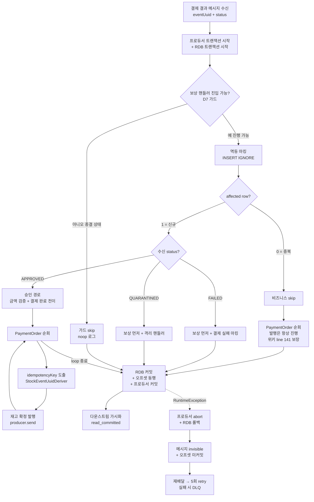
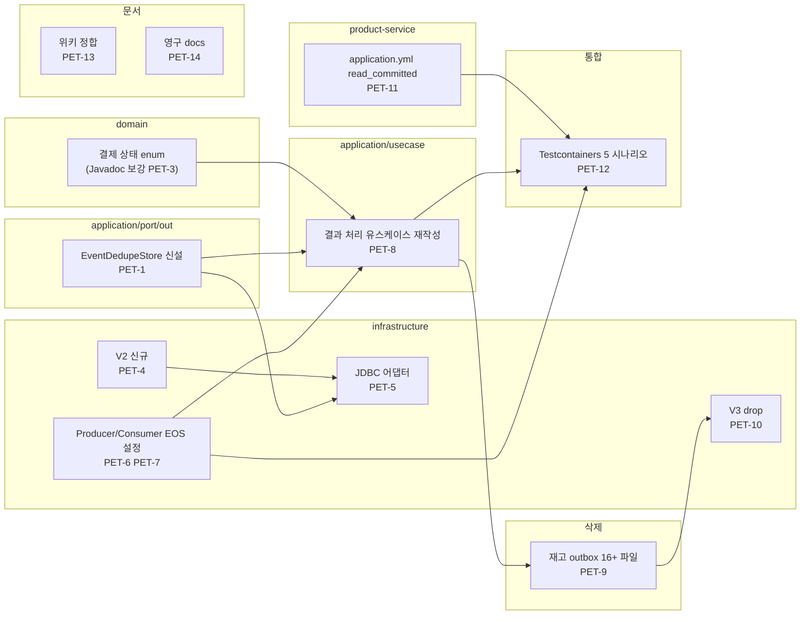

# PAYMENT-EOS-TRANSITION-PLAN

> 이슈 #77 / 브랜치 #77
> 토픽: [docs/topics/PAYMENT-EOS-TRANSITION.md](topics/PAYMENT-EOS-TRANSITION.md)
> 마이그레이션 전략: 빅뱅 1 PR (D2)
> 작성일: 2026-05-17

---

## 요약 브리핑

### Task 목록 (14건)

| PET | 한 줄 | type | tdd | risk |
|---|---|---|---|---|
| **PET-1** | 멱등 마킹 포트 신설 (단일 메서드 — INSERT IGNORE 결과 row 수 반환) | feat | F | F |
| **PET-2** | 멱등 마킹 포트의 Fake 구현 (Map 기반 시뮬레이션) | test | F | F |
| **PET-3** | 결제 상태 enum 의 "보상 핸들러 진입 가능" 판정 메서드 Javadoc 보강 | refactor | T | T |
| **PET-4** | Flyway V2 — 멱등 테이블 신규 (`payment_event_dedupe`, 6컬럼) | feat | T | T |
| **PET-5** | JDBC 어댑터 신설 + 단위 4건 (신규 / 중복 / 메타데이터 / 동시 race) | feat | T | T |
| **PET-6** | Producer EOS 설정 (`transactional.id` + `enable.idempotence=true` + 트랜잭션 매니저 빈) | feat | F | F |
| **PET-7** | 컨슈머 wiring 갱신 (트랜잭션 매니저 wire-in + `isolation.level=read_committed`) | feat | F | F |
| **PET-8** | 결과 처리 유스케이스 재작성 (진입 가드 + 멱등 마킹 + multi-product loop 직접 발행) | feat | T | T |
| **PET-9** | 재고 outbox 묶음 16+ 파일 일괄 삭제 (`StockEventUuidDeriver` / 토픽 상수 보존) | refactor | F | F |
| **PET-10** | Flyway V3 — outbox 테이블 drop | feat | F | F |
| **PET-11** | product-service `read_committed` 적용 (`application.yml` + docker 프로파일) | feat | F | T |
| **PET-12** | Testcontainers 통합 5 시나리오 (정상 commit / abort invisibility / 중복 INSERT IGNORE / multi-product / QUARANTINED 가드) | test | T | T |
| **PET-13** | 위키 4개 파일 "Phase 6 작업 중" 마커 제거 + EOS 안 정합 확인 | docs | F | F |
| **PET-14** | 영구 문서 갱신 (CONFIRM-FLOW / ARCHITECTURE / STRUCTURE / PITFALLS / CONCERNS / TODOS) | docs | F | F |

총 14건 (TDD 4 / non-TDD 10). 한 PR 빅뱅 전환이나 review 가능 크기로 쪼개졌다.

### 변경 후 전체 플로우 (to-be)

#### 정상 / 중복 / abort 3 경로 분기



#### Layer 별 변경 영역



### 결정 → Task 매핑 (traceability)

| 결정 | 매핑 태스크 |
|---|---|
| **D1** 위키 EOS 안 채택 | PET-13 (위키 마커 제거) |
| **D2** 빅뱅 1 PR | PET-6 / PET-7 / PET-8 / PET-9 / PET-10 / PET-11 (한 PR 봉인) |
| **D3** 가용성 수용 | PET-14 (CONCERNS.md L1 등재) |
| **D4** `transactional.id` 정책 | PET-6 + PET-14 (L6 후속 등재) |
| **D5** dedupe 스키마 | PET-4 |
| **D6** product-service `read_committed` | PET-11 + PET-12 시나리오 #2 |
| **D7** 진입 가드 정책 | PET-3 + PET-8 + PET-12 시나리오 #5 |
| **D8** 두 종류 UUID 분리 | PET-8 + PET-9 (`StockEventUuidDeriver` 보존) |

도메인 리스크 매핑은 PLAN.md §"도메인 리스크 → 태스크 추적 테이블" 참조 — DR-1~8 + DM2-1~3 총 11건 모두 strong / acceptable deferred 로 흡수.

### 트레이드오프 / 후속 작업

#### Plan Round 1 minor (forward-fix 가능)

- **PD1-1** (Domain Expert) — `EventDedupeStore` 동명 재사용 (SCR 토픽 폐기 port 와 git blame 추적 혼선 가능). execute 단계 implementer 가 (a) 동명 유지 / (b) `PaymentEventDedupeStore` 분리 명명 중 forward-fix. plan-review 게이트에서 한 번 더 짚어볼 항목.
- **PD1-2** (Domain Expert) — PET-6 / PET-7 wiring 단위 검증 부재 (PET-12 통합 테스트에 100% 의존). `transaction.timeout.ms ↔ @Transactional(timeout=5)` 정렬 정합이 통합 환경에서만 사후 확인. implementer 가 PET-6 GREEN 단계에 `@SpringBootTest(classes = KafkaProducerConfig.class)` 빈 단위 검증 1개 추가 가능 (선택).
- **Critic minor 4건** — PLAN 본문 인라인 메모로 흡수, decision 비반영.

#### 봉인된 후속 작업 (verify 단계 또는 별 토픽)

- TC-13-FOLLOW-1: multi-instance 확장 시 `docker-compose hostname` 라인 제거 또는 `INSTANCE_ID` 환경변수 도입 (DR-2 / L6)
- TC-13-FOLLOW-2: `payment_event_dedupe` TTL 정리 스케줄러 (TC-11 통합)
- TC-13-FOLLOW-3: Kafka tx coordinator 가용성 모니터링 대시보드
- TC-13-FOLLOW-4: D7 가드 분기 알람 SLO (DM2-3)
- TC-13-FOLLOW-5: D7 시맨틱 SSOT 정리 (DM2-2 — Javadoc 보강은 PET-3 에 포함, 후속 정리 별 항목)

### 라운드 합의

- **Round 1: Critic pass (minor 4) / Domain Expert pass (minor 2)** — 1라운드 만에 양쪽 pass. 새 critical 없음.

---

## 태스크 목록

### PET-1: `EventDedupeStore` 출력 포트 신설

<!-- ARCH-REVIEW: 포트 위치 (`application/port/out/`) 정합 — STRUCTURE.md line 67-68, ARCHITECTURE.md line 82-84 룰 일치. orphan 없음 (PET-2 Fake + PET-5 Jdbc 어댑터로 즉시 흡수). DR-8 동명 재사용 deferred 도 §5 결정에 명시. -->

- **type**: feat
- **tdd**: false
- **domain_risk**: false
- **size**: S (~30분)
- **결정 매핑**: D1, D2 (#6)
- **선행 의존**: 없음
- **건드릴 파일/패턴**:
  - 신규: `payment-service/src/main/java/com/hyoguoo/paymentplatform/payment/application/port/out/EventDedupeStore.java`
- **완료 기준**:
  - `EventDedupeStore` 인터페이스 존재 + 컴파일 통과
  - `markIfAbsent(String eventUuid, Long orderId, String status, LocalDateTime receivedAt, LocalDateTime expiresAt) -> int` 시그니처 확정
  - 기존 테스트 회귀 0
- **비고**: SCR 토픽에서 폐기한 동명 포트와 시그니처가 다름 (lease 기반 two-phase → INSERT IGNORE one-phase). DR-8 minor — 동명 재사용 OK (§5 layer 표 명시 결정)
- **완료 결과**: `PaymentEventDedupeStore.java` 신설 (PD1-1 forward-fix: (b) 분리 명명 채택 — SCR 폐기 port 와 이름 충돌 회피). `markIfAbsent(String, long, String, Instant) -> int` 시그니처 확정. 컴파일 통과, 전체 테스트 회귀 0.
- **체크리스트**:
  - [x] GREEN: 인터페이스 파일 작성 + 커밋 (`feat:` prefix)
  - [x] PLAN.md 체크박스 갱신
  - [x] STATE.md 갱신 (활성 태스크 ID)

---

### PET-2: `FakePaymentEventDedupeStore` 테스트 Fake 구현 신설

- **type**: test
- **tdd**: false
- **domain_risk**: false
- **size**: S (~30분)
- **결정 매핑**: D1, D5
- **선행 의존**: PET-1
- **건드릴 파일/패턴**:
  - 신규: `payment-service/src/test/java/com/hyoguoo/paymentplatform/payment/mock/FakePaymentEventDedupeStore.java`
- **완료 기준**:
  - `FakePaymentEventDedupeStore implements PaymentEventDedupeStore` 존재 + 컴파일 통과
  - `ConcurrentHashMap.newKeySet()` 기반 INSERT IGNORE 시뮬레이션: 키 존재 → 0 반환, 신규 → 1 반환
  - 기존 테스트 회귀 0
- **체크리스트**:
  - [x] GREEN: Fake 파일 작성 + 커밋 (`test:` prefix)
  - [x] PLAN.md 체크박스 갱신
  - [x] STATE.md 갱신

**완료 결과**: PET-1 PD1-1 결정 연쇄 적용 — `FakePaymentEventDedupeStore` / `PaymentEventDedupeStore` 분리 명명 일관성 유지. `ConcurrentHashMap.newKeySet()` atomic `add` 로 INSERT IGNORE 시뮬레이션. 테스트 헬퍼 `clear` / `size` / `contains` 제공. `./gradlew :payment-service:compileTestJava` BUILD SUCCESSFUL.

---

### PET-3: `PaymentEventStatus.isCompensatableByFailureHandler` 도메인 메서드 TDD + D7 가드 검증

- **type**: test
- **tdd**: true
- **domain_risk**: true
- **size**: M (~1시간)
- **결정 매핑**: D7
- **선행 의존**: 없음
- **건드릴 파일/패턴**:
  - 변경: `payment-service/src/main/java/com/hyoguoo/paymentplatform/payment/domain/enums/PaymentEventStatus.java` (Javadoc 보강 — DM2-2 대응)
  - 신규: `payment-service/src/test/java/com/hyoguoo/paymentplatform/payment/domain/enums/PaymentEventStatusEosGuardTest.java`
- **완료 기준**:
  - `PaymentEventStatusEosGuardTest` 존재 + RED → GREEN
  - proceed 상태 (`READY`, `IN_PROGRESS`, `RETRYING`) — `isCompensatableByFailureHandler()` → true
  - skip 상태 (`DONE`, `FAILED`, `CANCELED`, `PARTIAL_CANCELED`, `EXPIRED`, `QUARANTINED`) — `isCompensatableByFailureHandler()` → false
  - QUARANTINED 가 skip 임을 명시한 테스트 메서드 포함
  - Javadoc 에 "두 사용처 (보상 핸들러 재고 복원 허용 / EOS consumer 진입 가드) 명시 + 변경 시 D7 가드 영향 경고" 추가
- **도메인 리스크 대응**: DR-3 (QUARANTINED 늦은 APPROVED silent DLQ 봉쇄), DM2-2 (시맨틱 oversharing 방어)
- **테스트 클래스**: `PaymentEventStatusEosGuardTest`
  - `shouldReturnTrueForProceedableStatuses()` — `@ParameterizedTest @EnumSource(names={"READY","IN_PROGRESS","RETRYING"})`
  - `shouldReturnFalseForNonProceedableStatuses()` — `@ParameterizedTest @EnumSource(names={"DONE","FAILED","CANCELED","PARTIAL_CANCELED","EXPIRED","QUARANTINED"})`
  - `shouldSkipQuarantinedExplicitly()` — QUARANTINED 단독 assert
- **완료 결과**: `PaymentEventStatusEosGuardTest` 신설 (3건 — 진입 가능 3 상태 / 진입 불가 6 상태 / QUARANTINED 단독 DR-3 가드). `PaymentEventStatus.isCompensatableByFailureHandler` Javadoc 보강 (두 사용처 명시 + DR-3 영향 경고). 전체 테스트 GREEN.
- **체크리스트**:
  - [x] RED: 실패 테스트 작성 + 커밋 (`test:` prefix)
  - [x] GREEN: Javadoc 보강 + 커밋 (`refactor:` prefix)
  - [x] PLAN.md 체크박스 갱신
  - [x] STATE.md 갱신

---

### PET-4: Flyway V2 `payment_event_dedupe` 테이블 신설

- **type**: feat
- **tdd**: false
- **domain_risk**: false
- **size**: S (~30분)
- **결정 매핑**: D5
- **선행 의존**: 없음
- **건드릴 파일/패턴**:
  - 신규: `payment-service/src/main/resources/db/migration/V2__payment_event_dedupe.sql`
- **완료 기준**:
  - SQL 파일 존재
  - D5 결정의 스키마 그대로: `event_uuid VARCHAR(64) PK`, `order_id BIGINT`, `status VARCHAR(32)`, `received_at TIMESTAMP`, `expires_at TIMESTAMP`, `created_at TIMESTAMP DEFAULT CURRENT_TIMESTAMP`, `INDEX idx_expires_at(expires_at)`, `ENGINE=InnoDB utf8mb4_unicode_ci`
  - `./gradlew test` 회귀 0 (Testcontainers MySQL 통합 테스트에서 Flyway V1 → V2 순서 적용 확인)
- **체크리스트**:
  - [x] GREEN: SQL 파일 작성 + 커밋 (`feat:` prefix)
  - [x] PLAN.md 체크박스 갱신
  - [x] STATE.md 갱신

**완료 결과**: Flyway V2 신설 (`V2__payment_event_dedupe.sql`), test container 적용 검증, 회귀 0

---

### PET-5: `JdbcEventDedupeStore` 어댑터 TDD (Testcontainers MySQL)

- **type**: feat
- **tdd**: true
- **domain_risk**: true
- **size**: L (~2시간)
- **결정 매핑**: D1, D5, D2 (#6)
- **선행 의존**: PET-1, PET-2, PET-4
- **건드릴 파일/패턴**:
  - 신규: `payment-service/src/main/java/com/hyoguoo/paymentplatform/payment/infrastructure/dedupe/JdbcEventDedupeStore.java`
  - 신규: `payment-service/src/test/java/com/hyoguoo/paymentplatform/payment/infrastructure/dedupe/JdbcEventDedupeStoreTest.java`
- **완료 기준**:
  - `JdbcEventDedupeStoreTest` 존재 + RED → GREEN
  - `NamedParameterJdbcTemplate` 기반 `INSERT IGNORE` 구현 — `update()` 반환값으로 affected row 수 리턴
  - Testcontainers MySQL 8.0 + Flyway V1 → V2 자동 적용 환경에서 동작
  - `@SpringBootTest` + `@Tag("integration")` 또는 `@DataJdbcTest` + `@Testcontainers`
- **도메인 리스크 대응**: DR-1 (멱등 마킹 정확성), DR-5 (INSERT IGNORE 시맨틱 정합)
- **테스트 클래스**: `JdbcEventDedupeStoreTest`
  - `shouldReturnOneWhenNewEventInserted()` — 신규 event_uuid → 1 반환
  - `shouldReturnZeroOnDuplicate()` — 동일 event_uuid 재시도 → 0 반환
  - `shouldStoreMetadataCorrectly()` — `order_id`, `status`, `received_at`, `expires_at` 컬럼 값 검증
  - `shouldNotThrowOnConcurrentInsertSameKey()` — 동시 INSERT IGNORE 양쪽 모두 예외 없음 (DR-5 race 시뮬레이션)
- **완료 결과**: `JdbcPaymentEventDedupeStore` 신설 (`infrastructure/dedupe/`). `NamedParameterJdbcTemplate` 기반 `INSERT IGNORE`. Flyway V1→V2 자동 적용 Testcontainers MySQL 환경에서 4건 (신규/중복/메타데이터/동시 race) 모두 GREEN. 전체 테스트 회귀 0.
- **체크리스트**:
  - [x] RED: 실패 테스트 작성 + 커밋 (`test:` prefix)
  - [x] GREEN: 최소 구현 + 커밋 (`feat:` prefix)
  - [x] PLAN.md 체크박스 갱신
  - [x] STATE.md 갱신

---

### PET-6: `KafkaProducerConfig` EOS 설정 변경 + `KafkaTransactionManager` 빈 신설

<!-- ARCH-REVIEW: tdd=false 적정성 약한 우려 — transactional.id 패턴, transaction.timeout.ms, KafkaTransactionManager wiring 은 모두 멱등성/장애 시 fence 동작과 직결. 다만 PET-12 통합 테스트(특히 시나리오 #2 abort invisibility) 가 빈 wiring 정합을 end-to-end 로 검증하므로 deferred 합리. Critic 판단 위임. -->

- **type**: feat
- **tdd**: false
- **domain_risk**: false
- **size**: M (~1시간)
- **결정 매핑**: D4, D2 (#1, #2)
- **선행 의존**: PET-1
- **건드릴 파일/패턴**:
  - 변경: `payment-service/src/main/java/com/hyoguoo/paymentplatform/payment/infrastructure/config/KafkaProducerConfig.java`
  - 변경: `payment-service/src/main/resources/application.yml`
- **완료 기준**:
  - `stockOutboxKafkaTemplate` 빈 제거 (§6 deletion — 이 태스크에서 빈 정의만 제거, 사용처는 PET-12에서 함께 제거)
  - EOS-aware `ProducerFactory<String, String>` 신설 — `transactional.id = ${spring.application.name}-${HOSTNAME:local}`, `enable.idempotence = true`, `transaction.timeout.ms = 10000` (L4 — RDB 5s timeout × 2 마진)
  - `stockCommittedKafkaTemplate` 빈 신설 (`KafkaTemplate<String, String>`) — EOS-aware ProducerFactory 사용, `defaultTopic = payment.events.stock-committed`
  - `KafkaTransactionManager` 빈 신설 — EOS-aware ProducerFactory 와 wiring
  - `application.yml` 의 `eureka.instance.instance-id` 를 `${spring.application.name}:${HOSTNAME:local}:${server.port}` 로 변경 (D4 보강)
  - 컴파일 통과 + 기존 테스트 회귀 0
- **비고**: `commandsConfirmKafkaTemplate` / `confirmedDlqKafkaTemplate` 은 EOS 와 직교 — 기존 ProducerFactory 그대로 유지
- **완료 결과**: `KafkaProducerConfig` 에 EOS-aware `stockCommittedProducerFactory` 빈 신설 (transactional.id prefix = `${payment.kafka.transactional-id-prefix:${spring.application.name}-${HOSTNAME:local}}-`, enable.idempotence=true, transaction.timeout.ms=10000). `KafkaTransactionManager` 빈 신설 (stockCommittedProducerFactory wire-in). `stockCommittedKafkaTemplate` 빈 신설 (EOS-aware, defaultTopic=payment.events.stock-committed). 기존 `stockOutboxKafkaTemplate` / `commandsConfirmKafkaTemplate` / `confirmedDlqKafkaTemplate` 보존. `application.yml` eureka instance-id 패턴 HOSTNAME:local 로 통일 (D4 보강). PD1-2 wiring 검증: 선택지 A 채택 — PET-12 통합 테스트 end-to-end 검증에 100% 의존. 컴파일 통과, 전체 테스트 389건 PASS / 0 FAIL, 회귀 0.
- **체크리스트**:
  - [x] GREEN: config 변경 + 커밋 (`feat:` prefix)
  - [x] PLAN.md 체크박스 갱신
  - [x] STATE.md 갱신

---

### PET-7: Kafka Consumer 컨테이너 팩토리 EOS wiring (`KafkaConsumerConfig` 신설 또는 변경)

<!-- ARCH-REVIEW: tdd=false 적정성 — PET-6 와 동일 사유. consumer isolation.level=read_committed + TransactionManager 주입은 EOS 효과의 전제. PET-12 통합 테스트가 사후 검증. 신설 클래스로 갈지(`KafkaConsumerConfig` 신규) vs 기존 wiring 위치(현재 어디?)를 변경할지 — 토픽 §5 layer 표 line 547 에 "기존 wiring 위치 — Boot auto-config 의존이면 신규 KafkaConsumerConfig 클래스" 라고 fork 가 명시돼 있으나, PLAN 에서는 결정을 implementer 에게 위임. 결정 책임 위치가 implementer 까지 미뤄지는 점이 약한 우려 — implementer 가 현재 wiring 을 grep 으로 확인 후 분기 결정해야 함. -->

- **type**: feat
- **tdd**: false
- **domain_risk**: false
- **size**: M (~1시간)
- **결정 매핑**: D6, D2 (#9)
- **선행 의존**: PET-6
- **건드릴 파일/패턴**:
  - 신규 또는 변경: `payment-service/src/main/java/com/hyoguoo/paymentplatform/payment/infrastructure/config/KafkaConsumerConfig.java`
- **완료 기준**:
  - `kafkaListenerContainerFactory` 빈이 `KafkaTransactionManager` 를 통합 — `factory.getContainerProperties().setTransactionManager(kafkaTransactionManager)` 적용
  - consumer `isolation.level = read_committed` 설정 (`spring.kafka.consumer.isolation-level` 또는 `ConsumerConfig` 직접 설정)
  - `ConfirmedEventConsumer` 의 `containerFactory = "kafkaListenerContainerFactory"` 참조는 변경 없음
  - 컴파일 통과 + 기존 테스트 회귀 0
- **완료 결과**: `KafkaConsumerConfig.java` 신설 (옵션 A — Java config). `kafkaListenerContainerFactory` 빈 명시 정의 + `KafkaTransactionManager` wire-in (stockCommittedProducerFactory 공유). `isolation.level=read_committed` 는 `application.yml` `spring.kafka.consumer.properties.isolation.level` 로 적용 (auto-config ConsumerFactory 가 흡수). `kafkaErrorHandler` / `recordMessageConverter` 명시 주입으로 auto-config 동등 기능 유지. 전체 테스트 389건 PASS / 0 FAIL, 회귀 0.
- **체크리스트**:
  - [x] GREEN: config 변경 + 커밋 (`feat:` prefix)
  - [x] PLAN.md 체크박스 갱신
  - [x] STATE.md 갱신

---

### PET-8: `PaymentConfirmResultUseCase.handle` D7 가드 + EOS 유스케이스 재작성 TDD

- **type**: feat
- **tdd**: true
- **domain_risk**: true
- **size**: L (~2시간)
- **결정 매핑**: D1, D2 (#4, #5), D7, D8
- **선행 의존**: PET-1, PET-2, PET-3, PET-6
- **건드릴 파일/패턴**:
  - 변경: `payment-service/src/main/java/com/hyoguoo/paymentplatform/payment/application/usecase/PaymentConfirmResultUseCase.java`
  - 신규/변경: `payment-service/src/test/java/com/hyoguoo/paymentplatform/payment/application/usecase/PaymentConfirmResultUseCaseTest.java`
- **완료 기준**:
  - `PaymentConfirmResultUseCaseTest` 존재 + RED → GREEN
  - `handle()` 진입 시 `paymentEvent.getStatus().isCompensatableByFailureHandler()` 가드 — false 이면 `LogFmt.warn` + noop return (D7)
  - `EventDedupeStore.markIfAbsent()` 호출 후 0 반환 시 비즈니스 skip + 발행 항상 진행 (위키 line 141)
  - `handleApproved()` 재작성:
    - `paymentCommandUseCase.markPaymentAsDone()` 호출
    - for-loop (`paymentEvent.getPaymentOrderList()`) 안에서 `StockEventUuidDeriver.derive(orderId, productId, "stock-commit")` → `stockCommittedKafkaTemplate.send(topic, key, payload)` (D8 발행 측 결정성)
    - `StockOutboxRepository` / `applicationEventPublisher` / `objectMapper` 의존 제거
  - `handleFailed()` / `handleQuarantined()` — SCR 결정 유지 (보상 먼저 → RDB 나중), isTerminal 가드 제거 후 D7 가드로 통합
  - `PaymentConfirmResultUseCase` 생성자에서 `StockOutboxRepository`, `applicationEventPublisher`, `objectMapper`, `StockCachePort` (이미 있음) 의존 정리 — 삭제 대상 의존 제거
  - Mock 대상: `EventDedupeStore`, `KafkaTemplate<String, String>`, `PaymentCommandUseCase`, `StockCachePort`, `QuarantineCompensationHandler`
- **도메인 리스크 대응**: DR-1 (idempotencyKey 도출 책임 이전 보장), DR-3 (QUARANTINED 가드), DR-5 (INSERT IGNORE 0 row 시 발행 항상 진행), DR-7 (보상 순서 유지)
- **테스트 클래스**: `PaymentConfirmResultUseCaseTest`
  - `shouldProceedBusinessWhenStatusIsProceedable()` — `isCompensatableByFailureHandler()` true → markIfAbsent 호출됨
  - `shouldSkipWhenStatusIsNotProceedable()` — QUARANTINED 상태 → markIfAbsent 미호출 + warn 로그
  - `shouldProceedBusinessWhenMarkIfAbsentReturnsOne()` — markIfAbsent 1 반환 → `markPaymentAsDone` 호출
  - `shouldSkipBusinessButAlwaysSendWhenMarkIfAbsentReturnsZero()` — markIfAbsent 0 반환 → `markPaymentAsDone` 미호출 + `stockCommittedKafkaTemplate.send` 호출 (위키 line 141)
  - `shouldDeriveDistinctIdempotencyKeyPerProduct()` — PaymentOrder 2건 → `stockCommittedKafkaTemplate.send` 2회 호출, 각 호출의 payload 에 서로 다른 idempotencyKey (D8)
  - `shouldMaintainCompensationOrderForFailed()` — compensateAtomic 먼저, markPaymentAsFail 나중
  - `shouldQuarantineOnAmountMismatch()` — amount 불일치 시 quarantineCompensationHandler 위임
- **완료 결과**: `PaymentConfirmResultUseCase` 재작성 완료 (D7 가드 + D5 멱등 마킹 + D8 multi-product EOS 발행). 의존 정리 — `ApplicationEventPublisher` / `StockOutboxRepository` / `StockOutboxFactory` 제거, `PaymentEventDedupeStore` + `@Qualifier("stockCommittedKafkaTemplate") KafkaTemplate<String, String>` 주입. 신규 테스트 `PaymentConfirmResultUseCaseTest` 7건 + 기존 4 클래스 갱신 (stock_outbox 의존 제거). DR-1/3/5/7 모두 단위 테스트 커버. 397건 PASS / 0 FAIL, 회귀 0.
- **체크리스트**:
  - [x] RED: 실패 테스트 작성 + 커밋 (`test:` prefix)
  - [x] GREEN: 최소 구현 + 커밋 (`feat:` prefix)
  - [ ] REFACTOR: 불필요 의존 제거 정리 + 커밋 (`refactor:` prefix)
  - [x] PLAN.md 체크박스 갱신
  - [x] STATE.md 갱신

---

### PET-9: `StockOutbox` 묶음 17단위 일괄 삭제

<!-- ARCH-REVIEW: 삭제 순서 정합 (PET-8 유스케이스 재작성 후 → 사용처 0 → 컴파일 회귀 0). "유지 대상 (삭제 금지)" 3종 (StockEventUuidDeriver / StockCommittedEvent / PaymentTopics) 명시 — DR-1 흡수 완료. domain_risk=false 적정 (삭제 작업, 비즈니스 로직 변경 없음). -->

- **type**: refactor
- **tdd**: false
- **domain_risk**: false
- **size**: M (~1시간)
- **결정 매핑**: D2 (#7), D1
- **선행 의존**: PET-8 (유스케이스 재작성 완료 — 삭제 대상의 마지막 사용처 제거 확인 후)
- **건드릴 파일/패턴**:
  - 삭제 (main, 11파일):
    - `payment/.../application/event/StockOutboxReadyEvent.java`
    - `payment/.../application/port/out/StockOutboxPublisherPort.java`
    - `payment/.../application/port/out/StockOutboxRepository.java`
    - `payment/.../application/service/StockOutboxRelayService.java`
    - `payment/.../application/util/StockOutboxFactory.java`
    - `payment/.../domain/StockOutbox.java`
    - `payment/.../infrastructure/entity/StockOutboxEntity.java`
    - `payment/.../infrastructure/listener/StockOutboxImmediateEventHandler.java`
    - `payment/.../infrastructure/messaging/publisher/StockOutboxKafkaPublisher.java`
    - `payment/.../infrastructure/repository/JpaStockOutboxRepository.java`
    - `payment/.../infrastructure/repository/StockOutboxRepositoryImpl.java`
    - `payment/.../infrastructure/scheduler/StockOutboxWorker.java`
  - 삭제 (test, 6파일):
    - `payment/.../application/service/StockOutboxRelayServiceTest.java`
    - `payment/.../application/service/StockOutboxRelayServiceClockTest.java`
    - `payment/.../domain/StockOutboxTest.java`
    - `payment/.../infrastructure/listener/StockOutboxImmediateEventHandlerTest.java`
    - `payment/.../infrastructure/scheduler/StockOutboxWorkerTest.java`
    - `payment/.../mock/FakeStockOutboxRepository.java`
  - **유지 대상 (삭제 금지)**:
    - `payment/.../application/util/StockEventUuidDeriver.java` (D8 보존)
    - `payment/.../application/dto/event/StockCommittedEvent.java` (payload record 유지)
    - `payment/.../application/messaging/PaymentTopics.java` (토픽 상수 유지)
- **완료 기준**:
  - 17단위 파일 삭제 완료 (`find` 로 잔재 없음 확인)
  - `StockEventUuidDeriver` / `StockCommittedEvent` / `PaymentTopics` 잔존 확인
  - `./gradlew build` 컴파일 통과
  - `./gradlew test` 회귀 0 (삭제된 SUT 의 테스트가 함께 삭제됨)
- **비고**: `QStockOutboxEntity.java` 는 `build/generated/` 아래 QueryDSL 생성물 — `clean` 시 자동 제거. 명시 삭제 불필요
- **완료 결과**: 19개 파일 삭제 (main 13 — domain/application event+port+service+util / infrastructure entity+listener+publisher+repository+scheduler + test 6 — domain/application service+mock / infrastructure listener+scheduler). `KafkaProducerConfig` `stockOutboxKafkaTemplate` 빈 삭제. `application.yml` `scheduler.stock-outbox-worker` 섹션 삭제. `StockEventUuidDeriver` / `StockCommittedEvent` / `PaymentTopics` 보존 확인. 385건 PASS / 0 FAIL.
- **체크리스트**:
  - [x] GREEN: 파일 삭제 + 컴파일 확인 + 커밋 (`refactor:` prefix)
  - [x] PLAN.md 체크박스 갱신
  - [x] STATE.md 갱신

---

### PET-10: Flyway V3 `payment_stock_outbox` 테이블 DROP

- **type**: feat
- **tdd**: false
- **domain_risk**: false
- **size**: S (~30분)
- **결정 매핑**: D2 (#8)
- **선행 의존**: PET-9 (코드 사용처 전부 제거 완료 후)
- **건드릴 파일/패턴**:
  - 신규: `payment-service/src/main/resources/db/migration/V3__drop_payment_stock_outbox.sql`
- **완료 기준**:
  - `DROP TABLE IF EXISTS payment_stock_outbox;` 한 줄 SQL 파일 존재
  - `./gradlew test` 통합 테스트 환경에서 Flyway V1 → V2 → V3 순서 정상 적용
  - 기존 테스트 회귀 0
- **완료 결과**: `V3__drop_payment_stock_outbox.sql` 신설. V1 실제 테이블명 `stock_outbox` 확인 (FK 없음) — DROP 대상 수정 반영. Flyway V1→V2→V3 순서 적용 검증, 385건 PASS / 0 FAIL, 회귀 0.
- **체크리스트**:
  - [x] GREEN: SQL 파일 작성 + 커밋 (`feat:` prefix)
  - [x] PLAN.md 체크박스 갱신
  - [x] STATE.md 갱신

---

### PET-11: product-service `application.yml` consumer `isolation.level=read_committed` 적용

<!-- ARCH-REVIEW: 코드 의존은 정말 없음 (product-service 단독 yml 변경). 단, §12 deploy 순서 (product 먼저 → payment 나중) 강제는 머지 후 verify/PR 본문 책임이며 PLAN 내부 태스크 의존으로는 표현 안 됨. 권장: PET-11 을 PET-8 / PET-12 보다 먼저 commit 순서에 두면 git log 상으로도 "product 먼저" 의도가 보임 (cherry-pick / hotfix 분리 시 안전 마진). 강제가 아닌 우선순위 권장. -->

- **type**: feat
- **tdd**: false
- **domain_risk**: false
- **size**: S (~30분)
- **결정 매핑**: D6
- **선행 의존**: 없음 (독립 — product-service 단독 변경)
- **건드릴 파일/패턴**:
  - 변경: `product-service/src/main/resources/application.yml`
  - 변경: `product-service/src/main/resources/application-docker.yml` (존재 시)
- **완료 기준**:
  - `spring.kafka.consumer.isolation-level: read_committed` 라인 추가
  - `StockCommitConsumer` 자체 코드 변경 없음
  - `./gradlew :product-service:test` 회귀 0
- **비고**: §12 deploy 순서 — 이 변경이 먼저 staging 에 배포되어야 함 (payment-service EOS 발행 시작 전)
- **체크리스트**:
  - [ ] GREEN: yml 변경 + 커밋 (`feat:` prefix)
  - [ ] PLAN.md 체크박스 갱신
  - [ ] STATE.md 갱신

---

### PET-12: EOS 통합 테스트 — 5개 시나리오 (Testcontainers Kafka + MySQL)

- **type**: test
- **tdd**: true
- **domain_risk**: true
- **size**: L (~2시간)
- **결정 매핑**: D1, D2, D5, D6, D7, D8
- **선행 의존**: PET-5, PET-7, PET-8, PET-10
- **건드릴 파일/패턴**:
  - 신규: `payment-service/src/test/java/com/hyoguoo/paymentplatform/payment/integration/PaymentEosIntegrationTest.java`
- **완료 기준**:
  - `PaymentEosIntegrationTest` 존재 + 5개 테스트 메서드 GREEN
  - `@SpringBootTest` + `@Testcontainers` + `@Tag("integration")` + Testcontainers Kafka (`KafkaContainer`) + MySQL (`MySQLContainer`)
  - 5개 통합 테스트 시나리오 모두 검증 (§8 참조):
    1. EOS commit 정상 흐름
    2. EOS abort 흐름 (read_committed invisibility)
    3. 중복 INSERT IGNORE 흐름 (발행 항상 진행)
    4. multi-product 결제 DR-1 회귀 가드
    5. QUARANTINED 결제의 늦은 APPROVED — D7 가드 + DLQ 0건
- **도메인 리스크 대응**: DR-1 (multi-product idempotencyKey), DR-3 (QUARANTINED 가드), DR-4 (read_committed abort invisibility), DR-5 (INSERT IGNORE 0 row 발행 진행), DR-7 (보상 cascade)
- **테스트 클래스**: `PaymentEosIntegrationTest`
  - `shouldCommitEosTransactionNormally()` — APPROVED 메시지 → dedupe row 1개 + payment DONE + stock-committed 1건 read_committed 가시화
  - `shouldMakeAbortMessageInvisibleOnRollback()` — RuntimeException 주입 → dedupe row 0개 + payment 상태 불변 + stock-committed read_committed 0건 + DLQ 재시도 후 1건
  - `shouldSkipBusinessButResendOnDuplicateInsert()` — 동일 event_uuid 재배달 → payment 상태 불변 + stock-committed 가시화 (위키 line 141)
  - `shouldPublishDistinctIdempotencyKeyPerProductOnMultiProduct()` — PaymentOrder 2건 → stock-committed 2건 + productId 별 서로 다른 idempotencyKey + 재배달 시 두 메시지 모두 dedupe skip
  - `shouldSkipQuarantinedLateApprovedWithNoDlq()` — QUARANTINED 결제 + APPROVED 메시지 → dedupe row 0건 + payment 상태 QUARANTINED 유지 + stock-committed 0건 + DLQ 0건 + warn 로그 1건
- **체크리스트**:
  - [ ] RED: 5개 실패 테스트 작성 + 커밋 (`test:` prefix)
  - [ ] GREEN: 최소 구현 보완으로 GREEN + 커밋 (`feat:` prefix)
  - [ ] PLAN.md 체크박스 갱신
  - [ ] STATE.md 갱신

---

### PET-13: 위키 문서 마커 제거 + EOS 안 정합 확인

- **type**: docs
- **tdd**: false
- **domain_risk**: false
- **size**: M (~1시간)
- **결정 매핑**: D1
- **선행 의존**: PET-12 (통합 테스트 GREEN 이후)
- **건드릴 파일/패턴**:
  - 변경 (위키 4개 파일):
    - `wiki/message-delivery-and-dedupe.md`
    - `wiki/outbox-pattern.md`
    - `wiki/event-driven-choreography.md`
    - `wiki/architecture.md`
  - 변경 없음: `wiki/` 경로 불명확 시 실제 경로 확인 후 진행
- **완료 기준**:
  - `Phase 6 작업 중` 마커 전체 제거
  - `outbox-pattern.md` line 163~171 의 "stock-committed 발행은 outbox 가 아니다 — Kafka EOS" 마커 내용이 EOS 완전 전환 사실과 정합
  - `message-delivery-and-dedupe.md` 의 EOS 시퀀스가 변경 후 코드 흐름과 1:1 매핑 확인
  - 기존 테스트 회귀 0
- **체크리스트**:
  - [ ] GREEN: 위키 파일 갱신 + 커밋 (`docs:` prefix)
  - [ ] PLAN.md 체크박스 갱신
  - [ ] STATE.md 갱신

---

### PET-14: 영구 문서 갱신 (CONFIRM-FLOW / ARCHITECTURE / STRUCTURE / PITFALLS / CONCERNS / TODOS)

- **type**: docs
- **tdd**: false
- **domain_risk**: false
- **size**: M (~1시간)
- **결정 매핑**: D3, D1, D2
- **선행 의존**: PET-12 (통합 테스트 GREEN 이후)
- **건드릴 파일/패턴**:
  - 변경:
    - `docs/context/CONFIRM-FLOW.md` — §10 변경 후 흐름 반영 (AFTER_COMMIT 워커 제거 + EOS 직접 발행 동기화)
    - `docs/context/ARCHITECTURE.md` — 비동기 어댑터 위치 표에서 `StockOutboxImmediateEventHandler` / `StockOutboxWorker` 제거 + EOS 직접 발행 경로 추가
    - `docs/context/STRUCTURE.md` — 삭제된 파일 트리 반영
    - `docs/context/PITFALLS.md` — EOS 도입 관련 도메인 함정 신규 등재
    - `docs/context/CONCERNS.md` — L1 (Kafka tx coordinator 의존) + L3 (multi-instance 검증 부재) + L5 (빅뱅 PR 회복 비대칭) + L6 (multi-instance hostname 충돌) 등재
    - `docs/context/TODOS.md` — TC-13-FOLLOW-1~5 등재, 기존 TC-13 섹션 완료 처리
- **완료 기준**:
  - 6개 영구 문서 갱신 완료
  - `CONCERNS.md` 에 L1/L3/L5/L6 4개 항목 박힘
  - `TODOS.md` 에 TC-13-FOLLOW-1~5 박힘
  - 기존 테스트 회귀 0
- **체크리스트**:
  - [ ] GREEN: 6개 문서 갱신 + 단일 `docs:` 커밋
  - [ ] PLAN.md 체크박스 갱신
  - [ ] STATE.md 갱신

---

## 도메인 리스크 → 태스크 추적 테이블

| DR ID | Severity | 제목 | 대응 태스크 | 처리 방식 |
|---|---|---|---|---|
| DR-1 | critical | multi-product `idempotencyKey` 도출 책임 이전 미명시 — silent 재고 사고 위험 | PET-8, PET-12 | PET-8: 유스케이스 for-loop 안에서 `StockEventUuidDeriver.derive` 직접 호출 + PET-12 통합 테스트 #4 (multi-product + 재배달 양쪽 dedupe) |
| DR-2 | high | `transactional.id` fencing 의도 ↔ docker-compose hostname 충돌 | PET-6, PET-14 | PET-6: 단일 인스턴스 가정 명시 (`HOSTNAME:local` 패턴) + PET-14: CONCERNS.md L3/L6 등재 + TODOS.md TC-13-FOLLOW-1 |
| DR-3 | high | `isTerminal` 가드 모호 — QUARANTINED 늦은 APPROVED 가 silent DLQ 분기 | PET-3, PET-8, PET-12 | PET-3: `isCompensatableByFailureHandler` 검증 TDD + PET-8: D7 가드 구현 + PET-12 통합 테스트 #5 |
| DR-4 | high | EOS 발행 ↔ read_committed 적용의 deploy 순서 명시 부재 | PET-11, PET-12 | PET-11: product-service read_committed 적용 + PET-12 통합 테스트 #2 (abort invisibility) + §12 deploy 순서 명시 (topic.md 기존) |
| DR-5 | medium | INSERT IGNORE row 신호와 비즈니스 진행 의미 불일치 race | PET-5, PET-8, PET-12 | PET-5: `shouldNotThrowOnConcurrentInsertSameKey` + PET-8: 0 row 시 발행 항상 진행 + PET-12 통합 테스트 #3 |
| DR-6 | medium | 빅뱅 PR 의 회복 비대칭 명시 부재 | PET-14 | PET-14: CONCERNS.md L5 등재 (Flyway down migration 부재 + 머지 직후 모니터링 SLO 3개) |
| DR-7 | medium | EOS 도입이 SCR L7 cascade 빈도 평가 없음 | PET-8, PET-14 | PET-8: 보상 순서 유지 확인 (테스트 `shouldMaintainCompensationOrderForFailed`) + PET-14: CONFIRM-FLOW 갱신에 평가 표 반영 |
| DR-8 | minor | `EventDedupeStore` 동명 재사용으로 archive 추적성 저하 | PET-1 | PET-1: §5 결정대로 동명 재사용 (시그니처 다름 명시 주석) — acceptable deferred |
| DM2-1 | minor | §12 배포 순서 강제의 사람 실수 backstop 부재 | PET-14 | PET-14: TODOS.md 에 운영 배포 체크리스트 신설 항목 등재 (verify 단계 산출물) |
| DM2-2 | minor | D7 `isCompensatableByFailureHandler` SSOT 재사용의 시맨틱 oversharing | PET-3 | PET-3: Javadoc 보강 (두 사용처 명시 + 변경 시 D7 가드 영향 경고) |
| DM2-3 | minor | D7 가드 분기 모니터링 알람 SLO 누락 | PET-14 | PET-14: TODOS.md 에 TC-13-FOLLOW-4 (D7 가드 분기 알람 SLO) 등재 |

---

## 결정 → 태스크 매핑 (orphan 방지 확인)

| 결정 ID | 결정 요약 | 구현 태스크 |
|---|---|---|
| D1 | 위키 EOS 안 채택 | PET-1, PET-5, PET-8, PET-12, PET-13, PET-14 |
| D2 | 빅뱅 1 PR 마이그레이션 (17단위 삭제 + EOS 도입) | PET-6, PET-7, PET-8, PET-9, PET-10, PET-13 |
| D3 | Kafka tx coordinator 의존 수용 | PET-14 (CONCERNS.md L1 등재) |
| D4 | `transactional.id = ${spring.application.name}-${HOSTNAME:local}` | PET-6, PET-14 |
| D5 | `payment_event_dedupe` 스키마 | PET-4, PET-5 |
| D6 | product-service consumer `isolation.level=read_committed` | PET-7, PET-11, PET-12 |
| D7 | `handle` 진입 가드 (`isCompensatableByFailureHandler` 기반) | PET-3, PET-8, PET-12 |
| D8 | 두 종류 UUID 역할 분리 (`event_uuid` vs `idempotencyKey`) | PET-8, PET-12 |

**매핑 누락 없음** — D1~D8 전부 최소 1개 이상의 태스크에 매핑됨.

---

## 태스크 실행 순서 (권장)

```
PET-1 (port 신설)
  ├── PET-2 (Fake 구현)       — PET-8 RED 단계에 필요
  ├── PET-3 (D7 가드 TDD)     — 독립 (domain 계층)
  ├── PET-4 (Flyway V2)       — PET-5 통합 테스트에 필요
  └── PET-6 (KafkaProducerConfig EOS)
        └── PET-7 (KafkaConsumerConfig EOS wiring)

병렬 가능:
  PET-3 ── PET-4 ── PET-11 (product-service yml)

PET-1, PET-2, PET-3, PET-4 완료 후:
  PET-5 (JdbcEventDedupeStore TDD)

PET-1, PET-2, PET-3, PET-6 완료 후:
  PET-8 (유스케이스 재작성 TDD)
    └── PET-9 (StockOutbox 묶음 삭제)
          └── PET-10 (Flyway V3 DROP)

PET-5, PET-7, PET-8, PET-10 완료 후:
  PET-12 (EOS 통합 테스트 5개)
    ├── PET-13 (위키 마커 제거)
    └── PET-14 (영구 문서 갱신)
```

---

## 요약

- **총 태스크**: 14개 (PET-1 ~ PET-14)
- **tdd=true 태스크**: PET-3, PET-5, PET-8, PET-12 — 4개
- **tdd=false 태스크**: PET-1, PET-2, PET-4, PET-6, PET-7, PET-9, PET-10, PET-11, PET-13, PET-14 — 10개
- **domain_risk=true 태스크**: PET-3, PET-5, PET-8, PET-12 — 4개
- **D1~D8 결정 중 태스크 미매핑**: 없음 (pass 조건 충족)
- **DR-1~DR-8 + DM2-1~DM2-3 중 태스크 미매핑**: 없음 (전부 대응 태스크 존재 또는 non-goal 명시)

---

## Architect 검토 요약

> Round 1 가벼운 검토. Critic + Domain Expert 판정 전 단계.

| 항목 | 상태 | 비고 |
|---|---|---|
| layer 의존 순서 (port → domain → application → infrastructure → controller) | OK | PET-1 (port) → PET-3 (domain) → PET-8 (application) → PET-5/6/7 (infrastructure). 역의존 없음 |
| 포트 위치 | OK | `application/port/out/EventDedupeStore` — STRUCTURE.md line 67-68 + ARCHITECTURE.md line 82-84 룰 일치. Fake 는 `payment/mock/` (테스트 전용) — STRUCTURE.md line 159 룰 일치 |
| 모듈 경계 (payment / product) | OK | PET-11 만 product-service 단독, 나머지 13개 payment-service. 한 태스크 = 한 서비스. 섞임 없음 |
| 삭제 순서 안전성 | OK | PET-9 (코드 삭제) ← PET-8 (유스케이스 재작성) — 컴파일 회귀 0. PET-10 (Flyway V3 DROP) ← PET-9 (코드 사용처 0) — 정합 |
| Fake/Mock 의존 순서 | OK | PET-2 (FakeEventDedupeStore) ← PET-1 (port). PET-8 RED 단계가 PET-2 소비 — 명시됨 |
| orphan port 없음 | OK | PET-1 port → PET-2 Fake + PET-5 Jdbc 어댑터 양쪽 모두 후속 태스크에서 흡수 |
| StockEventUuidDeriver 보존 명시 | OK | PET-9 "유지 대상 (삭제 금지)" 블록에 3종 (StockEventUuidDeriver / StockCommittedEvent / PaymentTopics) 명시. DR-1 회귀 가드 |
| KafkaTransactionManager 빈 위치 | OK | `infrastructure/config/` (PET-6) — ARCHITECTURE.md line 85 `core` vs `infrastructure/config` 모두 허용 룰 안. consumer wiring (PET-7) 분리도 합리 |
| product-service yml 의존 순서 (§12) | 약한 우려 | 코드 의존은 정말 없음. 다만 §12 deploy 순서 강제는 머지 후 verify/PR 책임이며 PLAN 태스크 의존으로는 표현 안 됨. PET-11 을 PET-8 보다 먼저 commit 하는 우선순위 권장 — git log 상 "product 먼저" 의도 가시화 |
| 태스크 크기 (≤2시간) | OK | 14개 모두 S(~30분) / M(~1시간) / L(~2시간) — 한도 안 |
| TDD 분류 합리성 | 약한 우려 | PET-6 / PET-7 (`tdd=false`) — config 변경이지만 transactional.id / timeout / TransactionManager wiring / isolation.level 은 EOS 효과의 전제. PET-12 통합 테스트가 사후 검증으로 흡수 가능하나, 빈 wiring 단위 검증 부재. Critic 판단 위임 |

### 권장 액션

우선순위 순:

1. **PET-7 — 신설 vs 변경 결정 사전 명료화** (선택): implementer 가 grep 으로 현재 wiring 위치를 확인해 분기 결정해야 하는데, plan 단계에서 미리 grep 결과를 비고에 적어 두면 implementer 가 결정 책임을 떠안지 않음. 다만 토픽 §5 layer 표 line 547 이 명시적으로 fork 를 허용했고 30~60분 안에 grep + 결정이 가능한 size 라 강제는 아님.
2. **PET-11 우선 commit 권장** (약한): 태스크 실행 순서 다이어그램에 "PET-11 을 PET-8 보다 먼저 commit" 가이드를 추가하면 git log 상으로도 §12 deploy 순서 의도가 보임. 강제 의존은 아니므로 비고에만 첨가 정도.
3. **PET-6 / PET-7 의 빈 wiring 단위 검증** (deferred 합리): `@SpringBootTest(classes = KafkaProducerConfig.class)` 로 transactional.id property 가 정합한 ProducerFactory 가 생성되는지 단순 assert 가능. 다만 PET-12 통합 테스트가 시나리오 #1 (정상 commit) / #2 (abort invisibility) 로 wiring 효과를 end-to-end 검증하므로 deferred 합리. Critic 가 강하게 권장하면 PET-6 에 단위 검증 추가.

### 종합

- 모든 critical 항목 (layer 룰, 포트 위치, 모듈 경계, 삭제 순서, orphan, StockEventUuidDeriver 보존) **정합**.
- 2개 약한 우려 (PET-11 commit 순서, PET-6/7 TDD 분류) 는 강제 수정 아닌 검토 의견 — Critic + Domain Expert 판정 대기.
