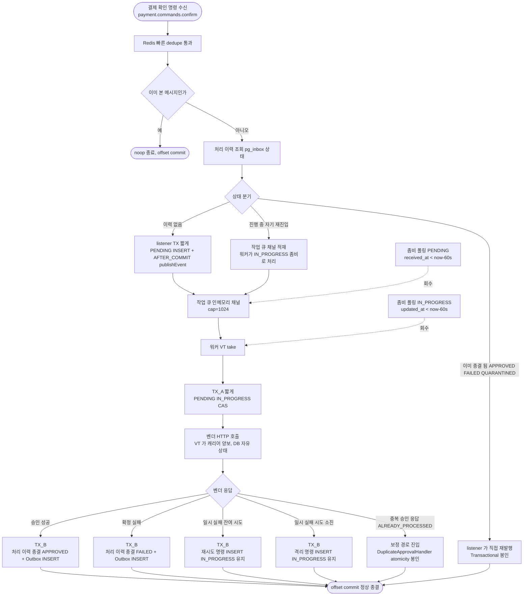

# PG-CONFIRM-LISTENER-SPLIT — 실행 계획

> 토픽: [docs/topics/PG-CONFIRM-LISTENER-SPLIT.md](topics/PG-CONFIRM-LISTENER-SPLIT.md)
> 날짜: 2026-05-09
> 라운드: Round 2 종결 (critic-2 + domain-2 pass) → plan — Round 1 finding 11건 흡수 정정 (2026-05-09)
> 이슈: #73 / 브랜치: `#73`

---

## 요약 브리핑

본 토픽은 위키 `pg-confirm-flow.md` 가 봉인한 **listener / 워커 VT / 발행 릴레이 3단 분리** 를 코드에 정합한다. listener 는 PENDING INSERT + AFTER_COMMIT 채널 적재 + Kafka ack 까지만 책임지고, 워커 VT 풀이 인메모리 채널에서 take 해 TX_A → 벤더 HTTP → TX_B 순으로 진행한다. 좀비 폴링이 PENDING / IN_PROGRESS 두 경로를 60s 임계로 회수하고, 보정 경로 (`DuplicateApprovalHandler`) 는 PENDING 우회 후 직접 종결로 신설해 무한 루프 위험을 차단한다.

### Task 목록 (16개)

1. **PCS-1** — Flyway migration: `pg_inbox.status` ENUM 에 PENDING 추가 + NONE 제거
2. **PCS-2** — 도메인 갱신 (`PgInbox` + `PgInboxStatus`): PENDING 시작, NONE 폐기, 보정 경로 정적 팩토리
3. **PCS-3** — 출력 포트 신규 메서드 4종 + 좀비 조회 선언
4. **PCS-4** — `PgInboxRepositoryImpl` SKIP LOCKED 구현 + Testcontainers 단위 테스트
5. **PCS-5** — `PgInboxReadyEvent` (`domain/event`) + `PgInboxProcessUseCase` 입력 포트
6. **PCS-6** — `PgVendorCallService` `invokeVendor` (TX 없음) + `applyOutcome` (TX_B) 분리
7. **PCS-7** — `PgInboxPendingService` (`@Transactional(timeout=5)` listener TX). active TX publishEvent + AFTER_COMMIT 발화 검증
8. **PCS-8** — `PgInboxProcessor` (두 진입점 — `processPending` / `processInProgressZombie`). ALREADY_PROCESSED → `DuplicateApprovalHandler` 위임
9. **PCS-9** — `PgConfirmService` + `DuplicateApprovalHandler` 갱신. `transitNoneToInProgress` 호출처 6곳 교체. `handleVendorIndeterminate` atomicity + `handleTerminal` `@Transactional`
10. **PCS-10** — `InboxJob` + `PgInboxChannel` (cap=1024)
11. **PCS-11** — `InboxReadyEventHandler` (`infrastructure/listener`, AFTER_COMMIT 채널 적재)
12. **PCS-12** — `PgInboxImmediateWorker` (SmartLifecycle + VT worker=5)
13. **PCS-13** — `PgInboxPollingWorker` (PENDING / IN_PROGRESS 두 경로, 60s 통일, 새 root span)
14. **PCS-14** — yml 설정 키 + EventType (`PG_INBOX_WORKER_FAIL` / `PG_INBOX_LISTENER_TX_TIMEOUT` 등)
15. **PCS-15** — 통합 테스트 (A1~A4 acceptance 시나리오)
16. **PCS-16** — 위키 + 영구 문서 동기화

### 변경 후 흐름 (전체 경로 — to-be)



### 핵심 결정 → Task 매핑

| 결정 ID | 매핑 Task | 한 줄 정리 |
|---|---|---|
| §1.5 PgInboxStatus | PCS-1, PCS-2 | Flyway + 도메인 |
| §1.8 보정 경로 PENDING 우회 | PCS-3, PCS-4, PCS-9 | port + 어댑터 + 호출처 |
| §1.1 listener TX 경계 | PCS-7 | active TX publishEvent 검증 |
| §1.2 작업 큐 채널 | PCS-10 | `PgInboxChannel` |
| §1.3 워커 VT | PCS-8, PCS-12 | Processor + ImmediateWorker |
| §1.4 좀비 폴링 | PCS-13 | PollingWorker (60s, 새 root span) |
| §1.6 분기 재배치 | PCS-5, PCS-6, PCS-8, PCS-9 | UseCase + Vendor 분리 + Processor + Consumer |
| §1.7 위키 갱신 | PCS-16 | `pg-confirm-flow.md` + `outbox-channel-dispatch.md` |
| §1.9 메트릭 / yml | PCS-14 | EventType + yml |
| §7 acceptance | PCS-7, PCS-15 | active TX + 통합 시나리오 |

### 트레이드오프 / 후속 작업

- **받아들이는 trade-off** — 인메모리 채널 휘발성 (RDB SoT 폴백), 측정 없는 baseline (좀비 60s / 워커 5 / 채널 1024), 좀비 폴링 새 root span (원 traceparent 연결 PHASE2)
- **PHASE2 (별 토픽)** — 측정 정밀화, 멀티 인스턴스 검증, polling traceparent 연결, DLQ 처리 (TQ-1), TC-13 (payment-service EOS)
- **회귀 surface** — listener / 워커 / 채널 / 폴링 / `DuplicateApprovalHandler` 호출처 — port 시그니처 변경이 컴파일 에러로 즉시 감지

---

## 메타

| 항목 | 값 |
|---|---|
| 태스크 총 개수 | 16 |
| domain_risk 태스크 | 9 |
| tdd=true 태스크 | 13 |
| 환경 가정 | 단일 pg-service 인스턴스 (docker-compose.infra.yml 기준). 멀티 인스턴스 검증은 PHASE2 |
| Flyway migration | `pg_inbox.status` ENUM에 `PENDING` 추가 + `NONE` 제거. dev/test 환경만 — 운영 데이터 부재 |
| 호출처 인벤토리 | `transitNoneToInProgress` 호출 6곳: `PgConfirmService`(×1), `PgInboxAmountService`(×2, dead service — main 호출처 0), `DuplicateApprovalHandler`(×3). `PgInboxStatus.NONE` 참조: `PgConfirmService`, `PgInbox`(도메인 전이 가드), `JpaPgInboxRepository` JPQL, `PgInboxRepositoryImpl` |

---

## 태스크 목록

### PCS-1 — Flyway migration: `pg_inbox` status ENUM 변경

**목적**: §1.5 — `NONE` 폐기, `PENDING` 추가. 위키 stateDiagram `[*] --> PENDING` 정합의 출발점.
**tdd**: false
**domain_risk**: false

**산출물**:
- `pg-service/src/main/resources/db/migration/V2__add_pg_inbox_pending_status.sql`

**SQL 내용**:
```sql
ALTER TABLE pg_inbox
    MODIFY COLUMN status ENUM('PENDING','IN_PROGRESS','APPROVED','FAILED','QUARANTINED') NOT NULL;
```

**예상 회귀 surface**: Flyway checksum 검증. Testcontainers 통합 테스트 기동 시 V1 → V2 자동 적용 — schema validate 통과 여부 확인.

- [x] **완료** — V2 migration 작성. `UPDATE pg_inbox SET status='PENDING' WHERE status='NONE'` 사전 변환 포함. `./gradlew test` 377 PASS / 0 FAIL — Testcontainers V1→V2 자동 적용 검증 완료.

---

### PCS-2 — 도메인: `PgInboxStatus` enum 변경 + `PgInbox` 도메인 팩토리 갱신

**목적**: §1.5 + §3 인벤토리 — `PENDING` 상태 추가, `NONE` 폐기. `PgInbox.create` 가 `PENDING` 으로 시작하도록 변경. 보정 경로 전용 정적 팩토리 (`createDirectInProgress`, `createDirectTerminal`) 추가.
**tdd**: true
**domain_risk**: true (결제 상태 전이 — NONE 폐기 + PENDING 도입)

**테스트 클래스**: `PgInboxStatusTest`, `PgInboxTest`

| 테스트 메서드 | 검증 내용 |
|---|---|
| `PgInboxStatusTest#isTerminal_returnsFalseForPending` | PENDING.isTerminal() == false |
| `PgInboxStatusTest#isTerminal_returnsTrueForTerminalStatuses` (@EnumSource 3종) | APPROVED/FAILED/QUARANTINED.isTerminal() == true |
| `PgInboxStatusTest#noneIsAbsent` | NONE 이 enum 상수에 존재하지 않음 (values() 배열에 NONE 없음) |
| `PgInboxTest#create_startsWithPendingStatus` | PgInbox.create(...) → status == PENDING |
| `PgInboxTest#createDirectInProgress_statusIsInProgress` | createDirectInProgress(...) → status == IN_PROGRESS |
| `PgInboxTest#createDirectTerminal_approved_statusIsApproved` | createDirectTerminal(APPROVED, ...) → status == APPROVED |
| `PgInboxTest#createDirectTerminal_quarantined_statusIsQuarantined` | createDirectTerminal(QUARANTINED, ...) → status == QUARANTINED |
| `PgInboxTest#markInProgress_fromPending_succeeds` | PENDING → markInProgress → IN_PROGRESS |
| `PgInboxTest#markInProgress_fromNonPending_throws` (@ParameterizedTest IN_PROGRESS/APPROVED/FAILED/QUARANTINED) | 비-PENDING 상태에서 markInProgress 호출 시 IllegalStateException |

**산출물**:
- `pg-service/src/main/java/.../domain/enums/PgInboxStatus.java` (NONE 제거, PENDING 추가)
- `pg-service/src/main/java/.../domain/PgInbox.java` (`create` PENDING 시작, `createDirectInProgress`, `createDirectTerminal` 신규, `markInProgress` 가드 NONE → PENDING 변경)
- `pg-service/src/test/java/.../domain/PgInboxStatusTest.java` (신규)
- `pg-service/src/test/java/.../domain/PgInboxTest.java` (갱신)

**예상 회귀 surface**: `PgInboxStatus.NONE` 직접 참조 코드 전부 컴파일 에러 — PCS-3 ~ PCS-6 에서 순차 해소.

- [x] **완료** — `PgInboxStatus`: NONE 제거 + PENDING 추가 (5상태 = PENDING/IN_PROGRESS/APPROVED/FAILED/QUARANTINED). `PgInbox.create` PENDING 시작. `markInProgress` 가드 NONE → PENDING 변경. 보정 경로 정적 팩토리 `createDirectInProgress` / `createDirectTerminal` 신규 추가. `PgInboxStatus.NONE` 직접 참조 6곳 임시 봉합 (`// TODO PCS-9` 주석 + PENDING 대체): `PgConfirmService`, `PgInboxRepositoryImpl`(×2), `JpaPgInboxRepository`(주석), `FakePgInboxRepository`, `PaymentConfirmConsumerTest`(×2), `PgInboxClockTest`. `./gradlew test` 219 PASS / 0 FAIL.

---

### PCS-3 — 출력 포트: `PgInboxRepository` 신규 메서드 4종 + 좀비 조회 메서드 추가

**목적**: §1.8 — 보정 경로 신규 repo 메서드 시그니처 봉인. 기존 `transitNoneToInProgress` deprecated 표기 (삭제는 PCS-9). `findPendingZombies` / `findInProgressZombies` (좀비 폴링용) 추가.
**tdd**: false
**domain_risk**: false

**산출물**:
- `pg-service/src/main/java/.../application/port/out/PgInboxRepository.java` (인터페이스 갱신)

**추가 메서드 시그니처**:
```java
// listener 경로 — PENDING INSERT, orderId UNIQUE 충돌 시 기존 inboxId 반환
Long insertPending(String orderId, long amount, String eventUuid, String vendorType, String paymentKey);

// 보정 경로 — PENDING 우회, 바로 IN_PROGRESS 신설
Long transitDirectToInProgress(String orderId, long amount);

// 보정 경로 — PENDING 우회, 바로 terminal 신설
Long transitDirectToTerminal(String orderId, long amount, PgInboxStatus terminalStatus,
                              String storedStatusResult, String reasonCode);

// 워커 TX_A — PENDING → IN_PROGRESS SKIP LOCKED
boolean transitPendingToInProgress(Long inboxId);

// 좀비 폴링용 조회
List<Long> findPendingZombieIds(int batchSize, long thresholdMs);
List<Long> findInProgressZombieIds(int batchSize, long thresholdMs);
```

- [x] **완료** — `PgInboxRepository` 인터페이스에 신규 메서드 6종 선언: `insertPending` (listener PENDING INSERT, UNIQUE 충돌 시 기존 id 반환), `transitPendingToInProgress` (워커 TX_A SKIP LOCKED), `transitDirectToInProgress` (보정 경로 PENDING 우회 IN_PROGRESS 직진), `transitDirectToTerminal` (보정 경로 terminal 직진), `findPendingZombieIds` / `findInProgressZombieIds` (좀비 폴링). `transitNoneToInProgress` `@Deprecated(forRemoval = true)` 표기. `PgInboxRepositoryImpl` + `FakePgInboxRepository` stub 추가 (PCS-4 구현 예정). `./gradlew test` 620 PASS / 0 FAIL.

---

### PCS-4 — 인프라: `PgInboxRepositoryImpl` 신규 메서드 구현

**목적**: §1.8 + §1.4 — PCS-3 에서 선언한 신규 포트 메서드를 JPA/native query 로 구현. `transitPendingToInProgress` 는 `SELECT ... FOR UPDATE SKIP LOCKED WHERE id=? AND status=PENDING` + UPDATE.
**tdd**: true
**domain_risk**: true (결제 상태 전이 + race window — SKIP LOCKED 원자성)

**테스트 클래스**: `PgInboxRepositoryImplTest` (Testcontainers MySQL + @DataJpaTest)

| 테스트 메서드 | 검증 내용 |
|---|---|
| `insertPending_insertsRowWithPendingStatus` | INSERT 후 조회 → status == PENDING |
| `insertPending_duplicateOrderId_returnsExistingId` | 같은 orderId 재호출 시 기존 row inboxId 반환, 신규 row 없음 |
| `transitDirectToInProgress_insertsRowWithInProgressStatus` | INSERT 후 조회 → status == IN_PROGRESS |
| `transitDirectToTerminal_approved_insertsApprovedRow` | INSERT 후 조회 → status == APPROVED, storedStatusResult 저장 |
| `transitDirectToTerminal_quarantined_insertsQuarantinedRow` | INSERT 후 조회 → status == QUARANTINED |
| `transitPendingToInProgress_pendingRow_updatesStatus` | PENDING row → 호출 후 IN_PROGRESS, return true |
| `transitPendingToInProgress_nonPendingRow_returnsFalse` | IN_PROGRESS row → 0 row UPDATE, return false |
| `findPendingZombieIds_returnsExpiredRows` | received_at < now - threshold 인 PENDING row id 반환 |
| `findInProgressZombieIds_returnsExpiredRows` | updated_at < now - threshold 인 IN_PROGRESS row id 반환 |

**산출물**:
- `pg-service/src/main/java/.../infrastructure/repository/PgInboxRepositoryImpl.java` (갱신)
- `pg-service/src/main/java/.../infrastructure/repository/JpaPgInboxRepository.java` (native query 추가)
- `pg-service/src/test/java/.../infrastructure/repository/PgInboxRepositoryImplTest.java` (신규/갱신)

---

<!-- architect: PCS-5 산출물 위치가 기존 거울 (PgOutboxReadyEvent) 과 비정합. 실제 코드:
     `pg-service/.../domain/event/PgOutboxReadyEvent.java` (record, 도메인 이벤트로 분류 중).
     PLAN 은 `application/event/PgInboxReadyEvent.java` 로 적었고 토픽 §3 인벤토리도 `application/event` 라 적혀 있음 — 둘 다 거울 위치 (domain/event) 와 어긋남.
     선택지 둘 중 하나로 봉인 필요: (a) 신규 `PgInboxReadyEvent` 도 `domain/event/` 에 두어 거울 유지 (보수), (b) 기존 `PgOutboxReadyEvent` 도 함께 `application/event/` 로 옮겨 layer 룰 정합 (PgOutboxReadyEvent 는 application 이벤트 의미라 domain/event 부적절, 단 현재 토픽 범위 외 코드 이동) — 본 토픽 범위 안에서는 (a) 권장.
     hexagonal 룰 자체는 두 위치 모두 application 이 의존 가능해 빨간 깃발은 아님. 다만 거울 패턴 깨지면 다음 사람이 "왜 두 record 가 다른 패키지?" 라는 질문을 또 함. -->
### PCS-5 — application 이벤트 + 입력 포트 선언

**목적**: §1.1 + §1.6 — `PgInboxReadyEvent` (Spring ApplicationEvent payload) 신규. `PgInboxProcessUseCase` 입력 포트 (`processPending` / `processInProgressZombie`) 신규. layer 룰: infrastructure(워커) → application.port.in 의존.
**tdd**: false
**domain_risk**: false

**산출물**:
- `pg-service/src/main/java/.../domain/event/PgInboxReadyEvent.java` (record, `Long inboxId`)
- `pg-service/src/main/java/.../application/port/in/PgInboxProcessUseCase.java` (인터페이스)

```java
public interface PgInboxProcessUseCase {
    void processPending(Long inboxId);
    void processInProgressZombie(Long inboxId);
}
```

---

### PCS-6 — application service: `PgVendorCallService` 분리 (`invokeVendor` + `applyOutcome`)

**목적**: §1.6 — 현재 단일 `callVendor` (@Transactional TX2) 를 `invokeVendor` (TX 없음, 벤더 HTTP만) + `applyOutcome` (@Transactional TX_B, 5분기) 로 분리. 워커가 이 두 메서드를 순서대로 호출할 수 있는 구조로 재편.
**tdd**: true
**domain_risk**: true (트랜잭션 경계 분리 — TX 없음 구간에서 벤더 HTTP, TX_B 만 결과 반영)

**테스트 클래스**: `PgVendorCallServiceTest`

| 테스트 메서드 | 검증 내용 |
|---|---|
| `invokeVendor_callsConfirmPort_returnsGatewayOutcome` | `PgConfirmPort.confirm()` 1회 호출 + GatewayOutcome 반환. TX 없음 검증 (Mockito verify) |
| `invokeVendor_retryableException_returnsRetryableOutcome` | `PgGatewayRetryableException` → GatewayOutcome.Retryable |
| `invokeVendor_nonRetryableException_returnsNonRetryableOutcome` | `PgGatewayNonRetryableException` → GatewayOutcome.NonRetryable |
| `invokeVendor_duplicateException_returnsHandledInternally` | `PgGatewayDuplicateHandledException` → GatewayOutcome.HandledInternally |
| `applyOutcome_success_transitsToApproved` | Success outcome → pg_inbox APPROVED + pg_outbox INSERT 검증 |
| `applyOutcome_retryable_insertsRetryCommand` | Retryable outcome → pg_outbox 재시도 명령 INSERT, pg_inbox IN_PROGRESS 유지 |
| `applyOutcome_nonRetryable_transitsToFailed` | NonRetryable outcome → pg_inbox FAILED |
| `applyOutcome_handledInternally_delegatesToDuplicateHandler` | HandledInternally → DuplicateApprovalHandler 호출 검증 |

**산출물**:
- `pg-service/src/main/java/.../application/service/PgVendorCallService.java` (갱신 — `invokeVendor` + `applyOutcome` 분리, `callVendor` @Deprecated 표기)
- `pg-service/src/test/java/.../application/service/PgVendorCallServiceTest.java` (갱신)

**예상 회귀 surface**: 기존 `callVendor` 호출처 (`PgConfirmService.handleNone`, `PgConfirmService.handleInProgress`) 가 컴파일 경고 발생 — PCS-7 에서 해소.

---

### PCS-7 — application service: `PgInboxPendingService` 신규 (listener TX 경계 봉인)

**목적**: §1.1 — listener TX 경계를 단일 메서드 `insertPendingAndPublish` 에 봉인. `@Transactional(propagation=REQUIRED, timeout=5)` — pg_inbox PENDING INSERT + publishEvent를 같은 TX 위에서. AFTER_COMMIT 발화는 PCS-10 의 `InboxReadyEventHandler` 가 담당.
**tdd**: true
**domain_risk**: true (트랜잭션 경계 — listener TX 짧게 유지. publishEvent 가 active TX 안에서 호출되어야 AFTER_COMMIT 등록됨)

**테스트 클래스**: `PgInboxPendingServiceTest`

| 테스트 메서드 | 검증 내용 |
|---|---|
| `insertPendingAndPublish_insertsRowAndPublishesEvent` | `pgInboxRepository.insertPending()` 1회 + `applicationEventPublisher.publishEvent(PgInboxReadyEvent)` 1회 호출 검증 |
| `insertPendingAndPublish_duplicateOrderId_publishesEventWithExistingId` | insertPending 이 기존 inboxId 반환 시 해당 id로 publishEvent 호출 |
| `insertPendingAndPublish_repositoryThrows_eventNotPublished` | insertPending 에서 RuntimeException 시 publishEvent 미호출 (TX 롤백 경로) |
| `insertPendingAndPublish_publishesEventInsideActiveTransaction` | publishEvent 호출 시점에 `TransactionSynchronizationManager.isActualTransactionActive()` == true 검증 — active TX 외부 publish 시 AFTER_COMMIT 미등록 → 채널 적재 0 (A5 acceptance, D-F1 흡수) |
| `insertPendingAndPublish_afterCommitListenerFires` | `@DataJpaTest` + `ApplicationEventPublisher` 실제 등록 환경에서 TX 커밋 후 `@TransactionalEventListener(AFTER_COMMIT)` 발화 검증 — `PgInboxChannel.size()` 가 1 이상으로 증가하거나 handler 호출 확인 (A5 acceptance, PC-F2 흡수) |

**산출물**:
- `pg-service/src/main/java/.../application/service/PgInboxPendingService.java` (신규)
- `pg-service/src/test/java/.../application/service/PgInboxPendingServiceTest.java` (신규)

---

### PCS-8 — application service: `PgInboxProcessor` 신규 (`PgInboxProcessUseCase` 구현)

**목적**: §1.6 — `PgInboxProcessUseCase` 구현체. `processPending` (TX_A PENDING→IN_PROGRESS + 벤더 + TX_B) + `processInProgressZombie` (TX_A IN_PROGRESS 잠금 확인 + 벤더 재호출 + TX_B) 두 진입점. TX_A 0 row → 정상 return.
**tdd**: true
**domain_risk**: true (멱등성 + 트랜잭션 경계 — TX_A/TX_B 분리, SKIP LOCKED race)

**테스트 클래스**: `PgInboxProcessorTest`

| 테스트 메서드 | 검증 내용 |
|---|---|
| `processPending_pendingRow_callsInvokeVendorAndApplyOutcome` | `transitPendingToInProgress` true → `invokeVendor` 1회 + `applyOutcome` 1회 |
| `processPending_noRow_returnsWithoutVendorCall` | `transitPendingToInProgress` false (0 row = 선점됨) → `invokeVendor` 미호출 |
| `processInProgressZombie_inProgressRow_callsInvokeVendorAndApplyOutcome` | `findByIdForUpdateSkipLocked(IN_PROGRESS)` 1 row → `invokeVendor` + `applyOutcome` 호출 |
| `processInProgressZombie_noRow_returnsWithoutVendorCall` | 0 row → `invokeVendor` 미호출 |
| `processPending_vendorThrows_inboxRemainsInProgress` | `invokeVendor` RuntimeException → TX_B 미진입, pg_inbox IN_PROGRESS 잔존 (폴링 회수 경로) |
| `processInProgressZombie_vendorReturnsAlreadyProcessed_delegatesToDuplicateApprovalHandler` | `processInProgressZombie` 호출 시 벤더가 `PgGatewayDuplicateHandledException` 반환 → `applyOutcome` 에서 `DuplicateApprovalHandler` 1회 위임 확인 (C-F2 / PC-F4 흡수) |

**산출물**:
- `pg-service/src/main/java/.../application/service/PgInboxProcessor.java` (신규 — `PgInboxProcessUseCase` 구현)
- `pg-service/src/test/java/.../application/service/PgInboxProcessorTest.java` (신규)

---

### PCS-9 — application service: `PgConfirmService` 분기 재배치 + `DuplicateApprovalHandler` + `PgInboxAmountService` 갱신

**목적**: §1.6 + §1.8 — `PgConfirmService.handleNone` → `handleAbsent` (rename + `PgInboxPendingService.insertPendingAndPublish` 호출). PENDING/IN_PROGRESS 분기 → `applicationEventPublisher.publishEvent(new PgInboxReadyEvent(inboxId))`. `DuplicateApprovalHandler` 의 `transitNoneToInProgress` 3곳을 신규 repo 메서드로 교체. `PgInboxAmountService` 의 `transitNoneToInProgress` 2곳 교체 (dead service — main 호출처 0, 컴파일 에러 해소만, dead service 제거는 별 토픽 / 사용자 확인 후). `PgInboxRepository.transitNoneToInProgress` 삭제.
**tdd**: true
**domain_risk**: true (결제 상태 전이 + 보정 경로 PENDING 우회 룰 — 무한 루프 방지 + TX 경계 봉인)

**TX 경계 룰 (D-F2 / D-F3 흡수)**:
- `DuplicateApprovalHandler.handleDuplicateApproval` 에 기존 `@Transactional` **보존 필수** — `handleVendorIndeterminate` 안의 `transitDirectToInProgress` + `transitToQuarantined` 두 호출이 반드시 **같은 TX 안에** 묶여야 함. 묶이지 않으면 `transitDirectToInProgress` 커밋 후 JVM 장애 시 IN_PROGRESS 좀비 잔존 → `processInProgressZombie` → 벤더 재호출 → ALREADY_PROCESSED / INDETERMINATE 재진입 **무한 루프** 위험.
- `PgConfirmService.handleTerminal` 호출 경로에 `@Transactional` **명시** — `pgOutboxRepository.save` + `applicationEventPublisher.publishEvent` 가 같은 active TX 안에서 실행되어야 `@TransactionalEventListener(AFTER_COMMIT)` 등록됨. TX 없이 `JpaRepository.save` 가 자체 TX 로 즉시 커밋되면 후속 `publishEvent` 는 active TX 외부 → AFTER_COMMIT 미등록 → 채널 적재 0 → §1.6 안 B 채택 사유 (latency 우위) 무효화.

**호출처 인벤토리 정정 (D-F4 흡수)**: `transitNoneToInProgress` 실제 6곳 — `PgConfirmService`(1), `PgInboxAmountService`(2, dead service), `DuplicateApprovalHandler`(3). `PgInboxAmountService` 는 main 코드 호출처 0인 dead service — 본 토픽에서는 포트 메서드 삭제에 따른 컴파일 에러 해소만 진행하고, dead service 자체 제거는 별 토픽 / 사용자 확인 후 처리.

**테스트 클래스**: `PgConfirmServiceTest`, `DuplicateApprovalHandlerTest`

| 테스트 메서드 | 검증 내용 |
|---|---|
| `PgConfirmServiceTest#handle_absentInbox_callsInsertPendingAndPublish` | inbox 없음 → `PgInboxPendingService.insertPendingAndPublish` 1회 호출 |
| `PgConfirmServiceTest#handle_absentInbox_doesNotCallVendor` | inbox 없음 → `PgConfirmPort.confirm` / `getStatus` 호출 0 (A1 acceptance 검증) |
| `PgConfirmServiceTest#handle_pendingInbox_publishesEventWithoutInsert` | PENDING inbox → publishEvent 1회, insertPending 0회 |
| `PgConfirmServiceTest#handle_inProgressInbox_publishesEventWithoutInsert` | IN_PROGRESS inbox → publishEvent 1회, insertPending 0회 |
| `PgConfirmServiceTest#handle_terminalInbox_reemitsStoredStatus` | terminal inbox → `handleTerminal` — outbox INSERT 1회, 벤더 호출 0 |
| `DuplicateApprovalHandlerTest#handleDbAbsentAmountMatch_transitsDirectToApproved` | `transitDirectToTerminal(APPROVED)` 호출 — `transitNoneToInProgress` 미호출 |
| `DuplicateApprovalHandlerTest#handleDbAbsentAmountMismatch_transitsDirectToQuarantined` | `transitDirectToTerminal(QUARANTINED)` 호출 — PENDING 중간 상태 없음 |
| `DuplicateApprovalHandlerTest#handleVendorIndeterminate_absent_transitsDirectToInProgress` | `transitDirectToInProgress` 호출 — PENDING 우회 검증 (A4 acceptance) |
| `DuplicateApprovalHandlerTest#handleVendorAlreadyProcessed_inProgressInbox_amountMatch_transitsToApproved` | IN_PROGRESS 잔존 row + 벤더 ALREADY_PROCESSED 응답 + 금액 일치 → `transitDirectToTerminal(APPROVED)` 호출, PENDING 미경유 (PC-F4 흡수) |
| `DuplicateApprovalHandlerTest#handleVendorIndeterminate_atomicity_singleTransaction` | `handleVendorIndeterminate` 안의 `transitDirectToInProgress` + `transitToQuarantined` 두 호출이 동일 TX 식별자 안에서 발생 — Mockito 호출 순서 + `@Transactional` 경계 검증 (D-F2 흡수) |

**산출물**:
- `pg-service/src/main/java/.../application/service/PgConfirmService.java` (갱신 — `handleTerminal` 에 `@Transactional` 명시)
- `pg-service/src/main/java/.../application/service/DuplicateApprovalHandler.java` (갱신 — `handleDuplicateApproval` 기존 `@Transactional` 보존 명시)
- `pg-service/src/main/java/.../application/service/PgInboxAmountService.java` (컴파일 에러 해소 — `transitNoneToInProgress` 교체. dead service 제거는 별 토픽)
- `pg-service/src/main/java/.../application/port/out/PgInboxRepository.java` (transitNoneToInProgress 삭제)
- 기존 Fake 구현체 갱신 (테스트용 FakePgInboxRepository)
- 관련 테스트 갱신

---

### PCS-10 — 인프라: `InboxJob` record + `PgInboxChannel` 신규

**목적**: §1.2 — 작업 큐 인메모리 채널. `PgOutboxChannel` 1:1 거울. `LinkedBlockingQueue<InboxJob>` cap=1024. `offerNow` / `take` / 메트릭 (`pg_inbox_channel_queue_size`, `pg_inbox_channel_remaining_capacity`).
**tdd**: true
**domain_risk**: false

**테스트 클래스**: `PgInboxChannelTest`

| 테스트 메서드 | 검증 내용 |
|---|---|
| `offerNow_belowCapacity_returnsTrue` | 빈 채널에 offerNow → true |
| `offerNow_atCapacity_returnsFalse` | capacity=1 채널에 두 번 offerNow → 두 번째 false |
| `take_afterOffer_returnsCorrectInboxId` | offerNow(123L) 후 take → job.inboxId() == 123L |
| `isNearFull_above80Percent_returnsTrue` | capacity=5, 4개 적재 시 isNearFull == true |
| `metricsRegistered_queueSizeAndRemainingCapacityExposed` | MeterRegistry 에 pg_inbox_channel_queue_size / remaining_capacity Gauge 등록 검증 |

**산출물**:
- `pg-service/src/main/java/.../infrastructure/channel/InboxJob.java` (신규 record)
- `pg-service/src/main/java/.../infrastructure/channel/PgInboxChannel.java` (신규)
- `pg-service/src/test/java/.../infrastructure/channel/PgInboxChannelTest.java` (신규)

---

<!-- architect: PCS-11 산출물 위치 정정 필요. PLAN 은 `infrastructure/messaging/event/InboxReadyEventHandler.java` 로 적었으나, 거울 컴포넌트 `OutboxReadyEventHandler` 는 실제로 `infrastructure/listener/OutboxReadyEventHandler.java` 위치다.
     ARCHITECTURE.md "비동기 어댑터 위치" 표도 `infrastructure/listener` 를 AFTER_COMMIT 트리거 자리로 명시 (`OutboxImmediateEventHandler` / `StockOutboxImmediateEventHandler` 등 모두 listener/ 아래).
     컨벤션 정합 + 거울 1:1 유지 위해 `infrastructure/listener/InboxReadyEventHandler.java` 로 위치 통일 권장. CONVENTIONS.md §"@TransactionalEventListener(AFTER_COMMIT) 패턴" 도 "리스너는 항상 infrastructure/listener/ 에 위치" 명시. -->
### PCS-11 — 인프라: `InboxReadyEventHandler` 신규 (AFTER_COMMIT 채널 적재)

**목적**: §1.1 + §3 인벤토리 — `PgInboxReadyEvent` 를 AFTER_COMMIT 에서 수신해 `PgInboxChannel.offerNow` 호출. 채널 가득 시 warn 로그만 (폴링이 폴백 회수). `OutboxReadyEventHandler` 1:1 거울.
**tdd**: true
**domain_risk**: false

**테스트 클래스**: `InboxReadyEventHandlerTest`

| 테스트 메서드 | 검증 내용 |
|---|---|
| `onInboxReady_channelOfferSucceeds_noWarnLog` | offerNow true → warn 로그 미호출 |
| `onInboxReady_channelFull_logsWarn` | offerNow false → WARN 레벨 로그 1회 |
| `onInboxReady_callsChannelOfferWithCorrectId` | 이벤트의 inboxId 로 offerNow 호출 검증 |

**산출물**:
- `pg-service/src/main/java/.../infrastructure/listener/InboxReadyEventHandler.java` (신규 — `@TransactionalEventListener(AFTER_COMMIT)`)
- `pg-service/src/test/java/.../infrastructure/listener/InboxReadyEventHandlerTest.java` (신규)

---

### PCS-12 — 인프라: `PgInboxImmediateWorker` 신규 (VT 워커)

**목적**: §1.3 — `PgOutboxImmediateWorker` 1:1 거울. SmartLifecycle + VT 풀 워커 5개 baseline. `PgInboxChannel.take()` → `PgInboxProcessUseCase.processPending` 또는 `processInProgressZombie` (inboxId의 현재 status로 분기). OTel Context + MDC snapshot 복원.
**tdd**: true
**domain_risk**: false

**테스트 클래스**: `PgInboxImmediateWorkerTest`

| 테스트 메서드 | 검증 내용 |
|---|---|
| `start_createsWorkerThreads_andRunning` | `start()` 후 isRunning() == true |
| `stop_setsRunningFalse_andInterruptsWorkers` | `stop()` 후 isRunning() == false |
| `workerLoop_pendingJob_callsProcessPending` | Mock `PgInboxProcessUseCase.processPending` 1회 호출 확인 |
| `workerLoop_runtimeException_incrementsFailCounter` | processPending RuntimeException → `pg_inbox.process_fail_total` 카운터 +1, 워커 계속 실행 |

**산출물**:
- `pg-service/src/main/java/.../infrastructure/scheduler/PgInboxImmediateWorker.java` (신규)
- `pg-service/src/test/java/.../infrastructure/scheduler/PgInboxImmediateWorkerTest.java` (신규)

---

### PCS-13 — 인프라: `PgInboxPollingWorker` 신규 (좀비 폴링 — 두 경로)

**목적**: §1.4 — `@Scheduled(fixedDelay=5000)`. PENDING 좀비 (received_at < now-60s) + IN_PROGRESS 좀비 (updated_at < now-60s) 두 경로. 채널 우회 — `processPending` / `processInProgressZombie` 직접 호출. 새 root span 시작 (traceparent 분리 의도). `pg_inbox.zombie_recovered_total{status=PENDING|IN_PROGRESS}` 카운터.
**tdd**: true
**domain_risk**: true (좀비 회수 — SKIP LOCKED + `DuplicateApprovalHandler` 멱등성 연계)

**테스트 클래스**: `PgInboxPollingWorkerTest`

| 테스트 메서드 | 검증 내용 |
|---|---|
| `poll_pendingZombies_callsProcessPendingForEach` | `findPendingZombieIds` 반환 id 3개 → `processPending` 3회 호출 |
| `poll_inProgressZombies_callsProcessInProgressZombieForEach` | `findInProgressZombieIds` 반환 id 2개 → `processInProgressZombie` 2회 호출 |
| `poll_noZombies_noProcessCalls` | 빈 리스트 반환 → processPending / processInProgressZombie 미호출 |
| `poll_processingException_incrementsZombieCounter_continues` | processPending RuntimeException → 카운터 +1, 나머지 id 계속 처리 |

**산출물**:
- `pg-service/src/main/java/.../infrastructure/scheduler/PgInboxPollingWorker.java` (신규)
- `pg-service/src/test/java/.../infrastructure/scheduler/PgInboxPollingWorkerTest.java` (신규)

---

### PCS-14 — yml 설정 키 + 메트릭 상수 + EventType 추가

**목적**: §1.2 ~ §1.4, §7.2 — yml 설정 키 6종 + Micrometer counter 이름 상수 + EventType enum 신규 값. application.yml 기본값 명시.
**tdd**: false
**domain_risk**: false

**yml 키 추가**:
```yaml
pg:
  inbox:
    channel:
      capacity: 1024
      worker-count: 5
  scheduler:
    inbox-polling-worker:
      fixed-delay-ms: 5000
      batch-size: 10
      pending-timeout-ms: 60000
      in-progress-timeout-ms: 60000
```

**산출물**:
- `pg-service/src/main/resources/application.yml` (pg.inbox.* 키 추가)
- `pg-service/src/main/java/.../core/common/log/EventType.java` 추가 항목:
  - `PG_INBOX_WORKER_STARTED`
  - `PG_INBOX_WORKER_STOPPED`
  - `PG_INBOX_WORKER_LOOP_ERROR`
  - `PG_INBOX_WORKER_FAIL` (토픽 §7.2 F2 SoT — 기존 초안 `PG_INBOX_WORKER_PROCESS_FAIL` 에서 통일, PC-F6 흡수)
  - `PG_INBOX_ZOMBIE_RECOVERED_PENDING`
  - `PG_INBOX_ZOMBIE_RECOVERED_IN_PROGRESS`
  - `PG_INBOX_LISTENER_TX_TIMEOUT` — Spring `TransactionTimedOutException` 발화 시 카운터 + Loki 로그 (토픽 §7.2 F4 매핑, PC-F3 흡수). 대응 Micrometer counter: `pg_inbox.listener_tx_timeout_total`

---

### PCS-15 — 통합 테스트: listener 책임 분리 + 좀비 회수 시나리오

**목적**: §4.4, §7 acceptance — A1 (listener 내 벤더 호출 0), A2 (벤더 지연 시 listener throughput 무관), A3 (워커 크래시 후 좀비 폴링 회수), A4 (보정 경로 PENDING 우회) 검증. Embedded Kafka + Testcontainers MySQL.
**tdd**: true
**domain_risk**: true (멱등성 + 정합성 — 전체 흐름 통합 검증)

**테스트 클래스**: `PgConfirmListenerSplitIntegrationTest`

| 테스트 메서드 | 검증 내용 |
|---|---|
| `listenerDoesNotCallVendor_whenNewMessage` | Kafka 메시지 발행 후 listener 스레드에서 `PgConfirmPort.confirm` / `getStatus` 0회 호출 확인 (A1) |
| `listenerThroughputUnaffectedByVendorDelay` | Mock 벤더 응답 지연 5s 설정 후 listener 가 다음 record 즉시 poll (A2) |
| `zombieRecovery_afterWorkerCrash_completesProcessing` | processPending 안 TX_A 후 RuntimeException 강제 → IN_PROGRESS 잔존 → `PgInboxPollingWorker` 60s 후 회수 → terminal 전이 확인 (A3) |
| `correctionPath_doesNotGoThroughPending` | `DuplicateApprovalHandler.handleDbAbsentAmountMatch` 호출 후 pg_inbox row 의 status 이력에 PENDING 없음 (A4) |

**산출물**:
- `pg-service/src/test/java/.../PgConfirmListenerSplitIntegrationTest.java` (신규, `@Tag("integration")`)

---

### PCS-16 — 위키 갱신 + 영구 문서 동기화

**목적**: §1.7 — `pg-confirm-flow.md` + `outbox-channel-dispatch.md` 본문 갱신. `docs/context/ARCHITECTURE.md`, `CONFIRM-FLOW.md`, `STRUCTURE.md`, `TODOS.md` 동기화. TC-14 봉인 표기.
**tdd**: false
**domain_risk**: false

**산출물**:
- `payment-platform.wiki/pg-confirm-flow.md`:
  - "단계별 정리 §1" — listener 책임 정의 갱신 (terminal 재수신 직접 처리 한 줄 + 보정 경로 PENDING 우회 한 줄 + 폴링 traceparent 정책 한 줄)
  - "한눈에 보는 흐름" Mermaid — listener 박스 분기 추가
- `payment-platform.wiki/outbox-channel-dispatch.md`:
  - "토폴로지" 섹션 — 작업 큐 + 발행 큐 2단계 확장
  - "관련 설정" 표 — `pg.inbox.*` 키 추가
  - "장애/폴백 시나리오" 표 — PENDING 좀비 / IN_PROGRESS 좀비 두 row 추가
  - 폴링 traceparent 정책 명시
- `docs/context/ARCHITECTURE.md` — "비동기 어댑터 위치" 표에 `PgInboxChannel` / `PgInboxImmediateWorker` / `PgInboxPollingWorker` / `InboxReadyEventHandler` row 추가
- `docs/context/CONFIRM-FLOW.md` — pg 측 분리 안 인용 본문 갱신
- `docs/context/STRUCTURE.md` — pg-service 디렉토리 트리 신규 컴포넌트 추가
- `docs/context/TODOS.md` — TC-14 봉인 표기 + PHASE2 정밀화 항목 신규 등록

---

## 레이어 의존 그래프

```
PCS-1 (Flyway)
  ↓
PCS-2 (domain: enum + PgInbox 팩토리)
  ↓
PCS-3 (port: PgInboxRepository 인터페이스 확장)
  ↓
PCS-4 (infra: PgInboxRepositoryImpl 구현)
  ↓
PCS-5 (application: PgInboxReadyEvent + PgInboxProcessUseCase 선언)
  ↓
PCS-6 (application: PgVendorCallService 분리)     PCS-7 (application: PgInboxPendingService 신규)
  ↓                                                  ↓
PCS-8 (application: PgInboxProcessor 신규)
  ↓
PCS-9 (application: PgConfirmService + DuplicateApprovalHandler + PgInboxAmountService 갱신)
  ↓
PCS-10 (infra: InboxJob + PgInboxChannel)
  ↓
PCS-11 (infra: InboxReadyEventHandler)
  ↓
PCS-12 (infra: PgInboxImmediateWorker)    PCS-13 (infra: PgInboxPollingWorker)
  ↓                                            ↓
PCS-14 (yml + EventType)
  ↓
PCS-15 (통합 테스트)
  ↓
PCS-16 (위키 + 영구 문서)
```

> PCS-6 과 PCS-7 은 PCS-5 완료 후 병렬 진행 가능.
> PCS-12 와 PCS-13 은 PCS-11 완료 후 병렬 진행 가능.

---

## discuss 리스크 → 태스크 추적 테이블

| Finding ID | 출처 | 요지 | 대응 태스크 |
|---|---|---|---|
| C-F1 (major) | critic-1 | 관찰 가능한 acceptance 부재 | PCS-15 (통합 테스트 A1~A4), PCS-13 (메트릭 카운터 F2/F3), PCS-12 (process_fail 카운터 F2) |
| C-F2 (major) | critic-1 | §2 ALREADY_PROCESSED 보정 5분기 누락 | PCS-8 (processInProgressZombie → DuplicateApprovalHandler 연계), PCS-9 (DuplicateApprovalHandler 갱신) |
| C-F3 (major) | critic-1 | 보정 경로 PENDING 우회 결정 미승격 | PCS-9 (DuplicateApprovalHandler transitDirectTo* 교체), PCS-2 (createDirectTerminal 팩토리) |
| C-F4 (minor) | critic-1 | §1.5 안 B (NONE 보존) 위키 비정합 | PCS-2 (NONE 폐기, PENDING 도입) |
| C-F5 (minor) | critic-1 | 워커 TX_A status 검사 조건 미완 | PCS-4 (transitPendingToInProgress SKIP LOCKED), PCS-8 (processPending/processInProgressZombie 분리) |
| C-F6 (minor) | critic-1 | 테스트 계층 부재 | PCS-4/7/8/9/10/11/12/13/15 — 각 레이어 TDD 커버 |
| D-F1 (major) | domain-1 | 보정 경로 PENDING 우회 룰 봉인 누락 | PCS-9 (C-F3 와 동일 위치) |
| D-F2 (major) | domain-1 | 안 B terminal listener 직접 처리 위키 본문 갱신 누락 | PCS-16 (pg-confirm-flow.md 본문 갱신) |
| D-F3 (major) | domain-1 | listener TX 경계 미명세 | PCS-7 (PgInboxPendingService @Transactional(timeout=5) 봉인) |
| D-F4 (minor) | domain-1 | PENDING 좀비 임계 30s 근거 부재 | PCS-13 (pending-timeout-ms=60000 — IN_PROGRESS 와 통일 + yml 명시) |
| D-F5 (minor) | domain-1 | 좀비 폴링 traceparent 정책 미명시 | PCS-13 (새 root span 의도적 채택, 주석 명시), PCS-16 (위키 한 줄 추가) |
| **PC-F1 (major)** | **plan-critic-1** | PCS-11 산출물 경로 CONVENTIONS + ARCHITECTURE 위반 | **PCS-11 산출물 → `infrastructure/listener/InboxReadyEventHandler.java` 정정** |
| **PC-F2 (major)** | **plan-critic-1** | §7.1 A5 (listener INSERT TX active TX publishEvent 검증) 어느 태스크에도 매핑 안 됨 | **PCS-7 테스트 2개 추가** (`insertPendingAndPublish_publishesEventInsideActiveTransaction`, `insertPendingAndPublish_afterCommitListenerFires`) |
| **PC-F3 (major)** | **plan-critic-1** | §7.2 F4 (listener TX timeout 5s) PCS-14 미매핑 | **PCS-14 `PG_INBOX_LISTENER_TX_TIMEOUT` 신규 추가** + `pg_inbox.listener_tx_timeout_total` 메트릭 상수 |
| **PC-F4 (major)** | **plan-critic-1** | ALREADY_PROCESSED 보정 5분기 단위 테스트 PCS-8/PCS-9 양쪽 누락 | **PCS-8** `processInProgressZombie_vendorReturnsAlreadyProcessed_delegatesToDuplicateApprovalHandler` + **PCS-9** `handleVendorAlreadyProcessed_inProgressInbox_amountMatch_transitsToApproved` 추가 |
| **PC-F5 (minor)** | **plan-critic-1** | PCS-5 `PgInboxReadyEvent` 위치 거울 비정합 (`application/event` vs `domain/event`) | **PCS-5 산출물 → `domain/event/PgInboxReadyEvent.java` 정정** |
| **PC-F6 (minor)** | **plan-critic-1** | PCS-14 EventType 명명 불일치 (`PG_INBOX_WORKER_PROCESS_FAIL` vs 토픽 §7.2 `PG_INBOX_WORKER_FAIL`) | **PCS-14 `PG_INBOX_WORKER_FAIL` 로 통일** |
| **PC-F7 (minor)** | **plan-critic-1** | PCS-3 본문 "(삭제는 PCS-6)" 오기 | **PCS-3 → "(삭제는 PCS-9)" 정정** |
| **D-F1 (major)** | **plan-domain-1** | PCS-7 listener active TX 안 publishEvent 검증 누락 (PC-F2 와 같은 영역) | **PCS-7 테스트 추가** (PC-F2 와 동일 매핑) |
| **D-F2 (major)** | **plan-domain-1** | `handleVendorIndeterminate` 두 호출 atomicity 미명시 — 좀비 무한 루프 위험 | **PCS-9 본문에 TX 경계 룰 명시** + `handleVendorIndeterminate_atomicity_singleTransaction` 테스트 추가 |
| **D-F3 (major)** | **plan-domain-1** | `handleTerminal` TX 경계 미명시 — AFTER_COMMIT 미등록 시 latency 우위 무효화 | **PCS-9 산출물에 `handleTerminal` `@Transactional` 명시** |
| **D-F4 (minor)** | **plan-domain-1** | `transitNoneToInProgress` 호출처 인벤토리 부정확 (메타박스 "5곳" vs 실제 "6곳", `PgInboxAmountService` dead service) | **메타박스 "6곳" 정정** + PCS-9 본문에 dead service 명시 |

**topic.md §1.1~§1.9 결정 → 태스크 매핑**:

| 결정 ID | 내용 | 대응 태스크 |
|---|---|---|
| §1.1 | PgInboxPendingService 신규 + listener TX 경계 봉인 | PCS-7 |
| §1.2 | PgInboxChannel 신규 | PCS-10 |
| §1.3 | PgInboxImmediateWorker 신규 | PCS-12 |
| §1.4 | PgInboxPollingWorker 신규 (PENDING/IN_PROGRESS 두 경로, 60s 통일) | PCS-13 |
| §1.5 | PgInboxStatus PENDING 추가 + NONE 폐기 + Flyway | PCS-1, PCS-2 |
| §1.6 | PgInboxProcessUseCase + PgInboxProcessor + PgVendorCallService 분리 + PgConfirmService 재배치 | PCS-5, PCS-6, PCS-8, PCS-9 |
| §1.7 | 위키 갱신 | PCS-16 |
| §1.8 | 보정 경로 PENDING 우회 + repo 메서드 4종 + PgInbox 팩토리 | PCS-2, PCS-3, PCS-4, PCS-9 |
| §1.9 | trade-off + 한계 | PLAN §알려진 한계 섹션 |

**미매핑 결정**: 없음 (pass 조건 충족).

---

## 검증 plan (PLAN 단계 선행 확인)

1. **단일 노드 환경**: docker-compose.infra.yml 기준 단일 pg-service 인스턴스 가정. `SELECT FOR UPDATE SKIP LOCKED` 는 같은 인스턴스 내 워커 5개 동시 실행에서도 안전 (멀티 인스턴스 검증은 PHASE2).

2. **Flyway migration 영향**: 현재 dev/test/benchmark 환경만 — 운영 데이터 부재. `V1__pg_schema.sql` 에서 `NONE` 초기 값이 사용되었으므로 migration 전 NONE row 가 없음을 가정. 통합 테스트 기동 시 V1 → V2 자동 적용 후 Testcontainers MySQL schema validate 통과 여부로 검증.

3. **호출처 인벤토리 정량**:
   - `PgInboxStatus.NONE` 사용처: `PgConfirmService`(1), `PgInbox` 도메인(2 — markInProgress 가드), `PgInboxRepositoryImpl`(2 — JPQL where), `JpaPgInboxRepository`(2 — JPQL) = 총 7곳. PCS-2 도메인 변경 후 컴파일 에러로 즉시 감지.
   - `transitNoneToInProgress` 호출처: `PgConfirmService`(1), `PgInboxAmountService`(2, dead service — main 호출처 0, 컴파일 에러 해소만), `DuplicateApprovalHandler`(3) = 총 6곳. PCS-9 에서 전부 교체 후 PCS-3 에서 포트 인터페이스 삭제.

4. **통합 테스트 환경**: 기존 pg-service 통합 테스트가 Embedded Kafka + Testcontainers MySQL 조합을 사용 중. PCS-15 는 동일 인프라 의존 — 별도 의존 추가 불필요.

---

## §알려진 한계

토픽 §1.9 trade-off 에서 인용:

- **L1 — 인메모리 채널 휘발성**: JVM 재시작 / 채널 가득참 / 워커 크래시 시 채널 안의 inboxId 들 유실. RDB `pg_inbox` 가 SoT — 폴링 폴백이 다음 부팅 후 5s 안에 회수 보장. 데이터 손실 0, 회수 지연만 발생.
- **L2 — 측정 없는 baseline**: 좀비 임계 60s / 워커 5 / 채널 cap 1024 는 위키 봉인 값 + 발행 측 거울 값. PHASE2 부하 측정 정밀화. yml 키로 운영 시 즉시 조정 가능.
- **L3 — 좀비 폴링 traceparent 새 root span**: 원 Kafka message traceparent 와 좀비 회수 span 이 끊김. 의도된 결정 — PHASE2 에서 `stored_traceparent` RDB 보관 후 복원안 검토.
- **L4 — 멀티 인스턴스 worker concurrency 미검증**: 단일 인스턴스 가정. 멀티 인스턴스 동시 실행 시 SKIP LOCKED 정상 작동 여부는 PHASE2 통합 테스트.

---

## PHASE2 (별 토픽)

- 워커 VT 풀 / 채널 cap / 좀비 임계 측정 기반 정밀화 (T4-B 부하 측정)
- 멀티 인스턴스 worker concurrency 검증 (SELECT FOR UPDATE SKIP LOCKED 멀티 인스턴스)
- 좀비 폴링 회수 traceparent 이어붙이기 (stored_traceparent RDB 보관 방안)
- DLQ 처리 정책 (TQ-1 별 토픽)
- TC-13 (payment-service confirmed consumer EOS 전환) — 독립 토픽
- CDC (Debezium) outbox relay 검토 — 트래픽 한계 도달 시점 (PHASE3+)
- 운영 데이터 무중단 enum 마이그레이션 절차 — 운영 등장 시점

---

## 아키텍처 검토 노트 (plan 단계 가벼운 검토)

**판정**: 통과 — 16개 태스크 layer 의존 정합 OK, port 위치 hexagonal 정합 OK, 누락 layer 0. Round 1 plan-critic + plan-domain finding 11건 흡수 완료 (2026-05-09 정정). PCS-5 / PCS-11 산출물 패키지 위치 비정합 2건 정정 완료.

검토 항목별 결과:

1. **layer 의존 순서 (16 태스크 정렬)**: PASS — Flyway(1) → domain(2) → port out(3) → infra repo(4) → application 입력 포트 + 이벤트(5) → application service 분리/신규(6,7,8,9) → infra channel(10) → infra listener(11) → infra scheduler(12,13) → cross-cutting yml/메트릭(14) → integration test(15) → 위키/영구 문서(16). PCS-6/7 병렬 가능, PCS-12/13 병렬 가능 — 의존 그래프 §레이어 의존 그래프 와 일치.

2. **port 위치 hexagonal 정합**: PASS — 입력 포트 `application/port/in/PgInboxProcessUseCase` (워커 → application 의존, infrastructure → port.in 룰 정합) + 출력 포트 `application/port/out/PgInboxRepository` 갱신 (기존 위치 유지) 둘 다 ARCHITECTURE.md "Hexagonal Layer 룰" 표 정합.

3. **신설 컴포넌트 패키지 / 모듈 위치**:
   - `PgInboxPendingService` (application/service) — PASS, listener TX 경계 봉인 책임은 application 이 맞음
   - `PgInboxProcessor` (application/service) — PASS, `PgInboxProcessUseCase` 구현체는 application 이 맞음
   - `PgInboxChannel` / `InboxJob` (infrastructure/channel) — PASS, `PgOutboxChannel` 1:1 거울 패키지
   - `PgInboxImmediateWorker` / `PgInboxPollingWorker` (infrastructure/scheduler) — PASS, `PgOutbox*Worker` 거울 패키지
   - `Flyway migration` (resources/db/migration) — PASS
   - `PgInboxReadyEvent` (domain/event) — **PASS** (PC-F5 흡수 정정 완료 — 거울 `PgOutboxReadyEvent` 위치 `domain/event/` 와 정합)
   - `InboxReadyEventHandler` (infrastructure/listener) — **PASS** (PC-F1 흡수 정정 완료 — 거울 `OutboxReadyEventHandler` 위치 `infrastructure/listener/` 와 정합. CONVENTIONS.md "@TransactionalEventListener(AFTER_COMMIT) 패턴 → 리스너는 항상 infrastructure/listener/ 에 위치" 정합)

4. **§1.8 보정 경로 PENDING 우회 — repo 메서드 4종 layer 분배**: PASS
   - `insertPending` / `transitDirectToInProgress` / `transitDirectToTerminal` / `transitPendingToInProgress` 모두 PCS-3 (출력 포트) + PCS-4 (어댑터) 짝지어 분배.
   - 도메인 정적 팩토리 `createDirectInProgress` / `createDirectTerminal` 은 PCS-2 에 포함. 보정 경로용 신설 팩토리가 도메인 layer 에 봉인되어 있어 application/infrastructure 가 status enum 직접 박는 경로 차단 — 도메인 룰 (결제 상태 전이는 도메인 엔티티에만) 정합.

5. **TDD 가능성**: PASS — 13/16 태스크가 `tdd: true`. Flyway(PCS-1) / 입력 포트 선언(PCS-5) / yml+메트릭(PCS-14) / 위키(PCS-16) 만 `tdd: false` — 합리적 (선언 / 설정 / 문서 성격). 도메인 / port impl / application service / channel / worker / consumer 모두 단위 또는 통합 layer 테스트 정의 됨. PCS-15 통합 테스트가 §7 acceptance A1~A4 1:1 매핑.

기타 적신호 0. Round 1 plan-critic + plan-domain finding 11건 모두 흡수 정정 완료. 검토 범위 (layer 정합 + 도메인 리스크 + 추적성) 안에서 PLAN 은 implementer 진행 가능 상태.

---

## Round 1 Plan Finding 흡수 노트 (2026-05-09)

plan-critic-1 (PC-F1~PC-F7) + plan-domain-1 (D-F1~D-F4) finding 11건 흡수 매핑. Round 2 critic + domain 재판정에서 같은 finding 이 재등장하지 않도록 추적 흔적 남김.

| Finding ID | severity | 출처 | 요지 | 흡수 위치 (PLAN 정정) |
|---|---|---|---|---|
| PC-F1 | major | plan-critic-1 | PCS-11 경로 `infrastructure/messaging/event/` → CONVENTIONS + ARCHITECTURE 위반 | PCS-11 산출물 `infrastructure/listener/InboxReadyEventHandler.java` 로 정정 |
| PC-F2 | major | plan-critic-1 | §7.1 A5 (listener INSERT TX active TX publishEvent) 태스크 미매핑 | PCS-7 테스트 2개 추가 (`publishesEventInsideActiveTransaction`, `afterCommitListenerFires`) |
| PC-F3 | major | plan-critic-1 | §7.2 F4 (listener TX timeout 5s) PCS-14 미매핑 | PCS-14 `PG_INBOX_LISTENER_TX_TIMEOUT` + `pg_inbox.listener_tx_timeout_total` 추가 |
| PC-F4 | major | plan-critic-1 | ALREADY_PROCESSED 보정 단위 테스트 PCS-8/PCS-9 누락 | PCS-8 + PCS-9 에 ALREADY_PROCESSED 분기 테스트 메서드 각 1개 추가 |
| PC-F5 | minor | plan-critic-1 | PCS-5 `application/event/` vs 거울 `domain/event/` 비정합 | PCS-5 산출물 `domain/event/PgInboxReadyEvent.java` 로 정정 |
| PC-F6 | minor | plan-critic-1 | PCS-14 `PG_INBOX_WORKER_PROCESS_FAIL` vs 토픽 §7.2 `PG_INBOX_WORKER_FAIL` 불일치 | PCS-14 `PG_INBOX_WORKER_FAIL` 로 통일 |
| PC-F7 | minor | plan-critic-1 | PCS-3 "(삭제는 PCS-6)" 오기 | PCS-3 → "(삭제는 PCS-9)" 정정 |
| D-F1 | major | plan-domain-1 | PCS-7 listener active TX 안 publishEvent 검증 누락 (PC-F2 와 동일 영역) | PCS-7 테스트 추가 (PC-F2 와 동일 매핑) |
| D-F2 | major | plan-domain-1 | `handleVendorIndeterminate` 두 호출 atomicity 미명시 — 좀비 무한 루프 위험 | PCS-9 본문에 `@Transactional` 보존 룰 + atomicity 테스트 추가 |
| D-F3 | major | plan-domain-1 | `handleTerminal` TX 경계 미명시 — latency 우위 무효화 위험 | PCS-9 산출물에 `handleTerminal` `@Transactional` 봉인 명시 |
| D-F4 | minor | plan-domain-1 | 호출처 인벤토리 "5곳" 오기 + `PgInboxAmountService` dead service 미명시 | 메타박스 + 검증 plan "6곳" 정정, PCS-9 본문에 dead service 처리 방침 명시 |

**흡수 결과**: 미해결 finding 0건.
