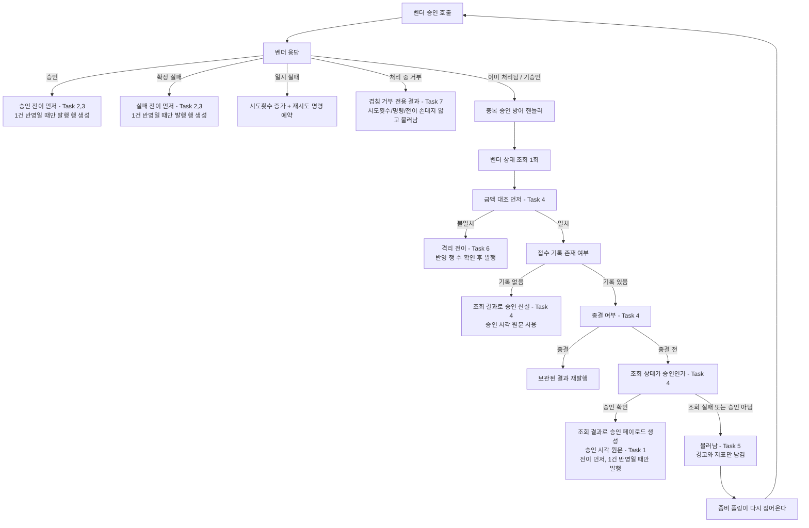

# 중복 승인 응답을 받은 결제의 종결 구현 플랜

> 작성일: 2026-08-12

## 목표

중복 승인 방어 핸들러가 접수 기록의 종결 여부로 처신을 갈라, 종결 전 기록도 올바르게 종결시키고 결과 반영 전이가 0건일 때 발행이 나가지 않게 한다.

## 컨텍스트

- 설계 문서: `docs/topics/PG-DUPLICATE-APPROVAL-SETTLEMENT.md`
- 이슈: #140
- 주요 변경 파일:
  - `pg-service/.../application/dto/PgStatusResult.java`
  - `pg-service/.../application/port/out/PgInboxRepository.java` + `infrastructure/repository/PgInboxRepositoryImpl.java`
  - `pg-service/.../application/service/PgVendorCallService.java` + `GatewayOutcome.java`
  - `pg-service/.../application/service/DuplicateApprovalHandler.java`
  - `pg-service/.../infrastructure/gateway/{toss,nicepay,fake}/` 세 전략
  - `pg-service/.../exception/PgGatewayConcurrentCallException.java` (신규)

## 요약 브리핑

### Task 목록

1. **조회 결과에 벤더 승인 시각 원문 보존** — 조회 응답 그릇에 원문 필드를 두고 벤더 전략 셋이 채운다
2. **접수 기록 종결 전이의 반영 행 수 반환** — 승인·실패 전이가 몇 건 반영됐는지 호출부가 알 수 있게 한다
3. **결과 반영 순서 재배치와 0건 발행 억제** — 전이를 먼저 하고, 반영이 없으면 발행 행을 만들지 않는다
4. **중복 승인 핸들러 분기 재구성** — 금액 대조를 먼저 하고, 일치하면 종결 여부로 갈라 종결 전 기록은 조회 결과로 종결시킨다
5. **승인 미확인 시 격리 대신 물러남** — 조회가 실패하면 진행 중인 결제를 격리시키지 않는다
6. **금액 불일치 격리 전이의 반환값 가드** — 이미 종결된 기록에는 격리 발행이 나가지 않게 한다
7. **벤더 처리 중 거부를 전용 결과로** — 겹친 호출이 재시도 예산을 먹지 않게 한다
8. **모의 벤더의 처리 중 거부 응답** — 겹침 경로가 통합 테스트와 라이브 드릴에서 재현되게 한다
9. **겹침과 좀비 회수 통합 검증** — 실제 스레드 경합까지 포함해 종결과 발행이 하나로 수렴하는지 확인한다

### 변경 후 전체 플로우

### 핵심 결정 → Task 매핑

| 설계 결정 | Task |
|:---:|:---:|
| 분기 평가 순서 — 금액 대조 선행 | 4 |
| 종결된 기록 → 보관 결과 재발행 | 4 (회귀 고정) |
| 종결 전 기록 + 승인 확인 → 조회 결과로 종결 | 4 |
| 승인 시각 원문 보존 | 1, 4 |
| 종결 전 기록 + 승인 미확인 → 물러남 | 5 |
| 벤더 상태값 확인 | 4 |
| 금액 불일치 → 격리 + 반환값 가드 | 6 |
| 결과 반영 전이 — 전이 선행, 0건이면 발행 행 미생성 | 2, 3, 4, 6 |
| 겹침 거부 전용 결과 | 7 |
| 호출 경로 구분을 두지 않음 | 해당 태스크 없음 (설계에서 배제) |
| 모의 벤더 처리 중 거부 | 8 |
| 위 전부의 실제 경합 검증 | 9 |

### 트레이드오프 / 후속 작업

- 소진 시점 자동 벤더 확인 경로도 같은 전이 메서드를 쓰지만 프로덕션 호출처가 0인 미배선 경로라 이번에는 주석 메모만 남긴다. 배선 판단은 별도 항목
- 기록이 아예 없을 때의 격리 신설 경로는 물러남 대상에서 뺐다. 좀비 폴링이 존재하는 행만 훑기 때문에 물러나면 아무도 다시 오지 않는다
- 겹침이 일어날 때 벤더 왕복 하나는 여전히 나간다. 호출 자체를 막으려면 컬럼과 만료 설계가 따라온다
- `docs/context/TODOS.md` 항목의 제목과 처방이 옛 방향이라 ship 단계에서 맞춘다

## 진행 상황

- [x] Task 1: 조회 결과에 벤더 승인 시각 원문 보존
- [x] Task 2: 접수 기록 종결 전이의 반영 행 수 반환
- [ ] Task 3: 결과 반영 순서 재배치와 0건 발행 억제
- [ ] Task 4: 중복 승인 핸들러 — 금액 대조 선행과 종결 여부 분기
- [ ] Task 5: 승인 미확인 시 격리 대신 물러남
- [ ] Task 6: 금액 불일치 격리 전이의 반환값 가드
- [ ] Task 7: 벤더 처리 중 거부를 전용 결과로
- [ ] Task 8: 모의 벤더의 처리 중 거부 응답
- [ ] Task 9: 겹침과 좀비 회수 통합 검증

## 태스크

### Task 1: 조회 결과에 벤더 승인 시각 원문 보존 [tdd=true] [domain_risk=true]

**테스트 (RED)**
- `TossPaymentGatewayStrategyStatusRawTest` — `getStatusByOrderId_승인응답_승인시각원문이_오프셋을_보존한다` / `getStatusByOrderId_승인시각_부재시_원문은_null`
- `NicepayPaymentGatewayStrategyStatusRawTest` — 동일 2건. NicePay 는 `+09:00` 응답을 쓰는 케이스로 오프셋 보존을 확인 (`PITFALLS.md` §13 이 지목한 형식)
- `FakePgGatewayStrategyStatusRawTest` — `getStatusByOrderId_승인기록_원문이_승인응답과_동일하다`
- 벤더 HTTP 는 Mockito 로 `HttpOperator` mock — 응답 변환 분기만 검증

**구현 (GREEN)**
- `PgStatusResult` 에 `approvedAtRaw`(String) 필드 추가 — record 라 생성 지점 전부가 컴파일로 강제된다
- `TossPaymentGatewayStrategy.toStatusResult` / `NicepayPaymentGatewayStrategy.toStatusResult` / `FakePgGatewayStrategy.toStatusResult` 가 원문을 채운다. 모의 전략은 보관 중인 승인 결과의 원문을 그대로 넘긴다
- 기존 `approvedAt`(LocalDateTime) 은 유지 — 이번 범위에서 제거하지 않는다

**완료 기준**
- 위 테스트 pass, 세 전략 모두 원문 경로 확보
- `./gradlew :pg-service:test` 회귀 없음

**완료 결과**
> `PgStatusResult` 에 `approvedAtRaw`(String) 필드를 마지막 자리에 추가했다. Toss 는 응답 `approvedAt` 원문을 그대로 싣고, NicePay 는 `parsePaidAtAsOffsetDateTime` 결과의 `toString()`으로 `+0900` → `+09:00` 정규화까지 거쳐(승인 응답 경로와 동일 근거) 실었다 — 기존 `parseApprovedAt(String)` 헬퍼는 이 정규화 경로로 흡수돼 제거했다. Fake 전략은 보관 중인 `PgConfirmResult.approvedAtRaw()`를 그대로 넘긴다. record 생성 지점 컴파일 강제로 찾은 프로덕션 3곳 + 테스트 8곳(`FakePgGatewayAdapter`, `PgVendorStatusQueryServiceTest`, `PgFinalConfirmationGateTest` 2곳, `PgConfirmListenerSplitIntegrationTest`, `DuplicateApprovalHandlerTest` 7곳)을 함께 보정했다. `./gradlew :pg-service:test` 전체 411건 pass.

---

### Task 2: 접수 기록 종결 전이의 반영 행 수 반환 [tdd=true] [domain_risk=true]

**테스트 (RED)**
- `PgInboxRepositoryImplTest` — `transitToApproved_진행중이면_1건반영` / `transitToApproved_이미종결이면_0건반영` / `transitToFailed_진행중이면_1건반영` / `transitToFailed_이미종결이면_0건반영`
- Testcontainers 기반 기존 테스트 클래스에 추가 — 실제 CAS 조건(`WHERE status='IN_PROGRESS'`) 동작 확인이 목적이라 Fake 로 대체하지 않는다

**구현 (GREEN)**
- `PgInboxRepository.transitToApproved` / `transitToFailed` 반환 타입을 `void` → `int` 로 변경
- `PgInboxRepositoryImpl` 이 JPA 레벨의 기존 반환값을 그대로 전달 (`casInProgressToApproved` / `casInProgressToFailed` 는 이미 `int` 반환)
- `FakePgInboxRepository`(테스트 더블) 도 같은 반환 계약을 재현한다 — 전이 대상이 아니면 0. 지금 이 두 메서드는 상태를 가리지 않고 무조건 전이하므로 **종결 가드를 함께 넣어야** 한다. 같은 Fake 의 격리 전이·시도횟수 증가는 이미 그 가드를 갖고 있으니 그 형태를 따른다
- 호출부는 이 태스크에서 값을 쓰지 않는다 — Task 3 에서 소비

**시그니처 변경 영향 (조사 완료)**

| 대상 | 처리 |
|:---:|:---:|
| `PgVendorCallService` 2곳 | Task 3 에서 소비 |
| `PgFinalConfirmationGate` 2곳 | 반환값을 쓰지 않고 그대로 둔다 — 프로덕션 호출처가 0 인 미배선 경로이고, 배선 판단은 설계 문서 제외 범위다. 같은 가드가 필요하다는 메모만 주석으로 남긴다 |
| `FakePgInboxRepository` | 반환 계약 재현 |
| `PgInboxPendingServiceTest` 내부 익명 더블 | 반환 타입 보정 |
| `DuplicateApprovalHandlerTest` / `PgVendorCallServiceTest` | 이 태스크에서는 손대지 않는다 — 반환값을 받지 않는 호출이라 컴파일이 깨지지 않고, Mockito 미스텁 `int` 는 기본값 0 을 돌려준다. 0건 케이스는 Task 3 / 4 / 6 에서 추가한다 |

**완료 기준**
- 위 테스트 4건 pass
- 구현체 2곳(프로덕션 어댑터 + Fake) 과 익명 더블 1곳이 새 반환 계약을 따른다. `./gradlew :pg-service:test` 회귀 없음

**완료 결과**
> `PgInboxRepository.transitToApproved` / `transitToFailed` 반환 타입을 `void` → `int` 로 바꿨다. `PgInboxRepositoryImpl` 은 이미 `int` 를 반환하던 `casInProgressToApproved` / `casInProgressToFailed` 결과를 그대로 돌려주기만 하면 됐다. `FakePgInboxRepository` 는 두 메서드가 상태를 가리지 않고 무조건 전이하던 것을, 같은 파일의 `transitToQuarantined` 가 쓰는 종결 가드(`current.getStatus().isTerminal()` 체크) 형태를 맞춰 종결 행은 no-op + 0 반환하도록 고쳤다. `PgInboxPendingServiceTest` 내부 익명 더블(`MockPgInboxRepository`)도 반환 타입만 `int`(0 고정)로 보정했다. `PgFinalConfirmationGate` 의 두 호출부는 프로덕션 호출처가 0인 미배선 경로라 반환값을 그대로 두고, 같은 0건 가드가 필요하다는 메모만 주석으로 남겼다. `PgVendorCallService` 2곳은 계획대로 Task 3 에서 소비한다. `./gradlew :pg-service:test` 전체 415건 pass.

---

### Task 3: 결과 반영 순서 재배치와 0건 발행 억제 [tdd=true] [domain_risk=true]

**테스트 (RED)**
- `PgVendorCallServiceTest` — `승인_전이_1건반영이면_발행행_저장과_이벤트발행` / `승인_전이_0건반영이면_발행행_미저장` / `확정실패_전이_1건반영이면_발행행_저장` / `확정실패_전이_0건반영이면_발행행_미저장`
- 0건 케이스는 `assertThat(outboxRepository.findAll()).isEmpty()` 로 **발행 행 자체가 만들어지지 않음**을 확인한다 — 이벤트 미발행만 검증하면 폴링 안전망 우회를 잡지 못한다
- 이 테스트가 쓰는 발행 대장은 Mockito mock 이 아니라 Fake 구현체다. `verify(...)` 계열을 쓰면 실행이 깨진다. 같은 파일의 기존 재시도 가드 테스트가 쓰는 상태 기반 검증 방식을 따른다 — Task 4 / Task 6 의 0건 케이스도 동일

**구현 (GREEN)**
- `PgVendorCallService.handleSuccess` / `handleDefinitiveFailure` 에서 전이 호출을 발행 행 저장보다 **앞으로** 옮기고, 반영 행 수가 0이면 로그와 지표만 남기고 즉시 반환
- 억제 시 `LogFmt.warn` + 전용 카운터. 기존 `insertRetryOutbox` 의 가드 로그 형식을 따른다

**완료 기준**
- 위 테스트 4건 pass
- `handleSuccess` / `handleDefinitiveFailure` 안에서 `pgOutboxRepository.save` 가 전이 성공 분기 뒤에만 위치

**완료 결과**
> (execute에서 채움)

---

### Task 4: 중복 승인 핸들러 — 금액 대조 선행과 종결 여부 분기 [tdd=true] [domain_risk=true]

**테스트 (RED)**
- `DuplicateApprovalHandlerTest`
  - `기록있음_금액일치_종결_보관결과_재발행` (기존 동작 회귀)
  - `기록있음_금액일치_종결전_조회상태_승인_조회결과로_승인종결` — 발행 1건, 승인 시각이 조회 원문과 동일
  - `기록있음_금액일치_종결전_조회상태_승인아님_아무것도_하지않음`
  - `기록있음_금액불일치_종결여부와_무관하게_격리` — 종결 / 종결 전 두 케이스를 `@ParameterizedTest` 로
  - `기록있음_종결전_승인종결_전이0건이면_발행행_미저장`
  - `기록없음_금액일치_승인시각이_조회원문과_동일` — 기록 없음 경로도 같은 원문을 쓰는지 고정
- 조회 포트는 Mockito mock, 접수대장은 기존 테스트가 쓰는 더블을 따른다

**구현 (GREEN)**
- `DuplicateApprovalHandler.handleDbExists` 재구성 — 금액 대조를 먼저 하고, 일치할 때만 종결 여부로 분기
- 종결 → 기존 `reemitStoredStatus`
- 종결 전 → 조회 응답의 상태값이 승인일 때만 승인 페이로드를 만들어 종결. `APPROVED_STATUSES` 를 실제로 사용한다
- 승인 페이로드는 Task 1 의 승인 시각 원문을 싣고, 원문이 없을 때만 현재 시각으로 대체
- **기록 없음 경로도 같이 고친다** — `handleDbAbsent` 가 조회 결과를 그대로 받아 `handleDbAbsentAmountMatch` 까지 전달하고, 승인 페이로드 헬퍼가 원문을 쓰도록 한다. 지금은 금액만 넘겨받아 현재 시각을 쓴다. 설계의 승인 시각 결정은 기록 유무를 가르지 않는다
- 전이는 Task 2/3 과 같은 규칙 — 전이 선행, 0건이면 발행 행 미저장

**완료 기준**
- 위 테스트 pass, `APPROVED_STATUSES` 사용처 1곳 이상
- 승인 페이로드를 만드는 두 경로(기록 있음 / 기록 없음) 모두 조회 원문을 쓰고, `OffsetDateTime.now(clock)` 는 원문 부재 대체 자리에만 남는다
- `./gradlew :pg-service:test` 회귀 없음

**완료 결과**
> (execute에서 채움)

---

### Task 5: 승인 미확인 시 격리 대신 물러남 [tdd=true] [domain_risk=true]

**테스트 (RED)**
- `DuplicateApprovalHandlerTest`
  - `조회실패_기록이_종결전이면_격리하지_않고_물러난다` — 접수대장 전이 호출 0회, 발행 0건
  - `조회실패_물러날때_경고와_지표가_남는다` — 카운터 증가 확인. 물러남의 안전 근거가 가시성이므로 함께 검증
  - `조회실패_기록이_없으면_기존_보정을_유지한다` — 기록 신설 후 격리 경로는 이번 범위 밖임을 회귀로 고정

**구현 (GREEN)**
- `DuplicateApprovalHandler.handleVendorIndeterminate` 에서 기록이 존재하고 종결 전이면 상태를 바꾸지 않고 반환. `LogFmt.warn` + 전용 카운터
- 기록이 아예 없는 경로(`transitDirectToInProgress` + 격리)는 그대로 둔다 — 진행 중인 다른 작업자가 없는 상황이라 성격이 다르다

**완료 기준**
- 위 테스트 3건 pass
- 종결 전 기록에 대한 `transitToQuarantined` 호출이 조회 실패 경로에서 사라짐

**완료 결과**
> (execute에서 채움)

---

### Task 6: 금액 불일치 격리 전이의 반환값 가드 [tdd=true] [domain_risk=true]

**테스트 (RED)**
- `DuplicateApprovalHandlerTest`
  - `금액불일치_격리전이_1건반영이면_격리발행` / `금액불일치_격리전이_0건반영이면_발행행_미저장`

**구현 (GREEN)**
- `handleAmountMismatchDbExists` 가 `transitToQuarantined` 반환값을 확인해 false 면 발행 행을 만들지 않고 로그만 남긴다 — 순서는 이미 전이 선행이라 재배치는 불필요
- `PgDlqService` 는 순서·가드 모두 이미 준수하므로 손대지 않는다

**완료 기준**
- 위 테스트 2건 pass
- 금액 불일치 경로에서 `enqueueOutbox` 가 전이 성공 분기 뒤에만 위치

**완료 결과**
> (execute에서 채움)

---

### Task 7: 벤더 처리 중 거부를 전용 결과로 [tdd=true] [domain_risk=true]

**테스트 (RED)**
- `TossPaymentErrorCodeTest` — `처리중거부코드_전용분류로_판정` / `처리중거부코드는_재시도대상이_아니다`
- `TossPaymentGatewayStrategyConcurrentCallTest` — `처리중거부_응답이면_전용예외_전파`
- `PgVendorCallServiceTest` — `겹침거부_시도횟수_미증가_재시도명령_미예약_상태전이_없음`

**구현 (GREEN)**
- `PgGatewayConcurrentCallException` 신규 (`pg-service/.../exception/`)
- `TossPaymentErrorCode` 에 처리 중 거부 코드 등재 + `isConcurrentCall()` 판정. `isRetryableError()` 에서는 제외
- `TossPaymentGatewayStrategy.handleErrorResponse` 가 해당 코드에 전용 예외를 던진다
- `GatewayOutcome` 에 `ConcurrentCall` 레코드 추가 (sealed permits 확장), `invokeConfirm` 이 전용 예외를 그 결과로 변환
- `PgVendorCallService.dispatchOutcome` 에 분기 추가 — 로그와 지표만 남기고 반환

**완료 기준**
- 위 테스트 pass
- `GatewayOutcome` switch 가 모든 분기를 덮어 컴파일 경고 없음

**완료 결과**
> (execute에서 채움)

---

### Task 8: 모의 벤더의 처리 중 거부 응답 [tdd=true] [domain_risk=false]

**테스트 (RED)**
- `FakePgGatewayStrategyConcurrentCallTest`
  - `원호출_응답대기중_두번째호출은_처리중거부` — 두 스레드로 동시 호출
  - `원호출_완료후_두번째호출은_기존대로_이미처리됨`

**구현 (GREEN)**
- `FakePgGatewayStrategy` 에 진행 중 주문 집합을 두고, 승인 호출 진입 시 등록에 실패하면(이미 진행 중) 처리 중 거부를 던진다. 결과 확정 시 해제
- 기존 `processedOrders.putIfAbsent` 판정은 그대로 — 완료 후 재호출은 지금처럼 이미 처리됨으로 응답

**완료 기준**
- 위 테스트 2건 pass
- 기존 모의 벤더 사용 테스트 회귀 없음

**완료 결과**
> (execute에서 채움)

---

### Task 9: 겹침과 좀비 회수 통합 검증 [tdd=true] [domain_risk=true]

**테스트 (RED)**
- `PgDuplicateApprovalSettlementIntegrationTest` (신규, `pg-service/.../integration/`)
  - `좀비회수_벤더승인완료_접수기록이_승인으로_종결되고_발행_1건` — 지금은 롤백되는 자리. 반복 회수에도 발행이 늘지 않는지 확인
  - `겹친_두호출_종결과_발행이_각_1회` — 모의 벤더의 처리 중 거부로 재현
  - `전이_0건이면_폴링_안전망도_발행하지_않는다` — 발행 대장에 행이 없음을 확인해 뒤늦은 발행 경로까지 닫혔음을 검증
  - `동일주문_두스레드_동시종결_발행1건_상태수렴` — **실제 DB 경합**. `ExecutorService` + `CountDownLatch` 로 같은 주문에 승인 종결과 격리 종결을 동시에 걸고, 발행 대장 행이 정확히 1건이며 접수 기록 최종 상태가 하나로 수렴하는지 확인한다
- 기존 `PgSelfLoopDuplicateAbsorptionIntegrationTest` / `PgInboxAttemptGuardIntegrationTest` 는 순차 호출 패턴이라 구성만 참고하고, 마지막 케이스는 스레드 경합을 직접 만든다. 0건 가드가 하나로 수렴시킨다는 것이 이 설계의 핵심 안전장치인데 벤더 쪽 직렬화에 기대 우회하면 검증되지 않는다
- 이 케이스는 Testcontainers 필수 — Fake 저장소는 실제 CAS 경합을 재현하지 못한다

**완료 기준**
- 위 테스트 4건 pass
- 동시 경합 케이스가 반복 실행에도 안정적으로 통과 (`@RepeatedTest` 로 최소 10회)
- `./gradlew :pg-service:test` 전체 pass, 통합 테스트가 캐시로 건너뛰지 않았음을 확인

**완료 결과**
> (execute에서 채움)

## 리뷰 처리

> (ship 단계에서 채움 — finding별 채택/스킵 + 사유)
