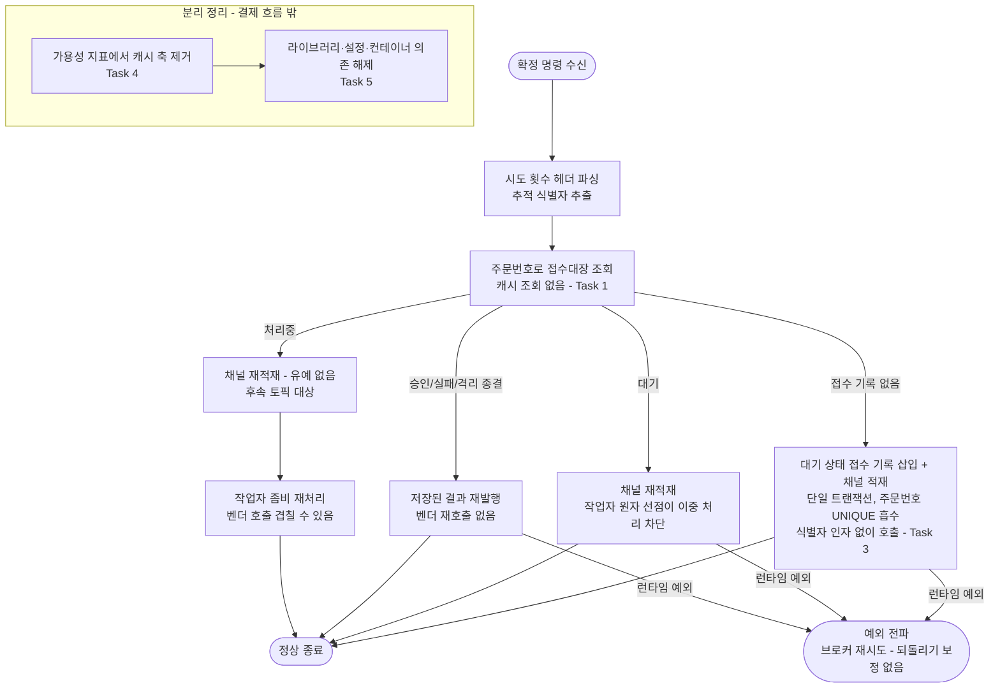

# pg 리스너 메시지 dedupe 층 제거 구현 플랜

> 작성일: 2026-08-10

## 요약 브리핑

### Task 목록

1. **리스너 진입 필터와 되돌리기 보정 제거** — 확정 명령을 받자마자 캐시로 걸러내던 관문과, 실패 시 그 기록을 되돌리던 보정을 걷어낸다. 중복 감지 로그 종류도 함께 없앤다
2. **dedupe 포트·어댑터·Fake 제거** — 소비처가 사라진 껍데기와 통합 테스트 4종의 대역 등록을 정리한다
3. **접수 기록 삽입의 미사용 식별자 파라미터 제거** — 접수대장에 컬럼이 없어 이미 버려지던 인자를 시그니처에서 뺀다
4. **의존성 가용성 지표의 캐시 축 제거** — 캐시 연결 타입을 참조하는 관측 코드를 정리한다. 라이브러리를 걷어내려면 선행돼야 한다
5. **캐시 의존 설정·빌드·컨테이너 정리** — 라이브러리, 접속 설정, 컨테이너 의존, 알람 테스트 시리즈를 끊는다
6. **리스너 서비스의 죽은 벤더 호출 의존 제거** — 게이트에서 발견된 미사용 주입 필드를 정리한다. 기존 테스트가 헛돌던 원인이기도 하다

### 변경 후 전체 플로우

### 핵심 결정 → Task 매핑

| 설계 결정 | Task |
|---|---|
| 필터 층 제거 | 1(호출 분기) + 2(포트·어댑터·Fake) |
| 되돌리기 보정 제거 | 1 |
| 중복 감지 로그 종류 제거 | 1 |
| 재수신 테스트 재작성 | 1 |
| 미사용 식별자 파라미터 제거 | 3 |
| 캐시 가용성 지표 축 제거 | 4 |
| pg의 캐시 의존 완전 제거 | 5 |
| 알람 테스트 시리즈 정리 | 5 |
| 캐시 인스턴스 유지(변경 없음) | 5 완료 기준에서 미변경 확인 |
| (게이트 발견) 죽은 벤더 호출 의존 정리 | 6 |

### 트레이드오프 / 후속 작업

- **테스트 신뢰도가 이번에 함께 올라간다**: 기존 재수신 테스트 2건은 항상 참인 값을 검사하고 있었다(리스너가 벤더를 부르지 않으므로 호출 0회는 자명). 실제 흡수를 관측하는 형태로 다시 짜면서 제거로 잃는 보장을 처음으로 실제 고정한다
- **순서 제약**: 캐시 라이브러리 해제(Task 5)는 코드에서 캐시 타입 참조가 모두 사라진 뒤(Task 2·4)여야 컴파일이 유지된다
- **후속 1 (도메인)**: 처리중 재전송 시 벤더 호출 겹침 — 리스너 재적재 경로의 유예 부재를 닫는 토픽
- **후속 2 (테스트)**: 접수대장 UNIQUE의 실제 동시 경합 흡수는 아직 순차 중복으로만 검증된다. 실제 DB 동시 삽입 테스트 추가
- **ship 위임**: `docs/context/PAYMENT-FLOW.md`의 필터 서술 갱신

## 목표

pg 리스너 진입부의 캐시 dedupe 필터와 그에 딸린 캐시 의존 전체를 걷어내고, 중복 방어를 접수대장 층에 일임한 상태로 4서비스 회귀와 라이브 기동이 통과하면 완료.

## 컨텍스트

- 설계 문서: `docs/topics/PG-MESSAGE-DEDUPE-LAYER-REMOVAL.md`
- 이슈/브랜치: #138
- 주요 변경 파일: `PgConfirmService`, `EventDedupeStore`(+어댑터·Fake), `PgInboxRepository.insertPending` 경로, `DependencyHealthMetrics`, `pg-service/build.gradle`, `docker/docker-compose.apps.yml`
- 선행 상태: 위키·README·포트폴리오·블로그는 이미 제거 완료 기준으로 갱신돼 있다. `README.md`는 워킹트리 미커밋 상태로, 코드 제거 커밋과 함께 정합이 맞는다
- **ship 문서 동기화에서 반드시 다룰 대상**: `docs/context/PAYMENT-FLOW.md`가 제거되는 필터를 여러 곳에서 현재형으로 서술한다 — 다이어그램 노드, 2단 멱등성 프로즈, 접수대장 표, 재시도 식별자 발급 서술, 멱등성 정리 표 등 최소 5곳. 선반영된 위키·README와 달리 이 파일은 아직 손대지 않았다. 코드 변경 태스크에 넣지 않고 ship 단계 문서 동기화에서 처리하되, 착수 시 개수를 믿지 말고 다시 검색해 전부 잡는다

## 진행 상황

- [x] Task 1: 리스너 진입 필터와 되돌리기 보정 제거
- [x] Task 2: dedupe 포트·어댑터·Fake 제거
- [ ] Task 3: 접수 기록 삽입의 미사용 식별자 파라미터 제거
- [ ] Task 4: 의존성 가용성 지표의 캐시 축 제거
- [ ] Task 5: pg의 캐시 의존 설정·빌드·컨테이너 정리
- [ ] Task 6: 리스너 서비스의 죽은 벤더 호출 의존 제거

## 태스크

### Task 1: 리스너 진입 필터와 되돌리기 보정 제거 [tdd=true] [domain_risk=true]

**테스트 (RED)**

> **전제 정정**: 기존 재수신 테스트 2건의 "벤더 호출 0회" 단언은 실제로는 아무것도 검증하지 못한다. `PgConfirmService`는 어느 분기에서도 벤더 호출 서비스를 부르지 않고(필드 선언만 있고 사용처 0), 접수 기록 삽입 서비스가 전체 mock이라 두 번째 수신도 접수대장이 빈 것으로 보여 매번 "접수 없음" 경로로 다시 들어간다. 항상 참인 값을 검사하는 구조라, 이름만 바꿔서는 제거로 잃는 보장을 고정하지 못한다. 아래처럼 실제로 흡수를 관측하도록 다시 짠다.

- `PaymentConfirmConsumerTest` — 공용 `setUp`에서 필터 Fake 생성·주입 제거 → `PgConfirmService` 생성자 호출이 바뀌어 **컴파일 실패로 RED**. 같은 `setUp`을 쓰는 나머지 테스트도 이 시점에 함께 깨진다
- 같은 `setUp`에서 접수 기록 삽입 서비스를 전체 mock 대신 **실제 인스턴스를 감싼 스파이**로 구성해 `FakePgInboxRepository`에 물린다. 이 Fake는 주문번호 키로 삽입을 흡수하므로(`computeIfAbsent`) 접수대장 UNIQUE를 대신할 수 있다. 이벤트 발행자는 기존 테스트 대역을 쓰고, 미터 레지스트리는 이 파일에 없으므로 `SimpleMeterRegistry`를 새로 넣는다
- 재수신 테스트 2건을 흡수 관측 기준으로 재작성
  - **순차 재수신** — 동일 명령 2회 수신 시 접수 기록이 정확히 1건만 생기고, **두 번째 수신에서 삽입 서비스가 아예 호출되지 않는지**를 스파이로 단언. 접수 기록 수만 보면 흡수된 삽입과 대기 상태 라우팅이 같은 결과로 수렴해 분기 회귀를 못 잡는다 — 호출 여부까지 봐야 갈린다
  - **동시 재수신** — 8스레드 동시 진입 후 접수 기록이 정확히 1건. 기존 테스트는 스레드마다 다른 식별자를 써서 이미 주문번호 UNIQUE를 보고 있었으므로, 이름을 실제 검증 대상에 맞추고 단언을 호출 횟수에서 접수 기록 수로 바꾼다
- `PgConfirmServiceTest` — 필터 mock 선언·스텁 제거, 생성자 인자 조정. 라우팅 검증이 목적이라 접수 기록 삽입 서비스는 mock 유지. 기존 4분기 테스트(접수 없음 / 대기 / 처리중 / 종결)의 단언은 그대로 둔다

**구현 (GREEN)**

- `pg/application/service/PgConfirmService.java`
  - 필터 필드와 생성자 주입 제거
  - `handle`에서 선점 검사 분기와 중복 로그 제거, `try`/`catch (RuntimeException) { remove }` 보정 제거 → `processCommand` 직접 호출
  - 클래스 Javadoc의 "2단 멱등성 키" 서술을 접수대장 단일 방어 기준으로 정정
- `pg/core/common/log/EventType.java` — `PG_CONFIRM_DUPLICATE_UUID` 제거 (로그 지점 소멸, 알람·대시보드 참조 0건 확인됨)

**완료 기준**

- 재작성한 재수신 2건이 접수 기록 수를 단언하며 pass — 흡수가 깨지면 실제로 실패하는지 확인(단언을 일부러 뒤집어 한 번 돌려본다)
- `PaymentConfirmConsumerTest` 6개 메서드(종결 3분기 포함 8케이스) 전체 pass
- `PgConfirmServiceTest` 4분기 pass
- `./gradlew :pg-service:test` 회귀 없음

**완료 결과**

`PgConfirmService`에서 `EventDedupeStore` 필드·생성자 주입·`markSeen`/`remove` 호출을 모두 걷어냈다. `handle`은 이제 inbox 상태 조회 후 바로 분기하며, 별도 `processCommand` 사설 메서드는 두지 않았다 — 필터·try/catch 제거 후 남는 본문이 `processCommand`를 그대로 옮긴 한 줄 위임이 되어 code-style 컨벤션(불필요한 한 줄 위임 금지)에 걸려 `handle` 안으로 병합했다. 클래스 Javadoc은 "2단 멱등성 키" 서술을 "중복 방어는 접수대장 orderId UNIQUE 단일 층에서 흡수" 로 정정했다. `EventType.PG_CONFIRM_DUPLICATE_UUID`는 참조 0건을 재확인 후 제거했다.

`PaymentConfirmConsumerTest`는 접수 기록 삽입 서비스를 `FakePgInboxRepository`에 물린 실제 `PgInboxPendingService`를 감싼 스파이로 바꿔, 순차 재수신 테스트가 접수 기록 수(1건)와 스파이 호출 횟수(1회)를 함께 단언하도록 재작성했다. 동시 재수신 테스트는 8스레드 진입 후 접수 기록 수(1건) 단언으로 전환했다. 두 단언 모두 일부러 뒤집어(times(1)→times(2), hasSize(1)→hasSize(8)) 돌려 실제로 FAILED 되는 것을 확인한 뒤 원복했다. `PgConfirmServiceTest`는 필터 mock 선언·스텁만 제거하고 라우팅 검증 4분기는 그대로 유지했다.

`./gradlew :pg-service:test` 408 tests, 408 passed, 0 failed — 회귀 없음.

---

### Task 2: dedupe 포트·어댑터·Fake 제거 [tdd=false] [domain_risk=false]

Task 1에서 유일한 소비처가 사라진 뒤 껍데기를 걷어낸다.

**구현**

- 삭제: `pg/application/port/out/EventDedupeStore.java`, `pg/infrastructure/dedupe/EventDedupeStoreRedisAdapter.java`, `pg/mock/FakeEventDedupeStore.java`
- 통합 테스트 4종의 `TestConfiguration`에서 Fake 빈 등록 블록과 관련 import·주석 제거
  - `PgConfirmListenerSplitIntegrationTest`, `PgInboxTraceparentIntegrationTest`, `PgInboxAttemptGuardIntegrationTest`, `PgSelfLoopRetryExhaustionIntegrationTest`
  - 각 클래스 Javadoc의 "Redis 미사용 — Fake로 대체" 서술도 함께 정리
- `PgInboxRepositoryImpl.insertPending` Javadoc에서 "eventUuid는 dedupe 저장소가 관리한다" 서술 제거 (Task 3에서 파라미터 자체가 사라지므로 최소한만 손댄다)

**완료 기준**

- `pg-service` 전체에서 `EventDedupeStore` 참조 0건
- 통합 테스트 4종이 Fake 빈 등록 없이 컨텍스트 로딩 성공
- `./gradlew :pg-service:test` 회귀 없음

**완료 결과**

`EventDedupeStore` 포트, `EventDedupeStoreRedisAdapter`, `FakeEventDedupeStore` 세 파일을 삭제했다. 통합 테스트 4종에서 `EventDedupeStore` 빈 등록 `TestConfiguration` 블록과 관련 import(`EventDedupeStore`, `FakeEventDedupeStore`)를 지웠다 — `PgSelfLoopRetryExhaustionIntegrationTest`는 같은 파일에 self-loop relay 대체용 `TestConfiguration`이 별도로 있어 그 블록만 남기고 dedupe 전용 블록만 제거했다. `PgConfirmListenerSplitIntegrationTest`/`PgInboxTraceparentIntegrationTest` 클래스 Javadoc의 "Redis 미사용 — Fake로 대체" 서술도 제거했다(`PgInboxAttemptGuardIntegrationTest`는 원래 이 서술이 없었다). `spring.autoconfigure.exclude`로 `RedisAutoConfiguration`을 끄는 `@SpringBootTest` 속성은 dedupe 전용 설정이 아니라 4종 모두 Redis 빈 자체를 배제하는 별개 관심사라 손대지 않았다. `PgInboxRepositoryImpl.insertPending` Javadoc은 "eventUuid는 DB 컬럼 없이 EventDedupeStore에서 관리하므로 여기서는 무시한다"를 "eventUuid는 대응 DB 컬럼이 없어 여기서는 무시한다"로 정정했다(파라미터 자체는 Task 3에서 제거).

`pg-service` 전체에서 `EventDedupeStore` 참조는 소스·테스트·빌드 어디에도 0건이다(grep 확인). `./gradlew :pg-service:test` 408 tests, 408 passed, 0 failed — 회귀 없음.

---

### Task 3: 접수 기록 삽입의 미사용 식별자 파라미터 제거 [tdd=false] [domain_risk=false]

접수대장에 해당 컬럼이 없어 이미 무시되던 인자다. 필터가 사라져 존재 이유가 완전히 없어졌다.

**구현**

- 포트: `PgInboxRepository.insertPending` 시그니처에서 `eventUuid` 제거
- 구현체: `PgInboxRepositoryImpl.insertPending` — 파라미터와 Javadoc 정리
- 호출부: `PgInboxPendingService.insertPendingAndPublish`도 같은 인자를 받아 넘기므로 함께 제거. `PgConfirmService.handleAbsent`의 호출 조정
- 테스트 조정: `FakePgInboxRepository`, `PgInboxPendingServiceTest`(익명 구현 포함), `PgInboxRepositoryImplTest`, `PgConfirmListenerSplitIntegrationTest`, `PgInboxTraceparentIntegrationTest`, `PgSelfLoopDuplicateAbsorptionIntegrationTest`
- **인자 개수가 바뀌어 함께 깨지는 곳**: `PgConfirmServiceTest`가 접수 기록 삽입 서비스를 6인자로 mock·verify한다. Task 1에서 이 파일은 mock을 유지하므로 여기서 인자 수를 맞춰야 컴파일이 통과한다. (`PaymentConfirmConsumerTest`는 Task 1에서 실제 인스턴스로 바뀌어 이 조정이 불필요하다)

**완료 기준**

- `insertPending` / `insertPendingAndPublish` 시그니처에 식별자 인자 없음
- 파라미터 제거가 접수 기록 삽입 거동을 바꾸지 않음 — `PgInboxRepositoryImplTest`의 신규 삽입·중복 주문번호 케이스 pass
- `./gradlew :pg-service:test` 회귀 없음

**완료 결과**
> (execute에서 채움)

---

### Task 4: 의존성 가용성 지표의 캐시 축 제거 [tdd=false] [domain_risk=false]

캐시 라이브러리를 걷어내려면(Task 5) 연결 타입을 import하는 이 코드가 먼저 정리돼야 한다.

**구현**

- `pg/infrastructure/metrics/DependencyHealthMetrics.java`
  - 캐시 연결 타입 import 2건, `COMPONENT_REDIS` 상수, 연결 팩토리 필드, 캐시 게이지 필드 제거
  - 생성자에서 연결 팩토리 `ObjectProvider` 파라미터 제거
  - 게이지 등록·폴링 루프의 캐시 분기와 `checkRedisHealth` 제거
  - 클래스 Javadoc의 "캐시는 optional 의존" 문단 제거, DB 축만 남는 것으로 정정
- `DependencyHealthMetricsTest`
  - 캐시 mock·`setupHealthyRedis` 제거, 생성자 호출 조정
  - "캐시 빈 부재 시 DB 게이지만 동작" 케이스 삭제 (캐시 축 자체가 없어져 의미 소멸)
  - "정상이면 게이지 1" 케이스는 DB 축 기준으로 축소, 타임아웃 케이스는 유지

**완료 기준**

- `DependencyHealthMetrics`에 캐시 참조 0건, DB 게이지와 폴링 타임스탬프는 기존대로 동작
- `DependencyHealthMetricsTest` 잔여 케이스 pass
- `./gradlew :pg-service:test` 회귀 없음

**완료 결과**
> (execute에서 채움)

---

### Task 5: pg의 캐시 의존 설정·빌드·컨테이너 정리 [tdd=false] [domain_risk=false]

코드에서 캐시 참조가 모두 사라진 뒤 마지막으로 의존 자체를 끊는다.

**구현**

- `pg-service/build.gradle` — `spring-boot-starter-data-redis` 제거
- `pg-service/src/main/resources/application-docker.yml` — `spring.data.redis` 블록, `pg.event-dedupe` 블록 제거
- `docker/docker-compose.apps.yml` — pg 블록의 `depends_on: redis-dedupe`와 접속 환경변수 2건 제거. **`redis-dedupe` 서비스 정의와 payment 쪽 의존은 건드리지 않는다** (결제 요청 멱등성 저장소가 계속 사용)
- `observability/prometheus/rules/tests/availability_test.yml` — pg 캐시 시리즈 1행 제거 (payment의 두 캐시 시리즈는 유지)

**완료 기준**

- `pg-service` 컴파일·전체 테스트 pass (캐시 라이브러리 없이)
- `docker/docker-compose.infra.yml`의 `redis-dedupe` 서비스와 payment 의존이 그대로 남아 있음
- promtool 알람 규칙 테스트 pass
- `./gradlew test` 4서비스 전체 회귀 없음
- 라이브 검증: 스택 기동 후 pg 헬스 정상, pg 가용성 지표에서 캐시 축 소멸·DB 축 잔존, 결제 1건 관통

**완료 결과**
> (execute에서 채움)

---

### Task 6: 리스너 서비스의 죽은 벤더 호출 의존 제거 [tdd=false] [domain_risk=false]

plan 게이트에서 발견됐다. `PgConfirmService`가 벤더 호출 서비스를 필드로 주입받지만 어느 분기에서도 쓰지 않는다 — 리스너는 접수 기록과 채널 적재까지만 하고 벤더 호출은 작업자가 한다. 이 죽은 의존 때문에 기존 재수신 테스트의 "벤더 호출 0회" 단언이 항상 참이었다(Task 1 전제 정정 참조).

필터 제거와는 별개 관심사이므로 커밋을 분리한다. 같은 클래스 생성자를 Task 1에서 이미 한 번 바꾸므로 그 이후에 수행한다.

**구현**

- `pg/application/service/PgConfirmService.java` — 벤더 호출 서비스 필드와 생성자 주입 제거, 미사용 import 정리
- 생성자 인자가 하나 줄어드는 데 따른 테스트 조정: `PgConfirmServiceTest`, `PaymentConfirmConsumerTest`

**완료 기준**

- `PgConfirmService`에 사용하지 않는 주입 필드 없음
- Task 1에서 재작성한 재수신 테스트가 여전히 pass — 단언 근거가 접수 기록 수와 삽입 호출 여부로 옮겨졌으므로 죽은 필드가 사라져도 검증력이 유지된다
- `./gradlew :pg-service:test` 회귀 없음

**완료 결과**
> (execute에서 채움)

## 리뷰 처리

> (ship 단계에서 채움 — finding별 채택/스킵 + 사유)
