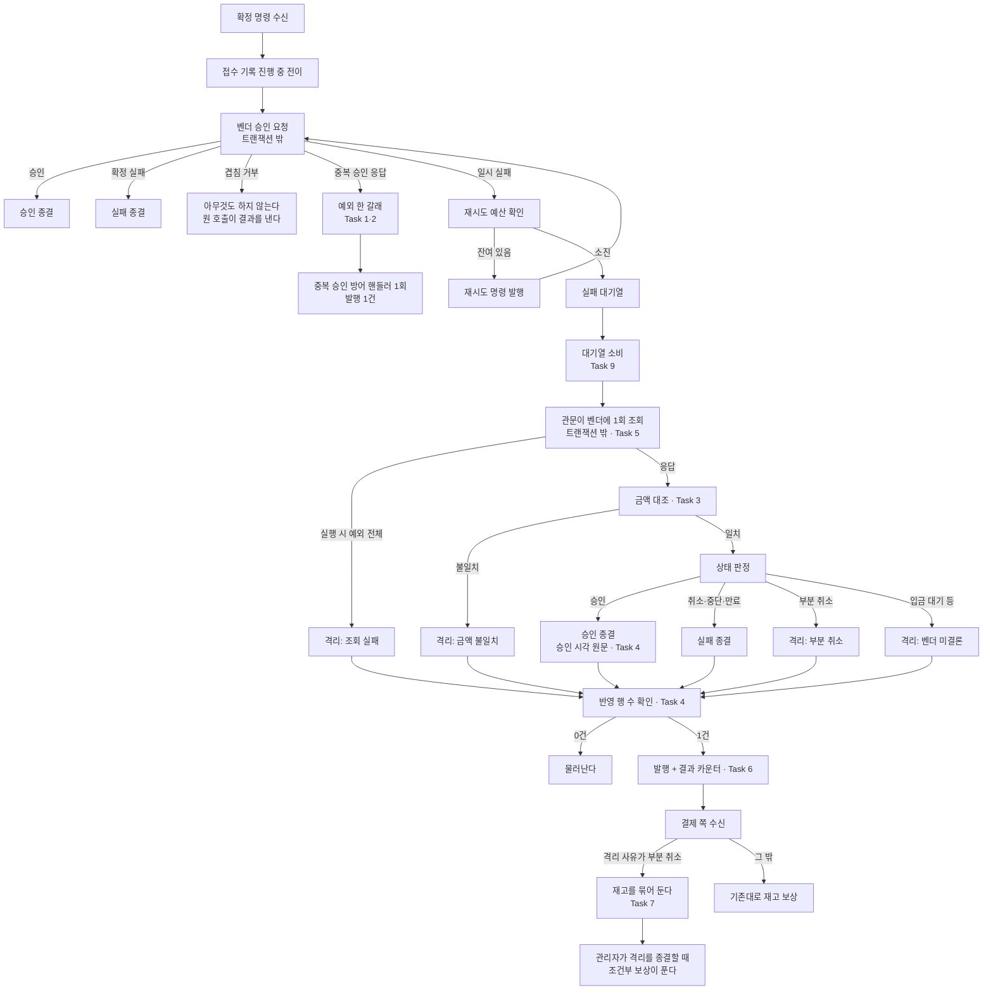

# 벤더 응답 신호 경로 단일화 구현 플랜

> 작성일: 2026-08-13

## 요약 브리핑

### Task 목록

| # | 무엇을 하는가 |
|:---:|:---:|
| 1 | 벤더 전략 3종이 중복 승인 이벤트를 발행하지 않고 예외만 던지게 한다 |
| 2 | 이벤트 타입과 수신 메서드를 지우고, 공유 테스트 대역의 배선도 걷는다. 발행 1건 단언을 채운다 |
| 3 | 관문 판정을 다시 짠다 — 금액 대조 선행, 부분 취소 분리, 격리 사유 4갈래, 예외 포착 확대 |
| 4 | 관문이 전이 반영 행 수를 확인하고 0건이면 발행하지 않게 한다. 승인 시각 원문을 전달한다 |
| 5 | 관문의 벤더 조회를 트랜잭션 밖으로 뺀다 |
| 6 | 관문 결과 분포 카운터를 노출한다 |
| 7 | 결제 쪽이 부분 취소 사유의 격리에서 즉시 재고 보상을 건너뛰게 한다 |
| 8 | 모의 벤더에 확정은 실패하고 조회는 승인으로 답하는 시나리오를 넣는다 |
| 9 | 실패 대기열 소비가 격리 직행 대신 관문을 부르게 한다 |
| 10 | 대기열 소비부터 종결까지를 실제 DB 위에서 검증한다 |
| 11 | 소진 도달 알람이 자동 확정 건도 잡도록 표현식을 바꾼다 |
| 12 | 접수대장 유일 제약을 실제 동시 삽입으로 검증한다 |

### 변경 후 전체 플로우

### 핵심 결정 → Task 매핑

| 결정 | Task |
|:---:|:---:|
| 이벤트 갈래 제거, 예외만 유지 / 이벤트 타입·수신 메서드 삭제 | 1, 2 |
| 확정 실패는 취소·중단·만료 셋만 / 금액 대조 선행 / 조회 예외 포착 확대 / 격리 사유 4갈래 | 3 |
| 전이 반영 행 수 가드 / 승인 시각 원문 | 4 |
| 관문 트랜잭션 분리 | 5 |
| 관문 결과 지표 | 6 |
| 부분 취소의 재고 / 다른 격리 사유의 재고 / 사유 문자열 계약 | 7 |
| 모의 벤더 시나리오 | 8 |
| 관문 호출 자리 / 전위 조회 비잠금 / 기존 소진 도달 카운터 | 9 |
| 소진 도달 알람 | 11 |
| 접수대장 동시 삽입 | 12 |

검증 전략의 통합 검증은 Task 10, 발행 건수 단언은 Task 2 가 받는다.

### 트레이드오프 / 후속 작업

- **배포 순서가 곧 안전장치다** — 결제 쪽 게이트(7)가 배선(9)보다 먼저 가야 한다. 뒤집으면 그 사이 부분 취소 격리가 재고를 전액 푼다
- **소진 격리 사유가 바뀐다** — 기존 재시도 소진 사유는 더 이상 생기지 않고 네 사유 중 하나가 된다. 운영 화면·알람에 그 문자열 참조는 없음을 확인했다
- **재고가 며칠 묶일 수 있다** — 부분 취소 격리 한정. 8일 흔적 수명 안에 종결하지 못하면 복원되지 않는다
- **후속** — 재동기화 도구의 진행 중 선차감 가드, 흔적 만료 임박 알람, 관리자 화면 벤더 조회 서비스의 같은 상태 분류

---

## 목표

중복 승인 응답에 발행이 1건만 나가고, 재시도 소진 건이 벤더 응답에 따라 자동 승인·자동 실패로 갈리며, 부분 취소 격리가 재고를 즉시 풀지 않는 상태.

## 컨텍스트

- 설계 문서: `docs/topics/PG-VENDOR-SIGNAL-CONSOLIDATION.md`
- 이슈/브랜치: #142

**주요 변경 파일**

| 영역 | 파일 |
|:---:|:---:|
| 벤더 전략 | `pg-service/.../infrastructure/gateway/{toss/TossPaymentGatewayStrategy,nicepay/NicepayPaymentGatewayStrategy,fake/FakePgGatewayStrategy}.java` |
| 이벤트 갈래 | `pg-service/.../application/event/DuplicateApprovalDetectedEvent.java`(삭제), `.../application/service/DuplicateApprovalHandler.java`, `pg-service/src/test/.../mock/FakePgGatewayAdapter.java` |
| 관문 | `pg-service/.../application/service/PgFinalConfirmationGate.java` |
| 배선 | `pg-service/.../application/service/PgDlqService.java` |
| 지표 | `pg-service/.../core/common/metrics/PgDlqReachMetrics.java`, 신규 관문 결과 카운터 |
| 알람 | `observability/prometheus/rules/dlq.yml`, `.../rules/tests/dlq_test.yml` |
| 결제 | `payment-service/.../application/usecase/PaymentConfirmResultUseCase.java` |
| 접수대장 검증 | `pg-service/src/test/.../infrastructure/repository/PgInboxRepositoryImplTest.java` |

**격리 사유 코드** — 이번에 확정하는 값. pg 가 발행하고 payment 가 받는다.

| 상황 | 사유 코드 |
|:---:|:---:|
| 벤더에 묻지 못함 (제한시간·5xx·네트워크·실행 시 예외) | `FCG_INDETERMINATE` (기존 값 유지) |
| 벤더가 아직 결론을 내지 않음 (입금 대기 등) | `FCG_VENDOR_UNSETTLED` |
| 벤더가 부분 취소로 답함 | `FCG_PARTIAL_CANCELED` |
| 조회 금액이 접수 금액과 다름 | `AMOUNT_MISMATCH` (중복 승인 경로와 같은 값) |

배선 후에는 소진 건이 반드시 관문을 거치므로 **기존 `RETRY_EXHAUSTED` 사유는 더 이상 생성되지 않는다.** 상수와 그 사유를 단언하던 테스트를 함께 정리한다 — 운영 화면·알람 규칙에는 이 문자열 참조가 없음을 확인했다.

**배포 순서 제약** — 결제 쪽 보상 게이트(Task 7)가 관문 배선(Task 9)보다 **반드시 먼저** 간다. 반대로 두면 그 사이에 부분 취소 격리가 결제 쪽에 도달해 재고를 전액 푼다 — 이 토픽이 막으려던 결함이 그대로 재현된다. Task 7 은 pg 가 그 사유를 발행하기 전까지 아무 동작도 하지 않으므로 먼저 배포해도 안전하다.

## 진행 상황

- [x] Task 1: 벤더 전략 3종의 중복 승인 이벤트 발행 제거
- [x] Task 2: 중복 승인 이벤트 타입·수신 메서드 삭제와 발행 건수 단언
- [x] Task 3: 관문 결과 판정 재정비 — 금액 대조·부분 취소 분리·사유 4갈래·예외 포착 확대
- [x] Task 4: 관문 반영 가드 — 전이 반영 행 수 확인과 승인 시각 원문 전달
- [x] Task 5: 관문 트랜잭션 분리 — 조회는 밖, 반영만 안
- [x] Task 6: 관문 결과 분포 지표
- [x] Task 7: 결제 쪽 부분 취소 사유 재고 보상 게이트 (배선보다 먼저)
- [x] Task 8: 모의 벤더에 확정 실패 + 조회 승인 시나리오 추가
- [x] Task 9: 실패 대기열 처리에서 격리 직행을 관문 호출로 교체
- [ ] Task 10: 대기열 소비부터 종결까지 실제 DB 통합 검증
- [ ] Task 11: 소진 도달 알람 표현식 재정의
- [ ] Task 12: 접수대장 유일 제약 동시 삽입 검증

## 태스크

### Task 1: 벤더 전략 3종의 중복 승인 이벤트 발행 제거 [tdd=true] [domain_risk=true]

**근거 결정** — "중복 승인 신호: 이벤트 갈래 제거, 예외 갈래만 유지"

**테스트 (RED)**

- `TossPaymentGatewayStrategyDuplicateEventTest` — 기존 "이벤트를 발행한다" 검증을 뒤집는다: `confirm_중복승인응답_이벤트를_발행하지_않고_예외만_던진다`. 발행자 대역에 아무 상호작용이 없어야 한다
- `NicepayPaymentGatewayStrategyDuplicateEventTest` (**신규 파일** — nicepay 테스트 디렉토리에 이 이벤트를 다루는 기존 파일이 없다) — 케이스 2개: `confirm_본문실패응답_2201_이벤트없이_예외만`, `confirm_HTTP오류응답_2201_이벤트없이_예외만`
- `FakePgGatewayStrategyTest` — `confirm_동일주문_재호출_이벤트없이_예외만`

**구현 (GREEN)**

- 세 전략에서 `applicationEventPublisher.publishEvent(new DuplicateApprovalDetectedEvent(...))` 호출 제거. 예외 throw 는 그대로
- 생성자에서 `ApplicationEventPublisher` 의존 제거 — 세 전략 모두 다른 용도로 쓰지 않는지 확인 후 제거한다
- 클래스 Javadoc 의 "cycle 회피" 문단을 실제 구조에 맞게 정정 — 핸들러를 부르는 것은 전략이 아니라 벤더 호출 서비스이며, 그 서비스는 상태 조회 포트와 무관하다는 사실을 적는다

**완료 기준**

- 위 테스트 4건 pass, 세 전략에 발행자 필드가 남지 않음
- `./gradlew :pg-service:test` 회귀 없음 (이벤트 수신 경로는 Task 2 에서 정리하므로 이 시점에 리스너가 살아 있어도 무방)

**완료 결과**
> Toss/NicePay/Fake 세 전략 모두 `applicationEventPublisher.publishEvent(new DuplicateApprovalDetectedEvent(...))` 호출과 생성자의 `ApplicationEventPublisher` 의존을 제거했다. 중복 승인 응답은 예외(`PgGatewayDuplicateHandledException`)만 던지고, 그 예외를 받는 쪽은 `PgVendorCallService.handleDuplicate` — 이 서비스는 `PgStatusLookupPort` 를 의존하지 않으므로 전략과 순환은 생기지 않는다. 세 클래스의 "cycle 회피" Javadoc 문단을 이 사실대로 정정했다.
>
> 생성자 시그니처 변경에 딸린 8개 보조 테스트 파일(ConcurrentCall/ParseFailureLog/StatusRaw/PaidAtNormalization)의 생성자 호출부도 함께 고쳤다 — 이 변경 없이는 컴파일이 되지 않는다.
>
> RED 단계에서 프로덕션 변경 없이 테스트만 목표 시그니처로 먼저 맞춰 컴파일 실패를 확인했고(`./gradlew :pg-service:compileTestJava` 12건 에러), GREEN 단계에서 프로덕션 코드를 맞춰 통과시켰다.
>
> `./gradlew :pg-service:test` 437건 전부 통과 — 리스너(`DuplicateApprovalHandler.onDuplicateApprovalDetected`)와 이벤트 타입은 아직 살아 있다(Task 2 범위).

---

### Task 2: 중복 승인 이벤트 타입·수신 메서드 삭제와 발행 건수 단언 [tdd=true] [domain_risk=true]

**근거 결정** — "이벤트 타입·수신 메서드: 함께 삭제" / 검증 전략의 "발행 건수 단언을 이번에 채운다"

**테스트 (RED)**

- `PgSelfLoopDuplicateAbsorptionIntegrationTest` — 클래스 주석이 "발행 행 카운트에 의존하지 않는다"고 적어 둔 자리에 단언을 넣는다: 자기루프 재호출 뒤 발행대장 행이 **정확히 1건**. 이벤트 갈래가 남아 있으면 2건이 되어 실패한다

**구현 (GREEN)**

- `DuplicateApprovalDetectedEvent` 삭제
- `DuplicateApprovalHandler.onDuplicateApprovalDetected` 와 `@EventListener` 삭제. 클래스 Javadoc 의 cycle 단절 설명도 함께 정정
- **공유 테스트 대역 정리** — `pg/mock/FakePgGatewayAdapter` 가 이 이벤트를 직접 생성한다(`duplicateHandledExceptionWithEvent`, `applicationEventPublisher` 필드, `setApplicationEventPublisher`). 이 셋을 걷어내고 예외만 던지도록 되돌린다. 이 대역은 13개 테스트가 공유하므로 컴파일 파급을 먼저 확인한다
- `PgSelfLoopDuplicateAbsorptionIntegrationTest` 의 `setUp` 에서 이벤트를 핸들러로 밀어 넣던 발행자 배선(`dispatchingPublisher`) 제거
- `DuplicateApprovalHandlerListenerTest` 삭제
- `DuplicateApprovalHandlerCircularDependencyTest` — 검증 근거가 남아 있으면 새 구조에 맞게 조정하고, 사라졌으면 삭제한다. 어느 쪽이든 판단 근거를 커밋 메시지에 남긴다
- `TossPaymentGatewayStrategyDuplicateEventTest` 는 Task 1 에서 뒤집은 단언만 남기고 이벤트 관련 픽스처 제거

**완료 기준**

- 발행 건수 1건 단언 pass
- `DuplicateApprovalDetectedEvent` 참조가 프로덕션·테스트 전체에서 0건
- `./gradlew :pg-service:test :pg-service:integrationTest` 회귀 없음

**완료 결과**
> `DuplicateApprovalDetectedEvent` 타입과 `DuplicateApprovalHandler.onDuplicateApprovalDetected`(`@EventListener`) 를 삭제했다. 부수적으로 그 메서드만 쓰던 `EventType.PG_DUPLICATE_EVENT_RECEIVED` 로그 이벤트 상수도 함께 지웠다(직접 결과로 생긴 고아 코드 — 별도 범위 확장 아님).
>
> `pg/mock/FakePgGatewayAdapter` 는 13개 테스트가 공유하는 대역이라 먼저 컴파일 파급을 확인했다. `duplicateHandledExceptionWithEvent` / `applicationEventPublisher` 필드 / `setApplicationEventPublisher` 세 가지를 걷어내고, 멱등 모드 duplicate 흡수가 예외만 던지도록 되돌렸다. `PgSelfLoopDuplicateAbsorptionIntegrationTest` 의 `setUp` 에서 이벤트를 핸들러로 되쏘던 `dispatchingPublisher` 배선을 없애고 순수 no-op publisher 로 교체했다 — `DuplicateApprovalHandler` 는 이제 `PgVendorCallService.applyOutcome` 의 예외 catch 경로로만 호출된다.
>
> `DuplicateApprovalHandlerListenerTest` 는 삭제했다(수신 메서드 자체가 없어졌으므로 대상 상실).
>
> `DuplicateApprovalHandlerCircularDependencyTest` 는 **조정해서 유지**했다 — 5개 단언(생성자 첫 파라미터/`@Lazy` 부재/selector 필드 존재/`PgGatewayPort` 필드 부재/Toss·NicePay 전략의 핸들러 필드 부재)이 이벤트 삭제와 무관하게 지금도 성립하는 구조적 불변식이라 근거가 사라지지 않았다. Javadoc 만 "ApplicationEvent 패턴으로 cycle 단절"이라는 설명을 "전략은 예외만 던지고 `PgVendorCallService` 가 직접 호출한다"는 실제 구조로 정정했다.
>
> `TossPaymentGatewayStrategyDuplicateEventTest` 는 Task 1 에서 이미 이벤트 픽스처 없는 형태로 정리돼 있어 추가 변경이 없었다.
>
> `PgSelfLoopDuplicateAbsorptionIntegrationTest` 에 발행 건수 단언(RED)을 추가했다 — self-loop 재호출 뒤 새로 생기는 pg_outbox row 가 정확히 1건이어야 한다는 단언으로, 이벤트 갈래가 남아 있던 시점에는 이중 호출로 2건이 나와 실패했다(`expected: 1, but was: 2`). GREEN 이후 1건으로 통과.
>
> `./gradlew :pg-service:test` 435건, `./gradlew :pg-service:integrationTest` 48건 모두 통과.

---

### Task 3: 관문 결과 판정 재정비 [tdd=true] [domain_risk=true]

**근거 결정** — "확정 실패로 볼 상태: 취소·중단·만료 셋만, 부분 취소는 전용 사유로 격리" / "금액 대조: 상태 판정보다 먼저" / "조회 예외 포착 범위: 실행 시 예외 전체" / "격리 사유: 네 갈래"

**테스트 (RED)** — `PgFinalConfirmationGateTest` 에 추가

- `관문_조회금액이_접수금액과_다르면_금액불일치로_격리` — 상태가 승인이어도 금액이 어긋나면 승인 종결로 가지 않는다
- `관문_부분취소응답_실패확정하지_않고_전용사유로_격리` — 회귀 고정 항목
- `관문_취소_중단_만료_각각_실패종결` (`@ParameterizedTest @EnumSource` 로 세 상태)
- `관문_입금대기응답_벤더미결론_사유로_격리`
- `관문_조회가_게이트웨이예외가_아닌_실행시예외를_던져도_조회실패로_격리` — 예외가 호출자까지 새어나가지 않는다
- 기존 4케이스는 사유 코드 변경에 맞춰 조정

**구현 (GREEN)**

- `PgFinalConfirmationGate` 의 `FAILED_STATUSES` 에서 `PARTIAL_CANCELED` 제거
- 판정 순서를 금액 대조 → 상태 판정으로 재배치. 금액은 조회 응답과 호출자가 넘긴 값을 대조한다
- 결과 종류를 승인 / 확정 실패 / 격리(사유 4종)로 표현하도록 내부 결과 타입 확장
- `queryStatusOnce` 의 `catch` 를 실행 시 예외 전체로 넓히고 예외 타입·사유를 로그에 남긴다 — 관리자 화면 벤더 조회 서비스와 같은 형태
- 사유 코드 상수 3종 신설 (`FCG_VENDOR_UNSETTLED` / `FCG_PARTIAL_CANCELED` / `AMOUNT_MISMATCH`)

**완료 기준**

- 위 테스트 전부 pass, 부분 취소가 실패 종결로 가지 않음
- `./gradlew :pg-service:test` 회귀 없음

**완료 결과**
> 판정 순서를 금액 대조 → 상태 판정으로 재배치했다. `FcgOutcome` 을 승인 / 확정 실패 / 격리(사유 문자열 보유) 3갈래 sealed interface 로 다시 짜, 격리 사유가 늘어도 분기 구조는 그대로 유지되게 했다.
>
> `FAILED_STATUSES` 에서 `PARTIAL_CANCELED` 를 뺐다 — 이제 취소·중단·만료 셋만 확정 실패다. 부분 취소는 `mapStatusResult` 에서 전용 분기로 갈라 `FCG_PARTIAL_CANCELED` 로 격리한다.
>
> 조회 결과의 금액(`PgStatusResult.amount()`)을 호출자가 넘긴 접수 금액과 `AmountConverter.fromBigDecimalStrict` 로 비교해, 상태보다 먼저 대조한다 — 승인 응답이어도 금액이 다르면 `AMOUNT_MISMATCH` 로 격리하고 승인 종결로 가지 않는다.
>
> `queryStatusOnce` 의 catch 절을 `PgGatewayRetryableException | PgGatewayNonRetryableException` 두 타입에서 `RuntimeException` 전체로 넓혔다 — 관리자 화면 벤더 조회 서비스(`PgVendorStatusQueryServiceImpl`)와 같은 형태로, 예외 타입과 사유를 로그에 남겨 삼킴이 아니게 했다.
>
> 사유 코드 상수 3종(`FCG_VENDOR_UNSETTLED` / `FCG_PARTIAL_CANCELED` / `AMOUNT_MISMATCH`)을 신설했고, `handleIndeterminate` 를 `handleQuarantined(orderId, reasonCode)` 로 일반화해 네 사유가 같은 반영·발행 경로를 공유하게 했다 — 이 과정에서 기존에 쓰이지 않던 `amount` 매개변수도 함께 정리했다(같은 메서드를 다시 쓰는 김에 정리, 범위 확장 아님).
>
> `EventType` 에 `PG_FCG_AMOUNT_MISMATCH` / `PG_FCG_PARTIAL_CANCELED` 두 이벤트를 신설해 격리 사유 감지 시점을 로그로 구분했다.
>
> RED 단계에서 신규 테스트 5건을 원래 구현(게이트웨이 예외 2종만 포착, `FAILED_STATUSES` 에 `PARTIAL_CANCELED` 포함, 금액 미대조) 위에 얹어 4건 실패를 확인했다 — 금액 불일치·부분 취소·벤더 미결론 사유 3건은 단언 실패, 게이트웨이 예외가 아닌 실행 시 예외 1건은 예외가 그대로 호출자까지 새어나갔다. GREEN 이후 5건 모두 통과.
>
> `./gradlew :pg-service:test` 442건 전부 통과.

---

### Task 4: 관문 반영 가드와 승인 시각 원문 전달 [tdd=true] [domain_risk=true]

**근거 결정** — "전이 반환값: 모든 전이가 반영 행 수를 확인하고 0건이면 발행 행을 만들지 않는다" / "승인 시각: 조회 응답 원문을 승인 페이로드까지 전달"

**테스트 (RED)** — `PgFinalConfirmationGateTest` 에 추가

- `관문_승인전이_반영0건이면_발행행을_만들지_않는다`
- `관문_실패전이_반영0건이면_발행행을_만들지_않는다`
- `관문_격리전이_반영0건이면_발행행을_만들지_않는다`
- `관문_승인페이로드에_조회응답_승인시각_원문이_실린다` — 현재 시각으로 대체되지 않는지 확인
- `관문_조회응답에_승인시각이_없으면_현재시각으로_대체한다`

**구현 (GREEN)**

- `handleApproved` / `handleFailed` / `handleIndeterminate` 가 전이 반환값을 받아 0건이면 발행 행 저장과 이벤트 발행을 건너뛴다. 격리 전이는 `boolean`, 승인·실패 전이는 `int` 를 돌려주므로 각각에 맞춰 판정한다
- 조회 결과의 승인 시각 원문을 결과 타입에 실어 승인 페이로드 빌더까지 전달. 원문이 없을 때만 시계 기반 값으로 대체
- 미배선 상태를 전제로 달아 둔 "이번 범위에서는 다루지 않는다" 주석 3곳 제거

**완료 기준**

- 위 테스트 5건 pass
- `./gradlew :pg-service:test` 회귀 없음

**완료 결과**
> `FcgOutcome.Approved` 레코드에 `approvedAtRaw` 필드를 추가해 조회 응답의 승인 시각 원문을 결과 타입에 실었다. `mapStatusResult` 가 `statusResult.approvedAtRaw()` 를 그대로 담아 넘기고, `handleApproved` 는 그 값이 있으면 그대로 쓰고 없을 때만 `OffsetDateTime.now(clock).toString()` 으로 대체한다 — `PgVendorCallService.buildApprovedPayload` / `DuplicateApprovalHandler.buildApprovedPayload` 와 같은 fallback 순서.
>
> `handleApproved` / `handleFailed` / `handleQuarantined` 세 메서드 모두 전이를 발행 행 저장보다 먼저 수행하고 반영 결과를 확인한다. 승인·실패 전이(`transitToApproved`/`transitToFailed`)는 `int`(반영 행 수)를, 격리 전이(`transitToQuarantined`)는 `boolean` 을 돌려주므로 각각의 반환 타입에 맞춰 0건/false 를 가드로 판정하고, 걸리면 발행 행 저장과 이벤트 발행을 모두 건너뛴다 — `PgVendorCallService.handleSuccess` / `DuplicateApprovalHandler.handleUnsettledDbExists` 와 동일한 패턴.
>
> 가드 발동을 관측할 수 있도록 `EventType` 에 `PG_FCG_APPROVED_GUARD_BLOCKED` / `PG_FCG_FAILED_GUARD_BLOCKED` / `PG_FCG_QUARANTINED_GUARD_BLOCKED` 세 값을 신설했다.
>
> "이 경로는 현재 프로덕션 호출처가 없는 미배선 경로라 이번 범위에서는 다루지 않는다"는 주석 2곳과, 승인 시각이 항상 Clock 대체된다는 사실을 전제로 한 주석 1곳(총 3곳)을 걷어냈다 — 실제 동작이 바뀌었으므로 더 이상 사실이 아니다.
>
> RED 단계에서 5개 테스트(승인/실패/격리 세 전이 각각의 반영 0건 가드, 승인 시각 원문 전달, 원문 부재 시 대체)를 기존 구현 위에 얹어 5건 모두 실패를 확인했다(반영 0건 가드 3건은 발행 행이 생겨서 실패, 승인 시각 2건은 항상 Clock 기반 값만 실려서 실패). GREEN 이후 5건 모두 통과.
>
> `./gradlew :pg-service:test` 447건 전부 통과.

---

### Task 5: 관문 트랜잭션 분리 [tdd=true] [domain_risk=true]

**근거 결정** — "관문 트랜잭션: 조회는 트랜잭션 밖, 반영만 트랜잭션 안"

**테스트 (RED)** — `PgFinalConfirmationGateTest` 에 추가

- `관문_조회단계는_트랜잭션을_열지_않는다` — 조회 진입점에 트랜잭션 경계가 없음을 검증. `PgInboxPendingServiceTest` 의 트랜잭션 활성 여부 검증 방식(`TransactionSynchronizationManager` + 전용 테스트 설정)을 따른다 — 벤더 호출 서비스 테스트에는 이 구조적 검증이 없고 Javadoc 설명만 있다
- `관문_반영단계만_트랜잭션안에서_실행된다`
- 기존 케이스를 조회 → 반영 두 단계 호출로 재작성

**구현 (GREEN)**

- `performFinalCheck` 를 조회 단계와 반영 단계로 나눈다. 벤더 호출 서비스의 분리 방식(호출은 트랜잭션 없이, 반영은 `@Transactional`)을 그대로 따른다
- 클래스 Javadoc 에 두 단계 호출 순서를 적는다

**완료 기준**

- 조회 단계에 트랜잭션 경계가 없고 반영 단계에만 있음
- 위 테스트 pass, `./gradlew :pg-service:test` 회귀 없음

**완료 결과**
> `performFinalCheck`(단일 `@Transactional` 진입점)를 `PgVendorCallService` 와 같은 모양의 두 단계로 쪼갰다 — `invokeVendor`(TX 없음, 벤더 조회 1회 + 결과를 `FcgOutcome` 으로 반환)와 `applyOutcome`(`@Transactional`, 반환값을 받아 pg_inbox 전이 + pg_outbox INSERT + 이벤트 발행). 호출자가 두 메서드를 이 순서로 직접 호출한다 — 같은 클래스 안에서 한쪽이 다른 쪽을 호출하는 래퍼를 두지 않았다. 그런 래퍼를 두면 `this.applyOutcome(...)` 호출이 Spring AOP self-invocation 함정에 걸려 `@Transactional` 이 프록시를 거치지 않고 무시된다 — `PgVendorCallService` 가 같은 이유로 워커가 두 메서드를 직접 순서대로 부르는 것과 동일 구조다.
>
> `FcgOutcome` sealed interface 를 `private` 에서 package-private 으로 열었다 — 이제 `invokeVendor` 반환 타입이자 `applyOutcome` 파라미터 타입으로 공개 API 표면에 등장하기 때문이다. Task 9(같은 패키지의 `PgDlqService`)가 이 타입을 그대로 받아쓸 수 있다.
>
> 클래스 Javadoc 에 두 단계 호출 순서와 self-invocation 회피 이유를 적었다.
>
> 테스트는 `PgInboxPendingServiceTest` 의 TX 활성 여부 구조적 검증 방식을 그대로 따랐다 — `@EnableTransactionManagement` + no-op TX manager(`TransactionSynchronizationManager` 동기화만 수행) 로 최소 Spring 컨텍스트를 구성하고, 조회 시점(`PgStatusLookupPort.getStatusByOrderId`)과 반영 시점(`PgInboxRepository.transitToApproved`) 각각에서 `TransactionSynchronizationManager.isActualTransactionActive()` 를 캡처하는 전용 Fake 를 심었다. `관문_조회단계는_트랜잭션을_열지_않는다`는 조회 시점 캡처가 `false`, `관문_반영단계만_트랜잭션안에서_실행된다`는 반영 시점 캡처가 `true` 임을 확인한다.
>
> 기존 14개 케이스는 `fcg.performFinalCheck(...)` 단일 호출을 `fcg.invokeVendor(...)` → `fcg.applyOutcome(outcome, ...)` 두 단계 호출로 재작성했다 — 판정 로직 자체는 손대지 않았다.
>
> RED 단계는 컴파일 실패로 확인했다(Task 1 선례와 동일 방식) — 테스트만 새 시그니처로 먼저 고치고 프로덕션은 그대로 둔 상태에서 `./gradlew :pg-service:compileTestJava` 31건 에러(`invokeVendor`/`applyOutcome`/`FcgOutcome` 심볼 없음)를 확인했다. GREEN 이후 `./gradlew :pg-service:test` 449건 전부 통과.

---

### Task 6: 관문 결과 분포 지표 [tdd=true] [domain_risk=false]

**근거 결정** — "관문 결과 지표: 승인·실패·격리 사유별 분포를 새 카운터로 노출"

**테스트 (RED)** — `PgFinalConfirmationGateTest` 에 추가 (`SimpleMeterRegistry` 사용, 기존 지표 테스트 방식과 동일)

- `관문_결과별로_카운터가_증가한다` — 승인·실패·격리 4사유 각각 태그 값이 다르게 증가
- `관문_전이_반영0건이면_카운터를_올리지_않는다` — 실제로 반영된 결과만 센다

**구현 (GREEN)**

- 카운터 `pg_final_confirmation.outcome_total`, 태그 `outcome` (`approved` / `failed` / `indeterminate` / `vendor_unsettled` / `partial_canceled` / `amount_mismatch`)
- 기동 시 태그별 0 사전 등록 — 기존 지표 클래스의 사전 등록 방식을 따른다
- 전이가 반영된 뒤에 증가시킨다

**완료 기준**

- 위 테스트 pass, 기동 직후 `/actuator/prometheus` 에 6개 시계열이 0으로 노출
- `./gradlew :pg-service:test` 회귀 없음

**완료 결과**
> `PgFinalConfirmationGate` 에 outcome 태그 6종(`approved`/`failed`/`indeterminate`/`vendor_unsettled`/`partial_canceled`/`amount_mismatch`)짜리 카운터 `pg_final_confirmation.outcome_total` 을 추가했다. `PgVendorCallService`(겹침 카운터)·`DuplicateApprovalHandler`(물러남 카운터)와 같은 방식으로 `MeterRegistry` 를 생성자 파라미터로 받아 필드에 `Counter` 를 직접 들고 있는 형태를 따랐다 — payment-service 쪽의 별도 `@Component` 지표 클래스 패턴 대신, pg-service 내 두 선례(단일 소유자·단일 호출처)를 따른 것이다. 태그가 6종으로 정적으로 고정돼 있어(동적 라벨 아님) `Map<String, Counter>` 를 생성자에서 즉시 빌드해 6개 시계열을 0으로 사전 등록한다.
>
> `@RequiredArgsConstructor` 를 걷어내고 수동 생성자로 바꿨다 — eager 등록 로직(`Counter.builder(...).register(meterRegistry)` 6회 호출)은 단순 필드 대입만 생성하는 Lombok 매크로로 표현할 수 없다. `PgVendorCallService`/`DuplicateApprovalHandler` 도 같은 이유로 수동 생성자다.
>
> 격리 결과는 사유 코드(`FCG_INDETERMINATE` 등 4종)를 outcome 태그로 변환하는 `resolveQuarantineOutcomeTag` 를 거친다 — 새 사유가 추가되는데 매핑을 빠뜨리면 `default` 분기가 `IllegalStateException` 을 던져 무태그 증가를 막는다.
>
> 카운터 증가 지점은 `handleApproved`/`handleFailed`/`handleQuarantined` 세 메서드 모두 **전이 반영 가드를 통과한 직후**(발행 행 저장보다 먼저)로 뒀다 — Task 4 가 만든 반영 0건 가드에 걸린 경우(경합으로 이미 종결된 기록)는 카운터를 올리지 않는다. 관문을 거친 결과가 하나도 빠짐없이 잡히되, 반영되지 않은 시도는 세지 않는다는 요구를 그대로 만족한다.
>
> RED 단계에서 테스트 파일만 새 생성자 시그니처(`MeterRegistry` 파라미터 추가)로 먼저 고쳐 `./gradlew :pg-service:compileTestJava` 컴파일 실패로 확인했다(Task 1·5 선례와 동일 방식) — "actual and formal argument lists differ in length" 1건. GREEN 이후 신규 테스트 2건(`관문_결과별로_카운터가_증가한다` — 6개 orderId 로 6가지 결과를 각각 유발해 태그별 카운터 1.0 확인, `관문_전이_반영0건이면_카운터를_올리지_않는다` — 이미 APPROVED 종결된 기록에 재호출해 6개 태그 모두 0.0 유지 확인) 모두 통과.
>
> TX 경계 분리 검증용 `TxBoundaryTestConfig`(Task 5) 는 `PgFinalConfirmationGate` 를 Spring 컨텍스트로 직접 띄우므로 `MeterRegistry` 빈을 추가했다 — 이 변경 없이는 생성자 파라미터 타입을 주입할 빈이 없어 컨텍스트 로딩이 실패한다.
>
> `./gradlew :pg-service:test` 451건 전부 통과(기존 449건 + 신규 2건).

---

### Task 7: 결제 쪽 부분 취소 사유 재고 보상 게이트 [tdd=true] [domain_risk=true]

**근거 결정** — "부분 취소의 재고: 결제 쪽 격리 처리가 이 사유일 때만 즉시 보상을 건너뛴다" / "다른 격리 사유의 재고: 지금처럼 즉시 보상"

> **배선(Task 9)보다 먼저 간다.** 이 게이트가 없는 상태로 관문이 켜지면 부분 취소 격리가 결제 쪽에 도달해 재고를 전액 푼다. 반대로 이 태스크가 먼저 가는 것은 안전하다 — pg 가 아직 그 사유를 발행하지 않아 아무 동작도 하지 않는다.

**테스트 (RED)** — `PaymentConfirmResultUseCaseHandleQuarantinedTest` 에 추가

- `격리_부분취소사유면_즉시_재고보상을_호출하지_않는다`
- `격리_부분취소사유여도_격리전이는_그대로_수행한다`
- `격리_조회실패사유면_기존대로_즉시_재고보상을_호출한다`
- `격리_벤더미결론_금액불일치_사유도_즉시_보상한다` (`@ParameterizedTest`)

**구현 (GREEN)**

- `PaymentConfirmResultUseCase.handleQuarantined` 에 사유 판정 추가 — 부분 취소 사유일 때만 `compensateAtomic` 을 건너뛴다. 격리 전이는 사유와 무관하게 수행
- 사유 상수를 payment 쪽에 둔다 (서비스 간 공통 모듈 없음 — 값만 pg 와 일치시킨다). 기존 금액 불일치 사유가 양쪽에 각자 상수로 있는 선례를 따른다
- 건너뛴 경우를 로그로 남긴다 — 재고가 묶였다는 사실이 보여야 한다
- 메서드 Javadoc 에 "재고는 관리자가 격리를 종결할 때 조건부 보상이 푼다"와 8일 흔적 수명을 적는다

**완료 기준**

- 위 테스트 pass
- `./gradlew :payment-service:test` 회귀 없음

**완료 결과**
> `PaymentConfirmResultUseCase` 에 사유 상수 `REASON_FCG_PARTIAL_CANCELED`("FCG_PARTIAL_CANCELED")를 신설했다 — 서비스 간 공통 모듈이 없어 값만 pg 쪽 `PgFinalConfirmationGate.REASON_FCG_PARTIAL_CANCELED` 와 일치시켰다. 기존 `AMOUNT_MISMATCH`(`PaymentErrorCode.AMOUNT_MISMATCH.name()`)가 양쪽에 각자 상수로 있는 선례를 따르되, 이 값은 payment 자신이 발생시키는 에러가 아니라 pg 가 보낸 격리 사유를 그대로 비교만 하는 용도라 `PaymentErrorCode` 열거형(HTTP 응답 메시지를 겸함)에 얹지 않고 유스케이스 클래스의 private 상수로 뒀다.
>
> `handleQuarantined` 가 `reasonCode` 를 판정해 `FCG_PARTIAL_CANCELED` 일 때만 `stockCachePort.compensateAtomic` 호출을 건너뛴다. 격리 전이(`quarantineCompensationHandler.handle`)는 사유와 무관하게 그대로 수행한다 — 재고 보상 여부만 갈리고 격리 상태 전이 자체는 갈리지 않는다.
>
> 건너뛴 경우를 관측할 수 있도록 `EventType.PAYMENT_CONFIRM_RESULT_QUARANTINE_STOCK_HELD` 로그를 남긴다.
>
> `handleQuarantined` Javadoc 에 재고가 왜 즉시 풀리지 않는지, 언제 풀리는지(`QuarantineResolveUseCase.compensateIfDecremented` 가 관리자 종결 시점에 `decrement:done` 흔적을 확인하고서만 복원)와 그 흔적의 8일 수명(`StockCacheRedisAdapter.DEDUP_TTL_SECONDS` = 691200초, `STOCK_COMMITTED_TTL` 과 동일 근거)을 적었다.
>
> RED 단계에서 `PaymentConfirmResultUseCaseHandleQuarantinedTest` 에 4개 테스트를 추가해 기존 구현(사유 무관 항상 즉시 보상) 위에 얹었다 — `격리_부분취소사유면_즉시_재고보상을_호출하지_않는다` 1건만 실패(보상 mock 에 원치 않는 상호작용 발생)를 확인했고, 나머지 3건(격리 전이는 그대로 수행/조회 실패 사유는 기존대로 즉시 보상/벤더 미결론·금액 불일치 사유도 즉시 보상)은 기존 동작과 같아 이미 통과 상태였다 — 이 태스크가 유일하게 바꾸는 분기는 부분 취소 사유 하나뿐이므로 나머지는 회귀 고정 성격이다. GREEN 이후 4건 모두 통과.
>
> `./gradlew :payment-service:test` 622건 전부 통과.

---

### Task 8: 모의 벤더에 확정 실패 + 조회 승인 시나리오 추가 [tdd=true] [domain_risk=false]

**근거 결정** — "모의 벤더: 확정은 실패하고 조회는 승인으로 답하는 시나리오를 추가"

**테스트 (RED)** — `FakePgGatewayStrategyTest` 에 추가

- `확정은_매번_재시도가능실패_조회는_승인을_반환한다` — 새 접두어로 `confirm` 은 재시도 가능 실패, 같은 주문의 `getStatusByOrderId` 는 승인 응답
- `조회_승인응답의_금액은_요청금액과_같다` — 금액 대조 분기에 걸리지 않아야 한다

**구현 (GREEN)**

- `FakePgGatewayStrategy` 에 접두어 하나 추가(예: `fake-lost-`). 그 접두어는 확정 호출마다 재시도 가능 실패를 던지되, 주문·금액을 따로 기록해 조회에는 승인으로 답한다
- 기존 접두어 목록 Javadoc 에 새 시나리오와 용도(소진 후 자동 승인 확정 장면 재현)를 적는다

**완료 기준**

- 위 테스트 2건 pass
- 기존 접두어 3종의 동작 불변 (`./gradlew :pg-service:test` 회귀 없음)

**완료 결과**
> `FakePgGatewayStrategy` 에 네 번째 접두어 `fake-lost-` 를 추가했다 — 기존 세 접두어와 판정 자리(`applyDrillScenario`, 중복 승인 판정보다 먼저)는 같지만, 매 호출마다 재시도 가능 실패를 던지면서 동시에 요청 기록(`drillLostConfirmedOrders`, key=orderId)을 남긴다. 소진 후에도 이 주문은 `processedOrders` 에 들어가지 않으므로(confirm 이 한 번도 성공하지 않음) 기존 조회 경로는 그대로 미처리 예외로 떨어진다 — 그래서 `getStatusByOrderId` 에 `processedOrders` 조회 다음 순서로 `drillLostConfirmedOrders` 조회를 추가해, 있으면 요청 원문(paymentKey/orderId/amount)으로 DONE 상태 응답을 합성해 돌려준다.
>
> 조회 응답의 금액은 최초 confirm 요청 금액을 그대로 싣는다 — 별도 계산이나 변환 없이 `PgConfirmRequest.amount()` 를 그대로 옮기므로 관문의 금액 대조 분기에 걸리지 않는다.
>
> 클래스 Javadoc 접두어 목록에 네 번째 항목을 추가해 용도(재시도 소진 후 관문이 벤더 조회로 자동 승인 종결하는 장면 재현)를 적었다.
>
> RED 단계에서 신규 테스트 2건(`확정은_매번_재시도가능실패_조회는_승인을_반환한다` — 3회 연속 재시도 가능 예외 확인 뒤 조회가 DONE 반환, `조회_승인응답의_금액은_요청금액과_같다` — 조회 금액이 요청 금액과 일치)을 접두어 미구현 상태 위에 얹어 둘 다 "Expecting code to raise a throwable" 로 실패를 확인했다(신규 접두어가 없어 `confirm` 이 그냥 승인으로 끝나 예외가 나지 않음). GREEN 이후 2건 모두 통과.
>
> 기존 접두어 3종(`fake-fail-`/`fake-retry-`/`fake-flaky-`)은 판정 분기 자체를 건드리지 않았고, 관련 기존 테스트 전부 회귀 없이 통과했다.
>
> `./gradlew :pg-service:test` 453건 전부 통과(기존 451건 + 신규 2건).

---

### Task 9: 실패 대기열 처리에서 격리 직행을 관문 호출로 교체 [tdd=true] [domain_risk=true]

**근거 결정** — "관문 호출 자리: 실패 대기열 소비 시점 — 격리 직행을 대체" / "대기열 소비의 전위 조회: 잠금 없이"

> **Task 7 이 먼저 들어가 있어야 한다** — 이 태스크가 관문을 켜는 순간부터 새 격리 사유가 결제 쪽으로 흐른다.

**테스트 (RED)** — `PgDlqServiceTest`

- `대기열소비_접수기록이_없으면_아무것도_하지_않는다` (기존 유지)
- `대기열소비_이미_종결이면_관문을_부르지_않는다`
- `대기열소비_종결전이면_관문을_부른다` — 관문 호출 1회
- `대기열소비_전위조회에_잠금을_쓰지_않는다`
- 기존 격리 직행 케이스를 관문 위임으로 재작성

**구현 (GREEN)**

- `PgDlqService.handle` 의 격리 전이 + 발행 행 저장을 관문 호출로 교체
- 전위 조회를 `findByOrderIdForUpdate` 에서 잠금 없는 조회로 교체. 원자성은 관문 반영 단계의 조건부 전이가 맡는다
- 메서드 전체를 감싸던 `@Transactional` 을 걷고, 조회 → 관문 조회(트랜잭션 밖) → 관문 반영(트랜잭션 안) 순서로 재구성
- 격리 도달 카운터(`PgDlqReachMetrics.record`) 호출을 관문의 격리 반영 지점으로 옮긴다 — 멱등 보장 지점이 그쪽으로 이동했다. 지표 클래스 Javadoc 의 호출처 설명도 갱신
- 더 이상 도달하지 않는 `REASON_RETRY_EXHAUSTED` 상수와 그 페이로드 빌더를 정리한다
- **숨은 소비처 두 곳을 함께 고친다** (사전에 `grep -ln "new PgDlqService(" pg-service/src/test` 로 재확인):
  - `PaymentConfirmDlqConsumerTest` — 이 서비스의 생성자를 직접 호출한다. 관문 의존이 늘면 컴파일이 깨지므로 함께 손본다. `PgDlqServiceTest` 와 검증이 겹치면 통합을 검토한다
  - `PgSelfLoopRetryExhaustionIntegrationTest` — 소진 후 사유가 `RETRY_EXHAUSTED` 라고 단언한다. 이 테스트는 확정 호출을 항상 실패시켜 모의 벤더에 처리 기록이 남지 않으므로, 배선 후 관문 조회가 예외로 떨어져 사유가 조회 실패로 바뀐다. 단언을 새 동작에 맞게 갱신한다

**완료 기준**

- 위 테스트 pass, 대기열 소비 경로에 벤더 호출을 감싸는 트랜잭션이 없음
- `PgDlqService` 와 그 테스트에서 `RETRY_EXHAUSTED` 가 사라짐. **다른 곳은 건드리지 않는다** — 이 문자열을 쓰는 파일이 양쪽 서비스에 열 개쯤 더 있으나 전부 임의의 사유 예시로 쓰는 도메인 픽스처라 이번 변경과 무관하다
- `./gradlew :pg-service:test :pg-service:integrationTest` 회귀 없음 — 단위만 돌리면 위 통합 테스트의 단언 붕괴가 잡히지 않는다

**완료 결과**
> 이전 세션이 WIP 로 남긴 `PgDlqService` 프로덕션 변경(전위 조회를 비잠금으로, `@Transactional`
> 제거, 관문 조회·반영 위임)은 그대로 유지하고, 재개 시 테스트 소스부터 다시 RED 로 세웠다.
>
> `PgDlqServiceTest` 를 관문 위임 검증(호출 횟수·인자, 잠금 없는 전위 조회)으로 다시 썼다 —
> 전이·발행 상세는 `PgFinalConfirmationGateTest` 책임으로 넘긴다. `PaymentConfirmDlqConsumerTest`
> 는 `PgDlqService` 를 같은 방식으로 직접 생성해 검증이 겹쳤으므로, 다른 bean 임을 확인하는
> 테스트 하나만 남기고 정리했다(통합 검토 결과 — 두 테스트가 사실상 같은 클래스를 같은 각도로
> 커버하고 있었다).
>
> 격리 도달 카운터(`PgDlqReachMetrics.record`) 호출을 `PgDlqService` 가 아니라
> `PgFinalConfirmationGate.handleQuarantined` 의 전이 반영 성공 지점으로 옮겼다 — 생성자에
> `PgDlqReachMetrics` 를 받아 격리 네 사유(조회 실패/금액 불일치/부분 취소/벤더 미결론) 공통 경로
> 끝에서 증가시킨다. `PgDlqReachMetrics` 의 호출처 Javadoc 도 이 지점으로 갱신했다.
> `PgFinalConfirmationGateTest` 에 격리 4건에서만 카운터가 오르고 승인·실패·가드 차단에서는
> 오르지 않는 단언을 추가해 RED(생성자 인자 불일치로 컴파일 실패)로 세운 뒤 GREEN 으로 통과시켰다.
>
> 더 이상 어디서도 쓰이지 않던 `EventType.PG_DLQ_PREEMPTED`, `PG_DLQ_QUARANTINED` 두 상수를
> 제거했다.
>
> `PgSelfLoopRetryExhaustionIntegrationTest` 는 소진 후 격리 사유 단언을 `RETRY_EXHAUSTED` 에서
> `FCG_INDETERMINATE` 로 갱신했다 — 이 시나리오는 확정 호출을 항상 실패시켜 모의 벤더에 처리
> 기록이 남지 않으므로, 배선된 관문 조회가 실행 시 예외로 떨어져 조회 실패 사유로 확정된다.
> 같은 테스트의 격리 도달 카운터 증가 단언(1.0)은 수정 없이 그대로 통과해, 카운터 이관이
> 실제 DB 위에서도 동작함을 확인했다.
>
> `RETRY_EXHAUSTED` 문자열은 `PgDlqService` 와 그 테스트에서 사라졌다 — 다른 파일들(양쪽
> 서비스에 걸쳐 열 개쯤)은 이번 변경과 무관한 임의 사유 픽스처라 손대지 않았다.
>
> `./gradlew :pg-service:test` 453건, `:pg-service:integrationTest` 48건 모두 통과.

---

### Task 10: 대기열 소비부터 종결까지 실제 DB 통합 검증 [tdd=true] [domain_risk=true]

**근거 결정** — 검증 전략의 "대기열 소비부터 관문을 거쳐 종결까지의 경로"

**테스트 (RED)** — 신규 `PgRetryExhaustionFinalConfirmationIntegrationTest` (Testcontainers, `pg/integration` 패키지)

- `소진건_벤더가_승인응답_승인종결되고_발행1건`
- `소진건_벤더가_취소응답_실패종결되고_발행1건`
- `소진건_조회실패_격리되고_사유는_조회실패`
- `소진건_부분취소응답_격리되고_사유는_부분취소`
- `소진건_처리중_다른경로가_먼저_종결시키면_발행행이_생기지_않는다` — 경합. 고정 지연이 아니라 신호 대기로 분기를 확정시킨다

**구현 (GREEN)**

- 테스트만. 프로덕션 변경 없음 — 앞선 태스크가 만든 동작을 실제 DB 위에서 확인한다

**완료 기준**

- 위 5건 pass, `./gradlew :pg-service:integrationTest --rerun` 회귀 없음

**완료 결과**
> (execute에서 채움)

---

### Task 11: 소진 도달 알람 표현식 재정의 [tdd=false] [domain_risk=false]

**근거 결정** — "소진 도달 알람: 표현식을 관문 결과 카운터 합산으로 바꿔 소진이 발생했다는 신호를 복원" / "기존 소진 도달 카운터: 격리 전이 지점 그대로, 의미 축소를 문서화"

**구현**

- `observability/prometheus/rules/dlq.yml` 의 `DlqAppCounterRising` 표현식에서 pg 분기를 관문 결과 카운터 합산으로 교체하고, 주석과 설명 문구를 "소진 도달" 의미로 갱신
- `observability/prometheus/rules/tests/dlq_test.yml` 의 pg 분기 케이스를 새 지표로 갱신. 자동 확정된 소진 건만 발생한 입력에서도 알람이 발화하는 케이스를 하나 추가한다
- 기존 격리 도달 카운터가 이제 "자동 확정하지 못해 사람에게 넘어간 건"을 센다는 사실을 `PgDlqReachMetrics` Javadoc 에 적는다

**완료 기준**

- `promtool test rules observability/prometheus/rules/tests/dlq_test.yml` 통과
- 자동 확정만 발생한 입력에서도 알람이 발화하는 케이스가 테스트에 있음

**완료 결과**
> (execute에서 채움)

---

### Task 12: 접수대장 유일 제약 동시 삽입 검증 [tdd=true] [domain_risk=true]

**근거 결정** — "접수대장 동시 삽입: 실제 DB 위 다중 스레드 테스트"

**테스트 (RED)** — `PgInboxRepositoryImplTest` 에 추가

- `접수삽입_같은주문번호_두스레드_동시삽입_행은_하나만_생기고_같은_식별자를_받는다` — 두 스레드를 신호로 동시에 풀고, 반환된 식별자가 같으며 행이 1건임을 확인. 같은 클래스의 기존 선점 경합 테스트(`transitPendingToInProgress_skipLocked_concurrentWorkerSeesEmpty`) 구성 방식을 따른다

**구현 (GREEN)**

- 테스트만. 유일 제약과 삽입 무시 동작이 실제 경합에서 성립하는지 확인한다

**완료 기준**

- 위 테스트 pass (반복 실행에도 안정)
- `./gradlew :pg-service:test --rerun` 회귀 없음

**완료 결과**
> (execute에서 채움)

## 리뷰 처리

> (ship 단계에서 채움)
