# 재시도 소진 이후 처리 구현 플랜

> 작성일: 2026-08-05

## 목표

격리 결제를 실패로 종결하기 전에 벤더 상태를 반드시 한 번 확인하게 하고, 발행 재시도에 대기 간격을 도입한다.

## 컨텍스트

- 설계 문서: `docs/topics/RETRY-EXHAUSTION-DISPOSITION.md`
- 주요 변경 파일
  - `pg-service/.../presentation/PgAttemptHistoryController.java` + 조회 서비스·응답 DTO 신규
  - `payment-service/.../application/port/out/` 벤더 상태 조회 포트 신규
  - `payment-service/.../infrastructure/adapter/http/feign/` 전용 클라이언트·설정 신규
  - `payment-service/.../application/usecase/QuarantineResolveUseCase.java`
  - `payment-service/.../presentation/PaymentAdminController.java` + `templates/admin/payment-event-detail.html`
  - `payment-service/.../domain/{PaymentOutbox,RetryPolicy}.java`
  - `payment-service/.../infrastructure/scheduler/OutboxWorker.java`
  - `payment-service/src/main/resources/db/migration/V6__*.sql`

---

## 요약 브리핑

### Task 목록

1. **pg 벤더 상태 조회 엔드포인트** — pg 가 벤더에 1회 묻고 승인·실패·확인 불가 세 값 중 하나로 답한다. 조회가 실패해도 예외가 아니라 확인 불가 값으로 돌려준다.
2. **결제 서비스 조회 포트와 전용 통로** — 기존 관리자 조회와 시간 제한이 달라 클라이언트를 따로 선언한다. 통신 예외는 어댑터가 확인 불가로 바꾼다.
3. **격리 종결 판정** — 종결 직전에 조회하고 승인이면 거부, 실패·확인 불가면 진행하되 결과를 사유에 붙인다. 조회와 판정은 비가역인 재고 보상보다 앞에 둔다.
4. **관리자 화면에 벤더 상태 표시** — 종결 전에 눌러 확인할 수 있게 하고, 거부되면 사유를 화면에 되돌려준다.
5. **재시도 정책 정리** — 쓰지 않기로 한 소진 판정과 한도를 걷고, 지수 백오프의 자릿수 넘침을 막는다.
6. **대기 상태 전용 간격 기록 메서드** — 롤백 직후 행에 횟수와 다음 시도 시각만 계산해 담는다. 상태 전이는 하지 않는다.
7. **워커가 발행 실패를 별도 트랜잭션으로 기록** — 발행 경로의 단일 트랜잭션 불변을 건드리지 않고 간격만 남긴다. 기록은 상태와 횟수를 함께 조건으로 거는 조건부 갱신이라, 그사이 다른 워커가 선점했거나 발행을 끝냈으면 아무것도 하지 않는다.
8. **값이 고정된 컬럼·인덱스 제거** — 어떤 코드도 읽지 않는 발행 예정 시각 컬럼을 걷는다.
9. **테스트 표시명 라벨 정리** — 통합 테스트 이름에 남은 식별자를 내용으로 바꾼다.

### 변경 후 전체 플로우차트

```mermaid
flowchart TD
    subgraph Q[격리 종결 경로]
        A[관리자가 격리 결제 상세를 연다] --> B[벤더 상태 조회 버튼]
        B --> C[전용 통로로 pg 에 요청]
        C --> D[pg 가 벤더에 1회 조회]
        D --> E{조회 결과}
        E -->|승인됨| F[화면에 승인 표시]
        E -->|실패됨| G[화면에 실패 표시]
        E -->|확인 불가| H[화면에 확인 불가 표시]
        F --> I[관리자가 사유를 적고 종결 시도]
        G --> I
        H --> I
        I --> J[종결 직전 한 번 더 조회]
        J --> K{판정}
        K -->|승인됨| L[종결 거부, 격리 유지, 사유를 화면에 표시]
        K -->|실패됨| M[조회 결과를 사유에 붙여 진행]
        K -->|확인 불가| M
        M --> N[재고 조건부 보상]
        N --> O[실패 확정]
    end

    subgraph P[발행 재시도 경로]
        R[주기 배치가 대기 행 조회] --> S{다음 시도 시각이 지났는가}
        S -->|아직| T[이번 회차 대상에서 제외]
        S -->|지났거나 비어 있음| U[선점 후 발행]
        U -->|성공| V[발행 완료 표시]
        U -->|실패| W[트랜잭션 롤백으로 대기 상태 복귀]
        W --> X[워커가 별도 트랜잭션으로 횟수와 다음 시도 시각 기록]
        X --> Y[간격이 지난 뒤 재픽업]
        Y --> R
    end
```

### 핵심 결정 -> Task 매핑

| 설계 문서의 결정 | Task |
|:---:|:---:|
| 벤더 상태 확인 방식 — pg 엔드포인트 + 결제 서비스 포트 | 1, 2 |
| 조회 호출 횟수 — 요청당 1회, 재시도 없음 | 1 |
| 조회 실패 표현 — 예외가 아니라 확인 불가 값 | 1, 2 |
| 조회 통로 — 전용 클라이언트로 분리 | 2 |
| 조회 시간 제한 — pg 의 벤더 호출보다 길게 | 2 |
| 조회 시점 — 화면에서 한 번, 종결 직전 한 번 | 3, 4 |
| 승인으로 확인된 경우 — 종결 거부 | 3 |
| 확인 불가인 경우 — 종결 허용 + 사유 기록 | 3 |
| 조회와 재고 보상 순서 | 3 |
| 종결 사유 보존 — 입력 사유에 조회 결과 덧붙임 | 3 |
| 발행 소진 종결 미도입 | 5 |
| 소진 판정·한도 설정 제거 | 5 |
| 지수 백오프 상한 | 5 |
| 간격 기록 수단 — 대기 상태 전용 도메인 메서드 | 6 (값 계산), 7 (조건부 갱신으로 안전하게 반영) |
| 발행 실패 간격 — 워커가 별도 트랜잭션으로 기록 | 7 |
| 간격 적용 지점 — 기존 조회·선점 쿼리 조건 재사용 | 7 (검증으로 확인) |
| 미사용 컬럼 제거 | 8 |

Task 9(테스트 표시명 라벨)는 설계 결정이 아니라 설계 문서 영향 범위 표에 포함된 정리 항목이다.

### 트레이드오프 / 후속 작업

- 승인으로 확인된 격리는 되살릴 수단이 없어 잔류한다. 재고는 격리 진입 시점에 이미 보상돼 잠기지 않는다.
- 소진 시점에 자동으로 벤더를 확인하는 경로 배선은 범위 밖이다. 대장에 남긴다.
- 재시도 한도·간격 값의 적정성은 부하 측정 뒤에 정한다. 이번에는 기존 기본값을 쓴다.
- 관리자가 조회를 반복하면 벤더 호출이 늘어난다. 요청당 1회·재시도 없음이 유일한 방어다.
- 격리 종결의 동시 이중 제출은 상태 조건만으로 판정한다. 두 요청이 거의 동시에 들어오면 먼저 통과한 쪽이 이기므로, 늦게 도착한 조회가 승인으로 뒤집혀도 소용없다. 관리자 단건 조작이 일반적 운영 형태라 이번엔 다루지 않고 잔여 한계로 우려 대장에 남긴다.

---

## 진행 상황

- [x] Task 1: pg 벤더 상태 조회 엔드포인트
- [x] Task 2: 결제 서비스 벤더 상태 조회 포트와 전용 통로
- [x] Task 3: 격리 종결 판정 삽입
- [x] Task 4: 관리자 화면에 벤더 상태 표시
- [x] Task 5: 재시도 정책 정리
- [x] Task 6: 대기 상태 전용 간격 기록 도메인 메서드
- [x] Task 7: 워커가 발행 실패를 별도 트랜잭션으로 기록
- [x] Task 8: 값이 고정된 컬럼·인덱스 제거
- [x] Task 9: 테스트 표시명 라벨 정리

---

## 태스크

### Task 1: pg 벤더 상태 조회 엔드포인트 [tdd=true] [domain_risk=true]

**테스트 (RED)**

- `PgVendorStatusQueryServiceTest` — 벤더 조회 결과를 세 값으로 접는 판정
  - `승인 상태면_승인됨을_반환한다` — `DONE` 입력
  - `실패 상태면_실패됨을_반환한다` — `@ParameterizedTest @EnumSource(names = {"CANCELED", "PARTIAL_CANCELED", "ABORTED", "EXPIRED"})`
  - `미확정 상태면_확인불가를_반환한다` — `@ParameterizedTest @EnumSource(names = {"READY", "IN_PROGRESS", "WAITING_FOR_DEPOSIT"})`
  - `벤더 조회가_예외면_확인불가를_반환한다` — 재시도 가능·불가 예외 각각
  - `모의 벤더의_미처리_주문_예외도_확인불가로_접는다` — `UnsupportedOperationException`. **이 케이스가 핵심이다** — 모의 벤더는 승인 기록이 없는 주문의 상태 조회에 이 예외를 던지는데, 그게 바로 재시도 소진으로 격리된 주문이다. 게이트웨이 예외 두 종만 잡으면 이 토픽이 풀려는 시나리오에서 그대로 5xx 가 난다
  - `벤더_조회는_한_번만_호출된다` — `then(port).should(times(1))`
  - `주문 기록이_없으면_확인불가를_반환한다` — pg_inbox 미존재
- `PgVendorStatusControllerTest` (`@WebMvcTest`) — 경로 매핑과 응답 본문
- 패턴: Mockito BDD + AssertJ, 기존 `PgFinalConfirmationGateTest` 의 상태 분류 상수를 참고하되 재사용하지 않는다(그쪽은 미연결 코드다)

**구현 (GREEN)**

- `pg-service/.../application/dto/PgVendorStatusView.java` — 판정 결과(`APPROVED` / `FAILED` / `UNKNOWN`) + 벤더 원 상태 문자열 + 조회 시각
- `pg-service/.../presentation/port/PgVendorStatusQueryService.java` — presentation 이 의존할 조회 포트 (기존 `PgAttemptHistoryQueryService` 와 같은 자리)
- `pg-service/.../application/service/PgVendorStatusQueryServiceImpl.java`
  - `pg_inbox` 에서 벤더 종류를 읽어 `PgStatusLookupStrategySelector` 로 전략을 고른다
  - `getStatusByOrderId` 를 **1회만** 호출한다. 재시도로 감싸지 않는다
  - **조회에서 나오는 모든 실행 시 예외를 확인 불가로 접는다.** 게이트웨이 예외 두 종만 잡으면 모의 벤더의 미처리 주문 예외가 새어나가고, 벤더 전략이 늘어날 때마다 잡을 예외가 늘어난다. 예외 타입과 사유를 로그에 남기므로 삼킴이 아니다 — 기존 조회 흡수 서비스들과 같은 형태다
  - 주문 기록이 없으면 확인 불가
- `pg-service/.../presentation/dto/PgVendorStatusResponse.java`
- `PgAttemptHistoryController` 에 `GET /{orderId}/vendor-status` 추가

**완료 기준**

- 새 테스트 전부 통과, `./gradlew :pg-service:test` 통과
- 어떤 입력에서도 이 엔드포인트가 5xx 를 내지 않는다 — 벤더 조회 실패는 확인 불가를 담은 200 이다
- `getStatusByOrderId` 호출이 요청당 1회임이 테스트로 고정된다

**완료 결과**

- `PgVendorStatusQueryServiceImpl.lookupOnce` 가 `PgStatusLookupStrategySelector.select` 부터
  `getStatusByOrderId` 까지를 한 `try` 로 묶어 `RuntimeException` 전체를 확인 불가로 접는다 — 게이트웨이
  재시도 가능/불가 예외뿐 아니라 모의 벤더의 `UnsupportedOperationException`(처리 기록 없는 주문 —
  재시도 소진으로 격리된 주문이 이 경우)도 여기서 흡수된다. 예외 타입·사유는
  `PG_VENDOR_STATUS_QUERY_INDETERMINATE` 로 로그에 남긴다
- `getStatusByOrderId` 는 재시도 래핑 없이 1회만 호출 — `벤더_조회는_한_번만_호출된다` 테스트로 고정
- `PgPaymentStatus` 8개 값을 승인(DONE) / 실패(CANCELED·PARTIAL_CANCELED·ABORTED·EXPIRED) /
  확인불가(READY·IN_PROGRESS·WAITING_FOR_DEPOSIT) 세 갈래에 빠짐없이 분배 — 양쪽 다
  `@EnumSource(names = {...})` 로 명시해 새 값 추가 시 테스트가 잡는다
- `pg_inbox` 에 주문 기록이 없거나 `vendorType` 이 비어 있으면 벤더를 부르지 않고 확인 불가로 반환
- 신규: `PgVendorStatusJudgement`, `PgVendorStatusView`, `PgVendorStatusQueryService`(presentation port),
  `PgVendorStatusQueryServiceImpl`, `PgVendorStatusResponse`, `PgAttemptHistoryController` 에
  `GET /{orderId}/vendor-status` 추가
- 기존 `PgAttemptHistoryControllerTest` 는 컨트롤러 생성자에 포트가 하나 늘어 `@MockitoBean`
  하나를 추가했다(동작 변경 없음)
- 상태 분류 상수는 `PgFinalConfirmationGate` 의 것과 값이 같지만 별도로 선언했다 — 그쪽은 프로덕션
  호출처가 없는 미연결 코드라 재사용하면 죽은 코드에 의존이 생긴다
- `./gradlew :pg-service:test` 408개 전부 통과(JaCoCo 게이트 포함), `./gradlew test` 전체 통과

---

### Task 2: 결제 서비스 벤더 상태 조회 포트와 전용 통로 [tdd=true] [domain_risk=true]

기존 `PgFeignClient` 에 메서드를 얹지 않는다. 시간 제한이 클라이언트 이름 단위로 걸려 관리자 조회용 짧은 값(연결 1초·읽기 2초)을 물려받고, pg 가 벤더를 부르는 시간(읽기 10초)에 못 미쳐 정상 응답도 끊긴다.

**테스트 (RED)**

- `PgVendorStatusFeignConfigTest` — 응답 코드 → 예외 매핑
  - 404 / 429·502·503·504 / 그 외 5xx 각 케이스
- `PgVendorStatusHttpAdapterContractTest` — 어댑터 변환
  - `응답의_세_값이_도메인_값으로_매핑된다`
  - `통신_예외면_확인불가를_반환한다` — `feign.RetryableException`
  - `서비스_예외면_확인불가를_반환한다` — pg 자체 오류
  - `어댑터는_예외를_던지지_않는다` — 어떤 경우에도 값을 반환
- `PgVendorStatusFeignTimeoutTest` — 설정 계약. 전용 클라이언트 이름의 시간 제한이 기존 관리자 조회용과 분리 적용되고, 읽기 제한이 pg 의 벤더 호출 제한보다 큰지 단정한다. 이 한 줄이 잘못되면 조회가 상시 확인 불가로 떨어지는데 로그로는 정상처럼 보이므로 구조 계약으로 고정한다

**구현 (GREEN)**

- `payment-service/.../application/port/out/PgVendorStatusPort.java` — `PgVendorStatusInfo lookup(String orderId)`. 예외를 던지지 않는다
- `payment-service/.../application/dto/admin/PgVendorStatusInfo.java` — 판정 값(`APPROVED` / `FAILED` / `UNKNOWN`) + 벤더 원 상태 + 조회 시각
- `payment-service/.../infrastructure/adapter/http/feign/PgVendorStatusFeignClient.java`
  - `@FeignClient(name = "pg-service", contextId = "pgVendorStatus", configuration = PgVendorStatusFeignConfig.class)`
  - **`name` 은 반드시 `pg-service` 로 둔다.** 그 값이 Eureka 서비스 식별자라, 다른 이름을 주면 조회가 깨진다. 그걸 막으려 정적 주소를 박으면 인스턴스 목록 해석과 부하 분산을 우회해 특정 인스턴스가 죽었을 때 조회가 통째로 실패한다 — 확인 불가는 종결 허용 분기라 이 라우팅 오류가 안전장치를 조용히 무력화한다
  - 설정 네임스페이스만 `contextId` 로 나눈다. 이 저장소에 `contextId` 선례가 없으므로 클래스 주석에 이유를 남긴다
- `payment-service/.../infrastructure/adapter/http/feign/PgVendorStatusFeignConfig.java` — `@Configuration` 부착 금지 (기존 `PgFeignConfig` 와 같은 이유)
- `payment-service/.../infrastructure/adapter/http/PgVendorStatusHttpAdapter.java` — 모든 예외를 확인 불가로 접는다
- `application.yml` — `spring.cloud.openfeign.client.config.pgVendorStatus` 로 연결·읽기 제한 추가. pg 의 벤더 호출 읽기 제한(10초)보다 크게 잡고, 두 값의 관계를 주석으로 고정한다

**완료 기준**

- 새 테스트 전부 통과, `./gradlew :payment-service:test` 통과
- `grep` 으로 기존 `PgFeignClient` 에 벤더 상태 메서드가 추가되지 않았음을 확인한다
- 새 클라이언트의 읽기 제한이 pg 벤더 호출 제한보다 크다는 것이 테스트로 고정된다
- 클라이언트 선언에 `url` 속성이 없고 `name` 이 `pg-service` 임을 구조 계약으로 고정한다 — 라우팅이 어긋나도 기능 테스트는 통과하므로 선언 자체를 단정한다

**완료 결과**

- `PgVendorStatusFeignClient` 는 `@FeignClient(name = "pg-service", contextId = "pgVendorStatus",
  configuration = PgVendorStatusFeignConfig.class)` — 기존 `PgFeignClient` 와 `name` 을 공유해
  같은 Eureka 서비스를 가리키되(정적 `url` 없음), `contextId` 로 설정 네임스페이스만 분리했다.
  이 저장소 최초의 `contextId` 사용례라 클래스 주석에 이유를 남겼다
- `application.yml` 에 `spring.cloud.openfeign.client.config.pgVendorStatus` 를 추가 —
  `connectTimeout=2000` / `readTimeout=15000`(env override 가능). pg-service 가 벤더를 부르는
  읽기 제한(기본 10초, `pg-service/application.yml` `http.read-timeout-millis`)보다 반드시
  커야 한다는 관계를 주석과 `PgVendorStatusFeignTimeoutTest` 양쪽에 고정했다 — 작으면 정상
  벤더 응답에도 먼저 끊겨 상시 확인 불가로 떨어지는데 로그로는 정상처럼 보인다
- `PgVendorStatusHttpAdapter.lookup` 은 Feign 호출 전체를 한 `try` 로 묶어 모든
  `RuntimeException`(통신 예외 `feign.RetryableException`, 서비스 예외
  `PgVendorStatusQueryFailedException` 모두 포함)을 확인 불가로 접는다 — 예외를 던지지 않아
  `QuarantineResolveUseCase`(Task 3)가 승인/실패/확인불가 세 갈래 분기 하나로 판정을 끝낼 수
  있다
- `PgVendorStatusFeignConfig` 의 `ErrorDecoder` 는 기존 `PgFeignConfig` 와 달리 상태 코드별로
  예외 타입을 나누지 않는다 — 결국 어댑터가 전부 확인 불가로 접으므로 세분화할 실익이 없다.
  404/429·502·503·504/그 외 5xx 모두 `PgVendorStatusQueryFailedException` 하나로 통일하고,
  로그로만 원인을 구분한다
- 신규: `PgVendorStatusJudgement`, `PgVendorStatusInfo`(application/dto/admin),
  `PgVendorStatusPort`, `PgVendorStatusResponse`(infra wire DTO),
  `PgVendorStatusFeignClient`, `PgVendorStatusFeignConfig`, `PgVendorStatusHttpAdapter`,
  `PgVendorStatusQueryFailedException`, `PaymentErrorCode.PG_VENDOR_STATUS_QUERY_UNAVAILABLE`,
  `EventType.PG_VENDOR_STATUS_QUERY_INDETERMINATE`
- 구조 계약 테스트(`PgVendorStatusFeignTimeoutTest`)가 `@FeignClient` 선언의 `name="pg-service"`
  / `url` 없음 / `pgVendorStatus` 읽기 제한이 pg 벤더 호출 제한보다 큼 / `pg-service`(관리자
  조회) 설정과 분리 적용됨 네 가지를 리플렉션·`FeignClientProperties` 바인딩으로 직접 단정한다
- 기존 `PgFeignClient` 는 변경하지 않았다 (`grep -n "vendor-status" PgFeignClient.java` 결과 없음)
- `./gradlew :payment-service:test` 581개 전부 통과(JaCoCo 게이트 포함), `./gradlew test` 전체 통과

---

### Task 3: 격리 종결 판정 삽입 [tdd=true] [domain_risk=true]

**테스트 (RED)** — `QuarantineResolveUseCaseTest` 에 추가

- `조회가_승인이면_종결을_거부한다` — 예외 타입 단정
- `조회가_승인이면_재고_보상을_호출하지_않는다` — `then(stockCachePort).should(never())`. 보상은 비가역이라 이 단정이 핵심이다
- `조회가_실패면_종결을_진행한다`
- `조회가_확인불가면_종결을_진행한다`
- `종결_사유에_조회_결과가_덧붙는다` — 저장된 사유 문자열 단정
- `조회는_격리_상태_확인_이후에_수행된다` — 비격리 건에는 조회조차 나가지 않는다
- `기존_케이스_회귀` — 사유 누락·비격리 거부는 그대로

**구현 (GREEN)**

- `QuarantineResolveUseCase.resolve` 순서를 다음으로 바꾼다
  1. 사유 공백 검증 (기존)
  2. 결제 로드 (기존)
  3. 격리 상태 확인 (기존)
  4. **벤더 상태 조회** — `PgVendorStatusPort.lookup`
  5. **판정** — 승인이면 예외로 거부
  6. 재고 조건부 보상 (기존, 트랜잭션 밖)
  7. 사유에 조회 결과를 덧붙여 실패 확정 (기존 CAS 경로)
- `PaymentErrorCode` 에 승인 확인 거부 코드 추가
- 조회는 외부 호출이라 트랜잭션 밖에 둔다 — 기존 재고 보상과 같은 이유

**완료 기준**

- 새 테스트 전부 통과, 기존 `QuarantineResolveUseCaseTest` 회귀 없음
- `./gradlew :payment-service:test` 통과
- 승인 거부 케이스에서 재고 보상 호출 0회가 단정된다

**완료 결과**

- `QuarantineResolveUseCase.resolve` 순서를 사유 검증 → 로드 → 격리 상태 확인 → **벤더 상태 조회
  (`PgVendorStatusPort.lookup`, TX 밖)** → **판정(승인이면 즉시 거부)** → 재고 조건부 보상(TX 밖) →
  CAS 저장으로 재배열 — 조회·판정이 재고 보상보다 앞서, 종결이 거부될 건에 보상이 먼저 나가는
  경우가 없다
- 승인(APPROVED)이 확인되면 `PaymentStatusException`(`PaymentErrorCode.QUARANTINE_RESOLVE_VENDOR_APPROVED`,
  `E03044`)을 던지고 `stockCachePort`/`paymentCommandUseCase` 어느 쪽도 호출하지 않는다 —
  `resolve_WhenVendorApproved_ShouldNotCompensateStock` 이 보상 호출 0회를 `never()` 로 단정한다
- 실패(FAILED)·확인불가(UNKNOWN)는 종결을 막지 않는다 — 판정 결과를 입력 사유에
  `" / 벤더 상태 조회 결과: 실패(CANCELED)"` / `" / 벤더 상태 조회 결과: 확인불가"` 형태로 덧붙여
  CAS 저장 사유로 그대로 넘긴다(`appendVendorStatus`). 감사 기록에 조회를 시도했다는 사실과 결과가
  남는다
- 비격리 건은 벤더 조회조차 나가지 않는다 — 격리 상태 확인이 조회보다 앞서, `pgVendorStatusPort`
  가 `shouldHaveNoInteractions()` 로 단정된다
- 판정은 격리 사유와 무관하게 모든 격리 결제에 동일 적용된다 — 저장된 격리 사유로 분기하지 않고
  조회 시점에 새로 얻은 벤더 상태만 근거로 삼는다
- `QuarantineResolveUseCaseTest` 에 신규 테스트 8개 추가(승인 거부/보상 미호출/실패 진행/확인불가
  진행/사유 덧붙임/벤더 조회 없이 비격리 거부 — 기존 테스트에 흡수) + 기존 3개(순서·보상결과·CAS
  충돌) 테스트에 `pgVendorStatusPort` 스텁 추가, `markPaymentAsFailFromQuarantine` reason 인자
  단정을 `anyString()` 매처로 완화(순서·보상결과·충돌 시나리오는 사유 문자열 자체를 검증 대상으로
  삼지 않는다)
- 신규: `PaymentErrorCode.QUARANTINE_RESOLVE_VENDOR_APPROVED`("E03044")
- `./gradlew :payment-service:test` 586개 전부 통과(JaCoCo 게이트 포함), `./gradlew test` 전체 통과

---

### Task 4: 관리자 화면에 벤더 상태 표시 [tdd=false] [domain_risk=false]

화면 조립과 표시라 새로 고정할 도메인 동작이 없다. 종결 판정 자체는 Task 3 이 테스트로 덮는다.

**구현**

- `PaymentAdminController` 에 벤더 상태 조회 진입점 추가 — 격리 상세에서 눌러 조회하고 결과를 담아 상세로 되돌아온다. 상세 진입 시 자동 조회는 하지 않는다(외부 호출이라 매번 느려지고 보지도 않을 조회가 벤더에 나간다)
- 조회 결과를 담을 화면 응답 타입을 `presentation/dto/response/admin/` 에 추가
- `templates/admin/payment-event-detail.html` 격리 복구 카드
  - 조회 버튼과 결과 표시 영역 추가
  - 승인으로 확인된 경우 종결 버튼 옆에 경고를 띄운다
  - 안내 문구를 실제 동작에 맞춘다 — 현재 "벤더 상태 확인 후 안전 종결로 복구할 수 있습니다"는 확인 수단이 없던 시절 문구다
- 종결이 거부되면 기존 flash 메시지 경로로 사유를 되돌려준다 (`redirectWithError` 재사용)

**완료 기준**

- `./gradlew :payment-service:test` 통과, 회귀 없음
- 격리 상세 화면에서 조회 버튼과 결과 영역이 렌더되고, pg 가 닿지 않아도 화면이 부분 렌더로 살아남는다 (기존 시도 이력 카드와 같은 방식)
- 화면 안내 문구에 확인 수단이 없다는 전제가 남아 있지 않다

**완료 결과**

- 관리자가 격리 상세 화면에서 "벤더 상태 확인" 버튼을 눌러야만 조회가 나간다 —
  `GET /admin/payments/events/{eventId}/vendor-status` 신규 진입점을 별도로 두고,
  기존 `GET /admin/payments/events/{eventId}` (상세 진입)에는 조회 호출을 두지 않았다
- `PaymentAdminController` 는 `PgVendorStatusPort`(출력 포트)를 직접 호출하지 않는다
  — presentation 입력 포트 `PgVendorStatusViewService`(신규, `PgAttemptHistoryViewService`
  와 같은 자리)를 거친다. 구현체 `PgVendorStatusViewServiceImpl`(application)은 Task 2 의
  포트가 이미 조회 실패를 확인불가 판정으로 흡수하므로 추가 흡수 로직 없이 그대로 위임한다
  — 존재 이유는 예외 흡수가 아니라 presentation-출력포트 직접 호출 금지 layer 규칙 준수다
- 상세 조회 로직을 `populateEventDetail(eventId, model)` private 메서드로 추출해 상세
  진입 엔드포인트와 벤더 상태 조회 엔드포인트가 공유한다 — 벤더 상태 조회 요청도 상세 화면
  전체를 그대로 재조립하고 벤더 상태만 덧붙여 같은 템플릿(`payment-event-detail`)으로 돌아간다
- pg 가 닿지 않아도 화면은 부분 렌더로 살아남는다 — `PgVendorStatusPort` 가 이미 예외를
  던지지 않는 계약이라(Task 2), 조회 실패는 항상 `judgement=UNKNOWN` 값으로 돌아오고
  격리 종결·DLQ 재주입 버튼은 영향받지 않는다. 기존 시도 이력 카드와 동일한 원칙
- `templates/admin/payment-event-detail.html` 격리 복구 카드
  - 안내 문구를 "종결을 시도하면 서버가 종결 직전에 벤더 상태를 한 번 더 확인하며, 승인이
    확인되면 종결이 거부됩니다"로 정정 — 확인 수단이 없던 시절 문구("벤더 상태 확인 후 안전
    종결로 복구할 수 있습니다")를 걷어냈다
  - 벤더 상태 확인 버튼(GET) + 결과 표시 영역(판정 뱃지 + 원 상태 + 조회 시각) 추가
  - `judgement == 'APPROVED'` 면 종결 버튼 위에 경고("지금 종결을 시도해도 서버가
    거부합니다")를 띄운다 — 실제로 거부되는 것은 종결 시도 시점의 재조회 결과이므로 이
    사전 경고는 조회 시점과 종결 시점 사이에 벤더 상태가 바뀌면 어긋날 수 있는 안내일 뿐,
    최종 판정은 서버가 한다는 점은 그대로다
  - 종결 거부(승인 확인·CAS 충돌 등)는 기존 `redirectWithError`/flash 메시지 경로를 그대로
    쓴다 — `resolveQuarantine` 자체는 변경하지 않았다
- 신규: `PgVendorStatusViewService`(presentation port), `PgVendorStatusViewServiceImpl`
  (application), `PgVendorStatusViewResponse`(presentation dto)
- [Rule 1] `PaymentAdminControllerTest`/`PaymentAdminControllerAttemptHistoryTest`
  (기존 `@WebMvcTest(PaymentAdminController.class)`)에 새 의존성 `@MockitoBean
  PgVendorStatusViewService` 를 추가 — 새 생성자 인자로 컨텍스트 로드가 깨져 13개 테스트가
  실패했다. 두 테스트 모두 동작 검증 내용은 바꾸지 않았다
- `./gradlew :payment-service:test` 586개 전부 통과(JaCoCo 게이트 포함), `./gradlew test` 전체 통과

---

### Task 5: 재시도 정책 정리 [tdd=true] [domain_risk=false]

소진 종결을 도입하지 않기로 확정됐으므로 소진 판정과 한도를 걷는다. 동시에 회차가 무한히 커질 수 있게 되므로 지수 백오프의 자릿수 넘침을 막는다.

**테스트 (RED)** — `RetryPolicyTest`

- `지수_백오프는_회차가_커져도_최대값을_넘지_않는다` — 회차 100 등 큰 값
- `지수_백오프는_회차가_커져도_음수가_되지_않는다` — 시프트 넘침 회귀 가드. 상한 처리를 빼면 실패해야 한다
- `고정_간격은_회차와_무관하게_같은_값이다`
- `최대_지연이_결제_만료_시한보다_짧다` — 설정 계약. 소진 종결을 없애 재시도가 무한히 이어지므로, 최대 지연이 만료 시한(대기 30분)에 근접하면 이미 만료된 결제에 확정 명령이 뒤늦게 나갈 수 있다. 두 값의 관계를 테스트로 못박아 설정 변경으로 뒤집히는 것을 막는다
- 기존 소진 판정 케이스는 삭제

**구현 (GREEN)**

- `payment-service/.../domain/RetryPolicy.java`
  - `isExhausted` 와 `maxAttempts` 필드 제거
  - `nextDelay` 의 지수 분기에서 시프트 전에 회차를 상한으로 자른다
- `payment-service/.../application/config/RetryPolicyProperties.java` — `maxAttempts` 제거
- `application*.yml` 에 해당 설정 키가 있으면 함께 제거

**완료 기준**

- 새 테스트 통과
- `grep -rn "isExhausted\|maxAttempts" payment-service/src` 결과에 `RetryPolicy` / `RetryPolicyProperties` 관련 항목이 남지 않는다. 다음 둘은 이름만 같은 별개라 그대로 둔다
  - Kafka 오류 처리 설정(`KafkaErrorHandlerConfig`, `KafkaConsumerConfig`)의 `maxAttempts`
  - pg 시도 이력의 소진 표시(`PgAttemptEntryInfo` · `PgAttemptEntryViewResponse` · 상세 화면 템플릿 · 그 계약 테스트)의 `exhausted` / `isExhausted`
- 최대 지연과 만료 시한 관계 테스트가 통과한다
- `./gradlew :payment-service:test` 통과

**완료 결과**

- `RetryPolicy` 에서 `maxAttempts` 필드와 `isExhausted` 를 제거했다(레코드 컴포넌트 3개로 축소:
  `backoffType` / `baseDelayMs` / `maxDelayMs`) — 소진 종결을 도입하지 않기로 해 판정 자체가
  불필요해졌다
- `nextDelay` 의 EXPONENTIAL 분기에서 시프트 **전에** `Math.min(retryCount, 40)` 으로 회차를
  잘라낸다(`MAX_EXPONENTIAL_SHIFT = 40`) — `baseDelayMs * (1L << retryCount)` 는 retryCount
  가 대략 54를 넘으면 long 곱셈이 넘쳐 음수가 되고, 64 이상이면 시프트 거리 자체가 `% 64` 로
  순환해 값이 뒤죽박죽된다. 40은 어떤 현실적 `maxDelayMs` 도달에도 넉넉한 여유값이라 클램프가
  `Math.min(..., maxDelayMs)` 결과를 바꾸지 않는다
- `RetryPolicyProperties` 에서 `maxAttempts` 필드와 `@DefaultValue("5")` 바인딩을 제거,
  `toRetryPolicy()` 를 3-인자 생성자 호출로 정리. `application.yml` 의
  `payment.retry.max-attempts: 5` 삭제(`application-docker.yml`/`application-benchmark.yml`
  에는 원래 없었다)
- 신규 회귀 테스트(`RetryPolicyTest`)
  - `지수 백오프는 회차가 커져도 최대값을 넘지 않는다` / `...음수가 되지 않는다` — retryCount=54
    (baseDelayMs=1000L 기준 넘침 임계) 를 상한 처리 전 실제로 `-432345564227567616` 를 반환하는
    것으로 회귀를 확인한 뒤 고정했다(사전에 스크립트로 넘침 지점을 실측)
  - `고정 간격은 회차와 무관하게 같은 값이다` — 기존 커버리지를 명시적 이름으로 보강
  - 기존 `isExhausted` 테스트 2개는 삭제
- 신규 `RetryPolicyExpirationTimeoutTest`(`application/config` 패키지, Task 2 의
  `PgVendorStatusFeignTimeoutTest` 와 같은 구조 계약 패턴) — 실제 `application.yml` 을 로드해
  `RetryPolicyProperties.maxDelayMs`(60초)와 `payment.expiration.ready-timeout-minutes`
  (30분)의 관계를 `assertThat(maxDelay).isLessThan(expirationTimeout)` 로 고정한다. 이 관계는
  현재도 참이라 이 테스트 자체는 RED 없이 통과로 시작하지만, 두 값 중 하나가 설정으로 뒤집히면
  즉시 잡아내는 회귀 가드다
- 소진 종결이 없어 재시도가 무한히 이어져도, 최대 지연이 만료 시한보다 짧게 유지되는 한 이미
  만료된 결제에 뒤늦은 확정 명령이 나갈 위험은 이 계약이 방어한다
- Kafka 오류 처리 설정(`KafkaErrorHandlerConfig`/`KafkaConsumerConfig`)의 `maxAttempts`, pg
  시도 이력의 `exhausted`/`isExhausted`(`PgAttemptEntryInfo`/`PgAttemptEntryViewResponse`/
  상세 화면 템플릿/계약 테스트)는 이름만 같은 별개라 손대지 않았다
- `./gradlew :payment-service:test` 588개 전부 통과(JaCoCo 게이트 포함), `./gradlew test` 전체 통과

---

### Task 6: 대기 상태 전용 간격 기록 도메인 메서드 [tdd=true] [domain_risk=true]

기존 `incrementRetryCount` 는 진행 중 상태에서만 허용하는 가드가 있어 롤백 직후 행에 쓸 수 없다. 가드를 푸는 대신 메서드를 나눈다 — 상태 전이가 없는 용도라 의미가 다르다.

**이 도메인 가드는 동시 선점을 막지 못한다.** 읽은 시점에 대기였어도 저장 전에 다른 워커가 선점할 수 있고, 저장이 조건절 없는 전체 덮어쓰기라 그 선점을 되돌려버린다. 낙관적 잠금도 걸려 있지 않다. 실제 방어는 Task 7 의 조건부 갱신이고, 이 가드는 그 앞단의 이중 방어다.

**테스트 (RED)** — `PaymentOutboxTest`

- `대기_상태면_횟수와_다음_시도_시각이_기록된다` — 상태는 대기 그대로임까지 단정
- `기록_후_다음_시도_시각은_현재_시각에_간격을_더한_값이다` — 고정 `Clock`
- `@ParameterizedTest @EnumSource(names = {"IN_FLIGHT", "DONE", "FAILED"})` — `대기가_아니면_거부한다`
- 기존 `incrementRetryCount` 케이스는 그대로 둔다 — 타임아웃 회수 경로가 여전히 그 메서드를 쓴다

**구현 (GREEN)**

- `payment-service/.../domain/PaymentOutbox.java` 에 대기 상태 전용 메서드 추가
  - 대기 상태가 아니면 예외
  - 횟수를 올리고 다음 시도 시각을 `현재 + 정책 간격` 으로 설정
  - 상태는 바꾸지 않는다
- 필요하면 `PaymentErrorCode` 에 거부 코드 추가

**완료 기준**

- 새 테스트 전부 통과
- 기존 `incrementRetryCount` 와 그 테스트가 그대로 남아 있다
- `./gradlew :payment-service:test` 통과

**완료 결과**

- `PaymentOutbox.recordRetryDelay(RetryPolicy policy, Instant now)` 신규 — `incrementRetryCount`
  와 달리 `PENDING` 상태에서만 허용하고 상태 자체는 바꾸지 않는다. 횟수를 올리고
  `nextRetryAt` 을 `now + policy.nextDelay(retryCount)` 로 설정하는 것까지가 전부다
- `incrementRetryCount` 는 그대로 둔다 — `IN_FLIGHT` 전용 가드와 `PENDING` 복귀 로직 모두 손대지
  않았고, 타임아웃 회수 경로가 여전히 그 메서드를 쓴다. 상태 전이가 있는 용도와 없는 용도를 한
  메서드에 섞지 않으려고 나눈 것이 이번 결정이다
- 메서드 주석에 이 가드의 한계를 명시했다 — 읽은 시점에 `PENDING` 이었어도 저장 전에 다른 워커가
  선점할 수 있고, 저장이 조건절 없는 전체 덮어쓰기라 그 선점을 되돌릴 수 있다. 이 가드는 그
  선점을 막지 못하며, 실제 방어는 Task 7 의 상태·횟수 조건부 갱신이다
- 신규: `PaymentErrorCode.INVALID_STATUS_TO_RECORD_RETRY_DELAY`("E03045")
- `PaymentOutboxTest` 에 `RecordRetryDelayTest` 중첩 클래스 추가 — `PENDING` 성공 케이스(횟수
  증가·다음 시도 시각 기록·상태 유지), 다음 시도 시각이 `now + FIXED 정책 간격` 인지 단정하는
  케이스, `@EnumSource(names = {"IN_FLIGHT", "DONE", "FAILED"})` 로 `PENDING` 이 아니면 거부하는
  케이스 3종
- `./gradlew :payment-service:test` 593개 전부 통과(JaCoCo 게이트 포함), `./gradlew test` 전체 통과

---

### Task 7: 워커가 발행 실패를 별도 트랜잭션으로 기록 [tdd=true] [domain_risk=true]

기록을 "읽어서 고친 뒤 저장"으로 구현하면 안 된다. 저장이 조건절 없는 전체 덮어쓰기라, 읽은 뒤 다른 워커가 선점하거나 발행을 끝낸 행을 대기 상태로 되돌려버린다. 발행이 끝난 행을 되돌리면 같은 확정 명령이 다시 나간다. 기존 선점 쿼리와 같은 형태의 **조건부 갱신**으로 만든다.

**테스트 (RED)**

- `JpaPaymentOutboxRepositoryTest` 또는 저장소 계약 테스트 — 조건부 갱신
  - `대기_상태이고_횟수가_일치하면_갱신된다` — 반영 행 수 1
  - `이미_선점돼_진행_중이면_갱신되지_않는다` — 반영 행 수 0, 행 상태 불변
  - `이미_발행이_끝나_완료_상태면_갱신되지_않는다` — 반영 행 수 0
  - `횟수가_그사이_바뀌었으면_갱신되지_않는다` — 다른 워커가 먼저 기록한 경우
- `PaymentOutboxUseCaseTest` — 기록 메서드
  - `대기_행에_간격을_기록한다`
  - `행이_없으면_조용히_넘어간다`
  - `조건부_갱신이_0건이면_조용히_넘어간다` — 경합 패배는 정상 흐름이다
- `OutboxWorkerTest`
  - `발행이_실패하면_간격_기록을_호출한다`
  - `발행이_성공하면_간격_기록을_호출하지_않는다`
  - `간격_기록이_실패해도_다음_행_처리를_계속한다` — 한 건의 기록 실패가 배치 전체를 멈추지 않는다
  - `병렬_처리에서도_같은_기록이_수행된다`
- 발행 간격 통합 테스트 (`@Tag("integration")`)
  - 발행을 실패시킨 뒤 다음 시도 시각이 채워지는지
  - 그 시각 이전에는 대기 행 조회가 그 행을 돌려주지 않는지
  - 시각이 지나면 다시 돌려주는지
  - 이 세 단정이 "기존 조회·선점 쿼리 조건을 그대로 쓴다"는 결정의 검증이다
- 동시 선점 통합 테스트 (`@Tag("integration")`, `@RepeatedTest`)
  - 발행 실패 직후 기록과 다른 워커의 선점을 겹쳐 실행해, 기록이 선점을 되돌리지 않는지 단정한다. 반복마다 새 주문 번호를 쓴다

**구현 (GREEN)**

- `payment-service/.../application/port/out/PaymentOutboxRepository.java` 에 조건부 갱신 선언 추가
- `payment-service/.../infrastructure/repository/JpaPaymentOutboxRepository.java`
  - `@Modifying UPDATE ... SET retryCount = :next, nextRetryAt = :nextRetryAt WHERE orderId = :orderId AND status = 'PENDING' AND retryCount = :expected`
  - 상태와 횟수를 함께 조건으로 걸어, 선점당했거나 다른 워커가 이미 기록한 경우 0건으로 끝난다
- `payment-service/.../application/usecase/PaymentOutboxUseCase.java` 에 기록 메서드 추가
  - `@Transactional(propagation = Propagation.REQUIRES_NEW)` — 발행 롤백과 분리한다. 워커가 트랜잭션 밖 진입점이고 프록시를 거치는 다른 빈 호출이라 전파 설정이 실제로 걸리는지 착수 시 확인한다
  - 행을 읽어 Task 6 의 도메인 메서드로 다음 값을 계산하고, 읽은 시점의 횟수를 조건으로 조건부 갱신을 호출한다
  - 반영 0건은 경합 패배로 보고 로그만 남기고 끝낸다
- `payment-service/.../infrastructure/scheduler/OutboxWorker.java`
  - 순차 경로와 병렬 경로 모두에서 발행 호출을 감싸 실패 시 기록 메서드를 부른다
  - 기록 실패는 로그로 남기고 다음 행으로 넘어간다. 빈 예외 블록을 두지 않는다

**완료 기준**

- 새 단위 테스트 전부 통과
- 통합 테스트가 캐시 없이 통과 — `./gradlew :payment-service:integrationTest --rerun-tasks`
- 조건부 갱신에 상태·횟수 조건이 모두 걸려 있음이 쿼리 문자열 단정으로 고정된다 — 조건이 빠져도 단일 스레드 테스트는 통과하므로 구조 계약이 필요하다
- `./gradlew test` 전체 통과, 회귀 없음

**완료 결과**

- `PaymentOutboxRepository.recordRetryDelay(orderId, expectedRetryCount, nextRetryCount, nextRetryAt)`
  신규 포트 — `claimToInFlight` 와 같은 형태의 조건부 갱신. `JpaPaymentOutboxRepository` 의
  `@Modifying UPDATE ... SET retryCount, nextRetryAt WHERE orderId = :orderId AND
  status = 'PENDING' AND retryCount = :expectedRetryCount` 가 상태와 횟수를 함께 조건으로 걸어,
  선점당했거나(상태 불일치) 다른 워커가 이미 같은 기록을 마쳤으면(횟수 불일치) 0건으로 끝난다
- `PaymentOutboxUseCase.recordPublishFailureDelay(orderId)` 신규 —
  `@Transactional(propagation = REQUIRES_NEW)` 로 발행 트랜잭션의 롤백과 분리한다. 행을 읽어
  Task 6 의 `PaymentOutbox.recordRetryDelay` 로 다음 값을 계산하고, **읽은 시점의 횟수**를
  조건으로 조건부 갱신을 호출한다. 행이 없거나 조건부 갱신이 0건(경합 패배)이면 예외 없이
  로그만 남기고 끝낸다 — 둘 다 정상 흐름
  - `OutboxWorker` 는 별도 빈이라 프록시를 거쳐 `REQUIRES_NEW` 가 실제로 걸린다(자기 호출
    우회 없음) — 착수 시 호출 관계를 확인했다
- `OutboxWorker` 의 순차·병렬 경로 모두 `relayWithFailureRecording` 으로 발행 호출을 감싼다.
  발행 실패(RuntimeException)를 이 건에서 흡수해 `recordPublishFailureDelay` 를 부르고,
  기록 자체가 실패해도 ERROR 로그만 남기고 다음 행 처리를 막지 않는다(빈 예외 블록 없음).
  발행 실패 로그 자체는 `MessagePublisherPort` 구현체가 이미 남기므로 여기서 중복 로깅하지
  않는다
- 신규 `EventType.PAYMENT_OUTBOX_RETRY_DELAY_RECORDED` / `PAYMENT_OUTBOX_RETRY_DELAY_SKIPPED`
- 조건부 갱신 쿼리에 상태·횟수 조건이 모두 있음을 `JpaPaymentOutboxRepositoryRetryDelayContractTest`
  가 `@Query` 문자열 리플렉션으로 고정한다 — 조건 하나가 빠져도 단일 스레드 기능 테스트는
  통과하므로 구조 계약으로 별도 고정했다
- `JpaPaymentOutboxRepositoryTest` (Testcontainers MySQL)에 조건부 갱신 4케이스 추가 — 대기+
  횟수 일치(반영 1) / 진행 중(반영 0, 상태 불변) / 완료(반영 0) / 횟수 불일치(반영 0, 앞선
  기록 값 유지)
- 발행 간격 통합 테스트(`OutboxPublishRetryIntervalIntegrationTest`, `@Tag("integration")`) —
  기록 후 다음 시도 시각이 `now + 5초`(FIXED 정책 기본값)로 채워지는지, 그 이전엔
  `findPendingBatch` 가 이 행을 돌려주지 않는지, 지나면 다시 돌려주는지 세 단정 — 기존
  대기 배치 조회 쿼리를 바꾸지 않고 재사용한다는 설계 결정의 실증
- 동시 선점 통합 테스트(`OutboxPublishFailureConcurrentClaimIntegrationTest`,
  `@Tag("integration")`, `@RepeatedTest(50)`) — 기록의 조건부 갱신과 `claimToInFlight` 를
  `CountDownLatch` 로 같은 시점에 겹쳐 실행한다. 매 반복 정확히 한쪽만 반영되고(둘 다
  `status=PENDING` 을 조건으로 걸어 먼저 커밋된 쪽이 다른 쪽 조건을 어긋나게 만든다), 선점이
  이기면 최종 상태가 항상 `IN_FLIGHT` 로 남아 기록이 선점을 되돌리지 않음을 50회 반복으로
  확인했다. 반복마다 새 주문 번호를 사용해 앞선 반복의 잔여 행이 경합을 무력화하지 않게 했다
  - 작성 중 발견: `@Modifying` 조건부 갱신은 활성 트랜잭션이 필요하다(`TransactionRequiredException`).
    운영 경로는 `PaymentOutboxUseCase`/`OutboxRelayService` 의 `@Transactional` 이 경계를
    열어주지만, 이 테스트는 두 서비스를 통째로 태우지 않고 조건부 갱신 자체의 경합만 분리해
    보므로 각 스레드에서 `TransactionTemplate` 로 독립 트랜잭션을 직접 열었다
- `PaymentOutboxUseCaseTest` 신규 3케이스 — 대기 행 기록(조건부 갱신 인자 단정) / 행 없음
  조용히 넘어감 / 조건부 갱신 0건 조용히 넘어감(예외 없음)
- `OutboxWorkerTest` 신규 4케이스 — 발행 실패 시 기록 호출 / 발행 성공 시 기록 미호출 /
  기록 실패해도 다음 행 계속 처리 / 병렬 경로에서도 동일하게 기록
- [Rule 1] `OutboxPendingAgeMetricsTest`/`PaymentOutboxMetricsTest` 의 Fake
  `PaymentOutboxRepository` 구현체 2곳에 `recordRetryDelay` 오버라이드 추가 — 포트 인터페이스에
  메서드가 늘어 컴파일이 깨졌다. 두 Fake 모두 `false` 반환(동작 검증 대상 아님), 기존 테스트
  동작은 바꾸지 않았다
- `./gradlew :payment-service:test` 605개 전부 통과(JaCoCo 게이트 포함), `./gradlew
  :payment-service:integrationTest --rerun-tasks` 149개 전부 통과(새 통합 테스트 2종 포함),
  `./gradlew test` 전체 통과

---

### Task 8: 값이 고정된 컬럼·인덱스 제거 [tdd=false] [domain_risk=false]

**구현**

- `payment-service/src/main/resources/db/migration/V6__*.sql` — 발행 예정 시각 컬럼과 그 컬럼을 쓰는 인덱스를 제거한다. 같은 형태의 선례는 `V5__drop_payment_event_retry_count.sql`
- 엔티티에는 이 컬럼이 매핑돼 있지 않으므로 코드 변경이 없어야 한다. 착수 전에 다시 확인한다

**완료 기준**

- `grep -rn "payment_outbox\.available_at\|availableAt" payment-service/src` 결과가 마이그레이션 파일 외에 없다. 상세 화면 템플릿의 `pg_outbox.available_at` 설명 주석은 pg 쪽 다른 테이블을 가리키므로 대상이 아니다
- `./gradlew :payment-service:integrationTest --rerun-tasks` 통과 — 마이그레이션 적용 후 부팅이 실질 검증이다
- 인덱스 제거 후 대기 행 조회의 `EXPLAIN` 결과에 남은 복합 인덱스가 잡히고 전체 스캔으로 떨어지지 않는다

**완료 결과**

- `V6__drop_payment_outbox_available_at.sql` — `payment_outbox.available_at` 컬럼과 그 컬럼을 쓰던
  `idx_payment_outbox_status_available` 인덱스를 한 `ALTER TABLE` 로 함께 제거했다. `PaymentOutboxEntity` 에
  애초에 이 컬럼이 매핑돼 있지 않아 코드 변경은 없다
- `idx_payment_outbox_status_retry_created (status, next_retry_at, created_at)` 는 남겼다 — Task 7 로
  `next_retry_at` 이 실제로 채워지기 시작하면서 `findPendingBatch` 조회가 이 인덱스를 쓴다
- Testcontainers MySQL 에 마이그레이션을 적용하고 DONE 2000건 + PENDING 20건을 넣어
  `findPendingBatch` 쿼리를 `EXPLAIN` 한 결과 `idx_payment_outbox_status_retry_created` 를 타고
  전체 스캔(`type=ALL`)으로 떨어지지 않음을 확인했다(검증용 임시 테스트는 확인 후 제거)
- `grep -rn "payment_outbox\.available_at\|availableAt" payment-service/src` 결과가 마이그레이션
  파일 자기 자신뿐이다. 상세 화면 템플릿의 `pg_outbox.available_at` 주석은 pg 쪽 다른 테이블이라 대상이 아니다
- `./gradlew :payment-service:integrationTest --rerun-tasks` 149개 전부 통과, `./gradlew test` 전체 통과

---

### Task 9: 테스트 표시명 라벨 정리 [tdd=false] [domain_risk=false]

**구현**

- `pg-service/.../integration/PgInboxTraceparentIntegrationTest.java` 의 `@DisplayName` 에 남은 태스크 식별자를 내용 서술로 바꾼다
- 같은 형태가 더 있는지 `grep` 으로 훑고 함께 정리한다

**완료 기준**

- `grep -rn "@DisplayName" pg-service/src/test payment-service/src/test` 결과에 태스크 식별자 라벨이 없다
- `./gradlew test` 통과

**완료 결과**

- `pg-service/src/test` + `payment-service/src/test` 전체를 `@DisplayName` grep 으로 훑어 남은 태스크
  식별자 라벨 7건을 정리했다. Javadoc 안의 동일 라벨(`PgInboxTraceparentIntegrationTest` 클래스
  주석의 "— E-5")도 함께 걷었다
  - `PgInboxTraceparentIntegrationTest` — "— E-5" 제거 (예시로 지목된 건)
  - `PgInboxProcessorTest` — "(M4)" 제거
  - `PgVendorCallServiceTest` — "self-loop 누적 시뮬 (Task 2)" → "self-loop 누적 시뮬"
  - `QuarantineResolveUseCaseTest` — "(SCR-6)" 제거
  - `PaymentEventFlowMetricsTest` 2건 — "d7Invariant"(내부 결정 ID, 종결 가드 재발행 카디널리티
    불변식을 가리킴) 라벨을 "발행/종결 카운터는 재발행에도 라벨이 붙지 않는다"는 서술로 교체.
    이 두 건은 `@DisplayName` 텍스트가 테스트 메서드명을 그대로 복사하던 관행이라 결과적으로
    메서드명과 달라졌지만, 코드 컨벤션상 메서드명 자체는 참조 안전을 위해 손대지 않았다
  - `PaymentControllerMvcTest` 6건 + `PaymentControllerTest` 3건 — "(PORT-02)" /
    "(STATUS-01, STATUS-02)" / "(STATUS-03)" / "(STATUS-01)" / "(OUTBOX-01)" 제거. 남은
    한글 서술만으로 검증 내용이 이미 충분히 드러난다
- "Track P self-loop"(`PgSelfLoopRetryExhaustionIntegrationTest` 등) · `P8D`(dedup TTL
  도메인 상수) 같은 도메인 용어·시나리오 이름은 태스크 식별자가 아니라 그대로 두었다
- `grep -rn "@DisplayName" pg-service/src/test payment-service/src/test | grep -iE
  "\([A-Z]{1,4}-?[0-9]+|Task ?[0-9]|TC[0-9]|§"` 결과 없음
- `./gradlew test` 전체 통과, 회귀 없음

---

## 리뷰 처리

Reviewer pass (minor 1), Domain Expert revise (major 1 / minor 1).

| # | severity | finding | 처리 | 사유 |
|:---:|:---:|:---:|:---:|:---:|
| 1 | major | 발행 재시도가 결제 이벤트의 종결·만료와 분리돼 있어, 브로커 장애가 만료 시한을 넘기면 이미 만료된 결제에 확정 명령이 뒤늦게 나간다. 벤더가 승인하면 실제 과금이 발생하는데 결제 서비스는 종결 상태로 보고 조용히 넘기고, 취소·환불 포트가 없어 되돌릴 수 없다 | **부분 채택** | 발행 직전 결제 상태 가드를 넣었다(아래 재리뷰 결과 참고). 횟수로 포기하는 것을 기각한 이유가 "발행 못 한 채 끝나는 결제가 생긴다"였는데, 결제가 이미 종결된 경우는 그 문제가 없다 — 횟수보다 나은 중단 기준이다 |
| 2 | minor | 결제 서비스 조회 어댑터가 통신 실패와 판정값 매핑 실패(배포 시점 버전 어긋남)를 같은 확인 불가로 접어, 진짜 불확실성과 우리 쪽 오류가 구분되지 않는다 | 스킵 | 실패 방향이 항상 안전 측(종결 허용, 승인 오판 없음)이고, 구분용 지표 라벨 추가는 아직 일어나지 않은 사고에 대한 범위 확대다. 로그의 예외 타입으로 사후 구분은 가능하다 |
| 3 | minor | pg 조회 서비스의 벤더 종류 해석 헬퍼가 `null` 을 반환한다 | 스킵 | 컨벤션의 null 반환 금지는 공개 유스케이스·포트 반환값이 적용 범위이고 이것은 private 헬퍼다. 호출부가 바로 확인하고 있어 동작 문제도 없다 |

Reviewer 는 확인 요청한 6개 지점(설정 네임스페이스 분리와 시간 제한 관계, 종결 판정 순서와 거부 시 보상 미호출, 조건부 갱신의 두 조건과 전파 설정, 시프트 상한과 제거 범위, 마이그레이션이 남긴 인덱스, 예외 흡수 지점의 로그)을 전부 코드로 대조해 통과 판정했다.

### 재리뷰에서 드러난 것 — finding 1 은 부분 해소다

수정 후 재리뷰가 critical 을 냈고, 코드로 확인한 결과 맞았다.

가드는 결제 상태가 확정 결과를 적용할 수 있는지로 판정하는데, 그 판정은 **대기 상태를 통과시킨다**. 그런데 문제의 결제는 정확히 대기 상태에 머문다.

- 발행 대기 행이 생길 때 결제는 진행 중이고, 그 시점에 주문은 실행 중으로 바뀐다
- 브로커 장애가 길어지면 정리 작업이 결제를 대기로 되돌리는데, **주문은 실행 중 그대로 둔다**
- 만료 처리는 주문이 시작 전 상태일 때만 허용하므로, 실행 중 주문을 가진 결제는 만료 시도마다 실패하고 대기에 영구히 머문다
- 결국 가드가 통과시킨다 — 겨냥한 시나리오에서 발동하지 않는다

가드가 실제로 막는 나머지 상태들(완료·실패·취소·부분취소·격리)은 모두 확정 명령이 한 번은 성공적으로 발행된 뒤에야 도달하는 상태라, "아직 한 번도 발행 못 한 행"과 동시에 성립하지 않는다.

**원인은 이번 변경이 아니라 우려 대장 L-14 의 알려진 한계**다. 이번 발견의 값어치는 그것이 단순한 상태 잔류가 아니라 **돈이 새는 경로의 전제**라는 사실이다.

단순히 정리 작업이 주문까지 되돌리게 하면 될 것 같지만 안전하지 않다. 만료 처리는 재고를 보상하지 않으며, 주문이 시작 전 상태여야 한다는 제약이 바로 그 이유로 있다. 실행 중 주문을 만료시키면 선차감된 재고가 영구히 묶인다. 재고 보상까지 함께 설계해야 하는 규모라 별도 토픽으로 올린다.

**처리**: 가드는 유지한다 — 올바른 방어이고 해롭지 않으며, L-14 가 닫히면 그대로 효력이 생긴다. 실효가 없다는 사실과 L-14 와의 연결을 우려 대장·미해결 항목 대장에 기록하고 이번 토픽은 여기서 닫는다.
