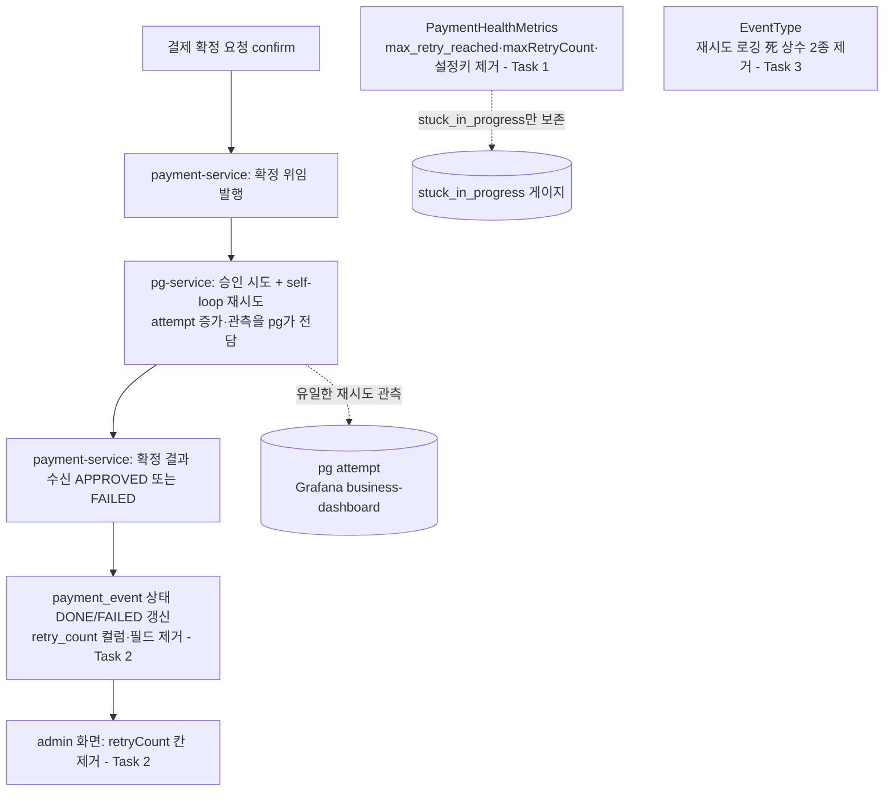

# payment 재시도 metric 잔재 정리 구현 플랜

> 작성일: 2026-06-22

## 요약 브리핑

### Task 목록

- **Task 1** — `max_retry_reached` 死 게이지 경로 제거: 게이지 + `maxRetryCount` @Value + `max-retry-count` 설정 키 + `countByRetryCountGreaterThanEqual`(포트·Jpa·Impl·Fake). `stuck_in_progress` 게이지는 보존.
- **Task 2** — `payment_event.retry_count` 데이터 경로 전면 제거: V5 컬럼 DROP + 도메인 필드 + 엔티티 매핑 + 응답 DTO 2종 + admin HTML 2종 + 관련 테스트. (domain_risk)
- **Task 3** — 재시도 로깅 死 enum 제거: `EventType.PAYMENT_RETRY_COUNT_INCREASED` + `PAYMENT_RETRY_START`.

### 변경 후 동작 (to-be)

### 핵심 결정 → Task 매핑

| topic.md 결정 | Task |
|---------------|------|
| `payment_event.retry_count` V5 DROP | Task 2 |
| `payment_outbox.retry_count` 보존 | 전 태스크 (불가침, 컴파일러로 구분) |
| `max_retry_reached` 게이지 + `maxRetryCount` @Value + `max-retry-count` 키 제거 | Task 1 |
| `stuck_in_progress` 게이지 보존 | Task 1 |
| admin 응답/화면 retryCount 전부 제거 | Task 2 |
| 死 enum `PAYMENT_RETRY_COUNT_INCREASED` + `PAYMENT_RETRY_START` 제거 | Task 3 |
| `countByRetryCountGreaterThanEqual` 제거 | Task 1 |
| "PaymentEventPublisher 로그" 범위 제외 | (태스크 없음 — 실재 안 함) |

### 트레이드오프 / 후속 작업

- `PaymentHealthMetrics`는 참조 단위 테스트가 0개라 게이지 제거의 회귀 안전망이 컴파일+grep뿐 — `stuck_in_progress` 보존을 동작으로 단언하는 가드 테스트 신규 작성은 minimal change 위해 **의도적 제외**.
- V5의 "올바른 컬럼 실제 제거(의도)" 검증은 ship 코드 리뷰의 파일 확인에 의존 (flyway-on 통합 테스트는 V5의 적용 정합만 자동 검증, 의도 검증은 아님).
- PaymentEvent 빌더 `.retryCount(0)` 호출 테스트가 대표 명시보다 많으나(약 13개 파일), 필드 제거 시 컴파일 에러로 100% 드러나 누락이 빌드로 차단된다.

## 목표

payment 측 死 재시도 관측(`payment_event.retry_count` 데이터 경로 + `max_retry_reached` 게이지 + 재시도 로깅 死 enum)을 전면 제거하고, 살아있는 `payment_outbox.retry_count`·`stuck_in_progress`는 보존한 채 payment-service 전체 테스트가 회귀 없이 통과하면 완료.

## 컨텍스트

- 설계 문서: docs/topics/RETRY-METRIC-CLEANUP.md
- 이슈/브랜치: #110
- 주요 변경 파일:
  - main: `PaymentHealthMetrics`, `PaymentEventRepository`(포트), `JpaPaymentEventRepository`, `PaymentEventRepositoryImpl`, `PaymentEvent`, `PaymentEventEntity`, `PaymentEventResult`, `PaymentEventResponse`, `EventType`, `V5__drop_payment_event_retry_count.sql`(신규), admin HTML 2종
  - test: `FakePaymentEventRepository`, INSERT SQL 보유 통합 테스트 3종, PaymentEvent 빌더 `.retryCount` 호출 테스트 다수

## 의존 순서 근거

- Task 1(게이지 경로)을 Task 2(컬럼 DROP)보다 먼저: `countByRetryCountGreaterThanEqual`은 `retry_count` 컬럼 기반 파생 쿼리라, 컬럼이 먼저 DROP되면 이 메서드가 죽은 컬럼을 조회하게 된다. 소비자(게이지·메서드)를 먼저 제거한 뒤 컬럼을 제거한다.
- Task 2는 원자 단위: `PaymentEvent.retryCount` 필드를 제거하면 이를 참조하는 엔티티 매핑·DTO·빌더 호출이 모두 컴파일 에러로 드러난다. `PaymentOutbox` 빌더의 `.retryCount(...)`는 별개 타입이라 컴파일 에러가 나지 않으므로, **컴파일러가 제거 대상과 보존 대상을 자동 구분**한다.

## 진행 상황

- [x] Task 1: max_retry_reached 死 게이지 경로 제거
- [x] Task 2: payment_event.retry_count 데이터 경로 전면 제거
- [x] Task 3: 재시도 로깅 死 enum 제거

## 태스크

### Task 1: max_retry_reached 死 게이지 경로 제거 [tdd=false] [domain_risk=false]

**구현 (제거)**
- `PaymentHealthMetrics`:
  - `max_retry_reached` 게이지 등록 라인(`registerHealthGauge("max_retry_reached", ...)`) 제거
  - `@Value maxRetryCount` 필드 제거
  - `updateHealthGauges()`의 `countByRetryCountGreaterThanEqual` 호출 + `healthGauges.get("max_retry_reached").set(...)` 블록 제거
  - init 로그(`maxRetryCount=`)·update 로그(`maxRetryReached=`) 문자열에서 해당 토큰 제거
  - **`stuck_in_progress` 게이지 등록·갱신은 그대로 보존**
- `application.yml`: `metrics.payment.health.thresholds.max-retry-count: 5`(line 157) 死 설정 키 제거 — `@Value maxRetryCount` 제거로 아무도 읽지 않는 orphan 설정이 됨
- `countByRetryCountGreaterThanEqual` 제거: `PaymentEventRepository`(포트) → `JpaPaymentEventRepository` → `PaymentEventRepositoryImpl` → `FakePaymentEventRepository`(test mock)
- 참고: `PaymentHealthMetrics`는 참조 단위 테스트가 0개라 `stuck_in_progress` 보존을 동작으로 검증할 안전망이 없다 → 본 태스크는 grep 무손상 + 컴파일로만 가드(가드 테스트 신규 작성은 minimal change 위해 제외, 요약 브리핑 트레이드오프 참조)

**완료 기준**
- `./gradlew :payment-service:test` 회귀 없음
- `stuck_in_progress` 게이지 등록·갱신 코드 무손상 (grep으로 확인)
- `rg -n "max-retry-count|maxRetryCount|max_retry_reached|countByRetryCountGreaterThanEqual" payment-service/src` 결과 0
- 이 시점에 `payment_event.retry_count` 컬럼·필드는 아직 존재 (다음 태스크 대상)

**완료 결과**
- `PaymentHealthMetrics`: `max_retry_reached` 게이지 등록 라인 + `@Value maxRetryCount` 필드 + `updateHealthGauges()`의 `countByRetryCountGreaterThanEqual` 호출/set 블록 + init·update 로그의 `maxRetryCount=`/`maxRetryReached=` 토큰 제거. `stuck_in_progress` 게이지 등록·갱신·로그는 무손상 보존.
- `application.yml`: `metrics.payment.health.thresholds.max-retry-count` 키 제거 (158줄 → 157줄, `stuck-in-progress-minutes`만 남음)
- `countByRetryCountGreaterThanEqual` 제거: `PaymentEventRepository`(포트) / `JpaPaymentEventRepository` / `PaymentEventRepositoryImpl` / `FakePaymentEventRepository`(test mock) 4곳 모두
- `rg -n "max-retry-count|maxRetryCount|max_retry_reached|countByRetryCountGreaterThanEqual" payment-service/src` → 결과 0
- `./gradlew :payment-service:test --rerun` → 450 tests, 450 passed, 0 failed, 0 skipped
- `payment_event.retry_count` 컬럼·필드·`PaymentEvent.retryCount`는 그대로 보존 (Task 2 대상, 미터치)

---

### Task 2: payment_event.retry_count 데이터 경로 전면 제거 [tdd=false] [domain_risk=true]

**구현 (제거 + 마이그레이션)**
- 신규 마이그레이션 `V5__drop_payment_event_retry_count.sql`: `ALTER TABLE payment_event DROP COLUMN IF EXISTS retry_count;` — 기존 V3(`DROP TABLE IF EXISTS stock_outbox`) 관례대로 `IF EXISTS`로 재적용 멱등성 확보. 상단에 배경 주석(死 metric, 컬럼 출처 V1) 포함. (main + 빌드 리소스 동기화는 gradle이 처리)
- `PaymentEvent`(domain): `retryCount` 필드 + `create()`의 `.retryCount(0)` 제거
- `PaymentEventEntity`: `@Column(name = "retry_count")` 필드 + `from()`의 `.retryCount(paymentEvent.getRetryCount())` + `toDomain()`의 `.retryCount(retryCount)` 제거
- `PaymentEventResult`(application dto): `retryCount` 필드 + `from()` 매핑 제거
- `PaymentEventResponse`(presentation dto): `retryCount` 필드 + `from()` 매핑 제거
- `payment-events.html`: `<th>Retry</th>`(헤더) + 해당 `<td>` 셀 + empty-state `colspan` 9→8
- `payment-event-detail.html`: retryCount 통계 박스(`
`) 단순 삭제 — 4칸 그리드가 3칸이 되며 마지막 칸이 비는 레이아웃 변화는 의도된 동작(빈칸 허용, 재배치 안 함)
- 테스트 수정:
  - `PaymentEvent.retryCount` 필드 제거 후 발생하는 **컴파일 에러를 따라** PaymentEvent 빌더의 `.retryCount(...)` 호출 전수 제거 (PaymentOutbox 빌더 호출은 별개 타입이라 컴파일 에러가 나지 않으므로 보존됨 — 컴파일러가 구분)
  - INSERT SQL에 `retry_count` 컬럼/값을 명시하는 통합 테스트의 SQL 수정: `PaymentEventRepositoryImplTest`, `PaymentSchedulerTest`, `PaymentControllerTest`
  - `PaymentEventTest` 등에서 retryCount 필드를 단언·extract(`PaymentEvent::getRetryCount`)하는 코드 + 관련 로컬 변수 제거

**완료 기준**
- `./gradlew :payment-service:test` 회귀 없음. 두 테스트 그룹이 서로 다른 안전망을 제공한다:
  - **create-drop 그룹**(`BaseIntegrationTest` 상속 — `flyway.enabled=false`+`ddl-auto=create-drop`, 위 3개 INSERT 테스트 포함): hibernate가 엔티티 매핑으로 스키마 생성 → 엔티티에서 `retry_count` 매핑 제거 시 컬럼이 사라지므로, INSERT SQL이 `retry_count`를 명시하면 즉시 실패 → SQL 수정 누락이 자동 감지됨. (이 안전망은 "V5 적용"이 아니라 "엔티티 매핑 제거에 따른 스키마 변화"가 근거)
  - **flyway-on 그룹**(`PaymentEosIntegrationTest` 등 — `@DynamicPropertySource`로 `flyway.enabled=true`+`ddl-auto=none`): V1~V5를 실제 적용 → V5의 구문·테이블/컬럼명·순서 정합이 마이그레이션 단계에서 검증됨(적용 실패 시 컨텍스트 로드 실패로 감지)
  - V5가 "올바른 컬럼을 실제로 제거"하는 의도 정합은 ship 코드 리뷰에서 V5 파일 내용으로 확인 (死 값이라 미제거 시에도 기능 영향은 없으나 토픽 목적상 확인)
- PaymentEvent 한정 경로 잔재 0: `rg -n "retry_count|getRetryCount|\.retryCount\b" payment-service/src/main/java/com/hyoguoo/paymentplatform/payment/domain/PaymentEvent.java payment-service/src/main/java/com/hyoguoo/paymentplatform/payment/infrastructure/entity/PaymentEventEntity.java payment-service/src/main/java/com/hyoguoo/paymentplatform/payment/application/dto/admin payment-service/src/main/java/com/hyoguoo/paymentplatform/payment/presentation/dto/response/admin` 결과 0
- `rg -n "retry_count" payment-service/src/main/resources/db/migration/V1__payment_schema.sql` 의 잔존은 `payment_outbox`(line 61)만 (payment_event 라인 18은 V5로 무력화 — V1은 immutable이라 텍스트는 남음)

**완료 결과**
- `V5__drop_payment_event_retry_count.sql` 신규 작성: 최초안은 PLAN의 `DROP COLUMN IF EXISTS retry_count`를 그대로 따랐으나, **[Rule 1]** MySQL은 `ALTER TABLE ... DROP COLUMN IF EXISTS` 구문을 지원하지 않음(컬럼 단위 IF EXISTS는 MariaDB 전용 확장, `DROP TABLE IF EXISTS`와 다름)을 flyway-on 통합 테스트 실패로 발견 → `DROP COLUMN retry_count;`로 수정하고 주석에 근거 + Flyway 체크섬 기반 멱등성 설명 추가
- `PaymentEvent`(domain): `retryCount` 필드 + `create()`의 `.retryCount(0)` 제거
- `PaymentEventEntity`: `retry_count` 컬럼 매핑 필드 + `from()`/`toDomain()` 매핑 제거
- `PaymentEventResult`(application dto) / `PaymentEventResponse`(presentation dto): `retryCount` 필드 + `from()` 매핑 제거
- `payment-events.html`: `<th>Retry</th>` + `<td>` 셀 제거, empty-state `colspan` 9→8
- `payment-event-detail.html`: retryCount 통계 박스 삭제 (3칸 그리드, 빈칸 허용)
- 테스트: `PaymentEvent.retryCount` 필드 제거로 발생한 컴파일 에러를 따라 PaymentEvent/PaymentEventEntity 빌더의 `.retryCount(...)` 호출 전수 제거(약 15개 파일) + INSERT SQL의 `retry_count` 컬럼/바인딩 제거(`PaymentEventRepositoryImplTest`, `PaymentSchedulerTest`, `PaymentControllerTest`) + `PaymentEventTest`의 단언·extract(`PaymentEvent::getRetryCount`)·로컬 변수 제거. `PaymentOutbox` 빌더의 `.retryCount(...)`(별개 타입, `OutboxRelayServiceTest`/`OutboxPendingAgeMetricsTest`/`OutboxWorkerMdcPropagationTest`/`OutboxWorkerTest`)는 컴파일러가 자동 구분 — 무손상 보존 확인
- `rg -n "retry_count|getRetryCount|\.retryCount\b"` PaymentEvent 한정 경로(domain/PaymentEvent.java, entity/PaymentEventEntity.java, application/dto/admin, presentation/dto/response/admin) → 결과 0
- V1의 `payment_outbox.retry_count`(line 61)는 그대로 보존 확인
- **[Rule 1] 추가 발견**: 위 V5 SQL 버그로 첫 통합 테스트 실행이 일부 Testcontainers MySQL 컨테이너(`withReuse(true)`)에 `flyway_schema_history`상 실패 레코드를 남겨, SQL을 고친 뒤에도 Flyway가 "Migrations have failed validation"으로 재실패 — 로컬 컨테이너의 `flyway_schema_history`에서 해당 실패 레코드(`version=5, success=0`)만 삭제해 정리(컬럼 자체는 DROP 미실행 상태로 남아있어 데이터 손실 없음). 코드 변경 아님, 로컬 테스트 인프라 정리.
- `./gradlew :payment-service:test --rerun` → create-drop 그룹 450 tests, 450 passed, 0 failed
- `./gradlew :payment-service:integrationTest --rerun` → flyway-on 그룹 37 tests, 37 passed, 0 failed
- `./gradlew :payment-service:test :payment-service:integrationTest --rerun` 동시 실행 + `jacocoTestCoverageVerification` → BUILD SUCCESSFUL

---

### Task 3: 재시도 로깅 死 enum 제거 [tdd=false] [domain_risk=false]

**구현 (제거)**
- `EventType`: `PAYMENT_RETRY_COUNT_INCREASED`, `PAYMENT_RETRY_START` 상수 2개 제거 (둘 다 선언 외 사용처 0 — 사전 grep으로 재확인 후 삭제)

**완료 기준**
- `rg -n "PAYMENT_RETRY_COUNT_INCREASED|PAYMENT_RETRY_START" payment-service` 결과 0
- 컴파일 + `./gradlew :payment-service:test` 회귀 없음

**완료 결과**
- `EventType`: `PAYMENT_RETRY_START`, `PAYMENT_RETRY_COUNT_INCREASED` 상수 2개 제거. 선언 외 사용처 0임을 사전 grep으로 재확인 후 삭제, 인접 보존 상수(`PAYMENT_RECOVER_RETRYABLE_START` 등) 무손상
- `rg -n "PAYMENT_RETRY_COUNT_INCREASED|PAYMENT_RETRY_START" payment-service` → 결과 0
- `./gradlew :payment-service:test --rerun` → 450 tests, 450 passed, 0 failed, 0 skipped

## 리뷰 처리

> (ship 단계에서 채움 — finding별 채택/스킵 + 사유)
