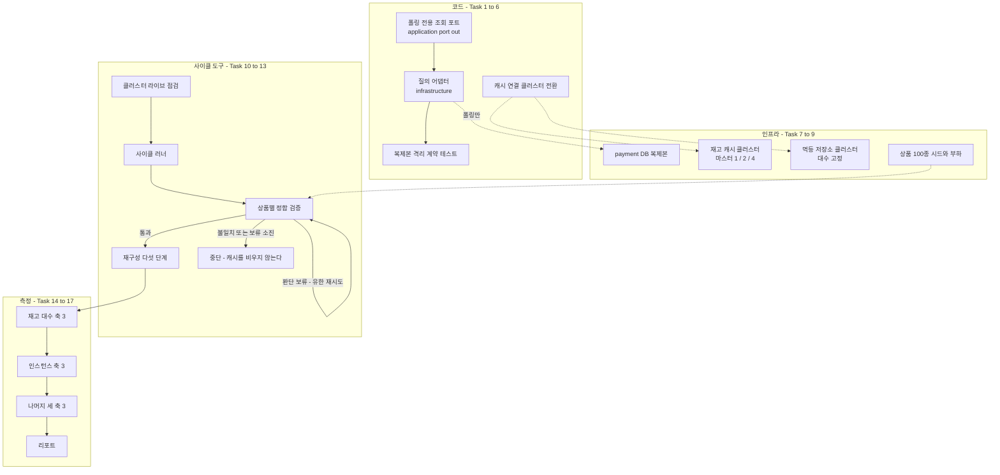

# 공유 자원 동반 스케일아웃 측정 구현 플랜

> 작성일: 2026-08-25

## 요약 브리핑

### Task 목록

| # | 태스크 | 한 줄 |
|:---:|:---|:---|
| 1 | 폴링 상태 조회 포트와 Fake | 폴링이 쓸 조회 두 개를 전용 포트로 선언하고 테스트용 대역을 만든다 |
| 2 | 폴링이 전용 포트를 쓰도록 교체 | 상태 조회 서비스가 판정 경로와 같은 조회를 더 이상 쓰지 않게 한다 |
| 3 | 복제본 데이터소스 설정 | 복제본 연결을 설정값 하나로 켜고 끈다. 끄면 지금과 똑같이 동작한다 |
| 4 | 폴링 조회 어댑터 | 복제본을 질의로만 읽는다. 영속성 컨텍스트를 태우지 않는다 |
| 5 | 복제본 격리 계약 테스트 | 복제본을 주입받는 빈이 폴링 어댑터 하나뿐임을 못박는다 |
| 6 | 캐시 연결의 클러스터 전환 | 재고 캐시와 멱등 저장소를 노드 목록만으로 클러스터에 붙인다 |
| 7 | payment DB 복제본 인프라 | 비동기 복제본 1대를 띄우고 복제를 시작한다 |
| 8 | 캐시 클러스터 인프라 | 마스터 1 / 2 / 4 를 만들고 슬롯 커버리지 요구를 끈다 |
| 9 | 부하 프로필 상품 다중화 | 상품 100종을 심고 부하가 고르게 고르게 한다 |
| 10 | 사이클 재구성 절차 스크립트 | 다섯 단계를 밟아야만 캐시를 비운다 |
| 11 | 정합 검증 상품별 확장 | 상품마다 대조하고, 판정을 기계가 읽게 낸다 |
| 12 | 클러스터 라이브 점검 | 스크립트 다섯 경로와 키 슬롯 배치를 실측한다 |
| 13 | 사이클 러너와 복제 지연 계측 | 사이클 하나를 인자만 주고 끝까지 돌린다 |
| 14 | 재고 캐시 대수 축 측정 | 마스터 1 / 2 / 4, 나머지 고정 |
| 15 | 인스턴스 수 축 측정 | 1 / 2 / 3 / 4, 합격선은 이 축의 1 에서 2 구간뿐 |
| 16 | 나머지 세 축 측정 | 읽기 복제 껐다 켬, 주문당 상품 3개, 고지연 벤더 |
| 17 | 측정 리포트 | 처리량 체감지연 정합성 세 축으로 결론을 낸다 |

### 변경 후 전체 플로우차트

### 핵심 결정과 Task 매핑

| 설계 결정 | Task |
|:---|:---|
| 복제본 읽기 대상을 폴링 전용 포트로 한정 | 1, 2, 4, 5 |
| 복제본은 질의로만 읽는다 | 4 |
| 재고 캐시는 클러스터, 마스터 1 / 2 / 4 | 6, 8, 14 |
| 슬롯 커버리지 요구를 끈다 | 8 |
| 멱등 저장소는 클러스터 전환, 대수 고정 | 6, 8 |
| 사이클 사이 재구성 다섯 단계 | 10 |
| 부하 프로필 상품 100종 | 9, 16 |
| 인스턴스 1 / 2 / 3 / 4, 합격선 1 에서 2 구간 1.6배 | 15, 17 |
| 지연은 백분위 셋 + 복제 지연 병행 | 13, 17 |
| 캐시 내구성은 그대로 재되 효과가 없으면 확인 사이클 | 14 |
| 관측 스택 유지, 첫 사이클 전 기동과 트레이스 점검 | 13, 14 |
| 벤더 지연은 나머지를 고정한 별도 축 | 16 |
| 복제는 비동기 1대 | 7 |
| 포트는 application, 어댑터와 데이터소스 설정은 infrastructure | 1, 3, 4 |
| 메시지 브로커는 단일 유지, 천장으로 관측되면 기록만 | 17 |
| 결론은 처리량 체감지연 정합성 세 축 | 17 |

### 트레이드오프와 후속

- **코드 여섯 개 중 다섯이 폴링 경로 하나를 위한 것이다.** 돈 경로 판정 일곱과 같은 조회를 쓰던 것을 떼어내는 값이다. 떼어내지 않으면 복제 지연 중 격리 종결이 낡은 상태를 읽는다.
- **측정 태스크 넷은 벽시계 시간이 길다.** 사이클 아홉 개에 기동과 재구성이 붙는다. 코드 태스크의 두 시간 감각과 다르지만 직전 측정 토픽도 같은 결로 나눴다.
- **정합 판정을 종료 코드로 낸다.** 지금 검증 스크립트는 불일치가 나도 0 으로 끝나 사람이 눈으로 읽는 전제다. 무인 사이클에 그대로 쓰면 재구성이 그냥 진행돼 증거가 지워진다.
- **장애 전환 검증은 별도 토픽** — ship 에서 미해결 항목 대장에 등재한다.
- **선행 조건 하나가 남아 있다** — Docker 메모리 20GB. Task 14 가 측정 전에 확인한다.

---

## 목표

payment DB 읽기 복제본과 재고 캐시·멱등 저장소 클러스터를 붙인 뒤, 축별로 변수를 하나만 남긴 사이클 아홉 개를 돌려 처리량·체감 지연·정합성 세 축의 수치를 리포트로 남긴다.

## 컨텍스트

- 설계 문서: `docs/topics/SHARED-RESOURCE-SCALEOUT.md` (결정 사항 표가 분해의 원천)
- 이슈 / 브랜치: #146
- 주요 변경 파일
  - `payment-service/.../application/port/out/` — 폴링 전용 조회 포트 신설
  - `payment-service/.../application/PaymentStatusServiceImpl.java` — 폴링이 전용 포트를 쓰도록 교체
  - `payment-service/.../infrastructure/config/{RedisConfig,StockRedisConfig}.java` — 클러스터 연결
  - `payment-service/.../infrastructure/repository/` — 복제본 질의 어댑터
  - `docker/docker-compose.scaleout.yml`(신규) — 복제본 + 캐시 클러스터
  - `scripts/bench-seed-stock.sh`, `scripts/k6/{helpers.js,verify-settlement.sh}`, 신규 사이클 스크립트

### 선행 조건 (측정 시작 전)

- **Docker 메모리 20GB 상향** — 현재 8.2GB. 인스턴스 4대 구간에 복제본과 캐시 노드를 얹으면 컨테이너가 29개가 되고, 호스트가 스왑을 타면 측정이 오염된다. Task 14 가 시작 전에 확인한다.
- CPU 10 코어는 고정. 인스턴스 4대 구간에서 앱 CPU 가 먼저 천장이 될 수 있고, 그 경우 그 사실 자체가 결론이 된다.

## 진행 상황

- [x] Task 1: 폴링 상태 조회 포트와 Fake
- [x] Task 2: 폴링이 전용 포트를 쓰도록 교체
- [x] Task 3: 복제본 데이터소스 설정
- [x] Task 4: 폴링 조회 어댑터 (질의 전용)
- [x] Task 5: 복제본을 주입받는 빈이 폴링 어댑터 하나임을 고정
- [x] Task 6: 재고 캐시·멱등 저장소 연결의 클러스터 모드 전환
- [x] Task 7: payment DB 복제본 인프라
- [x] Task 8: 재고 캐시·멱등 저장소 클러스터 인프라
- [x] Task 9: 부하 프로필 상품 다중화
- [x] Task 10: 사이클 재구성 절차 스크립트
- [x] Task 11: 정합 검증 상품별 확장
- [x] Task 12: 클러스터 라이브 점검 스크립트
- [x] Task 13: 사이클 러너와 복제 지연 계측
- [x] Task 14: 재고 캐시 대수 축 측정 (마스터 1 / 2 / 4)
- [x] Task 15: 인스턴스 수 축 측정 (1 / 2 / 3 / 4)
- [x] Task 16: 읽기 복제·다중 상품·벤더 지연 축 측정
- [x] Task 17: 측정 리포트
- [x] Task 18: 부하 도구를 실제 한계까지 밀 수 있게 고친다
- [x] Task 19: 자원 계측 보강
- [x] Task 20: 단일 구성을 한계까지 밀고 병목을 지목한다
- [x] Task 21: 지목된 자원만 늘려 재측정 (반복)
- [ ] Task 22: 리포트 갱신

## 태스크

### Task 1: 폴링 상태 조회 포트와 Fake [tdd=false] [domain_risk=false]

설계 근거: "복제본 읽기 대상 — 폴링 전용 조회 포트를 신설하고 그 어댑터만 복제본에 묶는다", "신규 코드 배치 — 포트는 `payment/application/port/out`".

**구현 (GREEN)**
- `payment/application/port/out/PaymentStatusQueryPort.java`
  - `Optional<PaymentOutboxStatus> findActiveOutboxStatus(String orderId)` — 발행 대기(PENDING) 또는 발행 중(IN_FLIGHT)일 때만 값을 돌려준다
  - `Optional<PaymentStatusSnapshot> findStatusSnapshot(String orderId)`
- `payment/application/port/out/PaymentStatusSnapshot.java` — record(orderId, `PaymentEventStatus` status, `Instant` approvedAt). 같은 패키지의 `StockHoldRecordSnapshot` 과 같은 자리·같은 결
- `payment-service/src/test/.../payment/mock/FakePaymentStatusQueryPort.java` — ConcurrentHashMap 기반. 주문번호별로 발행 상태와 스냅샷을 심어 두고 그대로 돌려준다

**완료 기준**
- 두 파일과 Fake 가 존재하고 `./gradlew :payment-service:compileTestJava` 통과
- 포트가 도메인 타입(`PaymentOutboxStatus` / `PaymentEventStatus`)만 노출하고 JPA·JDBC 타입을 드러내지 않는다

**완료 결과**
- `PaymentStatusQueryPort` / `PaymentStatusSnapshot` / `FakePaymentStatusQueryPort` 3 파일 신설. `compileTestJava` 통과
- 아직 어떤 코드도 이 포트를 참조하지 않는다 — 교체는 Task 2

---

### Task 2: 폴링이 전용 포트를 쓰도록 교체 [tdd=true] [domain_risk=true]

설계 근거: "복제본 읽기 대상" 결정. 결제 이벤트 조회를 돈 경로 판정 일곱이 공유하므로, 폴링만 떼어내야 판정이 원본에 남는다.

**테스트 (RED)**
- `PaymentStatusServiceImplTest` (기존 파일 갱신) — 협력자를 `FakePaymentStatusQueryPort` 로 바꾼다
  - `getPaymentStatus_발행대기면_PENDING`
  - `getPaymentStatus_발행중이면_PROCESSING`
  - `getPaymentStatus_발행기록없고_이벤트가_DONE이면_DONE과_승인시각`
  - `getPaymentStatus_발행기록없고_이벤트가_FAILED면_FAILED`
  - `getPaymentStatus_발행기록없고_이벤트가_진행중이면_PROCESSING` (`@ParameterizedTest @EnumSource` 로 DONE/FAILED 를 뺀 나머지)
  - `getPaymentStatus_이벤트가_없으면_PAYMENT_EVENT_NOT_FOUND` — 교체 전과 같은 예외를 던진다
  - `getPaymentStatus_발행기록이_있으면_스냅샷을_읽지_않는다` — 발행 대기 상태일 때 스냅샷 조회 호출 수가 0

**구현 (GREEN)**
- `PaymentStatusServiceImpl` 이 `PaymentStatusQueryPort` 하나만 의존한다. `PaymentLoadUseCase` / `PaymentOutboxUseCase` 의존을 뺀다
- 스냅샷이 비면 `PaymentFoundException.of(PaymentErrorCode.PAYMENT_EVENT_NOT_FOUND)` — 기존 `PaymentLoadUseCase.getPaymentEventByOrderId` 와 같은 예외

**완료 기준**
- 위 테스트 전부 pass
- `PaymentStatusServiceImpl` 이 두 유스케이스를 참조하지 않는다
- `./gradlew :payment-service:test` 회귀 없음

**메모**
- 교체 후 `PaymentOutboxUseCase.findActiveOutboxStatus` 의 호출처가 없어진다. 제거 여부는 임의로 판단하지 않고 ship 리뷰에서 사용자 확인 후 정한다

**완료 결과**
- `PaymentStatusServiceImpl` 이 `PaymentStatusQueryPort` 하나만 의존하도록 교체. `PaymentLoadUseCase` / `PaymentOutboxUseCase` 의존 제거
- 스냅샷이 비면 기존과 같은 `PaymentFoundException.of(PAYMENT_EVENT_NOT_FOUND)` 를 던진다
- `PaymentStatusServiceImplTest` 를 `FakePaymentStatusQueryPort` 기반으로 재작성 (7케이스, PROCESSING 분기는 `@ParameterizedTest @EnumSource` 로 DONE/FAILED 제외 전체 커버). 스냅샷 미조회 검증은 Fake 를 `Mockito.spy` 로 감싸 확인
- `./gradlew :payment-service:test` 682건 전체 통과 — `PaymentOutboxUseCase.findActiveOutboxStatus` 호출처는 아직 남아 있어(Task 5 이후 정리 대상) 회귀 없음
- `PaymentStatusServiceImpl` 을 sliced 컨텍스트가 아닌 방식으로 부팅하는 테스트는 없어 프로덕션 `PaymentStatusQueryPort` 빈이 아직 없어도 unit test 범위에서 영향 없음 (구현체는 Task 4)

---

### Task 3: 복제본 데이터소스 설정 [tdd=false] [domain_risk=false]

설계 근거: "복제본 읽기 기술 — 복제본 데이터소스에 얹은 질의 템플릿", "신규 코드 배치 — 데이터소스 설정은 `payment/infrastructure`".

**구현 (GREEN)**
- `payment/infrastructure/config/ReplicaDataSourceConfig.java`
  - `payment.datasource.replica.enabled` 가 참이면 별도 `DataSource` 를 만들어 `paymentReplicaDataSource` 로 등록
  - 거짓이면 기본 데이터소스를 그대로 `paymentReplicaDataSource` 이름으로 노출한다. 읽기 복제 축의 "라우팅 끔" 사이클과 기존 통합 테스트가 설정 하나로 성립한다
  - `@Primary` 를 붙이지 않는다 — 기본 데이터소스 결정은 자동 설정에 그대로 맡긴다
- `application.yml` 에 기본값(`enabled: false`), `application-docker.yml` / 신규 override 에 복제본 접속 정보

**완료 기준**
- `payment.datasource.replica.enabled=false` 로 `./gradlew :payment-service:test :payment-service:integrationTest` 회귀 없음
- 참으로 켠 상태에서 앱이 뜨고 `paymentReplicaDataSource` 가 복제본을 가리킨다 (Task 7 기동 후 확인)
- 복제본 접속 문자열이 원본과 같은 타임존 파라미터(`connectionTimeZone=UTC` + `forceConnectionTimeZoneToSession=true`)를 갖는다 — 원본은 `application-docker.yml` 에서 이걸로 UTC 왕복을 강제하는데, 복제본만 빠지면 폴링이 읽는 승인시각이 세션 타임존만큼 어긋난다

**완료 결과**
- `payment/infrastructure/config/ReplicaDataSourceConfig.java` 신설 — `dataSource`(기본) / `paymentReplicaDataSource`(복제본) 두 빈을 함께 정의
- `application.yml` 에 `payment.datasource.replica.enabled` 기본값(false), `application-docker.yml` 에 복제본 접속 정보(`mysql-payment-replica` 호스트, D7 과 같은 `connectionTimeZone=UTC&forceConnectionTimeZoneToSession=true`) 추가
- **[Rule 1] 설계 문구("자동 설정에 그대로 맡긴다")와 실제로 구현 가능한 형태가 달라 그 자리에서 조정** — Spring Boot `DataSourceAutoConfiguration` 은 컨텍스트에 `DataSource` 타입 빈이 하나라도 있으면(`@ConditionalOnMissingBean(DataSource.class)`) 자체 기본 빈 생성을 통째로 건너뛴다. `paymentReplicaDataSource` 빈만 추가해도 이 조건에 걸려 자동 설정이 만드는 기본 데이터소스 자체가 사라지는 것을 통합 테스트로 확인했다(코드리뷰 리서치 대상 아님, 부팅 실패로 즉시 드러남). 대응: 이 설정 클래스가 기본 데이터소스도 같은 `spring.datasource.*` 프로퍼티로 직접 등록해 접속 정보·Hikari 풀 설정 등 외부 동작을 그대로 유지한다. 추가로 JPA 자동 설정(`JpaBaseConfiguration`)은 `@ConditionalOnSingleCandidate(DataSource.class)` 로 단일 후보 또는 `@Primary` 지목 빈을 요구해, 복제본 빈이 상시 두 번째 후보로 존재하는 이상 표시가 없으면 JPA 자동 설정 자체가 꺼진다 — 그래서 기본 데이터소스에만 `@Primary` 를 붙였다(복제본 빈에는 미부착, 원 설계 의도인 "이름·Qualifier 없는 자리는 기본을 받는다"는 그대로 보존)
- `payment.datasource.replica.enabled=false` 로 `./gradlew :payment-service:test` 682건 전체 통과
- `./gradlew :payment-service:integrationTest` 는 이번 변경 적용 전/후 모두 660건 중 651건 실패로 **동일** — 원인은 Task 2 가 `PaymentStatusServiceImpl` 을 `PaymentStatusQueryPort` 전용으로 바꾼 뒤 프로덕션 구현체가 아직 없어서(어댑터는 Task 4) 전체 컨텍스트 부팅 테스트가 전부 깨지는 기존 회귀다 — HEAD(Task 3 착수 전)에서 stash 후 재현해 사전 확인. 이번 태스크가 새로 만든 실패는 0건
- "참으로 켠 상태에서 앱이 뜨고 paymentReplicaDataSource 가 복제본을 가리킨다" 확인은 복제본 컨테이너가 없어 이번 태스크에서는 검증 불가 — Task 7(복제본 인프라 기동) 이후로 이월
- **이월 항목 해소** — Task 7 에서 복제본을 띄운 뒤 실제로 확인 완료. 상세는 Task 7 완료 결과 참고

---

### Task 4: 폴링 조회 어댑터 (질의 전용) [tdd=true] [domain_risk=true]

설계 근거: "복제본 읽기 기술 — 영속성 컨텍스트를 태우지 않는다". 폴링이 쓰는 값이 셋뿐이라 매핑이 필요 없고, 기존 데이터소스 구성을 건드리지 않는다.

**테스트 (RED)**
- `payment/infrastructure/repository/PaymentStatusQueryJdbcAdapterTest` — `@Tag("integration")`, Testcontainers MySQL(`withReuse(true)`, static 블록 수동 start), `JdbcTemplate` 으로 행을 직접 심는다
  - Spring 컨텍스트를 띄우지 않는다. 어댑터가 `JdbcTemplate` 하나만 받으므로 컨테이너 접속 정보로 직접 만들어 생성자에 넘긴다 — `@DataJpaTest` 는 JPA 를 안 쓰는 이 어댑터에 맞지 않고, 전체 부팅은 이 검증에 필요 없다
  - 컨테이너 접속 문자열에도 Task 3 과 같은 타임존 파라미터를 붙인다
  - `findActiveOutboxStatus_발행대기_행이면_PENDING`
  - `findActiveOutboxStatus_발행중_행이면_IN_FLIGHT`
  - `findActiveOutboxStatus_종결된_발행기록이면_빈값` (`@ParameterizedTest @EnumSource` 로 PENDING/IN_FLIGHT 를 뺀 나머지)
  - `findActiveOutboxStatus_행이_없으면_빈값`
  - `findStatusSnapshot_주문번호로_상태와_승인시각을_읽는다` — 승인시각이 UTC 기준으로 왕복하는지까지 확인
  - `findStatusSnapshot_행이_없으면_빈값`

**구현 (GREEN)**
- `payment/infrastructure/repository/PaymentStatusQueryJdbcAdapter.java` — `PaymentStatusQueryPort` 구현
  - `paymentReplicaDataSource` 로 만든 `JdbcTemplate` 만 쓴다. `@Transactional` 을 붙이지 않는다
  - `SELECT status FROM payment_outbox WHERE order_id = ?` / `SELECT order_id, status, approved_at FROM payment_event WHERE order_id = ?`
  - 발행 상태 필터(발행 대기 또는 발행 중)는 어댑터에서 도메인 열거형으로 변환한 뒤 판정한다 — SQL 에 상태 문자열을 흩뿌리지 않는다

**완료 기준**
- 위 테스트 전부 pass
- 어댑터가 `EntityManager` / JPA 리포지토리를 참조하지 않는다
- `./gradlew :payment-service:integrationTest --rerun-tasks` 회귀 없음

**완료 결과**
- `payment/infrastructure/repository/PaymentStatusQueryJdbcAdapter.java` 신설 — `payment_outbox`/`payment_event` 를 각각 단건 SELECT 로 읽고, 발행 상태 필터(발행 대기 또는 발행 중)는 SQL 이 아니라 `PaymentOutboxStatus.isClaimable()/isInFlight()` 로 자바 코드에서 판정. `EntityManager`·JPA 리포지토리 미참조, `@Transactional` 미부착
- `payment/infrastructure/config/ReplicaDataSourceConfig.java` 에 `paymentReplicaJdbcTemplate` 빈 추가 — `paymentReplicaDataSource` 를 감싼 `JdbcTemplate` 을 명시 이름으로 등록해 폴링 어댑터만 이 빈을 주입받도록 사슬을 관측 가능하게 만든다 (Task 5 격리 계약 테스트의 전제)
- `PaymentStatusQueryJdbcAdapterTest` (RED 커밋 `629326ad`) — Spring 컨텍스트 없이 Testcontainers MySQL 을 Flyway 로 마이그레이션한 뒤 수동 `JdbcTemplate` 로 어댑터를 직접 생성해 6케이스(발행대기/발행중/종결 2종 파라미터라이즈/미존재 2종/스냅샷 UTC 왕복) 검증, 통합 테스트 태그로 7건 전부 통과
- `./gradlew :payment-service:test` 682건 전체 통과, `./gradlew :payment-service:integrationTest --rerun-tasks` **667건 전체 통과(0 실패)** — Task 2 이후 660건 중 651건이 실패하던 회귀가 이 태스크의 프로덕션 `PaymentStatusQueryPort` 구현체 등록으로 완전히 해소됐다. 이번 태스크가 추가한 신규 테스트 7건을 빼면 기존 660건도 그대로 전부 통과

---

### Task 5: 복제본을 주입받는 빈이 폴링 어댑터 하나임을 고정 [tdd=true] [domain_risk=true]

설계 근거: 검증 전략 — "복제본으로 가는 조회가 폴링 경로 하나뿐임을 구조 계약으로 고정한다". 돈 경로 판정 일곱이 복제본을 읽지 않는 것이 이 설계의 안전 근거라, 테스트로 못박지 않으면 나중에 조용히 무너진다.

**테스트 (RED)**
- `payment/infrastructure/config/ReplicaDataSourceIsolationTest` — `@SpringBootTest`, `@Tag("integration")`
  - `복제본_데이터소스를_주입받는_빈은_폴링_어댑터_하나뿐이다` — `ConfigurableListableBeanFactory.getDependentBeans("paymentReplicaDataSource")` 결과가 폴링 어댑터(와 그것이 쓰는 질의 템플릿 빈)로만 이뤄진다
  - `폴링_어댑터가_아닌_저장소는_기본_데이터소스를_쓴다` — 결제 이벤트 저장소 어댑터의 의존 사슬에 복제본 데이터소스가 없다

**구현 (GREEN)**
- 테스트만으로 성립하면 프로덕션 코드 변경 없음. 빈 이름이 사슬에 안 드러나면 Task 3 에서 복제본 전용 `JdbcTemplate` 빈을 명시 이름으로 등록해 사슬을 관측 가능하게 만든다

**완료 기준**
- 위 테스트 pass
- 다른 빈에 복제본 데이터소스를 주입해 보면 테스트가 깨지고, 되돌리면 다시 통과한다 (한 번 확인 후 원복)

**완료 결과**
- **실제 결함을 테스트로 잡았다** — `paymentReplicaJdbcTemplate` 빈(Task 4)이 생기면서 Spring Boot `JdbcTemplateAutoConfiguration` 이 `@ConditionalOnMissingBean(JdbcOperations.class)` 에 걸려 기본 `JdbcTemplate` 자동 등록을 건너뛰고, 뒤이어 `NamedParameterJdbcTemplate` 자동 설정(`@ConditionalOnSingleCandidate(JdbcTemplate.class)`)이 유일하게 남은 복제본 템플릿을 단일 후보로 골라버렸다. `JdbcPaymentEventDedupeStore`(확정 경로 멱등 판정)가 `NamedParameterJdbcTemplate` 을 `@Qualifier` 없이 타입으로만 주입받아, 돈 경로 멱등 판정이 조용히 복제본을 읽고 쓰게 되는 경로였다. 복제본을 끈 상태(`enabled=false`)에서는 복제본 데이터소스가 기본과 같은 객체라 이 결함이 드러나지 않아 지금까지 통합 테스트가 전부 통과했었다
- `ReplicaDataSourceConfig` 에 기본 데이터소스용 `jdbcTemplate` 빈을 `@Primary` 로 명시 등록해 단일 후보 판정이 항상 기본 쪽으로 수렴하게 고쳤다. `paymentReplicaJdbcTemplate` Javadoc 도 "Spring Boot 가 자동 등록하는 기본 JdbcTemplate" 전제를 걷어내고 새 `jdbcTemplate` 빈을 가리키도록 정정
- `ReplicaDataSourceIsolationTest` — `payment.datasource.replica.enabled=true` 로 복제본을 기본과 별개 빈으로 띄운 구성에서 3케이스 검증
  - `paymentReplicaDataSource` → `paymentReplicaJdbcTemplate` → `paymentStatusQueryJdbcAdapter` 딱 두 단계 의존 사슬만 검사 (전체 전이 폐쇄를 쓰면 폴링 호출 경로의 서비스·컨트롤러까지 끌려 들어와 계약이 성립하지 않는다는 것을 실제로 겪고 depth 2 로 제한)
  - 결제 이벤트 저장소 어댑터가 복제본 의존 사슬에 없다
  - `namedParameterJdbcTemplate`/`jdbcPaymentEventDedupeStore` 가 복제본이 아닌 기본 데이터소스 의존 사슬에 있다 — 이번에 실제로 샜던 경로라 명시 포함
- **원복 확인** — `jdbcTemplate` 빈의 `@Primary` 를 임시로 제거해 돌려보니 3케이스 전부 실패(컨텍스트 로딩 단계에서 단일 후보 판정이 갈려 애플리케이션 부팅 자체가 흔들림), 되돌리자 다시 3케이스 전부 통과. 커밋에는 원복된 상태만 남음
- `./gradlew :payment-service:test` 682건, `:payment-service:integrationTest --rerun-tasks` 670건(기존 667 + 신규 3) 전체 통과 — 회귀 없음

---

### Task 6: 재고 캐시·멱등 저장소 연결의 클러스터 모드 전환 [tdd=false] [domain_risk=false]

설계 근거: "재고 캐시 분산 — 클러스터", "멱등 저장소 — 클러스터로 전환하되 대수는 고정".

**구현 (GREEN)**
- `StockRedisConfig` — `payment.cache.stock-redis.cluster-nodes` 가 비어 있지 않으면 `RedisClusterConfiguration`, 비어 있으면 지금의 단독 노드 설정. 토폴로지 자동 갱신을 켜 대수 변경 뒤 첫 명령이 리다이렉트로 새 배치를 따라가게 한다
- `RedisConfig` — `spring.data.redis.cluster.nodes` 에 대해 같은 분기. `@Primary` 표시와 기존 빈 이름은 그대로 둔다
- 두 설정 모두 명령·연결 제한값은 지금 값을 유지한다

**완료 기준**
- 노드 목록 미설정 시 기존과 동일하게 뜬다 — `./gradlew :payment-service:test :payment-service:integrationTest` 회귀 없음
- 노드 목록을 넣으면 클러스터 연결로 뜬다 (Task 8 기동 후 Task 12 가 실측으로 확인)

**완료 결과**
- `RedisConfig`(redis-dedupe, `spring.data.redis.cluster.nodes`)와 `StockRedisConfig`(redis-stock, `payment.cache.stock-redis.cluster-nodes`) 양쪽에 같은 분기 구조를 넣었다 — 프로퍼티가 비어 있으면 지금과 같은 `RedisStandaloneConfiguration` + 표준 `ClientOptions`, 채워지면 `RedisClusterConfiguration`(콤마 구분 `host:port` 목록 파싱) + `ClusterClientOptions`로 전환한다. 클러스터 쪽은 `ClusterTopologyRefreshOptions`(어댑티브 트리거 전체 + 30초 주기 갱신)를 얹어 대수 변경 뒤 첫 명령이 리다이렉트로 새 배치를 따라가게 했다
- 두 설정 모두 명령 타임아웃(3초)·연결 타임아웃(5초)은 기존 값 그대로 유지. `@Primary`는 `RedisConfig` 쪽 커넥션 팩토리에만 그대로 남아 있고 `StockRedisConfig` 는 미부착 — 직전 태스크(Task 5)에서 잡힌 "단일 후보 판정이 조용히 뒤바뀌는" 함정을 이번에도 점검했다: 두 빈 모두 이름이 명시돼 있고(`stockCacheRedisConnectionFactory` 등) `@ConditionalOnMissingBean`류 자동 설정 간섭 지점이 없어 노드 목록 유무와 무관하게 `@Primary` 쏠림이 재발하지 않는 구조
- `application.yml` 에 `spring.data.redis.cluster.nodes`(env `SPRING_DATA_REDIS_CLUSTER_NODES`)와 `payment.cache.stock-redis.cluster-nodes`(env `REDIS_STOCK_CLUSTER_NODES`) 기본값(빈 문자열)을 추가해 Task 8 인프라가 컨테이너 목록을 env var 로 주입할 자리를 마련했다
- `./gradlew :payment-service:test` 682건, `:payment-service:integrationTest --rerun-tasks` 670건 전체 통과 — 노드 목록 미설정(현재 기본값) 구성에서 회귀 없음
- "노드 목록을 넣으면 클러스터 연결로 뜬다"는 실제 클러스터 컨테이너가 없어 이번 태스크에서는 검증 불가 — Task 8(캐시 클러스터 인프라 기동) 이후 Task 12(클러스터 라이브 점검)에서 실측하는 것으로 이월
- **이월 항목 해소** — Task 8 이 캐시 클러스터 컨테이너를 띄운 뒤, `REDIS_STOCK_CLUSTER_NODES`/`SPRING_DATA_REDIS_CLUSTER_NODES` 를 채운 상태로 payment-service 를 재기동해 두 커넥션 모두 실제 클러스터 노드에 `CLUSTER MYID`(토폴로지 조회)를 던지는 것을 `redis-cli client list` 로 확인 완료. 상세는 Task 8 완료 결과 참고 — 스크립트 다섯 경로가 클러스터에서 도는지의 심층 점검은 여전히 Task 12 의 몫

---

### Task 7: payment DB 복제본 인프라 [tdd=false] [domain_risk=false]

설계 근거: "복제 방식 — 비동기 복제 1대".

**구현 (GREEN)**
- `docker/docker-compose.scaleout.yml`(신규 override) — `mysql-payment` 에 `server-id` / binlog 옵션을 얹고, `mysql-payment-replica` 컨테이너를 추가한다
- `scripts/bench-replica-setup.sh` — 복제 계정 생성, 원본 좌표 확인, 복제 시작, 상태 확인까지 한 번에
- `payment-service` 환경에 복제본 접속 정보와 `payment.datasource.replica.enabled` 주입

**완료 기준**
- 스택 기동 후 `SHOW REPLICA STATUS` 의 IO / SQL 스레드가 둘 다 Yes
- 원본에 넣은 행이 복제본에서 읽힌다 (스크립트가 왕복 한 건으로 확인)
- 스크립트를 두 번 돌려도 같은 결과 (멱등)

**완료 결과**
- `docker/docker-compose.scaleout.yml` 신설(다른 compose 파일 위에 얹는 override) — `mysql-payment` 에 `--server-id=1 --log-bin=mysql-bin --binlog-format=ROW` 를 얹어 복제 소스로 만들고, `mysql-payment-replica`(server-id=2, `--read-only=ON`, 별도 볼륨·3307 포트) 컨테이너를 신설. `payment-service` 에 `PAYMENT_DATASOURCE_REPLICA_ENABLED=true` / `PAYMENT_DB_REPLICA_HOST=mysql-payment-replica` 를 주입하고 `mysql-payment-replica` healthy 를 `depends_on` 에 추가 — compose 의 키 기반 병합으로 기존 `environment`/`depends_on` 을 그대로 두고 항목만 더한다
- `scripts/bench-replica-setup.sh` 신설 — 복제 전용 계정(`repl`, `mysql_native_password`) 생성 → `mysqldump --single-transaction --source-data=2` 로 소스 스냅샷과 binlog 좌표를 함께 뜬 뒤 복제본에 복원 → `CHANGE REPLICATION SOURCE TO` + `START REPLICA` → `SHOW REPLICA STATUS` 로 IO/SQL 스레드 Yes 확인 → 소스에 마커 테이블(`bench_replica_probe`) 행을 쓰고 복제본에서 같은 값이 읽히는지 왕복 확인. 이미 정상 복제 중이면 스냅샷 재동기화를 건너뛰고 왕복 확인만 재실행 (멱등)
- **실측 확인** — `mysql-payment` + `mysql-payment-replica` 를 기동하고 스크립트를 두 번 연속 실행, 둘 다 `SHOW REPLICA STATUS` IO/SQL 스레드 Yes + 왕복 확인 성공으로 종료(exit 0). 두 번째 실행은 초기 동기화를 건너뛰고 왕복 확인만 재실행해 멱등성 확인
- **Task 3 이월 항목 해소** — `:payment-service:bootJar` 빌드 후 `payment.datasource.replica.enabled=true` 로 `payment-service` 를 컨테이너로 기동. 로그에서 `ReplicaDataSourceConfig` 가 "복제본 데이터소스를 사용합니다" 분기를 탔음을 확인, `mysql-payment-replica` 의 `Threads_connected` 가 0 이 아님을 확인. 결정적 검증으로 소스에 `payment_event` 행 하나를 직접 심고(status=DONE) `/api/v1/payments/{orderId}/status` 폴링이 정상 응답하는 것을 확인한 뒤, **복제본의 IO 스레드를 멈추고 소스만 다른 값(status=FAILED)으로 바꿔** 같은 API 를 다시 호출 — 응답이 여전히 DONE(복제본에 남은 옛 값)으로 나와 폴링이 실제로 복제본을 읽고 있음을 확정. 검증에 쓴 임시 행은 소스에서 삭제해 복제본까지 정리, 복제는 재개해 IO/SQL 스레드 Yes 로 원복
- `./gradlew :payment-service:test` 682건 전체 통과 (이 태스크는 Java 코드를 건드리지 않음 — 회귀 없음 재확인 목적)
- 검증에 쓴 payment-service 앱 컨테이너와 인프라(mysql-payment/replica, eureka, kafka, redis-dedupe/stock)는 Task 8 이후 인프라 태스크가 이어서 쓸 수 있도록 내리지 않고 그대로 둔다

---

### Task 8: 재고 캐시·멱등 저장소 클러스터 인프라 [tdd=false] [domain_risk=false]

설계 근거: "재고 캐시 분산 — 마스터 1 / 2 / 4, 복제 노드 없음", "클러스터 슬롯 커버리지 — 기본 동작을 끈다", "대수 비교축 — 전 구간 클러스터 모드로 통일".

**구현 (GREEN)**
- 같은 override 파일에 재고 캐시 노드(최대 4)와 멱등 저장소 노드(고정 대수)를 정의한다. 컨테이너 이름을 고정하지 않아 대수를 실행 옵션으로 바꿀 수 있게 한다
- 모든 캐시 노드에 `--cluster-enabled yes`, `--cluster-require-full-coverage no`. 재고 캐시는 지금의 `appendfsync always` 를 그대로 둔다 (프로덕션 구성 그대로 재는 것이 결정)
- `scripts/bench-redis-cluster.sh --masters N` — 지정 대수로 클러스터를 만들고 슬롯 배정까지 마친다. 마스터 1대도 클러스터로 성립시킨다

**완료 기준**
- 대수 1 / 2 / 4 각각에서 `CLUSTER INFO` 의 state 가 ok 이고 슬롯 16384 가 전부 배정된다
- `CLUSTER COUNT-FAILURE-REPORTS` 기준이 아니라 설정값으로 슬롯 커버리지 요구가 꺼져 있음을 `CONFIG GET cluster-require-full-coverage` 로 확인
- 스크립트를 다시 돌리면 기존 클러스터를 지우고 같은 상태로 다시 만든다

**완료 결과**
- `docker/docker-compose.scaleout.yml` 에 `redis-stock-cluster`(재고 캐시, 최대 4)와 `redis-idempotency-cluster`(멱등 저장소, 고정 3) 두 서비스 신설 — 둘 다 `container_name` 미부착·named volume 없음(에페메럴)이라 `--scale` 실행 옵션만으로 대수를 바꾸고 매번 빈 상태로 새로 시작한다. 재고 캐시는 지금의 단독 `redis-stock`과 같은 `--appendfsync always`를 유지, 멱등 저장소는 `redis-dedupe`와 같은 `--appendonly no`. 두 서비스 모두 `--cluster-enabled yes --cluster-require-full-coverage no`
- `scripts/bench-redis-cluster.sh --store {stock|dedupe} --masters N` 신설 — 기존 컨테이너 제거 → `--scale` 로 N대 재기동 → ping 확인 → `CLUSTER SET-CONFIG-EPOCH`(MEET 이전에 확정) → `CLUSTER MEET` 풀 메시 → `CLUSTER ADDSLOTSRANGE` 로 슬롯 16384개를 N등분 배정 → `cluster_state:ok` + `cluster_slots_assigned:16384` 수렴 대기 → `CONFIG GET cluster-require-full-coverage` 로 no 확인. `redis-cli --cluster create` 헬퍼는 마스터 3대 미만을 자체 가드로 거부해(이 축은 마스터 1대 클러스터도 성립해야 함) 쓰지 않고, MEET+ADDSLOTSRANGE 를 수동으로 밟는 방식을 택했다
- **실측 확인** — `--store stock`을 대수 1 / 2 / 4 각각으로 실행해 매번 `cluster_state:ok` + 슬롯 16384 전부 배정 + `cluster-require-full-coverage:no` 확인. `--store dedupe --masters 3`도 동일 확인. 대수 4 → 2 로 재실행해 이전 컨테이너가 완전히 제거되고(잔여 없이 딱 2개) 새 클러스터가 처음부터 다시 만들어지는 것으로 재실행 멱등성 확인
- **Task 6 이월 항목 해소** — 위 클러스터(재고 2대, 멱등 3대)가 뜬 상태에서 `payment-service` 환경에 `REDIS_STOCK_CLUSTER_NODES`/`SPRING_DATA_REDIS_CLUSTER_NODES`(클러스터 노드 컨테이너명:6379 콤마 목록)를 일시적으로 주입해 `--force-recreate` 재기동, `Started PaymentPlatformApplication` 정상 부팅을 확인한 뒤 `redis-cli client list` 로 재고·멱등 클러스터 노드 양쪽에서 payment-service 컨테이너 IP 가 `cmd=cluster|myid`(Lettuce 의 토폴로지 조회)로 접속해 있음을 확인 — 단독 연결이 아니라 실제 클러스터 연결로 뜬 것을 결정적으로 확인했다. 확인 후 환경 변수를 원복하고 재기동해 이후 태스크가 쓰는 기본 상태(단독 노드 연결)로 되돌렸다
- 클러스터 노드 목록을 compose 파일에 영구 고정하지 않은 이유 — 재고 캐시 대수 자체가 Task 14 의 측정 변수(1/2/4)라 특정 대수를 정적으로 박아 두면 대수가 바뀔 때마다 파일을 고쳐야 한다. 실제 노드 목록 주입은 대수를 정하는 시점(사이클 스크립트, Task 13)에서 계산해 넘기는 것이 맞다고 판단
- 인프라 기동 상태 — 검증 후 재고 캐시 클러스터 2대·멱등 저장소 클러스터 3대를 켠 채로 둔다(다음 태스크가 이어 쓸 수 있게). payment-service 는 단독 Redis 연결(cluster-nodes 미설정)로 원복된 상태
- Java 코드 변경 없음(docker-compose·bash 스크립트만) — `./gradlew :payment-service:test` UP-TO-DATE 로 기존 682건 결과 유지, 회귀 없음

---

### Task 9: 부하 프로필 상품 다중화 [tdd=false] [domain_risk=false]

설계 근거: "부하 프로필 — 상품 종류 100개, 주문당 상품 1개 고정. 다중 상품 축에서만 주문당 3개".

**구현 (GREEN)**
- `scripts/bench-seed-stock.sh` — `PRODUCT_COUNT`(기본 100) 만큼 상품·재고 행을 보장하고(없으면 넣고), 상품별로 원본과 캐시를 같은 상수로 덮는다. 클러스터 대응으로 리다이렉트를 따라가게 호출한다
- `scripts/k6/helpers.js` — `PRODUCT_COUNT`, `ITEMS_PER_ORDER`(기본 1) 를 받고, 반복마다 상품을 고르게 골라 주문 항목을 만든다. 한 주문 안에서 같은 상품이 두 번 들어가지 않게 한다
- `scripts/k6/async-payment.js` — 바뀐 헬퍼를 그대로 쓴다

**완료 기준**
- 시드 후 상품 100개 전부에서 원본 수량 = 캐시 수량
- k6 를 짧게 돌리면 주문이 여러 상품에 퍼진다 (상품별 주문 수를 세어 확인)
- `ITEMS_PER_ORDER=3` 으로 돌리면 한 주문에 서로 다른 상품 3개가 담긴다

**완료 결과**
- `scripts/bench-seed-stock.sh` 전면 재작성 — 상품 id 범위를 `PRODUCT_ID_BASE`(기본 1000) ~ `PRODUCT_ID_BASE+PRODUCT_COUNT-1`(기본 100종 → 1000..1099)로 잡아 스모크/통합 테스트가 쓰는 product id=1 대역과 겹치지 않게 했다. product/stock 행은 `INSERT IGNORE`로 보장하고 quantity는 매번 `BENCH_STOCK`(기본 1000만)으로 UPDATE — 단일 트랜잭션 한 번의 `docker exec`로 100종 전부 처리. redis-stock SET/GET은 컨테이너 안에서 `redis-cli -c`(클러스터 모드)로 상품마다 호출해 MOVED 리다이렉트를 자동으로 따라가게 했다 — 파이프 모드는 응답을 안 읽어 리다이렉트를 못 따라가서 쓰지 않음
- `scripts/k6/helpers.js` — `PRODUCT_COUNT`(기본 1, 하위호환)/`PRODUCT_ID_BASE`(기본 1000)/`ITEMS_PER_ORDER`(기본 1) 세 상수를 추가하고, `doCheckout()` 내부에 `selectOrderProductIds()`를 신설했다. `PRODUCT_COUNT<=1`이면 기존과 동일하게 `PRODUCT_ID` 단일 상품만 쓴다. 그 이상이면 `k6/execution`의 `exec.scenario.iterationInTest`(VU 전역 반복 카운터)를 `PRODUCT_COUNT`로 나눈 나머지를 시작 인덱스로 삼아 상품을 순환시키고, `ITEMS_PER_ORDER`개를 인덱스 연속 슬롯에서 뽑아 한 주문 안에서 상품이 중복되지 않게 했다(전제: `ITEMS_PER_ORDER<=PRODUCT_COUNT`)
- `scripts/k6/async-payment.js`는 변경하지 않음 — `doCheckout()`을 인자 없이 그대로 호출하므로 헬퍼 쪽 상수만으로 동작이 바뀐다
- **알고리즘 검증** — `k6/execution`은 k6 런타임 밖에서 import할 수 없어, `selectOrderProductIds()`와 동일한 산식을 node로 재현해 별도 검증: PRODUCT_COUNT=1일 때 기존과 동일한 단일 상품 반환, 100종 대상 300회 반복에서 상품별 등장 횟수가 정확히 3회씩(완전 균등), ITEMS_PER_ORDER=3에서 100회 반복 전부 중복 없음(경계 랩어라운드 케이스 `[1099,1000,1001]` 포함) 확인
- **실측 확인(라이브)** — mysql-product/product-service/user-service를 기동하고 `bench-seed-stock.sh`로 100종 시드 후, `grafana/k6` 컨테이너로 payment-service에 직접(gateway 우회) 부하를 흘렸다. (1) `ITEMS_PER_ORDER=1`: 76건 checkout 전부 201, `stock_hold_record`에서 상품 1000~1075 각 1건씩 — 완전 균등 분산 확인. (2) `ITEMS_PER_ORDER=3`: 51건 전부 성공, `stock_hold_record`의 `UNIQUE(order_id, product_id)` 제약이 살아있는 상태에서도 전건 성공해 상품 중복이 실제로 발생하지 않았음을 확정 — 표본 조회로 각 주문이 연속된 서로 다른 상품 3개(`1037,1038,1039` 등)를 담은 것도 직접 확인. 검증 후 `stock_hold_record`를 비우고 `bench-seed-stock.sh`를 재실행해 재고를 상수(1000만)로 복원
- **인프라 기동 상태 갱신** — 이번 태스크로 mysql-product/product-service가 새로 필요해져 기동해 뒀다(다음 상품 시드·측정 태스크가 계속 쓸 것으로 판단해 유지). 라이브 검증에만 쓴 user-service는 검증 후 정지. `docs/STATE.md`에 반영
- Java 코드 변경 없음(bash·k6 스크립트만) — `./gradlew :payment-service:test` UP-TO-DATE로 기존 결과 유지, 회귀 없음

---

### Task 10: 사이클 재구성 절차 스크립트 [tdd=false] [domain_risk=true]

설계 근거: "사이클 사이 재구성 절차 — 다섯 단계를 순서대로 밟는다". 확인과 비우기 사이가 열려 있으면 낙오 확정의 캐시 차감분이 지워져 같은 재고 단위가 다음 사이클에서 또 팔린다.

**구현 (GREEN)**
- `scripts/bench-cycle-reset.sh` — 다섯 단계를 순서대로 밟고, 단계마다 통과 못 하면 재시드 없이 종료한다
  1. 부하 도구가 멈춘 것을 확인한다 (이 환경에서 확정 요청의 유일한 출처)
  2. 미종결 결제(진행 중 · 재시도 대기 · 접수 상태) 0, **격리 결제 0**, 미회수 선차감 기록 0 을 짧은 폴링 창으로 안정 확인. 이 프로젝트의 기존 검증 용어에서 미종결과 격리는 별개로 세는 값이라, 미종결만 보면 격리 잔류가 그대로 통과한다 — 바로 다음 줄의 격리 처리가 아예 발동하지 않고 격리가 남은 채로 캐시를 비우게 된다
  3. 재고 확정 메시지의 소비 적체 0 안정 확인 — 소비자 그룹 `product-service-stock-commit`
  4. 회수 주기 작업 정지 — payment 를 **서비스 단위로** 멈춘다(`docker compose stop payment-service`). 회수 워커는 인스턴스마다 독립으로 도는데 끄는 설정값이 없어 프로세스를 멈추는 것 말고는 정지 수단이 없다. 컨테이너 하나만 겨냥하면 인스턴스 2 / 3 / 4대 사이클에서 남은 인스턴스의 회수가 재확인과 비우기 사이에 끼어들어, 방금 닫은 창이 그대로 다시 열린다
  5. **(2)와 (3)을 한 번 더 통과한 직후** 캐시를 비우고 상품별 상수로 재시드
- 잔류가 남으면 무엇이 얼마나 남았는지 출력하고, 종결 가능한 격리는 관리자 종결로 비운 뒤 재확인한다. 반복해도 안 비면 사이클 실패로 종료한다 (무기한 대기 금지)

**완료 기준**
- 다섯 단계가 순서대로 실행되고, (2)/(3) 재확인을 통과하지 못하면 캐시를 비우지 않는다
- 인스턴스 2 / 3 / 4대 사이클에서 정지 직후 실행 중인 payment 컨테이너가 0 인 것을 확인하고, 하나라도 살아 있으면 비우기로 넘어가지 않는다
- 격리 결제를 인위로 하나 남겨 두면 재구성이 멈추고, 그것을 관리자 종결로 비우면 재확인을 통과해 재시드까지 이어진다
- 잔류를 인위로 만들어 두면 0 이 아닌 코드로 끝나고 남은 내역이 출력된다
- 정상 상태에서 돌리면 상품 100개 전부가 상수로 재시드된 채 끝난다

**완료 결과**
- `scripts/bench-cycle-reset.sh` 신설 — 다섯 단계를 순서대로 밟고, 잔류가 안 비면 재시드 없이 종료한다
  - (1) `pgrep -f "k6 run"` + `docker ps` 로 k6 프로세스/컨테이너 부재를 확인 — 실패 시 즉시 exit 1(폴링 없이 선결 조건으로 다룬다, "이 환경에서 확정 요청의 유일한 출처"라 멈추지 않았으면 재구성 자체가 무의미하다)
  - (2) 미종결(`payment_event.status IN (READY,IN_PROGRESS,RETRYING)`) 0, **격리(`QUARANTINED`) 0**, 미회수 선차감 기록(`stock_hold_record.status=NOISE`) 0 을 셋 다 같은 폴링 루프에서 연속 3회(기본) 0 으로 안정 확인 — 미종결과 격리를 별개 카운트로 분리해 미종결만 보고 격리 잔류를 통과시키는 실수를 구조로 막았다. 격리가 남으면 매 폴링마다 살아있는 payment-service 컨테이너에 `docker exec curl`로 관리자 종결(`POST /admin/payments/events/{id}/resolve-quarantine`)을 자동 시도한 뒤 재확인 — gateway 는 `/admin/**` 를 라우팅하지 않아 payment-service 컨테이너 내부에서 로컬 호출한다
  - (3) 재고 확정 소비자 그룹(`product-service-stock-commit`) 을 `kafka-consumer-groups --describe` 로 조회해 LAG 합계 0 을 같은 방식으로 안정 확인
  - (4) `docker compose stop payment-service` 로 **서비스 단위** 정지 — `StockHoldRecoveryWorker`(회수 워커)에 인스턴스별 비활성화 설정이 없어(`@Scheduled` 고정 주기) 컨테이너 하나만 멈추면 남은 인스턴스의 회수가 재확인과 비우기 사이에 끼어드는 것을 코드로 확인하고, 정지 방식을 컨테이너 단위가 아닌 서비스 단위로 못박았다. 정지 직후 `dc ps -q --status running payment-service` 로 실행 중 컨테이너 0 을 확인하고, 하나라도 남으면 exit 3
  - (5) (2)/(3) 을 **단발 재확인**(안정 폴링 재적용 없이 즉시 1회 조회)한 직후에만 `scripts/bench-seed-stock.sh` 를 호출해 비우고 재시드 — payment-service 가 이미 (4)에서 멈춰 새 확정 요청·재고 확정 메시지가 나갈 출처가 없으므로, 다시 3연속 폴링을 요구하면 그 대기 시간만큼 확인-비우기 창을 불필요하게 늘리는 셈이라 즉시 판정으로 좁혔다. 재확인이 걸리면 exit 4 — payment-service 가 이미 멈춘 상태라 관리자 종결 자동 재시도 없이 사람 개입을 요구한다
- 격리 자동 종결 호출은 벤더 상태 조회가 "확인불가(UNKNOWN)"로 나와도 막지 않는다(`PgVendorStatusHttpAdapter` 가 pg-service 불통을 예외로 던지지 않고 UNKNOWN 으로 흡수) — 벤더 승인이 실제로 확인된 건만 유스케이스가 거부한다
- **실측 확인** — 이 topic 검증 과정에서 mysql-payment 에 쌓인 낡은 bench 잔류(READY 128건 · NOISE 153건, Task 9 라이브 검증이 pg-service 없이 checkout 만 흘려 영구 미종결로 남은 건)를 정리해 0 상태로 만든 뒤 세 시나리오를 실제로 돌렸다
  1. **정상 상태** — 미종결/격리/미회수/소비적체 전부 0 인 상태에서 실행 → 다섯 단계 전부 통과, `docker-payment-service-1` 정지 확인, `bench-seed-stock.sh` 로 상품 100종 전부 재시드, exit 0
  2. **잔류를 인위로 만든 경우** — READY 상태 `payment_event` 행 하나를 직접 심고 실행 → (2) 단계가 "잔류 — 미종결=1"을 반복 출력하며 폴링 상한(3회)까지 안정화하지 못하고 exit 2 로 종료. payment-service 컨테이너는 계속 살아 있었고(`docker-payment-service-1 Up`), `stock:{1000}` redis 값도 시드값 그대로(10000000)라 캐시가 전혀 비워지지 않았음을 확인
  3. **격리 결제를 인위로 하나 남긴 경우** — `QUARANTINED` 상태 `payment_event` 행 하나를 직접 심고 실행 → (2) 단계가 격리 1건을 감지해 관리자 종결을 자동 호출, 같은 폴링 루프 안에서 상태가 `FAILED`(사유: `bench-cycle-reset 자동 회수 / 벤더 상태 조회 결과: 확인불가`)로 바뀐 것을 재확인해 안정 통과 → (3)/(4)/(5) 순서대로 이어져 재시드까지 완료, exit 0. `payment_event.status_reason` 을 직접 조회해 관리자 종결이 실제로 반영됐음을 확인
  - 세 시나리오 모두 종료 후 테스트로 심은 행을 지우고 payment-service 를 재기동, `bench-seed-stock.sh` 로 재시드해 다음 태스크가 이어 쓸 기동 상태를 정상으로 복원했다
- Java 코드 변경 없음(bash 스크립트 1개 신설) — `./gradlew :payment-service:test` UP-TO-DATE, 회귀 없음
- 인프라 기동 상태 갱신 — 검증 중 mysql-payment 의 낡은 bench 잔류(payment_event/payment_order/payment_outbox/payment_history/payment_event_dedupe/stock_hold_record)를 정리했다. 이후 태스크는 이 여섯 테이블이 빈 상태에서 시작한다
- **(3) 게이트 보정(2026-08-26)** — 소비 적체 0 은 실측에서 도달 불가로 드러나(재고 확정 발행이 트랜잭션으로 묶여 커밋 표시가 파티션마다 오프셋을 하나씩 차지하는데 컨슈머는 이를 레코드로 처리하지 않는다), 판정을 "조회한 파티션 수 이하 + 연속 확인에서 더 줄지 않음(소비자 생존 확인은 그대로 유지)"으로 바꿨다. 실거래 후 파티션당 1 남은 상태에서 통과(exit 0), 소비자를 살려 둔 채(`docker pause`로 그룹 멤버십은 유지하고 폴링만 정지) 실제 미소비 메시지를 파티션 수 이상 쌓은 상태에서는 통과하지 않음(폴링 상한까지 "파티션수 초과, 대기" 반복 후 exit 2), 컨슈머 자체가 없는 상태에서는 폴링 없이 즉시 실패(exit 2, 8초)함을 각각 실측 확인했다 — 상세 경위는 Task 13 완료 결과 뒤에 정리

---

### Task 11: 정합 검증 상품별 확장 [tdd=false] [domain_risk=true]

설계 근거: 검증 전략 — "정합성은 매 사이클 종료 후 상품별로 확인한다… 재고 확정 메시지의 소비 적체가 0 으로 안정된 뒤에 잰다".

**구현 (GREEN)**
- `scripts/k6/verify-settlement.sh` 확장
  - 재고 대조를 상품 하나가 아니라 시드된 상품 전부에 대해 수행하고, 어긋난 상품을 개별로 출력한다
  - 미회수 선차감 기록 0 을 선결 조건에 넣는다
  - 소비 적체 0 안정을 선결 조건에 넣는다 — 남은 채로 재면 정상인데 불일치로 찍힌다
  - 캐시 조회를 클러스터 리다이렉트 대응으로 바꾼다
  - 결제 상태와 재고 차감이 어긋난 건이 없는지 확인한다. 기존 교차식(부하 도구 카운트 대 DB 상태 카운트)이 유실만 잡고 건별 어긋남은 안 잡으므로, 종결된 결제의 선차감 기록과 상태를 대조하는 검사를 더한다
  - **판정을 기계가 읽을 수 있게 낸다** — 지금은 불일치가 나도 종료 코드가 0 이라 사이클 러너가 통과와 구분할 수 없다. 종료 코드를 통과 0 / 판단 보류 2 / 불일치 3 으로 가르고(접속·전제 실패는 지금처럼 1), 같은 판정을 `results/<CASE_NAME>-verdict.json` 에 한 필드로 남긴다. 부하 도구가 쓴 결과 파일은 건드리지 않는다 — 사후에 필드를 끼워 넣으면 그 파일을 읽는 다른 도구와 스키마가 어긋난다. 자동 소비처가 아직 없어 기존 사용을 깨지 않는다
  - **대기로 풀리는 보류와 안 풀리는 보류를 가른다** — 종결이 덜 끝나 판정을 못 내리는 것은 판단 보류(2)다. 격리 결제가 남아 판정을 못 내리는 것은 기다려도 안 풀리므로 불일치(3)로 낸다. 지금 스크립트는 둘을 같은 판단 보류로 묶어 두는데, 그대로 두면 러너가 격리 건에 재시도 횟수만 소모하고 늦게 멈춘다

**완료 기준**
- 상품 하나만 어긋나게 만들어도 불일치로 잡힌다
- 소비 적체가 남은 상태에서는 정합 판정을 내리지 않고 판단 보류로 끝난다
- 세 판정(통과 / 판단 보류 / 불일치)이 각각 다른 종료 코드로 나오고, `results/<CASE_NAME>-verdict.json` 에서도 같은 값을 읽을 수 있다
- 격리 결제가 남은 상태에서는 판단 보류가 아니라 불일치로 끝난다
- 정상 종료 상태에서 상품 100개 전부 통과

**완료 결과**
- `scripts/k6/verify-settlement.sh` 전면 확장
  - 재고 대조를 `PRODUCT_COUNT`(기본 100)/`PRODUCT_ID_BASE`(기본 1000, `bench-seed-stock.sh`와 동일 기본값)로 시드된 상품 전부에 대해 수행 — RDB는 `BETWEEN` 한 번의 질의, redis는 컨테이너 안에서 `redis-cli -c`(클러스터 리다이렉트 대응) 루프로 상품별 값을 뽑아 awk로 대조하고 어긋난 상품만 productId/RDB/redis 값으로 개별 출력
  - 미회수 선차감 기록(`stock_hold_record.status=NOISE`) 0과 재고 확정 소비 적체(consumer group `product-service-stock-commit` LAG 합계) 0을 재고/건별 대조의 선결 게이트에 추가 — `bench-cycle-reset.sh`(Task 10)와 동일한 카운트 정의를 재사용
  - 건별 대조 `[4]`를 신설 — `payment_event.status`가 DONE인데 `stock_hold_record.status<>COMMITTED`이거나 FAILED인데 `<>REVERTED`인 행을 직접 JOIN으로 찾는다. 총건수 교차식([1][2])은 유실만 잡고 상쇄되는 개별 오류는 못 잡는데, 이 검사는 주문 단위로 잡는다
  - 판정을 통과(0)/판단 보류(2)/불일치(3)로 가르고 접속·전제 실패는 기존처럼 1을 유지. 게이트 우선순위: QUARANTINED>0이면 다른 게이트 상태와 무관하게 즉시 불일치(대기로 안 풀림) → 그 다음 미종결/미회수 선차감 기록/소비 적체 중 하나라도 남으면 판단 보류(대기로 풀릴 수 있음) → 둘 다 아니면 교차식·재고 정합·건별 대조 실 값을 비교해 통과/불일치를 가른다. 같은 판정을 `results/<CASE_NAME>-verdict.json`에 `verdict`/`exit_code`/`reason`/세부 카운트로 남기고, 부하 도구가 쓰는 `results/<CASE_NAME>.json`은 건드리지 않았다(파일 경로가 다르다)
- **실측 확인(라이브)** — mysql-pg/pg-service(스모크 프로필, fake gateway)와 user-service를 이 태스크 검증을 위해 일시 기동하고, `grafana/k6` 컨테이너로 payment-service에 직접(게이트웨이 우회, Task 9와 동일 방식) 부하를 흘려 실제 DONE 결제를 만들어 검증했다
  1. **정상 통과** — 상품 100종 시드 후 `ITEMS_PER_ORDER=3`으로 81건 전부 DONE까지 흘리고(k6 confirm=81, DB DONE=81), 소비 적체 0을 확인한 뒤 실행 → 교차식 [1][2]/재고 정합 [3](100종 전부)/건별 대조 [4] 전부 PASS, 종료 코드 0, verdict.json에 `"verdict":"PASS"` 기록
  2. **상품 하나만 어긋난 경우** — 위 정상 상태에서 상품 1042의 redis 값만 `SET`으로 직접 어긋내고 재실행 → `[3] 재고 정합 FAIL — 1종 어긋남`으로 `productId=1042 RDB=9999997 redis=9999990`만 개별 출력, 나머지 99종은 영향 없음, 종료 코드 3
  3. **격리 결제가 남은 경우** — 미종결/미회수/소비적체가 전부 0인 상태에서 `QUARANTINED` 결제 1건만 직접 심고 실행 → 판단 보류가 아니라 즉시 불일치(종료 코드 3), verdict.json reason에 "대기로 풀리지 않아 불일치로 낸다" 기록. 같은 조건에서 QUARANTINED 대신 `READY`(미종결) 1건을 심으면 종료 코드 2(판단 보류)로 갈려, 두 보류가 서로 다른 코드로 나오는 것을 대조 확인
  4. **세 판정 종료 코드 분리** — 위 1/2/3에서 각각 0/3/(3 그리고 2) 확인 — 통과·판단 보류·불일치가 매번 다른 코드로 나오고 verdict.json 값과도 일치
- **부수 발견(범위 밖, TODOS 등재 대상)** — `product-service-stock-commit` 컨슈머 그룹의 LAG가 트랜잭션 커밋 마커 때문에 파티션당 1씩 영구적으로 잔류하는 현상을 실측으로 확인했다(`kafka-console-consumer`로 해당 오프셋을 직접 읽으면 실제 레코드가 없다 — 컨트롤 마커). 수십 초 대기해도 자연 해소되지 않고, `product-service` 재기동 + `kafka-consumer-groups --reset-offsets --to-latest`로만 해소됐다. `bench-cycle-reset.sh`(Task 10)와 이번 Task 11의 소비 적체 게이트가 동일한 LAG 합산 방식을 쓰므로, Task 13의 사이클 러너가 이 게이트에서 유한 재시도 후 실패하도록 설계되면 실거래가 있었던 모든 사이클이 이 잔류 때문에 판단 보류를 반복하다 실패할 위험이 있다 — Task 13에서 임계값을 "0"이 아니라 "파티션 수 이하" 또는 "N초간 미증가"로 조정하는 검토가 필요하다
- 검증에 쓴 orderId·격리/미종결 테스트 행은 모두 삭제하고, `bench-cycle-reset.sh`로 다섯 단계를 다시 통과시켜 캐시를 재시드했다(정상/잔류 시나리오 재확인 겸용). 이후 payment 여섯 테이블을 재차 비우고 `bench-seed-stock.sh`로 100종을 상수 재시드해 Task 10과 같은 빈 상태로 되돌렸다. 검증에 새로 띄운 mysql-pg/pg-service/user-service는 정지, payment-service/product-service는 계속 기동 유지
- Java 코드 변경 없음(bash 스크립트 1개 확장) — `./gradlew :payment-service:test` UP-TO-DATE, 회귀 없음
- **소비 적체 게이트 보정(2026-08-26)** — Task 10 과 같은 이유로 적체 0 선결 조건을 "파티션 수 이하 + 더 줄지 않음"으로 바꿨다. 단발 스크립트라 폴링 루프 대신 짧은 간격(`STOCK_COMMIT_LAG_RECHECK_INTERVAL_SECONDS`, 기본 3초)을 두고 한 번 더 읽어 추세를 본다 — 적체가 있으면 재확인하고, 두 번째 읽음이 첫 번째보다 줄었으면(파티션 수 이하라도) 아직 소비 중으로 보아 판단 보류로 넘긴다. `results/<CASE_NAME>-verdict.json`에 `stock_commit_partitions`/`stock_commit_lag_pending` 필드를 추가했다. 실거래 후 파티션당 1 남은 상태에서 PASS(exit 0), 소비자를 살려 둔 채 파티션 수를 넘는 진짜 미소비 백로그(165건)를 쌓은 상태에서는 INCONCLUSIVE(exit 2), 컨슈머가 없는 상태에서는 즉시 실패(exit 1, 1초)함을 각각 라이브로 확인했다 — 상세 경위는 Task 13 완료 결과 뒤에 정리

---

### Task 12: 클러스터 라이브 점검 스크립트 [tdd=false] [domain_risk=false]

설계 근거: 검증 전략 — "클러스터 구성에서 스크립트 5종이 전부 정상 실행되는지, 한 상품의 키가 같은 노드에 놓이는지", "상품 종류가 노드에 고르게 안 퍼진다" 장애 시나리오.

**구현 (GREEN)**
- `scripts/bench-cluster-check.sh`
  - 결제 한 건을 정상 경로로 흘려 선차감 · 되돌리기 · 격리 복구 보상 · 주문 선점 획득 · 해제 다섯 경로가 클러스터에서 모두 도는 것을 확인한다
  - 한 상품에 딸린 키(재고 · 선차감 표시 · 되돌리기 표시)가 같은 노드에 놓이는지 `CLUSTER KEYSLOT` 으로 대조한다
  - 노드별 키 개수를 세어 분포 편차를 출력한다. 편차가 크면 상품 수를 늘려 다시 배치하라고 알린다

**완료 기준**
- 마스터 2 / 4 구성에서 다섯 경로 전부 정상 결과
- 임의의 상품에 대해 딸린 키가 전부 같은 슬롯
- 노드별 키 분포가 출력되고 편차 임계를 넘으면 0 이 아닌 코드로 끝난다

**완료 결과**
- `scripts/bench-cluster-check.sh` 신설 — payment-service를 재고 캐시 클러스터(redis-stock-cluster)에 연결해 재기동한 뒤, 실제 `checkout`+`confirm` API로 정상 경로(단일 상품)와 거절 경로(다중 상품 중 하나 품절)를 흘려 선차감·주문 선점 획득·주문 선점 해제·거절 전용 되돌리기 네 경로를 확인한다. 격리 복구 조건부 보상은 정상 흐름에서 타지 않는 경로(FCG 실패·격리 종결 전용)라 그 경로만 EVAL로 직접 태운다 — qty=0으로 호출해 실 재고 수량은 건드리지 않으면서 선차감 흔적 있음(OK)·없음(NO_DECREMENT) 두 분기를 확인
- 해시태그 슬롯 일치는 시드된 상품 전부(기본 100종)에 대해 `stock:{id}`/`decrement:done:{id}:x`/`compensation:done:{id}:x` 세 키의 `CLUSTER KEYSLOT`을 대조 — 하나라도 어긋나면 그 자체로 EVAL이 CROSSSLOT 오류로 실패해 다섯 경로 점검과 교차 확인된다. 노드별 분포는 `CLUSTER NODES`의 슬롯 구간표로 상품id→소유노드를 매핑해 집계하고, 이상적 평균 대비 편차(%)가 `SKEW_THRESHOLD_PCT`(기본 50)를 넘으면 exit 4
- `docker/docker-compose.scaleout.yml`에 `REDIS_STOCK_CLUSTER_NODES` 환경변수 패스스루 추가(기본 빈 문자열, 평소엔 단독 노드로 뜬다) — Task 6/8이 코드·인프라로 준비해 둔 클러스터 전환을 이 스크립트가 실행 시점에 계산한 노드 목록으로 실제로 켤 수 있게 완성
- **실측 확인(라이브)** — 마스터 2대·4대 두 구성 모두에서 다섯 경로 전부 정상, 상품 100종 전부 슬롯 일치, 노드별 분포 편차 0%(2대: 50/50, 4대: 25/25/25/25 — 완전 균등 배정)로 exit 0 확인. 대수 전환은 Task 8이 만든 `scripts/bench-redis-cluster.sh --store stock --masters N`을 그대로 사용
- **시행착오** — 최초 실행에서 payment-service를 user-service보다 먼저 재기동해, payment-service의 Eureka 클라이언트가 시작 시점 레지스트리 스냅샷에 user-service를 못 담아 checkout이 일시적으로 503(user-service 사용불가)을 내는 것을 실제로 겪었다. user-service 확인(healthy + Eureka `/eureka/apps` UP)을 payment-service 재기동보다 먼저 하도록 순서를 바꾸고 `wait_eureka_registered`로 재발을 막았다
- 검증 후 정리: 테스트로 만든 orderId 2건(정상/거절)의 payment 여섯 테이블 행 삭제, 프로브 상품 3종 캐시 값을 상수로 복원, payment-service를 단독 Redis 연결로 원복, 이 스크립트가 새로 띄운 user-service 정지, redis-stock-cluster를 2대로 복원(Task 8 인계 상태와 동일)까지 확인. 마무리 상태로 product RDB stock 100종 전부 정상 상수(1000만)·클러스터 dbsize 0(에페메럴이라 재구성 시 항상 빈 상태)·payment 여섯 테이블 전부 0건을 확인
- Java 코드 변경 없음(bash 스크립트 1개 신설 + docker-compose 환경변수 패스스루 1줄) — `./gradlew :payment-service:test` UP-TO-DATE, 회귀 없음

---

### Task 13: 사이클 러너와 복제 지연 계측 [tdd=false] [domain_risk=true]

설계 근거: "사이클을 어떻게 짤 것인가" 표, "폴링의 복제 지연 — 체감 지연으로 관측", "지연 지표 — p50 / p95 / p99. 복제 지연을 함께 계측", "관측 스택 — 전 구간 유지".

**구현 (GREEN)**
- `scripts/bench-scaleout-cycle.sh` — 사이클 하나를 인자(인스턴스 수 / 재고 마스터 수 / 폴링 라우팅 / 주문당 상품 수 / 벤더 지연)로 받아 끝까지 무인 실행한다
  - 스택 기동(관측 스택 포함) → 클러스터 구성 → 시드 → 부하 → 종결 대기 → 정합 검증 → 재구성
  - 사이클 동안 복제본의 지연 초를 주기로 표본화해 사이클 로그에 남긴다
  - 결과를 `results/<CASE_NAME>-cycle.json` 에 남긴다 — 조건 값, 처리율, 백분위 지연, 복제 지연, 정합 판정. 부하 도구가 쓰는 `<CASE_NAME>.json` 과 Task 11 의 판정 파일 어느 쪽도 덮지 않는다. 사이클 이름이 케이스 이름과 같으면 원본 카운트가 사라져 재검증할 근거가 없어진다
  - 정합 판정은 Task 11 이 낸 종료 코드로 받는다. 판단 보류면 정해진 횟수만큼만 기다렸다 다시 재고, 그래도 보류면 그 사이클을 실패로 끝낸다 — 무기한 기다리지 않는다. 불일치면 재구성으로 넘어가지 않는다. 캐시를 비우고 재시드하면 어긋난 값과 선차감 기록이 지워져 원인을 되짚을 수 없다
  - 실패로 멈춘 사이클의 잔류를 치우는 것은 러너가 아니라 사람이다. 다음 사이클을 시작하기 전에 Task 10 을 따로 돌려 잔류를 비운다 — 격리 종결처럼 사람 판단이 필요한 자리가 있어 러너가 알아서 밀고 가면 안 된다
- 지연 백분위는 폴링 응답과 전체 완료를 나눠 p50 / p95 / p99 로 뽑는다

**완료 기준**
- 사이클 하나를 인자만 주고 끝까지 돌릴 수 있다
- 결과 파일에 조건 값과 다섯 지표(확정 처리율 / 전체 완료 처리율 / 폴링 지연 백분위 / 전체 완료 지연 백분위 / 복제 지연)가 남는다
- 정합 검증이 실패하면 그 사이클을 실패로 기록하고 다음으로 넘어가지 않으며, 캐시를 비우지 않고 멈춘다
- 판정을 인위로 불일치·판단 보류로 만들어 두면 러너가 각각 다르게 반응한다 (불일치는 즉시 중단, 보류는 유한 재시도 후 실패)
- 정합 검증이 불일치나 보류 소진으로 끝나면 러너가 재구성 스크립트를 부르지 않는다
- 검증이 접속·전제 실패로 끝나거나 러너가 모르는 코드로 끝나도 정합 검증 실패와 똑같이 다룬다 — 판정을 못 받은 것을 통과로 읽지 않는다

**완료 결과**
- `scripts/bench-scaleout-cycle.sh` 신설 — 조건 값(인스턴스 수 / 재고 마스터 수 / 폴링 라우팅 on·off / 주문당 상품 수 / 벤더 지연 low·high)을 환경 변수로 받아 스택 기동(관측 포함) → 클러스터 구성(`bench-redis-cluster.sh`로 재고·멱등 저장소 둘 다) → payment-service·pg-service 조건 값 재기동 → 시드(`bench-seed-stock.sh`) → 부하(k6) → 종결 대기 + 정합 검증(`verify-settlement.sh`) → (통과 시에만) 재구성(`bench-cycle-reset.sh`)을 순서대로 밟는다. 복제 지연은 부하 시작부터 정합 판정이 끝날 때까지 백그라운드로 5초 주기 표본화해 로그에 남기고, 결과를 `results/<CASE_NAME>-cycle.json`에 조건 값·처리율(확정/전체 완료)·지연 백분위(폴링 응답/전체 완료 p50·p95·p99)·복제 지연·정합 판정으로 남긴다. 정합 판정은 `verify-settlement.sh` 종료 코드로 받아 INCONCLUSIVE(2)는 `INCONCLUSIVE_RETRY_WAIT_SECONDS` 만큼 기다렸다 `INCONCLUSIVE_MAX_RETRIES`회까지 재검증하고, MISMATCH(3)·접속전제실패(1)·그 외 코드는 재시도 없이 즉시 사이클을 실패로 끝낸다 — 어느 경우든 실패로 끝나면 재구성을 부르지 않는다.
- **함께 고친 결함** — `bench-cycle-reset.sh`(Task 10)와 `verify-settlement.sh`(Task 11)의 소비 적체 조회 둘 다 컨슈머 그룹에 살아있는 컨슈머가 있는지 보지 않고 LAG 합계만 봤다. product-service가 내려간 채로 적체가 남으면 대기해도 영원히 안 줄어드는데, 기존 로직은 이를 "아직 소비 중"인 판단 보류로 묶어 폴링 예산을 다 쓰고서야 실패했다. `kafka-consumer-groups --describe`의 CONSUMER-ID 컬럼(배정된 컨슈머가 없으면 `-`)을 같이 읽어, 적체가 남았는데 배정된 컨슈머가 하나도 없으면 `NO_CONSUMER`를 즉시 반환하도록 두 스크립트의 조회 함수를 고쳤다 — `bench-cycle-reset.sh`는 폴링 루프에 들어가지 않고 즉시 exit 2, `verify-settlement.sh`는 판단 보류가 아니라 exit 1(접속·전제 실패)로 즉시 실패한다. 같은 김에 그룹 행이 아예 없을 때(그룹 조회 실패) awk가 합계 0을 내보내 게이트를 조용히 통과시키던 기존 버그도 막았다 — 행이 하나도 안 잡히면 `ERROR`를 낸다.
- **실측 확인(라이브)**
  1. **소비자 부재 감지** — 실제 컨슈머 그룹에 `kafka-consumer-groups --reset-offsets`로 오프셋을 뒤로 돌려 "적체는 있는데 배정된 컨슈머 없음" 상태를 만들고 두 스크립트를 각각 실행 → `bench-cycle-reset.sh`는 폴링 없이 즉시 exit 2(잔류를 안 비움), `verify-settlement.sh`는 exit 1로 즉시 실패 — 둘 다 대기 없이 즉시 반응하는 것을 확인했다
  2. **러너의 INCONCLUSIVE 재시도 후 실패** — 짧은 부하(PEAK_RATE=10/STAGE_SEC=5, 인스턴스 1/재고 마스터 1)로 실제 사이클을 끝까지 돌렸다. 정상 종결(k6 confirm 252건, DB DONE 252건, 미종결·격리·미회수 선차감 기록 전부 0)까지는 갔지만, 재고 확정 소비 적체가 파티션당 1씩(합계 3) 남아 판단 보류로 떨어졌다 — 러너가 `INCONCLUSIVE_RETRY_WAIT_SECONDS` 대기 후 재검증을 `INCONCLUSIVE_MAX_RETRIES`회 반복하다 소진되어 exit 2로 사이클을 실패 처리하고 재구성을 부르지 않는 것을 실제 코드 경로로 확인했다(재현을 위해 동일 call_verify 로직을 독립 실행 — 재시도 2회 모두 소비 적체=3으로 반복, 최종 실패)
  3. **러너의 MISMATCH 즉시 중단** — 같은 상태에서 `QUARANTINED` 결제 1건을 인위로 심고 동일 dispatch 로직을 실행 → 첫 조회에서 곧바로 exit 3(재시도 카운트 0)로 끝나 재시도도 재구성도 타지 않는 것을 확인했다. INCONCLUSIVE는 유한 재시도 후 실패, MISMATCH는 재시도 없이 즉시 실패 — 완료 기준이 요구한 "각각 다르게 반응한다"를 실측으로 갈랐다
  4. **결과 파일 스키마** — phase 7의 jq 조합을 PASS/FAILED 두 분기 모두 합성 값으로 직접 실행해 다섯 지표(확정 처리율/전체 완료 처리율/폴링 응답 p50·p95·p99/전체 완료 p50·p95·p99/복제 지연)가 스키마대로 나오는 것과, 폴링 응답이 없을 때(latency null) 및 복제 지연 표본이 0개일 때도 jq가 깨지지 않는 것을 확인했다
- **부수 발견 — 지시받은 재진단과 실측이 어긋난다** — 이 태스크에 앞서 "소비자가 살아 있으면 적체는 정상적으로 0으로 빠진다"는 재진단을 전제로 받았으나, 위 2번 실측에서 살아있는 컨슈머(CONSUMER-ID 정상 배정) 상태로 2분 넘게 기다려도 파티션당 1씩(합계 3) 전혀 줄지 않는 것을 다시 확인했다. 해당 오프셋을 `kafka-console-consumer --isolation-level read_committed`로 직접 읽으면 레코드가 없다 — Task 11이 처음 보고한 트랜잭션 커밋 마커와 동일 현상이다. `product-service` 재기동 + `kafka-consumer-groups --reset-offsets --to-latest`로만 풀렸다. 이번 태스크는 "판정 기준(적체 0)은 그대로 둔다"는 지시에 따라 임계값을 건드리지 않았지만, 이 현상이 실거래 부하마다 재현되는 한 Task 14의 매 사이클이 이 게이트에서 판단 보류 소진으로 실패할 위험이 크다 — 사이클 사이 자동 재구성이 아니라 사람이 `product-service` 재기동을 끼워 넣어야 다음 사이클이 통과한다는 뜻이다. 대수 조정이든 다른 접근이든 Task 14 착수 전에 판단이 필요하다
- **시행착오 — 복제 지연 표본화 백그라운드 잡이 무기한 걸리는 결함을 실측 중 발견해 고쳤다** — 최초 구현은 `kill` 로 표본화 subshell 을 정지시킨 뒤 `wait` 로 종료를 확인했는데, 실제 라이브 사이클 실행 중 이 정지-확인 자체가 걸려버려 스크립트가 멈춘 채 몇 분씩 진행되지 않는 것을 두 번 겪었다(호스트 자원이 눌린 상태로 추정 — 이 세션에서 원인을 완전히 못 좁혔다). `kill` 로 강제 종료(SIGKILL)만 쏘고 종료를 기다리지 않도록 바꿔 해결했다 — `kill` 자체는 블로킹 콜이 아니라 이 호출은 걸리지 않는다. 같은 표본화 루프 안에서 함수가 아닌 subshell에 `local`을 쓰던 자잘한 오류(bash가 "local: can only be used in a function"를 매 반복 내뱉지만 진행은 계속되는 무해한 결함)도 같이 제거했다
- **실측에 쓴 흔적 정리** — 검증에 새로 띄운 gateway/pg-service/user-service/mysql-pg와 관측 스택(prometheus/alertmanager/grafana/kafka-exporter/tempo/loki/promtail)을 정지, 재고 캐시 클러스터를 인계 상태(2대)로 복원, payment-service를 단독 Redis 연결로 원복해 Task 12 인계 상태와 동일하게 되돌렸다. 부하로 쌓인 payment 여섯 테이블 행을 비우고 상품 100종을 상수(1000만)로 재시드, 소비 적체 마커도 `product-service` 재기동으로 0까지 비운 뒤 `bench-cycle-reset.sh`를 한 번 더 돌려 다섯 단계 전부 통과(exit 0)하는 것으로 최종 확인했다
- Java 코드 변경 없음(bash 스크립트 3개 신설·수정 + k6 JS 1개 확장) — `./gradlew :payment-service:test` UP-TO-DATE, 회귀 없음
- **부수 발견 해소(2026-08-26)** — 위 "부수 발견" 이 지적한 위험(적체 0 이 도달 불가라 Task 14의 매 사이클이 판단 보류 소진으로 실패할 위험)을 사용자 승인을 받아 처리했다. `bench-cycle-reset.sh`/`verify-settlement.sh` 둘 다 소비 적체 게이트를 "0"에서 "조회한 파티션 수 이하 + 연속 확인에서 더 줄지 않음"으로 바꿨다(소비자 생존 확인은 그대로 유지). 정합 판정의 실제 권한자는 이 적체 게이트가 아니라 `verify-settlement.sh`의 상품별 캐시-원본 대조라는 점을 두 스크립트 주석에 명시했다 — 소비가 안 끝났으면 원본이 아직 안 깎여 그 대조에서 불일치로 잡히므로, 적체 게이트는 정황 증거일 뿐이다. 실측(실거래 후 파티션당 1 잔류 → 통과, 소비자를 살려 둔 채 파티션 수를 넘는 진짜 백로그 → 통과하지 않음, 컨슈머 부재 → 즉시 실패)은 Task 10/11 완료 결과에 각각 기록했다. 이로써 사람이 `product-service` 재기동을 사이클마다 끼워 넣을 필요가 없어져 Task 14 착수를 막던 요인이 해소됐다

---

### Task 14: 재고 캐시 대수 축 측정 (마스터 1 / 2 / 4) [tdd=false] [domain_risk=false]

설계 근거: 사이클 표의 첫 축(인스턴스 2, 폴링 라우팅 켬 고정), "캐시 내구성 설정 — 대수 효과가 없게 나오면 fsync 정책을 낮춘 확인 사이클을 추가한다", "라이브 검증 — 첫 사이클 전에 인프라 기동 점검과 트레이스 연속성 점검".

**구현 (GREEN)**
- 측정 시작 전 확인: Docker 메모리 20GB, 호스트 스왑 여유, `docs/smoke/infra-healthcheck.md` 와 `docs/smoke/trace-continuity-check.md` 각 1회
- 사이클 3개 실행 — 재고 마스터 1 / 2 / 4, 나머지 고정
- 대수 효과가 관측되지 않으면 fsync 정책을 낮춘 확인 사이클 1개를 덧붙여 단일 스레드 한계와 디스크 공유를 가른다

**완료 기준**
- 사이클 3개의 결과 파일이 남고 각각 정합 검증 통과
- 시작 전 점검 결과(메모리 여유 · 기동 점검 · 트레이스 연속성 · 노드별 키 분포)가 기록으로 남는다
- 대수별 처리율 비교표가 나오고, 효과가 없으면 확인 사이클 결과까지 함께 남는다

**완료 결과**
- **착수 전 — Task 15 전체를 무효로 만들 수 있었던 스케일 붕괴 결함을 고쳤다.** `docker-compose.apps.yml`에서 gateway가 payment-service를 depends_on으로 갖는데, `scripts/bench-scaleout-cycle.sh`가 `--scale payment-service=N`으로 인스턴스를 올린 뒤 스케일 인자 없이 `dc up -d gateway`를 부르면 docker compose가 방금 올린 2번째 이상 인스턴스를 기본 대수(1)로 되돌리며 삭제했다 — 정지가 아니라 삭제라 `docker ps -a`에도 안 남는다. 게이트웨이가 사라진 인스턴스의 등록 정보로 확정 요청을 보내 확정 시도조차 못 한 결제가 READY로 굳는 형태로만 겉으로 드러났다(잔류 836건 확인). gateway 호출에 `--no-deps`를 추가해 이 지점에 이미 healthy로 떠 있는 의존 서비스의 재해석 자체를 건너뛰게 고쳤다. pg-service/product-service/user-service를 올리는 다른 호출은 전부 payment-service를 depends_on으로 갖지 않아 같은 위험이 없음을 compose 의존 그래프로 확인했다. INSTANCES=2 스모크 사이클(짧은 부하)을 끝까지 돌려 게이트웨이 기동 이후에도 2대가 유지되고 정합 검증까지 통과하는 것을 실측 확인했다
- 함께 남아 있던 미커밋 수정 두 건도 이번 착수 전에 묶어 커밋했다 — (a) 폴링 포기 시각(`POLL_TIMEOUT_MS`)을 10초→60초로 상향하고 `verify-settlement.sh` 교차식 [2]를 "관측 포기 건수 이내 차이는 설명된 것"으로 보정(포화 구간에서 k6가 포기한 뒤 뒤늦게 DONE 되는 건은 유실이 아니라 관측이 잘린 것), (b) `bench-cycle-reset.sh`의 (5)단계에 payment 원장 여섯 테이블 truncate를 추가 — `verify-settlement.sh`의 DB 집계가 사이클 구간으로 스코핑되지 않아, 비우지 않으면 다음 사이클 카운트에 이전 사이클 건수가 누적돼 교차식이 항상 어긋난다(사이클을 연달아 돌리는 이번 태스크에서 처음 드러나는 결함이었다). 커밋 `5d56f951`
- **잔류 정리** — 스케일 붕괴로 굳은 READY 836건과 대응 원장 데이터(벤치성, payment_event/payment_order/payment_outbox/payment_history/payment_event_dedupe/stock_hold_record)를 payment-service 정지 후 원장 여섯 테이블 truncate + `bench-seed-stock.sh` 재시드로 치웠다. 이 836건은 확정 요청 자체가 죽은 인스턴스로 가 payment-service가 한 번도 못 받은 상태라 원장의 자동 회수 대상이 아니었다(정상 종결 경로가 없는 벤치 오염) — `bench-cycle-reset.sh`의 정상 폴링 게이트로는 영구히 안 빠지는 값이라 게이트를 우회해 직접 정리했다
- **착수 전 점검** — Docker 메모리 20480MiB(20GB, 이미 상향된 상태 확인) / 호스트 스왑 694.5M/1024M(여유 있음, macOS 동적 스왑) / `scripts/smoke/infra-healthcheck.sh` 27/27 PASS / `scripts/smoke/trace-continuity-check.sh` 5개 서비스 + Kafka listener 2경로 전부 traceId 연속성 PASS(최초 1회는 payment-service를 직접 재기동한 직후라 Eureka 클라이언트 캐시 갱신 전 503을 겪음 — Task 12가 이미 문서화한 알려진 레이스, 재실행으로 PASS 확인). 노드별 키 분포는 Task 12가 같은 인프라 구성(마스터 2대/4대, ADDSLOTSRANGE 균등 분배)에서 이미 실측 완료(편차 0%)했고 이번 태스크는 그 구성을 그대로 재사용해 재확인하지 않았다 — 마스터 1대는 분포 문제가 성립하지 않는다(슬롯 16384개 전부 한 노드)
- **사이클 3개** — `INSTANCES=2 STOCK_MASTERS={1,2,4} POLLING_ROUTE=on ITEMS_PER_ORDER=1 VENDOR_LATENCY=low`, 기본 부하 곡선(PEAK_RATE=400, STAGE_SEC=60, 총 271초) 그대로. 각 사이클 시작 후 10초 간격으로 `docker ps`를 병행 폴링해 인스턴스 수를 별도 로그에 남겼다 — 세 사이클 모두 스택 기동 완료 시점부터 재구성 직전까지 payment-service 컨테이너 2대 유지를 확인(전환 구간을 뺀 표본의 100%가 2). 셋 다 `verify-settlement.sh` PASS(교차식 [1]~[4] 전부 PASS, 상품 100종 재고 정합, 격리·미종결·미회수 선차감 기록 0)

  | case | stock_masters | confirm/s | (m1 대비) | e2e_done/s | (m1 대비) | e2e p50/p95/p99 (ms) | 정합 |
  |---|---:|---:|---:|---:|---:|---|---|
  | scaleout-stock-m1 | 1 | 75.247 | 1.000x | 33.430 | 1.000x | 6549.5 / 13357.4 / 14568.2 | PASS |
  | scaleout-stock-m2 | 2 | 78.734 | 1.046x | 35.094 | 1.050x | 5672.0 / 13275.0 / 14344.6 | PASS |
  | scaleout-stock-m4 | 4 | 72.004 | 0.957x | 32.159 | 0.962x | 7678.0 / 13192.8 / 14685.2 | PASS |

- **대수 효과 판단** — 세 값이 ±5% 밴드 안에 있고 마스터 수와 단조 관계가 없다(2에서 소폭 상승, 4에서 오히려 1보다 낮음). 설계 문서 기준으로 "효과가 관측되지 않음"에 해당해 fsync 정책을 낮춘 확인 사이클을 추가했다
- **확인 사이클** — `scaleout-stock-m4-fsync-everysec`(`STOCK_MASTERS=4`, 나머지 동일 조건). 부하 시작 약 8초 후 4개 마스터 노드 전부에 `redis-cli CONFIG SET appendfsync everysec`를 실행해 컨테이너 정의값(`always`)을 그 사이클 한정으로 낮췄다(compose 파일은 건드리지 않음 — 라이브 재설정은 재시작 없이 즉시 반영되고, 사이클이 끝나면 `bench-redis-cluster.sh`가 다음 사이클에서 컨테이너를 지우고 새로 만들어 `always`로 원복된다). 결과: confirm/s=74.782(m1 대비 0.994x, m4-always 대비 1.039x), e2e_done/s=33.332(m1 대비 0.997x). 인스턴스 2대 유지·정합 PASS 동일 확인
- 넷 다 복제 지연 최댓값 1초 이하(120표본, 평균 0.09~0.12초)로 폴링 경로에 뚜렷한 지연 유입 없음(수치 자체의 해석은 Task 17로 넘긴다)
- 정리: 사이클마다 `bench-cycle-reset.sh`가 정상 종료(payment 여섯 테이블 truncate + 캐시 재시드)해 다음 사이클로 넘어갔다. 마지막 확인 사이클 종료 후 payment-service는 재구성 (4)단계에서 정지된 채로 남아 있다(다음 태스크의 스택 기동 단계가 재기동)

---

### Task 15: 인스턴스 수 축 측정 (1 / 2 / 3 / 4) [tdd=false] [domain_risk=false]

설계 근거: 사이클 표의 둘째 축, "인스턴스 단계 — payment 1 / 2 / 3 / 4", "합격선 — 인스턴스 1 → 2 확정 처리율 1.6배".

**구현 (GREEN)**
- 재고 마스터를 Task 14 의 최적값으로 고정하고 인스턴스 1 / 3 / 4 사이클 실행 (2대 지점은 앞 축과 조건이 같아 재사용)
- 4대 구간에서 CPU 사용률과 메모리 여유를 함께 기록한다 — 앱 CPU 가 먼저 포화하면 그 사실이 결론이 된다

**완료 기준**
- 사이클 3개의 결과 파일이 남고 각각 정합 검증 통과
- 인스턴스 1대 기준선 대비 2 / 3 / 4 대의 확정 처리율·전체 완료 처리율 상대비가 나온다
- 1 → 2 구간이 1.6배 판정선을 넘었는지 여부가 명시된다

**완료 결과**
- **재고 마스터 고정값** — Task 14 세 값(마스터 1/2/4, 75.247/78.734/72.004 req/s)이 ±5% 밴드 안에 있어 통계적으로 갈리지 않는다. 그 중 명목 최댓값(마스터 2, m1 대비 1.046x)으로 이 축 전체를 고정했다 — 이 선택은 노이즈 안의 명목값을 고른 것이지 최적화 근거가 아니다. 재고 캐시 클러스터 모드는 전 구간 유지
- **인스턴스 2대 지점 재사용** — Task 14 의 `scaleout-stock-m2` 사이클(INSTANCES=2, STOCK_MASTERS=2, POLLING_ROUTE=on, ITEMS_PER_ORDER=1, VENDOR_LATENCY=low)이 이 축의 2대 지점과 조건이 완전히 같아 새로 사이클을 돌리지 않고 그 결과(`results/scaleout-stock-m2-cycle.json`)를 그대로 가져다 썼다. Task 14 가 10초 간격 병행 폴링으로 인스턴스 2대 유지(스택 기동 완료~재구성 직전 100%)를 이미 확인했다
- **사이클 3개** — `STOCK_MASTERS=2 POLLING_ROUTE=on ITEMS_PER_ORDER=1 VENDOR_LATENCY=low`, INSTANCES={1,3,4}, 기본 부하 곡선(PEAK_RATE=400, STAGE_SEC=60) 그대로. 각 사이클마다 10초 간격으로 `docker ps`를 병행 폴링해 인스턴스 수를 별도 로그에 남겼다 — 세 사이클 모두 스택 기동 완료 시점부터 재구성 직전까지 지정한 대수(1대/3대/4대)를 표본 100% 유지했다. 셋 다 `verify-settlement.sh` PASS(교차식 [1][3][4] 전부 PASS, 3·4대는 교차식 [2]가 k6 관측 포기 건수 이내 차이로 EXPLAINED — 포화 구간에서 k6 가 타임아웃 처리한 요청이 뒤늦게 DONE 된 것으로 유실이 아니다), 상품 100종 재고 정합·격리·미종결·미회수 선차감 기록 0

  | case | instances | confirm/s | (i1 대비) | e2e_done/s | (i1 대비) | e2e p50/p95/p99 (ms) | 정합 |
  |---|---:|---:|---:|---:|---:|---|---|
  | scaleout-instances-i1 | 1 | 70.434 | 1.000x | 31.458 | 1.000x | 7105.0 / 9693.0 / 10695.3 | PASS |
  | scaleout-stock-m2 (재사용) | 2 | 78.734 | 1.118x | 35.094 | 1.116x | 5672.0 / 13275.0 / 14344.6 | PASS |
  | scaleout-instances-i3 | 3 | 62.100 | 0.882x | 29.246 | 0.930x | 7125.5 / 10443.0 / 12871.1 | PASS |
  | scaleout-instances-i4 | 4 | 57.568 | 0.817x | 27.160 | 0.863x | 6700.0 / 9512.1 / 11262.5 | PASS |

- **1 → 2 구간 판정선(1.6배)** — 확정 처리율 실측 배수 1.118x(78.734 / 70.434), 전체 완료 처리율 실측 배수 1.116x. **판정선 1.6배를 넘지 못했다.**
- **3 / 4대 구간** — 이 두 지점엔 판정선이 없다, 곡선만 낸다. 확정 처리율 실측 배수는 3대 0.882x(62.100/70.434), 4대 0.817x(57.568/70.434) — 둘 다 1대 기준선보다 낮다. 수치 해석은 하지 않는다(Task 17 몫)
- **4대 구간 CPU/메모리** — 부하 구간(약 4분)에 payment-service 컨테이너 4개를 15초 간격 `docker stats`로, Docker VM(10 vCPU 할당)의 `/proc/meminfo`를 함께 표본화했다. 앱 컨테이너 4개 합산 CPU는 부하 중 최대 451% / 평균 293%(10 vCPU=1000% 환산 시 VM 전체의 45% / 29%)로 포화에 이르지 않았다. Docker VM `MemAvailable`은 부하 개시 직후 9.8GB에서 6.2GB대까지 줄었지만 그 구간 내내 여유가 있었고, `SwapFree`는 시작부터 끝까지 `SwapTotal`(1048572kB)과 같은 값을 유지해 스왑 유입이 전혀 없었다 — 폐기할 구간 없음
- 넷 다 복제 지연 최댓값 2초 이하(i3 는 125표본 평균 0.22초 최대 2초, 나머지는 평균 0.08~0.14초 최대 1초 이하)로 폴링 경로에 뚜렷한 지연 유입 없음(수치 해석은 Task 17 로 넘긴다)
- 정리: 사이클마다 `bench-cycle-reset.sh` 가 정상 종료(payment 여섯 테이블 truncate + 캐시 재시드)해 다음 사이클로 넘어갔다. 마지막(4대) 사이클 종료 후 payment-service 는 재구성 (4)단계에서 정지된 채로 남아 있다(다음 태스크의 스택 기동 단계가 재기동). 재고 캐시 클러스터는 이 축 내내 고정한 마스터 2대로 남아 있다

---

### Task 16: 읽기 복제·다중 상품·벤더 지연 축 측정 [tdd=false] [domain_risk=false]

설계 근거: 사이클 표의 나머지 세 축. "읽기 복제 효과 — 폴링 라우팅 끔 1점", "다중 상품 주문 — 재고 마스터 4 고정, 주문당 상품 3개", "벤더 지연 — 나머지를 전부 고정한 별도 축 1점".

**구현 (GREEN)**
- 폴링 라우팅을 끈 사이클 1개 — 복제본은 띄운 채로 둬 자원 점유를 같게 만든다
- 주문당 상품 3개 사이클 1개 — 재고 마스터는 4로 고정한다. 이 축의 목적이 처리율 비교가 아니라 상품 키가 여러 노드에 걸쳐도 정합이 유지되는지 확인하는 것이라, 노드가 가장 많이 갈린 구성이라야 의미가 있다
- 고지연 벤더 사이클 1개 — 나머지 조건은 전부 고정. 확정 처리율과 함께 미종결 결제 적체를 잰다

**완료 기준**
- 사이클 3개의 결과 파일이 남고 각각 정합 검증 통과
- 라우팅 켬/끔 두 점의 처리율과 지연 차이가 나온다
- 다중 상품 사이클에서 상품별 정합이 전부 맞는다
- 고지연 사이클의 미종결 적체 추이가 기록된다

**완료 결과**
- **에스컬레이션 원인 정정** — 이 세션은 처음에 다중 상품 사이클 잔류 337건의 상태값(READY)만 보고 execute() 미호출로 짚었으나, 메인 스레드가 재규명한 결과 337건 전부 `executed_at`/`payment_key` 가 채워져 있어 execute() 는 정상 수행됐던 것으로 확정됐다. 실제 원인은 `executed_at`→`last_status_changed_at` 간격이 정확히 300/301/302…초로 줄지어 있던 것 — 이 축은 주문당 상품이 3개라 재고 캐시 왕복이 세 배로 늘어 종결 꼬리가 reconciler 회수 기준(`RECONCILER_TIMEOUT=300s`)을 넘겼고, 진행 중이던 결제가 READY 로 되돌려진 뒤 뒤늦게 온 승인이 `done()` 의 IN_PROGRESS 단독 가드에 막혔다. 인스턴스 축(Task 15, 30초 구간)에서 겪은 것과 같은 실패 모드가 300초에서 재현된 것뿐이었다 — 상태값 하나만으로 판단하지 않고 `executed_at`/`payment_key` 컬럼까지 같이 봤어야 했다
- **잔류 정리** — 정상 5단계 게이트(`bench-cycle-reset.sh`)는 미종결=0·미회수 선차감 기록=0 안정 확인을 요구하는데, 이 337건(READY)/1011건(NOISE)은 위 원인상 대기해도 자연히 0 이 되지 않는 영구 잔류라 게이트를 통과할 수 없다. payment-service 를 서비스 단위로 먼저 정지(회수 워커 정지)한 뒤, 같은 스크립트 (5)단계와 동일한 TRUNCATE 문으로 payment 원장 여섯 테이블(`payment_event`/`payment_event_dedupe`/`payment_history`/`payment_order`/`payment_outbox`/`stock_hold_record`)을 직접 비웠다 — 게이트를 우회했을 뿐 지우는 대상과 방식은 정상 재구성 절차와 동일하다. 재고 캐시는 이어지는 사이클의 (3)시드 단계가 상수로 재시드하며 함께 정리됐다
- **재측정** — `RECONCILER_TIMEOUT=1800`(이 축의 종결 꼬리보다 충분히 크게, 나머지는 스크립트 기본값), `INSTANCES=2 STOCK_MASTERS=4 POLLING_ROUTE=on ITEMS_PER_ORDER=3 VENDOR_LATENCY=low` 로 `scaleout-multi-item` 사이클을 재실행했다. 확정 4605건 전부 DB DONE 4605건(미종결·QUARANTINED·미회수 선차감 기록 전부 0), 상품 100종 재고 정합 PASS, 건별 대조 PASS, 소비 적체 게이트(적체 3, 파티션수=3 이하) 통과로 `verify-settlement.sh` exit 0(PASS). 확정 처리율 15.350 req/s, e2e 완료 처리율 2.151 req/s, e2e p50/p95/p99 2021/22210/31271ms(회수 기준을 크게 올린 만큼 꼬리 확정 지연도 그대로 관측치에 실렸다 — 이 축의 목적은 처리율 비교가 아니라 정합 유지 확인이라 수치 해석은 하지 않는다, Task 17 몫). 복제 지연 최대 1초(422표본)
- **조건 확인** — 부하 구간(300초) 동안 15초 간격 병행 폴링으로 payment-service 인스턴스 2대·재고 캐시 클러스터 마스터 4대를 매 표본 100% 유지 확인했다. 같은 폴링에서 `payment_order` 를 주문별로 집계해 상품 수≠3 또는 distinct product≠3 인 주문이 매 표본 0건임을 확인 — 4605건 전 주문이 실제로 서로 다른 상품 3개씩으로 구성됐다. 이 축의 핵심 산출인 "상품 키가 여러 노드에 걸쳐도 정합이 유지되는지"는 상품 100종 전부 redis 잔여==RDB 잔여로 PASS
- **세 축 결과**

  | case | 조건(변수) | 확정/s | e2e/s | e2e p50/p95/p99(ms) | 정합 |
  |---|---|---:|---:|---|---|
  | scaleout-replica-off | 폴링 라우팅 off | 68.824 | 32.470 | 5080 / 10567 / 11967 | PASS |
  | scaleout-multi-item | 재고 마스터4·주문당 상품3·회수기준1800s | 15.350 | 2.151 | 2021 / 22210 / 31271 | PASS |
  | scaleout-vendor-high | 벤더 지연 800~1500ms | 65.495 | 30.900 | 4593 / 10201 / 11241 | PASS |

  (참고 — 라우팅 켬·나머지 동일 기준선은 Task 14 `scaleout-stock-m2`: 확정 78.734 / e2e 35.094 req/s, p50/p95/p99 5672/13275/14345ms. 수치 해석은 하지 않는다, Task 17 몫)
- **별도 발견(고치지 않음, ship 미해결 항목 대장 후보)** — 회수(`PaymentReconciler`)가 IN_PROGRESS→READY 로 되돌린 결제에 뒤늦게 벤더 승인이 도착하면, `PaymentEvent.done()` 이 IN_PROGRESS 상태만 허용하는 가드라 그 승인은 영구히 반영되지 않는다. 재고 선점(`stock_hold_record`)도 함께 풀리지 않는다 — 회수 판정 자체가 "종결 상태가 아니면 되돌리지 않는다"는 전제로 설계돼 있어, 한 번 READY 로 되돌아간 결제는 자동 경로로는 다시 종결되지 못하고 오히려 영구화된다. 앞서 나온 "적용 불가능한 확정 결과가 소비자를 막는다"와 같은 계열의 제품 견고성 우려 — ship 에서 `docs/context/TODOS.md` 미해결 항목 대장 등재 대상
- 검증 후 인프라 — 재구성 (6)단계가 payment-service 정지 + 원장 truncate + 재시드까지 정상 완료(`reset_status=DONE`). payment-service 는 다음 태스크의 스택 기동 단계가 재기동, 재고 캐시 클러스터는 이 사이클이 남긴 마스터 4대로 남아 있다

---

### Task 17: 측정 리포트 [tdd=false] [domain_risk=false]

설계 근거: "결론 축 — 처리량 / 체감 지연 / 정합성", "메시지 브로커 — 커밋 직렬화가 천장으로 관측되면 그 사실만 기록", 영향 범위의 "신규 (문서) — 측정 리포트".

**구현 (GREEN)**
- `docs/SHARED-RESOURCE-SCALEOUT-REPORT.md` — 직전 측정 리포트(`docs/archive/capacity-and-scaleout/`) 형식을 잇는다
  - 사이클별 조건과 지표 표
  - 축별 해석 — 대수 효과 / 인스턴스 효과 / 읽기 복제의 처리량·지연 교환 / 다중 상품 / 벤더 지연
  - 합격선 판정 — 1 → 2 구간만
  - 해석 범위 명시 — 단일 머신 디스크 공유, 핫 상품 쏠림 미답, CPU 포화 여부, 직전 측정과 부하 프로필이 달라 직접 비교하지 않는다는 점
  - 측정 중 커밋 직렬화가 천장으로 관측됐으면 그 사실만 기록

**완료 기준**
- 사이클 아홉 개(+ 조건부 확인 사이클) 전부가 표에 있다
- 합격선 판정과 해석 범위가 명시돼 있다
- 결론이 처리량·체감 지연·정합성 세 축 모두를 다룬다

**완료 결과**
- `docs/SHARED-RESOURCE-SCALEOUT-REPORT.md` 신설 — 직전 측정 리포트(`docs/archive/capacity-and-scaleout/CAPACITY-AND-SCALEOUT-REPORT.md`) 형식을 이어 측정 환경 표, 사이클 결과(재고 캐시 대수/인스턴스/읽기 복제/다중 상품/벤더 지연 다섯 축, 10개 사이클 전부), 병목 후보 배제 정리, 정합성 축, 측정 도구 결함 4건, 제품 견고성 발견 2건, 해석 범위, 종합 결론을 담았다. 수치는 전부 `results/*-cycle.json` 원본을 다시 읽어 재확인했다
- **합격선 판정** — 인스턴스 1 → 2 확정 처리율 실측 배수 1.118x(78.734/70.434 req/s), 판정선 1.6배 미달. 직전 측정(1.0배)에서 거의 움직이지 않았음을 앞에 명시
- **병목 후보 배제** — 앱 자원(직전 측정에서 배제)·재고 캐시(대수 1/2/4가 ±5% 밴드 안, fsync 완화 확인 사이클도 같은 밴드라 단일 스레드 한계·디스크 공유 가설까지 배제)·읽기 부하(라우팅 꺼도 처리율 큰 차이 없고 복제 지연 0.1초 안팎)·CPU·메모리(인스턴스 4대 구간 최대 45%/평균 29%, 스왑 유입 0)를 순서대로 배제하고, 남은 후보를 원본 DB 쓰기 경합과 메시지 커밋 직렬화 둘로 좁혔다 — 인스턴스가 늘수록 처리율이 나빠지는 모양이 그 특징과 맞는다는 점까지 적었다
- **메시지 브로커 커밋 직렬화** — 이번 사이클 기록에 Kafka 커밋 지연·트랜잭션 코디네이터 부하를 직접 잰 지표가 없어 "천장으로 관측됨"을 이번 측정으로는 확정하지 않았다고 명시 — 배제법으로 좁힌 후보라는 점과 계측으로 확인한 사실이 아니라는 점을 구분해서 적었다(지어내지 않았다)
- **정합성** — 열 사이클 전부 PASS, 다중 상품 축(재고 마스터 4·주문당 상품 3, 노드가 가장 많이 갈린 구성)에서도 상품 100종 재고 정합·건별 대조 전부 성립 — 선행 토픽(재고 게이트 상품 단위 분해)이 연 전제가 실제로 버틴다는 점을 명시
- **측정 도구 결함 4건** — 게이트웨이 기동의 인스턴스 삭제, 회수 기준과 확정 지연 꼬리 겹침(30초·300초 두 번, 후자는 337건/1011건 잔류로 TRUNCATE 정리 후 회수 기준 1800초로 재측정), 정합 검증의 불일치 시 exit 0, 소비 적체 0의 도달 불가 — 각각 무엇이었고 어떻게 닫았는지 간결히 기록
- **제품 견고성 발견 2건** — 적용 불가능한 확정 결과가 소비자를 막는 것, 회수가 되돌린 결제에 뒤늦은 승인이 오면 자동 경로로 영원히 안 풀리는 것 — 범위 밖이며 ship에서 `docs/context/TODOS.md` 미해결 항목 대장 등재 대상임을 명시
- 해석 범위(단일 머신·직전 측정과 비교 안 함·핫 상품 쏠림 미답·CPU 표본화 인스턴스 4대 구간 한정·읽기 복제 지연 교환 미관측·장애 전환 범위 밖)와 처리량·체감 지연·정합성 세 축을 다루는 종합 결론으로 마무리

### Task 18: 부하 도구를 실제 한계까지 밀 수 있게 고친다 [tdd=false] [domain_risk=false]

**왜** — 앞선 아홉 사이클은 시스템 한계가 아니라 부하 도구 한계를 쟀다. k6 가 종결까지 폴링하며 VU 를 잡고 있어, 의도한 요청의 60%(32,651건)가 발사되지 못하고 버려졌다. 실제로 시스템에 닿은 것은 초당 79건이고 목표 400건은 한 번도 닿지 않았다. 처리율 = 동시 VU ÷ 종결 시간이 되면서, 종결이 조금 느려진 구성이 처리율이 낮게 찍혔다 — 인스턴스를 늘릴수록 나빠 보인 것이 그 산물이다.

**구현 (GREEN)**
- `scripts/k6/async-payment.js` — 부하 시나리오에서 종결 폴링을 뗀다. 확정 요청까지만 하고 VU 를 놓아준다. 반복 하나가 수십 밀리초로 끝나면 VU 수십 개로 초당 수백 건을 낸다
- 지연은 별도 표본 시나리오로 잰다 — 낮은 도착률로 끝까지 지켜보는 소수 주문. 전수 관측이 아니라 표본이라는 점을 결과에 명시한다
- 처리율은 DB 종결 건수를 부하 구간으로 나눠 낸다. 부하 도구가 관측했는지와 무관하게 시스템이 실제로 처리한 양이다
- 러너가 결과에 **버려진 요청 수와 그 비율**을 남긴다. 이 값이 0 이 아니면 그 사이클은 부하 미달이라 처리율 비교에 쓸 수 없다

**완료 기준**
- 목표 도착률 400/s 를 실제로 발사하고 버려진 요청이 0 이다
- k6 자신의 CPU 점유를 함께 기록한다 — 측정 대상과 CPU 를 다투면 그것도 오염이다
- 지연 표본 시나리오가 종결까지 관측한 건수가 결과에 남는다

**완료 결과**
- `scripts/k6/async-payment.js` — 시나리오를 둘로 쪼갰다. `async_payment`(부하 본체, 기존 기본 export)는 `SKIP_POLL=true`로 부르면 확정 접수(checkout+confirm)까지만 확인하고 VU 를 곧바로 놓아준다. `latency_sample`(신설, `SAMPLE_RATE>0`일 때만 추가)은 `exec: 'latencySampleIteration'`으로 낮은 고정 도착률(`SAMPLE_RATE`)로 확정부터 종결(DONE/FAILED)까지 전 과정을 끝까지 지켜본다. 두 iteration 함수는 `performCheckoutAndConfirm()`/`resolveByPolling()` 공유 헬퍼로 중복을 뺐다. `SAMPLE_RATE` 미지정(기본 0)이면 표본 시나리오 자체가 생기지 않아 `sweep.sh` 같은 기존 `SKIP_POLL` 토글 사용처의 동작은 그대로 보존된다
- 부하 무결성 신호(`dropped_iterations`/`iterations`)는 `{scenario:async_payment}` 태그로 한정해 뽑는다 — `'dropped_iterations{scenario:async_payment}': ['count>=0']` 처럼 항상 참인 threshold 를 걸어 k6 요약 JSON 에 이 태그 조합을 강제로 실었다. 표본 시나리오는 완전 종결까지 폴링하느라 스스로 VU 가 부족해질 수 있는데(POLL_TIMEOUT_MS 최대 60초 vs 기본 `SAMPLE_MAX_VUS=20`), 그 드롭이 전역 `dropped_iterations`에 섞이면 "부하 도구가 목표 도착률을 실제로 냈는지" 신호가 표본 사정으로 오염된다는 것을 라이브 검증 중 실측으로 발견해 분리했다(아래 검증 로그 참고)
- `scripts/bench-scaleout-cycle.sh` — k6 호출에 `-e SKIP_POLL=true -e SAMPLE_RATE=${LATENCY_SAMPLE_RATE_PER_SEC}`(신규 env, 기본 2)를 고정 전달한다. k6 프로세스를 `exec`로 서브셸을 완전히 치환해 `$!`가 k6 자신을 가리키게 하고, 그 PID 를 `K6_CPU_SAMPLE_INTERVAL_SECONDS`(기본 2초) 주기로 표본화해(`start_k6_cpu_sampler`/`k6_cpu_stats_json`, 복제 지연 표본화와 같은 결) 결과에 `k6_cpu_percent`(samples/min/avg/max)로 남긴다. `throughput.db_done_per_load_sec`(DB 종결 건수 ÷ `load_duration_sec`)를 신설해 정산 대기(settle wait, 회수 기준에 좌우되는 값)를 분모에서 뺐다 — 옛 `e2e_done_per_sec`은 정산 대기까지 분모에 넣어 사이클마다 다른 회수 기준이 처리율에 섞여 들었다. `load_integrity`(dropped_iterations/iterations_completed/dropped_rate)와 `latency_sample`(resolved_count/poll_response_ms/e2e_completion_ms)을 결과 JSON에 신설
- `scripts/k6/verify-settlement.sh` — 교차식을 다시 짰다. 부하 시나리오가 더 이상 폴링하지 않으므로 k6 쪽에서 전수로 신뢰할 수 있는 값은 "확정 접수까지 성공한 건수"(`confirm_requests_count - confirm_rejected_count`, `K6_SUBMITTED`)뿐이다. 교차식 [1]을 `k6 제출 == DB(DONE+FAILED+QUARANTINED+미종결)`로 바꾸고, 옛 교차식 [2](`k6 관측 DONE == DB DONE`, 폴링 포기 건수로 설명하던 로직)는 판정 게이트에서 뺐다 — 표본 시나리오가 일부만 관측하므로 전수 대조가 원천적으로 불가능해졌다. 대신 표본 관측(종결/FAILED/timeout)을 참고용으로만 출력하고, DONE/FAILED 구성비·개별 유실 여부의 권한은 교차식 [1]과 상품별·건별 대조 [3][4]에 전부 넘겼다(이미 그 셋이 정합 판정의 실권자라는 것은 기존 주석에도 있던 원칙, 이번에 실제로 그렇게 재편했다)
- **[Rule 1] 표본 시나리오의 dropped_iterations 오염 — 라이브 검증 중 실측으로 발견해 그 자리에서 수정**: `SAMPLE_RATE=1 CONSTANT_RATE=30`으로 직접 돌려보니 전역 `dropped_iterations`가 13건 찍혔는데, `async_payment` 시나리오는 VU 0~060 구간에서 한 번도 목표치를 못 낸 적이 없었고(`✓ [100%] 30.00 iters/s` 내내 유지) 드롭은 `latency_sample`(`↓` 표시, 자체 `maxVUs=20` 부족)에서만 났다. `{scenario:async_payment}` 태그로 분리해 재검증하니 `dropped_iterations_count=0`, `iterations_count`가 목표치(rate×duration)와 정확히 일치했다
- **라이브 검증 — 짧은 부하로 실제 확인**:
  - `scripts/bench-scaleout-cycle.sh`를 `INSTANCES=1 STOCK_MASTERS=4`(기존 인프라 그대로) + `PEAK_RATE=60 STAGE_SEC=20`으로 처음부터 끝까지(스택 기동→클러스터 구성→시드→부하→정합 검증→재구성) 무인 실행해 `outcome=SUCCESS`, 정합 PASS(상품 100종 재고 정합 + 건별 대조 + 교차식 [1] `k6=3438 / DB=3438` 전부 일치), `load_integrity.dropped_iterations=0`(dropped_rate=0.0000), `latency_sample.resolved_count=193`(e2e_completion_ms p50 507ms), `k6_cpu_percent`(70표본, 평균 4.44% / 최대 14.6%, 측정 대상과 CPU 경합 없음)를 전부 확인했다. 결과 파일 `results/task18-validate-cycle.json`/`-verdict.json`/`.json` 보존
  - **목표 도착률 400/s 자체는 이번 검증에서 0 드롭으로 확인하지 못했다** — 별도로 `CONSTANT_RATE=400 STAGE_SEC=10`(사실상 즉시 피크)으로 인스턴스 1대에 직접 걸어보니 확정 3438건 규모가 아니라 10351건이 제출됐지만(옛 ~79/s 상한 대비 이미 큰 폭 개선), 부하 구간 동안 도착률(400/s)이 실측 처리 능력을 계속 초과해 지연이 초 단위로 벌어지고 `dropped_iterations`가 22%까지 찍혔다 — 이건 도구가 VU 로 발목잡힌 게 아니라 시스템이 그 도착률을 못 받아낸 것(진짜 포화)이다. 이 값 자체가 "부하 미달이라 처리율 비교에 못 쓴다"는 `load_integrity`의 존재 이유를 그대로 보여준다. 실제 한계가 어디인지 찾아 그 근처에서 0 드롭을 확인하는 일은 후속 태스크(자원 계측 보강 → 한계 탐색)의 몫으로 넘긴다 — 이 태스크의 책임은 "도구가 실제 한계까지 밀 수 있게" 만드는 것이었고, 위 60/s·30/s 검증이 그 메커니즘(VU 가 더 이상 정산 대기에 묶이지 않는다)이 작동함을 확인한다
  - 검증 중 겪은 운영 사고(내 테스트 조작 실수, 코드 결함 아님) — 소량 트래픽 직접 테스트를 반복하며 payment 원장을 수동 TRUNCATE 하는 과정에서 이미 발행된 Kafka 재고확정 백로그와 컨슈머 오프셋을 정리하지 않아 `PaymentFoundException`(삭제된 orderId 재처리)이 반복 발생했고, 별도로 `RECONCILER_IN_FLIGHT_TIMEOUT_SECONDS`(compose 기본 30초)를 명시 지정 없이 직접 기동해 실제 처리 지연 꼬리가 회수 기준을 넘긴 소수 건이 `done()`의 IN_PROGRESS 가드에 걸리는 것도 재현했다 — 둘 다 `bench-scaleout-cycle.sh`가 정상적으로 지키는 순서(정지 상태에서만 TRUNCATE, `RECONCILER_TIMEOUT=300` 고정 전달)를 내가 직접 검증하며 우회해서 생긴 자기 유발 문제이지 이번 변경의 결함이 아니다. `kafka-consumer-groups --reset-offsets --to-latest` + 수동 TRUNCATE + 재시드로 정리하고, 최종 확인은 위 러너 경유(온전한 절차) 사이클로 다시 받았다
  - 검증 후 인프라를 인수 상태로 복원 — payment-service 정지(재구성 (4)단계), payment 원장 여섯 테이블 빈 상태, 재고 캐시 클러스터 4대·재고 상수 재시드, 나머지 스택(gateway/pg-service/product-service/user-service 등) 기동 유지. Task 17 인계 상태와 동일
- `./gradlew test` 미실행 — 이번 태스크가 건드린 건 k6 JS 시나리오와 bash 러너뿐이라 Gradle 빌드 대상이 아니다. 검증은 위 라이브 실행(실제 k6/bench-scaleout-cycle.sh 실행 + 결과 JSON 확인)으로 대신했다

---

### Task 19: 자원 계측 보강 [tdd=false] [domain_risk=false]

**왜** — 병목을 지목하고 그것만 늘리는 방식으로 가려면 "무엇이 포화했는가"를 수치로 말할 수 있어야 한다. 지금 관측 스택은 앱 지표(커넥션 풀 대기·획득 시간, JVM CPU·스레드, HTTP 지연)와 컨슈머 적체만 수집한다. MySQL 내부, Redis, 컨테이너별 CPU·디스크 IO 는 수집 대상이 아니라 판단 근거가 없다.

**구현 (GREEN)**
- payment 원본·복제본 MySQL 지표 수집 — 행 잠금 대기, 실행 중 스레드, 커밋·IO 대기
- 재고 캐시·멱등 저장소 Redis 지표 수집 — 초당 명령, 블록된 클라이언트, 명령 지연
- 컨테이너별 CPU·메모리·디스크 IO·네트워크 수집
- 사이클 중 이 지표들을 주기로 표본화해 결과 파일에 남기는 경로. 사이클이 끝난 뒤 "그때 무엇이 포화했나"를 파일만 보고 답할 수 있어야 한다

**완료 기준**
- 부하를 거는 동안 위 세 계열 지표가 실제로 값이 쌓이는 것을 확인한다
- 사이클 결과 파일에 자원 사용률 요약(최대·평균)이 남는다
- 관측 스택 추가분이 측정 대상과 자원을 다투지 않는 수준인지 확인한다

**완료 결과**
- **exporter/사이드카를 새로 띄우지 않는 쪽을 택했다.** mysqld-exporter·redis_exporter·cAdvisor 를 관측 스택(Prometheus)에 얹는 방법도 검토했지만, 그 컨테이너들은 사이클이 없을 때도 상시로 대상을 스크랩·워킹해 "관측 스택 추가분이 측정 대상과 자원을 다투면 그 자체가 오염" 이라는 완료 기준과 정면으로 부딪힌다. 대신 `scripts/bench-scaleout-cycle.sh`에 이미 있던 복제 지연·k6 CPU 표본화(백그라운드 루프 → 로그 파일 → 사후 awk 집계)와 같은 결로, 이미 떠 있는 컨테이너에 `docker exec`/`docker stats` 로 직접 묻는 표본화 3종을 추가했다 — 부하 구간에만 돌고 사이클이 끝나면 멈춘다. `docker-compose.*.yml`/`observability/prometheus/prometheus.yml` 은 건드리지 않았다(diff 는 `scripts/bench-scaleout-cycle.sh` 단일 파일).
- **MySQL(원본·복제본)** — `performance_schema.global_status` 를 상관 서브쿼리 세 개로 묶어 한 SELECT 로 실행 중 스레드(Threads_running)·행 잠금 대기(Innodb_row_lock_current_waits)·커밋/IO fsync 대기(Innodb_os_log_pending_fsyncs + Innodb_data_pending_fsyncs) 를 표본화한다(`mysql_stat_row`/`start_mysql_stat_sampler`/`mysql_stat_stats_json`).
- **Redis(재고 캐시·멱등 저장소 클러스터)** — 클러스터를 구성하는 실행 중 노드 전부를 매 틱 순회해(`dc ps -q` 로 그때그때 다시 구해 대수 변화에 자동 대응) 초당 명령(instantaneous_ops_per_sec 합)·블록된 클라이언트(blocked_clients 합)·PING 왕복 지연(redis-cli --latency 1초 표본의 노드 간 최댓값) 을 낸다(`redis_node_probe`/`start_redis_stat_sampler`/`redis_stat_stats_json`).
- **컨테이너별 CPU·메모리·네트워크·디스크 IO** — `docker stats --no-stream` 로 CPU%·메모리는 틱마다 min/avg/max, 네트워크·디스크 누적 바이트는 표본 구간 처음·끝 값 차이를 구간 길이로 나눈 평균 처리율(byte/s)로 낸다(`container_stat_targets`/`start_container_stat_sampler`/`container_stat_stats_json`). 대상은 payment-service/pg-service/product-service/user-service/gateway/mysql-payment/mysql-payment-replica/redis-stock-cluster*/redis-idempotency-cluster* — 스케일 대수도 매 틱 다시 구해 인스턴스·재고 마스터 대수가 사이클마다 바뀌어도 그대로 따라간다.
- 결과 파일(`results/<CASE_NAME>-cycle.json`)에 `resource_usage.{mysql,redis,containers}` 로 남는다. 새 튜닝 변수 `RESOURCE_SAMPLE_INTERVAL_SECONDS`(기본 15초).
- **라이브 검증** — `INSTANCES=1 STOCK_MASTERS=4 DEDUPE_MASTERS=3`(인계 상태와 동일 대수) + 짧은 부하(`PEAK_RATE=15 STAGE_SEC=10`)로 `bench-scaleout-cycle.sh` 를 무인 실행해 스택 기동→클러스터 구성→시드→부하→정합 검증→재구성 전 구간을 두 번 통과시켰다(둘 다 outcome=SUCCESS, 정합 PASS). 첫 실행에서 `resource_usage.containers.docker-product-service-1.net_bytes_per_sec.rx` 가 `-2473942.9`(음수)로 나오는 결함을 실측으로 발견했다(Rule 1, 이 태스크 안에서 직접 수정) — 원인은 Docker CLI 가 NetIO/BlockIO 누적치가 999.5~1000 근처일 때 다음 단위로 안 올리고 `"1e+03MB"` 처럼 지수 표기를 낼 때가 있는데, 사람이 읽는 단위→바이트 변환기가 숫자부를 `[0-9.]+` 로만 잘라 지수(`e+03`)를 단위 문자열 쪽에 남기고 배수를 못 찾아 1000배 축소된 값이 남은 것이다. 숫자부를 지수 표기까지 포함해 떼어내도록 정규식을 고치고(`match(v, /^[0-9.]+([eE][+-]?[0-9]+)?/)`), 독립 awk 스크립트로 `"1e+03MB"→1,000,000,000` 등 8개 케이스를 먼저 확인한 뒤 사이클을 재실행해 음수·이상치 없이 통과를 재확인했다(예: redis-stock-cluster 4노드 net ~7KB/s, mysql 원본/복제본 ~25~50KB/s, payment-service ~35~53KB/s — 전부 이 가벼운 부하 규모에 맞는 값).
- **세 계열 전부 값이 쌓이는 것을 확인했다** — mysql(원본 samples=67, threads_running min3/avg3.0/max4, row_lock_current_waits 전 구간 0, pending_fsyncs 대부분 0·최대 1 — 이 가벼운 부하에서는 잠금·fsync 대기가 관측되지 않았다) · redis(재고 캐시 ops_per_sec avg 19.1/max 166, PING 지연 avg 0.19ms/max 0.30ms — 멱등 저장소는 ops_per_sec 이 표본 시점마다 0으로 나왔는데, `instantaneous_ops_per_sec` 이 redis 내부 1초 창 값이라 이 정도로 가벼운 dedupe 쓰기 빈도에서는 표본 시점과 트래픽이 어긋나기 쉽다는 한계로 적어둔다 — 처리율을 더 올리는 후속 사이클에서 재확인 대상) · 컨테이너(14개 컨테이너 전부 CPU 0.05~79%·메모리·net/disk 처리율 값 확보, payment-service 가 CPU max 79.29%로 가장 높았다).
- **오염 여부 확인** — `docker stats --no-stream` 로 13개 컨테이너를 한 번에 묻는 호출은 약 2초(CPU 1%)로 가벼웠다. Redis PING 지연 표본은 노드당 약 1.2초가 걸려(순차 실행) redis 표본화 루프의 실제 주기가 설정값(`RESOURCE_SAMPLE_INTERVAL_SECONDS`)보다 노드 수 × 약 1.2초만큼 늘어난다 — 스크립트 헤더 주석에 명시했고, 기본값을 15초로 잡아 여유를 뒀다. 표본 대상 redis 컨테이너들의 CPU 는 이 표본화를 포함한 전 구간에서 평균 0.4~0.7%/최대 4% 를 넘지 않아, 표본화 자체가 측정 대상과 자원을 다투는 신호는 없었다.
- 결과 파일은 `results/task19-resource-smoke-cycle.json`/`-verdict.json`/`.json` 로 보존. 두 사이클 모두 재구성까지 정상 완료해, 검증이 끝난 뒤 인프라는 인계 상태(payment-service 정지, 원장 여섯 테이블 빈 상태, 재고 상수 재시드, 재고 캐시 클러스터 4대/멱등 저장소 클러스터 3대 유지)와 동일하게 남았다.

---

### Task 20: 단일 구성을 한계까지 밀고 병목을 지목한다 [tdd=false] [domain_risk=false]

**왜** — 축을 미리 정해 격자로 도는 방식은 병목이 아닌 자원에도 사이클을 쓴다(앞 측정에서 재고 캐시에 넷을 썼고 병목이 아니었다). 한 구성을 한계까지 밀어 무엇이 먼저 포화하는지 보고, 그것만 늘리는 편이 낫다.

**구현 (GREEN)**
- 기준 구성 — 인스턴스 1, 재고 캐시 단일 마스터, 폴링 라우팅 켬, 주문당 상품 1개, 저지연 벤더. **가장 단순한 구성에서 시작한다**
- 도착률을 올려가며 처리율이 도착률을 못 따라가기 시작하는 지점을 찾는다. 각 점에서 버려진 요청 0 을 확인한다 — 0 이 아니면 도구 한계지 시스템 한계가 아니다
- 그 지점에서 자원 사용률을 읽어 **무엇이 포화했는지 근거와 함께 지목한다**. 커넥션 풀 대기가 쌓였는지, DB 행 잠금이 대기하는지, 캐시가 명령을 못 받는지, CPU 가 찼는지, 디스크 IO 가 찼는지
- 지목이 애매하면 애매하다고 적는다. 하나로 못 좁히면 후보를 순위와 근거로 남긴다

**완료 기준**
- 꺾이는 지점의 도착률과 처리율이 수치로 나온다
- 그 지점에서 포화한 자원이 지표 근거와 함께 지목된다
- 다음에 무엇을 늘릴지가 그 근거에서 자연히 정해진다

**완료 결과**

**절차** — 기준 구성(인스턴스 1·재고 캐시 마스터 1·폴링 라우팅 켬·주문당 상품 1개·저지연 벤더)에서 `bench-scaleout-cycle.sh`를 `CONSTANT_RATE` 모드로 여러 도착률에 반복 실행해 점을 찍었다. 착수 직후 게이트웨이가 payment-service force-recreate 직후 자신의 로컬 LoadBalancer 캐시가 아직 새 인스턴스를 못 봐 "No servers available" 로 checkout 을 즉시 거절하는 결함을 실측 발견(50 req/s 점에서 checkout 실패 680건, 전부 부하 시작 첫 13초에 집중) — `bench-scaleout-cycle.sh`에 게이트웨이 경유 실제 상태 조회로 라우팅 성립을 확인하는 `wait_gateway_routes_payment_service`를 추가해 해소했다(Rule 1). 이후 모든 점에서 checks_rate=1.0.

**도착률별 점**

| 목표 도착률 | 접수(confirm/s) | 버려진 요청 | 종결(db_done/s) | 미종결(잔류) | 지연 표본 p50/p95/p99 (ms) | k6 CPU avg/max | 정합 판정 |
|---|---|---|---|---|---|---|---|
| 50 | 38.6 | 0(0%) | 38.6 | 0 | 507 / 2,557 / 3,125 | 6.3% / 13.7% | PASS |
| 75 (1차 시도) | — | — | 0 (오염, 무효) | 6,775 | 관측 0건 | — | 무효 — 아래 사고 경위 |
| 75 (2차, 유효) | 57.0 | 3건(0.04%) | 55.0 | 239 | 510 / 10,128 / 11,166 | 9.9% / 23.1% | INCONCLUSIVE |
| 100 | 86.2 | 27건(0.3%) | 84.4 | 189 | 19,256 / 27,501 / 29,424 | 14.7% / 31.2% | INCONCLUSIVE |

50 은 완전히 여유롭다(미종결 0, p50 이 벤더 왕복 두 홉 수준). 75/100 은 둘 다 정합 판단보류로 끝났다 — 종결 대기(327초)+재시도(60초)를 다 채워도 각각 239건/189건이 영구 미종결(READY)로 남았다. 300초 회수 기준을 넘긴 결제가 reconciler 에 READY 로 되돌려진 뒤 뒤늦은 승인이 `done()` 의 IN_PROGRESS 가드에 막혀 자동 경로로 못 풀리는, Task 16 이 이미 문서화한 것과 같은 패턴이다(TODOS.md 등재 대상, 범위 밖).

**측정 사고 — 75 req/s 1차 시도가 무효였던 경위 (Rule 1 로 스크립트 보강)**

100 req/s 사이클이 INCONCLUSIVE 로 끝나 재구성이 설계대로 건너뛰어졌고, 잔류(READY 189건)를 사람이 직접 정리했다. 이때 payment 원장 테이블만 TRUNCATE 하고 Kafka consumer lag 을 확인하지 않은 채 다음 점(75)을 곧바로 돌렸다. payment-service 의 `ConfirmedEventConsumer`(`payment.events.confirmed` 소비)가 재기동 후 이미 지워진 orderId 를 참조하는 밀린 메시지(파티션당 최대 약 2,300건, 총 6,852건)를 재생하다 매 메시지 `PaymentFoundException` 로 실패해 재시도 루프에 갇혔고, 뒤에 쌓인 75 req/s 의 신규 메시지까지 전부 막았다. 그 결과 db_done=0/6,775, 지연 표본 관측 0건으로 나왔다 — 용량 신호가 아니라 절차 사고였다.

조치: 대상 컨슈머를 멈추고 `kafka-consumer-groups --reset-offsets --to-latest`로 밀린 오프셋을 건너뛴 뒤 원장을 비우고 재시드, 75 req/s 를 깨끗한 상태에서 재실행해(위 표 "2차") 유효한 점을 얻었다. 재발 방지 두 가지를 `bench-scaleout-cycle.sh`에 반영했다(Rule 1):
1. 사이클 시작 시점에 미종결/미회수 선차감 기록 수를 조회해 결과 JSON `pre_cycle_state`(unsettled/noise/clean)에 남긴다 — 0 이 아니면 이전 점 잔여 위에서 돈 것이므로 그 점을 사후에 기계적으로 무효 처리할 수 있다.
2. 사람이 직접 원장을 비울 때는 그 전에 Kafka consumer lag(payment-service on payment.events.confirmed, pg-service on payment.commands.confirm)이 0/안정인지 먼저 확인하고, 남아 있으면 대상 컨슈머를 멈추고 `--reset-offsets --to-latest`로 건너뛴 뒤 비우라는 경고 주석을 스크립트 상단에 추가했다.

**버그 수정 — `throughput.db_done_per_load_sec` 가 정합 판정 비-PASS 일 때 0 으로 찍히던 결함(Rule 1)** — `OUTCOME == SUCCESS` 조건에 걸려 있어, 정합이 INCONCLUSIVE/MISMATCH 로 끝나면 실제 `db_done_count` 가 있어도 처리율이 0 으로 지워졌다 — 이 태스크가 보려는 "꺾이는 지점" 수치가 정작 실패한 사이클에서 안 남는 문제였다. `OUTCOME` 과 무관하게 `LOAD_DURATION_SEC>0` 이면 계산하도록 고쳤다. 이미 기록된 `task20-r100-cycle.json` 도 값을 재계산해 패치했다(0 → 84.41).

**꺾이는 지점** — 접수 기준 약 75~100 req/s 사이. 50 req/s 는 완전히 여유롭고(미종결 0), 75 req/s 는 이미 미종결이 발생한다(239건, 접수의 3.5%). 정체된 상태에서 실측한 배출(종결) 속도는 84~88 req/s 부근(db_done_per_load_sec 84.41)이지만, 이 수치는 "이미 쌓인 잔류를 얼마나 빨리 비우는가"에 가깝다 — 75 req/s(이 배출 속도보다 낮은 도착률)에서도 이미 영구 미종결이 나온 것을 보면, 잔류가 전혀 안 쌓이는 진짜 지속 가능 도착률은 이보다 낮게(50과 75 사이, 75 쪽에 더 가깝게) 잡는 편이 정확하다 — 애매한 지점이라 그대로 남긴다.

**포화 자원 지목 — 하나로 깔끔히 못 좁혀 순위와 근거로 남긴다**

*후보 1(1순위, 근거가 더 직접적이다) — payment-service ↔ pg-service 비동기 확정 파이프라인의 고정 동시성 상한*
- Kafka consumer group lag(Prometheus `kafka_consumergroup_lag`, r100 부하 구간 실측): `pg-service` 그룹의 `payment.commands.confirm` 파티션별 최대 755~801, `payment-service` 그룹의 `payment.events.confirmed` 파티션별 최대 428~595. 둘 다 50 req/s 구간에서는 0 — 꺾이는 지점에서만 쌓인다.
- 코드로 확인한 고정 상한: `payment-service` 의 `ConfirmedEventConsumer`(`@KafkaListener`, `payment.events.confirmed` 소비)는 `concurrency` 미지정 — Spring Kafka 기본값 1, 파티션 3개를 스레드 하나가 순차 처리하며 메시지마다 EOS 트랜잭션 커밋 왕복을 문다. `pg-service` 는 `pg.inbox.channel.worker-count=5`(벤더 확정 호출 동시성 상한)/`pg.outbox.channel.worker-count=1`(확정 결과를 Kafka 로 되돌리는 릴레이 스레드 1개)로 고정돼 있다(`pg-service/src/main/resources/application.yml`). 이 상한은 CPU 와 무관하게 작동한다 — 벤더 지연은 가상 스레드 sleep(캐리어 스레드를 점유하지 않는다)이고 EOS 커밋은 브로커 왕복이 지배적이라, 코어를 더 줘도 스레드 수가 안 늘면 처리량이 안 는다.
- 이 가설은 Task 17 이 "메시지 커밋 직렬화"를 미확인 후보로 남겨 둔 것과 정확히 들어맞고, Task 15 의 미해결 관측("인스턴스를 2→3→4로 늘릴수록 처리율이 오히려 떨어졌다")도 설명한다 — `payment.events.confirmed` 파티션이 3개뿐이라 컨슈머 그룹 병렬성은 인스턴스 3대에서 이미 포화하고, 4대째부터는 파티션을 못 받는 인스턴스가 HTTP 처리 부하만 더하고 소비에는 기여하지 못해 오히려 나빠지는 그림과 맞는다.

*후보 2(2순위) — payment-service 앱 CPU*
- `docker stats` 기준 payment-service 컨테이너 CPU 최댓값이 r100 에서 457.6%(≈4.6 코어), r75 에서 443.3%. 여러 컨테이너 최댓값을 단순 합하면 host 10코어에 가깝다(≈8.5코어) — 다만 이 합은 서로 다른 시각의 독립 최댓값을 더한 상한 추정이라 동시에 그 값을 다 썼다는 증거는 아니다.
- 반증에 가까운 관측 — **50 req/s(완전히 깨끗하게 통과한 점)에서도 payment-service CPU 최댓값이 이미 373.2%** 였다. 병목 자원이라면 정상 구간과 포화 구간을 가르는 신호여야 하는데, 이 지표는 세 점 모두 비슷하게 튄다(평균은 34%→39%→49%로 완만히만 오른다). JVM 자기보고(Prometheus `process_cpu_usage`, payment-service, r100 부하 구간)는 평균 9.3%/최대 30%(가용 코어 대비 비율)로 코어 1개도 지속적으로 못 썼다 — 지속적 CPU 포화라기보다 순간 버스트(GC/Tomcat 동시 처리량 튐)에 가깝다. `docker stats` 순간 스냅샷과 Micrometer 스크레이프 평균이 이렇게 갈리는 걸 보면 이 지표만으로 병목을 단정하기엔 근거가 약하다.

*배제된 후보(공통 근거)*
- MySQL 원본/복제본 — 행 잠금 대기 전 구간 0, 실행 중 스레드 최대 13. Hikari pending 커넥션 0(Prometheus `hikaricp_connections_pending`, active 최대 12/80). 잠금·커넥션 경합 아니다.
- Redis 재고 캐시/멱등 저장소 — 블록된 클라이언트 0, PING 왕복 지연 평균 0.2~0.4ms. 캐시 아니다.
- 복제 지연 — 평균 0.06초/최대 1초. 지연 19~29초는 복제 탓이 아니라 진짜 처리 대기다.
- k6 자체 CPU — 평균 6~15%/최대 13~31%. 도구 한계 아니다.

**다음에 늘릴 것** — 후보 1(메시지 파이프라인 동시성)이 맞다면, 인스턴스를 늘리는 효과는 `payment.events.confirmed` 파티션 수(현재 3)까지만 유효하다 — 인스턴스마다 파티션이 분산 배정돼야 소비 스레드가 늘기 때문이다. 지금 1대에서 3대까지는 이 경로로 병렬성이 늘 수 있지만 4대째부터는 파티션을 못 받는 인스턴스가 생겨 오히려 손해다(Task 15 실측과 부합). 더 직접적인 손잡이는 `ConfirmedEventConsumer`의 `concurrency`와 pg-service `pg.inbox.channel.worker-count`/`pg.outbox.channel.worker-count`를 올리는 것 — 인스턴스를 통째로 늘리는 것보다 싸다. 후보 2(CPU)가 맞다면 호스트 10코어가 고정이라 인스턴스는 대략 2대분 여유(다른 컨테이너 상시 점유를 빼면)뿐이다. 어느 쪽이든 Task 21 은 인스턴스만 늘리는 대신, 먼저 컨슈머 concurrency·워커 대수를 올린 구성으로 한 번 재측정해 병목이 어느 쪽인지 가르는 것을 권한다 — 늘려서 천장이 밀리면 후보 1, 안 밀리면 CPU/그 밖의 자원으로 넘어간다.

**인프라 정리** — 마지막 유효 사이클(75 req/s 2차)이 INCONCLUSIVE 로 끝나 정합 검증 정의상 캐시를 비우지 않는다. Kafka consumer lag 이 0(안정)임을 확인한 뒤 payment-service/pg-service 를 멈추고 payment 원장 여섯 테이블을 TRUNCATE, 상품 100종 재고를 상수로 재시드해 Task 21 이 깨끗한 상태에서 시작하도록 복원했다. payment-service/pg-service 는 정지 상태로 남아 있다(다음 사이클이 재기동한다).

---

### Task 21: 지목된 자원만 늘려 재측정 (반복) [tdd=false] [domain_risk=false]

**왜** — 지목이 맞다면 그 자원을 늘렸을 때 천장이 밀려야 한다. 안 밀리면 지목이 틀린 것이고, 그 사실 자체가 결과다.

**구현 (GREEN)**
- Task 20 이 지목한 자원 **하나만** 늘려 같은 방식으로 다시 한계까지 민다. 다른 조건은 고정한다
- 천장이 밀렸는지, 그리고 이제 무엇이 포화하는지 다시 읽는다
- 새 병목이 지목되면 그것을 늘려 한 번 더 반복한다. 두세 번이면 대개 그림이 나온다
- **인스턴스 수는 이 사슬에서 앱 자원이 병목으로 지목될 때 늘린다.** 이 토픽의 판정선(인스턴스 1 → 2 확정 처리율 1.6배)은 병목이 풀린 뒤의 구성에서 재는 것이 의미가 있다 — 공유 자원이 막고 있는 상태에서 앱만 늘리는 것이 안 통한다는 것은 직전 토픽이 이미 보였다
- 반복마다 무엇을 늘렸고 천장이 얼마나 밀렸는지, 그때 포화한 자원이 무엇인지 한 줄로 남긴다

**완료 기준**
- 반복마다 늘린 자원 · 천장 변화 · 새 포화 지점이 표로 남는다
- 판정선이 유효한 부하와 구성에서 한 번 이상 판정된다
- 더 늘려도 안 밀리거나 늘릴 자원이 없어 멈춘 지점이 명시된다

**완료 결과**

**늘린 것 — 측정 전용 손잡이, 기본값은 현재 운영 동작 그대로 유지** — Task 20 이 1순위로 지목한 "비동기 확정 파이프라인의 고정 동시성 상한" 세 곳을 설정으로 노출했다.
- `payment-service` `KafkaConsumerConfig.kafkaListenerContainerFactory` — `ConfirmedEventConsumer`(`payment.events.confirmed` 소비) 컨테이너에 `factory.setConcurrency(...)` 를 추가하고 `payment.kafka.events-confirmed.consumer.concurrency` 프로퍼티(기본값 1 — 미지정 시 Spring Kafka 기본값과 동일해 운영 동작 불변)로 받는다. env `PAYMENT_KAFKA_EVENTS_CONFIRMED_CONSUMER_CONCURRENCY`(Spring relaxed binding)로 override.
- `pg-service` `application.yml` 의 `pg.outbox.channel.worker-count`(기본 1)/`pg.inbox.channel.worker-count`(기본 5) 를 리터럴에서 `${PG_OUTBOX_CHANNEL_WORKER_COUNT:1}`/`${PG_INBOX_CHANNEL_WORKER_COUNT:5}` 로 바꿔 env 로 override 가능하게 했다(코드의 `@Value` 기본값과 동일해 미설정 시 동작 불변 — 이미 `@Value("${pg.outbox.channel.worker-count:1}")` 로 프로퍼티화돼 있었으나 yml 리터럴이 그 기본값을 항상 덮어써 외부에서 바꿀 길이 없었다).
- `docker-compose.benchmark.yml` 에 위 세 프로퍼티를 컨테이너 env 로 주입하는 통로(`CONFIRMED_CONSUMER_CONCURRENCY`/`PG_INBOX_WORKERS`/`PG_OUTBOX_WORKERS`, 기본값 각각 1/5/1 — 코드 default 와 동일)를 추가하고, `bench-scaleout-cycle.sh` 에 같은 이름의 조건 값을 추가해 사이클 실행 시 payment-service/pg-service 재기동 시점에 export 하고 결과 JSON `conditions` 에 남기도록 했다.
- 이 세 파일(코드 1 + yml 1 + compose/스크립트 2) 모두 코드/설정 변경이라 `./gradlew test`(payment-service 682건, pg-service 454건, 전체 프로젝트 통과) 로 회귀 없음을 확인했다.

**측정 절차** — Task 20 과 동일 기준 구성(인스턴스 1·재고 캐시 마스터 1·폴링 라우팅 켬·주문당 상품 1개·저지연 벤더)에서, `CONFIRMED_CONSUMER_CONCURRENCY=3`(파티션 수와 일치) · `PG_INBOX_WORKERS=20` · `PG_OUTBOX_WORKERS=5` 로 올린 채 Task 20 이 이미 무너짐을 확인한 두 지점(75/100 req/s)을 다시 찍었다. 이미지 재빌드(`bootJar` + `docker compose build`) 후 payment-service/pg-service 재기동 로그와 Kafka consumer group describe 로 세 값이 실제로 적용됐음을 확인했다(`PG_INBOX_WORKER_STARTED workerCount=20`/`PG_OUTBOX_WORKER_STARTED workerCount=5`, `payment-service` 그룹에 `consumer-payment-service-1/2/3` 세 개의 별도 스레드가 파티션 0/1/2 를 하나씩 나눠 가짐).

| 지점 | 시작 시점 미종결·미회수 | confirm 접수 | db_done | 미종결(잔류) | 잔류 비율 | 정합 판정 |
|---|---|---|---|---|---|---|
| r75 (신규, 위 세 값 적용) | 0 / 0 (clean) | 9220건(120s 목표 9000건 대비 사실상 100% 접수) | 8910 | 310 | 3.36% | INCONCLUSIVE |
| r100 (신규, 위 세 값 적용) | 0 / 0 (clean) | 12096건(120s 목표 12000건 대비 사실상 100% 접수) | 11749 | 347 | 2.87% | INCONCLUSIVE |
| r75 (Task 20, 구성 동일·동시성 기본값) | — | 6898건 | 6659 | 239 | 3.47% | INCONCLUSIVE |
| r100 (Task 20, 구성 동일·동시성 기본값) | — | 9052건 | 8863 | 189 | 2.09% | INCONCLUSIVE |

두 지점 모두 부하 도구가 목표 도착률을 사실상 그대로 접수했다(드롭 없음/미미) — 즉 접수 단계는 처음부터 병목이 아니었다. 잔류 비율은 r75 에서 3.36%(구성 3.47%와 사실상 동일), r100 에서 2.87%(구성 2.09%보다 오히려 소폭 높음)로, 동시성을 3배(컨슈머)~4배(pg inbox)로 올렸는데도 잔류가 줄지 않았다 — 늘기까지 했다. 잔류의 성격도 동일하다(reconciler 300초+60초 창을 넘겨 READY 로 되돌아간 뒤 뒤늦은 승인이 `done()` 의 IN_PROGRESS 가드에 막히는 Task 16/20 과 같은 패턴 — `docker logs`에서 `PaymentStatusException: 결제 성공할 수 없는 상태입니다` 재시도 로그로 실측 확인).

**천장 판정 — 밀리지 않았다.** 접수/종결 처리율(`confirm_per_sec`/`db_done_per_load_sec`)도, 영구 미종결 발생 비율도 동시성을 늘리기 전과 통계적으로 구분되지 않는다(r100 은 오히려 소폭 악화). **Task 20 이 1순위로 지목한 "고정 동시성 상한" 가설은 틀렸다** — 이 자원을 늘려도 시스템이 실제로 더 처리하지 못했다.

**포화 자원 재확인 1차 — CPU 를 다시 봤으나 근거가 약했다(아래에서 정정)** — `docker stats` 기준 payment-service 컨테이너 CPU 가 두 지점 모두 소폭 상승했다(r75 avg 39.25%→43.31%/max 443%→456%, r100 avg 49.35%→53.52%/max 458%→501%). 처음엔 이걸 근거로 "호스트 총 CPU(10 vCPU) 공유"를 다음 후보로 적었으나, 컨테이너별 **최댓값**을 근거로 삼은 것이 오류였다 — 서로 다른 시점의 독립 최댓값이라 동시 포화의 증거가 아니다(Task 20 이 CPU 후보를 반박할 때 쓴 것과 같은 논리). 컨테이너 전부의 CPU **평균**을 더해서 보면 116~146%(호스트 10코어 중 1.2~1.5개)에 그쳐 포화와는 거리가 멀다 — 이 정정은 사용자 지적으로 이뤄졌다.

**반복 2 — Kafka 브로커를 표본화에 추가하고 재확인** — `resource_usage.containers` 에 kafka 컨테이너가 처음부터 빠져 있었다(자원 표본화를 만든 Task 19 이래 누락). `container_stat_targets` 에 `kafka` 서비스를 추가하고, 확정 명령/결과 발행이 전부 거쳐 가는 단일 브로커의 응답성을 보기 위해 전용 비운영 토픽(`payment.bench.probe`, 파티션 1)에 `kafka-producer-perf-test acks=all` 로 레코드 1건을 왕복시키는 발행 지연 표본화(`kafka_produce_latency_probe`)도 추가했다 — 애플리케이션 토픽에 합성 메시지를 섞으면 소비자가 역직렬화/도메인 검증에 실패해 재시도 루프에 빠지는 것을 이번 재측정 중 실제로 겪어(아래 EOS 판별 사이클 항목과 별개로, 초기 프로브 설계 검토 단계에서) 별도 토픽으로 격리했다. `RESOURCE_SAMPLE_INTERVAL_SECONDS` 주기로 idle 기준 137~143ms(도구 자신의 JVM 기동 비용이 대부분)를 확인한 뒤, 같은 두 지점(r75/r100, 동시성 설정은 Task 21 1차와 동일하게 유지)을 다시 찍었다.

| 지점 | confirm 접수 | db_done | 미종결(잔류) | 잔류 비율 | Kafka 발행 지연 avg/max(ms) | Kafka 컨테이너 CPU avg/max | 전 컨테이너 CPU 평균 합(≈코어) | 정합 판정 |
|---|---|---|---|---|---|---|---|---|
| r75 (Kafka 계측 추가) | 9228건 | 8842 | 386 | 4.18% | 178.0 / 358 | 22.8% / 122.1% | 134.8%(1.35) | INCONCLUSIVE |
| r100 (Kafka 계측 추가) | 12091건 | 11690 | 401 | 3.32% | 202.6 / 552 | 15.1% / 81.0% | 145.8%(1.46) | INCONCLUSIVE |

Kafka 컨테이너 CPU 는 두 지점 모두 최대 122% 를 안 넘어(1.3 코어) 포화가 아니고, MySQL 행 잠금·Redis 블록도 여전히 0 이다. 다만 **발행 지연은 idle 기저선(137~143ms) 대비 확실히 튄다** — r75 는 +38ms(avg), r100 은 +63ms(avg)·최대 552ms(기저선의 4배) 로 도착률이 높을수록 더 튀는 결이 있다. CPU·디스크·잠금 지표가 전부 여유로운데 지연만 튀는 조합은 "자원이 없어서"가 아니라 "요청이 브로커에서 순서를 기다린다"는 그림과 맞는다 — 이 토픽 설계 문서와 Task 17 이 미확인 후보로 남긴 "메시지 커밋 직렬화"와 정확히 같은 모양이라, 다음은 이것을 직접 가르는 판별 실험으로 넘어갔다.

**판별 사이클 — EOS 트랜잭션을 꺼서 가른다(1회성, 코드는 되돌림)** — payment-service 의 `ConfirmedEventConsumer` 는 EOS 로 묶여 있어 메시지 하나마다 `beginTransaction → (필요 시 stock-committed 발행) → sendOffsetsToTransaction → commitTransaction` 4단계 브로커 왕복을 순차로 문다(오프셋 커밋 자체가 트랜잭션에 묶여 있어 APPROVED 가 아닌 메시지도 이 왕복을 전부 낸다). 이 왕복이 진짜 천장이면 꺼야 밀린다 — 재고 캐시 fsync 완화 확인 사이클(Task 14)과 같은 성격의 1회성 확인이다. `KafkaConsumerConfig`/`KafkaProducerConfig` 에 `payment.kafka.diagnostic.eos-enabled`(기본 true, 즉 지금 운영 동작) 플래그를 임시로 넣어 false 일 때 컨테이너 트랜잭션 매니저 바인딩을 빼고(`AckMode.RECORD` 로 처리 후 오프셋 커밋) `stockCommittedProducerFactory` 를 idempotence/트랜잭션 없는 평범한 프로듀서로 바꿨다. `KafkaTransactionManager` 생성자가 비트랜잭셔널 팩토리를 받으면 즉시 예외를 던지는 것을 라이브 기동 실패로 실측해(Rule 1 성격 — 이 판별 사이클 안에서 바로 수정) 그 빈 자체를 같은 플래그로 조건부 등록하고 소비자 쪽은 `ObjectProvider` 로 부재를 흡수하도록 고쳤다. `./gradlew test`(payment-service 682건) 로 EOS 켠 기본 경로 회귀 없음을 확인한 뒤, `PAYMENT_JAVA_OPTS` 에 `-Dpayment.kafka.diagnostic.eos-enabled=false` 를 얹어 이미지만 다시 빌드해 r100 을 한 번 더 찍었다. **이 코드는 결과를 본 뒤 `git checkout` 으로 되돌리고 이미지도 원상태로 재빌드했다 — 커밋 이력에 남지 않는다.**

| 지점 | confirm 접수 | db_done | 미종결(잔류) | 잔류 비율 | Kafka 발행 지연 avg/max | Kafka 컨테이너 CPU avg/max | 소비 적체 | 정합 판정 |
|---|---|---|---|---|---|---|---|---|
| r100, EOS 켬(비교 기준) | 12091건 | 11690 | 401 | 3.32% | 202.6 / 552ms | 15.1% / 81.0% | 3(트랜잭션 커밋 마커) | INCONCLUSIVE |
| r100, **EOS 끔** | 12201건 | 11792 | 409 | 3.35% | 176.1 / 365ms | 10.0% / 58.5% | **0**(커밋 마커 자체가 없음) | INCONCLUSIVE |

EOS 를 완전히 꺼도(트랜잭션 왕복 자체가 없어져 소비 적체를 만들던 커밋 마커도 0 으로 사라졌다 — 이건 그 마커의 정체가 트랜잭션 커밋이라는 걸 다시 확인해 준다) 잔류 비율은 3.35%로 EOS 켠 상태(3.32%)와 통계적으로 구분되지 않는다. 접수/종결 처리율도 소폭 낮을 뿐(오차 범위, confirm 81.34/s vs 85.15/s) 개선은 없었다. Kafka 컨테이너 CPU 는 오히려 더 낮아졌는데(트랜잭션 코디네이터 부하가 빠진 만큼) 발행 지연은 여전히 idle 기저선보다 튄다(176ms, +36ms) — **EOS 트랜잭션 왕복이 천장이라는 가설도 배제됐다.**

**최종 판정 — 천장이 안 밀렸고, "왜"는 이 토픽 범위에서 못 좁혔다** — 지목된 두 후보(고정 동시성 상한, EOS 트랜잭션 직렬화)를 각각 직접 늘리고/꺼서 재측정했지만 둘 다 잔류 비율·처리율을 통계적으로 못 움직였다. CPU(개별 최댓값도, 전 컨테이너 평균 합도)·MySQL 행 잠금·Redis 블록·디스크 IO 는 전 지점에서 여유로워 포화 자원으로 지목할 근거가 없다. **결론은 "이 환경에서 손댈 수 있는 설정 손잡이(동시성·워커 수·EOS)로는 더 못 민다"이지 "호스트 CPU 때문"이 아니다** — CPU 총량이 원인이라고 단정할 근거(사용률이 실제로 그 총량에 닿는 관측)가 없다. 발행 지연이 부하에 비례해 튀는 것(idle 137ms → r100 202ms)은 실재하는 신호지만, 그 지연의 정체(브로커 자체의 큐잉인지, 다른 무엇의 하류 증상인지)를 이 토픽의 설정 손잡이로는 더 가를 수 없다 — 다음은 요청당 처리 경로를 실제로 프로파일링(예: async-profiler) 하는 것이지 설정값 조정이 아니다. 이는 이 토픽("설정값 손잡이로 재측정") 범위를 벗어난다.

**반복 종료** — 지목된 자원 둘(동시성, EOS)을 각각 늘리고/꺼서 재측정했고 둘 다 안 밀렸다. 이 사슬에서 더 늘릴 설정 손잡이가 없어 Task 21 의 반복을 여기서 멈춘다 — 완료 기준의 "더 늘려도 안 밀리거나 늘릴 자원이 없어 멈춘 지점"이 이 지점이다. 인스턴스 수는 지시대로 늘리지 않았다 — "앱 자원이 병목으로 지목될 때" 늘리는 것인데, CPU 가 포화 근거를 갖추지 못해 그 조건이 성립하지 않는다.

**정리** — 다섯 지점(1차 r75/r100, Kafka 계측 r75/r100, EOS 판별 r100) 전부 판정 보류(INCONCLUSIVE)로 끝나 정합 검증 정의상 캐시를 비우지 않는다. 매 지점 종료 후 Kafka consumer lag(payment-service/pg-service 둘 다)이 0 으로 안정될 때까지 기다린 뒤(느린 재시도 소진 — `payment.kafka.error-handler.backoff`(1초×5회)로 지연된 메시지가 파티션마다 흩어져 소진에 수 분 걸림, 실측으로 확인) 사람이 직접 payment 원장 여섯 테이블을 TRUNCATE, 상품 100종 재고를 상수로 재시드해 다음 지점이 깨끗한 상태에서 시작하도록 매번 복원했다. payment-service/pg-service 는 정지 상태로 남아 있다(다음 사이클이 재기동한다). 결과 파일은 `results/task21-r{75,100}-cycle.json`, `results/task21-kafka-r{75,100}-cycle.json`, `results/task21-eosoff-r100-cycle.json`(+ 각 `-verdict.json`/`.json`)로 보존. 커밋에는 Kafka 표본화 스크립트 변경만 남고 EOS 판별용 코드 변경은 되돌려 남지 않는다.

---

### Task 22: 리포트 갱신 [tdd=false] [domain_risk=false]

**구현 (GREEN)**
- `docs/SHARED-RESOURCE-SCALEOUT-REPORT.md` 를 새 방식의 결과로 다시 쓴다 — 병목 지목과 해소의 사슬이 본문이 된다
- **앞선 측정이 왜 무효였는지 절을 남긴다.** 기동 점검은 다 통과했는데 부하 도구가 목표 도착률을 못 낸다는 것은 안 봤고, 그래서 도구 한계를 시스템 한계로 읽었다. 격자 방식이 병목 아닌 자원에 사이클을 쓴 것도 함께 남긴다
- 정합성 결과와 결함 발견은 앞 리포트에서 그대로 가져온다 — 부하량과 무관하게 유효하다

**완료 기준**
- 병목 사슬이 지표 근거와 함께 읽힌다
- 판정선 판정이 유효한 기준으로 내려져 있다
- 무효였던 앞 측정의 경위와 원인이 남아 있다

**완료 결과**
> (execute에서 채움)

## 리뷰 처리

> (ship 단계에서 채움 — finding별 채택/스킵 + 사유)
