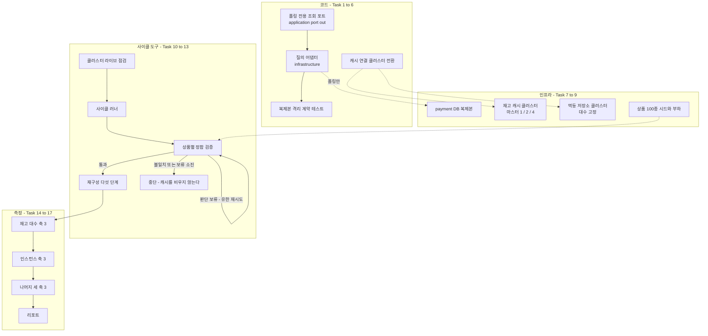

# 공유 자원 동반 스케일아웃 측정 구현 플랜

> 작성일: 2026-08-25

## 요약 브리핑

### Task 목록

| # | 태스크 | 한 줄 |
|:---:|:---|:---|
| 1 | 폴링 상태 조회 포트와 Fake | 폴링이 쓸 조회 두 개를 전용 포트로 선언하고 테스트용 대역을 만든다 |
| 2 | 폴링이 전용 포트를 쓰도록 교체 | 상태 조회 서비스가 판정 경로와 같은 조회를 더 이상 쓰지 않게 한다 |
| 3 | 복제본 데이터소스 설정 | 복제본 연결을 설정값 하나로 켜고 끈다. 끄면 지금과 똑같이 동작한다 |
| 4 | 폴링 조회 어댑터 | 복제본을 질의로만 읽는다. 영속성 컨텍스트를 태우지 않는다 |
| 5 | 복제본 격리 계약 테스트 | 복제본을 주입받는 빈이 폴링 어댑터 하나뿐임을 못박는다 |
| 6 | 캐시 연결의 클러스터 전환 | 재고 캐시와 멱등 저장소를 노드 목록만으로 클러스터에 붙인다 |
| 7 | payment DB 복제본 인프라 | 비동기 복제본 1대를 띄우고 복제를 시작한다 |
| 8 | 캐시 클러스터 인프라 | 마스터 1 / 2 / 4 를 만들고 슬롯 커버리지 요구를 끈다 |
| 9 | 부하 프로필 상품 다중화 | 상품 100종을 심고 부하가 고르게 고르게 한다 |
| 10 | 사이클 재구성 절차 스크립트 | 다섯 단계를 밟아야만 캐시를 비운다 |
| 11 | 정합 검증 상품별 확장 | 상품마다 대조하고, 판정을 기계가 읽게 낸다 |
| 12 | 클러스터 라이브 점검 | 스크립트 다섯 경로와 키 슬롯 배치를 실측한다 |
| 13 | 사이클 러너와 복제 지연 계측 | 사이클 하나를 인자만 주고 끝까지 돌린다 |
| 14 | 재고 캐시 대수 축 측정 | 마스터 1 / 2 / 4, 나머지 고정 |
| 15 | 인스턴스 수 축 측정 | 1 / 2 / 3 / 4, 합격선은 이 축의 1 에서 2 구간뿐 |
| 16 | 나머지 세 축 측정 | 읽기 복제 껐다 켬, 주문당 상품 3개, 고지연 벤더 |
| 17 | 측정 리포트 | 처리량 체감지연 정합성 세 축으로 결론을 낸다 |

### 변경 후 전체 플로우차트

### 핵심 결정과 Task 매핑

| 설계 결정 | Task |
|:---|:---|
| 복제본 읽기 대상을 폴링 전용 포트로 한정 | 1, 2, 4, 5 |
| 복제본은 질의로만 읽는다 | 4 |
| 재고 캐시는 클러스터, 마스터 1 / 2 / 4 | 6, 8, 14 |
| 슬롯 커버리지 요구를 끈다 | 8 |
| 멱등 저장소는 클러스터 전환, 대수 고정 | 6, 8 |
| 사이클 사이 재구성 다섯 단계 | 10 |
| 부하 프로필 상품 100종 | 9, 16 |
| 인스턴스 1 / 2 / 3 / 4, 합격선 1 에서 2 구간 1.6배 | 15, 17 |
| 지연은 백분위 셋 + 복제 지연 병행 | 13, 17 |
| 캐시 내구성은 그대로 재되 효과가 없으면 확인 사이클 | 14 |
| 관측 스택 유지, 첫 사이클 전 기동과 트레이스 점검 | 13, 14 |
| 벤더 지연은 나머지를 고정한 별도 축 | 16 |
| 복제는 비동기 1대 | 7 |
| 포트는 application, 어댑터와 데이터소스 설정은 infrastructure | 1, 3, 4 |
| 메시지 브로커는 단일 유지, 천장으로 관측되면 기록만 | 17 |
| 결론은 처리량 체감지연 정합성 세 축 | 17 |

### 트레이드오프와 후속

- **코드 여섯 개 중 다섯이 폴링 경로 하나를 위한 것이다.** 돈 경로 판정 일곱과 같은 조회를 쓰던 것을 떼어내는 값이다. 떼어내지 않으면 복제 지연 중 격리 종결이 낡은 상태를 읽는다.
- **측정 태스크 넷은 벽시계 시간이 길다.** 사이클 아홉 개에 기동과 재구성이 붙는다. 코드 태스크의 두 시간 감각과 다르지만 직전 측정 토픽도 같은 결로 나눴다.
- **정합 판정을 종료 코드로 낸다.** 지금 검증 스크립트는 불일치가 나도 0 으로 끝나 사람이 눈으로 읽는 전제다. 무인 사이클에 그대로 쓰면 재구성이 그냥 진행돼 증거가 지워진다.
- **장애 전환 검증은 별도 토픽** — ship 에서 미해결 항목 대장에 등재한다.
- **선행 조건 하나가 남아 있다** — Docker 메모리 20GB. Task 14 가 측정 전에 확인한다.

---

## 목표

payment DB 읽기 복제본과 재고 캐시·멱등 저장소 클러스터를 붙인 뒤, 축별로 변수를 하나만 남긴 사이클 아홉 개를 돌려 처리량·체감 지연·정합성 세 축의 수치를 리포트로 남긴다.

## 컨텍스트

- 설계 문서: `docs/topics/SHARED-RESOURCE-SCALEOUT.md` (결정 사항 표가 분해의 원천)
- 이슈 / 브랜치: #146
- 주요 변경 파일
  - `payment-service/.../application/port/out/` — 폴링 전용 조회 포트 신설
  - `payment-service/.../application/PaymentStatusServiceImpl.java` — 폴링이 전용 포트를 쓰도록 교체
  - `payment-service/.../infrastructure/config/{RedisConfig,StockRedisConfig}.java` — 클러스터 연결
  - `payment-service/.../infrastructure/repository/` — 복제본 질의 어댑터
  - `docker/docker-compose.scaleout.yml`(신규) — 복제본 + 캐시 클러스터
  - `scripts/bench-seed-stock.sh`, `scripts/k6/{helpers.js,verify-settlement.sh}`, 신규 사이클 스크립트

### 선행 조건 (측정 시작 전)

- **Docker 메모리 20GB 상향** — 현재 8.2GB. 인스턴스 4대 구간에 복제본과 캐시 노드를 얹으면 컨테이너가 29개가 되고, 호스트가 스왑을 타면 측정이 오염된다. Task 14 가 시작 전에 확인한다.
- CPU 10 코어는 고정. 인스턴스 4대 구간에서 앱 CPU 가 먼저 천장이 될 수 있고, 그 경우 그 사실 자체가 결론이 된다.

## 진행 상황

- [x] Task 1: 폴링 상태 조회 포트와 Fake
- [x] Task 2: 폴링이 전용 포트를 쓰도록 교체
- [x] Task 3: 복제본 데이터소스 설정
- [x] Task 4: 폴링 조회 어댑터 (질의 전용)
- [ ] Task 5: 복제본을 주입받는 빈이 폴링 어댑터 하나임을 고정
- [ ] Task 6: 재고 캐시·멱등 저장소 연결의 클러스터 모드 전환
- [ ] Task 7: payment DB 복제본 인프라
- [ ] Task 8: 재고 캐시·멱등 저장소 클러스터 인프라
- [ ] Task 9: 부하 프로필 상품 다중화
- [ ] Task 10: 사이클 재구성 절차 스크립트
- [ ] Task 11: 정합 검증 상품별 확장
- [ ] Task 12: 클러스터 라이브 점검 스크립트
- [ ] Task 13: 사이클 러너와 복제 지연 계측
- [ ] Task 14: 재고 캐시 대수 축 측정 (마스터 1 / 2 / 4)
- [ ] Task 15: 인스턴스 수 축 측정 (1 / 2 / 3 / 4)
- [ ] Task 16: 읽기 복제·다중 상품·벤더 지연 축 측정
- [ ] Task 17: 측정 리포트

## 태스크

### Task 1: 폴링 상태 조회 포트와 Fake [tdd=false] [domain_risk=false]

설계 근거: "복제본 읽기 대상 — 폴링 전용 조회 포트를 신설하고 그 어댑터만 복제본에 묶는다", "신규 코드 배치 — 포트는 `payment/application/port/out`".

**구현 (GREEN)**
- `payment/application/port/out/PaymentStatusQueryPort.java`
  - `Optional<PaymentOutboxStatus> findActiveOutboxStatus(String orderId)` — 발행 대기(PENDING) 또는 발행 중(IN_FLIGHT)일 때만 값을 돌려준다
  - `Optional<PaymentStatusSnapshot> findStatusSnapshot(String orderId)`
- `payment/application/port/out/PaymentStatusSnapshot.java` — record(orderId, `PaymentEventStatus` status, `Instant` approvedAt). 같은 패키지의 `StockHoldRecordSnapshot` 과 같은 자리·같은 결
- `payment-service/src/test/.../payment/mock/FakePaymentStatusQueryPort.java` — ConcurrentHashMap 기반. 주문번호별로 발행 상태와 스냅샷을 심어 두고 그대로 돌려준다

**완료 기준**
- 두 파일과 Fake 가 존재하고 `./gradlew :payment-service:compileTestJava` 통과
- 포트가 도메인 타입(`PaymentOutboxStatus` / `PaymentEventStatus`)만 노출하고 JPA·JDBC 타입을 드러내지 않는다

**완료 결과**
- `PaymentStatusQueryPort` / `PaymentStatusSnapshot` / `FakePaymentStatusQueryPort` 3 파일 신설. `compileTestJava` 통과
- 아직 어떤 코드도 이 포트를 참조하지 않는다 — 교체는 Task 2

---

### Task 2: 폴링이 전용 포트를 쓰도록 교체 [tdd=true] [domain_risk=true]

설계 근거: "복제본 읽기 대상" 결정. 결제 이벤트 조회를 돈 경로 판정 일곱이 공유하므로, 폴링만 떼어내야 판정이 원본에 남는다.

**테스트 (RED)**
- `PaymentStatusServiceImplTest` (기존 파일 갱신) — 협력자를 `FakePaymentStatusQueryPort` 로 바꾼다
  - `getPaymentStatus_발행대기면_PENDING`
  - `getPaymentStatus_발행중이면_PROCESSING`
  - `getPaymentStatus_발행기록없고_이벤트가_DONE이면_DONE과_승인시각`
  - `getPaymentStatus_발행기록없고_이벤트가_FAILED면_FAILED`
  - `getPaymentStatus_발행기록없고_이벤트가_진행중이면_PROCESSING` (`@ParameterizedTest @EnumSource` 로 DONE/FAILED 를 뺀 나머지)
  - `getPaymentStatus_이벤트가_없으면_PAYMENT_EVENT_NOT_FOUND` — 교체 전과 같은 예외를 던진다
  - `getPaymentStatus_발행기록이_있으면_스냅샷을_읽지_않는다` — 발행 대기 상태일 때 스냅샷 조회 호출 수가 0

**구현 (GREEN)**
- `PaymentStatusServiceImpl` 이 `PaymentStatusQueryPort` 하나만 의존한다. `PaymentLoadUseCase` / `PaymentOutboxUseCase` 의존을 뺀다
- 스냅샷이 비면 `PaymentFoundException.of(PaymentErrorCode.PAYMENT_EVENT_NOT_FOUND)` — 기존 `PaymentLoadUseCase.getPaymentEventByOrderId` 와 같은 예외

**완료 기준**
- 위 테스트 전부 pass
- `PaymentStatusServiceImpl` 이 두 유스케이스를 참조하지 않는다
- `./gradlew :payment-service:test` 회귀 없음

**메모**
- 교체 후 `PaymentOutboxUseCase.findActiveOutboxStatus` 의 호출처가 없어진다. 제거 여부는 임의로 판단하지 않고 ship 리뷰에서 사용자 확인 후 정한다

**완료 결과**
- `PaymentStatusServiceImpl` 이 `PaymentStatusQueryPort` 하나만 의존하도록 교체. `PaymentLoadUseCase` / `PaymentOutboxUseCase` 의존 제거
- 스냅샷이 비면 기존과 같은 `PaymentFoundException.of(PAYMENT_EVENT_NOT_FOUND)` 를 던진다
- `PaymentStatusServiceImplTest` 를 `FakePaymentStatusQueryPort` 기반으로 재작성 (7케이스, PROCESSING 분기는 `@ParameterizedTest @EnumSource` 로 DONE/FAILED 제외 전체 커버). 스냅샷 미조회 검증은 Fake 를 `Mockito.spy` 로 감싸 확인
- `./gradlew :payment-service:test` 682건 전체 통과 — `PaymentOutboxUseCase.findActiveOutboxStatus` 호출처는 아직 남아 있어(Task 5 이후 정리 대상) 회귀 없음
- `PaymentStatusServiceImpl` 을 sliced 컨텍스트가 아닌 방식으로 부팅하는 테스트는 없어 프로덕션 `PaymentStatusQueryPort` 빈이 아직 없어도 unit test 범위에서 영향 없음 (구현체는 Task 4)

---

### Task 3: 복제본 데이터소스 설정 [tdd=false] [domain_risk=false]

설계 근거: "복제본 읽기 기술 — 복제본 데이터소스에 얹은 질의 템플릿", "신규 코드 배치 — 데이터소스 설정은 `payment/infrastructure`".

**구현 (GREEN)**
- `payment/infrastructure/config/ReplicaDataSourceConfig.java`
  - `payment.datasource.replica.enabled` 가 참이면 별도 `DataSource` 를 만들어 `paymentReplicaDataSource` 로 등록
  - 거짓이면 기본 데이터소스를 그대로 `paymentReplicaDataSource` 이름으로 노출한다. 읽기 복제 축의 "라우팅 끔" 사이클과 기존 통합 테스트가 설정 하나로 성립한다
  - `@Primary` 를 붙이지 않는다 — 기본 데이터소스 결정은 자동 설정에 그대로 맡긴다
- `application.yml` 에 기본값(`enabled: false`), `application-docker.yml` / 신규 override 에 복제본 접속 정보

**완료 기준**
- `payment.datasource.replica.enabled=false` 로 `./gradlew :payment-service:test :payment-service:integrationTest` 회귀 없음
- 참으로 켠 상태에서 앱이 뜨고 `paymentReplicaDataSource` 가 복제본을 가리킨다 (Task 7 기동 후 확인)
- 복제본 접속 문자열이 원본과 같은 타임존 파라미터(`connectionTimeZone=UTC` + `forceConnectionTimeZoneToSession=true`)를 갖는다 — 원본은 `application-docker.yml` 에서 이걸로 UTC 왕복을 강제하는데, 복제본만 빠지면 폴링이 읽는 승인시각이 세션 타임존만큼 어긋난다

**완료 결과**
- `payment/infrastructure/config/ReplicaDataSourceConfig.java` 신설 — `dataSource`(기본) / `paymentReplicaDataSource`(복제본) 두 빈을 함께 정의
- `application.yml` 에 `payment.datasource.replica.enabled` 기본값(false), `application-docker.yml` 에 복제본 접속 정보(`mysql-payment-replica` 호스트, D7 과 같은 `connectionTimeZone=UTC&forceConnectionTimeZoneToSession=true`) 추가
- **[Rule 1] 설계 문구("자동 설정에 그대로 맡긴다")와 실제로 구현 가능한 형태가 달라 그 자리에서 조정** — Spring Boot `DataSourceAutoConfiguration` 은 컨텍스트에 `DataSource` 타입 빈이 하나라도 있으면(`@ConditionalOnMissingBean(DataSource.class)`) 자체 기본 빈 생성을 통째로 건너뛴다. `paymentReplicaDataSource` 빈만 추가해도 이 조건에 걸려 자동 설정이 만드는 기본 데이터소스 자체가 사라지는 것을 통합 테스트로 확인했다(코드리뷰 리서치 대상 아님, 부팅 실패로 즉시 드러남). 대응: 이 설정 클래스가 기본 데이터소스도 같은 `spring.datasource.*` 프로퍼티로 직접 등록해 접속 정보·Hikari 풀 설정 등 외부 동작을 그대로 유지한다. 추가로 JPA 자동 설정(`JpaBaseConfiguration`)은 `@ConditionalOnSingleCandidate(DataSource.class)` 로 단일 후보 또는 `@Primary` 지목 빈을 요구해, 복제본 빈이 상시 두 번째 후보로 존재하는 이상 표시가 없으면 JPA 자동 설정 자체가 꺼진다 — 그래서 기본 데이터소스에만 `@Primary` 를 붙였다(복제본 빈에는 미부착, 원 설계 의도인 "이름·Qualifier 없는 자리는 기본을 받는다"는 그대로 보존)
- `payment.datasource.replica.enabled=false` 로 `./gradlew :payment-service:test` 682건 전체 통과
- `./gradlew :payment-service:integrationTest` 는 이번 변경 적용 전/후 모두 660건 중 651건 실패로 **동일** — 원인은 Task 2 가 `PaymentStatusServiceImpl` 을 `PaymentStatusQueryPort` 전용으로 바꾼 뒤 프로덕션 구현체가 아직 없어서(어댑터는 Task 4) 전체 컨텍스트 부팅 테스트가 전부 깨지는 기존 회귀다 — HEAD(Task 3 착수 전)에서 stash 후 재현해 사전 확인. 이번 태스크가 새로 만든 실패는 0건
- "참으로 켠 상태에서 앱이 뜨고 paymentReplicaDataSource 가 복제본을 가리킨다" 확인은 복제본 컨테이너가 없어 이번 태스크에서는 검증 불가 — Task 7(복제본 인프라 기동) 이후로 이월

---

### Task 4: 폴링 조회 어댑터 (질의 전용) [tdd=true] [domain_risk=true]

설계 근거: "복제본 읽기 기술 — 영속성 컨텍스트를 태우지 않는다". 폴링이 쓰는 값이 셋뿐이라 매핑이 필요 없고, 기존 데이터소스 구성을 건드리지 않는다.

**테스트 (RED)**
- `payment/infrastructure/repository/PaymentStatusQueryJdbcAdapterTest` — `@Tag("integration")`, Testcontainers MySQL(`withReuse(true)`, static 블록 수동 start), `JdbcTemplate` 으로 행을 직접 심는다
  - Spring 컨텍스트를 띄우지 않는다. 어댑터가 `JdbcTemplate` 하나만 받으므로 컨테이너 접속 정보로 직접 만들어 생성자에 넘긴다 — `@DataJpaTest` 는 JPA 를 안 쓰는 이 어댑터에 맞지 않고, 전체 부팅은 이 검증에 필요 없다
  - 컨테이너 접속 문자열에도 Task 3 과 같은 타임존 파라미터를 붙인다
  - `findActiveOutboxStatus_발행대기_행이면_PENDING`
  - `findActiveOutboxStatus_발행중_행이면_IN_FLIGHT`
  - `findActiveOutboxStatus_종결된_발행기록이면_빈값` (`@ParameterizedTest @EnumSource` 로 PENDING/IN_FLIGHT 를 뺀 나머지)
  - `findActiveOutboxStatus_행이_없으면_빈값`
  - `findStatusSnapshot_주문번호로_상태와_승인시각을_읽는다` — 승인시각이 UTC 기준으로 왕복하는지까지 확인
  - `findStatusSnapshot_행이_없으면_빈값`

**구현 (GREEN)**
- `payment/infrastructure/repository/PaymentStatusQueryJdbcAdapter.java` — `PaymentStatusQueryPort` 구현
  - `paymentReplicaDataSource` 로 만든 `JdbcTemplate` 만 쓴다. `@Transactional` 을 붙이지 않는다
  - `SELECT status FROM payment_outbox WHERE order_id = ?` / `SELECT order_id, status, approved_at FROM payment_event WHERE order_id = ?`
  - 발행 상태 필터(발행 대기 또는 발행 중)는 어댑터에서 도메인 열거형으로 변환한 뒤 판정한다 — SQL 에 상태 문자열을 흩뿌리지 않는다

**완료 기준**
- 위 테스트 전부 pass
- 어댑터가 `EntityManager` / JPA 리포지토리를 참조하지 않는다
- `./gradlew :payment-service:integrationTest --rerun-tasks` 회귀 없음

**완료 결과**
- `payment/infrastructure/repository/PaymentStatusQueryJdbcAdapter.java` 신설 — `payment_outbox`/`payment_event` 를 각각 단건 SELECT 로 읽고, 발행 상태 필터(발행 대기 또는 발행 중)는 SQL 이 아니라 `PaymentOutboxStatus.isClaimable()/isInFlight()` 로 자바 코드에서 판정. `EntityManager`·JPA 리포지토리 미참조, `@Transactional` 미부착
- `payment/infrastructure/config/ReplicaDataSourceConfig.java` 에 `paymentReplicaJdbcTemplate` 빈 추가 — `paymentReplicaDataSource` 를 감싼 `JdbcTemplate` 을 명시 이름으로 등록해 폴링 어댑터만 이 빈을 주입받도록 사슬을 관측 가능하게 만든다 (Task 5 격리 계약 테스트의 전제)
- `PaymentStatusQueryJdbcAdapterTest` (RED 커밋 `629326ad`) — Spring 컨텍스트 없이 Testcontainers MySQL 을 Flyway 로 마이그레이션한 뒤 수동 `JdbcTemplate` 로 어댑터를 직접 생성해 6케이스(발행대기/발행중/종결 2종 파라미터라이즈/미존재 2종/스냅샷 UTC 왕복) 검증, 통합 테스트 태그로 7건 전부 통과
- `./gradlew :payment-service:test` 682건 전체 통과, `./gradlew :payment-service:integrationTest --rerun-tasks` **667건 전체 통과(0 실패)** — Task 2 이후 660건 중 651건이 실패하던 회귀가 이 태스크의 프로덕션 `PaymentStatusQueryPort` 구현체 등록으로 완전히 해소됐다. 이번 태스크가 추가한 신규 테스트 7건을 빼면 기존 660건도 그대로 전부 통과

---

### Task 5: 복제본을 주입받는 빈이 폴링 어댑터 하나임을 고정 [tdd=true] [domain_risk=true]

설계 근거: 검증 전략 — "복제본으로 가는 조회가 폴링 경로 하나뿐임을 구조 계약으로 고정한다". 돈 경로 판정 일곱이 복제본을 읽지 않는 것이 이 설계의 안전 근거라, 테스트로 못박지 않으면 나중에 조용히 무너진다.

**테스트 (RED)**
- `payment/infrastructure/config/ReplicaDataSourceIsolationTest` — `@SpringBootTest`, `@Tag("integration")`
  - `복제본_데이터소스를_주입받는_빈은_폴링_어댑터_하나뿐이다` — `ConfigurableListableBeanFactory.getDependentBeans("paymentReplicaDataSource")` 결과가 폴링 어댑터(와 그것이 쓰는 질의 템플릿 빈)로만 이뤄진다
  - `폴링_어댑터가_아닌_저장소는_기본_데이터소스를_쓴다` — 결제 이벤트 저장소 어댑터의 의존 사슬에 복제본 데이터소스가 없다

**구현 (GREEN)**
- 테스트만으로 성립하면 프로덕션 코드 변경 없음. 빈 이름이 사슬에 안 드러나면 Task 3 에서 복제본 전용 `JdbcTemplate` 빈을 명시 이름으로 등록해 사슬을 관측 가능하게 만든다

**완료 기준**
- 위 테스트 pass
- 다른 빈에 복제본 데이터소스를 주입해 보면 테스트가 깨지고, 되돌리면 다시 통과한다 (한 번 확인 후 원복)

**완료 결과**
> (execute에서 채움)

---

### Task 6: 재고 캐시·멱등 저장소 연결의 클러스터 모드 전환 [tdd=false] [domain_risk=false]

설계 근거: "재고 캐시 분산 — 클러스터", "멱등 저장소 — 클러스터로 전환하되 대수는 고정".

**구현 (GREEN)**
- `StockRedisConfig` — `payment.cache.stock-redis.cluster-nodes` 가 비어 있지 않으면 `RedisClusterConfiguration`, 비어 있으면 지금의 단독 노드 설정. 토폴로지 자동 갱신을 켜 대수 변경 뒤 첫 명령이 리다이렉트로 새 배치를 따라가게 한다
- `RedisConfig` — `spring.data.redis.cluster.nodes` 에 대해 같은 분기. `@Primary` 표시와 기존 빈 이름은 그대로 둔다
- 두 설정 모두 명령·연결 제한값은 지금 값을 유지한다

**완료 기준**
- 노드 목록 미설정 시 기존과 동일하게 뜬다 — `./gradlew :payment-service:test :payment-service:integrationTest` 회귀 없음
- 노드 목록을 넣으면 클러스터 연결로 뜬다 (Task 8 기동 후 Task 12 가 실측으로 확인)

**완료 결과**
> (execute에서 채움)

---

### Task 7: payment DB 복제본 인프라 [tdd=false] [domain_risk=false]

설계 근거: "복제 방식 — 비동기 복제 1대".

**구현 (GREEN)**
- `docker/docker-compose.scaleout.yml`(신규 override) — `mysql-payment` 에 `server-id` / binlog 옵션을 얹고, `mysql-payment-replica` 컨테이너를 추가한다
- `scripts/bench-replica-setup.sh` — 복제 계정 생성, 원본 좌표 확인, 복제 시작, 상태 확인까지 한 번에
- `payment-service` 환경에 복제본 접속 정보와 `payment.datasource.replica.enabled` 주입

**완료 기준**
- 스택 기동 후 `SHOW REPLICA STATUS` 의 IO / SQL 스레드가 둘 다 Yes
- 원본에 넣은 행이 복제본에서 읽힌다 (스크립트가 왕복 한 건으로 확인)
- 스크립트를 두 번 돌려도 같은 결과 (멱등)

**완료 결과**
> (execute에서 채움)

---

### Task 8: 재고 캐시·멱등 저장소 클러스터 인프라 [tdd=false] [domain_risk=false]

설계 근거: "재고 캐시 분산 — 마스터 1 / 2 / 4, 복제 노드 없음", "클러스터 슬롯 커버리지 — 기본 동작을 끈다", "대수 비교축 — 전 구간 클러스터 모드로 통일".

**구현 (GREEN)**
- 같은 override 파일에 재고 캐시 노드(최대 4)와 멱등 저장소 노드(고정 대수)를 정의한다. 컨테이너 이름을 고정하지 않아 대수를 실행 옵션으로 바꿀 수 있게 한다
- 모든 캐시 노드에 `--cluster-enabled yes`, `--cluster-require-full-coverage no`. 재고 캐시는 지금의 `appendfsync always` 를 그대로 둔다 (프로덕션 구성 그대로 재는 것이 결정)
- `scripts/bench-redis-cluster.sh --masters N` — 지정 대수로 클러스터를 만들고 슬롯 배정까지 마친다. 마스터 1대도 클러스터로 성립시킨다

**완료 기준**
- 대수 1 / 2 / 4 각각에서 `CLUSTER INFO` 의 state 가 ok 이고 슬롯 16384 가 전부 배정된다
- `CLUSTER COUNT-FAILURE-REPORTS` 기준이 아니라 설정값으로 슬롯 커버리지 요구가 꺼져 있음을 `CONFIG GET cluster-require-full-coverage` 로 확인
- 스크립트를 다시 돌리면 기존 클러스터를 지우고 같은 상태로 다시 만든다

**완료 결과**
> (execute에서 채움)

---

### Task 9: 부하 프로필 상품 다중화 [tdd=false] [domain_risk=false]

설계 근거: "부하 프로필 — 상품 종류 100개, 주문당 상품 1개 고정. 다중 상품 축에서만 주문당 3개".

**구현 (GREEN)**
- `scripts/bench-seed-stock.sh` — `PRODUCT_COUNT`(기본 100) 만큼 상품·재고 행을 보장하고(없으면 넣고), 상품별로 원본과 캐시를 같은 상수로 덮는다. 클러스터 대응으로 리다이렉트를 따라가게 호출한다
- `scripts/k6/helpers.js` — `PRODUCT_COUNT`, `ITEMS_PER_ORDER`(기본 1) 를 받고, 반복마다 상품을 고르게 골라 주문 항목을 만든다. 한 주문 안에서 같은 상품이 두 번 들어가지 않게 한다
- `scripts/k6/async-payment.js` — 바뀐 헬퍼를 그대로 쓴다

**완료 기준**
- 시드 후 상품 100개 전부에서 원본 수량 = 캐시 수량
- k6 를 짧게 돌리면 주문이 여러 상품에 퍼진다 (상품별 주문 수를 세어 확인)
- `ITEMS_PER_ORDER=3` 으로 돌리면 한 주문에 서로 다른 상품 3개가 담긴다

**완료 결과**
> (execute에서 채움)

---

### Task 10: 사이클 재구성 절차 스크립트 [tdd=false] [domain_risk=true]

설계 근거: "사이클 사이 재구성 절차 — 다섯 단계를 순서대로 밟는다". 확인과 비우기 사이가 열려 있으면 낙오 확정의 캐시 차감분이 지워져 같은 재고 단위가 다음 사이클에서 또 팔린다.

**구현 (GREEN)**
- `scripts/bench-cycle-reset.sh` — 다섯 단계를 순서대로 밟고, 단계마다 통과 못 하면 재시드 없이 종료한다
  1. 부하 도구가 멈춘 것을 확인한다 (이 환경에서 확정 요청의 유일한 출처)
  2. 미종결 결제(진행 중 · 재시도 대기 · 접수 상태) 0, **격리 결제 0**, 미회수 선차감 기록 0 을 짧은 폴링 창으로 안정 확인. 이 프로젝트의 기존 검증 용어에서 미종결과 격리는 별개로 세는 값이라, 미종결만 보면 격리 잔류가 그대로 통과한다 — 바로 다음 줄의 격리 처리가 아예 발동하지 않고 격리가 남은 채로 캐시를 비우게 된다
  3. 재고 확정 메시지의 소비 적체 0 안정 확인 — 소비자 그룹 `product-service-stock-commit`
  4. 회수 주기 작업 정지 — payment 를 **서비스 단위로** 멈춘다(`docker compose stop payment-service`). 회수 워커는 인스턴스마다 독립으로 도는데 끄는 설정값이 없어 프로세스를 멈추는 것 말고는 정지 수단이 없다. 컨테이너 하나만 겨냥하면 인스턴스 2 / 3 / 4대 사이클에서 남은 인스턴스의 회수가 재확인과 비우기 사이에 끼어들어, 방금 닫은 창이 그대로 다시 열린다
  5. **(2)와 (3)을 한 번 더 통과한 직후** 캐시를 비우고 상품별 상수로 재시드
- 잔류가 남으면 무엇이 얼마나 남았는지 출력하고, 종결 가능한 격리는 관리자 종결로 비운 뒤 재확인한다. 반복해도 안 비면 사이클 실패로 종료한다 (무기한 대기 금지)

**완료 기준**
- 다섯 단계가 순서대로 실행되고, (2)/(3) 재확인을 통과하지 못하면 캐시를 비우지 않는다
- 인스턴스 2 / 3 / 4대 사이클에서 정지 직후 실행 중인 payment 컨테이너가 0 인 것을 확인하고, 하나라도 살아 있으면 비우기로 넘어가지 않는다
- 격리 결제를 인위로 하나 남겨 두면 재구성이 멈추고, 그것을 관리자 종결로 비우면 재확인을 통과해 재시드까지 이어진다
- 잔류를 인위로 만들어 두면 0 이 아닌 코드로 끝나고 남은 내역이 출력된다
- 정상 상태에서 돌리면 상품 100개 전부가 상수로 재시드된 채 끝난다

**완료 결과**
> (execute에서 채움)

---

### Task 11: 정합 검증 상품별 확장 [tdd=false] [domain_risk=true]

설계 근거: 검증 전략 — "정합성은 매 사이클 종료 후 상품별로 확인한다… 재고 확정 메시지의 소비 적체가 0 으로 안정된 뒤에 잰다".

**구현 (GREEN)**
- `scripts/k6/verify-settlement.sh` 확장
  - 재고 대조를 상품 하나가 아니라 시드된 상품 전부에 대해 수행하고, 어긋난 상품을 개별로 출력한다
  - 미회수 선차감 기록 0 을 선결 조건에 넣는다
  - 소비 적체 0 안정을 선결 조건에 넣는다 — 남은 채로 재면 정상인데 불일치로 찍힌다
  - 캐시 조회를 클러스터 리다이렉트 대응으로 바꾼다
  - 결제 상태와 재고 차감이 어긋난 건이 없는지 확인한다. 기존 교차식(부하 도구 카운트 대 DB 상태 카운트)이 유실만 잡고 건별 어긋남은 안 잡으므로, 종결된 결제의 선차감 기록과 상태를 대조하는 검사를 더한다
  - **판정을 기계가 읽을 수 있게 낸다** — 지금은 불일치가 나도 종료 코드가 0 이라 사이클 러너가 통과와 구분할 수 없다. 종료 코드를 통과 0 / 판단 보류 2 / 불일치 3 으로 가르고(접속·전제 실패는 지금처럼 1), 같은 판정을 `results/<CASE_NAME>-verdict.json` 에 한 필드로 남긴다. 부하 도구가 쓴 결과 파일은 건드리지 않는다 — 사후에 필드를 끼워 넣으면 그 파일을 읽는 다른 도구와 스키마가 어긋난다. 자동 소비처가 아직 없어 기존 사용을 깨지 않는다
  - **대기로 풀리는 보류와 안 풀리는 보류를 가른다** — 종결이 덜 끝나 판정을 못 내리는 것은 판단 보류(2)다. 격리 결제가 남아 판정을 못 내리는 것은 기다려도 안 풀리므로 불일치(3)로 낸다. 지금 스크립트는 둘을 같은 판단 보류로 묶어 두는데, 그대로 두면 러너가 격리 건에 재시도 횟수만 소모하고 늦게 멈춘다

**완료 기준**
- 상품 하나만 어긋나게 만들어도 불일치로 잡힌다
- 소비 적체가 남은 상태에서는 정합 판정을 내리지 않고 판단 보류로 끝난다
- 세 판정(통과 / 판단 보류 / 불일치)이 각각 다른 종료 코드로 나오고, `results/<CASE_NAME>-verdict.json` 에서도 같은 값을 읽을 수 있다
- 격리 결제가 남은 상태에서는 판단 보류가 아니라 불일치로 끝난다
- 정상 종료 상태에서 상품 100개 전부 통과

**완료 결과**
> (execute에서 채움)

---

### Task 12: 클러스터 라이브 점검 스크립트 [tdd=false] [domain_risk=false]

설계 근거: 검증 전략 — "클러스터 구성에서 스크립트 5종이 전부 정상 실행되는지, 한 상품의 키가 같은 노드에 놓이는지", "상품 종류가 노드에 고르게 안 퍼진다" 장애 시나리오.

**구현 (GREEN)**
- `scripts/bench-cluster-check.sh`
  - 결제 한 건을 정상 경로로 흘려 선차감 · 되돌리기 · 격리 복구 보상 · 주문 선점 획득 · 해제 다섯 경로가 클러스터에서 모두 도는 것을 확인한다
  - 한 상품에 딸린 키(재고 · 선차감 표시 · 되돌리기 표시)가 같은 노드에 놓이는지 `CLUSTER KEYSLOT` 으로 대조한다
  - 노드별 키 개수를 세어 분포 편차를 출력한다. 편차가 크면 상품 수를 늘려 다시 배치하라고 알린다

**완료 기준**
- 마스터 2 / 4 구성에서 다섯 경로 전부 정상 결과
- 임의의 상품에 대해 딸린 키가 전부 같은 슬롯
- 노드별 키 분포가 출력되고 편차 임계를 넘으면 0 이 아닌 코드로 끝난다

**완료 결과**
> (execute에서 채움)

---

### Task 13: 사이클 러너와 복제 지연 계측 [tdd=false] [domain_risk=true]

설계 근거: "사이클을 어떻게 짤 것인가" 표, "폴링의 복제 지연 — 체감 지연으로 관측", "지연 지표 — p50 / p95 / p99. 복제 지연을 함께 계측", "관측 스택 — 전 구간 유지".

**구현 (GREEN)**
- `scripts/bench-scaleout-cycle.sh` — 사이클 하나를 인자(인스턴스 수 / 재고 마스터 수 / 폴링 라우팅 / 주문당 상품 수 / 벤더 지연)로 받아 끝까지 무인 실행한다
  - 스택 기동(관측 스택 포함) → 클러스터 구성 → 시드 → 부하 → 종결 대기 → 정합 검증 → 재구성
  - 사이클 동안 복제본의 지연 초를 주기로 표본화해 사이클 로그에 남긴다
  - 결과를 `results/<CASE_NAME>-cycle.json` 에 남긴다 — 조건 값, 처리율, 백분위 지연, 복제 지연, 정합 판정. 부하 도구가 쓰는 `<CASE_NAME>.json` 과 Task 11 의 판정 파일 어느 쪽도 덮지 않는다. 사이클 이름이 케이스 이름과 같으면 원본 카운트가 사라져 재검증할 근거가 없어진다
  - 정합 판정은 Task 11 이 낸 종료 코드로 받는다. 판단 보류면 정해진 횟수만큼만 기다렸다 다시 재고, 그래도 보류면 그 사이클을 실패로 끝낸다 — 무기한 기다리지 않는다. 불일치면 재구성으로 넘어가지 않는다. 캐시를 비우고 재시드하면 어긋난 값과 선차감 기록이 지워져 원인을 되짚을 수 없다
  - 실패로 멈춘 사이클의 잔류를 치우는 것은 러너가 아니라 사람이다. 다음 사이클을 시작하기 전에 Task 10 을 따로 돌려 잔류를 비운다 — 격리 종결처럼 사람 판단이 필요한 자리가 있어 러너가 알아서 밀고 가면 안 된다
- 지연 백분위는 폴링 응답과 전체 완료를 나눠 p50 / p95 / p99 로 뽑는다

**완료 기준**
- 사이클 하나를 인자만 주고 끝까지 돌릴 수 있다
- 결과 파일에 조건 값과 다섯 지표(확정 처리율 / 전체 완료 처리율 / 폴링 지연 백분위 / 전체 완료 지연 백분위 / 복제 지연)가 남는다
- 정합 검증이 실패하면 그 사이클을 실패로 기록하고 다음으로 넘어가지 않으며, 캐시를 비우지 않고 멈춘다
- 판정을 인위로 불일치·판단 보류로 만들어 두면 러너가 각각 다르게 반응한다 (불일치는 즉시 중단, 보류는 유한 재시도 후 실패)
- 정합 검증이 불일치나 보류 소진으로 끝나면 러너가 재구성 스크립트를 부르지 않는다
- 검증이 접속·전제 실패로 끝나거나 러너가 모르는 코드로 끝나도 정합 검증 실패와 똑같이 다룬다 — 판정을 못 받은 것을 통과로 읽지 않는다

**완료 결과**
> (execute에서 채움)

---

### Task 14: 재고 캐시 대수 축 측정 (마스터 1 / 2 / 4) [tdd=false] [domain_risk=false]

설계 근거: 사이클 표의 첫 축(인스턴스 2, 폴링 라우팅 켬 고정), "캐시 내구성 설정 — 대수 효과가 없게 나오면 fsync 정책을 낮춘 확인 사이클을 추가한다", "라이브 검증 — 첫 사이클 전에 인프라 기동 점검과 트레이스 연속성 점검".

**구현 (GREEN)**
- 측정 시작 전 확인: Docker 메모리 20GB, 호스트 스왑 여유, `docs/smoke/infra-healthcheck.md` 와 `docs/smoke/trace-continuity-check.md` 각 1회
- 사이클 3개 실행 — 재고 마스터 1 / 2 / 4, 나머지 고정
- 대수 효과가 관측되지 않으면 fsync 정책을 낮춘 확인 사이클 1개를 덧붙여 단일 스레드 한계와 디스크 공유를 가른다

**완료 기준**
- 사이클 3개의 결과 파일이 남고 각각 정합 검증 통과
- 시작 전 점검 결과(메모리 여유 · 기동 점검 · 트레이스 연속성 · 노드별 키 분포)가 기록으로 남는다
- 대수별 처리율 비교표가 나오고, 효과가 없으면 확인 사이클 결과까지 함께 남는다

**완료 결과**
> (execute에서 채움)

---

### Task 15: 인스턴스 수 축 측정 (1 / 2 / 3 / 4) [tdd=false] [domain_risk=false]

설계 근거: 사이클 표의 둘째 축, "인스턴스 단계 — payment 1 / 2 / 3 / 4", "합격선 — 인스턴스 1 → 2 확정 처리율 1.6배".

**구현 (GREEN)**
- 재고 마스터를 Task 14 의 최적값으로 고정하고 인스턴스 1 / 3 / 4 사이클 실행 (2대 지점은 앞 축과 조건이 같아 재사용)
- 4대 구간에서 CPU 사용률과 메모리 여유를 함께 기록한다 — 앱 CPU 가 먼저 포화하면 그 사실이 결론이 된다

**완료 기준**
- 사이클 3개의 결과 파일이 남고 각각 정합 검증 통과
- 인스턴스 1대 기준선 대비 2 / 3 / 4 대의 확정 처리율·전체 완료 처리율 상대비가 나온다
- 1 → 2 구간이 1.6배 판정선을 넘었는지 여부가 명시된다

**완료 결과**
> (execute에서 채움)

---

### Task 16: 읽기 복제·다중 상품·벤더 지연 축 측정 [tdd=false] [domain_risk=false]

설계 근거: 사이클 표의 나머지 세 축. "읽기 복제 효과 — 폴링 라우팅 끔 1점", "다중 상품 주문 — 재고 마스터 4 고정, 주문당 상품 3개", "벤더 지연 — 나머지를 전부 고정한 별도 축 1점".

**구현 (GREEN)**
- 폴링 라우팅을 끈 사이클 1개 — 복제본은 띄운 채로 둬 자원 점유를 같게 만든다
- 주문당 상품 3개 사이클 1개 — 재고 마스터는 4로 고정한다. 이 축의 목적이 처리율 비교가 아니라 상품 키가 여러 노드에 걸쳐도 정합이 유지되는지 확인하는 것이라, 노드가 가장 많이 갈린 구성이라야 의미가 있다
- 고지연 벤더 사이클 1개 — 나머지 조건은 전부 고정. 확정 처리율과 함께 미종결 결제 적체를 잰다

**완료 기준**
- 사이클 3개의 결과 파일이 남고 각각 정합 검증 통과
- 라우팅 켬/끔 두 점의 처리율과 지연 차이가 나온다
- 다중 상품 사이클에서 상품별 정합이 전부 맞는다
- 고지연 사이클의 미종결 적체 추이가 기록된다

**완료 결과**
> (execute에서 채움)

---

### Task 17: 측정 리포트 [tdd=false] [domain_risk=false]

설계 근거: "결론 축 — 처리량 / 체감 지연 / 정합성", "메시지 브로커 — 커밋 직렬화가 천장으로 관측되면 그 사실만 기록", 영향 범위의 "신규 (문서) — 측정 리포트".

**구현 (GREEN)**
- `docs/SHARED-RESOURCE-SCALEOUT-REPORT.md` — 직전 측정 리포트(`docs/archive/capacity-and-scaleout/`) 형식을 잇는다
  - 사이클별 조건과 지표 표
  - 축별 해석 — 대수 효과 / 인스턴스 효과 / 읽기 복제의 처리량·지연 교환 / 다중 상품 / 벤더 지연
  - 합격선 판정 — 1 → 2 구간만
  - 해석 범위 명시 — 단일 머신 디스크 공유, 핫 상품 쏠림 미답, CPU 포화 여부, 직전 측정과 부하 프로필이 달라 직접 비교하지 않는다는 점
  - 측정 중 커밋 직렬화가 천장으로 관측됐으면 그 사실만 기록

**완료 기준**
- 사이클 아홉 개(+ 조건부 확인 사이클) 전부가 표에 있다
- 합격선 판정과 해석 범위가 명시돼 있다
- 결론이 처리량·체감 지연·정합성 세 축 모두를 다룬다

**완료 결과**
> (execute에서 채움)

## 리뷰 처리

> (ship 단계에서 채움 — finding별 채택/스킵 + 사유)
