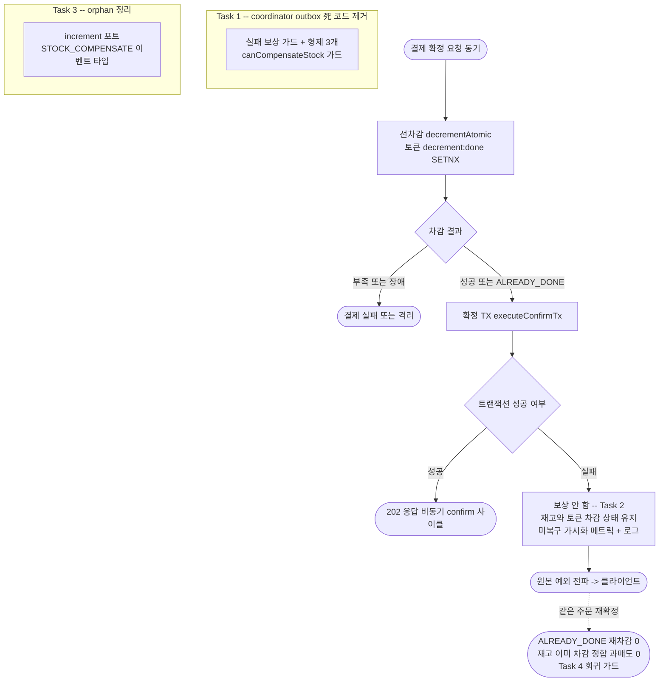

# 재고 보상 경로 정리 구현 플랜

> 작성일: 2026-06-20

## 요약 브리핑

### Task 목록

1. **Task 1** — coordinator의 ADR-04 잔재 outbox 死 코드 4메서드(실패 보상 가드 + 형제 3개) + `canCompensateStock` 가드 제거 [tdd=false, domain_risk=true]
2. **Task 2** — 확정 진입 보상 폐기: 확정 TX 실패 시 선차감 재고·토큰 유지(과매도 0), 미복구 가시화 메트릭+로그 [tdd=true, domain_risk=true]
3. **Task 3** — 보상 폐기로 orphan이 된 재고 증가 포트·STOCK_COMPENSATE 이벤트 정리 + stale Javadoc 정정 [tdd=false, domain_risk=false]
4. **Task 4** — 재고 정합 통합 테스트(재확정·동시 confirm 과매도 0 불변식 회귀 가드) [tdd=true, domain_risk=true]

### 변경 후 전체 플로우

### 핵심 결정 → Task 매핑

- 경로 2(+ADR-04 형제) 死 코드 제거 → **Task 1**
- 경로 1 보상 폐기 + 토큰 유지 + 침묵 손실 가시화 → **Task 2**
- 보상 폐기 동반 orphan(increment 포트, STOCK_COMPENSATE 이벤트) 정리 → **Task 3**
- 과매도 0 불변식 검증(재확정·동시 confirm) → **Task 4**

### 트레이드오프 / 후속 작업

- **한계**: L1 재고 누수(reconciler TC-3 위임), L2 재확정 비보장(confirm 멱등성 별 토픽)
- **후속 위임**: 형제 제거로 드러난 다음 층 orphan(`markPaymentAsRetrying`·`outbox.toFailed`·`rollback`)과 RETRYING 상태 머신 정리 → ship 시 TODOS 등재
- **성격**: 신규 추가가 아닌 정리(死 코드 + 보상 코드 제거)로 순 코드량 감소

## 목표

`PaymentTransactionCoordinator`의 ADR-04 잔재 outbox 死 코드 4메서드(경로 2 + 형제 3개)를 제거하고, 경로 1(확정 진입 차감 보상)을 "보상 폐기 + 미복구 가시화"로 전환해 동시 confirm·재확정 과매도를 0으로 만든다. 보상 폐기로 미사용이 되는 포트·이벤트 타입을 정리하고, 재고 정합 불변식을 통합 테스트로 박는다.

## 컨텍스트

- 설계 문서: docs/topics/STOCK-COMPENSATION-OTHER-PATHS.md
- 주요 변경 파일:
  - `payment/application/usecase/PaymentTransactionCoordinator.java` (outbox 死 코드 4메서드 제거)
  - `payment/domain/enums/PaymentEventStatus.java` (canCompensateStock 제거)
  - `payment/application/OutboxAsyncConfirmService.java` (경로 1 보상 폐기)
  - `payment/core/common/metrics/` (미복구 가시화 메트릭 신규)
  - `payment/core/common/log/EventType.java` (이벤트 타입 정리 + 신규)
  - `payment/application/port/out/StockCachePort.java` + `infrastructure/cache/StockCacheRedisAdapter.java` (increment orphan 제거)
- **부수효과 노트**: `compensateStock` 제거로 PITFALLS §18의 L6 cascade 트리거 한 경로가 소멸하며, 토큰 유지가 동일 orderId 재confirm을 `ALREADY_DONE`으로 흡수해 cascade를 더 안전하게 만든다(정합 강화 방향).
- **본 토픽 경계 (후속 위임)**: coordinator 형제 메서드 제거로 다음 층 orphan이 되는 `PaymentCommandUseCase.markPaymentAsRetrying`(event RETRYING 전이의 유일 경로), `PaymentOutbox.toFailed`, `StockCachePort.rollback`(운영 호출처 0)은 비동기 confirm 상태 머신 정리라는 별도 주제다. RETRYING 전이 경로 소멸의 상태 머신 영향 검토가 필요하므로 본 토픽에서 제거하지 않고 ship 시 TODOS에 등재한다. 아울러 RETRYING enum 케이스·도메인 가드(`canApplyConfirmResult`/`done`/`fail`)의 RETRYING 브랜치는 운영 경로가 0이 되어도 본 토픽에서 손대지 않는다 — enum 제거는 DB 잔존 row 호환·상태 머신 SSOT 영향 분석이 선행돼야 하는 별도 주제이며, 잔존 브랜치는 unreachable해도 진입 시 진행을 허용하는 방어적 코드라 무해하다.

## 진행 상황

- [ ] Task 1: coordinator outbox 死 코드 4메서드 + canCompensateStock 가드 제거
- [ ] Task 2: 경로 1 보상 폐기 + 미복구 가시화
- [ ] Task 3: increment 포트 + STOCK_COMPENSATE 이벤트 orphan 제거
- [ ] Task 4: 재고 정합 통합 테스트 (과매도 0 불변식)

## 태스크

### Task 1: coordinator outbox 死 코드 4메서드 + canCompensateStock 가드 제거 [tdd=false] [domain_risk=true]

ADR-04(`OutboxProcessingService` 삭제)로 운영 호출처가 0이 된 `PaymentTransactionCoordinator`의 outbox 처리 4메서드(경로 2 + 형제 3개)를 제거한다. 살아있는 `decrementStock` / `markStockCacheDownQuarantine` / `executeConfirmTx`는 유지.

**구현 (제거)**
- `PaymentTransactionCoordinator.java`: `executePaymentFailureCompensationWithOutbox()` + private `compensateStockCacheGuarded()`(경로 2), `executePaymentSuccessCompletionWithOutbox()` / `executePaymentRetryWithOutbox()` / `executePaymentQuarantineWithOutbox()`(형제 3개) 제거. 그로 인해 orphan이 되는 의존·import 정리: `paymentLoadUseCase` 필드(경로 2 전용), `RetryPolicy` import(형제 retry 전용). 살아있는 `executeConfirmTx`/`decrementStock`/`markStockCacheDownQuarantine`이 쓰는 의존(`paymentCommandUseCase`/`paymentOutboxUseCase`/`stockCachePort`/`confirmPublisher`)은 보존.
- `PaymentEventStatus.java`: `canCompensateStock()` + Javadoc 제거. `canApplyConfirmResult()`는 결과 소비 경로에서 사용 중이므로 유지.
- `EventType.java`: `STOCK_COMPENSATE_GUARD_SKIPPED`(line 66) 제거.
- 테스트 제거: `PaymentTransactionCoordinatorTest`의 4 Nested 클래스(`ExecutePaymentSuccessCompletionWithOutboxTest` / `ExecutePaymentRetryWithOutboxTest` / `ExecutePaymentQuarantineWithOutboxTest` / `ExecutePaymentFailureCompensationWithOutboxTest`) 제거 — `ExecuteConfirmTxTest` 및 살아있는 메서드 테스트는 유지. `PaymentEventStatusCrossInvariantTest`(교차 불변식이 `canCompensateStock` 소멸로 무의미) 제거. `PaymentEventStatusSplitMethodTest`의 `canCompensateStock` 케이스 제거(`canApplyConfirmResult` 케이스 유지).

**경계 (본 토픽 미제거 — 컨텍스트 후속 위임 참고)**
- 형제 제거로 orphan이 되는 `markPaymentAsRetrying` / `outbox.toFailed` / `rollback`은 손대지 않는다. 본 태스크는 coordinator public 메서드 + 그 전용 테스트 제거에서 멈춘다.

**완료 기준**
- `executePaymentFailureCompensationWithOutbox` / `compensateStockCacheGuarded` / `executePaymentSuccessCompletionWithOutbox` / `executePaymentRetryWithOutbox` / `executePaymentQuarantineWithOutbox` / `canCompensateStock` / `STOCK_COMPENSATE_GUARD_SKIPPED` 가 main·test 전체에서 grep 0.
- coordinator에 형제 retry 전용 `RetryPolicy` import·경로 2 전용 `PaymentLoadUseCase` 필드가 orphan으로 남지 않음(정적분석 unused 경고 0).
- `./gradlew test` 회귀 없음(살아있는 coordinator 메서드 테스트 + 결과 소비 경로 테스트 그린).

**완료 결과**
> (execute에서 채움)

### Task 2: 경로 1 보상 폐기 + 미복구 가시화 [tdd=true] [domain_risk=true]

확정 트랜잭션 실패 시 선차감 재고를 복구하지 않고(토큰도 유지) 차감 상태 그대로 둔다. 침묵 swallow를 폐기하고 미복구 상태를 전용 메트릭+error 로그로 가시화한 뒤 원본 예외를 전파한다.

**테스트 (RED)**
- `StockRetentionMetricsTest`(신규, 가칭) — `SimpleMeterRegistry`로 미복구 카운터 `record()` 시 counter 1.0 증가 단언 (기존 `PaymentConfirmGuardSkipMetrics` 패턴).
- `OutboxAsyncConfirmServiceTest` 재작성 — 기존 `ConfirmTxFailureCompensationTest` 3 케이스를 확정 TX 실패 시: ① `stockCachePort` 보상 호출 0회(`never()`) ② 미복구 메트릭 1회 기록 ③ 원본 `RuntimeException` 전파, 로 교체.

**구현 (GREEN)**
- 신규 `core/common/metrics/StockRetentionMetrics`(가칭) — 미복구 선차감 카운터.
- 신규 `EventType.STOCK_RETENTION_UNRECOVERED`(가칭) — 미복구 가시화 로그용.
- `OutboxAsyncConfirmService.java`: `compensateStock()` private 메서드 제거. `executeConfirmTxWithStockCompensation`은 확정 TX 실패 시 미복구 메트릭+`LogFmt.error` 로그 후 원본 예외를 rethrow(보상 호출 없음). `StockCachePort` 필드(line 41)·import는 보상에서만 쓰였으므로 제거.

**완료 기준**
- 위 단위 테스트 pass. 확정 TX 실패 경로에서 `stockCachePort` 미접촉 단언 통과.
- `./gradlew test` 회귀 없음.

**완료 결과**
> (execute에서 채움)

### Task 3: increment 포트 + STOCK_COMPENSATE 이벤트 orphan 제거 [tdd=false] [domain_risk=false]

Task 1·2로 두 호출처가 모두 사라진 `increment` 포트와 `STOCK_COMPENSATE_*` 이벤트 타입을 orphan으로 정리하고, increment를 가리키던 stale Javadoc을 정정한다.

**구현 (제거 + 정정)**
- `StockCachePort.java`: `increment()` 선언 제거. (`rollback()`은 본 토픽 경계 밖 — 후속 위임이라 유지)
- `StockCacheRedisAdapter.java`: `increment()` 구현(line 129-131) 제거. `rollback()` 구현은 유지.
- `mock/FakeStockCachePort.java`: `increment()` 구현 제거.
- `EventType.java`: `STOCK_COMPENSATE_SUCCESS`(line 88) / `STOCK_COMPENSATE_FAIL`(line 89) 제거.
- `QuarantineCompensationHandler.java`: 클래스 Javadoc(line 19)의 `stockCachePort.increment` 유령 참조를 실제 동작(`compensateAtomic`은 결과 소비 경로가 수행, 본 핸들러는 상태 전이만) 기준으로 정정.

**완료 기준**
- `StockCachePort.increment` 시그니처 / `STOCK_COMPENSATE_SUCCESS` / `STOCK_COMPENSATE_FAIL` / 주석 문자열 `stockCachePort.increment` 가 main·test에서 grep 0. (어댑터 내부 `opsForValue().increment`는 `rollback` 구현이라 잔존 — 포트 메서드만 제거)
- `./gradlew test` 회귀 없음.

**완료 결과**
> (execute에서 채움)

### Task 4: 재고 정합 통합 테스트 (과매도 0 불변식) [tdd=true] [domain_risk=true]

보상 폐기 후 재확정·동시 confirm에서 과매도가 0임을 통합 테스트로 박아, 향후 누군가 보상(`increment`)을 되살리면 즉시 깨지도록 회귀 가드를 만든다. 선행 작업의 `StockCompensationRecoveryIntegrationTest`(@SpringBootTest + Testcontainers Redis + EmbeddedKafka)를 참고 패턴으로 한다.

**테스트 (RED → 회귀 가드)**
- `StockRetentionIntegrationTest`(신규, 가칭):
  - 선차감 → 확정 TX 실패 유발(outbox UNIQUE 충돌 또는 주입) → 같은 주문 재확정 → `decrementAtomic` `ALREADY_DONE`으로 재차감 0 + redis 재고가 정확히 -N 한 번만 유지(이중차감 0).
  - 동시 confirm 2건 → 토큰 SETNX로 차감 1회 보장 AND 충돌로 실패한 건이 `stockCachePort` 미접촉(재고 무접촉).
  - 교차 케이스: 차감을 박은 req가 확정 TX에서 실패하고 다른 req가 `ALREADY_DONE`으로 확정 완료 → 재고 -N 1회만 유지(과매도 0). (domain-expert 권고)

**완료 기준**
- 통합 테스트 pass (과매도/이중차감 0 단언).
- `./gradlew test` 전체 그린, 커버리지 회귀 없음.

**완료 결과**
> (execute에서 채움)

## 리뷰 처리

> (ship 단계에서 채움 — finding별 채택/스킵 + 사유)
