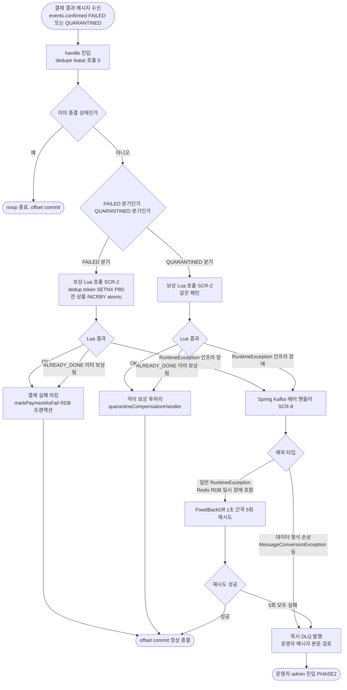

# STOCK-COMPENSATION-RECOVERY — 실행 계획

> 토픽: [STOCK-COMPENSATION-RECOVERY](topics/STOCK-COMPENSATION-RECOVERY.md)
> 채택 결정: [DECISION](topics/STOCK-COMPENSATION-RECOVERY-DECISION.md) §최종 채택 결정 (Round 7)
> 작성일: 2026-05-08
> 라운드: Round 7 (Lua atomic + Kafka native + dedupe lease 폐기)

---

## 요약 브리핑

본 토픽은 결제 결과 보상 (FAILED / QUARANTINED 시 Redis 선차감 캐시 복원) 의 **silent loss 회복 layer** 를 도입한다. 현재 코드의 `compensateStockCache` try/catch 가 INCR 실패를 swallow + dedupe lease 가 8일 잠금 → 영구 발산이 발생할 수 있다. 채택안은 application 측 try/catch + dedupe lease + DLQ publisher 직접 호출을 모두 폐기하고, 회복 책임을 **Lua atomic dedup token** 과 **Spring Kafka `DefaultErrorHandler`** 두 인프라 layer 로 위임한다.

### Task 목록 (10개)

1. **SCR-1** — 선차감 Lua 강화 (`stock_decrement_atomic.lua`). 결제 단위 N개 상품 atomic 차감 + dedup token. 부분 차감 race 도 같이 해소.
2. **SCR-2** — 보상 Lua 신설 (`stock_compensation_atomic.lua`). 결제 단위 N개 상품 atomic 복원 + dedup token.
3. **SCR-3** — 재고 캐시 포트 시그니처 변경 (`StockCachePort` 새 메서드 + 결과 enum 2개) + Fake 갱신.
4. **SCR-4** — Redis 어댑터 (`StockCacheRedisAdapter`) 에 새 메서드 구현 (Lua 로딩 + 결과 enum 변환).
5. **SCR-5** — 결제 트랜잭션 코디네이터 for-loop 제거 + atomic 1회 호출.
6. **SCR-6** — 결제 결과 처리 유스케이스 재작성. `handleFailed` 호출 순서 뒤집기 (보상 먼저, RDB 나중) + try/catch + dedupe lease wrapper 통째로 제거.
7. **SCR-7** — `EventDedupeStore` + `PaymentConfirmDlqPublisher` 두 orphan port + 어댑터 + Fake 폐기 (코드 정리).
8. **SCR-8** — Spring Kafka `DefaultErrorHandler` + `DeadLetterPublishingRecoverer` 빈 신설 (1초 간격 5회 retry + not-retryable 화이트리스트).
9. **SCR-9** — Redis `appendfsync=always` 설정 변경 (AOF 부분 fsync race 완화).
10. **SCR-10** — 통합 시나리오 테스트 (정상 / ALREADY_DONE / retry 5회 후 DLQ / not-retryable 즉시 DLQ / 호출 순서 검증).

### 변경 후 보상 플로우 (전체 경로)



### 핵심 결정 → Task 매핑

| 결정 ID (DECISION §6 핵심 변경) | 매핑 Task | 한 줄 정리 |
|---|---|---|
| D1 선차감 Lua 강화 | SCR-1, SCR-5 | for-loop 부분 차감 race 해소 |
| D2 보상 Lua 신설 | SCR-2 | 보상 멱등 layer 도입 |
| D3 try/catch + wrapper 폐기 | SCR-6 | application 측 retry/DLQ 책임 0 |
| D4 dedupe lease 폐기 | SCR-6, SCR-7 | Lua dedup token 으로 책임 이전 |
| D5 포트 시그니처 변경 | SCR-3, SCR-4, SCR-5 | 결제 단위 atomic 의미 시그니처 |
| D6 호출 순서 뒤집기 | SCR-6, SCR-10 | 보상 먼저, RDB 나중 (silent loss 차단) |
| D7 Spring Kafka 에러 핸들러 | SCR-8 | retry/DLQ 책임을 인프라 bean 으로 |
| D8 Redis appendfsync=always | SCR-9 | AOF race window 완화 |

### 트레이드오프 / 후속 작업

- **받아들이는 trade-off** — Redis throughput 감소 (`appendfsync=always`), DLQ 도착 메시지의 자동 회복 0, Redis cluster 환경 비호환 (단일 노드 가정), Lua N개 키 부하 (N ≤ 10 안전).
- **알려진 한계 7건** (L1~L7) — Redis cluster 비호환 / AOF race window / P8D 만료 race / DLQ admin 도구 부재 / N 부하 / 보상 끝 결제 cascade / `markPaymentAsFail` 영구 실패 cascade. 자세한 내용은 §알려진 한계.
- **PHASE2 (별 토픽)** — `OutboxAsyncConfirmService.compensateStock` 동일 silent loss 패턴 회복, `PaymentTransactionCoordinator.compensateStockCacheGuarded` 동일, DLQ admin 도구, Redis cluster 환경 대응, `@RetryableTopic` non-blocking retry.
- **회귀 surface** — 5 layer (Coordinator / ConfirmResultUseCase / 어댑터 / Fake / 단위·통합 테스트). 포트 시그니처 변경으로 컴파일 깨짐이 회귀를 즉시 감지.

---

## 메타

| 항목 | 값 |
|---|---|
| 서비스 | payment-service |
| 변경 범위 | port → infrastructure → application → Kafka bean 설정 → 인프라 설정 |
| 태스크 총 개수 | 10 |
| domain_risk 태스크 수 | 4 |
| tdd=true 태스크 수 | 8 |

---

## 검증 결과 (plan 단계 선행 확인)

### V1. 단일 노드 Redis 가정 확인

`docker/docker-compose.infra.yml:91` — `redis-stock` 서비스가 단일 스탠드얼론 컨테이너로 선언되어 있음. cluster 설정 없음. multi-key Lua 가정 성립. L1 한계 명시 OK.

### V2. `PaymentEvent.status.isTerminal()` 가드 race window

`PaymentConfirmResultUseCase.java:259, 282` — `handleFailed` / `handleQuarantined` 진입 직후 `isTerminal()` 검사. TX commit 직전 race window:

- **정상 결제 race** (다른 eventUuid + 같은 orderId 가 FAILED 두 번 도착): 첫 번째 진입 → Lua OK + `markPaymentAsFail` TX commit → status=FAILED (isTerminal=true). 두 번째 진입 → `isTerminal=true` → noop. **안전**.
- **crash race** (보상 Lua 후 RDB commit 전 crash): 새 순서(보상 먼저)에서 재배달 시 `isTerminal=false` (TX rollback) → Lua dedup token `ALREADY_DONE` → noop + `markPaymentAsFail` 진행. **안전**.
- **TX commit 직후 / offset commit 전 crash**: `isTerminal=true` → noop → offset commit. **안전**. DECISION §6 crash 표 일치.
- **잔여 window**: `isTerminal=true` 상태에서 Reconciler 가 status 를 PENDING 으로 되돌리는 race — P8D 만료 후만 위험. L3 한계 인정.

### V3. port 시그니처 변경의 5-layer 회귀 surface

| Layer | 파일 / 위치 | 영향 |
|---|---|---|
| Port 인터페이스 | `application/port/out/StockCachePort.java` | `decrement` / `increment` / `rollback` → `decrementAtomic` / `compensateAtomic` + `current` / `findCurrent` / `set` 잔존 |
| Coordinator | `application/usecase/PaymentTransactionCoordinator.java` | `decrementStock` for-loop → `decrementAtomic` 1회 호출 |
| ConfirmResultUseCase | `application/usecase/PaymentConfirmResultUseCase.java` | `compensateStockCache` → `compensateAtomic` 1회 호출 |
| 인프라 어댑터 | `infrastructure/cache/StockCacheRedisAdapter.java` | Lua 스크립트 로딩 + 새 메서드 구현 |
| Fake + 단위 테스트 | `mock/FakeStockCachePort.java`, 관련 테스트 클래스 | 새 시그니처 구현 + 테스트 픽스처 갱신 |

`OutboxAsyncConfirmService.compensateStock` (line 99-119) 과 `PaymentTransactionCoordinator.compensateStockCacheGuarded` (line 168-180) 는 PHASE2 비동기 보상 경로라 **본 토픽 회귀 surface 외**. 이 두 경로는 현재 `stockCachePort.increment` 를 직접 호출하고 있으므로 port 시그니처 변경 후 `increment` 를 유지하거나 별도 처리 필요 — 태스크 SCR-5 에서 정량화.

### V4. Lua 스크립트 단위·통합 테스트 plan

- 단위: Testcontainers Redis (`GenericContainer redis:7.2-alpine`) 위에서 Lua 직접 실행. 기존 `StockCacheRedisAdapterTest` 패턴 재사용.
- 통합: `@SpringBootTest` + Testcontainers Redis + Embedded Kafka. `ConfirmedEventConsumer` → `PaymentConfirmResultUseCase` → `StockCacheRedisAdapter` → Lua 전 경로 검증.
- 멱등성: dedup token SETNX + 두 번째 호출 `ALREADY_DONE` 검증.
- not-retryable 즉시 DLQ: `IllegalArgumentException` throw 시 `DefaultErrorHandler` 가 retry 없이 DLQ 발행 검증.

---

## 태스크 목록

---

### SCR-1. 선차감 Lua 강화 — `stock_decrement_atomic.lua` 신설 ✅

- **결정 ID**: D1
- **tdd**: true
- **domain_risk**: false

**목적**: 현재 `stock_decrement.lua` 는 단일 상품 단위 DECRBY 라 for-loop 호출 → 부분 차감 race 발생한다 (상품 A 차감 후 B 재고 부족 시 A 는 차감된 채로 REJECTED). 결제 단위 N개 상품을 단일 Lua 호출 안에서 atomic 처리하고 dedup token SETNX 로 재진입을 차단한다.

**왜**: Lua 스크립트는 Redis 서버 측에서 단일 스레드로 실행되므로 N개 키를 한 번에 atomic 처리 가능. 기존 for-loop 방식은 Lua 호출 사이에 다른 클라이언트의 쓰기가 끼어들 수 있어 부분 차감이 발생.

**어떻게**:
- `KEYS[1]` = `decrement:done:{orderId}` (dedup token)
- `KEYS[2..N+1]` = `stock:{productId}` (N개)
- `ARGV[1..N]` = 차감 수량 N개
- `ARGV[N+1]` = dedup token TTL (초, P8D = 691200)
- 로직: SETNX dedup token → 이미 있으면 `ALREADY_DONE` 반환 → 모든 상품 재고 GET + 검증 → 하나라도 부족 시 dedup DEL + `INSUFFICIENT` 반환 → 전체 DECRBY + `OK` 반환

**예상 회귀 surface**: `StockCacheRedisAdapter.decrement` 호출부 (Coordinator) + 어댑터 단위 테스트 + 기존 `StockCacheRedisAdapterTest`.

**산출물**:
- `payment-service/src/main/resources/lua/stock_decrement_atomic.lua` ✅
- `payment-service/src/test/java/.../infrastructure/cache/StockDecrementAtomicLuaTest.java` ✅

**완료 결과**: 5개 테스트 전부 PASS (단일_상품_정상_차감_성공 / 재고_부족_시_INSUFFICIENT_반환_및_차감_없음 / 두번째_호출_ALREADY_DONE / 부분_부족_시_전체_미차감 / dedup_token_TTL_설정_확인). 전체 회귀 0.

**테스트 스펙**:

```
클래스: StockDecrementAtomicLuaTest (Testcontainers Redis)

메서드:
- 단일_상품_정상_차감_성공() — KEYS 3개(token, stock1, stock2), 재고 충분 → OK 반환 + 재고 감소
- 재고_부족_시_INSUFFICIENT_반환_및_차감_없음() — stock 부족 → INSUFFICIENT + 기존 재고 보존
- 두번째_호출_ALREADY_DONE() — 동일 orderId 재호출 → ALREADY_DONE
- 부분_부족_시_전체_미차감() — 상품A 재고 충분 + 상품B 부족 → INSUFFICIENT + A 재고 그대로
- dedup_token_TTL_설정_확인() — SETNX 후 TTL 조회 → P8D 범위 내
```

---

### SCR-2. 보상 Lua 신설 — `stock_compensation_atomic.lua` ✅

- **결정 ID**: D2
- **tdd**: true
- **domain_risk**: false

**목적**: 현재 보상 경로는 for-loop `INCRBY` 라 멱등성 layer 가 없어 재배달 시 이중 복원(silent over-restore)이 발생한다. 결제 단위 N개 보상을 단일 Lua atomic + dedup token SETNX 로 묶어 재진입 시 `ALREADY_DONE` 을 반환한다.

**왜**: 보상 Lua 는 선차감 Lua 와 같은 atomic 도구 패턴 — 결제 단위 N개 상품을 한 번에 처리. dedup token key 를 `compensation:done:{orderId}` 로 선차감 token 과 분리해 namespace 충돌 방지.

**어떻게**:
- `KEYS[1]` = `compensation:done:{orderId}` (dedup token)
- `KEYS[2..N+1]` = `stock:{productId}` (N개)
- `ARGV[1..N]` = 복원 수량 N개
- `ARGV[N+1]` = dedup token TTL (초, P8D = 691200)
- 로직: SETNX dedup token → 이미 있으면 `ALREADY_DONE` 반환 → 전체 INCRBY + `OK` 반환

**예상 회귀 surface**: `StockCacheRedisAdapter.increment` 호출부 (ConfirmResultUseCase) + 어댑터 단위 테스트.

**완료 결과**: 5개 테스트 전부 PASS (단일_상품_정상_보상_성공 / 복수_상품_atomic_보상 / 두번째_호출_ALREADY_DONE / 다른_orderId_는_독립적 / dedup_token_TTL_설정_확인). 전체 회귀 0.

**산출물**:
- `payment-service/src/main/resources/lua/stock_compensation_atomic.lua` ✅
- `payment-service/src/test/java/.../infrastructure/cache/StockCompensationAtomicLuaTest.java` ✅

**테스트 스펙**:

```
클래스: StockCompensationAtomicLuaTest (Testcontainers Redis)

메서드:
- 단일_상품_정상_보상_성공() — 재고 0 + INCRBY qty → OK + 재고 증가
- 복수_상품_atomic_보상() — N개 상품 한 번에 복원 → 모두 증가
- 두번째_호출_ALREADY_DONE() — 동일 orderId 재호출 → ALREADY_DONE + 재고 변화 없음
- 다른_orderId_는_독립적() — orderId1 ALREADY_DONE 이어도 orderId2 정상 보상
- dedup_token_TTL_설정_확인() — SETNX 후 TTL 조회 → P8D 범위 내
```

---

<!-- arch-comment: layer 의존 순서 정합. port 인터페이스 / 반환 enum 모두 application/port/out 에 배치 — hexagonal 정합. 단, `StockDecrementAtomicResult` enum 의 패키지를 `application/port/out` 에 명시한 점은 OK 이지만 PLAN 본문에서 enum 의 valueset(OK/ALREADY_DONE/INSUFFICIENT) 만 명시하고 Lua 반환 문자열 → enum 매핑 책임을 어댑터(SCR-4)에 둔다는 점이 SCR-4 본문에 명시되어 있어 layer 책임 분리 정합. -->
### SCR-3. `StockCachePort` 시그니처 변경 + `FakeStockCachePort` 갱신 ✅

- **결정 ID**: D5
- **tdd**: true
- **domain_risk**: false

**목적**: 기존 `decrement(productId, qty)` / `increment(productId, qty)` / `rollback(productId, qty)` 시그니처는 단일 상품 단위라 atomic N개 보장이 불가능하다. `decrementAtomic(orderId, List<PaymentOrder>)` / `compensateAtomic(orderId, List<PaymentOrder>)` 로 변경해 port 계약이 결제 단위 atomic 의미를 갖도록 한다.

**왜**: port 시그니처가 구현 의도를 반영해야 한다. 단일 상품 시그니처는 호출부가 for-loop 을 강요하는 구조. 시그니처 자체가 결제 단위 atomic 을 표현하면 잘못된 for-loop 사용이 컴파일 에러로 차단된다.

**어떻게**:
- `StockCachePort` 에 `decrementAtomic`, `compensateAtomic` 추가. 기존 `decrement`, `increment`, `rollback` 은 **일단 유지** (PHASE2 `OutboxAsyncConfirmService` / `PaymentTransactionCoordinator.compensateStockCacheGuarded` 경로가 아직 의존하므로)
- `FakeStockCachePort` 에 새 메서드 구현 (in-memory ConcurrentHashMap 기반, dedup token 맵 추가)
- 반환 타입: `decrementAtomic` → `StockDecrementAtomicResult` enum (OK / ALREADY_DONE / INSUFFICIENT). `compensateAtomic` → `StockCompensationAtomicResult` enum (OK / ALREADY_DONE) — 호출자가 ALREADY_DONE 분기를 인지 가능하도록 enum 으로 노출 (실패 시 RuntimeException 전파)

**예상 회귀 surface**: FakeStockCachePort 를 사용하는 기존 테스트 4개 (`PaymentConfirmResultUseCaseHandleFailedTest` 등) — 새 메서드 추가이므로 기존 테스트 컴파일 깨짐 없음.

**산출물**:
- `payment-service/src/main/java/.../application/port/out/StockCachePort.java` (메서드 추가)
- `payment-service/src/main/java/.../application/port/out/StockDecrementAtomicResult.java` (신규 enum)
- `payment-service/src/main/java/.../application/port/out/StockCompensationAtomicResult.java` (신규 enum)
- `payment-service/src/test/java/.../mock/FakeStockCachePort.java` (새 메서드 구현)

**완료 결과**: 5개 테스트 전부 PASS (decrementAtomic_정상_차감_성공 / decrementAtomic_재고_부족 / decrementAtomic_중복_orderId / compensateAtomic_정상_보상 / compensateAtomic_중복_orderId). `StockDecrementAtomicResult` / `StockCompensationAtomicResult` enum 신설. `StockCachePort` 에 `decrementAtomic` / `compensateAtomic` 추가. `StockCacheRedisAdapter` 에 SCR-4 구현 예정 stub 추가. 전체 회귀 380 PASS.

**테스트 스펙**:

```
클래스: FakeStockCachePortAtomicTest

메서드:
- decrementAtomic_정상_차감_성공() — orderId + 2개 상품 → OK + 재고 감소
- decrementAtomic_재고_부족() — stock 0 → INSUFFICIENT + 재고 불변
- decrementAtomic_중복_orderId() — 동일 orderId 재호출 → ALREADY_DONE
- compensateAtomic_정상_보상() — 재고 증가 + OK 반환
- compensateAtomic_중복_orderId() — 동일 orderId 재호출 → ALREADY_DONE 반환 + 재고 불변
```

---

### SCR-4. `StockCacheRedisAdapter` 새 메서드 구현 ✅

- **결정 ID**: D5
- **tdd**: true
- **domain_risk**: false

**목적**: port 에 추가된 `decrementAtomic` / `compensateAtomic` 의 Redis 구현체를 작성한다. SCR-1/2 에서 만든 Lua 스크립트를 로딩해 `DefaultRedisScript` 로 실행한다.

**왜**: infrastructure layer 가 port 계약을 구현. 기존 `DECREMENT_SCRIPT` 정적 초기화 패턴을 동일하게 사용해 일관성 유지.

**어떻게**:
- `DECREMENT_ATOMIC_SCRIPT` — `stock_decrement_atomic.lua` 로딩, 결과 타입 `String`
- `COMPENSATION_ATOMIC_SCRIPT` — `stock_compensation_atomic.lua` 로딩, 결과 타입 `String`
- `decrementAtomic(orderId, List<PaymentOrder>)` — KEYS 구성 (`decrement:done:{orderId}` + `stock:{productId}` N개) + ARGV 구성 (qty N개 + TTL) → Lua 실행 → 결과 enum 변환
- `compensateAtomic(orderId, List<PaymentOrder>)` — KEYS 구성 (`compensation:done:{orderId}` + `stock:{productId}` N개) + ARGV 구성 → Lua 실행 → 결과 enum 변환 (OK / ALREADY_DONE). RuntimeException 은 그대로 전파

**예상 회귀 surface**: `StockCacheRedisAdapterTest` 신규 케이스 추가. 기존 `decrement` / `increment` 테스트 그대로 유지.

**완료 결과**: 5개 신규 테스트 PASS (decrementAtomic_2개_상품_정상_차감 / decrementAtomic_재고_부족_INSUFFICIENT / decrementAtomic_중복_ALREADY_DONE / compensateAtomic_2개_상품_정상_복원 / compensateAtomic_중복_ALREADY_DONE). 기존 5개 포함 총 10개 PASS. 전체 회귀 0. `DECREMENT_ATOMIC_SCRIPT` / `COMPENSATION_ATOMIC_SCRIPT` 정적 초기화, `buildDecrementKeys` / `buildCompensationKeys` / `buildArgv` private 메서드로 KEY·ARGV 구성 분리.

**산출물**:
- `payment-service/src/main/java/.../infrastructure/cache/StockCacheRedisAdapter.java` (메서드 추가)
- `payment-service/src/test/java/.../infrastructure/cache/StockCacheRedisAdapterTest.java` (신규 케이스 추가)

**테스트 스펙**:

```
클래스: StockCacheRedisAdapterTest (기존 파일, 케이스 추가)

추가 메서드:
- decrementAtomic_2개_상품_정상_차감() — orderId + 상품2개 → OK
- decrementAtomic_재고_부족_INSUFFICIENT() — 재고 1 수량 5 요청 → INSUFFICIENT + 재고 불변
- decrementAtomic_중복_ALREADY_DONE() — 동일 orderId 재호출 → ALREADY_DONE
- compensateAtomic_2개_상품_정상_복원() — orderId + 상품2개 → 재고 증가 + OK 반환
- compensateAtomic_중복_ALREADY_DONE() — 동일 orderId 재호출 → ALREADY_DONE 반환 + 재고 불변
```

---

<!-- arch-comment: SCR-5 / SCR-6 가 SCR-3 (port) + SCR-4 (adapter) 완료 후라는 의존 그래프 명시 OK. application → port → infrastructure 의존 방향 정합. `decrementStock(orderId, list)` 시그니처에 orderId 추가는 application 안 변경이라 layer 추가 영향 0 — OutboxAsyncConfirmService 호출부 동시 수정도 application/application 동일 layer. -->
### SCR-5. `PaymentTransactionCoordinator.decrementStock` — for-loop 제거 + atomic 1회 호출 ✅

- **결정 ID**: D1, D5
- **tdd**: true
- **domain_risk**: true

**목적**: 현재 `decrementStock(List<PaymentOrder>)` 가 for-loop 으로 단일 상품씩 `stockCachePort.decrement` 를 호출해 부분 차감 race 가 발생한다. `stockCachePort.decrementAtomic(orderId, paymentOrderList)` 1회 호출로 교체해 결제 단위 atomic 을 보장한다.

**왜**: DECISION §1 결정 D1 — 선차감 부분 차감 race 해소. 3개 상품 중 2개 차감 후 3번째 재고 부족 시 기존 코드는 앞 2개가 차감된 채로 REJECTED 리턴 → 재고 발산. 새 Lua 는 INSUFFICIENT 시 dedup token 도 지우므로 재시도 가능.

**어떻게**:
- `decrementSingleStock` private 메서드 제거
- `decrementStock` 메서드 body: `StockDecrementAtomicResult result = stockCachePort.decrementAtomic(orderId, paymentOrderList)` → 결과 enum 분기
- `OK` → `StockDecrementResult.SUCCESS`
- `INSUFFICIENT` → `StockDecrementResult.REJECTED`
- `ALREADY_DONE` → `StockDecrementResult.SUCCESS` — **도메인 의미**: 동일 `orderId` 의 차감 dedup token 이 P8D 안에 살아 있는 경우. 정상 흐름에서는 결제 1건 = `orderId` 1건 = `decrementAtomic` 1회 호출이라 발생 가능성 매우 낮다. 단 보상까지 끝난 결제가 새 confirm 사이클로 재진입하는 cascade 가 §알려진 한계 L6 으로 인정됨 (재고 발산 가능성, 매우 낮은 확률).
- RuntimeException → `StockDecrementResult.CACHE_DOWN` (기존 catch 유지)
- **단, `orderId` 파라미터 추가 필요** — `decrementStock(String orderId, List<PaymentOrder> paymentOrderList)` 시그니처 변경 → 호출부 (`OutboxAsyncConfirmService.java:57`) 도 함께 수정

**예상 회귀 surface**: `PaymentTransactionCoordinatorTest`, `OutboxAsyncConfirmService` 호출부. `decrementStock` 시그니처 변경이므로 컴파일 에러로 회귀 즉시 감지.

**완료 결과**: 4개 케이스 PASS (decrementStock_정상_차감_OK / decrementStock_재고_부족_REJECTED / decrementStock_ALREADY_DONE_은_SUCCESS / decrementStock_Redis_예외_CACHE_DOWN). `decrementSingleStock` private 메서드 제거, `decrementStock(String orderId, List<PaymentOrder>)` 시그니처 변경, `stockCachePort.decrementAtomic` 1회 호출, ALREADY_DONE → SUCCESS 매핑 (도메인 의미: L6 한계 인정). `OutboxAsyncConfirmService.java:57` 호출부 `orderId` 전달 추가. 전체 회귀 386 PASS.

**산출물**:
- `payment-service/src/main/java/.../application/usecase/PaymentTransactionCoordinator.java`
- `payment-service/src/main/java/.../application/OutboxAsyncConfirmService.java` (호출부 `orderId` 전달 추가)
- `payment-service/src/test/java/.../application/usecase/PaymentTransactionCoordinatorTest.java` (시그니처 갱신 + 새 케이스)

**테스트 스펙**:

```
클래스: PaymentTransactionCoordinatorTest (기존 파일, 시그니처 갱신 + 케이스 추가)

추가 / 변경 메서드:
- decrementStock_정상_차감_OK() — FakeStockCachePort 사용 → SUCCESS
- decrementStock_재고_부족_REJECTED() — Fake INSUFFICIENT → REJECTED
- decrementStock_ALREADY_DONE_은_SUCCESS() — 멱등 재시도 → SUCCESS (재고 변화 없음)
- decrementStock_Redis_예외_CACHE_DOWN() — Mockito throw RuntimeException → CACHE_DOWN
```

---

### SCR-6. `PaymentConfirmResultUseCase` — 보상 경로 재작성 (호출 순서 뒤집기 + wrapper 제거)

- **결정 ID**: D3, D4, D6
- **tdd**: true
- **domain_risk**: true

**목적**:
1. `handleFailed` / `handleQuarantined` 안에서 **보상 Lua 먼저, `markPaymentAsFail` 나중** 으로 순서 뒤집기 (D6).
2. `compensateStockCache` for-loop + try/catch 제거 → `compensateAtomic` 1회 호출로 교체 (D3).
3. `processMessageWithLeaseGuard` wrapper + `handleRemoveOnFailure` 통째로 제거. `handle` 메서드는 `processMessage(message)` 1줄 (D3, D4).

**왜**: DECISION §6 crash 표 — 현재 순서(`markPaymentAsFail` → 보상)는 RDB commit 직후 / 보상 직전 crash 시 `isTerminal=true` 가 재배달을 noop 종결 → 보상 누락 silent loss. 새 순서(보상 → RDB)는 모든 crash 지점에서 재배달 시 정합 보장. wrapper 제거로 dedupe lease 의존 0.

**어떻게**:

`handleFailed` — **호출 순서 뒤집기** (현재: `markPaymentAsFail` → `compensateStockCache`. 새: 보상 → RDB):
```
1. isTerminal 가드 (기존 그대로)
2. stockCachePort.compensateAtomic(orderId, paymentOrderList)  -- 먼저 (이전: 마지막)
3. paymentCommandUseCase.markPaymentAsFail(...)                -- 나중 (이전: 먼저)
```

`handleQuarantined` — **기존 순서 유지** (현 코드 line 281-298 가 이미 보상 → quarantineHandler 순서). 본 태스크에서는 try/catch + `compensateStockCache` 메서드 호출 → `compensateAtomic` 직접 호출로 교체만 수행:
```
1. isTerminal 가드 (기존 그대로)
2. stockCachePort.compensateAtomic(orderId, paymentOrderList)  -- 기존 그대로
3. quarantineCompensationHandler.handle(...)                   -- 기존 그대로
```

> implementer 주의: `handleQuarantined` 는 "순서를 뒤집는" 게 아니라 "메서드만 교체" 한다. 두 분기를 같은 어휘로 묶어 보상 → quarantineHandler 외 순서로 변경하면 PITFALLS #11 보상 트랜잭션 중복 진입 race 신설 위험.

`handle`:
```
@Transactional(timeout=5)
public void handle(ConfirmedEventMessage message) {
    processMessage(message);
}
```

`compensateStockCache` 메서드 제거. `processMessageWithLeaseGuard`, `handleRemoveOnFailure` 제거.

생성자에서 `EventDedupeStore`, `PaymentConfirmDlqPublisher`, `leaseTtl`, `longTtl` 파라미터 제거.

**예상 회귀 surface**: 생성자 파라미터 제거 (`EventDedupeStore` / `PaymentConfirmDlqPublisher` / `leaseTtl` / `longTtl`) 시 컴파일 깨지는 테스트 픽스처 일제 갱신:
- `PaymentConfirmResultUseCaseHandleFailedTest` — 재작성 (호출 순서 검증 추가)
- `PaymentConfirmResultUseCaseHandleQuarantinedTest` — 재작성 또는 신규 (`compensateAtomic` 직접 호출 검증)
- `PaymentConfirmResultUseCaseHandleApprovedTest` — 생성자 픽스처만 갱신 (본문 변경 없음)
- `PaymentConfirmResultUseCaseIdempotencyGuardTest` — lease 의존 제거로 재작성 (또는 본 토픽 후 의미 없으면 삭제)
- `PaymentConfirmResultUseCaseTwoPhaseLeaseTest` — 삭제
- `ConfirmedEventConsumerTest` — 생성자 픽스처 갱신 (Fake dedupe / DLQ publisher 주입 제거)

**산출물**:
- `payment-service/src/main/java/.../application/usecase/PaymentConfirmResultUseCase.java`
- `payment-service/src/test/java/.../application/usecase/PaymentConfirmResultUseCaseHandleFailedTest.java` (재작성)
- `payment-service/src/test/java/.../application/usecase/PaymentConfirmResultUseCaseHandleQuarantinedTest.java` (재작성 or 신규)
- `payment-service/src/test/java/.../application/usecase/PaymentConfirmResultUseCaseHandleApprovedTest.java` (생성자 픽스처 갱신)
- `payment-service/src/test/java/.../application/usecase/PaymentConfirmResultUseCaseIdempotencyGuardTest.java` (재작성 — lease 의존 제거)
- `payment-service/src/test/java/.../application/usecase/PaymentConfirmResultUseCaseTwoPhaseLeaseTest.java` (삭제)
- `payment-service/src/test/java/.../infrastructure/messaging/consumer/ConfirmedEventConsumerTest.java` (생성자 픽스처 갱신)

**테스트 스펙**:

```
클래스: PaymentConfirmResultUseCaseHandleFailedTest (재작성)

메서드:
- FAILED_수신_보상_먼저_RDB_나중_호출순서() — Mockito InOrder: compensateAtomic → markPaymentAsFail
- FAILED_이미_종결_noop() — isTerminal=true → compensateAtomic 미호출
- FAILED_보상_ALREADY_DONE_이어도_RDB_진행() — compensateAtomic → ALREADY_DONE → markPaymentAsFail 호출됨
- FAILED_보상_RuntimeException_전파() — compensateAtomic throw → handle 전파 (markPaymentAsFail 미호출)

클래스: PaymentConfirmResultUseCaseHandleQuarantinedTest (재작성)

메서드:
- QUARANTINED_보상_먼저_quarantineHandler_나중() — InOrder 검증
- QUARANTINED_이미_종결_noop()
- QUARANTINED_보상_RuntimeException_전파()
```

---

<!-- arch-comment: 호출 순서 뒤집기는 application use case 안 변경. domain / port / infrastructure 어느 layer 도 추가 영향 없음 — 누락 layer 0. wrapper(processMessageWithLeaseGuard / handleRemoveOnFailure) 제거로 application 가 retry/DLQ 책임을 infrastructure(Spring Kafka DefaultErrorHandler, SCR-8) 로 위임하는 구조는 hexagonal 정합 (인프라 관심사를 인프라로). 다만 SCR-6 의 결과로 application 이 PaymentConfirmDlqPublisher port 의존을 잃는 점이 SCR-7 의 폐기 대상에 명시되어야 함 — `PaymentConfirmDlqPublisher` port + `PaymentConfirmDlqKafkaPublisher` adapter 는 본 PLAN 의 SCR-7 에서 폐기 대상으로 들어있지 않다. SCR-6 본문 마지막에 "생성자에서 PaymentConfirmDlqPublisher 파라미터 제거" 가 명시되어 있으나 port/adapter 자체의 운명(다른 사용처 0이면 SCR-7 에 합류, 다른 사용처 있으면 명시)이 PLAN 에 빠져 있음. critic 라운드에서 사용처 grep 후 SCR-7 합류 또는 별 태스크 분리를 결정할 것. -->
### SCR-7. `EventDedupeStore` + `PaymentConfirmDlqPublisher` port/adapter 폐기 — 의존 코드 정리

- **결정 ID**: D4, D7
- **tdd**: false
- **domain_risk**: false

**목적**: dedupe lease (`markWithLease` / `extendLease` / `remove`) 가 Lua dedup token 으로, DLQ 발행이 SCR-8 의 `DefaultErrorHandler` + `DeadLetterPublishingRecoverer` 로 각각 책임 이전되어 두 port 가 불필요해졌다. SCR-6 에서 이미 `PaymentConfirmResultUseCase` 의 의존을 제거했으므로 main 사용처 0 인 orphan port 정리 태스크.

**왜**: 사용처가 0 인 port 는 코드베이스에서 제거해야 오해를 막는다. `DECISION §3.3 폐기` 목록 이행. 두 port 는 같은 SCR-6 의존 제거 결과로 함께 사용처 0 이 되므로 한 태스크에서 묶음 정리.

**어떻게**:
- `EventDedupeStore` / `PaymentConfirmDlqPublisher` 두 port + 어댑터 + Fake 삭제 전 `grep` 으로 잔여 사용처 전수 확인 (production / test 모두)
- `application.yml` 의 `payment.event-dedupe.*` 설정 키 제거
- Spring bean wiring 에서 `EventDedupeStoreRedisAdapter` / `PaymentConfirmDlqKafkaPublisher` 의존 자동 제거 (Spring 이 빈 자동 폐기)

**산출물**:
- `application/port/out/EventDedupeStore.java` 삭제
- `infrastructure/dedupe/EventDedupeStoreRedisAdapter.java` 삭제
- `mock/FakeEventDedupeStore.java` 삭제
- `infrastructure/dedupe/EventDedupeStoreRedisAdapterTest.java` 삭제
- `application/port/out/PaymentConfirmDlqPublisher.java` 삭제 (orphan port — SCR-8 인프라 bean 이 책임 흡수)
- `infrastructure/messaging/publisher/PaymentConfirmDlqKafkaPublisher.java` 삭제
- `mock/FakePaymentConfirmDlqPublisher.java` 삭제
- `application.yml` — `payment.event-dedupe.*` 키 제거

---

<!-- arch-comment: `infrastructure/config` 패키지 배치 정합 — 기존 `KafkaMessageConverterConfig` / `KafkaProducerConfig` / `KafkaTopicConfig` 와 동일 layer. application 의 try/catch 책임을 인프라 bean 으로 옮기는 방향이 hexagonal 정합 (인프라 관심사 외부화). -->
### SCR-8. Spring Kafka `DefaultErrorHandler` bean 신설 — `KafkaErrorHandlerConfig`

- **결정 ID**: D7
- **tdd**: true
- **domain_risk**: false

**목적**: 현재 application 코드가 `try/catch` + `paymentConfirmDlqPublisher` 직접 호출로 retry / DLQ 를 관리한다. `DefaultErrorHandler` + `DeadLetterPublishingRecoverer` + `FixedBackOff` bean 을 선언해 retry / DLQ 정책을 Spring Kafka 인프라로 위임한다.

**왜**: application 코드 throw 만 — retry 정책, DLQ 발행, not-retryable 분기를 모두 bean 설정 1개로 응축. 운영자가 retry 횟수 / 간격을 yml 로 조정 가능.

**어떻게**:
```java
@Configuration
public class KafkaErrorHandlerConfig {

    @Bean
    public DefaultErrorHandler kafkaErrorHandler(KafkaTemplate<String, String> kafkaTemplate) {
        DeadLetterPublishingRecoverer recoverer = new DeadLetterPublishingRecoverer(kafkaTemplate);
        FixedBackOff backoff = new FixedBackOff(backoffInterval, maxAttempts);
        DefaultErrorHandler handler = new DefaultErrorHandler(recoverer, backoff);
        handler.addNotRetryableExceptions(
            MessageConversionException.class,
            IllegalArgumentException.class,
            IllegalStateException.class
        );
        return handler;
    }
}
```

- `@Value("${payment.kafka.error-handler.backoff.interval:1000}")` + `@Value("${payment.kafka.error-handler.backoff.max-attempts:5}")`
- `application.yml` 에 default 값 명시
- `@ConditionalOnProperty(name = "spring.kafka.bootstrap-servers")` 추가 — 테스트 환경 제외
- `KafkaMessageConverterConfig` 와 같은 `infrastructure/config` 패키지 배치

**예상 회귀 surface**: `KafkaMessageConverterConfig` 와 동일 패키지 — 기존 Kafka 설정 충돌 없음 확인 필요.

**산출물**:
- `payment-service/src/main/java/.../infrastructure/config/KafkaErrorHandlerConfig.java`
- `payment-service/src/main/resources/application.yml` (설정 키 추가)
- `payment-service/src/test/java/.../infrastructure/config/KafkaErrorHandlerConfigTest.java`

**테스트 스펙**:

```
클래스: KafkaErrorHandlerConfigTest (단위, Mock KafkaTemplate)

메서드:
- errorHandler_빈_생성_성공()
- not_retryable_예외_목록_포함_확인() — MessageConversionException / IllegalArgumentException / IllegalStateException
- backoff_설정값_반영() — interval=1000, maxAttempts=5
```

---

### SCR-9. Redis `appendfsync=always` 설정 변경 — `docker-compose.infra.yml`

- **결정 ID**: D8
- **tdd**: false
- **domain_risk**: false

**목적**: 현재 `redis-stock` 컨테이너가 `--appendfsync everysec` 로 설정되어 최대 1초 race window 가 존재한다. `--appendfsync always` 로 변경해 Lua 안 SETNX + DECRBY/INCRBY 의 부분 fsync race 를 거의 0 으로 만든다.

**왜**: DECISION L2 — Lua 실행 도중 Redis crash + AOF 부분 fsync 시 SETNX 만 디스크 반영되고 차감/보상이 누락될 수 있다. `always` 는 매 명령 fsync 라 race window = 디스크 latency 수준. throughput 감소 trade-off 인정.

**어떻게**:
- `docker/docker-compose.infra.yml` 의 `redis-stock` 서비스 `command` 에서 `"everysec"` → `"always"` 변경
- 변경 후 컨테이너 재기동 필요 (컨테이너 재생성 — 개발 환경 인지)
- **profile 적용 범위**: 단일 docker-compose 가정 본 토픽 L1 과 정합. dev / test / benchmark 모두 동일 적용. 벤치마크 측정 시 `everysec` 비교가 필요하면 별 docker-compose override 로 PHASE2 처리

**산출물**:
- `docker/docker-compose.infra.yml` — `--appendfsync always` 변경

---

### SCR-10. 통합 시나리오 테스트 — 보상 플로우 end-to-end 검증

- **결정 ID**: D1, D2, D3, D4, D6, D7
- **tdd**: true
- **domain_risk**: true

**목적**: SCR-1~9 변경이 통합된 결제 결과 보상 플로우를 Testcontainers Redis + Embedded Kafka 환경에서 검증한다. DECISION §시나리오 커버 표의 핵심 7개 시나리오를 테스트로 코드화한다.

**왜**: 단위 테스트로는 `ConfirmedEventConsumer` → `PaymentConfirmResultUseCase` → `StockCacheRedisAdapter` → Lua 전 경로의 통합이 보장되지 않는다. Spring Kafka `DefaultErrorHandler` 의 retry / DLQ 거동도 통합 컨텍스트에서 검증이 필요.

**범위 제한 (알려진 한계 cross-ref)**:
- L3 (P8D 만료 후 Reconciler resetToReady race) — 본 통합 테스트 범위 밖, 알려진 한계로 인정
- L6 (보상 끝난 결제의 새 confirm 사이클 cascade) — 매우 낮은 확률 도메인 cascade, 본 통합 테스트 범위 밖
- L7 (`markPaymentAsFail` 영구 실패 cascade) — PG 멱등성으로 일반적으로 차단되는 이론적 cascade, 본 통합 테스트 범위 밖

**어떻게**:
- `@SpringBootTest` + `@EmbeddedKafka` (또는 Testcontainers Kafka) + Testcontainers Redis
- `@Tag("integration")` 태그
- `KafkaTemplate` 로 `events.confirmed` 직접 발행 → `PaymentConfirmResultUseCase` 경유 → Redis 재고 검증

**예상 회귀 surface**: 기존 통합 테스트 없으면 신규. 기존 있으면 시나리오 추가.

**산출물**:
- `payment-service/src/test/java/.../integration/StockCompensationRecoveryIntegrationTest.java`

**테스트 스펙**:

```
클래스: StockCompensationRecoveryIntegrationTest

메서드:
- 정상_FAILED_보상_플로우_재고_복원() — events.confirmed FAILED 수신 → compensateAtomic OK → markPaymentAsFail → 재고 원복 확인
- 보상_ALREADY_DONE_재배달_멱등() — 동일 orderId 두 번 수신 → 두 번째는 noop → 재고 한 번만 복원
- RuntimeException_시_retry_5회_후_DLQ() — Redis 연결 실패 stub → FixedBackOff 5회 → DLQ 토픽 발행 확인
- not_retryable_IllegalArgumentException_즉시_DLQ() — IllegalArgumentException → 즉시 DLQ (retry 0)
- 호출_순서_검증_보상_먼저_RDB_나중() — compensateAtomic 호출 시점이 markPaymentAsFail 호출 시점보다 선행
```

---

## 태스크 의존 그래프

```
SCR-1 (decrement Lua)
SCR-2 (compensation Lua)
        |
SCR-3 (port 시그니처 + Fake)
        |
SCR-4 (어댑터 구현)  <-- SCR-1, SCR-2 완료 후
        |
SCR-5 (Coordinator 호출부) <-- SCR-3, SCR-4 완료 후
SCR-6 (ConfirmResultUseCase 재작성) <-- SCR-3, SCR-4 완료 후
        |
SCR-7 (lease 폐기 정리) <-- SCR-6 완료 후
SCR-8 (KafkaErrorHandlerConfig) <-- SCR-6 완료 후 (handle이 예외 throw 해야 동작)
SCR-9 (Redis appendfsync) <-- 독립 (언제든 적용 가능)
        |
SCR-10 (통합 테스트) <-- SCR-1~9 완료 후
```

**병렬 가능**:
- SCR-1 + SCR-2 (Lua 스크립트 2개)
- SCR-3 이후 SCR-5 + SCR-6 (Coordinator / ConfirmResultUseCase 독립 파일)
- SCR-7 + SCR-8 + SCR-9 (SCR-6 완료 후 병렬)

---

## discuss 리스크 → 태스크 교차 참조

| 리스크 ID | 내용 | 대응 태스크 |
|---|---|---|
| 시나리오 2 (silent loss) | INCR 실패 swallow → dedupe 8일 잠금 → 영구 발산 | SCR-6 (try/catch 제거 + 예외 throw) + SCR-8 (DefaultErrorHandler retry) |
| 시나리오 3a (INCR 후 crash → 이중 복원) | TX rollback 후 재배달 → isTerminal=false → INCR 두 번 | SCR-2 (dedup token) + SCR-6 (ALREADY_DONE noop) |
| 시나리오 3b (rebalance window race) | extendLease 후 commit 전 crash → 8일 잠금 → Reconciler resetToReady → 새 eventUuid → 이중 복원 | SCR-2 (orderId 단위 dedup → 새 eventUuid 도 차단) |
| 선차감 부분 차감 race | for-loop 중간 재고 부족 시 앞 차감 살아있음 | SCR-1 (atomic N개) + SCR-5 (Coordinator 단일 호출) |
| 호출 순서 silent loss | RDB commit 직후 crash → isTerminal=true → 보상 누락 | SCR-6 (호출 순서 뒤집기) + SCR-10 (통합 검증) |
| Redis 일시 장애 retry | 1초 떨림 시 재시도 없이 발산 | SCR-8 (FixedBackOff 1초 5회) |
| 데이터 형식 손상 메시지 즉시 DLQ | retry 해도 동일 실패 → 재고 영구 잠금 | SCR-8 (not-retryable 화이트리스트) |
| Redis AOF 부분 fsync race | SETNX 후 DECRBY 전 crash → SETNX만 디스크 박힘 | SCR-9 (appendfsync=always) |

---

## 알려진 한계 (인용 — DECISION §알려진 한계)

본 토픽이 받아들이는 trade-off. 구현 중 아래 한계를 해소하는 코드를 작성하지 않는다.

**L1. Redis cluster 환경에서 multi-key Lua 사용 불가**
Lua 한 번 호출 안에서 여러 키를 다루려면 same hash slot 이어야 하는데, 글로벌 상품 키 (`stock:{productId}`) 들은 결제 단위로 hash tag 묶을 수 없음. 본 채택은 단일 노드 Redis 가정 위에서 성립. cluster 도입 시 별 토픽.

**L2. Redis crash + AOF 부분 fsync race window**
`appendfsync=always` 로 완화하지만 디스크 latency 수준의 race window 는 남는다. throughput 감소 trade-off 인정.

**L3. Lua dedup token TTL (P8D) 만료 후 재진입 race**
P8D 후 같은 orderId 로 새 메시지 도착 시 dedup token 만료라 새 SETNX 박힘. Reconciler 가 PaymentEvent.status 를 다시 PENDING/IN_PROGRESS 로 돌려놓는 race 시만 위험. 매우 드뭄, 알려진 한계 인정.

**L4. DLQ 메시지의 admin 처리 책임 — PHASE2**
DLQ 진입한 메시지는 자동 회복 0. 운영자 admin 도구 (DLQ 조회 / 수동 재처리 / 강제 종결) 는 PHASE2.

**L5. 결제 항목 수 N 부하**
Lua 명령 수는 항목 수 N 에 비례. N ≤ 10 까지는 안전. N 이 그 이상으로 커지는 경우 application 단 항목 수 상한 검증 또는 Lua 분할 등 별 토픽 후속 결정.

**L6. 보상 끝난 결제의 새 confirm 사이클 cascade**
P8D 안에서 동일 `orderId` 의 `decrement:done` + `compensation:done` dedup token 이 둘 다 박힌 상태에서 새 confirm 사이클이 진입하는 cascade. SCR-5 의 `ALREADY_DONE → SUCCESS` 매핑 + `handleApproved` 가 `compensateAtomic` 미호출이므로 redis 재고는 보상으로 +1 잔존 + product RDB 차감 → 발산 가능. 정상 흐름에서는 결제 1건 = `orderId` 1건 = `decrementAtomic` 1회라 발생 가능성 매우 낮으며, Reconciler resetToReady + 벤더가 재confirm 시 다른 결과를 반환하는 매우 드문 cascade. 본 토픽 단독 결정 범위 밖, 알려진 한계 인정. (Round 1 Domain D1 흡수)

**L7. `markPaymentAsFail` 영구 실패 → DLQ → Reconciler resetToReady → 새 confirm 사이클 cascade**
새 호출 순서 (보상 → `markPaymentAsFail`) 에서 보상 Lua OK + `markPaymentAsFail` 영구 실패 (RDB 다운 / deadlock) → SCR-8 retry 5회 후 DLQ + offset commit → Reconciler 가 IN_PROGRESS 결제를 resetToReady → 새 confirm 사이클 진입 → 벤더가 재confirm 시 APPROVED 회신 가능 → product RDB 차감 + redis 재고는 보상 +1 잔존 → 발산 가능. PG 멱등성 (idempotency-key=`orderId`) 으로 벤더가 일반적으로 같은 결과 반환하나 이론적 가능성 인정. 본 토픽 trade-off, PHASE2 admin 도구 또는 자동 QUARANTINED fallback 별 토픽 결정. (Round 1 Domain D2 흡수)

---

## PHASE2 (본 토픽 non-goal)

본 토픽 완료 후 별 토픽에서 처리:

- `OutboxAsyncConfirmService.compensateStock` (line 99-119) — 같은 silent loss 패턴, 동일 Lua atomic 모델 재사용 가능 (STOCK-COMPENSATION-OTHER-PATHS)
- `PaymentTransactionCoordinator.compensateStockCacheGuarded` (line 168-180) — 동일
- DLQ admin 도구 — DLQ 토픽 조회 / 수동 재처리 / 강제 종결
- Redis cluster 환경 대응 — hash tag 글로벌 묶음 또는 항목 단위 RDB outbox 회복
- `@RetryableTopic` non-blocking retry — production-grade 에서 partition lag 0 보장 시

---

## 아키텍처 검토 노트 (plan 단계, light)

**판정**: 통과 — 10개 태스크 layer 의존 정합, port 위치 hexagonal 정합, 누락 layer 0.

**확인 항목**:
- layer 의존 순서: Lua resource (SCR-1/2) → port + Fake (SCR-3) → adapter (SCR-4) → application use case (SCR-5/6) → port/adapter 폐기 정리 (SCR-7) → infrastructure config bean (SCR-8) → 인프라 yml (SCR-9) → 통합 (SCR-10). 거꾸로 가는 의존 0.
- port 위치: `StockCachePort.decrementAtomic` / `compensateAtomic` + `StockDecrementAtomicResult` enum 모두 `application/port/out` — hexagonal 정합.
- 신설 컴포넌트: Lua 스크립트 = `payment-service/src/main/resources/lua/` (기존 `stock_decrement.lua` 와 동일 위치), `KafkaErrorHandlerConfig` = `infrastructure/config` (기존 Kafka 설정 bean 들과 동일 패키지) — 정합.
- TDD 가능성: 모든 태스크가 단위 또는 통합 layer 에서 테스트 가능 (Testcontainers Redis / Mockito / Embedded Kafka).

**Round 1 critic + domain 라운드 흡수 결과** (보류 사항 → 결정):
1. ~~`PaymentConfirmDlqPublisher` port + adapter 운명~~ → Round 1 critic C1 흡수: SCR-7 산출물에 port + adapter + Fake 3개 추가 + §결정 ID 에 D7 추가.
2. ~~SCR-9 profile 분기 필요 여부~~ → Round 1 critic C3 + domain D5 흡수: SCR-9 §어떻게 에 "단일 docker-compose 가정 본 토픽 L1 과 정합, dev/test/benchmark 동일 적용. 벤치마크 비교 필요 시 별 override PHASE2 처리" 결정 명시.
3. Round 1 critic C2 흡수: SCR-6 산출물 + 회귀 surface 에 컴파일 영향 테스트 3건 (`HandleApprovedTest` / `IdempotencyGuardTest` / `ConfirmedEventConsumerTest`) 추가.
4. Round 1 critic C4 흡수: SCR-10 §왜 에 L3 / L6 / L7 cross-ref 추가.
5. Round 1 domain D1 / D2 cascade → §알려진 한계 L6 / L7 으로 인정. PLAN 본문 cascade 차단 layer 추가 안 함 (본 토픽 범위 외).
6. Round 1 domain D3 흡수: SCR-6 본문에서 `handleFailed` (호출 순서 뒤집기) 와 `handleQuarantined` (기존 순서 유지 + 메서드 교체) 분리 기술 + implementer 주의 한 줄 추가.
7. Round 1 domain D4 흡수: SCR-3 의 `compensateAtomic` 반환 타입을 `StockCompensationAtomicResult` enum (OK / ALREADY_DONE) 으로 정밀화 + 산출물에 enum 파일 추가.

---

## 검증 Gate (plan-ready checklist)

- [x] 모든 태스크가 토픽 결정 ID (D1~D8) 로 추적 가능
- [x] 태스크 크기 ≤ 2시간 (Lua 스크립트 + 단위 테스트 묶음 기준)
- [x] tdd/domain_risk 플래그 전체 태스크에 존재
- [x] layer 의존 순서 준수 (port → infrastructure → application → config → 통합)
- [x] discuss 리스크 8개 전부 태스크 매핑 완료
- [x] Fake 구현 (SCR-3) 이 소비자 (SCR-5, SCR-6) 보다 선행
- [x] 알려진 한계 L1~L5 인용
- [x] PHASE2 non-goal 명시
