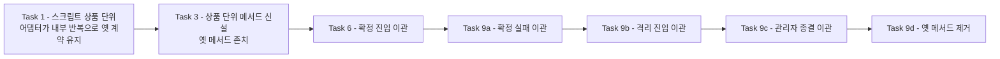
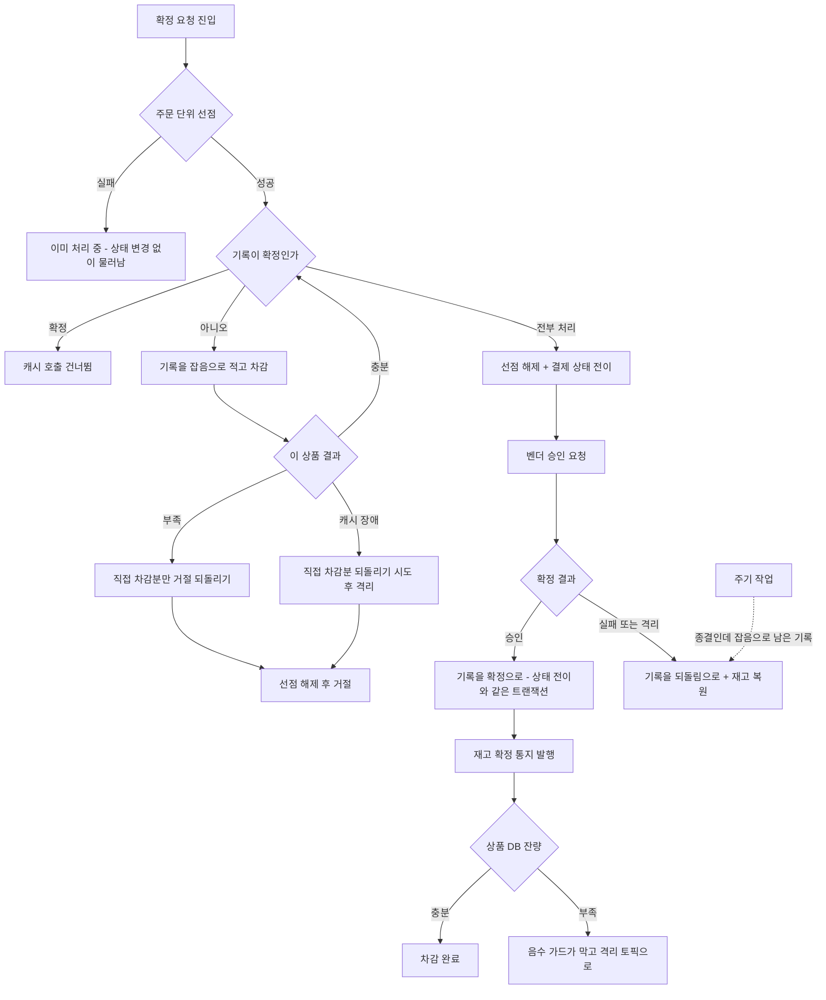

# 재고 선차감 게이트 상품 단위 분해 구현 플랜

> 작성일: 2026-08-17

## 목표

게이트의 원자성 경계가 상품 단위로 내려가고, 부분 차감이 회수되며, 재고 확정에 두 번째 방어선이 서면 끝난다.

## 컨텍스트

- 설계 문서: `docs/topics/STOCK-GATE-PER-PRODUCT.md`
- 이슈·브랜치: #144
- 주요 변경 파일
    - `payment-service/src/main/resources/lua/*.lua` — 스크립트 4종
    - `payment-service/.../application/port/out/StockCachePort.java` , `infrastructure/cache/StockCacheRedisAdapter.java`
    - `payment-service/.../application/usecase/PaymentTransactionCoordinator.java` , `application/OutboxAsyncConfirmService.java`
    - `payment-service/.../application/usecase/PaymentConfirmResultUseCase.java` , `QuarantineResolveUseCase.java`
    - `payment-service/src/main/resources/db/migration/V7__stock_hold_record.sql` (신규, 직전은 V6)
    - `product-service/.../application/usecase/StockCommitUseCase.java` , `infrastructure/config/` (에러 핸들러 신규)
    - `scripts/seed-stock.sh` , `observability/prometheus/rules/`

## 요약 브리핑

### Task 목록

| 묶음 | 태스크 |
|:---:|:---:|
| 게이트 분해 | 1 상품 단위 스크립트와 키 이름 / 2 주문 단위 선점 / 3 상품 단위 포트 메서드 신설 |
| 선차감 기록 | 4 스키마·엔티티·포트 / 5 어댑터(재오픈·확정 보존·사이클 식별) |
| 확정 진입 | 6 선점과 상품 반복과 부분 실패 되돌리기 / 6b 캐시 장애 처리 / 7 확정 행 건너뛰기와 선점 실패 분기 |
| 표시 전환 | 8 승인 시 확정 표시 / 9a 확정 실패 / 9b 격리 진입 / 9c 관리자 종결 / 9d 옛 포트 메서드 제거 |
| 회수 | 10 회수 판정 / 11 주기 작업 |
| 두 번째 방어선 | 12 재고 확정 음수 가드 / 13 격리 토픽과 에러 핸들러 / 14 적체 알람과 대응 분류 |
| 운영과 검증 | 15 시드 키 이름 / 16a 이중 되돌리기 조합 / 16b 동시 중복 확정과 재시도 / 16c 수렴 체인과 정합 / 17 라이브 검증 |

### 포트 전환 순서

한 번에 시그니처를 바꾸면 호출부 넷이 동시에 깨지고 그 자리에 무계획한 임시 코드가 들어간다. 상품 단위 메서드를 추가로 두고 하나씩 옮긴 뒤 옛 메서드를 걷는다.

### 변경 후 전체 플로우

### 핵심 결정 → Task 매핑

| 설계 결정 | Task |
|:---:|:---:|
| 원자성 경계를 상품 단위로 / 키를 상품 기준 해시태그로 | 1 |
| 거절할 때 두 표시를 함께 지운다 | 1, 6 |
| 동시 중복 요청 차단과 선점 해제 방식 | 2, 6, 16b |
| 멱등 토큰을 상품별로 | 1, 3 |
| 선차감 기록 단위·상태값·쓰기 방식·사이클 식별 | 4, 5 |
| 기록·차감 순서 (기록 먼저) | 6 |
| 되돌리기 후보를 직접 차감 성공분으로 한정 | 6, 16b |
| 캐시 장애 판정 | 6b |
| 확정 행 재요청 건너뛰기 / 선점 실패 시 상태 미변경 | 7 |
| 확정 표시 시점 | 8 |
| 되돌리기 방식(흔적 있을 때만) / 기록 닫기 경합 | 9a, 9b, 9c |
| 회수 판정 기준 / 원본 DB 읽기 | 10, 11 |
| 재고 확정 음수 가드 / 예외 분류 | 12, 13 |
| 상품 서비스 소비 실패 처리 / 격리 적재 중복 제거 / 알람 분류 | 13, 14 |
| 키 이름 전환 | 15, 17 |
| 라이브 검증 | 17 |

### 트레이드오프 / 후속 작업

- 캐시 왕복이 주문당 1 회에서 선점 1 + 상품 N + 해제 1 로 는다. Task 17 에서 분해 전후 지연을 재 기준선으로 남긴다
- Task 1 의 브리지는 Task 9d 에서 걷히는 임시 코드다. 그 구간에도 옛 계약을 지키도록 되돌리기를 넣었다
- Task 16a~16c 는 2시간을 넘길 수 있다. 동시성 하네스를 공유하므로 더 쪼개지 않았고, execute 에서 커밋이 커지면 하위 커밋으로 나눈다
- 선점 수명 값, 기록의 사이클 식별 값 형태, 알람 임계값은 구현하며 정한다
- 노드별 묶음 처리는 왕복이 병목으로 드러나면 별도 작업으로

## 진행 상황

- [x] Task 1: 상품 단위 스크립트 4종과 키 이름 규칙
- [x] Task 2: 주문 단위 선점 획득·해제
- [x] Task 3: 캐시 포트와 어댑터를 상품 단위 호출로 재구성
- [x] Task 4: 선차감 기록 스키마·엔티티·포트
- [x] Task 5: 선차감 기록 어댑터 — 재오픈·확정 보존·사이클 식별
- [x] Task 6: 확정 진입 재구성 — 선점, 상품 반복, 부분 실패 되돌리기
- [x] Task 6b: 상품 반복 중 캐시 장애 처리
- [x] Task 7: 확정 행 재요청 건너뛰기와 선점 실패 분기
- [x] Task 8: 승인 반영 트랜잭션에서 확정 표시
- [ ] Task 9a: 확정 실패 경로를 상품 단위로 전환
- [ ] Task 9b: 격리 진입 경로를 상품 단위로 전환
- [ ] Task 9c: 관리자 종결 경로를 상품 단위로 전환
- [ ] Task 9d: 주문 단위 포트 메서드 제거
- [ ] Task 10: 미회수 선차감 회수 판정
- [ ] Task 11: 회수 주기 작업
- [ ] Task 12: 상품 서비스 재고 확정 음수 가드
- [ ] Task 13: 상품 서비스 격리 토픽과 에러 핸들러
- [ ] Task 14: 격리 적체 알람과 대응 분류
- [ ] Task 15: 시드 스크립트 키 이름 전환
- [ ] Task 16a: 이중 되돌리기 조합 검증
- [ ] Task 16b: 동시 중복 확정과 거절 후 재시도 검증
- [ ] Task 16c: 수렴 체인과 정합 검증
- [ ] Task 17: 라이브 검증

## 태스크

### Task 1: 상품 단위 스크립트 4종과 키 이름 규칙 [tdd=true] [domain_risk=true]

**테스트 (RED)**

- `StockCacheRedisAdapterTest` — 상품 하나에 대한 차감이 재고를 줄이고 선차감 표시를 남긴다
- 같은 주문·상품이 다시 들어오면 이미 처리됨을 돌려주고 재고가 더 줄지 않는다
- 재고 부족이면 선차감 표시를 남기지 않고 부족을 돌려준다
- 조건부 되돌리기는 선차감 표시가 있을 때만 재고를 되돌리고, 없으면 되돌리지 않는다
- **거절 전용 되돌리기는 재고를 되돌리면서 선차감 표시와 되돌리기 표시를 둘 다 지운다** — 그 뒤 같은 조합의 차감이 다시 성공한다
- **다중 상품 브리지** — 상품 셋 중 셋째가 부족하면 앞의 둘이 원래 값으로 돌아오고 부족을 반환한다. 옛 스크립트가 주던 "하나라도 부족하면 아무것도 안 줄어든다" 를 반복 층에서 재현한다
- **되돌리기 호출 자체가 예외를 던지면 그 예외가 그대로 전파된다** — 삼키고 부족만 반환하면 안 된다. 이 코드베이스는 재고 보상에서 예외를 삼켜 사고를 낸 이력이 있다
- 키가 상품 기준 해시태그 형태인지 문자열로 단정 (`stock:{상품번호}` / `decrement:done:{상품번호}:주문번호` / `compensation:done:{상품번호}:주문번호`)

**구현 (GREEN)**

- `src/main/resources/lua/` — 기존 3종을 상품 하나만 다루도록 재작성하고, 거절 전용 되돌리기 1종 신규
- 어댑터의 키 조립 상수와 메서드를 새 이름 규칙으로 변경
- **포트 시그니처는 이 태스크에서 건드리지 않는다.** 어댑터가 내부에서 상품별로 반복해 기존 주문 단위 계약을 유지한다 — 포트 전환은 Task 3 부터 점진적으로 한다
- `FakeStockCachePort` 는 이미 전부-아니면-전무를 구현하므로 시맨틱이 바뀌지 않는다 — 그래서 앱 계층 테스트는 어댑터가 깨져도 통과한다. **어댑터 레벨 테스트가 이 구멍을 막는 유일한 수단이다**
- **브리지가 옛 계약을 스스로 지켜야 한다.** 지금 스크립트는 상품 전부를 먼저 검사한 뒤 전부 차감해 "하나라도 부족하면 아무것도 안 줄어든다" 를 보장한다. 상품 단위로 쪼개고 반복만 하면 그 보장이 깨지는데, 이 시점의 호출자는 옛 계약을 믿고 되돌리지 않으며 선차감 기록도 아직 배선 전이라 회수도 못 한다 — **추적 불가능한 누수가 된다.** 어댑터의 반복이 부족을 만나면 이미 차감한 상품을 거절 전용 되돌리기로 되돌린 뒤 부족을 반환한다

**완료 기준**

- 위 테스트 pass, `./gradlew :payment-service:test` 회귀 없음, 호출부 변경 0
- **다중 상품 브리지 계약 테스트** — 상품 셋 중 셋째가 부족하면 앞의 둘이 원래 값으로 돌아오고 부족을 반환한다. 되돌리기까지 실패하면 그 사실이 드러나는 형태로 끝난다

**완료 결과**

- `lua/stock_decrement_atomic.lua` / `stock_compensation_atomic.lua` / `stock_compensation_if_decremented.lua` 를 상품 하나만 다루도록 재작성(KEYS 2~3개, 주문 단위 N+1개 대신). 신규 `lua/stock_reject_compensation.lua` — 거절 전용 되돌리기, 재고를 복원하면서 `decrement:done`/`compensation:done` 표시를 함께 지우고 자체 dedup token 은 두지 않는다(호출자가 이번 요청이 직접 차감한 상품에 한해서만 부르므로)
- 키 이름을 상품 기준 해시태그로 전환 — `stock:{productId}` / `decrement:done:{productId}:orderId` / `compensation:done:{productId}:orderId`
- `StockCacheRedisAdapter` — 포트 시그니처(`decrementAtomic`/`compensateAtomic`/`compensateIfDecremented`, 주문 단위 `orderId + List<PaymentOrder>`)는 그대로 두고, 내부에서 상품별로 단일 상품 스크립트를 반복 호출해 조립. `decrementAtomic` 은 반복 중 부족을 만나면 이번 호출에서 직접 차감에 성공한 상품만(`decrementedThisCall`) 거절 전용 되돌리기로 되돌린 뒤 `INSUFFICIENT` 를 반환 — 이미 처리됨(`ALREADY_DONE`)을 받은 상품은 되돌리기 대상에서 제외. 되돌리기 호출은 try-catch 로 감싸지 않아 예외가 삼켜지지 않고 그대로 전파된다
- 어댑터 레벨 테스트(`StockCacheRedisAdapterTest`, Testcontainers)에 다중 상품 브리지 테스트(3상품 중 셋째 부족 → 앞의 둘 재고·표시 모두 원복) 및 단일 상품 선차감 표시 검증 추가. 되돌리기 예외 전파는 Testcontainers 로 재현하기 어려워 별도 Mockito 기반 `StockCacheRedisAdapterRejectFailureTest` 신설 — `StringRedisTemplate` 을 목으로 대체해 되돌리기 호출 시점에 예외를 주입하고 삼켜지지 않는지 확인
- 신규 raw Lua 테스트 `StockRejectCompensationLuaTest` — 재고 복원 + 두 표시 삭제 + 삭제 후 재차감 성공까지 검증. 기존 `StockDecrementAtomicLuaTest`/`StockCompensationAtomicLuaTest` 는 상품 하나만 다루는 새 KEYS 구조에 맞춰 재작성(다중 상품 전용 케이스는 이제 어댑터 브리지 테스트가 담당하므로 제거)
- 키 형식이 바뀌어 raw redis 키 문자열을 직접 조작하던 기존 통합 테스트 5종(`StockCompensationRecoveryIntegrationTest`/`RedisStockCompensationFailureIntegrationTest`/`StockRetentionIntegrationTest`/`PaymentDuplicateConfirmConcurrencyIntegrationTest`/`StockResyncAdminIntegrationTest`)의 `"stock:" + PRODUCT_ID` 를 `"stock:{" + PRODUCT_ID + "}"` 로 갱신
- `./gradlew :payment-service:test` 628건 전체 pass, checkstyle·spotbugs 클린. 시드 스크립트(`scripts/seed-stock.sh`)는 Task 15 범위라 이번에 건드리지 않음 — 로컬 스택은 이번 커밋 이후 새로 띄우기 전까지 옛 키 이름을 심는다

### Task 2: 주문 단위 선점 획득·해제 [tdd=true] [domain_risk=true]

**테스트 (RED)**

- 선점을 잡으면 성공을 돌려주고, 같은 주문번호로 다시 잡으면 실패를 돌려준다
- 명시적으로 풀면 다시 잡을 수 있다
- 수명이 지나면 풀린다 (짧은 수명으로 단정)
- 다른 주문번호는 서로 막지 않는다

**구현 (GREEN)**

- `lua/` — 선점 획득 스크립트 (수명 부착 선점)
- `StockCachePort` 에 획득·해제 메서드 추가, 어댑터 구현, **`FakeStockCachePort` 갱신**
- 수명 기본값을 설정으로 외부화 (`application.yml`)

**완료 기준**

- 위 테스트 pass, 수명 설정 키가 yml 에 주석과 함께 존재

**완료 결과**

- `lua/stock_order_lock_acquire.lua` 신규 — SETNX + EXPIRE 로 선점 토큰(UUID, 호출마다 새로 발급)을 원자적으로 심는다. `lua/stock_order_lock_release.lua` 신규 — GET 으로 토큰이 일치할 때만 DEL, 불일치면 아무 일도 하지 않는다(compare-and-delete)
- 키는 상품 키와 분리된 `stock:order-lock:orderId` — 상품별 해시태그 슬롯 배치와 무관한 단일 키라 해시태그를 두르지 않았다
- `StockCachePort` 에 `acquireOrderLock(orderId): Optional<String>` / `releaseOrderLock(orderId, lockToken): void` 추가. 성공 시 해제용 토큰을 돌려주고, 이미 선점 중이면 empty — null 반환 금지 컨벤션에 맞춰 Optional 로 표현
- `StockCacheRedisAdapter` — 생성자에 `payment.cache.order-lock.ttl-seconds`(`@Value`, 기본 30) 를 추가해 `@RequiredArgsConstructor` 를 걷고 명시적 생성자로 전환. 매 선점 호출마다 새 토큰을 발급해, 이번 요청의 뒤늦은 해제 시도가 수명 경과 후 재획득한 **다른** 요청의 선점을 지우지 않게 했다 — 수명만으로 풀리게 두면 처리가 그 시간을 넘길 때 두 번째 요청이 재획득해 같은 주문의 상품 반복이 동시에 두 번 도는 레이스가, 안전하지 않은 해제(토큰 비교 없는 단순 DEL) 로 재발할 수 있어서다
- `application.yml` — `payment.cache.order-lock.ttl-seconds` 신설. 명시적 해제가 주 해제 수단이고 이 값은 프로세스가 죽어 해제를 못한 경우의 회수용 backup이라는 것, 선점 구간이 벤더 호출 없이 캐시·DB 왕복만 포함해 정상 처리가 수 초 내로 끝난다는 근거를 주석에 남겼다
- `FakeStockCachePort` — `orderLocks` 맵으로 획득·조건부 해제(토큰 일치시만 제거)를 구현, `clear()` 에도 반영. TTL 기반 자동 해제는 흉내내지 않는다 — 그 경로는 어댑터 레벨 Testcontainers 테스트가 담당하고 Fake 는 애플리케이션 계층 테스트용이라 시맨틱은 이미 동일(전부-아니면-전무 대신 선점 단일 키라 자명)
- 신규 `StockCacheRedisAdapterOrderLockTest`(Testcontainers) — 선점 성공 후 재선점 실패, 명시적 해제 후 재선점 성공, 짧은 수명(1초) 경과 후 자동 해제(Awaitility), 서로 다른 orderId 비간섭, 토큰 불일치 시 해제 거부까지 5케이스
- 기존 `StockCacheRedisAdapterTest`/`StockCacheRedisAdapterRejectFailureTest` 는 생성자 시그니처 변경에 맞춰 `new StockCacheRedisAdapter(template, 30)` 으로 갱신(계약 변화 없음)
- `./gradlew :payment-service:test` 633건 전체 pass(신규 5건 포함), checkstyle·spotbugs 클린. 포트 시그니처 확장뿐 실사용 배선(선점 획득 → 반복 → 해제)은 Task 6 범위

### Task 3: 상품 단위 포트 메서드 신설 [tdd=true]

> **전환 방식** — 기존 주문 단위 메서드를 곧바로 바꾸지 않는다. 그러면 호출부 넷(확정 진입, 확정 실패, 격리 진입, 관리자 종결)이 동시에 깨지고, 그 자리에 임시 브리지를 넣어야 하는데 스크립트는 이미 쪼개진 상태라 그 브리지가 부분 차감을 만들 수 있다. 되돌릴 로직도 회수할 기록도 아직 없는 구간이다.
>
> 대신 상품 단위 메서드를 **추가로** 두고, 호출부를 태스크별로 하나씩 옮긴다. 넷을 다 옮긴 뒤 주문 단위 메서드를 걷는다(Task 9d).

**테스트 (RED)**

- 상품 하나를 받는 신규 메서드가 재고를 줄이고 선차감 표시를 남긴다
- 기존 주문 단위 메서드는 그대로 동작한다 — 아직 쓰는 호출부가 있다

**구현 (GREEN)**

- `StockCachePort` 에 상품 단위 메서드 신설 (차감 / 조건부 되돌리기 / 거절 전용 되돌리기)
- 어댑터는 상품 단위 메서드를 상품 단위 스크립트에 직결하고, 기존 주문 단위 메서드는 내부에서 상품 단위를 반복해 유지
- `FakeStockCachePort` 에 신규 메서드 추가

**완료 기준**

- 전 모듈 컴파일 통과, 기존 재고 관련 테스트 회귀 없음, 신규 메서드 테스트 pass

**완료 결과**

- `StockCachePort` 에 상품 하나를 받는 오버로드 `decrementAtomic(orderId, PaymentOrder)` / `compensateIfDecremented(orderId, PaymentOrder)` 와, 오버로드가 아닌 신규 메서드 `rejectCompensate(orderId, PaymentOrder)` 를 추가했다. `rejectCompensate` 는 반환값이 필요 없어 `void` — 스크립트가 dedup 없이 항상 성공하고 예외만 그대로 전파한다
- `StockCacheRedisAdapter` — Task 1 에서 만든 private 단일 상품 헬퍼(`decrementSingleProduct`/`compensateIfDecrementedSingleProduct`) 를 그대로 새 public 메서드로 승격했다. 기존 주문 단위 메서드(`decrementAtomic(orderId, List)`/`compensateIfDecremented(orderId, List)`)와 `rejectDecrementedProducts` 내부 반복은 이제 새 상품 단위 public 메서드를 호출하도록 배선을 바꿔, 같은 로직이 두 곳에 중복되지 않는다. 순수 unconditional 보상(`compensateAtomic`)의 단일 상품 헬퍼는 이번 태스크 대상이 아니라 private 그대로 남겼다 — 그 경로는 9a/9b/9c 에서 조건부 되돌리기로 옮겨갈 예정이라 지금 공개 API 로 승격할 이유가 없다
- `FakeStockCachePort` — 상품 단위 메서드 전용 dedup 토큰 집합(`productDecrementDoneTokens`/`productCompensationDoneTokens`, `productId:orderId` 키)을 별도로 두어 기존 주문 단위 dedup(`decrementDedupTokens`/`compensationDedupTokens`)과 분리했다. `clear()` 에도 반영
- `StockCacheRedisAdapterTest` 에 상품 단위 메서드 6케이스(정상 차감/부족/중복, 조건부 되돌리기 정상/흔적없음, 거절 전용 되돌리기의 재고 복원+표시 삭제) 추가
- `./gradlew :payment-service:test` 639건 전체 pass(신규 6건 포함), checkstyle·spotbugs 클린. 호출부는 아직 옛 주문 단위 메서드를 그대로 쓴다 — 이관은 Task 6 부터

### Task 4: 선차감 기록 스키마·엔티티·포트 [tdd=false]

**구현**

- `db/migration/V7__stock_hold_record.sql` — 주문번호·상품번호·수량·상태·사이클 식별 값·시각. 주문번호와 상품번호에 유일 제약
- 상태값은 잡음 / 되돌림 / 확정 세 가지
- `application/port/out/StockHoldRecordRepository.java`
- `infrastructure/entity/StockHoldRecordEntity.java`

**완료 기준**

- 마이그레이션 적용 후 통합 테스트 부팅 성공, 유일 제약이 스키마에 존재

**완료 결과**

- `V7__stock_hold_record.sql` — `stock_hold_record` 테이블 신설. `order_id`(VARCHAR(100)) + `product_id`(BIGINT) 유일 제약(`uk_stock_hold_record_order_product`), `quantity`, `status`(VARCHAR(20)), `cycle_token`(VARCHAR(36)), audit 3컬럼(DATETIME(6), 기존 payment_outbox 정합). 회수 주기 작업의 상태 스캔을 위해 `status` 단일 인덱스도 함께 추가
- 상태값은 `domain/enums/StockHoldRecordStatus`(NOISE/REVERTED/COMMITTED) — 되돌림과 확정을 하나로 묶으면 되돌린 건과 실제 팔린 건이 회수 판정에서 구분되지 않는다는 이유를 Javadoc에 남겼다
- 사이클 식별 값은 문자열 토큰(UUID 형태, 발급은 Task 5 어댑터 몫) — `openHold` 호출마다(신규 생성·재오픈 모두) 새로 발급되고, `closeAsReverted` 가 그 값을 조건으로 걸어 자기 사이클만 닫는다
- `application/port/out/StockHoldRecordRepository` — `openHold(orderId, PaymentOrder)`(신규/재오픈, 확정은 미변경, 사이클 식별 값 반환) / `findSnapshot(orderId, PaymentOrder)`(상태 + 사이클 식별 값 조회, `StockHoldRecordSnapshot` record 신규) / `closeAsReverted(orderId, PaymentOrder, cycleToken)`(조건부 닫기, 반영 여부 boolean) / `commitAllByOrderId(orderId)`(주문의 잡음 기록 일괄 확정, 승인 반영 트랜잭션 참여 전제). 기존 `StockCachePort` 와 동일하게 `PaymentOrder` 를 그대로 받아 호출부에서 productId/quantity를 따로 뽑을 필요가 없게 했다
- `infrastructure/entity/StockHoldRecordEntity` — `PaymentOutboxEntity`/`PaymentOrderEntity` 와 동일한 Builder+factory 패턴. 상태 전이는 엔티티 메서드가 아니라 Task 5의 JPA `@Modifying` 조건부 UPDATE 가 담당하므로(기존 `PaymentOutboxRepositoryImpl`의 `claimToInFlight`/`recordRetryDelay` 와 동일 패턴) 전이 메서드를 두지 않고, 삽입 전용 static factory `openNoise()`만 노출
- 어댑터 구현(`StockHoldRecordRepositoryImpl` + JPA 인터페이스, 동시 삽입 시 유일 제약 처리)은 Task 5 범위 — 이번 태스크는 포트가 아직 어디서도 주입되지 않아 컴파일만 통과하면 되고, `./gradlew :payment-service:test` 639건 전체 pass(신규 테스트 없음, tdd=false)로 마이그레이션이 Testcontainers MySQL 부팅 시 정상 적용됨을 확인

### Task 5: 선차감 기록 어댑터 — 재오픈·확정 보존·사이클 식별 [tdd=true] [domain_risk=true]

**테스트 (RED)**

- 같은 주문·상품으로 여러 번 적어도 행이 하나만 남는다
- 되돌림으로 닫힌 행에 새 차감이 들어오면 잡음으로 다시 열린다
- **확정 행에 새 차감이 들어와도 확정으로 유지된다**
- 닫기는 자기 사이클 식별 값이 일치할 때만 성공하고, 그사이 새 사이클이 열렸으면 실패한다

**구현 (GREEN)**

- `infrastructure/repository/StockHoldRecordRepositoryImpl.java` + JPA 인터페이스
- 재오픈은 상태 조건부 갱신, 확정은 제외
- 닫기는 사이클 식별 값을 조건에 포함

**완료 기준**

- 위 테스트 pass, 동시 삽입 반복 테스트에서 행이 하나만 남는다

**완료 결과**

- `JpaStockHoldRecordRepository` 신설 — `reopenAsNoise`(조건부 UPDATE, 확정 제외), `insertIgnoreNoise`(네이티브 INSERT IGNORE), `closeAsRevertedIfCycleMatches`(사이클 식별 값 + 확정 제외 조건부 UPDATE), `commitAllByOrderId`(주문의 잡음 행 일괄 확정) 4개 쿼리 메서드
- `StockHoldRecordRepositoryImpl` 신설 — `openHold` 는 **삽입을 먼저 시도하고 실패하면 재오픈을 시도**하는 순서로 구현했다. 처음엔 반대 순서(재오픈 먼저)로 짰는데, 행이 없을 때 조건부 UPDATE 가 0건으로 끝나면서 MySQL InnoDB 가 REPEATABLE READ 팬텀 방지용 갭 락을 잡고 뒤이은 INSERT 가 그 갭에서 삽입 의도 락을 요청해, 같은 순서로 실행되는 동시 호출 두 개가 데드락(`CannotAcquireLockException`)에 걸리는 것을 동시 삽입 테스트로 실제로 재현했다. 삽입을 먼저 하면 행이 없는 경우 갭 락 없이 레코드 락으로 끝나 이 경합이 사라지고, 삽입이 실패한 시점엔 행이 반드시 존재하므로(유일 제약 위반) 재오픈은 항상 실제 레코드를 대상으로 하는 단순 갱신이 된다
- `openHold` 는 매 호출마다 새 사이클 식별 값(UUID)을 발급해 확정을 제외한 나머지는 상태(잡음이든 되돌림이든)와 무관하게 잡음으로 되돌린다. 이 "이미 잡음인 행도 새 토큰으로 갱신" 이 `closeAsReverted` 의 뒤늦은 닫기 경합을 막는 장치다 — 캐시 되돌리기와 기록 닫기 사이에 새 차감이 들어와 `openHold` 가 다시 불리면 사이클 식별 값이 바뀌어, 옛 값을 쥔 뒤늦은 닫기가 반영되지 않는다
- `closeAsReverted` 는 사이클 식별 값 일치 + 확정 제외를 함께 조건에 걸어, 값이 우연히 같더라도 확정 행은 건드리지 않는 이중 방어를 뒀다
- `StockHoldRecordRepositoryImplTest`(Testcontainers) — 여러 번 열어도 행이 하나(재삽입 dedup), 되돌림 후 재오픈, 확정 행 보존, 사이클 식별 값 불일치 시 닫기 실패, 두 스레드 동시 `openHold` 반복 실행(유일 제약 경합) 5케이스
- `./gradlew :payment-service:test` 644건 전체 pass(신규 5건 포함), checkstyle·spotbugs 클린. 호출부 배선은 Task 6 부터

### Task 6: 확정 진입 재구성 — 선점, 상품 반복, 부분 실패 되돌리기 [tdd=true] [domain_risk=true]

**테스트 (RED)**

- 상품 셋이 모두 충분하면 셋 다 차감되고 진행한다
- 셋째가 부족하면 **앞의 둘만** 되돌리고 거절한다 — 되돌린 상품의 재고가 원래 값으로 돌아온다
- **이미 처리됨을 받은 상품은 되돌리기 대상에서 빠진다**
- 기록이 차감보다 먼저 적힌다 — 차감 직전에 죽여도 기록이 남는다
- 반복이 끝나면 선점이 풀린다

**구현 (GREEN)**

- `PaymentTransactionCoordinator` — 선점 획득 → 상품별 (기록 → 차감) 반복 → 결과 판정 → 부분 실패 시 거절 전용 되돌리기 → 선점 해제
- 직접 차감 성공분과 이미 처리됨을 구분해 보관
- **되돌리기 호출까지 같은 예외 처리 우산 아래 둔다** — 부족 판정은 정상인데 되돌리기가 인프라 장애로 던지는 조합이 Task 6b 의 캐시 장애 분기로 흘러가야 한다. 우산이 갈리면 그 조합만 어느 쪽에도 안 걸린다

**완료 기준**

- 위 테스트 pass, 다중 상품 주문 통합 테스트 통과
- 기존 확정 진입·격리 전이 테스트 회귀 없음 — 캐시 장애 분기는 이 태스크에서 최소 형태를 유지하고 Task 6b 가 상품 단위로 세분화한다

**완료 결과**

- `PaymentTransactionCoordinator.decrementStock` 을 선점 획득 → `decrementEachProduct`(상품별 기록 → 차감 반복) → 결과 판정 → 선점 해제(`finally`) 로 재구성. 부족을 만나면 이번 호출이 직접 차감(`OK`)한 상품만 `rejectCompensate` 로 되돌리고, 이미 처리됨(`ALREADY_DONE`)은 대상에서 뺀다. 되돌리기 호출도 부족 판정과 같은 try 블록 안에 있어 인프라 장애 조합이 그대로 `CACHE_DOWN` catch 로 흡수된다
- 포트는 Task 3 이 신설한 상품 단위 오버로드(`decrementAtomic(orderId, PaymentOrder)`)만 쓰고, 주문 단위 메서드는 건드리지 않았다 — 다른 호출부(확정 실패·격리 진입·관리자 종결)는 아직 옛 메서드를 쓴다
- **선점 실패 분기를 최소 형태로 함께 도입했다 — 원래 이 태스크 지시는 Task 7 로 미루라고 했으나, 구현 중 SpotBugs(`SF_SWITCH_NO_DEFAULT`)가 `OutboxAsyncConfirmService.confirm()` 의 `switch` 를 막아 빌드가 실패했고, 신규 enum 값을 기존 `REJECTED`/`CACHE_DOWN` 어느 쪽으로 임시 매핑해도 두 경로 모두 CAS 없는 `saveOrUpdate` 로 이긴 쪽의 결제 상태를 덮어쓸 위험이 있어(설계 문서가 "선점 실패 시 응답" 결정에서 기각한 대안과 동일한 모양) 방치할 수 없었다.** `StockDecrementResult` 에 `ALREADY_PROCESSING` 을 추가해 선점 실패 시 재고·기록·결제 상태 어느 것도 건드리지 않고 즉시 반환하게 했고, `OutboxAsyncConfirmService.confirm()` 에 로그만 남기고 물러나는 case 하나를 추가했다(신규 `EventType.PAYMENT_CONFIRM_ALREADY_PROCESSING`). Task 7 은 이 위에 "확정 행이 이미 확정이면 건너뛰기"만 더하면 된다
- `FakeStockHoldRecordRepository` 신설(`payment/mock`) — 재오픈·확정 보존·사이클 식별까지 실제 어댑터와 같은 시맨틱을 in-memory 로 재현. `PaymentTransactionCoordinatorTest` 의 `coordinatorWithFake` 조합에 사용
- `PaymentTransactionCoordinatorTest` — 다중 상품 정상/부분 실패/이미 처리됨 제외/기록-차감 순서(InOrder)/선점 해제/선점 실패 6케이스 신규
- `OutboxAsyncConfirmServiceTest` — `ALREADY_PROCESSING` 시 예외 없이 물러나고 상태 변경 계열 호출이 없음을 검증하는 케이스 신규
- 기존 회귀 통합 테스트 2종을 선점 배선에 맞춰 갱신 — `PaymentDuplicateConfirmConcurrencyIntegrationTest`(동시 확정 2건: 진 쪽이 outbox UNIQUE 경합 대신 선점에서 갈리므로 `PaymentOutboxDuplicateException` 기대를 예외 없음 + 최종 DB 상태 단정으로 교체), `StockRetentionIntegrationTest`(동시 confirm 2건 케이스를 같은 방식으로 교체, 재고 무접촉 단정은 유지)
- `./gradlew :payment-service:test` 650건, `:payment-service:integrationTest` 149건 전체 pass(신규 회귀 없음), checkstyle·spotbugs 클린

### Task 6b: 상품 반복 중 캐시 장애 처리 [tdd=true] [domain_risk=true]

**테스트 (RED)**

- 상품 둘을 차감한 뒤 셋째에서 캐시 예외가 나면, **이미 차감한 둘을 되돌리려 시도한다**
- 되돌리기까지 실패해도 격리로 보낸다 — 예외를 삼키고 진행하지 않는다
- 차감이 하나도 성공하지 않은 상태에서 예외가 나면 되돌리기를 시도하지 않는다
- 어느 경우든 기록이 남아 회수 대상이 된다
- **캐시 예외로 격리에 들어가도 주문 단위 선점이 즉시 풀린다** — 수명 backup 에 기대면 재시도가 그만큼 늦어진다

**구현 (GREEN)**

- `PaymentTransactionCoordinator` 의 캐시 장애 분기를 상품 단위 전제로 재작성
- 지금의 "차감이 일어나지 않았으므로 되돌리기 없음" 전제는 상품 단위에서 깨지므로, 직접 차감 성공분을 들고 있다가 되돌린다
- `markStockCacheDownQuarantine` 주석의 전제 서술을 정정

**완료 기준**

- 위 테스트 pass, 격리 전이 통합 테스트 회귀 없음

**완료 결과**

- `PaymentTransactionCoordinator.decrementEachProduct` 의 catch 블록에 `attemptRevertOnCacheFailure` 를 추가했다. 이번 호출이 직접 차감(`decrementedThisCall`)한 상품이 있으면 기존 `rejectDecrementedProducts` 를 재사용해 되돌리기를 시도하고, 하나도 없으면 시도하지 않는다
- 되돌리기 자체가 다시 `RuntimeException` 을 던지면 내부 try-catch 로 받아 `LogFmt.error(..., STOCK_RETENTION_UNRECOVERED, ...)` 로 남기고 삼킨 뒤 `decrementEachProduct` 는 그대로 `CACHE_DOWN` 을 반환한다 — 이 예외가 밖으로 새면 `decrementStock` 의 `finally` 는 여전히 선점을 풀지만 메서드 자체가 예외로 끝나 호출자가 격리 전이(`markStockCacheDownQuarantine`)를 못 타므로, 로그만 남기고 흡수해 CACHE_DOWN 반환을 보장했다. 기존 `EventType` 중 "재고가 미복구 상태로 남음"을 이미 의미하는 `STOCK_RETENTION_UNRECOVERED` 를 재사용해 새 상수를 추가하지 않았다
- 선점 해제는 손대지 않았다 — `decrementStock` 의 `try { decrementEachProduct(...) } finally { releaseOrderLock(...) }` 구조가 이미 CACHE_DOWN 포함 모든 반환 경로에서 해제를 보장하므로, 캐시 장애로 격리에 들어가도 선점이 수명 만료 없이 즉시 풀린다
- `markStockCacheDownQuarantine` Javadoc 의 "캐시 차감이 일어나지 않았으므로 재고 복구도 수행하지 않는다"는 옛 전제를 정정 — 상품 단위로 쪼갠 뒤로는 일부만 성공한 채 장애가 날 수 있고, 그 되돌리기는 이 메서드 이전 단계(`decrementEachProduct`)에서 이미 시도됐다는 것으로 바꿨다
- 선차감 기록은 이 태스크에서 닫지 않는다 — 되돌리기 성공 여부와 무관하게 잡음 상태로 남아 회수 대상이 되는 것은 기존 `openHold` 선행 호출만으로 이미 보장된다(기록 닫기는 격리 진입 경로 전환 태스크의 몫)
- `PaymentTransactionCoordinatorTest` 에 4케이스 신규 — 직접 차감 성공분만 되돌리기 시도(예외가 난 상품은 제외) / 되돌리기 자체가 실패해도 예외 전파 없이 CACHE_DOWN / 차감 성공분 없이 예외면 되돌리기 미시도 / 예외가 난 상품까지 openHold 가 먼저 호출돼 기록이 남음
- `./gradlew :payment-service:test` 654건 전체 pass(신규 4건 포함), checkstyle·spotbugs 클린

### Task 7: 확정 행 재요청 건너뛰기와 선점 실패 분기 [tdd=true] [domain_risk=true]

**테스트 (RED)**

- 기록이 확정인 상품은 **캐시 차감 호출이 일어나지 않는다** (호출 횟수 0 단정)
- 선차감 표시 수명이 지난 뒤에도 마찬가지다
- 선점 실패 시 결제 상태가 바뀌지 않는다 — 재고 부족·캐시 장애 분기와 다른 결과를 돌려준다

**구현 (GREEN)**

- 상품별 반복 진입 전 기록 상태 조회, 확정이면 건너뜀
- 선점 실패 전용 결과값 추가, `OutboxAsyncConfirmService` 분기에서 상태 변경 없이 물러남

**완료 기준**

- 위 테스트 pass, 기존 확정 진입 테스트 회귀 없음

**완료 결과**

- **선점 실패 분기는 Task 6 에서 이미 들어갔다** — SpotBugs(`SF_SWITCH_NO_DEFAULT`)가 `OutboxAsyncConfirmService.confirm()` 의 switch 를 막아, 기존 분기(`REJECTED`/`CACHE_DOWN`)로 임시 매핑하면 진행 중인 이긴 쪽 결제 상태를 덮어쓰는 버그가 되기 때문이었다. `StockDecrementResult.ALREADY_PROCESSING` 과 `OutboxAsyncConfirmService` 의 상태 미변경 분기, `EventType.PAYMENT_CONFIRM_ALREADY_PROCESSING` 로그까지 Task 6 완료 결과에 이미 반영되어 있다. 이 태스크에 남은 것은 **확정 행 재요청 건너뛰기**뿐이었다
- `PaymentTransactionCoordinator.decrementEachProduct` 의 상품 반복 진입 전에 `isAlreadyCommitted(orderId, order)` 로 `stockHoldRecordRepository.findSnapshot` 을 먼저 조회한다. 상태가 `COMMITTED` 면 그 상품은 `openHold` 도 `decrementAtomic` 도 부르지 않고 건너뛴다 — 캐시의 선차감 표시(`decrement:done`) 수명이 아니라 결제 DB 기록을 보고 판단하므로, 표시가 만료된 뒤 재요청이 와도 이미 팔린 상품에 새 차감이 일어나지 않는다
- `PaymentTransactionCoordinatorTest` 에 2케이스 신규 — 기록이 확정이면 `openHold`/`decrementAtomic` 호출 자체가 없음(mock 기반), 정상 차감 후 확정되고 캐시의 dedup 표시만 만료된 상태(`FakeStockCachePort.expireDecrementToken` 신규 fixture 헬퍼로 흉내)에서 재요청해도 캐시 호출이 없어 재고가 그대로임(Fake 기반, 실제 이중 차감 여부까지 값으로 단정). 후자를 캐시 스텁(OK 반환)으로 접근했더니 호출이 일어나지 않아 Mockito strict-stub 이 `UnnecessaryStubbingException` 을 내 Fake 기반으로 재작성했다
- `./gradlew :payment-service:test` 656건 전체 pass(신규 2건 포함), checkstyle·spotbugs 클린

### Task 8: 승인 반영 트랜잭션에서 확정 표시 [tdd=true] [domain_risk=true]

**테스트 (RED)**

- 승인 결과를 반영하면 그 주문의 모든 상품 기록이 확정으로 바뀐다
- 결제 완료 전이와 같은 트랜잭션이다 — 전이가 롤백되면 확정 표시도 롤백된다
- 기록 상태가 확정으로 저장된다 — 회수 판정 자체는 Task 10 에서 별도로 검증한다

**구현 (GREEN)**

- `PaymentConfirmResultUseCase` 승인 경로에 기록 확정 갱신 추가

**완료 기준**

- 위 테스트 pass, 롤백 동조를 통합 테스트로 확인

**완료 결과**

- `PaymentConfirmResultUseCase` 에 `StockHoldRecordRepository` 를 주입하고, `handleApproved` 의
  `markPaymentAsDone` 직후·`sendStockCommittedEvents` 직전에 `commitAllByOrderId(orderId)` 를 호출한다.
  둘 다 `handle()` 의 `@Transactional(transactionManager = "transactionManager")` 안에서 실행되므로
  결제 완료 전이와 확정 표시가 같은 트랜잭션에 묶인다. `commitAllByOrderId` 는 그 주문의 잡음(NOISE)
  상태 행을 한 번의 벌크 UPDATE 로 전부 확정하므로 상품 수와 무관하게 한 번만 호출한다
- **[Rule 1] `JpaStockHoldRecordRepository.commitAllByOrderId` 에 `flushAutomatically = true` 추가** —
  기존(Task 4/5) 쿼리는 `clearAutomatically = true` 만 있었다. 이 조합을 승인 반영 트랜잭션 안에서
  호출하니 `markPaymentAsDone` 이 남긴 아직 flush 되지 않은 `PaymentEvent` 변경이, 뒤이은 벌크
  UPDATE 가 영속성 컨텍스트를 비우는 순간(`flushAutomatically` 기본값 false라 비우기 전 flush를
  하지 않음) 그대로 유실돼 결제가 조용히 IN_PROGRESS 로 남는 회귀를 통합 테스트로 직접 재현했다.
  `flushAutomatically = true` 로 벌크 쿼리 실행 전에 먼저 flush 하도록 고쳐 해결 — Task 4/5 가 만든
  기존 쿼리가 이번 태스크의 새 호출 맥락(같은 트랜잭션 안에 다른 엔티티의 미반영 변경이 함께 있는
  상황)에서 처음으로 드러난 상호작용 버그라 이번 태스크 범위 안에서 수정했다
- `PaymentConfirmResultUseCaseTest`/`PaymentConfirmResultUseCaseHandleApprovedTest` — 단정: 승인 시
  `commitAllByOrderId(orderId)` 1회 호출(멀티상품이어도 1회), amount 불일치 격리 시 미호출
  (그 외 6개 테스트 클래스는 신규 생성자 인자 배선만 갱신, 회귀 없음)
- `PaymentEosIntegrationTest`(EOS 통합) — #8 다중 상품 두 기록 모두 확정 저장, #9 확정 표시 롤백
  동조(`stockCommittedKafkaTemplate.send` 결정적 실패 주입 → DLQ 도달 후 결제 IN_PROGRESS 유지 +
  선차감 기록 NOISE 유지 + dedupe 0 row, 3중으로 같은 트랜잭션 롤백을 단정) 2건 신규
- `./gradlew :payment-service:test` 659건, `:payment-service:integrationTest` 151건 전체 pass
  (신규 unit 3건 + integration 2건 포함), checkstyle·spotbugs 클린

### Task 9a: 확정 실패 경로를 상품 단위로 전환 [tdd=true] [domain_risk=true]

**테스트 (RED)**

- 확정 결과가 실패면 상품별로 되돌아가고 기록이 되돌림으로 닫힌다 — **그 상품의 캐시 재고 값이 실제로 원래 값으로 복원되는지 단정한다**
- 선차감 흔적이 없는 상품은 되돌리지 않고 기록만 닫는다 — **재고 값이 변하지 않는지 단정한다**
- 기록 닫기는 자기 사이클 식별 값이 일치할 때만 성공한다
- **캐시가 이미 처리됨을 돌려줘도 기록은 되돌림으로 닫힌다** — 다른 경로가 먼저 되돌린 경우다. 닫지 않으면 회수 작업이 매 주기 집었다가 못 닫는 유령 기록이 된다

**구현 (GREEN)**

- `PaymentConfirmResultUseCase` 의 확정 실패 경로를 상품 단위 반복으로 변경, 되돌린 뒤 기록 닫기

**완료 기준**

- 위 테스트 pass, 확정 실패 통합 테스트 통과

### Task 9b: 격리 진입 경로를 상품 단위로 전환 [tdd=true] [domain_risk=true]

**테스트 (RED)**

- 격리로 진입할 때 상품별로 되돌아가고 기록이 되돌림으로 닫힌다 — **캐시 재고 값 복원까지 단정한다**
- 부분 취소 사유처럼 즉시 되돌리지 않는 격리에서는 기록이 잡음으로 남고 재고도 그대로다
- **캐시가 이미 처리됨을 돌려줘도 기록은 되돌림으로 닫힌다**

**구현 (GREEN)**

- `PaymentConfirmResultUseCase.handleQuarantined` 의 되돌리기 호출을 상품 단위 반복으로 변경
- `QuarantineCompensationHandler` 는 재고 캐시를 부르지 않으므로 대상이 아니다 — 계층 분리를 그대로 둔다

**완료 기준**

- 위 테스트 pass, 격리 진입 통합 테스트 통과

### Task 9c: 관리자 종결 경로를 상품 단위로 전환 [tdd=true] [domain_risk=true]

**테스트 (RED)**

- 관리자가 격리를 종결하면 상품별로 되돌아가고 기록이 되돌림으로 닫힌다 — **캐시 재고 값 복원까지 단정한다**
- 흔적이 없는 상품은 되돌리지 않고 기록만 닫는다 — 재고 값이 변하지 않는다
- **캐시가 이미 처리됨을 돌려줘도 기록은 되돌림으로 닫힌다**

**구현 (GREEN)**

- `QuarantineResolveUseCase` 를 상품 단위 반복으로 변경, 되돌린 뒤 기록 닫기

**완료 기준**

- 위 테스트 pass, 관리자 종결 통합 테스트 통과

### Task 9d: 주문 단위 포트 메서드 제거 [tdd=false]

**구현**

- 호출부 넷이 모두 상품 단위로 옮겨졌으므로 `StockCachePort` 의 주문 단위 메서드와 어댑터의 내부 반복을 걷는다
- `FakeStockCachePort` 에서도 제거

**완료 기준**

- 주문 단위 메서드 참조 0 (grep 확인), 전 모듈 컴파일과 테스트 통과

### Task 10: 미회수 선차감 회수 판정 [tdd=true] [domain_risk=true]

**테스트 (RED)**

- 결제가 종결이고 잡음으로 남은 기록만 대상이 된다
- 진행 중 결제의 기록은 대상이 아니다
- 확정·되돌림 기록은 대상이 아니다
- 회수하면 재고가 되돌아가고 기록이 되돌림으로 닫힌다
- 흔적이 없으면 되돌리지 않고 기록만 닫는다
- **캐시가 이미 처리됨을 돌려줘도 기록을 닫는다** — 닫지 않으면 매 주기 같은 기록을 집었다가 못 닫아 미회수 건수 지표가 유령으로 오염된다

**구현 (GREEN)**

- `application/usecase/StockHoldRecoveryUseCase.java`
- 결제 상태 조회는 원본 DB 를 읽는다

**완료 기준**

- 위 테스트 pass
- **원본 DB 읽기 계약을 구체적으로 고정한다** — 회수 판정이 쓰기 경로(`PaymentTransactionCoordinator` / `PaymentConfirmResultUseCase`)와 같은 리포지토리·엔티티 매니저 빈을 쓴다는 것을 구조로 단정한다. 지금은 읽기 복제본이 없어 느슨하게 쓰면 항상 통과하는 테스트가 되므로, 후행 토픽이 라우팅 데이터소스를 끼웠을 때 실제로 깨지는 형태여야 한다

### Task 11: 회수 주기 작업 [tdd=true]

**테스트 (RED)**

- 주기 작업이 회수 판정을 호출한다
- 미회수 건수를 지표로 내보낸다

**구현 (GREEN)**

- `infrastructure/scheduler/StockHoldRecoveryWorker.java`
- 주기와 배치 크기를 설정으로 외부화
- 실행 여부와 미회수 건수 지표

**완료 기준**

- 위 테스트 pass, 스케줄러가 실제로 기동하는지 부팅 테스트로 확인

### Task 12: 상품 서비스 재고 확정 음수 가드 [tdd=true] [domain_risk=true]

**테스트 (RED)**

- 잔량이 충분하면 차감한다
- 부족하면 예외를 던지고 저장하지 않는다
- 예외 타입이 재시도 대상에서 제외되는 타입이다

**구현 (GREEN)**

- `StockCommitUseCase.commitToRdb` 에 잔량 검사 추가
- 동시성 안전 근거(상품번호 기준 나눔으로 같은 상품 커밋 직렬화)를 Javadoc 에 명시

**완료 기준**

- 위 테스트 pass, `./gradlew :product-service:test` 회귀 없음

### Task 13: 상품 서비스 격리 토픽과 에러 핸들러 [tdd=true] [domain_risk=true]

**테스트 (RED)**

- 음수 가드 예외가 재시도 없이 격리 토픽으로 간다
- 격리 메시지에 주문번호와 상품번호로 정해지는 키가 실린다
- 소비가 반복 실패해도 뒤따르는 정상 메시지가 계속 처리된다

**구현 (GREEN)**

- `product-service/.../infrastructure/config/KafkaErrorHandlerConfig.java` 신설 — 결제 서비스 패턴 참고
- 격리 토픽 선언, recoverer 가 중복 판정 키를 실어 보내도록 손봄
- 재고 부족 예외를 재시도 제외 목록에 등재

**완료 기준**

- 위 테스트 pass, 격리 토픽 도달을 통합 테스트로 확인

### Task 14: 격리 적체 알람과 대응 분류 [tdd=false]

**구현**

- `observability/prometheus/rules/` 기존 적체 규칙에 상품 서비스 격리 토픽 추가
- promtool 케이스 추가
- 런북에 관리자 재고 조정 직후 발화를 구분하는 기준 기술

**완료 기준**

- promtool 통과, 런북에 분류 기준 존재

### Task 15: 시드 스크립트 키 이름 전환 [tdd=false]

**구현**

- `scripts/seed-stock.sh` , `scripts/bench-seed-stock.sh` 를 새 키 이름으로 변경
- 전환 절차를 문서화 — 캐시와 DB 볼륨을 모두 비우고 새로 띄운다

**완료 기준**

- 스크립트가 심는 키 이름이 어댑터의 키 조립 규칙과 일치하는지 대조 (문자열 비교)
- 로컬에서 시드를 돌려 심긴 키를 직접 조회해 확인
- 실제 스택에서의 통과 여부는 Task 17 에서 본다

### Task 16a: 이중 되돌리기 조합 검증 [tdd=true] [domain_risk=true]

**테스트 (RED)**

- 되돌리는 주체 다섯(확정 실패·격리 진입·관리자 종결·주기 작업·거절 전용)의 **모든 짝**에 대해 같은 선차감을 동시에 되돌려도 재고가 정확히 한 번만 복원된다
- 반복 실행(50회)에서 안정적으로 성립한다

**구현 (GREEN)**

- 동시 실행 하네스 작성

**완료 기준**

- 열 조합 전부 pass, 반복 실행에서 흔들리지 않음
- **재고가 한 번만 복원되는 것뿐 아니라 기록이 정확히 닫히는 것까지 단정한다**

### Task 16b: 동시 중복 확정과 거절 후 재시도 검증 [tdd=true] [domain_risk=true]

**테스트 (RED)**

- 같은 주문번호로 확정 요청을 동시에 둘 보내면 하나만 진행하고, 진 쪽은 결제 상태를 바꾸지 않는다
- 거절 후 되돌린 뒤 같은 주문번호 재시도가 그 상품을 다시 차감하고, **그 차감이 실제로 재고까지 되돌아온다**
- 완료된 결제에 재확정 요청이 들어와도 기록이 확정으로 남고 캐시 차감 호출이 일어나지 않는다
- **닫기 경합** — 캐시 되돌리기 후 기록 닫기 전에 새 차감이 들어오면 뒤늦은 닫기가 덮지 않는다

**구현 (GREEN)**

- 지연 주입 지점 추가 (되돌리기와 닫기 사이)

**완료 기준**

- 위 시나리오 전부 pass

### Task 16c: 수렴 체인과 정합 검증 [tdd=true] [domain_risk=true]

**테스트 (RED)**

- 상품 반복 도중 강제 종료 후 만료로 종결되고, 회수 작업이 남은 기록을 정리한다
- **되돌리는 도중 강제 종료** — 일부만 되돌린 상태에서 죽여도 회수가 나머지를 되돌린다. 이미 되돌린 상품은 표시가 없어 재고를 건드리지 않고 기록만 닫는다 (이중 복원 없음)
- **회수가 되돌리다 강제 종료** — 기록이 잡음으로 남아 다음 주기에 다시 집힌다
- **주문 상태가 상품별로 부분 전이되지 않는다** — 반복 도중에도 시작 전 상태를 유지한다
- **선점을 쥔 채 강제 종료된 뒤 수명이 지나면, 같은 주문번호 재시도가 선점을 다시 잡아 끝까지 완주한다** — 만료 스케줄러를 거치지 않는 더 빠른 회복 경로다
- 게이트 값과 상품 DB 값의 차이가 진행 중 선차감 합과 일치한다 (상품별)

**구현 (GREEN)**

- 강제 종료 훅 추가

**완료 기준**

- 위 시나리오 전부 pass

### Task 17: 라이브 검증 [tdd=false]

**구현**

- 캐시와 DB 볼륨을 비우고 스택을 새로 띄운다
- 시드가 새 키 이름으로 심고 게이트가 그 값을 읽어 통과시키는지
- 여러 상품이 담긴 주문으로 결제를 끝까지 태워 상품별 차감과 재고 확정이 맞는지
- 회수 주기 작업이 실제로 기동해 도는지
- 음수 가드에 걸린 메시지가 격리 토픽까지 도달하는지
- **분해 전후 확정 요청 지연 측정** — 캐시 왕복이 주문당 1 회에서 선점 1 + 상품 N + 해제 1 로 늘어난 영향

**완료 기준**

- 위 항목 전부 확인, 결과를 완료 브리핑에 기록. 못 한 항목은 사유를 남긴다

## 리뷰 처리

> (ship 단계에서 채움)
