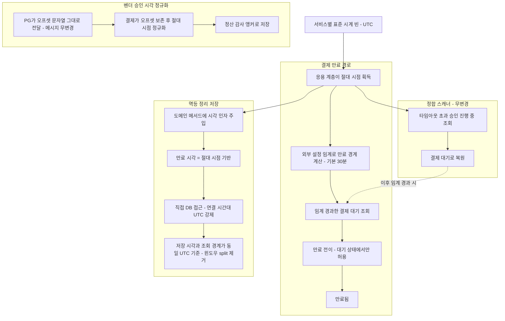

# TIME-MODEL-AND-EXPIRY — PLAN

> 설계 원문: [`docs/topics/TIME-MODEL-AND-EXPIRY.md`](topics/TIME-MODEL-AND-EXPIRY.md)
> 작성일: 2026-06-01 | Round: plan-2

---

## 요약 브리핑

> plan 2라운드 합의 완료(Critic pass / Domain Expert pass). 16개 태스크로 분해했고 결정 D1~D8을 전부 매핑했다. 세부 스펙은 아래 `## 태스크 목록` 참조.

### Task 목록 (16개)

- **T1** 결제 서비스에 표준 시계 빈 등록 + 자체 시간 공급 포트 제거
- **T2** 결제 이벤트 도메인 시각 타입을 절대 시점으로 전환 (만료/승인/상태변경 시각)
- **T3** 결제 응용 계층 시각 소스를 표준 시계로 교체 (만료 조회·정합 스캐너·**멱등 정리 만료시각 소스**)
- **T4** 결제 이벤트 엔티티 시각 타입 전환 + 표준 매핑 경로 UTC 설정
- **T5** 결제 이벤트 저장소 포트·구현 시각 타입 전환
- **T6** 만료 임계(30분) 환경 설정 외부화
- **T7** 결제 인프라 계층(지표·스케줄러·감사 관점) 시각 소스 교체 — 자체 포트 완전 제거 달성
- **T8** PG 도메인 직접 시각 호출 제거 → 호출자 인자 주입
- **T9** 만료 스케줄러 설정 키 정정 + 폴백 체인(운영 무중단)
- **T10** 만료 도메인 가드(대기 상태에서만 만료) 전수 테스트
- **T11** 만료 2단 연쇄(진행 중 정체분 복원 후 만료) 회귀 테스트
- **T12** 결제 멱등 정리 직접 DB 접근 경로 UTC 규약 적용
- **T13** 상품 서비스 표준 시계 빈 도입 + 멱등 정리 직접 DB 접근 경로 UTC 규약
- **T14** 벤더 승인 시각 오프셋 보존 정규화 (정산 앵커 9시간 오차 차단)
- **T15** PG 벤더 전략 시각 처리 정리 + 메시지 문자열 형식 보존 확인
- **T16** (verify 단계 예고) PITFALLS 및 영구 문서 동기화

### 변경 후 런타임 동작 (to-be)



### 핵심 결정 → Task 매핑

| 결정 | Task |
|------|------|
| D1/D2 표준 시계 + 절대 시점, 도메인 시각 인자 주입 | T1, T2, T3, T7, T8 |
| D3 저장 UTC 일관(표준 매핑 경로) | T4, T5 |
| D4 만료 임계 외부화 | T6 |
| D5 만료 스케줄러 키 정정 | T9 |
| D6 만료 정책 명문화(대기 가드 + 2단 연쇄) | T10, T11 |
| D7 직접 DB 접근 경로 UTC 규약 | T12, T13 |
| D8 벤더 승인 시각 오프셋 정규화 | T14, T15 |

discuss 도메인 리스크 2건도 매핑됨 — 멱등 정리 윈도우 오차(major #1) → T12/T13, 승인 시각 9시간 오차(major #2) → T14/T15.

### 트레이드오프 / 후속

- **단일 커밋 묶음 주의**: 자체 포트 삭제(T1) 시 컴파일이 광범위하게 깨지므로 T2+T4+T5는 한 커밋 논리 단위로 처리(빌드 그린 유지). 같은 설정 파일을 T4·T12가 동시 편집하므로 순차 처리.
- **비-UTC JVM 테스트**: 멱등 정리 라운드트립 검증은 Testcontainers + `-Duser.timezone=Asia/Seoul` 강제가 필요하고 Gradle 캐시에 취약 — verify에서 재실행 필수.
- **이연(TODOS 등재)**: 생성·수정 시각 감사 소스 일원화(R2), 상품 서비스 직접 DB 시각 비교를 앱 주입으로 통일(D7 범위 축소).
- **verify 동기화**: PITFALLS의 벤더 승인 시각 경계 본문을 절대 시점 전환판으로 갱신 + 시간 표준·만료 임계를 영구 문서 반영(T16).

---

## 사전 판단 게이트 (R1 / R2)

### R1 — 영속 운영 데이터 확인

본 프로젝트는 학습용이며 운영 데이터베이스에 영속 운영 데이터가 없다고 판단한다.
Flyway 마이그레이션은 항상 빈 컨테이너에서 V1부터 재적용되며, `application-docker.yml`에 `ddl-auto: validate` 설정이 적용되어 있다. 컬럼 타입은 D3에 따라 `DATETIME(6)` 유지이므로 DDL 마이그레이션 불필요.

**결론**: 기존 비-UTC 저장 행이 없으므로 UTC 규약 고정(D3/D7)이 안전하다.
만약 실제 데이터가 존재하는 환경이라면 이 토픽을 적용하기 전 데이터 보정 작업(별도 토픽)을 선행해야 한다.

### R2 — BaseEntity auditing 충돌 확인

`BaseEntity`의 `createdAt/updatedAt`은 Spring `AuditingEntityListener`가 `LocalDateTime`으로 채운다. D3의 connection TZ=UTC 규약(`connectionTimeZone=UTC`)이 적용되면 같은 connection을 타므로 저장되는 절대시점은 UTC 일관이다. 단 JPA `AuditingEntityListener`가 `LocalDateTime.now()`(시스템 TZ)를 사용하는지 또는 커스텀 `DateTimeProvider` 빈을 참조하는지 구현 체계가 다를 수 있으나, connection TZ=UTC 적용 후 바인딩 시점에 UTC 변환이 이뤄지므로 저장 절대시점의 불일치는 없다. 일원화(`DateTimeProvider` 빈 교체) 자체는 이연(R2 확정, TODOS 등재 예정).

**결론**: `BaseEntity` auditing은 D3 UTC connection 규약과 충돌 없음. 본 토픽에서 변경 안 함.

### D7 범위 — product `NOW()` 처리 방향

`JdbcEventDedupeStore`의 `SQL_EXISTS_VALID`와 `SQL_DELETE_EXPIRED_BY_UUID`는 `NOW()`(DB 세션 TZ 기준)를 사용한다. `connectionTimeZone=UTC` 적용 시 DB 세션이 UTC가 되어 앱 주입 `Instant`와 동일 기준을 공유하므로 split-brain이 해소된다. 단, "앱 시계 vs DB 시계" 이원화 자체를 줄이는 것이 더 결정적이다. 본 PLAN의 최소선은 **connection TZ=UTC 강제**(split-brain 해소)로 확정하되, `NOW()` 제거(앱 주입 `Instant` 비교로 통일)는 별도 리팩토링 태스크로 포함하지 않는다. 이원화 제거는 향후 개선 항목(TODOS).

---

## Traceability 표

| 결정 ID | 대응 태스크 번호 |
|---------|----------------|
| D1 — `Clock` 빈 + `Instant` 표준 | T1, T2, T3, T7, T8 |
| D2 — `Clock` layer 배치 + 도메인 시각 인자 주입 | T1, T2, T3, T7, T8 |
| D3 — DB UTC 일관 (`hibernate.jdbc.time_zone=UTC`, `DATETIME(6)` 유지) | T4, T5 |
| D4 — 만료 임계 외부화 (`payment.expiration.ready-timeout-minutes`) | T6, T7 |
| D5 — 만료 스케줄러 키 정정 + fallback 체인 | T9 |
| D6 — 만료 정책 명문화 (READY 가드, 2단 연쇄) | T10, T11 |
| D7 — raw-JDBC dedupe UTC 규약 (payment/product) | T12, T13 |
| D8 — 벤더 승인 시각 `toInstant()` 정규화 | T14, T15 |

### discuss 리스크 → 태스크 매핑

| 리스크 | 출처 | 대응 태스크 |
|--------|------|------------|
| major #1 — raw-JDBC dedupe TZ 누수 → 멱등성 사고 | discuss-domain-1 | T12, T13 |
| major #2 — `approvedAt` offset-drop → Instant 의미 변화 | discuss-domain-1 | T14, T15 |
| minor #3 — pg 엔티티 UTC 변환 메커니즘 미결정 | discuss-domain-1 | T4 (D3 명시), T5 |
| minor #4 — 혼재 배포 시각 이중 해석 | discuss-domain-1 | T16 (verify 문서) |
| R1 — 영속 데이터 확인 게이트 | discuss-domain-2 | 사전 판단 게이트 (위) |
| R2 — BaseEntity auditing 충돌 확인 | discuss-domain-2 | 사전 판단 게이트 (위) |
| R3 — pg domain 인자 주입 범위 | discuss-domain-1 | T7, T8 |
| R4 — D5 키 네이밍 혼란 방지 | discuss-domain-1 | T9 |

---

## 태스크 목록

---

### T1 — payment-service: `Clock` 빈 등록 + `LocalDateTimeProvider`/`SystemLocalDateTimeProvider` 제거

- **tdd**: false
- **domain_risk**: false
- **목적**: D1/D2 — `Clock.systemUTC()` 빈을 `payment-service` core config에 신규 등록하고, 자체 포트 `LocalDateTimeProvider`/`SystemLocalDateTimeProvider`를 코드베이스에서 완전 제거한다. 이 두 파일은 JDK `Clock`으로 대체된다.
- **사전 조건**: 없음 (layer 최상위 진입 태스크)
- **산출물**:
  - 신규: `payment-service/src/main/java/com/hyoguoo/paymentplatform/payment/core/config/ClockConfig.java`
    - `@Configuration` + `@Bean Clock clock() { return Clock.systemUTC(); }`
  - 삭제: `payment-service/src/main/java/com/hyoguoo/paymentplatform/payment/core/common/service/port/LocalDateTimeProvider.java`
  - 삭제: `payment-service/src/main/java/com/hyoguoo/paymentplatform/payment/core/common/infrastructure/SystemLocalDateTimeProvider.java`
- **주의**: `LocalDateTimeProvider`를 주입하는 모든 클래스에서 컴파일 오류가 발생한다 — T2~T8에서 순차 해소. T1 단독으로는 빌드가 깨진 상태이며, 이어지는 태스크들과 함께 한 커밋 묶음이 아닌 논리적 준비 단계이므로 구체적 임포트 제거는 T2에서 시작한다.

<!-- architect: layer 배치는 정확하다 — `ClockConfig`를 `core/config`(횡단 인프라 wiring)에 두고 domain에 넣지 않음(D2 준수). pg는 `infrastructure/config/PgServiceConfig`, product는 `core` 패키지 자체가 없어 `infrastructure/config`(T13)에 둔다. 세 서비스의 config layer가 서로 다른 패키지에 사는 것은 각 서비스의 기존 구조 차이일 뿐 D2 위반 아님(payment만 `core` 보유). -->
<!-- architect: [경계 누락] `LocalDateTimeProvider` 참조처 grep 결과 출력 포트 `application/port/out/PaymentEventDedupeStore.java`가 포함된다. 단 이건 javadoc 주석(`@param now ... LocalDateTimeProvider.nowInstant() 기준`) 참조라 컴파일 의존은 아니다. T1에서 클래스를 삭제하면 이 포트 주석이 죽은 식별자를 가리키게 된다. T12(JdbcPaymentEventDedupeStore)에서 포트 시그니처는 `Instant`로 유지되므로 무변경이 맞으나, 포트 javadoc의 `LocalDateTimeProvider#nowInstant()` 문구를 `clock.instant()` 기준으로 갱신하는 작업이 어느 태스크에도 매핑돼 있지 않다 — T12 산출물 목록에 포트 주석 정정을 추가하거나 별도 메모 필요. -->
<!-- architect: [한 커밋 분해 원칙과의 충돌] 주의사항 3번(T1~T7 한 세션 순차 처리)은 빌드 그린 유지를 위해 불가피하다. 다만 hexagonal layer 순서(port/config→domain→application→infrastructure)로 보면 T1(config/port)→T2(domain)→T4(entity)→T5(repo port/impl)→T3/T7(application/infra)이 자연스러운데, 현재 실행 순서는 T2 직후 T3(application)을 두고 T4/T5(infra)를 뒤에 둔다. T2가 도메인 시각 타입을 `Instant`로 바꾸면 `PaymentEventEntity.from()/toDomain()`(T4 대상)이 즉시 컴파일 깨진다 → T2와 T4는 한 커밋 안에서 동반 처리돼야 그린이 유지된다. 실행 순서 섹션의 "T2 → T4" 인접 배치는 맞으나, T2/T3/T4/T5를 "도메인 시각 타입 전환" 단일 논리 단위로 묶어 한 커밋(test RED → impl GREEN)으로 처리하는 편이 커밋 경계가 깨끗하다. 이 재배열 판단은 Planner 영역이므로 제안만 남긴다. -->


---

### T2 — payment-service: `PaymentEvent` 도메인 시각 타입 전환 (`LocalDateTime` → `Instant`)

- **tdd**: true
- **domain_risk**: true
- **목적**: D1/D2/D3 — `PaymentEvent` 도메인의 시각 필드(`executedAt`, `approvedAt`, `lastStatusChangedAt`, `createdAt`)를 `LocalDateTime`에서 `Instant`로 전환한다. 도메인 메서드(`execute`, `done`, `expire`, `fail`, `toRetrying`, `resetToReady` 등)의 시각 인자를 `Instant`로 변경한다. `EXPIRATION_MINUTES` 상수는 D4 이연을 위해 이 태스크에서는 유지하고 T6에서 제거한다.
- **관련 파일**:
  - `payment-service/src/main/java/.../payment/domain/PaymentEvent.java`
  - `payment-service/src/test/java/.../payment/domain/PaymentEventTest.java` (기존)
- **테스트 클래스**: `PaymentEventTest`
- **테스트 메서드 스펙**:
  - `expire_whenReady_shouldTransitionToExpired` — `Clock.fixed()`로 고정 `Instant` 주입 후 `expire(now)` 호출, status=EXPIRED 단정
  - `expire_whenNotReady_shouldThrow(PaymentEventStatus)` — `@ParameterizedTest @EnumSource(value=PaymentEventStatus.class, names={"IN_PROGRESS","RETRYING","DONE","FAILED","EXPIRED","QUARANTINED"})` — 각 비READY 상태에서 `INVALID_STATUS_TO_EXPIRE` 예외 단정
  - `done_withInstantApprovedAt_shouldSetApprovedAt` — `Instant` 인자로 `done()` 호출 후 `getApprovedAt()` 동치 단정
  - `execute_withInstantArgs_shouldTransitionToInProgress` — `Instant executedAt`, `Instant lastStatusChangedAt` 인자로 `execute()` 호출 후 status=IN_PROGRESS 단정
  - `resetToReady_withInstant_shouldRestoreStatus` — `Instant` 인자로 `resetToReady()` 호출 후 status=READY 단정

<!-- architect: [layer 정합] T2가 도메인 시각 필드/메서드를 `Instant`로 바꾸면 그 즉시 `PaymentEventEntity`(T4)와 `PaymentEventRepository` 포트/impl(T5)의 매핑·시그니처가 컴파일 깨진다. domain → 외부 의존 0 규칙은 지켜지지만(도메인이 `Clock`을 주입받지 않고 `Instant` 인자만 받음 — D2 정확히 준수), T4/T5가 T3보다 먼저 그린화돼야 빌드가 산다. 실행 순서상 T3(application)가 T4/T5(infra) 앞에 있어 컴파일 그린 윈도우가 어긋난다 — Planner가 T2+T4+T5를 한 묶음으로 보거나 T4/T5를 T3 앞으로 끌어올릴지 검토 권고. domain 순수성 자체는 위반 없음. -->

---

### T3 — payment-service: application 레이어 시각 소스 `Clock` 전환 (PaymentCommandUseCase / PaymentLoadUseCase / OutboxRelayService / PaymentReconciler / PaymentConfirmResultUseCase)

- **tdd**: true
- **domain_risk**: true
- **목적**: D1/D2 — `LocalDateTimeProvider` 주입을 `Clock` 주입으로 교체. `localDateTimeProvider.now()` 호출을 `clock.instant()`로, `localDateTimeProvider.nowInstant()`를 `clock.instant()`로 대체. `PaymentLoadUseCase.getReadyPaymentsOlder()`는 cutoff 계산을 T6에서 분리하므로 이 태스크에서는 `Clock` 주입으로만 교체하고 cutoff 계산 로직의 임계는 `PaymentEvent.EXPIRATION_MINUTES` 유지. **`PaymentConfirmResultUseCase`의 L126(`expiresAt` 계산)과 L191(`occurredAt` 계산)도 이 태스크에서 `clock.instant()`로 전환한다** — dedupe 멱등 윈도우의 `expires_at` 시각 소스(D7/NG3)와 `received_at`(T12 전환) 사이 split을 방지하기 위해 같은 논리 단위로 처리.
- **관련 파일**:
  - `payment-service/src/main/java/.../payment/application/usecase/PaymentCommandUseCase.java`
  - `payment-service/src/main/java/.../payment/application/usecase/PaymentLoadUseCase.java`
  - `payment-service/src/main/java/.../payment/application/usecase/PaymentCreateUseCase.java`
  - `payment-service/src/main/java/.../payment/application/usecase/PaymentOutboxUseCase.java`
  - `payment-service/src/main/java/.../payment/application/usecase/PaymentConfirmResultUseCase.java` — L68 `LocalDateTimeProvider` 필드 → `Clock`, L126 `localDateTimeProvider.nowInstant()` → `clock.instant()`, L191 `localDateTimeProvider.nowInstant()` → `clock.instant()`
  - `payment-service/src/main/java/.../payment/application/service/OutboxRelayService.java`
  - `payment-service/src/main/java/.../payment/application/service/PaymentReconciler.java`
- **테스트 클래스**: `PaymentCommandUseCaseTest` (기존 수정) + `PaymentReconcilerTest` + `PaymentConfirmResultUseCaseClockTest` (신규)
- **테스트 메서드 스펙**:
  - `PaymentCommandUseCaseTest.expirePayment_withFixedClock_shouldCallDomainExpire` — `Clock.fixed(fixedInstant, UTC)` 주입 후 `expirePayment()` 호출, `domain.expire(fixedInstant)` 호출됨 Mockito verify
  - `PaymentReconcilerTest.scan_withFixedClock_cutoffIsCorrect` — `Clock.fixed()` 주입 후 `scan()` 호출, `findInProgressOlderThan(fixedInstant.minusSeconds(timeout))` 호출됨 Mockito verify
  - `PaymentConfirmResultUseCaseClockTest.confirmResult_expiresAt_usesClockInstant` — `Clock.fixed(fixedInstant, UTC)` 주입 후 confirm 처리 시 `dedupeStore.markIfAbsent(id, fixedInstant.plus(STOCK_COMMITTED_TTL))` 호출됨 Mockito verify (dedupe expires_at 소스 결정성)
  - `PaymentConfirmResultUseCaseClockTest.confirmResult_occurredAt_usesClockInstant` — 같은 픽스쳐에서 `occurredAt = fixedInstant` 로 이벤트 발행됨 Mockito verify

---

### T4 — payment-service: `PaymentEventEntity` 시각 필드 `Instant` 전환 + `hibernate.jdbc.time_zone=UTC` 설정

- **tdd**: false
- **domain_risk**: false
- **목적**: D3 — `PaymentEventEntity`의 `executedAt`, `approvedAt`, `lastStatusChangedAt` 필드를 `LocalDateTime`에서 `Instant`로 전환한다. `BaseEntity`(`createdAt/updatedAt`)는 NG4 준수로 변경하지 않는다. ORM 경로 UTC 고정을 위해 `hibernate.jdbc.time_zone=UTC`를 `application.yml`과 `application-docker.yml` 모두에 추가한다. 컬럼 타입 `DATETIME(6)` 유지이므로 Flyway DDL 불필요.
- **관련 파일**:
  - `payment-service/src/main/java/.../payment/infrastructure/entity/PaymentEventEntity.java`
  - `payment-service/src/main/resources/application.yml` (`spring.jpa.properties.hibernate.jdbc.time_zone: UTC` 추가)
  - `payment-service/src/main/resources/application-docker.yml` (동일 추가)
  - `payment-service/src/test/resources/application-test.yml` (동일 추가)
- **체크**: `PaymentEventEntity.from(paymentEvent)`, `toDomain(...)` 변환 메서드의 `Instant` ↔ 필드 매핑 정합 확인. `BaseEntity` auditing과의 충돌 없음 확인(R2 체크).

<!-- architect: [경로 A/B 정합 — 잠재 적신호] D3은 ORM 경로 UTC를 `hibernate.jdbc.time_zone=UTC`(프로퍼티)로, raw-JDBC 경로(D7/T12)는 datasource URL `connectionTimeZone=UTC`로 잡는다. 두 경로는 같은 datasource connection을 공유하므로, T12에서 `connectionTimeZone=UTC&forceConnectionTimeZoneToSession=true`를 URL에 박으면 ORM 경로 바인딩도 그 connection TZ의 영향을 받는다. `hibernate.jdbc.time_zone`(T4)과 `connectionTimeZone`(T12)이 한 connection 위에서 상호작용할 때 이중 변환이 일어나지 않는지(둘 다 UTC라 결과는 같지만 변환 횟수·기준이 어긋나면 미묘한 오차) execute에서 round-trip 통합 테스트로 반드시 확인할 것. layer 배치 자체는 둘 다 infrastructure/resources라 위반 없음. T4와 T12가 같은 yml 파일(application-docker.yml)을 동시 편집하므로 같은 커밋/세션에서 충돌 없이 합쳐지는지도 주의. -->


---

### T5 — payment-service: `PaymentEventRepository` 포트 + 구현체 시각 타입 전환

- **tdd**: true
- **domain_risk**: false
- **목적**: D3 — `PaymentEventRepository` 포트의 `findReadyPaymentsOlderThan(LocalDateTime)`, `findInProgressOlderThan(LocalDateTime)`, `countByStatusAndExecutedAtBefore(…, LocalDateTime)` 시그니처를 `Instant` 기반으로 전환. JPA 구현체(`PaymentEventRepositoryImpl`, `JpaPaymentEventRepository`)의 쿼리 파라미터 타입도 `Instant`로 전환.
- **관련 파일**:
  - `payment-service/src/main/java/.../payment/application/port/out/PaymentEventRepository.java`
  - `payment-service/src/main/java/.../payment/infrastructure/repository/PaymentEventRepositoryImpl.java`
  - `payment-service/src/main/java/.../payment/infrastructure/repository/JpaPaymentEventRepository.java`
- **테스트 클래스**: `PaymentEventRepositoryImplTest` (신규 또는 기존)
- **테스트 메서드 스펙**:
  - `findReadyPaymentsOlderThan_withInstantCutoff_returnsOnlyOlderPayments` — Testcontainers MySQL에서 READY 결제 두 건(cutoff 이전/이후) INSERT 후 `Instant` cutoff로 조회하여 이전 건만 반환됨 단정

---

### T6 — payment-service: 만료 임계 외부화 (`payment.expiration.ready-timeout-minutes`)

- **tdd**: true
- **domain_risk**: false
- **목적**: D4 — `PaymentEvent.EXPIRATION_MINUTES = 30` 상수를 제거하고 `PaymentLoadUseCase.getReadyPaymentsOlder()`에 `@Value("${payment.expiration.ready-timeout-minutes:30}")` 주입으로 대체한다. cutoff 계산: `clock.instant().minus(Duration.ofMinutes(timeoutMinutes))`. 도메인은 임계를 모른다.

<!-- architect: [D4 layer 배치 정확] 임계 `@Value` 주입과 cutoff 계산을 application(`PaymentLoadUseCase`)에 두고 domain은 "READY에서만 EXPIRED 전이" 규칙만 갖는 분리는 D4 의도대로다 — "언제 만료 대상인가"(정책)는 application, "전이 가능 여부"(불변)는 domain. domain이 `@Value`/`Clock`을 모르는 방향 유지됨. 떼어내기 쉬운 경계. -->

- **관련 파일**:
  - `payment-service/src/main/java/.../payment/domain/PaymentEvent.java` (`EXPIRATION_MINUTES` 제거)
  - `payment-service/src/main/java/.../payment/application/usecase/PaymentLoadUseCase.java` (`@Value` 주입 + cutoff 계산 + `Clock` 주입)
  - `payment-service/src/main/resources/application.yml` (`payment.expiration.ready-timeout-minutes: 30` 추가)
- **테스트 클래스**: `PaymentLoadUseCaseTest`
- **테스트 메서드 스펙**:
  - `getReadyPaymentsOlder_defaultTimeout_30min_cutoffIsCorrect` — `@Value` 기본값 30으로 `PaymentLoadUseCase` 생성, `Clock.fixed(fixedInstant, UTC)` 주입 후 `getReadyPaymentsOlder()` 호출 → `findReadyPaymentsOlderThan(fixedInstant.minus(30min))` verify
  - `getReadyPaymentsOlder_customTimeout_cutoffRespectsSetting` — `timeoutMinutes=5`로 오버라이드 후 `findReadyPaymentsOlderThan(fixedInstant.minus(5min))` verify
  - AC5 경계 검증: `getReadyPaymentsOlder_29min_notIncluded` / `getReadyPaymentsOlder_31min_included` — 고정 Clock + Mockito stub으로 cutoff 경계 검증

---

### T7 — payment-service: infrastructure 레이어 시각 소스 `Clock` 전환 (metrics / scheduler / aspect / dedupe cleanup)

- **tdd**: false
- **domain_risk**: true
- **목적**: D1/D2 — infrastructure 레이어에서 `LocalDateTimeProvider`를 사용하는 컴포넌트를 `Clock` 주입으로 전환. 대상: `PaymentHealthMetrics`, `OutboxPendingAgeMetrics`, `PaymentOutboxMetrics`, `DedupeCleanupWorker`, `PaymentOutboxRepositoryImpl`, `PaymentStatusMetricsAspect`, `DomainEventLoggingAspect`. `DomainEventLoggingAspect`의 `occurredAt`(L86)은 `@PublishDomainEvent` 상태전이 감사 시각이므로 `localDateTimeProvider.now()` → `clock.instant().atZone(ZoneOffset.UTC).toLocalDateTime()` 또는 audit trail이 `LocalDateTime`을 요구하지 않으면 `Instant`로 직접 전환 — audit 시각의 TZ 누수(PITFALLS §1)를 제거한다.
- **관련 파일**:
  - `payment-service/src/main/java/.../payment/core/common/metrics/PaymentHealthMetrics.java`
  - `payment-service/src/main/java/.../payment/infrastructure/metrics/OutboxPendingAgeMetrics.java`
  - `payment-service/src/main/java/.../payment/infrastructure/metrics/PaymentOutboxMetrics.java`
  - `payment-service/src/main/java/.../payment/infrastructure/scheduler/DedupeCleanupWorker.java`
  - `payment-service/src/main/java/.../payment/infrastructure/repository/PaymentOutboxRepositoryImpl.java`
  - `payment-service/src/main/java/.../payment/infrastructure/aspect/PaymentStatusMetricsAspect.java` — L23 필드 `LocalDateTimeProvider` → `Clock`, L46 `.now()` → `clock.instant()`
  - `payment-service/src/main/java/.../payment/infrastructure/aspect/DomainEventLoggingAspect.java` — L32 필드 `LocalDateTimeProvider` → `Clock`, L86 `.now()` → `clock.instant()` 기반 시각 (audit trail TZ 제거)
- **완료 기준**: `grep -r "LocalDateTimeProvider" payment-service/src/main/java` 결과 **0건** (AC1 만족). 이 태스크 완료 후 AC1이 달성 가능하려면 T3(application 레이어)와 T12(dedupe 인프라)도 완료돼야 한다. 전체 주입처 전수 목록: `PaymentCommandUseCase`·`PaymentLoadUseCase`·`PaymentCreateUseCase`·`PaymentOutboxUseCase`·`OutboxRelayService`·`PaymentReconciler`·`PaymentConfirmResultUseCase`(T3), `JdbcPaymentEventDedupeStore`(T12), `PaymentHealthMetrics`·`OutboxPendingAgeMetrics`·`PaymentOutboxMetrics`·`DedupeCleanupWorker`·`PaymentOutboxRepositoryImpl`·`PaymentStatusMetricsAspect`·`DomainEventLoggingAspect`(T7) — 총 15개 클래스, 전부 태스크 매핑 완료.

---

### T8 — pg-service: `PgInbox`/`PgOutbox` 도메인 `Instant.now()` 직접 호출 제거 → 인자 주입

- **tdd**: true
- **domain_risk**: true
- **목적**: D1/D2/R3 — `PgInbox`와 `PgOutbox` 도메인 내부의 `Instant.now()` 직접 호출(`PgInbox` 8곳: L64·L88·L164·L199·L309·L341·L376·L414, `PgOutbox` 2곳: L49·L86)을 제거하고, 호출자가 `clock.instant()`로 `Instant`를 얻어 메서드 인자로 주입하도록 전환한다. 기존에 인자 오버로드가 있는 메서드는 오버로드 일원화(no-arg 버전 제거). 도메인 mutator 호출처 전수:
  - `PgInboxProcessor.java` L94·L134 — `Instant.now()` 직접 인자 전달 → `clock.instant()` (이 클래스에 `Clock` 주입 신규 추가 필요)
  - `PgInboxRepositoryImpl.java` — 이미 `Clock clock` 필드 주입 완료, `LocalDateTime.now(clock)`·`clock.instant()` 사용 중 → 추가 변경 불필요, 도메인 mutator 호출 방식이 인자 주입 패턴인지 확인만
  - `PgConfirmService`·`PgVendorCallService`·`PgDlqService`·`PgFinalConfirmationGate`·`PgTerminalReemitService`·`DuplicateApprovalHandler` — 이미 `Clock` 주입 사용 중, `Instant.now()` 직접 호출이 없음을 grep으로 확인
- **관련 파일**:
  - `pg-service/src/main/java/.../pg/domain/PgInbox.java`
  - `pg-service/src/main/java/.../pg/domain/PgOutbox.java`
  - `pg-service/src/main/java/.../pg/application/service/PgInboxProcessor.java` — `Clock` 필드 주입 추가, L94·L134 `Instant.now()` → `clock.instant()`
- **테스트 클래스**: `PgInboxTest` (기존 수정) + `PgInboxProcessorTest` (신규)
- **테스트 메서드 스펙**:
  - `PgInboxTest.markInProgress_withFixedInstant_setsUpdatedAt` — `Clock.fixed(fixedInstant, UTC)` 기준 `Instant` 인자로 `markInProgress(fixedInstant)` 호출 후 `getUpdatedAt()` = `fixedInstant` 단정
  - `PgInboxTest.create_withFixedInstant_setsCreatedAt` — `create(orderId, amount, fixedInstant)` 후 `getCreatedAt()` = `fixedInstant` 단정
  - `PgInboxProcessorTest.process_usesClockInstant` — `Clock.fixed()` 주입 후 `applyOutcome()` 호출 시 `fixedInstant`로 도메인 메서드가 호출됨 Mockito verify
- **완료 기준**: `grep -rn "Instant.now()" pg-service/src/main/java --include="*.java"` 결과에 도메인 클래스(`PgInbox.java`·`PgOutbox.java`) 및 `PgInboxProcessor.java` 0건 (`TossPaymentGatewayStrategy`의 `LocalDateTime.now()` 1건은 T15에서 처리)

---

### T9 — payment-service: 만료 스케줄러 프로퍼티 키 정정 + fallback 체인 (D5)

- **tdd**: false
- **domain_risk**: false
- **목적**: D5 — `PaymentScheduler`의 `@Scheduled` fixedRateString을 `scheduler.payment-expiration.fixed-rate`를 주키로 하고 기존 `scheduler.payment-status-sync.fixed-rate`를 fallback으로 하는 체인으로 정정한다. 운영 `application-docker.yml`의 기존 `payment-status-sync.fixed-rate: 3600000` 오버라이드가 전환 중에도 적용되어야 한다.
- **관련 파일**:
  - `payment-service/src/main/java/.../payment/infrastructure/scheduler/PaymentScheduler.java`
    - `@Scheduled(fixedRateString = "${scheduler.payment-expiration.fixed-rate:${scheduler.payment-status-sync.fixed-rate:300000}}")`
  - `payment-service/src/main/resources/application-docker.yml` — `scheduler.payment-expiration.fixed-rate: 3600000` 추가 (기존 `payment-status-sync.*` 키는 fallback 유지를 위해 한 주기 동안 병존)
  - `payment-service/src/main/resources/application.yml` — 두 스케줄러 역할 주석 명시:
    - `scheduler.payment-expiration.*`: 만료 스케줄러 (READY → EXPIRED, D5 정정)
    - `scheduler.payment-status-sync.*`: fallback 키(이름 불일치 구 버전, 이연 삭제 가능)
    - `reconciler.*`: 정합 스캐너 (IN_PROGRESS → READY, 별개)
- **완료 기준**: fallback 체인으로 기존 `payment-status-sync.fixed-rate` 값이 여전히 적용됨 확인 (`@SpringBootTest` 빈 바인딩 확인 또는 주석으로 명시)

---

### T10 — payment-service: 만료 정책 명문화 — 도메인 가드 테스트 강화 (D6)

- **tdd**: true
- **domain_risk**: true
- **목적**: D6 — `PaymentEvent.expire(Instant)` 도메인 가드("READY에서만 만료 가능")를 `@ParameterizedTest @EnumSource`로 완전히 검증한다. 기존 테스트가 있으면 `Instant` 인자 전환 후 exhaustive하게 보강한다.
- **관련 파일**:
  - `payment-service/src/test/java/.../payment/domain/PaymentEventTest.java`
- **테스트 클래스**: `PaymentEventTest`
- **테스트 메서드 스펙**:
  - `expire_whenReady_withFixedClock_shouldTransitionToExpired` — `Clock.fixed(fixedInstant, UTC)` → `expire(fixedInstant)` 호출 후 status=EXPIRED, lastStatusChangedAt=fixedInstant 단정
  - `expire_whenNotReady_shouldThrow(PaymentEventStatus status)` — `@ParameterizedTest @EnumSource(value=PaymentEventStatus.class, names={"IN_PROGRESS","RETRYING","DONE","FAILED","EXPIRED","QUARANTINED"})` — 각각 `INVALID_STATUS_TO_EXPIRE` 예외 단정 (NG2 회귀 가드)
  - `expire_whenPartialCanceled_shouldThrow` — PARTIAL_CANCELED 상태(존재 시)에서도 예외 단정

---

### T11 — payment-service: 만료 정책 명문화 — 2단 연쇄 통합 회귀 테스트 (D6)

- **tdd**: true
- **domain_risk**: true
- **목적**: D6 — "IN_PROGRESS 정체 → reconciler READY 복원 → 만료 스케줄러 EXPIRED" 2단 연쇄가 의도된 정책임을 단위 테스트로 문서화한다. `PaymentReconcilerTest`에 "IN_PROGRESS를 직접 만료 시도 시 예외, READY 복원 후 만료 대상임"을 검증하는 케이스를 추가한다.
- **관련 파일**:
  - `payment-service/src/test/java/.../payment/application/service/PaymentReconcilerTest.java` (신규)
  - `payment-service/src/test/java/.../payment/application/PaymentExpirationServiceImplTest.java` (기존 Instant 전환)
- **테스트 클래스**: `PaymentReconcilerTest`
- **테스트 메서드 스펙**:
  - `scan_staleInProgress_shouldResetToReady` — `Clock.fixed()` + Mock `PaymentEventRepository`로 IN_PROGRESS `cutoff` 초과 건 반환 → `resetToReady(Instant)` 호출됨 verify
  - `scan_noStaleRecords_shouldDoNothing` — 빈 리스트 반환 → saveOrUpdate 0회 verify
  - `expireOldReadyPayments_afterReset_shouldSucceed` — `PaymentExpirationServiceImplTest`의 기존 테스트를 `Instant` 인자로 전환 (LocalDateTime → Instant fixture 교체)

---

### T12 — payment-service: `JdbcPaymentEventDedupeStore` raw-JDBC UTC 규약 적용 (D7)

- **tdd**: true
- **domain_risk**: true
- **목적**: D7 — `JdbcPaymentEventDedupeStore`의 `Timestamp.from(instant)` 바인딩에 명시 UTC `Calendar`를 추가하고, `LocalDateTimeProvider` 의존을 `Clock` 주입으로 교체한다. `application-docker.yml` datasource URL에 `connectionTimeZone=UTC&forceConnectionTimeZoneToSession=true`를 추가한다. 이로써 raw-JDBC 바인딩이 Hibernate 프로퍼티와 독립적으로 UTC를 타게 된다.
- **관련 파일**:
  - `payment-service/src/main/java/.../payment/infrastructure/dedupe/JdbcPaymentEventDedupeStore.java`
    - `LocalDateTimeProvider` → `Clock` 교체
    - `Timestamp.from(...)` 바인딩을 `ps.setTimestamp(idx, Timestamp.from(instant), Calendar.getInstance(TimeZone.getTimeZone("UTC")))` 패턴으로 교체 (NamedParameter 방식에서 `MapSqlParameterSource` + `SqlParameterValue` 또는 `PreparedStatementSetter` 전환)
  - `payment-service/src/main/java/.../payment/application/port/out/PaymentEventDedupeStore.java` — javadoc L32-36의 `LocalDateTimeProvider#nowInstant()` 참조를 `clock.instant()` 기준 문구로 정정 (T1이 `LocalDateTimeProvider`를 삭제하면 죽은 식별자가 되므로 이 태스크에서 함께 정정; 포트 시그니처 `Instant`는 무변경)
  - `payment-service/src/main/resources/application-docker.yml` — datasource URL `connectionTimeZone=UTC&forceConnectionTimeZoneToSession=true` 추가 (**T4도 이 파일을 편집하므로 같은 커밋 또는 T4 직후에 처리해 yml 충돌을 방지할 것**)
  - `payment-service/src/main/resources/application.yml` — 테스트용 datasource URL 확인
  - `payment-service/src/test/resources/application-test.yml` — Testcontainers URL에도 `connectionTimeZone=UTC` 반영
- **테스트 클래스**: `JdbcPaymentEventDedupeStoreRoundTripTest` (신규 통합 테스트)
- **테스트 메서드 스펙** (AC8 — 비-UTC JVM TZ):
  - `markIfAbsent_nonUtcJvm_receivedAtRoundTripSameInstant` — `-Duser.timezone=Asia/Seoul` JVM TZ에서 `Clock.fixed(fixedInstant, UTC)`로 `markIfAbsent()` 호출 후 DB에서 `received_at`을 `Timestamp.toInstant()`로 읽어 `fixedInstant`와 밀리초 동치 단정 (Testcontainers MySQL)
  - `deleteExpired_nonUtcJvm_respectsInstantBoundary` — 만료/미만료 행 각 1건 INSERT 후 cutoff `Instant`로 `deleteExpired()` 호출, 만료 행만 삭제됨 단정
<!-- architect: [포트 시그니처 무변경 OK + 주석 정정 누락] D7 layer 배치대로 포트 `PaymentEventDedupeStore`의 시그니처는 `Instant` 인자 유지 = 무변경(hexagonal 경계 보존). 단 이 포트의 javadoc이 `LocalDateTimeProvider#nowInstant() 기준`을 명시 참조하는데(application/port/out/PaymentEventDedupeStore.java L32-36), T1이 그 클래스를 삭제하면 죽은 식별자 참조가 된다. 이 포트 javadoc 정정을 T12 산출물 목록에 추가하거나 명시 메모로 남길 것 — 현재 어느 태스크에도 매핑 안 됨. -->
- **주의**: AC8 통합 테스트는 `-Duser.timezone=Asia/Seoul` JVM TZ 강제 프로파일에서만 완전히 검증된다. Gradle `test` task에 `jvmArgs("-Duser.timezone=Asia/Seoul")`를 `integrationTest` 태스크에 추가하거나, 테스트 내에서 `TimeZone.setDefault(TimeZone.getTimeZone("Asia/Seoul"))`를 사용한다. 이 테스트는 `connectionTimeZone=UTC`가 누락되면 실패하도록 설계해야 한다 — 회귀 가드 역할. **UP-TO-DATE 캐시에 취약**: verify 단계에서 `--rerun` 실행 필수.

---

### T13 — product-service: `Clock` 빈 도입 + `JdbcEventDedupeStore` raw-JDBC UTC 규약 적용 (D7)

- **tdd**: true
- **domain_risk**: true
- **목적**: D7 — product-service에 `Clock.systemUTC()` 빈을 신규 등록하고, `JdbcEventDedupeStore`의 `Timestamp.from()` 바인딩에 명시 UTC `Calendar`를 추가한다. `DedupeCleanupWorker`의 `Instant.now()` 직접 호출을 `clock.instant()`로 교체한다. datasource URL에 `connectionTimeZone=UTC&forceConnectionTimeZoneToSession=true` 추가. `StockCommitConsumer`의 `Instant.now()` fallback은 `clock.instant()`로 교체한다.
- **관련 파일**:
<!-- architect: [config layer 배치 OK] product는 `core` 패키지가 없으므로 `infrastructure/config/ClockConfig`가 맞다(기존 `infrastructure/config/SchedulerConfig` 등과 동거). payment(T1)의 `core/config`와 패키지가 다른 것은 의도된 구조 차이지 위반 아님. raw-JDBC UTC 규약(URL `connectionTimeZone=UTC`)은 resources(인프라 wiring), 명시 Calendar는 infra 어댑터 내부 — 포트 시그니처 무변경이라 hexagonal 경계 정확. -->
  - 신규: `product-service/src/main/java/.../product/infrastructure/config/ClockConfig.java`
    - `@Bean Clock clock() { return Clock.systemUTC(); }`
  - `product-service/src/main/java/.../product/infrastructure/idempotency/JdbcEventDedupeStore.java`
    - `Timestamp.from(expiresAt)` 바인딩에 UTC `Calendar` 추가
  - `product-service/src/main/java/.../product/infrastructure/scheduler/DedupeCleanupWorker.java`
    - `Instant.now()` → `clock.instant()`
  - `product-service/src/main/java/.../product/infrastructure/messaging/consumer/StockCommitConsumer.java`
    - `Instant.now()` fallback → `clock.instant()`
  - `product-service/src/main/resources/application-docker.yml` — datasource URL `connectionTimeZone=UTC&forceConnectionTimeZoneToSession=true`
  - `product-service/src/test/resources/application-test.yml` (존재 시) — 동일 추가
- **테스트 클래스**: `JdbcEventDedupeStoreRoundTripTest` (신규 통합 테스트)
- **테스트 메서드 스펙** (AC8):
  - `recordIfAbsent_nonUtcJvm_expiresAtRoundTripSameInstant` — `-Duser.timezone=Asia/Seoul`에서 `Clock.fixed(fixedInstant, UTC)`, `recordIfAbsent(uuid, fixedInstant.plus(8d))` 후 DB에서 `expires_at` 읽어 절대시점 동치 단정 (Testcontainers MySQL)
  - `existsValid_nowBasedOnConnectionUTC_sameBoundaryAsAppInstant` — `NOW()` 기반 `existsValid`와 앱 `Instant.isAfter(expiresAt)` 비교가 동일 만료 경계를 보는지 검증 (split-brain 부재)
- **주의**: T12와 동일한 비-UTC JVM TZ 강제 주의사항 적용.
- **완료 기준**: `grep -rn "Instant.now()" product-service/src/main/java` 결과 0건 (AC2 product 부분)

---

### T14 — payment-service: `parseApprovedAt` offset 정규화 (`toInstant()`) (D8)

- **tdd**: true
- **domain_risk**: true
- **목적**: D8 — `PaymentConfirmResultUseCase.parseApprovedAt`의 `OffsetDateTime.parse(approvedAtRaw).toLocalDateTime()`을 `OffsetDateTime.parse(approvedAtRaw).toInstant()`으로 변경한다. `markPaymentAsDone(paymentEvent, Instant approvedAt)`으로 인자 타입을 `Instant`로 전환한다. `PaymentEvent.done(Instant approvedAt, Instant lastStatusChangedAt)`으로 도메인 메서드 인자도 `Instant`로 전환 (T2에서 이미 도메인 필드 전환 완료 전제). **`PaymentConfirmResultUseCase`의 `LocalDateTimeProvider` 필드 및 L126/L191 `nowInstant()` 호출은 T3에서 선행 처리되므로 이 태스크 시점에는 이미 `Clock`으로 전환 완료 상태이다** — T14는 `parseApprovedAt`(L226-231)의 offset 정규화에만 집중.
- **관련 파일**:
  - `payment-service/src/main/java/.../payment/application/usecase/PaymentConfirmResultUseCase.java` (L226-231 `parseApprovedAt` 메서드)
  - `payment-service/src/main/java/.../payment/application/usecase/PaymentCommandUseCase.java` (`markPaymentAsDone` 인자 타입)
- **테스트 클래스**: `PaymentConfirmResultUseCaseApprovedAtTest` (신규) 또는 기존 `PaymentConfirmResultUseCase*Test`에 케이스 추가
- **테스트 메서드 스펙** (AC9):
  - `parseApprovedAt_kstOffset_shouldBeUTCInstant` — `"2026-01-01T09:00:00+09:00"` 입력 → 반환 `Instant` = `Instant.parse("2026-01-01T00:00:00Z")` 단정 (9시간 오차 부재)
  - `parseApprovedAt_utcOffset_shouldBeIdentical` — `"2026-01-01T00:00:00+00:00"` 입력 → `2026-01-01T00:00:00Z` 동치 단정
  - `parseApprovedAt_null_shouldThrow` — null 입력 → `IllegalArgumentException` 단정
  - `parseApprovedAt_toLocalDateTimeIsBanned_grep` — (정적 검증) `.toLocalDateTime()` 호출이 `parseApprovedAt` 관련 경로에서 0건임을 주석으로 명시 (grep AC9)

---

### T15 — pg-service: 벤더 strategy 시각 처리 정리 (D8 pg측)

- **tdd**: false
- **domain_risk**: true
- **목적**: D8 — pg 측 strategy가 `ConfirmedEventPayload`에 `approvedAtRaw`(원본 offset 문자열)를 보존함을 확인하고, 내부적으로 `LocalDateTime.now()` 직접 호출(TossPaymentGatewayStrategy L244)을 `clock.instant()` 기반으로 교체한다. `NicepayPaymentGatewayStrategy`의 `parsedPaidAt.toLocalDateTime()` 변환은 `ConfirmedEventPayload`의 `approvedAt` 필드가 raw 문자열 contract을 유지하므로 해당 필드에 영향 없음을 확인한다. pg 내부 도메인/엔티티(`PgInbox`/`PgOutbox`)가 `Instant`를 다룰 때 `.toLocalDateTime()`으로 깎는 지점이 있으면 제거한다.
- **관련 파일**:
  - `pg-service/src/main/java/.../pg/infrastructure/gateway/toss/TossPaymentGatewayStrategy.java` (L244 `LocalDateTime.now()` → `clock.instant()` 또는 해당 값의 용도에 맞는 `Instant`)
  - `pg-service/src/main/java/.../pg/infrastructure/gateway/nicepay/NicepayPaymentGatewayStrategy.java` (확인: `approvedAtRaw` = `parsedPaidAt.toString()`이 offset 보존 문자열인지 확인, 내부 LocalDateTime 변환 지점이 `ConfirmedEventPayload.approvedAt`에 영향을 미치는지 확인)
- **완료 기준**: `grep -rn "LocalDateTime.now()" pg-service/src/main/java` 0건 (AC2 pg 부분)
- **NicePay fallback 점검**: `NicepayPaymentGatewayStrategy.java` L296 `OffsetDateTime.now()`(시스템 TZ) — 이 fallback은 파싱 실패 예외 경로이며 AC2 grep(`Instant.now()`/`LocalDateTime.now()` 패턴) 사각지대. execute 시 이 경로가 실제로 정산 앵커 시각에 영향을 미치는지 확인하고, 영향이 있으면 `OffsetDateTime.now(clock)` 또는 `Instant.now(clock)`으로 교체. 영향 없는 예외 경로면 주석으로 "TZ 사각지대 예외 경로, 비차단"을 명시. (Domain Expert minor #4)

<!-- architect: [모듈 경계 보존 확인 OK] pg→payment 메시지 contract(`ConfirmedEventPayload.approvedAtRaw` ISO offset 문자열)는 이 태스크에서 유지된다 — pg는 절대시점 해석 권위를 갖지 않고 raw 문자열만 보존, 정규화(.toInstant())는 payment(T14)에서 수행. 이 분리는 D8 layer 배치(파싱 정규화 권위 = payment application)와 정확히 일치한다. 다만 "내부 LocalDateTime 변환 지점이 approvedAt 필드에 영향을 미치는지 확인"은 단순 확인이 아니라 회귀 가드가 필요하다 — pg가 raw 문자열을 깎지 않고 그대로 전달함을 단정하는 테스트(직렬화 contract 불변)가 T15에 없다. tdd:false이지만 contract 불변을 보장하는 최소 단정 또는 기존 contract test 커버 여부를 execute에서 확인할 것. -->


---

### T16 — verify 준비: PITFALLS §13 동기화 + 영구 문서 반영 (verify 단계 태스크 예고)

- **tdd**: false
- **domain_risk**: false
- **목적**: verify 단계에서 수행할 문서 동기화를 plan에서 예고한다. 본 태스크는 execute 중 수행하지 않고 verify 단계에서 별도 커밋으로 수행한다.
- **산출물 (verify 단계)**:
  - `docs/context/PITFALLS.md` §13 — `.toLocalDateTime()` 처방 문구를 `.toInstant()` 정규화로 갱신 (discuss-domain-2 minor #3)
  - `docs/context/ARCHITECTURE.md` — 시간 표준(Clock + Instant) 및 만료 임계 외부화 결정을 핵심 설계 결정 인덱스에 반영
  - `docs/context/TODOS.md` — `BaseEntity` auditing 일원화 후속 항목 등재 (R2 이연)
  - F6 approvedAt 과도기 행 관련 배포 전 컨테이너 TZ=UTC 선반영 게이트 명시 (discuss-domain-2 minor #4)
- **완료 기준**: AC7(`./gradlew test` 회귀 0) 이후 별도 `docs:` 커밋으로 기록

---

## 실행 순서 (layer 의존 기준)

T2(도메인 Instant 전환)가 완료되면 `PaymentEventEntity`(T4)·`PaymentEventRepository`(T5)가 즉시 컴파일 깨진다. 따라서 **T2+T4+T5는 단일 커밋(test RED → impl GREEN) 논리 단위**로 처리한다. T3(application)은 T2+T4+T5 묶음 그린화 이후에 진행한다. T4와 T12 모두 `application-docker.yml`을 편집하므로 두 태스크를 같은 커밋 세션에서 처리하거나 T4 완료 후 T12를 편집하여 yml 충돌을 방지한다.

```
T1 (config/port 정리)
  → [T2 + T4 + T5] — 단일 커밋 논리 단위: 도메인 Instant 전환 + entity + repo (test RED → impl GREEN)
    → T10 (도메인 가드 테스트 강화) — TDD
    → T3 (application layer Clock 전환: PaymentCommandUseCase / PaymentLoadUseCase / PaymentCreateUseCase / PaymentOutboxUseCase / OutboxRelayService / PaymentReconciler / PaymentConfirmResultUseCase L126+L191) — TDD
      → T6 (만료 임계 외부화) — TDD
        → T7 (infrastructure metrics / scheduler / aspect Clock 전환 — AC1 그린화)
  → T8 (pg domain Instant.now() 제거 + PgInboxProcessor Clock 주입) — TDD
    → T15 (pg strategy 시각 정리)
  → T9 (스케줄러 키 정정) — yml/infra
  → T11 (2단 연쇄 단위 테스트) — TDD
  → T12 (payment dedupe raw-JDBC UTC 규약 + PaymentEventDedupeStore javadoc 정정) — TDD 통합 ※yml: T4와 충돌 방지
  → T13 (product Clock 도입 + dedupe raw-JDBC UTC 규약) — TDD 통합
  → T14 (approvedAt parseApprovedAt toInstant — T3 선행 완료 전제) — TDD
[verify 단계]
  → T16 (PITFALLS §13 + 영구 문서 동기화)
```

---

## 반환 요약

- **태스크 총 개수**: 16
- **domain_risk 태스크 개수**: 10 (T2, T3, T7, T8, T10, T11, T12, T13, T14, T15)

| domain_risk=true 태스크 | 커버하는 discuss 리스크 |
|---|---|
| T2 — PaymentEvent 도메인 Instant 전환 | D1/D2 (상태 전이 시각 결정성) |
| T3 — application Clock 전환 (PaymentConfirmResultUseCase L126/L191 포함) | D1/D2/D7/NG3 (만료 cutoff·정합 스캐너·dedupe expires_at 소스 결정성) |
| T7 — infrastructure aspect/metrics/scheduler Clock 전환 (두 aspect 포함) | D1/D2 (DomainEventLoggingAspect audit 시각 TZ 누수 제거) |
| T8 — pg 도메인 Instant.now() 제거 + PgInboxProcessor Clock 주입 | D1/D2/R3 (멱등성·정합성 경계) |
| T10 — expire 도메인 가드 테스트 | D6 (READY 가드 NG2 회귀 가드) |
| T11 — 2단 연쇄 테스트 | D6 (IN_PROGRESS 직접 만료 금지 명문화) |
| T12 — payment dedupe raw-JDBC UTC + DedupeStore javadoc 정정 | D7/major #1 (멱등성 TTL 윈도우 오차) |
| T13 — product dedupe raw-JDBC UTC | D7/major #1 (split-brain, 재고 중복) |
| T14 — approvedAt toInstant 정규화 (T3 선행으로 LocalDateTimeProvider 이미 제거) | D8/major #2 (정산 시각 9시간 오차) |
| T15 — pg 벤더 strategy 시각 정리 + 메시지 contract 보존 | D8/major #2 (정산 앵커 raw 문자열 contract 불변) |

- **topic.md 결정 중 태스크로 매핑하지 못한 항목**: **없음 (D1~D8 전부 1개 이상 태스크에 매핑됨)**

### AC1(`LocalDateTimeProvider` grep 0건) 달성 가능성 확인

T1 삭제 후 모든 주입처가 다음 태스크에 매핑됨:

| 클래스 | 담당 태스크 |
|--------|-----------|
| `PaymentCommandUseCase` | T3 |
| `PaymentLoadUseCase` | T3 |
| `PaymentCreateUseCase` | T3 |
| `PaymentOutboxUseCase` | T3 |
| `OutboxRelayService` | T3 |
| `PaymentReconciler` | T3 |
| `PaymentConfirmResultUseCase` (L68/L126/L191) | T3 |
| `JdbcPaymentEventDedupeStore` | T12 |
| `PaymentHealthMetrics` | T7 |
| `OutboxPendingAgeMetrics` | T7 |
| `PaymentOutboxMetrics` | T7 |
| `DedupeCleanupWorker` | T7 |
| `PaymentOutboxRepositoryImpl` | T7 |
| `PaymentStatusMetricsAspect` | T7 |
| `DomainEventLoggingAspect` | T7 |

총 15개 클래스 전부 태스크 매핑 완료. `SystemLocalDateTimeProvider`·`LocalDateTimeProvider` 자체는 T1에서 삭제. `PaymentEventDedupeStore.java` javadoc 죽은 참조는 T12에서 정정.

---

## 주요 제약 / 구현자 주의사항

1. **AC8 비-UTC JVM TZ 통합 테스트**: `JdbcPaymentEventDedupeStoreRoundTripTest`, `JdbcEventDedupeStoreRoundTripTest`는 반드시 Testcontainers MySQL에서 실행해야 한다. H2/embedded로는 JDBC 드라이버 TZ 바인딩 동작을 재현할 수 없다. `-Duser.timezone=Asia/Seoul` JVM 인자가 없는 환경에서는 `connection TZ=UTC` 설정이 누락되더라도 테스트가 통과할 수 있으므로 verify 단계에서 `--rerun` 또는 명시 실행이 필수다.
2. **UP-TO-DATE 캐시**: T12/T13 통합 테스트는 Gradle UP-TO-DATE 캐시로 미실행될 수 있다. verify 단계에서 통합테스트를 `--rerun-tasks` 또는 integrationTest 태스크 명시 실행으로 반드시 확인한다.
3. **T1 → T2+T4+T5 단일 커밋 단위**: T1에서 `LocalDateTimeProvider` 삭제 시 컴파일 오류가 광범위하게 발생한다. **T2+T4+T5는 반드시 단일 논리 단위(한 커밋)로 처리**하여 도메인 Instant 전환 후 entity·repo가 동시에 그린화되도록 한다. T3(application layer) 및 T7(infra layer)는 이 묶음 커밋 이후에 진행한다. T3 완료 없이 T14를 시작하지 않는다(`PaymentConfirmResultUseCase`의 `LocalDateTimeProvider` 제거가 T3 선행 조건).
4. **yml 동시 편집 충돌 방지**: `payment-service/src/main/resources/application-docker.yml`을 T4(hibernate.jdbc.time_zone)와 T12(datasource URL connectionTimeZone)가 모두 편집한다. 같은 커밋 세션에서 순차 처리하거나 T4 커밋 후 T12에서 편집하여 충돌을 방지한다.
5. **NG4 — BaseEntity 변경 금지**: `BaseEntity`의 `createdAt/updatedAt`(`LocalDateTime`)은 본 토픽에서 변경하지 않는다. T4에서 `PaymentEventEntity`의 비즈니스 시각 필드만 `Instant`로 전환한다.
6. **NG6 — `PaymentEventStatus` enum 불변**: 새 상태 추가 없음. T10/T11 테스트에서 enum 값을 exhaustive하게 커버하되 새 값 추가는 금지.
7. **메시지 contract 무변경**: D8 적용 후 pg→payment 메시지 `approvedAtRaw` 필드 형식은 ISO_OFFSET_DATE_TIME 문자열로 유지된다. 직렬화 스키마 변경 없음.
